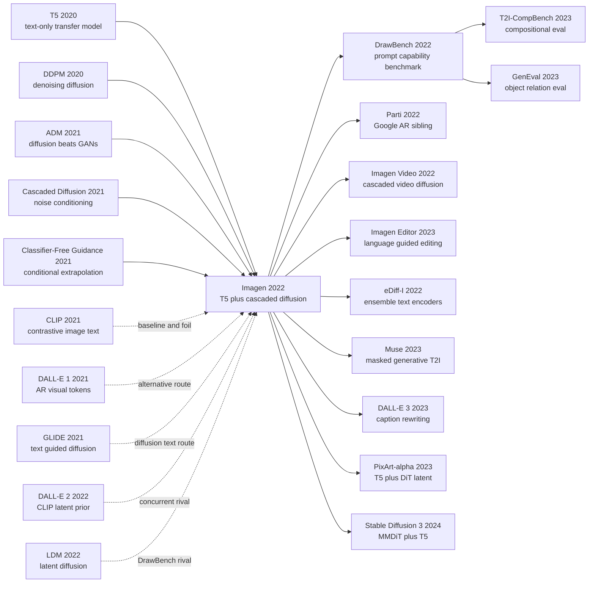

# Imagen — Cascaded Text-to-Image Diffusion with Deep Language Understanding

> On May 23, 2022, Google Research's Brain Team posted [arXiv:2205.11487](https://arxiv.org/abs/2205.11487), and Imagen made a quietly radical bet: do not solve text-to-image generation by only making the image generator bigger; outsource the hardest part, reading the prompt, to a frozen T5-XXL language model. Its strongest result was not merely the zero-shot COCO FID of 7.27. It was the ablation showing that scaling the text encoder improved fidelity and alignment more than scaling the U-Net, and the DrawBench comparisons that exposed how brittle earlier systems were on compositional language, spatial relations, quoted text, and unusual prompts. Imagen turned the 2022 text-to-image race from “which model paints the sharpest image?” into “which model actually understands the sentence?”

## TL;DR

Imagen, from Saharia, Chan, Saxena and 11 other Google Research Brain Team authors in 2022, decomposed text-to-image generation into “let a frozen large language model read the prompt, then let cascaded diffusion render the pixels.” A frozen T5-XXL encodes the text into a sequence of embeddings; a 64×64 base diffusion model produces the first image; two text-conditional super-resolution diffusion models upsample it to 256×256 and 1024×1024. The denoising objective remains the standard diffusion loss $\mathbb{E}\|x_\theta(\alpha_t x+\sigma_t\epsilon,c)-x\|_2^2$, sampling relies on classifier-free guidance $\tilde\epsilon=w\epsilon(z_t,c)+(1-w)\epsilon(z_t)$, and dynamic thresholding prevents large guidance weights from pushing the predicted $\hat{x}_0$ outside the training range $[-1,1]$. Imagen did not defeat just one baseline; it challenged three assumptions of the 2021 text-to-image field: GAN/autoregressive systems were brittle on complex language, [DALL-E 2](https://arxiv.org/abs/2204.06125) still had CLIP-latent binding failures, and [Stable Diffusion / LDM](2022_stable_diffusion.md) showed that a CLIP text encoder was not enough for deep compositional understanding. The paper reported zero-shot COCO FID-30K of 7.27, ahead of GLIDE at 12.24 and DALL-E 2 at 10.39, but its more durable contribution was DrawBench: a human-evaluated prompt suite for color binding, counting, spatial relations, long descriptions, misspellings, rare words, and quoted text. The hidden lesson is that text-to-image bottlenecks are not only in the diffusion backbone; they are also in how much language the system actually understands. Later systems such as [DALL-E 3](https://openai.com/dall-e-3), PixArt-alpha, and [Stable Diffusion 3](https://arxiv.org/abs/2403.03206) all continue along the Imagen line: stronger text encoders, better captions, and a generator that follows language rather than merely decorating it.

---

## Historical Context

### 2021-2022: text-to-image moved from demos to foundation-model competition

When Imagen appeared, text-to-image generation had just moved from “attractive demos on narrow datasets” into a foundation-model race among the largest labs. From 2016 to 2020 the dominant route was still GAN-based: StackGAN, AttnGAN, DM-GAN, and XMC-GAN kept pushing COCO FID down, but they depended on paired image-text data, specialized losses, and complicated discriminators, and they remained brittle on long prompts, attribute binding, and rare words. In 2021 [DALL-E](2021_dalle.md) reframed the problem as autoregressive language modeling over discrete visual tokens, proving that internet-scale image-text pairs plus a large Transformer could generate open-domain images. [CLIP](2021_clip.md), released the same day, gave those generations a powerful text-image similarity judge. Yet DALL-E 1 was still slow, blurry, and unreliable on complex semantic binding.

Diffusion matured on a parallel track. [DDPM](2020_ddpm.md) turned image synthesis into iterative denoising, while ADM and GLIDE showed that diffusion could beat GANs on photographic fidelity. By late 2021, GLIDE was already a strong text-guided diffusion system: classifier-free guidance made prompts visibly steer samples, and “diffusion plus text conditioning” became the next mainstream recipe. But GLIDE still leaned on text encoders trained around image-text data. It could draw better pictures without necessarily reading complicated sentences deeply.

| Thread | State of the field | Bottleneck | Imagen's answer |
|---|---|---|---|
| GAN text-to-image | AttnGAN / DM-GAN / XMC-GAN pushed COCO | weak long-prompt and compositional semantics | switch the generator to diffusion |
| Autoregressive text-to-image | DALL-E 1 used dVAE tokens + 12B Transformer | slow sampling and weak fine detail | do not center the discrete AR route |
| Diffusion text-to-image | GLIDE / DALL-E 2 proved the quality path | text encoding stayed visually contrastive | let frozen T5 read language |
| Evaluation | COCO FID + CLIP score became default | COCO captions are short and CLIP cannot count | introduce DrawBench |

### Google Brain's route: outsource language understanding to T5

Google Research's advantage was not only TPUs and image data; at the same moment it had T5, PaLM, C4, and a deep language-model scaling culture. Imagen's central bet therefore made sense: if a prompt is fundamentally a natural-language understanding problem, why rely only on a CLIP text encoder trained with image-text contrast? CLIP is excellent at judging whether an image and a sentence match, but it is not necessarily the best parser for long descriptions, negation, spatial relations, rare words, misspellings, or quoted text. T5 never saw images during pretraining, yet it learned finer syntactic and semantic structure from large-scale text.

That choice also split Imagen from contemporary DALL-E 2. DALL-E 2 builds a prior from text to CLIP image embeddings and then uses a diffusion decoder to generate images. Imagen removes that CLIP-latent middle layer and directly conditions diffusion on the T5-XXL text sequence through cross-attention. The design looks simpler, but it lets the paper ask a sharper question: **is text-to-image quality limited more by text-encoder scale than by image-generator scale?** The answer was yes, and that answer later shaped PixArt, SD3, DALL-E 3, and multi-encoder production recipes.

### The evaluation climate: COCO FID was no longer enough

Before 2022, many text-to-image papers still treated MS-COCO FID as the main arena. COCO is public, reproducible, and historically rich in baselines; it is also limited. Captions are usually short, objects are common, compositional prompts are rare, and the dataset does not strongly expose failures in language understanding. CLIP score adds another complication: it can reward images that CLIP thinks match the prompt, not necessarily images that humans judge as semantically faithful.

DrawBench was Imagen's answer to that gap. It contains only about 200 prompts, but they are organized into 11 capability categories: colors, counting, spatial position, rare words, misspellings, long descriptions, quoted text, and difficult or unusual compositions. For each prompt, human raters compare two sets of 8 random generated images and judge both fidelity and text alignment. The point is not scale; the point is pressure. DrawBench deliberately presses on the language-understanding wounds that COCO misses.

## Background and Motivation

### The core problem: fidelity, binding, and evaluation were all stuck

Imagen is not solving the vague problem “can we generate nice images?” It attacks three simultaneous bottlenecks. First, the image generator needs diffusion-level fidelity. Second, the text condition must preserve the full token sequence rather than compressing the sentence into a vague vector. Third, the evaluation must distinguish “looks photographic” from “actually followed the prompt.” Without the first, the model understands language but draws poorly; without the second, it draws only the broad topic; without the third, a paper can win on COCO FID while hiding its semantic failures.

| Bottleneck | Older practice | Failure mode | Imagen's motivation |
|---|---|---|---|
| Image fidelity | GAN or AR tokens | weak local detail and coverage | use diffusion as the generator |
| Text understanding | CLIP / pooled embedding | attribute, long-prompt, spatial failures | freeze T5-XXL and keep token sequence |
| High resolution | direct single-stage generation | expensive training and unstable detail | cascade 64→256→1024 super-resolution |
| Conditioning strength | small guidance weights | weak prompt following | dynamic thresholding enables high guidance |
| Evaluation | COCO FID / CLIP score | misses language-understanding differences | DrawBench plus human preference |

### Imagen's bet: freeze the language model, let cascaded diffusion handle pixels

Architecturally, Imagen is restrained. It does not train a new end-to-end image-text foundation model, and it does not introduce a complicated latent prior. The system has three parts: a frozen T5-XXL reads the prompt into token embeddings; a 64×64 base diffusion model generates the coarse image; two text-conditional super-resolution diffusion models progressively upsample to 1024×1024. All three diffusion stages see the same text embeddings and use classifier-free guidance; the super-resolution models additionally use noise conditioning augmentation so they remain robust to artifacts from lower-resolution stages.

The paper's historical standing comes from the clarity of this restrained design. Once diffusion is strong enough, much of the ceiling in text-to-image generation moves into the text encoder. T5-XXL was never trained on image-text pairs, yet it handled the complex prompts in DrawBench better than CLIP. That was not obvious in 2022, because CLIP looked like the “visual semantics” model. Imagen reminded the field that **prompt following is not an auxiliary image task; it is language understanding itself.**

---

## Method Deep Dive

### Overall framework

Imagen can be compressed into one sentence: **freeze T5-XXL to read the prompt, let a 64×64 diffusion model build the semantic layout, then use two text-conditional super-resolution diffusion models to fill in detail until the image reaches 1024×1024.** It is not latent diffusion: the main generation path is a pixel-space diffusion cascade. It is also not DALL-E 2's CLIP-image-embedding prior: the text sequence directly enters each diffusion stage through cross-attention.

| Stage | Input | Output | Key condition |
|---|---|---|---|
| Text encoder | prompt | T5-XXL token embeddings | frozen, cacheable offline |
| Base diffusion | noise + text | 64×64 image | text cross-attention + CFG |
| SR diffusion 1 | 64×64 image + text | 256×256 image | noise conditioning augmentation |
| SR diffusion 2 | 256×256 image + text | 1024×1024 image | text cross-attention, no self-attention |

The base diffusion objective follows the standard denoising-diffusion form. Given image $x$, text condition $c$, noise $\epsilon$, and time $t$, the model learns to predict the clean image, or an equivalent noise parameterization, from the noised sample $z_t=\alpha_t x+\sigma_t\epsilon$:

$$
\mathcal{L}=\mathbb{E}_{x,c,\epsilon,t}\left[w_t\left\|x_\theta(\alpha_t x+\sigma_t\epsilon,c)-x\right\|_2^2\right].
$$

The default implementation is heavy. The 64×64 base model has roughly 2B parameters; the 64×64→256×256 super-resolution model has roughly 600M; the 256×256→1024×1024 model has roughly 400M. All three train for 2.5M steps with batch size 2048; the base model uses 256 TPU-v4 chips, and each super-resolution model uses 128 TPU-v4 chips. The training mix is about 460M internal image-text pairs plus about 400M LAION image-text pairs.

### Key design 1: frozen T5-XXL text encoder

**Function**: separate prompt understanding from image generation and give it to a large language model pretrained on text-only data. Imagen does not fine-tune T5; it uses encoder-side contextual embeddings directly. This makes embeddings cacheable offline, adds negligible memory and compute to diffusion training, and avoids letting image losses distort the language model's semantic structure.

| Text encoder | Pretraining data | Scale | Imagen finding |
|---|---|---|---|
| BERT base/large | Wikipedia + BooksCorpus, about 20GB | up to 340M | usable, but under-scaled |
| CLIP ViT-L/14 text | image-text contrastive data | strong visual semantics | close on COCO, worse on DrawBench |
| T5 small/base/large/XL | C4 text-only corpus | progressively larger | larger scale improves FID/CLIP curves |
| T5-XXL | C4 text-only corpus | 4.6B in the paper's setting | best DrawBench alignment and fidelity |

The counter-intuition is that T5 never learned what an image is, yet it tells the generator what a sentence means better than CLIP. Figure 4 and Appendix D.1 both emphasize that scaling the text encoder helps more than scaling the 64×64 U-Net. T5-XXL and CLIP can look similar on COCO automatic metrics, but human raters prefer T5-XXL on DrawBench across all 11 categories, especially for image-text alignment.

**Design rationale**: the hard part of a prompt is not whether each word is visualizable; it is whether relationships among words survive. Prompts like `a small blue object on a large red object` require attribute binding, quoted text requires character-level constraint, and long descriptions require syntax. CLIP's global contrastive objective tends to learn “what is in the image”; T5's denoising language objective tends to learn “how the sentence organizes meaning.” Imagen turns that distinction into measurable system gain.

### Key design 2: sequence-level cross-attention, not pooled text

**Function**: preserve the full token sequence and let U-Net features read from it at multiple resolutions. The base model adds text cross-attention at 32, 16, and 8 resolutions, while also using an attention-pooled text vector in the timestep embedding. The super-resolution models keep text cross-attention as well; the 256→1024 stage removes self-attention but still keeps text attention.

The cross-attention operation is:

$$
\operatorname{Attn}(Q,K,V)=\operatorname{softmax}\left(\frac{QK^\top}{\sqrt d}\right)V,\quad Q=W_Q\phi_i(z_t),\quad K=W_K\tau(y),\quad V=W_V\tau(y).
$$

Here $\phi_i(z_t)$ is the image feature map at U-Net level $i$, and $\tau(y)$ is the T5 token embedding sequence. Attention explicitly models which part of the prompt a spatial feature should query at a given denoising stage, making it better suited for attribute binding and spatial relations than mean pooling or attention pooling into a single vector.

| Conditioning method | Information shape | Failure point | Paper conclusion |
|---|---|---|---|
| Mean pooling | one global vector | token relations are flattened | weak FID/CLIP Pareto curve |
| Attention pooling | one learned global vector | still no location-wise reading | better than mean, weaker than cross-attn |
| Cross-attention | full sequence as K/V | slightly more compute | best alignment and fidelity |
| Cross-attn + LayerNorm | stabilized full sequence | more stable training | Imagen default |

**Design rationale**: text-to-image is not classification. Classification can compress a sentence into a label-like embedding; generation needs each spatial region to repeatedly query the text at different denoising stages. Imagen's cross-attention turns language from a “conditioning label” into “context that image features can retrieve.” This is the interface later retained by SD, PixArt, and SD3.

### Key design 3: high guidance weights and dynamic thresholding

Classifier-free guidance is central to Imagen sampling. During training, all three diffusion stages zero the text embedding with 10% probability, so one network learns both conditional and unconditional distributions. During sampling, conditional and unconditional predictions are linearly extrapolated:

$$
\tilde{\epsilon}_\theta(z_t,c)=w\,\epsilon_\theta(z_t,c)+(1-w)\,\epsilon_\theta(z_t),\quad w>1.
$$

Large $w$ improves prompt following but creates a train-test mismatch. Training images are normalized to $[-1,1]$, while large guidance can push the predicted $\hat{x}_0$ outside that range, producing oversaturated images, blank samples, or divergence. Static clipping prevents blanks, but colors and textures still become stiff. Imagen's dynamic thresholding computes a high percentile $s$ of $|\hat{x}_0|$ at every sampling step, then rescales the prediction into a valid range:

$$
s=\max\left(1,\operatorname{percentile}(|\hat{x}_0|,p)\right),\quad \hat{x}_0\leftarrow \operatorname{clip}(\hat{x}_0,-s,s)/s.
$$

| Sampling method | Behavior under high guidance | Image result | Imagen judgment |
|---|---|---|---|
| No thresholding | many $\hat{x}_0$ values leave range | blank, oversaturated, divergent | unusable |
| Static thresholding | directly clip to $[-1,1]$ | stable but stiff detail | necessary but insufficient |
| Dynamic thresholding | percentile-wise rescale per sample | better fidelity and alignment | default choice |

```python
def imagen_sample(z_t, text, guidance_weight, percentile=99.5):
    for timestep in reversed(schedule):
        eps_cond = unet(z_t, timestep, text)
        eps_uncond = unet(z_t, timestep, empty_text)
        eps = guidance_weight * eps_cond + (1.0 - guidance_weight) * eps_uncond
        x0 = predict_x0(z_t, eps, timestep)
        scale = percentile_abs(x0, percentile).clamp(min=1.0)
        x0 = x0.clamp(-scale, scale) / scale
        z_t = sampler_step(z_t, x0, timestep)
    return x0
```

**Design rationale**: Imagen wants higher guidance weights for stronger text alignment, but it cannot accept the side effect where more alignment means more synthetic-looking images. Dynamic thresholding is elegant because it leaves the training objective untouched and only repairs the numerical boundary of the sampling distribution. It turns high guidance from a disaster switch into a usable knob.

### Key design 4: robust cascaded super-resolution and Efficient U-Net

**Function**: split generation into three resolutions rather than forcing one model to generate 1024×1024 directly. The 64×64 base model handles global layout and semantics; the 64→256 and 256→1024 super-resolution models handle texture, edges, and high-frequency detail. Both SR stages use noise conditioning augmentation: training randomly corrupts the low-resolution condition and tells the model the corruption strength as `aug_level`; inference can sweep `aug_level`, letting the SR models both correct lower-resolution artifacts and follow text for style or detail changes.

| Component | Design | Why it matters | Cost |
|---|---|---|---|
| Cascaded diffusion | 64→256→1024 | high-resolution generation is more stable | three sequential models |
| Noise conditioning augmentation | corrupt low-res condition and expose noise level | SR model becomes robust | one extra inference hyperparameter |
| Efficient U-Net | shift capacity into low-resolution blocks | lower memory, faster convergence | architecture rewrite |
| Text cross-attn in SR | SR stages still read text | details can follow the prompt | modest extra compute |

Efficient U-Net shifts model capacity away from high-resolution blocks and into lower-resolution blocks, where more residual blocks are cheaper. Skip connections are scaled by 1/2 to stabilize deeper residual paths, and the order of downsampling/upsampling operations and convolutions is reversed to improve forward speed. The paper reports 2-3× faster sampling than earlier U-Net implementations on the 64→256 super-resolution task, with faster convergence as well.

**Design rationale**: if the base model already sets global semantics, a super-resolution model should not be a blind enlarger. Imagen makes SR text-conditional so high-frequency detail remains language-controlled; noise augmentation prevents the SR model from over-trusting mistakes in the 64×64 input. This detail explains why Imagen can keep prompt semantics at 1024×1024 rather than merely generating attractive texture.

### Design comparison: why Imagen is not DALL-E 2 or LDM

Imagen is often simplified as “Google's DALL-E 2,” but the technical route differs. DALL-E 2 uses CLIP image embeddings as the intermediate variable: learn a text-to-image-embedding prior, then decode with diffusion. LDM / Stable Diffusion uses a VAE latent as the intermediate variable: compress the image, then denoise in latent space. Imagen's intermediate variable is almost just language itself: T5 provides the token sequence, and cascaded diffusion directly generates and upsamples in pixel space.

| Model | Text interface | Image generation space | Historical advantage | Main cost |
|---|---|---|---|---|
| DALL-E 2 | CLIP text/image latent prior | pixel diffusion decoder | strong image quality | complex prior + decoder stack |
| LDM / Stable Diffusion | CLIP text encoder | VAE latent diffusion | deployable, open ecosystem | weaker text understanding than T5 |
| Imagen | frozen T5-XXL sequence | pixel cascaded diffusion | strong prompt understanding and fidelity | closed, heavy three-model inference |
| Parti | seq2seq Transformer | VQGAN token AR | unified scaling | 20B parameters and slow sampling |

Imagen's core contribution is therefore not “another diffusion text-to-image model.” It relocates the central bottleneck: language understanding should not be learned casually by the generator; it should be supplied by a sufficiently strong frozen language model. That framing outlived the specific pixel cascade.

---

## Failed Baselines

### Failure case 1: the COCO GAN stack hit the open-language boundary

Before Imagen, AttnGAN, DM-GAN, DF-GAN, XMC-GAN, and LAFITE had all improved COCO text-to-image generation. But their worldview was still “synthesize images inside a relatively fixed caption distribution.” The problem was not only worse FID. Their capability was bounded by COCO captions themselves. COCO rarely forces a model to handle long sentences, conflicting interactions, text rendering, rare words, or precise spatial relations; a GAN that looks competitive on COCO can fail immediately on open-domain prompts because semantic composition, mode coverage, and detail stability are weak.

| Baseline | Representative method | Strength | Where Imagen beats it | Key number |
|---|---|---|---|---|
| GAN + attention | AttnGAN | early caption-to-image | weak photorealism and composition | COCO FID 35.49 |
| GAN + memory | DM-GAN | local-detail enhancement | still narrow-caption dependent | COCO FID 32.64 |
| Deep fusion GAN | DF-GAN | simpler training | weak open-domain prompts | COCO FID 21.42 |
| Contrastive GAN | XMC-GAN / LAFITE | COCO FID near 10 | lacks diffusion coverage and detail | 9.33 / 8.12 |
| Scene prior | Make-A-Scene | layout prior | trained directly on COCO | COCO-trained FID 7.55 |

Imagen's verdict on the GAN route is not merely “FID is lower.” It says that open-domain text-to-image generation requires language, composition, and photographic detail at once, and local discriminators plus task-specific structures were becoming hard to scale.

### Failure case 2: CLIP/AR routes could generate without deeply reading

DALL-E 1 remains historically important because it first made open-domain text-to-image look like large-scale token language modeling. From Imagen's perspective, however, DALL-E 1 exposed two weaknesses of the discrete autoregressive route: long sequential sampling and insufficient fine detail after visual-token compression. It could compose concepts, but it did not deliver photographic realism.

DALL-E 2 was the stronger rival. It used CLIP latents to bridge text and image, and its quality was already high. Imagen's DrawBench comparisons nevertheless exposed language failures: color binding, spatial relations, quoted text, and complex descriptions were categories where human raters preferred Imagen. The appendix specifically notes that DALL-E 2 struggled more with assigning colors to multiple objects and rendering prompted text. CLIP latent space is a powerful visual-semantic space, but not a full language parser.

GLIDE proved the diffusion route but not the text encoder. Its quality and editing capability were already close to modern text-to-image, but DrawBench still showed Imagen ahead of GLIDE in 8 of 11 alignment categories and 10 of 11 fidelity categories. In other words, GLIDE did not lose on diffusion; it lost because its language-understanding layer was weaker than Imagen's T5-XXL.

### Failure case 3: small text encoders and pooled text were not enough

Imagen's internal ablations are more valuable than many external baselines. The paper compares BERT, different T5 sizes, and the CLIP text encoder; it also compares mean pooling, attention pooling, and cross-attention. The result is clean: larger text encoders improve the FID/CLIP Pareto curve; T5-XXL and CLIP can look close on COCO automatic metrics, but human raters strongly prefer T5-XXL on DrawBench; compressing the text sequence into a pooled embedding loses to cross-attention.

This failure case matters because it rules out the easy explanation “Google just used more compute.” Scaling the U-Net helps, but scaling the text encoder helps more; cross-attention costs more, but it preserves token relations in the prompt. What Imagen really proves is that text-to-image is not “a generator plus a text label.” It is a coupled system: language model plus conditional generator.

### The assumptions that actually broke

1. **“Image-text contrastive models are naturally the best prompt encoders”**: CLIP is strong for retrieval, but DrawBench exposed its weaknesses on syntax and binding.
2. **“COCO FID is enough to represent text-to-image capability”**: Imagen wins on COCO, but the paper matters more because DrawBench reveals dimensions COCO cannot test.
3. **“Making the diffusion model bigger matters most”**: the ablations show text-encoder scale has stronger returns than U-Net scale.
4. **“Super-resolution is just post-processing”**: Imagen's SR models still read text and use noise augmentation, so high-resolution detail remains language-conditioned.
5. **“A public demo or open-source release is required for paper impact”**: Imagen released neither code nor demo at the time, yet its method and benchmark shaped later closed and open systems.

---

## Key Experimental Data

### COCO: what FID 7.27 meant

Imagen reports 7.27 on MS-COCO 256×256 zero-shot FID-30K. That number has two meanings. First, it beats all contemporary zero-shot baselines. Second, it even beats some methods trained directly on COCO, such as Make-A-Scene at 7.55. This is not proof that Imagen solved text-to-image generation, because COCO remains simple. It is more like an admission ticket: Imagen did not sacrifice standard quality, so the paper can then move attention to DrawBench.

| Method | Trained on COCO | FID-30K ↓ | Note |
|---|---|---:|---|
| AttnGAN | yes | 35.49 | early attention GAN |
| DM-GAN | yes | 32.64 | dynamic memory GAN |
| DF-GAN | yes | 21.42 | deep fusion GAN |
| XMC-GAN | yes | 9.33 | contrastive GAN |
| LAFITE | yes | 8.12 | language-free training |
| Make-A-Scene | yes | 7.55 | scene prior |
| DALL-E 1 | no | 17.89 | autoregressive token model |
| GLIDE | no | 12.24 | text-guided diffusion |
| DALL-E 2 | no | 10.39 | CLIP-latent diffusion |
| **Imagen** | **no** | **7.27** | T5 + cascaded diffusion |

The COCO human evaluation adds nuance. Reference-image photorealism preference is defined as 50%, while Imagen receives about 39.5%; after filtering prompts that contain people, Imagen rises to about 43.9%. On caption similarity, reference images score about 91.9 and Imagen about 91.4; on the no-people subset, reference images score about 92.2 and Imagen about 92.1. This means Imagen's text alignment is almost on par with COCO references, while people generation remains a visible weakness.

| Evaluation | Reference | Imagen | Interpretation |
|---|---:|---:|---|
| Image quality preference | 50.0% | 39.5% | close but not equal to real images |
| Caption similarity | 91.9 | 91.4 | nearly matched text alignment |
| No-people quality preference | 50.0% | 43.9% | people are a quality drag |
| No-people caption similarity | 92.2 | 92.1 | strong non-people prompt alignment |

### DrawBench: forcing language understanding into view

DrawBench is small but sharp. It has about 200 prompts in 11 categories, and each prompt is evaluated by comparing two models with 8 random samples per side. The main paper shows that in pairwise human evaluation against DALL-E 2, GLIDE, VQ-GAN+CLIP, and Latent Diffusion, Imagen is clearly preferred overall on both image fidelity and image-text alignment. The appendix further reports that Imagen is ahead of DALL-E 2 in 7 of 11 alignment categories and all 11 fidelity categories, and ahead of GLIDE in 8 of 11 alignment categories and 10 of 11 fidelity categories.

| DrawBench category | What it probes | Why COCO is insufficient | Imagen significance |
|---|---|---|---|
| Colors / Counting | attribute and number binding | COCO rarely requires precision | tests token relations |
| Positional | spatial relations | captions usually name objects, not layouts | tests syntax understanding |
| Text | quoted text rendering | COCO barely tests writing | exposes vision-language gap |
| Rare words / Misspellings | lexical robustness | common words dominate | tests language-model prior |
| Long descriptions | long-range dependencies | COCO captions are short | tests full-sequence conditioning |

DrawBench's historical value is that it made “prompt following” experimentally discussable. Later T2I-CompBench, GenEval, DALL-E 3 caption rewriting, and SD3's multiple text encoders all continue the problem framing that DrawBench made visible.

### Ablations: which designs were actually necessary

Imagen's ablations give several conclusions that later systems directly inherited. First, larger T5 variants work better, with T5-XXL strongest. Second, text-encoder scale is more effective than U-Net scale. Third, dynamic thresholding is the key to using large guidance weights. Fourth, noise conditioning augmentation matters for super-resolution. Fifth, cross-attention clearly beats pooled text.

| Ablation target | Comparison | Observation | Later impact |
|---|---|---|---|
| Text encoder size | T5 small → T5-XXL | scale improves fidelity and alignment | large text encoders become default direction |
| Text encoder family | T5-XXL vs CLIP | close on COCO, T5 wins DrawBench | SD3 / PixArt add T5 |
| U-Net size | 300M → 2B | useful, but weaker than text scale | generator scale is not the only bottleneck |
| Thresholding | none/static/dynamic | dynamic supports high guidance | CFG sampling becomes more stable |
| SR augmentation | no noise vs noise conditioning | noisy training improves robustness | standard cascaded-diffusion trick |
| Text conditioning | pooling vs cross-attention | cross-attn is best | becomes mainstream interface |

### Training scale and the non-release decision

Imagen is large-scale industrial research, not a small academic model. The default setup trains a 2B base model, a 600M SR model, and a 400M SR model, all for 2.5M steps with batch size 2048. The data mix contains roughly 860M image-text pairs, including internal data and LAION. That scale explains why Imagen could lead on quality, and also why it did not form an open-source ecosystem like Stable Diffusion.

| Component | Parameters | Training resource | Note |
|---|---:|---|---|
| 64×64 base diffusion | 2B | 256 TPU-v4 chips | Adafactor, text cross-attn |
| 64→256 SR diffusion | 600M | 128 TPU-v4 chips | Efficient U-Net |
| 256→1024 SR diffusion | 400M | 128 TPU-v4 chips | no self-attn, text cross-attn retained |
| Data | about 860M pairs | internal data + LAION | bias and safety risks |

The non-release decision is part of the experimental story. The paper explicitly says it did not release code or a public demo because the training data includes web-scraped content, LAION-400M had been audited for harmful content, and the model still had serious limitations around people and social bias. This gives Imagen a distinctive historical position: enormous methodological influence, deliberately restrained deployment.

---

## Idea Lineage



### Pre-history: what forced Imagen into existence

Imagen has two pre-histories. The first is the diffusion-generation line: DDPM proved the denoising objective, ADM proved diffusion could beat GANs on ImageNet, Cascaded Diffusion Models showed that 64→256-style super-resolution cascades can reliably produce high-fidelity images, and Classifier-Free Guidance showed that conditional sampling can be strengthened without an external classifier. These works gave Imagen its pixel-generation engine.

The second line is language understanding: T5 showed that text-to-text transfer on C4 could learn general language representations; CLIP showed that contrastive image-text training can place vision and language in a shared space; DALL-E 1 showed that open-domain image-text pairs could drive a generator; GLIDE showed that text-guided diffusion is better suited to photographic synthesis than GAN/AR systems. Imagen's distinctive move was to combine the two lines and choose T5, not CLIP, as the core text interface.

### Afterlife: who inherited the idea

Imagen's direct descendants fall into two groups. Google's internal route includes Parti, Imagen Video, Imagen Editor, Muse, and later Imagen 2: they continue the “large model + high-quality generation + strict safety gate” style, even as the generator changes among AR, masked tokens, and diffusion. The external route is more interesting: PixArt-alpha and Stable Diffusion 3 both absorb Imagen's lesson by adding T5 to text-to-image systems, acknowledging that CLIP-only text encoders are not enough for complex prompts.

DrawBench had an equally durable afterlife. It is not the largest benchmark, but it moved text-to-image evaluation away from “COCO FID” and toward questions such as: can the model count, bind colors, understand spatial relations, and render words that appear in the prompt? Later evaluations such as T2I-CompBench, GenEval, and DPG-Bench inherit this idea of decomposing prompt following into capability dimensions.

### Misreadings and simplifications

- **“Imagen is just Google's DALL-E 2”**: DALL-E 2 centers on a CLIP latent prior; Imagen centers on frozen T5 plus a pixel diffusion cascade. Both produce 1024×1024 images, but the information bottlenecks are different.
- **“FID 7.27 is the paper's main contribution”**: FID only proves Imagen did not fall behind on the standard metric. The text-encoder scaling result and DrawBench mattered more for later system design.
- **“T5 wins only because it is larger”**: size matters, but the crucial point is that T5's text-only denoising pretraining preserves syntax and composition better; CLIP can compress complex relations into retrieval-friendly semantics.
- **“Cascaded diffusion is the final answer”**: the cascade worked in 2022, but latent diffusion, DiT, and rectified flow later changed the generation path. What survived is the division of labor: strong language encoder plus language-conditioned generator.
- **“Not releasing the model reduced its influence”**: it limited ecosystem growth, but it did not prevent the paper from shaping methods and evaluation. Imagen is one of the rare text-to-image papers that changed open systems without itself being open.

### The lineage lesson

Imagen's lesson can be written in one sentence: **once the generator is strong enough, the bottleneck in prompt following returns to language understanding.** This explains why DALL-E 3 rewrites captions with a stronger model, why SD3 combines CLIP and T5, why PixArt-alpha trains DiT with T5 conditioning, and why post-2023 text-to-image evaluation increasingly focuses on compositionality. Imagen was not the beginning of the open ecosystem, but it was the clean beginning of the industrial rule that text encoders can set the ceiling for generation.

---

## Modern Perspective

### Assumptions that no longer hold

Looking back from 2026, many Imagen judgments still hold, but several assumptions that were reasonable in 2022 have been rewritten by later systems.

| 2022 assumption | Why it made sense then | Today's problem | Later correction |
|---|---|---|---|
| Pixel-space cascade is the highest-quality route | Imagen / DALL-E 2 both used 64→1024 cascades | three-model inference is heavy and hard to deploy | latent diffusion + DiT / flow |
| One T5 text encoder is enough | T5-XXL clearly beat CLIP on DrawBench | visual style and retrieval semantics still need CLIP | SD3-style multiple text encoders |
| COCO + DrawBench cover most capability | DrawBench probes deeper than COCO | still lacks systematic counting, spatial, bias, OCR quantification | GenEval / T2I-CompBench / DPG-Bench |
| Dynamic thresholding is the main high-guidance fix | it kept high CFG from breaking samples | high CFG still sacrifices diversity and naturalness | CFG distillation / guidance-free flow |
| Non-release is the only responsible option | data and bias risks were real | external auditing also needs model access | tiered access, red teaming, safety evaluation, data docs |

The most durable conclusion is the first-principles one: text encoders matter. Production systems no longer treat CLIP-only conditioning as the endpoint. SD3 uses CLIP-L, OpenCLIP-G, and T5-XXL together; PixArt-alpha trains DiT with T5 conditioning; DALL-E 3 uses a stronger language model to rewrite user prompts into detailed captions. All of them acknowledge Imagen's diagnosis in different ways: the stronger the generator becomes, the more the language interface sets the ceiling.

### What history proved essential vs incidental

Imagen's essential proof was not “pixel cascaded diffusion is always best.” It was “a strong language model can be an independent core component of a text-to-image system.” That has aged well. DrawBench also aged well: serious text-to-image systems are now asked about color binding, counting, position, text rendering, and long prompts, not only shown attractive samples.

What looks more incidental is the exact engineering path. Three-stage pixel cascades are acceptable inside closed large-model systems, but poor fits for local deployment and community ecosystems. Dynamic thresholding is practical, but later flow matching, distillation, and better parameterizations made “high CFG plus boundary repair” only one option. Efficient U-Net was a strong super-resolution architecture in 2022, but DiT / MMDiT moved backbone scaling toward Transformers.

### If rewritten today

If Imagen were rewritten in 2026, a modern version probably would not preserve the exact three-model pixel cascade. It would preserve the division of labor between language and generation, then replace the generator and training recipe.

| Module | 2022 Imagen | 2026 rewrite | Reason |
|---|---|---|---|
| Text encoder | frozen T5-XXL | T5/LLM + CLIP/OpenCLIP ensemble | preserve syntax, world knowledge, and visual retrieval semantics |
| Generator | pixel cascaded diffusion | latent DiT / MMDiT + rectified flow | easier scaling and deployment |
| Prompt data | raw alt-text + internal filtering | VLM/LLM rewritten captions + data cards | prompt following depends on caption quality |
| Guidance | CFG + dynamic thresholding | distillable guidance or flow guidance | reduce sampling steps and oversaturation |
| Evaluation | COCO + DrawBench | DrawBench + GenEval + bias/OCR/long-prompt suites | cover real failure modes more systematically |

This does not weaken Imagen. Quite the opposite: later systems replaced the pixel cascade while preserving its lesson about text encoders. A method becomes classic not because every module is copied forever, but because the bottleneck it identified remains unavoidable years later.

---

## Limitations and Future Directions

### Limitations acknowledged by the authors

Imagen's limitations section is more serious than many generative-model papers from 2022. The authors explicitly say they did not release code or a public demo because text-to-image systems can be used for harassment, misinformation, and other misuse; the training data comes from large web-scale image-text pairs that are not fully curated or audited; LAION-400M had already been externally audited for inappropriate content, harmful language, and stereotypes; and the model inherits biases from large language models.

| Limitation | Paper description | Why it matters | Later issue |
|---|---|---|---|
| Web data bias | LAION and internal web data include harmful content | generation can reproduce or amplify bias | copyright, consent, and data governance |
| People generation | quality preference drops when people are included | face and identity errors are high-risk | safety filters and identity protection |
| Social stereotypes | lighter skin tone / Western gender stereotypes | representational harm | bias evaluation remains immature |
| No public release | code/demo withheld to reduce misuse | responsible but limits external auditing | need for tiered-access mechanisms |
| Evaluation gaps | social-bias evaluation methods are insufficient | COCO/DrawBench cannot cover safety | growth of safety benchmarks |

### New limitations visible from 2026

From today's perspective, Imagen also has limitations the authors could not fully unfold. First, closed access lets the method be studied but leaves social-risk assessment mostly internal, which is not enough for AI safety. Second, pixel cascaded diffusion is too expensive for the kind of community modification ecosystem that made Stable Diffusion culturally important. Third, DrawBench is pioneering but small, expensive to evaluate with humans, and hard to use as a continuous regression test. Fourth, T5-XXL reads language well, but if training captions are short or noisy, the generator still receives weak supervision.

Those limitations point directly to later directions: more transparent data documentation, licensed training data, auditable tiered model access, synthetic caption rewriting, finer-grained prompt-following benchmarks, and flow or distillation methods that preserve alignment with fewer sampling steps. Imagen was a closed research system, but the questions it raised became questions the open ecosystem also had to answer.

---

## Related Work and Insights

### Relationship to contemporary models

| Model | Relationship to Imagen | Where Imagen wins | Where Imagen loses |
|---|---|---|---|
| DALL-E 1 | early open-domain AR text-to-image | much better fidelity and alignment | DALL-E 1 is more unified as token LM |
| GLIDE | text-guided diffusion predecessor | stronger T5-based DrawBench alignment | GLIDE is closer to an editing system |
| DALL-E 2 | strongest closed contemporary rival | COCO FID and DrawBench preference | CLIP latent path helps editing/variation |
| LDM / Stable Diffusion | same-year open route | stronger language understanding | LDM/SD wins deployment and ecosystem |
| Parti | Google sibling AR route | more natural image quality via diffusion | Parti shows unified sequence-model scaling |

The comparison with Stable Diffusion is especially important. Imagen represents “closed high quality + strong language encoder + safety brake”; Stable Diffusion represents “deployable good-enough quality + open weights + community extension.” After 2022, the field starts fusing the two: SD3 borrows Imagen's T5 lesson, while closed models borrow controllability and tool-chain ideas from the SD ecosystem.

### Methodological insights

Imagen gives researchers three durable insights. First, **do not treat conditioning as an accessory module**: once the generator is strong, the condition encoder's pretraining objective, scale, and output structure can become the main bottleneck. Second, **evaluation should press on the system's weakest joint**: DrawBench is not large, but its prompts are well-targeted, giving it more conceptual force than many broad metrics. Third, **safety choices change how technology diffuses**: Imagen did not open-source, but its paper and benchmark diffused; Stable Diffusion open-sourced and diffused through an ecosystem. Both paths shaped the generative-model era.

For modern multimodal generation, Imagen's most transferable principle is: ask whether the condition is understood before asking whether the generator is large enough. That applies to images, video, audio, 3D, robot trajectories, and molecular generation. The more complex the conditioning signal, the less acceptable it is to compress it into a careless global vector.

---

## Resources

### Reading entry points

- 📄 [Imagen paper: Photorealistic Text-to-Image Diffusion Models with Deep Language Understanding](https://arxiv.org/abs/2205.11487)
- 🔬 [Google Research Imagen project page](https://imagen.research.google/)
- 📊 [DrawBench prompt sheet](https://docs.google.com/spreadsheets/d/1y7nAbmR4FREi6npB1u-Bo3GFdwdOPYJc617rBOxIRHY/edit#gid=0)
- 📄 [DALL-E 2: Hierarchical Text-Conditional Image Generation with CLIP Latents](https://arxiv.org/abs/2204.06125)
- 📄 [GLIDE: Towards Photorealistic Image Generation and Editing](https://arxiv.org/abs/2112.10741)
- 📄 [Latent Diffusion Models / Stable Diffusion](https://arxiv.org/abs/2112.10752)
- 📄 [Classifier-Free Diffusion Guidance](https://arxiv.org/abs/2207.12598)
- 📄 [T5: Exploring the Limits of Transfer Learning with a Unified Text-to-Text Transformer](https://arxiv.org/abs/1910.10683)
- 📄 [Stable Diffusion 3: Scaling Rectified Flow Transformers for High-Resolution Image Synthesis](https://arxiv.org/abs/2403.03206)
- 📄 [PixArt-alpha: Fast Training of Diffusion Transformer for Photorealistic Text-to-Image Synthesis](https://arxiv.org/abs/2310.00426)


---

> 🌐 [中文版](/era4_foundation_models/2022_imagen/) · 📚 awesome-papers project · CC-BY-NC