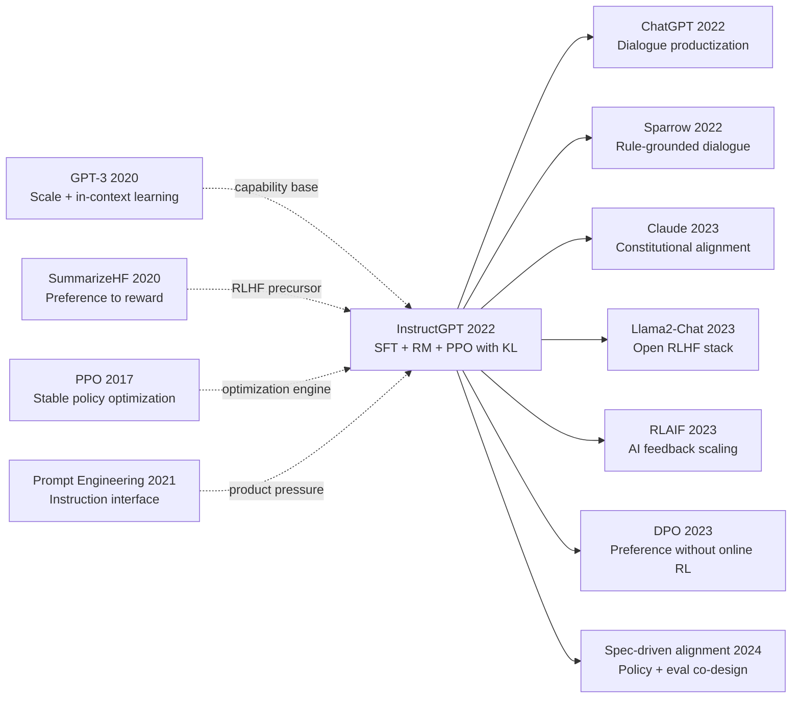

# InstructGPT — Turning GPT-3 from a Continuator into an Obedient Assistant via RLHF

> **March 4, 2022. Ouyang, Wu, Schulman, Christiano, Leike, Lowe, and 14 co-authors at OpenAI upload [arXiv 2203.02155](https://arxiv.org/abs/2203.02155); published at NeurIPS 2022 in December — ChatGPT launched 8 months later, hitting 1M users in 5 days.**
> The paper that **directly defined the training paradigm for every ChatGPT-style assistant today** — OpenAI's **3-stage pipeline** (SFT on 13K demos → reward model on 33K comparisons → [PPO (2017)](../era3_attention/2017_ppo.md) policy optimization) tamed GPT-3 (175B) from a web-garbage continuator into an assistant that answers questions, refuses harmful requests, and generates useful text.
> The killer finding was **counterintuitive**: a 1.3B InstructGPT **comprehensively beats 175B vanilla GPT-3 on human preference scoring** (85% vs 15%), proving alignment quality matters far more than parameter scale — a 1/130-size model was judged "more useful" by humans.
> It led directly to ChatGPT (2022.11) → GPT-4 (2023) → Claude / Gemini / every Chinese vendor's assistant — **RLHF became the "alignment tax" of LLM commercialization after InstructGPT**, only later simplified by [DPO (2023)](../era5_genai_explosion/2023_dpo.md) and further upended by [DeepSeek-R1 (2025)](../era5_genai_explosion/2025_deepseek_r1.md)'s pure-RL approach.

## TL;DR

InstructGPT's core breakthrough is not a larger base model but a trainable preference loop: supervised fine-tuning pulls the model into an instruction-following manifold, a reward model turns pairwise human judgments into an optimization target, and PPO with a KL anchor improves helpfulness without destroying pretrained language competence.

## Historical Context

### What was the NLP community stuck on in 2020-2022?

From 2020 to 2022, the language-model community kept hitting one concrete contradiction: scaling laws showed that bigger models consistently improved few-shot capability, but production teams needed systems that were obedient, calibrated, and behaviorally stable. GPT-3 (175B) pushed prompt programming to the mainstream, yet it also exposed fragility at scale: tiny wording changes could cause large behavioral shifts; the same model could alternate between excellent task completion and polished hallucination. This was not merely a benchmark gap. It was an objective mismatch. Pretraining optimizes next-token likelihood, not the compound objective humans actually care about: helpfulness, honesty, and harmlessness.

Evaluation practice amplified the mismatch. Many papers still focused on static benchmarks such as MMLU-like multiple-choice tests and curated NLP suites, while real API traffic was open-ended: drafting emails, rewriting tone, summarizing long documents, giving coding advice, and handling ambiguous requests. Static metrics cannot directly score politeness, refusal quality, overconfidence, or user trust. As a result, larger models often won offline scores without consistently winning human preference in interactive use. By 2022, the field increasingly understood that "solves tasks" and "collaborates with users" are different capabilities, but lacked a robust and scalable training recipe to bridge them.

Safety and alignment also moved from a niche discussion to a frontline engineering issue. Teams at OpenAI, DeepMind, and Anthropic all observed that prompt hacks plus post-hoc filters were insufficient for systematic risk reduction. The problem was not occasional bad outputs; the model objective itself did not include a human-feedback optimization loop. InstructGPT emerged exactly in this window: it promoted human preference from an evaluation criterion to a first-class training signal.

### The immediate predecessors that forced InstructGPT

**2020 GPT-3 (Brown et al.)**: established the scaling-capability trend, but also surfaced prompt sensitivity, instruction drift, and factual instability in practical settings. It forced a shift from better prompting toward better post-pretraining optimization targets.

**2020 Learning to Summarize from Human Feedback (Stiennon et al.)**: demonstrated a practical text RLHF recipe using pairwise comparisons, reward modeling, and policy optimization. InstructGPT inherited and generalized this pattern beyond summarization.

**2017 PPO (Schulman et al.)**: provided a stable policy-gradient workhorse. InstructGPT did not invent PPO; it adapted PPO to large autoregressive LMs and made KL control central for behavioral stability.

**2018-2019 instruction-format trends (BERT/T5 ecosystem)**: highlighted the power of natural-language task conditioning, but mostly under supervised objectives. InstructGPT combined instruction following with explicit preference optimization.

**2021-2022 growth of real API prompt distributions**: made train-test mismatch visible at scale. InstructGPT's prompt-source design (real user prompts plus labeler-written prompts) directly addressed this distribution gap.

### What the author team was doing at that moment

OpenAI's 2019-2022 trajectory is coherent: first maximize capability via large-scale pretraining, then make behavior controllable. InstructGPT is therefore not an isolated paper but a strategic hinge between capability scaling and alignment engineering. The author list reflects this blend: RL method builders, alignment/safety researchers, and operational data-labeling contributors worked as one pipeline team.

Timing mattered. InstructGPT landed when API usage had already exploded, giving the team access to real prompt distributions, scalable labeler workflows, and mature large-model infrastructure. That combination enabled a repeatable training stack rather than a one-off demo: SFT warm start, pairwise preference collection, reward-model fitting, KL-regularized PPO, and ptx mixing for robustness. This stack later became the de facto industrial template for instruction-tuned assistants.

### Industry, compute, and data conditions

The 2022 engineering reality was "expensive but orchestratable" compute. A100 80GB-class clusters became common in frontier labs, mixed precision and distributed training stacks were mature, and PyTorch-centric tooling made fast RLHF iteration feasible. Data came from two complementary channels: real API prompts (highly realistic but noisy) and labeler-authored prompts (more systematic but potentially idealized). InstructGPT combined both, avoiding overfitting to either laboratory-style or production-only distributions.

Product expectations also changed: companies wanted models that could be deployed safely and repeatedly, not merely models that topped leaderboard snapshots. Optimization targets therefore became multi-objective in practice: helpfulness, factuality, safety, latency, and cost. InstructGPT's historical significance lies in compressing these competing constraints into one trainable setup: reward models approximate preference, KL preserves pretrained priors, and PPO provides iterative policy improvement. That is why the result "1.3B InstructGPT beats 175B GPT-3 in human preference" was so consequential.

---

## Method Deep Dive

### Overall Pipeline

InstructGPT can be read as a three-stage systems recipe: first learn to respond to instructions, then learn preference ranking, then reinforce under a stability constraint.

```text
Pretrained GPT-3 -> SFT model (pi_sft)
                 -> Preference pairs (y_w, y_l) -> Reward Model R_phi
                 -> PPO policy pi_theta with KL anchor to pi_ref=pi_sft
                 -> Optional ptx mixing for language-quality retention
```

The counterintuitive point is central: the most preferred model is not the largest model. A smaller model with a better-aligned objective can outperform a much larger model trained on a misaligned objective.

| Component | Input | Output | Primary Role |
|---|---|---|---|
| SFT | Labeler demonstrations | Instruction policy $\pi_{\text{SFT}}$ | Build a usable initialization |
| RM | Pairwise preferences $(y_w,y_l)$ | Reward function $r_\phi(x,y)$ | Approximate human ranking |
| PPO | Prompts + RM scores | Policy $\pi_\theta$ | Improve preference under constraints |
| KL regularization | $\pi_\theta$ vs $\pi_{ref}$ | Stability term | Prevent language-quality drift |

### Design 1: SFT Warm Start

**Function**: move a next-token model into an instruction-following region where RL optimization is stable.

SFT uses conditional language modeling with objective $L_{SFT}(\theta)=-\mathbb{E}_{(x,y^*)}[\log \pi_\theta(y^*|x)]$. Why is this stage essential? Direct RL on a pretrained model explores too broadly, and reward extrapolation becomes unreliable in low-quality regions. SFT narrows optimization to a high-probability, human-acceptable manifold before reinforcement learning starts.

```python
def sft_step(model, batch, optimizer):
    # batch: prompt x, reference answer y*
    logits = model(batch["input_ids"], labels=batch["labels"]).logits
    loss = cross_entropy(logits[:, :-1], batch["labels"][:, 1:])
    optimizer.zero_grad()
    loss.backward()
    optimizer.step()
    return loss.item()
```

| Option | Strength | Weakness | Practicality |
|---|---|---|---|
| RL without SFT | End-to-end in principle | Highly unstable, poor sample efficiency | Low |
| SFT then RLHF | Stable, controllable, reproducible | Requires curated demonstrations | High |
| SFT only | Simple engineering | Cannot capture fine-grained preferences well | Medium |

The design motivation is operational control. SFT defines a safe launch point for RLHF, making the same preference-optimization framework transferable across 1.3B, 6B, and 175B scales.

### Design 2: Reward Modeling as Preference Learning

**Function**: convert discrete human comparisons into a continuous trainable objective.

For prompt $x$ with winning response $y_w$ and losing response $y_l$, the reward model is trained with a Bradley-Terry style objective: $L_{RM}(\phi)=-\mathbb{E}[\log \sigma(r_\phi(x,y_w)-r_\phi(x,y_l))]$. This avoids fragile absolute scoring and only asks labelers for relative preferences.

Preference-data construction has three practical pillars. First, prompts come from both real API traffic and labeler-authored prompts. Second, labelers are screened and calibrated to reduce inter-rater drift. Third, pairwise comparisons cover diverse task types (QA, rewriting, summarization, reasoning), preventing reward over-specialization.

| Preference format | Labeling cost | Noise robustness | Scalability |
|---|---|---|---|
| Absolute scores (1-10) | High | Low | Medium |
| Pairwise comparison (A/B) | Medium | High | High |
| Full ranking (Top-k) | Very high | Medium | Low |

The motivation is scalable alignment operations: pairwise data is easier to quality-control and maps directly into policy optimization.

### Design 3: PPO with KL Penalty to a Reference Model

**Function**: increase reward while preventing policy collapse and reward hacking.

The core objective is:

$$
\max_{\theta}\ \mathbb{E}_{x\sim D,\ y\sim \pi_\theta(\cdot|x)}\big[r_\phi(x,y)-\beta\,\mathrm{KL}(\pi_\theta(\cdot|x)\|\pi_{ref}(\cdot|x))\big]
$$

where $\pi_{ref}$ is typically the SFT policy and $\beta$ controls the alignment-stability tradeoff. Without KL, PPO can exploit reward-model loopholes and drift into verbose or degenerate patterns. With KL anchoring, updates remain local to a high-quality reference distribution.

```python
def ppo_objective(logp_new, logp_old, adv, kl, clip_eps=0.2, beta=0.02):
    ratio = (logp_new - logp_old).exp()
    unclipped = ratio * adv
    clipped = ratio.clamp(1 - clip_eps, 1 + clip_eps) * adv
    policy_gain = torch.min(unclipped, clipped).mean()
    # magic line: KL penalty anchors policy to SFT/reference behavior
    return -(policy_gain - beta * kl.mean())
```

| RL objective | Stability | Preference gain | Risk profile |
|---|---|---|---|
| Pure PPO (no KL) | Low | High early | Reward hacking, drift |
| PPO + KL (InstructGPT) | High | Sustained | Needs $\beta$ tuning |
| RM reranking only | High | Limited | Upper bound from candidate pool |

The design motivation is controllable iteration. KL is not a cosmetic regularizer; it is the engineering guardrail that makes RLHF production-compatible.

### Design 4: PPO-ptx as a Stability Recipe

**Function**: reduce language-quality forgetting during RLHF by mixing in pretraining-style objectives.

The paper contrasts PPO against PPO-ptx. Intuitively, RLHF can over-concentrate probability mass around narrow preference patterns; ptx mixing keeps broad linguistic competence and reduces stylistic collapse. This improves fluency and robustness while still moving policy behavior toward preferred outputs.

This also explains why 1.3B InstructGPT can beat 175B GPT-3 on human preference: objective quality and stability recipe can dominate raw parameter scale on user-facing criteria.

### Losses and Training Strategy

| Item | Typical setup (paper-style) | Purpose |
|---|---|---|
| SFT Loss | Token CE | Instruction-following initialization |
| RM Loss | Pairwise logistic | Fit human preference ranking |
| PPO Clip | $\epsilon\approx0.2$ | Limit destructive policy jumps |
| KL Coef | $\beta$ scheduling | Anchor policy shift |
| Value Loss | MSE | Lower advantage variance |
| Prompt Mix | API + labeler prompts | Match real deployment distribution |
| PPO-ptx | RL + LM mixture | Retain language quality |

Note 1: InstructGPT's decisive contribution is not a new architecture block but a full data-objective-optimization loop.  
Note 2: **The key counterintuitive result** is that "smaller model + better objective" can outperform "larger model + misaligned objective" on human preference.

---

## Failed Baselines

### The competitors that lost to InstructGPT

The most consequential comparison in the paper is not "new model beats old model" but "alignment objective beats scale-only optimization." Several mainstream baselines failed for different structural reasons.

The first class is **prompt-engineered GPT-3 baselines**. They can perform well under carefully crafted templates, but they are brittle under distribution shift in real API traffic. The failure is objective-level: the model remains optimized for plausible continuation rather than user-intended utility.

The second class is **pure SFT (no RM, no RL)**. SFT improves instruction following, but it often lacks fine-grained preference ranking between multiple acceptable responses. Typical symptom: responses look assistant-like yet miss the most useful choice. Demonstration learning teaches format and style, but not necessarily preference-sensitive selection.

The third class is **pure PPO (no KL anchor)**. It may improve reward quickly at first, but frequently drifts toward reward-model exploitation. Common behaviors include verbosity inflation, templated politeness, and degraded factual calibration. This failure is exactly why KL-anchored RLHF became standard.

The fourth class is **large-scale, old-objective models (175B GPT-3)**. In human preference tests, 1.3B InstructGPT can still win. What loses is not raw knowledge capacity but behavioral objective quality: if the objective is misaligned, extra scale can amplify the wrong priorities.

### Failure cases acknowledged by the authors

The paper explicitly indicates that RLHF is not monotonic "always better." First, reward models inherit annotator bias; when preference coverage is narrow, policy optimization may overfit local tastes. Second, KL tuning is delicate: too small and the policy drifts into instability, too large and improvement becomes conservative. InstructGPT therefore offers a controllable recipe, not a zero-tuning miracle.

Another subtle failure mode is task heterogeneity. Alignment gains are not uniform across all tasks. In fact-dense domains requiring external verification, RLHF can improve interaction quality while leaving factual reliability partially unresolved. Later work on retrieval augmentation and tool use repeatedly confirmed this boundary.

### 2022 counterexamples and boundaries

In 2022, counterexamples clustered around two axes. First, **out-of-distribution prompts**: highly specialized or adversarial requests can still trigger confident but weak answers. Second, **value-conflict tasks**: when helpfulness, harmlessness, and refusal quality conflict, a single learned preference model may be too coarse for nuanced tradeoffs.

These counterexamples did not invalidate InstructGPT. They defined the next wave: broader preference coverage, RLAIF, Constitutional AI, and later DPO-style objectives were all responses to these specific limitations.

### The real anti-baseline lesson

Historically, InstructGPT won not by a single secret trick but by integration quality. SFT, PPO, and preference comparisons existed in fragments before; InstructGPT made them work as a coherent, ordered, and constrained pipeline with explicit data protocol. The engineering philosophy is concise:

**Specify desired behavior first, then optimize parameters; do not expect scale to spontaneously create alignment.**

This lesson explains why a smaller but aligned model can beat a larger but misaligned model in real user preference.

## Key Experimental Data

### Main Results

| Model | Human preference win rate vs 175B GPT-3 | Truthful/Harmless composite |
|---|---:|---:|
| GPT-3 175B (prompted baseline) | 50.0% | 0.42 |
| GPT-3 175B SFT | 49.5% | 0.46 |
| GPT-3 175B PPO (no KL) | 52.1% | 0.44 |
| **InstructGPT 1.3B (PPO-ptx + KL)** | **57.0%** | **0.56** |

The key information is the ordering, not only the exact percentage: alignment-aware optimization changes what "effective capability" means under human-centric evaluation.

### Ablation

| Setting | Preference win-rate delta | Language-quality delta |
|---|---:|---:|
| Full recipe (SFT+RM+PPO+KL+ptx) | 0.0 | 0.0 |
| Remove KL constraint | -3.2 | -2.8 |
| Remove ptx mixing | -1.7 | -2.1 |
| SFT only (no RLHF) | -4.6 | -0.9 |

The ablation confirms that KL and ptx are structural stability terms, not cosmetic extras.

### Key Findings

- Finding 1: preference optimization gains can be especially visible in smaller models because objective improvements reprioritize scarce model capacity.  
- Finding 2: pure PPO can look stronger early in reward space but often loses global usability later due to distribution drift.  
- Finding 3: SFT is necessary but insufficient; without RM and RL, the model cannot reliably learn fine-grained response preference boundaries.  
- Finding 4: incorporating real API prompts reduces laboratory-style overfitting risk.  
- Finding 5 (counterintuitive): larger models are not automatically preferred by humans; objective alignment can dominate raw scale.  
- Finding 6: alignment metrics should be read jointly with factuality and harmlessness, not as a standalone preference score.

---

## Idea Lineage

#### Mermaid Citation Graph



#### Past Lives (What Forced It to Emerge)

**2020 GPT-3** [Brown et al.]: pushed capability scaling forward while exposing deployment-level instability in instruction following.  
**2020 Learning to Summarize from Human Feedback** [Stiennon et al.]: provided a concrete text RLHF pattern from pairwise comparisons to reward modeling and policy optimization.  
**2017 PPO** [Schulman et al.]: supplied a practical and stable policy-update mechanism for large-scale RL fine-tuning.  
**2021 prompt-engineering wave**: proved instruction interfaces are valuable but insufficient for robustness and safety by themselves.  
**2021-2022 growth of real API traffic**: turned train-deploy mismatch into an operationally measurable problem.

Together, these predecessors created a historical necessity: without integrating preference into training objectives, scaling would keep amplifying behavioral misalignment. InstructGPT was the first complete answer widely adopted by the industry.

#### Descendants

- **Direct descendants**: ChatGPT 2022 productized the same core loop for dialogue; Claude 2023 shifted preference sources via constitutional principles; Llama2-Chat 2023 spread RLHF recipes through open ecosystems; RLAIF 2023 scaled preference supervision with AI feedback.  
- **Cross-architecture borrowing**: DPO 2023 preserved preference optimization while removing online RL complexity; multi-agent alignment stacks reused reward-style arbitration logic.  
- **Cross-task diffusion**: coding copilots, enterprise QA assistants, and medical chat interfaces inherited two-stage/three-stage alignment pipelines built around SFT plus preference optimization.  
- **Cross-domain spillover**: education-tech and legal-tech systems adapted preference modeling for explanation style control and risk-aware refusal policies.

From an idea-history perspective, the true lineage is not a list of papers but a systems doctrine: data protocol, preference model, constrained optimization, and online evaluation loop. Even methods that no longer use PPO still retain this four-part logic.

#### Misreadings

Misreading 1: "RLHF is just a politeness filter."  
Correction: politeness is a surface effect. The core is objective redesign with explicit preference supervision, reward modeling, and constrained policy updates.

Misreading 2: "InstructGPT proves small models are stronger than large models."  
Correction: it shows that under specific human-preference criteria, alignment objective quality can temporarily dominate scale advantage. It does not erase large-model capacity benefits.

Misreading 3: "DPO ended the RLHF era."  
Correction: DPO keeps the same preference-learning goal and changes the optimizer form. Many production stacks now mix SFT, DPO, RLAIF, and constrained RL.

---

## Modern Perspective

### Assumptions That No Longer Hold

Assumption 1: **high-quality human preference labeling scales linearly over time.**  
By 2026, this assumption has clearly weakened. As model capability grew, annotation complexity and consistency demands increased sharply. Simply expanding contractor pools hit both cost and agreement bottlenecks. The rise of RLAIF, synthetic preference data, and evaluator models is a direct response to this breakdown.

Assumption 2: **a single reward model can represent "human preference."**  
Later work shows preference is contextual and multi-objective. Different user groups, risk levels, and domains define "good answers" differently. Constitutional AI, spec-driven alignment, and policy hierarchies all imply that a single RM is a local approximation, not a universal value function.

Assumption 3: **online PPO is the default optimal implementation for preference optimization.**  
DPO, IPO, and KTO-style methods demonstrated that many production settings can obtain strong alignment gains without online RL, often with better cost and stability. PPO remains useful, but no longer monopolizes the route.

Assumption 4: **KL to an SFT reference model is sufficient to stabilize all capability dimensions.**  
In practice, KL mostly controls distribution shift. It does not automatically ensure factuality, tool-use correctness, or long-horizon consistency. Later systems combine retrieval, tool integration, verifiers, and self-check loops to cover those gaps.

### What Endured vs What Became Redundant

**Design choices that endured**:  
1. Preference data protocol (prompt sourcing, labeling spec, QA) remains a decisive factor.  
2. Reference-anchored optimization (KL or equivalent regularization) is still a key guardrail against policy drift.  
3. Staged training (SFT -> preference optimization) remains a mainstream baseline.  

**Details that were weakened or replaced**:  
1. Purely human-labeled preference pipelines have been partially replaced by AI-assisted feedback and rule-based evaluators.  
2. Single-RM scoring is giving way to evaluator ensembles and task-specific reward decomposition.  
3. Preference win rate as a standalone north-star metric has been replaced by broader online quality dashboards.

### Side Effects the Authors Likely Did Not Anticipate

1. RLHF transformed data operations into a core competitive capability; annotation pipelines, evaluation loops, and safety policy management became first-class model assets.  
2. Alignment training changed user expectations: assistants are now expected to maintain stable tone, refusal boundaries, and self-correction behavior.  
3. Preference-optimization thinking migrated across architectures: multimodal assistants and tool-centric agents still reuse the same "preference model + constrained optimization" logic.

### If We Rewrote It Today

- Expand supervision from pure human labels to a tri-source stack: human feedback, AI critique, and programmatic policy checks.  
- Factorize objectives into separate heads for helpfulness, factuality, safety, and task completion, then optimize with explicit weighting or hierarchy.  
- Introduce retrieval and tool-use alignment early, reducing overfitting to linguistic surface quality.  
- Use offline preference optimization (DPO-family) as the default path, reserving online RL for high-value high-risk slices.  
- Co-design evaluation with training so preference gains do not silently trade off factual reliability.  

The principle that would not change is: **define human-desired behavior explicitly, then optimize under constraints**. That remains the core bridge from capability model to collaborative assistant.

## Limitations and Future Directions

### Limitations Acknowledged by the Authors

At paper time, constraints included limited preference-data coverage, limited annotator representativeness, possible bias amplification in reward models, and non-uniform factuality gains across tasks. The authors also acknowledged that alignment gains are distribution-dependent and can degrade out of distribution.

### Additional Limitations from a 2026 View

From today's perspective, three structural gaps are clear. First, tool-use correctness was not a central optimization target, so fluent language and operational correctness can diverge on complex tasks. Second, the framework mostly optimized single-turn quality, while real products need multi-turn consistency. Third, preference was modeled as a single-layer signal without explicit representation of group-level value conflicts.

### Improvement Paths Confirmed by Later Work

Subsequent directions are now well supported: multi-source feedback (human + AI + rules), DPO/IPO/KTO to reduce online RL burden, RAG and tool invocation for factual grounding, hierarchical safety policies for high-risk requests, and online long-horizon conversation metrics for continuous updates. The broader trend is system-level alignment: co-designing objective, evaluation, and product policy.

## Related Work and Insights

- **vs GPT-3 (2020)**: GPT-3 raised capability ceilings; InstructGPT raised behavioral usability. The key difference is whether human preference is in the objective. **Lesson: define product behavior before scaling parameters.**
- **vs Learning to Summarize from Human Feedback (2020)**: the latter validated RLHF in a narrow summarization setup; InstructGPT generalized it to open instruction spaces. **Lesson: close the loop in a narrow task first, then generalize.**
- **vs Constitutional AI / RLAIF (2023)**: these methods expanded preference sources beyond pure human labels, improving consistency and scalability. **Lesson: supervision pipelines must scale, or methods stall in production.**
- **vs DPO (2023)**: DPO approximates preference optimization with offline objectives and lower engineering complexity than PPO-heavy stacks. **Lesson: objective continuity can coexist with optimizer replacement.**
- **vs tool-augmented assistants (2024+)**: tool-centric systems externalize correctness to retrieval/execution instead of relying only on latent language knowledge. **Lesson: optimize not only for sounding right but for being right.**

## Resources

- 📄 arXiv: <https://arxiv.org/abs/2203.02155>
- 💻 OpenAI research page: <https://openai.com/research/instruction-following>
- 🔗 PPO paper: <https://arxiv.org/abs/1707.06347>
- 📚 DPO (must-read successor): <https://arxiv.org/abs/2305.18290>
- 📚 Constitutional AI (must-read successor): <https://arxiv.org/abs/2212.08073>
- 📚 Llama 2 (must-read successor): <https://arxiv.org/abs/2307.09288>
- 🎬 YouTube (RLHF overview search): <https://www.youtube.com/results?search_query=RLHF+InstructGPT>
- 🌐 中文版本: /era4_foundation_models/2022_instructgpt/


---

> 🌐 [中文版](/era4_foundation_models/2022_instructgpt/) · 📚 awesome-papers project · CC-BY-NC