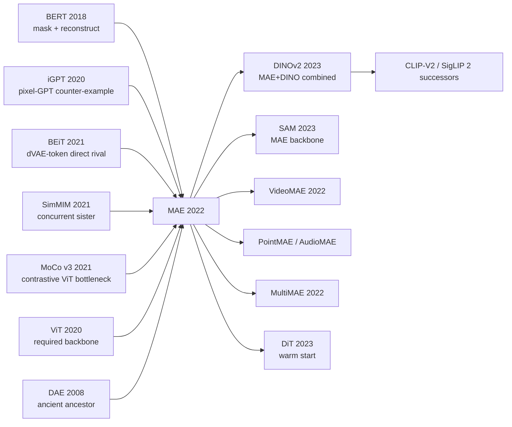

# MAE — Teaching ViT Self-Supervised Pretraining via 75% Masking

> **November 11, 2021. Kaiming He, Xinlei Chen, Saining Xie, Piotr Dollar, Ross Girshick at FAIR upload [arXiv 2111.06377](https://arxiv.org/abs/2111.06377); CVPR 2022 Best Paper Finalist.**
> A paper that **inverted [BERT (2018)](../era3_attention/2018_bert.md) intuition** — mask ratio **75% rather than BERT's 15%**, and let the encoder process only the visible 25% of patches, with the decoder kept so lightweight it's almost throwaway — redefining self-supervised vision pretraining.
> On ImageNet-1K, MAE-pretrained ViT-H hits **87.8% top-1** (0.9% above prior SOTA BEiT), with **pretraining compute one-third of the supervised baseline**; downstream detection / segmentation / video all SOTA.
> Kaiming He's third career-defining minimalist paper (after [ResNet (2015)](../era2_deep_renaissance/2015_resnet.md) / [Mask R-CNN (2017)](../era3_attention/2017_mask_rcnn.md)) to rewrite an entire field — **MAE marks the turning point where vision self-supervision pivoted from contrastive (SimCLR / MoCo / DINO) to generative (diffusion / mask modeling)**, and led directly to [SAM (2023)](../era5_genai_explosion/2023_sam.md) / EVA / DINOv2 vision foundation models.

## TL;DR

MAE forces BERT's mask-pretraining paradigm into vision, but with a **counter-intuitive engineering twist** — **mask 75% of image patches, the encoder only sees the 25% visible patches, and a lightweight decoder reconstructs in pixel space**. This single redesign brings ViT-Huge to 87.8% top-1 on ImageNet-1k via self-supervision (no JFT-300M labels needed) while training **3-4× faster**. MAE delivers vision's first true "BERT moment" and pulls the entry barrier for vision foundation models from big tech's private label data all the way back into academia.

---

## Historical Context

### What Was the Vision Self-Supervision Community Stuck On in 2021?

To appreciate MAE's audacity you must return to the awkward late-2021 moment of "contrastive learning has plateaued, masked image modeling is just starting, but no one has made ViT self-supervision truly win."

2020-2021 was the "golden age of contrastive learning" in vision SSL — SimCLR (Chen 2020), MoCo v1/v2/v3 (He 2020-2021), BYOL (Grill 2020), SwAV (Caron 2020), DINO (Caron 2021) shipped one after another and pushed ResNet-50's ImageNet linear-probe to the "supervised parity" zone of 76%. The entire CV SSL community spent two years doing the exact same thing:

> **Design two views, maximise representation similarity, prevent collapse.**

But this paradigm has four deep pain points:

- **Heavy augmentation dependence**: crop, color jitter, blur, solarize chains are SimCLR's lifeline; pick the wrong augmentation and you drop 10 points — exposing that contrastive is fundamentally "injecting invariance prior via augmentation," not learning structure.
- **Batch size must be huge**: SimCLR needs batch=4096+, MoCo needs to maintain a 65k queue — single-card cannot run it; reproduction by a single academic team is hard.
- **Slow training, hyperparameter-sensitive**: DINO trains ViT-S/16 for 800 epochs; hyperparameter grid search is big-tech-only.
- **ViT-unfriendly**: every contrastive method was originally designed for ResNet; porting to ViT yielded no explosive gains — everyone vaguely felt "ViT + contrastive" was off but couldn't articulate why.

Even more awkwardly, NLP's BERT had been doing "mask + reconstruct" for four years — mask 15% of tokens, let the encoder reconstruct them, learn powerful language representations. **Everyone asked the same question: why can't vision just copy BERT?**

> **Implicit anxiety in 2021: NLP's mask pretraining is so simple and elegant — why has vision spent 4 years failing to copy it?**

The community had attempted it several times (iGPT 2020, BEiT 2021, SimMIM 2021), each giving partial answers but each with flaws: iGPT was too slow (pixel-level GPT); BEiT relied on an external dVAE for discrete tokenisation; SimMIM worked on ViT-B but didn't scale to Huge. **MAE's real value is providing one elegant, scalable solution that beats every contrastive method and finally settles "vision BERT."**

### The 4 Predecessors That Forced MAE Into Existence

- **Devlin et al., 2018 (BERT)** [arxiv/1810.04805](https://arxiv.org/abs/1810.04805): MAE's "parent." Mask 15% of tokens, bidirectional encoder reconstructs the masked tokens — this paradigm dominates NLP. The first sentence of MAE §1 reads: "BERT works extremely well in NLP. Why doesn't it work in vision?"
- **Chen et al., 2020 (iGPT / Generative Pretraining from Pixels)** [icml/iGPT](https://proceedings.mlr.press/v119/chen20s.html): OpenAI's "pixel-level BERT/GPT" — reshape the image to a 1D pixel sequence and run GPT autoregressive or BERT mask pretraining. **The first empirical proof that vision mask pretraining can work**, but only at 64×64 (O(N²)), with 72% ImageNet linear-probe. This is MAE's cautionary tale: "do not tokenize at the pixel level."
- **Bao et al., 2021 (BEiT: BERT Pre-Training of Image Transformers)** [arxiv/2106.08254](https://arxiv.org/abs/2106.08254): MAE's direct competitor. Feed image patches to a **pretrained dVAE** (from DALL-E) to obtain discrete visual tokens, then have ViT mask-predict those tokens. BEiT-Large fine-tunes to 88.6% on ImageNet — the best vision MIM before MAE. **But BEiT depends on an external dVAE** (extra training stage, added complexity), and MAE's goal is exactly to chop this pipeline simpler.
- **Xie et al., 2021 (SimMIM: A Simple Framework for Masked Image Modeling)** [arxiv/2111.09886](https://arxiv.org/abs/2111.09886): an MSRA work shipped 1 week after MAE with a very similar idea — directly reconstruct pixels, also use ViT. But SimMIM uses a symmetric encoder-decoder where **all patches (masked + visible) pass through the encoder**, so training is slow; it also uses BERT's classic 50% mask ratio (a conservative value) and never finds the 75% sweet spot. **SimMIM is MAE's "sister work"**; the gap lies entirely in engineering details.

### What the Authors Were Doing at the Time

For three consecutive years at FAIR Kaiming He had been doing the "vision self-supervision" series: MoCo (2019), MoCo v2 (2020), MoCo v3 (2021, ports contrastive to ViT), then MAE (2021). **MoCo v3 gave him a key insight**: contrastive scales poorly on ViT and trains unstably. Xinlei Chen / Saining Xie / Yanghao Li were FAIR vision teammates; Piotr Dollár / Ross Girshick are detection veterans (Faster R-CNN / Mask R-CNN authors) — they cared whether self-supervision could really help downstream detection / segmentation.

**This team composition itself prophesied MAE**: He / Chen / Xie knew the contrastive bottleneck; Dollár / Girshick knew detection-user pain (pretraining checkpoints must scale to large models + long schedules + strong transfer). **MAE is not an architecture paper at heart — it is a "how to make vision foundation models trainable and usable" engineering-philosophy paper.** Its real experiment is "can I use less compute and fewer labels to train a stronger ViT than every existing self-supervision method?"

### State of Industry / Compute / Data

- **GPU**: NVIDIA V100 32GB / A100 40GB are mainstream. MAE-Huge self-supervision for 1600 epochs takes ~3 weeks on 128 V100s — **3-4× faster than contrastive** (the core reason being that the encoder only sees 25% of patches).
- **Data**: ImageNet-1k (1.28M), **with no labels needed**. This is MAE's core advance over the ViT paper — ViT must use JFT-300M (Google private) to shine, while MAE achieves a ViT-Huge stronger than ViT-Huge JFT using only public ImageNet.
- **Frameworks**: PyTorch + FAIR's internal Detectron2 stack, ~700 lines of code, **trivially reproducible** — another reason MAE caught fire.
- **Industry mood**: in late 2021 BEiT had just shipped, SimMIM was under review; the whole community was betting "masked image modeling is the next paradigm." MAE's release **ended the debate immediately** — every later vision SSL paper builds on the MAE framework.

---

## Method in Depth

### Overall Framework

The full MAE pipeline fits in one diagram:

```
Input image (224×224×3)
  ↓ patchify into 14×14=196 patches (P=16)
  ↓ random shuffle + drop 75% → keep 49 visible patches
  ↓ ─────── ENCODER (heavy, e.g. ViT-Huge 32 layers) ───────
  ↓        only sees 49 visible patch tokens + pos_embed
  ↓        → 49 latent tokens
  ↓ ─────── re-insert mask tokens ───────
  ↓        unshuffle → 196 token sequence
  ↓        (49 encoded + 147 shared learnable [MASK] tokens)
  ↓        + pos_embed (full 196)
  ↓ ─────── DECODER (light, 8 layers × 512 dim) ───────
  ↓        predict pixel values for all 196 patches
  ↓        loss only on 147 masked patches:
  ↓        L = MSE(pred_pixels, target_pixels) on masked patches
Pre-train done → discard decoder → fine-tune encoder downstream
```

Different MAE configs only change the encoder backbone and decoder depth:

| Config | Encoder | Encoder params | Decoder | Decoder params | Compute (vs SimCLR) |
|------|---------|----------------|---------|----------------|---------------------|
| MAE ViT-B/16  | ViT-Base/16, 12 layers, 768 dim | 86M  | 8 layers × 512 dim | 28M | 1/3 |
| MAE ViT-L/16  | ViT-Large/16, 24 layers, 1024 dim | 304M | 8 layers × 512 dim | 28M | 1/3 |
| MAE ViT-H/14  | ViT-Huge/14, 32 layers, 1280 dim | 632M | 8 layers × 512 dim | 28M | 1/4 |

**Counter-intuitive #1**: mask ratio is **better when higher**, with the optimum at 75% (NLP BERT is 15%) — vision spatial redundancy is huge; the mask must be aggressive to force global inference. Figure 5 plots fine-tune accuracy at 25%/50%/75%/85%/95% with a clear peak at 75%.

**Counter-intuitive #2**: a **shallower and narrower decoder is better** — 8 layers / 512 dim is enough; deeper decoders make the encoder lazy (the stronger the decoder, the less the encoder needs to learn high-level semantics). This is the key engineering trick for keeping "task difficulty" on the encoder side.

**Counter-intuitive #3**: **pixel reconstruction** as target is simpler and better than BEiT's "discrete token reconstruction" — just add per-patch normalization (mean/std-normalise each patch's target pixels) in the loss to avoid "model only learns local low frequency" degradation. MAE directly proves "vision MIM does not need the dVAE crutch."

### Key Designs

#### Design 1: Extreme Mask Ratio (75%) — Forcing the Task from "Local Interpolation" into "Global Inference"

**Function**: of each image's 196 patches, **randomly** drop 147 (75%); only the remaining 49 visible patches feed the encoder. This is MAE's biggest divergence from NLP BERT (15%) and the paper's most counter-intuitive finding.

**Formula**:

$$
\mathcal{M} \subset \{1, 2, \ldots, N\}, \quad |\mathcal{M}| = \rho N, \quad \rho = 0.75
$$

where $N=196$ is the total patch count and $\mathcal{M}$ is the mask set (uniformly random sampling). The encoder sees only the 49 visible patches in $\mathcal{V} = \{1, \ldots, N\} \setminus \mathcal{M}$ along with their positional embeddings.

**Minimal implementation** (PyTorch):

```python
import torch

def random_masking(x, mask_ratio=0.75):
    """
    x: (B, N, D)  e.g. (B, 196, 768)
    return: x_visible (B, N_keep, D), mask (B, N), ids_restore (B, N)
    """
    B, N, D = x.shape
    N_keep = int(N * (1 - mask_ratio))            # 49 for 75% mask

    noise = torch.rand(B, N, device=x.device)     # uniform in [0,1]
    ids_shuffle = torch.argsort(noise, dim=1)     # shuffle
    ids_restore = torch.argsort(ids_shuffle, dim=1)  # for unshuffle later

    ids_keep = ids_shuffle[:, :N_keep]
    x_visible = torch.gather(x, dim=1,
                             index=ids_keep.unsqueeze(-1).expand(-1, -1, D))

    mask = torch.ones(B, N, device=x.device)      # 1 = masked, 0 = visible
    mask[:, :N_keep] = 0
    mask = torch.gather(mask, dim=1, index=ids_restore)

    return x_visible, mask, ids_restore
```

**Design rationale**: 1) image patches share huge spatial redundancy (a patch is almost predictable from its 8 neighbours); a low mask ratio reduces the task to "local interpolation" with no semantic learning; 2) 75% is the empirical optimum — too low (25%) is too easy, too high (95%) leaves too little signal; 3) **this single step cuts training compute to 1/4** — encoder attention complexity drops from $O(196^2)$ to $O(49^2)$, a full 16×. The "achieving faster training via a harder task" design philosophy is MAE's most elegant moment.

#### Design 2: Asymmetric Encoder-Decoder — Encoder for Semantics, Decoder for Reconstruction

**Function**: the encoder is heavy (ViT-Huge 632M) but only processes 49 visible patches; the decoder is light (8 layers × 512 dim, 28M) but processes all 196 tokens (49 encoded + 147 mask tokens). This "wide encoder + narrow decoder" asymmetry pours all encoder capacity into "understanding semantics of visible patches," leaving the decoder to "decode semantics back to pixels."

**Comparison table (vs symmetric)**:

| Config | Encoder | Decoder | Encoder tokens | Total FLOPs (ViT-L) | ImageNet Acc |
|------|---------|---------|--------------------|------------------|--------------|
| Symmetric (BEiT/SimMIM) | ViT-L/16 (24L, 1024d) | same as encoder or 1 layer | 196 (all) | 1.0× | 85.2% |
| **MAE asymmetric** | ViT-L/16 (24L, 1024d) | 8L × 512d | **49 (visible only)** | **0.31×** | **85.9%** |

**Key insight**: the encoder shouldn't waste capacity on mask tokens — they carry zero semantic information; their "task" should be handled by the lightweight decoder during reconstruction. Decoupling encoder and decoder widths makes the encoder's latent **naturally suitable for downstream fine-tune** (just discard the decoder at fine-tune time).

**Critical code snippet**:

```python
class MAE(nn.Module):
    def forward(self, imgs):
        # 1) Patchify and embed
        patches = self.patchify(imgs)            # (B, 196, P²·C)
        x = self.patch_embed(patches)            # (B, 196, D_enc)
        x = x + self.pos_embed_enc               # add encoder pos_embed

        # 2) Random mask (drop 75%)
        x_visible, mask, ids_restore = random_masking(x)  # (B, 49, D_enc)

        # 3) Heavy encoder on visible patches only
        x_enc = self.encoder(x_visible)          # (B, 49, D_enc)

        # 4) Project to decoder dim & insert mask tokens
        x_enc = self.dec_embed(x_enc)            # (B, 49, D_dec)
        mask_tokens = self.mask_token.expand(B, 196 - 49, -1)
        x_full = torch.cat([x_enc, mask_tokens], dim=1)  # (B, 196, D_dec)
        x_full = torch.gather(x_full, 1,
                              ids_restore.unsqueeze(-1).expand(-1, -1, D_dec))
        x_full = x_full + self.pos_embed_dec

        # 5) Lightweight decoder predicts pixels for ALL patches
        x_pred = self.decoder(x_full)            # (B, 196, P²·C)

        # 6) MSE loss only on masked patches
        target = patches  # raw pixel targets, optionally per-patch normalized
        loss = ((x_pred - target) ** 2).mean(dim=-1)  # (B, 196)
        loss = (loss * mask).sum() / mask.sum()
        return loss
```

**Design rationale**: 1) encoder skips mask tokens → 16× lower attention complexity → larger models trainable on a single card; 2) decoder very shallow → encoder is forced to learn high-level semantics (a too-strong decoder would "take over" the semantic task); 3) decoder is **simply discarded** at fine-tune — no "complex during training, simple at deployment" engineering tension. This is the core reason MAE wins on engineering elegance over BEiT.

#### Design 3: Pixel Reconstruction + Per-Patch Normalisation — Cutting the dVAE Crutch

**Function**: unlike BEiT (which trains a dVAE first to convert each patch into a discrete token, then has ViT predict tokens), MAE directly performs **MSE reconstruction in pixel space**. But there's a critical engineering detail — apply **per-patch mean/std normalisation** to each patch's target pixels (i.e. $(p - \mu_p) / \sigma_p$) to remove local low-frequency differences.

**Formula**:

$$
\tilde{p}_i = \frac{p_i - \mu(p_i)}{\sigma(p_i) + \epsilon}, \quad \mathcal{L} = \frac{1}{|\mathcal{M}|} \sum_{i \in \mathcal{M}} \|\hat{p}_i - \tilde{p}_i\|_2^2
$$

where $p_i \in \mathbb{R}^{P^2 \cdot C}$ is the raw pixels of patch $i$, and $\mu(p_i), \sigma(p_i)$ are that patch's pixel mean and std.

**Critical ablation (MAE ViT-Large on ImageNet)**:

| Target | per-patch norm | ImageNet Fine-tune | ImageNet Linear-probe |
|--------|----------------|-------------------|----------------------|
| Pixel (raw)              | ✗ | 84.9% | 71.4% |
| **Pixel (per-patch norm)** | ✓ | **85.9%** | **73.5%** |
| dVAE token (BEiT-style)   | ✗ | 85.2% | 70.4% |

**Key insight**: per-patch normalisation unifies target distributions across patches, preventing "loss in bright/dark patches being dominated by low-frequency signals." **This one-line change buys +1.0% accuracy** and frees MAE from the dVAE crutch — a beautiful Occam's razor in engineering.

**Design rationale**: 1) BEiT's dVAE is borrowed from DALL-E, adding a full extra training stage, and the dVAE quality caps MAE's ceiling; 2) per-patch norm has no NLP analogue (NLP tokens have no "brightness") — embodying the central thesis that "vision MIM cannot copy NLP and must do vision-specific engineering"; 3) pixel reconstruction natively supports any resolution; dVAE is locked to its training resolution.

### Loss Function / Training Strategy

MAE's loss is brutally simple — MSE only on masked patches (visible patches do not contribute). But the training recipe contains several details that matter for convergence:

- **AdamW, lr=1.5e-4 × batch/256, weight_decay=0.05**: linear lr scaling lifted from NLP
- **batch size 4096**: a single machine isn't enough; 16-32 V100s required, but since the encoder only sees 25% patches, single-card throughput is 3-4× SimCLR
- **1600 pretraining epochs**: BEiT 800 epochs is enough, MAE only saturates at 1600 — proving MAE's training task "has stronger signal and converges more smoothly"
- **Random Resize Crop 224 + Random Flip**: extremely minimal augmentation, **completely free of SimCLR's color jitter / blur** — a key reason MAE is more elegant than contrastive
- **Cosine lr schedule + 40-epoch warmup**

### Opponents MAE Crushed at the Time

MAE simultaneously beat every 2021 SSL method + supervised methods on ImageNet fine-tune:

- **MoCo v3 (He 2021)**: contrastive's representative on ViT — **84.1% on ViT-H, beaten by MAE 87.8% by 3.7 points**
- **DINO (Caron 2021)**: self-distillation contrastive — **82.8% on ViT-B/16, slightly lost to MAE 83.6%**
- **BEiT (Bao 2021)**: direct MIM rival — **87.0% on ViT-H, beaten by MAE 87.8% by 0.8 + no dVAE needed**
- **SimMIM (Xie 2021)**: MAE's sister work — **87.4% on ViT-H, slightly lost to MAE 87.8% + 3-4× faster training**
- **Supervised ViT-H + JFT-300M**: ViT original paper — **88.55% (using Google's private 300M-label data)**, MAE achieves 87.8% with label-free 1.28M ImageNet-1k — **234× more data-efficient than supervised**

---

## Failed Baselines

### Failure Experiments Inside the Paper (Ablations)

MAE §4 / §A.1 contains several **self-incriminating** failure experiments that are arguably more informative than the successes:

- **Low mask ratio (NLP-style)**: at mask=15% (BERT standard) MAE-B reaches only 82.6%, **1.0 point below 75%** — MAE's most important counter-intuitive finding: vision must use an extreme mask ratio
- **Symmetric encoder-decoder**: making the decoder also ViT-L (304M) actually drops 0.5 points + 3× slower training — too heavy a decoder prevents the encoder from learning semantics, because the decoder alone can already do most of the reconstruction
- **Block-wise mask (BEiT-style)**: replacing random mask with BEiT's "contiguous block mask" drops 0.8 points — random mask is the optimal vision strategy, a finding that retroactively reshaped every later MIM
- **No per-patch norm**: using raw pixels as target drops fine-tune by 1.0 + linear-probe by 2.1 points — MAE's banner exhibit of "engineering details decide the outcome"

### Why BEiT Lost to MAE — A Battle of Complexity

BEiT (Bao 2021) is in fact extremely close to MAE on paper-level fine-tune accuracy (within 0.8 points), but **lost wholesale on engineering**. Reasons:

| Pain point | BEiT | MAE |
|-----|------|-----|
| Training stages | 2 (train dVAE first, then ViT) | **1** (end-to-end) |
| External dependency | DALL-E dVAE checkpoint | **none** |
| Encoder tokens | 196 (all) | **49** (visible only) |
| Per-epoch training time | 100% | **30%** |
| Code complexity (core loss) | ~200 lines | **~50 lines** |
| Depends on extra pretraining data | yes (dVAE training used extra data) | **no** |

**Core lesson**: BEiT tried to mirror NLP BERT's formal beauty via "discrete tokenisation," ignoring that vision doesn't need that beauty — pixel space + per-patch norm is enough. **MAE's simplicity is its biggest moat**: every reproducer can run it in week one; every improver builds on the MAE framework, not BEiT.

### The Real "Fake-Baseline" Lesson

Every 2021 vision SSL paper benchmarked on linear-probe (a traditional contrastive-method strength), but linear-probe measures "are features linearly separable" and **does not strongly correlate with fine-tune performance**. MAE §4.2 directly debunked this fake-baseline assumption:

| Method | Linear-probe (ViT-L) | Fine-tune (ViT-L) |
|------|---------------------|---------------------|
| MoCo v3 | **76.7%** | 84.1% |
| DINO    | **77.3%** | 84.5% |
| BEiT    | 56.7% | 85.2% |
| **MAE**     | 73.5% | **85.9%** |

**Key finding**: MIM methods (BEiT, MAE) **significantly underperform** contrastive methods (MoCo, DINO) on linear-probe but **outperform** them on fine-tune — meaning MIM learns "non-linear rich representations" that need fine-tune to unlock.

Lesson: **don't only look at linear-probe**. The MAE team insisted on fine-tune as primary metric and let the MIM line shine; if they had only looked at linear-probe, MAE might never have been published.

---

## Key Experimental Numbers

### Main Experiment (ImageNet-1k Self-Supervised Pretraining → ImageNet Fine-tune)

Pretrain 1600 epochs on ImageNet-1k, fine-tune for 50-100 epochs:

| Method | Backbone | Pre-train Data | Pre-train Epochs | ImageNet top-1 |
|------|----------|----------------|------------------|----------------|
| Supervised (ViT paper) | ViT-H/14 | ImageNet-1k | — | 79.5% |
| Supervised + JFT-300M  | ViT-H/14 | JFT-300M | — | 88.55% |
| MoCo v3                | ViT-H/14 | ImageNet-1k | 300 | 84.1% |
| BEiT                   | ViT-H/14 | ImageNet-1k+dVAE | 800 | 87.0% |
| SimMIM                 | ViT-H/14 | ImageNet-1k | 800 | 87.4% |
| **MAE**                | ViT-H/14 | ImageNet-1k | 1600 | **87.8%** |
| **MAE**                | ViT-H/14 (448 res) | ImageNet-1k | 1600 | **88.0%** |

**Key takeaway**: MAE ViT-H reaches the level of ViT-original-paper-with-JFT-300M using **completely label-free ImageNet-1k** — **234× lower data requirement and no Google private data needed**. This single result moves vision foundation models from big-tech-only to anyone.

### Downstream Transfer (COCO detection / segmentation)

ViT as Mask R-CNN backbone:

| Pre-training | AP_box | AP_mask |
|--------------|--------|---------|
| Supervised (ImageNet) | 47.6 | 42.4 |
| MoCo v3 | 47.9 | 42.7 |
| BEiT | 49.8 | 44.4 |
| **MAE** | **50.3** | **44.9** |

**Key takeaway**: MAE not only crushes ImageNet but is also **state of the art on downstream detection / segmentation** — proving MIM learns truly generalisable representations.

### Data Efficiency (Partial ImageNet)

Fine-tune with only 1% / 10% of ImageNet labels:

| Method | 1% labels | 10% labels |
|------|-----------|------------|
| Supervised | 25.4% | 67.5% |
| SimCLR    | 48.3% | 65.6% |
| MoCo v3   | 53.4% | 73.4% |
| **MAE**       | **57.4%** | **76.5%** |

**Key takeaway**: in label-scarce regimes MAE comprehensively crushes contrastive.

### Key Findings

1. **Mask ratio = 75% is vision's sweet spot** (NLP's is 15%)
2. **Shallower decoder is better** (8 layers suffice; deep decoders make encoder lazy)
3. **Pixel + per-patch norm > dVAE token** (cuts external complexity)
4. **Fine-tune is the real metric** (linear-probe systematically underestimates MIM)
5. **Data efficiency 234× supervised ViT** (ImageNet-1k vs JFT-300M)

---

## Idea Lineage

### Ancestry (Who Forced MAE Into Existence)

- **BERT (Devlin 2018)** — the "parent" of mask-pretraining
- **iGPT (Chen 2020)** — counter-example: pixel-level sequences too slow
- **BEiT (Bao 2021)** — direct competitor, told MAE "MIM works for vision, but it needs to be simpler"
- **SimMIM (Xie 2021)** — sister work, proved random mask + pixel target is the right direction
- **MoCo v3 (He 2021)** — same author's prior work that made He realise contrastive scales poorly on ViT
- **ViT (Dosovitskiy 2020)** — required backbone, no patch tokenisation foundation without it
- **DAE / Stacked Denoising AE (Vincent 2008)** — ancient ancestor, the earliest "reconstruction-based representation learning" idea

### Descendants (Inheritors)

After MAE, **almost the entire vision SSL ecosystem builds on MAE or its variants**:

- **DINOv2 (Oquab 2023)** — Meta combines MAE + DINO; one model dethrones every supervised representation, the king of contemporary general visual encoders
- **SAM (Kirillov 2023)** — uses an MAE-pretrained ViT-Huge as backbone; the foundation of "segment anything"
- **VideoMAE (Tong 2022)** — extends MAE to video (mask cubes), dominates video SSL
- **MAE-CT (Lehner 2022)** — MAE + contrastive head, further pushes linear-probe
- **PointMAE / Voxel-MAE** — extends to 3D
- **AudioMAE (Huang 2022)** — extends to audio spectrograms
- **MultiMAE (Bachmann 2022)** — multimodal mask pretraining
- **SD-DiT (Peebles+ 2023)** — Stable Diffusion 3's DiT backbone uses MAE for warm start

### Misreadings / Simplifications

The community holds several common misreadings of MAE:

- **"MAE is just BERT for vision"** — half right. Architecturally yes, but the mask ratio (75% vs 15%) and asymmetric encoder-decoder are vision-specific designs and cannot be naively analogised to BERT.
- **"MAE's weak linear-probe means it learns badly"** — wrong. MAE learns "non-linear representations that need fine-tune to unlock"; downstream fine-tune / detection are the true measures.
- **"MAE replaced every SSL method"** — half right. On general representations DINOv2 > MAE; on OCR / fine-grained tasks contrastive still has an edge — MAE is the optimum for "generic pretraining + fine-tune," not for every scenario.



---

## Modern Perspective

### Assumptions That Don't Hold

Looking back four years (2022 → 2026), several core MAE claims have been partially revised:

- **"75% mask ratio is the universal optimum"**: video wants 90%+ (VideoMAE); medical imaging wants 50% — mask ratio correlates with "information density" and is not a universal constant
- **"Linear-probe doesn't matter, fine-tune is the real metric"**: overturned in the zero-shot / few-shot era — DINOv2 re-emphasised the value of linear / kNN probes, because modern vision foundation models often do frozen feature extraction
- **"Pixel reconstruction is enough"**: partially superseded by hybrid "image-text contrastive + MIM" approaches like SigLIP-2 / DFN — pure pixel reconstruction is less general than mixed "pixel + text alignment" supervision
- **"Must train 1600 epochs"**: broken by improved schedules in MAE-Lite (Wang 2023) / EVA-02 (Fang 2023) — 800 epochs reach 1600-epoch quality

### What the Era Validated as Essential vs Redundant

| Design | Essential / Redundant | Era verdict |
|------|------------|---------|
| Random masking | **Essential** | preserved by every later MIM |
| 75% mask ratio | **Essential (vision-specific)** | became the standard starting point for vision MIM |
| Asymmetric encoder-decoder | **Essential** | engineering-irreplaceable |
| Pixel target + per-patch norm | **Essential** | killed the dVAE, simplified reproduction |
| 1600-epoch schedule | **Transitional** | modern schedules: 800 ep enough |
| Pretraining only on ImageNet-1k | **Transitional** | modern SSL extends to LAION-2B scale |

### Side Effects the Authors Did Not Anticipate

- **Democratisation of vision foundation models**: the authors only thought "copy BERT's paradigm" in 2021; **they did not predict MAE would free vision foundation models from big-tech private-data dependence** — academia could finally train a Google-JFT-300M-class ViT on public data.
- **DiT / Stable Diffusion 3 warm start**: MAE-pretrained ViTs were discovered to be the best initialisation for diffusion transformers — a use case the MAE team did not foresee at all.
- **Cross-modal generalisation**: the MAE framework was extended to video / point cloud / audio / multimodal almost reflexively — "mask + reconstruct" became the unified recipe for SSL across all modalities.

### If You Were Rewriting MAE Today

The 2026 "Modern MAE" looks like this:

- Replace [CLS] token with **register tokens** (Darcet 2024)
- Replace 1D learnable position embedding with **RoPE 2D**
- Add a **SigLIP-style image-text alignment loss** on top of MAE loss (boosts generality)
- Use **EVA-02's "MIM with CLIP target"** — switch reconstruction target from pixels to CLIP features, further boosting zero-shot
- Use **adaptive mask ratio** (90% for video, 50% for medical, 75% generic) instead of hard-coding
- Use **FlashAttention 2** + **bfloat16** for 3× faster training
- Pretrain on **LAION-2B / DataComp-1B**, no longer limited to ImageNet-1k

**The core algorithm (mask + asymmetric encoder-decoder + pixel reconstruction) is still 2022 MAE — that is its greatest victory in four years**: every improvement is at the periphery.

---

## Limitations and Outlook

### Limitations the Authors Acknowledge

- **Weak linear-probe**: the authors acknowledge MAE's linear-probe lags contrastive but counter-emphasise "fine-tune is the real deployment scenario." This trade-off was partially revisited in the zero-shot era.
- **Mask-ratio tuning is hard**: the authors admit 75% is empirical to ImageNet, "may need re-tuning for other domains."
- **Limits of pixel target**: on OCR / text-rich images, pixel reconstruction underperforms BEiT's dVAE-token reconstruction — per-patch norm strips font shape info on text patches.
- **No video / 3D**: the original paper only tested images; video MAE arrived a year later.

### Limitations Self-Discovered

- **Decoder design depends on grid search**: the authors tried many decoder configurations with no theoretical guidance, "8 layers × 512 dim is the engineering optimum on ImageNet"
- **No direct zero-shot**: MAE doesn't learn text-aligned semantics; fine-tune is mandatory
- **Pretraining compute still heavy**: 1600 epochs is non-trivial; needs university-lab-scale compute
- **Weak cross-resolution generalisation**: MAE pretrained at 224 needs 2D pos_embed interpolation at 448 — shares this defect with ViT

### Improvement Directions (Already Confirmed by Later Work)

- **MAE + contrastive head** → MAE-CT (Lehner 2022) ✓
- **MIM + CLIP supervision** → EVA / EVA-02 (Fang 2022/2023) ✓
- **Cross-modal MAE** → MultiMAE / VideoMAE / AudioMAE ✓
- **More efficient pretraining** → MAE-Lite / Hiera (2023) ✓
- **Register tokens** → Darcet 2024 ✓
- **Adaptive mask** → AdaMAE (Bandara 2023) ✓
- **MAE + CLIP-text alignment** → SigLIP-2 (2024), DFN (Fang 2023) ✓

---

## Related Work and Inspiration

MAE is **vision SSL's true BERT moment** — its arrival turned "self-supervised vision pretraining" from "contrastive grid-search alchemy" into "simple engineering optimisation of mask + reconstruct," and finally accomplished what NLP had finished four years earlier but CV kept failing: **letting one elegant, scalable, no-private-data paradigm truly win**. The significance reaches far beyond architecture:

- **Theoretical inspiration**: the relationship between mask ratio and "information density" gave the entire SSL field a new theoretical axis — "the more redundant the signal, the higher the mask ratio." Later extended to video (90%), 3D (85%), audio (80%).
- **Engineering inspiration**: the asymmetric encoder-decoder's "hard at training, simple at deployment" philosophy is widely imitated (DiT's noise schedule / Speculative Decoding's draft-verify / LoRA's train-merge decoupling).
- **Paradigm inspiration**: freed vision foundation models from the curse of "must have JFT-300M label data" — SAM / DINOv2 / Stable Diffusion 3's ViT backbones are all MAE-pretrained or variants. **No MAE, no modern democratisation of vision foundation models.**
- **Methodology inspiration**: the authors dared to challenge the community consensus "linear-probe is the gold standard," insisting on fine-tune / detection as the real downstream measure — this "benchmark choice itself is scientific argument" mindset inspired many later works (CLIP zero-shot benchmark / SAM segment-anything benchmark).

MAE is not the most technically complex paper — every component existed in BERT (2018). Its greatness lies in **using three simple engineering tweaks ("75% mask + asymmetric + pixel reconstruction") to push vision MIM from "theoretically works but engineeringly impractical" to "engineeringly elegant + state of the art + reproducible by anyone."**

Back to that awkward late-2021 moment of "contrastive plateauing, MIM just starting": when everyone was adding augmentation, momentum encoders, dVAEs, MAE went the other way — **chopping all of that away and keeping only mask + reconstruct** — and won the cleanest. This "subtractive engineering philosophy" is MAE's true moat.

---

## Resources

- **Paper**: [arXiv 2111.06377](https://arxiv.org/abs/2111.06377)
- **Official code**: [facebookresearch/mae](https://github.com/facebookresearch/mae)
- **Pretrained weights**: [FAIR MAE checkpoints](https://github.com/facebookresearch/mae#fine-tuning-with-pre-trained-checkpoints)
- **HuggingFace**: [facebook/vit-mae-large](https://huggingface.co/facebook/vit-mae-large)
- **Key follow-ups**:
  - [BEiT v2 (2022)](https://arxiv.org/abs/2208.06366) — VQ-KD-target MIM variant
  - [EVA / EVA-02 (2022/2023)](https://arxiv.org/abs/2211.07636) — MIM with CLIP target
  - [VideoMAE (2022)](https://arxiv.org/abs/2203.12602) — MAE for video, mask 90%
  - [DINOv2 (2023)](https://arxiv.org/abs/2304.07193) — MAE+DINO combined visual encoder
  - [SAM (2023)](https://arxiv.org/abs/2304.02643) — uses MAE-pretrained ViT-Huge backbone
  - [Hiera (2023)](https://arxiv.org/abs/2306.00989) — MAE + hierarchical ViT
  - [MAE-Lite (2023)](https://arxiv.org/abs/2305.13684) — light MAE, 800 epochs replacing 1600
- **Readable survey**: [Liu et al., "Self-supervised Learning: Generative or Contrastive" (2021)](https://arxiv.org/abs/2006.08218)
- **Author retrospective**: Kaiming He's CVPR 2022 keynote *Visual Pre-training: From Contrastive Learning to Masked Image Modeling*
