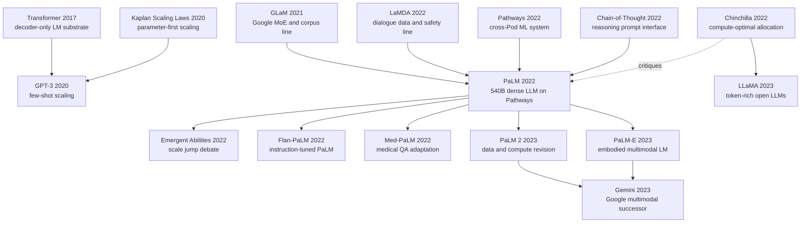

# PaLM — Scaling Dense Language Models to 540B with Pathways

> **On April 4, 2022, Google Research announced PaLM in an official blog post; on April 5, Chowdhery, Narang, Devlin, and 64 coauthors posted [arXiv:2204.02311](https://arxiv.org/abs/2204.02311).** The drama of the paper was not merely the headline number, 540B dense parameters. It was Google stress-testing the Pathways promise on a real frontier language model: 6,144 TPU v4 chips across two Pods, 780B training tokens, 46.2% model FLOPs utilization, and 57.8% hardware FLOPs utilization. PaLM pushed BIG-bench, GSM8K reasoning, multilingual transfer, and code generation to the 2022 frontier, yet it also arrived in the same month as Chinchilla, which made the uncomfortable point that PaLM was spectacular and still token-starved. That tension is why PaLM is historically useful: it is both the high-water mark of the parameter arms race and one of the last grand demonstrations before the field relearned how much data allocation mattered.

## TL;DR

Chowdhery, Narang, Devlin, and 64 coauthors introduced PaLM in 2022 as Google's 540B-parameter dense decoder-only Transformer trained with the Pathways system. Under the dense-Transformer compute approximation $C \approx 6ND$, PaLM pushed $N$ to 540.35B, trained on 780B tokens, and used a very specific engineering recipe: SwiGLU, a parallel Transformer block, multi-query attention, RoPE, a 256k lossless SentencePiece vocabulary, Adafactor, and a stabilizing z-loss. The systems result was as important as the model result: 6,144 TPU v4 chips across two Pods, 238.3K tokens/s throughput, 46.2% model FLOPs utilization, and 57.8% hardware FLOPs utilization. Conceptually, PaLM replaced the post-GPT-3 feeling that 175B might already be close to the ceiling with a blunt industrial answer: no, dense scaling was still buying capability. PaLM 540B set single-checkpoint large-LM few-shot SOTA on 28 of 29 English NLP tasks, reached 69.3 on 5-shot MMLU, beat prior SOTA on 44 of 58 common BIG-bench tasks, reached 58% on GSM8K with 8-shot chain-of-thought plus a calculator, and achieved 76.2 pass@100 on HumanEval before code-only finetuning.

The counterintuitive lesson is that PaLM proved two things at once: further scale still worked, and parameter-first scaling was already reaching a bad allocation regime. The paper itself asks what would happen if a 62B model were trained for 7T tokens; the same-month Chinchilla paper answered that question by showing that 540B/780B is only about 1.44 tokens per parameter, far from the later 20 tokens/parameter rule of thumb. PaLM's legacy therefore splits in two. One branch leads to Flan-PaLM, Med-PaLM, PaLM-E, PaLM 2, and Gemini. The other branch turns PaLM into a reference point for the token-rich, parameter-modest philosophy later visible in LLaMA and most efficient open LLMs.

---

## Historical Context

### What was the LLM field stuck on in early 2022?

PaLM appeared in an unusually revealing in-between moment for large language models. In May 2020, [GPT-3](https://arxiv.org/abs/2005.14165) had shown that a 175B-parameter autoregressive model could do meaningful few-shot learning, but it left two questions unresolved: would dense parameter scaling keep buying new capabilities, and could such models be trained reproducibly and efficiently by an industrial system rather than by heroic one-off engineering? By late 2021 the answer was still incomplete. DeepMind's Gopher 280B, Microsoft/NVIDIA's MT-NLG 530B, Google's GLaM, and LaMDA each illuminated one part of the frontier: analysis, GPU pipeline scale, sparse MoE scaling, and dialogue safety. No Google dense LLM paper had yet put bigger models, stronger systems, broad evaluation, and risk analysis on the same table.

PaLM entered exactly that window. It was not the first large language model and not the first model in the 500B-parameter range. Its real contribution was to answer whether Google's next-generation Pathways system could push a conventional but enormous decoder-only Transformer to the frontier. The title is honest in putting Pathways next to language modeling: half of PaLM's technical story is about the model, and half is about the training system. Without 6,144 TPU v4 chips, pod-level data parallelism across two Pods, and the JAX/T5X/XLA/Flaxformer stack, 540B parameters would have remained a proposal number rather than a trained model.

### The 5 immediate predecessors that pushed PaLM out

**GPT-3 (Brown et al., 2020)** set PaLM's external reference point: decoder-only architecture, left-to-right language modeling, few-shot evaluation, natural-language task descriptions, and a handful of exemplars. PaLM keeps that evaluation philosophy but moves from 175B to 540B parameters, from 300B to 780B training tokens, and broadens the evaluation surface to BIG-bench, GSM8K, code, multilingual benchmarks, and risk analysis.

**Kaplan scaling laws (2020)** supplied the early resource-allocation mindset: larger parameter counts predictably reduce loss and improve few-shot performance. PaLM inherits that optimism about continued scaling, but it also pushes the recipe to the point where cracks become visible. Section 13 directly asks what would happen if a 62B model were trained for 7T tokens, or a 120B model for 3.6T tokens. That question is almost a pre-announcement of Chinchilla.

**GLaM and LaMDA (Google, 2021-2022)** provided Google's internal experience with data, evaluation, and serving. PaLM's 780B-token corpus follows the LaMDA/GLaM data line: multilingual conversations, filtered web pages, books, Wikipedia, news, and GitHub code. PaLM does not take GLaM's sparse MoE route; it uses a dense model to show that Google's training stack can still move the frontier without conditional computation.

**Pathways (Barham et al., 2022)** is the systems predecessor. Google had introduced Pathways as a vision for a model that generalizes across tasks, modalities, and hardware with high efficiency. PaLM is its first large language-model landing point. Training is neither a traditional single-cluster run nor a pipeline split across stages; one Python client dispatches work to two TPU v4 Pods, and both sides exchange gradients every step while maintaining bitwise-identical parameters.

**Chain-of-thought prompting (Wei et al., 2022)** supplied the magnifying glass for PaLM's capability jump. On GSM8K, SVAMP, MAWPS, StrategyQA, and related tasks, size alone is not enough; the model must be prompted to write intermediate reasoning steps before the answer. The PaLM 540B + CoT combination made the 2022 reader see, very concretely, that scale was not only improving text continuation but also stabilizing multi-step reasoning formats.

### What was the author team doing?

PaLM is a classic Google Brain-scale engineering paper. The author list has 67 names, and the appendix decomposes contributions by project phase. Aakanksha Chowdhery, Sharan Narang, and Jacob Devlin are co-first authors; Narang, Chowdhery, and Noah Fiedel led the overall project; Noam Shazeer, Yi Tay, Rewon Child, and others worked on architecture and optimizer selection; Paul Barham, Sanjay Ghemawat, Michael Isard, Hyeontaek Lim, and others connected Pathways to the training loop; Jason Wei, Xuezhi Wang, and Denny Zhou handled reasoning evaluation; Katherine Lee, Daphne Ippolito, and Jacob Devlin handled memorization; Marie Pellat, Kevin Robinson, Sunipa Dev, Parker Barnes, and others handled Responsible AI and risk analysis.

That division of labor reveals what PaLM really is. It is not a paper where one module proposal carries the contribution. It is Google compressing language modeling, distributed systems, data pipelines, evaluation infrastructure, safety analysis, and product-grade serving experience into a 100-plus-page report. The first-author group includes both scaling/modeling and infrastructure ownership; the final advisory group includes Kathy Meier-Hellstern, Douglas Eck, Jeff Dean, Slav Petrov, and Noah Fiedel. PaLM is therefore a bridge: one end is the Transformer/LLM research line, the other is Google's data-center and TPU product line.

### State of industry, compute, and data

The industrial background of April 2022 was the peak of the parameter race. Gopher 280B had appeared only months earlier, MT-NLG 530B had pushed dense parameter counts past the 500B headline, and DeepMind's Chinchilla would arrive in the same month to argue that token/parameter allocation was wrong. PaLM stands between those two stories: it displays Google's system scale with 540B parameters, but uses only 780B training tokens, about 1.44 tokens per parameter. In hindsight it is both astonishingly strong and visibly undertrained.

The hardware behind PaLM 540B was two TPU v4 Pods: 6,144 chips and 1,536 hosts. The paper reports 238.3K tokens/s average throughput, 46.2% model FLOPs utilization, 57.8% hardware FLOPs utilization, and cross-Pod gradient transfer bursts around 81 Tbps. Those numbers matter because PaLM's contribution is not just “spend more money on a bigger model.” It proves that pipeline-free training across Pods can reach nearly 2x weak scaling. Compared with MT-NLG's pipeline parallelism, PaLM chooses pod-level data parallelism plus within-Pod model/data sharding, reducing pipeline bubbles while moving pressure to the data-center network.

The data side has the same 2022 industrial character. The 780B tokens are not a public corpus; they are a Google-internal mixture: 50% multilingual social-media conversations, 27% multilingual filtered web pages, 13% English books, 5% GitHub code, 4% multilingual Wikipedia, and 1% English news. The paper trains for one epoch to avoid repeating subcorpora, while also acknowledging that some components begin to repeat after 780B tokens. That boundary, where the data is very large but not infinite, is precisely the starting point for Chinchilla and LLaMA's later rethinking of training allocation.

## Background and Motivation

### The real question PaLM wanted to answer

PaLM's central question is not simply “can we reach 540B parameters?” It asks three more specific things. First, does a dense decoder-only Transformer still benefit from scale after GPT-3? Second, can Google's Pathways system efficiently train one model across multiple TPU Pods? Third, do the resulting gains appear only on traditional NLP tasks, or also on harder surfaces such as reasoning, code, multilingual transfer, and BIG-bench?

The experimental design follows those questions. Three model scales, 8B, 62B, and 540B, are trained with the same data and vocabulary to observe log-linear and discontinuous improvements. Evaluation covers 29 English NLP tasks, MMLU, BIG-bench, reasoning, code, translation, multilingual generation, and multilingual QA. Memorization, dataset contamination, bias/toxicity, a model card, and a datasheet respond to the obvious criticism that scaling capability also scales risk.

### Why Pathways is not decorative in the title

If you look only at the architecture, PaLM is intentionally plain: dense decoder-only Transformer, next-token prediction, 2048-token context, and standard few-shot evaluation. What makes the paper possible is that Pathways pushes this plain model to a scale that was previously hard to execute. In PaLM, Pathways does the following: one client dispatches a training batch to two TPU v4 Pods; inside each Pod, 12-way model parallelism and 256-way fully sharded data parallelism run the model; the two Pods compute gradients on their halves of the batch, exchange gradients through the data-center network, and synchronously apply identical updates.

The significance is that “training a large model” becomes more than a modeling script. It becomes a system problem involving data-center networking, compiler choices, schedulers, checkpointing, deterministic input pipelines, and evaluation infrastructure. PaLM's later influence is not only in its benchmark numbers but in this systems view: if LLMs are to become infrastructure, model, data, training system, and evaluation must be designed together. PaLM is Google's first complete public answer to that proposition.

---

## Method Deep Dive

### Overall framework

PaLM's method can be compressed into one sentence: **use Google's Pathways system to train an engineered dense decoder-only Transformer at three scales, 8B, 62B, and 540B, on the same 780B-token corpus, then use a very broad evaluation surface to observe what scaling changes.** There is no retrieval, no MoE routing, no new pretraining objective, and no RLHF. The training objective remains standard autoregressive language modeling: predict the next token from its prefix.

$$
\mathcal{L}_{\text{LM}}=-\sum_{t=1}^{T}\log p_\theta(x_t\mid x_{<t})
$$

That simplicity is the point. PaLM wants to test whether dense Transformers still generate new capabilities when the architecture is stable, the training system is powerful, and the data is large. The paper trains three model sizes as controlled comparisons: 8B with 32 layers, 62B with 64 layers, and 540B with 118 layers. The three use the same training data, vocabulary, and most of the same recipe; scale and batch schedule are the main differences. That makes BIG-bench discontinuities, GSM8K chain-of-thought gains, and code sample efficiency easier to attribute to scale and systems rather than to an extra module.

| Model | Layers | heads | $d_{model}$ | Parameters | batch schedule |
|---|---:|---:|---:|---:|---|
| PaLM 8B | 32 | 16 | 4096 | 8.63B | 256 -> 512 |
| PaLM 62B | 64 | 32 | 8192 | 62.50B | 512 -> 1024 |
| PaLM 540B | 118 | 48 | 18432 | 540.35B | 512 -> 1024 -> 2048 |

Each attention head has dimension 256, and the feed-forward dimension is always $4d_{model}$. PaLM 540B therefore has $d_{ff}=73728$, making every layer's MLP and attention dominated by enormous matrix multiplications. The paper's practical optimization target is not a new block type; it is making those matrix multiplications run stably across thousands of TPU chips.

### Key Design 1: Dense decoder-only scaling on Pathways

**Function**: keep the model as a dense decoder-only Transformer so every token activates the same parameters, then use Pathways to split training across two TPU v4 Pods. This is deliberately conservative. It keeps PaLM's evaluation claim clean: if capabilities improve, the likely drivers are scale, data, and the training system, not MoE routing, a retrieval cache, or task-specific heads.

For dense Transformers, the training FLOPs approximation is:

$$
C \approx 6ND
$$

where $N$ is parameters and $D$ is training tokens. PaLM 540B uses $N=540.35\text{B}$ and $D=780\text{B}$; the paper reports about $2.5272\times10^{24}$ training FLOPs, or 2527.2 ZFLOPs. That is roughly 4.3x the compute of Chinchilla 70B/1.4T at 588 ZFLOPs, while PaLM's token/parameter ratio is only about 1.44. This is the root of its later reputation as powerful but not compute-optimal.

A simplified view of **Pathways training** is:

```python
def palm_pathways_step(batch):
    pod_a_batch, pod_b_batch = split(batch, parts=2)
    grad_a = tpu_pod_forward_backward(pod_a_batch, shard="pod_a")
    grad_b = tpu_pod_forward_backward(pod_b_batch, shard="pod_b")
    grad_a_remote, grad_b_remote = cross_pod_exchange(grad_a, grad_b)
    apply_update(grad_a + grad_a_remote, shard="pod_a")
    apply_update(grad_b + grad_b_remote, shard="pod_b")
    assert bitwise_identical_parameters("pod_a", "pod_b")
```

The design motivation is straightforward. Pipeline parallelism creates bubbles, and micro-batches increase weight reload pressure. Pathways lets each Pod keep the full model-sharding layout internally, while the Pods participate in two-way data parallelism. The cost is bursty network traffic: the paper reports roughly 1.3GB of gradients exchanged per host per step across 1,536 hosts, an aggregate burst near 81 Tbps. PaLM's systems contribution is exactly there: converting model scale into a data-center scheduling, compilation, and reproducibility problem.

| Training system | Hardware scale | Main parallel axis | reported efficiency | Key risk |
|---|---:|---|---:|---|
| GPT-3 | V100 cluster | model/data parallel | 21.3% MFU | low GPU-cluster utilization |
| Gopher | 4096 TPU v3 | multi-Pod + pipeline | 32.5% MFU | pipeline bubbles |
| MT-NLG | 2240 A100 | tensor + pipeline | 30.2% MFU | cross-node pipeline complexity |
| PaLM 540B | 6144 TPU v4 | Pathways pod-level data parallel | 46.2% MFU / 57.8% HFU | 81Tbps gradient burst |

### Key Design 2: Parallel Transformer block and SwiGLU

PaLM's block is still a pre-norm decoder block, but it changes the standard serial formulation into a parallel one. A standard Transformer block can be written as:

$$
y=x+\mathrm{MLP}(\mathrm{LN}(x+\mathrm{Attention}(\mathrm{LN}(x))))
$$

PaLM uses the parallel formulation:

$$
y=x+\mathrm{MLP}(\mathrm{LN}(x))+\mathrm{Attention}(\mathrm{LN}(x))
$$

The goal is not expressivity but training speed. The input matrix multiplications for attention and MLP can be fused more effectively, and the paper reports about 15% faster training at large scale. An 8B ablation shows slight quality degradation; a 62B ablation shows no degradation, so the authors extrapolate that the effect should be quality-neutral at 540B. That decision has an industrial flavor: not every small-scale ablation is perfect, but the team must decide before a 540B run that cannot be repeated casually.

SwiGLU is another quality/efficiency trade-off. PaLM's MLP uses Shazeer 2020's gated activation instead of ReLU or GELU:

$$
\mathrm{SwiGLU}(x)=\mathrm{Swish}(xW)\odot xV
$$

It requires three matrix multiplications rather than two, but compute-equivalent experiments showed better quality. PaLM is one of the first flagship dense LLMs at the 500B scale to publicly adopt SwiGLU; later LLaMA, Mistral, Qwen, Gemma, and related open models made gated FFNs the default. The lesson is that PaLM's architectural “innovations” look small, but it stress-tested a set of small parts that later became standard LLM components.

| Design piece | Role in PaLM | Direct benefit | Later influence |
|---|---|---|---|
| SwiGLU | replaces ReLU/GELU MLP | better quality/compute trade-off | default FFN path in LLaMA/Mistral/Qwen/Gemma |
| Parallel block | parallel attention and MLP branches | about 15% training speedup at scale | GPT-J/PaLM-style block reused later |
| No bias | removes dense-kernel / LayerNorm bias | improved stability in large models | common simplification in LLM implementations |
| Shared embedding | ties input/output embeddings | saves parameters and stabilizes logits | common decoder-only LM practice |

### Key Design 3: Multi-query attention, RoPE, and lossless vocabulary

Multi-query attention is PaLM's advance investment in inference cost. Standard multi-head attention stores separate key/value tensors for every head. Multi-query attention keeps multiple query heads but shares one key/value projection across heads. Training quality and speed are mostly neutral, but autoregressive decoding uses much less KV cache. For a 540B model, inference is not the paper's main benchmark target, yet it is already a systems bottleneck; PaLM ties “trainable” and “servable” together.

RoPE supplies positional information. PaLM uses rotary positional embeddings rather than absolute or relative embeddings, arguing that RoPE performs better on long sequence lengths. PaLM's training context is still 2048 tokens, not the 32K/128K regime of later models, but RoPE had already become the safer choice compared with learned absolute positions. LLaMA later inherited RoPE and turned it from a Google-internal choice into an open-LLM default.

The vocabulary design serves multilingual text and code. PaLM uses a 256k lossless SentencePiece vocabulary that preserves whitespace, splits out-of-vocabulary Unicode characters into UTF-8 bytes, and splits numbers into individual digit tokens. The last point is easy to miss, but the paper explicitly suspects digit-level tokenization may help GSM8K-like arithmetic tasks. Preserving whitespace also matters for code; a large multilingual vocabulary reduces tokenization damage outside high-resource English.

| Sub-design | Concrete choice | Why it matters for PaLM | Typical consequence |
|---|---|---|---|
| Multi-query attention | many query heads share key/value | lowers 540B inference KV-cache cost | later serving stacks prioritize MQA/GQA |
| RoPE | rotary positional embedding | more robust than absolute/relative for longer sequences | inherited by LLaMA-style open models |
| 256k lossless vocab | preserves whitespace, UTF-8 bytes, digit-by-digit numbers | supports multilingual text, code, and arithmetic prompts | code/digit tasks suffer less tokenization damage |
| One-epoch data | 780B tokens with minimal repetition | reduces overfitting and repeated-corpus effects | exposes the data-supply boundary |

### Key Design 4: Training stability, Adafactor, and z-loss

One of the most valuable parts of the PaLM recipe is its honesty about large-model instability. The 540B run encountered roughly 20 loss spikes at irregular intervals. The team did not find a principled fix; instead, it restarted from a checkpoint about 100 steps before the spike and skipped 200-500 batches. The paper also says those batches were not simply “bad data”: if the same surrounding batches were replayed from an earlier checkpoint, the spike did not necessarily recur. That implies loss spikes arise from interactions between specific data batches and specific parameter states, not from a simple filtering failure.

The optimizer is unfactorized Adafactor, effectively Adam with parameter scaling. The learning rate is $10^{-2}$ for the first 10k steps, then decays as $1/k$; global gradient clipping is 1.0; there is no pretraining dropout; sequence length is 2048; examples are concatenated into fixed-length chunks separated by `[eod]`. To stabilize the softmax, PaLM adds z-loss:

$$
z_{loss}=10^{-4}\cdot \log^2 Z
$$

where $Z$ is the softmax normalizer. This small term discourages uncontrolled logit-scale drift and makes the huge-vocabulary softmax more stable. It is not the most memorable design in the paper, but it is one of the fuses that lets a 540B training run finish.

| Stability component | PaLM setting | Problem addressed | Remaining issue |
|---|---|---|---|
| Adafactor parameter scaling | unfactorized Adafactor, $10^{-2}$ then $1/k$ decay | steadier LR scale across matrices | does not eliminate loss spikes |
| Global grad clipping | norm 1.0 | limits abnormal gradients | about 20 spikes still occur |
| z-loss | $10^{-4}\log^2 Z$ | stabilizes the softmax normalizer | empirical coefficient required |
| Deterministic pipeline | checkpoint replay is bitwise deterministic | makes spike localization and recovery possible | does not explain spike cause |
| Batch schedule | 1M -> 2M -> 4M tokens | balances early sample efficiency and late TPU efficiency | larger-batch generalization remains unclear |

---

## Failed Baselines

### The baselines PaLM beat at the time

PaLM's “failed baselines” should not be read as weak systems defeated by a clever trick. It beat the strongest large-language-model paradigms of 2020-2022: GPT-3's few-shot dense scaling, GLaM's sparse MoE, Gopher's DeepMind dense analysis, MT-NLG's GPU-pipeline giant model, LaMDA's dialogue model, and Codex's code-specialized model. PaLM's advantage does not come from a new objective. It comes from the sum of scale, data, systems, and a set of stable engineering choices.

| baseline | What it represented | How PaLM won | Key caveat |
|---|---|---|---|
| GPT-3 175B | few-shot dense LM reference point | much higher average across 29 English NLP tasks; PaLM 62B also beats GPT-3 averages | GPT-3 is earlier, with different data/eval details |
| GLaM 64B/64E | Google's sparse MoE route | PaLM 540B refreshes GLaM results on most English NLP few-shot tasks | GLaM uses lower inference FLOPs and optimizes a different trade-off |
| Gopher 280B | DeepMind dense scaling analysis | PaLM is stronger in BIG-bench, several QA comparisons, and MMLU context | Chinchilla later shows Gopher was undertrained |
| MT-NLG 530B | one of the largest dense parameter counts | PaLM is better on most benchmarks at similar nominal parameter scale | data, system, and token count all differ |
| Codex 12B | code-specialized model | PaLM 540B reaches comparable HumanEval few-shot with 50x less Python code | Codex is code-specialized and API/contamination details are not fully knowable |

The shared lesson across these baselines is that the 2022 LLM frontier was no longer decided by one clever module. It was decided by who could jointly move data, hardware, model recipe, and evaluation infrastructure. PaLM's 540B dense model is not elegant, and from a Chinchilla perspective it is not economical, but it converts systems intensity directly into benchmark performance.

### Failures the paper itself acknowledges

One of the most admirable parts of the PaLM paper is that it does not hide failures. The largest model encounters roughly 20 loss spikes during training. The team does not find a principled fix; it rewinds to a checkpoint before the spike and skips a few hundred batches. For a 540B model, that means stability is still empirical engineering: the model can be trained to completion, but the team does not fully understand why a particular step explodes.

Section 13 also raises the Chinchilla-style question directly: what if the same training budget were spent on a smaller model trained for more tokens? The authors mention possible alternatives such as a 62B model trained for 7T tokens, a 120B model for 3.6T tokens, or a 240B model for 1.8T tokens. PaLM does not run those experiments because full-scale ablations are expensive, data repetition appears, and batch size / TPU efficiency become difficult. That omission later becomes the center of Chinchilla and LLaMA.

| Exposed issue | How the paper describes it | Why it matters | Who continued the fix |
|---|---|---|---|
| loss spikes | about 20 irregular spikes, mitigated by rewind + skipped batches | large-model stability still relies on empirical recovery | later optimizer, norm, data-ordering, checkpoint strategies |
| token/parameter ratio | openly asks whether smaller models trained longer would be better | anticipates PaLM's non-compute-optimal allocation | Chinchilla, LLaMA, Mistral |
| repeated data | some subcorpora start repeating after 780B tokens | data is not an infinite resource | Chinchilla data allocation, LLaMA token-rich corpus |
| prompt variance | WebQuestions and other results vary across checkpoint/prompt choices | few-shot scores are not absolute one-point truths | HELM, lm-eval, multiple-seed evaluation |

### Problems scale did not truly solve

PaLM is strong, but the paper's failure signals are clear. On BIG-bench, PaLM 540B exceeds average human performance in aggregate, yet average human performance is still higher on 35% of individual tasks. In BIG-bench Lite, tasks such as navigate, symbol interpretation, logic grid puzzle, tracking shuffled objects, and Chinese remainder theorem remain far from best-human performance. Scale unlocks some capabilities; it does not solve systematic reasoning, strict symbolic manipulation, or long-horizon state tracking in one shot.

Risk also does not disappear with scale. The memorization experiment shows that PaLM 540B exactly reproduces the 50-token continuation of random training spans 2.4% of the time, higher than 8B's 1.6%. Spans seen more than 500 times have over 40% memorization rate for 540B. Bias/toxicity analysis also shows religious, racial, and gendered stereotype associations in data and outputs, including Islam co-occurring with terms such as terrorist, violent, and radical. The paper stresses that these analyses are mostly English-centric and do not cover every language or cultural context.

Code is bounded too. PaLM-Coder reaches a high DeepFix compile rate, but the paper explicitly notes that compiling is not the same as being safe, robust, or correct. The student-C-program setting permits assumptions that would be undesirable in production. A model-generated patch may pass a small test suite and still contain subtle bugs or security issues. This point becomes even more important in the code-assistant era: pass@k is a capability metric, not a deployment guarantee.

### The real anti-baseline lesson

Compressed into one sentence, PaLM's failure case is this: **scale is a necessary but insufficient infrastructure variable.** It can push models across capability thresholds, but it does not automatically produce optimal training allocation, explained stability, open reproducibility, safe behavior, or reliable reasoning. PaLM's historical value comes from showing both the power of scale and the blind spots of scale at the same time.

In hindsight, PaLM was not simply “beaten” by one later model. It was decomposed by multiple directions. Chinchilla decomposed it into a training-economics problem: too many parameters, too few tokens. InstructGPT and Flan-PaLM decomposed it into an interaction problem: a strong base model still needs instruction tuning and alignment. LLaMA decomposed it into an ecosystem problem: a closed giant model can be approached by smaller, better-trained open models. PaLM's failure is not uselessness; it is the clarity with which it exposed the next set of questions.

## Key Experimental Data

### Main experiment 1: English NLP and MMLU

PaLM's first hard result is the 29-task English NLP suite. The paper compares only pretrained single-checkpoint few-shot / one-shot results, excluding instruction tuning and multitask adaptation. PaLM 540B wins 24 of 29 tasks in the 1-shot setting and 28 of 29 in few-shot. On average NLG/NLU, PaLM 62B already surpasses GPT-3 175B, and PaLM 540B pulls further ahead.

| Model | Params | Training tokens | Avg NLG 1-shot | Avg NLU 1-shot | MMLU 5-shot |
|---|---:|---:|---:|---:|---:|
| GPT-3 | 175B | 300B | 52.9 | 65.4 | 43.9 |
| GLaM | 64B/64E | 1.6T | 58.4 | 68.7 | - |
| PaLM 8B | 8.63B | 780B | 41.5 | 59.2 | - |
| PaLM 62B | 62.50B | 795B | 57.7 | 67.3 | 53.7 |
| PaLM 540B | 540.35B | 780B | 63.9 | 74.7 | 69.3 |

The MMLU number, 69.3, is the one people often remember because it places PaLM on the GPT-3 / Gopher / Chinchilla comparison line. But PaLM 62B is just as revealing: with roughly one-third of GPT-3's parameters, it approaches or beats GPT-3's average NLG/NLU results. PaLM's gain is therefore not “parameters only.” Better data, longer training, and stronger recipe matter too.

### Main experiment 2: BIG-bench and discontinuous behavior

BIG-bench is the part of the PaLM paper that most strongly creates the feeling of capability jumps. PaLM 540B wins 44 of 58 common tasks against prior SOTA in 5-shot and exceeds average human aggregate performance. Across 150 textual tasks, roughly 25% have more than +10% discontinuity from 62B to 540B, and roughly 15% exceed +20%. These results were repeatedly cited by later work on emergent abilities and also triggered debate about metric scaling and nonlinear presentation.

| BIG-bench phenomenon | PaLM 8B | PaLM 62B | PaLM 540B | Interpretation |
|---|---:|---:|---:|---|
| logical_sequence normalized score | 13 | 25 | 87 | 62B -> 540B jump far exceeds log-linear projection |
| english_proverbs | about 25 | - | 87 | abstract metaphor understanding jumps sharply |
| 58 common tasks | - | - | wins 44/58 | against GPT-3/Gopher/Chinchilla prior SOTA |
| aggregate human comparison | - | - | above average human | still loses to average humans on 35% of individual tasks |

This section is both PaLM's highlight and the source of later controversy. It convinced many researchers that sufficiently large models can suddenly do things smaller models cannot, but it also led evaluation researchers to ask how much of the discontinuity comes from real capability thresholds and how much comes from metric normalization, multiple-choice chance correction, or display choices. PaLM gave the phenomenon; later work had to unpack it.

### Main experiment 3: reasoning and CoT

PaLM's reasoning results are inseparable from chain-of-thought prompting. On GSM8K, PaLM 540B without CoT reaches only 17%. With 8-shot CoT it reaches 54%. With CoT plus an external calculator it reaches 58%, surpassing the previous GPT-3 finetuning + CoT + calculator + verifier result of 55%. The numbers show two facts at once: scale makes intermediate reasoning chains more stable, but arithmetic is still not fully reliable, so a calculator remains useful.

| Setting | GSM8K accuracy | Reading |
|---|---:|---|
| PaLM 540B without CoT | 17% | direct answering remains weak |
| PaLM 62B + CoT | 33% | CoT helps, but size is insufficient |
| PaLM 540B + CoT | 54% | scale and CoT combine into a jump |
| PaLM 540B + CoT + calculator | 58% | beats prior SOTA of 55% |
| GPT-3 finetune + CoT + calculator | 34% | far behind without a verifier |
| GPT-3 finetune + CoT + calculator + verifier | 55% | task-specialized system is matched by few-shot PaLM |

Across seven reasoning benchmarks, PaLM 540B + CoT reaches SOTA on GSM8K, MAWPS, SVAMP, and StrategyQA, and close-to-SOTA on ASDiv, AQuA, and CommonsenseQA. The paper also shows qualitative joke-explanation and logical-inference examples, which became part of the public discussion about whether the model “understands.” Strictly speaking, they are not quantitative proof; historically, they provided the first vivid PaLM-era image of a model explaining its own answer.

### Main experiment 4: code, multilingual, and risk data

PaLM's code results are often underrated. Only 5% of its pretraining mixture is GitHub code, for 39B code tokens and about 2.7B Python tokens. Compared with Codex 12B's reported 100B Python tokens, PaLM reaches comparable HumanEval few-shot performance with far less Python-specific data. PaLM-Coder then finetunes on Python-heavy code and reaches 88.4 HumanEval pass@100 and 82.1% DeepFix compile rate.

| Result category | PaLM 540B | PaLM-Coder 540B | Comparison / meaning |
|---|---:|---:|---|
| HumanEval pass@100 | 76.2 | 88.4 | Codex 12B is 72.3 |
| HumanEval pass@1 | 26.2 | 36.0 | pretraining-only approaches a code-specialized model |
| MBPP pass@1 | 36.8 | 47.0 | code finetuning remains valuable |
| DeepFix compile rate | 73.7 | 82.1 | prior work is 71.7 |
| Memorization exact continuation | 2.4% | - | 540B exceeds 8B's 1.6% |
| Toxic continuation risk | strongly tied to prompt toxicity | - | 62B and 540B toxicity curves are similar |

The multilingual results reveal another side. Although only about 22% of non-code tokens are non-English, PaLM already approaches or exceeds some specialized systems in translation, TyDiQA, and GEM generation. But the paper also acknowledges that non-English generation, non-Western fairness contexts, dialects, and code-switching are not adequately covered. PaLM is a strong generalist, but its generality is still constrained by training data, evaluation languages, and deployment context.

---

## Idea Lineage

### Mermaid Citation Graph



### Ancestors: from GPT-3 to Google's own scale stack

PaLM's ancestry is not a single line; it is a convergence of three lines. The first is GPT-3's decoder-only few-shot scaling: use natural-language prompts and a small number of examples to adapt a model temporarily, without finetuning every task. PaLM accepts that paradigm and scales it to a larger model, longer training, and a wider benchmark surface.

The second is Google's internal model and data line. T5 had shown the power of large-scale text-to-text pretraining and unified task formatting; GLaM had shown that Google's filtered corpus and MoE systems could support a trillion-parameter headline; LaMDA had brought dialogue, safety, and data documentation into Google's LLM workflow. PaLM does not appear from nowhere; it compresses those experiences back into a dense decoder-only model.

The third is the systems line: Mesh TensorFlow, GSPMD, T5X, Pathways, TPU v4 Pods, the XLA compiler, and data-center networking. Without that line, PaLM would be a larger GPT-3 replica. With it, PaLM becomes the public stress test of Google's training infrastructure. That is why the paper spends so much space on systems, data, risks, and appendices.

| Predecessor | What it passes to PaLM | PaLM's transformation | Later misreading |
|---|---|---|---|
| Transformer 2017 | decoder/self-attention substrate | 118-layer dense decoder-only LM | assuming the architecture itself is highly novel |
| GPT-3 2020 | few-shot prompting paradigm | larger dense model + broader evaluation | assuming PaLM is just GPT-3 scaled up |
| Kaplan 2020 | scaling-law optimism | pushes parameters to 540B | ignoring token-allocation problems |
| GLaM/LaMDA 2021-22 | Google corpus, evaluation, safety experience | returns from sparse/dialogue to dense generalist | ignoring internal system accumulation |
| Pathways 2022 | cross-Pod dataflow system | 6,144 TPU v4 pipeline-free training | treating Pathways as marketing copy |

### Descendants: PaLM splits into three successor lines

PaLM's first afterlife is instruction-tuned PaLM. Flan-PaLM connects PaLM to FLAN-style instruction tuning and dramatically improves zero-shot/few-shot usability; Med-PaLM then brings Flan-PaLM, CoT, and self-consistency into medical question answering, becoming an early landmark for medical LLM evaluation. In this line, PaLM is the strong base model: not directly the user-facing system, but the substrate shaped by instruction tuning, domain prompting, and safety filtering.

The second afterlife is multimodal and embodied PaLM. PaLM-E injects visual and state inputs into a language model and uses PaLM as an embodied-reasoning backbone. PaLM-SayCan combines language-model planning with robot affordance models. RT-2 later connects PaLM-E / PaLI-X-style VLM backbones to robot action tokens. In this lineage, PaLM is not merely a chatbot; it is Google's attempt to turn language models into a general semantic and decision layer.

The third afterlife is Google's own successor line: PaLM 2 and Gemini. PaLM 2's technical report clearly absorbs the post-Chinchilla lesson, emphasizing data quality, multilinguality, reasoning, and compute-efficient training rather than another parameter-count headline. Gemini then pushes the PaLM / PaLM-E / Pathways systems line into native multimodality. PaLM is the last Google flagship centered primarily on dense text-LM scale before that transition.

### Misreadings: PaLM is not proof that bigger parameters always win

The most common misreading of PaLM is to treat it as evidence that “540B parameters win.” The paper is more complicated. It does show that dense LM scaling after GPT-3 still works, but it also lists the open question itself: would smaller models trained on more tokens do better? Chinchilla answered in the same month: under fixed training budgets, PaLM, Gopher, MT-NLG, and GPT-3 were all biased toward over-parameterization and under-training. PaLM is not the endpoint of parameter worship; it is the scene where the problem becomes visible.

The second misreading is “emergent abilities = mysterious emergence.” PaLM's BIG-bench discontinuities are striking, but later evaluation work reminds us that metric normalization, chance baselines, task selection, and plotting scale all affect the visual impression of a jump. The safer reading is that some tasks produce little measurable behavior at 8B/62B but become measurable at 540B. That need not imply a literal discrete switch inside the model.

The third misreading is that Pathways is just a branding term. The paper's details say otherwise: 6,144 TPU v4 chips, two Pods, 81Tbps gradient bursts, 1.95x weak scaling, and a bitwise-deterministic pipeline. These are not decorative appendix details. They are the difference between PaLM and a generic “larger Transformer.”

### Historical position

Historically, PaLM is a hinge. It pushes post-GPT-3 dense few-shot scaling to Google's public limit, showing the field that further scale can unlock BIG-bench behavior, CoT reasoning, code, and multilingual capability. At the same time, it puts token scarcity, loss spikes, closed data, incomplete risk evaluation, and benchmark controversy on paper. It is both a victory for the old scaling paradigm and a prelude to the next one.

After 2023, the most successful LLMs no longer ask only “how many parameters?” The questions become: are there enough training tokens, how good is the data, is the model instruction-tuned, is there RLHF/RLAIF, what is inference cost, how long is the context, is it open, can it use tools, and is it multimodal? PaLM does not answer all of those questions, but it makes them unavoidable. The most useful thing to remember is not 540B itself; it is the transition from “can we scale?” to “what kind of scaling is worth doing?”

---

## Modern Perspective

### What still holds in 2026?

First, PaLM was right that dense decoder-only Transformers still had scaling room. After 2022, LLaMA, Mistral, Qwen, Gemma, DeepSeek, GPT-4-class systems, and Gemini-class systems all continued to show that, with sufficiently good data, training, and post-training recipes, decoder-only Transformers remain the most reliable foundation-model backbone. PaLM was not the last dense LLM; it was the industrial rehearsal before the dense/open LLM explosion.

Second, PaLM was right about the importance of systems engineering. In modern frontier training, the hard part is rarely writing a Transformer class. The hard parts are deduplication, tokenization, parallelism, checkpointing, fault recovery, optimizer stability, evaluation pipelines, serving cost, and safety monitoring. PaLM put those topics in the paper, making clear that an LLM is not a model file but an infrastructure stack.

Third, PaLM was right that CoT and scale interact. Later self-consistency, tool use, program-of-thought, verifiers, process reward models, and reasoning models all extend the same intuition in different ways: a large model's generation ability can organize intermediate computation, not just emit final answers. PaLM is not the endpoint of reasoning, but it helped make “write the reasoning process” a central interface for demonstrating LLM capability.

| 2022 PaLM claim | 2026 status | Why it still matters |
|---|---|---|
| dense Transformers still scale | true, but not by parameters alone | architecture remains stable; data/training/alignment are main variables |
| system efficiency decides trainability | even more true | training and inference are systems competitions |
| CoT amplifies reasoning ability | true, but needs verifiers/tools | intermediate generation is an interface, not a reliability guarantee |
| multilingual/code skills can emerge from a generalist | partly true | better data allocation and specialized evaluation are still needed |

### Which assumptions no longer hold?

The most obvious broken assumption is parameter-first scaling. PaLM 540B has about 1.44 training tokens per parameter, which looks extremely low today. Chinchilla, LLaMA, Llama 2/3, Qwen, DeepSeek, and related models all show that training tokens, data quality, and inference economics matter more than headline parameter count. PaLM is not weak; its training economics still belong to the GPT-3/Kaplan era.

The second broken assumption is that a strong few-shot base model is enough as a product interface. The PaLM paper shows impressive few-shot ability, but after ChatGPT and InstructGPT the industry quickly learned that base models need instruction tuning, RLHF/RLAIF, safety policies, tool interfaces, and product-grade evaluation to become stable assistants. Flan-PaLM and Med-PaLM are direct corrections of that limitation.

The third broken assumption is that closed giant-model reports are sufficient for reproducible science. PaLM's weights, training data, and full training code were never released. External researchers can reproduce the idea but not the experiment. After 2023, LLaMA's release/leak, Mistral/Qwen/DeepSeek open models, and data efforts such as OpenWebText, FineWeb, and RedPajama shifted community attention from reading giant-model reports to actually training, finetuning, and evaluating models. PaLM remains scientifically valuable, but its reproducibility value is limited.

### Lessons for training LLMs today

PaLM's first lesson for today is: **systems bottlenecks belong in the paper.** If a design requires thousand-chip training, reporting loss and benchmarks is not enough. A serious report should include throughput, MFU/HFU, fault recovery, parallelism, batch schedule, data repetition, energy, and serving constraints. PaLM is more transparent on these axes than many later model reports.

The second lesson is: **base-model benchmarks must be read alongside risk evaluation.** PaLM reports BIG-bench, GSM8K, HumanEval, memorization, contamination, bias/toxicity, and a model card in one place. That structure became a common shape for frontier-model reports. The more general the model, the less acceptable it is to tell the story only through capability tables.

The third lesson is: **a successful training run is not the same as an optimal training run.** PaLM is successful but not compute-optimal; Chinchilla has a better allocation rule but is not a product assistant; LLaMA is more open and cheaper to infer but not a complete replacement for every closed frontier model. Modern LLM training must optimize training budget, inference budget, openness, data legality, safety, and maintainability at the same time. PaLM's value is that it put all of those dimensions on the table.

## Limitations and Future Directions

### Limitations of the paper itself

PaLM's first limitation is reproducibility. The model weights, training data, and full systems stack are not open, so external teams cannot strictly reproduce the experiments. Even with rich systems detail, 6,144 TPU v4 chips plus Google's data-center network are not an experimental condition available to academia or most companies.

The second limitation is training allocation. The paper already realizes that 540B/780B might not be the best budget allocation, but it does not run full-scale alternatives. In hindsight, this is the central gap: if Google had trained 70B/1.4T, 120B/3.6T, or 240B/1.8T models with the same data in 2022, LLM training history might have moved toward token-rich scaling sooner.

The third limitation is evaluation and risk coverage. PaLM's risk analysis was unusually broad for its time, but it is still mostly English-centric and limited in identity axes. Multilingual bias, dialects, low-resource languages, real interactive safety, tool-use risk, and stronger privacy attacks are not adequately covered. BIG-bench emergent behavior also required later, stricter evaluation methodology to interpret.

| Limitation | Acknowledged in paper? | 2026 reading | Possible improvement |
|---|---|---|---|
| closed weights/data | partly | severely limits reproduction | release small models, data cards, logs, or reproducible runs |
| non-optimal token/parameter ratio | explicitly raised as open question | central training-economics gap | multi-ratio scaling sweeps |
| unexplained loss spikes | explicitly documented | still a large-model training problem | optimizer/norm/data-ordering research |
| English-centric risk analysis | explicitly acknowledged | far from enough coverage | multilingual and multicultural benchmarks/red-teaming |
| benchmark contamination | n-gram/manual analysis performed | still insufficient | canaries, provenance, dynamic evaluation |

### Cautions when using this paper today

Do not treat every PaLM number as a perfectly comparable leaderboard point. GPT-3, Gopher, Chinchilla, GLaM, and MT-NLG use different data, prompts, shot counts, checkpoints, and cleaning strategies. PaLM makes serious comparison efforts, but the comparisons cannot be fully apples-to-apples. The robust conclusion is directional: PaLM refreshes many tasks under its evaluation framework, not that every single number permanently beats later systems.

Do not equate BIG-bench discontinuity with human-like understanding. PaLM's examples are compelling, but the model still fails badly on navigate, mathematical induction, symbol tracking, simple editing, and related tasks. The more accurate claim is that scale makes some behaviors measurable and some prompting formats stable; it does not guarantee robust reasoning.

Finally, do not mechanically copy PaLM's engineering recipe today. SwiGLU, RoPE, and MQA remain valuable, but 2026 LLMs also consider GQA, FlashAttention, long-context RoPE scaling, MoE, post-training, speculative decoding, KV-cache compression, tool calling, RLAIF, and data governance. PaLM is a baseline, not a complete modern recipe.

## Related Work and Insights

### Recommended reading path

The best way to read PaLM is to start with GPT-3, to understand the origin of few-shot dense LMs; then read Kaplan scaling laws, to understand why 2020-2022 teams favored parameter growth; then read PaLM, to see how Google pushed that route to 540B with Pathways; then read Chinchilla, to understand why PaLM-style parameter-first training is not compute-optimal; finally read Flan-PaLM, LLaMA, and PaLM 2/Gemini, to see how instruction tuning, openness, and Google's successor line revised the recipe.

| Reading order | Paper / system | What to watch for |
|---|---|---|
| 1 | GPT-3 (2020) | why few-shot prompting works at all |
| 2 | Scaling Laws (2020) | where the parameter-first prescription came from |
| 3 | PaLM (2022) | systems evidence for Pathways + 540B dense scaling |
| 4 | Chinchilla (2022) | why PaLM-like models are undertrained |
| 5 | Flan-PaLM / LLaMA / PaLM 2 | how successors revise data, instruction, openness, and training economics |

### Relationship to neighboring awesome-papers

PaLM directly inherits from 2020_gpt3: it keeps GPT-3's few-shot evaluation language but expands the system and evaluation surface. PaLM and 2022_chinchilla form a same-month tension: PaLM says “continued dense scaling still works,” while Chinchilla says “but the allocation is not economical.” They should be read together; either one alone gives a distorted picture of 2022.

PaLM is also tightly linked to 2022_cot. CoT is the interface amplifier for PaLM's reasoning results: without CoT, GSM8K is 17%; with CoT, 54%; with a calculator, 58%. PaLM's relationship to [2023_llama](../era5_genai_explosion/2023_llama.md) is ecological inversion: LLaMA uses fewer parameters, more tokens, and open weights to bring part of the pressure created by closed giants back into the community.

## Resources

### Primary sources

| Resource | Link | Use |
|---|---|---|
| PaLM arXiv | https://arxiv.org/abs/2204.02311 | paper text, metadata, version history |
| Google Research blog | https://research.google/blog/pathways-language-model-palm-scaling-to-540-billion-parameters-for-breakthrough-performance/ | official launch framing, systems and result summary |
| ar5iv HTML | https://ar5iv.labs.arxiv.org/html/2204.02311 | searchable paper tables, sections, appendices |
| Pathways paper | https://arxiv.org/abs/2203.12533 | training-system background |
| T5X / SeqIO paper | https://arxiv.org/abs/2203.17189 | Google training framework context |
| Chinchilla paper | https://arxiv.org/abs/2203.15556 | training-economics counterpoint to PaLM |


---

> 🌐 [中文版](/era4_foundation_models/2022_palm/) · 📚 awesome-papers project · CC-BY-NC