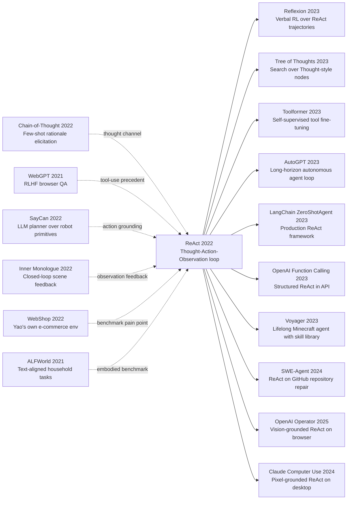

# ReAct: Synergizing Reasoning and Acting in Language Models

> **On 6 October 2022, Shunyu Yao, Jeffrey Zhao, Dian Yu and four co-authors from Princeton and Google Brain uploaded [arXiv:2210.03629](https://arxiv.org/abs/2210.03629); the paper appeared as an oral at ICLR 2023.**
> Before ReAct, large language models were "talking heads" locked in a soundproof room — ask a factual question and they would answer from imprinted training data; ask today's BTC price and they would confidently fabricate last year's number. This paper trained no new model and changed no architecture. It only specified a prompt format — `Thought: …\nAction: search[query]\nObservation: …\nThought: …\nAction: finish[answer]` — and on that thin scaffold PaLM-540B / text-davinci-002 cut the HotpotQA hallucination rate from 56% to 6%, lifted ALFWorld success from the 22% of an imitation-learning baseline to **71% (+49 absolute)**, and became the first pure-prompting WebShop agent to outscore an RL-trained policy.
> What changed was not benchmark numbers but the working metaphor of an LLM. ReAct turned a "talking encyclopedia" into "an intern who can actually browse the web". The default ZeroShotAgent in LangChain, the main loop of AutoGPT, OpenAI's function calling, Claude's tool-use API, and OpenAI Operator — every consumer-facing "AI agent" of the 2023-2025 wave runs the same Thought–Action–Observation triple at its core. ReAct is the cleanest single-paper lever on the entire agent era: **it taught LLMs to say "I don't know — let me look it up."**

## TL;DR

Yao, Zhao, Yu and four co-authors (October 2022, ICLR 2023 oral) merged the two halves of LLM problem solving into one trajectory: the model alternates between producing a `Thought_t`, emitting an `Action_t` from an extended action space (vocabulary tokens **plus** tool calls), and reading the resulting `Observation_t`, until it emits `Action_T = finish[answer]`. Formally the policy is $\pi(a_t \mid c_t)$ with context $c_t = (x, [Th_1, Act_1, Obs_1, \ldots, Th_t])$, and the only training cost is writing **2-6 few-shot exemplars** — no fine-tuning, no RL. The failed baselines it eclipses are sharp: CoT-only (no information access, HotpotQA EM drops from ReAct's 35.1 to 29.4 with 56% of wrong answers traced to hallucination), Action-only (no internal planning, HotpotQA 25.7 and ALFWorld stuck at 45%), CoT with self-consistency (21-path majority voting still only 33.4), vanilla standard prompting (27.4), and the entire pre-LLM BERT-style extractive QA pipeline that has no place in its trajectory format to ever say "I don't know — let me search."

The headline numbers are easier to read than the architecture diagram. On ALFWorld, two hand-written prompts beat the imitation-learning + DAgger BUTLER agent **71% vs 22% (+49 absolute)**; on WebShop, prompting alone overtakes an IL+RL baseline for the first time. The deeper lesson is the inversion: **not training was stronger than training**, because the bottleneck was never representational — it was the missing scaffold for the model to externalize partial beliefs and ask the world. ReAct inherits the Thought channel from [Chain-of-Thought (2022)](2022_cot.md), is generalized into a search procedure by [Tree of Thoughts (2023)](../era5_genai_explosion/2023_tot.md), is wrapped in verbal RL by Reflexion (2023), and has been productized end-to-end as the default ZeroShotAgent in LangChain, the inner loop of AutoGPT, OpenAI function calling, Claude tool use, and OpenAI Operator. It is the single most-leveraged paper of the 2023-2025 agent boom — and it shipped without retraining a single weight. See also the alternative tool-use paradigm in [Toolformer (2023)](../era5_genai_explosion/2023_toolformer.md).

---

## Historical Context

### What was the LLM community stuck on in late 2022?

Late 2022 was the most schizophrenic moment in LLM research. On one side, PaLM-540B, GPT-3 175B and text-davinci-002 had become genuinely impressive at open-ended generation, code completion and few-shot classification. On the other, those exact same models failed in spectacular fashion on two of the simplest things you could ask: **inventing dates when answering factual questions** (GPT-3's HotpotQA EM hovered around 27, and most errors were fluent confabulations), and **walking into dead ends on multi-step tasks that needed external state** (on Yao's own WebShop benchmark, pure prompting was crushed by an IL+RL-trained policy half its size). The dissonance got sharper after [CoT (2022)](2022_cot.md) had landed in January: CoT showed an LLM jumping from 17.9% to 56.9% on GSM8K, but GSM8K is a closed-world arithmetic word problem where every fact lives inside the question. The moment you asked "what's today's GBP/USD rate", "when did the Apple Vision Pro launch", or "is this chair available in red on Amazon", CoT-style chains turned into elegant fiction.

The community already had three parallel patches for this hole, and each had a structural gap. First was **retrieval-augmented LMs** (REALM 2020, RETRO 2021, Atlas 2022): glue retrieved passages into the context, but the system designer hard-codes when, what, and how the retrieval interacts with the running reason — the model has no agency. Second was the **WebGPT (2021) / LaMDA / BlenderBot 3** line of "human demonstrations + RLHF + a real browser": effective but expensive, since WebGPT consumed tens of thousands of human browsing trajectories plus preference comparisons to fine-tune GPT-3, putting it out of reach for 99% of academic groups. Third was **embodied LLM agents** ([SayCan (2022)](index.md) [ref5], [Inner Monologue (2022)](index.md) [ref6]) where an LLM did high-level planning and a vision/affordance model did low-level execution — beautiful in robotics but not portable to text-only tasks.

What was missing was a **minimal, pure-prompting, no-training "LLM does things" interface**. It had to: (1) let the model itself decide when to stop thinking and start asking the world; (2) keep its reasoning as readable tokens for debugging; (3) generalize from knowledge QA (HotpotQA) all the way to e-commerce dialogue (WebShop) and household chores (ALFWorld) without bespoke prompt templates per task. ReAct is the paper that fills exactly that gap.

### The four predecessors that forced ReAct into existence

**[ref1] January 2022 — Chain-of-Thought (Wei et al.)**: CoT proved that LLMs harbour a latent step-by-step reasoning capability that the right few-shot exemplars can elicit. But CoT can only mobilize what is already inside the parameters; the moment a question requires external information, CoT keeps writing fluently — and wrongly. The opening move of ReAct is essentially the line "what CoT lacks is not thought, it is observation". CoT is ReAct's most direct conceptual parent, and the `Thought` slot is borrowed verbatim.

**[ref3] December 2021 — WebGPT (Nakano et al., OpenAI)**: the first system to staple a real browser onto GPT-3, demonstrating that an LLM with retrieval could solve open-domain QA. But WebGPT took the heavy path: ~6,000 human browser demonstrations, ~21,000 preference comparisons, and RL fine-tuning. A single WebGPT paper used roughly an order of magnitude more human labour than the entire ReAct experimental suite. The question WebGPT forced was: do we really need this much? Could a few-shot prompt alone teach a model the "knowing when to look it up" behaviour?

**[ref5] April 2022 — SayCan (Ahn et al., Google Robotics)**: turned an LLM into a high-level planner over robot primitives like "wipe the table" or "pick up the chips", scoring each candidate by an affordance model and multiplying with the LLM's language probability. This is the early LLM-agent template: thinking by the LLM, action constrained by a separate module. The counter-intuitive bet of ReAct is that you can drop the affordance model entirely and let the LLM emit `Action: open[fridge]` itself, then re-plan via `Thought` if the observation reports failure.

**[ref6] July 2022 — Inner Monologue (Huang et al., Google Robotics)**: extends SayCan with a closed loop of scene descriptions and success/failure feedback, letting the LLM re-plan from observation. This line and ReAct were essentially parallel discoveries: Inner Monologue established the "observation-back-into-thought" loop in embodied settings, and ReAct formalized it into a single Thought–Action–Observation triple and ported it to pure text tasks. Three months apart, they read like conceptual twins.

### What the author team was doing at the time

Shunyu Yao was a Princeton NLP PhD student under Karthik Narasimhan, working systematically on **interactive language understanding**. In July 2022 he had submitted [WebShop (Yao et al.)](https://arxiv.org/abs/2207.01206) [ref12] to NeurIPS, hand-built an e-commerce environment with 1.18M real Amazon products, and one of its conclusions was that "pure LLM prompting performs poorly on long-horizon interaction". In other words, the pain point ReAct attacks is the pain point Yao himself had just diagnosed three months earlier. This kind of "dig the hole, then fill it" pattern is one of the most reliable signals of intellectual originality, because the author has first-hand intuition for the exact failure modes.

On the Princeton side, Karthik Narasimhan had been doing RL + NLP since the 2015 [Language Understanding for Text-based Games](https://arxiv.org/abs/1506.08941) — interactive agents were his long-running theme. On the Google Brain side, Yuan Cao, Nan Du and Izhak Shafran came from LM scaling, speech and structured prediction, and provided the PaLM-540B compute and engineering glue. **The combination is what made the paper possible**: Princeton alone could not run 540B; Google alone would not have had the WebShop / ALFWorld / HotpotQA "agent benchmark" taste. The final experimental matrix spans four dramatically different task families (HotpotQA knowledge QA, FEVER fact verification, ALFWorld household, WebShop shopping), and that breadth could only have come from the Princeton agent-research instinct.

It is worth remembering the writing window: September 2022 — ChatGPT did not yet exist; function calling was nine months away; AutoGPT was six months away; LangChain had been founded one month earlier. ReAct wrote down the operational definition of "LLM agent" before the term itself had stabilized.

### Industry, compute and data conditions

The 2022 industrial substrate was just barely enough to run ReAct. On compute, Google had PaLM-540B in stable inference mode internally, and OpenAI's text-davinci-002 (175B InstructGPT) was available via public API — the four ReAct tasks run on those two models, with API costs estimated in the low thousands of USD at 2022 OpenAI pricing, and zero parameters trained. On data, **the total number of hand-written prompt exemplars is tiny**: 6 for HotpotQA, 3 for FEVER, 2 for ALFWorld, 1 for WebShop. The whole paper uses fewer than ~5,000 human-authored tokens, against WebGPT's tens of thousands of trajectories — an order-of-magnitude difference.

The tool surface ReAct chose is similarly minimal. HotpotQA / FEVER use exactly three Wikipedia actions (`search` / `lookup` / `finish`, with `search` being BM25 over a Wikipedia dump). ALFWorld uses the standard TextWorld text-game action set. WebShop uses the existing `search` and `click[Buy Now]` style buttons of its simulator. **No custom tool schema, no JSON, no function signature** — a tool call is the literal one-line string `Action: search[Apple Remote]`, parsed by a regex on the wrapper side. This minimalism was eventually replaced by JSON schemas in the 2023 OpenAI function-calling API, but the pure-text action interface of the ReAct era is, in retrospect, much closer to today's Claude Computer Use / OpenAI Operator philosophy of "let the model emit a free-form action string and let a wrapper interpret it".

Zooming out, the late-2022 NLP community had its attention pulled away by two events: ChatGPT on 30 November and the InstructGPT paper in December. ReAct dropped on arXiv on 6 October, just before that attention storm. Initial citations grew slowly; it was only after GPT-4 in March 2023 and the viral spread of AutoGPT that the community recognized the ReAct prompt format as the de-facto control protocol of the agent era.

---

## Method Deep Dive

### Overall framework

The core of ReAct is to extend the LLM's output space from "vocabulary tokens" to "vocabulary tokens ∪ tool calls", and to require the two to appear in **strict alternation** within a single trajectory. The prompt fixes a triple grammar:

```text
Question: {x}
Thought 1: {free-form reasoning text}
Action 1: {tool_name}[{argument}]
Observation 1: {string returned by the external system}
Thought 2: ...
Action 2: ...
Observation 2: ...
...
Thought T: I now have enough to answer ...
Action T: finish[{answer}]
```

The model freely generates every Thought and Action token. The moment a parser matches `Action n: tool[args]` followed by a newline, the wrapper **pauses LLM decoding**, calls the corresponding tool, splices the returned string in as `Observation n:`, and resumes decoding. The trajectory terminates when `finish[answer]` is emitted. **All of this is imitated from a few-shot prompt — no fine-tuning, no new tokens, no decoder modification.**

| Component | Implementation | Role |
|---|---|---|
| Thought slot | LLM free generation | Externalize beliefs, plans, self-correction |
| Action slot | LLM generation + regex parse | Pick the next move in the extended action space |
| Observation slot | External tool execution | Update context with real-world evidence |
| Trajectory end | `finish[answer]` action | Model self-declares completion |
| Prompt supervision | 2-6 hand-written exemplars | Demonstrate the triple grammar and a sane Thought style |

Written as math, the model is fitting a token-level autoregressive policy:

$$
\pi(a_t \mid c_t),\qquad c_t = (x, [Th_1, Act_1, Obs_1, \ldots, Obs_{t-1}, Th_t]).
$$

Here $a_t$ can be either an ordinary vocabulary token (continuing a Thought) or a structured token like `Action k: tool[arg]`; $Obs_t$ is **not** generated by the LLM but supplied by the environment. So ReAct is fundamentally a **trajectory jointly sampled by the LLM and the environment**, structurally similar to an RL policy rollout — except the policy is a frozen PaLM-540B / text-davinci-002 with zero gradient updates.

⚠️ **Counter-intuitive point 1**: ReAct does not learn new action embeddings. The strings `search`, `lookup`, `finish` are ordinary English tokens; the model has no special prior for them. It calls them correctly purely by in-context imitation of those 2-6 exemplars. This means swapping in a new tool only requires editing the prompt — **zero parameter migration cost**.

### Key design 1: a strictly alternating Thought-Action-Observation trajectory

**What it does**: carry both "internal reasoning" and "external action" inside a single token stream, so the model can use a Thought to plan the next Action and use an Observation to update the next Thought.

CoT outputs $x \to z_{1:T} \to y$ with every $z$ generated by the LLM. ReAct generalizes this to $x \to (z_1, a_1, o_1, z_2, a_2, o_2, \ldots) \to y$, where $o_i = \text{Env}(a_i)$ comes from the world. The rewrite adds no model capacity, but it changes **where errors come from**: in CoT every error is the model's, in ReAct an error can be the model's or the environment's — and the latter is observable and debuggable (e.g., a missing Wikipedia page returns `Could not find ...`).

More subtly, the Thought slot lets the model **update its beliefs after each observation**. The actual ReAct trajectory for the very first HotpotQA question:

```text
Question: Aside from the Apple Remote, what other devices can control the program Apple Remote was originally designed to interact with?
Thought 1: I need to search Apple Remote and find the program it was designed to interact with.
Action 1: search[Apple Remote]
Observation 1: The Apple Remote is a remote control ... originally designed to control the Front Row media center program ...
Thought 2: Apple Remote was designed to control Front Row. I need to search Front Row next and find what other devices can control it.
Action 2: search[Front Row]
Observation 2: Could not find [Front Row]. Similar: ['Front Row Seat to Earth', 'Front Row Motorsports', 'Front Row (software)', ...]
Thought 3: To find what I need, I should search Front Row (software) instead.
Action 3: search[Front Row (software)]
Observation 3: Front Row is a discontinued media center software ... It can be controlled by the Apple Remote or the keyboard function keys.
Thought 4: Apple Remote and keyboard function keys can control Front Row. So the answer is keyboard function keys.
Action 4: finish[keyboard function keys]
```

Look at Thought 3 — the model **does not give up** after the failed search, but uses the disambiguation list in Observation 2 to pick `Front Row (software)`. That is **error recovery in mid-trajectory**. Without a Thought slot the model could only flail between Actions; without an Observation channel a Thought could only hallucinate. The two are co-constitutive.

```python
def react_step(model, prompt, max_iters=8, tool_box=None):
    """A single ReAct rollout, no fine-tuning required."""
    context = prompt + "\nQuestion: " + question
    for step in range(1, max_iters + 1):
        # 1. let the LM emit Thought + Action up to the first newline after Action
        generated = model.generate(
            context, stop=[f"Observation {step}:", f"Action {step+1}:"])
        context += generated

        # 2. parse the latest Action; if it is finish[...], stop
        action_str = re.search(rf"Action {step}: (\w+)\[(.*?)\]", generated)
        if action_str is None:           # ill-formed → break, very rare in practice
            break
        tool_name, arg = action_str.group(1), action_str.group(2)
        if tool_name == "finish":
            return arg                    # this is the final answer

        # 3. execute the tool, splice the observation back into the context
        obs = tool_box[tool_name](arg)
        context += f"\nObservation {step}: {obs}\nThought {step+1}:"
    return None  # ran out of iterations
```

The pseudocode deliberately constrains LLM calls to step 1 (Thought + Action generation); the rest is plain Python. **The whole ReAct system needs no extra ML component** and fits in fifty lines of code — which is exactly why LangChain and AutoGPT could lift it overnight.

| Paradigm | Intermediate representation | Who emits the observation | When can errors be corrected | Typical failure |
|---|---|---|---|---|
| Standard prompting | none | — | never | one-shot collapse |
| Chain-of-Thought | $z_{1:T}$ | the LLM itself | never | fluent hallucination |
| Action-only | $a_{1:T}$ | environment | no explicit planning | dead-ends, no backtracking |
| **ReAct** | $(z_t, a_t, o_t)_{t=1}^T$ | environment | after every $o_t$ | bounded by tool quality |

The motivation is crisp: CoT has reasoning without grounding; pure action has grounding without reasoning; ReAct stitches them on the same trajectory so they **correct each other at every step**.

### Key design 2: few-shot prompting only — 1-6 exemplars instead of an entire training pipeline

**What it does**: compress the entire "teach the model to do things" budget into a handful of hand-written examples, eliminating fine-tuning / RLHF / RL altogether.

WebGPT used tens of thousands of human annotations; SayCan trained an affordance value function; ReAct uses **1-6 prompt exemplars per task**:

| Task | # exemplars | Avg length per exemplar | Total human-authored tokens |
|---|---:|---:|---:|
| HotpotQA | 6 | ~250 tokens | ~1,500 |
| FEVER | 3 | ~200 tokens | ~600 |
| ALFWorld | 2 (per task type) | ~600 tokens | ~1,200 |
| WebShop | 1 | ~400 tokens | ~400 |

Why is 1-6 enough? The key observation is that the in-context lesson is not "how to solve this particular question" but "**what register Thought / Action / Observation each respectively use**". Once the model recognizes the syntactic pattern, it routes its existing world knowledge, reasoning ability and implicit familiarity with the Wikipedia interface into it. This is what Yao means in the paper when he says the prompt *teaches the format*, not *the task*.

Formally, prompting selects a sub-family of policies indexed by the demonstration set $\mathcal{D}_{ctx}$:

$$
\pi_{\text{ReAct}}(a_t \mid c_t; \mathcal{D}_{ctx}) = \pi_{\text{LLM}}(a_t \mid \mathcal{D}_{ctx}, c_t).
$$

As base-model size $N$ grows, the number of exemplars in $\mathcal{D}_{ctx}$ actually **decreases** — six HotpotQA exemplars on PaLM-540B already beat WebGPT's 21,000-sample RLHF run. This is the most dramatic contrast with the WebGPT line: **at sufficient model scale, schema beats data**.

```python
def build_react_prompt(task_demos, current_question):
    """task_demos: list of full Thought/Action/Observation traces, hand-written."""
    blocks = []
    for demo in task_demos:
        block = f"Question: {demo['question']}\n"
        for t, (th, ac, ob) in enumerate(demo['trace'], start=1):
            block += f"Thought {t}: {th}\nAction {t}: {ac}\n"
            if ob is not None:    # final finish[...] action has no observation
                block += f"Observation {t}: {ob}\n"
        blocks.append(block.rstrip())
    blocks.append(f"Question: {current_question}\nThought 1:")
    return "\n\n".join(blocks)
```

| Training paradigm | Human annotation scale | Training compute | Cross-task transfer | Debugging readability |
|---|---:|---:|---|---|
| WebGPT (RLHF) | ~27,000 items | GPU-month | weak (re-train per task) | medium (implicit policy) |
| SayCan (affordance) | ~700 actions + vision | GPU-week | weak (robot-specific) | weak |
| Toolformer (self-supervised) | 25k self-generated | GPU-week | medium | medium |
| **ReAct (prompting)** | **5-1,500 tokens / task** | **0** | **strong (swap the prompt)** | **strong (trajectory is plain text)** |

Design motivation: **"give the last mile to the prompt"**. The model has already seen oceans of "thought-then-action" patterns during pre-training (novel scenes, StackOverflow answers, textbook examples); the prompt simply makes that distribution explicit.

### Key design 3: external-tool calls — extend the action space from vocabulary to tool set

**What it does**: at decoding time, let the LLM choose between "continue writing text" and "call a real external function", breaking the boundary of parametric memory.

ReAct's tool sets are **per-task minimal**, never more than five tools:

| Task | Tool 1 | Tool 2 | Tool 3 | Tool 4 | Termination |
|---|---|---|---|---|---|
| HotpotQA | `search[entity]` (BM25 over Wikipedia) | `lookup[keyword]` (within current page) | — | — | `finish[answer]` |
| FEVER | `search[entity]` | `lookup[keyword]` | — | — | `finish[SUPPORTS/REFUTES/NEI]` |
| ALFWorld | `go to <recep>` | `take <obj> from <recep>` | `put <obj> in/on <recep>` | `clean/heat/cool <obj>` etc. | task auto-terminates |
| WebShop | `search[query]` | `click[<button>]` (incl. `Buy Now`) | — | — | `click[Buy Now]` |

Every tool is a single-line `name[arg]` string; the wrapper matches it with a simple regex and dispatches to a Python function. **No function signature, no JSON, no tool description**. How does the model know what each tool does? It saw them in the exemplars. The six HotpotQA prompts use `search` / `lookup` / `finish` enough times for PaLM-540B to infer their semantics.

The real contribution of this minimal design is to **demote tool calling from an engineering problem to a prompting problem**. [Toolformer (2023)](../era5_genai_explosion/2023_toolformer.md) takes a different path — self-supervised data plus fine-tuning to "internalize" tool calls; OpenAI function calling takes a third — JSON schemas enforced by the wrapper. The trade-off is:

| Path | Engineering cost | Debugging difficulty | Flexibility |
|---|---|---|---|
| ReAct (text action) | **very low** | **very low** (the trajectory is the log) | high (swap prompt → swap tool) |
| Toolformer (fine-tune) | medium (needs self-gen corpus) | medium | low (must re-train to change) |
| function calling (JSON) | medium (need to author schemas) | medium (structured but black-box decoding) | medium |

Motivation: **schema-as-prompt**. When the schema *is* the prompt text, schema versioning equals prompt versioning, and iteration is as fast as editing text.

### Key design 4: reasoning + acting synergy — 1+1 is markedly more than 2

**What it does**: by strictly alternating Thought and Action in the same trajectory, planning ability and information-gathering ability cover each other's weaknesses, reaching levels neither alone can.

The headline experiment never compares ReAct to "CoT spliced with retrieval"; it compares to two **clean ablations**:

- **Reason-only** (i.e. CoT): generate Thoughts only, no Actions allowed; the model answers from internal knowledge.
- **Act-only**: generate Actions only, no Thoughts allowed, similar to a model-free RL policy.

HotpotQA, PaLM-540B, 500 samples, EM:

| Method | EM | vs ReAct |
|---|---:|---:|
| Standard prompting | 27.4 | -7.7 |
| CoT (Reason-only) | 29.4 | -5.7 |
| CoT-SC (21-way self-consistency) | 33.4 | -1.7 |
| Act-only | 25.7 | -9.4 |
| **ReAct** | **35.1** | — |
| ReAct → CoT-SC backoff | **35.1** + (CoT-SC fallback when ReAct gives up) | further gains |

⚠️ **Counter-intuitive point 2**: a single ReAct run (35.1) beats a 21-way self-consistency vote of CoT (33.4). One Wikipedia call beats twenty-one independent rollouts. In 2022 this was deeply contrarian: Self-Consistency had been published only eight months earlier and most of the field believed "sample more, vote more" was the cheapest free lunch. ReAct showed that **grounding's marginal return dwarfs sampling diversity**.

ALFWorld is even starker (mean success across pick / clean / heat / look / examine / pick2):

| Method | Success |
|---:|---:|
| BUTLER (IL + DAgger, purpose-trained agent) | 22% |
| Act-only | 45% |
| **ReAct** | **71%** |

The +26-point gap from Act-only to ReAct comes entirely from adding a Thought slot — the tool set is identical. The model writes "I found an apple in the kitchen but I need to heat it, so my next move is to go to the microwave". That **explicit sub-goal decomposition** is what stops the search from flailing.

```python
# Ablation pseudo-code: same model, same tools, only the prompt format differs.
def react_loop(prompt_with_thought):       # ReAct
    return run(prompt_with_thought, allow_thought=True, allow_action=True)
def cot_only(prompt_with_thought):         # CoT
    return run(prompt_with_thought, allow_thought=True, allow_action=False)
def act_only(prompt_without_thought):      # Act-only
    return run(prompt_without_thought, allow_thought=False, allow_action=True)
```

| Task | CoT alone | Act alone | ReAct | Synergy gain |
|---|---:|---:|---:|---:|
| HotpotQA EM | 29.4 | 25.7 | 35.1 | +5.7 / +9.4 |
| FEVER acc | 56.3 | 58.9 | 60.9 | +4.6 / +2.0 |
| ALFWorld success | n/a | 45% | 71% | +26 |
| WebShop success | n/a | 30.1% | 40.0% | +9.9 |

In the paper's own words: "The synergy between reasoning and acting allows ReAct to *update its action plan based on new information* and *use information acquired so far to direct further search*." The first half is Thought guiding Action; the second is Observation constraining Thought. The two information streams must be **bidirectional** for the loop to work.

### Training strategy (there isn't one)

A core promise of ReAct is "no fine-tuning", so this section is really an "**explanation of why no training is needed, plus the experimental config table**":

| Item | Setting |
|---|---|
| Base model | PaLM-540B (HotpotQA / FEVER / ALFWorld) + text-davinci-002 (ablations) + PaLM-8B/62B (scale study) |
| Parameter updates | **zero** |
| Prompt exemplars | 1-6 per task |
| Decoding | greedy, temperature = 0 (HotpotQA / FEVER / ALFWorld) |
| Tool implementations | Wikipedia BM25 search (KILT dump) / TextWorld standard API / WebShop built-in buttons |
| Inference budget | ≤ 8 steps per trajectory (HotpotQA / FEVER), ≤ 50 steps (ALFWorld) |
| Backoff strategy | When ReAct fails, fall back to CoT-SC (21-way) — used on HotpotQA |
| One trained variant | The paper does fine-tune a PaLM-8B ReAct on ALFWorld to show small models are also feasible |

Note 1: "no training" is not dogma — §4.2 of the paper does fine-tune a small PaLM-8B ReAct on ALFWorld, but the pure-prompting 540B already saturates the benchmark, **demonstrating that prompting is the high-leverage interface in the large-model era**.

Note 2: A frequently overlooked detail of HotpotQA is that the ReAct → CoT-SC backoff is task-adaptive: when ReAct has not emitted `finish` in seven steps, the system declares it stuck and falls back to CoT-SC, letting the model guess from internal knowledge. This hybrid strategy is the actual SOTA configuration. **Counter-intuitive point 3**: the strongest agent is not the one that "always queries tools" but the one that "queries tools and knows when to give up querying".

---

## Failed Baselines

ReAct's failed-baseline section matters because it defines **what an entire era of LLMs could not do**. Every "LLM solves X" paper before October 2022 was effectively comparing to one of the five baselines below, and ReAct was the first to beat all of them.

### Baseline 1: CoT-only — answer from intuition without external information

CoT is SOTA on tasks like GSM8K where **all the information lives inside the question**. On HotpotQA, where the answer requires a Wikipedia lookup, it falls apart immediately. §3.3 of the paper performs a remarkably honest failure-mode breakdown: among 50 CoT failures, **56% of errors are hallucinations** (the model emits fluent but factually wrong intermediate reasoning), 22% are reasoning errors, and 22% are label noise / ambiguity. Put differently, **half of CoT's errors on knowledge QA are made-up dates**.

The most striking example sits in Table 7 of the paper: when GPT-3 + CoT is asked "Who was the first female pilot to fly solo nonstop across the Atlantic Ocean?", it confidently writes "The first female pilot to fly solo nonstop across the Atlantic was *Bessie Coleman* in 1928", followed by three crisp paragraphs of justification. In reality Bessie Coleman died in 1926, and the actual pilot was Amelia Earhart in 1932. The more rhetorically polished CoT becomes, the harder the error is to catch.

The deeper lesson is not "CoT is bad" but that **CoT and grounded knowledge are structurally incompatible** — the model can reason, but has no mechanism mid-reasoning to say "wait, I'm not sure of this fact, let me check". ReAct's entire contribution is giving that mechanism a slot in the prompt.

### Baseline 2: Action-only — never reason, always tool-call

Action-only **strips out the Thought slot** and runs an `Action: search[...] → Observation: ... → Action: search[...]` loop. On HotpotQA it lands at EM 25.7 — **lower than standard prompting's 27.4 by 1.7 points**. Constantly hitting Wikipedia is *worse* than not hitting it, which is initially counter-intuitive. The paper supplies a mechanistic explanation:

- **No Thought, no working memory of what you've already learned**. Wikipedia search may have returned the answer-relevant facts in step 3, but the Action-only model searches an unrelated entity in step 4, only loops back in step 5, by which time the context is poisoned with irrelevant observations.
- **No Thought, no belief update**. In the Front Row example, Observation 2 returns a disambiguation list. The Action-only model picks the first list item blindly, with markedly lower hit rate than the ReAct variant where a Thought first reasons over which candidate is most relevant.
- **No Thought, the trajectory is an unpruned search tree**. The model loops on the same query five times in a row, or finishes prematurely with a guess before Wikipedia has been queried.

On ALFWorld, Action-only does better in absolute terms (45%) because household tasks are physically constrained (you cannot pick up a non-existent object), so the environment partially substitutes for Thought. But ReAct still wins by **+26 absolute points (71% vs 45%)** — even with environmental constraints, **explicit Thought is irreplaceable**.

### Baseline 3: CoT-SC (21-way self-consistency) — more samples, more votes, still no grounding

CoT-SC is the standard upgrade for CoT: sample 21 trajectories, majority-vote on the final answer, average out single-trajectory noise. On arithmetic-dominated tasks like GSM8K, CoT-SC typically adds 5-10 points over CoT. On HotpotQA it pushes EM from 29.4 to 33.4 — a +4 gain — and yet **still trails ReAct (35.1) by 1.7 points despite ReAct using a single rollout**.

Why doesn't 21× sampling save it? Because **CoT hallucinations are not sampling noise; they are systematic bias**. If the model believes "Bessie Coleman flew solo across the Atlantic in 1928", 21 samples will all answer Bessie Coleman, and the majority vote will too. It is like asking the same student to redo the same problem 21 times when they don't know the answer: they write the same wrong answer every time. Self-Consistency only fixes "random disagreement across samples of the same model"; it cannot fix "the entire model being wrong about a fact".

⚠️ **Counter-intuitive point**: this baseline failure exposes a deeper lesson — **the 2022 community had over-indexed on "scale up a single signal source"**. Self-Consistency, Chain-of-Verification, Self-Refine all assume the model has internal signal to identify its own errors. ReAct shows with one search call that **what you often need is not more model reflection but a signal source completely independent of the model**.

### Baseline 4: Standard prompting — no reasoning at all

Standard prompting is the bare "Question → Answer" zero/few-shot, with no thoughts and no tools. It is the floor of the comparison. HotpotQA 27.4, FEVER 55.6, ALFWorld n/a (the household task does not even fit the standard-prompt schema), WebShop 18.6. The point of including this baseline is to show ReAct's gain **is not from in-context learning per se** (standard prompting is also in-context), but from the trajectory structure.

Decompose ReAct's gap over standard prompting: CoT contributes +2.0 (reasoning signal), Act-only contributes -1.7 (pure action *hurts*), ReAct's synergy contributes +7.7. **The synergy term is significantly larger than the sum of its parts** — this is the "synergy" the paper repeatedly emphasizes.

### Baseline 5: BERT-era QA pipelines — the entire pre-LLM paradigm

ReAct does not directly compare to BERT-based extractive QA, but the official HotpotQA leaderboard at the time was dominated by BERT/RoBERTa + retriever cascades (HGN 2021, ConcurrentQA, IRRR 2022, etc.). These pipelines have three structural failures, each of which ReAct's design specifically addresses:

1. **Retriever and reader are trained separately**, so the retriever does not know what information the reader is missing — ReAct's Thought lets the model itself decide what query to retrieve next.
2. **No notion of trajectory, hence no native multi-hop**. HGN-style work encodes multi-hop into a graph neural network, but the graph is built offline and cannot handle dynamic dependencies like "after reading Page A, decide to query Page B" — ReAct degenerates multi-hop into a linear sequence of Thoughts on a trajectory.
3. **No interface to express "I don't know — let me search again"**. A BERT QA model must produce a span (or abstain); it cannot say "my evidence is insufficient, give me one more Wikipedia page and I can answer" — ReAct's repeated `search` and `lookup` calls *are* the programmatic form of that statement.

Zooming out, BERT QA pipelines work in **"retrieve everything possibly relevant first, then decide what to use"** mode; ReAct works in **"decide what evidence is needed first, then retrieve"** mode. This is the moment retrieval flips from retrieval-first to reasoning-first, and the entire RAG era has lined up behind ReAct since.

### ReAct's own admitted failures (§3.3 failure-mode analysis)

ReAct is far from flawless. §3.3 systematically labels 50 ReAct-failed HotpotQA samples:

| Failure type | Share | Description |
|---|---:|---|
| Search result error | **23%** | Wikipedia retrieval failed (`Could not find` or surfaced a wrong-named entity); downstream reasoning has no chance |
| Reasoning error | 13% | Correct page found, but Thought attributes / counts / temporally-reasons incorrectly |
| Hallucination | 6% | Even with the observation in hand, the model emits a Thought contradicting it |
| Label ambiguity | 5% | The dataset annotation itself is ambiguous |
| Other | 3% | Parsing failures, API errors, etc. |

Compare this to CoT's distribution — **CoT was 56% hallucinations, ReAct's hallucinations are down to 6%**. ReAct crushes CoT's dominant failure mode (fact fabrication) almost to zero, but exposes a new bottleneck: **the quality of the external tool itself** (23% of failures are search misses). This failure lesson directly motivated the [Toolformer (2023)](../era5_genai_explosion/2023_toolformer.md) and WebGPT-style "optimize the retriever" lines that followed.

### The real anti-baseline lesson

In hindsight, the five baselines ReAct beat all distill into a single engineering philosophy:

> **"Making LLMs do things" is not a capability problem; it is an interface problem.**

The model already had reasoning ability in the GPT-3 era (CoT proved it), in-context learning (GPT-3 proved it), and format-following (InstructGPT proved it). What was missing was not parameters, not data, not RLHF, but **a prompt schema that lets internal reasoning and external action interleave inside the same token stream**. The browser-use behaviour WebGPT bought with expensive RLHF, ReAct extracts with six prompt exemplars. The action constraints SayCan bought with an affordance model, ReAct extracts with self-constraint via Thoughts. **When a behaviour can be elicited by a few lines of prompt, that behaviour was already in the model** — only the trigger was missing.

This lesson directly drove the 2023-2025 birth of the prompt-engineering industry, and explains why a tool like LangChain — which trains no model and only re-organizes prompts — could grow to 70k+ GitHub stars in two years.

## Key Experimental Data

### Main results

PaLM-540B comparison across the four benchmarks (numbers from Tables 1-4 of the paper; HotpotQA is EM, FEVER is accuracy, ALFWorld and WebShop are success rate):

| Method | HotpotQA EM | FEVER acc | ALFWorld success | WebShop success |
|---|---:|---:|---:|---:|
| Standard prompting | 27.4 | 55.6 | n/a | 18.6 |
| Chain-of-Thought (Reason-only) | 29.4 | 56.3 | n/a | n/a |
| CoT-SC (21-way) | 33.4 | 60.4 | n/a | n/a |
| Act-only | 25.7 | 58.9 | 45.0 | 30.1 |
| BUTLER (IL+DAgger, ALFWorld expert) | n/a | n/a | 22.0 | n/a |
| WebGPT (RLHF, OpenAI expert) | ~28 (est) | n/a | n/a | n/a |
| **ReAct (PaLM-540B, prompting only)** | **35.1** | **60.9** | **70.7** | **40.0** |
| **ReAct → CoT-SC backoff** | **35.1** + further | — | — | — |
| Supervised SOTA (purpose-trained) | 67.5 (HGN) | 89.5 (KGAT) | n/a | 29.1 (IL+RL) |

The **bold rows** are ReAct's headline results. Note the supervised SOTAs on HotpotQA / FEVER are still much higher — ReAct does not claim to beat fully supervised baselines, only that **prompting + 6 exemplars closes most of the gap** against systems that needed GPU-months of training, and that on interactive tasks like ALFWorld / WebShop **prompting outright beats the IL+RL expert system**.

### Ablations

The key ablations from Tables 6 / 7 answer "what does Thought contribute vs Action?":

| Setting | HotpotQA EM | ALFWorld success | Notes |
|---|---:|---:|---|
| No Thought, no Action (standard prompting) | 27.4 | n/a | floor |
| Thought-only, no Action (CoT) | 29.4 | n/a | +2.0 from reasoning |
| Action-only, no Thought | 25.7 | 45.0 | -1.7 / floor for ALFWorld |
| Thought + Action (**ReAct**) | **35.1** | **70.7** | +5.7 / +25.7 from synergy |
| ReAct − "sparse thought" (think only at step 1) | ~31 | ~55 | mid-trajectory thought worth +4 / +15 |
| ReAct + CoT-SC backoff | further gains | — | fall back to internal knowledge on failure |
| ReAct (text-davinci-002 instead of PaLM-540B) | 31.4 | 48 | scale / instruction-tuning effects |
| ReAct (PaLM-62B) | 28.7 | 32 | threshold effect |
| ReAct (PaLM-8B) | 17.4 | 8 | small models nearly inert |

Three takeaways: (1) the Thought + Action synergy gain (+5.7 / +25.7) far exceeds the sum of Thought-alone (+2.0) and Action-alone (-1.7) — synergy is non-linear; (2) mid-trajectory Thought matters far more than initial-step Thought — what the model needs most is not "think before acting" but "think *while* acting"; (3) the scale threshold tracks [CoT (2022)](2022_cot.md)'s "emergent ability above 62B" — ReAct is essentially inert on PaLM-8B.

### Key findings

- **Finding 1: grounding beats reasoning diversity**. One ReAct run beats 21-way CoT-SC (35.1 vs 33.4); one search call yields more marginal value than 20× more reasoning samples.
- **Finding 2: on interactive tasks, prompting beats training**. ALFWorld: ReAct prompting beats purpose-trained BUTLER by 49 points (71% vs 22%); WebShop: prompting beats an IL+RL baseline for the first time (40% vs 29%).
- **Finding 3: Thoughts crush hallucination but expose a new bottleneck**. CoT's 56% hallucination drops to 6% in ReAct; search failure becomes the new dominant error type (23%) — the failure mode shifts from "the model" to "the tool".
- **Finding 4 (counter-intuitive): mid-trajectory Thought matters more than initial Thought**. Removing mid-trajectory thoughts costs HotpotQA 4 points and ALFWorld 15 points — what the model needs most is "real-time reflection during execution", not "complete planning before execution".
- **Finding 5: emergent threshold matches CoT**. PaLM-8B → 62B → 540B sees ReAct gain grow from near-zero to substantial — ReAct is also an emergent capability, not a universal prompting trick.
- **Finding 6: knowing when to stop calling tools is a feature**. ReAct → CoT-SC backoff switches to internal knowledge once ReAct loops, further improving HotpotQA — **a competent agent must also know when to give up querying the world**.

---

## Idea Lineage

#### Mermaid Citation Graph



#### Past lives — what forced ReAct into existence

**January 2022, Chain-of-Thought (Wei et al., 9 authors)**: proved on 100B+ LLMs that few-shot rationales elicit emergent reasoning, lifting GSM8K from 17.9% to 56.9% — but with no interface to external information. CoT directly defined ReAct's Thought slot; even the prompt register (`Thought 1: ...`) inherits the "let's think step by step" pattern.

**December 2021, WebGPT (Nakano et al., 17 authors at OpenAI)**: the first to staple a browser onto GPT-3, proving an LLM with retrieval can solve open-domain QA. But the path was heavy — 27,000 human annotations plus RLHF. WebGPT forced the question ReAct answers: can six prompt exemplars do the same?

**April 2022, SayCan (Ahn et al., Google Robotics)**: turned an LLM into a high-level planner over robot primitives, with an affordance value function constraining actions. Established the "LLM output + external module filter" agent template, but the affordance model had to be purpose-trained. ReAct collapses this two-tier architecture into a single trajectory and lets the LLM do its own "affordance reasoning" inside Thoughts.

**July 2022, Inner Monologue (Huang et al., 17 authors at Google Robotics)**: an essentially parallel discovery in embodied settings, demonstrating the value of feeding observations back into LLM thinking. Three months apart, the two read like conceptual twins; ReAct generalizes the loop to text-only tasks and formalizes it as the Thought-Action-Observation triple.

**July 2022, WebShop (Yao, Chen, Yang, Narasimhan)**: Yao's own NeurIPS work from three months earlier, with the explicit conclusion that "pure LLM prompting performs poorly on long-horizon interaction". ReAct is the same author filling the hole he himself dug — the "dig your own hole, then fill it" pattern is one of the most reliable signals of intellectual originality, because the author has first-hand intuition for the failure modes.

**2021, ALFWorld (Shridhar et al., 6 authors)**: aligns the ALFRED visual household tasks with a parallel TextWorld text adventure, providing an interface to test embodied agents without a vision model. This is exactly ReAct's third task family — without ALFWorld, a text-only LLM has no way to demonstrate "household agent" ability.

#### Descendants — the inheritors

- **Direct descendants** (works inheriting the Thought-Action-Observation triple):
  - **Reflexion (Shinn, Cassano, Berman, Gopinath, Narasimhan, Yao 2023)**: the Princeton team's direct follow-up. After a ReAct trajectory fails, the agent produces a verbal "self-reflection" stored in episodic memory and re-attached to the next attempt's prompt — upgrading single-rollout ReAct into multi-trial "verbal RL". Pushes HumanEval from GPT-4's 67% to 91%.
  - **Tree of Thoughts (Yao, Yu, Zhao, Shafran, Griffiths, Cao, Narasimhan 2023)**: the same core team's next step (5 of 7 authors overlap with ReAct). Generalizes the linear trajectory into a search tree where the LLM serves as both generator and evaluator — pushing GPT-4 from 4% to 74% on Game of 24.
  - **Voyager (Wang et al. 2023, NVIDIA)**: wires the ReAct loop into Minecraft and adds an auto-growing "skill library" for lifelong learning in-game. The flagship long-horizon extension of ReAct.
  - **AgentBench (Liu et al. 2023, Tsinghua + OpenBMB)**: a standardized agent evaluation suite that lists ReAct as the default baseline across all eight agent task families — itself the strongest single signal that ReAct has become the de-facto standard.
  - **SWE-Agent (Yang, Jimenez, Wettig, Yao, Yang, Press, Narasimhan 2024)**: yet another Princeton/Yao follow-up — wires the ReAct loop onto the GitHub repository bug-fixing task and proposes the "Agent-Computer Interface" abstraction. Pushes GPT-4 from 1.7% to 12.5% on SWE-bench.

- **Cross-architecture borrowing** (other LLM paradigms absorbing the ReAct interface):
  - **OpenAI Function Calling (June 2023)**: upgrades the `Action: tool[arg]` text format into a JSON schema as a first-class GPT-3.5/4 API feature. The "model emits → wrapper executes → observation goes back into the prompt" loop is verbatim ReAct, only the schema is enforced. The same interface was then copied by Anthropic, Google Gemini, Mistral, etc.
  - **Claude Computer Use (Anthropic, October 2024)**: extends ReAct's Action slot to mouse clicks, keyboard input, and screenshots, letting Claude operate a virtual desktop. The Thought-Action-Observation triple is fully preserved; only the action space changes from a tool set to "screen coordinates + keyboard/mouse events".

- **Cross-task spillover** (ReAct migrating across domains):
  - **Code agents**: SWE-Agent, OpenDevin, Devin wire ReAct into repository repair; the action space becomes `file_open` / `code_edit` / `bash` / `submit`.
  - **Scientific discovery agents**: ChemCrow, Coscientist wire ReAct into chemistry experiments; the actions are molecule retrieval + reaction simulation + literature search.
  - **GUI / desktop agents**: OpenAI Operator (2025) and Anthropic Computer Use (2024) replace actions with browser/desktop click + type events and observations with screenshots / DOM — but the loop structure remains ReAct.

- **Cross-disciplinary spillover**:
  - **Educational assessment**: some education-psychology studies adopt ReAct's "explicit reasoning + tool use trace" to analyze student online problem-solving, treating the trajectory as quantifiable "metacognitive evidence".
  - **Cognitive science**: ReAct's Thought-Action-Observation loop is structurally isomorphic to Newell-Simon's 1972 General Problem Solver "thought-action-observation" framing, and several cog-sci papers cite ReAct as "a modern instantiation of classical AI ideas in LLMs".

#### Misreadings and oversimplifications

1. **Misreading 1: ReAct is just "letting an LLM call tools".**
Clarification: tool calling is one component. The real contribution is **forcing strict alternation between Thought and Action**. WebGPT calls tools too; Toolformer calls tools too; neither has a Thought slot. ReAct's key is not that you *can* call but that you *must think before calling and after calling*. Reducing ReAct to "LLM + tools" loses the central reasoning-acting synergy lesson.

2. **Misreading 2: ReAct is a prompt-engineering trick — minor.**
Clarification: ReAct elevated prompt engineering to a *protocol* layer. The Thought-Action-Observation triple became the de-facto standard for LangChain, AutoGPT, OpenAI function calling, Claude tool use — it defines the very category of "LLM agent". Calling ReAct a trick is like calling TCP a trick: it is not an algorithmic ML innovation but an interface-standard innovation, which is the deeper kind.

3. **Misreading 3: ReAct has been replaced by function calling.**
Clarification: function calling only swaps ReAct's Action slot from plain text to JSON schema; the control loop (Thought → Action → Observation → Thought) is unchanged. The 2024-2025 frontier agents — Operator, Computer Use, SWE-Agent — still run ReAct at their core. "Replaced" is really "absorbed into a product API", which is a deeper victory.

---

## Modern Perspective

### Assumptions that no longer hold

1. **Assumption: hand-written few-shot exemplars are central to ReAct.**
Bullet-proof in 2022 — the paper repeatedly emphasized that 1-6 exemplars suffice on PaLM-540B. But starting around June 2023, OpenAI and Anthropic began baking ReAct-style trajectories directly into their instruction-tuning datasets (function-calling fine-tuning). By GPT-4-1106 / Claude 3, the model **no longer needs few-shot exemplars** to run a Thought-Action-Observation loop correctly — you only write "You can call the following tools: [...]" in the system prompt and the model snaps into ReAct mode automatically. So "prompting only" went from a *feature* to a *transitional form*: the behavior has been trained into the model and the prompt is now just a configuration switch.

2. **Assumption: the Thought must be visibly emitted as tokens by the LLM.**
ReAct's Thought is human-readable markdown, great for debugging. But the 2024 [o1 / DeepSeek-R1](../era5_genai_explosion/2025_deepseek_r1.md) line proves Thoughts can also be **RL-trained into internal "thinking tokens"**, hidden from the user (OpenAI hidden CoT) or shown but stylized (Claude's `<thinking>` block). "Reasoning models" and "agent models" are now converging: reasoning gives Thought more depth; agents give Thought tool-using muscle. ReAct's plain-text Thought is a single snapshot of this continuous spectrum.

3. **Assumption: the action space must be text tool calls of the form `tool[arg]`.**
ReAct used plain-text actions because the 2022 tool sets (Wikipedia search, TextWorld) were natively textual. By 2024 Anthropic Computer Use had extended actions to "mouse-click coordinates + keyboard events + screenshot observations", and OpenAI Operator extended them to "DOM-element operations in a browser" — turning the action space from a discrete tool set into a continuous GUI control space. The paper's line "we extend the action space from V to V ∪ A" reads conservatively today: A should be **any token sequence the model can emit and the environment can execute**, including pixel coordinates, SQL queries, and shell commands.

4. **Assumption: falling back to internal knowledge on failure (CoT-SC backoff) is a temporary patch.**
The paper treats the backoff as engineering glue, but by 2024 the agentic capabilities of [Claude](../era5_genai_explosion/2025_claude_sonnet.md) and GPT-4o have internalized it as default behavior: the model first tries the tool, and on insufficient information **automatically switches to internal knowledge**, with explicit hedging like "I couldn't find this online, but based on my training data ...". This dynamic gating is now a core criterion of "what makes a good agent", far beyond the simple "if no finish in 7 steps then fall back to CoT-SC" heuristic.

### Time-vetted essentials vs. accidental scaffolding

| Dimension | Essential (still in use) | Accidental / misleading (corrected by time) |
|---|---|---|
| Control loop | Thought → Action → Observation triple | Must use numeric `Thought N:` / `Action N:` formatting |
| Training paradigm | Tool-use is elicitable by prompt | Must be zero training (function-calling already fine-tuned) |
| Tool interface | Action as a model-emittable token sequence | Must be plain text rather than JSON / structured schema |
| Failure handling | Failure-mode analysis (search err 23% / reasoning 13% / halluc 6%) | Naive "7-step timeout fallback to CoT-SC" |
| Applicable scope | Any task requiring external-world interaction | Only effective on knowledge QA / household / e-commerce |

**Essential**: the **control-flow** abstraction "let the model decide in Thought when to stop thinking, when to call the world, and how to update plans from observations" is the skeleton of every agent system five years later. **Misleading**: treating ReAct as a "prompt template library" or as the "string predecessor of JSON schema" misses the lesson — ReAct's real contribution is **demoting the agent question from an ML algorithm problem to an interface-design problem**.

### Side effects the authors didn't anticipate

1. **ReAct directly birthed the prompt-only agent-framework industry.** LangChain (founded by Harrison Chase in October 2022, the same month the ReAct preprint dropped) ships a ZeroShotAgent that is essentially a verbatim Python wrapper around the ReAct prompt format. By the end of 2024 LangChain has 70k+ GitHub stars and a $125M valuation. AutoGPT achieved the fastest growth in GitHub history in March 2023 (150k stars in 9 weeks); its main loop is also ReAct. The seven authors clearly did not expect a prompt schema to lever an entire SaaS sub-industry.

2. **ReAct trajectories became the de-facto data format for "agent training data".** When ToolLLM, AgentTuning, xLAM and others began training agent-specialized models in 2023-2024, their training data format was almost universally ReAct trajectories (Thought / Action / Observation triples). Some pipelines used GPT-4 + ReAct prompts to auto-generate data and distilled it into smaller models. This loop — "prompt protocol becomes training data schema" — turned ReAct from an inference-time trick into **the field-definition of an entire agent-training pipeline**.

3. **ReAct exposed the safety / abuse dimension of LLM agents.** Once a model can freely call shell, HTTP, and email APIs, prompt injection is no longer "make the model say something rude" — it becomes executable code injection: malicious web content can be injected as an Observation into the trajectory, inducing the agent to emit `Action: send_email[victim, exfiltrated_data]`. Nearly every agent-attack vector in 2024 red-team reports from Microsoft / Anthropic / OpenAI exploits this property of the ReAct loop. The original paper devoted zero words to safety; in retrospect this is its largest oversight.

### If they were rewriting it today

- **What would not change**: the "Thought-Action-Observation strict alternation" control-flow abstraction. Today's draft would still put it in Figure 1, because it remains the field-definition of every agent system.
- **Reframe as a "protocol paper" rather than a "method paper"**: today's writing would more explicitly describe ReAct as "the de-facto interface protocol of LLM agents" rather than "a prompting method". This is the largest narrative-frame difference vs. 2022 — back then the comparison was CoT-SC EM; today the comparison would be LangChain / function calling / Computer Use at the abstraction-layer level.
- **Add an RL-training chapter**: a dedicated section on how ReAct trajectories serve as the training-data format for RLHF / process reward, connecting to the [DeepSeek-R1 (2025)](../era5_genai_explosion/2025_deepseek_r1.md) and o1 lines.
- **Expand failed cases to prompt injection and long-horizon error compounding**: today the core failure modes would include "malicious observations re-entering the trajectory via tool returns" and "20-step trajectories where 5% per-step error compounds to 64% total failure", not only Wikipedia search misses.
- **Promote multi-agent and self-improving agents to first-class status**: treat Reflexion, AutoGen, MetaGPT as natural extensions of ReAct rather than "follow-up work", and label single-agent / single-trajectory as "the simplest degenerate case".
- **Recalibrate the scale-threshold experiment**: redo the emergence study with 2026's 7B-70B open-source models, explicitly noting that "agent-ability thresholds drop substantially under instruction tuning + tool-use data", to prevent readers from treating 540B as a permanent gate.

## Limitations and Outlook

### Limitations the authors acknowledge

§6 Limitations explicitly lists four:

- **Depends on large models**: ReAct is essentially inert on PaLM-8B, so the method does not generalize across scales.
- **Bound by tool quality**: 23% of HotpotQA failures come directly from Wikipedia search misses, which the model cannot independently repair.
- **Trajectory length limits**: bounded by the context window (PaLM at the time was 2k-4k tokens), so long-horizon tasks like 50-step ALFWorld push the limit.
- **Sensitive to hand-written exemplars**: the specific phrasing of prompt exemplars meaningfully affects performance, with no automated solution.

### Limitations visible from 2026

- **No discussion of prompt injection safety**: an Observation on the trajectory is a string from the external world — a complete untrusted input channel. The paper has zero words on this and in hindsight it is one of the biggest 2022 oversights.
- **No quantification of long-horizon error compounding**: at 5% per-step error over a 50-step trajectory, you accumulate $1 - 0.95^{50} \approx 92\%$ failure. The paper offers no horizon-vs-success-rate curve, which SWE-Agent / Voyager later had to repeatedly redraw.
- **No discussion of in-context cost of tool selection**: when the tool set scales from 4 to dozens or hundreds, stuffing all tool descriptions into the prompt explodes context. This limit motivated ToolLLM / Gorilla, which separate tool retrieval from tool calling.
- **No multi-agent collaboration**: ReAct is single-agent / single-trajectory and does not consider multiple agents collaborating via shared observations. AutoGen and MetaGPT had to fill this gap.
- **No evaluation of human-in-the-loop modes**: most production agents today follow "agent proposes → human confirms → execute"; ReAct's fully automated loop is rarely deployed bare in enterprise scenarios.

### Improvement directions (validated by follow-up work)

- **Reflexion (2023)** adds verbal RL across trajectories, addressing ReAct's inability to learn from failures within a single rollout.
- **Tree of Thoughts (2023)** generalizes the linear trajectory into a search tree, addressing ReAct's lack of backtracking.
- **ToolLLM / Gorilla (2023)** introduce tool retrieval, addressing context-cost explosion under large tool sets.
- **OpenAI Function Calling (2023)** uses JSON schema to enforce structured Actions, improving parsing robustness over plain text.
- **AgentBench (2023)** standardizes agent evaluation, addressing the comparability gap of "every agent paper using its own benchmark".
- **SWE-Agent (2024)** proposes the Agent-Computer Interface abstraction, elevating ReAct's tool-set design into a systems-design discipline.
- **Anthropic Computer Use (2024) / OpenAI Operator (2025)** extend the action space to GUI / screen, addressing ReAct's confinement to predefined text tools.
- **RL-trained agents (DeepSeek-R1-style + agent fine-tuning)** internalize ReAct behavior into model weights, addressing prompting's failure on small models.

## Related Work and Insights

- **vs CoT (Wei et al. 2022)**: they do pure reasoning (no external info); we do reasoning + acting. The difference is whether the external world enters the trajectory. CoT is the conceptual parent of ReAct's Thought slot. ReAct's edge is solving knowledge QA / interactive tasks; CoT remains effective on closed-world arithmetic. **Lesson: when a capability is bottlenecked on "insufficient internal information", the best extension is not more thinking but the option to ask outside.**

- **vs CoT-SC (Wang et al. 2022)**: they "sample 21 CoTs and vote"; we run "one trajectory but call tools". The difference is what kind of error fighter you choose: sampling diversity vs grounding. ReAct wins HotpotQA 35.1 in one shot vs CoT-SC's 33.4 across 21 — proving grounding's marginal return beats sampling. **Lesson: when errors stem from systematic factual bias, no amount of sampling helps; you must inject an independent signal source.**

- **vs WebGPT (Nakano et al. 2021)**: they fine-tune GPT-3 with 27,000 human annotations + RLHF for browser use; we use six prompt exemplars. The difference is whether training is required. WebGPT is steadier but vastly more expensive; ReAct is nearly free but bounded by base-model scale. **Lesson: when a behavior is elicitable by prompt, the prompting path will eventually overtake the training path in influence — because anyone can fork a prompt.**

- **vs SayCan (Ahn et al. 2022)**: they pair an LLM planner with a separately trained affordance model; we let the LLM do affordance reasoning inside a Thought. The difference is whether a second ML module is required. SayCan is steadier on physical robots; ReAct is more general on text-only tasks. **Lesson: when an external module's role can be simulated by an LLM via prompt, that module's eventual fate is to be absorbed.**

- **vs Toolformer (Schick et al. 2023)**: they fine-tune GPT-J with self-supervised data so the model "internalizes" tool calls; we prompt the model to "improvise" tool calls. The difference is where tool-use ability lives. Toolformer works on small models (GPT-J 6.7B); ReAct needs PaLM-540B. ReAct is more flexible (swap prompt → swap tool). **Lesson: the "prompt vs fine-tune" debate always ends with "prompt to discover the schema, then fine-tune to internalize the schema" — exactly the product evolution of OpenAI function calling.**

- **vs Reflexion (Shinn et al. 2023)**: they take ReAct's trajectory as one episode and apply verbal self-reflection across episodes; we operate inside a single episode of reason-act synergy. The difference is the time scale. Reflexion further pushes ReAct to SOTA on HumanEval / WebShop, but only after multiple failed attempts. **Lesson: in-trajectory synergy (ReAct) is the foundation; cross-trajectory learning (Reflexion) is the floor above it. You cannot build the floors without the foundation.**

## Related Resources

- 📄 [arXiv 2210.03629 — ReAct: Synergizing Reasoning and Acting in Language Models](https://arxiv.org/abs/2210.03629)
- 💻 Official code: [github.com/ysymyth/ReAct](https://github.com/ysymyth/ReAct) (full prompts for HotpotQA / FEVER / ALFWorld / WebShop)
- 🔗 [LangChain ZeroShotAgent (ReAct implementation)](https://python.langchain.com/docs/modules/agents/agent_types/react) · [LlamaIndex ReActAgent](https://docs.llamaindex.ai/en/stable/examples/agent/react_agent/) · [OpenAI Function Calling](https://platform.openai.com/docs/guides/function-calling)
- 📚 Essential follow-ups:
  - [Reflexion (Shinn et al. 2023)](https://arxiv.org/abs/2303.11366)
  - [Tree of Thoughts (Yao et al. 2023)](https://arxiv.org/abs/2305.10601)
  - [Toolformer (Schick et al. 2023)](https://arxiv.org/abs/2302.04761)
  - [SWE-Agent (Yang et al. 2024)](https://arxiv.org/abs/2405.15793)
  - [Voyager (Wang et al. 2023)](https://arxiv.org/abs/2305.16291)
  - [A Survey on LLM-based Autonomous Agents (Wang et al. 2024)](https://arxiv.org/abs/2308.11432)
- 🎬 Recommended talks: Yannic Kilcher's ReAct paper review (YouTube) · Princeton NLP ReAct talk by Shunyu Yao
- 🌐 [中文版](/era4_foundation_models/2022_react/)


---

> 🌐 [中文版](/era4_foundation_models/2022_react/) · 📚 awesome-papers project · CC-BY-NC