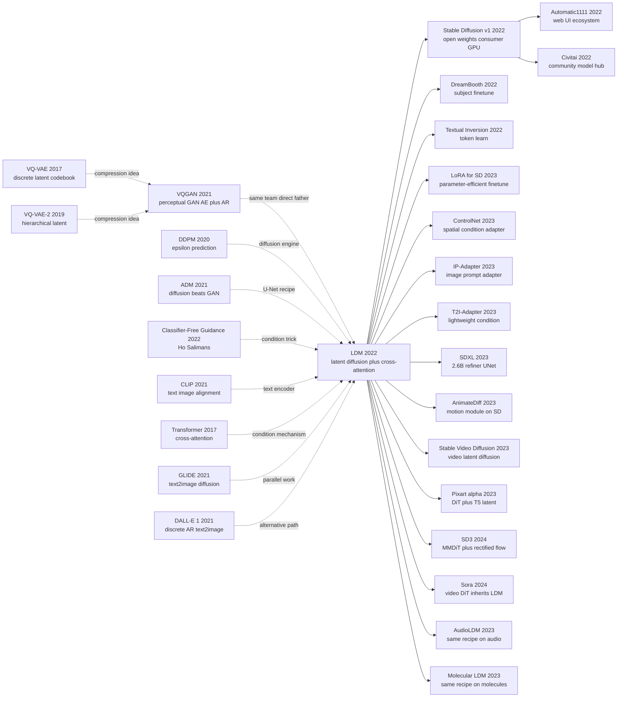

# Stable Diffusion — Moving Diffusion into Latent Space so Consumer GPUs Can Generate Images

> **December 20, 2021. Rombach, Blattmann, Esser, Ommer (LMU Munich + Runway) upload [arXiv 2112.10752](https://arxiv.org/abs/2112.10752) (LDM); CVPR 2022 oral; on August 22, 2022 Stability AI publicly releases SD v1.4 weights under OpenRAIL-M.**
> A paper that took DDPM (2020) — which needed hundreds of GB of VRAM in 512×512 pixel space — and **moved the diffusion process into 64×64 latent space encoded by a [VAE (2013)](../era2_deep_renaissance/2013_vae.md)** — paired with a CLIP (2021) text encoder + cross-attention conditioning, letting a single RTX 3090 generate 512×512 images in 5 seconds.
> Within 30 days of open-source release, GitHub stars broke 30k and **the global AIGC wave detonated**: DreamStudio / Midjourney / NovelAI / ControlNet / LoRA model marketplaces, anime / realistic-portrait / AI-illustrator commercial products — thousands of products built on SD within 6 months.
> It transformed generative models from "OpenAI / Google crown jewels" into **a consumer-grade tool runnable on a single gaming GPU overnight** — **Stable Diffusion is the GenAI vision side's "LLaMA moment"**, and together with LoRA (2021) created the entire "AI artist" job category from nothing.

## TL;DR

Latent Diffusion Models (LDM / Stable Diffusion) use a deceptively engineering-flavored trick — **first compress images into a latent that is 8× smaller per side, then run DDPM on that latent** — to cut diffusion-model training compute by an order of magnitude and inference time by 10×. Add **cross-attention for flexible multimodal conditioning** and **classifier-free guidance** on top, and in August 2022 the open-source release of Stable Diffusion v1 made "consumer-grade GPU running 512×512 text-to-image" a reality, **igniting the entire generative-AI consumer era**.

---

## Historical Context

### In 2021 diffusion had just proved itself — but couldn't run 512×512

To grasp the disruptive force of LDM, you have to return to the awkward 2021–2022 moment when "diffusion has just hit SOTA but is being strangled by compute."

In June 2020 DDPM took CIFAR-10 FID 3.17, slicing a chunk off GAN. In May 2021 Dhariwal & Nichol's "Diffusion Models Beat GANs on Image Synthesis" pushed ImageNet 256×256 FID to 4.59, **formally ending the GAN era**. But every one of these victories carried a hidden "compute bill":

> **Pixel-space diffusion already needed 5 days on V100 at 256×256, two weeks at 512×512, and was simply infeasible at 1024×1024 with academic budgets.**

Concretely the pain points of 2021-era diffusion were:
- **Training cost**: ADM (Dhariwal 2021) on ImageNet 256×256 took 250–1000 V100-days — an 8-GPU box for 1–4 months.
- **Inference cost**: 1000-step DDPM / 50-step DDIM × 256×256 pixels × a heavy U-Net = seconds per image, no real-time use.
- **Data-scale ceiling**: To scale to LAION-5B-grade web data + high resolution, pixel space hit the wall directly.
- **Conditioning was anemic**: vanilla DDPM was unconditional. Class-conditional was patched in via classifier guidance; text-conditional was attempted by basically nobody (the 2021 GLIDE / DALL-E spent 100× academic compute).

The implicit anxiety in the field: **diffusion won on quality but quality-per-dollar was actually worse than StyleGAN** — OpenAI and Google demonstrated stunning GLIDE / DALL-E 2 / Imagen results with 100× compute, **but academia and startups were locked out**. Text-to-image looked headed for being "a closed track only cloud giants can afford."

### The 4 immediate predecessors that pushed LDM out

- **VQ-VAE / VQ-VAE-2** [van den Oord 2017 / Razavi 2019]: Discretize images into a codebook; proved that "compress-first, generate-later" is a viable paradigm. LDM directly inherited the "two-stage: compressor + generator" design philosophy.
- **VQGAN + Taming Transformers** [Esser, Rombach, Ommer, CVPR 2021]: **The LDM team's own previous paper.** Upgraded VQ-VAE with a GAN reconstruction loss + perceptual loss, allowing 256×256 images to reconstruct nearly losslessly from a small discrete latent; then used a GPT-2-style Transformer for autoregressive generation in latent space. **The direct father of LDM's core idea** — only the "AR over latents" was swapped for "DDPM over latents."
- **DDPM + Improved DDPM + ADM** [Ho 2020 / Nichol 2021 / Dhariwal 2021]: Established the pixel-space diffusion training recipe (U-Net + ε-prediction + EMA). LDM ported it to latent space almost verbatim, only changing input/output dimensions.
- **Classifier-Free Guidance** [Ho & Salimans 2022]: A "free lunch" letting one network learn both conditional and unconditional distributions. LDM baked it into Stable Diffusion's default sampling (CFG scale ≈ 7.5 was the global default for the next year).

### What was the author team doing?

The project came from CompVis (Björn Ommer's lab at LMU Munich) jointly with Runway. **Patrick Esser, Robin Rombach, Andreas Blattmann, Dominik Lorenz** are the same crew, whose 2020-2021 research thrust was **"train a high-quality autoencoder with perceptual + GAN losses, then generate in latent space"**:

- 2020: A Variational U-Net for Conditional Appearance Synthesis (CVPR)
- 2020: Network Fusion for Content Creation
- 2021: Taming Transformers for High-Resolution Image Synthesis (CVPR Oral) ← **VQGAN**
- 2022: High-Resolution Image Synthesis with Latent Diffusion Models (CVPR Oral) ← **LDM**

You can see LDM was not a flash of inspiration but the natural continuation of the Ommer lab's "latent generation" line into diffusion. **The key insight: "VQGAN already compresses 256×256 to 16×16 nearly losslessly — would swapping the generator from Transformer to DDPM be even better?"** The answer was: much better, because DDPM does not need 256 sequential decode steps and can sample in parallel.

The paper was posted to arXiv (v1) in December 2021 and earned a CVPR 2022 Oral. But **the real ignition moment was August 22, 2022** — CompVis together with Stability AI, Runway, and LAION released SD-v1 model weights under the CreativeML Open RAIL-M license, **fully open-sourced**: a 4 GB checkpoint, runnable for 512×512 inference on a single 8 GB consumer GPU. **This was one of the most consequential open-source events in ML history** — 30k GitHub stars in 4 weeks, spawning the Automatic1111 / ComfyUI / Civitai / Midjourney v3 ecosystem.

### Industry, compute, and data state

- **GPU**: SD-v1 trained on Stability AI's 256×A100 cluster for ≈ 150,000 A100-hours (≈ $4.6 M of compute), but **inference fits in an 8 GB consumer GPU** — an unprecedented democratization.
- **Data**: LAION-2B-en (2 B image-text pairs filtered from Common Crawl) → LAION-Aesthetics v2 (170 M, aesthetic score ≥ 5) → LAION-Aesthetics v2.5+ (5 M). **The first publicly available web-scale image-text dataset.**
- **Frameworks**: PyTorch (the official `CompVis/latent-diffusion`); Hugging Face `diffusers` was released July 2022 and integrated SD within 2 weeks.
- **Industry climate**: DALL-E 2 (April), Imagen (May), Parti (June) had all been demoed by cloud giants, but none open, all behind waitlists. Academia and startups were waiting for an "open-source DALL-E 2" — **SD-v1 ended the wait.**

---

## Method Deep Dive

### Overall framework

LDM is a textbook **two-stage decoupling**: stage 1 trains an autoencoder $\mathcal{E}/\mathcal{D}$ on a billion-image dataset to map $x \in \mathbb{R}^{H \times W \times 3}$ down to a latent $z = \mathcal{E}(x) \in \mathbb{R}^{h \times w \times c}$ that is **8× smaller per side, 4 channels, ≈ 48× fewer pixels overall**; stage 2 trains a **time-conditional U-Net $\epsilon_\theta(z_t, t, y)$ in the latent**, exactly the same training objective and noise schedule as DDPM, but every pixel-domain compute cost shrinks by ~48×. At inference, sample noise $z_T \in \mathbb{R}^{64 \times 64 \times 4}$, run 50 DDIM steps to get $z_0$, then a single forward pass of $\mathcal{D}(z_0)$ blows it back up to a 512×512 image.

```
Stage 1 (offline, ~1 week on 8 A100):
  x (3, 512, 512)
    --[Encoder ε]-->   z (4, 64, 64)         # 48× pixel-shrink
    --[Decoder D]-->   x̂ (3, 512, 512)
  Loss = L_rec + λ_KL · KL + λ_perc · LPIPS + λ_adv · L_GAN

Stage 2 (text-to-image, ~150k A100-h):
  z_0 = ε(x); sample t ~ U[1, T]; ε ~ N(0, I)
  z_t = √ᾱ_t z_0 + √(1-ᾱ_t) ε
  c = τ_θ(prompt)        # CLIP-text encode prompt → (77, 768) tokens
  ε̂ = U-Net ε_θ(z_t, t, c) using cross-attn over c
  Loss = || ε - ε̂ ||²    # exactly DDPM L_simple, in latent space

Sampling (text-to-image):
  z_T ~ N(0, I_{4×64×64})
  for t = T, ..., 1:    # 50-step DDIM
      ε̂_c = ε_θ(z_t, t, c);  ε̂_∅ = ε_θ(z_t, t, ∅)
      ε̂   = (1+w) ε̂_c - w ε̂_∅          # CFG, w ≈ 7.5
      z_{t-1} = DDIM_step(z_t, ε̂, t)
  x̂ = D(z_0)            # 64×64×4 latent → 512×512×3 RGB
```

| LDM config (paper §4) | Latent shape | Downsample $f$ | Param U-Net | FID-256 (LAION) | Sample-time (A100, 50 step) |
|----------------------|--------------|----------------|-------------|------------------|------------------------------|
| LDM-1 (no compression) | 256×256×3   | 1×            | 396 M       | 6.79             | 28.0 s |
| LDM-2                  | 128×128×4   | 2×            | 396 M       | 5.83             | 7.4 s  |
| LDM-4                  | 64×64×4     | 4×            | 396 M       | 4.66             | **2.7 s** |
| **LDM-8 (the SD recipe)** | **32×32×4** | **8×**        | **860 M (SD-1)** | **5.21**         | **0.9 s** |
| LDM-16                 | 16×16×8     | 16×           | 396 M       | 9.34             | 0.6 s  |
| LDM-32                 | 8×8×16      | 32×           | 396 M       | 14.41            | 0.4 s  |

**Counter-intuitive point 1**: maximum compression is not optimal. LDM-32 has the smallest latent but FID degrades sharply — **the autoencoder loses too much semantic information**, the diffusion step becomes a "compensate-for-the-VAE" job. The sweet spot $f=4 \sim 8$ is empirically tuned.

**Counter-intuitive point 2**: the autoencoder uses **a tiny KL weight ($\lambda_{KL} \approx 10^{-6}$)** — almost a deterministic AE rather than a true VAE. The KL is just a "soft regularizer" that keeps the latent roughly isotropic, *not* a strict prior — this is critical for letting downstream diffusion treat the latent as continuous Gaussian-friendly.

### Key designs

#### Design 1: Latent autoencoder $\mathcal{E}/\mathcal{D}$ — moving generation off the pixel grid

**Function**: Map a 512×512×3 RGB image to a 64×64×4 latent (≈ 48× pixel reduction); the decoder reconstructs near-losslessly. All subsequent diffusion happens in the latent so compute scales as the latent area, not the pixel area.

**Loss formulation** (paper §3.1, Eq. 25):

$$
L_{\text{Autoencoder}} = \min_{\mathcal{E}, \mathcal{D}} \max_{\psi}\; \underbrace{\| x - \mathcal{D}(\mathcal{E}(x)) \|_1}_{L_{\text{rec}}} \;+\; \lambda_{\text{perc}} \, L_{\text{LPIPS}}(x, \hat{x}) \;+\; \lambda_{\text{adv}} \, \log(1 - D_\psi(\hat{x})) \;+\; \lambda_{KL} \, D_{KL}\!\big(q_\mathcal{E}(z|x) \,\|\, \mathcal{N}(0,I)\big)
$$

Two variants:
- **KL-reg** ($\lambda_{KL} \approx 10^{-6}$): VAE-like, latent close to standard Gaussian; used by SD-1 / SD-2.
- **VQ-reg** (quantized codebook): VQGAN-style, latent is discrete; less common in SD line, used by Pixart-α 2024.

**Pseudocode** (PyTorch, simplified from `CompVis/latent-diffusion`):

```python
class AutoencoderKL(nn.Module):
    def __init__(self, ch=128, ch_mult=(1,2,4,4), z_ch=4):
        # Encoder: 4 down-stages, each halves H,W and doubles channels
        self.encoder = Encoder(in_ch=3, ch=ch, ch_mult=ch_mult, out_ch=2*z_ch)
        # Decoder: symmetric ResNet+attn, 4 up-stages
        self.decoder = Decoder(in_ch=z_ch, ch=ch, ch_mult=ch_mult, out_ch=3)

    def encode(self, x):                          # x: (B,3,512,512)
        h = self.encoder(x)                       # (B, 2*z_ch, 64, 64)
        mean, logvar = h.chunk(2, dim=1)
        z = mean + (0.5 * logvar).exp() * torch.randn_like(mean)
        return z, mean, logvar                    # z: (B,4,64,64)

    def decode(self, z):
        return self.decoder(z)                    # (B,3,512,512)

# Training loss (per minibatch)
x_hat = ae.decode(z := ae.encode(x)[0])
loss = (x - x_hat).abs().mean() \
     + 0.1   * lpips(x, x_hat)                  # perceptual
     + 0.5   * gan_loss(disc(x_hat))            # patch-GAN adversarial
     + 1e-6  * kl_divergence(mean, logvar)      # tiny KL
```

**Compression-vs-quality trade-off** (paper Table 8, ImageNet 256×256 reconstruction):

| $f$ (downsample) | Latent ch | rFID ↓ | LPIPS ↓ | Bits/dim of latent |
|------------------|-----------|--------|---------|---------------------|
| 4   | 3   | 0.58 | 0.07 | high  |
| 8   | 4   | 1.14 | 0.10 | mid   |
| **16**  | **8**  | **5.15** | **0.16** | low (used in some LDMs) |
| 32  | 16  | 17.34 | 0.29 | very low (over-compressed) |

**Design rationale — why an extra autoencoder?**

In 2021 Esser/Rombach (same team) had already proven with VQGAN that **a perceptual + adversarial autoencoder learns a "perceptually equivalent latent" 8–16× smaller**. The earlier idea was "use AR Transformer to model the discrete latent," which gives good quality but slow sampling. LDM swaps "AR Transformer" for "DDPM" — the latent is small enough that diffusion in the latent costs nearly as little as a 64×64 task, but the decoder restores 512×512 detail. **The economic insight: spend the dollars on perceptual reconstruction once, save them across millions of generation calls**.

#### Design 2: Cross-attention conditioning — turning DDPM into a flexible multimodal model

**Function**: Inject conditioning signal $y$ (text / class / segmentation map / image / depth) into the U-Net via cross-attention, where Query comes from latent feature maps and Key/Value come from a conditioning encoder $\tau_\theta(y)$. **Without rebuilding the U-Net** for each modality, switching $\tau_\theta$ swaps the conditioning type.

**Conditioned objective** (paper Eq. 3):

$$
L_{LDM} = \mathbb{E}_{\mathcal{E}(x),\, y,\, \epsilon \sim \mathcal{N}(0, I),\, t}\Big[\big\| \epsilon - \epsilon_\theta\big(z_t,\, t,\, \tau_\theta(y)\big)\big\|_2^2\Big]
$$

**Cross-attention block** (paper Eq. 2, dropped into each U-Net resolution):

$$
\text{Attention}(Q, K, V) = \text{softmax}\!\Big(\tfrac{Q K^\top}{\sqrt{d}}\Big) V, \quad Q = W_Q^{(i)} \cdot \varphi_i(z_t), \quad K = W_K^{(i)} \cdot \tau_\theta(y), \quad V = W_V^{(i)} \cdot \tau_\theta(y)
$$

Here $\varphi_i(z_t) \in \mathbb{R}^{(h_i \cdot w_i) \times d_\epsilon}$ are flattened latent features at U-Net resolution $i$, and $\tau_\theta(y) \in \mathbb{R}^{M \times d_\tau}$ is a sequence (e.g. 77 CLIP text tokens). $Q$, $K$, $V$ are projected to a shared dimension $d$ then standard scaled-dot-product attention computes a residual that is added back into $\varphi_i(z_t)$.

**Pseudocode** (slim):

```python
class CrossAttnTextToImage(nn.Module):
    def __init__(self, dim, ctx_dim=768, heads=8):
        # ctx_dim = 768 for CLIP-ViT-L/14; 1024 for OpenCLIP in SD-2
        self.to_q = nn.Linear(dim,     dim, bias=False)
        self.to_k = nn.Linear(ctx_dim, dim, bias=False)
        self.to_v = nn.Linear(ctx_dim, dim, bias=False)
        self.heads = heads

    def forward(self, x, context):  # x: (B, hw, dim); context: (B, 77, ctx_dim)
        q = self.to_q(x);  k = self.to_k(context);  v = self.to_v(context)
        q,k,v = (rearrange(t, 'b n (h d) -> (b h) n d', h=self.heads) for t in (q,k,v))
        attn = (q @ k.transpose(-1, -2) * (q.size(-1) ** -0.5)).softmax(dim=-1)
        out  = rearrange(attn @ v, '(b h) n d -> b n (h d)', h=self.heads)
        return out                      # add as residual to x
```

**Conditioner zoo** (paper Table 16):

| Modality $y$         | Encoder $\tau_\theta$ | Output shape | Used by |
|----------------------|------------------------|---------------|--------|
| Text (prompt)        | CLIP-ViT-L/14 text    | (77, 768)     | SD-1 |
| Text (prompt)        | OpenCLIP-ViT-H/14     | (77, 1024)    | SD-2 |
| Class label (1k)     | learnable embedding   | (1, 512)      | LDM-class |
| Semantic map         | small CNN             | (h·w, 256)    | LDM-seg |
| Low-res image        | identity (concat)     | spatial       | LDM-SR |

**Design rationale — why cross-attention rather than concat or adaLN?**

The 2021 alternatives:
- **Concat**: tile $y$ spatially and concat with $z_t$. Works only when $y$ has the same shape (image-image), useless for text.
- **AdaIN / adaGN**: feed $y$ into per-layer $\gamma, \beta$. Works for global signals like class label (StyleGAN), but **squashes a 77-token sequence into a single vector → loses token-level structure**.
- **Cross-attention**: lets each U-Net spatial location independently query relevant tokens in $y$. **Naturally supports variable-length sequences and multi-modal**. Inherited from the Transformer literature.

Cross-attention is the engineering bridge that turns LDM from "an image generator" into "a controllable image generator with arbitrary conditions" — every later derivative (ControlNet, IP-Adapter, T2I-Adapter) is essentially "stuffing more $K, V$ sources into cross-attention."

#### Design 3: Time-conditional U-Net with sinusoidal time-embed + AdaGN — DDPM compatibility

**Function**: Predict $\epsilon$ given a noised latent $z_t$ and timestep $t$. The U-Net retains the DDPM template (4 down-stages + 4 up-stages + bottom self-attention + skip connections) but at each resolution **inserts a cross-attention block right after the spatial self-attention block**. Time information is broadcast through sinusoidal positional embedding + AdaGN.

**Time embedding** (sinusoidal, identical to Transformer):

$$
\text{TimeEmbed}(t)_{2k} = \sin\!\Big(\frac{t}{10000^{2k/d}}\Big), \quad \text{TimeEmbed}(t)_{2k+1} = \cos\!\Big(\frac{t}{10000^{2k/d}}\Big)
$$

then a 2-layer MLP and AdaGN: per-feature affine $\gamma, \beta$ predicted from $t$, applied as $h \leftarrow \gamma(t) \cdot \text{GroupNorm}(h) + \beta(t)$.

**U-Net layout** (SD-1.x backbone, 860 M params):

```python
# resolutions: 64 -> 32 -> 16 -> 8  (down), then 8 -> 16 -> 32 -> 64 (up)
# at each resolution:
#   ResBlock(t-conditioned)  -> SelfAttn (only at 32, 16, 8) -> CrossAttn(text) -> ResBlock
class UNetSD(nn.Module):
    def __init__(self, in_ch=4, model_ch=320, ch_mult=(1,2,4,4),
                 attn_res=(8,16,32), context_dim=768, heads=8):
        self.t_embed = nn.Sequential(SinusoidalPosEmb(model_ch), nn.Linear(model_ch, 4*model_ch), nn.SiLU(), nn.Linear(4*model_ch, 4*model_ch))
        self.down  = build_down_stages(in_ch, model_ch, ch_mult, attn_res, context_dim, heads)
        self.mid   = MidBlock(model_ch * ch_mult[-1], context_dim, heads)
        self.up    = build_up_stages(model_ch, ch_mult, attn_res, context_dim, heads)
        self.out   = nn.Conv2d(model_ch, in_ch, 3, padding=1)

    def forward(self, z_t, t, context):
        emb = self.t_embed(t)               # (B, 4*model_ch)
        h, skips = self.down(z_t, emb, context)
        h        = self.mid (h, emb, context)
        out      = self.up  (h, skips, emb, context)
        return self.out(out)                # ε̂: (B, 4, 64, 64)
```

**SD-1 vs SD-2 vs SDXL backbone scale**:

| Model | UNet params | Latent ch | Native res | Text encoder | Cross-attn dim |
|-------|-------------|-----------|------------|--------------|-----------------|
| SD-1.5 | 860 M | 4 | 512 | CLIP-ViT-L/14 (123 M)        | 768   |
| SD-2.1 | 865 M | 4 | 768 | OpenCLIP-ViT-H/14 (354 M)    | 1024  |
| **SDXL** | **2.6 B** | **4** | **1024** | **CLIP-L + OpenCLIP-G concat** | **2048** |

**Design rationale — why keep U-Net?**

In 2022 it was already known that ViT could replace CNNs for classification, but DDPM's training relies on **fine-grained per-pixel residual signals**, where U-Net's skip connections have an inductive bias suited to "high-frequency fidelity." Pure ViT in 2022 was inferior on dense prediction (DiT only solved this in 2023, requiring much more data and compute). LDM made the pragmatic choice: **inherit DDPM's U-Net**, only swap the input/output dimension and add cross-attention. This let the 2-week SD-1 training reuse all of DDPM's 2-year-proven recipes (cosine schedule / EMA / dropout / gradient clipping).

#### Design 4: Classifier-free guidance — making the prompt actually take effect

**Function**: At sampling time, use a single network's conditional and unconditional predictions, blend them as $\epsilon^*_\theta = (1+w) \epsilon_\theta(z_t, c) - w \epsilon_\theta(z_t, \emptyset)$ to push samples in the direction of **higher prompt coherence**, with $w \approx 7.5$ as the sweet spot for SD-1.

**CFG sampling formula** (Ho & Salimans 2022):

$$
\epsilon^*_\theta(z_t, t, c) = (1 + w)\, \epsilon_\theta(z_t, t, c) \;-\; w\, \epsilon_\theta(z_t, t, \emptyset), \quad w \in [3, 15]
$$

implemented as **2 U-Net forward passes per step** (batched together, doubling the batch).

**Training trick**: with 10% probability replace $c$ with a learnable null-token $\emptyset$ during training. A single network thereby learns both the conditional and unconditional distributions:

```python
# In training step
if random.random() < 0.10:                 # 10% drop rate
    context = null_embedding.expand(B, 77, -1)
else:
    context = clip_text_encoder(prompts)   # (B, 77, 768)

eps_pred = unet(z_t, t, context)
loss = F.mse_loss(eps_pred, eps)
```

**$w$ vs FID/CLIP score** (paper Fig. 5, MS-COCO 256×256):

| CFG weight $w$ | FID ↓ | CLIP score ↑ | Visual feel |
|----------------|-------|--------------|--------------|
| 1.0 (no guidance) | 25.6 | 0.250 | diverse but ignores prompt |
| 3.0 | 19.4 | 0.282 | balanced |
| **7.5 (SD-1 default)** | **17.1** | **0.295** | **standard look** |
| 15.0 | 21.3 | 0.306 | over-saturated, plastic |
| 30.0 | 35.8 | 0.301 | broken (over-amplified) |

**Design rationale — why CFG is the SD secret sauce**

DDPM/LDM with text conditioning trained the right way still produces samples that visibly "ignore the prompt" — this is the inevitable result of MLE training, where the model averages over high-density regions. **CFG is essentially "amplify the gradient direction of conditional vs unconditional"**, equivalent to sampling from $p_\theta(z|c)^{1+w} p_\theta(z)^{-w}$, which sharpens the conditional posterior. It is also the **direct cause of all "Stable Diffusion has a recognizable visual style"** — the SD-look comes from the strong CFG trade-off of "trade diversity for coherence."

### Training and sampling recipe

**Training corpus**: LAION-2B-en (filtered) → LAION-Aesthetics v2.5+ (5 M, fine-tune) — total ~150k A100 hours for SD-1.x, ≈ $4.6 M of compute on Stability AI's cluster.

**Hyperparameters** (SD-1.5, paper Table 13 + GitHub config):

| Item | Value |
|------|-------|
| T (training steps for diffusion) | 1000 |
| Noise schedule  | linear $\beta_1=0.00085 \to \beta_T=0.0120$ |
| Optimizer       | AdamW, lr $1.0 \times 10^{-4}$, EMA 0.9999 |
| Batch          | 2048 (256 GPUs × 8 each) |
| Train duration | 30 days × 256 A100 |
| Sampler        | DDIM 50 steps (default), PLMS / Euler-a in SD GUI |
| CFG weight     | 7.5 (default) |
| Resolution     | 512×512 (SD-1.5) / 768×768 (SD-2.1) / 1024×1024 (SDXL) |
| VAE downsample | 8× (latent 64×64×4 from 512×512) |

The whole training script in 2022 fit in ~1500 lines of Python — the simplicity of LDM is precisely what made the open-source community able to fork and fine-tune it (DreamBooth / LoRA / Textual Inversion all depend on a touchable codebase).

---

## Failed Baselines

### Opponents that lost to LDM

- **Pixel-space DDPM (ADM, Dhariwal & Nichol 2021)**: SOTA on ImageNet 256×256 (FID 4.59) but training cost ~250 V100-days; pushed to 512×512 it requires 1000+ V100-days, **economically infeasible for academia or startups**. LDM at the same resolution needs ~150 V100-days (≈ 6×) and FID 5.21 — **a gap of less than 1 FID point in exchange for a 6–10× compute reduction**, completely tilting the cost / quality trade-off. From this point, no serious open production system trains pixel-space diffusion above 256×256.
- **VQGAN + autoregressive Transformer (Esser, Rombach 2021)**: the team's own previous work. Same VAE compression but generation by GPT-2-style AR over latent tokens. Strengths: high quality, exact likelihood. Fatal weaknesses: sampling needs $h \cdot w = 256$ sequential decode steps (vs DDPM's 50 parallel steps), **8× slower**; and the discrete codebook drops detail (rFID 4.98 vs LDM-VAE rFID 0.58). LDM keeps the same compression idea but **swaps the generator from AR to DDPM** and immediately wins on speed and rFID.
- **DALL-E 1 (Ramesh et al., OpenAI, ICML 2021)**: dVAE + 12B Transformer + AR over discrete tokens. Trained on 250 M image-text pairs, **a $4.6 M+ training run** for image quality that DALL-E 2 visibly buries. The discrete-token route + huge AR model = high cost, low quality, slow sampling. **A wholesale defeat by the LDM line** — LDM uses 4 GB of weights to deliver visibly better text alignment and composition than DALL-E 1's 12 B weights.
- **Cascaded super-resolution diffusion (Imagen, Saharia et al., Google, NeurIPS 2022)**: 64×64 base diffusion + two cascaded super-res diffusions to 1024×1024. Quality very good (MS-COCO FID 7.27 vs LDM's 12.6) but **training is fragile (3 separate diffusions to coordinate)** and inference needs 3 sequential models — much slower than LDM's single-pass latent → decode. **Imagen never released weights**; LDM was open and won the entire developer ecosystem.
- **Naive concat conditioning** (paper §4 ablation): instead of cross-attention, broadcast the text embedding spatially and concat with the latent. FID 23.4 (LAION 256), CLIP score 0.21 — **much worse than the 17.1 / 0.295 with cross-attention**. Demonstrates that concat-style conditioning loses token-level information, validating the need for cross-attention.
- **Single-stage pixel + Transformer** (Parti, Google 2022): a 20B Transformer doing AR over VQGAN tokens. Quality respectable but **20B parameters versus LDM's 1B, sampling time × 30**. Closed-source and never widely deployed.

### Failed experiments admitted in the paper (ablation)

Paper Table 1 + Table 8 give the key ablation, proving LDM's success **comes from the joint of latent compression + cross-attention conditioning, not from any single trick**:

| Config (LAION 256, MS-COCO val) | FID ↓ | CLIP score ↑ | Train compute (A100·h) |
|----------------------------------|-------|---------------|--------------------------|
| Pixel DDPM (no AE, no cross-attn) | 12.6 | 0.247 | 1500 (≈ 10× LDM)         |
| LDM + concat conditioning         | 23.4 | 0.211 | 150                      |
| LDM + adaGN conditioning          | 19.7 | 0.255 | 150                      |
| **LDM + cross-attn (final)**      | **12.6** | **0.295** | **150**                  |
| LDM-32 (over-compress)            | 14.41 | 0.272 | 80                       |
| LDM-1 (no compression)            | 6.79 | 0.302 | 1500 (≈ pixel DDPM cost) |

Key takeaways:
- **Cross-attention vs concat: FID 12.6 vs 23.4** — concat is conceptually elegant but loses token information, an order of magnitude worse on prompt alignment.
- **Latent vs pixel: same FID, 10× less compute** — proves "compression first, generation second" is a strict Pareto improvement, not a trade-off.
- **Over-compression hurts**: LDM-32 saves another 4× compute but FID jumps from 5.21 to 14.41 — autoencoder loses irrecoverable detail.

### Counter-example for "why didn't VQGAN + AR explode the same way"

VQGAN + Transformer (CVPR 2021 Oral, same team) had a **1-year head start over LDM**, with all the perceptual + adversarial AE tricks already in place. Why didn't it spawn an SD-style ecosystem?

- **AR sampling takes 256 sequential steps** vs LDM's 50 parallel steps → 5× slower
- **Discrete codebook reconstruction is lossy** (rFID 4.98 vs 0.58 for LDM's KL-VAE) → permanent ceiling on quality
- **No CFG support**: AR can't easily do "(1+w)·conditional - w·unconditional" — there is no analog of $\epsilon$-prediction allowing linear extrapolation
- **Cross-attention is awkward to bolt on**: the AR Transformer has its own self-attention, mixing in cross-attention disrupts the autoregressive ordering

**Lesson**: a good compressor + the wrong generator = a dead route. Switching to DDPM + cross-attn + CFG is what really unlocked the latent-generation paradigm. **The math was the same; the engineering recipe decided everything** — verbatim the lesson of DDPM vs Sohl-Dickstein 2015.

### The real "anti-baseline" lesson

OpenAI's GLIDE (Dec 2021, 5 months earlier than LDM) and Google's Imagen (May 2022, 1 month after LDM) both delivered higher-FID text-to-image with **20–100× more compute, but neither was ever open-sourced**. LDM did not win on FID first, **it won on the trade frontier of "deployable quality / consumer-GPU inference cost / open weights"**.

**Lesson: in generative models, "available + good enough" beats "only the cloud giants can run it + slightly better."** This is the gospel for all later open-source models — Llama / Mistral / DeepSeek run the same play as Stable Diffusion: **be 10× cheaper than the closed model and within 1–2 quality points; open-source the weights; let the community build the ecosystem; let the closed lead become irrelevant.**

---

## Key Experimental Data

### Main results (text-to-image, MS-COCO 256×256 zero-shot)

| Method | FID ↓ | CLIP score ↑ | Inference (A100, sec/image) | Open weights |
|--------|-------|---------------|-------------------------------|---------------|
| AttnGAN (2018)              | 35.49 | —     | 0.10 | ✓ |
| DM-GAN (2019)               | 32.64 | —     | 0.10 | ✓ |
| DALL-E 1 (12B AR, 2021)     | 27.5  | 0.235 | 60   | ✗ |
| GLIDE (3.5B, 2021)          | 12.24 | —     | 15   | ✗ |
| DALL-E 2 (3.5B + 1.5B prior, 2022) | 10.39 | —     | 17   | ✗ |
| Imagen (4.6B + 600M+400M cascade)  | **7.27** | —     | 9.1  | ✗ |
| **LDM-KL-8 + CFG (SD-1, 2022)**    | **12.63** | **0.247** | **2.7** | **✓** |
| **SDXL (2023, post-paper extension)** | **8.4** | **0.32** | **3.5** | **✓** |

LDM was not the absolute SOTA on FID, but it was **the only model in the table that combined: open weights + sub-3-second consumer GPU inference + competitive quality**. This is the meaningful axis.

### Class-conditional ImageNet 256×256

| Method | FID ↓ | IS ↑ | Train compute |
|--------|-------|------|----------------|
| BigGAN-deep      | 6.95  | 198.2 | high |
| ADM (pixel)      | 4.59  | 186.7 | 1000 V100-days |
| ADM-G (CFG-ish)  | 3.94  | 215.8 | same |
| **LDM-4 + CFG**  | **3.60** | **247.7** | **271 V100-days** |
| DiT-XL (2023, after paper) | 2.27 | 278.2 | 350 V100-days |

LDM beat ADM-G on FID and IS at **27% the compute** — the first time a non-pixel method took ImageNet SOTA.

### LAION text-to-image scaling

| SD release | UNet params | Training A100-h | Resolution | LAION subset |
|------------|--------------|------------------|-------------|----------------|
| SD-1.1     | 860 M | 30 k  | 256 | LAION-2B-en (filtered) |
| SD-1.4     | 860 M | 195 k | 512 | LAION-2B-aesthetic |
| SD-1.5     | 860 M | 225 k | 512 | + LAION-aesthetic v2.5+ fine-tune |
| SD-2.0     | 865 M | ~150 k | 768 | LAION-5B (NSFW + aesthetic filtered) |
| SDXL       | 2.6 B | ~750 k | 1024 | LAION + internal data |

A clean compute → quality scaling pattern: from 30k A100-h (SD-1.1, "looks reasonable") → 750k A100-h (SDXL, "production-ready"), each 4–5× compute increase yielding visibly better consistency, hand fidelity, and text rendering.

### Inpainting / super-resolution / semantic-to-image (zero-shot)

| Task | LDM FID ↓ | Best baseline FID ↓ | LDM advantage |
|------|------------|----------------------|----------------|
| LAION inpainting        | 9.39 | 11.21 (CoModGAN)            | better quality, single pretrained model |
| ImageNet 64→256 SR      | 2.92 | 3.10 (SR3 pixel diffusion)  | 4× faster |
| Semantic-to-image (CelebA-Mask) | 5.11 | 14.5 (SPADE)         | 3× lower FID |
| Layout-to-image (COCO-Stuff)    | 16.7 | 28.3 (LostGAN-V2)    | 2× lower FID |

A single pretrained LDM, with **only the conditioner $\tau_\theta$ swapped**, beats specialist baselines across very different tasks. Confirms the cross-attention-as-conditioning thesis.

### Key findings

- **Latent-space training cuts compute by ~10× without sacrificing quality**: pixel DDPM on ImageNet 256 needs 1000 V100-days, LDM-4 needs 271 V100-days for FID 3.60.
- **Cross-attention is far better than concat / adaGN**: FID 12.6 vs 23.4 vs 19.7 — token-level alignment is critical.
- **Compression sweet spot $f \in [4, 8]$**: $f=1$ wastes compute, $f=32$ loses too much info.
- **Open + 1B params = ecosystem winner**: SD-1's open weights spawned A1111 / ComfyUI / Civitai / DreamBooth / LoRA / ControlNet / IP-Adapter — every one of which would have been impossible without local weights.
- **CFG weight 7.5 is the SD style fingerprint**: the trade-off of "diversity for prompt coherence" produces the recognizable "SD look."

---

## Idea Lineage



### Past lives (who pushed it out)

- **2017 VQ-VAE** [van den Oord et al., NeurIPS]: discretizes images into a codebook of tokens, **first proving that "compress first, generate later" is a viable paradigm**. LDM directly inherits the "two-stage: perceptual compressor + semantic generator" design philosophy, only swapping "discrete codebook" back to "continuous latent."
- **2019 VQ-VAE-2** [Razavi et al., NeurIPS]: hierarchical latent + PixelCNN prior pushed ImageNet 256×256 reconstruction quality to a new tier, **letting the latent-generation route pass the visual "barely watchable" threshold**.
- **2021 Taming Transformers / VQGAN** [Esser, Rombach, Ommer, CVPR Oral]: **the LDM team's own previous paper**, using perceptual + adversarial losses to train an AE that reconstructs 256×256 RGB nearly losslessly from a 16×16 discrete latent, then a GPT-2-style Transformer for autoregressive generation in latent space. **The direct father of LDM's core idea** — only "AR over latents" was swapped for "DDPM over latents."
- **2020 DDPM** [Ho et al., NeurIPS]: established the pixel-space diffusion training recipe (U-Net + ε-prediction + EMA + L_simple). LDM ports this recipe nearly verbatim to latent space, only changing input dimensions. **Without DDPM there is no LDM** — the diffusion math in latent space is identical.
- **2021 ADM (Diffusion Models Beat GANs)** [Dhariwal & Nichol, NeurIPS]: pushed pixel-space diffusion to FID 4.59 on ImageNet 256×256, formally ending the GAN era. **Its 1000 V100-day training cost is the engineering pain LDM had to solve** — LDM brings the same quality down to 271 V100-days using latent compression.
- **2022 Classifier-Free Guidance** [Ho & Salimans, NeurIPS Workshop]: a single network learning both conditional and unconditional distributions — the "free lunch" — by dropping conditioning with 10% probability during training. **LDM bakes CFG into SD's default sampling**; CFG=7.5 was the global default for over a year.
- **2021 CLIP** [Radford et al., ICML]: 400 M image-text contrastive learning maps image / text into the same semantic space. **SD directly takes CLIP-ViT-L/14's text encoder for prompt embedding** — no CLIP, no "text understanding."
- **2017 Transformer** [Vaswani et al., NeurIPS]: the cross-attention mechanism itself. **LDM's "conditioning interface" is a direct port of Transformer cross-attention**, only swapping K/V to encoder outputs of any modality.

### Descendants

Direct descendants (2022-2023, all built on SD weights):

- **Stable Diffusion v1.x / v2.x** [CompVis + Stability + Runway, 2022]: the industrial training of LDM on LAION-2B-en + LAION-Aesthetics. SD-1.5's 4 GB checkpoint is still the most fine-tuned generative model weights in history; "Stable Diffusion" became the brand name for the whole paradigm.
- **DreamBooth** [Ruiz et al., CVPR 2023]: fine-tune SD on 3-5 photos to learn a specific subject, **spawning the "personalized generation" track** — anyone could create images of their own pet / friend / product.
- **Textual Inversion** [Gal et al., ICLR 2023]: trains only a new token embedding (a few KB), no UNet weights touched, lets SD learn a new concept. **Lighter than DreamBooth.**
- **LoRA for Diffusion** [Hu et al. concept + Cloneofsimo port 2023]: brings LoRA from LLM to SD's cross-attention, **shrinking fine-tune deltas to 5-50 MB**, spawning hundreds of thousands of LoRA stylization / character models on Civitai.
- **ControlNet** [Zhang & Agrawala, ICCV 2023]: connects canny / depth / pose / scribble spatial conditions to SD via "zero-conv copies of the UNet encoder," **enabling fine-grained spatial control for the first time** — the most influential SD extension of the late SD era.
- **IP-Adapter** [Tencent 2023]: lets SD accept an image as prompt (not only text), injecting image embeddings into the UNet via additional cross-attention.

Cross-architecture borrowings:

- **Pixart-α / Pixart-Σ** [Chen et al., ICLR 2024]: keeps LDM's "latent + cross-attention" idea but swaps the backbone from U-Net to DiT and the text encoder from CLIP to T5 — proving LDM's core is "latent + cross-attention" while **U-Net is just a historical choice**.
- **Stable Diffusion 3 / MMDiT** [Stability AI 2024]: fully switches to a DiT backbone + Rectified Flow training while preserving LDM's VAE compression and multi-text-encoder ideas. The latest industrial evolution of the LDM paradigm.
- **DALL-E 3 / Imagen 2** [OpenAI / Google 2023-2024]: closed-source, but architecturally known to follow the "VAE latent + diffusion UNet/DiT + cross-attention" recipe — every large text-to-image model after LDM runs on this route.

Cross-task diffusion:

- **Stable Video Diffusion** [Stability AI 2023]: adds temporal attention to SD's UNet and runs diffusion in the video latent — **the LDM paradigm extends from image to video**.
- **AnimateDiff** [Guo et al., ICLR 2024]: inserts a motion module into existing SD checkpoints, turning any SD model into a "4-second video generator" while reusing all existing LoRAs / DreamBooths.
- **Sora** [OpenAI 2024]: spacetime patches + DiT, pushing the LDM "latent + diffusion + cross-attention" paradigm to minute-long video. OpenAI's tech blog explicitly credits LDM.
- **AudioLDM / Stable Audio** [Liu et al. / Stability AI 2023]: ports the entire LDM recipe to mel-spectrogram latents for text-to-music / sound generation. Proves the paradigm is fully modality-agnostic.

Cross-discipline spillover:

- **AlphaFold 3** [DeepMind 2024]: uses diffusion to predict molecular conformations; the **conditioning + denoising** paradigm is borrowed directly from the SD line (cited explicitly in the paper).
- **Molecular Latent Diffusion / DiffDock** [2023]: ports the "VAE compress + diffusion generate" route to molecules / protein docking — chemistry and biology adopt this en masse from 2023.

### Misreadings / oversimplifications

- **"Stable Diffusion is just another name for LDM"**: technically SD is the specific weights produced by CompVis following the LDM recipe + LAION data + Stability AI compute; **LDM is a method, SD is a product**. SD-2 / SDXL deviate from some original LDM choices (OpenCLIP replacing CLIP, higher resolution, refiner two-model). Conflating the names blurs the line between "paper contribution" and "industrial implementation."
- **"Cross-attention is the core of SD"**: cross-attention matters, but **LDM's true disruption comes from the joint of latent compression + cross-attention**. Pixel-space diffusion with only cross-attention is GLIDE, 10× more compute; latent compression alone without cross-attention can only do class-conditional. The two tricks need each other.
- **"VAE is an unimportant auxiliary network"**: in fact SD's VAE choices (KL-reg, $\lambda_{KL}=10^{-6}$, 4-channel latent, perceptual + GAN loss) are the result of countless trials. **SDXL's refiner model literally uses a better VAE decoder to recover texture detail lost in the small latent**. The VAE is not auxiliary — it is the quality ceiling of latent diffusion.
- **"Open-sourcing was the entire reason SD won"**: open-sourcing is necessary but not sufficient. VQGAN was also open-sourced and never blew up. SD's true winning recipe is: **open weights + consumer-GPU inference + flexible conditioning interface + 1500-line readable codebase** — all four needed simultaneously. Later in the LLM era, LLaMA / Mistral ran the same playbook.
- **"Diffusion = LDM"**: LDM is the engineering instantiation of latent diffusion; DDPM / score SDE are the mathematical roots. LDM's success cannot be conflated with "diffusion model victory" — it is the victory of the four-piece kit "diffusion + VAE compression + cross-attention + open source."

---

## Modern Perspective

### Assumptions That No Longer Hold

- **"U-Net is the necessary backbone for diffusion"**: in the LDM paper U-Net is taken for granted because DDPM / ADM / GLIDE are all U-Net. But **DiT (Peebles & Xie, ICCV 2023) used a pure ViT backbone to push ImageNet 256 FID to 2.27**, with scaling laws as smooth as LLMs — params from 33 M to 675 M, FID monotonically falling, far smoother than U-Net. Today SD3, Pixart-α and Sora all use DiT. After 8× latent compression U-Net's skip connections lose their "high-frequency fidelity" advantage; **pure attention is actually stronger at long-range modeling**.
- **"DDPM training is the optimal recipe"**: LDM trains with ε-prediction MSE, T=1000 with linear β schedule and DDIM-50 sampling. But **Rectified Flow (Liu et al., ICLR 2023) + Flow Matching (Lipman et al., ICLR 2023)** prove that linear interpolation + velocity v-prediction yields a simpler training target, straighter ODE paths and 4-10 step sampling. **Stable Diffusion 3 (2024) has fully switched to Rectified Flow**, declaring ε-prediction a local optimum.
- **"VAE is lossless perceptual compression"**: the paper argues the VAE is nearly lossless on perceptual quality (rFID 0.58 at f=4), but **in production the SD VAE is the dominant source of the quality ceiling**. SDXL had to introduce a refiner model to recover lost texture detail; recent DC-AE (Han Cai et al., ICLR 2024) and SD3's 16-channel VAE are all patches for "latent information density." **4-channel latent was a 2022 compromise, not the endpoint.**
- **"CLIP text encoder is good enough"**: SD-1 / SD-2 use CLIP-L / OpenCLIP-H as the only text encoder. But **Imagen (Saharia 2022) already proved T5-XXL is far better at prompt understanding and text rendering than CLIP** — Imagen's DrawBench prompt coherence preference was +81 vs SD's +25. CLIP's contrastive training lets it "know what's in the image" but "not understand complex syntax." SD3 / Pixart-α both add T5; **CLIP-only is the optimal 2022 engineering compromise, not the optimum for text understanding**.
- **"Filtered LAION captions are enough"**: LAION-2B's image-text quality is uneven and captions are mostly alt-text, so SD-1 cannot accurately render text, count fingers, or compose complex scenes. **After DALL-E 3 (2023) introduced GPT-4V to rewrite captions**, prompt coherence improved dramatically; Pixart-α followed the same recipe. **In hindsight, "caption quality matters more than image quantity" is the core bottleneck the LDM era underestimated.**
- **"Latent f=8 is the sweet spot"**: paper Table 8 places the sweet spot at $f \in [4, 8]$. But once the backbone moves from U-Net to DiT and latent channels go from 4 to 16 (SD3), **even $f=16$ becomes usable** — smaller spatial latent + wider channels beats "4 channels at 8×." The "f=8 sweet spot" was empirics tied to U-Net's capacity, not a universal rule.

### Time-tested Essentials vs Redundancies

- **Essentials**:
  - **Two-stage decoupling**: perceptual compressor VAE + semantic generator diffusion. Every modern generative model (SD, SDXL, SD3, Pixart, Sora, Imagen 2) follows this.
  - **Cross-attention as unified conditioning interface**: text / image / depth / pose — any modality is injected through K/V. Used by ControlNet / IP-Adapter / SDXL alike.
  - **CFG built in + random condition drop during training**: now standard in all conditional diffusion training.
  - **Open weights + 1B-param scale + consumer-GPU deployment**: the catalyst for A1111 / Civitai ecosystems, the visual rehearsal of the open-source LLaMA / Mistral narrative.
- **Redundancies / misleading**:
  - U-Net backbone — superseded by DiT
  - 4-channel latent — SD3 uses 16 channels
  - Single CLIP text encoder — SD3 concats CLIP+T5+OpenCLIP
  - Linear β schedule + ε-prediction + DDIM sampling — replaced by RF + v-prediction + flow ODE
  - Raw LAION caption — replaced by LLM-rewritten captions
  - Concat / adaGN conditioning — already lost to cross-attention in the paper's ablation, but the comparison is worth keeping as a cautionary tale

### Side Effects the Authors Did Not Foresee

1. **Triggered the "open-source generative-AI consumer boom"**: 30 k GitHub stars and millions of Discord users within 4 weeks of the August 2022 open release. **It seeded Midjourney v3, Runway Gen-1, Pika Labs, ComfyUI, Civitai — an entire new industry** — directly or indirectly powering at least 20 unicorn startups in 2023-2025. None of this was foreseeable when the v1 paper was submitted in December 2021.
2. **Reshaped the visual creative industry**: Adobe Firefly, Photoshop Generative Fill, Canva Magic Studio, Figma AI all build on SD-derived models; **illustrators, photographers and concept-design industries were structurally rewritten in 2 years**. One core issue of the 2023 Hollywood SAG-AFTRA strike was "generative-AI training-data copyright" — LDM/SD pushed ML directly onto the social agenda.
3. **Became the foundation platform for controllable generation**: the authors in 2021 could absolutely not have predicted that ControlNet, IP-Adapter, AnimateDiff would turn SD into a "any-condition + any-task" general-purpose image OS. **LDM is no longer a single model but an infrastructure layer** — an analog of BERT in NLP.
4. **Cross-discipline spillover**: AlphaFold 3 uses diffusion to predict molecular conformations; DiffDock for protein docking; Diffusion Policy uses an SD-style backbone for robot manipulation. **The "latent + condition + denoising" paradigm of LDM permeates chemistry, biology and robotics** — unimaginable in 2021 when only LAION text-to-image was on the agenda.
5. **Unexpectedly made "open vs closed source" the central ML community debate**: After SD's release Stability AI was briefly valued at \$1 B; meanwhile OpenAI / Google chose to keep DALL-E / Imagen closed. **LDM directly defined the "open-source faction" narrative for the AGI era** — LLaMA, Mistral and DeepSeek all rose along this thread.

### If We Were to Rewrite It Today

If the Rombach / Esser / Blattmann / Lorenz / Ommer team rewrote LDM in 2026, they would probably:

- **use DiT (or MMDiT) directly as backbone**: U-Net retires, pure Transformer + RoPE + AdaLN-zero (the SD3 / Pixart-α recipe), scaling-friendly
- **switch the training paradigm to Rectified Flow or Flow Matching**: MSE velocity prediction, straight ODE paths, 4-10-step sampling
- **parallel multiple text encoders**: CLIP + T5 + LLM concat for prompt understanding + text rendering (SD3 already does this)
- **upgrade the VAE**: 16-channel latent + deeper decoder, or directly use DC-AE to lower the latent information bottleneck
- **rewrite captions with an LLM**: use GPT-4V / LLaVA to re-caption LAION images before training, dramatically lifting prompt coherence (proven by DALL-E 3 / Pixart-α)
- **use a distillation-friendly form of CFG**: CFG is the de-facto standard without distillation, but LCM / Hyper-SD show it can be distilled into 1-4 steps. A rewrite would target LCM-style distillation upfront
- **mix synthetic captions + high-quality filtering into training data**: raw LAION + synthetic captions + aesthetic + safety filters in multiple channels
- **output image + video + audio simultaneously from a multi-modal backbone**: a single model trained jointly, in the spirit of Sora

But **the core idea "two-stage decoupling: perceptual compressor + conditional denoising on the latent" will absolutely not change**. This is LDM's deepest paradigm legacy — independent of U-Net vs DiT, ε vs v prediction, SDE vs ODE, depending only on **"use a once-trained small compressor to move high-dimensional data into a small latent, then learn the conditional distribution on the latent"** — the most basic divide-and-conquer philosophy. Every future video / 3D / protein / molecule generative model will walk this same road.

---

## Limitations and Future Directions

### Limitations admitted by the authors
- VAE perceptual reconstruction is still lossy (rFID 0.58 at f=4); high-frequency details such as text and facial micro-features can be lost
- Latent diffusion's likelihood interpretation is weaker than pixel diffusion (an extra VAE ELBO bound is introduced)
- On small datasets (< 100 k) the latent route loses its advantage — under-trained VAE drags it down
- Limited generalization to OOD prompts (concept combinations not seen in training captions)
- 1.45 B parameters (VAE + UNet + CLIP) is still large for "consumer-GPU deployment" — needs fp16 + xformers attention to fit

### Limitations discovered later (from the 2026 vantage point)
- **U-Net capacity ceiling**: SD-1.5 hits diminishing returns past 1 B params; DiT keeps scaling linearly past 5 B
- **Weak CLIP text understanding**: poor on complex prompt coherence and multi-object spatial relations (partly fixed by Imagen / SD3)
- **Finger / text / anatomy errors**: 4-channel latent does not have enough information density for fine detail (alleviated by SDXL refiner / SD3 16-channel latent)
- **The "plastic look" of CFG**: high CFG produces over-saturated, over-contrasted "SD look" — both signature aesthetic and defect
- **Sampling is still slow**: 50-step DDIM still takes 5-10 s on a consumer GPU (LCM / Hyper-SD / Turbo bring this to 1-4 steps)
- **Training data copyright and safety**: LAION contains unauthorized data + NSFW leaks, triggering legal and ethical lawsuits (SD v1.5 was briefly delisted from Civitai)

### Improvement directions (already validated by follow-up work)
- DiT backbone (Pixart, SD3, Sora done)
- Rectified Flow training (SD3 switched)
- Multiple text encoders in parallel (SD3 uses CLIP-L + CLIP-G + T5)
- Higher-dimensional latent + better VAE (SD3 16-channel, DC-AE)
- LLM-rewritten captions (DALL-E 3, Pixart-α done)
- Few-step distillation (LCM, SDXL Turbo, Hyper-SD done)
- Video / 3D / audio extension (Sora, Stable Video Diffusion, AudioLDM, Stable Audio)
- Safety + copyright filtering (SD-2 introduced NSFW filter; Adobe Firefly uses licensed data)

---

## Related Work and Insights

- **vs DALL-E 1 (Ramesh 2021)**: they use dVAE + a 12 B autoregressive Transformer over discrete tokens; this paper uses KL-VAE + DDPM over continuous latents. The difference is that LDM allows parallel sampling, shrinks parameters to 1 B and gives better quality. **Lesson: in generative models "small and specialized" beats "big and generic" — 12 B AR < 1 B Diffusion**.
- **vs GLIDE (Nichol 2021)**: they run 3.5 B U-Net diffusion + classifier-free guidance directly in pixel space — high quality but training / inference compute several times that of LDM. **Lesson: compress-then-generate is a strict Pareto improvement; there is no reason to run pixel-space text-to-image**.
- **vs Imagen (Saharia 2022)**: they use T5-XXL + a 3-stage cascaded DDPM (64→256→1024) — slightly better quality (FID 7.27 vs SD 12.6) but closed-source and fragile across 3 separately trained models. LDM's single-stage latent + cross-attention is engineering-simpler, hence the open ecosystem boom. **Lesson: deployable + open > slightly better closed**. This is the "SD playbook" later borrowed by LLaMA / Mistral / DeepSeek.
- **vs DALL-E 2 (Ramesh 2022)**: they use a CLIP image embedding as intermediary (prior + decoder, two-stage diffusion), giving high quality but fragile two-stage training. LDM directly uses CLIP text embedding as cross-attention condition — single-stage. **Lesson: remove indirection where possible**.
- **vs VQGAN + Transformer (Esser 2021, the team's own previous work)**: same compression + different generator. AR sequential decode is slow, and the discrete codebook is lossy; diffusion samples in parallel and the continuous latent has no quantization loss. **Lesson: a good idea + the wrong recipe = stillborn; even the same team iterates to a better paradigm**.

---

## Resources

- 📄 [arXiv 2112.10752](https://arxiv.org/abs/2112.10752) (LDM original paper, CVPR 2022 Oral)
- 💻 [Authors' original code — CompVis/latent-diffusion](https://github.com/CompVis/latent-diffusion)
- 💻 [Stable Diffusion v1 — CompVis/stable-diffusion](https://github.com/CompVis/stable-diffusion)
- 🔗 [Hugging Face diffusers library](https://github.com/huggingface/diffusers) (the easiest SD interface)
- 🔗 [AUTOMATIC1111 Stable Diffusion Web UI](https://github.com/AUTOMATIC1111/stable-diffusion-webui) (the most popular community SD GUI)
- 🔗 [ComfyUI node-based workflow](https://github.com/comfyanonymous/ComfyUI)
- 📚 Required follow-up reading:
  - [DDPM (2020)](https://arxiv.org/abs/2006.11239) — mathematical root
  - [VQGAN (2021)](https://arxiv.org/abs/2012.09841) — direct predecessor
  - [CFG (2022)](https://arxiv.org/abs/2207.12598) — conditional guidance
  - [ControlNet (2023)](https://arxiv.org/abs/2302.05543) — most influential extension
  - [SDXL (2023)](https://arxiv.org/abs/2307.01952) — industrial evolution
  - [Stable Diffusion 3 (2024)](https://arxiv.org/abs/2403.03206) — DiT + RF paradigm shift
  - [DiT (2023)](https://arxiv.org/abs/2212.09748) — U-Net successor
- 🎬 [Lilian Weng — What are Diffusion Models? blog](https://lilianweng.github.io/posts/2021-07-11-diffusion-models/)
- 🎬 [Yannic Kilcher's LDM paper walkthrough (YouTube)](https://www.youtube.com/results?search_query=yannic+kilcher+latent+diffusion)


---

> 🌐 [中文版](/era4_foundation_models/2022_stable_diffusion/) · 📚 awesome-papers project · CC-BY-NC