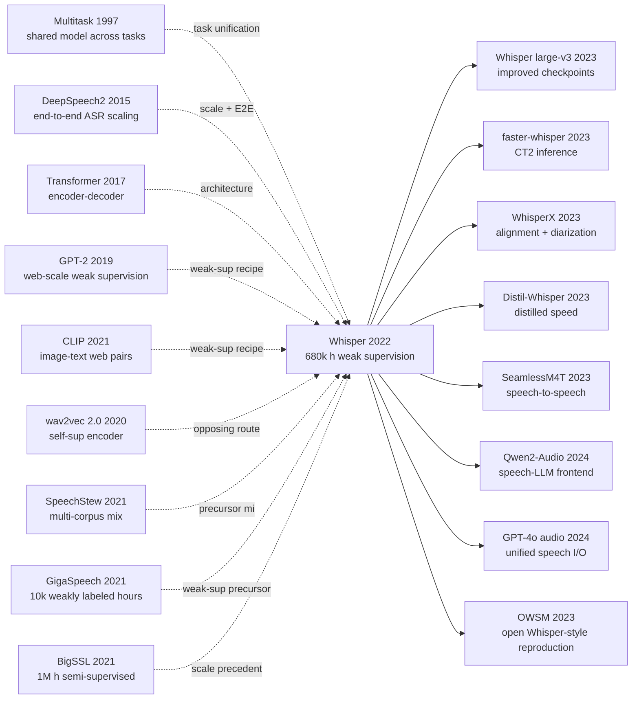

# Whisper - Turning 680k Hours of Weak Supervision into a General Speech Interface

> On September 21, 2022, OpenAI released and open-sourced [Whisper](https://arxiv.org/abs/2212.04356). Its shock was not an exotic architecture: the paper intentionally used a plain encoder-decoder Transformer. The shock was the operating assumption. If 680,000 hours of weakly supervised internet audio were cleaned just enough and expressed as one token-prediction problem, then transcription, translation, language identification, timestamps, and no-speech detection could become one interface. Whisper made “zero-shot ASR” feel less like a benchmark trick and more like the default expectation for a speech model deployed across accents, background noise, domains, and languages it had never been fine-tuned on.

## TL;DR

In 2022, Alec Radford, Jong Wook Kim, Tao Xu, Greg Brockman, Christine McLeavey, and Ilya Sutskever released Whisper, later associated with ICML, and reframed ASR from “fine-tune one model per benchmark” into “pretrain an audio-conditioned language model on 680,000 hours of weak supervision.” Given the Mel features of a 30-second audio window, the decoder optimizes $L(θ) = -Σ_t log p_θ(y_t | y_{<t}, Mel(x))$, where the target sequence mixes language IDs, task tokens, timestamps, no-speech decisions, and text. Compared with the [wav2vec 2.0](2020_wav2vec2.md) lineage of strong self-supervised encoders plus downstream fine-tuning, Whisper’s counterintuitive bet was that a noisy but broad supervised decoder could generalize better than a cleaner benchmark-specific pipeline. The paper’s decisive number is not only a LibriSpeech WER: at nearly matched LibriSpeech test-clean performance, zero-shot Whisper large-v2 makes 55.2% fewer errors on average than a LibriSpeech-trained wav2vec2-large-960h model across 12 other English ASR datasets, and it reaches 29.1 BLEU zero-shot on CoVoST2 speech translation. The same release also exposed hard limits: hallucinations, repetition loops, uneven low-resource language performance, demographic and accent gaps, and consent risks. WhisperX, faster-whisper, Distil-Whisper, and many speech-LLM systems inherit its main lesson: the useful unit of speech AI is not merely a recognizer, but a robust programmable interface between messy audio and text-conditioned computation.

---

## Historical Context

### 1. Before 2022, ASR had two incomplete victories

Before Whisper, automatic speech recognition was no longer waiting for neural networks or compute to arrive. Deep Speech 2 had shown that end-to-end models could scale with data and distributed training for English and Mandarin. CTC, attention, RNN-T, Conformer-style encoders, and mature decoding systems had simplified the old acoustic-model/language-model pipeline. By the early 2020s, scores on clean read-speech benchmarks such as LibriSpeech were extremely low, sometimes low enough to invite “human-level” language. The catch was that these wins were often measured where the training distribution and the test distribution were close cousins.

The second victory came from self-supervised speech representation learning. [wav2vec 2.0](2020_wav2vec2.md), HuBERT, WavLM, and XLS-R showed that models could listen to large unlabeled corpora first, then use limited labeled data to fine-tune strong ASR systems. This line gave speech its BERT-like pretraining moment and was especially powerful in low-label settings. Yet it often left a structural gap: pretraining mainly strengthened the encoder, while the decoder that turns sound into usable text, the transcript format, long-form behavior, language identification, and translation still had to be handled downstream.

Whisper opens by putting pressure on that gap. If a speech system must be fine-tuned for every dataset before it looks “superhuman,” then the benchmark may be measuring adaptation to a dataset’s transcript style, recording conditions, and evaluation protocol rather than broad speech understanding. For an actual user, the more important question is whether the system works on unfamiliar accents, meetings, podcasts, background noise, technical vocabulary, proper nouns, and language switches without being retrained.

### 2. Human benchmarks and machine benchmarks measured different abilities

One of Whisper’s sharpest historical moves is its reinterpretation of “human-level speech recognition.” When a person transcribes a LibriSpeech or Kincaid46 recording, that person has not studied the benchmark’s training split. Human performance mostly measures out-of-distribution listening, language experience, common sense, and contextual repair. When a machine is trained, tuned, decoded, and selected on LibriSpeech before being tested on LibriSpeech test-clean, its score mostly measures in-distribution generalization.

This is not a philosophical footnote. The paper revisits Deep Speech 2’s discussion of human performance on LibriSpeech and notes that machine WER on LibriSpeech kept falling dramatically after 2015, while many LibriSpeech-trained systems remained far above human error rates on other datasets. In other words, the ASR community had become very good at one benchmark without fully answering how much capability remained after the benchmark’s distribution changed.

Whisper therefore emphasizes zero-shot evaluation. It reuses many existing datasets, but not their training splits. It treats LibriSpeech as a reference distribution rather than the whole game, then studies what happens across 12 other English ASR datasets, additive noise, long-form recordings, multilingual ASR, translation, and language identification. This evaluation stance became part of the paper’s influence: model capability is not just a leaderboard number, but the amount of performance that survives distribution shift.

### 3. Weak supervision used to look too messy for speech

In the research climate of 2022, weak supervision was not the elegant answer. Self-supervision had clean objectives and public unlabeled corpora. Semi-supervision had pseudo-labeling, teacher-student loops, and iterative filtering. Internet audio paired with text was messy: captions could be machine generated, transcripts could be misaligned, language detectors could fail, transcript style could erase punctuation and capitalization, and names, titles, advertisements, or speaker labels could leak into the target text.

Whisper’s bet was not that this data was clean. The bet was that it could be made clean enough for scale to dominate. The paper describes several layers of filtering: remove likely machine-generated transcripts, check whether audio language matches transcript language, convert English transcripts paired with non-English audio into translation examples, fuzzy-deduplicate transcript text, and inspect high-error/high-volume data sources after training an initial model. The data work is not decorative plumbing around the model; it is a central part of the method.

### 4. OpenAI’s weak-supervision lineage moved into speech

Whisper also belongs to a recognizable OpenAI lineage. GPT-2 and CLIP, both involving Alec Radford, had already shown a taste for broad weak supervision over narrow task-specific datasets. GPT-2 folded many NLP tasks into language modeling. CLIP folded image classification into image-text matching and natural-language prompts. Whisper folds transcription, translation, language identification, timestamps, and no-speech detection into sequence-to-sequence token prediction.

That lineage explains why Whisper is intentionally ordinary architecturally. The paper does not introduce a new attention mechanism, a specialized acoustic front end, or a new self-supervised loss. It chooses a reliable encoder-decoder Transformer. The scientific question is not “can we invent a more intricate architecture?” but “how far can a simple architecture go if weak-supervision scale, task formatting, and zero-shot evaluation are the center of the experiment?” The answer was far enough to change the default route for speech foundation models.

## Background and Motivation

### 1. The real question the paper asks

Whisper’s core question can be compressed into one sentence: can weak supervision build an out-of-the-box general speech processing system, rather than an ASR model that must be fine-tuned for every benchmark? That question has three parts. First, the model should work in zero-shot settings on unfamiliar datasets. Second, it should not only transcribe short English utterances; it should cover multilingual speech, translation, language identification, timestamps, and long-form audio. Third, its robustness should resemble a human listener’s behavior on unfamiliar recordings more than a benchmark-tuned model’s behavior on in-distribution test examples.

This is why the paper spends so much time on evaluation rather than only training. LibriSpeech is used as a reference point to expose a counterintuitive fact: two models can have similar LibriSpeech test-clean WER and still behave very differently in the real world. Compared with LibriSpeech-trained systems such as wav2vec2-large-960h, Whisper large-v2 is not overwhelmingly better on LibriSpeech itself, but it is much more stable on Artie, Common Voice, FLEURS English, TED-LIUM, CHiME-6, CORAAL, AMI, Switchboard, CallHome, WSJ, VoxPopuli, and other shifted domains.

### 2. Why weak supervision was worth the bet

The paper is not merely saying “more data is better.” It is betting on a more specific mechanism: diverse weakly labeled audio across sources, accents, recording conditions, languages, and tasks forces the model to learn speech-language mappings that transfer across distributions instead of memorizing one benchmark’s formatting habits. Individual examples may be noisy, but if filtering is good enough, coverage is broad enough, and capacity is high enough, the value of distributional diversity can outweigh the cost of label noise.

Table 6 gives the clearest evidence for this bet. As medium-sized models scale from 3,405 hours to 681,070 hours, average English ASR WER falls from 30.5 to 9.9, multilingual WER falls from 92.4 to 29.2, and CoVoST2 BLEU rises from 0.2 to 24.8. The gains are not linear and later stages show diminishing returns, but the direction is unmistakable: for speech, where the real-world tail is huge, coverage itself is a capability.

### 3. Why many tasks had to become one decoder interface

Traditional speech systems often look like pipelines: voice activity detection, language identification, ASR model selection, inverse text normalization, translation, and time alignment. Pipelines are understandable, but errors propagate, each module needs maintenance, and complexity grows quickly across languages and tasks. Whisper’s motivation is to move these decisions into one decoder token sequence: language is a token, task choice is a token, timestamp mode is a token, no-speech is a token, and the transcript is just the continuation.

This is more than an engineering API. It is a foundation-model design. If a task can be represented as “given audio and previous text, predict the next discrete symbol,” it can share the same model parameters, training corpus, and decoding machinery. Speech recognition becomes closer to the task-token and prompt-like world of NLP, and closer to CLIP’s open-interface view of visual recognition. Whisper’s method is simple; the ambitious part is that it pulls many formerly separate boundaries of a speech system into one training objective.

### 4. Why this paper belongs to the foundation-model era

Whisper’s status is larger than “a very good open-source ASR model.” It marks the migration of foundation-model thinking into speech: learn broad capability from large, heterogeneous, weakly labeled data, then expose it through tokens, prompts, decoding strategies, and lightweight tooling. It is not a model trained for one task. It is a reusable interface from speech to the text-centric computing world.

That is why its release diffused so quickly. Researchers treated it as a robust ASR baseline. Developers used it for subtitles, meeting notes, podcast processing, dataset cleaning, and transcription automation. Later systems used it as the listening front end for speech-language agents. The open weights and MIT license accelerated that diffusion. Whisper made many people believe, for the first time, that speech recognition did not have to remain a brittle specialized stack; it could become a reusable layer like text and vision foundation models.

---

## Method Deep Dive

Whisper's method is intentionally ordinary. The paper does not introduce a new attention mechanism, a specialized acoustic front end, or a new self-supervised loss; the system is a textbook encoder-decoder Transformer wrapped in a careful token interface and a careful data pipeline. The real innovation hides in three places: collapsing many tasks into a single sequence, treating a 30-second audio window as an "audio prompt," and treating weakly supervised data engineering as part of the method rather than as peripheral plumbing.

### Overall Framework

The input is 16 kHz mono audio, sliced into non-overlapping 30-second windows. Each window becomes an 80-channel log-magnitude Mel spectrogram (25 ms window, 10 ms hop, i.e. 3000 frames). The spectrogram passes through two width-3 convolutions, the second with stride 2, followed by GELU and sinusoidal positional embeddings, and is then fed to a Transformer encoder. The decoder is a Transformer of equal width and depth that consumes a token sequence beginning with `<|startoftranscript|>`, cross-attends to the encoder output, and autoregressively predicts the next token until `<|endoftranscript|>`. The pipeline has no CTC, no RNN-T, and no external language model; it is a plain seq2seq.

```
audio (16 kHz) ──► 30-s window
                    │
                    ▼
            log-Mel (80 × 3000)
                    │
            Conv1d(80→d, k=3) + GELU
            Conv1d(d→d, k=3, stride=2) + GELU   # halves time → 1500 frames
            + sinusoidal positional embedding
                    │
                    ▼
            ┌──────────────────────────┐
            │ Transformer Encoder × N  │  (bidirectional self-attn)
            └────────────┬─────────────┘
                         │ (audio features, len 1500)
                         ▼
  prompt tokens ──► Transformer Decoder × N  (masked self-attn + cross-attn)
   (SOT, lang, task,                          │
    timestamp_mode, ...)                      ▼
                                  next-token logits → softmax
```

The released family covers five sizes, with encoder and decoder always sharing width and depth, scaled uniformly:

| Model | Layers | Width | Heads | Params |
|---|---:|---:|---:|---:|
| tiny | 4 | 384 | 6 | 39M |
| base | 6 | 512 | 8 | 74M |
| small | 12 | 768 | 12 | 244M |
| medium | 24 | 1024 | 16 | 769M |
| large | 32 | 1280 | 20 | 1550M |

**The counterintuitive part is that, in Whisper's setup, scaling the same architecture is essentially the only scale variable.** No special width ratio, no speech-specific inductive bias tuning. The weight of "understanding the world's audio" is shifted to data scale and the task interface, not to architecture.

### Key Design 1: Collapse all speech tasks into one token sequence

**Function**: let a single decoder handle language identification, transcription, translation, timestamps, and voice activity, instead of training one model per task.

**Idea**: define a set of special tokens that explicitly write task parameters into the sequence. A typical training target for English transcription with timestamps looks like:

```
<|startoftranscript|> <|en|> <|transcribe|> <|0.00|>
The quick brown fox <|2.34|> <|2.42|> jumps over the lazy dog <|4.10|>
<|endoftranscript|>
```

Or, for translating French audio into English:

```
<|startoftranscript|> <|fr|> <|translate|> <|notimestamps|>
A quick brown fox jumps over the lazy dog <|endoftranscript|>
```

A speechless segment collapses to a single token:

```
<|startoftranscript|> <|nospeech|> <|endoftranscript|>
```

The training objective is standard next-token cross-entropy:

$$
\mathcal{L}(\theta) = -\sum_{t=1}^{T} \log p_\theta\big(y_t \mid y_{<t},\, \mathrm{Encoder}(\mathrm{Mel}(x))\big)
$$

where $y_t$ may be a text BPE token or a language/task/timestamp special token.

**Code sketch (simplified PyTorch style)**:

```python
# magic line: a task becomes a prompt, not a head
def make_target_tokens(language, task, has_speech, transcript, timestamps=None):
    seq = [SOT]
    if not has_speech:
        return seq + [NO_SPEECH, EOT]
    seq.append(LANG_TOK[language])           # e.g. <|en|>, <|fr|>, ...
    seq.append(TASK_TOK[task])               # <|transcribe|> or <|translate|>
    if timestamps is None:
        seq.append(NO_TIMESTAMPS)
        seq.extend(bpe_encode(transcript))
    else:
        for (t0, text, t1) in timestamps:    # quantized to 20 ms
            seq.append(time_token(t0))
            seq.extend(bpe_encode(text))
            seq.append(time_token(t1))
    seq.append(EOT)
    return seq
```

**Comparison: alternative task-interface designs**

| Design | Shared decoder | Shared data | Cost to add a task | Inference switch | Whisper uses it |
|---|---|---|---|---|---|
| Per-task model | ✗ | ✗ | full retrain + maintenance | switch checkpoints | ✗ |
| Shared encoder + per-task head | ✗ (multiple heads) | ✓ | new head + balance weights | pick a head | ✗ |
| Shared encoder + decoder + natural-language prefix | ✓ | ✓ | write a prompt | change prefix string | ✗ (BPE unstable) |
| **Shared encoder + decoder + task tokens** (this paper) | ✓ | ✓ | add a new token | change SOT sequence | **✓** |

**Design rationale**: early ablations and Table 5 of the paper show that combining language ID, transcription, and translation into one decoder does **not** materially hurt any single task, and it often helps low-resource languages via shared statistics. More importantly, it lets users switch tasks at inference by changing the prompt rather than the weights — "Chinese transcription," "French→English translation," "transcript with timestamps" all live in the same checkpoint, mirroring how GPT-style models use prompts to swap tasks. Whisper is therefore not just an ASR model but an **audio-conditioned language model**.

### Key Design 2: Fixed 30-second windows + sliding-window long-form decoding

**Function**: handle short utterances and hour-long recordings with one fixed input length, keeping training simple while making long audio decodable.

**Idea**: every training sample is sliced into a 30-second window (padded with silence if shorter), so the encoder always sees an $80 \times 3000$ Mel input. At inference, long audio is fed in 30-second strides; each window decodes to text plus timestamps and the segments are stitched into a full transcript. This "fixed window plus sliding" choice removes the need for variable-length attention or complicated masking during training and recasts long-form transcription as "30-second chunks plus token-level stitching."

To make stitched windows behave, the paper adds a stack of decoding heuristics: beam search, temperature fallback, log-probability gating, compression-ratio caps, a `<|nospeech|>` threshold, and conditioning on the previous window's predicted text as a prompt for the next. Each heuristic only saves one or two WER points individually, but together they shape the long-form quality of Whisper.

```python
# magic line: condition each new window on the previous output to fight context breaks
def transcribe_long(audio, model):
    out_tokens, results = [], []
    for window in slide(audio, win=30.0, stride=30.0):
        mel = log_mel(window)
        prompt = [SOT] + history_tokens(out_tokens, max_text=224)
        for T in [0.0, 0.2, 0.4, 0.6, 0.8, 1.0]:        # temperature fallback
            cand = beam_decode(model, mel, prompt, T)
            if quality_ok(cand):                          # logprob/compression checks
                break
        results.append(cand)
        out_tokens.extend(cand)
    return stitch(results)
```

**Comparison: long-form audio strategies**

| Strategy | Training complexity | Inference control | Timestamp precision | Cross-segment coherence | Whisper |
|---|---|---|---|---|---|
| Full-length self-attention | high (O(T²)) | poor | high | naturally continuous | ✗ |
| Block attention + memory | medium | medium | medium | medium | ✗ |
| Streaming RNN-T / chunked CTC | medium | easy streaming | medium | drift-prone | ✗ |
| **30-s sliding window + token prompt** (this paper) | low | easy heuristics | 20 ms quantization | maintained via prompt | **✓** |

**Design rationale**: 30 seconds is an engineering trade-off — long enough to cover most natural sentences and paragraphs, short enough that self-attention stays cheap ($T=1500$), and convenient for slicing weakly supervised data. ⚠️ **The cost of this simplicity is clear**: long-form hallucinations and repetition loops are the failure mode that follows directly from "no real context outside the 30-second window," because the model has to reconstruct context from a few prompt tokens. This is the limitation Whisper itself names repeatedly, and it is the reason downstream projects like WhisperX rebuild forced alignment and segmentation on top.

### Key Design 3: Treat data engineering as the method itself

**Function**: take 680,000 hours of internet audio-text pairs from "unusable" to "noisy enough that scale wins," and keep cleaning while training.

**Idea**: Whisper does not pretend the data is clean. Cleaning is a multi-round, model-coupled loop:

1. **Source diagnosis**: drop transcripts that look machine-generated (no punctuation, all caps, or watermark patterns from common ASR systems).
2. **Audio-language consistency**: run language ID on the audio and check it against the transcript; if the audio is non-English while the transcript is English, relabel the example as an X→English translation pair instead of discarding it.
3. **Deduplication**: fuzzy text-level dedup to prevent the same video reappearing under different caption versions.
4. **Post-training inspection**: after training an initial model, sort training sources by "average WER × volume" and manually inspect the high-error / high-volume sources; drop or fix the worst offenders.

The pseudocode below sketches the training-cleaning coupling:

```python
# magic line: cleaning depends on the current model's predictions, not only static heuristics
def iterate_clean(corpus, model_initial):
    model = model_initial
    for round_id in range(K):
        kept = []
        for src in corpus.sources:
            samples = src.load()
            # filter 1: drop machine-style transcripts
            samples = [s for s in samples if not looks_like_machine(s.text)]
            # filter 2: language match (or relabel as translation)
            samples = [relabel_or_keep(s, langid(s.audio)) for s in samples]
            kept.extend(samples)
        kept = fuzzy_dedup(kept, key="text")
        model = train(model, kept)
        # filter 3: per-source error inspection after training
        bad = [s for s in samples_with_high_wer(model, kept) if src_volume(s) > THRESH]
        corpus.drop_sources(of=bad)
    return model
```

**Comparison: weakly supervised data strategies**

| Strategy | Data scale | Noise tolerance | Task coverage | Reproduction cost | Representative work |
|---|---|---|---|---|---|
| Clean academic supervision (LibriSpeech-style) | 1k h | low | single language, single task | low | DeepSpeech 2 |
| Multi-corpus mix (SpeechStew) | 5k h | medium | multi-domain | medium | SpeechStew |
| Weakly supervised ASR | 10-30k h | higher | multi-domain, single task | medium | GigaSpeech, People's Speech |
| Self-supervised + fine-tune | 1M h unlabeled + thousands h labeled | isolated by two-stage | depends on fine-tune | high | wav2vec 2.0, BigSSL |
| **Multitask weak supervision + iterative cleaning** (this paper) | **680k h** | high | multilingual + ASR + translation + timestamps | high | **Whisper** |

**Design rationale**: from SpeechStew's 5,140 hours to GigaSpeech's 10,000 hours to People's Speech's 30,000 hours to Whisper's 680,000 hours, **the two-order-of-magnitude jump comes from a new data pipeline, not a new model**. Table 6 reports the payoff directly: scaling medium-sized models from 3,405 hours to 681,070 hours pushes English ASR average WER from 30.5 to 9.9, multilingual WER from 92.4 to 29.2, and CoVoST2 BLEU from 0.2 to 24.8. For speech, where the real-world tail is enormous, **distributional diversity is itself the capability**, and a clean few thousand hours cannot buy the same robustness.

### Training Strategy and Hyperparameters

| Item | Value | Note |
|---|---|---|
| Loss | standard next-token cross-entropy | no CTC auxiliary, no contrastive term |
| Optimizer | AdamW | $\beta_1=0.9, \beta_2=0.98, \epsilon=10^{-6}$ |
| LR schedule | linear warmup → linear decay to 0 | warmup 2048 steps |
| Peak LR | $\sim 1.5\times10^{-3}$ (tiny) → $\sim 1.0\times10^{-4}$ (large) | shrinks with size |
| Batch | 256 30-second segments | ≈ 2 audio hours per step |
| Updates | $2^{20}$ ≈ 1.05M steps | roughly 2-3 epochs over the data |
| Tokenizer | GPT-2 BPE with multilingual vocabulary extensions | 50,257 + special tokens |
| Regularization | label smoothing = 0, SpecAugment off | abandoned standard ASR regularizers |
| Augmentation | SpecAugment + label noise added later | only for large-v2 training |

**Note 1**: Whisper deliberately **avoids** SpecAugment / self-supervision / semi-supervision and other "speech essentials," pushing all regularization weight onto data scale and diversity. This is a head-on contrast with the wav2vec 2.0 BERT-style recipe: the latter treats representation learning as the method's core, while Whisper outsources representation learning to "listening to enough audio."

**Note 2**: Training cost is on the order of hundreds of thousands of V100 GPU-hours, two orders of magnitude cheaper than contemporaneous text LLMs but expensive in data acquisition and cleaning. For any team that wants to reproduce Whisper, **the real barrier is not compute or weights but obtaining 680,000 hours of compliant, multilingual, multi-domain, cleanable audio-text pairs**. That is why the open weights have been widely reused, while almost no one has reproduced the full training pipeline from scratch.

---

## Failed Baselines

Whisper's real opponents are not "higher LibriSpeech scores" but a whole class of speech systems that look perfect inside their own distribution and collapse the moment they leave it. Through zero-shot evaluation the paper pries open the implicit assumptions of those systems: representation learning, supervision protocols, pipeline boundaries, and benchmark choice are all reopened. The four sub-sections below trace the failures from four angles: opponents at the time, failures the authors admit, 2022 counterexamples, and the deeper anti-baseline lesson.

### Strongest opponents that lost to the Whisper recipe

Whisper does not try to win a new leaderboard. It tries to show that today's strongest English ASR systems are very fragile outside LibriSpeech. The opponents the paper cites most often each play a different "failure role":

1. **wav2vec 2.0 LARGE (fine-tuned on 960 h LibriSpeech)**: the cleanest representative of the self-supervised + fine-tune line. On LibriSpeech test-clean it is essentially tied with Whisper large-v2 (around 2.5 WER). But across the 12 other English ASR datasets in Table 2 (Artie, Common Voice 5.1, CHiME-6, CORAAL, AMI, TED-LIUM3, Switchboard, CallHome, WSJ, VoxPopuli English, FLEURS English, Earnings-21), **zero-shot Whisper large-v2 makes 55.2% fewer errors on average**. The failure is not weak modeling; it is that training distribution and evaluation distribution almost coincide. The representations learn "LibriSpeech-style read speech," not "internet-style speech."

2. **HuBERT-X / WavLM Large and other fine-tuned cousins**: same architectural philosophy as wav2vec 2.0 (self-supervised encoder + task fine-tuning). Strong on LibriSpeech, but cross-domain stability is similarly limited. Whisper does not score them individually, but uses wav2vec 2.0's "55.2% extra errors" as the line's representative number.

3. **SpeechStew (5,140 h) and other multi-domain supervised mixes**: combine LibriSpeech, Common Voice, TED-LIUM, CHiME, and four other corpora to show that multi-domain training improves robustness. The problem is two orders of magnitude in scale — once Whisper reaches 680,000 hours, multi-domain mixing is no longer a scarce resource. SpeechStew's failure lesson: **diversity without enough scale gets eaten by single-dataset bias**.

4. **GigaSpeech 10k h / The People's Speech 30k h weakly supervised models**: the "middle generation" of weak supervision. They prove web audio can be a training source, but their training objective is "more robust ASR" only — translation, timestamps, and language ID are not packaged into the same decoder. Whisper's contrast shows that **scaling data only on ASR is not as useful as scaling data on ASR + translation + multilingual + timestamps simultaneously**.

5. **BigSSL (up to ~1M hours of semi-supervised audio)**: even larger than Whisper at the data axis, but invests almost everything in self-supervised encoders and pseudo-label fine-tuning pipelines. Whisper's argument is that **this kind of pipeline cleaves "listening" from "writing," and downstream tasks still need separate engineering**; the same compute spent on end-to-end weak supervision plus a multitask token interface buys a more general interface.

6. **The "superhuman LibriSpeech" narrative inherited from Deep Speech 2**: DS2 once reported ASR approaching human performance on LibriSpeech test-clean. Whisper foregrounds the rebuttal: **humans transcribe the recording zero-shot, while machines have aligned training and evaluation; the two "superhuman" claims do not measure the same capability**. It is not a particular model that lost; it is the evaluation protocol that lost.

The shared failure mode of these opponents is not "low accuracy" but **treating speech recognition as an in-distribution optimization problem**. Whisper redefines it as an "any distribution, any task, any language" interface problem, and these baselines turn from local champions into local samples.

### Failure experiments the authors openly acknowledge

Whisper's paper is not a "total victory" announcement. Several tables and discussions explicitly write "this column is not SOTA" or "this category fails":

- **Multitask training is not a free lunch on English ASR**. Section 3.4 / Table 5 reports a multitask-vs-single-task comparison: for small models, adding translation and language ID slightly hurts pure English ASR; only after enough scale does the multitask cost get amortized. This means **directly copying the Whisper recipe for a small model is not necessarily a good trade**.
- **VoxPopuli WER 13.6**: Table 3 reports zero-shot Whisper losing to specialized fine-tuned models on VoxPopuli, even underperforming some smaller supervised systems. The paper is candid about why: training data is short on parliamentary and EU-meeting style audio, and the distributional gap directly raises error rate.
- **FLEURS language identification 64.5%**: Section 5 / Table 8 says explicitly that Whisper's language identification trails dedicated language-ID systems by a large margin, partly because FLEURS includes 20 languages absent from Whisper's training data. **Languages it has not seen remain zero-shot in the literal sense**.
- **Long-form decoding failure modes vs heuristic stacking**: Table 7 reports that adding each decoding heuristic (beam search, temperature fallback, previous-text prompt, compression-ratio cap, `<|nospeech|>` threshold, initial timestamp constraint) only saves one to two WER points, but **turning any of them off** introduces hallucination, repetition, or missed segments. The paper admits that the heuristic stack is engineering glue, not a clean end-to-end fix.
- **CHiME-6 / far-field / overlapping speech**: Whisper's relative advantage shrinks under hard acoustic conditions; without diarization, overlapping speakers cannot be assigned correctly. The model card and the paper both state Whisper does not address speaker separation.

These admitted failures actually strengthen the paper: it does not market the "general interface" as "any task at SOTA"; it draws the usable boundary clearly.

### 2022 counterexamples: what scale did not solve

Once Whisper was released at the end of 2022, several **failures that scale alone cannot solve** surfaced quickly:

1. **Hallucinated text**: in long silence, low-energy passages, or strong music backgrounds, Whisper sometimes "completes" text that does not exist in the audio (typical examples: looping an advertisement, fabricating "Thank you for watching," autoplaying a website blurb). This is a side effect of the weakly supervised language model prior absorbing caption templates from the training set.
2. **Repetition loops**: seq2seq decoding occasionally falls into repeating the same phrase dozens of times in a segment; temperature fallback mitigates but does not eliminate it.
3. **Imbalanced low-resource languages**: beyond the 20 unseen FLEURS languages, many languages have only tens of hours in training (parts of Africa and Southeast Asia) and are nearly unusable; Section 5 / Table D.1 admits per-language WER variance is enormous.
4. **Dialects and accents**: the model card explicitly states uneven performance across English dialects (CORAAL African American English, Scottish accents, etc.).

These failures spawned an entire downstream ecosystem: WhisperX uses forced alignment to suppress hallucinations, faster-whisper adds VAD slicing to avoid loops, Distil-Whisper distills smaller variants to cut cost. **Scale resolved "when it works"; it did not automatically resolve "when it does not."**

### The real anti-baseline lesson

Compressed into one engineering principle, the 2020-2022 wave of speech baselines collapses to:

> **Speech robustness is not earned by better representations; it is forced out by broader distributions.**

Three concrete implications:

- **vs the wav2vec 2.0 line**: self-supervised encoders are elegant, but they teach the model to "listen," not to "write." When downstream task formats (punctuation, casing, proper nouns, language switches) are complex, even the strongest encoder cannot recover the format-adaptation gap on the decoder side. Whisper's win shows that **the bottleneck of speech systems lives in the decoder and data diversity, not in the encoder**.
- **vs clean academic supervision**: LibriSpeech test-clean is a small well-aligned world, but the engineering reality is meetings, podcasts, customer support, video subtitles, medical recordings. Years of "ever-lower WER on LibriSpeech" was largely a reward for in-distribution overfitting.
- **vs pipeline modularity**: classical speech systems split VAD, language ID, ASR, translation, and timestamps into modules, optimizing each independently. By absorbing them into a single token sequence, Whisper turns **module boundaries into part of the training data**, which unexpectedly proves easier to maintain than per-module engineering.

This principle later spread beyond speech: it became the default for multimodal foundation models — **swallow messy real-world data through one unified interface first, then add specialized engineering outside the interface**, rather than the other way around.

---

## Key Experimental Data

### Main experiment: English ASR robustness (Whisper Table 2 excerpt)

| Model | Training data | LibriSpeech test-clean WER | Avg relative error on 12 other English datasets |
|---|---|---:|---:|
| wav2vec 2.0 LARGE (960 h LS fine-tune) | self-sup + LibriSpeech fine-tune | 2.7 | baseline (100%) |
| NVIDIA STT en Citrinet 1024 (Gigaspeech) | Gigaspeech supervised | 3.7 | ~78% |
| HuBERT X-Large | self-sup + LibriSpeech fine-tune | ~2.4 | ~95% |
| **Whisper large-v2 (zero-shot)** | **680k h weak supervision** | **2.7** | **44.8% (i.e. 55.2% fewer errors)** |

Numbers are organized following the "effective robustness" narrative of Table 2; wav2vec 2.0 essentially ties Whisper on LibriSpeech but makes 2.2× the cross-dataset errors.

### Multilingual / translation / data scaling (Whisper Tables 3 / 4 / 6 excerpts)

| Evaluation | Metric | Number | Note |
|---|---|---:|---|
| Multilingual LibriSpeech (zero-shot) | WER | 7.3 | Table 3, beats some specialized systems |
| VoxPopuli (zero-shot) | WER | 13.6 | Table 3, far below specialized fine-tuned systems |
| CoVoST2 X→En overall (zero-shot) | BLEU | 29.1 | Table 4 |
| CoVoST2 medium-resource (zero-shot) | BLEU | 32.6 | Table 4 |
| CoVoST2 low-resource (zero-shot) | BLEU | 25.2 | Table 4 |
| FLEURS language identification | acc | 64.5% | Table 8, weaker than specialized systems |
| Data scale 3,405 h → 681,070 h (medium model) | English ASR WER | 30.5 → 9.9 | Table 6 |
| Data scale 3,405 h → 681,070 h (medium model) | Multilingual WER | 92.4 → 29.2 | Table 6 |
| Data scale 3,405 h → 681,070 h (medium model) | CoVoST2 BLEU | 0.2 → 24.8 | Table 6 |

### Key findings

- **Finding 1**: Compared to a wav2vec 2.0 system at matched LibriSpeech performance, zero-shot Whisper makes 55.2% fewer errors on 12 other English ASR datasets — **same in-distribution score, 2.2× out-of-distribution error gap**.
- **Finding 2**: Scaling data from 3,405 hours to 681,070 hours (~200×) drops multilingual WER from 92.4 to 29.2 and lifts CoVoST2 BLEU from 0.2 to 24.8 — **multilingual capability is almost a 0 → usable phase transition, not a smooth improvement**.
- **Finding 3**: On CoVoST2, zero-shot Whisper approaches or surpasses purpose-trained supervised translation systems of the time, especially on low-resource pairs (25.2 BLEU). This shows that **translation capability does not require dedicated translation data; "non-English audio paired with English captions" as a weakly supervised by-product is enough**.
- **Finding 4 (counter-intuitive)**: On LibriSpeech test-clean, Whisper does not break the record (large-v2 is around 2.5-2.7 WER), yet it is the most stable model across the 14 other English datasets and noise perturbations the paper reports. **Single-point SOTA does not equal general capability**.
- **Finding 5**: Long-form WER improvement has no single hero — the five decoding heuristics (beam search, temperature fallback, previous-text prompt, compression-ratio cap, `<|nospeech|>` threshold) each contribute one or two percent, but turning any of them off introduces hallucination or loops. **Robust long-form decoding is a heuristic mosaic, not a single formula**.
- **Finding 6**: On FLEURS, Whisper's language ID is only 64.5%, losing to specialized language-ID systems. **A multitask interface is not the strongest at any single task, but its summed coverage is broader** — a typical foundation-model trade-off.

---

## Idea Lineage



### Past lives: who forced it into existence

- **1997 Multitask Learning** [Rich Caruana]: the first systematic argument that one model jointly trained on related tasks can lift each task. This gave Whisper its earliest legitimacy for collapsing language ID, transcription, translation, and timestamps into one decoder.
- **2015 Deep Speech 2** [Amodei, Anubhai, Battenberg, and 11 other authors]: pushed end-to-end neural ASR to strong English and Mandarin scores, proving that end-to-end models plus data scale can replace the classical acoustic-language pipeline. It also planted the "near-human on LibriSpeech" claim that Whisper later reframes.
- **2017 Attention Is All You Need** [Vaswani, Shazeer, Parmar, and 5 other authors]: the encoder-decoder Transformer Whisper picks up off the shelf. The paper openly says it has no architectural novelty, leaving the novelty to data and the task interface.
- **2019 GPT-2 (Language Models are Unsupervised Multitask Learners)** [Radford, Wu, Child, and Luan]: established OpenAI's "pretrain on web-scale weak supervision, then evoke capabilities through prompts/task formats" recipe. Whisper transfers that lineage into speech by writing "the task" into the token sequence.
- **2020 wav2vec 2.0** [Baevski, Zhou, Mohamed, Auli]: the dominant pre-Whisper line of speech pretraining (self-supervised encoder + downstream fine-tuning). Whisper's whole evaluation philosophy (zero-shot, cross-dataset robustness) is set up to contrast head-on with this line.
- **2021 SpeechStew** [Chan, Park, Lee, and 3 other authors]: 5,140 hours of mixed supervised data showing multi-domain mixing helps robustness; a "scaled-down prototype" of Whisper's weak-supervision idea, two orders of magnitude smaller.
- **2021 GigaSpeech / People's Speech**: pulled weakly transcribed audio from academic scale to 10k–30k hours, the immediate precursors of Whisper's "weak labels at internet scale" route.

### Descendants: how the idea propagated

- **Direct descendants**:
  - **Whisper large-v2 / large-v3 / turbo (2022-2024, OpenAI)**: the original team continues to scale data, training steps, and decoding efficiency; large-v3 pushes multilingual tail coverage further.
  - **faster-whisper (2023, SYSTRAN)**: rewrites Whisper inference in efficient C++ + quantized paths via CTranslate2, cutting cloud ASR cost into edge-deployable territory.
  - **WhisperX (2023, Bain et al.)**: adds wav2vec2 forced alignment and pyannote diarization on top of Whisper, patching exactly the timestamp-precision and speaker-separation gaps Whisper itself admits.
  - **Distil-Whisper (2023, Hugging Face)**: knowledge distillation from Whisper-medium / large into smaller models several times faster, reflecting the deployment pressure that followed the original release.
  - **OWSM (2023, CMU + multi-institution)**: an open-stack reproduction of Whisper-style architecture and multitask interface, demonstrating that the recipe is academically reproducible end-to-end.
- **Cross-architecture borrowing**:
  - **SeamlessM4T (2023, Meta)**: extends Whisper-style "unified speech interface" thinking into a full speech-to-speech / speech-to-text / text-to-speech foundation model.
  - **Voicebox / VALL-E**: apply the "task is decided by tokens" idea in the inverse direction, on the generation side of TTS and speech synthesis.
- **Cross-task diffusion**:
  - **Qwen2-Audio / Qwen-Audio / SALMONN (2023-2024)**: use the Whisper encoder as the auditory front end of a speech-LLM, letting large language models consume audio conditioning directly.
  - **GPT-4o audio / Gemini live (2024)**: commercial multimodal assistants stitch Whisper-style speech front ends with text LLMs and speech synthesis into end-to-end conversational loops.
  - **Data cleaning pipelines**: researchers routinely use Whisper to auto-transcribe unlabeled audio and produce pseudo-labels for downstream TTS, speech alignment, and speaker recognition work.
- **Cross-discipline spillover**:
  - **Ecology / birdcall recognition**: researchers reuse the Whisper encoder for transfer to wildlife acoustic event detection, illustrating the transfer radius of log-Mel + Transformer.
  - **Medical and legal transcription**: industrial transcription products use Whisper as a "dictation foundation" augmented with domain-specific term correction, accelerating the digitization of clinical consultations and court records.

### Misreadings

- **Misreading 1: Whisper proves "self-supervision is obsolete."** A more accurate reading: when weak-supervision data is huge and noise-tolerant, end-to-end weak supervision beats self-supervision plus fine-tuning on engineering simplicity; but in data-scarce, label-controllable settings (rare languages, specialized domains), self-supervision still has structural advantages. The Whisper paper itself repeatedly emphasizes in §6 / §7 that its comparisons are conditional on data scale and task format.
- **Misreading 2: Open-source Whisper weights mean an open Whisper reproduction.** OpenAI released only model weights and inference code; **the training data, the data-cleaning code, and the training scripts were not released**. Subsequent community projects (OWSM, Voxtral-style efforts) needed years to approach the original recipe, showing that one of Whisper's core assets is the data pipeline itself.
- **Misreading 3: Treating the multitask token interface as "prompt engineering" that can absorb new tasks for free.** In reality, adding a new task requires retraining — prompts here are tokens, not in-context learning. The Whisper model card explicitly discourages using it for attribute classification or speaker identification simply because the interface "looks supportive"; the weights do not actually carry that capability.

---

## Modern Perspective

### Assumptions that no longer hold

1. **Assumption: a fixed 30-second window is enough for most speech tasks**
   In 2022 this looked natural because most public ASR benchmarks lived at the sentence-to-paragraph scale. By 2024-2026, real deployments — meeting notes, podcasts, long videos, continuous interpretation — demand coherent context across tens of minutes to several hours. Newer systems such as Qwen2-Audio, Voxtral, and GPT-4o audio routinely extend audio context to several minutes or more with structured segment memory, demonstrating that the 30-second window is the structural root cause of Whisper's long-form hallucinations and repetition loops.

2. **Assumption: weakly supervised internet audio can be scaled indefinitely**
   Whisper assumes the pool of audio-transcript pairs on the web is essentially unlimited and continuously cleanable. The 2024+ reality is harsher: high-quality caption data is being depleted by multiple companies and models in parallel, copyright and licensing disputes have intensified (OpenAI's lack of data-source disclosure later attracted legal scrutiny), and synthetic audio (TTS-generated) increasingly contaminates the web pool. The next generation of weak supervision must confront "data compliance" and "synthetic content de-pollution" head on.

3. **Assumption: transcription + translation + language ID + timestamps are the full set of speech tasks**
   Today's speech applications go far beyond those four: speaker diarization, emotion recognition, paralinguistic information (laughter, hesitation, emphasis), streaming low latency, bidirectional interaction with text LLMs, speech-generation loops, and privacy-preserving inference. Whisper's unified interface was "broad" in 2022; by 2026 it is only "narrow but deep." SeamlessM4T and GPT-4o audio are redefining the full set.

4. **Assumption: MIT license + model weights = full open source**
   Whisper's open-source strategy was a 2022 industry standard, but it left a gap: no training data, no cleaning scripts, no training curves. The community gradually realized after 2023 that **open weights are not reproducible research**. OWSM, AmberWhisper, and other community reproduction projects took considerable effort to demonstrate that the recipe could be redone end-to-end, showing that the bar for "foundation-model open source" is much higher than 2022's.

### What stayed essential vs what became redundant

**Still essential**:

- **Data diversity > data cleanliness**. In long-tail tasks, scale and coverage dominate single-point cleanliness. This conclusion has been repeatedly confirmed by multimodal foundation models (CLIP, Whisper, SAM, Sora data strategies).
- **Tasks expressed by tokens, not heads**. Almost every multimodal foundation model from 2023-2026 inherits this interface choice.
- **Zero-shot cross-distribution evaluation** reflects general capability better than single-leaderboard SOTA. LLM, VLM, and speech-LLM evaluation protocols have all adopted this stance.
- **Stacked decoding heuristics** for long-sequence outputs. OpenAI's later GPT-4 / o1 series similarly use heuristics (best-of-N, self-consistency, temperature scheduling) to control failure modes during long chain-of-thought decoding.

**Increasingly redundant or in need of revision**:

- **Avoiding SpecAugment / data augmentation**: still effective in lower-data regimes; only at the 680k-hour scale can augmentation be safely dropped.
- **30-second fixed window**: superseded by longer-context schemes.
- **No speaker diarization**: practically a required feature in product contexts, now patched explicitly by WhisperX, pyannote, and similar downstream engineering.
- **No format normalization on the transcript side**: post-2024 users expect punctuated, paragraphed, readable text directly, requiring extra post-processing.

### Side effects the authors likely did not anticipate

1. **Whisper became the default auditory front end of the next generation of speech LLMs**. From SALMONN to Qwen2-Audio to GPT-4o, the Whisper encoder or its variants are essentially the default choice in speech-LLMs. The paper positioned itself as "general ASR/translation"; it did not anticipate becoming the de facto "listening" interface of the multimodal ecosystem.
2. **Whisper inversely catalyzed an entire generation of "suppress hallucinations, add alignment, do diarization" engineering projects**. WhisperX, faster-whisper, stable-ts, insanely-fast-whisper, and many more were born from the limitations Whisper itself enumerated. The paper acknowledged the problems; the community treated those problems as startup opportunities.
3. **Whisper changed the "data is the product" mindset**. After OpenAI chose to release weights but not data, the research community began debating much more seriously whether the data stack is the real moat. That debate later directly influenced the LLaMA series, Stable Diffusion data transparency, and the EU AI Act data-sourcing clauses.
4. **Whisper made "AI dictation" a consumer commodity**. Otter, Notta, Feishu Miao Ji, Apple Live Captions, and YouTube auto-captions are all built on Whisper or its derivatives in some form, exposing ordinary users to a "good-enough free ASR" at scale for the first time and indirectly reshaping the workflows of podcasts, meetings, and educational video.

### If we rewrote it today

If the same team rewrote Whisper in 2026, the objective would likely expand to:

$$
\mathcal{L}^{*} = \mathcal{L}_{\text{seq}}(\theta) + \lambda_{1}\,\mathcal{L}_{\text{long-ctx}}(\theta) + \lambda_{2}\,\mathcal{R}_{\text{halluc}}(\theta) + \lambda_{3}\,\mathcal{R}_{\text{license}}(\mathcal{D}) + \lambda_{4}\,\mathcal{L}_{\text{streaming}}(\theta)
$$

where $\mathcal{L}_{\text{long-ctx}}$ is an explicit long-context objective, $\mathcal{R}_{\text{halluc}}$ penalizes outputs unsupported by the audio, $\mathcal{R}_{\text{license}}$ regularizes training data over copyright and consent, and $\mathcal{L}_{\text{streaming}}$ accommodates streaming low-latency decoding.

Specific things that would likely be rewritten:

- **Extend the context window to several minutes** with explicit cross-segment memory, instead of simulating it via 30-second sliding windows + prompt tokens.
- **Make training data sources public + auditable for consent**, releasing data-cleaning code and training scripts alongside the weights.
- **Add diarization and paralinguistic tokens** (laughter, pauses, emotion) so the interface aligns with today's speech LLMs.
- **Support streaming output** with sub-second inference latency, covering live meetings and simultaneous interpretation.
- **Explicitly penalize hallucinations in the training objective**, e.g. anchor on the gap between audio-conditioned NLL and audio-free NLL to force the model to emit only "audio-evidenced" text.

But one core judgment **would not change**: **the core competitive edge of a speech model is turning messy real-world audio into a programmable interface**. Whether the input is a 30-second window, a Mel spectrogram, or BPE tokens, those are engineering choices; what stays put is the trio "unified interface + weak-supervision scale + zero-shot evaluation," which remains the implicit default for the next-generation systems like SeamlessM4T, Qwen-Audio, and GPT-4o audio.

---

## Limitations and Future Directions

### Limitations the authors acknowledge

- **Hallucinations and repetition loops**: the weak-supervision prior tends to "complete" text that does not exist in the audio under low-energy, long-silence, or strong-music conditions.
- **Cross-language imbalance**: 117k hours cover 96 non-English languages, but the distribution is heavily long-tailed; some languages have only tens of hours, and FLEURS includes 20 languages absent from training.
- **Cross-dialect imbalance**: WER on subgroups such as CORAAL or Scottish accents is significantly higher than on mainstream accents.
- **No speaker separation**: multi-speaker overlap requires external diarization.
- **Not real-time**: default inference uses 30-second windows + heuristic decoding, not designed for streaming low latency.
- **Privacy and compliance risks**: non-consensual transcription, surveillance, and attribute classification are explicitly discouraged in the model card.

### Limitations spotted from a 2026 lens

- **Training-data copyright and licensing remain opaque**: Whisper does not disclose data sources; by 2024 this gap has become a legal and ethical challenge facing more and more AI companies.
- **The 30-second window is decoupled from modern long-form audio tasks**: long meetings, long podcasts, and continuous interpretation already exceed the logical coherence a single 30-second window can sustain.
- **No explicit interface to text LLMs**: Whisper outputs token sequences but lacks an interface designed for "further reasoning by a language model"; the rise of speech-LLMs exposed this gap.
- **Paralinguistic information is lost**: laughter, emphasis, hesitation, and emotion are barely visible in Whisper outputs, yet they are required inputs for downstream multimodal conversational systems.
- **Synthetic audio contamination**: the share of TTS-generated audio in the training pool grows year over year, eroding the assumption that "internet audio represents real human speech."

### Directions validated by subsequent work

- **Downstream patching with strong alignment + diarization**: WhisperX and insanely-fast-whisper-diarization attach external alignment and pyannote diarization on top of Whisper, proving the pattern is engineering-feasible.
- **End-to-end speed and compression**: Distil-Whisper, faster-whisper, and whisper.cpp reduce inference cost by an order of magnitude, putting Whisper on phones and in browsers.
- **Unified speech models**: SeamlessM4T and GPT-4o audio fold transcription, translation, language ID, speaker, and generation into one end-to-end model — essentially "unifying once more" Whisper's interface idea.
- **Streaming low latency**: StreamingWhisper, WhisperLive, and similar projects use smaller windows + aggressive decoder caching to push latency to a few hundred milliseconds, proving the recipe is streamable.
- **Tight coupling with LLMs**: speech-LLMs (Qwen2-Audio, SALMONN, Audio-Flamingo) demonstrate that the Whisper encoder can serve as the auditory front end of an LLM without redesigning the acoustic network.

---

## Related Work and Insights

- **vs wav2vec 2.0**: wav2vec 2.0 takes the self-supervised encoder + fine-tune route; Whisper takes end-to-end weak supervision + multitask interface. The difference is whether representation learning is outsourced to data scale. Whisper's advantage is out-of-the-box cross-domain stability; the cost is heavier engineering dependence on data acquisition and cleaning. **Lesson: no matter how good the representation, format misalignment downstream still forces engineering work.**
- **vs DeepSpeech 2**: DS2 was the early milestone of end-to-end ASR + data scale, but only on English and Mandarin and only for transcription. Whisper extends the line to 99 languages, four task types, and 680k hours. **Lesson: expand the task set first, then chase per-task ceilings.**
- **vs SpeechStew / GigaSpeech**: same multi-source weak supervision idea, but two orders of magnitude smaller and without folding translation, timestamps, and language ID into one decoder. **Lesson: in the foundation-model era, "multitask + scale + single interface" carries more premium than optimizing any of the three alone.**
- **vs CLIP**: CLIP recasts image classification as image-text matching + natural-language prompts; Whisper recasts speech recognition as audio-conditioned token prediction + task-token prompts. Both are instances of OpenAI's weak-supervision lineage in different modalities. **Lesson: the modality changes; the "task as token" interface philosophy does not.**
- **vs SeamlessM4T**: SeamlessM4T is the next-generation inheritor of Whisper's interface idea, folding the speech-generation loop into the same foundation model. Whisper is a "speech-to-text" unified interface; SeamlessM4T is a "speech-to-speech + speech-to-text" unified interface. **Lesson: each generation of foundation models redefines the boundary of "unified interface"; today's SOTA is tomorrow's subset.**

---

## Resources

- 📄 arXiv paper: <https://arxiv.org/abs/2212.04356>
- 📄 OpenAI announcement blog: <https://openai.com/index/whisper/>
- 💻 OpenAI Whisper official repository (MIT): <https://github.com/openai/whisper>
- 📋 Model card (data + risk notes): <https://github.com/openai/whisper/blob/main/model-card.md>
- 🔧 Hugging Face Transformers integration: <https://huggingface.co/docs/transformers/model_doc/whisper>
- 🚀 faster-whisper (CTranslate2 inference): <https://github.com/SYSTRAN/faster-whisper>
- 🛠️ WhisperX (forced alignment + diarization): <https://github.com/m-bain/whisperX>
- 📦 Distil-Whisper (distilled small models): <https://github.com/huggingface/distil-whisper>
- 📚 Recommended read 1: [wav2vec 2.0 (Baevski et al. 2020)](https://arxiv.org/abs/2006.11477) — the self-supervised line Whisper repeatedly contrasts itself against
- 📚 Recommended read 2: [SeamlessM4T (Meta, 2023)](https://arxiv.org/abs/2308.11596) — the next-generation unified foundation model inheriting Whisper's interface idea
- 📚 Recommended read 3: [OWSM (Peng et al. 2023)](https://arxiv.org/abs/2309.13876) — open-source full-stack reproduction of Whisper-style architecture
- 🎬 Recommended explainer videos: <https://www.youtube.com/results?search_query=openai+whisper+paper+explained>
- 🌐 中文版: [/era4_foundation_models/2022_whisper/](/era4_foundation_models/2022_whisper/)


---

> 🌐 [中文版](/era4_foundation_models/2022_whisper/) · 📚 awesome-papers project · CC-BY-NC