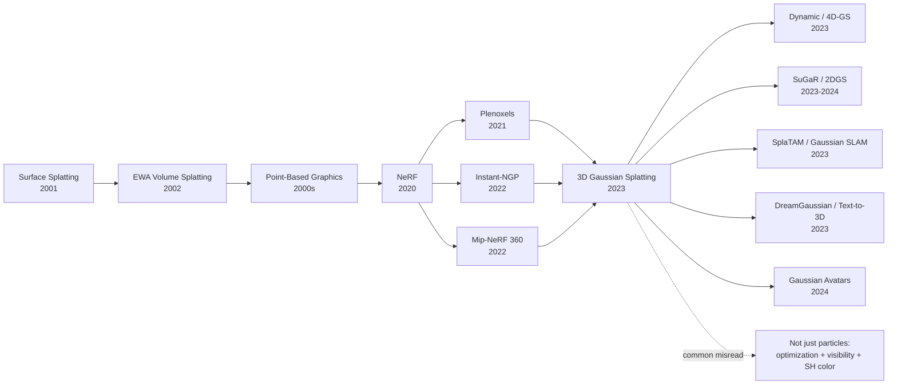

# 3DGS — Bringing NeRF-Quality Radiance Fields into Real-Time Interaction

> **On August 8, 2023, Bernhard Kerbl, Georgios Kopanas, Thomas Leimkühler, and George Drettakis uploaded [arXiv 2308.04079](https://arxiv.org/abs/2308.04079); the work soon won the SIGGRAPH 2023 Best Paper Award.** The counter-intuitive move in 3DGS was not to make radiance fields more neural, but to pull NeRF-era scene representation back into graphics-native objects: particles, ellipsoids, Gaussians, alpha blending, and a CUDA rasterizer. It kept differentiable optimization, dropped per-ray MLP evaluation, and turned Mip-NeRF-360-style offline rendering into a 1080p 30+ FPS interactive window. For the first time, "reconstruct a navigable world from a phone video" felt less like a slow paper demo and more like a product primitive.

## TL;DR

3DGS rewrites novel-view synthesis from "query an MLP along every camera ray" into "optimize a set of 3D Gaussians, each carrying position $\mu$, covariance $\Sigma=RSS^\top R^\top$, opacity $\alpha$, and spherical-harmonics color, then project them into 2D screen ellipses and alpha-composite them front-to-back": $C(p)=\sum_i T_i\alpha_i c_i$. The baselines it displaced were not weak: NeRF and Mip-NeRF 360 delivered beautiful images but often rendered at 0.03-0.1 FPS; Plenoxels and Instant-NGP were fast but paid in memory, bounded-scene assumptions, or thin-structure quality. 3DGS pushed real scenes to 30+ FPS at 1080p while matching or beating Mip-NeRF 360 on PSNR/SSIM across common view-synthesis benchmarks. Historically, its deeper lesson is that the path after [NeRF](https://arxiv.org/abs/2003.08934) was not "more neural networks everywhere." The durable representation turned out to be a graphics-friendly data structure: anisotropic translucent ellipsoids that GPUs can sort, rasterize, edit, stream, fuse with SLAM, and hand to generative models. That is why 3DGS became the default 2023-2025 substrate for real-time radiance fields, dynamic scenes, avatars, robotics mapping, and text-to-3D acceleration.

---

## Historical Context

### 2020-2022: NeRF was beautiful, but nowhere near real time

In 2020, NeRF reignited an old problem: given a set of posed images, can we recover a continuous 3D scene that can be rendered from arbitrary viewpoints? NeRF's answer was elegant: represent volume density $\sigma(x)$ and view-dependent color $c(x,d)$ with an MLP, sample points along each camera ray, query the network, and integrate with volume rendering. That formula fused geometry, appearance, and differentiable optimization into one object. It also turned view synthesis from a classical engineering problem in multi-view stereo and texture mapping into a deep-learning paradigm that could be copied, extended, and published at enormous speed.

The price of that elegance was brutal: **every pixel requires tens to hundreds of network queries along a ray**. A single 800x800 frame contains hundreds of thousands of rays; multiply that by samples per ray and even a small MLP becomes a minute-scale renderer. Mip-NeRF, Ref-NeRF, NeRF in the Wild, and Mip-NeRF 360 improved quality, anti-aliasing, reflections, unbounded scenes, and exposure variation, but did not truly solve real-time interaction. Their images were beautiful, yet the systems felt closer to offline photogrammetry than to assets one could drop into an editor, robot, AR headset, or game engine.

Between 2021 and 2022, several acceleration lines emerged. Plenoxels replaced neural networks with sparse voxels plus spherical harmonics, proving that "NeRF quality without an MLP" was possible. Instant-NGP used multiresolution hash grids to push training into minutes and became the most influential engineering breakthrough. TensoRF, K-Planes, and DVGO used low-rank decompositions or explicit grids to reduce query cost. These works accelerated training and rendering, but they still treated the scene as a **volume integrated along rays**. As long as every pixel still requires ray marching, the renderer behaves more like a volume renderer than the rasterizer GPUs are built to run.

### The graphics debt: splatting was never a new invention

The drama of 3DGS is that it brought a 2000s graphics tool back to the center. Surface Splatting (2001) and EWA Volume Splatting (2002) had already proposed the key idea: do not force point clouds into triangle meshes, and do not sample everything on a regular voxel grid; treat each point as an elliptical splat with a footprint, project it into the image plane, and blend it according to visibility and filtering rules. Back then, this tradition served point-based graphics: scanners produced dense points, triangulation was brittle, and splatting could render points directly as continuous surfaces.

Early splatting lacked two ingredients. First, it was not an end-to-end optimizable scene representation: point positions, scales, and colors usually came from scanning or reconstruction pipelines. Second, GPU transparency, sorting, tile scheduling, and gradient backpropagation were nowhere near today's maturity. By 2023 both conditions had changed. COLMAP could reliably produce camera poses and sparse point clouds from casual phone video; CUDA could implement a high-throughput tile-based rasterizer; the neural-rendering community had become fluent in optimizing scenes with photometric loss. 3DGS appears exactly at this crossing: it did not invent splatting from scratch, but made splatting into a NeRF-style learnable representation.

This is also its deepest difference from Instant-NGP. Instant-NGP says: if MLP queries are slow, make the queries faster with a hash grid. 3DGS says: if GPUs know how to rasterize, stop querying volumes along rays; turn the scene into explicit primitives that can be projected, sorted, and blended. The former optimizes inside the NeRF equation; the latter changes the computational path of rendering itself.

### Why these four authors mattered

The author list has a distinctly graphics flavor. Bernhard Kerbl and Georgios Kopanas came from the Inria / Université Côte d'Azur tradition in graphics and realistic rendering; Thomas Leimkühler at the Max Planck Institute for Informatics had worked on differentiable rendering, sampling, and reconstruction; George Drettakis is a senior figure in real-time rendering, global illumination, urban reconstruction, and graphics systems. In other words, this was not a "deep-learning team tweaks NeRF again" paper. It was a graphics team bringing the NeRF community's objective function back onto the terrain of GPU rasterization.

That background explains several choices that do not read like a typical deep-learning paper: no large model, no transformer, no learned feature grid. The core contribution lives in visibility-aware splatting, tile sorting, adaptive density control, and memory layout. The authors care not only about benchmark PSNR, but about whether a representation can be viewed, edited, compressed, loaded, and integrated in real time. The SIGGRAPH 2023 Best Paper Award was not for a prettier loss function; it was for moving neural rendering from "can be seen" toward "can be used."

### The hardware and applications of 2023 were ready for it

3DGS arrived at exactly the right time. By 2023, consumer GPUs supported high-throughput alpha blending and large memory budgets; phone and drone videos made multi-view reconstruction data cheap; AR/VR, digital twins, robotics simulation, virtual production, and text-to-3D were all searching for a 3D representation that was both realistic and real time. NeRF's research popularity had proved the demand, but NeRF assets were awkward in production toolchains: slow to render, hard to edit, weakly connected to collision or physics, and unnatural to stream.

The community reaction to 3DGS was nearly immediate. Not because it solved every 3D problem, but because it offered a simple middle layer: a set of Gaussians, each with position, scale, rotation, opacity, and color coefficients. That structure is easier to inspect, prune, merge, move, bind to a skeleton, or feed into SLAM than an MLP; it is also easier to grow from sparse photos than a clean mesh. Its role as the default substrate for 3D generation and reconstruction from 2023 to 2025 was therefore not accidental.

## Background and Motivation

### The core tension: quality, explicitness, and real time could no longer be traded off

3DGS addresses a three-way tension rather than a single metric. NeRF-style methods had quality, but the representation was implicit and rendering was slow. Meshes had real-time rendering and editability, but recovering high-quality geometry from real photos was hard, especially for thin structures and semi-transparent objects. Voxels and hash grids trained quickly, but often paid in memory or view-dependent appearance quality. The paper's real question can be stated simply: **can we keep NeRF's differentiable photo supervision while obtaining a GPU-native, explicit, real-time scene representation?**

That goal imposes four constraints on the representation. It must initialize from COLMAP sparse points rather than expensive scans; it must support continuous positions and anisotropic shape rather than collapsing into crude point clouds; it must be differentiable, so image reconstruction loss can optimize it; and it must be rasterizable efficiently instead of requiring ray marching at every frame. A 3D Gaussian lands exactly in that intersection: richer than a point because it has learnable volume and directionality, lighter than a voxel grid because it is not tied to a regular lattice, and easier to grow from photos than a mesh.

### 3DGS's goal: turning neural rendering into a graphics primitive

The motivation of 3DGS, then, is not "propose a novel neural network." It is **rewrite neural radiance fields as an optimization problem over graphics primitives**. Initialization comes from SfM points; the scene representation is a set of anisotropic Gaussians; the renderer is sorted differentiable splatting; training adds and removes Gaussians through densification and pruning; the final output is not a network checkpoint, but a point-like asset that can be rendered in real time.

This goal has a strong engineering consequence: 3DGS does not separate "fast training" from "fast rendering." Many NeRF acceleration papers optimize the training loop but leave the final viewer complicated. 3DGS requires the same representation to be optimizable and deployable from the start. That is its historical value: it moves novel-view synthesis from a function-approximation problem inside deep-learning papers back into a graphics-systems problem about data structures that can be scheduled, sorted, and edited.

---

## Method Deep Dive

### Overall Framework

The input to 3DGS is a set of posed images, usually with camera parameters and a sparse point cloud estimated by COLMAP. The system initializes every sparse point as a 3D Gaussian, then continuously optimizes, clones, splits, and prunes those Gaussians during training. The final scene is a set of explicit primitives rather than a neural network that must be evaluated at inference time.

```text
Posed images + COLMAP sparse points
        ↓
Initialize 3D Gaussians
  position μ, scale s, rotation q, opacity α, SH color coefficients
        ↓
Differentiable tile-based splatting
  project 3D ellipsoids → 2D ellipses → sort by depth → alpha blend
        ↓
Photometric optimization
  L1 + DSSIM loss, gradients update Gaussian attributes
        ↓
Adaptive density control
  clone/split under-reconstructed regions, prune useless Gaussians
        ↓
Real-time viewer
  same Gaussians, same rasterizer, 30+ FPS at 1080p
```

The crucial point is that there is no conversion between "a training representation" and "a deployment representation." The trainer, renderer, and viewer operate on the same Gaussians. This is what separates 3DGS from many NeRF acceleration methods: it does not train a field and later bake it into a mesh or texture; it places the scene inside a real-time drawable data structure from the first step.

### Key Design 1: Anisotropic 3D Gaussian Representation

Each primitive is a 3D Gaussian with a full covariance. Its parameters include center position $\mu \in \mathbb{R}^3$, opacity $\alpha$, spherical-harmonics color coefficients $c(d)$, and a covariance matrix built from scale and rotation. The paper does not optimize an arbitrary symmetric matrix directly; it parameterizes covariance as

$$
\Sigma = R S S^\top R^\top,
$$

where $S$ is a diagonal scale matrix and $R$ comes from a normalized quaternion. This factorization matters because it guarantees positive semi-definiteness while letting the optimizer adjust orientation and axis lengths independently. A Gaussian can become a flat ellipsoid hugging a wall or a thin elongated primitive along a branch, rather than remaining a spherical point.

For projection from 3D to 2D, the system uses a local affine approximation to map covariance into screen space. Given camera transform $W$ and projection Jacobian $J$, the screen covariance is approximately $\Sigma' = J W \Sigma W^\top J^\top$. This turns every 3D ellipsoid into a 2D elliptical footprint, after which the rasterizer determines which pixels it covers.

| Representation | Strength | Cost | 3DGS choice |
|---|---|---|---|
| MLP radiance field | Continuous, compact, high quality | Many network queries per pixel | Drop MLP queries |
| Voxel / hash grid | Fast training, regular access | Memory and boundary complexity | Avoid regular grids |
| Mesh | Real time, mature editing | Hard to recover from photos | Do not force topology |
| 3D Gaussian | Explicit, continuous, differentiable, rasterizable | Needs sorting and density control | The paper's middle point |

### Key Design 2: Differentiable Tile-Based Splatting Renderer

At rendering time, 3DGS does not sample along rays. It projects all Gaussians into the current view's screen space. Each Gaussian covers a set of tiles; the system collects candidate Gaussians per tile, sorts them by depth, and performs front-to-back alpha compositing for pixels inside the tile. The color equation can be written as

$$
C(p)=\sum_{i \in \mathcal{N}(p)} T_i(p)\,\alpha_i(p)\,c_i(d), \quad T_i(p)=\prod_{j<i}(1-\alpha_j(p)).
$$

Here $\alpha_i(p)$ comes from the 2D Gaussian footprint evaluated at pixel $p$ together with the primitive's learnable opacity, and $c_i(d)$ is view-dependent color, typically represented with low-order spherical harmonics. The equation resembles a discretized version of volume rendering, but the computational path is entirely different: primitives are projected and rasterized instead of samples being marched along every ray.

Engineering details are what make it fast. The tile-based rasterizer divides the screen into blocks so every pixel does not test every Gaussian. Depth sorting gives a usable approximation for transparent blending. Early termination stops blending when accumulated transmittance is already low. Most importantly, the authors wrote custom CUDA kernels so forward rendering and backward gradients both follow the same high-throughput path. That is the root cause of the real-time viewer reported in the paper.

### Key Design 3: Adaptive Density Control

COLMAP sparse points are far from enough. Real scenes need more primitives in textured regions, fewer primitives in skies and white walls, and special handling for leaves, railings, reflections, and thin structures where error concentrates locally. The 3DGS training loop therefore includes a pragmatic mechanism: dynamically clone, split, and delete Gaussians according to gradients and geometric scale.

Intuitively, if a Gaussian's projected region has high error and strong position gradients, the area is under-represented. If the Gaussian is already small, cloning a nearby copy can cover missing detail; if it is large, splitting it into smaller Gaussians gives the optimizer higher geometric resolution. Conversely, if a Gaussian has persistently low opacity, an oversized footprint, or negligible contribution, pruning removes it before the scene turns into a useless particle cloud.

| Operation | Trigger signal | Role | Problem avoided |
|---|---|---|---|
| clone | Small Gaussian with large gradient | Fill local detail | Missing fine texture |
| split | Large Gaussian with large gradient | Increase geometric resolution | Large ellipsoid blur |
| prune | Low opacity or low contribution | Control scene size | Useless points slow rendering |
| opacity reset | Mid-training opacity reset | Let visibility reorder | Early occlusion mistakes lock in |

This mechanism is the "growth algorithm" of 3DGS. Without densification, the representation is too sparse and quality resembles a point cloud. Without pruning, the representation bloats and real-time rendering disappears. Without opacity reset, early wrong occluders can contaminate gradients for too long. A large part of the paper's practical value lives in these seemingly simple control rules.

### Key Design 4: Spherical-Harmonics Color and View-Dependent Appearance

One reason NeRF looks good is that color depends on view direction, enabling highlights, reflections, and other view-dependent effects. If 3DGS gave every Gaussian only a constant RGB value, it would visibly degrade on metal, glass, glossy tables, and complex materials. The paper therefore stores low-order spherical-harmonics coefficients per Gaussian and evaluates color $c_i(d)$ from the viewing direction $d$.

The choice is deliberately restrained. It does not model a full BRDF and does not introduce an additional network; it gives each primitive a small amount of view-dependent freedom through a mature graphics basis. The benefit is controlled parameter count, a small number of multiply-adds at render time, and natural compatibility with alpha compositing. The limitation is equally clear: mirror reflection, refraction, and strong dynamic lighting remain outside its comfort zone. 3DGS makes a classic engineering tradeoff here: use a cheap representation to capture most visual benefit, and leave the hard lighting cases to future work.

### Training Objective and Python Pseudocode

The training objective is an image reconstruction loss: $\mathcal{L}=(1-\lambda)\mathcal{L}_1+\lambda\mathcal{L}_{DSSIM}$ with $\lambda=0.2$. The optimizer updates position, scale, rotation, opacity, and spherical-harmonics color; every few iterations it runs densification and pruning. The following pseudocode captures the core 3DGS loop.

```python
def train_3dgs(images, cameras, colmap_points, steps):
    gaussians = initialize_from_colmap(colmap_points)
    optimizer = Adam(gaussians.parameters(), lr_schedule="per_attribute")

    for step in range(steps):
        camera, target = sample_training_view(images, cameras)
        rendered = rasterize_gaussians(gaussians, camera)
        loss = 0.8 * l1(rendered, target) + 0.2 * dssim(rendered, target)

        optimizer.zero_grad()
        loss.backward()
        optimizer.step()

        gaussians.accumulate_viewspace_gradients()
        if step % DENSIFY_INTERVAL == 0:
            gaussians.clone_small_high_gradient()
            gaussians.split_large_high_gradient()
            gaussians.prune_low_opacity_or_oversized()
        if step in OPACITY_RESET_STEPS:
            gaussians.reset_opacity()

    return gaussians
```

Algorithmically, the novelty is not the loss itself, but that **the loss gradient directly edits a renderable asset**. After training, there is no need to distill, bake, or export the network into another format; the same Gaussians go straight into the real-time viewer. That property explains why 3DGS was rapidly adapted to SLAM, avatars, text-to-3D, city-scale reconstruction, and editable scene representation: it gave the community not a black-box model, but a 3D middleware object that can be further processed.

---

## Failed Baselines

### Baseline 1: High-quality NeRF methods lost on the rendering path

The first class of baselines beaten by 3DGS were not low-quality methods, but **high-quality methods with a computation path unsuitable for real time**. Mip-NeRF 360 is the clearest example: it handles unbounded scenes, multiscale anti-aliasing, and complex camera trajectories extremely well, and on several scenes its PSNR remains slightly above or close to 3DGS. But its rendering speed is often around 0.06 FPS, meaning one frame takes many seconds. That is acceptable for offline paper figures; it is unacceptable for an interactive viewer, VR preview, or robotics loop.

This failure is not merely "engineering was not optimized enough." It is structural to ray-marched radiance fields. As long as every pixel needs samples along a ray and queries to a field representation, rendering cost remains tied to image resolution, sample count, and network or grid access. Mip-NeRF 360's historical role was to raise the quality ceiling; 3DGS's role was to show that real-time use requires changing the computational path itself.

| Baseline | Strength | Failure point | How 3DGS bypasses it |
|---|---|---|---|
| NeRF | Continuous representation, clean concept | Minute-scale rendering | Removes per-ray MLP queries |
| Mip-NeRF 360 | High quality on unbounded real scenes | About 0.03-0.1 FPS | GPU rasterization |
| Ref-NeRF | Stronger reflection modeling | Heavier training and rendering | Cheap low-order SH approximation |
| NeRF in the Wild | Handles uncontrolled photos | Complex system, weak real-time path | Targets posed-scene real time |

### Baseline 2: Explicit grids lost on quality, memory, and boundaries

The second class of baselines includes Plenoxels, DVGO, TensoRF, Instant-NGP, and related explicit or semi-explicit accelerators. These works proved an important fact: NeRF's MLP is not sacred. Much of the quality comes from the optimization objective and multi-view supervision, not necessarily from the neural network. They made training dramatically faster and rendering far faster than the original NeRF.

Yet they were often constrained by regular structures. Voxels and feature grids need to cover space, so unbounded scenes require contraction or hierarchical machinery. Hash grids train quickly, but final rendering still involves sampling and feature queries, and thin structures, far backgrounds, and very large scenes expose capacity and aliasing issues. 3DGS bypasses this with irregular primitives: Gaussians appear only where needed, their scale and orientation vary, and scene complexity follows content rather than a regular lattice.

### Baseline 3: Naive point clouds or isotropic splats lost on optimizability

The third failure mode is closest to 3DGS itself: if you simply render COLMAP points as fixed-radius disks, the system is fast, but images have holes, flicker, boundary fuzz, and wrong occlusions. If every point has only an isotropic radius, it cannot hug walls, tables, or slanted surfaces. If points lack opacity and spherical-harmonics color, transparent blending and view-dependent appearance collapse.

The paper's ablations point to the same conclusion: splatting is only the low-level verb; what works is **optimizable anisotropic Gaussians plus density control plus visibility-aware alpha blending**. In other words, 3DGS is not "draw the points bigger." It upgrades point clouds into a differentiable, growable, sortable, and colorable scene representation.

### Failure signals inside the paper itself

3DGS does not pretend to have no weaknesses. The paper's experiments and later reproductions expose several stable issues. First, transparent objects, mirror-like reflection, and strong view-dependent lighting remain difficult because low-order spherical harmonics capture only limited appearance variation. Second, the number of Gaussians grows with scene complexity, and uncompressed `.ply` assets can be large, making Web or mobile distribution awkward. Third, sorting and transparent blending are approximate, so complex occlusion, layered transparency, and extremely close inspection can produce popping or floaters. Fourth, the geometry is not a true watertight surface, so collision, physics, or fabrication still require post-processing.

These are not small blemishes; they are the cost of the representation choice. 3DGS trades geometric rigor, strong material modeling, and compact assets for real-time photorealism. Much of the follow-up literature, including SuGaR, 2DGS, Mip-Splatting, Scaffold-GS, Compact-3DGS, and GaussianShader, exists to patch those exact holes.

## Key Experimental Data

### The main speed-quality table

The key experimental result of 3DGS is not a single first-place PSNR number, but a two-dimensional statement: quality close to the best NeRF methods, with speed in the real-time regime. The paper compares against Mip-NeRF 360, Instant-NGP, Plenoxels, and others on real datasets such as Mip-NeRF 360, Tanks and Temples, and Deep Blending. Absolute FPS varies by reproduction and hardware, but the ordering is highly stable.

| Metric / dataset | Mip-NeRF 360 | Instant-NGP / Plenoxels | 3DGS | Reading |
|---|---:|---:|---:|---|
| Mip-NeRF 360 PSNR | ~27.7 | ~25-26 | ~27.2 | Near best-NeRF quality |
| Mip-NeRF 360 SSIM | ~0.79 | ~0.67-0.75 | ~0.82 | Strong structural quality |
| Tanks and Temples PSNR | ~22.2 | ~21-22 | ~23.1 | More stable on real objects/outdoors |
| Deep Blending PSNR | ~29.4 | ~23-28 | ~29.4 | Ties high-quality NeRF |

Speed is the more striking axis. Mip-NeRF 360 often runs at 0.03-0.1 FPS; Instant-NGP reaches several to low-double-digit FPS; 3DGS reports 30+ FPS under the paper setup, with some viewer scenes reaching the 100 FPS range. That order-of-magnitude gap is what turned it from "a faster paper method" into "the new default representation."

### What the ablations tell us is indispensable

The paper's ablation section is more instructive than the final leaderboard. Anisotropic covariance, adaptive density control, opacity reset, SH color, and the custom rasterizer each change the nature of the system. Densification is especially important: it turns a sparse SfM initialization into a dense representation that can cover detail. Without it, 3DGS degenerates into "prettier point-cloud rendering."

| Component | If removed | Why it matters | Follow-up inheritance |
|---|---|---|---|
| anisotropic covariance | Planes and slanted surfaces blur | Lets primitives align to local geometry | 2DGS / SuGaR strengthen surface constraints |
| densification | Missing detail and holes | Grows capacity from sparse points | Scaffold-GS improves growth strategy |
| opacity pruning/reset | Floaters and wrong occlusion | Corrects visibility and scale | Compact-3DGS compresses assets |
| SH color | Reflections and view changes degrade | Cheap view-dependent color | GaussianShader expands materials |

The experimental lesson is therefore compact: **quality comes from an optimizable representation, speed comes from the rasterizer, and stability comes from density control**. The contribution exists only when all three factors are present.

---

## Idea Lineage

### A single diagram for ancestors, descendants, and misreadings



The most important edge in this diagram is not NeRF to 3DGS; it is Surface Splatting to 3DGS. Many readers first understand 3DGS as "a faster NeRF," which is true but incomplete. The deeper lineage is that graphics had long known splats could render point-like representations efficiently, while the NeRF community proved that multi-view photometric optimization could recover complex appearance from images. 3DGS connects those two lines.

### Before: the meeting of point-based graphics and neural radiance fields

One ancestor is point-based graphics. Around 2000, scanning devices produced large point clouds while mesh reconstruction remained brittle, making splatting a natural choice. Its core problems were footprint design, filtering, transparent blending, and visibility. 3DGS inherits those problems, but re-solves them inside a differentiable optimization pipeline.

The other ancestor is NeRF. NeRF's contribution was not the MLP itself, but the closed loop of scene representation, camera model, and image reconstruction loss. 3DGS inherits that loop while rejecting the MLP query path. Plenoxels and Instant-NGP act as bridges: they first showed explicit representations could preserve radiance-field quality, then 3DGS showed that an explicit representation could be rasterized directly.

### After: 3DGS became the post-2023 3D middle layer

3DGS spread quickly because its interface is natural to many communities. Dynamic-scene work adds time or deformation fields to Gaussians, producing Dynamic 3DGS, 4D-GS, and Deformable 3DGS. Surface-reconstruction work pushes Gaussians toward surfaces with regularization and geometry constraints, producing SuGaR and 2DGS. SLAM work treats Gaussians as online maps, producing SplaTAM and Gaussian-SLAM. Generative work optimizes Gaussians with diffusion priors, producing DreamGaussian and GaussianDreamer. Digital-human work binds Gaussians to FLAME / SMPL or skeletal structures, producing GaussianAvatars and a large avatar literature.

This shows that the propagation unit of 3DGS is not merely a CUDA kernel, but an **explicit optimizable 3D primitive**. It can combine with time, skeletons, semantics, physics, diffusion models, and SLAM front ends. Compared with a NeRF checkpoint, a Gaussian set behaves more like an interchange format: another system can read it, edit it, compress it, and render it.

### Misreading: 3DGS is not just a point-cloud comeback

The most common misreading is to frame 3DGS as a retro comeback of point-cloud rendering. That misses three conditions. First, a Gaussian is not a fixed point; it is an optimizable primitive with anisotropic covariance, opacity, and view-dependent color. Second, training is not a post-process after classical reconstruction; multi-view image loss directly updates the primitives. Third, the renderer is not ordinary point drawing; it is a custom rasterizer with visibility, sorting, alpha compositing, and gradients.

Another misreading is to treat 3DGS as the endpoint of NeRF. A more accurate statement is that it ended the phase where real-time novel-view synthesis had to depend on ray-marched radiance fields, but it did not end the 3D representation problem. Geometry, materials, lighting, compression, editability, and dynamic consistency remain open. It is closer to AlexNet after ImageNet: not the end of visual recognition, but the moment the community moved onto a faster and more scalable track.

---

## Modern Perspective

### Which assumptions no longer hold

First, the assumption that "the more neural a neural renderer is, the better" no longer holds. After 3DGS, many of the strongest reconstruction, SLAM, and generation systems returned to explicit primitives while still using deep learning for optimization, priors, or losses. The paper reminded the community that a neural network can be part of the optimizer, prior, or supervision signal without being the final asset.

Second, the assumption that "novel-view synthesis and classical graphics pipelines are separate roads" also no longer holds. 3DGS succeeds precisely by mixing them: the training objective comes from NeRF, execution comes from graphics rasterization, initialization comes from SfM, appearance uses spherical harmonics, and system performance comes from CUDA. Many post-2024 3D papers follow this hybrid route rather than putting everything inside one MLP.

Third, the assumption that "PSNR is the main metric" became weaker. 3DGS mattered because of the quality-speed-usability bundle, not because it won every single table cell. For real tools, 30 FPS, editability, compressibility, and the ability to open a scene in a viewer can matter more than 0.2 dB of PSNR. It forced 3D vision papers to face system metrics again.

### If the paper were rewritten today

If 3DGS were rewritten in 2026, compression, LOD, anti-aliasing, and geometry constraints would likely be in the main storyline rather than follow-up work. The original assets are large and Gaussian counts can grow aggressively; Mip-Splatting shows that multiscale filtering and aliasing are not minor details; SuGaR and 2DGS show that surface constraints are crucial for mesh extraction, collision, and editing. A modern version would look more like a complete asset pipeline than a proof that real-time novel-view synthesis is possible.

It would also treat semantics and dynamics more seriously. The 2023 paper mainly targets static scenes; the community now uses Gaussians for real-time SLAM, editable cities, dynamic humans, generated objects, and robot maps. A modern rewrite might make semantic labels, instance ids, temporal deformation, physical attributes, and compressible hierarchy first-class components rather than external plug-ins.

### What still holds

Even after many follow-ups, the core judgment of 3DGS remains valid: **a good 3D representation must serve optimization and rendering at the same time**. If it serves only optimization, it needs baking after training. If it serves only rendering, it cannot be recovered automatically from photos. A Gaussian set sits between those requirements, which is why it became a general middle layer.

Another judgment still holds: explicit representations make ecosystems grow faster. A NeRF checkpoint is hard for non-author systems to rewrite; a Gaussian set can be pruned, merged, compressed, rigged, tiled, streamed, and imported into viewers. This processability is why the paper's impact exceeds its PSNR table.

## Limitations and Future Directions

### Hard limitations of the original 3DGS

The first hard limitation is geometry. Gaussians can lie near surfaces, but they are not surfaces; they have no watertight topology and no inherent normal consistency. Direct use in physics simulation, robotic grasping, or fabrication is therefore difficult. SuGaR, 2DGS, GaussianSurfels, and related work push Gaussians toward more surface-like representations, showing this is not an optional polish step but a necessary bridge into real toolchains.

The second hard limitation is appearance and lighting. Low-order spherical harmonics handle mild view-dependent color, but they do not truly understand mirror reflection, refraction, changing shadows, or editable illumination. GaussianShader, relightable 3DGS, and BRDF-aware splatting all try to add material modeling. Long term, 3DGS has to move from "photorealistic replay" toward "relightable and material-editable assets."

### Where the field is likely to move

Four directions are especially clear. The first is compression and streaming, so large Gaussian scenes can load on Web, mobile, and XR devices. The second is geometry regularization, combining Gaussians with surfels, meshes, SDFs, or depth priors for more reliable geometry. The third is dynamic / 4D modeling, making temporal consistency, motion decomposition, and occlusion reappearance stable. The fourth is generative 3D, combining diffusion, video models, and Gaussian renderers so 3D asset creation moves from optimizing individual scenes toward generating controllable worlds.

If NeRF proved that photos can supervise a 3D field, 3DGS proved that the field can be a real-time graphics object. The next step is making that object semantic, physical, material-aware, hierarchical, and maintainable inside real products.

## Related Work and Insights

### Directly related work

The best way to read 3DGS is along three lines. The first is the NeRF line: NeRF, Mip-NeRF, Mip-NeRF 360, Instant-NGP, and Plenoxels, which explain what it replaced in quality and speed. The second is the splatting line: Surface Splatting, EWA Volume Splatting, and point-based graphics, which explain what it recovered from graphics. The third is the follow-up 3DGS line: Mip-Splatting, SuGaR, 2DGS, Scaffold-GS, SplaTAM, and DreamGaussian, which explain how the community repaired the original version.

### Lessons for researchers

The largest lesson of 3DGS is that **representation choice itself can be the research contribution**. It did not win through a larger network; it changed the data structure so optimization, rendering, and systems engineering aligned. Many fields have analogous opportunities: rewrite an implicit model that only optimizes offline into an explicit, schedulable, editable intermediate representation that downstream tools can consume.

The second lesson is not to underestimate old graphics. The core verb of 3DGS, splatting, was not new. But putting an old verb inside a new optimization loop can change a field's default trajectory. Classical methods are not obsolete material; they are toolboxes waiting for new hardware, data, and objective functions to reignite them.

## Resources

### Papers, code, and further reading

| Type | Resource | Note |
|---|---|---|
| Paper | [arXiv:2308.04079](https://arxiv.org/abs/2308.04079) | Original 3DGS paper |
| Code | [graphdeco-inria/gaussian-splatting](https://github.com/graphdeco-inria/gaussian-splatting) | Official training code and viewer |
| Ancestor | [NeRF](https://arxiv.org/abs/2003.08934) | Starting point for neural radiance fields |
| Follow-up | [SuGaR](https://arxiv.org/abs/2311.12775) / [Mip-Splatting](https://arxiv.org/abs/2311.16493) | Surface constraints and anti-aliasing |

The best reading order is: first read Figure 2 and the method equations in the 3DGS paper to understand Gaussian parameterization and alpha compositing; then read the CUDA rasterizer in the official code; finally read Mip-Splatting and SuGaR. That order avoids a common mistake: treating 3DGS only as a faster NeRF and missing how it brought neural rendering back into graphics systems.


---

> 🌐 [中文版](/era5_genai_explosion/2023_3dgs/) · 📚 awesome-papers project · CC-BY-NC