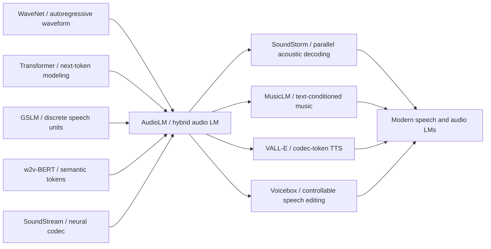

# AudioLM - Turning Raw Audio into a Language Modeling Problem

> **On September 7, 2022, Borsos, Marinier, Zeghidour, and eight co-authors at Google Research uploaded [arXiv:2209.03143](https://arxiv.org/abs/2209.03143) under the title AudioLM.** The counter-intuitive move was not merely “generate speech”; it was to first break speech and piano into discrete tokens, then train next-token predictors almost as if raw audio were text. Semantic tokens carry long-range linguistic or musical structure; SoundStream acoustic tokens carry timbre, recording conditions, and waveform detail. The public number that made the paper memorable came from Google’s own blog: human listeners distinguished real speech from AudioLM continuations with only a 51.2% success rate, close to random guessing, while Google simultaneously reported a 98.6%-accurate detector and said it had no plan to release the model broadly. AudioLM therefore marked a boundary in 2023 generative audio: the field stopped thinking only in terms of synthesizers and started thinking in terms of audio language models.

## TL;DR

AudioLM, written by Borsos, Marinier, Zeghidour, and eight co-authors at Google Research and circulated as an ICLR 2023 / arXiv paper, is the “audio language model” paper that made the abstraction concrete. It does not predict waveform samples directly. It first compresses raw audio $x_{1:T}$ into two discrete streams: semantic tokens $s$ from discretized w2v-BERT activations, which carry speech content, syntax, and musical motifs, and acoustic tokens $a$ from a SoundStream residual-vector-quantized codec, which carry timbre, speaker identity, recording conditions, and waveform fidelity. Generation is approximately factored as $p(s,a)=p(s)\,p(a^{\text{coarse}}\mid s)\,p(a^{\text{fine}}\mid s,a^{\text{coarse}})$, followed by SoundStream decoding back to audio. The failed baselines it displaced were equally clear: WaveNet-style waveform autoregression was too slow for long coherent audio; GSLM/HuBERT-only semantic units preserved content but sounded poor; Tacotron/MIDI/text-conditioned systems relied on annotations and could not naturally model speaker identity, prosody, or performance style. AudioLM moved the [Transformer](../era3_attention/2017_transformer.md) next-token recipe into audio space and directly shaped SoundStorm, MusicLM, VALL-E, Voicebox, and the broader speech/audio-LM lineage. The hidden lesson is that the central problem in audio generation is not merely “can the model understand text?” but “can we invent a discrete representation that is low-rate enough for language modeling while still preserving identity and acoustic detail?”

---

## Historical Context

### Where audio generation was stuck around 2022

Before AudioLM, generative audio mostly followed two routes. The first started from the waveform. WaveNet and SampleRNN-style systems directly modeled samples or short acoustic frames autoregressively. Their strength was naturalness; their weakness was sequence length. Ten seconds of 16 kHz speech contains 160,000 samples. If every step must predict only the next value, the model struggles to keep local timbre, syntactic coherence, and minute-level structure under one objective. WaveNet proved that neural networks could synthesize high-fidelity speech, but it also made one practical fact painfully visible: raw waveform is not a convenient “language” for long-form generation.

The second route started from annotations. Tacotron 2, FastSpeech, Music Transformer, and nearby music-generation systems often relied on text, phonemes, MIDI, lyrics, symbolic scores, or heavily curated intermediate representations. They were powerful for TTS or music tasks, but the limitation was obvious: much of real audio has no textual counterpart. Speaker identity, accent, emotion, microphone conditions, room reverberation, piano touch, and pedal behavior do not fit cleanly into a transcript or MIDI file. More importantly, many useful scenarios have no large-scale annotation at all. If the goal is “continue speaking like this person” or “continue playing like this performance,” the model has to learn structure from audio itself.

Around 2021, self-supervised speech representations and neural audio codecs supplied the missing materials for a third route. HuBERT, wav2vec 2.0, w2v-BERT and related models could compress speech into lower-rate discrete units carrying phonetic, lexical, and syntactic cues. SoundStream and EnCodec-like neural codecs could compress waveform into reconstructable residual-quantized tokens preserving timbre and recording conditions. The catch was that each token family was incomplete. Semantic tokens understood “what is being said,” but reconstructed audio sounded poor. Acoustic tokens understood “what it sounds like,” but remained dense, and long-range language structure drifted. AudioLM sits exactly at that historical point: it did not invent a radically new Transformer; it turned the complementarity of two tokenizers into a working generative system.

### The immediate predecessors that forced AudioLM into existence

WaveNet convinced the field that neural networks could generate natural waveform, but left behind the cost of very slow long-sequence generation. Tacotron 2 showed that text-to-speech could be highly natural, but tied the process to transcripts. Music Transformer showed that attention models could preserve long-range musical structure, but it relied on symbolic music representation rather than raw recordings. GSLM came closest to AudioLM: it used discrete speech units for textless speech language modeling and showed that models could generate language-like sound. Yet with only those units, fine acoustic detail and naturalness were weak.

SoundStream supplied the other key piece. It used residual vector quantization to compress audio into multiple codebook layers and a decoder to reconstruct high-quality waveform. The official AudioLM examples page even compares 3-layer RVQ and 12-layer RVQ: the former is about 1.5 kbps, the latter about 6 kbps, and the latter is the default. This matters because AudioLM was not willing to buy semantic structure by sacrificing fidelity. At the same time, w2v-BERT combined masked language modeling and contrastive learning in self-supervised speech pretraining, making its discretized activations closer to a content skeleton. AudioLM’s core move was not to choose between the two. It accepted that audio generation needs two time scales: low-rate semantic units for long-range consistency, high-rate codec units for audible quality.

### The author team and release context

The paper came from Google Research’s audio team. The authors were Zalán Borsos, Raphaël Marinier, Damien Vincent, Eugene Kharitonov, Olivier Pietquin, Matt Sharifi, Dominik Roblek, Olivier Teboul, David Grangier, Marco Tagliasacchi, and Neil Zeghidour. Zeghidour and collaborators had already worked on SoundStream, and the team had both neural-codec experience and Google’s large-scale speech-representation infrastructure. AudioLM was therefore not a one-off demo; it was a point where self-supervised speech representation, neural codecs, and Transformer language modeling met inside one research program.

The timing also mattered. In September 2022, text and image generation had already exploded in public view: DALL-E 2, Imagen, Stable Diffusion, PaLM and related systems made “feed discrete tokens to a large model” feel like the default intuition. Audio was still awkward. High fidelity and long-range structure were often traded against each other, and text-conditioned generation had not been unified with unsupervised audio learning. AudioLM’s impact came from a very simple answer: tokenize audio first, then let the Transformer do next-token prediction. That answer later propagated into MusicLM, SoundStorm, VALL-E, and a broad family of speech language models.

### Industry and safety context at the time

The official AudioLM blog both showcased striking continuation samples and stated that Google had no plan to release the model broadly. It also reported a detector trained for generated speech. That posture captured the state of generative audio at the end of 2022: the capability was approaching the point where ordinary listeners could be fooled, while safety practices, social norms, and watermarking mechanisms were not ready. Compared with image generation, speech generation directly touches identity spoofing, fraud, political audio fabrication, and personal voice cloning. By placing the 51.2% human real-versus-synthetic discrimination rate next to the 98.6% detector accuracy, the team was saying two things at once: the technology was impressive enough to matter, and risky enough to require governance.

## Background and Motivation

### Moving audio from waveform space to discrete-token space

AudioLM’s first motivation was to make the modeling problem manageable. Raw audio has such a high sampling rate that waveform-level modeling asks a language model to process tens of thousands of tokens per second. Human perception is not organized sample by sample; it is organized through phonemes, syllables, timbre, rhythm, harmony, and other layers. Discrete tokenization turns a continuous signal into symbolic sequences that language models can handle. In this paper, “language” does not mean natural language; it means any discrete sequence that can be modeled through next-token prediction.

The second motivation was to avoid excessive dependence on human annotation. Traditional TTS needs text; music generation often needs MIDI or a score; but most real-world audio does not come with aligned labels. AudioLM tried to show that by listening only to raw waveform, a model can learn long-term regularities such as “this continuation sounds like a plausible sentence” or “this continuation sounds like a coherent musical phrase.” This was a major shift for generative audio because it moved the field from supervised pipelines toward self-supervised or unsupervised audio modeling.

### The problem this paper truly had to prove

AudioLM did not merely need to prove that Transformers can process audio tokens; GSLM and codec language models had already suggested that. It had to prove that a hierarchical token scheme could obtain long-term consistency and high fidelity at the same time. If the only goal is content, semantic tokens are enough. If the only goal is sound quality, codec tokens are enough. A convincing speech continuation must satisfy all three conditions simultaneously: keep the same speaker, produce language-like content, and avoid audio-quality collapse. Piano continuation has the same structure: melody, harmony, rhythm, and touch all have to remain continuous.

That is why AudioLM belongs in an awesome-papers collection. It was not the first neural vocoder, not the first speech-representation paper, and not the largest audio model. Its contribution was to turn “semantic discretization + acoustic discretization + hierarchical language modeling” into a reproducible paradigm. After 2023, many generative-audio systems replaced pieces of the stack with diffusion, flow matching, or parallel decoding, but they were still answering the representational question AudioLM made central: which token stream carries content, and which token stream carries sound?

---

## Method Deep Dive

### Overall Framework

AudioLM can be compressed into one sentence: turn continuous audio into two complementary families of discrete tokens, use a chain of Transformer language models to predict those tokens hierarchically, then reconstruct waveform with a SoundStream decoder. It does not treat speech and piano as two separate method families, and it does not require transcripts, phonemes, MIDI, or scores. The input is raw audio and the output is raw audio. The difference lies only in the training corpus: the speech model learns spoken audio in the LibriLight/LibriSpeech style, while the piano model learns MAESTRO-style piano recordings.

AudioLM’s probability factorization can be written as a simplified equation:

$$
p(x) \approx p_\theta(s_{1:N})\;p_\phi(c_{1:M}\mid s_{1:N})\;p_\psi(f_{1:M}\mid s_{1:N},c_{1:M}),\qquad \hat{x}=D_{\text{SoundStream}}(c,f).
$$

Here $s$ denotes semantic tokens, $c$ coarse acoustic tokens, $f$ fine acoustic tokens, and $D_{\text{SoundStream}}$ the codec decoder. The factorization writes the “content first, acoustics second” intuition into the generation order: first decide where the utterance or musical phrase is going, then fill in speaker identity, timbre, recording environment, and detail.

| Component | Source | Mainly preserves | Mainly loses | Role in AudioLM |
|---|---|---|---|---|
| Semantic tokens | w2v-BERT discretized activations | phonetics, lexical shape, syntax, melodic skeleton | speaker detail, recording texture | long-range structure modeling |
| Coarse acoustic tokens | early SoundStream RVQ layers | timbre, identity, coarse acoustic conditions | high-frequency detail | bridge semantics and waveform |
| Fine acoustic tokens | later SoundStream RVQ layers | high-frequency texture, transients, detail | long-range semantics | improve audible quality |
| Waveform | SoundStream decoder output | playable audio | editable symbolic structure | final synthesis result |

### Key Design 1: Hybrid Tokenization

AudioLM’s first key design is the refusal to use a single token type. With semantic tokens only, the model can generate unit sequences that are more language-like, but the decoder cannot recover natural timbre, and the audio easily sounds like flattened pseudo-speech. With acoustic tokens only, the voice can resemble the prompt and preserve speaker or room characteristics, but linguistic content often degenerates into babbling. The official examples page explicitly demonstrates “generation without semantic tokens”: continuations after a 4-second prompt can keep speaker identity while losing coherent language. That is not a minor artifact; it is a representation failure.

Hybrid tokenization separates the roles. w2v-BERT is a pretrained masked audio model whose discretized activations lean toward content and structure. SoundStream is an end-to-end neural codec whose RVQ codebooks lean toward reconstructable sound. AudioLM does not simply concatenate the two token streams and feed them to one larger model. It controls information flow through a hierarchical generation order: semantic tokens are generated first, and acoustic tokens are generated under their condition. The acoustic model therefore does not have to invent syntax, and the semantic model does not have to carry every waveform detail.

| Representation alone | Typical gain | Typical failure | AudioLM treatment |
|---|---|---|---|
| waveform only | full detail | extremely long sequence, slow generation | do not model waveform directly |
| semantic token only | stronger long-range content | poor fidelity, weak identity | use only in the first stage |
| acoustic token only | good timbre and quality | drifting linguistic content | condition it on semantics |
| hybrid token | content and fidelity together | more complex system | decompose into three LM stages |

### Key Design 2: Hierarchical Autoregressive Generation

AudioLM’s generation process consists of three Transformer stages. The first is a semantic LM: given the prompt’s semantic tokens, it predicts future semantic tokens. The second is a coarse acoustic LM: it takes the complete semantic sequence and past coarse acoustic tokens as condition, then predicts future coarse acoustic tokens. The third is a fine acoustic LM: it fills later RVQ layers under semantic and coarse-acoustic condition. Finally, the SoundStream decoder converts coarse and fine acoustic tokens back to waveform.

This hierarchy has an engineering advantage: the component responsible for long-range consistency operates on low-rate tokens, while the bandwidth-heavy waveform details are delayed. The semantic stage has shorter sequences and can cover longer context; the acoustic stage has denser tokens, but it no longer needs to plan language content independently. In speech continuation, the first stage decides “what kind of sentence comes next,” while the second and third stages decide “how the same person says it with similar prosody and recording conditions.”

```python
def audiolm_generate(prompt_audio, semantic_lm, coarse_lm, fine_lm, codec):
    semantic_prompt = w2v_bert_quantize(prompt_audio)
    acoustic_prompt = codec.encode(prompt_audio)          # RVQ codebook streams

    semantic_full = semantic_lm.sample(prefix=semantic_prompt)
    coarse_full = coarse_lm.sample(
        semantic=semantic_full,
        prefix=acoustic_prompt.coarse,
    )
    fine_full = fine_lm.sample(
        semantic=semantic_full,
        coarse=coarse_full,
        prefix=acoustic_prompt.fine,
    )
    return codec.decode(coarse=coarse_full, fine=fine_full)
```

| Generation stage | Conditioning input | Prediction target | Problem solved |
|---|---|---|---|
| Semantic LM | prompt semantic tokens | future semantic tokens | content, syntax, melodic direction |
| Coarse acoustic LM | semantic tokens + past coarse codes | future coarse codes | speaker, timbre, recording condition |
| Fine acoustic LM | semantic + coarse + past fine codes | future fine codes | high-frequency detail and waveform naturalness |

### Key Design 3: Audio-Prompted Continuation

AudioLM’s main task is not traditional TTS but continuation: give the model a few seconds of prompt audio and ask it to continue in the same context. This is a clever setting because the prompt supplies both content prefix and acoustic identity. The model does not need an explicit speaker embedding, nor a textual description such as “this is person X’s voice.” SoundStream tokens already carry identity, timbre, and recording condition; semantic tokens carry contextual structure.

Prompt-based continuation also makes evaluation sharper. For human listeners, the hard case is not an isolated synthetic utterance, but a clip where the first seconds are real and the continuation must sound like the same recording. This stresses semantics, prosody, identity, and acoustic texture at once. The official LibriSpeech test-clean and test-other demos emphasize unseen speakers and unseen content, which matters: the model is not simply memorizing training speakers, but learning how to copy and extend acoustic conditions from the prompt.

### Key Design 4: One Interface for Speech and Music

AudioLM’s most important historical idea is that speech and piano music enter the same interface. In speech, “semantics” roughly means phonetics, words, and syntax. In piano music, “semantics” is closer to local melody, harmony, and rhythmic pattern. The paper does not introduce MIDI for music, and it does not transcribe piano audio into a score. It keeps the audio-only tokenization pipeline. AudioLM’s claim therefore rises from “a speech generation method” to “a general audio sequence modeling method.”

That unified interface does not mean all audio is equally easy. Speech has strong discrete structure, and piano has relatively clear pitch and rhythm. Environmental sound, overlapping speakers, dense instruments, and cinematic sound effects are harder. By demonstrating speech and piano, AudioLM chose two domains that are different enough but still structured: one tests linguistic content, the other tests musical long-range structure. The success shows that token-LM audio generation can transfer, but it also leaves the next question open: how should tokenizers cover more open, mixed, and controllable audio worlds?

---

## Failed Baselines

### Failed Baseline 1: Acoustic Tokens Only

AudioLM’s most persuasive failure case is the “generation without semantic tokens” comparison on the official examples page. When the model performs continuation using only SoundStream acoustic tokens, short-range timbre, speaker identity, and recording condition can still continue convincingly. At first listen, it may sound as if the model has captured the prompt. But as the continuation unfolds, linguistic content begins to drift and often becomes babbling in the same voice. This failure shows that acoustic tokens are biased toward the surface of sound: they preserve who is speaking, where the clip was recorded, and what the voice sounds like, but they do not provide a strong low-rate structure for planning an utterance.

This baseline matters because it blocks an apparently simpler route: if SoundStream can reconstruct high-quality audio, why not train a codec-token language model directly? AudioLM’s answer is that reconstruction quality is not generation quality. Codec tokens are much lower-rate than waveform, but still dense for long-range language modeling. They also entangle content, identity, noise, and local texture, forcing one model to solve too many problems at once. The failure of acoustic-only generation proves that semantic tokens are not decoration; they are the planning layer in the generative chain.

### Failed Baseline 2: Semantic Tokens Only

The opposite failure is to use only semantic units. GSLM and HuBERT-unit language models had already shown that discrete speech units can generate sound with some linguistic structure, but these representations often discard speaker identity, timbre, and fine prosody. To researchers, they resemble a content draft. To ordinary listeners, they do not sound like believable recordings. AudioLM did not reject this line; it demoted it to the first stage. Semantic tokens decide future content, but they are not responsible for final audible quality.

This failure also explains why AudioLM is not merely a speech-representation paper. Good speech generation is not just saying text or phonemes. It is convincing the listener that “the same person keeps speaking in the same situation.” If the representation has already dropped speaker identity and recording conditions, the decoder cannot reliably invent them later. AudioLM introduces SoundStream acoustic tokens because paralinguistic information is not noise; it is part of perceived realism.

### Failed Baseline 3: Transcript or Symbolic-Score Dependence

Traditional TTS and music-generation systems failed not in single-task quality, but in task boundary. Tacotron 2 could read text naturally, and Music Transformer could extend phrases in MIDI space, but both required humans to provide discrete symbols first. AudioLM cared about raw audio without transcripts, phonemes, MIDI, or scores. If a model must wait for an annotation pipeline, it cannot learn phenomena the annotation does not cover.

This failure is especially visible in piano continuation. A piano performance is not merely a note sequence; it includes subtle timing variation, pedal behavior, touch, recording space, and performer style. MIDI can express part of the structure, but not the complete sound. AudioLM learns continuation directly from piano recordings, expanding “musical language” from symbolic score to performed audio. Its results are not necessarily better than every specialized music system, but they prove that the audio-only route can move beyond speech.

| Failed route | Why it looked reasonable then | Concrete problem | Lesson AudioLM learned |
|---|---|---|---|
| WaveNet-style waveform autoregression | direct and maximally detailed | sequences too long, hard long-range planning | do not use waveform as the main modeling space |
| semantic units only | low-rate and structurally strong | weak fidelity and identity | make it responsible only for high-level content |
| codec tokens only | reconstructable and natural sounding | content drift and babbling | condition it on semantic tokens |
| transcript/MIDI dependence | clear control and stable training | misses unannotated acoustic factors | learn structure with audio-only tokenization |

## Key Experimental Data

### Experimental Setup

AudioLM’s experiments were not a conventional benchmark race. They were designed around two questions: first, can speech continuation make listeners believe the second half is real speech; second, can the same method transfer to piano continuation? The speech examples use short prompts from LibriSpeech test-clean and test-other, emphasizing speakers and content not seen during training. The piano examples come from the MAESTRO test split. The official demos often use 3-second or 4-second prompts, long enough to provide acoustic identity but too short for the model to solve the task by copying.

For generated audio, subjective evaluation is more important than a single automatic metric. The AudioLM paper and Google Research blog used human listening tests to judge whether short clips were real recordings or AudioLM continuations. Listeners achieved a 51.2% success rate, not statistically different from random guessing at 50%. This number does not prove that the model is perfect, because test conditions, sample selection, and listening protocol all matter. But it does show that in a controlled continuation setting, AudioLM reached the perceptual boundary of ordinary listeners.

### How to Read the Key Numbers

Another key number is 98.6%: Google reported a classifier trained to detect AudioLM-generated speech with 98.6% accuracy. This number is often overlooked, but it is essential for understanding the paper. The 51.2% result says human ears struggle; the 98.6% result says machine detection still has usable signal. In other words, AudioLM’s risk is not “all detection becomes impossible,” but “ordinary distribution contexts without detectors become dangerous.” That is one reason Google did not broadly release the model at the time.

The official examples also compare SoundStream reconstructions with 3-RVQ and 12-RVQ: 3 layers are about 1.5 kbps, 12 layers about 6 kbps, and AudioLM uses the higher-fidelity configuration by default. This comparison shows that AudioLM did not leave audio quality to post-processing; it made bitrate and fidelity a tokenizer-level design decision. The joint appearance of speech and piano tasks further shows that the framework was not simply a TTS pipeline, but a transferable audio-LM recipe.

| Observation | Number or setting | Meaning | Careful interpretation |
|---|---:|---|---|
| real/synthetic discrimination | 51.2% success rate | ordinary listeners are near random guessing | not a universal guarantee in open settings |
| generated-speech detector | 98.6% accuracy | machines can still capture generation traces | evaluated against AudioLM-style samples |
| SoundStream comparison | 3-RVQ about 1.5 kbps / 12-RVQ about 6 kbps | high fidelity needs more codec layers | bitrate and modeling cost rise together |
| speech prompt | 3-4 second prompt | supplies both content prefix and acoustic identity | not zero-prompt speech generation |
| piano prompt | MAESTRO test split prompt | shows audio-only transfer across domains | still a structured instrument, not all environmental sound |

### Why these experiments changed the route

AudioLM did not publish the kind of leaderboard spanning dozens of datasets that modern foundation-model papers often use. Its route-changing power came from clear counterfactuals. Acoustic-only tokens sound like the same person but lose content. Semantic-only tokens preserve content but lack believable sound. Transcript or MIDI dependence defeats the goal of audio-only learning. AudioLM placed these counterfactuals next to one another, making the hybrid token hierarchy look less like added complexity and more like the necessary resolution of a contradiction.

In hindsight, the experiments left behind a set of evaluation questions: does continuation preserve prompt identity, does long audio maintain structure, does the tokenizer separate semantic and acoustic roles, and can safety detection keep pace with generation quality? Those questions later appeared in MusicLM, SoundStorm, VALL-E, Voicebox, and many speech/audio foundation models. AudioLM did not have many headline numbers, but each number landed on a paradigm choice.

---

## Idea Lineage

### Before: Discretizing the Continuous World

AudioLM’s ancestry is not a single paper, but a family of efforts to discretize continuous signals. WaveNet proved that waveform can be generated by neural networks, but it still operated close to raw samples. The Transformer proved that discrete token sequences can learn complex structure through next-token prediction. GSLM proved that speech units can be modeled like language. SoundStream proved that a neural codec can compress audio into reconstructable tokens. AudioLM combined these threads into a cleaner statement: audio generation is first a representation problem, and only then a model-scale problem.



### Now: The Audio Token Language Model

After AudioLM, “audio token language model” became a natural concept. Researchers stopped treating vocoders, TTS, music generation, and speech representation as fully separate islands and started asking a shared set of questions: what is the tokenizer, what is the token rate, which tokens carry content, which tokens carry acoustics, how does the decoder reconstruct sound, and is the generator autoregressive, parallel, diffusion-based, or flow-based? That problem frame outlived the individual model.

SoundStorm was one of the most direct successors. It accepted AudioLM’s token hierarchy but replaced slow autoregressive acoustic-token generation with more efficient parallel masked decoding. MusicLM connected AudioLM’s audio-token route to text-conditioned music generation. VALL-E pushed neural codec token language modeling into zero-shot TTS. Voicebox and later flow-matching speech models shifted the emphasis toward editing, infilling, and multilingual control. They changed the model form, but followed the representation route AudioLM opened.

### After: From Continuation to Controllable Generation

AudioLM’s central task was continuation, which is a strong way to test whether a model “understands” a prompt. The later world cared more about controllability: generate speech from text, clone a speaker from a short voice prompt, generate music from style descriptions, edit the middle of an utterance, run real-time duplex dialogue, or connect speech input and output directly to multimodal LLMs. AudioLM did not solve all of those product-level problems, but it supplied the substrate: first turn audio into tokens that a language model can manipulate, then add conditions and controls in token space.

Historically, this resembles the role of VQ-VAE and VQGAN in image generation. First discretize a continuous perceptual signal, then let powerful sequence or diffusion models operate in the discrete or latent space. Audio differs because its temporal structure is stronger, identity and prosody are more sensitive, and the sampling rate is harsher. AudioLM’s contribution was to make this idea sound credible in audio, not merely look plausible on a diagram.

### Misreading: AudioLM Is Not a Text-to-Speech Model

The most common misreading is to treat AudioLM as a TTS model. Strictly speaking, AudioLM is an audio continuation and audio generation framework. It does not take text as input and does not require transcripts. It can generate syntactically and semantically plausible speech, but “semantic” here comes from self-supervised audio tokens, not textual semantic labels. Calling it TTS misses the paper’s central point: AudioLM showed that generative long-range structure can be learned from raw audio without text.

Another misreading is to attribute AudioLM’s quality mainly to “a large model.” What made the paper compelling was not parameter count but representational decomposition. Later systems certainly scaled data and model size and used stronger decoders, but without a semantic/acoustic token split, larger models still struggle between “content” and “sound.” AudioLM’s intellectual legacy is that one should first move the generation problem into the right representational space.

---

## Modern Perspective

### Which Judgments Survived

Seen from 2026, AudioLM’s most durable judgment is that audio generation needs a division of labor in discrete representations. SoundStorm, MusicLM, VALL-E, Encodec-based TTS, Mimi/SpeechTokenizer-style systems, and real-time speech-to-speech models all inherit this judgment to different degrees. They may replace the autoregressive generator, swap the tokenizer, add text conditioning, speaker prompts, instruction tuning, or multimodal LLM interfaces, but they almost always ask the same question: how should content tokens and acoustic tokens align?

The second judgment that survived is that continuation is a sharp task for evaluating audio models. Text-to-speech can hide many difficulties because the text already supplies content. Unconditional generation is so open that evaluation becomes loose. Continuation places the model in a narrow and demanding slot: it must understand the prompt, preserve identity and style, and still generate new content. This evaluation idea later migrated to zero-shot voice cloning, music continuation, speech editing, and real-time dialogue.

### Which Assumptions No Longer Hold

One implicit AudioLM assumption was that autoregressive token generation is sufficient for high-quality audio generation. Conceptually this is true, but product-level systems quickly challenged it. SoundStorm showed that acoustic tokens can be generated much faster with parallel masked decoding. Diffusion and flow matching also became strong in speech editing, music, and general audio. Today, a long-audio system built only with AudioLM’s three-stage autoregressive route would have high latency and sampling cost.

Another assumption that no longer holds is that audio-only modeling is enough for mainstream needs. Audio-only learning is elegant, but products need control: text, emotion, speaker identity, language, tempo, style, scene, edit region, and safety policy all have to enter the model. AudioLM deliberately avoided these conditions to test the limits of unannotated learning; later systems had to connect it to conditional generation. In short, AudioLM solved “can audio be modeled like language?” but not “how can humans precisely direct an audio model?”

### If AudioLM Were Rewritten Today

If AudioLM were rewritten today, I would keep the hybrid token hierarchy but replace many engineering components. The semantic tokenizer would likely no longer rely only on w2v-BERT; it would use a stronger multilingual speech foundation model, perhaps one whose tokens serve ASR, TTS, speech understanding, and dialogue at the same time. The acoustic tokenizer would likely become a higher-quality, lower-latency, streaming-friendly codec such as Mimi, DAC, or a newer residual/semantic codec.

The generator would also be more hybrid. The semantic stage could remain autoregressive to preserve long-range structure, while the acoustic stage is better suited to parallel decoding, diffusion, or flow matching to reduce latency. Safety would not stop at a detector; it would include watermarking, speaker consent, content provenance, and misuse monitoring at generation time. The paper version of AudioLM is a beautiful research engine; a modern version would need to be controllable, auditable, and deployable.

## Limitations and Future Directions

### Capability Boundaries

AudioLM’s largest capability boundary is controllability. It continues a prompt, but users cannot reliably specify transcript, emotion, language, speed, pause placement, or edit location. It also does not solve multi-speaker dialogue, overlapping sources, environmental-sound composition, or minute-level structure. The piano demo is highly instructive, but piano is a structured single instrument. Extending the same method directly to full songs, orchestral music, film sound effects, or open-world soundscapes requires stronger tokenizers and richer conditioning.

Another boundary is evaluation. The 51.2% human discrimination number is memorable, but it is not a broad generalization guarantee. In real applications, listener devices, languages, accents, noise, prompt length, generation length, and adversarial post-processing all change difficulty. AudioLM’s experiments established the route, but did not provide a full safety-evaluation framework. From today’s perspective, that is not merely a paper flaw; the whole generative-audio field had not yet built its evaluation standards.

### Safety and Governance Boundaries

AudioLM placed speech-synthesis risk on the table early. Google did not release the model broadly and reported a detector, which shows that the team understood the dangers of voice cloning and synthetic-speech misuse. But a detector is not the final answer. It may overfit one model generation, be bypassed by compression, noise, resampling, or mixing, and fail to cover future systems. More robust governance requires watermarking, consent mechanisms, access control, training-data compliance, platform provenance, and user education working together.

This is the part of AudioLM’s legacy that requires the most care. It advanced the speech/audio-LM route and lowered the barrier to “speaking like someone.” For the research community, the right response is neither to ignore the paper nor to admire it only as a demo. It should be read as an early warning for generative-audio safety standards: once human ears approach random guessing, system responsibility has to move upstream.

## Related Work and Insights

### Lessons for Speech and Audio LMs

AudioLM’s direct lesson is to treat the tokenizer as a first-class object. Many generative-model papers used to treat representation as preprocessing and reserve the “method” section for model architecture. AudioLM reverses that emphasis: representational decomposition determines whether the model can handle content, identity, and quality simultaneously. Later SpeechTokenizer, Mimi, FACodec, semantic codec, and multilingual codec work can all be seen as optimizing the division-of-labor problem AudioLM made explicit.

For speech LMs, AudioLM also made textless training central. Text is useful, but speech is not merely an attachment to text. Pauses, hesitation, emotion, prosody, and speaker identity are all part of linguistic interaction. A real speech foundation model cannot treat speech only as an ASR frontend; it has to model those non-textual signals in audio-token space.

### Lessons for General Generative Models

AudioLM’s broader lesson for generative modeling is “choose the right discretization level before arguing about model capability.” Images have patches, tokens, and latents; video has spatiotemporal tokens; robotics has action tokens; audio has semantic and acoustic tokens. The solution is not simply to push every modality into the same Transformer. The tokenization has to express the causal structure of the task. AudioLM’s method is plain, and that plainness is why it transferred.

It also reminds us that foundation-model breakthroughs often happen at the interface between representation and objective, not only through scale. AudioLM was not the largest-parameter model and did not publish shocking compute numbers. Its power came from closing the loop among self-supervised semantic representation, neural codec representation, and language-modeling objective. This kind of interface innovation is often underrated at publication time, but later ecosystems reveal its importance.

## Resources

### Reading Entry Points

| Resource | Link | Use | Note |
|---|---|---|---|
| Paper | [arXiv:2209.03143](https://arxiv.org/abs/2209.03143) | read the original paper | v1 2022-09, v2 2023-07 |
| Official examples | [AudioLM examples](https://google-research.github.io/seanet/audiolm/examples/) | listen to speech/piano continuation | includes acoustic-only comparison |
| Google Research blog | [AudioLM blog](https://research.google/blog/audiolm-a-language-modeling-approach-to-audio-generation/) | understand motivation and safety framing | includes 51.2% and 98.6% numbers |
| Predecessor codec | [SoundStream](https://research.google/pubs/soundstream-an-end-to-end-neural-audio-codec/) | understand the acoustic-token source | key substrate for AudioLM |

The best way to read AudioLM is to listen to the official examples first, then inspect the method diagram, then return to the ablations. Text alone undersells the paper because half of its persuasion is perceptual: semantic tokens make content coherent, acoustic tokens make sound believable, and neither works alone. Its historical value is not whether official code was released; it is that the paper renamed audio generation as language modeling in token space.


---

> 🌐 [中文版](/era5_genai_explosion/2023_audiolm/) · 📚 awesome-papers project · CC-BY-NC