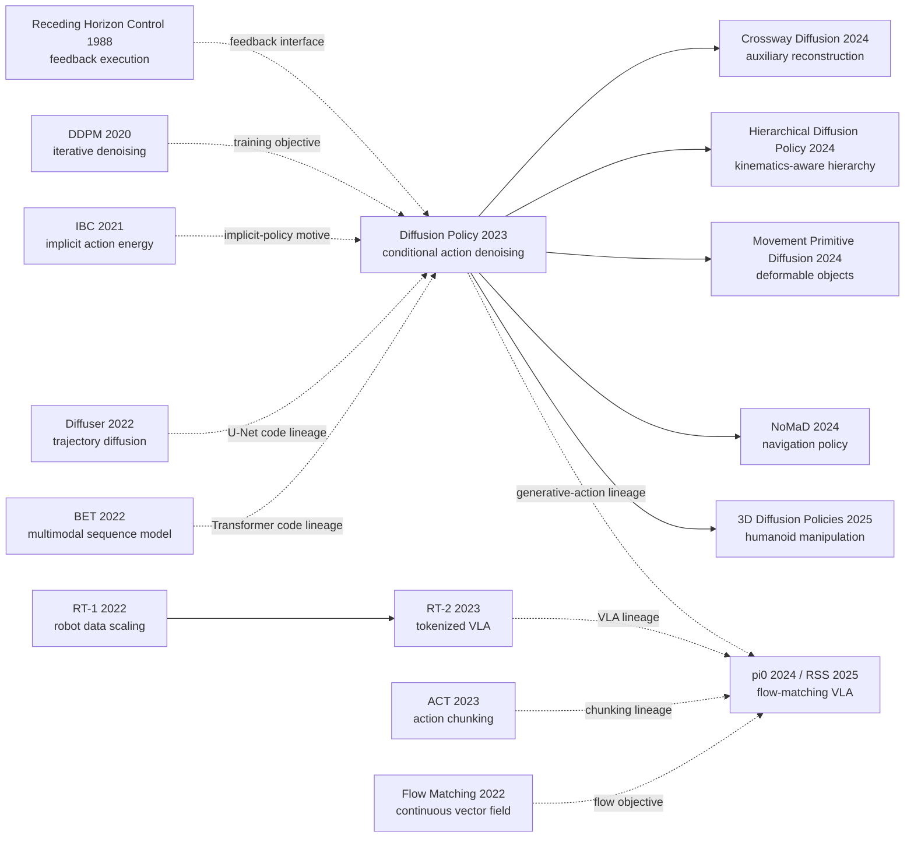

# Diffusion Policy: Visuomotor Policy Learning via Action Diffusion

> **In March 2023, [Diffusion Policy (arXiv:2303.04137)](https://arxiv.org/abs/2303.04137) moved the image-diffusion idea of repeatedly refining noise into robot action space.** Rather than guessing the next command once, it denoises a joint action segment, executes only a prefix, and looks at the world again. Across 15 tasks the paper reports a 46.9% average improvement; on real Push-T it reaches 95% success while the best IBC and LSTM-GMM variants reach 0% and 20%. The revealing sequel is π0, released in 2024 and published at RSS 2025: it too generates continuous action chunks from noise, but with PaliGemma, an action expert, and flow matching. What passed between the papers was the question of generative action distributions, not one codebase or one loss.

## TL;DR

Published at RSS 2023 by Cheng Chi, Zhenjia Xu, Siyuan Feng, Eric Cousineau, Yilun Du, Benjamin Burchfiel, Russ Tedrake, and Shuran Song, Diffusion Policy transfers [DDPM's iterative generation mechanism](/en/era4_foundation_models/2020_ddpm/) from pixels to action sequences. The policy models $p(A_t\mid O_t)$ directly and learns a conditional action score with $\mathcal L=\mathbb E\|\epsilon-\epsilon_\theta(O_t,A_t^k,k)\|_2^2$. Starting from Gaussian noise, it denoises a joint future action chunk, executes only a prefix, and observes again. Across 15 tasks from four benchmark families, the paper reports a 46.9% average improvement. On real Push-T it reaches 95% success, while the strongest LSTM-GMM and IBC variants reach 20% and 0%, exposing phase lock-up and unstable energy-based sampling respectively.

Its influence is not a simple code branch. [π0 (2024, RSS 2025)](https://arxiv.org/abs/2410.24164) continues the idea of producing continuous action chunks from noise, but replaces the task-level ResNet/U-Net composition with PaliGemma plus an action expert and replaces discrete noise prediction with a flow-matching velocity field. [RT-2](/en/era5_genai_explosion/2023_rt2/) represents the parallel VLA route of tokenized discrete action. The counterintuitive lesson is that the “diffusion” label alone does not decide the result: position control helps Diffusion Policy while hurting several baselines, the CNN is more robust on visual tasks, and the Transformer is stronger on high-frequency BlockPush. The lasting contribution is an interface that binds multimodal action distributions, temporal coherence, and receding feedback together.

---

## Historical Context

### What was robot imitation learning stuck on in 2022?

By 2022, robot behavior cloning appeared to have a mature recipe: encode camera images and proprioceptive state, then train a network to regress the next action. The recipe broke in three places once it was deployed on contact-rich manipulation. First, a single observation can admit several correct actions. A robot pushing a T-shaped block may go around its left or its right side; mean-squared regression averages those routes into a command that belongs to neither. Second, actions are not independent labels. If a policy resamples left and right modes at every step, every individual command may be plausible while the resulting trajectory jitters between incompatible plans. Third, robot actions are continuous and precision-sensitive. Coarse quantization introduces control error, while independently discretizing every coordinate produces a combinatorial action space as dimensionality grows.

The leading approaches each repaired only part of this failure. RoboMimic's LSTM-GMM retained temporal state and represented several action modes with a Gaussian mixture, but it required a preset component count and could still lock onto idle behavior or the wrong phase of a long task. Implicit Behavioral Cloning (IBC) assigned low energy to any number of plausible actions, but estimating its intractable normalizer with negative samples made training and checkpoint selection brittle. The Behavior Transformer (BET) clustered actions into discrete centers and predicted a continuous offset, improving multimodal coverage while still allowing adjacent steps to choose different modes. The bottleneck was therefore not simply an undersized visual encoder. It was the representation of an entire distribution over continuous, correlated, multimodal action sequences.

### The four lines of work that directly set up Diffusion Policy

- **2020, Denoising Diffusion Probabilistic Models (DDPM)**: Ho, Jain, and Abbeel showed in [arXiv:2006.11239](https://arxiv.org/abs/2006.11239) that a network could learn denoising directions across noise levels and iteratively turn Gaussian noise into complex samples. Diffusion Policy's decisive transfer was not to generate robot video with an image model, but to replace DDPM's image-valued output with a future action sequence.
- **2021, Implicit Behavioral Cloning (IBC)**: Florence, Lynch, Zeng, and colleagues used an energy-based model in [arXiv:2109.00137](https://arxiv.org/abs/2109.00137) to represent multimodal action distributions and selected actions by sampling and optimization. IBC established the value of implicit policies for precise manipulation while exposing instability from negative sampling, normalization, and checkpoint selection. Diffusion Policy retained the intuition of moving through an action-energy landscape but learned its score gradient directly, avoiding estimation of $Z(o,\theta)$.
- **2022, Planning with Diffusion (Diffuser)**: Janner, Du, Tenenbaum, and Levine modeled a joint state-action trajectory distribution in their [ICML 2022 paper](https://arxiv.org/abs/2205.09991) and performed planning through conditional diffusion. Diffuser demonstrated that diffusion could handle high-dimensional trajectories. Diffusion Policy narrowed the target to $p(A_t\mid O_t)$ rather than repeatedly generating future observations, allowing the vision encoder to run once and making the design compatible with real-time feedback. The official repository explicitly credits its `ConditionalUnet1D` implementation to Diffuser; this is documented implementation reuse, not a vague similarity inferred after the fact.
- **2022, Behavior Transformer (BET)**: Shafiullah, Cui, Altanzaya, and Pinto combined action clustering with a Transformer in [arXiv:2206.11251](https://arxiv.org/abs/2206.11251) to model long-horizon multimodal behavior. BET supplied both a strong baseline and a starting point for sequence architecture: Diffusion Policy's repository states that `TransformerForDiffusion` was adapted from minGPT/BET. The inherited object was the sequence backbone, not the diffusion objective.

These four lines supplied the generation mechanism, implicit-policy perspective, trajectory-scale output, and sequence model. Diffusion Policy's novelty lies less in inventing any one ingredient than in constraining their combination into a closed-loop policy that returns physical robot commands on time.

### What was the author team working on?

The paper was written by Cheng Chi, Zhenjia Xu, Siyuan Feng, Eric Cousineau, Yilun Du, Benjamin Burchfiel, Russ Tedrake, and Shuran Song across Columbia University, Toyota Research Institute, and MIT. The collaboration brought together three capabilities needed for the result: Song's group worked on visually grounded robot manipulation; Tedrake's group brought control, planning, and real-robot systems expertise; and Du's research connected energy-based, score-based, and compositional generative models. This was not merely a loss-function swap tested in simulation. The team deployed the policy on UR5 and Franka platforms for precision pushing, mug reorientation, scooping and spreading viscous sauce; version 5 later added bimanual egg-beater use, mat unrolling, and shirt folding.

Two publication stages must be kept distinct. [arXiv:2303.04137](https://arxiv.org/abs/2303.04137) appeared in March 2023, and the conference paper was presented at RSS 2023. The 2024 extended version added a control-theoretic analysis, vision-encoder ablations, and three bimanual experiments before publication as an IJRR article. This note treats RSS 2023 as the historical origin while taking quantitative values from the locally preserved version-5 TeX tables, which are more reliable than text reconstructed from a PDF. The later π0 system was not a component the team had already built in 2023; it was a 2024 extension of continuous action generation into a large-scale VLM setting.

### The compute, data, and systems boundary of the period

Diffusion Policy arrived when robot-learning datasets were still commonly measured in hundreds of demonstrations per task. Its simulated evaluation covered 15 tasks drawn from four benchmark families: RoboMimic mixed proficient and lower-quality demonstrations; Push-T tested contact dynamics and precision; BlockPush and Kitchen tested long-horizon multimodality in stage ordering. Real Push-T used 136 demonstrations, while the original sauce tasks used 90 demonstrations each. Those quantities are categorically different from the more than 10,000 hours of cross-robot pre-training later reported for π0, so Diffusion Policy should not be retroactively described as a foundation model.

Inference cost also shaped the method. Diffusion sampling requires repeated network evaluations, while a robot must continue receiving commands. The paper's method text reports DDIM reducing 100 training diffusion steps to 10 inference steps at roughly 0.1 seconds on an NVIDIA RTX 3080; the version-5 real-task hyperparameter table lists 16 evaluation steps. These entries correspond to different recorded configurations and should not be collapsed into a single universal default. Real Push-T predicted commands at 10 Hz, interpolated them to 125 Hz for execution, predicted 16 steps at a time, and executed 6 before replanning, giving an effective policy replanning rate of about 1.67 Hz. Under this budget, “encode vision once, generate an action chunk, execute a prefix, observe again” was not stylistic decoration. It was what made iterative generation compatible with a feedback loop.

## Background and Motivation

### The triple trap of mean actions, quantization, and fixed mixtures

The simplest behavior-cloning objective asks $f_\theta(o_t)$ to match an expert action $a_t$. Under mean-squared error, the model estimates a conditional mean; when demonstrations contain two valid modes near one observation, the mean may belong to neither. A Gaussian mixture expands one mode into a chosen number of modes, but an engineer must set that number in advance and training can collapse components. BET's discrete center plus continuous offset avoids direct averaging but first compresses continuous control geometry into a finite codebook. These compromises can be tuned for two-dimensional Push-T. For bimanual control, 6DoF poses, and joint prediction of a temporal window, component count or codebook size quickly becomes another bottleneck.

Diffusion Policy reverses the question. Instead of predicting the correct clean action in one shot, it learns where any noisy action should move next. Starting from Gaussian noise, repeated conditional denoising can settle into a valid basin of the action distribution. Different initial samples can select different basins, while one sampling process produces the complete action segment, so multimodality no longer has to come at the expense of temporal commitment.

### Expressiveness could not come at the price of unstable training

IBC had already shown that an energy model could describe complex action distributions, but it approximated the partition function with negative samples. If those samples missed the genuinely difficult action regions, the energy loss could decrease smoothly while sampled behavior became worse. A physical robot cannot cheaply roll out every checkpoint dozens of times and retain whichever one happened to work. Diffusion Policy exploits a small but consequential differential fact: with respect to action, $\nabla_a\log Z(o,\theta)=0$. It therefore learns the score direction corresponding to $\nabla_a\log p(a\mid o)$ rather than a normalized probability value, constructing dense supervised targets from known noise added to demonstrations.

This choice brought the expressive power of an implicit policy and the training behavior of ordinary regression into one objective. It also explains why the paper reports not only the best checkpoint but the mean of the final ten checkpoints. The authors wanted to show that performance was not an isolated peak selected after exhaustive rollout. Stability was not a side benefit; it was a primary requirement for reproducible robot experiments and affordable model selection.

### Why action chunks had to be paired with receding-horizon control

Predicting only the next action reacts quickly but discards the joint structure across commands. Committing to a complete trajectory preserves structure but continues open-loop after the world changes. Diffusion Policy separates that trade-off into three horizons: observation horizon $T_o$, prediction horizon $T_p$, and executed action horizon $T_a$. A denoising pass generates $T_p$ future actions, the controller executes only the first $T_a$, then acquires a new observation and replans. A typical visual CNN configuration uses $T_o=2$, $T_p=16$, and $T_a=8$; real Push-T shortens $T_a$ to 6 for faster feedback.

The chunk lets a left-going or right-going strategy remain coherent within one sample and lets the model interpret pauses in the context of surrounding motion. Receding-horizon execution bounds open-loop error. The important point is not that diffusion supersedes control theory. The generative model and receding-horizon controller solve different halves of the system: the former represents a complex conditional distribution, and the latter reconnects finite-horizon predictions to feedback.

### The paper's actual testable question and its boundary

The paper asks a claim that experiments can falsify: **if the conditional action sequence itself becomes the diffusion variable and vision remains conditioning only, can a policy outperform explicit regression, action discretization, and energy-based policies without sacrificing feedback responsiveness or training stability?** The authors did not answer with one curated video. They evaluated state and image observations, 2DoF through 6DoF actions, single- and bimanual robots, rigid and fluid materials, and single- and multi-stage tasks, with corresponding comparisons against LSTM-GMM, IBC, and BET.

The boundary is equally important. This is offline behavior cloning from demonstrations. It does not explore, learn from reward, or improve from failed executions; it remains limited by demonstration coverage; and iterative denoising costs more than one network pass. The durable conclusion is narrower than “diffusion solves robotics”: **when policy representation itself is the bottleneck for multimodality, dimensionality, and temporal consistency, conditional action denoising provides a powerful and stable policy class.** Later action-diffusion, action-chunking, and VLA flow models expand that idea, but their historical descent does not imply direct reuse of Diffusion Policy's code or an identical training objective.

---

## Method Deep Dive

### Overall framework

Diffusion Policy does not define a policy as one forward pass that emits one action. It defines a policy as an **observation-conditioned iterative generative process in action-sequence space**. At time $t$, the policy reads the latest $T_o$ observations $O_t$, starts from a Gaussian action chunk $A_t^K$, and calls a denoising network $K$ times to obtain $A_t^0$. It does not execute that complete prediction. It sends only the first $T_a$ actions, acquires a new observation, and generates again. The boundary between visual encoding, action generation, and receding-horizon execution is:

```
camera images + proprioception over To steps
                    |
                    v
        visual/state encoder runs once
                    |
                    v
       observation condition O_t / h_t
                    |
Gaussian A_t^K --> denoiser x K --> clean action chunk A_t^0
                                      |
                                      v
                         execute first Ta actions
                                      |
                                      v
                         observe again and replan
```

The three horizons are not interchangeable. $T_o$ controls how much history the policy sees, $T_p$ controls how many actions are generated jointly, and $T_a$ controls the duration of open-loop commitment. Most visual CNN configurations in the paper use $T_o=2,T_p=16,T_a=8$; real Push-T still predicts 16 steps but executes only 6. “Denoiser parameters” below refer to the action network, while “vision parameters” refer to the image encoder:

| Configuration | $T_o$ | $T_p$ | $T_a$ | Denoiser | Vision encoder | Inference steps |
|---|---:|---:|---:|---|---|---:|
| Sim visual CNN (typical) | 2 | 16 | 8 | 256M | 22M/view group | 100 |
| Sim Push-T Transformer | 2 | 16 | 8 | 9M, 8 layers, width 256 | 22M | 100 |
| Sim Kitchen Transformer | 4 | 16 | 8 | 80M, 8 layers, width 768 | none | 100 |
| Real Push-T CNN | 2 | 16 | 6 | 67M | 22M | 16 |
| Real Push-T Transformer | 2 | 16 | 6 | 80M, 8 layers, width 768 | 22M | 16 |

One counterintuitive point prevents a common misreading: **the quantity optimized at inference is the current action sample, not the network parameters.** Model weights are fixed after training. Each denoising step uses the predicted vector field to update $A_t^k$. The policy therefore resembles iterative optimization over an action-energy landscape, while its training remains noise regression with direct supervised targets.

### Key designs

#### Design 1: Denoise in conditional action space instead of regressing once

**Function**: Replace “guess the complete action segment in one shot” with a sequence of easily supervised denoising problems, allowing a continuous, high-dimensional, multimodal conditional distribution.

During training, the method samples a demonstration chunk $A_t^0$, a diffusion level $k$, and Gaussian noise $\epsilon$, then constructs a noisy action:

$$
A_t^k=\sqrt{\bar\alpha_k}A_t^0+\sqrt{1-\bar\alpha_k}\,\epsilon,\qquad \epsilon\sim\mathcal N(0,I).
$$

The denoiser receives the observation, noisy action, and noise level and minimizes noise-prediction error. The paper's main text writes the same training process compactly as $A_t^0+\epsilon^k$:

$$
\mathcal L(\theta)=\mathbb E_{A_t^0,O_t,k,\epsilon}\left[\left\|\epsilon-\epsilon_\theta(O_t,A_t^k,k)\right\|_2^2\right].
$$

Inference begins from $A_t^K\sim\mathcal N(0,I)$ and repeatedly updates it according to the noise schedule. The paper summarizes one step in a Langevin-noise form:

$$
A_t^{k-1}=\alpha_k\left(A_t^k-\gamma_k\epsilon_\theta(O_t,A_t^k,k)+\eta_k\right),\qquad \eta_k\sim\mathcal N(0,\sigma_k^2I).
$$

The essential process reduces to the following PyTorch-style pseudocode. Training and sampling are deliberately separated because DDPM training does not require inference to use the same discrete solver:

```python
def conditional_action_sample(obs, denoiser, scheduler, shape):
    action = torch.randn(shape, device=obs.device)
    for step in scheduler.timesteps:
        noise = denoiser(obs, action, step)
        action = scheduler.step(noise, step, action).prev_sample
    return action
```

| Policy representation | Output object | Multimodality mechanism | High-dimensional scaling | Main cost |
|---|---|---|---|---|
| L2 regression | One action/chunk | Conditional mean | Easy | Mode averaging |
| LSTM-GMM | Mixture parameters | Fixed Gaussian count | Component count is hard | Collapse and tuning |
| IBC | Action energy | Multiple low-energy basins | Sampling becomes hard | Negatives and instability |
| Diffusion Policy | Score/noise over a chunk | Random start plus iterative denoising | Native joint generation | Repeated forward passes |

**Design rationale**: Image diffusion had shown that iterative generation need not compress a complex distribution into a small parametric family. Robot action sequences are much lower-dimensional than images, but impose tighter precision and timing constraints. The authors retained diffusion's representational power and bounded its cost with short chunks and accelerated samplers. Because one sampling run updates all of $A_t^k$ jointly, a sample that enters a “go left” basin can converge to a coherent left-going segment instead of rerolling its mode at every control step.

This mechanism must also be distinguished from π0. Diffusion Policy predicts noise at discrete levels $k$ and reverses a DDPM/iDDPM process, optionally with DDIM. π0 works in continuous time $\tau$, trains a velocity field $v_\theta(A^\tau,o)$, and performs flow matching with Euler integration. Both map noise to continuous action chunks, **but their losses, time parameterizations, and model compositions are different**.

#### Design 2: Couple action chunks to receding-horizon control

**Function**: Joint prediction enforces temporal commitment; executing only a prefix preserves the ability to respond to new evidence.

The policy writes its input and output as windows and makes the executed subset explicit:

$$
O_t=(o_{t-T_o+1},\ldots,o_t),\quad A_t^0=(a_t,\ldots,a_{t+T_p-1}),\quad \text{execute }A_t^0[0:T_a].
$$

The official implementation must also account for sequence padding and index alignment. This pseudocode shows the control interface rather than the complete scheduler:

```python
def predict_action(obs, policy, n_obs_steps, n_action_steps):
    pred_action = policy.sample_action_chunk(obs)
    start = n_obs_steps - 1
    end = start + n_action_steps
    return pred_action[:, start:end]
```

| $T_a$ choice | Temporal consistency | Disturbance response | Inference rate | Typical risk |
|---|---|---|---|---|
| 1 | Low | Fastest | Highest | Mode switching and jitter |
| 4-8 | High | Moderate | Moderate | Paper's usual trade-off region |
| Near $T_p$ | Highest | Slow | Lowest | Blind execution after change |
| Full trajectory | Model-dependent | Slowest | Once | Degenerates to open-loop planning |

**Design rationale**: Multimodality is not confined to one action. In BlockPush, “which block first” unfolds over many steps; in Kitchen, the ordering of subtasks is a long-horizon choice. Independent one-step generation can oscillate between valid plans, whereas a chunk raises mode selection to a trajectory segment. A physical robot can also slip, become occluded, or be perturbed by a person, so its first 16-step proposal cannot become an irrevocable commitment. The action-horizon ablation found 8 steps to be a strong choice for most tasks, while the latency study found that position-controlled Diffusion Policy stayed near peak performance with delays of up to 4 steps.

The paper notes that a later window may be warm-started from the previous prediction to improve smoothness. That is an option enabled by the formulation, not evidence that every released configuration turns it on. The stable contract is “predict farther than execution, then observe again.”

#### Design 3: Treat vision as conditioning, not a diffusion output

**Function**: Encode images once per decision and update only actions inside the denoising loop, avoiding generation of future images or states.

Diffuser-style planning can learn a joint state-action trajectory. Diffusion Policy intentionally models only the conditional action distribution:

$$
p_\theta(A_t\mid O_t)\quad\text{instead of}\quad p_\theta(A_t,O_t),\qquad h_t=\operatorname{Encoder}(O_t).
$$

This choice changes the computation graph directly. Image features $h_t$ are computed outside the loop and injected into every denoising layer through FiLM or cross-attention:

```python
def sample_with_cached_vision(images, proprio, denoiser, scheduler):
    condition = encode_observation_once(images, proprio)
    action = torch.randn(make_action_shape(proprio))
    for step in scheduler.timesteps:
        noise = denoiser(action, step, condition)
        action = scheduler.step(noise, step, action).prev_sample
    return action
```

| Vision choice | Re-encode inside loop? | Spatial representation | v5 Square-PH result | Conclusion |
|---|---|---|---:|---|
| ResNet-18 from scratch, end-to-end | No | spatial softmax | 0.94 | Robust original default |
| ResNet-18 frozen (ImageNet-21k) | No | Fixed pre-trained feature | 0.58 | Generic/control mismatch |
| ViT-B/16 CLIP from scratch | No | Patch tokens | 0.22 | Too data-hungry here |
| Fine-tuned ViT-B/16 CLIP | No | Patch tokens | 0.98 | Best by epoch 50 |

**Design rationale**: Visual control must preserve where an object is, while standard classification-oriented global average pooling discards location. The paper uses an initially untrained ResNet-18, replaces global pooling with spatial softmax, assigns separate encoders to camera views, encodes each time step independently, and concatenates the results. BatchNorm statistics can also become inconsistent with exponentially averaged diffusion weights, so the authors replace BatchNorm with GroupNorm. The version-5 ablation refines the conclusion: frozen pre-trained encoders are unreliable, but fine-tuning a CLIP ViT at one-tenth the policy learning rate reaches 0.98 on Square-PH. The lesson is not that pre-training is useless; it is that **control representations cannot remain permanently frozen to a classification objective**.

#### Design 4: Use a FiLM U-Net for robustness and a time-series Transformer for sharp changes

**Function**: Serve two action regimes with the same conditional diffusion objective. The CNN is the stable default, while the Transformer reduces temporal convolution's tendency to oversmooth high-frequency commands.

The CNN modifies Diffuser's one-dimensional temporal U-Net and injects the observation and diffusion step through FiLM at convolutional layers. Its basic modulation is:

$$
\operatorname{FiLM}(x;c)=s(c)\odot x+b(c),\qquad c=[h_t;\operatorname{embed}(k)].
$$

The Transformer treats noisy actions as tokens, prepends a diffusion-step embedding, and reads observations through cross-attention. A causal mask restricts each action token to itself and preceding actions. Both backbones implement one interface:

```python
def predict_noise(backbone, noisy_action, step, condition):
    if backbone.kind == "temporal_unet":
        return backbone(noisy_action, step, global_cond=condition)
    if backbone.kind == "transformer":
        return backbone(noisy_action, step, encoder_hidden_states=condition)
    raise ValueError("unsupported denoiser")
```

| Backbone | Conditioning | Strength | Weakness | Paper's recommendation |
|---|---|---|---|---|
| 1D temporal U-Net | FiLM at each layer | Easy training, stable vision | Low-frequency bias | Start here on a new task |
| Time-series Transformer | cross-attention | Complex stages, sharp changes | Sensitive dropout/decay | Tune after CNN falls short |
| Kitchen Transformer | 8 layers, width 768 | $p_4=0.96$ | 80M denoiser params | Long-horizon multimodality |
| BlockPush Transformer | 8 layers, width 256 | $p_2=0.94$ | CNN reaches only 0.11 | Abrupt mode changes |

**Design rationale**: One-dimensional convolution's smoothing bias helps many position-control tasks but can erase useful high-frequency components in velocity control or scripted-oracle trajectories. A Transformer lacks the same local smoothing prior and is much stronger on state-based BlockPush and Kitchen. It is also harder to tune jointly with an end-to-end vision encoder. The paper does not declare the Transformer universally superior. It recommends an engineering order: establish a robust CNN baseline, then accept the Transformer's tuning cost only when task complexity or action-change rate reveals an oversmoothing problem.

This also makes the implementation lineage precise. The official repository credits the U-Net to Diffuser and the Transformer to minGPT/BET. Those are traceable code adaptations. π0 later uses a PaliGemma VLM plus a separate action expert; it does not directly subclass either released Diffusion Policy backbone.

### Loss and training recipe

| Item | Paper/supplement setting | Why it matters |
|---|---|---|
| Objective | Conditional noise MSE | Exact target for every noised demonstration |
| Noise schedule | iDDPM squared-cosine | Best schedule in the control experiments |
| Training diffusion steps | 100 | Same in CNN and Transformer tables |
| Simulation inference | 100-step iDDPM | Prioritizes evaluation quality over latency |
| Real-world inference | v5 tables: 16-step DDIM | Reduces latency; method text also reports 10 steps at about 0.1 s |
| Batch size | State 256; image 64 | Unified supplement setting |
| Learning rate | $10^{-4}$ | Default policy rate in the listed tasks |
| Warmup | CNN 500 steps; Transformer 1000 | Followed by cosine LR scheduling |
| Weight decay | CNN $10^{-6}$; Transformer usually $10^{-3}$ | Task-sensitive; Push-T table lists $10^{-1}$ |
| Vision normalization | GroupNorm + EMA weights | Avoids BatchNorm-stat/EMA-weight mismatch |
| Training duration | State 4500 epochs; image 3000 | Checkpoint and evaluate every 50 epochs |

The mathematical reason for improved training behavior is visible in IBC's partition function. If $p_\theta(a\mid o)=e^{-E_\theta(o,a)}/Z(o,\theta)$, differentiating with respect to action removes the normalizer:

$$
\nabla_a\log p_\theta(a\mid o)=-\nabla_aE_\theta(o,a)-\underbrace{\nabla_a\log Z(o,\theta)}_{0}\approx-\epsilon_\theta(a,o).
$$

Diffusion Policy therefore does not estimate $Z$ from a finite negative set. This identity explains why score learning avoids normalization; it does not guarantee that every architecture, dataset, and sampler is automatically stable. Transformer weight decay varies by two orders of magnitude, from $10^{-3}$ on many tasks to $10^{-1}$ in the Push-T table, showing that the backbone still requires task-level tuning.

Finally, DDIM acceleration and action-chunk execution attack different components of latency. DDIM reduces how many denoising evaluations are needed for each generation; chunking reduces how often the policy must generate per second. Their combination brings iterative generation into a real robot's timing budget. The cost is explicit: a large $T_a$ sacrifices feedback, while too few denoising steps may reduce sample quality. The durable contribution is not one universal setting, but a system that exposes both knobs and gives each a physical interpretation.

For reproducibility, this means every result should report all three observation, prediction, and execution horizons as well as separate training and inference diffusion-step counts. Saying only that an experiment “uses Diffusion Policy” leaves it impossible to tell whether a gain came from policy representation, closed-loop frequency, or sampling budget, and it prevents a fair comparison with one-pass behavior-cloning baselines.

---

## Failed Baselines

### The opponents that lost to Diffusion Policy

**LSTM-GMM / BC-RNN** was the closest thing to a standard strong behavior-cloning baseline: recurrent state retained history and a Gaussian-mixture head emitted multimodal actions. It was not weak on simple RoboMimic tasks; visual Lift reached 1.00/0.96 for best checkpoint/final-ten mean. Its failures appeared at precision-sensitive phase changes and long-horizon modes. Real Push-T required aligning the T block and then leaving the evaluation area. The best LSTM-GMM variant achieved only 20% success and became stuck making adjustments beside the block in 8 of 20 trials. Sauce pouring required pausing while a ladle filled and lifting it at the end; LSTM-GMM failed to lift after scooping in 15 of 20 trials. The failure was not one-step fitting capacity. It was the inability to reliably tell when similar small actions belonged to different task phases.

**Implicit Behavioral Cloning (IBC)** was conceptually closest to Diffusion Policy. Neither reduces the conditional distribution to a mean, and both use an iterative procedure in action space to obtain samples. IBC reached 0.75/0.64 on simulated image-based Push-T, proving that it was a meaningful baseline, yet it fell to zero on several RoboMimic visual tasks in the same version-5 source table. Paper Figure 6 further shows the energy loss falling smoothly while training-action error and rollout success spike. On real Push-T, IBC achieved 0% success with either position or velocity control and left the block prematurely for the end zone in 6 of 20 trials. Instability from approximating the partition function with negatives becomes more costly on hardware because every checkpoint cannot be rolled out exhaustively.

**Behavior Transformer (BET)** was the strongest discrete-action multimodal alternative. Its BlockPush $p_2$ score was 0.71, far above LSTM-GMM's 0.01 and IBC's 0.00, so action clustering plus a sequence Transformer clearly captured some stage-order variation. The paper's qualitative Push-T comparison exposed its boundary: adjacent actions could select different clusters, causing the robot to lose commitment between “go left” and “go right.” Combining the same broad Transformer lineage with joint action denoising raised BlockPush $p_2$ to 0.94 for DiffusionPolicy-T.

These comparisons cannot be reduced to “the diffusion model was larger.” DiffusionPolicy-T itself underperformed the CNN version on several visual tasks. The CNN version reached only 0.11 on BlockPush, far below BET. The evidence supports an appropriate distribution representation paired with an appropriate temporal backbone, not a universal diffusion label independent of architecture.

### Failures admitted by the paper and its extended version

The most revealing failure is that **a newer backbone was not automatically better**. Temporal convolutions favor low-frequency signals and oversmoothed scripted BlockPush actions and velocity commands, leaving DiffusionPolicy-C at $p_2$ = 0.11; the Transformer reached 0.94. The Transformer was in turn harder to tune with end-to-end vision. On visual Push-T, the CNN scored 0.91/0.84 while the Transformer scored 0.78/0.66; on visual ToolHang they reached 0.95/0.73 and 0.76/0.47. The authors therefore did not make the Transformer the default. Their recommendation was to train the CNN first and pay the tuning cost only after diagnosing a high-frequency or task-complexity bottleneck.

The second failure was that **pre-trained visual representations could not simply be frozen**. Version 5 compared three backbones and three training modes on RoboMimic Square-PH. End-to-end ResNet-18 from scratch reached 0.94, while a frozen ImageNet-21k ResNet-18 fell to 0.58. CLIP ViT-B/16 reached only 0.22 from scratch and 0.70 when frozen, then rose to 0.98 when fine-tuned at a lower learning rate. Real Push-T showed the same pattern: end-to-end visual CNN reached 95% success, frozen R3M reached 80%, and frozen ImageNet reached 15%. The failure identifies task mismatch rather than condemning pre-training itself; continued adaptation to the control objective was the successful setting.

The third failure is that **no horizon is monotonically optimal**. With $T_a=1$, the policy nearly resamples every step and loses temporal consistency; with a large $T_a$, it responds slowly to disturbances. Figure 5 reports change relative to each task's maximum rather than enough source-table values to reproduce every point, but its conclusion is clear: the compromise lies near 8 steps for most tasks. Sampling steps present another trade-off. DDIM reduced physical inference latency, yet the limitations section explicitly acknowledges that computation remains higher than for LSTM-GMM.

Finally, the bimanual additions in the extended version were not a clean sweep. The egg-beater task achieved only 55% success from 210 demonstrations. Primary failures were out-of-distribution initial placement, missing the crank handle, and losing the grasp. Policy representation can address multimodality and temporal consistency; it cannot manufacture demonstration coverage, robot reachability, or contact sensing.

### Counterexamples and evaluation gaps inside the 2023 result

The strongest counterexample sits in the authors' own table. If action diffusion alone were sufficient, the CNN version would not score 0.11 on BlockPush $p_2$ while BET scored 0.71. If a Transformer alone were sufficient, BET would not lose to DiffusionPolicy-T at 0.94. This crossover restricts the causal conclusion to the combination: joint diffusion over the chunk represents modes, while the Transformer preserves sharp temporal changes. Position control provides another interaction. It improves Diffusion Policy while degrading LSTM-GMM and BET, so action coordinates and policy representation cannot be treated as separable choices.

The evaluation has a footnote that should not disappear in a retelling. The intended protocol evaluated each seed on 50 RoboMimic initial conditions, but a code bug meant that only 22 were actually used. Every method shared the same erroneous setting, so the authors argue that the comparison remains valid; nevertheless, the effective sample is smaller than the headline protocol and uncertainty is correspondingly larger. “Best checkpoint” reporting also favors methods that can be evaluated frequently in simulation. The final-ten mean was added to approximate deployment without post hoc selection, but each real-robot setting still had only 20 trials, too few to characterize rare failures.

Another boundary is that each method uses its empirically best action space: position control for Diffusion Policy and usually velocity control for baselines. That is fair when comparing the best complete system built around each method, but it is not a controlled ablation in which policy representation alone changes. Position control, chunking, and the diffusion objective jointly contribute to the reported gain; the full 46.9% average improvement cannot be attributed solely to noise-prediction loss. The paper's contribution is precisely a system design, and its numbers require the same causal restraint.

### The real anti-baseline lesson

The engineering lesson is not “add diffusion to a policy and win.” It is that **each baseline failure must map to a specific property of the new representation**. L2 regression averages modes, so the model must represent a full distribution. IBC is expressive but unstable, so supervision should avoid partition-function estimation. BET describes discrete modes but may switch modes step by step, so the policy should generate a chunk jointly. A complete generated trajectory would be too open-loop, so only a prefix is executed. Every added mechanism answers an observable failure.

The paper also exposes the limits of its own design. It switches from CNN to Transformer when smoothing destroys high-frequency behavior, returns to CNN when visual Transformer training becomes brittle, fine-tunes end-to-end when frozen vision mismatches control, and shortens execution when chunks react too slowly. That is more durable than declaring one architecture the winner. **The lasting object is not one network but an interface that forces a generative model to obey the robot's feedback clock.** Later systems can replace DDPM with flow matching and ResNet with a VLM, but they still must answer the four questions of distributional expressiveness, action consistency, inference latency, and replanning frequency.

This is also why π0 is a historical descendant rather than a direct code branch. It too produces continuous action chunks, but combines PaliGemma representations with an approximately 300M-parameter action expert in a 3.3B model, trained on more than 10,000 hours of robot data to predict a continuous velocity field. What it inherits is the problem framing of generative action chunks. Its loss changes from discrete conditional denoising to flow matching, its model changes from a task-scale visual policy to a VLA, and its public implementation comes from Physical Intelligence's openpi rather than the Diffusion Policy repository.

There is a further practical lesson about what qualifies as a strong baseline. Reproducing a network name is not enough; data preprocessing, action normalization, control frequency, and checkpoint selection must also match. The official Diffusion Policy repository publishes the configuration, stepwise logs, and best and final checkpoints for three seeds in each reported experiment. That record lets a reader inspect the training trajectory behind a table entry. It also exposes how much “best checkpoint” selection can favor IBC. When there is no budget to roll every checkpoint out on hardware, minimum training loss is not a reliable selector for the best policy. The final-ten mean is not a confidence interval, but it is closer to the result an engineer obtains when post hoc selection is unavailable.

Failure videos should be read as diagnostics rather than spectacle. LSTM-GMM becoming stuck beside the T block, IBC leaving it prematurely, and BET oscillating between routes point respectively to phase identification in recurrent state, energy-model sampling, and stepwise discrete mode selection. Diffusion Policy missing an egg-beater crank points somewhere else: data and perceptual coverage rather than the denoising objective. Assigning a failure to the correct layer determines whether the next intervention should change policy representation, backbone, control interface, or demonstration collection. If all failures are collapsed into “the model is too small,” the paper's most useful systems evidence disappears.

This distinction also constrains extrapolation. The experiments establish that the proposed interface works across several carefully chosen forms of multimodality; they do not show that stochastic denoising recovers a task after every unseen contact event. The perturbation sequence in real Push-T demonstrates recomposition of familiar local skills under a new observation, not proof of global planning or semantic understanding. Conversely, a failed rollout is not evidence that the policy sampled the wrong distributional mode: camera occlusion, controller saturation, calibration error, and missing demonstrations can produce similar visible outcomes. The paper is strongest when its quantitative tables and mechanism-specific qualitative cases are interpreted together.

## Key Experimental Data

### Main experiment: visual behavior-cloning benchmarks

The following values come from version 5's `table_image.tex` and use “best checkpoint / mean of final ten checkpoints.” Square-MH, Transport-MH, and ToolHang-PH report success rate; Push-T reports normalized target coverage. The bold row highlights the more robust visual CNN overall, not a claim that it beats the other Diffusion Policy backbone in every cell:

| Method | Square-MH | Transport-MH | ToolHang-PH | Push-T |
|---|---:|---:|---:|---:|
| LSTM-GMM | 0.64/0.38 | 0.44/0.24 | 0.68/0.49 | 0.69/0.54 |
| IBC | 0.00/0.00 | 0.00/0.00 | 0.00/0.00 | 0.75/0.64 |
| **DiffusionPolicy-C** | **0.98/0.84** | **0.89/0.69** | **0.95/0.73** | **0.91/0.84** |
| DiffusionPolicy-T | 0.94/0.80 | 0.73/0.50 | 0.76/0.47 | 0.78/0.66 |

Aggregating 15 tasks from four benchmark families, the paper reports a 46.9% average success-rate improvement. The table also shows that “best point” and “deployable stability” are separate measurements. DiffusionPolicy-C on Transport-MH falls from a best value of 0.89 to a final-ten mean of 0.69, so the method still has checkpoint variance even though it is much more stable than IBC.

### Long-horizon multimodality and a real robot

BlockPush $p_1/p_2$ denote the frequency of placing at least one/two blocks; Kitchen $p_4$ denotes completing at least four subtasks. Transformer diffusion is strongest on high-frequency BlockPush, while CNN diffusion is slightly stronger on Kitchen:

| Method | BlockPush $p_1$ | BlockPush $p_2$ | Kitchen $p_4$ |
|---|---:|---:|---:|
| LSTM-GMM | 0.03 | 0.01 | 0.34 |
| IBC | 0.01 | 0.00 | 0.24 |
| BET | 0.96 | 0.71 | 0.44 |
| DiffusionPolicy-C | 0.36 | 0.11 | **0.99** |
| **DiffusionPolicy-T** | **0.99** | **0.94** | 0.96 |

Real Push-T used 136 demonstrations and 20 evaluation trials per setting. End-to-end CNN Diffusion Policy achieved 0.80 IoU, 95% success, and a 22.9-second duration, close to human demonstrations at 0.84, 100%, and 20.3 seconds:

| Method/vision choice | IoU | Success rate | Duration (s) |
|---|---:|---:|---:|
| Human demonstrations | 0.84 | 1.00 | 20.3 |
| IBC (best action space still has 0 success) | 0.19 | 0.00 | 41.6 |
| LSTM-GMM (position control) | 0.24 | 0.20 | 47.3 |
| Diffusion Policy Transformer E2E | 0.53 | 0.65 | 57.5 |
| Diffusion Policy + frozen R3M | 0.66 | 0.80 | 31.7 |
| **Diffusion Policy CNN E2E** | **0.80** | **0.95** | **22.9** |

The three tables answer different questions. The visual benchmark tests stability across checkpoints; BlockPush and Kitchen test whether an action mode remains coherent as it unfolds over time; real Push-T combines perception, inference latency, phase termination, and contact error in one system. They are not substitutes for one another and no single column licenses a claim about all robot tasks. The defensible result is that gains recur across several task shapes while the best backbone still changes with signal frequency and the difficulty of visual training.

Relative gain and absolute success must also be read together. The 46.9% aggregate is useful for summarizing a trend across tasks, but it does not say whether any particular behavior is deployment-ready. Real Push-T's 95% is more tangible, yet 20 trials cannot characterize tail risk precisely. The final-ten mean reduces checkpoint-picking bias, but it is not a confidence interval across all sources of randomness. Taken together, these views separate three distinct claims: a method is consistently better than its baselines, its absolute performance is high, and its rare-failure rate has been established. The paper supports the first two much more strongly than the third.

### Key findings

- **Short-horizon multimodality requires commitment after selection**: Push-T admits a left and a right route. Diffusion Policy samples both across rollouts but commits to one within a rollout. BET has modes, yet adjacent steps may switch between them.
- **Long-horizon multimodality depends on both objective and backbone**: BlockPush $p_2$ rises from BET's 0.71 to DiffusionPolicy-T's 0.94, while CNN diffusion reaches only 0.11. Denoising and a high-frequency sequence model must work together.
- **The position-control result is counterintuitive**: Most behavior cloning then favored velocity commands. Diffusion Policy exploits positional precision and absolute targets tolerate latency, while the same switch hurts LSTM-GMM and BET.
- **Execution horizon has an interior optimum**: $T_a$ above 1 suppresses mode switching and idle-action overfitting; an overly large value delays feedback. Most tasks favor about 8, while real Push-T uses 6.
- **Stability should be measured at the tail, not only at the peak**: IBC can pair low training loss with high action error. Diffusion Policy's final-ten means are more dependable overall, though not variance-free.
- **Perturbation recovery is not open-loop replay**: When the real T block is moved after the robot starts for the end zone, the policy returns to realign it and then finishes. No demonstration contains that full recovery trajectory; repeated observation recomposes learned local behavior.
- **Coverage remains the ceiling**: Bimanual egg-beater success is only 55%, showing that diffusion cannot erase out-of-distribution starts, missed grasps, or hardware constraints.

---

## Idea Lineage

### Lineage map

The arrows deliberately distinguish three relationships. The two “code lineage” edges entering Diffusion Policy are explicit acknowledgements in its official repository README. Solid edges leaving Diffusion Policy denote papers that cite it in the local OpenAlex snapshot and extend a nearby method. The dashed edge to π0 marks continuity of problem framing and ideas; it does not assert inheritance of Python classes, weights, or training code.



This is not a software dependency graph. Even a solid successor edge establishes citation and methodological extension only; it does not establish implementation copying without an author statement. The map brings together two lines that converged between 2022 and 2024. The upper line asks how to generate continuous, multimodal, temporally coherent action. The lower line asks how to place Internet semantics and cross-robot data in a general policy. π0 sits at their intersection, but its action head and training target are a new composition.

### Past lives: the problems that forced it into existence

- **1988, Receding Horizon Control**: The rolling-horizon tradition associated with Mayne and Michalska supplied the system interface: predict a segment, execute a prefix, then solve again from a new state. Diffusion Policy did not invent this control principle; it made a generative action model obey it. The graph labels a “feedback interface,” not neural-network ancestry.
- **2020, DDPM**: [Ho, Jain, and Abbeel](https://arxiv.org/abs/2006.11239) decomposed complex generation into noise prediction at multiple levels. Diffusion Policy directly adopts conditional noise MSE, a noise schedule, and reverse sampling while changing the generated variable to an action chunk. This is the central training-objective lineage.
- **2021, IBC**: [Implicit Behavioral Cloning](https://arxiv.org/abs/2109.00137) showed that an energy model can represent precise multimodal action, while exposing negative-sampling instability and checkpoint selection as systems costs. Learning a score without estimating a partition function directly answers IBC's failure mode. There is no evidence that Diffusion Policy reused the IBC codebase.
- **2022, Diffuser**: [Planning with Diffusion](https://arxiv.org/abs/2205.09991) already ran diffusion over state-action trajectories. Diffusion Policy changed joint trajectory generation into observation-conditioned action generation and paired it with closed-loop execution. Its official repository states that `ConditionalUnet1D` was adapted from Diffuser, making this both an intellectual predecessor and a verifiable U-Net code source.
- **2022, BET**: [Behavior Transformer](https://arxiv.org/abs/2206.11251) used clustered action tokens and a Transformer for long-horizon multimodality. It provided a strong baseline and exposed stepwise mode switching; the official repository says `TransformerForDiffusion` was adapted from minGPT/BET. This is the second explicit code lineage, while the diffusion loss and jointly denoised action chunk are Diffusion Policy's additions.

Two other contemporaneous lines should not be forced into direct ancestry. RT-1 showed the scaling potential of cross-task robot data and a large Transformer in 2022; it primarily shaped the later VLA data-and-model-scaling line. ACT's [arXiv:2304.13705](https://arxiv.org/abs/2304.13705) appeared about six weeks after Diffusion Policy's March 2023 preprint. Both are important action-chunking papers, but such close release dates do not establish that ACT directly inherited Diffusion Policy, or vice versa.

### Descendants and branches

- **Direct methodological extensions**: [Crossway Diffusion (2024)](https://doi.org/10.1109/ICRA57147.2024.10610175) adds an auxiliary self-supervised observation-reconstruction path to improve visual representation. [Hierarchical Diffusion Policy (2024)](https://doi.org/10.1109/CVPR52733.2024.01712) separates task and motion levels to incorporate kinematic constraints. [Movement Primitive Diffusion (2024)](https://doi.org/10.1109/LRA.2024.3382529) combines denoising with movement primitives for gentle deformable-object manipulation. [Generalizable Humanoid Manipulation with 3D Diffusion Policies (2025)](https://doi.org/10.1109/IROS60139.2025.11246340) moves 3D representations and diffusion policies into humanoid manipulation. All explicitly cite Diffusion Policy in the local snapshot, but code reuse would require separate repository evidence.
- **Training and data-loop extensions**: [Diff-Dagger (2025)](https://doi.org/10.1109/ICRA55743.2025.11127730) uses diffusion-policy uncertainty to support DAgger-style data collection, addressing offline behavior cloning's inability to repair its own dataset. [Flow Matching Imitation Learning for Multi-Support Manipulation (2024)](https://doi.org/10.1109/HUMANOIDS58906.2024.10769838) learns a continuous vector field with flow matching, demonstrating that “noise to action” need not remain tied to a discrete DDPM parameterization.
- **Cross-task seepage**: [NoMaD (2024)](https://doi.org/10.1109/ICRA57147.2024.10610665) uses a goal-masked diffusion policy for navigation and exploration. [Diffusion-EDFs (2024)](https://doi.org/10.1109/CVPR52733.2024.01705) constructs a bi-equivariant denoising model on $SE(3)$ for visual manipulation. [DiffusionDrive (2025)](https://doi.org/10.1109/CVPR52734.2025.01124) brings truncated diffusion to end-to-end driving. These works inherit conditional generation and iterative correction while changing the task interface or geometric object.
- **Cross-architecture borrowing: π0**: [π0 (arXiv:2410.24164, RSS 2025)](https://arxiv.org/abs/2410.24164) explicitly cites Diffusion Policy and attaches continuous action-chunk generation to a PaliGemma VLM. It obtains semantics from more than 10,000 hours of robot data plus Internet-scale vision-language pre-training and routes state and action through an approximately 300M-parameter action expert. It trains a continuous flow-matching velocity field and integrates it with 10 Euler steps to obtain a length-50 action chunk. Thus π0 continues the generative continuous-action-chunk question, but its answer also combines RT-2's VLA line, ACT-style action chunking, and independent Flow Matching theory. The official openpi project does not claim derivation from Diffusion Policy code.
- **Cross-disciplinary spillover**: The verified local citation snapshot does not support a strong claim that an independent non-robotics discipline has directly adopted Diffusion Policy. Driving and character animation remain adjacent sequential-decision or control tasks rather than clear disciplinary transfer. This category therefore remains “no verified major spillover” instead of inventing one to fill a template.

Across these successors, the inherited object is not a fixed U-Net. It is a four-part interface: actions form a continuous distribution rather than a point; generation covers a temporal chunk rather than independent steps; observations condition the generative process; and execution preserves a cadence for observing and replanning. Descendants can replace the visual encoder, geometry, stochastic process, or data scale and remain in the lineage as long as they continue to answer those four questions.

### Misreadings and oversimplifications

- **“Diffusion Policy applies an image diffusion model to a robot.”** It does not generate images, and future vision is not part of the diffusion variable. The random variable is an action sequence; images are encoded once and used as conditioning. That change both saves computation and narrows the model from a trajectory world model to a policy.
- **“It executes the whole generated trajectory every control cycle.”** The method deliberately uses $T_p>T_a$: prediction is longer than execution, and a new observation arrives after the prefix. Action chunks provide coherence; receding-horizon execution provides feedback. Removing either yields a materially different method.
- **“The score is a conventional controller's cost gradient, so this is optimal control.”** The paper interprets the denoising direction as the score of a conditional action distribution and adds a linear-system sanity check in its extended version. It does not derive a globally optimal controller from a task cost and known dynamics. Behavior remains tied to the demonstration distribution.
- **“π0 is Diffusion Policy scaled to 3.3B parameters.”** This erases three structural changes: π0 starts from a PaliGemma vision-language backbone, adds a distinct action expert, and replaces discrete noise prediction with a continuous flow-matching velocity field. The methods have intellectual ancestry, not direct code inheritance or an identical loss at a larger scale.
- **“All later action-diffusion papers descend from one codebase.”** The only direct code relationships explicitly documented by Diffusion Policy's own README point backward to Diffuser's U-Net and minGPT/BET's Transformer. A successor's citation establishes scholarly relation at most. A code-inheritance claim still requires its repository, license, and history.

The easiest historical mistake is to project today's shared vocabulary backward into one straight family tree. Diffusion Policy sits at the crossing of trajectory diffusion, implicit policies, action chunks, rolling control, and VLA scaling. Its clearest historical role was turning “run a generative model in action space” from a simulated-planning concept into a reproducible visual closed-loop robot policy. π0 later showed that a continuous generative head can live inside a VLM, but it is neither the only descendant nor a natural enlargement of the original implementation.

---

## Modern Perspective

### Assumptions that no longer hold

**Assumption 1: A few hundred in-task demonstrations and a separately trained policy are the natural unit of visuomotor learning.** Diffusion Policy is exceptionally effective at that unit: real Push-T uses 136 demonstrations, Mug Flip uses 250, and several policies approach human performance on their first training attempt. [π0](https://arxiv.org/abs/2410.24164), released in October 2024 and published at RSS 2025, changed the unit to “pre-train a cross-robot base policy, then post-train it for a skill.” Its paper reports more than 10,000 hours of robot data, with internal data spanning 7 robot configurations and 68 tasks plus Open X-Embodiment. This does not show that small task policies are obsolete; π0's own fine-tuning evaluation treats Diffusion Policy as a competitive from-scratch baseline. It shows that semantic generalization, cross-embodiment transfer, and broad task coverage cannot come from isolated per-skill datasets alone.

**Assumption 2: End-to-end ResNet-18 from scratch is the safest default for visual control.** The original real-robot results support that choice: frozen ImageNet and R3M encoders trail the end-to-end encoder. Diffusion Policy version 5 already weakens the generalization. On Square-PH, a CLIP-pretrained ViT-B/16 fine-tuned at one-tenth the policy learning rate reaches 0.98 by epoch 50. “Frozen” fails; “pre-trained” does not. π0 goes further by starting from Internet-trained PaliGemma vision-language weights and co-training them with robot data. By 2026, the reasonable default is “pre-trained representations must adapt to control,” not a binary choice between pre-training and control.

**Assumption 3: Discrete DDPM noise prediction is the fixed form of continuous action generation.** Diffusion Policy learns $\epsilon_\theta(O,A^k,k)$ and reverses a finite sequence of noise levels. π0 learns a continuous-time velocity field $v_\theta(A^\tau,o)$ and integrates from $\tau=0$ to $\tau=1$. π0 trains on the path $A^\tau=\tau A+(1-\tau)\epsilon$ with target vector $A-\epsilon$, then performs 10 Euler steps at inference. Follow-ups such as Flow Matching Imitation Learning take the same branch. What survived is movement from a simple noise distribution to an action chunk along a conditional vector field, not one discrete DDPM parameterization.

**Assumption 4: Action semantics and action geometry should be absorbed implicitly by one task-level visual encoder.** Diffusion Policy consumes images and proprioception, with no language command or mechanism for unifying robot action spaces. π0 sends images and text through PaliGemma while routing proprioceptive state and noisy action through an approximately 300M-parameter action expert; the two weight sets interact through Transformer attention. RT-2 takes the discrete action-token route, while π0 uses a continuous flow head. Later systems show that understanding “which object should go where” and generating “the next 50 low-level control values” are composable problems that need not use the same parameter subset.

None of these developments makes the 2023 result obsolete. They isolate its contribution more sharply. Diffusion Policy discovered a generative interface for continuous action distributions, not the final visual backbone, noise schedule, or data regime.

### What proved essential and what proved replaceable

Four design choices have survived. First, a policy should produce a conditional distribution over an action segment rather than one conditional mean; π0 still generates a length-50 action chunk. Second, multimodal selection and temporal consistency must be solved jointly: stochastic generation selects a mode, and the chunk commits to it over a short interval. Third, generation must live in a feedback loop. Diffusion Policy executes a prefix and replans; π0 also runs in segments at robot control rates, although its paper chooses open-loop execution within each segment and rejects temporal ensembling. Fourth, perception or semantics can be separated from action generation and cached. Diffusion Policy moves visual encoding outside the DDPM loop; π0 caches attention keys and values for its observation prefix and recomputes only the action suffix.

The replaceable details are equally clear. Neither the one-dimensional U-Net nor time-series Transformer is final; descendants use DiTs, 3D-equivariant models, or VLM action experts. The squared-cosine schedule and 100 training steps are a 2023 recipe, not a law of action generation. ResNet-18 with spatial softmax is a strong small-data localization baseline, not an endpoint for cross-task semantics. Position control synergizes with diffusion on the paper's tasks, but other robots, teleoperation data, and low-level controllers need not share the advantage. The key divide is: **the abstract interface persists across generations while the solver is repeatedly replaced.**

π0 supplies a useful counterfactual. If Diffusion Policy's essential contribution were its U-Net code, π0 should lose the benefit when it substitutes a PaliGemma/action-expert Transformer. If the essential ingredient were merely the word “diffusion,” RT-2's discrete tokens and ACT's CVAE action chunks should not be strong alternatives. What crosses architecture boundaries is the joint treatment of action distribution, temporal chunk, and feedback budget.

### Side effects the authors did not anticipate

1. **Push-T became a microscope for policy representation.** The two-dimensional task looks small, yet exposes contact dynamics, two-route multimodality, terminal precision, and closed-loop recovery at once. Many successors retain it because failure trajectories are interpretable, not because it approximates general robotics. The side effect is benchmark overfitting: high coverage on Push-T can be mistaken for semantic or cross-task capability.
2. **The action generator became a continuous “peripheral” for VLAs.** The π0 paper explicitly cites Diffusion Policy among recent action-generation work and replaces autoregressive action discretization with a flow-matching action expert. Diffusion Policy did not supply π0's language, data, or model scale, but helped establish an architectural place for a dedicated low-level continuous-action objective.
3. **Policy deployment began to resemble a streaming generation service.** Encode a vision-language prefix once, update an action suffix repeatedly, then send an action chunk to a local or remote robot process. The official openpi project exposes remote inference; the π0 paper times three-camera encoding at 14 ms, observation forward pass at 32 ms, and ten action forward passes together at 27 ms on an RTX 4090. This systems shape continues Diffusion Policy's “cache the condition, iterate the action” split without reusing its code directly.

There is also a hazardous side effect: generative policies introduce randomness into low-level control. Randomness covers several valid modes, but it makes safety validation harder than for a deterministic regressor. The 2023 paper establishes utility through success rates and qualitative perturbation tests. It does not fully analyze calibration of the action distribution, tail collision probability, or real-time deadline misses. As later systems become larger and remotely served, those questions grow rather than disappear.

### If the paper were rewritten today

If the same research question were revisited in 2026, the problem structure should remain while implementation and evaluation change:

- Implement both discrete noise prediction and conditional flow matching under the same backbone, data, and latency budget, instead of confounding a solver change with model scale.
- Use a pre-trained vision-language model as the condition encoder while retaining from-scratch ResNet-18 as the small-data control; separately report frozen, low-rate fine-tuned, and fully fine-tuned settings.
- Add synchronized force, tactile, and camera timing to the condition and test whether policy representation remains the primary bottleneck in contact-rich tasks.
- Report wall-clock latency, deadline misses, energy, and closed-loop frequency by default, not only diffusion-step count; compare 1, 4, 10, and 16 generation steps at matched success.
- Include ACT, RT-2/open VLAs, and a π0-style flow head, while separating from-scratch training, equal-data fine-tuning, and large-scale pre-training as different questions.
- Use uncertainty-guided data collection or DAgger to test whether the policy can actively repair out-of-distribution starts such as those in the egg-beater task.
- Increase physical trial counts and preregister checkpoint selection; publish confidence intervals and a corrected evaluation for the 22-initial-condition RoboMimic bug.

The invariant should be: **model the continuous multimodal action chunk $p(A_t\mid O_t)$ directly, then observe again after executing a prefix.** Whether the network predicts noise or a velocity field, this interface jointly answers where behavior may branch and when the robot may change its mind. That is closer to the paper's lasting contribution than the name of any sampler.

## Limitations and Future Directions

### Author-acknowledged limitations

- **The ceiling inherited from behavior cloning**: Performance degrades with inadequate or low-quality demonstrations, and pure behavior cloning cannot exploit negative examples, suboptimal data, or environmental reward. The paper proposes connecting diffusion policies to reinforcement and offline reinforcement learning.
- **High inference cost**: Repeated denoising is slower than one LSTM-GMM forward pass. Action chunks reduce planning frequency and DDIM reduces steps per sample, but that may still be inadequate for high-rate control.
- **Backbone and action-space selection remain**: The CNN is robust but can oversmooth, the Transformer is hyperparameter-sensitive, and position control's advantage on these tasks does not establish universality across low-level controllers.
- **Out-of-distribution demonstration failures**: The extended version's bimanual egg-beater task reaches only 55% success. Missed handles, dropped grasps, and unusual starts are not erased by a better policy representation.

### Additional limitations visible from 2026

- **No language or cross-embodiment mechanism**: Tasks are trained independently, so the policy cannot import Internet semantics or actions from other robots. RT-2, Open X-Embodiment, and π0 address a separate axis of the problem.
- **No safety calibration for stochastic control**: The paper does not report quantile risk, action-constraint violation probability, or a method for trading diversity against conservatism. Those are central for fast, bimanual, or collaborative robots.
- **Perception is dominated by RGB and proprioception**: Contact-rich tasks lack explicit force, tactile, and uncertainty inputs, and evidence for recovery under visual occlusion comes from a small number of cases.
- **Limited evaluation statistics**: Physical settings use 20 trials, and the RoboMimic bug leaves only 22 initial conditions. That is enough to reveal large differences, not industrial failure rates.
- **Each executed chunk remains locally open-loop**: Observation is refreshed at chunk boundaries. Unexpected contact inside $T_a$ must be absorbed by the low-level controller, a larger gap as dynamics become faster.

### Improvement directions validated by later work

- **Representation auxiliaries**: Crossway Diffusion reconstructs observations as an auxiliary task to strengthen small-data visual representation.
- **Geometry and hierarchy**: Diffusion-EDFs, Hierarchical Diffusion Policy, and 3D diffusion policies encode $SE(3)$ equivariance, kinematic hierarchy, or 3D perception rather than asking data to teach all structure.
- **Continuous-time generation**: π0 and Flow Matching Imitation Learning replace discrete noise prediction with a velocity field, showing that the interface can outlive a DDPM solver.
- **Closing the data loop**: Diff-Dagger uses uncertainty to select additional demonstrations, beginning to repair offline behavior cloning's inability to explore.
- **Semantics and scale**: π0 combines PaliGemma, cross-robot pre-training, and an action expert to add language conditioning and multiple embodiments. It expands task scope without automatically solving safety calibration or within-chunk feedback.

“Validated direction” should not be read as “solved.” The π0 appendix reports that temporal ensembling hurt performance, so the final system executes chunks open-loop. The old tension between smooth action and feedback frequency survives the change in model. A more important future question is how continuous generation, hard control constraints, and online correction can meet at a verifiable interface.

## Related Work and Insights

- **vs IBC**: IBC learns action energy directly and approximates normalization with negatives and sampling; Diffusion Policy learns score directions on noisy action, avoiding the partition function. IBC's single-action optimization resembles a classical implicit policy, while Diffusion Policy's chunks support temporal coherence at the cost of repeated inference. **Lesson: expressiveness has engineering value only when training and model selection are repeatable.**
- **vs Diffuser**: Diffuser diffuses joint state-action trajectories and plans with reward or conditioning. Diffusion Policy generates only observation-conditioned actions, encodes vision once, and replans frequently. The former is a generative planner; the latter is a feedback policy. **Lesson: removing variables that need not be generated from an inner loop can matter more than making the network itself faster.**
- **vs BET**: BET clusters actions into tokens and predicts offsets. It is fast and captures long-range modes, but may switch modes step by step and depends on a codebook. Diffusion Policy denoises directly in continuous chunk space. **Lesson: discretization simplifies learning by turning geometry and mode count into hyperparameters.**
- **vs ACT**: ACT uses a CVAE and Transformer to generate action chunks, with temporal ensembling to reduce jitter. Diffusion Policy uses stochastic denoising for a more general continuous multimodal distribution and receding execution for feedback. They appeared nearly concurrently and should not be presented as one-way inheritance. **Lesson: action chunking is the shared abstraction; the generative objective determines how it represents uncertainty.**
- **vs π0**: Diffusion Policy is task-level visual behavior cloning with noise prediction at discrete levels. π0 is a 3.3B PaliGemma-plus-action-expert flow model that learns $v_\theta(A^\tau,o)$ from large cross-robot data. π0 brings semantics and scale at far greater deployment and data cost; its official repository warns that adaptation to a new robot may fail. **Lesson: historical ideas may be inherited, but code, loss, data regime, and capability boundary must be verified separately.**

## Resources

- Paper: [Diffusion Policy arXiv:2303.04137](https://arxiv.org/abs/2303.04137)
- Official project: [diffusion-policy.cs.columbia.edu](https://diffusion-policy.cs.columbia.edu/)
- Official code and configurations: [real-stanford/diffusion_policy](https://github.com/real-stanford/diffusion_policy)
- Official data, logs, and checkpoints: [experiment archive](https://diffusion-policy.cs.columbia.edu/data/)
- Interactive examples: [state-based Colab](https://colab.research.google.com/drive/1gxdkgRVfM55zihY9TFLja97cSVZOZq2B) and [vision-based Colab](https://colab.research.google.com/drive/18GIHeOQ5DyjMN8iIRZL2EKZ0745NLIpg)
- Method predecessors: [DDPM deep note](/en/era4_foundation_models/2020_ddpm/), [IBC](https://arxiv.org/abs/2109.00137), [Diffuser](https://arxiv.org/abs/2205.09991), and [BET](https://arxiv.org/abs/2206.11251)
- Concurrent action-chunk route: [ACT / ALOHA](https://arxiv.org/abs/2304.13705)
- Parallel VLA route: [RT-2 deep note](/en/era5_genai_explosion/2023_rt2/)
- Key successor: [π0 arXiv:2410.24164](https://arxiv.org/abs/2410.24164), [Physical Intelligence's official introduction](https://www.physicalintelligence.company/blog/pi0), and [official openpi code](https://github.com/Physical-Intelligence/openpi)
- Chinese edition: [中文版](/era5_genai_explosion/2023_diffusion_policy/)

“Official” is reserved here for pages and repositories controlled by the authors or their institutions. The π0 material explains a successor direction; it does not replace Diffusion Policy's paper as the source for its method or experiments, and the two codebases should be reproduced independently under their respective repositories and licenses.


---

> 🌐 [中文版](/era5_genai_explosion/2023_diffusion_policy/) · 📚 awesome-papers project · CC-BY-NC