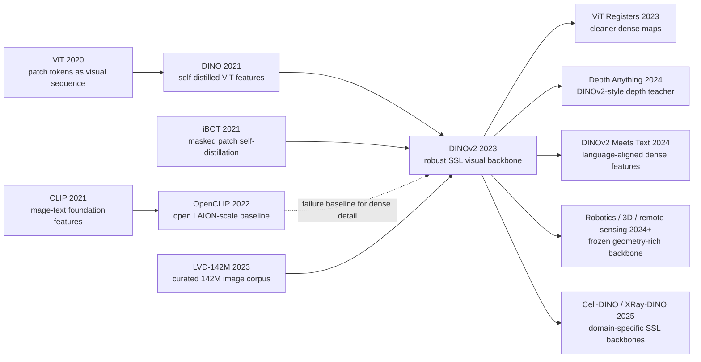

# DINOv2 - Robust Visual Features without Supervision

> **On April 14, 2023, Maxime Oquab, Timothee Darcet, Theo Moutakanni, Huy V. Vo, and 22 coauthors from Meta AI Research uploaded [arXiv:2304.07193](https://arxiv.org/abs/2304.07193); three days later Meta released [facebookresearch/dinov2](https://github.com/facebookresearch/dinov2).** The hook was unusually sharp for a vision paper in the CLIP era: DINOv2 did not teach a model to match images with captions, and it did not tune the backbone on human category labels. It selected 142 million images from a 1.2 billion image web pool, trained a 1.1B-parameter ViT-g/14 with self-supervised DINO+iBOT losses, and then released frozen features that could classify, retrieve, segment, and estimate depth with simple heads. Its historical force is the claim that a visual foundation model can be geometry-rich and label-free, not merely text-aligned.

## TL;DR

The 2023 DINOv2 paper by Oquab, Darcet, Moutakanni, Vo, and 22 coauthors moved the vision-foundation-model conversation away from “just align every image to text” and back toward pure visual self-supervision. The recipe is: build LVD-142M by retrieving and balancing 142 million useful images from a 1.2B web-image pool seeded by 25 third-party datasets; train a 1.1B-parameter ViT-g/14 so a student matches an EMA teacher at both image level and masked-patch level; and distill that teacher into practical ViT-S/B/L/14 models. The training objective can be summarized as $\mathcal{L}=\mathcal{L}_{DINO}+\mathcal{L}_{iBOT}+\lambda\mathcal{L}_{KoLeo}$. The baselines it displaced were not toy models: ImageNet-tuned SSL features lacked broad domain coverage, raw web-scale SSL was too noisy without curation, and CLIP/OpenCLIP-style image-text features were strong semantically but often weak on local geometry. The numbers explain why the paper mattered: frozen DINOv2-g/14 reaches 83.5/86.5 ImageNet k-NN/linear accuracy, 49.0/53.0 ADE20K linear/+ms mIoU, and 0.344/0.298/0.279 NYUd depth RMSE under increasingly stronger simple heads. In the 2023 ecosystem, SAM made segmentation promptable, [CLIP](../era4_foundation_models/2021_clip.md) remained the language-aligned semantic interface, and DINOv2 became the geometry-rich visual backbone reused by VLMs, robotics, 3D, medical imaging, and remote sensing. The hidden lesson is that data curation and feature geometry can be more foundational than a flashier multimodal interface.

---

## Historical Context

### The split in visual foundation models in spring 2023

When DINOv2 appeared in April 2023, computer vision had just entered a split era. One route was represented by CLIP and OpenCLIP: contrast images against text, pull image embeddings into a language-aligned space, and get zero-shot classification, retrieval, and open-vocabulary recognition almost for free. The other route was represented by MAE, DINO, iBOT, BEiT, and related self-supervised systems: learn from augmentations, masks, patch relations, and teacher-student consistency without using text. The first route was a semantic interface; the second route was closer to a visual-geometry engine.

The field’s attention in 2021-2022 tilted strongly toward the image-text route. CLIP demos were compelling, LAION/OpenCLIP made web-scale image-text pretraining reproducible, and multimodal language models naturally adopted CLIP as their “eye.” But image-text alignment came with a cost: captions usually describe the most nameable objects and attributes, not the full spatial arrangement, part boundaries, texture, depth, traversability, or occlusion structure. A caption can say “a dog on a chair,” but it rarely tells a model how the chair back and the dog’s legs interleave at the pixel level.

DINOv2 sits exactly in that gap. It does not reject CLIP; it argues that if a visual backbone is meant to support segmentation, depth, detection, robotics, remote sensing, and medical imaging, text-level semantics are not enough. A vision model has to preserve patch-level local consistency and cross-domain geometry. Meta releasing SAM and DINOv2 in the same month was not accidental: SAM made “click and get a mask” into a product-shaped segmentation interface, while DINOv2 asked whether frozen visual features themselves could become broadly reusable.

### From DINO to iBOT: the self-supervised vision prehistory

DINOv2 did not come out of nowhere. DINO in 2021 had already shown a striking phenomenon: a self-distilled Vision Transformer develops attention maps that naturally follow object regions, and its patch tokens appear to encode foreground-background structure. The core mechanism is a teacher-student setup: the student sees augmented views, the teacher is an EMA copy of the student, and the student matches the teacher’s sharpened and centered output distribution. The elegance of this line is that no human label and no negative queue are required, yet useful category and object structure emerges.

iBOT then pushed self-distillation down to the patch level. It did not only supervise the global class token; it also predicted masked patch tokens through an online-tokenizer style objective, making local regions participate in the representation. This is central to DINOv2 because DINOv2 is not optimized only for ImageNet linear probing. It is meant to support dense prediction tasks such as segmentation and depth. A backbone that only emits global semantics can look impressive on classification but remain brittle for pixel-level transfer.

Early DINO/iBOT still had two constraints. First, many results were tuned on ImageNet-1k or ImageNet-22k, where it is easy to confuse “the SSL method is good” with “the curated ImageNet distribution is clean.” Second, training large ViTs with teacher-student updates, multi-crop augmentation, masked patches, large batches, and high resolution was unstable and expensive. NaNs, memory peaks, and low throughput were practical blockers. DINOv2’s contribution was not a brand-new SSL objective; it was scaling the known ingredients to foundation-model size without losing stability.

### What Meta AI was doing at the time

The DINOv2 authors were based at Meta AI Research / FAIR. The group had two long-running visual traditions: DINO, iBOT, SEER, and self-supervised ViTs on one side; Detectron, Mask R-CNN, SAM, and dense prediction systems on the other. Maxime Oquab, Timothee Darcet, Piotr Bojanowski, Armand Joulin, and their collaborators were not merely chasing a single benchmark module. Their style was to turn data, training, models, and open releases into infrastructure that other researchers could reuse.

This also explains why DINOv2 and SAM complement each other. SAM is an interactive segmentation system centered on a promptable task, the SA-1B data engine, and a mask decoder. DINOv2 is a feature system centered on label-free pretraining, frozen backbones, and lightweight downstream heads such as linear probes, DPT, and Mask2Former. They solve two different layers of the same visual-foundation-model problem: how a user specifies the object they want, and how the model obtains a robust visual representation before any user prompt exists.

### The need from industry and open ecosystems

By 2023, visual applications had a clear pain point: fine-tuning a separate backbone for every task was becoming unsustainable. Autonomous driving, AR, robotics, medical imaging, remote sensing, content moderation, and product understanding all need visual representations, but their labeling budgets, compliance constraints, and domain shifts differ sharply. CLIP offers a semantic entry point for many systems, but it does not always provide strong depth, boundaries, and local correspondences. Supervised ImageNet backbones are strong, but they usually need dense labels or downstream fine-tuning to adapt.

DINOv2 stated a very engineering-shaped goal: train one backbone, freeze it, and use it across many downstream tasks. If the user needs classification, attach a linear head. If the user needs semantic segmentation, attach a linear/multiscale head or Mask2Former. If the user needs depth, attach a linear or DPT head. If the user needs retrieval, use nearest neighbors. The evaluation standard shifts from “did this model win one task” to “does the same feature tensor work across tasks and distributions.” That is why DINOv2 became a common reference point for robotics, 3D, medical imaging, remote sensing, and VLM systems in the two years after release.

## Background and Motivation

### The core tension: CLIP names things, DINOv2 preserves structure

CLIP’s strength is placing images in a language-semantic space. It knows that an image is closer to “a red car” than to “a green chair,” and it connects open categories, text retrieval, and multimodal dialogue. But many vision tasks do not only ask “what is it called?” Segmentation asks where the boundary is, depth asks what is in front of what, robotics asks where the contact surface is, and 3D reconstruction asks which patches correspond across views. Captions do not fully supervise these properties.

DINOv2 was motivated by the need for a purely visual, geometry-rich, label-free backbone. It does not require humans to write captions and it does not require a category taxonomy. It needs many diverse, well-curated images and a self-supervised objective that shapes both global semantics and local patches. “Without supervision” is not a romantic slogan here; it is an engineering constraint. Many real domains do not have enough labels or reliable textual descriptions, but they do have images.

### Why the key was not just “more web images”

Read too quickly, DINOv2 can sound like “train DINO on 142 million images.” The paper is more specific than that. It emphasizes curated data. Earlier web-scale SSL attempts showed that more data is not automatically better: raw web images bring duplicates, low-quality examples, distribution skew, and irrelevant material, and the resulting features can be worse than those trained on ImageNet-22k. DINOv2 built LVD-142M from a 1.2B candidate pool not to maximize raw scale, but to maximize diversity, balance, and evaluation safety.

This move is close in spirit to language-model data cleaning. Internet scale is only useful when quality, deduplication, coverage, and sampling are handled carefully. DINOv2 uses 25 third-party datasets as seeds, computes self-supervised image embeddings, expands them through similarity retrieval, and then deduplicates and balances the result. The dataset is neither trapped inside ImageNet object-class semantics nor drowned by raw web noise. Data engineering becomes central to a visual self-supervised learning paper.

### The goal: frozen features, not one more finetuning win

DINOv2’s target was not to fine-tune an end-to-end model to the top of every downstream leaderboard. The paper repeatedly stresses frozen features: classification with k-NN or linear probes, segmentation with frozen patch tokens and linear/multiscale heads, and depth with simple linear or DPT decoders. This evaluation choice is restrained and ambitious at the same time. It is restrained because downstream fine-tuning is not used as the main source of gains; it is ambitious because the backbone itself must be broadly useful rather than relying on task-specific training to repair its defects.

The research question can be compressed into one sentence: can label-free, purely visual, self-supervised training produce “ready-to-use” visual features that beat the strongest open image-text model, OpenCLIP, at both image-level and pixel-level tasks? The paper’s answer is yes, but only with several pieces combined: curated data, DINO+iBOT losses, KoLeo feature uniformity, a short high-resolution stage, scalable ViT-g training, and distillation into smaller models. Any one piece alone would be just another large SSL experiment; together they form infrastructure.

---

## Method Deep Dive

DINOv2’s methodological value is not a single isolated module. It is the way data curation, DINO+iBOT objectives, training stability, high-resolution adaptation, distillation, and an open model family are made into one reusable pipeline. It looks like a self-supervised learning paper, but it is closer to a systems report for a visual backbone: if frozen features are supposed to work across many tasks, the objective, the data distribution, and the training throughput all have to hold together.

### Overall Framework

DINOv2 trains a large teacher first and then compresses it into a deployable family. The large model is a ViT-g/14 with roughly 1.1B parameters; the dataset is LVD-142M; the pretraining objective combines image-level DINO self-distillation, masked-patch iBOT self-distillation, and KoLeo regularization; the final step distills ViT-g knowledge into ViT-S/B/L/14 models. The release therefore contains both a maximum-accuracy model and smaller practical backbones.

| Model | Params | Backbone shape | Training role |
|---|---:|---|---|
| ViT-S/14 distilled | 21M | small patch-14 ViT | mobile and fast feature extraction |
| ViT-B/14 distilled | 86M | base patch-14 ViT | common research baseline |
| ViT-L/14 distilled | 300M | large patch-14 ViT | strong practical backbone |
| ViT-g/14 | 1.1B | 40 layers, dim 1536, 24 heads | largest teacher and top accuracy model |

Two details matter. First, patch size 14 becomes the unified interface for the released models, making downstream dense tasks read features directly from patch tokens. Second, ViT-g/14 does not copy the original giant ViT design with 1408 dimensions and 16 heads. It uses dim=1536, 24 heads, and 64 dimensions per head for hardware efficiency; its FFN uses SwiGLU, while the distilled S/B/L models use standard MLPs. The keyword is not “mysterious new architecture,” but “trainable, evaluable, and releasable.”

### Key Design 1: The LVD-142M Data Engine

The easiest part of DINOv2 to underestimate is the data. The paper does not throw all web images into SSL. It first builds a seed corpus from roughly 25 third-party datasets, including ImageNet-22k, ImageNet-1k, Google Landmarks, fine-grained classification datasets, segmentation datasets, and depth datasets. It then retrieves images close to those seeds from 1.2B unique web images, and finally deduplicates and balances the result into LVD-142M.

$$
\mathcal{D}_{\mathrm{LVD}} = \operatorname{Balance}\left(\operatorname{NN}_{\cos}\left(E_{\mathrm{seed}}, E_{\mathrm{web}}\right)\right)
$$

Here $E$ denotes image embeddings extracted by a self-supervised ViT-H/16, and cosine similarity is used as the distance measure. The formula is a simplification of the real pipeline, but it captures the main idea: DINOv2’s data is neither manually labeled one image at a time nor blindly web-crawled. It is web data shaped by curated visual domains.

| Stage | Operation | Why it matters |
|---|---|---|
| Seed corpus | collect curated third-party datasets | anchors useful visual concepts |
| Candidate pool | gather 1.2B unique web images | supplies scale and diversity |
| Embedding retrieval | search neighbors in SSL feature space | selects visually related images without labels |
| Dedup and balance | remove copies and cap overrepresented regions | avoids memorization and distribution collapse |

The motivation is direct: ImageNet-22k is clean but narrow, while raw web data is large but noisy. LVD-142M aims for the middle. The paper’s data ablation supports this judgment: with the same ViT-g/14 architecture and the same number of iterations, LVD-142M outperforms ImageNet-22k on most transfer benchmarks, especially those far from the ImageNet taxonomy.

### Key Design 2: The DINO + iBOT + KoLeo Objective

DINOv2’s self-supervised objective has three parts. The DINO part makes the student’s global representation match the teacher’s global representation; the iBOT part makes masked student patch tokens match the teacher’s corresponding patch tokens; the KoLeo regularizer encourages a more uniform spread of features within a batch, improving nearest-neighbor geometry. The teacher is an EMA copy of the student, and its outputs are centered and sharpened.

$$
p_t = \operatorname{softmax}\left((g_{\theta_t}(x_t)-c)/\tau_t\right),\qquad p_s = \operatorname{softmax}\left(g_{\theta_s}(x_s)/\tau_s\right)
$$

$$
\mathcal{L}=\mathcal{L}_{\mathrm{DINO}}+\mathcal{L}_{\mathrm{iBOT}}+\lambda\mathcal{L}_{\mathrm{KoLeo}},\qquad \mathcal{L}_{\mathrm{iBOT}}=-\sum_i p_{t,i}\log p_{s,i}
$$

| Component | Signal | Acts on | Main effect |
|---|---|---|---|
| DINO loss | teacher-student distribution matching | class token / global crops | global semantic invariance |
| iBOT loss | masked patch prediction from teacher tokens | patch tokens | dense and local structure |
| KoLeo regularizer | entropy-like feature spreading | batch features | stronger nearest-neighbor geometry |
| SwAV centering | moving output center | teacher logits | prevents collapse under self-distillation |

The pseudocode below keeps only the skeleton of the training loop. It shows that DINOv2 is not “one loss,” but an interaction among teacher-student updates, crops, masks, centering, and EMA.

```python
def dinov2_step(images, student, teacher, center, optimizer):
    global_crops, local_crops, masks = augment_and_mask(images)

    with torch.no_grad():
        teacher_cls, teacher_patch = teacher(global_crops)
        teacher_probs = sharpen_and_center(teacher_cls, center)
        patch_targets = sharpen_and_center(teacher_patch[masks], center)

    student_cls, student_patch = student(global_crops + local_crops, masks=masks)
    dino_loss = cross_entropy(student_cls, teacher_probs)
    ibot_loss = cross_entropy(student_patch[masks], patch_targets)
    koleo_loss = koleo_regularizer(student_cls)
    loss = dino_loss + ibot_loss + 0.1 * koleo_loss

    loss.backward()
    optimizer.step()
    update_ema_teacher(student, teacher)
    update_center(center, teacher_cls)
    optimizer.zero_grad()
```

The key balance is: DINO supplies global semantics, iBOT supplies patch structure, and KoLeo improves retrieval-space geometry. The experiments also separate these roles: KoLeo helps nearest-neighbor retrieval, while the iBOT masked-image-modeling term is more important for patch-level tasks such as ADE20K. This is not a simple sum of old objectives; it is a recombination driven by the requirement that frozen features serve both global and local tasks.

### Key Design 3: Short High-Resolution Training and Scalable ViT-g

Pixel-level tasks need resolution. A model trained only at 224 can be sufficient for classification, but small objects, boundaries, and depth details are easily lost. Training from scratch at 518x518 is expensive. DINOv2 uses a compromise: train most of the run at lower resolution, then briefly raise input resolution to 518x518 at the end of pretraining. The paper’s ablation shows that this short high-resolution phase gets close to full high-resolution training while using only a fraction of the compute.

Training ViT-g/14 also requires substantial engineering. DINOv2 uses PyTorch 2, FSDP, xFormers memory-efficient attention, efficient stochastic depth, mixed precision, and reports that on equivalent hardware its code runs about 2x faster than the iBOT implementation while using only one third of the memory. This number is not a footnote. Every teacher-student SSL step is heavy; without throughput and memory stability, LVD-142M and 1.1B parameters would only be paper scale.

Another stability choice is LayerScale and high stochastic depth. They do not always immediately improve a linear-probe metric, but they reduce NaNs and divergence during large-model training. DINOv2’s methodology is pragmatic: foundation-model training must first run to completion before downstream generalization can matter. Many engineering choices that look invisible in the final table are actually what makes the next scale possible.

### Key Design 4: Distilling ViT-g into S/B/L Models

If DINOv2 had released only ViT-g/14, it would have been a model for a small number of institutions. The paper instead uses ViT-g as a frozen teacher and distills ViT-S/B/L/14. Distillation keeps a teacher-student training loop, but removes masking and stochastic depth, using the large model’s outputs to guide smaller students. The released S/B/L models create a usable gradient of speed, memory, and accuracy.

This distillation is central to the paper’s influence because DINOv2’s real impact comes from a model family rather than a single largest checkpoint. The released models show ViT-S/14 distilled at 21M parameters and roughly 81% linear evaluation, ViT-B/14 at 84.5%, ViT-L/14 at 86.3%, and ViT-g/14 at 86.5%. Many downstream systems will not load a 1.1B-parameter model, but they can adopt the B/L variants as default visual features.

More subtly, distillation transfers the distributional coverage learned from LVD-142M into smaller models without forcing each student to bear the same training cost from scratch. In the paper’s ablation, a distilled ViT-L outperforms a from-scratch ViT-L on all 12 benchmarks, sometimes even beating the teacher on individual tasks. The large model is therefore not only an endpoint; it is a feature generator and a training-signal amplifier.

---

## Failed Baselines

DINOv2’s failed baselines are not merely small models beaten by a larger one. The paper really pushes back against several default intuitions in the 2023 visual-foundation-model landscape: more web images are automatically better, CLIP features are universally sufficient, an SSL recipe tuned on ImageNet naturally scales, and frozen features do not matter if downstream finetuning is available. Each route is partly right, but none is enough to produce the all-purpose visual features DINOv2 is after.

### Failed Route 1: Uncurated Web-Scale Images

The natural early idea for self-supervised scaling was: if labels are not required, feed the model as many web images as possible. DINOv2’s data ablation shows that this is unstable. Raw web pools contain duplicates, low-quality images, advertising screenshots, near templates, extreme long-tail material, and overrepresented concepts. SSL does not automatically know which visual patterns are worth learning. With enough noise, the model can spend capacity modeling distributional artifacts.

LVD-142M is the correction to this failed route. DINOv2 does not choose the largest possible dataset; it selects 142M images from 1.2B candidates. It does not rely only on metadata; it uses self-supervised embeddings for visual similarity retrieval. It does not allow popular concepts to expand without bound; it deduplicates and balances. The lesson later reappears across visual, video, and multimodal datasets: scale is necessary, but curation is the amplifier.

### Failed Route 2: Text-Only Visual Semantics

CLIP/OpenCLIP are the strong baselines DINOv2 has to face directly. They are excellent on ImageNet, open categories, and image-text retrieval, often beating supervised or self-supervised models. But DINOv2 argues that they are not a universal answer for every visual task. Caption supervision favors nameable objects and semantic categories; it weakly supervises patch boundaries, local geometry, and depth relations. The result is that CLIP features can tell you “what this looks like” but may not tell you “where the boundary is, how the surface bends, or which patches belong to the same object.”

This is not a failure of CLIP itself; it is a failure of treating CLIP as the only visual backbone. DINOv2 only slightly leads OpenCLIP-G on ImageNet linear evaluation, but it opens a wider gap on dense prediction and some cross-domain retrieval settings. After 2023, many systems began to combine both kinds of features: CLIP/SigLIP for language-aligned semantics, DINOv2 for local geometry and patch-level matching.

### Failed Route 3: Tuning SSL Only on ImageNet

The early success of DINO and iBOT made it tempting to use ImageNet validation as the main debugging signal. The problem is that ImageNet is unusually clean: objects are centered, classes are clear, and the taxonomy is stable. An SSL recipe tuned on ImageNet may not understand microscopy, remote sensing, street-scene depth, indoor layout, or fine-grained products. DINOv2’s experiments show that ImageNet-22k models can be strong on ImageNet-1k while losing to LVD-142M on many transfer benchmarks.

The failure here is a narrow evaluation signal. DINOv2 evaluates classification, robustness, video, retrieval, semantic segmentation, and depth estimation together, forcing the backbone to remain consistent across different visual demands. The paper does not say ImageNet is unimportant. It says ImageNet is insufficient to define “general-purpose visual features.”

### DINOv2’s Own Boundaries

DINOv2 does not solve every problem. It does not directly output open-vocabulary categories, and it cannot turn an arbitrary text prompt into a classifier the way CLIP can. The full sources, licenses, and potential biases of its training data still need external scrutiny. Training the largest model remains a large-lab resource. Its linear-head semantic segmentation is strong, but absolute SOTA still needs task-specific heads such as Mask2Former/ViT-Adapter. The honest positioning is “strong visual features,” not “a complete visual assistant.”

| Failed route | Why it looked plausible | Where it breaks | DINOv2 correction |
|---|---|---|---|
| Raw web-scale SSL | labels are unnecessary, so more images should help | duplicates and noisy distributions dominate | curate LVD-142M from 1.2B candidates |
| Text-only visual pretraining | CLIP is strong on semantics and open vocab | captions underspecify local geometry | learn from image structure directly |
| ImageNet-tuned SSL | ImageNet gives clean debugging signal | transfer domains need broader coverage | train on diverse curated visual data |
| Downstream finetuning dependence | task heads can repair the backbone | frozen features reveal missing structure | optimize for k-NN, linear, dense frozen use |

## Key Experimental Data

DINOv2’s experimental value is its breadth. The paper does not only present an ImageNet table. It simultaneously studies global image representations, domain robustness, fine-grained classification, video action recognition, instance retrieval, semantic segmentation, monocular depth, and ablations. The numbers below are the most historically important ones; together they show that DINOv2’s frozen features are not only good classifiers, but also better suited to pixel-level and geometric tasks.

### Image Level: Classification, Robustness, and Retrieval

ImageNet linear probing is the easiest number to quote. DINOv2-g/14 reaches 83.5/86.5 ImageNet-1k k-NN/linear accuracy, above iBOT ViT-L/16 at 72.9/82.3 and slightly above OpenCLIP-G at 83.2/86.2. ImageNet-V2 matters more: DINOv2 reaches 78.4, above OpenCLIP-G at 77.2 and EVA-CLIP at 77.4, suggesting that the model is not merely tuned to the ImageNet validation set.

| Setting | OpenCLIP-G | iBOT-L | DINOv2-g | Takeaway |
|---|---:|---:|---:|---|
| ImageNet k-NN | 83.2 | 72.9 | 83.5 | SSL catches text-supervised global features |
| ImageNet linear | 86.2 | 82.3 | 86.5 | frozen features are competitive with OpenCLIP |
| ImageNet-V2 linear | 77.2 | 72.4 | 78.4 | better generalization to shifted validation |
| ImageNet-A linear | 63.8 | 41.5 | 75.9 | strong robustness to adversarial natural images |

The retrieval tables reveal DINOv2’s geometric advantage more clearly. On Oxford/Paris-style instance retrieval, DINOv2-g/14 substantially outperforms OpenCLIP-G and iBOT-L. For example, on Oxford-Hard, OpenCLIP-G is around 50.7, iBOT-L around 39.0, and DINOv2-g reaches 73.6; on Oxford-Medium, DINOv2-g reaches 92.1. Retrieval is not pure semantic classification. It requires local structure and instance detail, exactly the ability DINOv2 tries to preserve.

### Pixel Level: Segmentation and Depth

Semantic segmentation is one of DINOv2’s strongest counterexamples to a CLIP-only route. Using frozen patch tokens with a linear head, DINOv2-g/14 reaches 49.0 mIoU on ADE20K, while OpenCLIP-G reaches 39.3. With multiscale evaluation, DINOv2 reaches 53.0 and OpenCLIP-G reaches 46.0. Cityscapes and Pascal VOC show similar patterns. The paper also reports that a Mask2Former/ViT-Adapter pipeline on top of frozen ViT-g reaches 60.2 mIoU on ADE20K.

| Dense task | OpenCLIP-G | iBOT-L | DINOv2-g | Protocol |
|---|---:|---:|---:|---|
| ADE20K segmentation | 39.3 | 44.6 | 49.0 | linear mIoU |
| ADE20K segmentation | 46.0 | 47.5 | 53.0 | multiscale mIoU |
| Cityscapes segmentation | 70.3 | 74.5 | 81.0 | multiscale mIoU |
| NYUd depth | 0.414 | 0.358 | 0.279 | DPT RMSE, lower is better |
| KITTI depth | 2.56 | 2.55 | 2.11 | DPT RMSE, lower is better |

Monocular depth is especially important because it is not a task captions can teach directly. The NYUd/KITTI/SUN RGB-D results show that DINOv2 features make geometry linearly separable with very light depth heads. In out-of-domain qualitative examples, OpenCLIP predictions often contain fragments and misplacements, while DINOv2 depth maps are smoother and better aligned with object structure. This explains why later systems such as Depth Anything, robotics pipelines, and 3D systems repeatedly reuse DINOv2 representations.

### Ablations: KoLeo, MIM, Data, and Distillation

DINOv2’s ablations are not just an appendix; they are part of the paper’s argument. They show that each component plays a different role: KoLeo improves nearest-neighbor geometry, the iBOT masked-patch term helps local tasks such as ADE20K, LVD-142M transfers better than ImageNet-22k, a short high-resolution stage captures most of the dense-task benefit of full high-resolution training, and distillation transfers the large teacher’s coverage into smaller students.

| Ablation | Reported signal | Interpretation |
|---|---|---|
| iBOT baseline | 72.9 k-NN / 82.3 linear on ImageNet | strong but not foundation-scale |
| Add KoLeo | retrieval improves and k-NN jumps in the staged ablation | feature space spreads better |
| Add iBOT MIM term | ADE20K benefits most clearly | patch supervision matters for dense tasks |
| LVD-142M vs ImageNet-22k | LVD wins most non-ImageNet benchmarks | curation plus diversity beats narrow cleanliness |
| Distilled ViT-L vs scratch ViT-L | distilled wins on all 12 checked benchmarks | large teacher transfers distributional coverage |

One easy-to-miss result is that “fine-tuning is optional.” ViT-g/14 reaches 86.5 ImageNet linear accuracy and 88.5 after finetuning, a gain of about two points. Many supervised backbones show a larger frozen-versus-finetuned gap. DINOv2’s relatively small gap indicates that the backbone already encodes substantial category structure. It does not eliminate downstream training; it changes downstream training from “repair the backbone” to “choose a lightweight interface.”

---

## Idea Lineage

In intellectual history, DINOv2 did not rewrite model topology the way Transformer did, and it did not attach language to vision the way CLIP did. Its influence is closer to an infrastructure correction: when many people were starting to equate “visual foundation model” with image-text alignment, DINOv2 showed that pure visual self-supervision still had a foundation-model role, especially for local geometry, pixel-level transfer, and out-of-domain visual tasks.



### Prehistory: What Forced It into Existence

DINOv2 has three prehistories. The first is the ViT line: once images were represented as patch-token sequences, vision models could be treated more like language models, and the split between class tokens and patch tokens became explicit. Without ViT, DINO’s object attention and iBOT’s patch distillation would not have taken this form. The second is the DINO/iBOT line: DINO showed that self-distilled ViTs develop object-region sensitivity, and iBOT showed that masked-patch objectives can bring local structure into training. The third is the CLIP/OpenCLIP line: they put “foundation model for vision” at the center of the field while revealing that captions undersupervise local geometry.

The immediate pressure came from the third line. OpenCLIP was strong enough that every pure-vision SSL model had to answer a hard question: if you do not use text, why train it at all? DINOv2’s answer is that not all visual tasks are covered by language supervision. Classification and image-text retrieval are only part of vision; patch correspondence, depth, segmentation, local texture, and cross-domain geometry also deserve foundation-model-scale features.

The data line is just as important. ImageNet-era SSL often treated clean data as the default condition; LAION-era image-text pretraining made web scale the default direction. DINOv2 recombined the two: not small and clean ImageNet, and not unbounded web scale, but curated web scale. This idea strongly influenced later visual and video dataset construction: in large-model training, data filtering is itself a method.

### Present Line: Who Inherited It

DINOv2’s descendants fall into two groups. One group directly repairs DINOv2’s visual issues. Darcet, Oquab, Mairal, and Bojanowski’s 2023 “Vision Transformers Need Registers” found artifact tokens in dense feature maps of large ViTs and introduced register tokens as extra aggregation slots, reducing high-norm outliers in patch maps. This work can almost be read as a DINOv2 postscript: once a backbone is actually used for dense tasks, internal token pathology becomes an engineering problem rather than an aesthetic detail.

The other group uses DINOv2 as a default visual backbone. Depth Anything and related depth models use DINOv2-style representations and large pseudo-label corpora to improve monocular depth. DINOv2 Meets Text tries to attach language alignment to DINOv2’s dense visual features. Robotics and embodied models use DINOv2 patch tokens for geometry-rich perception. 3D, remote-sensing, medical, and biological imaging systems treat it as a strong initialization for low-label domains. The number of 2024-2026 papers saying “with DINOv2” or “DINOv2 features” shows that it has moved from paper to toolbox component.

This inheritance rarely means reproducing the full DINOv2 training run. More often, DINOv2 appears as a frozen encoder, teacher, metric, retrieval feature, pseudo-label source, or local matching prior. Its influence therefore resembles ImageNet/ResNet’s early backbone role: later papers may not study DINOv2 itself, but they assume it is a trustworthy visual representation.

### Misreading: It Is Not CLIP Without Labels

The most common misreading is to call DINOv2 “CLIP without text.” That is too coarse. CLIP’s objective is to align images and text in a shared semantic space, which makes it strong for open vocabulary, text retrieval, and multimodal interfaces. DINOv2’s objective is to make images form stable global and local features, which makes it strong as a frozen dense representation. Their failure modes differ: CLIP can be semantically right but boundary-poor, while DINOv2 can be geometry-rich but unable to name categories from text prompts.

Another misreading is to reduce DINOv2 to “142M images plus a big ViT.” The paper’s ablations argue against that. Uncurated data is not the answer, ImageNet-22k is not the answer, and an iBOT baseline alone is not the answer. The key is a system combination: curated data, global and local losses, KoLeo feature spreading, short high-resolution training for dense tasks, engineering that makes large-model training feasible, and distillation that makes smaller models usable.

A third misreading is to treat it as the endpoint of 2023 visual foundation models. DINOv2 is better understood as a powerful middle layer. It does not solve language alignment, open vocabulary, task planning, or every data-compliance question. It provides a reliable visual cortex for later systems. Strong post-2023 systems are rarely CLIP or DINOv2 alone; they combine language semantics, visual geometry, segmentation prompts, depth, and 3D representations.

---

## Modern Perspective

### Assumptions That No Longer Hold

Seen from 2026, DINOv2 first knocked down an implicit assumption: visual foundation models must get their generality through language supervision. The multimodal wave of 2023 made that assumption tempting, because the route from CLIP to GPT-4V looked continuous and powerful. DINOv2 showed that images themselves still provide rich supervision, especially when tasks care about local structure, dense correspondence, and geometry. Language is a strong interface, but it is not the only source of visual representation.

The second assumption that no longer holds is that self-supervised vision had passed its golden age. After 2021, the gains from MAE, BEiT, DINO, and iBOT seemed smaller on ImageNet tables, and the field’s energy moved toward image-text data and generative models. DINOv2 showed that the bottleneck was not only objective novelty; it was whether data curation and training systems had caught up with foundation-model scale. An older objective can become alive again under better data and steadier engineering.

The third assumption is that a strong backbone must prove itself mainly through downstream finetuning. DINOv2’s influence comes precisely from frozen use. Many robotics, 3D, medical, and remote-sensing systems do not want to fine-tune a huge visual model from scratch. They want a reliable feature extractor. DINOv2 shifts the value of a visual foundation model from “how high can I finetune on one benchmark” to “how many tasks can I support when frozen.”

### If DINOv2 Were Rewritten Today

If DINOv2 were rewritten today, the first change would be more transparent data governance. The 2023 paper already emphasized deduplication, balancing, and leakage control, but a 2026 reader would ask for more auditable data sources, license boundaries, geographic and cultural bias reports, and explicit treatment of sensitive domains such as medical images and faces. The data-compliance pressure on visual foundation models is higher than it was in 2023.

The second change would be earlier coupling with language and multimodal interfaces. The original paper deliberately kept DINOv2 purely visual, which helped preserve its geometry. But modern systems often need both text understanding and local structure. A 2026 version might use dense visual SSL as the first stage, then add lightweight language alignment, region-text grounding, or mask-text alignment as a second stage, rather than leaving DINOv2 Meets Text to the community afterward.

The third change would be video and 3D. DINOv2 mainly trains and evaluates on static images, but robotics, AR, autonomous driving, and world models require temporal consistency, cross-view correspondence, and interactive space. If written today, the paper would likely include video SSL, multi-view consistency, depth/normal/flow pseudo-tasks, and 3D-aware evaluation in the backbone objective. DINOv2 showed that images can teach a model many things; the next question is how the world itself teaches vision.

## Limitations and Future Directions

### Blind Spot 1: Semantic Categories and Text Interfaces

DINOv2 is strong at geometry and local structure, but it does not have CLIP’s natural text interface. A user cannot write a category prompt and directly turn DINOv2 into a zero-shot classifier, and the model does not naturally align patches with phrases. This means that open-vocabulary detection, VQA, image-text retrieval, and multimodal assistants still require CLIP/SigLIP-style features or additional alignment. DINOv2 is closer to a visual cortex than a complete language interface.

This blind spot creates space for later work. DINOv2 Meets Text, region-level contrastive alignment, and SAM + DINOv2 + text-grounding pipelines are all trying to close the same gap: keep DINOv2’s dense geometry while attaching language semantics. The hard part is not turning DINOv2 into another caption-optimized encoder. If language alignment is too strong, it may erode the local structure that makes DINOv2 valuable in the first place.

### Blind Spot 2: Data, Licensing, and Evaluation Leakage

LVD-142M is DINOv2’s core asset, but it is not fully released as an auditable dataset. The paper explains the construction process and some sources, but external researchers cannot inspect every image, license, geographic distribution, human-sensitivity issue, or benchmark overlap. This is a common problem for large visual foundation models: data quality determines model quality, yet the data itself is often the hardest part to open.

Evaluation also has hidden risks. DINOv2 expands curated seed datasets into web images, so the training corpus must avoid excessive overlap with downstream benchmarks. The paper performs deduplication and checks, but external verification is difficult. As the model is used in medical imaging, remote sensing, ecological monitoring, and human images, data governance shifts from a reproducibility problem to a deployment-responsibility problem. Future visual foundation models need to make this layer clearer.

## Related Work and Insights

### Lessons for VLMs, Robotics, and 3D

DINOv2’s lesson for multimodal systems is: do not mistake “can name the category” for “can see the world.” Many VLMs answer text questions well but still fail on counting, spatial relations, local attributes, and geometric reasoning. Connecting DINOv2-style patch-level features to language models is a natural way to reduce that gap. Later LLaVA-like systems, grounding models, and image-text alignment methods are all exploring this direction.

For robotics and 3D, the implication is even more direct. If a frozen backbone can reliably provide object parts, texture, depth cues, and cross-domain patch relations, it can serve as a shared perception layer for grasping, navigation, visual localization, scene reconstruction, and few-shot recognition. Many real robot systems do not have million-example labels and cannot retrain a vision model for every new environment. DINOv2-like unsupervised backbones fill that gap.

### Lessons for Self-Supervised Research

DINOv2’s biggest lesson for self-supervised research is to place “algorithmic novelty” back beside “data and engineering.” Many SSL papers swap losses or augmentations on the same dataset. DINOv2 shows that once the target is a foundation model, dataset construction, deduplication, seed selection, retrieval strategy, batch-feature geometry, high-resolution stages, distillation paths, and open release interfaces are all part of the method.

It also warns researchers not to stare only at ImageNet. A good visual representation should be judged by instance retrieval, segmentation, depth, robustness, video, and out-of-domain tasks together. ImageNet linear evaluation remains useful, but it no longer represents visual generality by itself. DINOv2’s evaluation matrix is not perfect, but it moves self-supervised vision from “classification pretraining” toward “multi-task foundation features.”

## Resources

### Papers and Code

- Paper: [DINOv2: Learning Robust Visual Features without Supervision](https://arxiv.org/abs/2304.07193)
- Code and models: [facebookresearch/dinov2](https://github.com/facebookresearch/dinov2)
- Meta blog: [DINOv2: State-of-the-art computer vision models with self-supervised learning](https://ai.meta.com/blog/dino-v2-computer-vision-self-supervised-learning/)
- Demo: [dinov2.metademolab.com](https://dinov2.metademolab.com/)

### Follow-Up Projects

- [Vision Transformers Need Registers](https://arxiv.org/abs/2309.16588): the most direct internal follow-up, reducing artifact tokens in dense feature maps of large ViTs.
- [Depth Anything](https://arxiv.org/abs/2401.10891): pushes DINOv2-style features and large-scale pseudo-labels into monocular depth.
- [DINOv2 Meets Text](https://arxiv.org/abs/2412.16334): aligns DINOv2 image/pixel features with language.
- Domain-specific DINO lines: Cell-DINO, XRay-DINO, Channel-Adaptive DINO, and related projects show that the DINOv2 recipe has migrated into biological, medical, and multichannel imaging.


---

> 🌐 [中文版](/era5_genai_explosion/2023_dinov2/) · 📚 awesome-papers project · CC-BY-NC