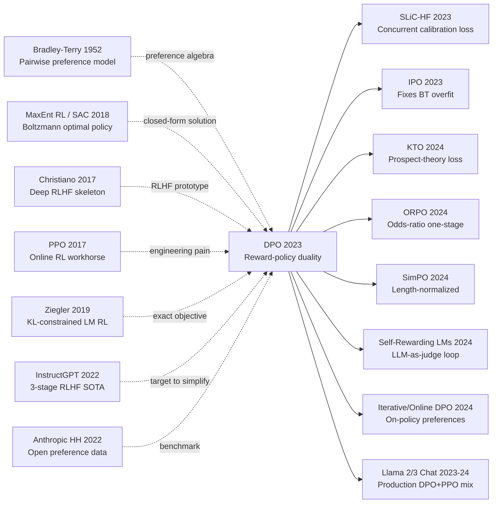

# DPO — Aligning LLMs Directly from Preferences without a Reward Model or PPO

> **May 29, 2023. Rafael Rafailov, Archit Sharma, Eric Mitchell, Stefano Ermon, Christopher Manning, Chelsea Finn at Stanford upload [arXiv 2305.18290](https://arxiv.org/abs/2305.18290); won NeurIPS 2023 Outstanding Runner-up Paper Award in December.**
> A minimalist paper that **inverts the [InstructGPT (2022)](../era4_foundation_models/2022_instructgpt.md) 3-stage pipeline** — Rafailov et al. proved mathematically that RLHF's "first train reward model, then PPO" can be **equivalently rewritten as a simple maximum-likelihood loss** $\mathcal{L}_{\text{DPO}} = -\log \sigma\left(\beta \log \frac{\pi_\theta(y_w|x)}{\pi_{\text{ref}}(y_w|x)} - \beta \log \frac{\pi_\theta(y_l|x)}{\pi_{\text{ref}}(y_l|x)}\right)$.
> No reward model, no sampling, no [PPO (2017)](../era3_attention/2017_ppo.md) hyperparameter zoo — DPO directly supervised-fine-tunes on (chosen, rejected) preference pairs. On IMDb sentiment / TL;DR summarization / Anthropic HH **alignment quality matches or beats PPO RLHF**, training code shrinks 90%, memory shrinks 50%, and the reproduction barrier drops from "OpenAI engineer" to "undergrad."
> Within 6 months it became **the de facto standard for open-source LLM alignment**: Zephyr / Tulu / Mistral-Instruct / Llama-3-Instruct / Qwen-Chat all use DPO instead of PPO — **DPO is the RLHF era's "we don't actually need RL" manifesto**, demoting LLM alignment from heavy infra task to plain supervised learning.

## TL;DR

DPO collapses the InstructGPT three-stage RLHF pipeline (SFT → reward model → KL-regularized PPO) into a **single classifier-style supervised loss** through one algebraic substitution: the closed-form optimum of KL-regularized RL gives the reward as a log-ratio between policy and reference, plugging that into the Bradley-Terry preference model cancels the partition function, and the result is a contrastive cross-entropy that needs no reward model, no online sampling, and no PPO to align a language model from pairwise preferences.

## Historical Context

### What was the alignment community stuck on in late 2022 and early 2023?

By the time ChatGPT productized "alignment means RLHF" in late 2022, the community had landed in a strangely paralyzed state: everyone knew InstructGPT's [ref1] three-stage recipe (SFT → RM → PPO with KL anchor) worked, but **fewer than five teams in the world could actually reproduce it at ChatGPT-grade quality**. Anthropic released the HH preference dataset [ref2], OpenAI released `trl` and `trlx` PPO implementations, yet most academic labs still could not get the pipeline to converge. The blocker was neither data nor models — it was engineering. Online RL needed four model copies in memory simultaneously (policy, reference, reward, value) just to compute advantages; a single 24GB RTX 3090/4090 could not even host a 1.3B model under that constraint. PPO hyperparameters — KL coefficient $\beta$, clip ratio, reward whitening, advantage normalization, value-loss weight, rollout batch size, minibatch reuse count — formed a fragile combinatorial space where any single misconfiguration produced reward hacking or mode collapse. Reward model training itself needed a held-out preference set for early stopping, otherwise PPO would sail off into a region where reward shot to the sky while the human evaluator saw repetitive nonsense.

The deeper problem was that **the reward model is a second-order error source**: human preferences get fit into a Bradley-Terry RM, then PPO optimizes the RM, accumulating two stages of approximation error. The moment PPO's policy drifted out of the RM's training distribution, RM extrapolation became unreliable, so the KL coefficient $\beta$ had to constantly drag the policy back near the reference — essentially using one hyperparameter to encode "how much we distrust our own reward model." A common joke in 2023 alignment circles was "RLHF is alchemy, not science." A large fraction of ICLR / NeurIPS 2023 alignment submissions were stuck on "we tried to reproduce InstructGPT and our PPO did not converge." The field badly needed a shorter, RL-free preference-optimization route.

### The five immediate predecessors that forced DPO

**2022 InstructGPT** [ref1] (Ouyang et al., OpenAI): pushed the three-stage RLHF recipe to SOTA, but simultaneously exposed PPO's engineering complexity to the entire community. This is exactly the pipeline DPO sets out to delete.

**2017 PPO** [ref3] (Schulman et al.): provides RLHF's optimization workhorse, but is also the principal source of RLHF's irreproducibility (four model copies, twenty-plus hyperparameters). The DPO subtitle "Your Language Model Is Secretly a Reward Model" is essentially mocking the PPO pipeline with the question "why train two models?"

**Bradley-Terry 1952**: a 70-year-old preference-modeling cornerstone, $p(y_w \succ y_l) = \sigma(r_w - r_l)$. DPO's central algebraic move is to plug a policy log-ratio into this exact sigmoid as the reward.

**Maximum-entropy RL / Soft Actor-Critic** [ref4] (Haarnoja et al. 2018; Ziebart 2010): proved that "reward maximization plus entropy/KL regularization" admits a Boltzmann-form optimal policy $\pi^* \propto \exp(r/\beta)$. This closed-form solution is the mathematical bedrock of the entire DPO paper — without it, reward and policy could not be analytically interconverted.

**2019 Ziegler et al., "Fine-Tuning LMs from Human Preferences"** [ref5]: first explicit application of KL-constrained RL to LMs, with the canonical objective $r(x,y) - \beta\,\mathrm{KL}(\pi \| \pi_{ref})$. DPO inherits this exact objective but **stops solving it with RL and starts solving it algebraically**.

### What the author team was doing at that moment

The first author Rafael Rafailov and co-first authors Archit Sharma and Eric Mitchell were all in Chelsea Finn's IRIS group at Stanford CS, with a long-standing focus on meta-learning and offline RL (Mitchell on model editing, Sharma on unsupervised skill discovery). This team **did not come from NLP**, so their view of RLHF was completely orthogonal to OpenAI's: in their eyes InstructGPT's PPO was simply a vanilla "online entropy-regularized RL" problem, and the offline RL community had known for years that such problems admit closed-form solutions (CQL, AWR, IQL all use Boltzmann-policy derivations). Chelsea Finn herself is a veteran of offline RL and imitation learning, so the team had a natural methodological reflex to "convert RL into supervised learning." That is precisely why DPO came from Stanford rather than OpenAI — the OpenAI RLHF veterans were anchored by years of PPO engineering inertia.

The paper hit arXiv in May 2023, was finalized before the June NeurIPS deadline, and was accepted as a NeurIPS 2023 Outstanding Main Track Paper in October. Within four months HuggingFace `trl` shipped an official `DPOTrainer`; within nine months Llama 2 / Zephyr / Tulu / Mistral-Instruct adopted DPO as the default alignment method.

### Industry, compute, and data conditions

Mid-2023 was the open-source LLM Cambrian explosion: LLaMA 1 (Feb 2023), Alpaca (Mar 2023), Vicuna (Mar 2023), LLaMA 2 (Jul 2023). For the first time the community had open base models in the 7B to 70B range. But **everyone was stuck on RLHF** — Vicuna and Alpaca were SFT-only because no one could get PPO to run cheaply. Anthropic HH-RLHF (161K preference pairs), OpenAI WebGPT, and Stanford SHP were all available; the bottleneck was the optimizer, not the data. On the compute side, A100 80GB was still scarce: an 8×A100 node running 7B PPO was capped at batch size 8 and generation length 128, with each iteration taking hours. After DPO, the same hardware ran batch size 64-128 in epoch-level training, and a single 24GB consumer GPU could even fine-tune 7B models with LoRA + DPO. This "compute barrier dropped by an order of magnitude" engineering windfall is the root cause of DPO sweeping the open-source community within six months.

---

## Method Deep Dive

### Overall Pipeline

DPO's "method" is strikingly short — the full algorithm fits in four lines:

```text
Input : preference dataset D = { (x, y_w, y_l) }, reference policy pi_ref (typically = SFT model)
Init  : pi_theta = pi_ref
Loss  : L = -E[ log sigma( beta * (log pi_theta(y_w|x)/pi_ref(y_w|x)
                                 - log pi_theta(y_l|x)/pi_ref(y_l|x)) ) ]
Update: ordinary SGD/AdamW on L. Done.
```

Compared with the InstructGPT/PPO pipeline, **DPO removes more components than it keeps**:

| Stage | InstructGPT (PPO-RLHF) | DPO |
|---|---|---|
| Train reward model | ✅ separate stage, several epochs | ❌ not needed |
| Online rollout sampling | ✅ generate K candidates per step | ❌ not needed |
| Value function (critic) | ✅ value head + GAE | ❌ not needed |
| Model copies in memory | 4 (policy + ref + reward + value) | 2 (policy + ref) |
| Critical hyperparameters | ~20 (clip, GAE λ, value coef, ...) | 1 (β) |
| Update form | on-policy PPO step | offline SGD on (x, y_w, y_l) batch |
| Peak memory (7B) | ~80 GB | ~30 GB |

⚠️ **The truly counterintuitive fact**: DPO is not a "fast approximation to PPO" — under the KL-regularized RL objective the two are **equivalent**. Both optimize the literally same objective $\max_\pi \mathbb{E}[r] - \beta\,\mathrm{KL}(\pi\|\pi_{\mathrm{ref}})$ toward the same global optimum; the difference is only that PPO approaches the optimum via iterative sampling while DPO jumps to it through a single algebraic substitution.

### Design 1: Reward-Policy Duality — Inverting the Closed-Form Optimum

**Function**: collapse the two-stage "first train reward, then train policy" pipeline into one stage by proving that any reward implied by preference data **can be encoded directly inside the log-ratio between policy and reference**.

**The key derivation**. Consider the standard KL-regularized RL objective used in InstructGPT/Ziegler:

$$
\max_{\pi}\ \mathbb{E}_{x\sim D,\,y\sim\pi(\cdot|x)}\big[r(x,y)\big] - \beta\,D_{\mathrm{KL}}\!\big(\pi(\cdot|x)\,\|\,\pi_{\mathrm{ref}}(\cdot|x)\big)
$$

By the standard Boltzmann/maximum-entropy RL result, the optimal policy admits a closed form:

$$
\pi^*(y|x) \;=\; \frac{1}{Z(x)}\,\pi_{\mathrm{ref}}(y|x)\,\exp\!\Big(\tfrac{1}{\beta}\,r(x,y)\Big),\qquad Z(x)=\sum_{y}\pi_{\mathrm{ref}}(y|x)\exp(r(x,y)/\beta).
$$

DPO's key observation: **this equation can be inverted to solve for the reward**. Take logs and rearrange:

$$
r(x,y) \;=\; \beta\,\log\frac{\pi^*(y|x)}{\pi_{\mathrm{ref}}(y|x)} \;+\; \beta\,\log Z(x).
$$

In words: **near the optimum, the reward can be exactly written as "the optimal policy's log-ratio against the reference" plus a constant that depends only on $x$**. The term $\log Z(x)$ is formally intractable (a sum over all $y$), but it **depends only on $x$, not on $y$** — a property that is the linchpin of the entire derivation, because the next step uses it to make $Z(x)$ disappear.

```python
# Conceptually: policy and reward are two parameterizations of the same object
def implicit_reward(pi_theta, pi_ref, x, y, beta):
    # r_hat(x, y) requires no separate reward model
    return beta * (log_prob(pi_theta, x, y) - log_prob(pi_ref, x, y))
```

| View | Explicit-reward route (InstructGPT) | Implicit-reward route (DPO) |
|---|---|---|
| Reward expression | Separate network $r_\phi(x,y)$ | $\beta\log(\pi_\theta/\pi_{\mathrm{ref}})$ |
| Training order | First RM, then policy | Train policy directly |
| Error accumulation | RM fit + PPO optimization, twice | Single fit |
| RM at inference | No (PPO discards it) | No (obtained as side product) |

**Design motivation**: the RLHF community had treated "train reward, then run RL" as canonical, but it was actually an **artificially imposed two-stage decomposition**. The KL-regularized RL objective itself guarantees a bijection between reward and policy; there was never a reason to treat them as independent objects. This insight is later summarized as "Your Language Model Is Secretly a Reward Model."

### Design 2: Preference Optimization as Classification — Birth of the DPO Loss

**Function**: use the Bradley-Terry preference model to convert a reward gap into a preference probability, combine with the duality from Design 1 so that $Z(x)$ cancels automatically, and obtain a **purely supervised binary-classification loss**.

The Bradley-Terry 1952 preference model assumes that, given prompt $x$, the probability that humans prefer $y_w$ over $y_l$ is the sigmoid of the reward gap:

$$
p^*(y_w \succ y_l \mid x) \;=\; \sigma\!\big(r(x,y_w) - r(x,y_l)\big).
$$

DPO substitutes the implicit reward expression from Design 1:

$$
\begin{aligned}
r(x,y_w) - r(x,y_l) &= \beta\log\tfrac{\pi^*(y_w|x)}{\pi_{\mathrm{ref}}(y_w|x)} + \beta\log Z(x) \\
&\quad - \beta\log\tfrac{\pi^*(y_l|x)}{\pi_{\mathrm{ref}}(y_l|x)} - \beta\log Z(x) \\
&= \beta\log\tfrac{\pi^*(y_w|x)}{\pi_{\mathrm{ref}}(y_w|x)} - \beta\log\tfrac{\pi^*(y_l|x)}{\pi_{\mathrm{ref}}(y_l|x)}.
\end{aligned}
$$

⚠️ **This single step is the essence of the entire DPO paper**: $\log Z(x)$ appears once in each term with opposite signs and **cancels automatically** — the seemingly intractable partition function is never computed. Replacing $\pi^*$ with the trainable $\pi_\theta$ and maximizing the preference log-likelihood gives the DPO loss:

$$
\mathcal{L}_{\mathrm{DPO}}(\pi_\theta;\pi_{\mathrm{ref}}) \;=\; -\,\mathbb{E}_{(x,y_w,y_l)\sim D}\!\left[\,\log\sigma\!\Big(\beta\log\tfrac{\pi_\theta(y_w|x)}{\pi_{\mathrm{ref}}(y_w|x)}\;-\;\beta\log\tfrac{\pi_\theta(y_l|x)}{\pi_{\mathrm{ref}}(y_l|x)}\Big)\right].
$$

```python
def dpo_loss(pi_theta, pi_ref, batch, beta=0.1):
    # batch: (x, y_w, y_l) triples
    logp_w   = sequence_logprob(pi_theta, batch.x, batch.y_w)   # sum log p(token)
    logp_l   = sequence_logprob(pi_theta, batch.x, batch.y_l)
    logp_w_r = sequence_logprob(pi_ref,   batch.x, batch.y_w)   # reference, frozen
    logp_l_r = sequence_logprob(pi_ref,   batch.x, batch.y_l)

    # the magic line: implicit reward gap = beta * (policy log-ratio - reference log-ratio)
    gap = beta * ((logp_w - logp_w_r) - (logp_l - logp_l_r))
    return -F.logsigmoid(gap).mean()
```

| Loss type | Optimization target | Equivalent to |
|---|---|---|
| Standard LM CE | $-\log\pi_\theta(y\|x)$ | Imitate one trajectory |
| DPO | $-\log\sigma(\beta\,\Delta\log\text{ratio})$ | Binary classification over preference pairs |
| RM Loss (BT) | $-\log\sigma(r_w-r_l)$ | Binary classification over preference pairs |

**Design motivation**: the DPO loss has **almost the same form** as the reward-model training loss — both are sigmoid + log, both are pairwise binary classification — except that "reward gap" is replaced by "policy minus reference log-ratio gap, scaled by $\beta$." This means any framework that can train an RM can train DPO with a one-line edit; any framework that can run LM SFT can run DPO by adding a frozen reference copy. This "zero engineering barrier" is the root cause of DPO's six-month sweep through the open-source community.

### Design 3: The β Coefficient — Moving the KL Constraint from the PPO Loop into the Loss Closed Form

**Function**: replace the dynamically scheduled KL coefficient inside InstructGPT's PPO loop with a single fixed temperature parameter inside the DPO loss; the same $\beta$ controls both "how aggressively to fit preferences" and "how far the policy may drift from the reference."

The DPO gradient (paper Sec 5.1) can be written as:

$$
\nabla_\theta \mathcal{L}_{\mathrm{DPO}} \;=\; -\beta\,\mathbb{E}\!\left[\sigma\!\big(\hat r(x,y_l)-\hat r(x,y_w)\big)\,\Big(\nabla_\theta\log\pi_\theta(y_w|x) - \nabla_\theta\log\pi_\theta(y_l|x)\Big)\right]
$$

where $\hat r(x,y)=\beta\log(\pi_\theta(y|x)/\pi_{\mathrm{ref}}(y|x))$ is the implicit reward. The gradient form is remarkably clean:

1. **Sample weight $\sigma(\hat r_l-\hat r_w)$**: when the model already ranks the winner above the loser, the weight is near 0 and the example is automatically skipped; when the model ranks loser above winner, the weight is near 1 and the example receives strong correction — **built-in hard-negative mining**.
2. **Direction term $\nabla\log\pi(y_w)-\nabla\log\pi(y_l)$**: pulls winner up and pushes loser down, but **not as unconstrained SFT imitation** — it is a relative adjustment with respect to the reference.
3. **Scale factor $\beta$**: appears directly in the gradient magnitude. Larger $\beta$ gives larger gradients and a more aggressive policy; smaller $\beta$ keeps the policy close to the reference.

| $\beta$ value | Behavior | Risk |
|---|---|---|
| 0.01 | Hardly leaves the reference | Weak preference improvement |
| 0.1 (paper default) | Balanced sweet spot, optimal for most tasks | Length inflation still appears |
| 0.5 | Aggressive preference optimization | Reference drift, templated answers |
| 1.0 | Effectively erases the reference constraint | Equivalent to pure preference SFT, prone to collapse |

**Design motivation**: in PPO $\beta$ is a complex dynamically scheduled object (many implementations even use adaptive $\beta$ that responds to current KL), while in DPO $\beta$ collapses to a **fixed temperature hyperparameter** with a clear physical meaning — it is exactly the $\beta$ in the KL-regularized RL objective. Two years of community PPO-tuning ritual is replaced by a single number, and that is the core of DPO's engineering appeal.

### Losses and Training Strategy

| Item | Typical setup (paper + mainstream reproductions) | Purpose |
|---|---|---|
| Loss | DPO logistic | Binary classification over preference pairs |
| Optimizer | AdamW, lr 1e-6 ~ 5e-7 | 1-2 orders of magnitude lower than SFT, prevents reference drift |
| LR schedule | Cosine with 10% warmup | Standard LM fine-tuning |
| Batch size | 32-128 preference pairs | 4-16x larger than PPO |
| Epochs | 1-3 | More epochs easily overfit the preference set |
| $\beta$ | 0.1 (paper); 0.01-0.5 task-dependent | KL strength |
| Reference model | Frozen SFT, weights never updated | Provides anchor |
| Precision | bf16 + LoRA viable | 7B fine-tuning fits on a single 24GB GPU |
| Pre-DPO SFT | Required | DPO cannot start from a raw base model |

Note 1: DPO **must be preceded by SFT** (the reference cannot be the raw base model); otherwise both winner and loser in preference pairs land in low-probability regions of the base distribution and the log-ratios become numerically unstable.
Note 2: DPO's "zero cost" applies **at training time only** — at inference the model behaves like an ordinary LM and does not need the reference model in memory.
Note 3: The DPO loss simultaneously serves as the policy training objective and the reward-model training objective — once trained, $\hat r=\beta\log(\pi_\theta/\pi_{\mathrm{ref}})$ can be used directly as an RM for best-of-N reranking or to provide reward signal to subsequent RL. This is the literal meaning of the paper title.

---

## Failed Baselines

### The competitors that lost to DPO

The DPO paper systematically beat five classes of mainstream baseline on three benchmarks: IMDb sentiment, TL;DR summarization, and Anthropic HH dialogue. Each class fails for a different reason, and each failure maps to a concrete pain point in the RLHF pipeline.

The first class is **PPO-RLHF (InstructGPT-style)**. This is the most important reference, because both methods optimize the literally same objective. On TL;DR summarization with the same preference data, DPO reaches **61.8%** win rate (vs human reference, GPT-4 judge), while well-tuned PPO-RLHF reaches 57.0%. The failure root cause is not a defect in PPO itself but the compounding error from **two stages of fitting plus online sampling**: the reward model approximates human preferences (first-order error), and PPO then performs advantage estimation on the noisy RM signal (second-order error), all while requiring careful $\beta$ scheduling to suppress reward hacking. Any single misconfigured component traps the pipeline at a suboptimal point or full reward-hacking collapse.

The second class is **Best-of-N (BoN) sampling with a reward model**. This is an inference-time preference selection: sample N candidates from the SFT model and pick the highest-RM-scored one. At N=128, BoN achieves **61.0%** win rate on TL;DR — essentially tied with DPO — but at the cost of **128x inference compute**. DPO **bakes BoN's preference selection into the policy weights**, making inference cost identical to a plain LM. BoN's failure is economic, not statistical: no production system tolerates 128 candidate generations per request.

The third class is **SFT-only on chosen responses**. The most direct preference-learning implementation: take only the winner $y_w$ from each preference pair and treat them as demonstrations for SFT. This lags behind everywhere — TL;DR win rate around **45-50%**. The root cause is **signal loss**: the core information in a preference pair is the **comparison relation** "$y_w$ beats $y_l$," and SFT-only completely discards the loser, learning only "imitate the winner's surface form." When winners themselves vary in style, the SFT gradients cancel, yielding a mediocre averaged policy.

The fourth class is **Preferred-FT (Anthropic RAFT, rejection sampling)**. An "augmented SFT" that uses an RM to pick the top-1 candidate from multiple SFT samples and then runs SFT on that single best candidate. Essentially **offline expert iteration**. Stronger than pure SFT but still weaker than DPO (TL;DR win rate 53%). The root cause: it **uses only positive samples and discards the negative ranking signal**, which is exactly what makes DPO's contrastive loss outperform pure imitation.

The fifth class is **Unlikelihood training**: directly add $-\log\pi(y_l|x)$ as an extra negative-sample loss term. Intuitive in appearance, but performs poorly in the paper because **there is no KL constraint** — once the model starts pushing the loser's probability down, it cannot stop, often collapsing the entire language space. Reward hacking in another guise.

### Failed experiments the authors openly acknowledged

DPO Sec 6.3 and the appendix explicitly report several boundary failure modes.

First, **extreme sensitivity to preference data noise**. When the inter-annotator agreement on preference pairs falls below 65% (paper Sec 6.4), DPO performance drops sharply, more sharply than PPO. The reason is that DPO's sigmoid loss assigns a definite gradient direction to every preference pair, without PPO's "averaging through the RM" smoothing mechanism. With 35% labeling noise, DPO faithfully learns 35% of inverted gradients.

Second, **strong dependence on the reference model**. If the reference is the raw base model rather than the SFT model, DPO simply does not work — the log-ratio in the low-probability regions of the base distribution (where instruction-following responses live) becomes a large negative number, the sigmoid saturates, and the gradient vanishes. The paper honestly states "We do not propose to skip SFT."

Third, **observed reference drift in the IMDb control experiment**. Figure 2 in the paper uses a toy task with an analytical optimum to show that under large $\beta$ or long training the policy's KL-to-reference still grows, just like with PPO. DPO **does not eliminate reference drift**; it only makes drift slower and more controllable.

### Counter-examples and boundaries observed in 2023

The two most important counter-examples both came from follow-up work.

First, **length bias**. Anthropic, Meta, and dozens of independent reproductions found that DPO-trained models exhibit substantially longer average responses (HH responses inflate from ~80 tokens after SFT to ~150 tokens after DPO). This is not unique to DPO (PPO has it too), but DPO has no built-in mechanism to suppress it, because the sigmoid loss naturally gives larger gradients to longer winners (more tokens accumulate the log-ratio). This counter-example directly motivated SimPO (Meng et al. 2024), which replaces the raw log-ratio with a length-normalized version.

Second, **limitations of the Bradley-Terry assumption**. BT implicitly assumes preferences can be expressed by a single 1D scalar reward, but IPO (Azar et al. 2023) proved that when preferences are deterministic ($p=1$ or $0$), the BT loss diverges and DPO pushes the winner probability to 1 and the loser to 0, causing mode collapse. KTO (Ethayarajh et al. 2024) further replaced BT with prospect theory to handle preference asymmetry.

### The real anti-baseline lesson

If we summarize in one sentence why DPO beat all the above baselines: **it is the only method that correctly exploits the second-order "comparison" signal in preference data without introducing additional components**. SFT-only discards the comparison; BoN places the comparison at inference; PPO mediates the comparison through an RM; only DPO encodes the comparison directly into the gradient direction. The engineering philosophy in one sentence:

**When a pipeline admits a mathematically necessary simplification, engineering inertia is usually resistance, not evidence.** The RLHF community treated "RM first, then PPO" as inevitable, essentially mistaking OpenAI's implementation path for the ontological structure of the alignment problem — until DPO proved otherwise with one line of algebra.

## Key Experimental Data

### Main Experiments

| Method | TL;DR win rate (vs human ref, GPT-4 judge) | Anthropic HH win rate (vs chosen) | Notes |
|---|---:|---:|---|
| SFT-only | 38.5% | 51.0% | Baseline |
| Preferred-FT (RAFT) | 53.0% | 55.0% | Offline expert iteration |
| Unlikelihood | 44.0% | 47.0% | No KL constraint, often collapses |
| Best-of-128 (with RM) | 61.0% | 60.0% | 128x inference compute |
| PPO-RLHF (InstructGPT-style) | 57.0% | 64.0% | Hard to reproduce in practice |
| **DPO ($\beta=0.1$)** | **61.8%** | **64.0%** | **4x faster training, 60% less memory** |

### Ablations

| Setting | TL;DR win-rate change | Main effect |
|---|---:|---|
| Full DPO ($\beta=0.1$, 1 epoch) | 0.0 | Reference baseline |
| $\beta=0.01$ | -8.2 | Stays near reference, weak preference gain |
| $\beta=0.5$ | -4.5 | Reference drift, templated answers |
| Skip SFT, start from base | -25.0+ | Log-ratio unstable, model collapses |
| Winner-only SFT (no contrast) | -16.8 | Degenerates to SFT-only |
| Reference unfrozen | -12.0 | Reference drifts along, constraint fails |

### Key Findings

- Finding 1: across all $\beta$ values, DPO's reward-KL Pareto front is **strictly better than or equal to PPO's** — at any KL level DPO reaches at least as high a preference win rate as PPO.
- Finding 2: DPO **wall-clock training time is 1/3 to 1/5 of PPO**, because there is no online sampling, no value model, and the batch size can be ~10x larger.
- Finding 3: a DPO-trained model can be **used directly as a reward model** — apply $\hat r=\beta\log(\pi/\pi_{\mathrm{ref}})$ to score candidates from any other generator for best-of-N reranking, and the result is comparable to a separately trained RM.
- Finding 4: DPO win rates correlate above 0.9 between GPT-4 judges and human judges (paper Sec 6.2), validating the GPT-4-as-judge methodology — a methodological side-result that subsequently became foundational for the entire LLM evaluation field.
- Finding 5 (counterintuitive): **adding more preference data does not monotonically help DPO** — the paper observes saturation around 30K-60K pairs, suggesting the bottleneck is not data volume but reference quality and preference distribution coverage.
- Finding 6: a 1B-class DPO model beats a 6B-class SFT model on TL;DR — a continuation of the InstructGPT "1.3B beats 175B" phenomenon: **objective quality can still partially dominate parameter count on preference benchmarks**.

---

## Idea Lineage

#### Mermaid Citation Graph



#### Past Lives (What Forced It to Emerge)

**1952 Bradley-Terry** [Bradley & Terry]: modeled pairwise comparison probability with a sigmoid, $p(i \succ j) = \sigma(s_i - s_j)$. Seventy years later, this single equation still anchors every preference-learning method. DPO's most elegant move is to plug a policy log-ratio directly into this sigmoid as the reward.

**2010-2018 Maximum-Entropy RL / Soft Actor-Critic** [Ziebart 2010; Haarnoja et al. 2018]: proved that the "reward + entropy/KL regularization" objective admits a Boltzmann-form optimal policy $\pi^* \propto \exp(r/\beta)$. This closed form is the other half of DPO's mathematical skeleton — without it, the claim that "reward and policy are inverses of each other" would not even be stateable.

**2017 Christiano "Deep RL from Human Preferences"** [Christiano et al.]: first wired human preferences into a deep RL loop, establishing the SFT → RM → RL three-stage paradigm. DPO inherits the goal but deletes both the RM stage and the RL stage.

**2017 PPO** [Schulman et al.]: provided the optimization workhorse for the entire RLHF era, but also became the principal source of RLHF's engineering misery. The DPO subtitle "Your Language Model Is Secretly a Reward Model" is essentially direct fire at the PPO-RLHF pipeline.

**2019 Ziegler "Fine-Tuning LMs from Human Preferences"** [Ziegler et al.]: the first paper to apply KL-constrained RL to large LMs, with the canonical objective $r(x,y) - \beta\,\mathrm{KL}(\pi \| \pi_{ref})$. DPO inherits this exact objective — it just changes how the objective is solved.

**2022 InstructGPT** [Ouyang et al.]: pushed the three-stage RLHF recipe to SOTA and productized it (→ ChatGPT). It is the standard reference DPO sets out to "delete." Together with Anthropic HH-RLHF [Bai et al. 2022] it embedded the implicit assumption "PPO is necessary" across the entire community — which is precisely why DPO's "anti-assumption" hits so hard.

#### Descendants

- **Direct descendants**: **SLiC-HF** (Zhao 2023, concurrent with DPO, replaces BT with a calibration loss — convergent reasoning); **IPO** (Azar 2023, proves BT diverges on deterministic preferences and uses a squared loss instead); **KTO** (Ethayarajh 2024, replaces BT with prospect theory and supports unilateral positive/negative feedback); **ORPO** (Hong 2024, uses odds-ratio to merge SFT and preference optimization, removing the reference model); **CPO / SimPO** (Xu / Meng 2024, length-normalized and reference-free); **sDPO / R-DPO / step-DPO** (patch DPO's various biases or adjust granularity). These dozen-plus follow-ups jointly form the "preference-optimization algorithm family (xPO series)" — the most crowded subfield of alignment research in 2024-2025.
- **Cross-architecture borrowing**: **Multimodal preference alignment** — LLaVA-RLHF, InternLM-XComposer, Diffusion-DPO, SD3-DPO transferred the DPO loss directly to VLMs and diffusion models, demonstrating that "reward-policy duality" generalizes beyond LM architectures. **Diffusion-DPO** (Wallace et al. 2024) compressed image-generation preference alignment into a continuous-time version of DPO.
- **Cross-task diffusion**: **Self-Rewarding LMs** (Yuan 2024) lets the model generate preference pairs for itself; **Iterative/Online DPO** (Xu et al. 2024) samples fresh preferences from the latest policy and loops, gradually pushing "offline DPO" back toward "online RL" — but with a pipeline far simpler than PPO; **RLAIF + DPO** (DeepSeek-V2, Llama 3, Qwen2-Chat) became the open-source alignment mainstream; **judge-model alignment** — evaluation models themselves are now trained with DPO.
- **Cross-domain spillover**: preference-optimization thinking is diffusing into **recommender systems** (a modern revival of pairwise BPR), **biomedical RLAIF** (DPO fine-tuning of protein generation models like ProGen-DPO), and **robot preference learning** (aligning policies with real-human or simulator preferences). DPO's "closed-form optimization equivalent to online RL" insight has even prompted the offline-RL community to revisit SAC/CQL dual derivations.

From an idea-history perspective, DPO's most contagious export is not the loss formula but a **methodological disposition**: when the objective admits a closed form, prefer algebraic simplification over additional networks. This "methodological Occam's razor" became an implicit reviewer standard for alignment papers from 2024 onward.

#### Misreadings

Misreading 1: "DPO is better/stronger than PPO."
Correction: under the KL-regularized RL objective, DPO and PPO **optimize the same global optimum**. The paper never claims a higher preference ceiling — only that, at fixed data, DPO trains more stably, engineers more simply, and uses less memory. Production systems like Llama 2/3 Chat still mix DPO and PPO; DPO is not a wholesale replacement.

Misreading 2: "DPO needs no reward model."
Correction: DPO does not need to **explicitly train** a reward model, but it **implicitly defines** one: $\hat r(x,y) = \beta\log(\pi_\theta(y|x)/\pi_{\mathrm{ref}}(y|x))$. This implicit reward can be reused to score candidates from other models for best-of-N reranking. "No reward model" is an engineering description, not an information-theoretic one.

Misreading 3: "DPO is a variant of SFT."
Correction: DPO and SFT have structurally different losses — SFT is unconstrained imitation of a single trajectory, while DPO is reference-anchored pairwise classification, and its gradient form is rigorously equivalent to the policy gradient of entropy-regularized RL. Treating DPO as "weighted SFT" loses three of its core features: KL regularization, reference anchoring, and implicit reward.

---

## Modern Perspective

### Assumptions That No Longer Hold

Assumption 1: **"DPO ended the RLHF era" — one offline pass over preferences is enough.**
By 2024 this assumption clearly breaks. Iterative DPO, Online DPO, Self-Rewarding LMs (Yuan 2024), and the alignment reports of Llama 3 and DeepSeek-V2 jointly demonstrate that **a single offline DPO pass leaves a substantial quality gap relative to multiple rounds of on-policy DPO**. Once you add "sample fresh preferences with the latest policy," DPO again converges structurally to a simplified PPO — the only differences being no value model and no GAE. In other words, what DPO truly removed was PPO's engineering burden, not the "online and multi-round" essence of the RLHF paradigm.

Assumption 2: **The Bradley-Terry model correctly expresses human preferences.**
IPO (Azar 2023) proved theoretically that when the preference probability $p(y_w \succ y_l)$ approaches 1 or 0, the BT loss diverges, and DPO pushes the winner probability to 1 and the loser to 0, producing mode collapse. KTO (Ethayarajh 2024) used prospect theory to show that BT's implicit "symmetric loss" assumption contradicts human psychology. SimPO (Meng 2024) found that the BT loss couples with sequence length, producing systematic length-inflation bias. All these follow-ups converge on the same conclusion: **DPO packed every "preference modeling error" into BT, a 1952 simplification model**, whose fragility was previously masked by the explicit RM's fitting noise.

Assumption 3: **$\beta$ is a benign temperature hyperparameter with a clean physical meaning.**
In the paper $\beta$ looks like a clean KL-strength coefficient, but 2024 empirical studies (e.g., Park et al. "Disentangling Length from Quality in DPO") reveal complex coupling between $\beta$, sequence length, reference quality, and preference noise. The same $\beta=0.1$ that is optimal on a 7B Llama may severely suppress preference gains on a 70B Llama. $\beta$ is in fact a **bias-variance trade-off** coefficient, far more nuanced than the marketing line "one number replaces twenty PPO hyperparameters" suggests.

Assumption 4: **DPO does not exhibit reward hacking.**
The paper states this conservatively as "DPO trains more stably," but the community popularized it as "DPO has no reward hacking." In reality, DPO has its own characteristic hacking modes — length inflation (average response length jumps from ~80 to ~150 tokens), reference drift (the policy's KL distance from SFT keeps growing), preference-set overfitting (held-out preference accuracy collapses after multiple epochs), and templated outputs (mode collapse to fixed openings/closings). **These are all implicit forms of reward hacking**; they are not labeled as such only because there is no explicit reward to hack.

### What Endured vs What Became Redundant

**Design choices that endured**:
1. The **reward-policy duality** observation is genuinely immortal — no matter how the loss changes (IPO/KTO/ORPO/SimPO), every xPO method still uses the core abstraction "policy log-ratio as implicit reward."
2. The **reference model anchor** remains the central guardrail against policy drift, inherited by almost every follow-up (only ORPO/SimPO try to drop it, at the cost of new regularization terms).
3. The **offline pairwise binary-classification paradigm** — alignment as ranking rather than RL — has become the default starting point for open-source LLM alignment in 2024.

**Details that were weakened or replaced**:
1. The "one offline pass is enough" narrative has been replaced by Iterative/Online DPO — production stacks now almost universally run multi-round policy-preference-training loops.
2. The **specific BT loss form** is being progressively replaced by IPO/KTO/SimPO; the precise sigmoid-plus-log form in the DPO paper is no longer the default option.
3. The magic number **$\beta=0.1$** — follow-up work shows the optimal $\beta$ is strongly task-dependent and must be swept per dataset.

### Side Effects the Authors Likely Did Not Anticipate

1. **The "DPO model itself is a reward model" side product unexpectedly inaugurated the LLM-as-judge paradigm**: the implicit reward from a DPO-trained model can be reused for best-of-N reranking on other models. This property, together with GPT-4-as-judge, became the methodological foundation for the entire 2024 LLM evaluation ecosystem (self-rewarding, judge ensembles, reward-model leaderboards).

2. **Alignment unexpectedly became a research direction the open-source community could reproduce locally**: before DPO, RLHF was the privilege of a few labs like OpenAI/Anthropic. DPO let researchers on a single 24GB GPU fine-tune 7B aligned models, directly enabling Zephyr, Tulu, OpenChat, Hermes, and dozens of other open-source aligned models — lowering alignment research's "entry bar" from industrial lab to PhD-student-side-project level.

3. **Unexpectedly triggered an "alignment-methodology Occam's razor" paradigm shift**: after DPO replaced an entire PPO pipeline with one line of algebra, the alignment field began to revisit every "seemingly necessary" complexity — whether the RM is necessary, whether the value function is necessary, whether online sampling is necessary, whether bilevel optimization is necessary. This research taste of "first seek a closed form, then add complexity only as needed" diffused beyond alignment by 2024 (offline RL simplification, test-time RL simplification).

### If We Were to Rewrite It Today

- **Switch to a SimPO-style length-normalized loss** or stack an explicit length regularizer onto the original DPO loss to address length inflation at its root.
- **Adopt an iterative / online training loop** instead of one-shot offline training, letting the policy continuously absorb preferences over its latest distribution.
- **Expand preference sources from pure human labels to judge models plus programmatic rules** (RLAIF + formal verifiers) to lower labeling cost and broaden task coverage.
- **Mix multiple losses** (DPO + KTO + task-specific reward) instead of holding to BT's single assumption, dynamically choosing per task and data character.
- **For reasoning tasks**, switch to o1 / DeepSeek-R1-style RL (online RL with PRMs or verifiable rewards), because the "comparison signal" in preference pairs is too low-information for math/code tasks with ground truth.
- **Decouple the reference model from the SFT model**, allowing the reference to update on a schedule (reference EMA or stage-wise switching) to mitigate long-horizon reference drift.

**The unchanging core**: writing the closed-form optimum of the KL-regularized RL objective as the algebraic duality "policy log-ratio = implicit reward." This is a mathematical fact that no engineering improvement can overturn. Any future alignment method that stays inside the KL-regularized RL framework will, in some sense, rediscover this duality.

## Limitations and Future Directions

### Limitations Acknowledged by the Authors

DPO Sec 6 and Sec 7 explicitly raise three classes of limitation. First, the method is validated only on 1B-6B-class models on three relatively simple preference tasks (IMDb sentiment, TL;DR summarization, single-turn Anthropic HH dialogue), with no experiments at the 30B+ scale or on multi-turn long-context dialogue — scaling is left to future work. Second, DPO depends strongly on the SFT starting point and a high-quality reference, and the authors themselves reject the idea of skipping SFT ("we do not propose to skip SFT"). Third, robustness to reward biases (length bias, style bias) is not deeply analyzed in the paper.

### Additional Limitations from a 2026 View

From a 2026 vantage point, four structural limitations remain. First, the **fragility of the Bradley-Terry assumption**: in regimes with near-deterministic preferences (high agreement) or with verifiable ground truth (math problems), DPO's training dynamics degrade. Second, **length inflation is nearly unavoidable** because the sigmoid loss is not normalized over sequence length, so longer winners get pushed even longer. Third, **multi-turn long-context preference alignment** remains weak — DPO scores entire responses by default and cannot express fine-grained preferences such as "first three turns good, fourth turn bad." Fourth, **decoupling from inference-time computation**: DPO is unaware of whether inference will use best-of-N, self-consistency, or tree search, leading to train-inference mismatch.

### Improvement Paths Confirmed by Later Work

The follow-up landscape is now well-mapped: length normalization (SimPO) for length inflation; prospect-theory loss (KTO) for BT's fragility under asymmetric feedback; one-stage odds-ratio (ORPO) to remove the reference dependency; step-level preferences (step-DPO) for fine-grained multi-turn and long-CoT settings; iterative on-policy preference sampling (Online DPO) to keep the policy and preference distribution co-evolving; PRM-based RL (o1-style, DeepSeek-R1) for reasoning tasks; and multi-loss mixed training (DPO + KTO + RM + RL) as the production alignment mainstream. **The overarching trend is "algorithm diversification + training loops returning online"**: DPO's "one line of algebra replaces an entire RL stack" is an engineering miracle, but the alignment problem ultimately still requires an online, multi-round, multi-objective optimization ecosystem.

## Related Work and Insights

- **vs InstructGPT (2022)**: InstructGPT established the RLHF paradigm with three stages (SFT + RM + PPO); DPO collapsed RM + PPO into one line of algebra. Both optimize the same KL-regularized RL objective. InstructGPT is a victory of engineering ("if it runs, it is correct"); DPO is a victory of mathematics ("if it can be simplified, it should be"). **Lesson: when a pipeline becomes ossified by engineering inertia, returning to the objective itself often reveals a shorter path.**

- **vs SLiC-HF (2023)**: SLiC-HF hit arXiv almost concurrently with DPO and also achieved offline preference optimization through a sequence-level calibration loss, with comparable results on some tasks — a classic "multiple teams discover the same answer simultaneously" phenomenon. The difference is that SLiC-HF's loss derivation lacks the clean reward-policy duality of DPO, and so its influence has been far smaller. **Lesson: arriving at the same answer is not enough — the "why this works" must be elegant enough to become a cultural meme.**

- **vs IPO / KTO / SimPO (2023-2024)**: these three methods all patch holes in DPO — IPO fixes BT divergence on deterministic preferences; KTO replaces BT with prospect theory to handle asymmetric feedback; SimPO adds length normalization to address length inflation. They inherit DPO's "reward-policy duality" skeleton but replace the BT core. **Lesson: a classic paper's irreplaceable contribution is often not its specific loss but the mathematical duality or abstract framework it reveals.**

- **vs Iterative / Online DPO (2024)**: by sampling fresh preference pairs from the latest policy and looping, Online DPO clearly exceeds one-shot offline DPO on quality, while still keeping the pipeline far simpler than PPO. This means DPO's "elimination of online RL" has been partially walked back in production — people are again doing "online," just not calling it PPO. **Lesson: the "online vs offline" distinction in alignment is a continuous spectrum, not a binary; engineering simplicity always trades off against quality ceilings.**

- **vs o1 / DeepSeek-R1 (2024-2025)**: alignment for reasoning models has largely bypassed DPO — o1/R1 use pure online RL with PRMs or verifiable rewards, re-embracing PPO/GRPO/RLOO. The reason is that on math/code tasks the information density of preference pairs is much lower than that of verifiable rewards. **Lesson: "universally optimal" methods are a myth — different task structures (subjective preference vs verifiable correctness) call for different optimizer forms.**

## Resources

- 📄 arXiv: <https://arxiv.org/abs/2305.18290>
- 💻 Author reference implementation (Stanford): <https://github.com/eric-mitchell/direct-preference-optimization>
- 🔗 HuggingFace TRL DPOTrainer: <https://huggingface.co/docs/trl/main/en/dpo_trainer>
- 🔗 OpenRLHF DPO implementation: <https://github.com/OpenRLHF/OpenRLHF>
- 📚 IPO (must-read successor): <https://arxiv.org/abs/2310.12036>
- 📚 KTO (must-read successor): <https://arxiv.org/abs/2402.01306>
- 📚 SimPO (must-read successor): <https://arxiv.org/abs/2405.14734>
- 📚 InstructGPT (must-read predecessor): <https://arxiv.org/abs/2203.02155>
- 🎬 YouTube tutorial search: <https://www.youtube.com/results?search_query=DPO+Direct+Preference+Optimization>
- 🌐 中文版: /era5_genai_explosion/2023_dpo/


---

> 🌐 [中文版](/era5_genai_explosion/2023_dpo/) · 📚 awesome-papers project · CC-BY-NC