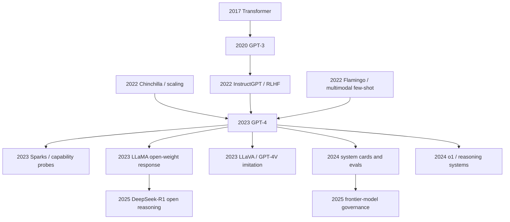

# GPT-4 Technical Report - Capability Leap and the Black-Box Technical Report

> **March 14, 2023. Just 104 days after ChatGPT made large language models a mass-market product, OpenAI uploaded [arXiv:2303.08774](https://arxiv.org/abs/2303.08774): no parameter count, no dataset recipe, no architecture diagram, no training compute, no code, but a wall of results that reset the field's expectations.** GPT-4 moved from GPT-3.5's bottom-decile performance on the Uniform Bar Exam to the top decile, reached 86.4% on MMLU, 67.0% on HumanEval, and made images part of the same reasoning loop as text. The paper's historical tension is exactly that: it is the strongest public evidence of a capability jump after GPT-3 and ChatGPT, and at the same time a marker of a new genre in AI research, where frontier systems are documented through benchmark tables, safety mitigations, scaling-law hints, and selective disclosure rather than reproducible recipes.

## TL;DR

OpenAI's 2023 GPT-4 Technical Report is not a conventional paper that introduces a named module; it is a system evidence packet for a frontier model. It combines [GPT-3](../era4_foundation_models/2020_gpt3.md)-style autoregressive language modeling, [InstructGPT](../era4_foundation_models/2022_instructgpt.md)-style human-feedback alignment, and multimodal input handling inside one closed system; it manages training risk through predictable scaling behavior such as $L(C)=L_\infty+aC^{-\alpha}$, then turns raw capability into an interactive product with an RLHF-shaped objective $\max_\pi \mathbb{E}[r_\phi(x,y)-\beta\mathrm{KL}(\pi\|\pi_0)]$. The failed baseline it displaced was not a single architecture, but the GPT-3.5-era ceiling across exams, coding, math, and safety: bottom decile to top decile on the Uniform Bar Exam, roughly 70% to 86.4% on MMLU, 48.1% to 67.0% on HumanEval, and an 82% reduction in disallowed-content responses on OpenAI's internal safety evaluation. The counter-intuitive lesson is that GPT-4's most influential “method” was not disclosed at all: a black-box technical report became the template for Gemini, Claude, Llama 2/3, DeepSeek, Qwen, and almost every later frontier-model report, while also provoking open-weight catch-up lines such as LLaMA and open multimodal instruction tuning such as LLaVA.

---

## Historical Context

### The missing link before March 2023

Before the GPT-4 Technical Report appeared, two facts about language models were already clear. First, GPT-3 had shown that a decoder-only Transformer could acquire in-context learning through scale. Second, ChatGPT had shown that the same class of model, once instruction-tuned and aligned with human feedback, could become a product ordinary users opened every day. But a gap remained between those facts: GPT-3 was a few-shot learner in a paper, ChatGPT was a conversational product, and the community did not know what a next-generation frontier model had to do to cross harder thresholds in exams, coding, multilingual use, visual input, and safety constraints.

OpenAI's 2020 GPT-3 paper still disclosed many training details: parameter count, model sizes, dataset scale, batch size, learning rate, training tokens. By the 2022 InstructGPT paper, the focus had already moved from the pretraining recipe to RLHF, preference data, and online safety behavior. By GPT-4 in 2023, the public text had shifted again into a capability-and-risk report. That shift was not merely a writing style; it reflected a change in the social structure of frontier AI research. Training one model now required company-scale compute and private data; the model was directly connected to paid products; risk evaluation and policy communication became part of the paper; the older research contract of “publish a recipe so others can reproduce it” was greatly weakened.

That is why the GPT-4 Technical Report occupies such an unusual historical position. It was not the first large language model paper, not the first RLHF paper, and not the first multimodal model paper. Its value was that it made these lines converge into one publicly visible capability jump. The report disclosed enough measurements to convince the outside world that GPT-4 was not a small GPT-3.5 tuning upgrade, while withholding enough information to make reproduction impossible from the paper alone. This contradiction became the default background of AI research after 2023: the most important models were often the hardest to reproduce, and the most complete public artifacts were benchmark tables, system cards, safety statements, and API behavior.

### The three steps from GPT-3 to ChatGPT

The first step was GPT-3. Brown and coauthors showed in 2020 that if a decoder-only Transformer was scaled to 175B parameters and trained on hundreds of billions of tokens, it could solve translation, question answering, cloze completion, arithmetic, commonsense reasoning, and many other tasks from a few examples. GPT-3's central lesson was that a single next-token objective could absorb many task formats. Its weaknesses were equally visible: hallucination, weak refusal behavior, unstable instruction following, unreliable math and code, and exam performance far below professional thresholds.

The second step was InstructGPT. Ouyang and coauthors in 2022 linked supervised instruction tuning, reward modeling, and PPO so that a model learned to answer according to human preferences. This did not radically change the underlying pretraining objective, but it changed the model's personality at the interface: the same language capability was repackaged as an assistant that followed instructions, refused some dangerous requests, and produced structured answers. ChatGPT was the product-scale amplification of that line. After its November 2022 launch, it reached 100M monthly active users in roughly two months and forced the industry to accept that LLMs were no longer research demos.

The third step was GPT-4. The report did not say how many parameters the model had, nor how images were connected to language modeling, but the results showed that it was not merely a better chatbot. It advanced simultaneously on exams, programming, math, long-form text, multilingual understanding, and visual reasoning. Uniform Bar Exam, LSAT, GRE, AP tests, MMLU, HumanEval, and GSM8K covered multiple cognitive surfaces; safety evaluations showed that alignment had become part of model capability rather than a deployment-time patch. GPT-4 pushed the “language model” toward a general task interface: users provide text or images, and the system returns textual behavior that can execute, explain, refuse, and be audited.

### Why the GPT-4 report reads like a system card

The strongest impression when reading the GPT-4 Technical Report is that it does not teach you how to train the model the way GPT-3 did. It tells regulators, customers, researchers, and competitors what the system can do, what it cannot do, and how risks were treated. The report centers predictable scaling, public benchmarks, professional exams, multilingual evaluation, visual inputs, safety mitigations, limitations, and social impact. Pretraining data, model size, optimizer details, architectural changes, and total training compute are omitted.

That made it the beginning of a new genre: the frontier model report. Later Gemini technical reports, Claude system cards, the Llama 2 paper, GPT-4o system cards, and OpenAI o1 system cards all follow a similar shape: capability tables first, safety tables next, known risks acknowledged, core recipe withheld. The benefit of this genre is that society sees model capability and risk quickly. The cost is that scientific reproducibility is traded for platform credibility. GPT-4 was not the only cause of that trade, but it was the clearest dividing line.

## Background and Motivation

The GPT-4 Technical Report had three real motivations. The first was to show that ChatGPT's explosion was not a lucky packaging of GPT-3.5, but evidence that OpenAI had built an engineering system for predictably training stronger models. The report explicitly emphasizes that the team could extrapolate final loss from smaller models and even anticipate trends on capability metrics such as HumanEval before the full training run completed. This was a signal to internal engineers and external investors alike: frontier training was not gambling, but a manageable industrial process.

The second motivation was to reset the benchmark ruler. By late 2022, many NLP benchmarks had already been pushed high by GPT-3.5, PaLM, Flan-PaLM, and Chinchilla, but exams, math, code, and multilingual tests could still separate models. GPT-4 presented these metrics together, declaring older baselines insufficient while forcing the research community to search for harder evaluation: long-horizon tasks, agentic evaluation, real tool use, expert red-teaming, and safety case studies. In other words, GPT-4 did not merely win benchmarks; it made many benchmarks lose their old resolution.

The third motivation was to establish the narrative of “capability release plus risk mitigation.” When GPT-4 launched, public debate had already turned to cyber abuse, chemical and biological risks, deception, privacy leakage, and educational cheating. The report placed red-teaming, safe refusal, factuality improvements, and model-assisted evaluation inside the technical text, effectively acknowledging that safety was no longer an appendix to deployment documentation but part of the frontier model paper itself. This strongly shaped later large-model releases: a capability report without safety evaluation came to look incomplete.

### The deliberately blank method section

The most anomalous aspect of GPT-4 is the gap between the words “Technical Report” and the degree of method disclosure. A traditional technical report answers “what is the model, what is the data, how was it trained, and where did it fail?” GPT-4 answers “how does it perform, how do we know it is stronger, and what risk mitigations did we apply?” That is not an oversight. The report explicitly states that, because of competitive and safety concerns, it does not disclose architecture, hardware, training compute, dataset construction, or training-method details.

This blank space changes how the reader must read the paper. We cannot reproduce modules the way we can with ResNet or Transformer; we can only infer the system design from results. It must inherit GPT-style autoregressive pretraining; it must use instruction tuning and RLHF; it must rely on predictable training infrastructure; it likely connects a visual encoder or visual tokens to the language model; it must include red-teaming, filtering, policies, and post-training safety layers. These inferences are not a complete recipe from the paper; they are a “shadow method” read from the evidence structure. A deep note on GPT-4 therefore should not pretend it is a transparent architecture paper. It is better understood as a turning point: the capability leap is real, and the methodological black box is real too.

---

## Method Deep Dive

A method deep dive for the GPT-4 Technical Report must begin by admitting a fact: the paper does not disclose enough of a training recipe to reproduce the model. It contains no layer count, parameter count, data mixture, token budget, optimizer, hardware scale, visual-interface design, RLHF data scale, or code. The “method” here is therefore not a reconstruction of OpenAI's internal recipe. It is a decomposition of the technical structure explicitly disclosed by the report, the system design constrained by the results, and the consensus that formed afterward. GPT-4's methodological contribution is not a named module; it is the linking of four pieces into a frontier-model production process: predictable pretraining, multimodal input, preference alignment and safety post-training, and evaluation-centered release decisions.

### Overall framework: the smallest public system description

The report is deliberately restrained about the model itself: GPT-4 is a large multimodal model that accepts image and text inputs and produces text outputs; it substantially outperforms GPT-3.5 on public benchmarks and real exams; its training behavior is predictable; and it underwent multiple rounds of safety evaluation and mitigation before release. Compressing those facts into the smallest public system description gives the following abstraction:

| Layer | Public evidence | Reasonable inference | Undisclosed content |
|---|---|---|---|
| Pretraining | Training behavior is predictable; loss can be extrapolated from smaller models | Large autoregressive Transformer remains the core | Parameter count, token count, data mixture |
| Multimodality | Image + text input, text output | Visual representations are mapped into tokens/embeddings consumable by the LM | Visual encoder, alignment data, fusion method |
| Post-training | GPT-4 refuses dangerous requests better than GPT-3.5 | SFT, RLHF, rule constraints, and red-team feedback all shape behavior | Preference-data scale, reward-model structure |
| Evaluation | Exams, MMLU, HumanEval, GSM8K, safety sets | Release is gated by both capability and risk evaluation | Full internal eval suite, thresholds, failure samples |
| Deployment | ChatGPT Plus / API staged rollout | System prompts, tool layers, monitoring, and rate limits sit outside the model | Complete product-side safety stack |

Writing GPT-4 as if it were a transparent architecture would mislead the reader. A more accurate description is a system made from model, post-training, evaluation, and deployment constraints. Each result in the report is not simply the raw capability of a pretrained model, but behavior shaped jointly by prompts, alignment, refusal policy, and evaluation protocol.

### Key design 1: predictable scaling as training insurance

The most traditionally machine-learning-like part of the GPT-4 report is its emphasis on scaling prediction. OpenAI writes that it could predict some properties of GPT-4's final loss from smaller models trained with 1/1,000 to 1/10,000 of the compute. This is not curve-fitting theater; it is risk control for frontier training. When a full training run can cost tens of millions of dollars, one cannot wait until the end to discover that the data mixture, optimizer, or architecture choice was wrong.

The core form is a power law with an irreducible term:

$$
L(C) = L_\infty + a C^{-\alpha},
$$

where $C$ is training compute, $L_\infty$ is irreducible loss from the data distribution and objective, and $a$ and $\alpha$ are fitted from smaller model runs. The point of the formula is not that every benchmark can be explained exactly by loss; it is that “will a larger model continue improving?” becomes an engineering hypothesis that can be tested before the full run.

The report also shows predictability for HumanEval: coding benchmark behavior extrapolated from much smaller models. Because pass@1 is probabilistic, real prediction is typically done in a logit-like transformed space rather than by linearly extrapolating percentages:

$$
\mathrm{logit}(p_\text{pass}) = b_0 + b_1 \log C + b_2 L(C).
$$

| Prediction target | Why it matters | Meaning in the GPT-4 report | Limitation |
|---|---|---|---|
| Pretraining loss | Most stable and earliest observable signal | Training infrastructure is controlled enough to extrapolate | Does not equal user experience |
| HumanEval | Early proxy for coding ability | Some capabilities can be extrapolated from small models | Benchmark can be contaminated or saturated |
| Exam percentile | Communicates to society | Makes the capability jump legible to non-specialists | Exams are not complete intelligence measures |
| Safety refusal | Controls deployment risk | Post-training changes behavior distribution | Over-refusal and jailbreak robustness are hard to balance |

This scaling design carries an easily missed lesson: GPT-4's “innovation” was not only training a bigger model, but making large-model training into a predictable industrial process. Later frontier labs emphasize eval-driven development, pretraining prediction, and model cards partly because GPT-4 publicly stabilized that story.

### Key design 2: multimodal input inside one textual behavior interface

GPT-4 is multimodal, but the public output remains text. It accepts images and text and generates textual answers. This shares a core idea with Flamingo, BLIP-2, LLaVA, and other vision-language systems: convert visual information into continuous representations that a language model can condition on, then let the language model generate over a unified token sequence. The abstract objective can be written as:

$$
\mathcal{L}(\theta) = -\sum_{t=1}^{T} \log p_\theta(y_t \mid y_{<t}, x_\text{text}, f_\psi(x_\text{image})),
$$

where $f_\psi$ is a visual encoder or visual adapter, $x_\text{text}$ is the textual context, and $y_t$ is the output token. The report does not specify how $f_\psi$ is implemented, nor how visual and textual data are mixed during training. But the behavior suggests that GPT-4's visual ability is not merely image classification: it can treat images as reasoning context by reading charts, explaining memes, recognizing sketched interfaces, and combining visual clues in multi-step questions.

| Multimodal route | How image enters the LM | Advantage | Risk |
|---|---|---|---|
| Caption then QA | Image first becomes text | Simple and controllable | Visual detail is lost early |
| Visual-token prefix | Image becomes continuous tokens | End-to-end alignment possible | Requires large image-text data |
| Cross-attention to visual features | LM layers access visual memory | Expressive | More complex system |
| Tool-style OCR/detection | External tools produce structured results | Interpretable and replaceable | Depends on tool quality |

The importance of the GPT-4 report is not that it revealed which route was used, but that it proved “image input + general language reasoning + conversational interface” was mature enough to appear as one product system. GPT-4V, Gemini, Claude 3, LLaVA, and Qwen-VL all continued this problem: not training a model that merely sees images, but making vision part of a general assistant's context.

### Key design 3: RLHF and safety post-training turn capability into product behavior

GPT-4's raw capability is strong, but the report repeatedly emphasizes safety mitigation, refusal, factuality, and red-teaming. That means post-training is not optional decoration; it defines the system. Following the public InstructGPT line, the minimal alignment objective can be written as preference optimization with a KL constraint:

$$
\max_\pi \; \mathbb{E}_{x,y\sim\pi}[r_\phi(x,y)] - \beta\,\mathrm{KL}(\pi(\cdot\mid x)\,\|\,\pi_0(\cdot\mid x)),
$$

where $\pi_0$ is the reference model, $r_\phi$ is a reward model or preference scorer, and $\beta$ controls “do not drift too far just to please the reward model.” GPT-4's real system is almost certainly more complex than this formula: supervised instruction data, preference comparisons, refusal examples, red-team attacks, policy text, tool-use limits, and online monitoring all shape behavior.

| Post-training component | Role | Evidence in the GPT-4 report | Typical side effect |
|---|---|---|---|
| SFT | Learn instruction-following format | More stable conversational and exam answers | May imitate training-answer style |
| Reward model / preference optimization | Improve human preference ratings | More useful and safer than GPT-3.5 | Reward hacking and sycophancy |
| Safety refusal data | Reduce dangerous responses | 82% lower disallowed-response rate | Over-refusal of benign requests |
| Red-team feedback | Expose rare high-risk modes | Report lists multiple risk categories | Cannot cover the open world |

GPT-4's alignment method has another implicit design: it optimizes not only “answer well,” but also “know when not to answer.” This turns a language model from a text completer into an interaction system constrained by policy. For users, that appears as refusals, caveats, step-by-step explanations, and safer alternatives. For researchers, it means evaluations must distinguish base capability, post-trained behavior, and product policy.

### Key design 4: evaluation-driven system engineering

The GPT-4 report elevates evaluation itself to the method layer. Whether a model deserves release is no longer judged only by validation loss; it depends on a suite of metrics covering capability, robustness, safety, bias, and real use. The pseudocode below is not OpenAI's internal script, but the eval-driven workflow embodied by the GPT-4 report:

```python
def frontier_release_gate(model, eval_suites, policy):
    report = {}
    for suite in eval_suites:
        prompts = suite.load_prompts()
        outputs = model.generate(prompts, system_policy=policy)
        scores = suite.score(outputs)
        report[suite.name] = scores

    capability_ok = all(report[k].meets_target for k in policy.capability_suites)
    safety_ok = all(report[k].risk <= policy.max_risk[k] for k in policy.safety_suites)
    regression_ok = not any(report[k].regressed for k in policy.must_not_regress)

    if capability_ok and safety_ok and regression_ok:
        return "release", report
    return "mitigate_or_retrain", report
```

| Evaluation type | Representative metric | Question being tested | Back-pressure on method |
|---|---|---|---|
| Academic benchmark | MMLU, HellaSwag, GSM8K, MATH | Did general knowledge and reasoning improve? | Stronger pretraining and data quality |
| Professional exam | Bar, LSAT, GRE, AP | Does ability transfer to institutional human tasks? | More stable long-question understanding |
| Coding evaluation | HumanEval | Can it generate executable programs? | Code data and reasoning ability |
| Multilingual evaluation | translated MMLU | Does non-English ability hold? | Cross-lingual data and tokenizer design |
| Safety evaluation | disallowed requests, hallucination probes | Can it refuse dangerous prompts and reduce error? | Post-training, red teams, policy constraints |

This evaluation-driven engineering later became common sense in large-model development. Models are not merely evaluated after training; they are pulled by evals before training, during training, during post-training, and before release. GPT-4's contribution was showing the outside world how a frontier-model release argument is built jointly from capability tables, safety tables, and limitation tables.

### How to read it: treat the blank space as method

GPT-4's method section is incomplete, and that incompleteness is precisely what must be interpreted carefully. The blank space communicates three things. First, frontier capability is no longer a single module but an entire system of data, compute, training stability, alignment, evaluation, and deployment; disclosing any one part would not be enough for reproduction. Second, safety and competition are used to redefine the boundary of academic disclosure; that can protect model developers, but it weakens external audit. Third, readers are forced to shift from “learn the recipe” to “audit the evidence”: are the results credible, are the evaluations sufficient, are risks understated, and would undisclosed information change the conclusion?

The method lesson of the GPT-4 Technical Report can therefore be compressed into one sentence: once models enter company-scale infrastructure and society-scale impact, method is no longer only an algorithm diagram, but the whole production line from scaling prediction to safety gating. That lesson later produced two simultaneous directions: closed frontier labs wrote more systematic model cards and system cards, while the open community rebuilt reproducible alternatives through LLaMA, LLaVA, Mistral, Qwen, and DeepSeek.

---

## Failed Baselines

The GPT-4 Technical Report is not a transparent algorithm paper with ablation tables, so “failed baselines” cannot be written as exact module replacements. A better reading is that GPT-4 invalidated several baselines that looked strong enough before late 2022. It showed that chatbot packaging, text-only scaling, narrow benchmark chasing, and the traditional expectation of an open recipe could not fully explain frontier-model capability and impact.

### Baseline 1: the ceiling of GPT-3.5-level chat models

ChatGPT gave the public its first visceral sense that LLMs were usable, but GPT-3.5 still had clear ceilings. It could write emails, explain code, and rewrite copy, yet remained unstable on professional exams, difficult math, long-chain code generation, and adversarial safety prompts. The GPT-4 report broke this baseline in the most communicable way: as a conversational model, GPT-4 moved from GPT-3.5's bottom-decile performance on the Uniform Bar Exam to the top decile. That is not “nicer wording”; it is a jump across an institutional professional threshold.

The failure of this baseline shows that RLHF alone cannot make an assistant sufficient. Underlying pretraining capability, reasoning stability, code data, multi-round evaluation, and safety post-training must all improve together. GPT-3.5's success made it tempting to think product-layer optimization was enough; GPT-4 showed that the product layer is the entrance, while the capability layer still sets the ceiling.

### Baseline 2: text scaling without alignment and safety

GPT-3, PaLM, and Chinchilla proved the power of scaling, but they were mostly discussed as base models or limited dialogue systems. The GPT-4 report places the model in a real product context: users ask dangerous questions, induce hallucination, request legal or medical advice, upload images, and probe earlier answers. Lower loss alone cannot guarantee that a system is deployable in those settings.

This baseline did not fail because scaling is unimportant. GPT-4 depends heavily on scaling. What failed was treating scaling as the only method. GPT-4 binds scaling, RLHF, red-teaming, safety policy, and release gating together, showing that frontier-model engineering had shifted from “train a model that predicts tokens better” to “deploy a stronger but more controlled interaction system.”

### Baseline 3: narrow benchmark specialists and leaderboard thinking

Before GPT-4, many models could report attractive scores on individual benchmarks: one reading-comprehension set, one math set, one code set, one multilingual classification set. GPT-4's threat was breadth. It improved MMLU, HumanEval, GSM8K, MATH, professional exams, multilingual MMLU, and image-input examples simultaneously, and those capabilities appeared inside one dialogue interface. Narrow expert baselines can explain single-point wins; they cannot explain this cross-domain transfer.

After GPT-4, leaderboard thinking began to show its limits. Whether a model is truly strong is no longer judged only by its score on one public test set; it also depends on consistent behavior across unfamiliar tasks, complex instructions, long contexts, multimodal evidence, tool interfaces, and safety constraints. That is why agent benchmarks, real-task evaluations, red-team evaluations, and arena-style comparisons rose so quickly after 2023.

### Baseline 4: the reproducibility expectation of transparent papers

Another failed baseline is more uncomfortable: the academic community expected top technical reports to disclose enough recipe for outside researchers to reproduce or at least narrow the gap. GPT-4 explicitly broke that expectation. It established authority through results while withholding core training details. As a capability demonstration, the report was extremely successful; as an open-science artifact, it was a stress test.

The failure of this baseline led to two later routes. Closed labs continued to publish reports that looked more like system cards, bringing safety, product constraints, and policy into the technical text. The open community moved in the opposite direction, pursuing reproducible alternatives through LLaMA, Mistral, Qwen, DeepSeek, LLaVA, and related projects. GPT-4 did not kill open research, but it forced open research to accept that the recipe for the frontier system might no longer be published by the frontier paper.

| Failed baseline | How GPT-4 broke it | Key evidence | Later impact |
|---|---|---|---|
| GPT-3.5 chat capability | From usable assistant to top professional-exam performance | Bar exam bottom 10% to top 10% | Chatbot no longer looked like a low-risk toy |
| Text scaling alone | Capability and safety must be evaluated together | 82% fewer disallowed responses | Safety eval entered the model-report body |
| Narrow benchmark specialist | Multi-domain capability improved together | MMLU, HumanEval, GSM8K all rose | Pushed harder and more realistic evaluation |
| Transparent recipe expectation | Results disclosed, method withheld | No parameter count, data, compute, or code | Open community pursued alternative reproduction |

## Key Experimental Data

The GPT-4 report's experimental data can be grouped into four categories: professional exams, public academic benchmarks, multilingual and multimodal evaluation, and safety/factuality. Together they turn “the model feels smarter” into cross-scenario evidence. One caveat matters: many numbers come from OpenAI's chosen evaluation protocols. Different prompts, tools, sampling settings, and post-training versions can change scores, so the trend and scale should be read more seriously than any individual decimal point.

### Professional exams: the capability jump society could understand

| Evaluation | GPT-4 result | GPT-3.5 comparison | Reading |
|---|---:|---:|---|
| Uniform Bar Exam | top 10% | bottom 10% | Crossed a legal-qualification threshold |
| LSAT | about 88th percentile | about 40th percentile | Stronger long-question logic and reading |
| GRE Verbal | about 99th percentile | about 63rd percentile | Very strong language and verbal reasoning |
| GRE Quantitative | about 80th percentile | about 25th percentile | Strong math, but not perfect |
| GRE Writing | about 54th percentile | about 54th percentile | Writing score did not rise equally |
| Biology Olympiad | about 99th percentile | about 31st percentile | Specialized knowledge plus reasoning |

Exam data matters not because exams equal intelligence, but because they map model capability onto institutional measures that society already understands. GPT-4's performance on the Bar, LSAT, GRE, AP tests, and olympiad-style questions made it clear to non-technical audiences that this was not just better small talk; it was a system crossing professional thresholds. That is why GPT-4 had such force in regulation, education, and knowledge work.

### Academic and coding benchmarks: old rulers pushed upward

| Benchmark | GPT-4 | GPT-3.5 / nearby baseline | Main measured surface |
|---|---:|---:|---|
| MMLU | 86.4% | GPT-3.5 about 70.0% | Multidiscipline knowledge and reasoning |
| HellaSwag | 95.3% | GPT-3.5 about 85.5% | Commonsense completion |
| AI2 ARC Challenge | 96.3% | GPT-3.5 about 85.2% | Grade-school science reasoning |
| WinoGrande | 87.5% | GPT-3.5 about 81.6% | Pronoun disambiguation |
| GSM8K | 92.0% | GPT-3.5 about 57.1% | Grade-school math word problems |
| MATH | 42.5% | GPT-3.5 about 34.1% | Competition math, still unsaturated |
| HumanEval | 67.0% | GPT-3.5 about 48.1% | Python code generation |

Two details in this table matter. First, MMLU at 86.4% means GPT-4 approached or exceeded human expert performance in some subfields, but did not solve everything; MATH at 42.5% shows that hard math still had enormous headroom. Second, HumanEval at 67.0% moved coding ability from “can help write snippets” to “often generates runnable functions,” directly feeding the commercial explosion of coding assistants after 2023.

### Multilingual and visual evaluation: from English model to general interface

The GPT-4 report tested translated MMLU in 26 languages and stated that GPT-4 exceeded English GPT-3.5 performance in 24 of them. This is important: in the GPT-3 era, strong capability appeared first in English. GPT-4 suggested that high-level frontier-model reasoning could transfer through cross-lingual representations into lower-resource languages, even though gaps between languages remained.

The visual section reads more like capability demonstration than a complete public benchmark. The report shows examples of image understanding, chart reasoning, visual humor explanation, and handwritten sketch-to-website behavior, emphasizing that GPT-4 can treat an image as reasoning context. Those examples were later systematized by GPT-4V and Gemini releases. Their meaning is not the individual demos; it is that the model interface moved from a “text box” toward part of the world state: images, documents, webpages, and screenshots can enter the same reasoning loop.

| Capability surface | Report evidence | Why it matters | Unresolved issue |
|---|---|---|---|
| Multilingual MMLU | Translated evaluation in 26 languages | Non-English capability is much stronger | Low-resource languages remain uneven |
| Image understanding | Chart, meme, and sketch examples | Vision can become reasoning context | No full public visual score table |
| Document-style input | Long questions and complex instructions | Closer to real knowledge workflows | Context window is still finite |
| Code generation | HumanEval 67.0% | Coding assistants become commercializable | Large-project reliability remains weak |

### Safety and factuality: stronger capability makes refusal more important

The report states that, compared with GPT-3.5, GPT-4 is more likely to produce factual answers on internal adversarial factuality evaluations and less likely to comply with disallowed requests. The two most-cited numbers are an 82% reduction in responses to disallowed-content requests and a 40% improvement in factuality behavior. These numbers do not mean GPT-4 is safe; the report itself lists hallucination, jailbreaks, privacy, bias, overreliance, and potentially high-risk capabilities. They do show that safety evaluation had become core evidence in a capability report.

| Safety surface | Report number / description | Positive meaning | Remaining risk |
|---|---|---|---|
| Disallowed content | 82% lower response rate than GPT-3.5 | Refusal strategy works | Jailbreaks can still bypass it |
| Factuality | 40% higher on internal factuality eval | Hallucination reduced | Confident errors remain |
| Red-teaming | Multiple expert rounds before release | High-risk modes exposed | Cannot cover the open world |
| Limitation statement | Hallucination and reasoning errors acknowledged | Avoids pure overclaiming | Users may still overtrust it |

The deeper impact of this data is that it separates “is the model strong?” from “is the model releasable?” GPT-4 was strong enough to make many benchmarks lose resolution, but not strong enough to deploy without constraints. That tension became the core narrative of every later frontier model: capability is the selling point, safety is the admission condition, and evaluation is the bridge between them.

---

## Idea Lineage

GPT-4's idea lineage is the intersection of two lines. The first is technical: Transformer made long-range self-attention a scalable backbone; GPT-3 showed that autoregressive pretraining could produce few-shot behavior; InstructGPT attached preference alignment to the user interface; Chinchilla and scaling laws made training scale an engineering object. The second line is institutional: model capability moved closer to social infrastructure, papers began to look like system cards, and open reproducibility increasingly depended on secondary construction by the open community. GPT-4 sits at the crossing of these lines.

### Before: from Transformer to aligned assistants

GPT-4 did not appear from nowhere. It inherited the 2017 Transformer paradigm: self-attention lets every token read the context within a layer. It inherited GPT-3's autoregressive pretraining paradigm: next-token prediction over massive text makes task formats emerge. It inherited InstructGPT's alignment paradigm: human preferences reshape a text-completion model into an assistant that answers users. It also inherited the post-Chinchilla engineering consensus that parameters, data, and compute must be allocated according to predictable regularities.

The key point of this prehistory is not that each paper contributed one module to GPT-4, but that together they turned “general model” from an abstract aspiration into an engineering object. Transformer supplied the skeleton, GPT-3 supplied the belief in scale, InstructGPT supplied the interaction interface, scaling laws supplied training management, and multimodal work such as Flamingo supplied reference paths for image input. GPT-4 packaged these lines into a closed system.

### Now: the black-box report becomes a release template

The immediate consequence of GPT-4 was a change in how frontier models were released. The report established credibility with capability tables, safety tables, limitation statements, and a small amount of scaling evidence, while withholding the core recipe. This format later became almost an industry standard. Public artifacts for Gemini, Claude, GPT-4o, o1, Llama 2/3, DeepSeek, and Qwen differ in openness, but they all must answer the same questions: where is the capability, where is the risk, how was it evaluated, and what are the system boundaries?

This means GPT-4's intellectual influence exceeds the model itself. It specified how to talk about a frontier model. For closed companies, GPT-4 offered a template balancing trade secrets, safety narrative, and market communication. For the open community, it also provided a negative coordinate: if a closed report does not disclose the method, then open models must compete for trust with downloadable weights, training logs, data statements, and reproducible experiments.



### Misreading: GPT-4 is not a single magic module

The most common misreading of GPT-4 is imagining it as one mysterious architectural breakthrough: perhaps MoE, perhaps longer context, perhaps a new reasoning module. Because OpenAI did not disclose the architecture, such guesses cannot be ruled out completely. But the report itself makes GPT-4 look more like a systems-engineering victory than a single algorithmic victory. Its public evidence centers on scaling, alignment, evaluation, safety, and multimodal interface, not on a new block that can be drawn in a diagram.

Another misreading is treating GPT-4 as an endpoint close to AGI. The report and early experiments did show striking cross-domain ability, and Microsoft's Sparks report described GPT-4 as early sparks of general intelligence. But GPT-4 still hallucinates, makes simple reasoning errors, can be jailbroken, loses goals in long-horizon tasks, and is limited by context and tools. A more accurate position is that GPT-4 pushed language models into a capability region strong enough to reshape social imagination, but it did not solve reliable intelligence.

### Impact: open catch-up and governance evaluation accelerate together

After GPT-4, the open community reacted quickly. LLaMA weight leakage and the sequence of Alpaca, Vicuna, LLaVA, QLoRA, and related projects often framed themselves as attempts to reproduce GPT-4-style capability. They did not necessarily match GPT-4's overall capability, but they pulled reproducible experimentation back into the community: smaller models, more public data, cheaper fine-tuning, and more transparent evaluation.

Governance and evaluation also accelerated. By putting safety, factuality, red-teaming, and social impact inside a technical report, GPT-4 forced later releases to face the same questions: can the model help attack systems, create chemical or biological risk, deceive users, leak private information, or be over-relied upon in consequential decisions? GPT-4's intellectual meaning is therefore double-sided: it expanded imagination about what models can do, and it expanded the responsibility of model developers to explain what they are releasing.

| Idea thread | Form before GPT-4 | GPT-4 turning point | Later inheritors |
|---|---|---|---|
| Autoregressive pretraining | GPT-3 few-shot learner | Capability enters professional-exam range | Gemini, Claude, Llama 3 |
| Human-feedback alignment | InstructGPT / ChatGPT | Safety and usefulness become core metrics | DPO, RLHF variants, RLAIF |
| Multimodal interface | Flamingo / BLIP-2 explorations | Images enter the general assistant loop | GPT-4V, Gemini, LLaVA |
| Model-report genre | Traditional paper + model card | Black-box technical report becomes template | System cards, frontier eval reports |
| Open catch-up | OPT / BLOOM underpowered | GPT-4 becomes the target to chase | LLaMA, Mistral, Qwen, DeepSeek |

---

## Modern Perspective

### Looking back from 2026: what changed?

From the vantage point of 2026, the influence of the GPT-4 Technical Report has three layers. The first is capability expectation. GPT-4 made the industry believe that one general conversational model could pass professional exams, write executable code, understand images, answer across languages, and do all of this in one product interface. It moved the imagination of LLMs from “search-augmented writing tool” toward “entry point for a knowledge-work operating system.”

The second layer is release convention. After GPT-4, public artifacts for frontier models were rarely only papers. They became packages: technical report, system card, safety evaluation, red-team summary, API policy, product demo. Even open model releases often imitate this structure, providing benchmark tables, risk statements, model weights, training recipes, and usage restrictions. GPT-4 did not invent the model card, but it made the “system-level report” the default language of top-tier models.

The third layer is competition. GPT-4's closed strong capability stimulated two opposite movements: closed companies accelerated model capability and product moats; the open community accelerated the decomposition of GPT-4-style behavior into reproducible parts. LLaMA, LLaVA, QLoRA, Mistral, Qwen, DeepSeek, Claude, and Gemini can all be read as answers after the GPT-4 moment: chasing its capability, replacing its openness, or redefining its evaluation.

### Judgments that still hold today

Several judgments in the GPT-4 report still hold in 2026. First, predictable scaling is infrastructure for frontier training, not paper decoration. Gemini, Claude, Llama, DeepSeek, and other lines all show in different ways that large-model development must manage risk before training with small-scale experiments, data-quality evaluation, and intermediate evals.

Second, post-training determines product personality. DPO, RLAIF, Constitutional AI, process reward models, and reasoning RL all differ in detail, but they accept the same premise: base-model capability must be reshaped by preferences, policies, and task objectives before it becomes an interactive system. The GPT-4 report moved this fact from product practice into technical writing.

Third, evaluation must cover safety. Before 2023, many model reports treated safety as an appendix. After GPT-4, a frontier release without safety evaluation looks incomplete. Today's model releases must address hallucination, bias, privacy, jailbreaks, cyber, biosecurity, overreliance, and misuse. That frame was largely stabilized in the GPT-4 era.

| Judgment that still holds | 2023 evidence | 2026 status | Explanation |
|---|---|---|---|
| Scaling is predictable | Loss extrapolated from small models | Frontier labs widely use prediction and evals | Reduces risk in expensive training |
| Post-training is core | GPT-4 is safer and more useful than GPT-3.5 | RLHF/DPO/RLAIF become standard layers | Product behavior is not raw model behavior |
| Multimodality is default | Image + text input | GPT-4V, Gemini, Claude, Qwen-VL spread | Assistants need to read world state |
| Safety eval is mandatory | 82% fewer disallowed responses | System cards become routine artifacts | Capability release needs risk argument |
| Disclosure will shrink | Recipe withheld for competition and safety | Closed reports remain black-boxed | External audit pressure rises too |

### Assumptions that no longer hold

Some implicit 2023 assumptions aged poorly. First, the assumption that closed strong capability could not be chased weakened. LLaMA, Mistral, Qwen, DeepSeek, and other open or open-weight models kept narrowing gaps, especially in code, math, long context, and reasoning distillation, decomposing GPT-4-style behavior into components the community could optimize.

Second, the assumption that high benchmark scores are enough to show general reliability did not survive. GPT-4 scores were high, but users quickly found fabricated citations, drift in long-horizon tasks, and weak grounding in environment state. Agent evals, arenas, real software-engineering tasks, and long-horizon planning tests emerged to cover blind spots in static benchmarks.

Third, the assumption that RLHF would be enough for safety did not hold. RLHF improves refusal and usefulness, but does not eliminate jailbreaks, deception, bias, or high-risk knowledge misuse. By 2026, safety research had moved toward fuller threat modeling, agent monitoring, constitutional training, interpretability, secure tool use, and governance processes rather than relying on one reward model.

## Limitations and Future Directions

### Technical limitations

The GPT-4 report itself acknowledges hallucination, reasoning mistakes, outdated knowledge from cutoff dates, inability to continually learn from experience, sensitivity to prompting, and biased or harmful outputs. From today's perspective, those limitations remain accurate. Stronger models reduce error frequency, but they do not solve the root problem that linguistic likelihood is not factual constraint. In law, medicine, finance, and science, the most dangerous output is not obvious nonsense, but a subtle error delivered in a confident tone.

Multimodal ability has limitations as well. Image input lets the model read charts, sketches, and screenshots, but that is not the same as stable visual reasoning. A model can miss small objects, misread spatial relations, be affected by visual prompt injection, or reason downstream from OCR errors. Integrating vision into the language interface is a key step toward general assistants; reliable understanding of real-world state still requires stronger perception, tool verification, and environmental feedback.

### Open-science limitations

GPT-4's largest academic limitation is non-reproducibility. The report gives no parameter count, data recipe, training compute, model architecture, or complete evaluation details. External researchers can test API behavior but cannot audit the training process. This makes GPT-4 difficult for the scientific community to absorb in the traditional sense: it can be used, compared, imitated, and criticized, but not independently reproduced.

That limitation also has safety costs. The stronger the model, the more important external audit becomes; the fewer core details are disclosed, the more audit depends on developer self-report. The black-box disclosure pattern opened by GPT-4 later triggered persistent debate: safety reasons are real, but safety also needs transparency. A more reasonable future may be neither full public recipe nor total black box, but layered disclosure, controlled audits, third-party evals, red-team access, and post-hoc traceability records.

### If rewritten today

If the GPT-4 Technical Report were rewritten in 2026, it should add at least four kinds of content. First, richer eval provenance: prompts, sampling settings, tool use, filtering, contamination checks, and confidence intervals for each benchmark. Second, more failure samples rather than only average scores, so users can see which question types, languages, images, and safety scenarios break the model. Third, independent third-party evaluations, separating developer self-evaluation from external audit. Fourth, a layered explanation of multimodal and deployment stacks, at least distinguishing base model, post-trained model, system prompt, tool layer, and product policy.

Looking forward, the post-GPT-4 question has moved from “can the model answer?” to “can the model reliably complete long-horizon tasks?” Future frontier reports need to cover agentic behavior, tool-use safety, long-horizon memory, self-correction, secure sandboxing, provenance, model monitoring, and governance interfaces. GPT-4 brought models into society; later work must answer how society can keep models inside boundaries that are verifiable, accountable, and correctable.

## Related Work and Insights

### Direct inheritance

GPT-4 directly inherits the core threads of GPT-3, InstructGPT, ChatGPT, Flamingo, Chinchilla, and related work. GPT-3 supplied the capability basis of large-scale autoregressive pretraining. InstructGPT supplied the interaction basis of preference alignment. ChatGPT supplied the product form. Flamingo and other vision-language models supplied multimodal conditioning ideas. Chinchilla and scaling-law work supplied the language for managing training scale.

GPT-4's successors then split into three directions. Closed routes include GPT-4V, GPT-4o, Gemini, Claude, and o1, focusing on multimodality, long context, tool use, and inference-time computation. Open routes include LLaMA, Llama 2/3, Mistral, Qwen, DeepSeek, Mixtral, LLaVA, and Qwen-VL, focusing on decomposing closed capability into trainable, downloadable, fine-tunable models. Method routes include DPO, RLAIF, Constitutional AI, process reward models, test-time compute, and agent evaluation, focusing on replacing or strengthening the opaque post-training and evaluation components inside GPT-4.

### Lessons for later papers

GPT-4's biggest lesson for later research is that “model capability” is a systems problem, not a single number. A post-GPT-4 large-model paper cannot only report parameter count and benchmarks; it also needs to explain data governance, evaluation contamination, preference optimization, safety boundaries, deployment interface, failure cases, and cost. Even fully open models need a more complete reporting structure to earn trust.

The second lesson is that closed black boxes create open opportunities. Because GPT-4's method was not public, the community had incentives to reproduce its visible behavior. LLaVA reproduced GPT-4V-style visual dialogue; QLoRA lowered the cost of large-model fine-tuning; DPO simplified preference optimization; DeepSeek-R1 showed the viability of open reasoning RL. None of these works is a copy of GPT-4, but all answer the same question: when the frontier model's recipe is not disclosed, which capabilities can be decomposed, rebuilt, and democratized?

## Resources

### Papers and official materials

| Resource | Link | Use |
|---|---|---|
| GPT-4 Technical Report | https://arxiv.org/abs/2303.08774 | Original technical report |
| OpenAI GPT-4 announcement | https://openai.com/research/gpt-4 | Release background and product context |
| GPT-4 system card appendix | arXiv appendix | Safety evaluation and mitigations |
| Sparks of AGI | https://arxiv.org/abs/2303.12712 | Early capability probes and controversial interpretation |
| InstructGPT | https://arxiv.org/abs/2203.02155 | RLHF predecessor |
| GPT-3 | https://arxiv.org/abs/2005.14165 | Large-scale few-shot predecessor |

### Suggested reading path

To understand GPT-4's technical prehistory, read GPT-3 and InstructGPT first, then Chinchilla / scaling-law papers, then the GPT-4 Technical Report. This order makes it clear how pretraining scale, alignment, and predictable engineering converge. To understand GPT-4's social impact, read the safety and limitations sections of the report, then system cards, Sparks of AGI, and later Gemini / Claude / Llama 2 model cards. This path shows how the frontier-model genre changed.

For research, the most valuable direction is not guessing GPT-4's internal parameter count, but working along the gaps it exposed: more transparent evals, more reliable long-horizon agents, better multimodal grounding, cheaper preference optimization, stronger third-party audit, and more controllable tool use. GPT-4 is a high wall, but it also marked which bricks matter most.


---

> 🌐 [中文版](/era5_genai_explosion/2023_gpt4/) · 📚 awesome-papers project · CC-BY-NC