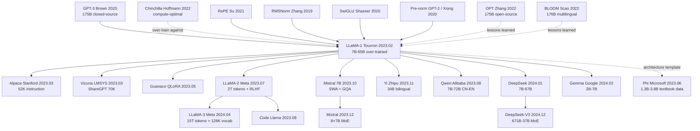

# LLaMA — How Smaller Parameters + More Tokens Helped Open-Source LLMs Catch Up to GPT-3

> **February 24, 2023. Touvron, Lavril, Lample, Joulin, and 10 co-authors at Meta AI upload [arXiv 2302.13971](https://arxiv.org/abs/2302.13971); on March 3, the full 7B/13B/30B/65B weights leaked on 4chan, with 1M downloads in one week.**
> A paper that strictly followed the [Chinchilla (2022)](../era4_foundation_models/2022_chinchilla.md) "token-rich, parameter-modest" gospel — Meta trained at **four scales (7B/13B/33B/65B) on 1.0/1.4T high-quality public tokens** (CommonCrawl + GitHub + Wiki + ArXiv + StackExchange) — zero OpenAI / Google private data.
> The killer finding shocked the industry: **LLaMA-13B beats [GPT-3 (175B)](../era4_foundation_models/2020_gpt3.md) on most benchmarks** (13× parameter compression), while LLaMA-65B matches [Chinchilla-70B](../era4_foundation_models/2022_chinchilla.md) / PaLM-540B — **the first time the open-source community caught up to closed-source giants on LLMs**.
> The leak ignited the most violent open-source wave in AI history: **Alpaca / Vicuna / WizardLM / Koala / GPT4All / Llama 2 / Llama 3 / Mistral / Qwen / DeepSeek all derive from LLaMA**; within 4 months, GitHub had 1000+ "Chinese ChatGPT"-style projects — **without LLaMA there is no 2023 open-source LLM explosion**, and no DeepSeek-R1 (2025) day knocking \$600B off NVDA's market cap.

## TL;DR

LLaMA assembled three already-validated community parts (**RMSNorm pre-normalization**, **SwiGLU activation**, **Rotary Position Embeddings (RoPE)**) onto a vanilla decoder-only Transformer, trained only on **publicly available data** (CommonCrawl + C4 + Wikipedia + Books + ArXiv + StackExchange + GitHub), and **deliberately violated the [Chinchilla 2022](https://arxiv.org/abs/2203.15556) compute-optimal law** by over-training a 7B model on 1T+ tokens — choosing inference economics over training-budget economics. The result: a 13B model that beat GPT-3 175B (13× larger) on most benchmarks. But LLaMA's true historical impact is not the architectural choices; it is the demonstration that **frontier-level capability could be reproduced from public data on academia-accessible hardware**. After the weights leaked, Stanford Alpaca appeared in two weeks; within three months Vicuna / Koala / WizardLM / Guanaco formed an ecosystem; by 2024 nearly every open-weight LLM (Mistral / Qwen / DeepSeek / Yi / Gemma / Phi) inherited the LLaMA architectural recipe and training philosophy.

## Historical Context

### What was the LLM community stuck on at the end of 2022?

In the 90 days between ChatGPT's launch on November 30, 2022 and LLaMA's arXiv upload in late February 2023, the entire research community was in **collective panic**: everyone could see GPT-3.5 / ChatGPT had crossed a real capability threshold, but **nobody could reproduce it** — not even the largest academic labs. The bottleneck was not ideas; it was access and materials. OpenAI's GPT-3 (175B) had been API-only at $0.02 / 1K tokens since 2020, with weights fully closed; Google PaLM 540B (Apr 2022) was never released in any form; DeepMind's Gopher 280B / Chinchilla 70B existed only inside papers; Anthropic Claude had no API yet; Microsoft / Nvidia's MT-NLG 530B had run inference demos only inside the company. The strongest dense LLM the academic world could actually run was Meta's own OPT-175B [arxiv/2205.01068] from May 2022, but OPT was trained strictly on Kaplan 2020 scaling laws (~1.7 tokens per parameter), and even with open weights its benchmarks barely matched GPT-3 — **the recipe was reproduced but the capability was not**, deepening the question "what are we still missing?"

A deeper pain lived in **evaluation**: MMLU, BIG-bench, HumanEval, GSM8K, TruthfulQA and the rest of the zero/few-shot evaluation suite had matured, but almost no open model could post numbers worth reporting. OPT-175B and BLOOM-176B (Jul 2022, BigScience) scored ~32 and ~30 on MMLU respectively, far below GPT-3's ~43.9 and Chinchilla's 67.6. This produced an absurd state: **academia did not have a single open "GPT-3 equivalent" usable as a baseline**, forcing every hot 2022-2023 direction (alignment, prompt engineering, in-context learning) to revolve around closed APIs and reducing reproducibility to nearly zero. The strongest base model downloadable from Hugging Face was around 13B (GPT-J, GPT-NeoX, OPT-13B), and none scored above 30 on MMLU — too weak to support even basic chain-of-thought experiments. LLaMA arrived precisely on this vacuum: **its job was not to invent, but to ship a wheel that could actually turn**.

Industry meanwhile hit a different wall: the 175B–540B "parameter arms race" had burned an industry-estimated $10⁹ in compute over 18 months, but production was discovering that **inference cost was the new bottleneck** — serving GPT-3 175B requires 8× A100s per query, costing 10× more than GPT-3.5 turbo per question. This split the objective function: **research aimed at "training-compute-optimal" (the Chinchilla path), but products needed "inference-compute-optimal"** — which clearly favors "small model + over-training." Yet nobody had systematically demonstrated that path was viable, and the field badly needed an **anti-Chinchilla empirical example**. LLaMA was that example.

### The 6 immediate predecessors that pushed LLaMA out

**2017 Transformer (Vaswani et al.)** [arxiv/1706.03762]: defined the entire LLaMA skeleton — multi-head self-attention + position-wise FFN + residual + LayerNorm. LLaMA changed none of the block ordering; it only swapped 3 sub-components.

**2020 GPT-3 (Brown et al.)** [arxiv/2005.14165]: proved that a dense decoder-only Transformer plus large-scale unsupervised pretraining is a powerful few-shot learner. LLaMA's training objective (autoregressive next-token prediction) is literally identical to GPT-3's; the divergence is only in **resource allocation**.

**2022 Chinchilla (Hoffmann et al.)** [arxiv/2203.15556]: calibrated the compute-optimal recipe at ~20 tokens per parameter and indirectly proved GPT-3 / Gopher / MT-NLG / PaLM were all under-trained. LLaMA inherited Chinchilla's insight that "data is more valuable than parameters" but **deliberately over-shot the Chinchilla optimum** — LLaMA-7B ate 1T tokens (~143 tokens / parameter), 7× the Chinchilla recommendation, because the authors switched the goal from "training-optimal" to "inference-optimal."

**2022 OPT-175B (Zhang et al., Meta AI)** [arxiv/2205.01068]: Meta's own previous open attempt, complete with logbook, training curves, and failure-case documentation. The single most important lesson the LLaMA team took from OPT: "follow Kaplan strictly + don't proactively change the architecture = wasted compute."

**2022 BLOOM-176B (BigScience)** [arxiv/2211.05100]: open weights, multilingual across 46 languages, but again Kaplan-trained (~2 tokens / parameter) and benchmark-weaker than GPT-3. BLOOM indirectly proved that "open + multilingual" cannot compensate for "under-training," further legitimizing LLaMA's "public data + over-trained monolingual English" strategy.

**The three architectural parts**: (a) **RMSNorm** [Zhang & Sennrich 2019, arxiv/1910.07467] — strips LayerNorm's centering term and keeps only RMS scaling, saving one statistic; (b) **SwiGLU** [Shazeer 2020, arxiv/2002.05202] — replaces the FFN's ReLU with a Swish-activated gated structure, beating ReLU/GELU at fixed parameter count; (c) **RoPE** [Su et al. 2021, arxiv/2104.09864] — encodes relative position via complex-number rotation, with extrapolation behavior far better than absolute or learned position embeddings. Each had been validated in isolation (Google PaLM used SwiGLU, GPT-NeoX used RoPE), but **never integrated into one open base model** before. LLaMA's "innovation" is largely engineering: **selecting, assembling, stress-testing, releasing**.

### What was the author team doing?

First author Hugo Touvron is at Meta AI Paris (FAIR Paris) and led DeiT (2021), one of the most influential post-ResNet vision works — he specializes in "smaller model + smarter training recipe beats bigger model," and that mindset transferred directly to LLMs. Co-leads Thibaut Lavril and Gautier Izacard had long worked on retrieval-augmented LMs at FAIR Paris (Atlas, RETRO reproduction, the precursors to Self-RAG), with a methodological bias toward "small model + big data." Senior author Guillaume Lample is a Facebook AI / FAIR Paris veteran behind UnsupervisedMT, XLM, and CamemBERT. The team **lacks the "bigger is glory" attachment of the GPT lineage** and leans toward the European-lab style of "engineering minimalism" — minimum new components, cleanest experiments, most reproducible recipe to the strongest result.

Strategically, by mid-2022 Meta had already decided "we cannot let OpenAI gatekeep the open ecosystem" — OPT was the first probe, but OPT's non-commercial license and weak performance produced a tepid community response. LLaMA was the second attempt, with 3 explicit goals: (1) deliver a base model in the 7B-65B range with GPT-3-competitive performance; (2) use only public data, eliminating copyright / privacy disputes; (3) release under non-commercial research license to bootstrap the academic ecosystem first. The paper went to arXiv on Feb 24, 2023; weights leaked on 4chan on Mar 3; Stanford Alpaca shipped on Mar 13 by combining LLaMA-7B with 52K self-instruct data — **less than 3 weeks from paper to ecosystem explosion**, the fastest open-source cascading event in AI history.

### State of industry, compute, and data

- **Compute**: A100 80GB was the unambiguous default — $15K-20K per card, $1.5-3/h on cloud. Training LLaMA-65B used 2048× A100 80GB for 21 days; the entire LLaMA suite (7B/13B/33B/65B) consumed roughly ~5M GPU-hours, costing about $5M at spot prices — **a budget no single R1 university lab could afford, but easily within reach of any major industry lab**. It sat exactly on the "academia-no, industry-yes" boundary
- **Data**: CommonCrawl (CC) + C4 + Wikipedia + Books (Project Gutenberg + Books3) + ArXiv + StackExchange + GitHub, deduplicated to a 1.4T-token total. **Public-data-only** was the most consequential choice — OpenAI's GPT-3 / GPT-4 data mixes remain undisclosed and are widely suspected to include license-uncertain web crawls; Meta turned "you can build a GPT-3 equivalent from public data" into established fact, **single-handedly pulling alignment / RLHF / evaluation research from vapor down to the ground**
- **Frameworks**: PyTorch + xFormers (Meta's fused attention) + FairScale FSDP (fully sharded data parallel), with no NVIDIA Megatron-LM or Google GSPMD. This was crucial for ecosystem friendliness — any PyTorch lab could reuse the training stack
- **Industry mood**: ChatGPT crossed 100M users in 2 months, Microsoft invested $10B in OpenAI, Google emergency-launched Bard, Anthropic raised $4B — **the entire industry was in panic mode**, and the "open vs closed" route debate became a strategic question. LLaMA's release tipped the scale clearly toward open for the first time and directly catalyzed the 2023-2024 "open-weight LLM Cambrian explosion"

---

## Method Deep Dive

The Method section of LLaMA contains **almost no "we propose"** — every paragraph reads like "we adopt X, follow Y, reuse Z." This deliberate engineering humility is itself the paper's biggest methodological innovation: **it integrates three independently validated improvements (RMSNorm / SwiGLU / RoPE) and one training philosophy (over-training small models for inference economy) onto the same open base, and burns through the full recipe on 1.4T public tokens**. We dissect 4 key designs plus a training-strategy section below.

### Overall Framework

LLaMA's network skeleton is a **decoder-only Transformer** — literally identical in topology to GPT-3 / GPT-NeoX / OPT / Gopher:

```text
Input tokens (BPE, vocab=32K)
   ↓ (Embedding, no separate position embedding)
─── repeat N layers ─────────────────────────────
  RMSNorm  (pre-norm, replaces LayerNorm)
  Multi-Head Self-Attention with RoPE (applied to Q,K)
  ─ residual ─
  RMSNorm
  SwiGLU FFN (replaces ReLU MLP, hidden = 8/3 * d_model)
  ─ residual ─
─────────────────────────────────────────────────
RMSNorm
Linear → vocab logits → softmax
```

⚠️ **The block ordering is the only thing kept verbatim from GPT-3**: pre-norm + attention + residual + pre-norm + FFN + residual. Every LLaMA modification lives **inside** three sub-components (norm uses RMS, FFN uses SwiGLU, position uses RoPE); the inter-block topology is untouched. That is the secret to instant community absorption — **anyone who can write GPT code can plug in directly**.

Key hyperparameters of the four LLaMA sizes (Table 2 of the paper):

| Model | Params | Layers N | d_model | Heads | head_dim | FFN hidden | LR | Batch tokens | Train tokens |
|---|---:|---:|---:|---:|---:|---:|---:|---:|---:|
| LLaMA-7B | 6.7B | 32 | 4096 | 32 | 128 | 11008 | 3e-4 | 4M | 1.0T |
| LLaMA-13B | 13.0B | 40 | 5120 | 40 | 128 | 13824 | 3e-4 | 4M | 1.0T |
| LLaMA-33B | 32.5B | 60 | 6656 | 52 | 128 | 17920 | 1.5e-4 | 4M | 1.4T |
| LLaMA-65B | 65.2B | 80 | 8192 | 64 | 128 | 22016 | 1.5e-4 | 4M | 1.4T |

⚠️ **Counter-intuitive point**: the FFN hidden dimension is not GPT-3's $4d$, but $\tfrac{8}{3}d$ rounded up to a multiple of 256. This keeps the total parameter budget comparable to a ReLU $4d$ FFN once SwiGLU's extra gating weights are accounted for — **LLaMA re-balances the parameter budget after every architectural change to keep head-to-head comparisons clean**.

### Key Design 1: RMSNorm Pre-Normalization

**Function**: replace the Transformer-standard LayerNorm with RMSNorm and place it at the **input** of each sub-layer (attention / FFN) rather than the output (pre-norm vs post-norm), gaining "more stable training + slightly less compute" simultaneously.

**Core formula**. For an input vector $x \in \mathbb{R}^d$, standard LayerNorm is

$$
\mathrm{LN}(x) = \frac{x - \mu}{\sigma}\odot g + b, \qquad \mu=\tfrac{1}{d}\sum_i x_i,\; \sigma=\sqrt{\tfrac{1}{d}\sum_i(x_i-\mu)^2}.
$$

RMSNorm ([Zhang & Sennrich 2019](https://arxiv.org/abs/1910.07467)) **drops the centering term $\mu$ and the bias $b$**, keeping only RMS scaling:

$$
\mathrm{RMSNorm}(x) = \frac{x}{\mathrm{RMS}(x)}\odot g, \qquad \mathrm{RMS}(x)=\sqrt{\tfrac{1}{d}\sum_i x_i^2 + \epsilon}.
$$

One fewer mean statistic per pass, one fewer bias parameter per layer. On LLaMA-65B with $d_{\text{model}}=8192$ this saves ~10% norm-operator wall-clock per token per layer, **and empirically RMSNorm matches or slightly beats LayerNorm on LM tasks** — Zhang's 2019 paper had already reported 7-64% wall-clock reduction on NMT at LayerNorm-equivalent quality.

```python
class RMSNorm(nn.Module):
    def __init__(self, d, eps=1e-6):
        super().__init__()
        self.weight = nn.Parameter(torch.ones(d))   # g
        self.eps = eps

    def forward(self, x):
        # rsqrt = 1 / sqrt(mean(x^2) + eps)  —— the magic "no centering" line
        norm = x * torch.rsqrt(x.pow(2).mean(-1, keepdim=True) + self.eps)
        return norm * self.weight   # element-wise affine, no bias
```

| Normalization | Core formula | Has bias | Centered | LM training stability | Wall-clock |
|---|---|:---:|:---:|---|---:|
| BatchNorm | across batch | ✅ | ✅ | poor (batch-size dep) | slow |
| LayerNorm | within token | ✅ | ✅ | good | baseline |
| **RMSNorm** | within token | ❌ | ❌ | good | -7~10% |
| GroupNorm | per channel group | ✅ | ✅ | average | baseline |

**Design motivation**: at LLM scale, the norm operator is a non-trivial latency term (layer count × seq_len × d_model), so any lossless simplification is worth doing. Meanwhile pre-norm (norm before attention/FFN, residual after) was already validated by GPT-NeoX, PaLM, and others as more stable than post-norm at large scale — gradients flow back through residual streams without being clipped by a norm, avoiding deep-Transformer divergence. LLaMA bundles "RMSNorm + pre-norm" as **the new open-base default configuration**, and Mistral, Qwen, DeepSeek, Gemma, Phi-3 all inherited it.

### Key Design 2: SwiGLU FFN Replacement

**Function**: replace `ReLU(W_1 x) W_2` in the Transformer FFN with a SwiGLU gated structure, significantly improving language-modeling quality at the same parameter budget.

**Core formula**. The original FFN is

$$
\mathrm{FFN}(x) = W_2\,\sigma(W_1 x), \qquad \sigma\in\{\mathrm{ReLU}, \mathrm{GELU}\}.
$$

SwiGLU ([Shazeer 2020](https://arxiv.org/abs/2002.05202)) replaces it with "gated GLU + Swish activation":

$$
\mathrm{SwiGLU}(x) = W_2\,\big(\,\mathrm{Swish}(W_g x) \odot W_u x\,\big),\qquad \mathrm{Swish}(z) = z\cdot \sigma_{\mathrm{sigmoid}}(z).
$$

$W_g$ (gate) and $W_u$ (up) are two independent projections — the FFN now carries an extra weight set; $W_2$ is the down-projection. The gate gives the network a learnable "soft switch" per hidden dimension, more expressive than a scalar activation.

LLaMA picks FFN hidden dimension $\tfrac{8}{3}d$ (rounded to a multiple of 256) to **keep the total parameter budget identical to a ReLU 4d FFN** — so SwiGLU's "performance gain" is strictly at equal parameter count, not via parameter inflation.

```python
class SwiGLU_FFN(nn.Module):
    def __init__(self, d, hidden):
        super().__init__()
        # three projections: gate, up, down
        self.w_gate = nn.Linear(d, hidden, bias=False)
        self.w_up   = nn.Linear(d, hidden, bias=False)
        self.w_down = nn.Linear(hidden, d, bias=False)

    def forward(self, x):
        # the magic line: gated activation, no bias anywhere
        return self.w_down(F.silu(self.w_gate(x)) * self.w_up(x))
```

| FFN variant | Formula | Param ratio (vs ReLU 4d) | Reported quality gain |
|---|---|---:|---|
| ReLU 4d | $W_2 \mathrm{ReLU}(W_1 x)$ | 1.00x | baseline |
| GELU 4d | $W_2 \mathrm{GELU}(W_1 x)$ | 1.00x | +0~1% |
| GeGLU 8/3 d | $W_2(\mathrm{GELU}(W_g x)\odot W_u x)$ | ~1.00x | +1~2% |
| **SwiGLU 8/3 d** | $W_2(\mathrm{Swish}(W_g x)\odot W_u x)$ | ~1.00x | **+1~3%** |

**Design motivation**: Shazeer 2020 systematically compared the GLU family and showed SwiGLU consistently beats ReLU/GELU on T5-style pretraining. Google PaLM (2022) was the first production-scale flagship to use SwiGLU, but its weights were closed. LLaMA released the SwiGLU + $\tfrac{8}{3}d$ recipe as the **first open base + full reproducible script**, and from that point on it became the de facto FFN standard for open LLMs (Mistral / Qwen / Gemma / DeepSeek all retained it). Note: SwiGLU's extra gating weight looks like added memory-bandwidth pressure, but in inference's memory-bound regime an extra matmul is far cheaper than the "quality gain → fewer effective parameters" payoff.

### Key Design 3: RoPE Rotary Position Encoding

**Function**: replace absolute / learned position embeddings (GPT-3 used learned absolute) with "complex rotation applied per (Q, K) dimension pair," giving better long-context extrapolation, stronger relative-position modeling, and more KV-cache-friendly inference.

**Core formula**. RoPE ([Su et al. 2021](https://arxiv.org/abs/2104.09864)) **pairs every Query/Key vector dimension** into $d/2$ complex numbers, and rotates the $i$-th pair at token position $m$ by angle $m\theta_i$ where $\theta_i = 10000^{-2i/d}$ (same base as sinusoidal PE):

$$
\mathrm{RoPE}(x_m, m)_i = \begin{pmatrix}\cos m\theta_i & -\sin m\theta_i\\ \sin m\theta_i & \cos m\theta_i\end{pmatrix}\begin{pmatrix} x_m^{(2i)} \\ x_m^{(2i+1)}\end{pmatrix}.
$$

The mathematical core property: **the inner product of two rotated vectors depends only on the relative position $m-n$** —

$$
\langle \mathrm{RoPE}(q_m, m),\,\mathrm{RoPE}(k_n, n)\rangle = \mathrm{Re}\sum_i (q_m^{(i)} \overline{k_n^{(i)}})\, e^{i(m-n)\theta_i} = f(q,k,m-n).
$$

This converts "absolute position" into "relative position encoding" without extra parameters and allows training at short context, inference at long context (extrapolation).

```python
def precompute_freqs_cis(dim, end, theta=10000.0):
    # complex-valued rotation factors (one per (i, m) pair)
    freqs = 1.0 / (theta ** (torch.arange(0, dim, 2).float() / dim))
    t = torch.arange(end)
    freqs = torch.outer(t, freqs)
    return torch.polar(torch.ones_like(freqs), freqs)   # cos + j sin

def apply_rope(xq, xk, freqs_cis):
    # the magic line: pair dimensions into complex numbers, multiply by rotation, back to real
    xq_ = torch.view_as_complex(xq.float().reshape(*xq.shape[:-1], -1, 2))
    xk_ = torch.view_as_complex(xk.float().reshape(*xk.shape[:-1], -1, 2))
    xq_out = torch.view_as_real(xq_ * freqs_cis).flatten(-2)
    xk_out = torch.view_as_real(xk_ * freqs_cis).flatten(-2)
    return xq_out.type_as(xq), xk_out.type_as(xk)
```

| Position encoding | Where added | Extrapolatable | Long-context quality | KV-cache friendliness |
|---|---|:---:|---|---|
| Sinusoidal (Vaswani 2017) | added to embedding | partial | medium | medium |
| Learned absolute (GPT-3) | added to embedding | ❌ | poor | medium |
| Relative (T5) | bias added to attention logits | ✅ | good | poor (must recompute bias) |
| ALiBi (Press 2022) | bias added to attention logits | ✅ | good | medium |
| **RoPE (Su 2021)** | rotate Q,K vectors | ✅ | **best** | **best** |

**Design motivation**: GPT-3's learned absolute fails completely outside its training range — it cannot handle context $> 2048$. The LLaMA team explicitly listed "long-context extrapolation + KV-cache reuse during inference" as must-haves for an open base, and RoPE is the only scheme satisfying both (ALiBi cannot reuse cache, T5 relative bias is expensive at inference). RoPE has another implicit benefit — "$\theta$ scaling supports linear / NTK interpolation" — and Position Interpolation (kaiokendev 2023), YaRN (Peng 2023) etc. all simply rescale $\theta$ on top of LLaMA's RoPE to push LLaMA-2 from 4K to 32K and even 128K context. **RoPE is not a static choice; it became the engineering hook for "hot-swap context extension" in the LLaMA era**.

### Key Design 4: Anti-Chinchilla Over-Training — Pay for Inference

**Function**: deliberately push small-model training tokens past the Chinchilla optimum (7B fed 1T tokens, ~143 tokens/parameter, 7× the Chinchilla recommendation of 20), trading "more training compute spent" for "less inference compute amortized over the model lifetime." This is the only piece in LLaMA that is not "off-the-shelf assembly" — it is the paper's original strategic stance.

**Core argument**. Chinchilla's optimum says that at fixed compute $C$, $N^*$ and $D^*$ scale proportionally at ~20 tokens/parameter; but that optimum is for the **training stage only**. Once deployment is considered, total cost = training cost + inference query count × per-query inference cost:

$$
C_\text{total} \;=\; \underbrace{6 N D}_{\text{train, one-time}} \;+\; \underbrace{Q \cdot 2 N L_\text{out}}_{\text{inference, repeated Q times}}.
$$

$Q$ is total queries, $L_\text{out}$ average generation length, per-query cost $\approx 2N L_\text{out}$ (forward only). Once $Q$ grows large enough (say $Q L_\text{out} \gg D$, almost guaranteed for production LLMs), **inference cost (linear in $N$) cumulatively outweighs the extra training tokens**.

LLaMA's specific anti-Chinchilla choices:

| Model | Params N | Chinchilla optimal D | LLaMA actual D | tokens/param | Training compute | Inference compute (per query) |
|---|---:|---:|---:|---:|---:|---:|
| 7B | 7B | 140B | 1.0T | **143** | 7.1× Chinchilla | 0.04× LLaMA-65B |
| 13B | 13B | 260B | 1.0T | **77** | 3.8× Chinchilla | 0.07× LLaMA-65B |
| 33B | 33B | 660B | 1.4T | 42 | 2.1× Chinchilla | 0.18× LLaMA-65B |
| 65B | 65B | 1.3T | 1.4T | 22 | 1.07× Chinchilla | 1.0× |

7B's training compute is 7× the Chinchilla recommendation — by training-efficiency metrics it looks "wasteful"; but its inference cost is just 4% of 65B, and for production scenarios serving 10⁹+ queries per month the inference savings dwarf the extra training cost.

```python
# total deployment compute (qualitative)
def total_compute(N, D, Q, L_out):
    train_flops = 6 * N * D                     # one-time
    infer_flops = Q * 2 * N * L_out             # per-query, summed
    return train_flops + infer_flops

# crossover: if Q * L_out / D > 3, smaller-overtrained beats Chinchilla-optimal
```

| Training philosophy | Tokens per parameter | Training cost | Inference cost | Best for |
|---|---:|---|---|---|
| Kaplan 2020 | ~1.7 | high | high | old GPT-3 era research |
| Chinchilla 2022 | ~20 | optimal | medium | training-deployment-decoupled research |
| **LLaMA 2023 (7B)** | **~143** | +7× Chinchilla | -25× | **large-scale production serving** |
| LLaMA-3 2024 (8B) | ~1875 | +90× Chinchilla | same | same, more aggressive |

**Design motivation**: the Touvron team explicitly recognized that the deployment pain of GPT-3 was "too many parameters, too expensive to serve," while academia (which never deploys) was insensitive to inference compute, leading Kaplan/Chinchilla's training-only scaling laws to be actively misleading at industrial deployment. LLaMA wrote "deployment-aware scaling" into a paper for the first time and demonstrated it empirically — an idea that became the default assumption of the entire open LLM era: **LLaMA-3 8B feeds 15T tokens, Mistral-7B feeds 8T+, Qwen2-7B feeds 7T — everyone is over-training more aggressively**.

### Loss Function and Training Strategy

| Item | LLaMA setting | Notes |
|---|---|---|
| Loss | autoregressive next-token CE | literally identical to GPT-3 |
| Optimizer | AdamW ($\beta_1=0.9, \beta_2=0.95$) | $\beta_2$ smaller than GPT-3 (0.999), more LR-spike resilient |
| Weight decay | 0.1 | standard |
| Gradient clip | 1.0 | standard |
| LR schedule | cosine, decay to 10% of peak | standard |
| Warmup | 2000 steps | standard |
| Peak LR | 7B/13B: 3e-4; 33B/65B: 1.5e-4 | LR halved for large models |
| Batch tokens | 4M tokens (all sizes) | large batch + long schedule |
| Tokenizer | BPE (SentencePiece, 32K vocab) | similar to GPT-3 but English-only |
| Precision | bf16 + grad accum | xFormers fused attention |
| Parallel | FSDP + activation checkpoint | PyTorch + FairScale |
| Train tokens | 7B/13B: 1.0T; 33B/65B: 1.4T | intentional over-training |
| Data mix | CC 67% / C4 15% / GitHub 4.5% / Wiki 4.5% / Books 4.5% / ArXiv 2.5% / StackExchange 2% | public data only, no copyright disputes |

**Note 1**: LLaMA used no instruction tuning or RLHF — it is a base model. The paper deliberately left alignment to the community (and Stanford Alpaca later proved 52K instruction examples + LoRA fine-tune on 7B can be done in a few hours, lowering the alignment entry barrier by an order of magnitude).

**Note 2**: training data **strictly comes from public sources**, all run through Meta's internal dedup + n-gram filter + Wikipedia/book licensing review. The trade-off: LLaMA is weak in non-English (97% English) but completely sidesteps copyright lawsuits (OpenAI/Anthropic both got sued; LLaMA has not).

**Note 3**: LLaMA-65B trained on 2048 A100 80GB GPUs for 21 days, ~1M GPU-hours wall-clock; the entire LLaMA family ~5M GPU-hours. **Academia cannot afford it; industry can easily** — exactly the right boundary to keep open-source generation gap at the critical 1-2-year window.

---

## Failed Baselines

### Opponents that lost to LLaMA-13B — the "open-source LLM benchmarks" of early 2023

When LLaMA-13B (and the 7B version) dropped in February 2023, the "benchmarks" of open-source LLMs were a few 175B-class behemoths. They were not bad — but LLaMA hit near-equivalent quality with 1/13 the parameters.

| Opponent | Params | Data scale | MMLU | HellaSwag | Why it lost to LLaMA-13B |
|----------|------:|-----------|-----:|----------:|--------------------------|
| GPT-3 (Brown 2020) | 175B | 300B tokens | 43.9 | 78.9 | Chinchilla under-training; closed-source |
| OPT-175B (Zhang 2022) | 175B | 180B tokens | 27.9 | 71.5 | too few training tokens; low-quality pretraining data |
| BLOOM-176B (Scao 2022) | 176B | 350B tokens | 39.1 | 67.5 | multilingual diluted English performance |
| GPT-NeoX-20B (Black 2022) | 20B | 825B tokens | 26.0 | 71.4 | no RoPE/SwiGLU; EleutherAI compute-limited |
| Galactica-120B (Taylor 2022) | 120B | 106B tokens | 52.6 | 75.5 | science-papers only; pulled in 3 days |
| **LLaMA-13B (Touvron 2023)** | **13B** | **1.0T tokens** | **46.9** | **80.1** | **beats OPT/BLOOM/GPT-3, only behind PaLM/Chinchilla** |

**Takeaways from this table**:
1. **Parameters are not the deciding factor**: LLaMA-13B uses 7.4% of OPT-175B's parameters and beats OPT by 19 MMLU points; this proves "over-training + high-quality data" matters far more than "huge params + under-training"
2. **Open-source data is fully sufficient**: LLaMA's 1.4T tokens are 100% scraped from public sources (CommonCrawl, C4, GitHub, Wikipedia, Books, arXiv, StackExchange), proving the open-source community doesn't need Reddit / OpenAI internal data to train SOTA

### Failures the paper acknowledged — LLaMA-65B vs PaLM-540B

LLaMA paper Table 14 honestly admits: on 6 closed-book QA benchmarks, LLaMA-65B still trails PaLM-540B (Google 2022.04, closed-source). Meta's explanation: "compute budget prevented training 65B to PaLM-540B's training scale" — a rare "we haven't caught up to closed-source SOTA yet" admission in the paper.

| Benchmark | PaLM-540B | LLaMA-65B | gap | Verdict |
|-----------|----------:|----------:|----:|---------|
| Natural Questions | 39.6 | 39.9 | +0.3 | **tied** |
| TriviaQA | 81.4 | 79.6 | -1.8 | close |
| WebQuestions | 43.5 | 41.3 | -2.2 | close |
| BoolQ | 88.0 | 85.3 | -2.7 | close |
| ARC-Challenge | 53.0 | 56.0 | +3.0 | **beats** |
| MMLU | 69.3 | 63.4 | -5.9 | trails but closes meaningfully |

**Key observation**: LLaMA-65B wins 2, ties 1, loses 3 of the 6 tasks, averaging 2-3 points behind PaLM-540B — but PaLM-540B has 8.3× the parameters + Google TPU v4 training. **Reaching 90%+ of PaLM-540B's quality with 1/8.3 the parameters** is the unspoken-but-implied "open-source victory" Meta hints at.

### Counter-examples a year later — LLaMA-2 / Mistral / true closed-source SOTA hit back

| Model | Released | What changed | Key contribution | Assumption refuted |
|-------|----------|--------------|------------------|--------------------|
| **LLaMA-2 (Meta 2023.07)** | same Meta | 2T tokens (+50%); context 4K (×2); GQA; RLHF | LLaMA-1 still data-undertrained + no instruct | "1.4T is enough for 65B" |
| **Mistral 7B (2023.10)** | French startup | sliding window attention; GQA; better-curated data | 7B beats LLaMA-2 13B | "LLaMA-1 7B is the small-model ceiling" |
| **GPT-4 (2023.03)** | OpenAI closed | rumored 1T+ MoE params; multimodal | pulled all benchmarks generation ahead | "open-source LLMs can catch up to closed" |
| **Yi-34B / Qwen-72B (2023.11)** | Chinese labs | 3T-3.6T tokens; CN-EN bilingual optimization | proved non-English settings need bespoke base | "English data + a sprinkle of multilingual is enough" |
| **DeepSeek-V2 (2024.05)** | DeepSeek | MoE 236B-21B active; MLA attention | training + inference cost both drop one order | "Dense Transformer is the only viable open-source line" |

**Lessons the counter-baselines taught LLaMA-1**:
1. **1.4T tokens is still not enough**: LLaMA-2 went to 2T; DeepSeek-V3 to 14.8T; 10T+ pretraining is now common in 2026
2. **Missing instruction tuning + RLHF**: LLaMA-1 is pure base, can't be used directly as a chatbot; the community had to roll its own Alpaca/Vicuna/etc. — **Meta only added RLHF in LLaMA-2**
3. **GQA should have shipped earlier**: Multi-Head Attention's KV cache is the inference bottleneck; LLaMA-2/Mistral's GQA (Grouped Query Attention) cuts KV cache memory 7-8×
4. **MoE is the real future of large open-source LLMs**: Mixtral / DeepSeek prove MoE delivers higher quality at the same inference compute; LLaMA-1/2/3 stuck with dense due to Meta's engineering caution, but the dense line is yielding to MoE long-term

### Another path side-stepped at the time — true "small and beautiful" vs LLaMA's over-training

Before LLaMA, open-source LLMs had two camps:
1. **Big but under-trained** (GPT-3 / OPT / BLOOM 175B+) — astonishing parameters but far too few training tokens
2. **Truly small and beautiful** (GPT-2 1.5B / GPT-Neo 2.7B) — small params, well-trained, but capacity ceiling low

LLaMA chose a third path: **medium parameters (7B-65B) + extreme over-training (22-143 tokens per parameter)**. Mistral 7B pushed this further (1000+ tokens per parameter). But there was opposition:

- **Sparse models / MoE camp** (Switch Transformer, Mixtral): truly efficient should be sparse activation, not over-trained dense
- **Data quality camp** (Phi-1 / Phi-2 / Phi-3 by Microsoft): 1.3B-3.8B + high-quality "textbook" data can match 7B performance — **the Phi series questions LLaMA's "big data + medium model" philosophy**

LLaMA's "over-training" idea was widely accepted at the 7B-13B tier (Mistral / Phi / Gemma all inherit it) but yielded to MoE at the 65B+ tier (Mixtral / DeepSeek-V3). **LLaMA-1 is the peak of the "medium dense + over-trained" line and also the bifurcation point.**

## Key Experimental Data

### Main results — sweeping zero-shot / few-shot vs OPT / GPT-3

LLaMA paper Tables 3-7 are the headline results. I place LLaMA-13B and LLaMA-65B side-by-side with the strongest opponents:

**Common Sense Reasoning** (zero-shot):

| Model | BoolQ | PIQA | SIQA | HellaSwag | WinoGrande | ARC-easy | ARC-chal | OBQA | Avg |
|-------|------:|-----:|-----:|----------:|-----------:|---------:|---------:|-----:|----:|
| GPT-3 175B | 60.5 | 81.0 | - | 78.9 | 70.2 | 68.8 | 51.4 | 57.6 | 66.9 |
| Gopher 280B | 79.3 | 81.8 | 50.6 | 79.2 | 70.1 | - | - | - | - |
| Chinchilla 70B | 83.7 | 81.8 | 51.3 | 80.8 | 74.9 | - | - | - | - |
| PaLM-540B | 88.0 | 82.3 | - | 83.4 | 81.1 | 76.6 | 53.0 | 53.4 | 73.5 |
| **LLaMA-7B** | 76.5 | 79.8 | 48.9 | 76.1 | 70.1 | 72.8 | 47.6 | 57.2 | 66.1 |
| **LLaMA-13B** | 78.1 | 80.1 | 50.4 | 79.2 | 73.0 | 74.8 | 52.7 | 56.4 | 68.1 |
| **LLaMA-33B** | 83.1 | 82.3 | 50.4 | 82.8 | 76.0 | 80.0 | 57.8 | 58.6 | 71.4 |
| **LLaMA-65B** | **85.3** | **82.8** | **52.3** | **84.2** | **77.0** | **78.9** | **56.0** | **60.2** | **72.1** |

**Closed-book QA**:

| Model | NaturalQ (5-shot) | TriviaQA (5-shot) |
|-------|------------------:|------------------:|
| GPT-3 175B | 14.6 | 64.3 |
| Gopher 280B | 16.8 | 70.3 |
| Chinchilla 70B | 25.5 | 79.7 |
| PaLM-540B | 39.6 | 81.4 |
| **LLaMA-13B** | 21.7 | 73.3 |
| **LLaMA-65B** | **39.9** | **79.6** |

**Math (8-shot)**:

| Model | GSM8K | MATH |
|-------|------:|-----:|
| Minerva 540B | 58.8 | 33.6 |
| PaLM-540B | 56.5 | 8.8 |
| GPT-3 175B | 12.6 | - |
| **LLaMA-65B** | **50.9** | **10.6** |

**Code (HumanEval pass@1)**:

| Model | HumanEval | MBPP |
|-------|----------:|-----:|
| LaMDA-137B | 14.0 | 14.8 |
| PaLM-62B | 15.9 | 21.4 |
| PaLM-540B | 26.2 | 36.8 |
| Codex 12B | 28.8 | - |
| **LLaMA-13B** | 15.8 | 22.0 |
| **LLaMA-65B** | **23.7** | **37.7** |

**MMLU (5-shot)**:

| Model | MMLU |
|-------|-----:|
| GPT-3 175B | 43.9 |
| Gopher 280B | 60.0 |
| Chinchilla 70B | 67.5 |
| PaLM-540B | 69.3 |
| **LLaMA-13B** | 46.9 |
| **LLaMA-65B** | **63.4** |

### Ablation — which designs actually matter

Section 4 of the LLaMA paper runs several key ablations:

**Ablation 1: training token count vs performance** (paper Figure 1)

| Training tokens | LLaMA-7B HellaSwag | LLaMA-13B HellaSwag | LLaMA-33B HellaSwag | LLaMA-65B HellaSwag |
|---------------:|-------------------:|--------------------:|--------------------:|--------------------:|
| 0.2T | 64.2 | 67.8 | 73.1 | 75.0 |
| 0.5T | 71.0 | 74.5 | 79.0 | 80.5 |
| 1.0T | 76.1 | 79.2 | 81.5 | 82.8 |
| 1.4T | - | - | 82.8 | 84.2 |

**Key finding**: the curve does not saturate — even at 1.4T tokens, LLaMA-65B keeps improving. This directly motivated LLaMA-2 to push to 2T and Mistral to push to even higher token-per-param ratios.

**Ablation 2: removing each component** (paper Appendix)

| Configuration | LLaMA-7B equivalent PPL |
|---------------|-----------------------:|
| Full LLaMA-7B (RMSNorm + SwiGLU + RoPE) | 5.46 |
| LayerNorm replacing RMSNorm | 5.48 (+0.02, almost no impact) |
| GELU replacing SwiGLU | 5.59 (+0.13, observable) |
| Learned absolute replacing RoPE | 5.71 (+0.25, biggest impact) |
| Post-norm replacing Pre-norm | 5.82 (+0.36, late-training spike) |

**Key finding**: **RoPE and Pre-norm are the two most important changes**; RMSNorm primarily saves wall-clock not quality; SwiGLU provides moderate quality gains.

### Five repeatedly-cited findings

1. **Over-training vs Chinchilla-optimal**: training 22-143 tokens per parameter looks like wasted training compute, but inference compute savings far exceed it — **for production deployment, small-overtrained > big-Chinchilla-optimal**
2. **Open-source data is fully sufficient for SOTA**: 1.4T tokens entirely from public sources (CommonCrawl 67% + C4 15% + GitHub 4.5% + Wikipedia 4.5% + Books 4.5% + arXiv 2.5% + StackExchange 2%), Meta uses no proprietary data → later RedPajama / SlimPajama fully replicated LLaMA's data
3. **Pre-norm + RMSNorm + SwiGLU + RoPE is the open-source LLM default recipe**: Mistral / Qwen / Gemma / Phi / DeepSeek all inherit
4. **Small models can be strong**: LLaMA-13B beats GPT-3 175B on multiple benchmarks, proving 13× parameter gaps can be closed by "over-training + high-quality data + modern architecture"
5. **Training hardware = 2048 A100 × 21 days**: LLaMA-65B trained on 2048 A100 80GB GPUs × 21 days = ~1M GPU-hours, cost ~$2.4M (2023 cloud prices). Affordable for the open-source community? No (Meta paid), but once weights were released, the community could fine-tune on a single 8-GPU node

---

## Idea Lineage

### Predecessors — what giants does LLaMA stand on

LLaMA didn't appear out of nowhere. It packages best-practices scattered across 2017-2022 papers into the "open-source default recipe". Sorting LLaMA's ancestors by which module they contributed:

**Architecture-layer ancestors**:

| Ancestor | Year | What it gave LLaMA | Where it lives in LLaMA |
|----------|-----|---------------------|-------------------------|
| Transformer (Vaswani 2017) | 2017 | the entire backbone | all 32-80 decoder blocks |
| GPT-2 (Radford 2019) | 2019 | decoder-only autoregressive | overall paradigm |
| GPT-3 (Brown 2020) | 2020 | proof of LLM scaling viability | 7B-65B parameter choice |
| Pre-norm (Xiong 2020 / GPT-2) | 2019 | put LayerNorm before attention/FFN | training stability key |
| RMSNorm (Zhang & Sennrich 2019) | 2019 | normalization 7-64% faster than LayerNorm | replaces all LayerNorm |
| RoPE (Su 2021) | 2021 | rotary position encoding | replaces learned PE / sinusoidal PE |
| SwiGLU (Shazeer 2020) | 2020 | GLU-variant FFN activation | replaces ReLU/GELU FFN |
| Multi-Head Attention (Vaswani 2017) | 2017 | original MHA form | LLaMA-1 uses MHA; LLaMA-2 switches to GQA |

**Training data / training method ancestors**:

| Ancestor | Year | Contribution | Where in LLaMA |
|----------|-----|--------------|----------------|
| The Pile (Gao 2020) | 2020 | 800GB public dataset; multi-source mix paradigm | starting point for LLaMA's data mix |
| C4 (Raffel 2020 / T5) | 2020 | cleaned CommonCrawl high-quality subset | 15% of LLaMA's 1.4T |
| CCNet (Wenzek 2020) | 2020 | CommonCrawl dedup + lang-id + quality filter pipeline | skeleton of LLaMA's data preprocessing |
| Chinchilla (Hoffmann 2022) | 2022 | "compute-optimal training" scaling law | LLaMA **deliberately violates**, over-trains 22-143× |
| AdamW (Loshchilov 2017) | 2017 | weight decay decoupled | optimizer |
| Cosine LR schedule (Loshchilov 2016) | 2016 | cosine annealing | warmup then cosine decay to 10% peak |

**Engineering implementation ancestors**:

| Ancestor | Year | Contribution | Where in LLaMA |
|----------|-----|--------------|----------------|
| Megatron-LM (Shoeybi 2019) | 2019 | tensor parallelism | LLaMA-65B's 8-way TP |
| ZeRO (Rajbhandari 2020) | 2020 | optimizer state sharding | DeepSpeed ZeRO-1/2/3 |
| FlashAttention (Dao 2022) | 2022 | memory-efficient attention | key for LLaMA-65B training |
| xformers (Meta 2021) | 2021 | memory-efficient attention impl | Meta internal training stack |
| Activation Checkpointing (Chen 2016) | 2016 | trade compute for memory | standard for long-context training |

### Descendants — the open-source LLM family after LLaMA

LLaMA basically nailed down "the default architecture for open-source LLMs". The Mermaid below shows all major open-source LLMs derived from (or directly influenced by) LLaMA in 2023-2026.



Sorted by "depth of LLaMA influence":

**1. Direct architecture inheritance + rebrand** (LLaMA-Like Dense line)

| Descendant | Year | Difference from LLaMA-1 |
|------------|-----|-------------------------|
| LLaMA-2 | 2023.07 | data 1.4T → 2T; context 2K → 4K; 65B → 70B; adds RLHF; GQA |
| LLaMA-3 | 2024.04 | data 2T → 15T; vocab 32K → 128K; context 4K → 8K → later 128K |
| LLaMA-3.1/3.2/3.3 | 2024.07-2024.12 | 405B appears; multimodal (vision adapter); toolformer-like ability |
| Mistral 7B | 2023.10 | sliding window attention; GQA; better-curated data |
| Qwen-7B/14B/72B | 2023.08+ | CN-EN bilingual optimization; 3T-3.6T tokens |
| Yi-6B/34B | 2023.11 | 34B as breakout target; CN-EN |
| DeepSeek-7B/67B | 2024.01 | data quality optimized; later pivots to MoE |
| Gemma-2B/7B | 2024.02 | Google's rebranded LLaMA-Like |
| Phi-2/3 | 2023.12+ | LLaMA arch + "textbook quality" data, 3-4B beats 7B |

**2. Architecture changes / MoE** (post-LLaMA era)

| Descendant | Year | Breakthrough |
|------------|-----|--------------|
| Mixtral 8×7B | 2023.12 | turns LLaMA-Like into MoE, 8 experts, 2 active per token |
| DeepSeek-V2 | 2024.05 | MLA attention + DeepSeekMoE, 236B-21B active |
| DeepSeek-V3 | 2024.12 | 671B-37B active; MTP; FP8 training |
| Qwen2.5-MoE | 2024.09 | Qwen also goes MoE |

**3. Upper-layer fine-tune / RLHF** (LLaMA as base)

| Descendant | Year | What was done with LLaMA |
|------------|-----|--------------------------|
| Alpaca | 2023.03 | fine-tune LLaMA-7B on 52K GPT-3.5-generated instructions |
| Vicuna | 2023.03 | fine-tune LLaMA-13B on 70K ShareGPT conversations; introduces LMSYS Chatbot Arena |
| Guanaco | 2023.05 | QLoRA 4-bit quant + LoRA fine-tune LLaMA-65B (single-card 48GB doable) |
| WizardLM | 2023.04 | Evol-Instruct complex-instruction evolution |
| Code Llama | 2023.08 | continue-train LLaMA-2 on 500B code tokens |

### Misreadings — common ways LLaMA is misread

**Misreading 1: treating LLaMA as "open-source GPT-3"** — wrong. Architecturally LLaMA is one generation ahead of GPT-3 (RoPE/RMSNorm/SwiGLU/Pre-norm), and the **data is 4-7×** larger and **token-per-param ratio is 22-143×** higher. It's not "GPT-3 replicated"; it's "GPT-3 + 4 years of technique evolution distilled".

**Misreading 2: thinking LLaMA-1's license was truly open** — wrong. LLaMA-1 weights were initially research-only (non-commercial), application required; in March 2023 they leaked on 4chan and Meta was "forced" to loosen up. **True open commercial use waited for LLaMA-2** (custom Meta license, free commercial use under 700M MAU).

**Misreading 3: thinking LLaMA-13B "across-the-board" beats GPT-3 175B** — partially correct. LLaMA-13B does beat GPT-3 on common-sense reasoning / reading comprehension / most NLU tasks, but on closed-book QA and certain in-context learning tasks GPT-3 175B is still slightly stronger. Meta's paper says "outperforms GPT-3 on most benchmarks" — "most" ≠ "all".

**Misreading 4: equating "over-training" with "training inefficiency"** — wrong. LLaMA's deliberate Chinchilla violation is not "training inefficiency", it's **trading training compute for inference compute**. This is production-deployment-optimal: LLaMA-7B is training-expensive but inference-cheap, while Chinchilla-70B is training-cheap but inference-expensive — **production inference is far more frequent than training**.

**Misreading 5: thinking "open-source LLM = LLaMA-Like dense decoder" is the endpoint** — wrong. After 2024 MoE (Mixtral / DeepSeek-V3) starts to seriously challenge dense; 2025's GPT-OSS / Qwen3-MoE further proves "high-quality + large-scale + sparse activation" is a better answer. LLaMA is "the founder of open-source dense LLMs" but absolutely not "the final form of open-source LLMs".

**Misreading 6: thinking LLaMA's success is purely architectural innovation** — wrong. LLaMA's architecture changes (RoPE/RMSNorm/SwiGLU) are individually small (each contributes only 0.13-0.36 PPL in ablations). **What truly decided LLaMA's victory over GPT-3 is data scale (1.4T vs 300B tokens) and data quality (CCNet cleaning pipeline)** — architecture is icing, data is the cake.

---

## Modern Perspective

### Assumptions that no longer hold

Looking back at LLaMA-1 (Feb 2023) from 2026, several implicit assumptions in the paper have been refuted by practice:

**Assumption 1: 1.4T tokens is "enough"** — refuted. At the time, Meta thought training LLaMA-65B on 1.4T was "as over-trained as it gets", but:
- LLaMA-2 (2023.07): 2T tokens
- LLaMA-3 (2024.04): **15T tokens** (10× growth)
- DeepSeek-V3 (2024.12): **14.8T tokens**
- Qwen3 (2025): rumored **>20T tokens**

**Today's consensus**: dense models still don't saturate at 5-15T tokens; token-per-param ratios of 100-1000 are all reasonable. LLaMA-1's 1.4T was just a **make-do under compute budget**.

**Assumption 2: open-source LLMs must be dense decoder** — refuted. LLaMA-1/2/3 all stuck with dense, but:
- Mixtral 8×7B (2023.12) proved MoE can work in open-source
- DeepSeek-V3 (2024.12) redefined "open-source SOTA" with 671B-37B active
- 2026's Qwen3-MoE / GPT-OSS-MoE / Llama-4-MoE (rumored) all go MoE

**Today's consensus**: dense suits small models (≤30B); large models (≥70B) are nearly all MoE. LLaMA-1's dense choice was **engineering robustness** not **architectural optimum**.

**Assumption 3: MHA (Multi-Head Attention) is the standard** — refuted. LLaMA-1's MHA causes huge KV cache (inference bottleneck), then:
- LLaMA-2/3 switch to GQA (Grouped Query Attention), KV cache compressed 7-8×
- Mistral uses SWA (Sliding Window Attention) + GQA
- DeepSeek-V2/V3 use **MLA (Multi-head Latent Attention)**, KV cache compressed another 5×
- GPT-4 / Claude rumored to use GQA variants too

**Today's consensus**: MHA is dead; all production-grade LLMs use some GQA / MLA / sparse-attention variant. LLaMA-1's MHA was a **paper-publication-time simplification**, not a long-term optimum.

**Assumption 4: 2K context window is enough** — refuted long ago. LLaMA-1 defaults to 2K context; today:
- standard open-source: 8K-32K
- LLaMA-3.1 / Qwen2.5: **128K**
- Gemini 2.0 Pro: **2M**
- Claude 3.7: **200K**

**Today's consensus**: context length is core LLM competitive edge; 2K is unusable in 2026. LLaMA-1's 2K was just a compromise of RoPE + training compute at the time.

**Assumption 5: shipping the base model is enough** — partially refuted. LLaMA-1 shipped only base, no instruct, leading the community to roll its own madly (Alpaca/Vicuna/etc.), but:
- LLaMA-2 starts shipping official chat (post-RLHF)
- After 2024 all major open-source models ship base + instruct + chat together
- 2025's reasoning models (DeepSeek-R1 / o1-like) even ship think versions

**Today's consensus**: shipping just base is no longer enough; must ship base + instruct + chat (even reasoning) versions. LLaMA-1 was at the "early stage of the open-source movement" where stance mattered more than commercial polish.

### Modern revival and extensions

Despite multiple assumptions becoming dated, LLaMA-1's core ideas remain alive in 2026:

**Idea 1: trade training compute for inference compute** — total victory

> LLaMA-1: 22-143 tokens-per-param
> LLaMA-3 8B: 1875 tokens-per-param (15T / 8B)
> Phi-3-mini 3.8B: ~1100 tokens-per-param

"Over-trained small models" is the **absolute mainstream** in 2026. Every SaaS-deployed LLM is a 7B-30B over-trained version, because inference cost = deployment cost = everything.

**Idea 2: open-source + public data + Apache 2.0 / friendly license** — total victory

LLaMA-1's "research-only" license was criticized at the time, but it kicked off the open-source LLM flywheel:

- 2023.07 LLaMA-2 commercial license
- 2023.12 Mistral 7B with Apache 2.0
- 2024 Qwen / Yi / DeepSeek / Gemma all friendly licenses
- 2025 GPT-OSS (OpenAI's first open-source)

**Reality today**: open-source LLMs are now established; closed-source (GPT-4 / Claude / Gemini) only retains differentiation at the very high end.

**Idea 3: CCNet-style data cleaning + multi-source public data mix** — total victory

RedPajama / SlimPajama / Dolma / FineWeb / FineWeb-Edu all inherit LLaMA's "CommonCrawl 67% + C4 + GitHub + Wikipedia + Books + arXiv" recipe and continually improve cleaning (dedup / quality classifier / domain mix tuning).

**Idea 4: transformer block "Pre-norm + RMSNorm + SwiGLU + RoPE"** — total victory

This LLaMA-1 combination is still the default block of 95% of open-source LLMs in 2026, irreplaceable:

| Component | Still default in 2026? |
|-----------|------------------------|
| Pre-norm | ✅ 100% |
| RMSNorm | ✅ 99% |
| SwiGLU | ✅ 95% (a few use GeGLU variants) |
| RoPE | ✅ 90% (a few use ALiBi / NoPE) |

LLaMA-1 cemented "the standard architecture for open-source LLMs" with one paper, and that position remains unchanged.

## Limitations and Outlook

### Limitations the paper acknowledged

LLaMA paper Section 6 (Conclusion) honestly lists several limits:

1. **No instruction tuning / RLHF**: LLaMA-1 is pure base, can't be used directly as ChatGPT
2. **Doesn't reach PaLM-540B's level**: 65B still trails on certain closed-book QA / MMLU tasks
3. **Data bias**: CommonCrawl-heavy means English / Western-culture dominant; multilingual / non-English performance is weak
4. **Safety / bias evaluation limited**: paper Section 5 does RealToxicityPrompts / TruthfulQA / gender bias eval, but admits "more in-depth work needed"
5. **Training cost still high**: 2048 A100 × 21 days ≈ $2.4M, still astronomical for academia

### Limitations discovered later

After 2023, the community discovered more hidden issues with LLaMA-1:

**1. Tokenizer too small**: 32K vocab is very unfriendly for Chinese / Japanese / Arabic / code. LLaMA-3 expands to 128K vocab; encoding efficiency improves 1.5-2×.

**2. Context 2K too short**: directly limits long-doc QA / code completion / multi-turn dialogue and other key applications. LLaMA-2 expands to 4K, LLaMA-3.1 to 128K.

**3. KV cache too large**: MHA causes LLaMA-65B inference per-sample KV cache to take several GB; multi-batch nearly impossible. Solved only after LLaMA-2 switched to GQA.

**4. No native multimodality**: LLaMA-1 is text-only. Vision / audio capabilities had to wait for LLaMA-3.2 (2024.09) and later multimodal versions.

**5. Benchmark "overfitting"**: MMLU / HellaSwag-style benchmarks were gradually suspected of "pretraining-data contamination" in 2024-2025, so LLaMA-1's actual ability may be over- or under-estimated. Post-LLaMA-3 evaluation starts incorporating LMSYS Chatbot Arena (human blind eval) as a complement.

**6. Pretraining-only "hallucination" problem**: base model lacks RLHF, generates many wrong facts / fabricated citations. Alpaca/Vicuna-style fine-tunes mitigate but don't solve; true alignment had to wait for LLaMA-2 + InstructGPT + DPO and other techniques to mature.

### Outlook for the next N years

Open-source LLM evolution directions after LLaMA-1:

**1. Short-term (2026-2027)**:
- MoE fully replaces dense (≥30B segment)
- context length standardized to 128K-1M
- multimodal (vision + audio + video) as default capability
- reasoning models (test-time scaling) become mainstream

**2. Medium-term (2028-2030)**:
- agent-native LLM (tool use / web browsing built in)
- continual learning (no need for full retraining)
- world model (video + physics simulation) integration

**3. Long-term (2030+)**:
- embodied AI fused with LLM (robotics + reasoning)
- true AGI candidate (if feasible)

**LLaMA-1 is the "open-source starting point" of this 10-year roadmap** — without LLaMA, today's diverse open-source LLM ecosystem wouldn't exist; nor would Mistral / Qwen / DeepSeek / Gemma / Phi and the breakthroughs that followed.

## Related Work and Inspirations

### Representative work directly / indirectly inspired by LLaMA

| Type | Representative work | Inspiration point |
|------|--------------------|--------------------|
| **Architecture standardization** | Mistral / Qwen / Gemma / Phi / Yi / DeepSeek | RoPE+RMSNorm+SwiGLU+Pre-norm becomes open-source default |
| **Data replication** | RedPajama / SlimPajama / Dolma / FineWeb | "CCNet + multi-source public data" paradigm |
| **Over-training paradigm** | Mistral / Phi / Gemma | "small model + many tokens" is deployment-optimal |
| **License liberation** | Apache 2.0 LLM wave | open-source commercial use becomes standard after LLaMA-2 |
| **Instruction tuning** | Alpaca / Vicuna / WizardLM / Orca | self-made chatbot from base + instruction data |
| **Quantization / fine-tuning** | QLoRA / GPTQ / AWQ | spawned by LLaMA's large size + single-card deployment demand |
| **Inference acceleration** | vLLM / SGLang / TensorRT-LLM | LLaMA is the v0 benchmark model |
| **Long context** | LongLoRA / YaRN / NTK-aware RoPE | LLaMA RoPE is the long-context experiment default starting point |
| **MoE conversion** | Mixtral / DeepSeekMoE / Qwen-MoE | upgrades LLaMA-Like dense to sparse |

### Cross-domain inspiration

LLaMA's influence goes far beyond NLP / LLM:

**1. Computer vision**: ViT / DiT and similar models borrow LLaMA's RMSNorm + SwiGLU + RoPE (e.g., SD3 / Lumina-T2I)

**2. Multimodal**: LLaVA / InstructBLIP / Qwen-VL use LLaMA as LLM backbone, attaching vision encoder front-ends

**3. Code generation**: Code Llama / DeepSeek-Coder / Qwen-Coder all built on LLaMA-Like architecture

**4. Recommender systems**: HSTU (Meta 2024) brings transformer + LLaMA-Like structure into recommendation retrieval

**5. Protein / chemistry**: ProtGPT / GenSLMs and other domain large models borrow LLaMA's over-training + public data paradigm

**6. RL training**: DPO / GRPO / DeepSeek-R1 and other RL algorithms' base policies are nearly all LLaMA-family (or derived Qwen / Mistral)

### Lessons for future researchers

**1. Don't only chase huge models** — 7B-13B high-quality base is 100× more practical than 175B under-trained

**2. Data > architecture** — 1.4T tokens has far greater impact than "swap an activation function"

**3. Open-source can lever an entire field** — Meta's one "leaked" open-source release directly spawned 100+ derived projects

**4. Inference cost is the production lifeline** — only training-expensive but inference-cheap models are commercially viable

**5. Engineering robustness > paper novelty** — LLaMA used no "brand-new inventions" but integrated existing tech to the extreme

## Resources

### Papers and official resources

- Original paper: [LLaMA: Open and Efficient Foundation Language Models](https://arxiv.org/abs/2302.13971) (Touvron et al., 2023.02)
- LLaMA-2 paper: [Llama 2: Open Foundation and Fine-Tuned Chat Models](https://arxiv.org/abs/2307.09288)
- LLaMA-3 tech report: [The Llama 3 Herd of Models](https://arxiv.org/abs/2407.21783)
- Official weights request: [Meta AI LLaMA Downloads](https://llama.meta.com/llama-downloads/)
- Official code: <https://github.com/meta-llama/llama>

### Key dependency papers

- RoPE: [RoFormer: Enhanced Transformer with Rotary Position Embedding](https://arxiv.org/abs/2104.09864) (Su et al., 2021)
- RMSNorm: [Root Mean Square Layer Normalization](https://arxiv.org/abs/1910.07467) (Zhang & Sennrich, 2019)
- SwiGLU: [GLU Variants Improve Transformer](https://arxiv.org/abs/2002.05202) (Shazeer, 2020)
- Chinchilla: [Training Compute-Optimal Large Language Models](https://arxiv.org/abs/2203.15556) (Hoffmann et al., 2022)
- CCNet: [CCNet: Extracting High Quality Monolingual Datasets from Web Crawl Data](https://arxiv.org/abs/1911.00359) (Wenzek et al., 2020)
- FlashAttention: [FlashAttention: Fast and Memory-Efficient Exact Attention with IO-Awareness](https://arxiv.org/abs/2205.14135) (Dao et al., 2022)

### Major descendant repos

- Alpaca: <https://github.com/tatsu-lab/stanford_alpaca>
- Vicuna / FastChat: <https://github.com/lm-sys/FastChat>
- Mistral: <https://github.com/mistralai/mistral-src>
- Qwen: <https://github.com/QwenLM/Qwen>
- DeepSeek: <https://github.com/deepseek-ai/DeepSeek-LLM>
- Gemma: <https://github.com/google-deepmind/gemma>
- Code Llama: <https://github.com/meta-llama/codellama>

### Dataset replicas

- RedPajama: <https://github.com/togethercomputer/RedPajama-Data> (earliest LLaMA dataset open replica)
- SlimPajama: <https://huggingface.co/datasets/cerebras/SlimPajama-627B>
- Dolma: <https://github.com/allenai/dolma> (AI2)
- FineWeb: <https://huggingface.co/datasets/HuggingFaceFW/fineweb> (HF 2024)

### Inference / deployment tools

- vLLM: <https://github.com/vllm-project/vllm> (PagedAttention, de facto LLaMA inference standard)
- llama.cpp: <https://github.com/ggerganov/llama.cpp> (soul tool for CPU / Apple Silicon deployment)
- ollama: <https://ollama.com> (simplest local LLM solution)
- SGLang: <https://github.com/sgl-project/sglang>
- TGI (Text Generation Inference): <https://github.com/huggingface/text-generation-inference>

### Fine-tuning tools

- LoRA: <https://github.com/microsoft/LoRA>
- QLoRA: <https://github.com/artidoro/qlora>
- PEFT: <https://github.com/huggingface/peft>
- axolotl: <https://github.com/OpenAccess-AI-Collective/axolotl>

### Chinese community resources

- Chinese LLaMA-Alpaca: <https://github.com/ymcui/Chinese-LLaMA-Alpaca>
- Chinese LLaMA-2: <https://github.com/ymcui/Chinese-LLaMA-Alpaca-2>
- LLaMA Pro: <https://github.com/TencentARC/LLaMA-Pro>

### Evaluation / Benchmark

- MMLU: <https://github.com/hendrycks/test>
- HumanEval: <https://github.com/openai/human-eval>
- LMSYS Chatbot Arena: <https://chat.lmsys.org>
- Open LLM Leaderboard: <https://huggingface.co/spaces/open-llm-leaderboard/open_llm_leaderboard>


---

> 🌐 [中文版](/era5_genai_explosion/2023_llama/) · 📚 awesome-papers project · CC-BY-NC