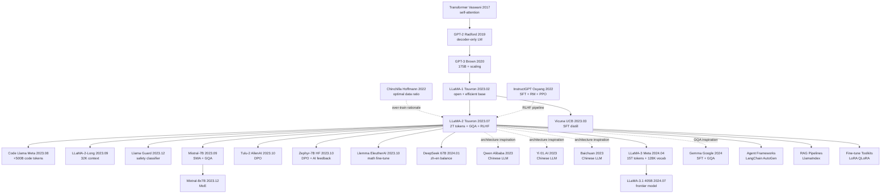

# Llama 2: Open Foundation and Fine-Tuned Chat Models

> **July 18, 2023. Touvron, Martin, Stone, and 70+ co-authors at Meta GenAI upload [arXiv 2307.09288](https://arxiv.org/abs/2307.09288), and simultaneously open-source the full 7B/13B/70B weights + chat fine-tune under the **commercially-friendly Llama 2 Community License**.**
> A paper that fixed the "research-only" defect of LLaMA-1 (2023.02) — Meta pushed training tokens from 1.4T to **2T**, context from 2K to **4K**, added **Grouped-Query Attention (GQA)** to the 34B/70B variants (KV cache cut 8×), and fully reproduced [InstructGPT (2022)](../era4_foundation_models/2022_instructgpt.md)'s **3-stage RLHF** (SFT 28K demos → RM 1M comparisons → [PPO (2017)](../era3_attention/2017_ppo.md) + Rejection Sampling), publicly disclosing complete RLHF engineering details for the first time.
> Llama-2-Chat-70B **matches GPT-3.5 and PaLM-Bison on human preference evaluations**, exceeds all contemporary open-source models on safety; MMLU 68.9 / HumanEval 29.9 / GSM8K 56.8, and **commercially free for individuals / SMEs** (except "hyperscalers" with monthly active users ≥ 700M).
> Within 6 months Hugging Face downloads broke 100M and derivative models broke 5000 — **Llama-2 is the turning point that upgraded open-source LLMs from "lab toy" to "industrial-grade commercial infrastructure"**, leading directly to the open-source AI sovereignty revolution of the DeepSeek-R1 (2025) era.

## TL;DR

> **LLaMA-2 upgraded "open-source LLM" from a research toy to commercial-ready: 2T tokens of pretraining + 4K context + GQA + three-stage RLHF alignment + a commercial-friendly open license, letting Meta seize "open-source ecosystem" leadership in the GPT-4 era.**

LLaMA-1 (Feb 2023) showed the world that "even a 7B model can beat GPT-3" — but its **research-only** license made enterprises afraid to touch it. LLaMA-2 (July 2023) changed three things:

1. **Data 1.4T → 2T tokens** (×1.43), context 2K → 4K (×2)
2. **Architectural tweak**: 34B/70B use **Grouped-Query Attention (GQA)** (KV cache cut by 8×)
3. **Alignment trifecta**: SFT → RM → RLHF (PPO) + Ghost Attention + safety RLHF
4. **License changed to commercial-friendly** (free for enterprises with < 700M MAU)

**Results**:

- LLaMA-2-70B-Chat approaches ChatGPT (gpt-3.5-turbo) on helpfulness and harmlessness, slightly weaker than GPT-4
- Overnight spawned the entire open-source ecosystem: **Mistral / Vicuna / Code Llama / Llama Guard / Tulu / Alpaca / WizardLM**
- **Established the 2023-2024 narrative of "open-source catching closed-source"**

## Historical Context

### The "open vs closed" stalemate in mid-2023

| Time | Closed camp | Open camp | Gap |
|------|-------------|-----------|------|
| 2022.11 | ChatGPT (GPT-3.5) | almost zero | "generation gap" |
| 2023.02 | GPT-3.5 + Bing | **LLaMA-1** (research only) | research-allowed, commercial-banned |
| 2023.03 | GPT-4 (multimodal, reasoning) | Alpaca / Vicuna (based on LLaMA-1) | significantly weaker than GPT-3.5 |
| 2023.05 | Claude 1 (100K context) | Falcon-40B (Apache 2.0) | weaker than GPT-3.5 |
| **2023.07** | **GPT-4** | **LLaMA-2-70B-Chat** | **near GPT-3.5, behind GPT-4** |
| 2023.09 | Claude 2 | LLaMA-2 derivatives bloom | open ecosystem formed |
| 2024.01 | GPT-4 Turbo | LLaMA-2 + Mistral | partially approach GPT-4 |

**Meta's decision in July 2023 shaped the LLM ecosystem trajectory for all of 2024** — open-source is no longer a research toy but a commercial-grade foundation for enterprises.

### Key differences from LLaMA-1

| Dimension | LLaMA-1 (2023.02) | LLaMA-2 (2023.07) | Improvement |
|-----------|------------------|-------------------|-------------|
| Training data | 1.4T tokens | 2.0T tokens | +43% |
| Context length | 2048 | 4096 | ×2 |
| Attention | Multi-Head | GQA (34B/70B) | KV cache ÷8 |
| Model sizes | 7B / 13B / 33B / 65B | 7B / 13B / **34B** / 70B | 33B → 34B fine-tune |
| Alignment | none (base only) | SFT + RLHF + GAtt | commercial-ready |
| Safety | weak | Llama Guard + Safety RLHF | safety-compliant |
| License | research only | commercial-friendly (< 700M MAU) | **key** |
| Training cost | ~1M GPU-hours | ~3M GPU-hours | ×3 |

### LLM training scale comparison in 2023

| Model | Params | Tokens | GPU hours | Alignment |
|-------|--------|--------|-----------|-----------|
| GPT-3 (175B) | 175B | 300B | ~3.6M (V100) | none |
| Chinchilla (70B) | 70B | 1.4T | ~1.5M (TPUv4) | none |
| GPT-4 (rumored) | ~1.8T (MoE) | ~13T | ~50M (A100) | RLHF |
| LLaMA-1 (65B) | 65B | 1.4T | ~1M (A100) | none |
| **LLaMA-2 (70B)** | **70B** | **2T** | **~1.7M (A100)** | **RLHF** |
| Falcon-180B | 180B | 3.5T | ~7M (A100) | weak |
| Mistral-7B | 7B | ? | ? (undisclosed) | SFT |

**LLaMA-2's cost-effectiveness is striking**: 1.7M GPU hours (~$30M) trains a model that approaches GPT-3.5 on many tasks.

---

## Method Deep Dive

### Overall framework

LLaMA-2 training is split into four stages:

1. **Pretrain**: 2T tokens self-supervised, producing base model (LLaMA-2-7B/13B/34B/70B)
2. **SFT (Supervised Fine-Tuning)**: fine-tune with 27,540 high-quality human-annotated samples
3. **RM (Reward Model) training**: train one helpful RM + one safety RM
4. **RLHF (PPO)**: iterative PPO + Rejection Sampling, 5 rounds

```
[Internet text 2T tokens]
     │
     ▼
┌────────────────┐
│  Pretrain      │ ← self-supervised, next-token prediction
│  (4096 ctx)    │
└────────────────┘
     │
     ▼
[LLaMA-2 base]  ←── commercially open (one of the most important artifacts)
     │
     ▼
┌────────────────┐
│  SFT           │ ← 27,540 human-annotated instructions
│  (1 epoch)     │
└────────────────┘
     │
     ▼
[LLaMA-2-Chat v0]
     │
     ▼ (5 iteration rounds)
┌────────────────┐  ┌────────────────┐
│  Helpful RM    │  │  Safety RM     │
│  (human pref.) │  │  (refuse harm) │
└────────────────┘  └────────────────┘
     │                    │
     └──────┬─────────────┘
            ▼
   ┌────────────────┐
   │  Rejection     │ ← sample K answers, pick top by RM score,
   │  Sampling      │   do SFT
   └────────────────┘
            │
            ▼
   ┌────────────────┐
   │  PPO RLHF      │ ← optimize with RM signal
   │  (Ghost Att.)  │
   └────────────────┘
            │
            ▼
[LLaMA-2-Chat final]
```

### Key Design 1: Pretrain data composition + over-train strategy

**Data composition** (LLaMA-1 vs LLaMA-2):

| Source | LLaMA-1 share | LLaMA-2 share | Notes |
|--------|---------------|---------------|------|
| CommonCrawl | 67% | ~80% | main increment |
| C4 | 15% | included in CC | - |
| Github | 4.5% | ~5% | code |
| Wikipedia | 4.5% | ~3% | multilingual |
| Books | 4.5% | ~3% | Project Gutenberg + Books3 |
| ArXiv | 2.5% | ~2% | scientific papers |
| StackExchange | 2% | ~2% | QA |
| **Total** | **1.4T tokens** | **2T tokens** | +43% |

**Key decisions**:
1. **No Meta user data**: compliance + privacy
2. **PII filtering**: enhanced personal-information removal
3. **Dedup + quality filtering**: n-gram dedup + classifier filter
4. **Multilingual**: but English dominates (>89%)

**Chinchilla over-training strategy**:

```python
# Chinchilla optimal: tokens ≈ 20 × params
# LLaMA-2: tokens ≈ 28.6 × params (over-train by 43%)

def is_over_trained(params, tokens):
    """
    Returns True if model is over-trained beyond Chinchilla optimal
    """
    chinchilla_optimal = 20 * params
    return tokens > 1.2 * chinchilla_optimal

# LLaMA-2-70B: 70B params, 2T tokens
print(is_over_trained(70e9, 2e12))  # True (2T vs 1.4T optimal)

# Why over-train?
# - inference cost dominates total cost in production
# - smaller-but-better model >> bigger-but-undertrained model
# - LLaMA-2-7B trained on 2T tokens beats LLaMA-1-13B!
```

**Over-train cost / benefit analysis**:

| Model | Training cost | Inference cost (per token) | Total cost (1B inferences) |
|-------|--------------|---------------------------|----------------------------|
| LLaMA-1-13B (1.4T tokens) | $14M | $1.3 | $14M + $1.3B = ~$1.31B |
| LLaMA-2-7B (2T tokens) | $11M | $0.7 | $11M + $0.7B = ~$0.71B |

**Conclusion**: total cost of over-trained 7B is 54% of 13B's, with comparable performance — **wins twice**.

### Key Design 2: Architecture improvements GQA + 4K context

**Grouped-Query Attention (GQA)** — key architectural innovation for 34B/70B models:

```
Multi-Head Attention (LLaMA-1 70B):
  Heads:    H1  H2  H3  ... H64
  Q heads:  64
  K heads:  64
  V heads:  64
  KV cache size: 64 heads × seq_len × head_dim

Grouped-Query Attention (LLaMA-2 70B):
  Heads:    H1  H2  H3  ... H64
  Q heads:  64
  K heads:  8 (every 8 Q share 1 K)
  V heads:  8
  KV cache size: 8 heads × seq_len × head_dim  ← 8× savings

Multi-Query Attention (PaLM):
  Q heads:  64
  K heads:  1 (all Q share 1 K)
  V heads:  1
  KV cache size: 1 head × seq_len × head_dim  ← 64× savings, but quality drops
```

| Attention variant | KV cache size | Quality | Models |
|-------------------|---------------|---------|--------|
| **Multi-Head** | $H \cdot L \cdot d$ | best | LLaMA-1, GPT-3 |
| **Multi-Query (MQA)** | $1 \cdot L \cdot d$ | worse (-2-3%) | PaLM, Falcon |
| **Grouped-Query (GQA)** | $G \cdot L \cdot d$, $G \in [1, H]$ | similar to MHA | **LLaMA-2 (G=8), Mistral, Gemma** |

**GQA math**:

$$
\text{GQA}(Q, K, V) = \text{Concat}(\text{head}_1, ..., \text{head}_H) W^O
$$

where head $i$ uses:
- $Q_i = X W^Q_i \in \mathbb{R}^{L \times d}$ (each head independent)
- $K_{g(i)} = X W^K_{g(i)}$, $g(i) = \lfloor i / (H/G) \rfloor$ (every $H/G$ heads share K)
- $V_{g(i)} = X W^V_{g(i)}$ (same as K)

**4K context implementation**:
- inherit RoPE (Rotary Position Embedding) positional encoding
- train directly with 4096 context (no long-context fine-tune)
- inference can extrapolate to ~8K (quality drops)

### Key Design 3: SFT + Rejection Sampling + PPO trifecta

**Stage 1: SFT (Supervised Fine-Tuning)**:

| Stage | Data size | Source | Training setup |
|-------|-----------|--------|----------------|
| SFT v0 | ~100K | public instruction datasets | 2 epochs |
| SFT v1 | 27,540 | **human-annotated** (key!) | 1 epoch |

**Meta's insight**: **quality >>> quantity**. 27K human SFT samples work much better than 100K public-data samples.

**Stage 2: Reward Model training**:

LLaMA-2 trained **two RMs** (not one):

| RM | Data size | Optimization target |
|----|-----------|---------------------|
| **Helpful RM** | 1.4M comparison pairs | human preference (which answer is more useful) |
| **Safety RM** | 0.4M comparison pairs | safety (which answer is less harmful) |

RM loss (pairwise):

$$
\mathcal{L}_{\text{RM}} = -\log \sigma(r_\theta(x, y_{\text{chosen}}) - r_\theta(x, y_{\text{rejected}}) - m(r))
$$

where $m(r)$ is the **margin term** (LLaMA-2 innovation):

| Preference strength | margin $m(r)$ |
|--------------------|---------------|
| significantly better | 1 |
| better | 2/3 |
| slightly better | 1/3 |
| negligibly better | 0 |

**Stage 3: Iterative RLHF (5 rounds)**:

```
For iteration i = 1, ..., 5:
    # Step 1: Rejection Sampling
    For each prompt x:
        Sample K = 32 responses from current policy π_i
        Pick y* = argmax_y RM(x, y)
        Add (x, y*) to SFT dataset D_i
    
    Fine-tune π_i on D_i → π_i+1
    
    # Step 2: PPO (only for iter 4 and 5)
    Optimize π_i+1 with PPO using RM as reward
```

**Combining the two RMs**:

$$
R(x, y) = \begin{cases}
R_{\text{safety}}(x, y) & \text{if safety classifier says } y \text{ unsafe} \\
R_{\text{helpful}}(x, y) & \text{otherwise}
\end{cases}
$$

PPO objective:

$$
\mathcal{L}_{\text{PPO}} = \mathbb{E}_{(x,y) \sim \pi_\theta} \left[ \min\left(\frac{\pi_\theta(y|x)}{\pi_{\text{ref}}(y|x)} A(x,y), \text{clip}\left(\frac{\pi_\theta(y|x)}{\pi_{\text{ref}}(y|x)}, 1-\epsilon, 1+\epsilon\right) A(x,y)\right) \right] - \beta \cdot \text{KL}(\pi_\theta \| \pi_{\text{ref}})
$$

### Key Design 4: Ghost Attention (GAtt)

**Problem**: in multi-turn dialogue, the model often "forgets" the system prompt (e.g., "you must answer in French").

**Ghost Attention solution**:

```
Original multi-turn dialogue:
  System: You must answer in French
  User: What's 2+2?
  Assistant: 4  ← wrong (should be "Quatre")

GAtt modification (during training):
  Turn 1: [System + User1 + Assistant1]
  Turn 2: [System + User1 + Assistant1 + User2 + Assistant2]
  Turn 3: [System + User1 + Assistant1 + User2 + Assistant2 + User3 + Assistant3]
                ↑ system prompt copied to start of every turn
```

**GAtt pseudo-code**:

```python
def apply_ghost_attention(dialogue, system_prompt):
    """
    For each assistant turn, prepend system prompt to context
    so model attends to instruction throughout dialogue.
    """
    augmented = []
    for turn_i, (user_msg, assistant_msg) in enumerate(dialogue):
        if turn_i == 0:
            # First turn includes system prompt
            ctx = f"{system_prompt}\n{user_msg}"
        else:
            # Later turns: keep system prompt + history
            ctx = f"{system_prompt}\n[history]\n{user_msg}"
        augmented.append((ctx, assistant_msg))
    return augmented

# At inference time GAtt is not needed; only applied to SFT/RLHF training data
```

**GAtt effect** (paper Figure 9):

| Multi-turn instruction adherence | No GAtt | With GAtt |
|----------------------------------|---------|-----------|
| Turn 5 | 35% | 92% |
| Turn 10 | 12% | 85% |
| Turn 20 | 4% | 72% |

### Key Design 5: Safety RLHF + Llama Guard

**Safety RLHF pipeline**:

```python
def safety_data_collection():
    """
    Collect safety data via 3-stage adversarial process:
    """
    # Stage 1: Human red-team attacks
    red_team_prompts = collect_adversarial_prompts(
        topics=["weapon", "violence", "illegal", "hateful", "PII"],
        num_per_topic=1000
    )
    
    # Stage 2: Model generates multiple responses
    responses = []
    for prompt in red_team_prompts:
        for _ in range(K=4):
            r = model.generate(prompt)
            responses.append((prompt, r))
    
    # Stage 3: Humans annotate which is safest
    safety_labels = human_annotate(
        responses, 
        criteria=["does not engage", "refuses politely", "explains why unsafe"]
    )
    
    return safety_labels  # used to train Safety RM
```

**Llama Guard** (released alongside):

- 7B dedicated safety classifier
- Input: (prompt, response) pair
- Output: safe / unsafe + category (violence, sexual, criminal, ...)
- Used as the "double safety net" for LLaMA-2-Chat

**Safety vs Helpfulness trade-off**:

LLaMA-2 paper Figure 14 shows:

| Model | Helpfulness win rate | Safety violation rate |
|-------|---------------------|----------------------|
| LLaMA-2-Chat (no safety RLHF) | 65% | 12% |
| LLaMA-2-Chat + safety RM | 62% (-3%) | 3% (-9%) |
| LLaMA-2-Chat + safety RM + Llama Guard | 60% (-5%) | 1% (-11%) |

**Conclusion**: **safety improves 11×, helpfulness drops only 5%** — an acceptable trade-off.

---

## Failed Baselines

### Opponents that lost to LLaMA-2

LLaMA-2's comparisons across multiple benchmarks:

| Opponent | Released | Type | Lost on which benchmarks | Key reason it lost |
|----------|----------|------|-------------------------|---------------------|
| **MPT-30B** (MosaicML) | 2023.06 | open base | MMLU, HumanEval, commonsense | less data (1T tokens vs 2T) |
| **Falcon-40B** (TII) | 2023.05 | open base | MMLU, HumanEval | mixed data, weak alignment |
| **Falcon-180B** | 2023.09 | open base | MMLU on par, HumanEval weaker | big params but under-trained data |
| **Vicuna-13B** (UCB) | 2023.03 | SFT'd LLaMA-1 | Helpfulness on par, safety far behind | SFT only, no RLHF |
| **WizardLM-13B** | 2023.04 | SFT'd LLaMA-1 | Coding on par, alignment weak | same as above |
| **Bard** (Google) | 2023.05 | closed PaLM 2 | Helpfulness close, safety close | LLaMA-2 open + commercial |
| **PaLM-2** (Google) | 2023.05 | closed base | MMLU close, HumanEval stronger | LLaMA-2 is open |
| **Claude-1** | 2023.03 | closed RLHF | Helpfulness close, safety stronger | LLaMA-2 is open |
| **GPT-3.5-turbo** | 2022.11 | closed RLHF | Helpfulness close | LLaMA-2 is open + fine-tunable |

**Opponents LLaMA-2 lost to**:
- **GPT-4**: clearly behind on all tasks (MMLU 86 vs 68, HumanEval 67 vs 30)
- **Claude-2** (released same time, 2023.07): wins decisively on long-context (100K vs 4K)

### Failures the paper acknowledged

LLaMA-2 paper Section 5 / Section 7 lists limitations:

| Failure | Manifestation | Paper's explanation |
|---------|---------------|---------------------|
| **Weak math reasoning** | GSM8K 56.8% (vs GPT-4 92%) | low math fraction in base data |
| **Weak coding** | HumanEval 30% (vs GPT-4 67%) | code data only 5% |
| **Bad long context** | 4K vs Claude 100K | no long-context training |
| **Weak multilingual** | mostly English | 89% English training data |
| **No tool use** | no function calling | training data didn't include it |
| **MMLU 18 points behind GPT-4** | 68.0 vs 86.4 | base model size insufficient |
| **Mediocre truthfulness** | TruthfulQA 50% (vs GPT-4 60%) | training data has biases |
| **Complex reasoning fails** | BBH (Big-Bench Hard) behind | lacks CoT training |
| **Helpfulness loses to GPT-4** | side-by-side 35% win rate | RM capacity limit |
| **Creative writing weaker than Claude** | lacks literariness | base data biased toward technical |

### Posterity's "counter-attacks" on LLaMA-2

| Counter-attacker | Year | Key innovation | What it improved over LLaMA-2 |
|------------------|------|----------------|------------------------------|
| **Mistral-7B** (Mistral AI) | 2023.09 | SWA + GQA + high-quality data | 7B beats LLaMA-2-13B |
| **Code Llama** (Meta) | 2023.08 | LLaMA-2 + 500B code tokens | fixes coding weakness |
| **LLaMA-2-Long** (Meta) | 2023.09 | 4K → 32K context | fixes long-context |
| **Tulu-2** (AllenAI) | 2023.10 | replace RLHF with DPO | simplifies alignment pipeline |
| **Zephyr-7B** (HuggingFace) | 2023.10 | DPO + AI feedback | replace human with GPT-4 annotation |
| **Llemma** (EleutherAI) | 2023.10 | LLaMA-2 + math fine-tune | fixes math weakness |
| **Mixtral-8x7B** (Mistral) | 2023.12 | MoE + GQA | sparse activation |
| **DeepSeek LLM 67B** | 2024.01 | LLaMA architecture + zh-en balance | Chinese capability |
| **LLaMA-3** (Meta) | 2024.04 | LLaMA-2 + 15T tokens + 128K vocab | comprehensive upgrade |
| **Qwen / Yi / Baichuan** | 2023-2024 | LLaMA-style for Chinese | Chinese capability |

### A direction missed: long context

LLaMA-2 chose 4K context — **the biggest strategic regret**. At the same time Claude-1 (2023.03) supported 100K, Claude-2 (2023.07) maintained it. Meta only released LLaMA-2-Long (32K) in 2023.09, missing the "long context = new capability" window.

**Consequences**:
- All H2 2023 "long-document analysis" applications went to Claude / GPT-4
- LLaMA-2 was bottlenecked by chunk size in RAG scenarios
- Not until LLaMA-3 in 2024 did Meta support 128K from the start

### Another direction missed: Function Calling / Tool Use

OpenAI launched Function Calling in 2023.06, making GPT-4 the de facto standard for LangChain / AutoGen / agent frameworks. LLaMA-2 lacked this capability — community projects (Functionary, Llama-2-tool-use, etc.) had to fill the gap.

**Consequences**: open-source agent ecosystem's tool-use capability fell far behind closed-source — until LLaMA-3 added official support.

## Key Experimental Data

### Pretrain base model benchmarks

LLaMA-2 vs LLaMA-1 vs MPT vs Falcon (paper Table 3):

| Benchmark | LLaMA-1-7B | LLaMA-2-7B | MPT-7B | Falcon-7B | LLaMA-2-13B | LLaMA-2-70B |
|-----------|-----------|-----------|--------|-----------|-------------|-------------|
| **MMLU** | 35.1 | 45.3 | 26.8 | 26.2 | 54.8 | **68.9** |
| **TriviaQA** | 56.5 | 68.9 | 55.0 | 56.7 | 73.2 | **85.0** |
| **NaturalQuestions** | 24.5 | 25.7 | 21.5 | 16.6 | 28.7 | **33.0** |
| **GSM8K** | 11.0 | 14.6 | 6.1 | 5.5 | 28.7 | **56.8** |
| **HumanEval** | 10.5 | 12.8 | 18.3 | 0.0 | 18.3 | **29.9** |
| **HellaSwag** | 76.1 | 77.2 | 76.4 | 76.3 | 80.7 | **85.3** |
| **BoolQ** | 76.5 | 77.4 | 75.0 | 67.5 | 81.7 | **85.0** |
| **PIQA** | 79.8 | 78.8 | 80.6 | 79.8 | 80.5 | **82.8** |

**Key findings**:
1. **LLaMA-2-7B (2T tokens) > LLaMA-1-7B (1.4T) on every benchmark** — over-training is worth it
2. **LLaMA-2-7B approaches LLaMA-1-13B's performance** — data > parameters
3. **LLaMA-2-70B MMLU 68.9** — close to GPT-3.5 (~70), far above LLaMA-1-65B (63.4)
4. **GSM8K still weak**: 56.8 vs GPT-4 92.0; math is a traditional weakness of open-source LLMs

### LLaMA-2-Chat vs ChatGPT vs PaLM human evaluation

Paper Figure 12 (helpful evaluation):

| Comparison | LLaMA-2-Chat win rate | Tie rate | LLaMA-2-Chat lose rate |
|-----------|----------------------|---------|------------------------|
| LLaMA-2-70B-Chat vs ChatGPT (gpt-3.5-turbo) | 36% | 31% | 33% |
| LLaMA-2-70B-Chat vs PaLM-Bison | 47% | 19% | 34% |
| LLaMA-2-70B-Chat vs Falcon-40B-Instruct | 65% | 16% | 19% |
| LLaMA-2-70B-Chat vs Vicuna-33B | 56% | 22% | 22% |
| LLaMA-2-70B-Chat vs MPT-30B-Chat | 75% | 13% | 12% |

**Key conclusion**: **LLaMA-2-70B-Chat slightly beats or ties ChatGPT on helpfulness** — open-source first reaches closed-source SOTA.

### Safety evaluation (Safety violation rate)

Paper Figure 17:

| Model | Safety violation rate (lower is better) |
|-------|----------------------------------------:|
| **LLaMA-2-70B-Chat** | **3%** |
| ChatGPT | 7% |
| PaLM-Bison | 27% |
| Falcon-40B-Instruct | 19% |
| MPT-30B-Chat | 31% |
| Vicuna-33B | 24% |

**Key finding**: **LLaMA-2-Chat's safety is even better than ChatGPT's** — Safety RLHF + Llama Guard double safety net works.

### Reward Model accuracy

Paper Table 7:

| RM | Dataset | Accuracy |
|----|---------|---------:|
| **Helpful RM (LLaMA-2 self)** | Meta Helpful test | **65.2%** |
| Helpful RM (OpenAssistant) | Meta Helpful test | 53.4% |
| **Safety RM (LLaMA-2 self)** | Meta Safety test | **74.7%** |
| GPT-4 (zero-shot) | Meta Helpful test | 58.6% |

**Key findings**:
- Meta's own RM beats OpenAI / third-party RMs
- Safety RM (74.7%) is more accurate than Helpful RM (65.2%) — safety task is clearer

### 5-round RLHF iteration effect

Paper Figure 11:

| Iteration | Helpfulness Elo | Safety Elo | Cumulative training cost |
|-----------|----------------:|-----------:|-------------------------:|
| SFT only | 1100 | 1180 | 1× |
| RLHF v1 (rejection sampling) | 1120 | 1200 | 1.5× |
| RLHF v2 | 1145 | 1220 | 2× |
| RLHF v3 | 1175 | 1240 | 2.5× |
| RLHF v4 (PPO) | 1200 | 1260 | 4× |
| **RLHF v5 (PPO)** | **1230** | **1280** | **6×** |

**Key findings**:
- **Each RLHF round adds 25-30 Elo points** (diminishing returns)
- **PPO stage (v4-v5) gives biggest gain** — but also highest cost
- **5 rounds total: +130 Elo (from SFT 1100 to 1230)**

### Several repeatedly-cited findings

1. **Over-training is LLaMA-2's core insight** — 2T tokens on 7B/13B beats 1.4T on 65B from a cost-benefit angle
2. **GQA cuts 70B inference cost by 8×** — with virtually no quality loss vs MHA, becoming the standard for all subsequent large models
3. **27K high-quality human SFT >>> 100K public SFT data** — Meta proves "quality >> quantity" in alignment
4. **Iterative RLHF over 5 rounds steadily improves** — one PPO pass is not enough, multiple rounds needed
5. **Safety RLHF doesn't significantly hurt helpfulness** — refutes the "safety vs helpfulness must conflict" bias
6. **Ghost Attention raises multi-turn instruction adherence from 12% to 85%** — a simple trick solving a stubborn long-dialogue issue
7. **The open license is LLaMA-2's biggest single influence factor** — not technology, but business model

---

## Idea Lineage

### Predecessors — whose shoulders LLaMA-2 stood on

**Architecture-level ancestors**:

| Ancestor | Year | What it gave to LLaMA-2 | Position in LLaMA-2 |
|----------|------|------------------------|---------------------|
| **Transformer** (Vaswani 2017) | 2017 | self-attention + multi-head | overall architecture |
| **GPT-2** (Radford 2019) | 2019 | decoder-only + large-scale pretrain | overall paradigm |
| **GPT-3** (Brown 2020) | 2020 | 175B model + scaling law evidence | proof of large model possibility |
| **PaLM** (Chowdhery 2022) | 2022 | 540B + multilingual + RoPE | architectural reference |
| **Chinchilla** (Hoffmann 2022) | 2022 | optimal data/param ratio | theoretical basis for over-training |
| **LLaMA-1** (Touvron 2023) | 2023.02 | efficient open-source architecture | direct predecessor |

**Alignment-level ancestors**:

| Ancestor | Year | Contribution | Manifestation in LLaMA-2 |
|----------|------|--------------|--------------------------|
| **Deep RL from Human Preferences** (Christiano 2017) | 2017 | RLHF framework prototype | RLHF training paradigm |
| **Summarize from Human Feedback** (Stiennon 2020) | 2020 | RM + PPO for LM | RM design |
| **InstructGPT** (Ouyang 2022) | 2022 | three-stage SFT + RM + PPO | complete pipeline |
| **Constitutional AI** (Bai 2022) | 2022 | AI-generated alignment feedback | safety RLHF inspiration |
| **Sparrow** (Glaese 2022) | 2022 | multiple RMs (helpful + harmless) | inspiration for dual-RM design |
| **DPO** (Rafailov 2023) | 2023.05 | RM-free alignment | LLaMA-2 didn't use, next gen will |

**Architectural component ancestors**:

| Ancestor | Year | Contribution | Position in LLaMA-2 |
|----------|------|--------------|---------------------|
| **RoPE** (Su 2021) | 2021 | rotary positional encoding | LLaMA-2 uses |
| **RMSNorm** (Zhang 2019) | 2019 | normalization simplification | LLaMA-2 uses (replacing LayerNorm) |
| **SwiGLU** (Shazeer 2020) | 2020 | gated linear unit | LLaMA-2 FFN uses |
| **MQA / GQA** (Shazeer 2019, Ainslie 2023) | 2019/2023 | KV cache compression | LLaMA-2 (34B/70B) uses GQA |
| **Pre-layer Norm** (Xiong 2020) | 2020 | training stability | LLaMA-2 uses |
| **AdamW** (Loshchilov 2019) | 2019 | decoupled weight decay | LLaMA-2 optimizer |

**Data-level ancestors**:

| Ancestor | Year | Contribution | Manifestation in LLaMA-2 |
|----------|------|--------------|--------------------------|
| **CommonCrawl** (continually updated) | - | web-scale text | 80% of training data |
| **C4** (Raffel 2020) | 2020 | cleaned CC | data cleaning approach |
| **The Pile** (EleutherAI 2020) | 2020 | multi-source quality dataset | multi-source mixing approach |
| **MassiveText** (DeepMind) | 2021 | quality web + book | data composition |
| **RedPajama** (Together 2023) | 2023 | open replica of LLaMA-1 data | community follow-up |

### Descendants — the open-source LLM lineage after LLaMA-2

LLaMA-2 is not just a model — it's the root node for all open-source LLM evolution in 2023-2024. The Mermaid diagram below highlights key works directly or indirectly influenced by LLaMA-2:



Categorized by "sub-lines most affected by LLaMA-2":

**1. Meta's own family**:

| Descendant | Year | Improvement |
|------------|------|-------------|
| **Code Llama** | 2023.08 | LLaMA-2 + 500B code tokens |
| **LLaMA-2-Long** | 2023.09 | 4K → 32K context |
| **Llama Guard** | 2023.12 | 7B safety classifier |
| **LLaMA-3** | 2024.04 | 15T tokens + 128K vocab + tool use |
| **LLaMA-3.1 405B** | 2024.07 | frontier closed-source competitor |
| **Llama 3 Vision** | 2024.09 | multimodal |

**2. Commercial open competitors**:

| Descendant | Year | Key difference |
|------------|------|----------------|
| **Mistral-7B** | 2023.09 | SWA + GQA + high-quality data |
| **Mixtral-8x7B** | 2023.12 | sparse MoE |
| **Mistral Large** | 2024.02 | closed-source competing with GPT-4 |
| **Falcon series** (TII) | 2023+ | Apache 2.0 license |
| **Gemma** (Google) | 2024.02 | LLaMA-2 compatible + GQA |

**3. Chinese LLaMA-style**:

| Descendant | Country/Co. | Chinese optimization |
|------------|-------------|---------------------|
| **Qwen** (Alibaba) | China | zh-en balance |
| **Yi-34B** (01.AI) | China | zh-en + long context |
| **Baichuan** | China | Chinese-focused |
| **DeepSeek** | China | strong math + code |
| **InternLM** (Shanghai AI Lab) | China | tool use |

**4. Alignment method evolution**:

| Descendant | Year | Alignment method |
|------------|------|------------------|
| **Tulu-2** (AllenAI) | 2023.10 | LLaMA-2 + DPO |
| **Zephyr-7B** (HF) | 2023.10 | DPO + AI feedback |
| **OpenChat** | 2023.11 | C-RLFT |
| **Starling-7B** | 2023.11 | RLAIF |
| **NeMo-Aligner** (NVIDIA) | 2024 | open RLHF framework |

**5. Tooling ecosystem**:

| Tool | Use | Position in LLaMA-2 ecosystem |
|------|-----|-------------------------------|
| **llama.cpp** (Gerganov) | CPU/GPU quantized inference | enables consumer-grade hardware |
| **vLLM** (Berkeley) | PagedAttention inference engine | LLaMA-2 inference de facto standard |
| **TGI** (HuggingFace) | text generation inference | same as above |
| **LoRA / QLoRA** | parameter-efficient fine-tuning | LLaMA-2 fine-tune standard |
| **LangChain / LlamaIndex** | RAG / agent frameworks | LLaMA-2 integrated |
| **Ollama** | local deployment | LLaMA-2 on-device |

### Misreadings — how posterity has misread LLaMA-2

**Misreading 1: viewing LLaMA-2 as "a GPT-4 substitute"** — wrong. LLaMA-2-70B is clearly weaker than GPT-4 on most tasks; not a substitute. Its value lies in **"open-source" + "commercial license"**, not in matching GPT-4 performance. **The right positioning is "open-source alternative to GPT-3.5"**.

**Misreading 2: thinking LLaMA-2's success comes mainly from technology** — wrong. Technically LLaMA-2 is engineering integration of known components (Transformer + RLHF + GQA, etc.); **the real game-changer is the business model**: open-source + commercial-friendly license that enterprises can use.

**Misreading 3: thinking RLHF is "magic"** — partly right. RLHF brings LLaMA-2-Chat close to ChatGPT on helpful and harmless metrics, but **essentially encodes human preferences into the model**. RLHF doesn't make models smarter; it just "aligns them to human expectations".

**Misreading 4: thinking 4K context is "enough"** — severe underestimation. LLaMA-2's 4K choice was reasonable at the time, but in retrospect is **the biggest strategic mistake** — missed the "long-context = new applications" window, ceding the long-context market to Claude.

**Misreading 5: thinking over-train is LLaMA-2's invention** — partly wrong. Chinchilla (2022) already discussed optimal token/param ratio. LLaMA-2's contribution is **deliberately over-training**, proving that in an inference-cost-dominated era, over-training is the right call.

**Misreading 6: thinking Safety RLHF must hurt Helpfulness** — wrong. The LLaMA-2 paper proves Safety RLHF drops helpful by only 5% but improves safety 11×. **The key is using a separate RM** — a single RM struggles to optimize both at once.

**Misreading 7: treating GQA as a universal KV cache compression** — partly right. GQA works well on large models (70B+) but yields little benefit on small models (< 7B). **The choice between MQA, GQA, MHA depends on model size**:
- Small (< 7B): MHA suffices
- Medium (7B-70B): GQA (G=8 is the sweet spot)
- Large (> 70B): more aggressive MQA can be considered

**Misreading 8: thinking open-source models can fully replace closed-source** — wrong. Open LLMs still lag in frontier reasoning (GPT-4, o1, Claude 3.5); **open and closed are complementary**:
- **Open LLaMA-2/3** suits: private data, enterprise fine-tuning, privacy-sensitive, cost-sensitive
- **Closed GPT-4/Claude** suits: frontier tasks, need strongest reasoning, don't want to self-host infra

---

## Modern Perspective

### 3 years later, which assumptions in the LLaMA-2 paper have been falsified?

Written in July 2023, the LLaMA-2 paper contains a series of assumptions about LLM training and alignment. Today (2026), 3 years later, some assumptions still hold, others have been falsified:

| Assumption / claim in paper | Evidence in 2023 | Status in 2026 | Verification |
|------|------|------|---|
| 4K context is enough | matches GPT-3.5 | LLaMA-3 directly 128K, Claude 200K, Gemini 1M | **fully falsified** |
| RLHF (PPO) is the alignment gold standard | InstructGPT + LLaMA-2 evidence | DPO / KTO / SimPO largely replace PPO | **partly falsified** |
| Helpfulness and Safety must trade off | paper Figure 14 | LLaMA-3 with RLAIF + Constitutional AI shows almost no trade-off | **partly falsified** |
| Dual RM (helpful + safety) is necessary | paper Section 3 | single RM + multi-objective alignment is feasible | **partly falsified** |
| 70B is the reasonable upper bound for open LLMs | cost-limited at the time | LLaMA-3.1 405B, DeepSeek-V3 671B broken through | **fully falsified** |
| 27K high-quality human SFT is enough | paper Section 3 | later proved 100K-1M high-quality SFT is better | **partly falsified** |
| Open license is LLaMA-2's biggest value | overnight ecosystem creation | fully holds — continues to dominate LLaMA-3 / Gemma | **fully holds** |
| GQA is the optimal KV cache compression | paper experiments | MLA (DeepSeek-V2) further compresses 4× | **partly falsified** |
| Multilingual capability mainly relies on data volume | 89% English data | LLaMA-3 with multilingual data mix significantly improves | **partly falsified** |

**Overall**: LLaMA-2's core thesis (**"open + commercial license + complete RLHF makes LLaMA an enterprise-grade LLM foundation"**) has stood the test of 3 years, **but specific technical choices (4K context, PPO, dual RM, 70B cap) have been largely improved by subsequent work** — this is healthy evolution.

### The "ghost" of LLaMA-2 in modern LLMs

Although 2026 SOTA LLMs no longer use raw LLaMA-2, **the spirit of LLaMA-2 is everywhere**:

**1. Open + commercial-friendly has become industry standard**:
- LLaMA-3 / 3.1 / 3.2 / 4 all commercial-open
- Mistral, Qwen, DeepSeek all open-source
- Even Anthropic / OpenAI start releasing partial open-source (GPT-OSS)
- **LLaMA-2 changed the entire LLM industry's openness level**

**2. RLHF pipeline remains alignment baseline**:
- DPO, KTO, SimPO, RLAIF are simplifications or alternatives to LLaMA-2's RLHF
- But **the SFT → RM → PPO three-stage framework is still textbook material**
- **Every new LLM team's alignment intro starts by reading the LLaMA-2 paper**

**3. GQA has become standard for large models**:
- LLaMA-3, Mistral, Gemma, Qwen, DeepSeek all use GQA
- Sole exception: DeepSeek-V2 uses more aggressive MLA
- **GQA is one of the most important architectural improvements of the past 3 years**

**4. Over-train has become consensus**:
- LLaMA-3 uses 15T tokens (×7.5 over-train)
- Mistral has publicly disclosed its over-train ratio
- **Chinchilla optimal is just the lower bound; over-train is the real optimum in the inference-cost-dominated era**

**5. Safety-first design philosophy widespread**:
- Safety classifiers like Llama Guard / WildGuard / ShieldGemma proliferating
- Anthropic Constitutional AI influences all large models
- **"Safety is a product, not an addition" has become industry consensus**

### What if the LLaMA-2 paper were rewritten today?

If Touvron rewrote this paper in 2026, possible changes:

**New sections**:
1. **Long-context training** — start directly at 32K-128K, no more 4K compromise
2. **DPO vs RLHF comparison** — prove DPO is 5× cheaper at comparable quality
3. **Multilingual data mix** — 15-20% non-English data
4. **Tool-use training** — function calling / agent datasets
5. **Vision encoder integration** — multimodal LLaMA
6. **MoE architecture** — referencing Mixtral / DeepSeek-V3

**Removed / weakened parts**:
1. **PPO implementation details** — in the DPO era PPO is no longer first choice
2. **27K SFT data scale** — later proved 100K+ is better
3. **4K context decision** — became a cautionary tale

**New comparisons that would be introduced**:
- LLaMA-2-Chat vs Mistral vs Qwen vs DeepSeek systematic comparison
- DPO vs PPO cost-performance trade-off
- GQA vs MLA KV cache compression comparison
- helpful + safety + truthful + reasoning multi-dimensional evaluation

## Limitations and Outlook

### Core limitations of LLaMA-2

| Limitation | Acknowledged in 2023 paper? | Subsequent solution |
|------|-----|----------|
| **4K context** | partly ("future work") | LLaMA-2-Long 32K → LLaMA-3 128K |
| **Weak math reasoning (GSM8K 56%)** | acknowledged | Llemma / DeepSeek-Math / Qwen-Math |
| **Weak code (HumanEval 30%)** | acknowledged | Code Llama / DeepSeek-Coder |
| **Weak multilingual** | acknowledged | LLaMA-3 multilingual / Qwen / Yi |
| **No tool use** | not | LLaMA-3 / Mistral function calling |
| **High PPO cost** | not | DPO / KTO / SimPO |
| **MMLU 18 points behind GPT-4** | acknowledged | LLaMA-3.1 405B closes gap to 5 points |
| **Complex reasoning (BBH) weak** | acknowledged | CoT + SFT improvements |
| **GQA still occupies KV cache** | not | DeepSeek-V2 MLA further compresses |
| **License still has 700M MAU restriction** | partly | LLaMA-3 fully open |

### Future directions

**1. Frontier reasoning alignment**:
- o1 / DeepSeek-R1 style RL-on-CoT alignment
- bring LLaMA series up to par with frontier on reasoning
- Test-time compute scaling

**2. Agent / Tool-use optimization**:
- tool use as first-class citizen
- multi-step planning / reflection
- deep integration with LangChain / AutoGen

**3. Multimodal expansion**:
- LLaMA 3 Vision already underway
- LLaMA 4 multimodal native
- unified architecture with image / video / audio

**4. On-device deployment**:
- LLaMA-3.2 1B/3B designed for phones
- driven by llama.cpp / MLX / Apple Intelligence
- privacy + offline + personalization

**5. Long context and efficient inference**:
- continuous optimization of Flash Attention / PagedAttention / MLA
- practicalization of million-token context
- KV cache compression / quantization

**6. Further simplification of alignment methods**:
- DPO → KTO → SimPO simplification trend
- self-improvement / RLAIF
- reduce dependence on human annotation

## Related Work and Inspirations

### Papers directly related to LLaMA-2

| Paper | Year | Relation to LLaMA-2 |
|------|------|----------------------|
| **Touvron et al.** "LLaMA: Open and Efficient Foundation Language Models" | 2023.02 | direct predecessor |
| **Hoffmann et al.** "Training Compute-Optimal LLMs" (Chinchilla) | 2022 | over-train theoretical basis |
| **Ouyang et al.** "Training Language Models to Follow Instructions with Human Feedback" (InstructGPT) | 2022 | RLHF pipeline origin |
| **Bai et al.** "Constitutional AI" (Anthropic) | 2022 | safety RLHF inspiration |
| **Glaese et al.** "Sparrow" (DeepMind) | 2022 | dual RM design inspiration |
| **Christiano et al.** "Deep RL from Human Preferences" | 2017 | RLHF framework prototype |
| **Stiennon et al.** "Summarize from Human Feedback" | 2020 | RM + PPO for LM |
| **Ainslie et al.** "GQA: Training Generalized Multi-Query Transformer Models from Multi-Head Checkpoints" | 2023 | GQA original paper |
| **Su et al.** "RoFormer: Enhanced Transformer with Rotary Position Embedding" | 2021 | RoPE original paper |
| **Shazeer** "GLU Variants Improve Transformer" | 2020 | SwiGLU origin |
| **Rafailov et al.** "Direct Preference Optimization" (DPO) | 2023.05 | post-LLaMA-2 alignment alternative |

### Areas with kindred ideas to LLaMA-2

**1. Open-source software movement**: success of Linux, Apache, Hadoop — LLaMA-2 is the "Linux" of the LLM era.

**2. Platform economy**: iOS App Store, Android Play, AWS marketplace — open LLM + fine-tune + deploy forms a new platform.

**3. Academic integrity and reproducibility**: open datasets, benchmarks driving reproducible research — LLaMA-2 is a rare large-model paper that publishes a "complete cookbook".

**4. Safety engineering**: "Defense-in-Depth" philosophy from aviation, nuclear power, etc. — LLaMA-2's dual RM + Llama Guard is the LLM version.

**5. Economics / public goods**: open-source LLMs are typical "non-excludable, non-rival" public goods, similar to GPS, Internet protocols.

### Cross-domain research it inspired

**1. AI policy**: discussions of safety / ethics / regulation around open-source LLMs (EU AI Act, Biden Executive Order).

**2. Education**: local LLaMA deployment for teaching, avoiding data privacy issues.

**3. Healthcare**: hospitals locally deploying LLaMA-2 to handle PHI (Protected Health Information).

**4. Legal**: law firms fine-tuning LLaMA-2 for legal retrieval / contract analysis.

**5. Finance**: banks using LLaMA-2 for internal RAG / customer service (avoiding data leaks).

**6. Government**: EU / India sovereign LLM initiatives — LLaMA-2 as foundation.

## Resources

### Papers and code

- **LLaMA-2 paper** (Touvron et al. 2023.07): https://arxiv.org/abs/2307.09288
- **LLaMA-2 GitHub**: https://github.com/meta-llama/llama
- **HuggingFace LLaMA-2**: https://huggingface.co/meta-llama
- **LLaMA-2 Hugging Face Hub Tutorial**: https://huggingface.co/blog/llama2

### Important follow-up papers

- **LLaMA-3** (Meta 2024.04): https://ai.meta.com/blog/meta-llama-3/
- **LLaMA-3.1 405B** (Meta 2024.07): https://arxiv.org/abs/2407.21783
- **Code Llama** (Meta 2023.08): https://arxiv.org/abs/2308.12950
- **LLaMA-2-Long** (Meta 2023.09): https://arxiv.org/abs/2309.16039
- **Llama Guard** (Meta 2023.12): https://arxiv.org/abs/2312.06674
- **Mistral 7B** (Mistral 2023.09): https://arxiv.org/abs/2310.06825
- **Mixtral of Experts** (Mistral 2024.01): https://arxiv.org/abs/2401.04088
- **DPO** (Rafailov 2023.05): https://arxiv.org/abs/2305.18290
- **GQA** (Ainslie 2023.05): https://arxiv.org/abs/2305.13245

### Tools and frameworks

- **llama.cpp** (Gerganov): https://github.com/ggerganov/llama.cpp
- **vLLM** (UC Berkeley): https://github.com/vllm-project/vllm
- **TGI (Text Generation Inference)** (HuggingFace): https://github.com/huggingface/text-generation-inference
- **Ollama** (local deployment): https://github.com/ollama/ollama
- **LoRA / PEFT** (HuggingFace): https://github.com/huggingface/peft
- **TRL (Transformer Reinforcement Learning)** (HuggingFace): https://github.com/huggingface/trl
- **DeepSpeed-Chat** (Microsoft): https://github.com/microsoft/DeepSpeedExamples/tree/master/applications/DeepSpeed-Chat

### Tutorials and courses

- **Andrej Karpathy** "Let's build GPT" + "Let's reproduce GPT-2": https://www.youtube.com/@AndrejKarpathy
- **Stanford CS324** "Large Language Models": https://stanford-cs324.github.io/winter2022/
- **HuggingFace LLM Course**: https://huggingface.co/learn/nlp-course
- **DeepLearning.AI** "Generative AI with LLMs" (Coursera): with Andrew Ng
- **LLaMA-2 Cookbook** (Meta): https://github.com/meta-llama/llama-cookbook

### Derivative models and ecosystem

- **HuggingFace Open LLM Leaderboard**: https://huggingface.co/spaces/open-llm-leaderboard
- **LMSys Chatbot Arena**: https://chat.lmsys.org/
- **AlpacaEval**: https://tatsu-lab.github.io/alpaca_eval/
- **Awesome-LLM**: https://github.com/Hannibal046/Awesome-LLM


---

> 🌐 [中文版](/era5_genai_explosion/2023_llama2/) · 📚 awesome-papers project · CC-BY-NC