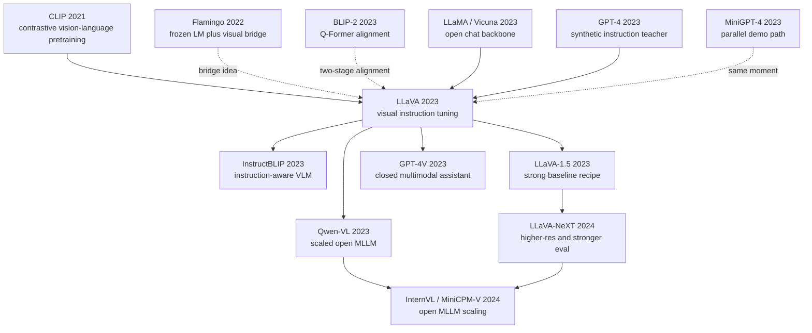

# LLaVA - Turning GPT-4-Generated Visual Instructions into an Open Multimodal Assistant

> **On April 17, 2023, Haotian Liu, Chunyuan Li, Qingyang Wu, and Yong Jae Lee uploaded [arXiv:2304.08485](https://arxiv.org/abs/2304.08485) under the plain title Visual Instruction Tuning.** The NeurIPS 2023 Oral did not train a new vision foundation model from scratch; it connected CLIP ViT-L/14 image tokens to Vicuna through one learned projection and asked GPT-4 to synthesize 158K visual instruction examples from COCO captions and boxes. Its historical charge was timing: before GPT-4V was public and while closed multimodal systems were mostly stage demos, LLaVA gave the open community a multimodal ChatGPT-shaped system it could run, modify, audit, and turn into a research baseline.

## TL;DR

LLaVA, published by Liu, Li, Wu, and Lee as a NeurIPS 2023 Oral, reframed the multimodal assistant problem as a minimalist visual instruction-tuning problem: freeze CLIP ViT-L/14 and Vicuna/LLaMA, learn a single projection $Z_v = W\,\mathrm{CLIP}(I)$, ask GPT-4 to turn captions, boxes, and image context into 158K examples across conversation / detailed description / complex reasoning, then align image tokens and language tokens with the autoregressive loss $\mathcal{L}=-\sum_t\log p(y_t\mid y_{<t}, Z_v, x)$. The baselines it displaced were not one model but a whole pattern: captioning and VQA systems could answer narrow tasks; Flamingo and BLIP-2 showed how to connect vision to language but were closed or not truly chat-native; MiniGPT-4 had a compelling demo but a thin instruction set and little systematic evaluation. LLaVA's headline numbers were simple and memorable: 595K image-text pairs for pre-alignment, 158K visual instruction examples for tuning, about 85.1% relative score versus GPT-4 on multimodal chat evaluation, and 92.53% on ScienceQA when combined with GPT-4. It inherited the open language substrate of LLaMA (2023) and became the bridge toward InstructBLIP, Qwen-VL, LLaVA-1.5, LLaVA-NeXT, and the post-GPT-4V open MLLM evaluation culture. The counter-intuitive lesson is that the first gate to a useful 2023 multimodal assistant was not a more ornate cross-modal architecture; it was instruction data that made a strong LLM see images in the same conversational format humans use to ask about them.

---

## Historical Context

### In spring 2023, multimodal capability sat behind glass

When the GPT-4 technical report appeared in March 2023, the pages that made researchers lean forward were not only the text benchmarks. They were the multimodal demonstrations: explaining memes, reading charts, interpreting sketches, and turning a hand-drawn website mockup into HTML. But image input for GPT-4 was not open to ordinary researchers at that point. OpenAI had shown the capability without releasing weights, an API, or reproducible experiments. For academia, multimodal ChatGPT was visible, but behind glass.

The language-model side had just changed at the same time. LLaMA was released in February 2023, its weights leaked in March, and Vicuna, Alpaca, and other instruction-tuned derivatives appeared almost immediately. The open community finally had a conversation model that was strong enough, cheap enough, and modifiable enough to be a substrate. The vision side also had ingredients: CLIP had shown that images and text could share a semantic representation, and BLIP-2 had shown that a frozen visual encoder and a frozen LLM could be connected by a small module. The missing piece was the third one: **how to make the language model not merely receive image features, but answer, explain, and reason about images in a human conversational format.**

LLaVA sits exactly in that gap. It was not the first model to connect images to an LLM, and it was not the first visual question-answering model. Its key move was to migrate instruction tuning, the most effective post-ChatGPT method for turning a language model into an assistant, into the vision-language setting. Put differently, LLaVA did not primarily ask "how do we improve image features?" It asked "if GPT-4 can act as a teacher, can it teach an open student how to talk about images?"

### Immediate predecessors: from CLIP to BLIP-2 to Vicuna

LLaVA stands at the intersection of three lines. The first is CLIP. In 2021, Radford and co-authors showed that contrastive learning over large image-text pairs could produce a strong vision encoder. Images were no longer just inputs to CNN classifiers; they could be mapped close to natural-language concepts. LLaVA directly uses CLIP ViT-L/14 as its eyes and does not retrain the visual backbone.

The second line is Flamingo and BLIP-2. Flamingo in 2022 connected visual tokens to frozen language models through a Perceiver Resampler and cross-attention, producing strong few-shot vision-language behavior, but it remained closed, expensive, and complex. BLIP-2 in 2023 used a Q-Former as a bridge between a frozen image encoder and a frozen LLM, further reducing training cost. Together they proved: **a huge multimodal model does not need to be trained from scratch; with the right connector, vision and language can flow between frozen foundation models.**

The third line is LLaMA/Vicuna. LLaMA supplied the open base model; Vicuna turned it into a ChatGPT-like conversation model through ShareGPT dialogue tuning. LLaVA's choice of Vicuna was not incidental: it had already learned multi-turn dialogue, polite explanations, and instruction following. The vision side only needed to compress images into soft tokens the language model could digest, not teach the model how to converse from scratch.

### The author team and their problem diagnosis

Haotian Liu and Yong Jae Lee at UW-Madison had been working on visual understanding, open-vocabulary recognition, and interactive vision systems; Chunyuan Li at Microsoft Research had a long track record in vision-language pretraining and multimodal foundation models; Qingyang Wu worked at the intersection of language models and visual question answering. That combination mattered: the team understood CLIP/BLIP-style vision-language pretraining, but it was also sensitive to the product shock of instruction tuning after ChatGPT.

The paper's diagnosis was unusually sober: if the goal is a reproducible multimodal assistant, the scarce resource in 2023 is not a new backbone, but **high-quality, conversational, visually grounded instruction data**. Human annotation would be slow, GPT-4V was unavailable, and ordinary captions were too shallow. The authors therefore used GPT-4 as a text teacher, turning COCO captions and object boxes into three types of data: conversation, detailed description, and complex reasoning. GPT-4 did not see the image directly, but it read textual proxies for the image and could therefore generate question-answer pairs that were more natural than templates.

That step borrowed fire from a closed model. Closed models had strong language and reasoning ability; open models had deployability and modifiability. LLaVA used GPT-4-generated data to connect the two. It acknowledged the capability advantage of proprietary systems while distilling part of that advantage into a dataset and codebase the open community could continue to iterate on.

## Background and Motivation

### Field state: vision-language models could see, but not really chat

By early 2023, vision-language models could perform many point tasks. Captioning models could describe images, VQA systems could answer short questions, OCR/VQA systems could read text, CLIP could do zero-shot classification, and BLIP-2 could connect images to LLMs. But those capabilities were sliced by task boundaries: one model was good at one-sentence captions, another at multiple-choice QA, another at retrieval. They did not behave like ChatGPT: accepting open instructions, handling follow-ups, explaining reasons, and admitting uncertainty.

Meanwhile ChatGPT had made the force of instruction tuning impossible to ignore. The same base LM, once trained on high-quality dialogue and preference-style data, changes from a continuation engine into an assistant. LLaVA's motivation was to move that transformation into vision-language modeling: the input becomes not only a text instruction but an image plus instruction; the output becomes not only a label or short answer but an assistant-style natural-language response.

### Core tension: visual alignment is easy; visual instruction is hard

Projecting CLIP image features into an LLM embedding space is not the hard part. The hard part is making the model know when it must depend on the image, how to cite visual evidence, and how to preserve the context of one image across a conversation. Standard image-text pretraining can teach "what is roughly in this image," but not "how should I explain why this local object is strange when a user asks about it?" That is the need for visual instruction tuning.

LLaVA's research question can be compressed to one sentence: **can a cheap connector plus GPT-4-synthesized visual instruction data turn an open LLM into a useful multimodal assistant?** If the answer is yes, multimodal assistant research is no longer locked behind GPT-4V or Gemini-style closed systems. Any lab can reproduce the model, change the data, swap the LLM, swap the vision encoder, and build evaluations.

### Goal: build a reproducible ChatGPT-for-images first

LLaVA did not try to solve all multimodal problems in one paper. It did not handle video, high-resolution document OCR, complex grounding, or end-to-end visual backbone training. Its goal was closer to a minimum viable system: use CLIP as the eyes, Vicuna as the brain, one linear layer as the neural interface, and GPT-4-generated visual instructions as the training environment.

That restraint was sharp rather than timid. It avoided the parts the research community could not reproduce: private image data, thousand-GPU training, and closed-model inference at deployment time. GPT-4 was used only during data generation. The released artifacts were code, model, data recipe, and evaluation procedure. The recipe was simple enough to be copied quickly into MiniGPT-4, InstructBLIP, Qwen-VL, LLaVA-1.5, and a long chain of open MLLMs throughout 2023.

---

## Method Deep Dive

LLaVA's method is an engineering answer to a minimum viable multimodal assistant: do not retrain the vision encoder, do not train a language model from scratch, do not build a deep cross-attention stack. Project image features into the language model embedding space, then use visual instruction data to teach the LLM to treat those tokens as conversational context. The simplicity does not mean the problem was simple; it means the most valuable 2023 experiment was to show that **multimodal assistant behavior can be induced from an open LLM, a frozen vision encoder, and synthetic instruction data.**

### Overall Architecture

LLaVA has three components: a CLIP ViT-L/14 vision encoder, a trainable linear projection layer, and a Vicuna/LLaMA language model. The image is split into patch tokens and encoded by CLIP, the projector maps visual dimensions into the LLM embedding dimension, and the resulting visual tokens are inserted around the text prompt so that the language model can generate an answer with ordinary autoregressive decoding.

```text
Image I
  -> CLIP ViT-L/14 visual encoder (frozen)
  -> visual patch features V
  -> linear projector W (trainable)
  -> visual tokens Z_v in LLM embedding space
  -> concatenate with instruction tokens x
  -> Vicuna/LLaMA decoder (mostly frozen in pre-alignment, tuned in instruction stage)
  -> assistant answer y
```

The diagram almost looks too simple, and that is LLaVA's point. Compared with Flamingo's Perceiver Resampler plus cross-attention, LLaVA does not insert new modules inside the LLM. Compared with BLIP-2's Q-Former, it does not train an extra query transformer. Compared with end-to-end multimodal systems, it leaves the visual backbone alone. It compresses complexity into one matrix $W$ and one data pipeline.

| Module | Concrete choice | Trained? | Role |
|------|----------|----------|------|
| Vision encoder | CLIP ViT-L/14 | Frozen | Provides strong image-text semantic prior |
| Connector | Linear projection $W$ | Trained | Maps visual features into LLM token space |
| Language model | Vicuna / LLaMA | Tuned in instruction stage | Handles dialogue, reasoning, and generation |
| Data teacher | GPT-4 | Not deployed | Synthesizes visual instructions and answers |

The core formula has two steps. Visual features are first projected:

$$
Z_v = W \cdot f_{\mathrm{CLIP}}(I), \qquad Z_v \in \mathbb{R}^{n_v \times d_{\mathrm{LLM}}}.
$$

The language model then performs standard next-token prediction conditioned on image tokens and the text instruction:

$$
\mathcal{L} = -\sum_{t=1}^{T} \log p_\theta(y_t \mid y_{<t}, Z_v, x).
$$

### Key Design 1: Synthesize visual instructions with GPT-4 instead of enumerating them by hand

LLaVA's most important contribution is not the linear projector; it is the data-generation pattern. Starting from COCO images, the authors collect captions and object boxes, feed those textual proxies to GPT-4, and ask it to generate three categories of visual instruction: conversation, detailed description, and complex reasoning. GPT-4 does not directly see the image, but it can use captions and boxes to write questions and answers that are much more human-like than templates.

This addresses a practical bottleneck. Writing 158K visual dialogues by hand would be slow, expensive, and narrow. Templates would be stiff, teaching the model to behave like a VQA classifier. GPT-4 synthesis gives the data scale, variety, and conversational style. It also converts proprietary language capability into training material for an open model.

| Data type | Target ability | GPT-4 input | Training signal |
|----------|----------|------------|----------|
| Conversation | Multi-turn interaction | caption + boxes | Follow-ups, confirmation, context retention |
| Detailed description | Fine-grained description | caption + boxes | Scene organization, attribute expansion |
| Complex reasoning | Relational reasoning | caption + boxes | Causality, spatial relations, commonsense explanation |
| ScienceQA | Multiple-choice reasoning | image + question + options | Combine school knowledge with visual evidence |

The counter-intuitive point is that GPT-4 did not receive image pixels during data generation. It saw textual proxies. That seems limiting for visual detail, but for instruction tuning it is enough to teach the student what visual questions look like and what assistant-style answers should sound like. Pixel-level evidence is supplied by CLIP tokens during training.

### Key Design 2: Split alignment and conversation into two training stages

LLaVA uses two training stages. The first is feature alignment: about 595K image-text pairs teach the projector to place CLIP patch features into the LLM embedding space. This stage is more like calibrating a translation interface; it prevents visual tokens from being pure noise to the language model. The second stage is visual instruction tuning: 158K GPT-4-generated instruction examples teach the model to answer open questions from images.

The split matters. If complex instructions are used from the first step, the model must learn both "what are these image tokens?" and "what is the dialogue format?" at once, mixing the optimization signal. Alignment first connects the visual wire; instruction tuning then teaches the model how to use the wire in conversation.

| Stage | Data scale | Updated parameters | What it learns |
|------|----------|----------|----------|
| Feature alignment | about 595K image-text pairs | Mainly projector | Align visual tokens with language embeddings |
| Visual instruction tuning | about 158K instructions | Projector + LLM tuning | Multi-turn QA, description, reasoning |

### Key Design 3: Linear projection as deliberate sufficiency

Before LLaVA, many vision-language systems leaned toward complex connectors: cross-attention, Q-Former, resamplers, or multi-layer MLPs. LLaVA's connector is a single linear layer. The choice does not claim that a linear layer is always optimal; it says that if CLIP and Vicuna are already strong, the connector's first job is not to understand images again, but to align two spaces that already contain semantic structure.

The linear projector is cheap in parameters, nearly free of hidden hyperparameters, and easy for the community to reproduce. It also makes swapping the LLM or the vision encoder straightforward. Later LLaVA-1.5 would replace it with a two-layer MLP and improve data and resolution, but the original linear layer established a lower bound: even the simplest connector can produce a usable multimodal assistant.

| Connector | Representative work | Strength | Cost |
|----------|----------|------|------|
| Cross-attention | Flamingo | Expressive, strong few-shot behavior | Invasive architecture, expensive training |
| Q-Former | BLIP-2 | Compresses visual tokens, stable training | Extra transformer and staged design |
| Linear projector | LLaVA | Simple, cheap, reproducible | Limited fine-grained grounding |
| MLP projector | LLaVA-1.5 | Stronger nonlinear alignment | More parameters and tuning |

### Key Design 4: Evaluate assistant behavior, not only VQA scores

LLaVA introduced or reinforced an evaluation perspective: a multimodal model should not only score on VQA or captioning; it should answer open questions like an assistant. The paper constructed a GPT-4-based multimodal chat benchmark, comparing model answers against GPT-4 references and reporting relative scores, while also testing more traditional multiple-choice reasoning on ScienceQA.

This evaluation later became controversial because GPT-4-as-judge brings bias and reproducibility issues. But in 2023 it solved a real measurement gap: traditional metrics could not tell whether an answer behaved like a useful assistant, while human evaluation was too slow. LLaVA used GPT-4 as a rough but scalable scaffold; later LLaVA-Bench, MME, MMBench, MMMU, HallusionBench, and other suites made the practice more systematic.

```python
def train_llava(images, instructions, answers, clip, projector, llm):
    for image, instruction, answer in zip(images, instructions, answers):
        with torch.no_grad():
            visual_features = clip.encode_image(image)
        visual_tokens = projector(visual_features)
        prompt_tokens = llm.tokenize(instruction)
        inputs = concat_visual_and_text(visual_tokens, prompt_tokens)
        target_tokens = llm.tokenize(answer)
        loss = autoregressive_cross_entropy(llm(inputs, target_tokens), target_tokens)
        loss.backward()
        optimizer.step()
        optimizer.zero_grad()
```

The pseudocode is intentionally plain. LLaVA's secret is not one magic operator; it is the closed loop that puts frozen vision, an open LLM, synthetic instruction data, and assistant-style evaluation into one reproducible recipe. That made multimodal systems iteratable in the same way LLM instruction tuning had become iteratable.

---

## Failed Baselines

LLaVA's failed baselines are not a single algorithm defeated in one table. They are four incomplete routes in pre-2023 multimodal systems. Each solved part of the problem, but none simultaneously satisfied the four conditions of seeing images, chatting naturally, being reproducible, and supporting open evaluation.

### Captioning / VQA systems: correct answers, not assistants

Traditional image captioning and VQA systems could turn an image into a sentence, or answer a short question with a word, sentence, or option. They had clear metrics on COCO Caption, VQAv2, and OK-VQA, but their interaction format was narrow: users had to ask in the right format, models rarely explained themselves, and follow-up dialogue was weak. They were visual task solvers, not multimodal assistants.

This baseline failed at the product form. After ChatGPT, users expected to point at an image and ask anything, not to rewrite the question into the format of a VQA dataset. LLaVA used visual instruction data to train open-ended answering, description, and reasoning, pushing outputs from short answers toward assistant responses.

### Flamingo / BLIP-2: successful connection, still short of an open assistant

Flamingo proved that a frozen LLM and visual encoder could be connected through cross-attention and achieve strong few-shot vision-language behavior. But it was closed, expensive, and not reproducible by the community. BLIP-2 reduced training cost with a Q-Former bridge from images to an LLM, but its main evaluations still leaned toward captioning and VQA rather than ChatGPT-style open dialogue.

In other words, this line solved "how does vision enter the language model?" without fully solving "how is the language model trained into a visual assistant?" LLaVA simplified the connector and moved the center of gravity to visual instruction tuning, making the system look much more like the instruction-tuning pipeline familiar to the LLM community.

### MiniGPT-4: strong demo, thin data and evaluation

MiniGPT-4 appeared almost simultaneously with LLaVA and also connected a vision encoder to Vicuna, showing impressive chat demos. The issue was that early MiniGPT-4 relied more on small, high-quality alignment data and demonstrations, without LLaVA's systematic 158K instruction-generation pipeline or its quantitative evaluation around GPT-4 judging and ScienceQA.

This does not make MiniGPT-4 unimportant; it proved the direction was live. But LLaVA turned the demo into a research pipeline: where the data comes from, how training is staged, how benchmarks are built, and how code and models are released. The community could more easily use LLaVA as a baseline because its experimental interface was more complete.

### Waiting directly for GPT-4V: powerful, but not research-controllable

The strongest multimodal capability in spring 2023 was clearly inside proprietary systems. Directly using GPT-4V or waiting for a commercial API might have produced better short-term product behavior, but it did not solve the research problem: no weights, no data control, no reproducible experiments, no systematic ablation, and no way to know whether a failure came from the vision encoder, the language model, alignment data, or safety policy.

LLaVA's value was to move capability from "can be accessed" to "can be modified." Even when its absolute capability was below closed GPT-4V, it gave researchers a multimodal assistant motherboard they could take apart.

| Failed route | Vision ability | Dialogue ability | Reproducibility | LLaVA's correction |
|----------|----------|----------|----------|--------------|
| Caption/VQA | Medium to strong | Weak, fixed task format | High | Train open answers with instruction tuning |
| Flamingo/BLIP-2 | Strong | Medium, task-evaluation oriented | Low for Flamingo, medium for BLIP-2 | Simplify connector, shift to assistant data |
| MiniGPT-4 | Medium to strong | Strong demo | Medium | Scale and systematize visual instruction data |
| GPT-4V-style closed systems | Very strong | Very strong | Low | Release an open ablatable baseline |

## Key Experimental Data

LLaVA did not win through one giant SOTA table. Its argument rests on three groups of numbers: the data scale was large enough, open chat evaluation could approach GPT-4, and traditional ScienceQA also showed strong performance.

### Data scale and training setup

The paper used about 595K image-text pairs for feature alignment, then 158K GPT-4-generated visual instruction examples for instruction tuning. Those 158K examples were not a random pile of QA pairs; they were organized into conversation, detailed description, and complex reasoning, covering everyday follow-up, fine-grained description, and relational reasoning. The language backbone was mainly Vicuna, and the vision backbone was CLIP ViT-L/14.

From an engineering perspective, the numbers meant "just enough for community reproduction." 595K and 158K are not internet-scale datasets, but they are enough to cross the demo threshold; the training cost is also far lower than building a multimodal foundation model from scratch.

| Item | Number | Role | Note |
|------|------|------|------|
| Feature alignment data | about 595K | Align CLIP tokens with LLM embeddings | From image-text pairs |
| Visual instruction data | 158K | Train dialogue, description, reasoning | GPT-4 synthesized |
| Data types | 3 classes | conversation / description / reasoning | Cover assistant behavior |
| Vision encoder | CLIP ViT-L/14 | Frozen visual semantics | Lower training cost |
| Language model | Vicuna/LLaMA | Dialogue and generation | Inherits open LLM ability |

### Multimodal chat and GPT-4 relative score

On the authors' multimodal chat benchmark, LLaVA used GPT-4 as a judge, comparing model answers against GPT-4 reference answers and reporting relative scores. The paper reports that LLaVA achieved about 85.1% of GPT-4's relative score. Today that number needs caution because GPT-4 judging has preferences and the benchmark was not large; in 2023, however, it gave the community a clear anchor: an open model could not only answer fixed VQA, but also approach the answer style of a closed teacher in open visual dialogue.

More importantly, this evaluation turned multimodal assistance from a demo into a comparable object. Every later open MLLM had to answer similar questions: is the answer specific, did the model look at the image, is it hallucinating, can it explain why? LLaVA put those questions on the experimental table.

| Model / setting | Evaluation | Reported result | Meaning |
|-------------|------|----------|------|
| GPT-4 reference | multimodal chat | 100% reference | Closed teacher upper anchor |
| LLaVA | multimodal chat | about 85.1% relative score | Open assistant can approach teacher style |
| LLaVA + GPT-4 | ScienceQA | 92.53% | Multimodal model and strong LLM synergy |
| BLIP-2 / caption baselines | open chat | weaker assistant-style answers | Task models transfer poorly |
| Traditional VQA models | ScienceQA / VQA | strong depending on task | Lacks open dialogue form |

### ScienceQA and ablation signals

ScienceQA is the easiest traditional benchmark to quote from the LLaVA paper. It requires the model to combine images, questions, options, and school-level knowledge. LLaVA alone was already strong; when combined with GPT-4, it reached 92.53%, a new SOTA at the time. That result showed that visual instruction tuning did more than make answers sound chatty; it could transfer into structured visual reasoning tasks.

The ablations emphasized two points. First, feature alignment cannot simply be removed, because the LLM needs to learn how to consume CLIP tokens. Second, GPT-4-generated multi-type instructions help assistant behavior more than single captions or templates. LLaVA's result comes from the combination of connector, data, and dialogue backbone, not from an isolated module.

| Ablation / observation | Impact | Explanation | Later influence |
|-------------|------|------|----------|
| Remove feature alignment | Training weakens, visual conditioning is poor | LLM has not learned to interpret CLIP tokens | Two-stage training becomes standard |
| Use only caption-style data | Answers are short and less reasoned | Missing human question distribution | Instruction diversity becomes core asset |
| Use GPT-4 multi-type data | Open answers become more natural | Teacher supplies dialogue and reasoning templates | Synthetic data becomes MLLM default |
| ScienceQA + GPT-4 synergy | Reaches 92.53% | Open visual model supplies vision, GPT-4 supplies stronger reasoning | Foreshadows model composition and tooling |

The hidden lesson is that LLaVA did not prove "158K examples solve multimodality." It proved that "158K high-quality visual instructions can make a strong LLM display assistant behavior." That distinction matters because LLaVA-1.5, Qwen-VL, InternVL, MiniCPM-V, and later models would keep scaling data, resolution, OCR, and grounding. The original LLaVA was a starting line, not a finish line.

---

## Idea Lineage

### Prehistory: LLaVA braided three lines into one rope

LLaVA's prehistory is not a single paper; it is three technical lines meeting in spring 2023. The first line is vision-language representation after CLIP: images can be encoded into vectors close to language concepts. The second line is frozen-model connection after Flamingo and BLIP-2: a vision encoder and an LLM do not have to be trained together from scratch if a bridge can carry information between them. The third line is instruction tuning after ChatGPT and Vicuna: assistant behavior is not merely a product interface that appears naturally; it can be trained through data format.

LLaVA's conceptual contribution was to move instruction tuning from pure text into image-conditioned dialogue. Earlier vision-language work focused on pretraining objectives: contrastive loss, captioning loss, image-text matching, VQA classification. LLaVA said: those matter, but if you want an assistant, you must train it under human instructions. That shift moved multimodal research language from task scores toward assistant behavior.

| Ancestor | Year | What it gave LLaVA | How LLaVA used it |
|------|------|-------------------|--------------|
| CLIP | 2021 | Frozen vision encoder and image-text semantic space | Uses ViT-L/14 directly as eyes |
| Flamingo | 2022 | Frozen vision and language can be bridged | Keeps bridge idea, drops heavy cross-attention |
| BLIP-2 | 2023 | Two-stage vision-language alignment | Simplifies Q-Former into a projector |
| LLaMA/Vicuna | 2023 | Open conversational language backbone | Serves as the multimodal assistant brain |
| GPT-4 | 2023 | High-quality instruction generation | Acts as visual-instruction data teacher |

### Afterlife: the default template for open MLLMs

After LLaVA, almost every open multimodal large language model had to answer three inherited questions: what is your vision encoder, what is your connector, and where does your instruction data come from? Even when later systems switch to stronger SigLIP, EVA-CLIP, or InternViT encoders, use MLPs, Q-Formers, or resamplers, or expand into OCR, documents, and video, they are still moving inside the coordinate system LLaVA defined.

The diagram below keeps English node labels so the Chinese and English versions are character-identical, marking LLaVA's inputs and outputs in idea history.



From late 2023 onward, LLaVA-1.5 strengthened the original recipe into a more stable baseline: a two-layer MLP connector, better data mixing, and stronger coverage of visual QA and OCR. Qwen-VL, InternVL, MiniCPM-V, and others pushed along scale, data quality, high resolution, and Chinese/multilingual capability. Closed GPT-4V and Gemini raised the upper bound; the open community used LLaVA-style pipelines to chase it.

| Descendant | Year | What it inherited | What it changed |
|------|------|------------|----------|
| InstructBLIP | 2023 | Instruction-aware vision-language training | Systematized multi-task instruction with Q-Former |
| Qwen-VL | 2023 | Open MLLM assistant paradigm | Stronger bilingual, OCR, and grounding ability |
| LLaVA-1.5 | 2023 | LLaVA data and training framework | MLP connector, data mixing, evaluation upgrades |
| LLaVA-NeXT | 2024 | LLaVA baseline ecosystem | Higher resolution and stronger reasoning evals |
| InternVL / MiniCPM-V | 2024 | Open visual instruction-tuning paradigm | Scaled vision encoders and mobile deployment |

### Misreadings: LLaVA was not a linear-layer miracle

**Misreading 1: LLaVA's core is the linear projector.** The linear layer made the story reproducible, but the real core is visual instruction data. Without GPT-4-generated conversation / description / reasoning, the projector can feed CLIP features into an LLM, but it cannot teach the model to behave like an assistant.

**Misreading 2: GPT-4 did not see images, so the data is unreliable.** This is only half right. GPT-4 cannot produce pixel-level details and does introduce hallucinations and omissions; but it can generate high-quality dialogue forms and reasoning templates, while pixel evidence is supplied during training by CLIP tokens. LLaVA uses GPT-4's language-teacher ability, not its vision ability.

**Misreading 3: 85.1% relative to GPT-4 means LLaVA is close to GPT-4V.** No. That score comes from a particular multimodal chat benchmark and GPT-4 judge; it is not a blanket capability measure. LLaVA remained much weaker than later closed multimodal systems on OCR, fine-grained grounding, counting, and hallucination resistance.

**Misreading 4: LLaVA solved multimodal reasoning.** More precisely, it gave multimodal reasoning research an open starting point. The truly hard problems of grounding, long context, multi-image/video, document understanding, tool use, and reliable evaluation continued unfolding over the next several years.

**Misreading 5: Synthetic data is merely cheap human-label replacement.** LLaVA's deeper lesson is that a strong model can transmit an interaction format to a weaker one. Synthetic data does not only increase sample count; it distills task decomposition, conversational manners, and reasoning style from closed systems into open systems.

---

## Modern Perspective

### In 2023: LLaVA turned multimodal assistants from demos into baselines

From the 2023 vantage point, LLaVA's most important contribution was reproducibility. GPT-4V looked powerful but was opaque; MiniGPT-4 had striking demos but less systematic evaluation; BLIP-2 was technically solid but not a chat assistant. LLaVA compressed those ingredients into a baseline people could download, train, swap components inside, and compare. It moved multimodal assistant research from demo videos into experimental tables.

The effect of reproducibility is easy to understate. A field accelerates not only because one model is strongest, but because everyone finally has a shared starting point. After LLaVA, papers could say clearly: we changed the connector, we changed the data, we changed the evaluation, we reduced hallucination. Without that baseline, many improvements would have remained mutually incompatible demos.

### In 2024-2026: the original LLaVA aged quickly, but the route did not

From today's perspective, original LLaVA is clearly behind. Its resolution is low, OCR is weak, fine-grained grounding is unstable, hallucination is obvious, and it is poor at charts, documents, multi-image inputs, and video. LLaVA-1.5, LLaVA-NeXT, Qwen-VL, InternVL, MiniCPM-V, GPT-4V, Gemini, and Claude 3-class systems surpass it in different directions.

But the route did not age out. Mainstream MLLMs still look like a combination of vision encoder, connector, LLM, instruction data, and preference/evaluation procedure. Each component simply became stronger: higher-resolution vision encoders, more nonlinear connectors, larger or cleaner LLMs, data scaled from 158K to millions or tens of millions, and evaluations expanded from GPT-4 judging to OCR, grounding, hallucination, scientific charts, long video, and agent tasks. LLaVA's place is similar to early AlexNet: not today's best model, but the work that defined how later papers ask the question.

### Assumptions that did not survive

First, the assumption that a linear projector is enough for the long run did not survive. It proved feasibility, but high-resolution, fine-grained grounding, OCR, and layout-heavy tasks quickly exposed the bottleneck. Later models commonly use MLPs, Q-Formers, resamplers, or more complex visual-token compression strategies.

Second, the assumption that GPT-4 as judge is enough to evaluate assistant quality did not survive either. GPT-4 judging can prefer long answers, polished language, and answers close to its own style, while struggling to verify visual grounding. Later MME, MMBench, MMMU, POPE, HallusionBench, TextVQA, DocVQA, and other suites added harder tests from different angles.

Third, the assumption that captions plus boxes sufficiently represent images only worked for early synthesis. It can generate dialogue format, but it misses counting, text, spatial relations, small objects, and genuine visual ambiguity. Modern high-quality MLLM data depends more on human labels, OCR documents, complex charts, region-level annotations, multi-image reasoning, and model self-correction.

| Original assumption | What happened later | Today's judgment |
|----------|----------------|------------|
| Linear connector is enough | LLaVA-1.5 and others moved to MLPs or stronger connectors | Good baseline, not the ceiling |
| GPT-4 judge is enough | Many specialized MLLM benchmarks emerged | Useful auxiliary, not sole evaluation |
| Text proxies can generate visual instructions | Fine-grained and OCR cases exposed gaps | Synthetic data needs visual evidence checks |
| 158K instructions are enough | Later data scaled to millions or tens of millions | Enough to launch, not enough to cap performance |

## Limitations and Future Directions

### Visual grounding and hallucination

LLaVA's largest limitation is grounding. The model often produces plausible details that are not in the image, especially for small objects, text, counting, and spatial relations. This cannot be solved by prompt tweaks alone, because the training data itself includes GPT-4 text generated from proxies, which can turn language priors into false visual evidence.

Future directions need stronger region-level supervision, verifiable OCR, visual citation mechanisms, and explicit uncertainty. A reliable multimodal assistant should not only answer "what it looks like"; it should point to evidence, say which parts are unreadable, and distinguish visual observation from inference.

### Data provenance, copyright, and bias

LLaVA builds on COCO, GPT-4 synthetic data, and the open LLM ecosystem, but that also introduces bias. COCO is biased toward everyday scenes; captions and detection boxes have limited coverage; GPT-4-generated text carries its own style and safety preferences; Vicuna inherits the ShareGPT dialogue distribution. The model's notion of a "good answer" is likely a 2023 English-internet conversation style, not robust assistant behavior across languages, cultures, and professional domains.

Future MLLM data needs clearer lineage, stronger multilingual coverage, more expert images, and more auditable synthesis procedures. In high-risk settings such as medicine, remote sensing, industrial inspection, and legal documents, LLaVA-style lightweight instruction tuning cannot replace domain validation.

### From single-image chat to multimodal agents

Original LLaVA mostly handles one image plus a text question. Modern multimodal systems are moving toward multi-image comparison, long-video understanding, screen operation, web agents, robotic perception, and tool use. That requires more than a bigger model: memory, planning, external tools, executable actions, and safety constraints.

The LLaVA paradigm can still extend: visual instructions become vision-action instructions, screen-tool instructions, or video-temporal-reasoning instructions. But once the output is not merely text and can affect real operations, evaluation and safety standards must be much higher than 2023 chat demos.

## Related Work and Insights

### Lessons for researchers

LLaVA's first lesson is that in the foundation-model era, a good research question is often not "invent a giant module from scratch," but "connect mature modules through the right data interface." CLIP, Vicuna, and GPT-4 were not invented by LLaVA; the visual instruction-tuning interface combined them into a new capability.

The second lesson is that data format is itself an algorithm. LLaVA's 158K instructions are not just a dataset; they encode a behavioral protocol: how users ask about images, how assistants expand descriptions, when reasoning is needed, and how long answers should be. Much of later MLLM competition is competition over data format, data quality, and evaluation protocol.

### Lessons for engineering systems

From an engineering perspective, LLaVA shows the value of building a modifiable baseline before chasing peak performance. It did not start with maximum resolution, the largest model, or the most complex connector; it first established a loop that many people could run. That loop let the community improve components in parallel: vision encoder, LLM, connector, data, benchmark.

This is why LLaVA's repository mattered more than the raw capability of the original model. It was not a closed product; it was an experiment board. For later open MLLMs, the project that provides cleaner data pipelines, more stable training scripts, and more transparent evaluation is the one most likely to become the default community baseline.

## Resources

| Type | Resource | Link | Note |
|------|------|------|------|
| Paper | Visual Instruction Tuning | https://arxiv.org/abs/2304.08485 | Original LLaVA paper |
| Code | haotian-liu/LLaVA | https://github.com/haotian-liu/LLaVA | Official code, models, data notes |
| Project | LLaVA project | https://llava-vl.github.io/ | Demo, models, and later versions |
| Follow-up | LLaVA-1.5 | https://llava-vl.github.io/ | Stronger baseline recipe |
| Related | BLIP-2 | https://arxiv.org/abs/2301.12597 | Direct predecessor: Q-Former vision-language alignment |

If one conclusion should stick, it is this: LLaVA's historical value is not that it was stronger than GPT-4V. It is that it turned multimodal ChatGPT from a closed demonstration into an open experiment. Once that happened, later models could be compared, dissected, and iterated on the same table.


---

> 🌐 [中文版](/era5_genai_explosion/2023_llava/) · 📚 awesome-papers project · CC-BY-NC