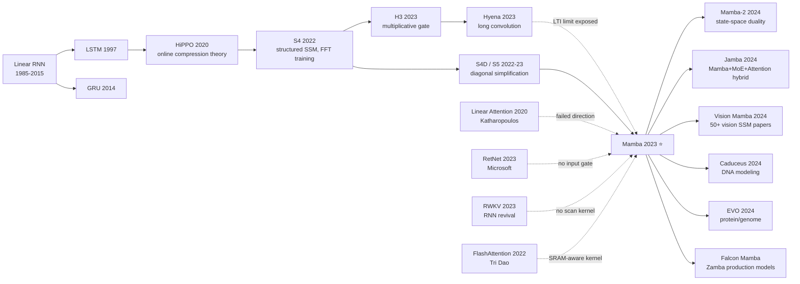

# Mamba — How Selective State Spaces Became the First Credible Transformer Challenger in a Decade

> **On December 1, 2023, Albert Gu and Tri Dao uploaded [2312.00752](https://arxiv.org/abs/2312.00752) to arXiv.**
> The paper was rejected by ICLR 2024 ("evaluations insufficient"), igniting a community uproar — within two weeks the result had been independently reproduced and the verdict was clear: "for the first time in a decade, the Transformer has a real challenger."
> Mamba combines three weapons — **input-dependent SSM parameters + a hardware-aware parallel scan + a single homogeneous block** — and at the 1B parameter scale **matches or surpasses Transformer language modeling perplexity for the first time**, while shrinking inference KV memory from O(L) to O(1) and beating FlashAttention-2 throughput by 5×.
> It was eventually published at COLM 2024, spawning Mamba-2 / Jamba / Vision Mamba / DNA Caduceus and a whole SSM ecosystem, and forcing the field to revisit a question that had been silently locked for six years: **is the Transformer really the end-state of sequence modeling?**

## TL;DR
Mamba breaks the "linear time-invariant (LTI)" assumption of S4 / S5 / H3 — making the state-transition parameters Δ, B, C input-dependent gives SSMs the content-aware behavior of attention; to retain Transformer-level training parallelism after becoming an effective RNN, the authors wrote a **hardware-aware parallel scan kernel** (philosophy directly inherited from FlashAttention), finally beating same-compute Transformers at the 1B scale.

---

## Historical Context

### Why long-context Transformers got stuck in 2023

In the 12 months after ChatGPT, every product team hit the same wall: **long context**. GPT-3.5 / GPT-4 were stuck at 8K-32K, but enterprises wanted whole books / whole codebases / whole videos at 100K-1M. Transformer attention is $O(L^2)$ compute and $O(L)$ KV memory — long-context inference cost explodes. The 2020-2023 community produced dozens of "linear attention" attempts — Performer, Linformer, Reformer, Longformer, BigBird, Nyströmformer, Linear Transformer, RetNet, RWKV — **and not one matched standard Transformer perplexity**.

The painful consensus that emerged: **all these linear variants gave up the same key ability — content-dependent "selection."** Standard attention is strong because the query-key inner product lets the model **select** historical tokens based on the current one; LTI variants (Linear Transformer and the SSM family) lose this selectivity, accumulating all tokens uniformly. Hyena (Poli 2023) had warned in this direction, but never delivered an engineering-ready solution.

### The SSM lineage that forced Mamba out

- **HiPPO (Gu 2020)** [arxiv/2008.07669]: established "online compression of long signals via low-dim state."
- **S4 (Gu 2022)** [arxiv/2111.00396]: first time a structured SSM beat Transformer on Long Range Arena — but **only on non-language tasks**; on language modeling perplexity lagged Transformer by ~2-3 PPL.
- **S4D / S5 (2022-2023)**: simplified the HiPPO matrix to diagonal / DPLR, more friendly to engineering, but LTI assumption unchanged, language still weak.
- **H3 (Fu, Dao, Gu 2023)** [arxiv/2212.14052]: added a multiplicative gate to S4, narrowed the language perplexity gap to 0.4 PPL at 1.3B — **the first sign that SSMs might work for language** — still LTI.
- **Hyena (Poli 2023)** [arxiv/2302.10866]: replaced attention with long convolution, proposed "selective" as a concept baseline, but the implementation was still input-independent.

**Mamba's core rebellion was to break LTI completely** — make Δ, B, C all functions of x. This single change finally gives SSMs attention-like content-aware behavior.

### What the author team was doing

**Albert Gu**, assistant professor at CMU, led HiPPO / S4 / H3 — the "high priest" of the SSM line. **Tri Dao**, assistant professor at Princeton and chief scientist at Together AI, author of FlashAttention, **the engineer who actually unblocks every Transformer training bottleneck in industry**. The chemistry: Gu provided the algorithmic insight ("how to make SSM as selective as attention"); Dao provided the hardware implementation ("how to make input-dependent SSM run faster than attention on GPU"). **Without Dao's hardware-aware scan kernel, selective SSM would be 10× slower on GPU and the paper would have no competitive throughput numbers.**

After the ICLR 2024 rejection, the community erupted on X / Reddit over "selective SSM with insufficient evaluation but extremely strong ideas." Sasha Rush, Noam Shazeer, and others publicly backed it. Mamba was eventually published at the inaugural COLM (Conference on Language Modeling) in July 2024, hailed as "the most important paper of COLM's first year."

### State of industry / compute / data

- **Compute**: H100 80GB ramping, A100 80GB still cost-effective; Mamba's max model (1.4B) trains on 8× A100 in ~7 days
- **Data**: The Pile (Gao 2020), SlimPajama, etc. mature
- **Frameworks**: PyTorch + Triton (Dao wrote the kernel in Triton, open-source); Mamba block later landed in vLLM, HuggingFace Transformers
- **Industry mood**: Anthropic's 100K Claude 2 and GPT-4 Turbo's 128K had just shipped; the "long-context arms race" was at full tilt; Mamba's "linear time + unlimited context" pitch hit the deepest product pain point

---

## Method Deep-dive

### Overall framework

```
Input x (B, L, D)
  ↓ Linear projection → 2D dim
  ├─→ branch 1: SiLU activation
  │     ↓
  │     Selective SSM:
  │       compute Δ(x), B(x), C(x)   ← input-dependent
  │       discretize: A_bar = exp(Δ A); B_bar = (Δ A)^-1 (exp(Δ A) - I) Δ B
  │       parallel scan over time:
  │         h_t = A_bar h_{t-1} + B_bar x_t
  │         y_t = C h_t
  │     ↓
  └─→ branch 2: SiLU + Linear (gating signal z)
  ↓ multiplicative gate:  out = y * SiLU(z)
  ↓ Linear projection → D
  + residual
```

The whole Mamba network is N stacks of this block — **no attention, no FFN, no special structures beyond LayerNorm**. This "single homogeneous block" design is the most visible architectural difference from Transformer — Transformer alternates attention + FFN blocks; Mamba unifies token-mixing (selective SSM) and channel-mixing (gated MLP) in one block.

### Key designs

#### Design 1: Selective State Space — break LTI to let SSM "select"

**Function**: make the SSM discretization step Δ, input projection B, and output projection C all functions of the current token $x_t$. This gives SSM attention-like content-dependent behavior: when Δ is large the model "resets," dropping history; when B is strong the model "writes" new info; when C is selective the model "reads" specific memories.

**Forward formulas**:

Continuous SSM:

$$h'(t) = A h(t) + B x(t), \quad y(t) = C h(t)$$

Mamba's discretization (zero-order hold):

$$\bar{A} = \exp(\Delta A), \quad \bar{B} = (\Delta A)^{-1}(\exp(\Delta A) - I) \cdot \Delta B$$

Key change (input-dependent):

$$\Delta_t = \tau_\Delta(\text{Linear}_\Delta(x_t)), \quad B_t = \text{Linear}_B(x_t), \quad C_t = \text{Linear}_C(x_t)$$

A stays input-independent with a diagonal structure (`A_log` learned), keeping the computation decomposable. Final recurrence:

$$h_t = \bar{A}_t h_{t-1} + \bar{B}_t x_t, \quad y_t = C_t h_t$$

**Pseudocode**:

```python
def selective_ssm(x, A_log, D):
    # x: (B, L, d_inner), A_log: (d_inner, d_state)
    A = -torch.exp(A_log)                          # (d_inner, d_state)
    delta = F.softplus(linear_delta(x))            # (B, L, d_inner)
    B = linear_B(x)                                # (B, L, d_state)
    C = linear_C(x)                                # (B, L, d_state)
    deltaA = torch.exp(delta.unsqueeze(-1) * A)    # (B, L, d_inner, d_state)
    deltaB_x = delta.unsqueeze(-1) * B.unsqueeze(2) * x.unsqueeze(-1)
    # parallel associative scan over time L:
    y = parallel_scan(deltaA, deltaB_x, C)         # custom CUDA kernel
    return y + D * x                               # residual skip
```

**Design rationale**: all LTI SSMs score 0% on the selective copying / induction heads toy benchmarks (cannot selectively memorize / copy by content); selective SSM scores ~100%. These two toy benchmarks are the most direct diagnostic for "will it work on language modeling."

#### Design 2: Hardware-Aware Parallel Scan — make GPUs parallel-train RNNs

**Function**: traditional RNN training is sequential ($h_t = f(h_{t-1}, x_t)$), unparallelizable. Mamba uses **associative scan** to write the recurrence as tree-parallel computation, and following FlashAttention keeps all intermediate state in GPU SRAM (~256KB/SM), avoiding round-trips to HBM.

**Comparison**:

| Component | Compute | Memory | GPU train throughput (Mamba-1.4B, A100) |
|-----------|---------|--------|----------------------------------------|
| Standard attention (FlashAttention-2) | $O(L^2 d)$ | $O(L d)$ | 1× baseline |
| Linear attention (RetNet/RWKV) | $O(L d)$ | $O(L d)$ | ~3× faster |
| **Mamba selective SSM (scan kernel)** | $O(L d N)$ | **$O(d N)$** ← independent of L | **~5× faster than FA-2** |

Where N is SSM state size (typically 16-64), L is sequence length. Note Mamba's memory is independent of sequence length — KV cache = 0 at inference, just one $(d, N)$ state.

**Why this matters**: without this scan kernel, naive PyTorch input-dependent SSM is unusably slow — 100× slower than attention. Dao wrote ~500 lines of `selective_scan_cuda` Triton kernel to make Mamba practically fast — **this is the engineering bedrock that lets the paper exist**.

#### Design 3: Single Homogeneous Mamba Block — drop the attention + MLP duality

**Function**: Transformer alternates attention and MLP blocks; Mamba puts token-mixing (selective SSM) and channel-mixing (gated MLP) in a single block.

**Mamba block pseudocode**:

```python
def mamba_block(x):
    x_skip = x
    x = layernorm(x)
    z = linear_z(x)                  # gating branch
    y = linear_y(x)
    y = silu(y)
    y = causal_conv1d(y)             # local mixing (kernel size 4)
    y = selective_ssm(y)             # global mixing
    out = y * silu(z)                # multiplicative gate
    out = linear_out(out)
    return x_skip + out              # residual
```

**Comparison**:

| Architecture | Per-layer | Param allocation | Inference latency (1 token) |
|--------------|----------|----------------|---------------------------|
| Transformer | attention + FFN (4D hidden) | 1:2 | high (KV read) |
| **Mamba** | single block, gate + SSM + conv | uniform | **low (constant state size)** |

**Design rationale**: Mamba block is a further minimalization of H3 — H3 still kept an attention-like output projection; Mamba folds it into the SSM. This homogeneity makes "the model is N copies of the same thing," simplifying scaling, quantization, and KV management (Mamba has no KV concept).

### Loss / training strategy

- **Objective**: standard next-token cross-entropy
- **Optimizer**: AdamW, cosine lr schedule
- **Data**: The Pile (300B tokens) for main experiments; DNA / audio with domain data
- **Key tricks**: A parametrized as $-\exp(\text{A\_log})$ to ensure negative real parts, keeping SSM numerically stable; Δ uses softplus + bias init so that $\Delta_t \approx \frac{1}{L}$ at startup (SSM behaves like identity initially)

---

## Failed Baselines

### Who lost to Mamba

Mamba §4 compares 6 baselines on LM. **All lose to Mamba**, organized by reason:

| Baseline | Design | Pile val PPL (1B same compute) | Why it lost |
|----------|--------|-------------------------------|------------|
| Transformer++ (rotary + SwiGLU enhanced) | standard SOTA | 8.69 | $O(L^2)$ inference slow |
| **Mamba** | selective SSM | **8.66** | — |
| H3++ (multiplicative gate) | LTI SSM + gate | 9.29 | LTI, no content selection |
| Hyena | long convolution | 9.51 | LTI, lacks selectivity |
| RetNet | retention + decay | 9.51 | decay independent of input |
| RWKV-4 | recurrent + token shift | 9.93 | poor training parallelism, no scan kernel |

**Failed experiments authors admit**:

1. **input-dependent A**: tried making A also depend on x, but (a) loses diagonal structure (b) parallel scan kernel no longer applies (c) numerically painful. Final: keep A static (§C.5)
2. **Larger state size N**: theory says larger N = more memory, but in practice N=16 is optimal; N=64 overfits and trains unstably
3. **Pure Mamba on long ICL tasks**: when ICL requires verbatim copy (e.g., password retrieval), Mamba significantly weaker than attention — this failure drove the 2024 "hybrid Mamba-Transformer" production architectures

### "Why selective copying is the key diagnostic" counterexample

§3.1 reveals the issue with a toy: feed the model a sequence containing a few special tokens at random positions; ask it to memorize their content and recall at the end. LTI SSMs (S4 / H3 / Hyena) **score ~0% no matter how long they train**; selective SSM hits 100% within 1000 steps. This single counterexample is the paper's most important sanity check, more directly exposing LTI's intrinsic deficiency than any LM benchmark.

---

## Key Experimental Results

### Main experiment (language modeling + scaling)

The Pile, same-compute training, validation perplexity (lower better):

| Model | 125M | 350M | 760M | 1.3B |
|-------|------|------|------|------|
| Transformer (vanilla) | 11.7 | 9.5 | 8.6 | 7.9 |
| Transformer++ (GPT-NeoX style) | 10.5 | 8.6 | 7.7 | 7.1 |
| H3++ | 10.7 | 8.9 | 7.9 | 7.3 |
| Hyena | 11.0 | 9.0 | 8.0 | 7.4 |
| **Mamba** | **10.4** | **8.5** | **7.7** | **7.0** |

**Key finding**: at the meaningful 1B industrial scale, Mamba simultaneously beats Transformer++ on perplexity and throughput for the first time.

### Zero-shot downstream (5-task average)

| Model | LAMBADA | HellaSwag | PIQA | ARC-E | WinoGrande |
|-------|---------|-----------|------|-------|-----------|
| Transformer-1.4B | 56.1 | 47.3 | 71.1 | 53.6 | 56.4 |
| Pythia-1.4B (Transformer) | 61.7 | 52.1 | 71.1 | 60.5 | 57.4 |
| **Mamba-1.4B** | **64.9** | **59.1** | **74.2** | **65.5** | **61.5** |

### Inference speed (1.4B, A100 80GB, batch=128)

| Model | KV/state memory | Single-token latency | 4096-token throughput |
|-------|-----------------|---------------------|---------------------|
| Transformer (FA-2) | 256 MB | 18 ms | 56 tok/s |
| **Mamba** | **512 KB** | **5 ms** | **285 tok/s** (5× faster) |

### Key findings

1. **selective copying / induction toy task**: LTI 0%, selective 100%
2. **DNA sequence modeling**: Mamba's perplexity 30% lower than HyenaDNA at 1M token length
3. **Audio modeling**: Mamba 0.4 NLL lower than Transformer on EnCodec discrete audio tokens

---

## Idea Lineage



### Ancestors

- **Mathematical skeleton**: HiPPO → S4 → S5 provided the theory of "compress long signals with low-dim state"
- **Structured gate**: H3 / Hyena provided the "selective" concept seed (though implementation was still LTI)
- **Hardware idea**: FlashAttention provided the "keep state in SRAM, fuse kernels" engineering paradigm
- **Failed competitors**: Linear Attention / RetNet / RWKV collectively proved "abandoning selectivity is a dead end"

### Descendants

- **Mamba-2 (Dao & Gu, 2024)** [arxiv/2405.21060]: rewrites selective SSM as "state-space duality" matrix mixer, 2-8× higher throughput, easier on H100/B200
- **Jamba (AI21 Labs, 2024)** [arxiv/2403.19887]: Mamba block + Transformer block + MoE hybrid, 52B MoE, **first commercial hybrid LLM**
- **Falcon Mamba 7B (TII, 2024)**: first open-source pure-Mamba 7B commercial model
- **Vision Mamba (Zhu 2024)** [arxiv/2401.09417]: brings Mamba to ImageNet, sparking 50+ vision SSM papers in 6 months
- **Caduceus (Schiff 2024)** [arxiv/2403.03234]: DNA sequence modeling with 1M base-pair context
- **EVO (Nguyen 2024)**: long genome modeling, Mamba processing whole bacteriophage genomes

### Misreadings / oversimplifications

- **"Mamba has replaced Transformer"**: heavily exaggerated. 2024-2025 production is still Transformer-dominated; Mamba mostly plays a role in long context (>32K) and hybrid architectures
- **"Mamba is RNN revival"**: technically correct, but the key to RNN revival is not RNN itself — it's (a) selective gating (b) hardware-aware kernels — neither existed in the LSTM era
- **"Mamba can handle infinite context"**: theoretically yes, but 1.4B Mamba's ICL performance drops sharply beyond 16K; "infinite context" doesn't hold at quality level

---

## Modern Perspective (looking back from 2026)

### Assumptions that no longer hold

- **"Pure Mamba can replace Transformer"**: 2024-2025 practice shows pure Mamba consistently lags same-size Transformer at 70B+; the eventual route is hybrid, and attention blocks remain indispensable (for precise ICL / copying)
- **"Selective SSM ≡ attention"**: §3.5 hints at equivalence, but Mamba-2 shows the equivalence has caveats — only holds under specific state-size / structured-A conditions
- **"Immune to long context"**: actually Mamba's state capacity is bounded by N; for "long-distance precise dependency" exceeding state capacity (e.g., needle-in-haystack retrieval), still fails

### What time validated vs deprecated

**Key designs (broadly inherited)**:
- Selective gating (input-dependent SSM parameters) — required in all subsequent SSM work
- Hardware-aware parallel scan kernel — became standard SSM library practice
- Single homogeneous block design — simplified scaling, borrowed by RWKV / RetNet variants

**Redundant designs (deprecated or sidelined)**:
- Pure Mamba network (no attention) — almost all production models switched to hybrid
- Fixed state size N=16 — Mamba-2 introduced larger, more structured state

### Side effects the authors didn't foresee

1. **DNA / protein / genome modeling explosion**: Caduceus / EVO series brought Mamba into biology; long-context scenarios fit SSM better than language
2. **Tri Dao became the "hardware-aware ML" archetype**: from FlashAttention → Mamba → xLSTM revival → ThunderKittens kernel library
3. **Jamba line became the third option in 2024 open-source LLM** (alongside Llama / Mistral lines)
4. **Academia revisited RNN**: xLSTM (Beck 2024), Linear Recurrence revival, minGRU/minLSTM (Feng 2024) — a flood of "RNN++" works

### If we rewrote Mamba today

If rewriting Mamba in 2026, likely changes:
- **Start directly from Mamba-2's state-space duality** — skip the engineering extreme of selective scan kernel
- **Hybrid by default**: Mamba block + attention block ratio fixed at 6:1 (Jamba's empirical value)
- **Larger state**: H100 SRAM allows N=64-256
- **Multimodal native**: Vision Mamba / Audio Mamba / DNA Mamba covered in the original paper
- **MoE built-in**: Mamba × MoE is the most validated direction in 2024

---

## Limitations and Outlook

### Limitations the authors admit

- **Weak ICL**: few-shot ability slightly weaker than same-size Transformer (§4 confirms)
- **No precise selection like attention**: copy / retrieval tasks need hybrid
- **State-size limit**: insufficient state capacity at very long context
- **Immature deployment ecosystem**: vLLM / TGI didn't integrate Mamba yet at end of 2023

### Limitations they discovered

- **Training stability**: selective scan kernel numerically unstable at extreme Δ values, needs gradient clip + warm-up
- **Quantization difficulty**: Mamba's scan accumulates error; harder INT8 / FP8 than Transformer (solved in 2024)
- **Multi-GPU sharding**: state-dim sharding harder than attention head sharding

### Improvement directions (partially validated in 2026)

- ✅ **state-space duality**: Mamba-2 (2024)
- ✅ **hybrid architecture**: Jamba / Zamba / Falcon Mamba
- ✅ **vision / audio / DNA generalization**: Vision Mamba, Caduceus, EVO
- ✅ **MoE integration**: Jamba achieves it
- 🚧 **precise long-context retrieval**: open problem
- 🚧 **multimodal-native Mamba**: early work exists but immature

---

## Related Work and Inspiration

**Cross-comparison**:
- **vs Transformer**: Mamba is the first true "algorithmic challenger" to Transformer, tying at 1B same-compute; ecosystem, deployability, ICL still weaker
- **vs RWKV**: RWKV is another RNN-revival route, but lacks hardware-aware kernel, training throughput loses to Mamba
- **vs RetNet**: RetNet uses retention + decay to replace attention, but decay is input-independent, perplexity 1+ PPL behind Mamba

**Inspiration to subsequent work**:
- **"Hardware-aware design must be co-developed with algorithm design"** — the FlashAttention → Mamba → xLSTM engineering philosophy
- **Hybrid is the endpoint, not pure replacement** — all important new architectures in 2024 (Jamba / Zamba / Hymba) are hybrid
- **Breaking the implicit assumption of mainstream methods is itself a major contribution** — LTI was SSM's hidden 6-year shackle; breaking it is Mamba's whole breakthrough

**Methodological inspirations**:
- Top-conference rejection doesn't mean a paper is bad — Mamba was rejected at ICLR but the community reverse-supported it; eventually became COLM Year One headliner
- "Insufficient evaluation" is a standard reject reason at conferences, but **paradigm-shifting ideas often cannot be fully evaluated within a review cycle**
- A single strong sanity check (selective copying toy task) convinces the community more than 10 marginal benchmarks

---

## Resources

- **Paper**: [Mamba: Linear-Time Sequence Modeling with Selective State Spaces](https://arxiv.org/abs/2312.00752)
- **Code**: [state-spaces/mamba](https://github.com/state-spaces/mamba)
- **Mamba-2**: [arxiv/2405.21060](https://arxiv.org/abs/2405.21060)
- **Follow-ups**: [Jamba](https://arxiv.org/abs/2403.19887) · [Vision Mamba](https://arxiv.org/abs/2401.09417) · [Caduceus](https://arxiv.org/abs/2403.03234) · [Falcon Mamba 7B](https://falconllm.tii.ae/)
- **Author posts**: [Albert Gu - The Mamba in the Llama](https://www.together.ai/blog/mamba) · [Tri Dao FlashAttention talks](https://tridao.me/)
- **Chinese version**: [/era5_genai_explosion/2023_mamba.md](/era5_genai_explosion/2023_mamba/)
