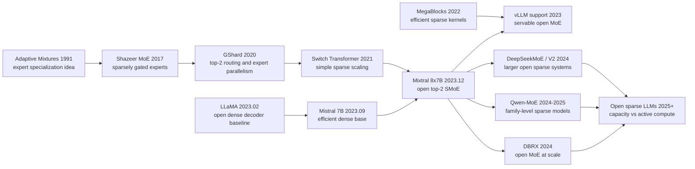

# Mixtral 8x7B — Open-Weight LLMs Enter the Sparse Expert Era

> **In December 2023, Mistral AI did not announce Mixtral with a long academic campaign; it put the [Mixtral 8x7B](https://mistral.ai/news/mixtral-of-experts/) weights and release notes in front of the community, then followed with the technical report [arXiv:2401.04088](https://arxiv.org/abs/2401.04088) in January 2024.** The hook was unusually concrete: the model exposed roughly 47B parameters to each token over the network, but activated only about 13B during inference. Instead of making the next open model a larger dense LLaMA clone, Mixtral turned sparse MoE, a line that had mostly lived inside industrial systems since 2017, into an Apache 2.0, downloadable, servable, leaderboard-competitive open-weight default.

## TL;DR

Albert Q. Jiang, Alexandre Sablayrolles, Antoine Roux, Arthur Mensch, and 22 coauthors released Mixtral 8x7B at the end of 2023 and described it formally in January 2024 as a sparse mixture-of-experts version of the LLaMA-style dense decoder. Instead of one FFN per layer, each layer has 8 SwiGLU experts; a router computes $y=\sum_i \mathrm{Softmax}(\mathrm{Top2}(xW_g))_iE_i(x)$ for every token and activates only the top-2 experts. The baseline it displaced was the belief that beating a Llama 2 70B-class model required paying 70B dense active compute on every token. Mixtral has about 47B total parameters and about 13B active parameters per token, yet it matched or exceeded Llama 2 70B on MMLU 70.6, MBPP 60.7, GSM8K 74.4, and multilingual benchmarks; the Instruct version reached LMSys Arena Elo 1121 in December 2023, ahead of GPT-3.5 Turbo, Gemini Pro, Claude 2.1, and Llama 2 70B Chat at that moment. Its longer influence was to move MoE from the Google/GShard/Switch Transformer industrial lineage into open-weight LLM practice, where it connects to DeepSeek-MoE, Qwen-MoE, DBRX, and later open sparse models. The hidden lesson is that model capacity and per-token compute can be scaled separately, but memory footprint, routing balance, and serving kernels become first-class design constraints.

---

## Historical Context

### Late 2023: the ceiling of dense open models

Mixtral appeared after a year of unusually fast dense-decoder progress in open LLMs. In February 2023, LLaMA brought 7B-to-65B weights into the research community. Alpaca, Vicuna, QLoRA, LLaMA 2, Mistral 7B, Zephyr, OpenChat, and many others then turned “open base model plus instruction tuning plus preference optimization” into a standard recipe. By the end of the year, the limitation was just as clear: if the next step was only to move dense models from 7B, 13B, and 34B toward 70B, inference cost and memory footprint would rise with them. The community would get better models, but also models that were harder to serve.

Llama 2 70B is the key yardstick in the Mixtral paper. It was strong enough to be the default large open baseline in 2023 chat-model tables; it was also heavy enough that every token paid the full 70B active-parameter cost. Mixtral asks a different question next to that yardstick: can a model expose roughly 50B parameters of capacity while charging only around 13B active parameters per token? This is not ordinary compression. It is conditional computation: having many parameters no longer means using all of them at every step, so capacity and per-token cost begin to separate.

That question mattered in 2023 because after Chinchilla researchers had already accepted that compute budgets should be reallocated between parameters and data, while LLaMA showed that medium-sized dense models trained on more tokens could be very strong. Mixtral brings a third variable back into the discussion: if active parameters are kept fixed, can an expert pool increase capacity, language coverage, and code/math ability? It does not reject dense scaling; it offers a different curve at the moment open dense serving costs were becoming painful.

### Mistral AI's position: small team, fast release, Apache 2.0

Mistral AI's 2023 cadence was striking. Mistral 7B in September had already shown that the French team could make a relatively small model compete with, and often beat, Llama 2 13B-class baselines. Mixtral in December pushed the “efficient open model” story up to the 70B-class comparison. The license mattered as much as the benchmark: both Mixtral base and Mixtral Instruct were released under Apache 2.0 for academic and commercial use. For the ecosystem, that made the model easier to adopt in products, services, and downstream training than a release with research-only restrictions.

The author list also sends a signal. Albert Q. Jiang, Alexandre Sablayrolles, Antoine Roux, Arthur Mensch, Guillaume Lample, Thibaut Lavril, and 20 other Mistral AI authors connect directly to LLaMA, Mistral 7B, and open-model infrastructure. Mixtral is not an academic paper that merely proposes a new layer; it is an industrial research artifact where training, release, serving kernels, and community integration move together. The paper explicitly mentions vLLM integration with MegaBlocks CUDA kernels and SkyPilot deployment, because MoE is not just a formula problem. It has to run for ordinary developers.

### From an old MoE idea to an open-LLM default

Mixture of Experts is not new. Adaptive mixtures in the 1990s already contained the idea that different experts could handle different regions of the input space; Shazeer's sparsely gated MoE in 2017 moved the idea into large neural networks; GShard and Switch Transformer made sparse experts a core internal tool for very large Google-scale training. But for years these systems felt “strong, huge, and hard to reproduce”: routing could become unbalanced, expert parallelism required difficult communication, serving still had to fit all experts in memory, and small batches could waste hardware.

Mixtral's historical role is that it did not present MoE as a trillion-parameter demonstration. It put a medium-sized, downloadable, commercially usable, vLLM-servable SMoE in the center of the open community. Eight experts, top-2 routing, and replacing every FFN with experts are not the most elaborate possible choices; they are choices designed to be strong enough, stable enough, and easy enough to fit into existing Transformer inference stacks. That is why Mixtral became a practical reference point for many later open MoE releases.

## Background and Motivation

### Core question: decoupling capacity from per-token cost

Mixtral's motivation can be compressed into one sentence: **give the model more parameter capacity while making each token use only a small subset of that capacity.** In a dense Transformer, the FFN is a major parameter holder; every token in every layer passes through the same FFN weights. MoE splits that FFN into several experts and lets a router choose a few experts for each token. Total parameters are controlled by the number of experts, while per-token compute is controlled by top-k. Mixtral's 8 experts and top-k=2 are that compromise: capacity rises, active compute does not explode.

Two engineering conditions sit behind this motivation. First, the router must be simple enough for stable training and efficient inference; Mixtral uses linear gating plus Top2 plus softmax rather than a complicated controller. Second, MoE has to enter real serving stacks. The paper emphasizes MegaBlocks and vLLM because sparse activation without kernel support merely turns saved FLOPs into scheduling overhead. The research question is therefore not “is MoE theoretically cheaper?” but “can MoE work at once for open weights, open tooling, common benchmarks, and human-preference comparisons?”

### Why not just release a larger dense model

Training a larger dense model could of course work, but it would push the open ecosystem toward models fewer people could use. A 70B dense model puts inference cost, KV cache, replicated deployment, and latency onto every user. If the model also needs to serve multilingual, code, math, and chat workloads, that cost grows further. Mixtral's route is honest about one thing: total parameters still have to live in memory, so sparsity is not free. But on per-token compute, it offers a lower-active-parameter path.

That is how Mixtral differs from quantization, distillation, and LoRA. Quantization lowers the storage cost per parameter, distillation compresses behavior into a smaller dense model, and LoRA makes adaptation cheaper; Mixtral changes the computation topology of the base model itself. It turns “which parameters should participate in this token?” into a dynamic internal decision. For later DeepSeek, Qwen-MoE, DBRX, and larger open sparse models, that decision matters more than any single Mixtral score: open models do not have to climb only the dense-parameter ladder.

---

## Method Deep Dive

Mixtral's method is best understood as a restrained Transformer modification. Attention, the decoder-only framing, hidden size, and head design largely follow the efficient Mistral 7B line. The part that changes is the feed-forward network in every layer. In a dense model, every token passes through the same FFN. Mixtral splits that FFN into 8 SwiGLU experts and lets a router choose 2 experts for each token. The result is a model with roughly 47B parameters of capacity, while the current token follows a path of only about 13B active parameters.

### Overall Framework

Mixtral is a decoder-only sparse mixture-of-experts model. Each layer first runs attention, then enters an MoE FFN. Inside the MoE layer, a gating network maps the current token hidden state $x$ to 8 expert logits, keeps the top-2, applies softmax, and returns a weighted sum of the two selected expert outputs. This is close to GShard-style top-2 routing, except Mixtral replaces all FFN sub-blocks with MoE layers rather than replacing every other block.

| Parameter | Mixtral 8x7B setting | Intuition | Cost implication |
|---|---:|---|---|
| `dim` | 4096 | hidden size in the Mistral 7B range | keeps the dense base width |
| `n_layers` | 32 | 32 decoder layers | depth does not grow via MoE |
| `n_heads` | 32 | attention remains shared and dense | attention compute is not sparse |
| `n_kv_heads` | 8 | grouped-query attention | lowers KV cache and decoding cost |
| `hidden_dim` | 14336 | internal width of each SwiGLU expert | FFN is the main expert pool |
| `context_len` | 32768 | 32K dense context | long context without sliding approximation |
| `num_experts` | 8 | 8 FFN experts per layer | increases total capacity |
| `top_k_experts` | 2 | two experts active per token | controls active compute |

The easiest mistake is to think MoE makes memory cost equal to 13B. It does not. At serving time, all experts must be available in memory or distributed across devices, so memory is closer to the sparse parameter count. What MoE really saves is FFN computation per token. It trades more complicated routing and kernel scheduling for controlled active compute at higher capacity.

### Key Design 1: Top-2 Router

The Mixtral router is a linear gating layer. Given a token hidden state $x$, it computes $xW_g$ to produce 8 expert logits, keeps the top-2 coordinates, sets the rest to $-\infty$, and applies softmax. The general MoE form in the paper is:

$$
\mathrm{MoE}(x)=\sum_{i=0}^{n-1}G(x)_i\cdot E_i(x).
$$

The Mixtral-specific form is:

$$
G(x)=\mathrm{Softmax}(\mathrm{Top2}(xW_g)),\qquad y=\sum_{i=0}^{7}G(x)_i\cdot \mathrm{SwiGLU}_i(x).
$$

Top-2 is a little more expensive than top-1, but it gives two advantages. First, the weighted output of two experts softens hard routing boundaries and makes training more stable. Second, the second expert gives the model a small amount of compositionality rather than forcing every token into exactly one expert. It is neither fully dense FFN, where every parameter is used every time, nor hard top-1 routing, where the path is too brittle.

### Key Design 2: Replace Every FFN with 8 SwiGLU Experts

The expert in Mixtral is not a new complicated module; it is a SwiGLU block placed where the standard Transformer FFN would have been. Each expert owns its FFN parameters, while attention, layer norms, embeddings, routers, and other shared parts remain common. This keeps the engineering maturity of Mistral 7B: the model still looks like a familiar decoder, except the FFN path has changed from one road into eight candidate roads.

This choice also explains why MoE is usually applied to FFNs before attention. FFNs hold many parameters, operate independently per token, and do not require cross-token communication, making them suitable for conditional computation. Attention requires sequence interaction; expertizing attention would make routing and KV cache management much harder. Mixtral's restraint is precisely here: sparsify the part most worth sparsifying.

```python
def mixtral_moe_layer(hidden_state, router_weight, experts, top_k=2):
    # hidden_state: [tokens, dim], experts: 8 independent SwiGLU FFNs
    logits = hidden_state @ router_weight
    chosen = topk_indices(logits, k=top_k)
    masked_logits = fill_with_neg_inf_except(logits, chosen)
    gate = softmax(masked_logits, axis=-1)

    output = zeros_like(hidden_state)
    for expert_id, expert in enumerate(experts):
        token_mask = gate[:, expert_id] > 0
        if any(token_mask):
            expert_out = expert(hidden_state[token_mask])
            output[token_mask] += gate[token_mask, expert_id, None] * expert_out
    return output
```

### Key Design 3: 47B Total Parameters and 13B Active Parameters

Mixtral is often advertised as “8x7B,” but the paper's more precise statement is roughly 47B total parameters and roughly 13B active parameters per token. The gap comes from shared and expert parts: 8 experts increase total capacity, but selecting only 2 experts keeps active compute much smaller than the full parameter count. The paper summarizes the effect neatly: each token has access to 47B parameters, but uses only 13B active parameters during inference.

$$
\text{active params} \approx \text{shared params} + \frac{k}{n}\cdot \text{expert params},\qquad k=2,\; n=8.
$$

This formula is an intuition rather than an exact accounting; the real model also contains attention, embeddings, routers, and shared structures in every layer. But it explains the economics of Mixtral: total capacity grows with the number of experts, while per-token compute grows with top-k. If kernels and batching can absorb routing overhead, MoE can offer a stronger model at the same active compute.

### Key Design 4: 32K Dense Context and Multilingual Pretraining

Mixtral is not merely Mistral 7B with experts bolted on. The paper emphasizes pretraining with a 32K-token context, and the context is fully dense: long-context behavior is not approximated by attending only to a local sliding window. The passkey retrieval experiment shows that the model can retrieve information from different positions inside the 32K window. For an open model at the end of 2023, 32K context plus strong code, math, and multilingual behavior made Mixtral a practical base model.

Multilingual pretraining matters as well. The paper says Mixtral significantly upsamples multilingual data compared with Mistral 7B and clearly beats Llama 2 70B on French, German, Spanish, and Italian benchmarks. The extra MoE capacity gives a natural explanation: experts need not hard-specialize by language, but larger conditional capacity leaves more room for different syntax, morphology, and code patterns. The routing analysis also warns against over-personifying experts: the paper does not find a clear “biology expert” or “philosophy expert,” but rather patterns linked to syntax and positional locality.

| Key design | Problem solved | Cost | Ecosystem impact |
|---|---|---|---|
| Top-2 router | activates few experts per token | routing and load-balancing overhead | made MoE a servable open-model design |
| 8 SwiGLU experts | increases FFN capacity | all experts still occupy memory | separates sparse parameters from active parameters |
| GQA + 32K context | lowers decoding KV cost and supports long context | attention remains dense | strengthens chat, code, and retrieval contexts |
| MegaBlocks/vLLM integration | executes sparse FFNs efficiently | depends on specialized kernels | moved open MoE from paper to API serving |

---

## Failed Baselines

Mixtral's contribution is clearest against several routes that were natural but incomplete. Strong models were not missing in 2023: Llama 2 70B was a strong dense baseline, Mistral 7B was already efficient, Switch and GShard had shown that MoE could scale, quantization could reduce storage, and vLLM was making open serving practical. Each route lacked something: active compute was too high, MoE was not open and reproducible enough, or the serving stack was not ready. Mixtral's value was to put sparse MoE, open weights, Apache 2.0 licensing, and real serving needs into one release.

### Baseline 1: Keep Scaling Dense Open LLMs

The most direct baseline is to train a larger dense LLaMA-like model. This path is reliable in quality, simple in engineering, and easy to explain in evaluation tables: more parameters, more data, stronger model. But the per-token cost of dense models rises with parameter count. Llama 2 70B pays the full 70B active-parameter compute bill at every decoding step. If the open ecosystem's next step were always dense 100B and dense 200B, models would increasingly resemble infrastructure only a few organizations could serve.

Mixtral does not reject dense models; it points to another Pareto point. With about 13B active parameters, it reaches or exceeds Llama 2 70B on MMLU, code, math, and multilingual tasks. The baseline it displaces is not dense quality itself, but the cost structure that ties total model capacity to every token's active compute.

### Baseline 2: Make a Small Dense Model Extremely Strong

Mistral 7B itself is a strong baseline. It shows that training recipe, data quality, GQA, and context engineering can make a 7B-class model surprisingly capable. But 7B dense capacity has limits, especially in multilingual, code, math, and complex instruction-following settings. Mixtral inherits the efficient decoder structure of Mistral 7B and expands the FFN capacity into an expert pool. In effect, it says that “small dense” is an excellent base, but not the final form.

This baseline fails gently. Mistral 7B is not weak; it solves efficiency rather than large capacity. Mixtral's solution is to keep the efficient base and inject sparse capacity only into the FFN path.

### Baseline 3: Google-Scale MoE That Cannot Be Downloaded

GShard, Switch Transformer, and Pathways-style systems had already shown that MoE could scale to very large models, but they were not the same as models the open community could use. There is a large gap between papers, internal infrastructure, TPU clusters, complex expert parallelism, and non-released weights. An MoE that cannot be downloaded, commercially used, or served through a vLLM endpoint is more of a distant demonstration than a daily tool for open LLM developers.

Mixtral's key claim is not that it is the first MoE. It is the first MoE widely treated as a default strong open model. It moves the MoE idea from industrial systems papers into Hugging Face, vLLM, SkyPilot, and ordinary deployment scripts. That is why its impact is ecological, not merely architectural.

### Baseline 4: Advertising Parameter Count Alone

The “8x7B” name easily creates confusion: readers may think the model costs the same as 7B, or that it should be interpreted like a 56B dense model. Neither is accurate. Mixtral serving memory is closer to 47B total parameters because all experts must be available; active compute is closer to 13B because each token uses only two experts. Quoting only one number misleads engineering decisions.

The paper's strength is that it makes this accounting explicit. The 13B active-parameter number explains speed and cost advantages, while the 47B sparse-parameter number explains memory and deployment requirements. Later open MoE systems that ignore this distinction run into practical surprises: saved FLOPs do not mean saved memory, small batches may not be faster, and expert load can become unbalanced.

| Failed route | Why it was natural | Where it stalled | Mixtral's treatment |
|---|---|---|---|
| Larger dense LLM | most reliable quality path | per-token active compute rises linearly | controls active parameters with top-2 experts |
| Small strong dense model | Mistral 7B had proved effective | capacity ceiling remains visible | keeps the base, expands FFN expert pool |
| Closed/internal MoE | GShard/Switch had succeeded | community could not download or serve it | Apache 2.0 open weights plus vLLM integration |
| Inference trick only | quantization and kernels were popular | does not change capacity topology | adds conditional computation at architecture level |
| Only saying 8x7B | simple marketing | cost perception becomes confused | separates 47B total from 13B active |

## Key Experimental Data

### Direct Comparison with Llama 2 70B

The Mixtral paper reruns all Llama baselines with the same evaluation pipeline, which is an important experimental detail. The table shows that Mixtral 8x7B has only 13B active parameters, yet reaches or exceeds Llama 2 70B on most benchmarks. The code and math numbers are especially clear: HumanEval 40.2 versus 29.3, MBPP 60.7 versus 49.8, MATH 28.4 versus 13.8, and GSM8K 74.4 versus 69.6. On MMLU, Mixtral's 70.6 is slightly above Llama 2 70B's 69.9.

| Metric | Llama 2 70B | Mixtral 8x7B | Reading |
|---|---:|---:|---|
| Active parameters | 70B | 13B | Mixtral active compute is about one fifth |
| MMLU | 69.9% | 70.6% | slightly higher aggregate knowledge score |
| HumanEval | 29.3% | 40.2% | clearly stronger code generation |
| MBPP | 49.8% | 60.7% | large advantage on Python tasks |
| MATH | 13.8% | 28.4% | the sharpest math gain |
| GSM8K | 69.6% | 74.4% | stronger grade-school reasoning |

### Comparison with GPT-3.5 and Chat Models

The paper also places Mixtral 8x7B next to GPT-3.5 and Llama 2 70B in one table. Mixtral scores 70.6 on MMLU versus GPT-3.5's 70.0, 60.7 on MBPP versus GPT-3.5's 52.2, and 58.4 on GSM8K versus GPT-3.5's 57.1. On MT-Bench, the Instruct version scores 8.30, almost matching GPT-3.5 Turbo 1106 at 8.32 and far above Llama 2 70B Chat at 6.86.

The more viral number is LMSys Arena. In the December 22, 2023 screenshot, Mixtral 8x7B Instruct v0.1 has Elo 1121, above Claude 2.1 at 1117, the best GPT-3.5 Turbo entry at 1117, Gemini Pro at 1111, and Llama 2 70B Chat at 1077. This does not mean Mixtral surpassed every closed frontier model in every capability. It means an Apache 2.0 open MoE had entered the strong-model band on real chat preference comparisons at that moment.

| Comparison item | Llama 2 70B / Chat | GPT-3.5 / Turbo | Mixtral 8x7B / Instruct |
|---|---:|---:|---:|
| MMLU | 69.9% | 70.0% | 70.6% |
| MBPP | 49.8% | 52.2% | 60.7% |
| GSM8K | 53.6% | 57.1% | 58.4% |
| MT-Bench | 6.86 | 8.32 | 8.30 |
| Arena Elo | 1077 | 1117 | 1121 |
| License / access | open weights | API | Apache 2.0 open weights |

### Multilingual, Long Context, and Routing Analysis

Mixtral's multilingual results matter because the historical importance of MoE would be smaller if it improved only English benchmarks. The paper reports that Mixtral beats Llama 2 70B on ARC Challenge, HellaSwag, and MMLU across French, German, Spanish, and Italian. For example, French MMLU is 70.9 versus 64.3, German MMLU is 71.5 versus 64.2, Spanish MMLU is 72.5 versus 66.0, and Italian MMLU is 70.9 versus 65.1.

| Language | Llama 2 70B MMLU | Mixtral 8x7B MMLU | Difference |
|---|---:|---:|---:|
| French | 64.3% | 70.9% | +6.6 |
| German | 64.2% | 71.5% | +7.3 |
| Spanish | 66.0% | 72.5% | +6.5 |
| Italian | 65.1% | 70.9% | +5.8 |

For long context, the paper uses passkey retrieval to check whether information can be found from different positions inside the 32K window, and reports stable retrieval across lengths and positions. The routing analysis gives a counter-intuitive result: experts do not obviously split into “math,” “philosophy,” or “biology” specialists. The patterns are more tied to syntax, token type, and positional locality. Python `self`, indentation tokens, and English words such as Question often route repeatedly to similar experts. This is a useful warning: MoE experts need not be human-nameable subject experts; they may first be efficient conditional subspaces inside a computation graph.

---

## Idea Lineage

### Before: MoE from expert models to conditional computation

Mixtral's prehistory is not one paper but a recurring idea: a neural network need not call the same parameters for every input. Mixture models in the 1990s understood “experts” as submodels handling different regions of input space. Shazeer's sparsely gated MoE in 2017 placed that idea inside neural layers, using a gating network to choose a few experts for each input. GShard and Switch Transformer then showed that, with enough parallel-systems support and routing care, conditional computation could push total parameter counts beyond what dense models could afford.

The problem was always engineering friction. The MoE formula is simple; expert load, cross-device communication, sparse kernels, training stability, and serving batches are hard. Early MoE was fascinating in papers but difficult for ordinary developers. Mixtral's prehistory is therefore not “MoE was suddenly invented,” but “MoE waited until open LLMs, vLLM, MegaBlocks, GPU serving, and community evaluation matured at the same time.”

### Now: open LLMs move from dense default to sparse option

Mixtral brought MoE into open LLMs in a very practical way. It did not claim that each expert had learned a human-readable discipline, and it did not make the model a giant system no one could download. It chose 8 experts, top-2 routing, 32 layers, GQA, and 32K context, then put the capability into weights that could be served, fine-tuned, and used commercially. It forced the community to take a question seriously for the first time: does a strong open model have to be dense?

The diagram below uses English node labels so the Chinese and English versions keep a character-identical Mermaid block, and it places Mixtral in the MoE and open-LLM lineage.



### Misreading: experts are not human-readable departments

The most common post-Mixtral misreading is to imagine the experts as “the math expert,” “the code expert,” or “the French expert.” The paper's own routing analysis does not support that anthropomorphic story. It checks different subsets of The Pile and does not find a clean topical split across arXiv, PubMed, PhilPapers, and similar domains. What appears more clearly is syntax, token type, and positional locality: code indentation, Python `self`, and English question patterns often route similarly.

This is not a failure of MoE; it is a healthy warning. An expert inside a neural network is a conditional computation subspace, not necessarily a human-nameable task module. It may capture syntax, tokenization shape, layer-position needs, training-distribution frequency, or different functions at different layers. Saying “the model has eight little specialists, one per subject” is easy to spread, but misleading for interpretation and debugging.

### What it passed on

Mixtral passed on a set of engineering defaults rather than one isolated architectural trick. First, open LLMs can treat sparse activation as a mainline design rather than dense plus quantization plus LoRA. Second, benchmark communication must report total parameters, active parameters, memory cost, and serving conditions together. Third, MoE is not a pure model paper; it must be designed with kernels, batching, expert parallelism, and routing load. Fourth, licensing and servability magnify architectural impact; Apache 2.0 and vLLM support made Mixtral closer to community practice than many earlier MoE systems.

| Idea node | Before Mixtral | Mixtral's mutation | Later result |
|---|---|---|---|
| MoE scaling | mostly internal giant systems | medium-sized open-weight MoE | open sparse LLMs become mainstream |
| Dense open LLM | LLaMA-like was the default structure | FFN becomes an expert pool | DeepSeek/Qwen/DBRX keep extending it |
| Serving stack | MoE required complex systems | vLLM + MegaBlocks enter the release story | kernels become part of model capability |
| Evaluation | only total parameters or leaderboard score | quality plus active parameters | cost-quality curves become central |
| Interpretability | imagined subject experts | syntax and locality observed | experts look like conditional subspaces |

---

## Modern Perspective

### Seen in 2023: Mixtral turned open MoE from possibility into product fact

Seen from December 2023, Mixtral's most important message was “this can be publicly released, commercially used, and competitive on leaderboards.” Before it, MoE still felt like internal-systems technology to many open developers. GShard and Switch Transformer were famous, but their weights, training stacks, and serving stacks were not in the community's hands. Mixtral removed that psychological barrier. It showed that an open-weight model could challenge a 70B dense baseline with 13B active parameters, not as a toy demo but with base weights, an instruct model, a license, and vLLM integration arriving together.

It also changed the language of open-model comparison. People used to ask, “How many B is your model?” After Mixtral, they had to keep asking: what are the total parameters, what are the active parameters, what is the serving memory footprint, at what batch size does MoE pay off, and are expert loads balanced? These questions move comparison away from a single parameter count and toward a cost-quality curve.

### Seen from 2024-2026: not the largest MoE, but the entry point for open sparsity

From today's perspective, Mixtral 8x7B is no longer the strongest MoE. DeepSeek-V2/V3, Qwen-MoE, DBRX, Mixtral 8x22B, GPT-OSS-style open sparse models, and others have pushed toward larger expert pools, finer-grained routing, longer context, better training data, and more complete serving systems. Mixtral's specific scale was quickly surpassed, as is normal in foundation models.

But its entry-point role remains. Many later MoE papers and model cards assume readers already understand total versus active parameters, top-k routing, expert parallelism, routing imbalance, and kernel dependency. Mixtral served as community education. It is not the beginning of MoE, but it is the node where the open LLM community first learned MoE engineering vocabulary at scale.

### Assumptions that did not hold up

The first assumption that did not hold up is “MoE is always faster.” The FLOP accounting is attractive, but real latency depends on batch size, expert load, memory bandwidth, all-to-all communication, and kernel fusion. In small-batch low-latency serving, routing and memory access can eat much of the saving; in high-throughput batched serving, MoE can use its active-compute advantage more easily.

The second weak assumption is “experts naturally become human subjects.” Routing analysis and later work show that expert assignments often look more like functions of syntax, token shape, frequency, and layer position. MoE interpretation must avoid anthropomorphizing engineering routes.

The third weak assumption is “open MoE only needs open weights.” Later experience shows that MoE usability depends heavily on inference frameworks, quantization support, expert parallelism, scheduling policies, KV cache management, and deployment documentation. Open weights are the entry ticket; the open serving stack determines whether the model becomes a default.

| Original assumption | What happened later | Today's judgment |
|---|---|---|
| MoE is always faster | small-batch latency is often limited by scheduling and memory overhead | throughput benefits more; low latency needs careful tuning |
| experts map to subject modules | routing often reflects syntax and locality | do not anthropomorphize experts |
| 13B active equals 13B deployment cost | all experts still occupy memory | report active compute and serving memory separately |
| open weights are enough | frameworks and kernels determine usability | vLLM/TensorRT-LLM-style support is equally critical |

## Limitations and Future Directions

### Memory still follows total parameters

Mixtral's largest engineering limitation is memory. Each token uses only two experts, but the server still needs all experts to be accessible. On a single machine, that means fitting 47B parameters; in distributed serving, it means handling expert parallelism. For researchers, active parameters tell the performance-cost story. For engineers, sparse parameters tell the memory, loading time, checkpoint storage, and replica-cost story.

Future MoE systems need more systematic handling of expert offloading, expert caching, hierarchical MoE, weight quantization, and serving schedulers. As long as memory remains tied to total parameters, MoE is not a “free large model”; it is a better throughput-quality curve bought with additional systems complexity.

### Load balancing and routing stability

The second limitation is routing. The router must choose useful experts and keep expert load reasonably balanced. Otherwise some experts become hot, some idle, and distributed systems run into communication bottlenecks. Mixtral does not make load balancing the central novelty, but larger later MoEs cannot avoid it. The more experts, the larger the model, and the more complex the service batches, the more load balancing becomes a systems bottleneck.

Future directions include finer-grained experts, shared experts, routing regularization, better token dropping, expert-parallel scheduling, dynamic capacity, and stronger kernels. A mature MoE is not merely “top-k routing”; it is a joint design of training stability and serving stability.

### Evaluation still misses real deployment

Mixtral is strong on MMLU, code, math, multilingual tests, MT-Bench, and Arena Elo, but those metrics still do not cover real deployments. Enterprise use cares about latency distributions, long-context stability, function calling, RAG, refusal behavior, copyright and privacy constraints, safety policy, and multi-turn consistency. MoE adds extra variables: different batches, languages, and prompt types can trigger different expert loads and therefore different latency profiles.

Future evaluation needs to place model quality next to system metrics: tokens per second, P50/P95 latency, memory footprint, batch size, context length, expert-load variance, and quality after quantization. Mixtral opened the cost-quality comparison; later systems need more reproducible systems benchmarks.

## Related Work and Insights

### Lessons for researchers

Mixtral's first lesson is that old ideas can become new paradigms when the ecosystem becomes ready. MoE was not invented in 2023, but open weights, strong dense bases, serving kernels, community evaluation, and permissive commercial licensing met in the same year, making it a mainline open-LLM option. Researchers should not only ask whether an idea is new; they should also ask whether today's toolchain can finally make it work.

The second lesson is that model papers increasingly look like systems papers. Mixtral's architecture formula is short, but the paper has to discuss vLLM, MegaBlocks, batching, active parameters, sparse parameters, LMSys Arena, and bias benchmarks. The impact of a foundation model comes from the joint force of model, data, training, serving, license, and community distribution.

### Lessons for engineering systems

From an engineering perspective, Mixtral taught the community not to look only at FLOPs. Fewer MoE FLOPs do not guarantee lower latency, fewer active parameters do not guarantee lower memory, and stronger benchmarks do not guarantee stable serving. A real system must jointly design routing, kernels, quantization, batching, expert parallelism, and fallback behavior. For inference-framework builders, Mixtral was a stress test for open MoE demand; for application builders, it is a reminder to treat model choice as a cost curve, not a single rank.

That is why Mixtral's later influence is not confined to the Mistral model family. DeepSeek, Qwen, Databricks, open serving frameworks, and cloud deployment tools are all answering the same question: how can sparse activation's gains exceed its systems complexity? That question will stay with larger open models.

## Resources

| Type | Resource | Link | Note |
|---|---|---|---|
| Paper | Mixtral of Experts | https://arxiv.org/abs/2401.04088 | Mixtral 8x7B technical report |
| Release | Mistral AI Mixtral of Experts | https://mistral.ai/news/mixtral-of-experts/ | official release, model description, links |
| Code | mistralai/mistral-src | https://github.com/mistralai/mistral-src | official inference and model-code entry point |
| Model | Mixtral 8x7B Instruct | https://huggingface.co/mistralai/Mixtral-8x7B-Instruct-v0.1 | Hugging Face weights and usage notes |
| Predecessor | GShard | https://arxiv.org/abs/2006.16668 | top-2 routing and expert-parallel prehistory |
| Predecessor | Switch Transformer | https://arxiv.org/abs/2101.03961 | key paper for simplified MoE scaling |

If there is one conclusion to keep, it is this: Mixtral's historical value is not that the “8x7B” name was clever. It made the open LLM community think about model capability through active parameters, sparse parameters, routing, and serving kernels. After dense scaling, open models finally had a credible sparse-activation route.


---

> 🌐 [中文版](/era5_genai_explosion/2023_mixtral/) · 📚 awesome-papers project · CC-BY-NC