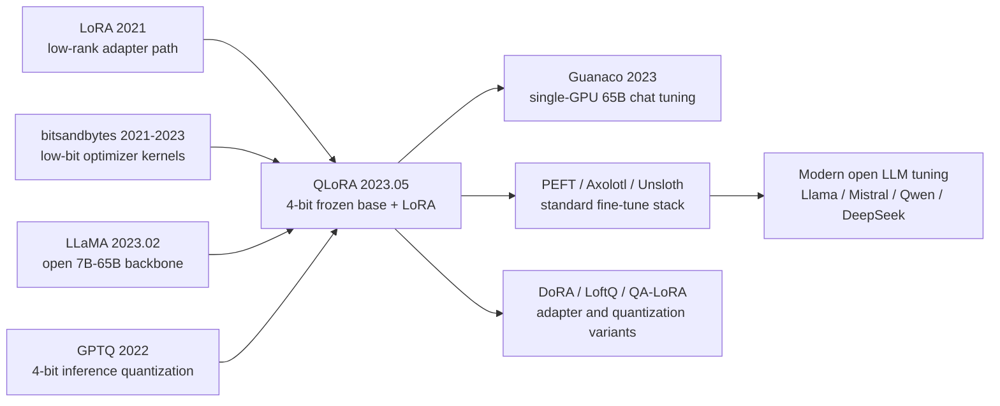

# QLoRA — Bringing 65B LLM Fine-Tuning onto a Single 48GB GPU

> **On May 23, 2023, Tim Dettmers, Artidoro Pagnoni, Ari Holtzman, and Luke Zettlemoyer posted [arXiv:2305.14314](https://arxiv.org/abs/2305.14314), adding the missing tool to the young LLaMA ecosystem: not a larger model, but a way to fine-tune a 65B model on a single 48GB GPU.** QLoRA's counter-intuitive move was to accept that the backbone weights could stay frozen in 4-bit storage while a tiny LoRA side path learned the task. Guanaco-65B, trained for 24 hours on one card, reached 99.3% of ChatGPT on the Vicuna benchmark. The paper's lasting effect was not one leaderboard number; it was the point at which individuals, labs, and small companies could plausibly fine-tune models that had looked industrial-only weeks earlier.

## TL;DR

Dettmers, Pagnoni, Holtzman, and Zettlemoyer's 2023 NeurIPS Oral paper QLoRA joined [LoRA (2021)](../era4_foundation_models/2021_lora.md) with the newly open LLaMA (2023) ecosystem by making the frozen backbone live in 4-bit NF4 storage, dequantizing it only for computation, and updating only the low-rank side path in $Y=X\,\mathrm{dequant}_{NF4}(W_q)+\frac{\alpha}{r}XBA$. The baseline it displaced was the assumption that 65B fine-tuning required multi-GPU full fine-tuning or at least fp16 LoRA: the fp16 weights alone occupy about 130GB, and Adam full fine-tuning pushes memory into the many-hundreds-of-GB regime. QLoRA combined NF4, double quantization, and paged optimizers to fit Guanaco-65B on one 48GB GPU; after 24 hours of training it reached 99.3% of ChatGPT on the Vicuna benchmark. Its downstream influence is visible in Hugging Face PEFT, Axolotl, Unsloth, and countless LLaMA/Mistral/Qwen/DeepSeek fine-tuning recipes. The hidden lesson is that democratizing LLMs is not only about releasing weights; it is also about accounting separately for training state, storage state, and optimizer memory spikes.

---

## Historical Context

### The spring 2023 memory wall

QLoRA arrived in an unusually narrow window. LLaMA appeared in February 2023, its weights leaked in March, Stanford Alpaca showed by mid-March that an open base plus instruction tuning could quickly acquire chat behavior, and Vicuna pushed the same recipe to the center of the community in April. The problem was that the most useful base models were not 7B; they were 33B and 65B. And the thing that made a model feel like an assistant was not merely downloading weights, but fine-tuning them. The community immediately ran into a memory wall: one consumer card could load 7B, maybe run 13B with care, but it could not train 65B.

That wall was not primarily a FLOP wall; it was a state wall. Full Adam fine-tuning needs fp16 weights, gradients, fp32 optimizer moments, and often master weights, pushing a 65B model into the many-hundreds-of-GB range. Plain LoRA reduces the trainable matrices, but the frozen backbone still sits in fp16/bf16 memory; the 65B weights alone occupy roughly 130GB before activations and temporary buffers. In other words, LoRA answered “how many parameters must change?” but not “how does the huge frozen parameter tensor fit?”

That is QLoRA's historical position: it did not invent a new adapter; it completed the memory accounting around the adapter path. LLaMA brought large open weights to the community, LoRA reduced the trainable state to small matrices, and QLoRA made the non-trainable bulk small enough for a single card. Only the combination of all three produced the complete 2023 open-LLM fine-tuning loop.

### Immediate predecessors: LoRA, low-bit quantization, bitsandbytes

QLoRA stands on three direct lineages. The first is [LoRA](../era4_foundation_models/2021_lora.md): freeze the original weight $W_0$, learn a low-rank update $BA$, keep training state small, and optionally merge at inference. LoRA's limitation was equally clear: it assumed $W_0$ remained in 16-bit storage. “Few trainable parameters” was not the same as “small model body.”

The second lineage is low-bit quantization. LLM.int8(), GPTQ, AWQ, and related methods had shown that LLM weights could be stored in 8-bit or 4-bit form while preserving useful inference quality, but most of that work treated quantization as an inference trick. The weights were compressed for deployment, not for backpropagation. Training raises a different question: not merely whether outputs can be computed, but whether gradients, activations, and temporary dequantization buffers stay inside the memory budget. QLoRA reframed the problem: can the backbone stay frozen and 4-bit while gradients pass through dequantization into LoRA?

The third lineage is bitsandbytes. Tim Dettmers already had years of work on 8-bit optimizers, LLM.int8(), and CUDA low-bit kernels; that made QLoRA not just a paper algorithm but an engineering path that Hugging Face `transformers` and PEFT could call. Soon after release, `load_in_4bit=True`, `bnb_4bit_quant_type='nf4'`, and `bnb_4bit_use_double_quant=True` became familiar lines in fine-tuning scripts. That speed of API adoption is part of the paper's impact.

### The four authors and UW NLP's position

All four authors worked in the University of Washington orbit, but their strengths were complementary. Dettmers brought low-precision training and bitsandbytes engineering; Pagnoni helped turn the training recipe, data, and evaluation into reproducible code; Holtzman had long studied open-ended generation, degeneration, and evaluation illusions; Zettlemoyer's UW NLP group had deep experience in semantic parsing, retrieval, and language-model tooling. The result is why QLoRA reads like a systems paper, an evaluation paper, and an open-source tooling paper at once.

From the title alone, QLoRA can sound like “LoRA plus quantization.” What the team actually did was a stress test. They did not report one model on one dataset; they fine-tuned more than 1,000 models across LLaMA and T5, scales from 7B to 65B, 8 instruction datasets, and multiple evaluation protocols including Vicuna, MMLU, human preference, and GPT-4 judgments. That scale lets the paper answer a more practical question: once the community starts training chat models in volume, which variables matter, and which are noise?

## Background and Motivation

### Can we pay LoRA's training cost without paying for a fp16 backbone?

QLoRA's motivation can be compressed into one sentence: **keep LoRA's training behavior while removing LoRA's dependence on 16-bit backbone storage.** This goal has three constraints. First, the 4-bit representation must match the distribution of pretrained weights closely enough that LoRA is not wasted merely repairing quantization error. Second, backpropagation must pass through the dequantized computation while leaving the quantized backbone frozen; otherwise optimization becomes unstable and memory expands again. Third, the temporary spikes from long sequences, large batches, and optimizer states must not erase the average memory savings.

Those constraints map directly to the paper's three key designs: NF4 answers “how can 4-bit storage fit normally distributed weights?”; double quantization answers “what about the scale constants attached to every block?”; paged optimizers answer “what happens when average usage is fine but peak usage suddenly explodes?” Together they turn “single-card 65B fine-tuning” from a slogan into an executable command.

---

## Method Deep Dive

QLoRA's method is best read as a rewrite of the fine-tuning memory ledger. Traditional fine-tuning treats model weights, gradients, and optimizer state as trainable state. LoRA already reduced “what must be learned” to low-rank matrices, but it still assumed the backbone sat in 16-bit memory. QLoRA's key judgment is: **the backbone only needs to participate in numerical forward/backward computation; it does not need optimizer updates, so it can be stored in 4-bit form, dequantized on demand, and used to route gradients into the LoRA branch.**

### Overall Framework

QLoRA's training graph is a “frozen large block plus trainable small side path.” The backbone never connects to the optimizer; only the LoRA $A,B$ matrices are updated.

```text
input tokens
   ↓
embedding / activations in bf16
   ↓
┌──────────────────────────────────────────────┐
│ Frozen pretrained linear layer               │
│   W_q: 4-bit NF4 storage                     │
│   scales: double-quantized constants         │
│   compute: dequantize to bf16 on the fly     │
└──────────────────────────────────────────────┘
             │
             ├── base path: X @ dequant(W_q)
             │
             └── trainable path: alpha/r * X @ A @ B
   ↓
loss and gradients flow only into LoRA parameters
```

QLoRA is not one trick but four memory reductions at once: weight storage drops from 16-bit to 4-bit; scale constants are quantized again; optimizer state avoids the backbone; transient peaks are handled by paged optimizers. A rough memory ledger looks like this.

| Component | fp16 LoRA 65B | QLoRA 65B | Change | Intuition |
|---|---:|---:|---:|---|
| Frozen backbone | ~130GB | ~32-35GB | ~4x compression | 4-bit NF4 storage |
| Trainable params | LoRA small | LoRA small | nearly unchanged | train adapters only |
| Optimizer states | LoRA only | LoRA only | nearly unchanged | no Adam state for base |
| Peak spikes | manual batch tuning | paged optimizer | lower OOM risk | peaks can page out |

### Key Design 1: NF4 NormalFloat

Uniform int4 wastes levels for pretrained weights, which are usually close to zero-mean normal: most values cluster near zero, while a small tail controls outlier behavior. NF4 (NormalFloat 4-bit) places its 16 discrete values near normal-distribution quantiles, so each bin covers roughly equal probability mass.

$$
q_i \approx \frac{1}{2}\left[\Phi^{-1}\left(\frac{i}{2^k+1}\right)+\Phi^{-1}\left(\frac{i+1}{2^k+1}\right)\right],\qquad k=4.
$$

Here $\Phi^{-1}$ is the inverse CDF of the standard normal distribution. The implementation normalizes the codebook to $[-1,1]$ and uses block-wise scales to recover local magnitude. The design motive is not “4-bit is always better”; it is “if only 16 buckets are available, put them where weights actually live.” Compared with FP4 or INT4, this better matches Transformer weight distributions, leaving LoRA less burdened with repairing quantization noise.

### Key Design 2: Double Quantization

Block-wise quantization normally stores one scale constant per small block. At 65B parameters, those constants themselves become visible memory. QLoRA's double quantization quantizes the first-level quantization constants again: weights use NF4, scale constants use a coarser low-bit representation, and only a higher-level scale remains.

The paper reports an average additional saving of about 0.37 bits per parameter. That sounds tiny until multiplied by 65B parameters, where it becomes roughly a few GB of memory: often the difference between “the run completes” and “the last batches OOM.” The idea is simple: if the main weights deserve block compression, the metadata describing those blocks should not automatically receive fp32 treatment.

### Key Design 3: Freeze the 4-bit Backbone, Train Only LoRA

The training equation remains LoRA, except $W_0$ is replaced by a 4-bit stored $W_q$ that is temporarily dequantized to bf16 for computation. Gradients pass through the dequantization computation, but the optimizer only sees LoRA's $A,B$.

$$
Y = X\,\mathrm{dequant}(W_q, c_q) + \frac{\alpha}{r}XBA,\qquad A\in\mathbb{R}^{d\times r},\; B\in\mathbb{R}^{r\times h}.
$$

This preserves two useful properties. First, the trained adapter can be saved, shared, and composed like ordinary LoRA; no one needs to redistribute a 65B backbone. Second, quantization error is fixed on the base path rather than chased by the optimizer; task adaptation mostly happens in the higher-precision LoRA branch.

```python
def qlora_linear(x, packed_weight, quant_scales, lora_a, lora_b, alpha, rank):
    # Frozen path: storage is 4-bit NF4, computation is bf16.
    base_weight = dequantize_nf4(packed_weight, quant_scales).to(dtype="bf16")
    base_out = x @ base_weight

    # Trainable path: only LoRA parameters receive optimizer updates.
    adapter_out = (alpha / rank) * (x @ lora_a @ lora_b)
    return base_out + adapter_out
```

### Key Design 4: Paged Optimizers for Peak Management

Even after average memory is low enough, training can fail on transient peaks: long sequences, gradient checkpointing, and large accumulation steps can suddenly require extra memory. QLoRA's paged optimizers use NVIDIA Unified Memory to page optimizer state between GPU and CPU. The goal is not to make training faster; it is to stop the run from dying at the peak.

This is where the paper becomes very practical. Static formulas make NF4 + LoRA look sufficient, but real 65B training is governed by memory spikes. A paged optimizer trades some throughput for a smoother memory curve, making “single 48GB card” valid beyond toy batch sizes and short sequences.

| Key design | Problem solved | Cost | Ecosystem impact |
|---|---|---|---|
| NF4 | 4-bit codebook mismatches normal weights | specialized kernels | became the bitsandbytes recommendation |
| Double quantization | scale constants are not free | one more dequant step | stabilized the 65B single-card boundary |
| Frozen quantized base + LoRA | fp16 backbone is too large | base does not directly learn | standard PEFT training pattern |
| Paged optimizers | long-sequence peak OOM | possible throughput loss | fewer hand-tuned fine-tuning scripts |

---

## Failed Baselines

QLoRA's value is clearest against several “almost enough” baselines. The 2023 community did have tools: full fine-tuning gave the cleanest quality story, LoRA was already popular, GPTQ/INT4 could compress inference, and Vicuna/Alpaca had shown that instruction data mattered. Each route missed one piece: too much memory, no training path, or overly optimistic evaluation. QLoRA's contribution is that it handles these failure modes together.

### Baseline 1: Full 16-bit / Adam Fine-Tuning

Full fine-tuning is the cleanest quality baseline because every weight can adapt to the downstream task. At 65B, however, it is almost anti-democratic: weights, gradients, Adam moments, master weights, and activations quickly push the run into multi-node territory. For large companies this is a cost issue; for individuals and many labs it is an access issue. QLoRA does not prove full fine-tuning is bad. It proves that many instruction-tuning tasks are not worth paying that full state cost.

### Baseline 2: Plain fp16 LoRA

Plain LoRA is the closest baseline. It already makes the trainable state small and produces adapters that are easy to share, but it keeps the backbone in fp16/bf16 memory. For 7B or 13B, larger cards or a few GPUs can hide the problem. For 65B, the backbone alone occupies roughly 130GB, so LoRA's low-rank advantage is swallowed by frozen-weight storage. QLoRA's key move is not “make LoRA lower rank”; it is “stop requiring a 16-bit resident backbone.”

### Baseline 3: 4-bit Quantization Built Only for Inference

GPTQ, AWQ, and INT4 inference methods showed that large models can be stored at low bit width, but they mostly answered “can the compressed model generate?” rather than “can the compressed model support stable backpropagation?” Training needs a differentiable path, activation management, optimizer peak management, and quality validation. QLoRA moves 4-bit quantization from a post-training inference step into the fine-tuning loop, while freezing the quantized backbone and training only LoRA so the optimizer never has to update discrete weights.

### Baseline 4: Treating Chat Benchmarks as Ground Truth

The paper also exposes a subtler failed baseline: the community's early chatbot benchmarks were not reliable ground truth. Vicuna benchmark gives Guanaco a very high result, but the authors also run human preference and GPT-4 evaluation and find that different protocols can change model ordering. Their lemon-picked analysis shows that Guanaco can still lose to ChatGPT on factuality, refusals, safety boundaries, and long-range consistency. QLoRA democratizes the ability to train; it does not magically solve alignment quality.

| Failed route | Why it was natural | Failure point | QLoRA's treatment |
|---|---|---|---|
| Full fine-tuning | most direct quality story | 65B state is too large | freeze base, train LoRA |
| fp16 LoRA | mature PEFT method | frozen backbone still ~130GB | store backbone in NF4 4-bit |
| INT4/GPTQ inference | compression works for serving | training path incomplete | dequantized compute + LoRA gradients |
| Prefix/adapters only | even fewer parameters | weaker large-chat quality | LoRA on all linear layers |
| Single chat benchmark | fast and cheap | unstable ranking | human + GPT-4 + lemon-picked analysis |

## Key Experimental Data

### Guanaco: the Signature Single-Card 65B Result

The headline result is Guanaco-65B: trained for about 24 hours on one 48GB GPU, it reaches 99.3% of ChatGPT's relative performance on the Vicuna benchmark and beats previous openly released models. The historical meaning is not “Guanaco is stronger than ChatGPT,” which the paper does not claim. The meaning is that 65B instruction tuning moved from multi-node infrastructure into high-end single-card territory. For the 2023 open-source community, that threshold shift mattered more than another decimal on a benchmark.

The authors also trained more than 1,000 models across 8 instruction datasets, LLaMA and T5 backbones, and scales from 7B to 65B. This sweep lets them observe interactions among data quality, model size, and adapter configuration: small high-quality datasets often beat larger mixed datasets; larger base models still matter, but recipe stability matters too; knowledge benchmarks such as MMLU do not automatically rise simply because a model is instruction-tuned for chat.

| Experimental point | Setting | Key number | Reading |
|---|---|---:|---|
| Largest model | Guanaco-65B | 1x 48GB GPU | single-card 65B tuning |
| Training time | Guanaco-65B | ~24 hours | reproducible by small teams |
| Vicuna relative performance | Guanaco-65B vs ChatGPT | 99.3% | open chat model near closed chat experience |
| Sweep size | all sweeps | 1000+ models | not a single-point demo |
| Data coverage | instruction datasets | 8 datasets | evaluates quality, not just size |

### Evaluation Reversal: GPT-4, Human Preference, and Untrustworthy Benchmarks

The experimental section has a second contribution: it openly acknowledges that chatbot evaluation was still messy. GPT-4 evaluation is cheap, scalable, and reasonably correlated with human ratings in many pairwise comparisons, but it is not ground truth. Vicuna's prompt set is small and sensitive to style, length, and templates; MMLU measures retained knowledge and reasoning more than chat preference; human evaluation is expensive but catches differences in refusals, factuality, and complex instruction following.

So QLoRA's conclusion is more cautious than the viral headline. Low-bit fine-tuning can preserve 16-bit LoRA quality for many instruction-following settings; Guanaco can reach extremely strong chat preference performance; but the assumption that “current chatbot benchmarks precisely measure chatbot quality” does not hold. That evaluation self-awareness mattered later, because open models after 2023 were often steered by single leaderboard numbers.

| Evaluation axis | QLoRA's method | Finding | Later lesson |
|---|---|---|---|
| Vicuna benchmark | GPT-4 judge | Guanaco-65B reaches 99.3% of ChatGPT | useful for quick screening |
| Human ratings | human pairwise | partly agrees with GPT-4 | GPT-4 can be a cheap proxy |
| MMLU | knowledge test | instruction tuning is not knowledge gain | separate ability from style |
| Lemon-picked failures | hand-selected failures | Guanaco still loses to ChatGPT | keep safety and factuality analysis |

---

## Idea Lineage

QLoRA's historical role is not like Transformer or diffusion, where the model form itself changes. It is closer to an infrastructure assembly: it joins LoRA's low-rank adaptation, bitsandbytes low-bit kernels, LLaMA's open backbone, and GPTQ-era confidence in 4-bit storage into a training recipe. Its influence is not that everyone cites a new loss function; it is that fine-tuning scripts now routinely assume “4-bit base plus adapter” is an available option.



### Before: PEFT and Quantization Were Separate Lines

Before LoRA, adapters, prefix tuning, and prompt tuning had already shown that task adaptation does not always require changing the whole model. Low-bit quantization had also shown that deployment does not always require fp16 weights. But the two lines had a clean division of labor: PEFT managed trainable parameters, while quantization managed inference storage. QLoRA connects them into one training graph, making the low-bit backbone not merely an inference artifact but the actual storage form during fine-tuning.

### Now: the Gap After the LLaMA Leak

After the LLaMA weights leaked, the open community had strong base models but lacked a training entrance that did not require a cluster. Alpaca and Vicuna supplied data and demos; LoRA supplied the adapter form; but the 33B/65B backbone was still too large. QLoRA filled exactly that gap. It did not propose a paradigm outside the open-model ecosystem; it supplied a recipe inside the hottest ecosystem that people could use the next day.

### Misreading: QLoRA Is Not “Quantize and Train Anything”

The common misreading is that QLoRA says “4-bit is cheap, so just quantize and fine-tune.” The paper is more careful. NF4 works because pretrained weights are close to normal; the backbone is frozen to avoid optimizing discrete weights; LoRA remains higher precision so task learning happens in a stable branch; paged optimizers target peaks rather than averages. Remove any of these conditions and the method can degrade into a script that launches but trains unstably.

### What It Passed On

QLoRA's legacy is not the single Guanaco model but a default configuration: `load_in_4bit`, NF4, double quantization, LoRA on all linear layers, bf16 compute, paged AdamW. Later DoRA, LoftQ, QA-LoRA, rsLoRA, Unsloth, Axolotl, and PEFT recipes extend that default in different places: adapter parameterization, initialization after quantization, kernel speed, or training throughput. They share the premise QLoRA made credible: **a frozen low-bit backbone plus a high-precision small side path can be the normal way to fine-tune large models.**

| Idea node | Before QLoRA | QLoRA's mutation | Later result |
|---|---|---|---|
| PEFT | fewer trainable parameters | backbone stored low-bit too | single-card large-model tuning |
| Quantization | mainly for inference | enters the training loop | standardized 4-bit fine-tuning |
| Evaluation | single leaderboard spread | cross-protocol validation | GPT-4 judge as common proxy |
| Tooling | scattered paper code | bitsandbytes + PEFT API | community fine-tuning recipes |
| Open LLMs | weights only | weights + affordable adaptation | explosion of personalized models |

---

## Modern Perspective

Seen from 2026, QLoRA has shifted from “a memory-saving trick” into the default entrance for LLM fine-tuning. Many later models are stronger than Guanaco, many 4-bit kernels are faster than the original bitsandbytes path, and many adapter variants beat LoRA on particular tasks. None of that weakens QLoRA. It shows that QLoRA framed the problem correctly: the bottleneck in large-model adaptation is not “find one universal fine-tuning algorithm,” but “make storage, computation, optimizer state, and evaluation form a loop ordinary people can run.”

### Assumptions That No Longer Hold

Several implicit assumptions from the QLoRA moment have since been partly overturned. First, “NF4 is almost always the best 4-bit representation” is no longer absolute; AWQ, GPTQ, AQLM, any4, mixed FP4/FP8 formats, and hardware-friendly quantization all compete in different settings. Second, “GPT-4-as-a-judge can replace human evaluation” is now understood as only a proxy; models overfit judge style, and length bias or judge preference can change rankings. Third, “a LoRA branch is enough for every task adaptation” is not always true; math, code, tool use, long context, and multimodal tasks often need careful layer choices, higher rank, DoRA-style reparameterization, or partial full fine-tuning.

| Acceptable 2023 assumption | 2026 view | Why it changed | Practical consequence |
|---|---|---|---|
| NF4 is the default optimum | still strong, not unique | hardware and calibration improved | choose format by model and hardware |
| GPT-4 judge is enough | proxy only | judge bias is clearer | keep human and task evaluation |
| small LoRA rank is enough | task dependent | reasoning/code/multimodal are harder | tune rank, layers, initialization |
| single-card training equals democratization | only the first step | data, licenses, safety remain hard | governance matters beyond tooling |

### If Rewritten Today

If QLoRA were rewritten today, it would likely emphasize hardware co-design and end-to-end throughput more strongly. The 2023 paper mainly solved “can it fit?” A 2026 version would also ask “is it fast, reproducible, and portable across H100, MI300, consumer RTX cards, and NPUs?” It would also make evaluation stricter: not just Vicuna/GPT-4 judge, but Arena-style pairwise comparisons, human red-teaming, code/math/multilingual/safety slices, and inference efficiency after adapter merging.

Methodologically, a modern version might couple LoRA initialization to quantization error, as LoftQ does, or compare DoRA, rsLoRA, QA-LoRA, and sparse full-rank adapters. In other words, the 2023 paper proved “4-bit base plus LoRA can run and preserve quality”; the modern question is “how do we automatically choose adapter and quantization settings for each hardware and task regime?”

### What Actually Lasted

QLoRA's durable contribution is an engineering ethic: do not stop “open source” at downloadable weights. A model becomes socially usable only when weights, training recipes, low-bit kernels, evaluation scripts, failure cases, and model outputs are open together. The QLoRA paper and repository are unusually complete in this sense: code, Guanaco adapters, GPT-4 and human ratings, known issues, and an explicit admission that 4-bit inference was still slow at the time. That honest systems release is more worth inheriting than any single leaderboard number.

## Limitations and Future Directions

### Quantization Is Not Free

4-bit storage introduces error, especially for small models, unusual weight distributions, long-context extrapolation, and high-precision reasoning tasks. QLoRA lets LoRA adapt the task; it does not erase every quantization error. When the task requires changing a large amount of underlying knowledge or enforcing strict reasoning behavior, adapter capacity may be insufficient. A better future route is likely mixed precision: keep critical layers at higher bit width, use NF4/FP4 for ordinary layers, and allocate adapter rank according to quantization residuals.

### Evaluation Protocols Remain Fragile

The paper already recognized that chatbot benchmarks were unreliable, yet the post-2023 ecosystem repeatedly fell back into single-leaderboard thinking. Models can learn longer answers, more confident tone, or judge-preferred formatting without becoming more reliable. Methods like QLoRA lower the barrier to training, but also lower the barrier to producing models that merely look strong. Future work must include factuality, safety, refusal calibration, data contamination, and real user tasks in the evaluation loop.

### Toolchains and Hardware Assumptions

QLoRA's success depends heavily on bitsandbytes, CUDA kernels, Hugging Face transformers/PEFT, and NVIDIA Unified Memory. That practical advantage is also a limitation: change the hardware, runtime, or memory manager and the experience can change completely. If low-bit training becomes a native hardware feature, many of QLoRA's software tricks may be absorbed into compilers or chips; the layered memory ledger it introduced will still remain.

## Related Work and Insights

### Directly Related Work

LoRA is the most direct theoretical and engineering predecessor; bitsandbytes and LLM.int8() are the low-bit tooling predecessors; GPTQ/AWQ are the 4-bit inference-quantization predecessors; LLaMA is the ecosystem predecessor; Vicuna/Alpaca are the instruction-tuning community predecessors. Later work includes LoftQ, which jointly considers quantization and LoRA initialization; DoRA, which decomposes weight direction and magnitude; QA-LoRA, which studies quantization-aware adapters; and Unsloth/Axolotl, which turn QLoRA recipes into faster and more reproducible training stacks.

### Lessons for Researchers

QLoRA's biggest lesson is that a systems paper can shift a field by accounting clearly. It does not claim a new model family or a complex loss; it asks where memory goes, which state truly needs training, which state is just a transient peak, and whether evaluation numbers are trustworthy. Many large-model research problems can be reframed this way: decompose the resource bottleneck first, then decide at which layer algorithmic novelty is actually needed.

## Resources

### Original Resources

- Paper: <https://arxiv.org/abs/2305.14314>
- Code: <https://github.com/artidoro/qlora>
- Guanaco adapters and datasets: <https://huggingface.co/timdettmers>
- bitsandbytes: <https://github.com/bitsandbytes-foundation/bitsandbytes>

### Further Reading

- LoRA: <https://arxiv.org/abs/2106.09685>
- LLaMA: <https://arxiv.org/abs/2302.13971>
- GPTQ: <https://arxiv.org/abs/2210.17323>
- Hugging Face PEFT: <https://github.com/huggingface/peft>


---

> 🌐 [中文版](/era5_genai_explosion/2023_qlora/) · 📚 awesome-papers project · CC-BY-NC