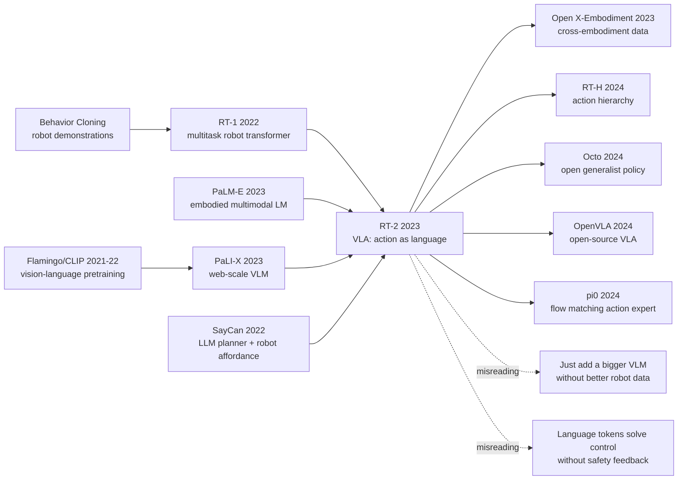

# RT-2: Vision-Language-Action Models Transfer Web Knowledge to Robotic Control

> **On July 28, 2023, Google DeepMind posted [arXiv:2307.15818](https://arxiv.org/abs/2307.15818) with a deceptively blunt proposal: if a VLM can emit text tokens, let it emit robot action tokens too.** RT-2 did not solve robotics by collecting every possible demonstration. It asked whether web-scale vision-language pretraining could leak into a closed-loop arm: numbers, icons, object categories, improvised tools, and simple reasoning became motions on a real kitchen robot across more than 6,000 trials. The surprise was not that the robot could describe the world; it was that some of that description could be detokenized into control.

## TL;DR

In 2023, Anthony Brohan, Noah Brown, Justice Carbajal, Yevgen Chebotar, Xi Chen, and 49 coauthors at Google DeepMind turned [RT-1](https://robotics-transformer1.github.io/) from a multitask behavior-cloning robot policy into RT-2, a vision-language-action model built on PaLM-E and PaLI-X. The central trick is almost embarrassingly simple: discretize each continuous robot action dimension into 256 bins, serialize the action as ordinary text tokens, and keep the same autoregressive objective $p(y_t|x_{\le t}, y_{<t})$, where $y_t$ may be a word or a robot-action token. This replaced the standard modular stack “VLM for perception or planning, separate policy for motor control” with one co-fine-tuned sequence model that consumes images and instructions and emits low-level actions. Across more than 6,000 real-robot trials, RT-2 retained performance on tasks seen in the robot data, raised unseen-scenario success from RT-1's 32% to 62%, improved emergent skill evaluations by more than 3x over RT-1/VC-1 style baselines, and reached 90% on Language-Table simulation versus prior baselines around 72-77%. Its longer-term influence runs through [Open X-Embodiment](https://robotics-transformer-x.github.io/), RT-H, Octo, $\pi_0$, and the current VLA wave: the counterintuitive lesson is that robot generalization may arrive not only from collecting more robot episodes, but from forcing actions into the token interface where web-scale models already have semantic structure.

---

## Historical Context

### Where robotics was stuck in 2022-2023

Before RT-2, general-purpose robotics was blocked by a simple and brutal fact: a robot mostly learned from what it had physically done. The web contains enormous knowledge about what an apple is, what the digit 3 looks like, which object resembles a hammer, and why an energy drink might help a tired person. Language models and vision-language models had already absorbed much of that knowledge into parameters. But a robot arm, at execution time, sees camera frames, gripper state, end-effector pose, and a continuous closed-loop action space. Both sides were called “intelligent,” yet their interfaces barely touched.

By 2022, the mainstream split into two broad camps. One was multitask behavior cloning, represented by RT-1, BC-Z, and Gato-style policies: collect many robot demonstrations, condition on language, and train one policy. The advantage was stable closed-loop action; the weakness was that long-tail generalization still followed the robot dataset. The other camp was “language model planner + low-level skill library,” represented by SayCan, Inner Monologue, and PaLM-SayCan: let an LLM decompose the task, then let a separate affordance model or controller execute. That route could use language knowledge, but world state and action feedback lived in separate systems, and visual grounding still had to cross a modular boundary.

RT-2 sits exactly in that crack. It did not first invent a new controller, and it did not use a VLM as an external captioning module. It asked a more direct question: if a language model is already a next-token predictor, can robot actions become tokens too? That sounds like an engineering trick, but it changes the route by which knowledge enters control. Knowledge no longer has to be translated through an explicit planner, semantic labeler, or task library; it can be co-trained with action in the same sequence model.

### The crossing point from RT-1 to PaLM-E

RT-1 provided the crucial physical substrate for RT-2: real office-kitchen multitask robot data. Google collected manipulation demonstrations with 13 robots over 17 months, covering pick, move, place, and related behaviors, and showed that a Transformer could directly map visual history and language commands to discretized actions. RT-1 was strong at “seen objects plus seen skill combinations.” But for commands like “move the banana to the result of 2+1,” “pick up the extinct animal,” or “choose something that can serve as a hammer,” the robot dataset contained almost no direct learning signal.

On the other side, PaLM-E and PaLI-X were pushing large models into multimodality. PaLM-E connected embodied observations to a language model and showed that images, state, and text could interact inside one Transformer. PaLI-X represented Google’s large-scale vision-language pretraining stack, strong at VQA, captioning, OCR, and open-category recognition. Their limitation was equally clear: being able to answer a question is not the same as closing the loop on a robot arm. Turning VLM semantics into executable motion required a bridge that did not destroy the pretrained interface.

RT-2 made that bridge narrow: write action sequences as ordinary strings and train them alongside VQA answers. This let PaLM-E / PaLI-X keep their output interface, avoided a separate action head, and removed the need to call an external planner at inference time. A pretrained model that once emitted “energy drink” could now, in the same vocabulary, emit an action-token string like “1 128 91 241 5 101 127 217.”

### Why Google DeepMind could build RT-2

RT-2 is the kind of paper only a few teams could execute. It needed three resources at once: long-running real-robot data collection rather than a simulation-only benchmark; large VLM backbones such as PaLM-E 12B and PaLI-X 55B; and infrastructure for thousands of blind real-robot trials. Remove any one of those ingredients and the paper collapses into “attach a VLM to a tabletop demo.”

The author list spans Google Robotics, DeepMind, Google Research, Stanford, and UC Berkeley. Brian Ichter, Karol Hausman, Sergey Levine, Fei Xia, Ted Xiao, Chelsea Finn, and many coauthors had already been working on RT-1, BC-Z, SayCan, and multitask robot learning. RT-2 was not a random post-ChatGPT robotics paper; it was Google’s robotics line rewritten for the foundation-model era: put multitask demonstrations into the token world of a VLM so that web knowledge can participate in low-level control training.

### Industry setting and research climate

The July 2023 timing matters. ChatGPT had forced the AI industry to reconsider the “foundation model plus downstream interface” pattern. PaLM-E, GPT-4V, Flamingo, and LLaVA made vision-language models look like plausible general perception layers. Robotics, however, was still trapped by expensive data, slow environments, and hard evaluation. An Internet model can generate millions of text samples in hours; a robot arm may need seconds or tens of seconds per attempt, can knock things over, can damage objects, and often requires human reset.

RT-2’s impact therefore was not just its metrics. It put a research judgment in plain view: robots cannot collect trillion-scale physical tokens the way the web provides text tokens, but they may be able to align limited robot actions with an existing web-trained token space. In other words, the first big reservoir of robot generalization might come not from a larger robot data lake, but from the semantic priors already stored inside VLMs.

## Background and Motivation

### Robot data cannot cover the long tail

Office-kitchen robot data can cover “pick up the apple,” “move the soda can,” or “put the sponge on the plate.” It cannot easily cover “place the object near the German flag,” “choose the drink best suited for someone who is tired,” or “pick an object that could serve as a makeshift hammer.” Those commands require object categories, symbols, numbers, world knowledge, and goal reasoning, not merely visual matching. Collecting demonstrations for every combination would explode combinatorially.

RT-2’s motivation is to move that long tail from “the robot must have physically experienced it” to “the robot can inherit it from VLM pretraining.” A VLM has seen dinosaurs, national flags, energy drinks, icons, digits, and the common-sense association between tiredness and caffeine or energy drinks. RT-2 asks not whether the VLM knows these things, but whether that knowledge can pass through an action-token interface and become closed-loop behavior of a robot arm.

### The new hypothesis introduced by VLM pretraining

The core hypothesis can be written in one sentence: if robot control can be cast as conditional sequence generation, web-scale vision-language pretraining does not have to stop at semantic recognition; it can transfer into action selection. This directly conflicts with much traditional robotics. The conventional instinct is to separate perception, planning, and control. RT-2 compresses “see the image, read the command, infer the goal, emit the action” into one autoregressive model.

That compression is risky. Action tokenization can lose continuous-control precision, large-model inference can slow the control loop, and a language-style objective does not automatically guarantee safety. But the reward is equally clear: a robot task can now borrow open-category recognition, OCR, symbol understanding, and common-sense reasoning from a VLM. RT-2’s motivation is to stress-test that tradeoff on real robots rather than in a purely illustrative demo.

---

## Method Deep Dive

### Overall framework: writing actions as another language

RT-2 does not begin with a new controller architecture; it begins with an interface decision. The input remains robot camera images, a natural-language instruction, and action history. The output is no longer a separate continuous action head, but a string processed by a standard tokenizer. The first token indicates whether to continue or terminate the current episode, and the following tokens encode end-effector position deltas, rotation deltas, and gripper state. The project page gives an example string, “1 128 91 241 5 101 127 217”: to the model it is a token sequence, and to the robot controller it is detokenized into the next action.

This design lets RT-2 reuse VLMs such as PaLM-E and PaLI-X directly. During training, a batch can contain web vision-language tasks such as VQA, captioning, and OCR, alongside robot trajectory examples: image + instruction + action string. During inference, the model observes the current image and command, autoregressively emits action tokens, and the system decodes those tokens into low-level control before the next frame enters the loop.

$$
a_t = \operatorname{detok}\left(\arg\max_{y} p_\theta(y \mid o_{\le t}, \ell, y_{<t})\right)
$$

Here $o_{\le t}$ denotes visual observations up to the current step, $\ell$ is the language instruction, and $y$ is the model output token. The formula is ordinary; the important change is the meaning of $y$. The same token space can now represent both “the object is a banana” and “move left, rotate, close the gripper.”

### Key design 1: action tokenization

Action tokenization is RT-2’s smallest and most consequential design. Continuous robot actions reuse RT-1’s discretized representation: each action dimension is quantized into finite bins and then serialized as ordinary text tokens. This gives up some control resolution, but it buys a major benefit: the VLM output interface remains unchanged. The model needs no extra regression head and no action decoder bolted onto the language model.

| Action field | Meaning | Why tokenization works |
|---|---|---|
| episode flag | continue or terminate | binary decision is already discrete |
| delta position | end-effector position delta | each axis quantized into 256 bins |
| delta rotation | end-effector rotation delta | each axis quantized into 256 bins |
| gripper | gripper opening/closing | continuous value binned or snapped to endpoints |

```python
def encode_action(action, bins=256):
    fields = [action.terminate]
    fields += quantize(action.delta_position, bins=bins)
    fields += quantize(action.delta_rotation, bins=bins)
    fields += quantize([action.gripper], bins=bins)
    return " ".join(str(token) for token in fields)


def policy_step(model, image, instruction, history):
    prompt = pack_multimodal_context(image, instruction, history)
    token_string = model.generate(prompt, stop_at_action_boundary=True)
    return decode_action(token_string)
```

The motivation is pragmatic. Robot control typically wants continuous, smooth, low-latency actions; VLMs are excellent at discrete token prediction. RT-2 does not force a VLM to learn continuous control natively. It projects control into a form the VLM already handles well. The projection is imperfect, but it is sufficient for tabletop manipulation and, more importantly, opens a path for web knowledge to influence action selection.

### Key design 2: co-fine-tuning rather than fine-tuning alone

If the model is fine-tuned only on robot data, it can forget web VQA and captioning abilities. If web tasks dominate, it never learns low-level action. RT-2 uses co-fine-tuning: robot trajectories and original vision-language tasks are mixed during training so that the model preserves semantic competence while learning control. In effect, this is a multitask distillation recipe: robot data teaches the model how to move, while web data keeps reminding it what the world is.

| Training recipe | Preserves web knowledge | Learns closed-loop control | Main failure mode |
|---|---|---|---|
| VLA trained from scratch | weak | moderate | not enough data; poor generalization |
| VLM fine-tuning only | moderate | moderate | VQA/OCR semantics can be overwritten |
| RT-1 data only | weak | strong | long-tail commands do not generalize |
| RT-2 co-fine-tuning | strong | strong | expensive; depends on closed VLMs and real robot data |

This choice explains why RT-2 is not merely “replace RT-1 with a larger model.” Larger models carry richer pretraining knowledge, but if the training recipe fails to preserve that knowledge, robot fine-tuning can wash it away. The paper and project page both identify pretrained weights, co-fine-tuning, and model size as central contributors to the generalization gains.

### Key design 3: VLA closed-loop inference

RT-2 inference is not one-shot plan generation; it is closed-loop control. At each step, the model sees the current camera image and instruction, emits a short action-token string, the robot executes it, and the next frame goes back into the model. This separates RT-2 from “ask an LLM for a plan, then hand it to a controller.” In RT-2, semantic reasoning and action output live inside the same network, and visual feedback re-enters the decision at every step.

That closed loop explains why RT-2 can solve tasks that look symbolic, such as “move banana to the sum of two plus one” or “pick up the extinct animal.” The model is not merely answering “2+1=3” or “a dinosaur is extinct.” It must bind that intermediate knowledge to a specific object and location in the current scene. Success requires the VLM to know the answer, the visual system to localize the object, and the policy to move the gripper correctly.

### Training objective and implementation details

RT-2 keeps a standard autoregressive token loss; the only twist is mixed sample origin. For robot examples, the target is an action string. For web vision-language examples, the target is a natural-language answer. To the model, both are token sequences; to the system, only outputs ending at an action boundary are passed to the robot controller.

This unified objective has two consequences. The upside is engineering simplicity: any sufficiently strong VLM can in principle be converted into a VLA without designing a complex action-specific architecture. The downside is that control quality is constrained by tokenization and discretization, and the model does not automatically understand physical safety. RT-2 is therefore best read as a proof of paradigm: putting actions into the language interface can transfer web knowledge to robot control, but it does not solve all of robot learning.

---

## Failed Baselines

### Failed baseline 1: RT-1 behavior cloning alone

RT-1 is RT-2’s direct predecessor and its most important failed baseline. RT-1 had already shown that a multitask robot Transformer could learn stable tabletop manipulation from real demonstrations. But its knowledge boundary largely matched the robot-data boundary. For seen objects, seen skill combinations, and rearrangements in similar environments, RT-1 worked well. Once a command required web semantics, the model had little support.

RT-2’s replacement for RT-1 was not simply “a larger network plus more robot data.” It changed the knowledge source. RT-1 primarily learned from demonstrations collected by 13 robots over 17 months. RT-2 preserved that control experience while adding PaLM-E / PaLI-X web-scale vision-language pretraining. The result was that performance on seen tasks was retained while unseen-scenario success rose from RT-1’s 32% to 62%. The baseline lost not because of low-level motor instability, but because it lacked semantic long-tail coverage.

| Baseline | Source of capability | Why it loses to RT-2 |
|---|---|---|
| RT-1 | behavior cloning from robot demonstrations | data does not cover symbolic, numeric, and common-sense long tails |
| VC-1 | large-scale visual pretraining | visual representation only; no language-action token interface |
| R3M | video / interaction representation learning | transferable features, but no direct semantic action generation |
| MOO / VLM-as-detector | VLM for open-world object recognition | recognition and closed-loop control remain separate |

### Failed baseline 2: visual pretraining is not vision-language pretraining

VC-1 and R3M are useful baselines precisely because they make the distinction visible. Large-scale visual data can improve robot representations, but RT-2 tries to transfer semantic relations from the web, not just visual features. A command like “pick up the extinct animal” requires knowing that a dinosaur is extinct. “Move the banana to the result of 2+1” requires arithmetic, symbol recognition, and spatial action. Pure visual pretraining can help the robot see objects, but it does not necessarily know how those objects relate inside language.

That is why RT-2 uses VLMs rather than a vision backbone alone. Visual pretraining helps the model see; vision-language pretraining helps it understand and condition behavior on language. Robot control needs both. If perception is weak, the gripper lands in the wrong place. If semantics are weak, common sense and symbols in the command cannot determine the target.

### Failed baseline 3: training from scratch or fine-tuning only

The paper and project page emphasize two ablations: pretrained weights matter, and co-fine-tuning matters. A VLA trained from scratch does not have enough robot data to learn web knowledge. A VLM fine-tuned only on robot actions can overwrite its VQA, OCR, and open-category abilities. RT-2’s training recipe looks conservative because it is designed to avoid both extremes.

The lesson is direct: a VLA is not created merely by attaching an action head to a large model. Action tokenization supplies the interface, pretraining supplies semantics, co-fine-tuning prevents forgetting, and real robot data supplies closed-loop control. Remove any one of those pieces and the model risks becoming a demo rather than a repeatably evaluated robot policy.

## Key Experimental Data

### Real-robot generalization evaluation

RT-2’s evaluation scale is one reason it belongs in a classics list. The project and blog state that evaluation covered more than 6,000 real-robot trials, not just a few videos. The tests include seen tasks, unseen objects / backgrounds / environments, and emergent skills requiring symbol understanding, reasoning, and human recognition. RT-2’s claim is not that every robotics task is solved; it is that the model keeps RT-1’s original competence while substantially improving unseen-scenario and semantic generalization.

| Evaluation item | RT-1 / prior baseline | RT-2 result | Interpretation |
|---|---|---|---|
| seen RT-1 tasks | RT-1 strong | RT-2 largely retained | VLM pretraining did not erase low-level skill |
| unseen-scenario success | 32% | 62% | web pretraining sharply improves OOD generalization |
| emergent skills | RT-1 / VC-1 low | more than 3x improvement | digits, icons, categories, and common sense affect action |
| Language-Table simulation | LAVA 77% | 90% | transfer remains useful under another embodiment |
| real Language-Table | limited training objects | handles novel objects | not merely simulation overfitting |

### Language-Table transfer

Language-Table is a useful test of whether RT-2 only works for Google’s office-kitchen robot arm. On this open task suite, the model reached 90% success in simulation, above BC-Z at 72%, RT-1 at 74%, and LAVA at 77%. More importantly, the paper also evaluates the same model in the real Language-Table setting with objects such as ketchup bottles and bananas that were not present in the training set.

The historical meaning is larger than the single number: the VLA interface of “actions as language” is not tied to one fixed scene. It may transfer across embodiments. But RT-2 does not fully solve cross-robot general control. Language-Table is a small and controlled probe; later Open X-Embodiment / RT-X work pushed the question toward mixed multi-robot data.

### CoT control probe

RT-2 also includes a distinctly 2023 experiment: add “Plan:” and “Action:” structure to the data so the model first emits a natural-language plan and then emits action tokens. Examples include choosing a rock as an improvised hammer or choosing an energy drink for a tired person. This does not turn the robot into a reliable long-horizon planner, but it shows that one VLA can alternate language reasoning and action control in the same sequence.

The probe matters because it compresses the SayCan-style “LLM planner plus policy” split into one model. Planning is no longer only external text, and action is no longer only an external controller. Both share context, visual input, and parameters. This direction influenced later VLA work, but it also leaves obvious problems: a language plan may sound plausible without being physically validated, and an action token can fail without built-in correction or a safety proof.

---

## Idea Lineage



### Ancestors

RT-2 has two direct ancestral lines. One is multitask robot learning: BC-Z showed that language-conditioned robot policies could generalize across new combinations, and RT-1 pushed real robot data to a scale where a Transformer policy could be trained. The other is the vision-language foundation-model line: CLIP, Flamingo, PaLI, and PaLM-E showed that web image-text pretraining can create open-category recognition, OCR, VQA, and common-sense associations. RT-2’s contribution is not to advance either line alone, but to merge their interfaces.

SayCan is the intermediate node. It had already brought LLM knowledge into robot task planning, but planning and low-level control remained two systems. RT-2 moves that boundary inside the model: not “a language model tells a robot what to do,” but “a VLM-style model emits robot action tokens itself.” In that sense, RT-2 marks a turn from modular robot intelligence toward tokenized embodied policy.

### Descendants

After RT-2, VLA quickly became a central phrase in robot foundation-model work. Open X-Embodiment / RT-X attacked RT-2’s largest weakness: narrow robot data and limited embodiment diversity. Octo and OpenVLA made generalist policy learning more open, giving non-Google groups a way to train and reproduce similar ideas. RT-H, $\pi_0$, and the Diffusion Policy family revise RT-2 from another angle: actions do not necessarily have to be language-like and discrete; continuous action experts, action hierarchies, and diffusion or flow matching may be better suited for fine control.

That inheritance is revealing. Later work largely accepts RT-2’s big claim, that semantic pretraining should enter action policies. But it does not always accept RT-2’s specific interface, that all actions should be written as text tokens. This is what makes the paper classic: the question it posed outlived the implementation detail it used.

### Misreadings

The first misreading is “just make the VLM bigger and the robot will generalize.” RT-2 itself argues against that. Without RT-1 robot demonstrations, web knowledge does not teach a model how a gripper closes. Without co-fine-tuning, web knowledge can be overwritten during robot fine-tuning. A VLM is a semantic prior, not a replacement for physical experience.

The second misreading is “action tokenization solves control.” RT-2’s action interface is clever, but it fits relatively low-frequency, short-horizon tabletop manipulation. For contact-rich tasks, high-speed motion, bimanual coordination, or strict safety constraints, discrete tokens and autoregressive latency become serious limitations. RT-2’s durable contribution is the idea of a unified interface, not the doctrine that every robot action should forever be a string.

---

## Modern Perspective

### Which assumptions held up

From the vantage point of 2026, RT-2’s strongest surviving assumption is that semantic pretraining belongs inside robot policies, not merely behind an external perception API. Later VLA, OpenVLA, Octo, RT-X, and $\pi_0$ work all inherit that judgment in different forms. Robot generalization is no longer framed only as “collect more demonstrations.” It is framed as “how do we jointly train Internet semantics, cross-embodiment data, and low-level action?”

The second assumption that held up is that interfaces matter. RT-2’s action tokenization may not be the final answer, but it proved that a strong interface can make incompatible supervision sources train together. Web VQA, captioning, OCR, and robot action trajectories no longer require completely different model heads. They can be placed inside one conditional sequence-modeling problem. This idea of unifying heterogeneous supervision as tokens or sequences has spread into agents, tool use, multimodal UI automation, and robot policy learning.

### Which assumptions broke down

RT-2’s shakiest assumption is that discrete language tokens are sufficient to carry robot action. Later work increasingly shows that low-level control needs continuity, smoothness, and correctability. Action tokens are well suited for turning a VLM into a first-generation VLA, but they are not necessarily ideal for high-precision assembly, deformable-object manipulation, bimanual coordination, or long-horizon mobile manipulation. Many current models use a language or vision-language backbone for semantic intent and a diffusion, flow-matching, or action-expert module for continuous control; that is a correction to RT-2.

Another assumption that does not fully hold is the representativeness of the evaluation environment. Office kitchens and Language-Table are much simpler than real homes, factories, or hospitals. RT-2’s more than 6,000 real-robot trials are unusually valuable, but they still sit inside limited embodiments, limited object distributions, and short-horizon tasks. The paper proves that web knowledge can transfer to control; it does not prove that VLAs are already safe and reliable in the open world.

### If RT-2 were rewritten today

If I were rewriting RT-2 today, I would keep the idea that action should enter the foundation-model interface, but I would not necessarily write every action as a text token. A more likely architecture would use a VLM / VLA backbone for semantic grounding, goal selection, and coarse action intent, plus a continuous action expert for high-frequency control. The two parts would align through shared latents or action chunks rather than sending every control dimension through a text vocabulary.

Training would also lean more heavily on cross-embodiment data and offline-online loops. RT-2’s data mainly came from the RT-1 system. Today, one would mix Open X-Embodiment, simulation, teleoperation, human video, and self-supervised interaction, then use real robots to correct failure modes online. Safety would need explicit constraints: collision checks, force limits, recovery policies, and human-interpretable stop conditions before and after action-token generation.

## Limitations and Future Directions

### Embodied data and reproducibility

RT-2’s largest limitation is not merely that it lacks an official code release. It depends on assets that most external teams cannot reproduce: RT-1 robot data, PaLM-E / PaLI-X backbones, real-robot evaluation sites, and large engineering infrastructure. Without those assets, the community can reproduce the idea but not the exact experiment. This is why OpenVLA, Octo, and Open X-Embodiment matter: they move RT-2’s question from an internal Google system toward a more open research platform.

Looking forward, the key problem for VLAs is not just larger models but clearer data protocols. Different robots, cameras, action spaces, and task languages still have to be aligned. RT-2’s action-as-token interface is one alignment strategy, but future systems may need richer action schemas, physical-unit standards, contact-state annotations, and failure logs.

### Reliable control and safety loops

RT-2 demonstrates semantic generalization, but it does not provide strong safety guarantees. A VLA may know that a knife is sharp and still execute a risky action because of visual error, action discretization, or instruction ambiguity. Autoregressive confidence is not physical safety. Real deployment requires VLAs to work with safety shields, world models, force feedback, anomaly detection, and human intervention mechanisms.

In the long run, RT-2’s direction makes robot safety harder, not easier. Failures of classical controllers can often be analyzed in state spaces and constraints. VLA failures also include semantic hallucination, instruction misunderstanding, misuse of common sense, and data bias. Future systems should not ask only “what is the success rate?” They should ask whether failures are predictable, interruptible, and recoverable.

## Related Work and Insights

### Relationship to later VLA lines

After RT-2, robot foundation models split into roughly three lines. The data line, represented by Open X-Embodiment / RT-X, mixes many robot datasets and tries to buy generalization through cross-embodiment diversity. The open-source line, represented by OpenVLA and Octo, pulls VLA training out of closed systems and lowers the barrier for the community. The action-modeling line, represented by RT-H, Diffusion Policy, and $\pi_0$, rethinks action representation with hierarchies, chunks, diffusion, or flow matching to address the control weaknesses of text tokens.

RT-2’s lesson for all of these lines is: do not treat semantics and control as modules that must remain forever separate. Even if the final system still has a planner, policy, and safety layer, the training signal should let semantic goals and action outcomes see one another. A robot does not only need better perception, and it does not only need better control; it needs a learning interface that connects “what I know” with “what I can do.”

### Lessons for researchers today

First, interface choices can matter more than small model modifications. RT-2 did not invent an elaborate new network, but by pushing action into token space it opened a channel from web knowledge to control. Second, real evaluation is expensive but irreplaceable. Without more than 6,000 real-robot trials, RT-2 would be easy to dismiss as a polished demo; the evaluation scale is what gives it historical weight.

Third, do not mistake a first successful interface for the final answer. RT-2’s action tokenization is a usable interface, not the end state of physical control. The research question today is how to preserve VLM semantic transfer while handing execution to continuous action models, feedback control, and safety constraints that better match the physical world.

## Resources

### Paper and project

| Resource | Link | Note |
|---|---|---|
| RT-2 paper | https://arxiv.org/abs/2307.15818 | paper entry |
| RT-2 project page | https://robotics-transformer2.github.io/ | videos, figures, citation |
| Google DeepMind blog | https://deepmind.google/discover/blog/rt-2-new-model-translates-vision-and-language-into-action/ | official summary and key numbers |
| RT-1 project page | https://robotics-transformer1.github.io/ | direct predecessor |

### Further reading

The best reading order is to start with RT-1, to understand how a multitask robot Transformer learns closed-loop control from real demonstrations; then read SayCan, to see why the split between LLM planning and low-level affordance is useful but incomplete; then read PaLM-E / PaLI-X, to understand the semantic source of the VLM backbone; and finally read Open X-Embodiment, OpenVLA, Octo, and $\pi_0$, to see how the community revised RT-2’s data, openness, and action-representation limitations.

The most durable part of RT-2 is not a single metric, but a research posture: when two fields have incompatible interfaces, the answer is not always a more elaborate bridge. Sometimes recoding one side into the representation the other side already understands opens a new path.


---

> 🌐 [中文版](/era5_genai_explosion/2023_rt2/) · 📚 awesome-papers project · CC-BY-NC