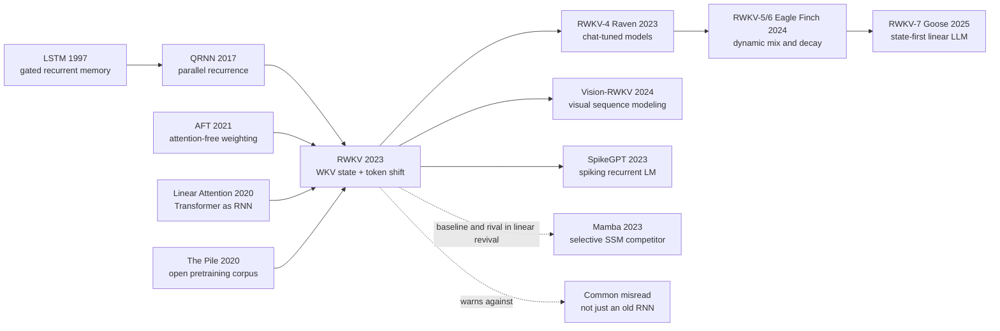

# RWKV - Reinventing RNNs for the Transformer Era

> **On May 22, 2023, Bo Peng, Eric Alcaide, Quentin Anthony, and 32 other authors posted [arXiv:2305.13048](https://arxiv.org/abs/2305.13048) under the deliberately provocative title RWKV: Reinventing RNNs for the Transformer Era.** The hook was not nostalgia for recurrent networks. It was a systems claim with teeth: train like a Transformer, by parallelizing over tokens, but decode like an RNN, carrying only a constant-size state instead of a growing KV cache. RWKV scaled from 169M to 14B parameters on the 330B-token Pile epoch, making attention-free large language models feel less like a toy alternative and more like a real open-source architecture family.

## TL;DR

Peng, Alcaide, Anthony, and their collaborators' 2023 RWKV paper joined the parallel-training ambition of the [Transformer](../era3_attention/2017_transformer.md) with the constant-state inference of RNNs through the WKV operator: time-mixing maintains numerator and denominator states $a_t=e^{-w}\odot a_{t-1}+e^{k_t}\odot v_t,\; b_t=e^{-w}\odot b_{t-1}+e^{k_t}$ and emits $\sigma(r_t)\odot\frac{a_{t-1}+e^{u+k_t}\odot v_t}{b_{t-1}+e^{u+k_t}}$, so training can use a time-parallel CUDA kernel while decoding updates only a recurrent state. The baselines it challenged were the two stuck poles of 2023 sequence modeling: LSTM/GRU-style RNNs had memory-efficient inference but poor training parallelism and weak scaling; Reformer, Performer, Linear Transformer, AFT, and related efficient Transformers had attractive asymptotics but rarely proved themselves at 10B+ dense LLM scale; standard Transformers remained strongest but carried a KV cache that grows with context. RWKV trained six Pile models from 169M to 14B parameters and made attention-free LLMs empirically comparable with similarly trained Transformers. Its later significance is visible in RWKV-v5/v6/v7, ChatRWKV, Vision-RWKV, and the broader linear-sequence revival that also includes Mamba (2023). The hidden lesson is that the Transformer did not kill recurrence as an idea; it killed the old engineering package around recurrence.

---

## Historical Context

### The 2023 bottleneck: Transformers were strong, but KV cache was getting expensive

After ChatGPT's breakout, almost everyone in 2023 treated “large language model” as shorthand for decoder-only Transformer. The default was justified: Transformers trained in parallel, absorbed large corpora, and kept validating scaling behavior through GPT-3, PaLM, Chinchilla, and LLaMA. The cost was becoming equally visible. During autoregressive inference, every generated token leaves behind key/value tensors for every layer and head. As context windows moved from 2K and 4K toward 32K, 128K, and beyond, KV cache memory grew linearly with context and started dominating throughput, memory, and latency.

RNNs therefore looked like an obsolete idea with a strangely attractive deployment property. They stream naturally; their state does not grow with prompt length; their decoding path resembles real serving workloads more closely than attention over a growing cache. But old RNNs had their own fatal package: serial training, hard long dependencies, and poor scaling. LSTM and GRU solved part of the gradient problem, but not the large-scale parallel pretraining problem. After 2017, RNNs mostly disappeared from mainstream NLP, surviving in speech, time series, and edge settings.

RWKV's historical hook sits exactly there. It does not merely say “RNNs are better than Transformers.” It asks a narrower and harder question: **can we keep recurrent-state inference while making the training path resemble Transformer's parallel matrix-multiply workload?** If yes, long-context inference and edge deployment gain another route.

### From LSTM to AFT: the road back to RNNs was already paved

RWKV's ancestry is not only recurrent networks. One line is obviously LSTM, GRU, QRNN, and SRU: recurrent architectures trying to make state updates more stable, more parallel, or simpler. QRNN is especially relevant because it uses parallel convolutions to produce gates, then recurrent pooling over time, already splitting the work into parallel local computation plus sequential state update.

The second line is efficient Transformers. Reformer, Linformer, Performer, Linear Transformer, BigBird, Longformer, MEGA, and AFT all ask whether the $O(T^2)$ cost of standard attention is unavoidable. AFT matters most for RWKV because it replaces query-key dot-product attention with a simpler weighted key-value aggregation. RWKV borrows the shape of an attention-free weighted average from AFT, then restricts the positional weight into a channel-wise exponential decay over relative distance so the operator can be rewritten as a recurrence.

The third line is open LLM infrastructure. The Pile, GPT-NeoX, Pythia, OPT, and BLOOM gave the open community corpora, checkpoints, and baselines for comparing large-model training curves and tasks. Without these, RWKV would have been another “fast on small models” architecture experiment. Training six models from 169M to 14B on the Pile placed RWKV on the same empirical table as Transformer-era LLMs.

### How a community project became a paper

RWKV does not look like a standard academic architecture paper. Bo Peng, as BlinkDL, iterated the model in the open across GitHub, Discord, and the EleutherAI community, moving from v1 through v4 while adjusting formulas, initialization, kernels, and training scripts. The paper's long author list reflects that history: model design, model training, scaling laws, benchmarks, long-context experiments, inference speed, chat experiments, and ethics were distributed across many contributors. RWKV reads like an open-source system being formalized into a paper, not a paper that later happened to receive a repository.

That explains the paper's engineering texture. It cares not only about a clean equation, but also small embedding initialization, time-decay initialization, bias-free linear layers, custom CUDA kernels, token shift, prompt order, ChatRWKV runtime, and mobile or web inference. Its ambition is not to beat attention on one toy benchmark. It is to build an attention-free LLM family that a community can train, release, chat with, and deploy.

### Compute, data, and open-source climate

The main experiments train on the Pile, about one 330B-token epoch. Models range from 169M to 14B parameters, using bf16, Adam, exponential learning-rate decay, 1024-token pretraining context, and longer-context continuation. This was already a serious scale in 2023. It was not GPT-4-scale closed training, but it was far beyond the usual small-model demo of linear attention.

The open-source climate mattered just as much. LLaMA's February 2023 release made people ask whether the open 7B/13B/30B range had to be Transformer-only. RWKV's Apache-2.0 code, Hugging Face weights, ChatRWKV demo, and community runtimes made it not just a paper but a playable architecture candidate. It did not dethrone the Transformer, but it made attention-free LLMs a legitimate subject of mainstream debate.

## Background and Motivation

### The core contradiction: parallel training, streaming inference

RWKV's problem statement is simple: **during training we want Transformer's parallel throughput; during inference we want RNN's constant state.** Traditional RNNs have the second property but not the first. Standard Transformers have the first property but not the second. RWKV tries to parallelize most matrix multiplications and token projections while compressing the truly recurrent part into a channel-wise WKV state.

This goal imposes two constraints. First, time weighting cannot depend on arbitrary current-query to past-key dot products; otherwise every token must look back at all history and constant-state inference disappears. Second, the model cannot collapse into a content-blind moving average, or it will lose the selection behavior language modeling needs. RWKV's compromise is to use four quantities: $K$ as write strength, $V$ as written content, $R$ as the receptance gate deciding whether the current token receives history, and $W$ as the per-channel time decay.

### Goal: write attention as a recurrent state

RWKV's core goal is not “make a faster RNN.” It is to write an attention-like aggregation as a recurrent state. In parallel training, WKV can be viewed as a weighted aggregation along the time dimension. In sequential inference, the same formula maintains numerator, denominator, and a numerical-stability exponent state. The model is identical; only the execution mode changes: batch training uses a time-parallel kernel, one-token generation uses recurrent update.

This is what the phrase “Reinventing RNNs for the Transformer Era” really means. It is not a return to 1997 LSTM. It repackages recurrence inside 2023 large-model engineering: pretraining corpora, scaling laws, CUDA kernels, open checkpoints, chat tuning, long context, and multi-device deployment.

---

## Method Deep Dive

### Overall Architecture

An RWKV block contains two residual sub-blocks: time-mix and channel-mix. Time-mix writes historical token information into a channel-wise decayed WKV state. Channel-mix behaves like a gated feed-forward module over channels. The result looks like a Transformer block replacement: LayerNorm, residual connections, projection matrices, and gated nonlinearities are still present, but standard multi-head self-attention and a growing KV cache are gone.

| Module | Main parameters | Function | Transformer intuition |
|---|---|---|---|
| Token shift | $\mu_r,\mu_k,\mu_v$ | Mix current and previous token inputs | Adds local recurrence to every layer |
| Time-mix | $R,K,V,W,U$ | Write, decay, and read historical state | attention-like token mixing |
| Channel-mix | $R',K',V'$ | gated FFN with squared ReLU | FFN / MLP block |
| State tuple | $x,y,a,b,p$ | constant-size inference state | replaces growing KV cache |

The core idea is to store history as a numerator/denominator exponential moving average. During training, a full sequence can be sent through a time-parallel kernel. During inference, each new token only updates state. In serving, RWKV therefore behaves less like a Transformer accumulating KV tensors and more like a rolling state machine.

### Key Design 1: Token Shift - injecting the previous timestep into parallel projections

Token shift is RWKV's simplest and most important local mechanism. Instead of using a complex recurrence to produce $R,K,V$, it mixes the current input $x_t$ with the previous token input $x_{t-1}$ channel-wise before applying linear projections. The major projections remain large matrix multiplications, so training stays parallel, but every layer can explicitly compare “this token” with “the previous token.”

$$
r_t = W_r(\mu_r\odot x_t + (1-\mu_r)\odot x_{t-1}),\quad
k_t = W_k(\mu_k\odot x_t + (1-\mu_k)\odot x_{t-1}),\quad
v_t = W_v(\mu_v\odot x_t + (1-\mu_v)\odot x_{t-1}).
$$

The design buys two things. First, it avoids the hard serial bottleneck of classical RNNs where every projection depends on the previous hidden state. Second, it gives each layer a cheap local difference signal, useful in character-level, Chinese, and BPE-level language modeling. The RWKV repository repeatedly emphasizes token-shift as one of the small tricks that make the architecture train well.

### Key Design 2: WKV Operator - writing an attention-like weighted average as recurrence

The WKV operator is the heart of RWKV. Intuitively, $K$ decides how strongly a token writes information, $V$ is the content written, $W$ is per-channel time decay, $U$ gives the current token a special bonus, and $R$ decides how much historical information the current token receives. The paper's parallel form can be understood as an exponentially decayed weighted average over historical $k_i\odot v_i$:

$$
\operatorname{wkv}_t=
\frac{\sum_{i=1}^{t-1}e^{-(t-1-i)w+k_i}\odot v_i + e^{u+k_t}\odot v_t}
{\sum_{i=1}^{t-1}e^{-(t-1-i)w+k_i}+e^{u+k_t}}.
$$

The key is that the equation can be written as an RNN cell:

$$
a_t=e^{-w}\odot a_{t-1}+e^{k_t}\odot v_t,\qquad
b_t=e^{-w}\odot b_{t-1}+e^{k_t},\qquad
o_t=W_o\bigl(\sigma(r_t)\odot\operatorname{wkv}_t\bigr).
$$

In complexity terms, standard attention makes weights depend on $q_t^\top k_i$, so the current token dynamically selects arbitrary historical tokens. RWKV gives up arbitrary pairwise selection and uses per-channel decay curves plus key strength. That is both its largest gain and its largest limitation: constant state and linear time on one side, weaker exact recall of old details than full attention on the other.

### Key Design 3: Receptance gate and Channel-mix - not just a moving average

If RWKV only had an exponential WKV average, it would be a nice learnable EMA. What makes it closer to a large-model block is the receptance gate and channel-mix. Receptance $R$ is a sigmoid gate deciding how much history the current token receives. Channel-mix is a gated FFN-like transform over the current channel representation.

RWKV's channel-mix uses squared ReLU, similar to the efficient FFN choice validated in Primer:

$$
o'_t=\sigma(r'_t)\odot \left(W'_v\,\max(k'_t,0)^2\right).
$$

This makes RWKV more than “linear attention in recurrent form.” It keeps several ingredients that made Transformers successful: LayerNorm, residual connections, gates, FFN-like channel mixing, and careful initialization. The paper and repository both stress initialization, including small embeddings, time-decay curves, and zero-initialized matrices. These engineering details decide whether deep RWKV stacks train stably.

### Key Design 4: Dual execution modes - time-parallel training and time-sequential inference

The same RWKV model can execute in two modes. In training, all token projections and most pointwise operations are parallel. The WKV part has temporal dependence, but a custom CUDA kernel computes it efficiently across batch, time, and channel dimensions. In inference, the model stores only a handful of state vectors per layer: time-mix input, channel-mix input, WKV numerator, WKV denominator, and a numerical-stability exponent.

| Mode | Input shape | State cost | Use case | Main benefit |
|---|---|---|---|---|
| Time-parallel | full sequence $(B,T,D)$ | training activations | pretraining and fine-tuning | Transformer-like throughput |
| Time-sequential | one new token | constant per-layer state | autoregressive decoding | no growing KV cache |
| Extended context | 1024 -> 8192 continuation | state size does not grow | long-context tuning | lower long-sequence loss |

The pseudocode below captures the essence of inference mode. The real implementation uses an additional $p_t$ state for numerical stability and avoids exponent overflow; this version keeps the readable form.

```python
def rwkv_step(x_t, state, params):
    prev_x, prev_y, a, b = state
    xk = params.mix_k * x_t + (1 - params.mix_k) * prev_x
    xv = params.mix_v * x_t + (1 - params.mix_v) * prev_x
    xr = params.mix_r * x_t + (1 - params.mix_r) * prev_x

    k = params.key(xk)
    v = params.value(xv)
    r = torch.sigmoid(params.receptance(xr))

    current_num = torch.exp(params.u + k) * v
    current_den = torch.exp(params.u + k)
    wkv = (a + current_num) / (b + current_den)
    y = params.output(r * wkv)

    next_a = torch.exp(-params.w) * a + torch.exp(k) * v
    next_b = torch.exp(-params.w) * b + torch.exp(k)
    return y, (x_t, y, next_a, next_b)
```

This code shows RWKV's most valuable property: generating the next token does not require reading every historical key/value tensor. It only needs the state. For low latency, long context, CPU/mobile inference, and batch serving, that is not a constant-factor tweak but a different system shape.

### Loss and engineering recipe

RWKV still trains with standard next-token cross-entropy. The unusual parts are the engineering recipe: one Pile epoch, exponential learning-rate decay, Adam, bf16, no weight decay in the main setting, a custom CUDA WKV kernel, and progressive context extension. The paper's scaling-law analysis reports that RWKV loss follows an approximately log-log linear trend with compute, with $r^2=0.994$ on Pareto-optimal points, suggesting it does not obviously fall off the scaling track the way many older RNNs did.

The method is conservative and radical at the same time. Conservative, because it keeps the language-model objective and most large-model training discipline. Radical, because it turns “attention is the irreplaceable core of LLMs” into an empirical engineering claim: if a recurrent WKV state can remain competitive at 14B scale, the next generation of linear sequence models is no longer a toy discussion.

---

## Failed Baselines

### Old RNNs: memory-efficient, but not large-model trainable

RWKV's first baseline is the traditional RNN family itself. LSTM, GRU, QRNN, and SRU all have an attractive property: inference state is fixed-size and the model does not need to preserve the whole past. But they lost badly in the large-model era, not because one equation was ugly, but because their training path mismatched GPUs and massive corpora. Hidden-state dependence over time makes it hard to flatten a sequence into large matrix multiplications, while long dependencies remain vulnerable to gate saturation, truncated BPTT, and gradient noise.

RWKV's persuasion comes from inheriting the inference shape of RNNs without inheriting the training shape of old RNNs. It does not scale LSTM to 14B. It redesigns time-mix so most computation remains parallel projection, while the recurrent part becomes a WKV state suitable for kernels.

### Efficient Transformers: elegant complexity, insufficient large-model evidence

The second baseline group is the 2020-2023 efficient Transformer ecosystem. Linformer, Reformer, Performer, Longformer, BigBird, AFT, MEGA, and others reduce some attention costs through low rank, local windows, kernel features, or attention-free weighted averages. Many of these methods looked good on small models or long-sequence benchmarks, but did not train and release dense LLM families in the tens-of-billions parameter range.

RWKV's paper repeatedly leans on that distinction. Many “linear attention” papers claimed better asymptotics, but did not provide 10B-scale open models. RWKV pushed the scale to 14B, moving the question from “is theoretical complexity linear?” to “can this architecture form an evaluable LLM family like Transformers do?”

### Standard Transformers: high quality, but growing inference state

The third baseline is the real mainstream RWKV challenges: OPT, Pythia, BLOOM, and related standard Transformers. They are stable, well-tooled, and broadly evaluated. RWKV does not crush them on every task. Its claim is that, under comparable parameter counts and training tokens, RWKV is close enough to exchange some quality risk for structural gains in inference state and long-context deployment.

This is the easiest part of the paper to misread. RWKV does not prove that Transformers failed. It proves that non-Transformers need not fail. In 2023, that was already meaningful: once an attention-free model does not collapse at scale, system pressures such as KV cache, mobile inference, CPU serving, long context, and privacy deployment give it renewed value.

### Failure signals inside the paper itself

RWKV's weaknesses are also clear. First, a linear state compresses history into finite vectors, so exact recall of far-away details is weaker than full attention; the limitations section explicitly notes that a single vector representation over many timesteps can hurt minutiae recall. Second, prompt-order sensitivity is stronger because an RNN-like model cannot reassign attention to arbitrary earlier prompt positions while generating. Third, math reasoning and complex chain-of-thought remain weak: Appendix L reports that Raven reaches only 5.43% accuracy on MathQA even with a chain-of-thought prompt.

| Baseline / failure | Why it was natural | Where it got stuck | RWKV's treatment |
|---|---|---|---|
| LSTM / GRU | constant state, mature RNNs | serial training, poor scaling | WKV time-parallel kernel |
| QRNN / SRU | more parallel recurrence | no LLM family emerged | scales to Pile 14B models |
| AFT / Linear Transformer | linear complexity | insufficient large-model evidence | recurrent WKV reformulation |
| Standard Transformer | strongest quality | KV cache grows with context | constant-state inference |
| RWKV itself | efficient state compression | exact recall and prompt order sensitivity | long-context tuning and prompt reordering |

## Key Experimental Data

### From 169M to 14B: open training at dense-RNN scale

The first key data point is model scale. The paper trains six Pile models, all for one roughly 330B-token epoch. The point of the table is not any one parameter count, but proof that an RNN-like architecture can be trained with a dense large-model recipe into the tens of billions.

| Model | Layers | Dimension | Parameters | FLOPs per token |
|---|---:|---:|---:|---:|
| RWKV-169M | 12 | 768 | 169M | 2.613e8 |
| RWKV-430M | 24 | 1024 | 430M | 7.573e8 |
| RWKV-1.5B | 24 | 2048 | 1.515B | 2.823e9 |
| RWKV-3B | 32 | 2560 | 2.985B | 5.710e9 |
| RWKV-7B | 32 | 4096 | 7.393B | 1.437e10 |
| RWKV-14B | 40 | 5120 | 14.15B | 2.778e10 |

Scaling-law analysis is the second important point. The authors train 45 RWKV models with different parameter and data budgets, finding an approximately log-log linear compute-loss relationship, with $r^2=0.994$ on Pareto-optimal points and $r^2=0.875$ even after extrapolating one order of magnitude. This tells the community that RWKV is not merely a memory-saving trick; within the observed range, it follows the rough scaling shape expected of large language models.

### NLP benchmarks, long context, and LRA

For NLP evaluation, RWKV is compared with similarly trained Transformer families such as Pythia, OPT, and BLOOM across ARC, BoolQ, COPA, HeadQA, HellaSwag, LAMBADA, OpenBookQA, PIQA, ReCoRD, SciQ, and Winogrande. The story is not universal domination. It is average competitiveness under comparable FLOPs and tokens. This restraint matters: RWKV's value comes from the quality-efficiency bundle, not a single SOTA cell.

The long-context experiment is closer to RWKV's core pitch. The authors pretrain at 1024 context, then continue to 2048 for 10B tokens, 4096 for 100B tokens, and 8192 for another 100B tokens. Figure 6 shows lower Pile test loss as context length increases, suggesting RWKV is not merely claiming infinite state in a formal sense; it can use longer contexts to improve language modeling.

| Experimental axis | Setting | Main finding | Meaning |
|---|---|---|---|
| Zero-shot NLP | 12 common tasks | comparable average to same-tier Transformers | attention-free LLMs enter the table |
| Scaling laws | 45 training points | Pareto fit $r^2=0.994$ | scaling does not obviously derail |
| Extended context | 1024 -> 8192 | Pile test loss decreases | state can use longer context |
| LRA | 1K-16K tasks | second only to or near S4 on many tasks | long-sequence bias is useful |

### Inference behavior and prompt sensitivity

Inference experiments compare RWKV with BLOOM, OPT, GPT-Neo, Pythia, and related models on CPU and A100 80GB generation time and extra memory. Absolute values depend on implementation, precision, and hardware, but the curve shape matters most: Transformer generation grows burdened by KV cache and reads over time, while RWKV keeps per-layer state and does not add memory linearly with context.

Appendix L reveals the other side. RWKV is more sensitive to information order. In RTE, changing a prompt originally designed for ChatGPT into an order more suitable for RWKV improves F1 Macro from 44.2% to 74.8%. But on MathQA, Raven reaches only 5.43% accuracy even with a chain-of-thought prompt. This is valuable because it warns users that RNN-like LLMs are not drop-in Transformer replacements; prompt and task formats may need to be redesigned.

| Phenomenon | Number / observation | Reading | Risk |
|---|---|---|---|
| RTE prompt reorder | 44.2 -> 74.8 F1 | order matters strongly for RWKV | default GPT prompts may misfit |
| MathQA | 5.43% with CoT | math reasoning is weak | not a strong-Transformer substitute |
| Sarcasm | Raven can surpass the ChatGPT setting | some classification tasks fit well | task dependence is large |
| Inference curve | RWKV cumulative time is linear | long generation is friendlier | kernel quality decides experience |

Overall, RWKV's experiment does not say “Transformers lost.” It says “architectures outside attention finally produced evidence that is large, open, and comparable enough to matter.” For architecture research in 2023, that was a real shift.

---

## Idea Lineage



### Past lives: old RNNs, linear attention, and open training infrastructure

RWKV has three past lives. The first is gated recurrence after LSTM: it proved that state plus gates can carry sequential information, but it lost the Transformer era on training parallelism. The second is linear attention and AFT around 2020-2021: these works simplified pairwise attention into linearly computable aggregation, preparing the idea that attention-like computation can be written as recurrence. The third is open training infrastructure such as the Pile, Pythia, and GPT-NeoX: they let a new architecture be compared with Transformers on similar corpora and benchmarks.

RWKV is special because it does not start only from theoretical complexity. It starts from building open models. It advances equations, CUDA kernels, weights, chat demos, and community runtimes together. In idea history, it is closer to the first complete engineering package for recurrent LLM revival than to a single algorithmic tweak.

### Descendants: a forerunner in the linear-sequence revival

After RWKV, the lineage splits into two branches. One branch is the RWKV family itself: Raven, RWKV-v5/v6, Eagle/Finch, and RWKV-7 Goose, improving time mix, dynamic decay, state tuning, long context, and multimodal uses. The other branch is the wider linear sequence model revival: RetNet, Mamba, Hyena, and the SSM family all ask related questions about how to model long context with less than full attention.

RWKV's meaning for the second branch is not always direct ancestry; it is comparable evidence. The Mamba paper uses RWKV-4 as a baseline, meaning RWKV had entered the standard comparison set for new architectures. When a model becomes something later papers must compare against, it has already gained idea-historical weight.

### Misreadings / oversimplifications

The most common misreading is “RWKV is just old RNNs revived.” That is inaccurate. Old RNNs were blocked by serial training; RWKV's core move is to rewrite most training computation as parallel matrix multiplies plus a WKV kernel. It keeps recurrent state, not the 1990s training package.

The second misreading is “RWKV proves attention is unnecessary.” Also inaccurate. RWKV proves attention-free LLMs can scale into a comparable regime, but full attention remains stronger and more mature for exact retrieval, complex in-context learning, strong reasoning, and ecosystem tooling. RWKV is better read as a systems tradeoff: when context length, device constraints, memory, or privacy matter more than peak single-model capability, it becomes a serious option.

The third misreading is “constant state equals infinite context.” State size not growing with length does not mean all historical details are retained. RWKV's state is compression, and compression implies forgetting and selection. The paper's prompt-order sensitivity, weak MathQA, and minutiae-recall limitation are all concrete signs of that cost.

---

## Modern Perspective

### What still holds in 2026

Looking back from 2026, RWKV's most durable judgment is that **inference state is a first-class architectural metric**. In 2023, many discussions still centered on training loss and benchmark scores. RWKV pushed KV cache, long generation, CPU/mobile serving, Web runtime, and streaming state into the foreground. Later Mamba, RetNet, Jamba, Hyena, linear attention, GQA, and MLA all confirmed the same broad point from different angles: how a model stores history at inference time is not an implementation detail; it is part of architecture competition.

The second durable judgment is that open-source systems must be runnable. The RWKV repository, ChatRWKV, Hugging Face weights, RWKV.cpp, WebGPU demos, and mobile runtimes make its influence larger than a formula paper. An attention-free architecture that lives only in tables cannot pressure the Transformer ecosystem. One that can chat locally, run on phones, and attract community runtimes can keep generating evidence.

### Assumptions later corrected

First, the assumption that fixed time decay can stand against attention indefinitely has weakened. RWKV-v6/v7 introduce dynamic mix and dynamic decay; Mamba introduces input-dependent SSM parameters. These later moves show that content-dependent selectivity remains crucial. RWKV-v4's fixed decay was a first proof of route feasibility, not the final form.

Second, the assumption that pure recurrent state can fully replace KV cache has also been corrected. Modern strong systems often use hybrids: Mamba plus attention, Jamba with MoE plus Mamba plus attention, and Transformers with GQA or MLA to compress KV cache. Practice looks more like multi-objective tradeoff than one architecture replacing all others.

Third, prompt format is not surface decoration for RWKV. Appendix L shows that information order can change performance dramatically. For recurrent or state-space models, a prompt is not just a text wrapper; it is the order in which state is written. That lesson also matters for long-context and agent design.

### If the RWKV paper were rewritten today

If RWKV were rewritten in 2026, comparison with Mamba, RetNet, and Hyena would likely move into the main storyline rather than sit in the broader efficient-Transformer background. It would evaluate needle-in-a-haystack, passkey retrieval, long-context QA, code editing, tool use, and multi-hop reasoning, because these tasks most directly separate compressed state from addressable KV memory.

A modern version would also emphasize hardware and kernels more. The original paper already has custom CUDA, but 2026 readers would ask: what are RWKV's throughput, latency, energy, and batch-serving curves on H100, MI300, Apple Silicon, mobile NPUs, and WebGPU? “No KV cache” is a complete advantage only when the hardware path cashes it out.

## Limitations and Future Directions

### Memory ceiling from state compression

RWKV's largest structural limitation is finite-state compression. A Transformer's KV cache is expensive, but it explicitly stores key/value tensors for every historical token. RWKV continuously compresses history into numerator, denominator, and state vectors. Compression gives constant memory and inevitably loses information. Tasks requiring verbatim copying, exact retrieval from far back, multi-evidence rereading, and complex in-context learning magnify this problem.

Future improvements can go several ways: larger or hierarchical states, optional external memory, a small number of attention layers, or stronger dynamic selection as in later RWKV versions. The real question is not whether to use state, but whether the state is addressable, interpretable, updateable, and composable.

### Training and evaluation still lag the Transformer ecosystem

One of the Transformer's largest advantages is ecosystem maturity: training frameworks, FlashAttention, GQA, MoE, quantization, inference serving, benchmarks, and data recipes are all mature. RWKV is active and open, but many tools need specialized adaptation. Once users leave the official kernel and recommended initialization, performance can degrade. A new architecture wins not only by equations, but by a reproducible full-stack recipe.

Evaluation also needs updating. The original zero-shot NLP and LRA evaluations are reasonable starting points, but not sufficient for a 2026 reader. Long-context retrieval, repository-scale code editing, multi-turn agent tasks, mathematical reasoning, audio/image token modeling, and edge-device energy are the tests where RWKV-like models should prove themselves.

### Open community opportunity

RWKV's largest opportunity remains open-source and edge deployment. It has no growing KV cache, its runtime state is controlled, and it is naturally friendly to CPU, mobile, browser, WebGPU, and privacy-preserving local deployment. As local models move from “can chat” toward always-on personal assistants, a small-state model that can run continuously and support state tuning becomes attractive.

Another opportunity is multimodal sequences. Image patches, audio tokens, event streams, and sensor time series can all be treated as sequences. RWKV's linear recurrence may be more natural than full attention in some of these regimes. Vision-RWKV, Diffusion-RWKV, SpikeGPT, and related community projects show that RWKV's influence is not limited to text.

## Related Work and Insights

### Lessons for architecture research

RWKV's first lesson for architecture research is: do not compare only training complexity; compare inference state. The Transformer's $O(T^2)$ training problem can be mitigated by FlashAttention, chunking, GQA, and other engineering, but KV-cache growth at inference remains a central long-context serving cost. RWKV writes that cost into the architecture itself.

The second lesson is that old ideas can revive under new system conditions. The RNN idea of state was not wrong; the old package lacked stable, parallel, scalable implementation. Similarly, SSMs, linear attention, convolutions, and external memory may become serious candidates again when hardware and training scale change.

### Lessons for engineering systems

From an engineering perspective, RWKV is a case where formula, kernel, checkpoint, runtime, and community advanced together. Outside the paper, ChatRWKV, RWKV.cpp, WebGPU demos, Hugging Face models, and Discord feedback made it usable. That feedback then pushed v5/v6/v7. For new architectures, a community loop is itself a research instrument.

RWKV also reframes prompts for recurrent/state models. A prompt is not surface interaction; it is a program for writing state. Whether the premise comes before the hypothesis, or the question before the evidence, changes how state is formed. This matters for future long-context agents because it turns prompt engineering into memory programming.

## Resources

### Original resources and further reading

| Type | Resource | Note |
|---|---|---|
| Paper | [arXiv:2305.13048](https://arxiv.org/abs/2305.13048) | RWKV v4 paper |
| Code | [BlinkDL/RWKV-LM](https://github.com/BlinkDL/RWKV-LM) | official code, training scripts, model history |
| Runtime | [ChatRWKV](https://github.com/BlinkDL/ChatRWKV) | chat and inference examples |
| Successor | [RWKV-5/6 Eagle and Finch](https://arxiv.org/abs/2404.05892) | later dynamic mix and dynamic decay |
| Related | [Mamba](https://arxiv.org/abs/2312.00752) | later strong linear-time sequence competitor |

The best reading order is: first read Section 3 and Appendix D of the paper to understand how WKV becomes an RNN cell; then read the minimal inference implementations for RWKV-v4/v5 in the official repository; finally compare RWKV with Mamba, RetNet, and Linear Transformer. That avoids the common misread “old RNNs are back” and reveals the real attempt: reconnect recurrent state to large-model engineering.


---

> 🌐 [中文版](/era5_genai_explosion/2023_rwkv/) · 📚 awesome-papers project · CC-BY-NC