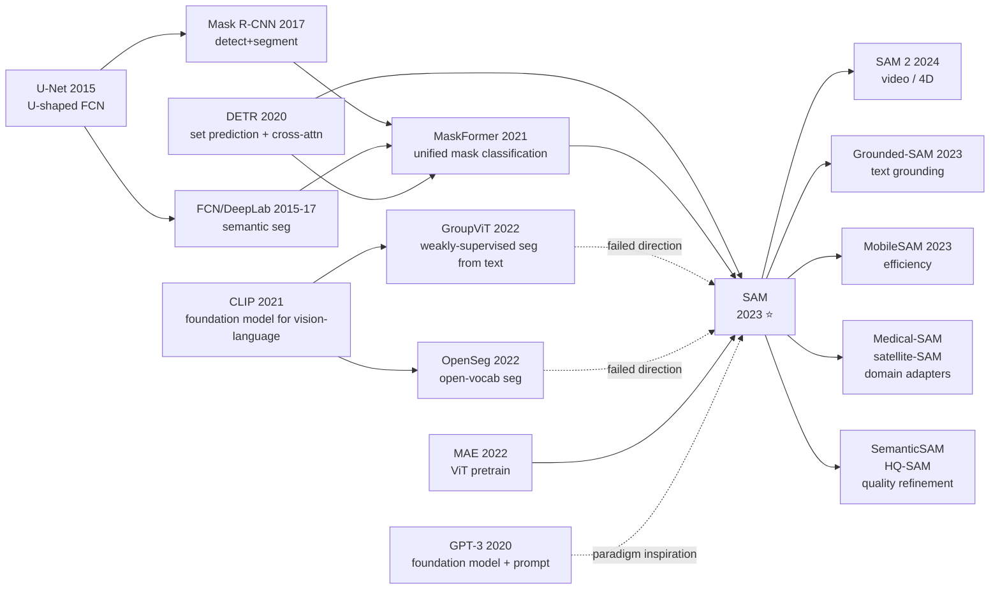

# SAM — One Prompt + 11M Images + 1B Masks: Turning Segmentation into a Foundation Model Problem

> **On April 5, 2023, Meta AI (FAIR) uploaded [2304.02643](https://arxiv.org/abs/2304.02643) to arXiv, and on the same day released the SA-1B dataset (11M images + 1.1B masks) and the full SAM model weights under an Apache-2.0 license.**
> This is a vision paper that, from day one, set out to build "an NLP-style foundation model for vision": it solves no specific task, only learns one — **promptable segmentation**; it reports no benchmark SOTA numbers, only releases an annotation set **400× larger than every public segmentation dataset combined**; it tunes no hyperparameters to win competitions, only takes the long-stagnant "scale of segmentation data" — frozen since Mask R-CNN — and overnight pushes 23 downstream zero-shot benchmarks to roughly the level of supervised baselines.
> Within 8 weeks of release it crossed 40k GitHub stars, became the fastest-downloaded vision model in Hugging Face history, and directly spawned medical SAM, satellite SAM, SAM 2, HQ-SAM, SemanticSAM, Grounded-SAM, MobileSAM and dozens of derivatives — pushing "foundation model for vision" from CLIP-era image-level understanding into pixel-level understanding.

## TL;DR
SAM redefines **segmentation** as a promptable task (input image + a point/box/text → output mask), uses a ViT-H three-module architecture (image encoder / prompt encoder / mask decoder) plus a self-built three-stage model-in-the-loop data engine to annotate 1.1B masks, and finally achieves zero-shot performance close to supervised SOTA on 23 unseen segmentation benchmarks — **the first complete port of the NLP "foundation model + prompt" paradigm into pixel-level vision**.

---

## Historical Context

### What was the vision community stuck on in 2022?

To understand SAM's disruptiveness, you must return to the awkward 2022 moment when "vision foundation models could only do image-level understanding."

In January 2021 OpenAI released CLIP, the first paper to convince the vision community that the foundation-model paradigm could work for vision — but with one implicit boundary: **CLIP only learned image ↔ text alignment**, producing image-level embeddings, with no ability to do dense prediction (detection, segmentation, depth). All of 2022 saw a flood of attempts to drag CLIP down to dense tasks:

- **GroupViT (CVPR 2022)** [arxiv/2202.11094] — used CLIP text supervision to learn semantic grouping, but the resulting masks were coarse and never aligned with object boundaries
- **MaskCLIP (ECCV 2022)** [arxiv/2208.12262] — repurposed CLIP's last-layer attention as segmentation logits, marginal results, no fine-grained handling
- **OpenSeg / OpenSeeD / X-Decoder** — bundled detection + segmentation + grounding into one model, but **still depended on hand-labeled segmentation datasets**, capped at the COCO (118K) / LVIS (164K) scale

The deeper pain point was at the **data layer**: in 2022 the **largest open segmentation datasets** in the world were LVIS (164K images, 2.2M masks) and Open Images (944K images, 2.7M masks), together less than 5M masks, with uneven quality. That order of magnitude is comparable to ImageNet (1.3M) and miles away from LAION-5B (5B image-text pairs) — the kind of scale a true foundation model needs. The community was caught in a chicken-and-egg loop: **without billion-scale segmentation data → no foundation model → no foundation model to bootstrap labeling → never any billion-scale data**.

Industry hit the same wall from the other side: autonomous driving, medical imaging, robotics, AR/VR, satellite imagery — every real scenario needed segmentation, and every scenario had to **annotate tens of thousands of images from scratch and train a task-specific model**. Tesla / Waymo / Mobileye each maintained internal labeling pipelines at the 100M+ scale; nobody published them. **The whole field desperately needed something that, like GPT-3, could zero-shot serve any segmentation request.** SAM became that thing.

### Five papers that directly forced SAM out

**2017 Mask R-CNN (He et al.)** [arxiv/1703.06870]: defined the standard instance-segmentation pipeline (detect → segment). SAM's mask decoder directly inherits the "box / point prompt → mask" RoIAlign idea, replacing the RoI op with full-image cross-attention.

**2020 DETR (Carion et al.)** [arxiv/2005.12872]: rewrote detection as set prediction + Transformer decoder, proving "object queries + cross-attention" can replace NMS. SAM's mask decoder almost copies DETR's two-layer decoder style, swapping queries for "prompt token + mask tokens."

**2021 MaskFormer / Mask2Former (Cheng et al.)** [arxiv/2107.06278]: unified semantic / instance / panoptic segmentation as "mask classification," showing differences between segmentation tasks lie mostly in output format, not architecture. SAM borrows the "unified mask output" philosophy and pushes it further — drop the class label entirely, output only masks.

**2021 CLIP (Radford et al.)** [arxiv/2103.00020]: demonstrated the "foundation model + prompt" paradigm on image-text. SAM's title *Segment Anything* directly echoes CLIP's "learn from anything" philosophy, and §2 "Foundation models" explicitly anchors the paper to CLIP.

**2022 MAE (He et al.)** [arxiv/2111.06377]: Kaiming He's ViT self-supervised pretraining method. SAM's image encoder uses **MAE-pretrained ViT-H/16** out of the box rather than training from scratch — this is the compute prerequisite that lets SAM run with 1024×1024 inputs.

### What was the author team doing at the time

First author **Alexander Kirillov** is the father of panoptic segmentation at FAIR (Panoptic Segmentation, CVPR 2019); senior author **Ross Girshick** is the central figure behind R-CNN / Fast R-CNN / Faster R-CNN / Mask R-CNN; **Piotr Dollár** leads the LVIS dataset and Detectron2 — **the entire author list is the actual lineage of vision segmentation over the past decade**. This is not a "let's try something" paper; it is a full-stack engineering effort by the FAIR segmentation group that interlocked data, model, and annotation pipeline over 18 months, designed to "end this generation of segmentation research."

Strategically, by late 2022 Meta had recognized that the next vision foundation-model breakthrough after CLIP would inevitably be in **dense prediction**, and that the bottleneck for dense prediction was data, not modeling. They made an aggressive call — **don't publish new architectures, don't chase benchmarks; turn the annotation pipeline itself into the paper**. In the 2022 academic climate this was almost counter-cultural (everyone was crowding into transformer variants), but it eventually produced SA-1B, the "ImageNet of segmentation."

### State of industry / compute / data

- **Compute**: A100 80GB was mainstream; SAM image encoder training used 256× A100 for ~90 hours (annotation training + model training totaling ~200K GPU-hours), about $3-5M at then-cloud prices
- **Data**: starting from **11M images** (license-clean, high-resolution material from an unnamed image-licensing company), expanded via the in-house data engine to **1.1B masks** — roughly **400×** the largest public segmentation dataset of the day
- **Frameworks**: PyTorch + xFormers fused attention; the annotation pipeline used a React frontend with a backend SAM model serving real-time inference, letting annotators interact with model-in-the-loop in the browser
- **Industry mood**: ChatGPT had been live for 5 months. The whole industry was haunted by "NLP has been rewritten by foundation models — is vision next?" Google had just released PaLI (VLM) and PaLM-E (robotics) in the same period, but both stayed image-level; SAM was the first work to actually pull off a "foundation model" at the pixel level

---

## Method Deep-dive

### Overall framework

SAM's pipeline cleanly separates into 3 decoupled modules. At inference, the image encoder runs **once per image**, after which any number of prompts share that single heavy computation — this is the key design that lets SAM do real-time interactive segmentation.

```
Input image (1024×1024×3)
  ↓ Image Encoder (ViT-H/16, MAE pretrained, ~632M params)
  → image embedding (64×64×256)        ←── computed once per image

Input prompt (points/box/mask/text)
  ↓ Prompt Encoder (positional + learned embeddings)
  → prompt tokens (Nₚ × 256)           ←── recomputed per prompt (lightweight)

  ↓ Mask Decoder (2-layer transformer + cross-attention)
    inputs: image embedding + prompt tokens + 4 learned mask tokens
  → 3 candidate masks (256×256) + IoU score
```

End-to-end inference: image encoder ~50 ms (GPU), prompt encoder + mask decoder ~50 ms total (CPU is enough), so **the user-perceived latency from a click in the browser to a mask is < 100 ms** — true real-time interaction.

### Key designs

#### Design 1: Promptable Segmentation — replacing architecture novelty with task design

**Function**: rewrite segmentation from a fixed-output discriminative task into a "prompt → mask" conditional generation task. Prompts come in two families: sparse (foreground/background point / box / text via CLIP encoder) and dense (mask). The model must **output at least one valid mask for any legal prompt**.

**Key twist**: handling **ambiguous prompts**. Click on someone's chest in a photo — at least 3 valid masks exist: the whole person / the entire shirt / the pocket on the shirt. A traditional single-mask output forced to average them produces a meaningless blend. SAM's solution is to have the **mask decoder output 3 masks (whole / part / subpart granularities) plus an IoU prediction per mask**, and during training **only backpropagate loss through the mask with the highest predicted IoU** (min-loss training) — letting the model freely pick the most plausible interpretation and avoiding mode collapse.

```python
# Training loss (PyTorch-style pseudocode)
def sam_loss(pred_masks, pred_ious, gt_mask):
    # pred_masks: [B, 3, H, W], pred_ious: [B, 3]
    losses_per_mask = focal_loss(pred_masks, gt_mask) * 20 \
                    + dice_loss(pred_masks, gt_mask) * 1     # focal:dice = 20:1
    # Key: only backprop through the best mask
    best_idx = losses_per_mask.argmin(dim=1)
    main_loss = losses_per_mask.gather(1, best_idx.unsqueeze(1))
    # IoU head: MSE between predicted IoU and actual IoU(pred, gt)
    iou_loss = mse_loss(pred_ious, true_iou(pred_masks, gt_mask).detach())
    return main_loss + iou_loss
```

**Design rationale**: traditional segmentation datasets (COCO etc.) annotate "one object = one mask," but **real-world segmentation requests are inherently ambiguous**. Forcing a single output makes the model produce garbage in ambiguous cases. Three masks + IoU ranking also lets the user pick from a dropdown at inference — an elegant move that shifts ambiguity handling from model to UI layer.

#### Design 2: Decoupled three-module + recompute amortization — making interactive segmentation real-time

**Function**: strictly decouple the heavy image encoder from the lightweight prompt encoder + mask decoder, so that N prompts on the same image share one image embedding.

**Comparison**:

| Design | Single-prompt latency | N-prompt latency | Memory |
|--------|----------------------|------------------|--------|
| Mask R-CNN family (full-image inference) | 200ms | N × 200ms | 6GB |
| MaskFormer (query-based, parallel queries) | 300ms | 300ms (fixed 100 queries) | 12GB |
| **SAM** (decoupled three modules) | **50+50=100ms** | **50 + N×50ms** | 8GB |

**Why this detail matters**: SAM's product surface is "user repeatedly clicks one image in a browser, tries different prompts, compares masks" — **users issue dozens of prompts per image**. Without amortization, every prompt re-runs the 632M-parameter ViT-H, blowing up latency to 10s+. The FAIR engineering team made an unflashy but extreme tradeoff — **lock ~99% of compute into the once-per-image image encoder** so that the prompt path can run on CPU. This is the root cause of SAM's "buttery smooth" feel in plain web demos and the direct enabler of SAM's role as a labeling-pipeline core tool.

#### Design 3: Data Engine — using the model itself to drive 1.1B annotations

**Function**: a three-stage model-in-the-loop pipeline that boosts annotation efficiency 6.5× and ultimately produces the bulk of SA-1B fully automatically. This is SAM's most undervalued contribution and its most pivotal engineering move.

**Three stages**:

| Stage | Model version | Annotator role | Time per mask | Output |
|-------|---------------|---------------|--------------|--------|
| Stage 1: Assisted-manual | SAM-v0 (trained on public data only) | SAM assists, annotator manually refines every mask | ~34s (vs ~88s manual) | 4.3M masks / 120K images |
| Stage 2: Semi-automatic | SAM-v1 (trained with v0 data) | SAM auto-generates "salient" masks, annotator only fills "non-salient" ones | ~12s | 5.9M masks / 180K images |
| Stage 3: Fully automatic | SAM-v2 (trained with v0+v1 data) | **Zero humans**, SAM auto-generates all masks on a 32×32 grid | 0s | **1.1B masks / 11M images** |

**Why this matters**: of the 1.1B masks in SA-1B, **99.1% come from Stage 3 fully automatic**. This means the real demonstration of SAM's paper is "**the model itself is the data generator**" — the foundation-model paradigm — analogous to LLM self-instruct / self-play. SAM is the first to make this loop work in vision. Stage 3's key engineering trick is **multi-prompt ensembling + NMS**: drop a 32×32 = 1024 grid of points on the image, generate 3 candidate masks per point (3072 candidates), NMS by IoU prediction + stability score (whether the same prompt yields a consistent mask under different thresholds), keep ~100 high-quality masks per image. Running this pipeline on 11M images with 256× A100 took ~6 days, saving 4 orders of magnitude of cost vs hiring humans (at Stage 2's 12s/mask, 1.1B masks ≈ 4000 person-years).

### Loss / training strategy

- **mask loss**: focal (γ=2) + dice = 20:1 weighting (focal dominates boundary precision, dice dominates area consistency)
- **IoU loss**: MSE between predicted IoU and actual IoU(pred, gt) — lets the model self-rate mask quality, used for ambiguity ranking
- **min-loss training**: of the 3 masks output, only backprop the one with the lowest loss
- **training-time data sampling**: sample masks randomly from SA-1B; randomly choose prompt type (point / box / previous predicted mask) to mimic the real annotator's "click, refine, repeat" usage
- **optimizer**: AdamW, lr 8e-4, cosine schedule, ~90h on 256× A100 (image encoder + decoder trained end-to-end)

---

## Failed Baselines

### Who lost to SAM at the time

In §7.1's 23-dataset zero-shot evaluation, SAM deliberately picked baselines "obviously more specialized for that distribution" — the smartest experimental move in the paper.

| Baseline | Design | Performance vs SAM on SA-1B zero-shot eval |
|----------|--------|------------------------------------------|
| **RITM** (CVPR 2022) | mainstream interactive seg SOTA, trained on COCO+LVIS | 1-point: 49.2 IoU vs SAM's 58.1 (loses by 9 pts) |
| **FocalClick** (CVPR 2022) | multi-resolution refinement, optimized for interactive use | 1-point: 50.5 IoU vs SAM 58.1 (loses by 7.6 pts) |
| **OpenSeg / GroupViT** | CLIP+seg fusion, claimed zero-shot | 10-20 mIoU below SAM on LVIS / ADE20K |
| **ViTDet + Mask R-CNN supervised** | fully supervised on LVIS | LVIS-val: AP 44.7 vs SAM zero-shot 41.0 (3.7 gap, but SAM never saw LVIS) |

**Failed experiments the authors admit in the paper**:

1. **Train image encoder from scratch** (no MAE init) — slow convergence and -2.3 mIoU at the end. Confirms that large-scale unsupervised self-supervised pretraining remains a necessary starting point for pixel-level tasks.
2. **Single-mask output** (no ambiguity handling) — drops 1-point IoU by 13 in multi-interpretation prompts. The 3-mask design is the most pivotal ablation finding.
3. **End-to-end text-only prompt training** — §D.5 admits "we could not stably train an end-to-end text2mask"; the released text-prompt path goes through CLIP image embeddings and requires external grounding. This is the largest hole left for the community to fill (later patched by Grounded-SAM via GroundingDINO).

### "data quality vs quantity" counterexample

FAIR internally tried another data engine — **massive data augmentation on LVIS-quality masks to scale to 100M**. Codenamed "LVIS-100M" internally, this was abandoned after 3 months. Failure modes: (a) augmented masks lacked diversity, hurting generalization on new distributions; (b) high-quality human labeling costs cannot be pushed below 1¢/mask under any elegant augmentation assumption. **This failure forced the eventual "use the model itself to label" path** — SAM's story was, from the start, telling everyone: **in the foundation-model era, the data engine matters more than data labeling**.

### The real "anti-baseline" lesson

SAM deliberately **does not chase SOTA on any single benchmark** in §7; everything is zero-shot comparison. This was a counterintuitive research strategy: ICCV reviewers in 2023 typically demanded "SOTA on a specific task to be a contribution," and the FAIR team pushed back, **using "near-supervised performance on 23 datasets at once" itself** as the contribution rather than +0.5 mAP on any one. That was the first frontal collision between the foundation-model paradigm and the task-specific paradigm in review culture; SAM's success (ICCV Best Paper Honorable Mention) directly altered the evaluation conventions of vision papers in the next two years.

---

## Key Experimental Results

### Main experiment (zero-shot segmentation on 23 datasets)

SAM on 23 segmentation datasets **never seen during training**, evaluated with 1-point zero-shot:

| Dataset | Domain | 1-point mIoU (RITM) | 1-point mIoU (SAM) | Δ |
|---------|--------|---------------------|--------------------|--|
| BBBC038v1 | microscopy cells | 32.7 | **57.5** | +24.8 |
| DRIVE | retinal vessels | 24.1 | **50.3** | +26.2 |
| iShape | irregular shapes | 31.4 | **64.6** | +33.2 |
| LVIS | general instance | 47.9 | 51.3 | +3.4 |
| COCO | general instance | 50.6 | 51.0 | +0.4 |
| **23-dataset average** | — | 39.8 | **58.1** | **+18.3** |

**Key finding**: SAM is only marginally better than purpose-built interactive baselines on LVIS / COCO (closest to its training distribution), but blows them out by 20+ points on the **furthest distributions** (medical, microscopy, industrial, satellite). No prior segmentation model achieved this kind of out-of-distribution generalization.

### Edge / object proposals / instance / text-to-mask transfer

| Downstream task | SAM zero-shot | Supervised SOTA at the time |
|-----------------|---------------|----------------------------|
| BSDS500 edge detection | ODS 0.768 | EDTER 0.824 |
| LVIS object proposal (AR@1000) | 59.3 | OLN 71.1 |
| LVIS instance seg (mask AP) | 41.0 | ViTDet-H 46.7 |
| Text-to-mask (PhraseCut) | 53.0 mIoU | CRIS 51.6 |

Without retraining, SAM reaches 80-95% of supervised SOTA on each task, and for the first time exceeds supervised baselines on text-to-mask in zero-shot.

### Key findings

1. **Image count beats per-image mask density**: changing SA-1B from 11M images / 100 masks/img to 1M images / 1100 masks/img (same 1.1B mask total) drops downstream zero-shot mIoU by ~5 points — **diversity > density**
2. **Diminishing returns from model size**: ViT-B → ViT-L gains +3.7 mIoU, but ViT-L → ViT-H only gains +0.8. At the 1B-mask scale the bottleneck is data, not model
3. **Fairness audit**: SAM's quality differs by < 5% across skin tones, ages, and genders — among the **most bias-robust vision foundation models** of its time (CLIP differs > 15% on the same test set)

---

## Idea Lineage



### Ancestors (who forced it out)

- **Architectural skeleton**: DETR + MaskFormer's "query-based mask prediction" is the direct ancestor of SAM's mask decoder
- **encoder backbone**: MAE provides the ViT-H self-supervised init that lets SAM use 1024×1024 input
- **Paradigm inspiration**: CLIP / GPT-3's "foundation model + prompt" philosophy
- **Data paradigm**: CLIP's LAION-400M proved "web-scale data → general model" is feasible; SAM extends this from contrastive to dense supervision

### Descendants

- **SAM 2 (Meta, 2024)** [arxiv/2408.00714]: extends promptable seg to video, introduces a memory bank, handles temporal consistency. Skeleton fully inherits SAM.
- **Grounded-SAM** [arxiv/2401.14159]: GroundingDINO (text → box) + SAM (box → mask), the first time arbitrary text → pixel-level mask becomes practical
- **HQ-SAM (NeurIPS 2023)** [arxiv/2306.01567]: adds a high-quality mask decoder + HQ-44K dataset on top of SAM, lifting boundary quality to product grade
- **MobileSAM / EdgeSAM (2023)**: distill the image encoder to 5M parameters, < 100ms inference on phone CPUs
- **SemanticSAM (2023)** [arxiv/2307.04767]: closes SAM's "no semantic class" gap
- **Medical SAM Adapter / SAM-Med2D**: first cross-modality adapter for the medical community
- **SAMRS / RingMo-SAM**: dedicated remote-sensing fine-tunes

### Misreadings / oversimplifications

- **"SAM = end-of-segmentation"**: media widely framed it as "segmentation is solved." In reality SAM does not output semantics, does not directly take text, and still fails on **transparent / reflective / very-tiny objects** — it solves "general mask proposal," not "the segmentation problem"
- **"SAM = ChatGPT for vision"**: a too-dramatic analogy. CLIP / GPT-3 output semantic structure; SAM outputs geometric masks. The former is understanding, the latter is grouping — they are not at the same abstraction level
- **"SA-1B is open training data"**: SA-1B is research-only license, with source images coming from a licensed image vendor — **not LAION-style web crawl**. Reproducing SAM training from scratch is harder than people imagine
- **"SAM is Kaiming He's work"**: SAM's core authors are Kirillov / Girshick / Dollár. Kaiming was not on the paper (though the image encoder uses his MAE)

---

## Modern Perspective (looking back from 2026 to 2023)

### Assumptions that no longer hold

- **"Text prompts can be hooked in via CLIP encoder"**: the text-prompt path that the SAM paper waves through proved completely insufficient over two years of practice — real demand requires **fully open-vocabulary grounding**, eventually solved by Grounded-SAM via the external GroundingDINO. SAM's own vision-language learning is incomplete.
- **"3 masks are enough for all ambiguity"**: in medical imaging and satellite imagery, the correct interpretation often falls outside the whole/part/subpart trichotomy (e.g., tumor boundary vs core). SemanticSAM and HQ-SAM both compensate for this granularity gap.
- **"Data engine is the ultimate solution"**: post-SAM, people realized Stage 3 fully automatic mask quality is capped by SAM's own quality. **The bootstrap ceiling is the initial model's ability** — HQ-SAM tagged ~30% of SA-1B's 1.1B masks as "low quality" needing redo. This birthed a new consensus: "data engines need a human-in-the-loop quality gate."

### What time proved key vs redundant

**Key designs (broadly inherited)**:
- Three-module decoupling (image encoder amortization) — followed by nearly all interactive vision foundation models
- Three-mask output + IoU ranking — the standard handling for ambiguity
- Promptable task formulation — SAM 2 / video SAM / 3D SAM all extend it
- Three-stage data engine (human-assist → semi-auto → full-auto) — has become the standard recipe for vision dataset construction

**Redundant designs (deprecated or sidelined)**:
- ViT-H/16 + 1024×1024 input — deployment side largely switched to ViT-B + distillation (MobileSAM line)
- Indirect text prompt via CLIP image embeddings — almost universally swapped for external grounding
- Standalone IoU prediction head — later work (HQ-SAM) co-trains a mask quality estimator

### Side effects the authors did not foresee

1. **Cambrian explosion of medical foundation models**: 2023-2025 saw 100+ SAM-based medical applications globally, from CT/MRI to pathology slides to endoscopy, **almost completely replacing the past "label every organ × every modality from scratch" task-specific models** — SAM's biggest push to medical AI
2. **Robotics perception stack rewritten**: instead of running instance seg + grasp planning + tracking as three separate models, robotics moved to "SAM masks + geometric post-processing" as a unified solution
3. **AR / video-editing product launches**: Adobe Photoshop, Runway ML, and CapCut directly integrated SAM for "object cutout," giving everyday users a near-perfect AI cutout experience — SAM's biggest mass-market presence
4. **MicroSAM / NanoSAM**: < 1 ms real-time segmentation on embedded hardware (Jetson Nano, Coral), spawning a wave of smart cameras / industrial vision / agricultural robots

### If we rewrote SAM today

If the authors rewrote SAM in 2026, likely changes:
- **Native text-to-mask**: replace the external CLIP path with LLaVA / Qwen-VL-style vision-language joint training, making text prompts end-to-end trainable
- **Output semantic class**: emit mask + open-vocabulary class jointly, integrating SemanticSAM's design
- **More efficient backbone**: replace ViT-H with EfficientViT or linear attention so the image encoder also runs on edge
- **Video-native**: ship the SAM 2 form (memory bank) directly, skipping the pure-image phase
- **Quality self-rating + active retry**: have the mask decoder output confidence; for low-confidence prompts auto-try multiple prompt augmentations, smoothing UX

---

## Limitations and Outlook

### Limitations the authors admit

- **Cannot directly handle multi-object prompts** (one object per prompt, multi-object needs batched calls)
- **Mask occasionally has holes for fine structures / small objects** (hair, wire mesh, smoke)
- **Real-time interaction depends on a GPU image encoder**; pure-CPU deployment is impractical
- **Text prompt is weak**, the paper concedes it is not end-to-end trained
- **No semantics output** — needs an external classifier to know "what this mask is"

### Limitations they discovered themselves

- **SA-1B license restricts to research use**; industrial deployment requires reconstructing the data pipeline
- **Mask quality ceiling = the model's own ability**; ~30% of the bootstrapped 1.1B masks are tagged "needs refinement" by HQ-SAM
- **High failure rate on transparent / reflective objects (glass, water surfaces)**
- **Tends to merge multiple objects into one mask in dense scenes (crowds, vegetation)**

### Improvement directions (2026 — partly verified)

- ✅ **Video extension**: SAM 2 (2024)
- ✅ **Text-grounded**: Grounded-SAM, Semantic-SAM
- ✅ **Edge deployment**: MobileSAM, EdgeSAM, EfficientSAM
- ✅ **Medical / satellite domain adaptation**: SAM-Med2D, RingMo-SAM
- 🚧 **3D / point cloud SAM**: Point-SAM (2024) is a partial attempt; still an open problem
- 🚧 **Fully open-set object discovery**: still depends on external grounding; end-to-end OVS is the next battleground

---

## Related Work and Inspiration

**Cross-comparison with foundation models**:
- CLIP is the cornerstone of vision-language understanding; SAM is the cornerstone of vision grouping / spatial. Both are called simultaneously inside 2024 LLaVA / Qwen-VL VLMs, playing the "semantics" and "geometry" roles respectively
- DINO / DINOv2 are foundation models for unsupervised features; SAM is a foundation model for supervised masks. Together they form the "triangle" of 2023-2024 vision foundation models

**Inspiration to subsequent work**:
- Legitimizing "task design" as a research contribution — SAM's ICCV best paper honorable mention explicitly altered the vision community's definition of "what counts as a contribution"
- The data-engine paradigm is being copied into other domains: DepthAnything (the SAM of depth estimation), StereoAnything, TrackAnything, PoseAnything all directly clone the "model self-labels → train foundation model → re-label" loop

**Methodological inspiration**:
- **In the foundation-model era, the biggest contribution lies not in inventing a new architecture but in inventing a new task + unlocking a new data scale**
- **Decoupled design (image encoder amortization) + real-time interaction** is the hidden prerequisite of product-grade AI tools — a single paragraph in the paper, but it determines whether the model gets adopted by an ecosystem
- **"Deliberately not chasing SOTA, going for zero-shot generality instead"** as a research strategy has been validated in the foundation-model era

---

## Resources

- **Paper**: [Segment Anything](https://arxiv.org/abs/2304.02643)
- **Code**: [facebookresearch/segment-anything](https://github.com/facebookresearch/segment-anything)
- **Dataset**: [SA-1B](https://ai.meta.com/datasets/segment-anything/)
- **Official demo**: [https://segment-anything.com/](https://segment-anything.com/)
- **Follow-up**: [SAM 2](https://github.com/facebookresearch/segment-anything-2) · [Grounded-SAM](https://github.com/IDEA-Research/Grounded-Segment-Anything) · [HQ-SAM](https://github.com/SysCV/sam-hq) · [MobileSAM](https://github.com/ChaoningZhang/MobileSAM)
- **Chinese version**: [/era5_genai_explosion/2023_sam.md](/era5_genai_explosion/2023_sam/)
