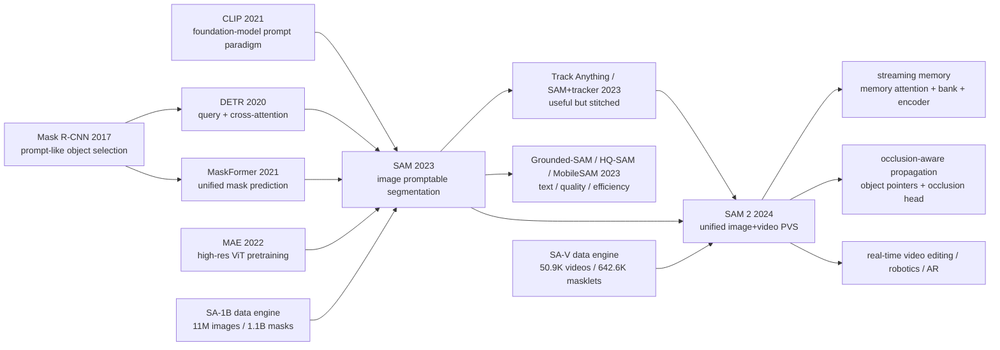

# SAM — One Prompt + 11M Images + 1B Masks: Turning Segmentation into a Foundation Model Problem

> **In April 2023, Meta used [Segment Anything](https://arxiv.org/abs/2304.02643) to turn “give me a prompt and I will return a pixel-accurate boundary” into a general vision interface; barely a year later, through [SAM 2](https://arxiv.org/abs/2408.00714) and its [official project page](https://ai.meta.com/sam2/), the same team showed that the harder problem was never cutting out one image cleanly, but remembering, correcting, and recovering the same object throughout an entire video.**
> If SAM's most shocking number was SA-1B's 11M images and 1.1B masks, SAM 2's turning point was extending that line into time: unified image/video promptable segmentation, per-session streaming memory, and the SA-V dataset spanning 47 countries with roughly 51K videos and roughly 600K masklets. What this line ultimately changed is not only segmentation accuracy, but how vision systems organize interaction, memory, and the data flywheel.

## TL;DR

What SAM truly accomplished at ICCV 2023 was not merely pushing zero-shot segmentation to 58.1 average 1-click mIoU across the SA-23 benchmark with SA-1B, but rewriting segmentation into a reusable interface: the original model can be written as $m=f_\theta(I,p)$, where any point, box, or mask prompt yields a valid boundary; [SAM 2](https://arxiv.org/abs/2408.00714) then extends the same logic into $m_t=f_\theta(I_t,p_t,\mathcal{M}_{<t})$, adding unified image/video promptable segmentation, per-session streaming memory, memory attention, a memory bank and memory encoder, object pointers plus an occlusion head, and cross-frame correction powered by the SA-V data flywheel without giving up image performance. That is why this line not only beat image-side interactive baselines such as RITM and FocalClick, but also explains why “SAM plus tracker” loses to a native video model: SAM 2 achieves better video accuracy with 3\times fewer interactions while remaining 6\times faster than the original SAM on images.

---

## Historical Context

### Where vision foundation models were stuck in 2022

To understand why SAM detonated the vision community in 2023, it helps to return to the awkward state of 2022. By then [CLIP](/en/era4_foundation_models/2021_clip/) had already convinced people that the “foundation model” story could work in vision, but only at the level of image semantics: the model could tell you which caption matched an image, yet it could not reliably answer “where exactly is the cup,” “how do I separate the hand from the shirt,” or “is the object that disappeared behind an occluder and then reappeared in the video still the same target?” Vision foundation models had learned to recognize, but not yet to carve objects out of pixels.

Several 2022 lines tried to close that gap. GroupViT, MaskCLIP, OpenSeg, and X-Decoder all attempted to push CLIP-style semantics into dense prediction, but they still depended heavily on existing labeled datasets, and their boundaries were nowhere near stable enough. The more fundamental bottleneck sat at the data layer: the largest public segmentation datasets in the world were still at the LVIS / Open Images scale, a few million masks total, nowhere near the internet scale that foundation models had already normalized in language and image-text training. Without billion-scale masks, you could not realistically train a truly class-agnostic, promptable segmentation model; without such a model, you could not efficiently generate billion-scale masks. Segmentation was stuck in a classic pre-foundation-model trap.

### Five technical lines that directly forced SAM into existence

SAM was not a sudden architecture miracle. It was the first work to braid together several mature but previously separate lines into a single program.

- Mask R-CNN provided the intuition that “identify a target, then predict a mask” can be driven interactively, so points, boxes, or existing masks can all be treated as prompts.
- [DETR](/en/era4_foundation_models/2020_detr/) proved that object queries plus cross-attention could replace proposal-heavy pipelines, giving SAM its decoder backbone.
- MaskFormer and Mask2Former made the community comfortable with the idea that segmentation tasks mostly differ in output protocol, not in needing wholly different networks.
- The self-supervised ViT wave, especially MAE-style pretraining, made high-resolution image encoding computationally plausible.
- At a deeper level, [GPT-3](/en/era4_foundation_models/2020_ddpm/) and [CLIP](/en/era4_foundation_models/2021_clip/) contributed the more consequential idea: build a sufficiently general interface first, then let prompts instantiate the task.

That is why SAM mattered. Its key move was not stacking a few new layers, but rewriting segmentation as a unified interface: given image $I$ and prompt $p$, output a valid mask $m=f_\theta(I,p)$. That turned segmentation from “a task head trained for a benchmark” into “a pixel-level API any downstream system can call.”

### The author team and Meta's strategic bet

The author list itself explains the paper's weight. Alexander Kirillov, Ross Girshick, and Piotr Doll\u00e1r already sit on the main line of the last decade of segmentation, detection, and large-scale annotation systems. Their judgment was also distinctly Meta: if vision foundation models were going to advance, the bottleneck was not “invent one more fancy decoder,” but “push segmentation data from the million scale to the billion scale first.”

That is why SAM does not read like a standard architecture paper. It certainly contains model design, but the real protagonist is SA-1B and the data engine behind it. Meta did not spend its central narrative on “this new token adds 0.7 points.” It bet on a more counterintuitive claim: once promptable segmentation becomes a sufficiently general, sufficiently fast, and sufficiently human-steerable interface, the model itself can become the machine that produces the next round of training data.

## Background and Motivation

### Why “segment anything” was enough for images but not for the world

SAM took off immediately because it converted image segmentation into a generally callable primitive. A user clicks or boxes an object and gets a plausible mask; a researcher can run zero-shot trials in medicine, remote sensing, or robotics without rebuilding category labels from scratch. Up to that point, SAM solved the problem of an open-world segmentation interface for a single image.

But real-world perception is not static. Video editing wants “this shirt, consistently across 200 frames”; robotics wants “the cup that disappears behind a hand and later returns is still the same object”; AR/VR wants segmentation that is not only accurate but continuous, correctable, and real-time. Original SAM exposes a core limitation there: it has no cross-frame memory. Every frame is treated as if the object were being identified for the first time. That is why so many 2023 systems had to fall back to a stitched solution: “SAM for single-frame masks + a tracker for temporal propagation.” It works, but the interaction is fragile. Once the tracker loses the object, the user often has to restart annotation on a later frame almost from scratch.

### Why the task itself had to expand from SA-1B to SA-V

This is the most important backdrop for SAM 2. In the [SAM 2 paper](https://arxiv.org/abs/2408.00714) and the [official project page](https://ai.meta.com/sam2/), Meta states the point plainly: image-only SAM solved static promptable segmentation, but a universal visual segmentation system must cover both images and videos. The task was therefore upgraded into Promptable Visual Segmentation, changing the interface from $m=f_\theta(I,p)$ to $m_t=f_\theta(I_t,p_t,\mathcal{M}_{<t})$, where $\mathcal{M}_{<t}$ is the session's accumulated history of prompts, predictions, and memory states.

That upgrade is not a cosmetic “video edition” label. It extends the prompt interface from a single-frame response into a protocol that can propagate across frames, be corrected on any frame, and still degenerate back to the empty-memory image case when no history exists. Put differently, SAM proved that “anything” could first be made real on static images; SAM 2 proved that without per-session streaming memory, a video-native data engine, and a much larger SA-V training set, “anything” in video would remain a product illusion rather than a model capability.

---

## Method Deep Dive

### SAM's base architecture: first rewrite segmentation as a unified interface

SAM starts from a simple first principle: do not begin by asking whether this is semantic segmentation, instance segmentation, or a specific class category. First ask for a valid boundary conditioned on a prompt. The whole model can therefore be written as

$$
m = f_\theta(I, p)
$$

where image $I$ is encoded once by a heavy image encoder, prompt $p$ is encoded by a lightweight prompt encoder, and a mask decoder fuses the two into candidate masks. The power of this formulation is not the notation itself but what it compresses into one interface: points, boxes, existing masks, and eventually text are all just different prompt tokens.

| Module | What it does in SAM | Why it matters |
|---|---|---|
| Image encoder | Encodes a 1024\times1024 image into reusable features | The whole image is computed once, so later interactions do not rerun the large model |
| Prompt encoder | Converts points, boxes, and masks into prompt tokens | Replaces category labels with explicit interaction about what object to segment |
| Mask decoder | Performs two-way attention between image features and prompts, then predicts candidate masks | Lets the model return valid interpretations rather than forcing a single brittle answer |

```python
def segment_anything(image_embedding, prompt_tokens, memory_state=None):
    conditioned = image_embedding if memory_state is None else memory_attention(image_embedding, memory_state)
    masks, iou_scores, object_pointer, occlusion_score = mask_decoder(conditioned, prompt_tokens)
    next_memory = None if memory_state is None else memory_encoder(conditioned, masks, object_pointer, occlusion_score)
    return masks, iou_scores, next_memory
```

#### Design 1: promptable segmentation turns a task head into a pixel API

SAM's deepest rewrite is at the task level. Earlier segmentation systems usually assumed you already knew what family of segmentation you were solving, then designed supervision, class spaces, and inference around that choice. SAM flips the order: the model is only required to produce a “valid mask with a clear boundary under the meaning of the prompt.” That makes the system naturally class-agnostic and open-world, and it frees downstream applications from committing to a category vocabulary up front.

#### Design 2: encode the image once, reuse it for many interactions

The reason the SAM product experience feels real is not primarily the SA-1B headline number. It is a basic but decisive engineering judgment: the expensive image encoding runs once. When the user keeps clicking, boxing, and correcting, only the prompt encoder and decoder rerun. This amortization design is what made interactive segmentation feel close to a standard creative tool rather than a research demo.

#### Design 3: multiple candidate masks plus IoU prediction to handle ambiguity

Click on a bicycle tire and several answers may be valid: the tire, the whole bicycle, or a partially visible component. SAM does not force a single answer. It predicts multiple candidate masks and ranks them with an IoU head. That matters because prompt ambiguity is native to real human interaction; it is not an exception that can be ignored just because benchmark annotations provide one canonical mask.

### How SAM 2 extends image SAM into video: put memory inside the same interface

The most important thing about SAM 2 is that it does not discard SAM's promptable interface. It inserts session memory into it. The paper treats an image as a single-frame video, so the unified task becomes

$$
m_t = f_\theta(I_t, p_t, \mathcal{M}_{<t})
$$

where $\mathcal{M}_{<t}$ is not a slogan but the actual state accumulated during an interaction session: spatial memories from previous frames, prompted key frames, object pointers emitted by the decoder, and cues about whether the object is currently visible. In that sense SAM 2 degenerates back to “SAM with empty memory” on images and becomes a temporally propagating model on video.

#### Design 4: unified image/video promptable segmentation

According to the [SAM 2 paper](https://arxiv.org/abs/2408.00714) and [official page](https://ai.meta.com/sam2/), the goal was not to build a separate video tracker but to place image segmentation, interactive video segmentation, and semi-supervised VOS inside one Promptable Visual Segmentation protocol. A user can provide a point, box, or mask on any frame; the model must respond instantly on that frame and propagate the object into a spatio-temporal masklet. What used to be a two-stage system, “image SAM plus an independent tracker,” is compressed into one model with one internal state machine.

#### Design 5: per-session streaming memory = memory attention + memory bank + memory encoder

SAM 2's video capability comes less from a bigger backbone than from streaming memory. It processes frames one at a time. Each frame first goes through the image encoder to produce unconditioned features, then memory attention lets the current frame cross-attend to historical memories and object pointers. The paper states that memory attention uses 4 transformer blocks by default: self-attention first, then cross-attention into the memory bank. That means the model no longer needs to understand each frame from scratch; it moves forward with context about the target's appearance, local structure, and interaction history.

Then the memory encoder downsamples the predicted mask and fuses it with the frame embedding, producing a spatial memory that can be written back into the memory bank. The memory bank itself is two FIFO structures: one for recent unprompted frames and one for prompted key frames. On top of spatial memories, SAM 2 also stores lightweight object pointer vectors as high-level identity summaries. This combination is why the [Meta page](https://ai.meta.com/sam2/) describes the system as having a “per-session memory module”: the memory is not weight adaptation, but dynamic state specific to the current interactive session.

#### Design 6: object pointers plus an occlusion head turn reappearance into an internal capability

One detail users routinely underestimate is that video segmentation is not hardest at frame 1. The hard part is recognizing the same target after it is occluded, shrinks, deforms, and reappears. SAM 2 does not solve this with an external tracker. It introduces an object pointer token in the decoder and pairs it with an occlusion prediction head. Appendix D is explicit: the object pointer comes from the token associated with the current output mask and is stored in the memory bank alongside spatial memories; an extra occlusion token predicts whether the object is visible in the current frame, and frames predicted as invisible receive a learned occlusion embedding in memory.

So when the target disappears, SAM 2 does not simply pause the system. It preserves the target's pointer identity and its occlusion state, allowing later memory attention to continue conditioning on the same object. When the user adds a click on a later frame, the model is not “re-segmenting from zero”; it is attaching that correction to the same session identity and continuing propagation. That is the substance behind the [SAM 2 paper's](https://arxiv.org/abs/2408.00714) claim that a single click can recover an object after failure rather than restarting the whole process as in SAM plus tracker pipelines.

#### Design 7: video data engine + SA-V push the image-era flywheel into time

If SA-1B was the soul of SAM, SA-V is the soul of SAM 2. The official project page phrases it as “about 51K videos, about 600K masklets, across 47 countries,” while the paper gives the precise numbers: 50.9K videos, 642.6K masklets, and 35.5M masks, of which 190.9K are manual masklets and 451.7K are automatically generated and human-verified. More importantly, SAM 2 preserves SAM's model-in-the-loop philosophy, but makes it video-native.

Phase 1 is still close to frame-by-frame manual correction, averaging 37.8 seconds per frame. Phase 2 introduces SAM 2 Mask, which only accepts mask prompts, reducing the time to 7.4 seconds per frame. Phase 3 uses the full SAM 2 model, where annotators only add occasional refinement clicks on failure frames, cutting the time to 4.5 seconds per frame, 8.4\times faster than Phase 1. The deeper point is not the raw speedup. The video data engine and streaming memory amplify each other: memory makes cross-frame correction worth designing for, and cross-frame correction keeps feeding the model the hard cases of occlusion, disappearance, and reappearance that matter most.

Intellectually, then, SAM 2 is not a video plug-in attached to SAM. It extends the two central ideas of the original paper into time at once: the promptable interface and the data-engine flywheel.

---

## Failed Baselines

### The image-side baselines that SAM beat in 2023

Start with who original SAM actually defeated. The persuasive point in the paper is not a single benchmark gain, but the fact that it lifted interactive zero-shot segmentation into a usable regime across 23 datasets never seen during training. Strong interactive baselines such as RITM and FocalClick could stay competitive near COCO/LVIS-like distributions, but the advantage flipped quickly on medical, microscopy, industrial, and remote-sensing data. SAM therefore established something new: promptable segmentation did not need a predefined category vocabulary. Large-scale class-agnostic mask learning alone could produce transferable capability.

| Baseline | What it was good at | Why it lost to SAM |
|---|---|---|
| RITM | Interactive click refinement trained with strong supervision on COCO/LVIS | Fell behind on average 1-click mIoU across the 23 datasets, especially far out of distribution |
| FocalClick | Multi-resolution refinement for single-image interaction | Could polish boundaries within one image, but lacked SA-1B-scale generality |
| OpenSeg / GroupViT style methods | Tried to reuse CLIP semantics for zero-shot segmentation | Stronger semantics, weaker boundaries, and unstable pixel-accurate masks |

### Three gaps exposed when original SAM met video

Once you move to video, however, original SAM stops looking like an end-state model and returns to being a powerful component. It exposes at least three gaps.

First, it has no session memory. To SAM, frame 37 is not fundamentally different from frame 1; the model does not remember what the target looked like a few frames ago, where the user has already interacted, or which local patch still belongs to the same object. Second, it has no elegant internal mechanism for disappearance and reappearance. SAM can return a valid mask for one image prompt, but when the object briefly vanishes in a video, nothing inside the model ties the two temporal segments back into one identity. Third, the original data engine is static-image native. It never saw large quantities of training examples where the same target must be propagated, partially lost, and then corrected on later frames.

Those three gaps explain why the dominant 2023 engineering recipe was not “use SAM directly for video” but “insert SAM before or after a tracker.” These systems can produce compelling demos, but once the tracker drifts, a corrective click often requires rebuilding a mask on the current frame and restarting propagation from there. The interaction cost therefore does not fall smoothly; it repeatedly resets.

### Why “SAM + tracker” is not the same thing as SAM 2

SAM 2 explicitly compares itself against two strong stitched baselines: SAM+XMem++ and SAM+Cutie. That comparison matters because it answers a common misconception: if SAM already segments single frames, why not just attach the best tracker? The answer is that the missing piece is not merely stronger propagation. It is a unified, correctable session memory.

XMem++ and Cutie are strong at VOS propagation; SAM is strong at single-frame promptable segmentation. Chaining them obviously works, but “object identity,” “which frames were prompted,” and “how later corrections should alter future predictions” do not exist as native state inside one model. So when the user clicks again on a later frame, the system must translate the current track back into masks or clicks that SAM can understand, then restart the tracker. SAM 2 removes that translation tax by internalizing it through a memory bank, object pointers, and occlusion-aware propagation.

## Key Experimental Results

### Images: SAM first made zero-shot segmentation a foundation capability

Original SAM's representative image numbers still matter. It reached 58.1 average 1-click mIoU on the 23 zero-shot image datasets, pushing promptable segmentation from “demo-able” to “transferable.” More importantly, it remained robust on video-derived frames, medical images, and microscopy images that sit far from SA-1B's native distribution. That is what convinced the field to reuse it as a general pixel interface.

| Model | Training data | SA-23 1-click mIoU | Speed |
|---|---|---|---|
| SAM (ViT-H) | SA-1B | 58.1 | 21.7 FPS |
| SAM 2 (Hiera-B+) | SA-1B | 58.9 | 130.1 FPS |
| SAM 2 (Hiera-B+) | SA-1B + SA-V + video mix | 61.9 | 130.1 FPS |

The most important part of this table is not the 0.8-point accuracy gain from 58.1 to 58.9. It is the speed jump from 21.7 FPS to 130.1 FPS, which is exactly the claim summarized in the [SAM 2 paper](https://arxiv.org/abs/2408.00714): on images SAM 2 is about 6\times faster than SAM while also being more accurate. In other words, SAM 2 does not trade away image quality to buy video capability. It gets faster and better on images, and gains further on video-derived image distributions because of joint training.

### Video: SAM 2 reduces interaction by roughly 3\times

SAM 2's defining result is the change in video interaction quality. On 9 dense zero-shot video datasets, the paper compares interactive Promptable Visual Segmentation using SAM+XMem++, SAM+Cutie, and SAM 2. The conclusion is direct: SAM 2 leads in both offline and online protocols and does so while using “more than 3\times fewer interactions” for better accuracy. That is not just marketing language. It falls out of the evaluation setup: the user no longer has to rebuild the object mask from scratch on later frames, but only adds a few corrections at failure frames while memory carries the fix through the same session trajectory.

| Video setting | SAM + XMem++ | SAM + Cutie | SAM 2 |
|---|---|---|---|
| 17-dataset 1-click | 56.9 | 56.7 | 64.7 |
| 17-dataset 3-click | 68.4 | 70.1 | 75.3 |
| 17-dataset 5-click | 70.6 | 72.2 | 77.6 |
| 17-dataset bounding box | 67.6 | 69.4 | 74.4 |
| 17-dataset gt mask | 72.7 | 74.1 | 79.3 |

These averages show that SAM 2 already beats methods specialized for conventional semi-supervised VOS, and its advantage widens further in the interactive scenario it was actually designed to solve.

### Data: how SA-V pushed video segmentation into a new scale regime

SA-1B powered the original flywheel; SA-V moved that flywheel into time. The official project page gives the compact headline “about 51K videos, about 600K masklets, across 47 countries,” while the paper provides the precise release figures: 50.9K videos, 642.6K masklets, and 35.5M masks, with 190.9K manual masklets and 451.7K automatic masklets. Just as importantly, Meta did not treat the data as a static asset. It organized it into a three-phase data engine.

| Phase | Annotation mode | Average time per frame | Why it matters |
|---|---|---|---|
| Phase 1 | SAM per-frame assistance plus manual correction | 37.8 s | High-quality reference, but too slow |
| Phase 2 | SAM + SAM 2 Mask propagation | 7.4 s | Introduces temporal propagation into labeling |
| Phase 3 | Full SAM 2 plus occasional refinement clicks | 4.5 s | 8.4\times faster than Phase 1; the real video flywheel |

If you remember one experimental fact, it should be this: SAM made “segment any object in any image” a foundation-model problem, while SAM 2 was the first system to close the loop across data, model, and interaction for “segment and correct any object through time.”

---

## Idea Lineage


```mermaid
graph LR
    A[Mask R-CNN 2017<br/>prompt-like object selection] --> B[DETR 2020<br/>query + cross-attention]
    A --> C[MaskFormer 2021<br/>unified mask prediction]
    D[CLIP 2021<br/>foundation-model prompt paradigm] --> E[SAM 2023<br/>image promptable segmentation]
    B --> E
    C --> E
    F[MAE 2022<br/>high-res ViT pretraining] --> E
    G[SA-1B data engine<br/>11M images / 1.1B masks] --> E
    E --> H[Track Anything / SAM+tracker 2023<br/>useful but stitched]
    E --> I[Grounded-SAM / HQ-SAM / MobileSAM 2023<br/>text / quality / efficiency]
    H --> J[SAM 2 2024<br/>unified image+video PVS]
    E --> J
    K[SA-V data engine<br/>50.9K videos / 642.6K masklets] --> J
    J --> L[streaming memory<br/>memory attention + bank + encoder]
    J --> M[occlusion-aware propagation<br/>object pointers + occlusion head]
    J --> N[real-time video editing / robotics / AR]
```

### Before it: SAM inherited not one architecture but a stack of paradigms

At the architecture level, SAM certainly inherits DETR, MaskFormer, and ViT pretraining. But historically its two largest debts are elsewhere. The first comes from [CLIP](/en/era4_foundation_models/2021_clip/) and the prompt paradigm of the language-model era: build a general interface first, then let prompts instantiate the target. The second comes from the scale-law intuition shared by successful foundation models after ImageNet: if you want a task to become a primitive capability, you must first increase the training data by orders of magnitude. That is why SAM is better understood not as “segmentation-flavored DETR,” but as “the first time prompt interfaces and data flywheels were brought to pixel-level vision together.”

### After it: SAM 2 is not a side sequel but the temporal completion of SAM's main line

Many people read SAM 2 as “the video sequel that naturally followed a successful image model.” That understates its relation to SAM. A more accurate reading is: SAM solved promptable segmentation along the spatial axis, while SAM 2 adds session memory, occlusion recovery, and video-native data collection along the temporal axis. It does not abandon the original interface. It proves that the original logic only becomes fully credible when extended into video.

That is why the most important edge in the lineage graph is not from SAM to a larger backbone. It is from SAM to SA-V and streaming memory. After SAM, the community certainly produced major branches such as HQ-SAM, Grounded-SAM, and MobileSAM. But when asked where the main line should go next, Meta's answer was clear: the next step is not just to improve mask quality again; it is to promote the image-level promptable interface into a unified image/video protocol.

### Misreadings: the three things people most often got backwards

- First, SAM is often remembered as “a model that suddenly appeared,” when in reality it is a node that consolidates several technical and engineering lines into one product interface.
- Second, SAM 2 is often reduced to “a stronger version of SAM plus tracker,” while the paper's crucial move is precisely to stop stitching separate systems together and instead unify memory, correction, and propagation inside one session model.
- Third, SA-1B and SA-V are often treated as auxiliary datasets, as if the model were the real protagonist; in practice, what the field kept copying from SAM to SAM 2 was the method: a model-in-the-loop data engine that first creates capability and then feeds the next round of data.

---

## Modern Perspective

### Looking back from 2026: SAM's real legacy is no longer “the model” but “the interface plus the flywheel”

By 2026, SAM's deepest impact is no longer “how many benchmark points it gained in 2023.” Its real legacy is that it shifted the community's attention from task-specific architectures toward task design, data engines, and interaction protocols. When people refer to SAM now, they are rarely talking only about the ViT-H plus prompt encoder plus mask decoder stack. They are talking about a way of working: compress the task into a universal interface first, then build both the data flywheel and the product interaction around that interface.

SAM 2 makes that lesson even clearer. It shows that a deployable general segmentation system cannot stop at static images, but must cover images and videos within the same protocol. That is why SAM and SAM 2 should be read together: the former established the pixel-level prompt interface, and the latter stabilized the temporal, memory-bearing version of that interface.

### Assumptions that no longer hold

- “If single-frame zero-shot segmentation is strong enough, an external tracker is sufficient for video.” SAM 2's results mostly kill that assumption. Cross-frame correction, identity recovery, and coherent session state are not elegantly repairable by a tracker add-on.
- “Images and videos should use different models, different evaluation assumptions, and different product interfaces.” SAM 2's decision to treat an image as a one-frame video makes the interface simpler rather than more complicated.
- “Once the data are large enough, the memory mechanism can be bolted on later.” The combined lessons of SAM and SAM 2 suggest the opposite: the data flywheel and the interaction protocol must be co-designed, or the model never learns the hard behavior of recovering from temporal failure.

### If we rewrote the line today

From a 2026 vantage point, the SAM/SAM 2 line would likely continue to converge in three directions. First, text grounding would no longer remain an external add-on, but would be natively coupled to the segmentation interface. Second, the memory mechanism would extend beyond storing target history into storing object relations and scene constraints. Third, the data engine would sample more aggressively around failure cases, not merely scale data volume. Put differently, later systems are unlikely to reject SAM's promptable formulation; they will make it more semantic, more relational, and more explicitly failure-driven.

## Limitations and Future Directions

### The boundaries of original SAM

The boundaries of original SAM are now clear: no temporal memory, no native text grounding, no semantic class output, and unstable behavior on extremely thin structures or dense occlusions. It is a very strong image-level primitive, but not a complete visual understanding system.

### The boundaries SAM 2 still leaves open

The [SAM 2 paper](https://arxiv.org/abs/2408.00714) does not claim to close the problem either. It explicitly notes continued difficulty under long occlusions, shot changes, thin structures, and crowded scenes. Multi-object usage shares image features but still keeps object-level memories largely separate, with no real inter-object communication. In other words, SAM 2 solves “segment anything with memory,” but not yet “jointly reason about everything in a structured scene.”

## Related Work and Insights

### What it taught the vision foundation-model paradigm

Taken together, SAM and SAM 2 changed more than segmentation. They changed what counts as a contribution in vision. They elevated three things that used to be dismissed as engineering details into first-class research contributions: designing a transferable task protocol, building a model-in-the-loop data flywheel, and reducing inference latency enough to support real interaction. Many later “Anything” systems copied that paradigm more than they copied any specific decoder.

### What it taught product and data work

From a product point of view, SAM taught a simple but often neglected lesson: even a strong model rarely enters real workflows if each interaction reruns the heaviest computation. SAM solved that for images through one-time image encoding; SAM 2 pushes the same idea into video with streaming memory. The parallel lesson for data work is also sharper than “collect more data.” The real move is to turn user correction itself into supervision. Phase 3 of SA-V matters because it captures precisely those moments where the model fails and a human is most motivated to repair it.

## Resources

- Paper: [Segment Anything](https://arxiv.org/abs/2304.02643)
- Code: [facebookresearch/segment-anything](https://github.com/facebookresearch/segment-anything)
- Dataset: [SA-1B](https://ai.meta.com/datasets/segment-anything/)
- SAM 2 paper: [SAM 2: Segment Anything in Images and Videos](https://arxiv.org/abs/2408.00714)
- SAM 2 project page: [Introducing Meta Segment Anything Model 2](https://ai.meta.com/sam2/)
- SAM 2 repository: [facebookresearch/segment-anything-2](https://github.com/facebookresearch/segment-anything-2)
- SA-V dataset: [SA-V Dataset](https://ai.meta.com/datasets/segment-anything-video/)


---

> 🌐 [中文版](/era5_genai_explosion/2023_sam/) · 📚 awesome-papers project · CC-BY-NC