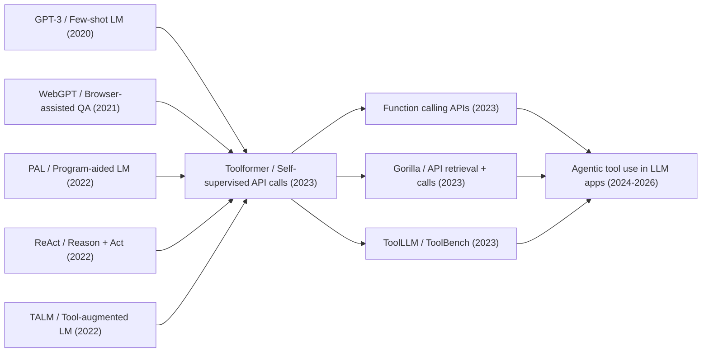

# Toolformer - Letting Language Models Teach Themselves When to Use Tools

> **On February 9, 2023, Timo Schick, Jane Dwivedi-Yu, Roberto Dessì, Roberta Raileanu, and four coauthors posted [arXiv:2302.04761](https://arxiv.org/abs/2302.04761) with a title that read like a dare: language models can teach themselves to use tools.** ChatGPT had just made conversational fluency feel like the new baseline, yet GPT-3- and PaLM-class models could still miss elementary arithmetic, forget the current date, or hallucinate facts that a search engine, calculator, or calendar could settle instantly. Toolformer's counterintuitive move was not to hand-code an agent policy or collect a large human dataset of tool traces. It let GPT-J try API calls inside ordinary web text, executed those calls, and kept only the ones that lowered future-token loss. Much of today's function calling, plugin systems, tool-learning benchmarks, and agent frameworks can be read as larger, safer, more structured descendants of that six-page recipe.

## TL;DR

Toolformer, posted to arXiv in 2023 by Schick, Dwivedi-Yu, Dessì, Raileanu, and four coauthors, recast “language models using tools” as a self-supervised data-generation problem rather than a hand-written prompting trick. For positions in ordinary text, it estimates $p_i=p_M(\langle API\rangle\mid P(x),x_{1:i-1})$, samples candidate calls, executes five APIs -- question answering, Wikipedia search, calculator, machine translation, and calendar -- and keeps a call only when its result lowers future-token loss, $L_i^- - L_i^+ \ge \tau_f$. GPT-J 6.7B is then finetuned on the same corpus with useful API calls inserted. The baselines it displaced were not a single model but three habits: scaling-only GPT-J/GPT-3 still failed on arithmetic, factual lookup, and dates; WebGPT, PAL, and ReAct-style systems worked but depended on human traces or task-specific prompts; retrieval-augmented LMs usually received external information by architectural default rather than learning when to ask. The numbers explain why the paper stuck: Toolformer raised LAMA T-REx from GPT-J's 31.9 to 53.5, reached 40.4/29.4/44.0 on ASDiv/SVAMP/MAWPS versus GPT-3's 14.0/10.0/19.8, and improved temporal reasoning through a calendar API, while still trailing GPT-3 on open-domain QA and exposing the limits of one-shot, non-interactive tool calls. It follows the post-Chain-of-Thought (2022) impulse to externalize intermediate work, and it foreshadows the post-LLaMA (2023) agent ecosystem's default interface. The hidden lesson is that tool use is not a magic switch that appears when a model is large enough; it is a behavior shaped by data format, execution feedback, and the cost of asking the outside world.

---

## Historical Context

### ChatGPT had just arrived: models could talk, but they still could not look things up

Toolformer appeared at a particularly revealing moment. After ChatGPT launched in November 2022, both researchers and the public started treating large language models less as statistical continuation machines and more as general assistants that could converse, explain, rewrite, and draft code. Yet when the question shifted from “does it sound fluent?” to “is the arithmetic exact?”, “is the fact current?”, or “what day is it today?”, the weaknesses were blunt. GPT-3, PaLM, GPT-J-class models were strong on open-ended text, but they could still miss simple arithmetic, present stale knowledge as current, and treat time-sensitive questions as static facts.

The problem was not new in 2023. Retrieval-augmented language models, browser-assisted question answering, calculator-aided reasoning, program execution, and knowledge-base QA had already shown that a model need not store every capability in its parameters. External systems can supply facts, computation, and live state. The limitation was that these systems usually came in two forms: either the tool was wired into the architecture and the model passively received retrieved information, or tool use depended on human-written traces and task-specific few-shot prompts. In other words, models had access to tools, but they had not learned the more general behavior of deciding when to ask for help.

Toolformer reframed the problem. If a language model can imitate a format from a handful of examples, can it try inserting API calls into ordinary text and then use its own language-modeling loss to decide which calls were actually useful? That question captures the early-2023 atmosphere well: ChatGPT showed that models could collaborate with people, Self-Instruct and Unnatural Instructions showed that models could generate training data, and ReAct/PAL showed that external actions could compensate for reasoning gaps. Toolformer compressed these hints into a self-supervised training loop that did not require human tool trajectories.

### Direct predecessors: from retrieval augmentation to explicit action

Toolformer has at least three immediate lineages. The first is retrieval-augmented language modeling. REALM, RETRO, Atlas, and related systems connected external text to language models so that factual answering was not limited to parametric memory. They addressed where knowledge comes from, but not fully when it is worth asking. Many systems retrieve for every example or bake retrieval into the architecture; external information behaves like a hidden component rather than an interpretable model output.

The second lineage is browser- and tool-assisted question answering. WebGPT, LaMDA, BlenderBot 3, internet-augmented dialogue systems, and similar work trained models to use search, browsers, or external knowledge sources through human demonstrations, preference feedback, or deployment data. This line was close to product behavior, but supervision was expensive and the tool policy was often inherited from human traces. Toolformer asked a different question: what humans think is a useful tool step may not be exactly what the model needs, so can the model use prediction loss to filter calls that help itself?

The third lineage is the explicit coupling of reasoning and action. PAL had models write programs and execute them; ReAct interleaved reasoning traces with action traces; STaR bootstrapped reasoning processes into training data. These works showed that if an intermediate process can be expressed as text, it can enter a language model's learning interface. Toolformer reused that interface, but moved from task-level prompting to corpus-level finetuning, and from “how should this problem call a tool?” to “where in ordinary web text is an API call worth inserting?”

### The author team and Meta AI's problem framing

The authors came from Meta AI Research and Universitat Pompeu Fabra. Timo Schick had worked on PET, LM-BFF, data generation, and instruction bootstrapping; Jane Dwivedi-Yu, Maria Lomeli, Luke Zettlemoyer, Nicola Cancedda, Thomas Scialom, and the rest of the team were close to retrieval-augmented LMs, multilingual modeling, and open tool systems. The group was sensitive to two facts at once: large models were becoming general interfaces, while Meta did not have the same closed ChatGPT-style product position as OpenAI and therefore needed reproducible, extensible research routes.

Toolformer's ambition was therefore not to build a complete agent. It had no long-term memory, no multi-step planner, no browser state, and no JSON schema. It asked a more basic question: if tool calls can be written as text, can a language model learn the distribution of those text spans inside training data and later generate structures such as `<API>...→result...</API>` by itself? That step looks modest, but it exposed the core interface of later function calling: model outputs are not only natural-language answers; they can also be executable requests.

## Background and Motivation

### The field had two partial answers: parametric memory and external tools

By early 2023, the strengths and weaknesses of language models were plain. They were good at style transfer, open-ended writing, concept explanation, code drafts, and few-shot induction. They often lost, however, to much smaller systems on four classes of task: exact arithmetic, factual lookup, low-resource language understanding, and temporal state. A calculator cannot understand language but can compute; a search engine cannot reason deeply but can retrieve; a calendar API cannot chat but knows the current date; a translation system cannot infer the user's long intent but can translate short spans reliably. The question was not whether tools were useful, but how a language model could make them part of its own generation process.

Traditional approaches either designed an external module as a special-purpose pipeline or told the model in the prompt that a tool should be used for this task. That does not generalize cleanly to open settings: real users do not always announce which API should be called, and ordinary web text does not mark places with labels such as “look this up” or “calculate this.” Toolformer's motivation was to fill that gap by teaching tool use on general language-modeling data instead of only in a downstream task.

### The core tension: tool use is action, but the model must learn it as text

Language models are trained to predict the next token, while a tool call is an action in the outside world: it has a function name, arguments, an execution result, latency, cost, and possible errors. Toolformer's simplifying move was to linearize the action as text. A call such as `Calculator(27 + 4 * 2)` with result `35` can be inserted into the original sequence; a call such as `WikiSearch(Fishing Reel Types)` can supply snippets that become part of the prefix for later tokens. If the linearized action makes future tokens easier to predict, it provides a learning signal.

That turns tool learning back into language modeling. The model first uses few-shot prompts to generate candidate API calls, external systems execute them, and a loss-based filter asks whether the returned result lowers future-token loss. This filter is crucial. It does not ask whether the call looks clever, nor whether a human likes it; it asks whether the result helps the model predict the continuation. Tool use therefore becomes measurable inside the language-modeling objective rather than being bolted on as an external reward.

### The goal: make GPT-J ask for help without becoming a narrow pipeline

Toolformer used GPT-J 6.7B as its base model, which matters historically. It was not the largest model, and it was not a closed API. It was a size that researchers could reason about. The paper wanted to show not that a 175B-parameter model with search is obviously stronger, but that a mid-sized LM can outperform much larger purely parametric models on some tasks once it learns when to call tools.

This goal also explains the experimental design. The authors did not evaluate only a striking demo. They mapped five tools to five weaknesses: question answering and Wikipedia search for factual knowledge, calculator for mathematics, machine translation for cross-lingual understanding, and calendar for temporal awareness. They then checked language-modeling perplexity to ensure that learning tools had not damaged ordinary text generation. Toolformer's promise was that tools should augment a general LM, not turn it into a narrow API runner.

---

## Method Deep Dive

Toolformer's method can be summarized in one sentence: write tool use as token sequences that a language model can predict, then use the model's own prediction loss to filter out unhelpful calls. It does not train a separate planner and does not introduce a reinforcement-learning environment. The system remains standard language modeling, except that the training corpus is augmented with `<API>...→result...</API>` spans. This choice explains both its elegance and its limits.

### Overall Framework: Linearize API Calls as Text

The paper starts with a language model $M$ and a set of tool APIs. Each call consists of a tool name and an input, such as `Calculator(27 + 4 * 2)` or `WikiSearch(Fishing Reel Types)`. To make ordinary autoregressive LMs learn these calls, Toolformer linearizes both the call and the returned result. Without a result, the call is a sequence the model can generate; with a result, the call becomes context for later tokens. The paper writes the two forms as follows.

$$
e(c)=\langle API\rangle a_c(i_c)\langle/API\rangle,\qquad e(c,r)=\langle API\rangle a_c(i_c)\to r\langle/API\rangle.
$$

Here $a_c$ is the API name, $i_c$ is the argument string, and $r$ is the external system's response. This representation is crucial: a tool call is no longer an invisible engineering event outside the model. It is a predictable, copyable, inspectable span in the training data. At inference time, once the model generates `→`, decoding pauses, the system executes the API, inserts the result, and generation continues.

Toolformer experiments with five tools, each targeting a common weakness of language models.

| Tool | Implementation | Weakness addressed | Typical call |
|---|---|---|---|
| Question Answering | Atlas QA model | factual QA | `QA(Where was X founded?)` |
| Wikipedia Search | BM25 over KILT Wikipedia | open retrieval | `WikiSearch(Fishing Reel Types)` |
| Calculator | Python script | exact arithmetic | `Calculator(735 / 499)` |
| Machine Translation | NLLB 600M + fastText | non-English phrase understanding | `MT(sûreté nucléaire)` |
| Calendar | Date API | current date and temporal state | `Calendar()` |

### Key Design 1: Use a Few Demonstrations Only to Sample Candidate Calls

Toolformer does not invent the API-call format from nothing. For each tool, the authors write a short prompt $P(x)$ with a handful of examples, teaching the LM to insert calls such as `[QA(question)]` or `[Calculator(expression)]` into text. The model then estimates, at each position in a plain corpus sequence $x_1,\ldots,x_n$, the probability that an API call should start there.

$$
p_i=p_M(\langle API\rangle\mid P(x),x_{1:i-1}),\qquad I=\{i\mid p_i>\tau_s\}.
$$

If there are too many candidate positions, only the top $k$ positions are kept; for each position, up to $m$ API calls are sampled. In the default setup, the paper uses $\tau_s=0.05$, $k=5$, and $m=5$. For calculator and machine translation, useful examples are much rarer, so the authors first apply heuristics to select more promising CCNet passages and relax the sampling threshold.

The subtle point is that the few-shot prompt is only a candidate generator, not the source of truth. The model may try many poor calls. The real supervision signal comes from execution and filtering in the next step. Small human-written prompts are confined to format induction; they do not become a large manually labeled tool-trajectory dataset.

### Key Design 2: Filter Calls by Future-Token Loss

After candidate calls are generated, Toolformer actually executes them: the QA tool returns an answer, search returns Wikipedia snippets, the calculator returns a numeric result rounded to two decimals, the translation tool returns English, and the calendar returns a date. The system then compares three situations: no API call, API input without a result, and API input with a result. The intuition is simple: a useful call should help the model predict the continuation because of the returned value, not merely because the call string itself gives a formatting cue.

The paper defines the weighted cross-entropy loss from position $i$ onward:

$$
L_i(z)=-\sum_{j=i}^{n} w_{j-i}\log p_M(x_j\mid z,x_{1:j-1}),\qquad L_i^+=L_i(e(c_i,r_i)),\quad L_i^-=\min(L_i(\epsilon),L_i(e(c_i,\epsilon))).
$$

A call is kept only if $L_i^- - L_i^+\ge\tau_f$. The weights $w_t$ decay with distance, emphasizing that the API result should help nearby future tokens rather than pass the filter through distant accidental correlation. This filter is Toolformer's core mechanism: it converts “is this tool useful?” into a prediction gain that the model itself can measure.

The counterintuitive part is that the filter does not require human semantic judgment. Table 10 in the paper includes low-score calls that are plainly irrelevant and high-score calls that feel natural. Keeping a little noise is not necessarily harmful, because the finetuned model also sees that not every call result should be blindly trusted. Toolformer learns not perfect tool traces, but a calling tendency extracted from noisy bootstrapped data.

### Key Design 3: The Finetuning Corpus Is Still CCNet, Only With Tool Spans Inserted

Once filtering is finished, the remaining API calls are inserted back into the original text to form the augmented corpus $C^*$. This step is easy to underrate. Toolformer does not replace training with a set of manually designed downstream tasks, and it does not finetune only on math or QA benchmarks. It continues to use ordinary CCNet web text, with tool calls and results inserted at selected positions. The goal is to preserve general language-modeling ability.

The paper uses GPT-J 6.7B as the base model, with batch size 128, learning rate $1\times10^{-5}$, up to 25K examples per API, sequence length 1024, and training on 8 NVIDIA A100 40GB GPUs. More importantly, it includes a control model: GPT-J + CC is trained on the same CCNet subset without API calls. If the gains came merely from additional CCNet finetuning, this control should improve as well. The experiments show that the main gains on the target tasks come from API use.

```python
def build_toolformer_corpus(plain_documents, language_model, api_tools, prompt_bank):
    augmented_documents = []
    for plain_document in plain_documents:
        accepted_spans = []
        for api_name, api_tool in api_tools.items():
            candidate_positions = sample_call_positions(
                document=plain_document,
                model=language_model,
                prompt=prompt_bank[api_name],
                start_threshold=api_tool.start_threshold,
            )
            for position in candidate_positions:
                candidate_calls = sample_api_calls(
                    document=plain_document,
                    model=language_model,
                    api_name=api_name,
                    position=position,
                )
                for candidate_call in candidate_calls:
                    api_result = api_tool.execute(candidate_call.arguments)
                    gain = future_token_loss_gain(
                        model=language_model,
                        document=plain_document,
                        position=position,
                        call=candidate_call,
                        result=api_result,
                    )
                    if gain >= api_tool.filter_threshold:
                        accepted_spans.append((position, candidate_call, api_result))
        augmented_documents.append(insert_api_spans(plain_document, accepted_spans))
    return augmented_documents
```

The pseudocode shows the real loop: generate candidates, execute tools, filter by loss, insert into the corpus, and continue language modeling. Toolformer is not merely “a model with a calculator attached”; it turns tool calls into learnable structures in the training data.

### Key Design 4: Inference Allows Only Limited Model-Initiated Calls

At inference time, Toolformer performs ordinary autoregressive decoding until the model generates an API call and then produces `→`. The system pauses generation, executes the API, inserts the result and end token into the context, and lets the model continue. To make the model more willing to call tools, the paper does not require `<API>` to be the top-1 token. It uses modified decoding with $k=10$: if `<API>` appears among the top-k candidates, the model may start a call.

This creates an engineering tradeoff. If $k$ is too small, the model is conservative and fails to ask when it should; if $k$ is too large, it may over-call tools. Table 9 shows the effect: on T-REx, moving from $k=1$ to $k=10$ raises the API-call rate from 40.3% to 98.1% and the overall score from 47.8 to 53.5; on WebQS, the call rate rises from 8.5% to 100.0% and the score from 19.3 to 26.3. The authors also allow at most one API call per input to prevent endless tool loops.

| Key design | Problem solved | Cost | Later influence |
|---|---|---|---|
| API text linearization | brings tool actions into the LM objective | function schema is loose | early form of function calling |
| Candidate sampling | creates large candidate traces from few examples | produces substantial noise | mirrors self-instruct data generation |
| Loss-based filtering | avoids human quality labels | optimizes short-term prediction gain | shaped later self-supervised tool learning |
| Restricted inference calls | prevents infinite tool loops | cannot plan multi-step chains | reveals the path toward agents |

Toolformer's method value therefore lies less in a complicated architecture than in a shortest path: write external actions as tokens, filter them by whether execution lowers loss, and ordinary LM training can acquire basic tool-use behavior.

---

## Failed Baselines

Toolformer's failed baselines are not a single defeated model. They are three incomplete answers that existed before 2023: rely on parameter scale alone, rely on human tool traces, or rely on fixed retrieval. Each solved part of the problem, but none simultaneously offered a general LM, self-initiated decisions, little human supervision, and executable tool results.

### Scaling-Only Models: More Fluent, Not Automatically Calculators or Calendars

After GPT-3 and PaLM, it was tempting to believe that larger models would gradually acquire factual lookup, arithmetic, and temporal awareness. Toolformer directly challenged that assumption. In the paper, GPT-3 175B is much stronger than GPT-J 6.7B on many natural-language tasks, but it remains weak on math word problems: ASDiv/SVAMP/MAWPS scores are 14.0/10.0/19.8, while Toolformer with the same GPT-J base and a calculator reaches 40.4/29.4/44.0. The contrast shows that exact computation is not reliably solved by more text patterns alone.

Factual lookup is similar. A purely parametric model remembers the world seen during training, but it does not know when it should verify something. It can package fuzzy memory as a fluent answer. On LAMA, Toolformer uses the QA tool to clearly outperform GPT-3, with T-REx rising from GPT-3's 39.8 to 53.5. The lesson is not that small models always beat large ones, but that some capabilities are better delegated to external systems, and language models should learn the boundary of delegation.

### Human-Supervised Tool Systems: Effective, but Costly and Narrowly Generalized

WebGPT, internet-augmented dialogue, LaMDA/BlenderBot-related systems, and similar work showed that browsers and search can make answers more reliable, but they commonly depend on human demonstrations, preference data, or deployment feedback. PAL and ReAct showed the power of program execution, search actions, and reasoning traces, but their prompts are often designed around a particular task and require the user or system to specify how the model should act.

These methods were not bad work; they were Toolformer's direct predecessors. Their limitation was that once we move to ordinary text without human traces or a task-specific prompt, the model may not know where to call a tool. Toolformer's contribution was to make the source of tool traces self-supervised. A few examples start the format; the scale comes from the model generating, executing, and filtering calls over CCNet.

### Fixed Retrieval Augmentation: Information Arrives, but the Choice Is Not in the Model Output

Retrieval-augmented LMs often provide retrieved documents as extra context or hidden components. That works for knowledge-intensive tasks, but it does not require the model to explicitly decide whether external information is needed, which tool type to use, what arguments to pass, or how the returned value should enter later generation. The external module behaves like a pipe that the system keeps open.

Toolformer chose a more textual and inspectable interface: the model must generate the call string, the system executes it, and the result is inserted into context. Tool use becomes output behavior rather than an architectural detail. Errors also become easier to observe: the model may fail to call, call the wrong tool, pass the wrong argument, over-call, or fail to use the result. Later agent evaluations inherited much of this explicit interface when they decomposed tool-use failures.

| Failed route | What it solved then | Key gap | Toolformer's correction |
|---|---|---|---|
| Scaling-only LM | fluent generation and few-shot generalization | arithmetic, live facts, dates remain unstable | delegate exact abilities to external APIs |
| Human-supervised tool use | reliable browser/search behavior | traces are expensive and preference-dependent | filter self-generated calls by loss |
| Task-specific prompting | PAL/ReAct are strong on specific tasks | tool format and task are known in advance | train call distribution on general text |
| Always-on retrieval | stronger knowledge-intensive QA | model does not explicitly decide when to query | make calls generatable tokens |

## Key Experimental Data

Toolformer's experiments matter because they do not rely on one or two flashy examples. The paper checks, tool by tool, whether the model really calls the relevant API, whether calls improve downstream tasks, whether ordinary language modeling is damaged, and whether tool use appears as model size increases.

### Augmented Corpus: Useful Tool Calls Are Sparse

The paper uses a CCNet subset as the original corpus $C$, asks GPT-J to generate candidate API calls, and filters them by loss gain. A key message from Table 2 is that useful-call density differs sharply by tool. Wikipedia Search and Calendar leave many more calls; Calculator and Machine Translation remain sparse even with heuristic preselection. This explains why Toolformer needs a large amount of ordinary text to mine a small amount of useful tool behavior.

| Tool | Loose-filter examples | Medium-filter examples | Strict-filter examples | Intuition |
|---|---:|---:|---:|---|
| Question Answering | 51,987 | 18,526 | 5,135 | factual gaps are common |
| Wikipedia Search | 207,241 | 60,974 | 13,944 | retrieval snippets cover many cases |
| Calculator | 3,680 | 994 | 138 | verifiable arithmetic spans are rare |
| Calendar | 61,811 | 20,587 | 3,007 | temporal expressions can be mined from URLs/text |
| Machine Translation | 3,156 | 1,034 | 229 | mixed-language contexts are uncommon |

The training setup is also plain: up to 25K examples per API, maximum sequence length 1024, effective batch size 128, learning rate $1\times10^{-5}$, 8 A100 40GB GPUs, DeepSpeed ZeRO-3, and at most 2K steps. There is no complex RL loop and no online human feedback. The experiment tests whether loss-filtered corpus augmentation is enough.

### Zero-Shot Tasks: Different Tools Help Different Weaknesses

On LAMA, Toolformer mostly calls the QA tool, and all three subsets outperform GPT-J, GPT-J + CC, Toolformer disabled, OPT 66B, and GPT-3 175B. The paper notes a near-98.1% tool-call rate on LAMA, suggesting that the model is not merely memorizing answers from finetuning; it is learning to ask for help at factual gaps.

The math results are even cleaner. Toolformer reaches 40.4, 29.4, and 44.0 on ASDiv, SVAMP, and MAWPS; GPT-3 reaches only 14.0, 10.0, and 19.8. Allowing API calls more than doubles performance, and 97.9% of examples call the calculator. This is the clearest “LM routes, specialized tool computes” result.

Open-domain QA is more honest. Toolformer reaches 26.3/17.7/48.8 on WebQS/NQ/TriviaQA, beating same-size GPT-J baselines but trailing GPT-3's 29.0/22.6/65.9. The paper attributes this to the simplicity of BM25 search and Toolformer's inability to browse interactively, reformulate queries, or retrieve multiple times. That is exactly the gap later agent frameworks tried to fill.

| Task | Key numbers | Calling behavior | Conclusion |
|---|---|---|---|
| LAMA SQuAD/Google-RE/T-REx | Toolformer 33.8/11.5/53.5 vs GPT-3 26.8/7.0/39.8 | mostly QA tool | factual cloze strongly benefits |
| Math ASDiv/SVAMP/MAWPS | Toolformer 40.4/29.4/44.0 vs GPT-3 14.0/10.0/19.8 | 97.9% calculator calls | exact computation gains most |
| QA WebQS/NQ/TriviaQA | Toolformer 26.3/17.7/48.8 vs GPT-3 29.0/22.6/65.9 | 99.3% Wikipedia Search | beats same-size models, not GPT-3 |
| MLQA multilingual | gains in Spanish/German/Vietnamese/Chinese, Hindi remains weak | MT use ranges 7.3%-94.9% | translation helps but is unstable |
| TempLAMA / Dateset | Toolformer 16.3/27.3 vs GPT-3 15.5/0.8 | Dateset uses Calendar 54.8% | calendar helps date templates |
| Language modeling | WikiText/CCNet perplexity no worse than GPT-J + CC | evaluated with calls disabled | tool learning preserves general LM |

### Scaling Observation: Small Models Do Not Necessarily Know How to Use Tools

The paper also studies scaling with GPT-2-family models: 124M, 355M, 775M, 1.6B, plus GPT-J 6.7B. The result is that tool-use ability does not appear just because the API interface is available. Around 775M parameters, models begin to benefit clearly from QA, calculator, and search. Smaller models often see the format but still fail to decide when to call, how to form arguments, and how to use the returned result in text.

This observation became important later. It shows that tool use is neither a purely engineering interface nor pure emergent magic. The model needs enough language ability to understand context, construct arguments, and connect tool results to future text. But once it crosses that threshold, external tools let mid-sized models surpass much larger purely parametric models on specific dimensions. Toolformer's experimental conclusion therefore has two sides: tools can compensate for model weaknesses, but learning to use tools also requires a strong enough base model.

---

## Idea Lineage

### Prehistory: From “What Does the Model Know?” to “Whom Can It Ask?”

Before Toolformer, the language-model community handled knowledge and reasoning gaps along two main routes. The first route made the model larger, better at few-shot learning, and more able to infer tasks from prompts. GPT-3 was the emblem of this route, pushing the idea that a language model could be a general task interface. The second route gave the model external resources: retrievers, browsers, program interpreters, calculators, and knowledge bases. WebGPT, PAL, ReAct, and TALM each showed that external action can compensate for parametric weaknesses.

Toolformer is where these routes meet. It accepts that LMs are already good enough at format imitation to generate candidate tool calls from a few examples. It also accepts that LMs cannot solve every problem from parameters alone and need to ask external APIs for help. The key contribution is not that tools exist; it is that asking for help can become a textual behavior generated by the model itself.

### The Paper Itself: Self-Supervised API Calls as Language-Modeling Data

Toolformer's core idea can be stated simply: tool calls need not be learned only from expert human trajectories, and they need not appear only inside downstream-task prompts. They can be mined from ordinary text through a self-supervised process. This moves tool use from the application layer back into the pretraining/finetuning layer. The model is not merely told, for one problem, which tool to use; during continued language modeling, it repeatedly sees that inserting an API call at some positions makes later text easier to predict.

That data view matters. It turns API calls from a system-engineering choice into a learnable corpus annotation. Later tool-learning datasets, function-calling finetunes, schema-guided decoding, and agent-trace distillation continue to answer the same question: which external actions should be written into the model's training distribution, and how can the model learn to initiate actions without treating them as noise or decoration?

### Afterlife: From Single-Step APIs to Agent Tool Ecosystems

Toolformer was quickly extended by later work. Gorilla pushed the problem toward large-scale API documentation retrieval and calling; ToolLLM/ToolBench built multi-tool, multi-step instruction data and benchmarks; OpenAI function calling, ChatGPT plugins, Claude tool use, Gemini function calling, and similar product interfaces standardized tool calls through JSON schemas, function signatures, argument validation, and execution sandboxes; HuggingGPT, Voyager, AutoGPT-style systems expanded single calls into multi-step task planning.

Interestingly, many Toolformer limitations became later research agendas. It allows at most one API call per input, so it cannot chain tools. It cannot browse multiple search results, so open-domain QA still trails GPT-3. It has no explicit cost model, so it does not know when an expensive tool should be avoided. It has no safety boundary, so it cannot handle permissions and risks in a real execution environment. Later agent systems look more complex, but much of that complexity fills precisely these gaps.

### Common Misreadings: Toolformer Is Not a Full Agent or a Function-Calling Standard

The first common misreading is to treat Toolformer as a complete prototype of modern agents. It does have the loop “model emits action, system executes action, result returns to context,” but it lacks long-term state, task decomposition, reflection, error recovery, and multi-step planning. It is better seen as a self-supervised prototype for the tool-calling layer of agents, not as a full execution system.

The second misreading is to treat it as the direct engineering specification for today's function calling. Toolformer's API format is free-form text; arguments have no schema validation; returned results have no structured safety layer. Modern function-calling interfaces care much more about JSON, types, permissions, retries, and logs. Toolformer's contribution sits one layer deeper: it showed that a language model can learn when to initiate a call from training data, rather than merely being forced to call by an external orchestrator.

### Lineage Diagram



| Node | Year | Relation to Toolformer |
|---|---:|---|
| GPT-3 | 2020 | supplies the few-shot/in-context premise for generating candidate formats |
| WebGPT | 2021 | demonstrates browser-assisted QA, but with human feedback |
| PAL | 2022 | uses program execution as an external reasoning tool |
| ReAct | 2022 | writes reasoning and action into the same trajectory |
| TALM | 2022 | closest loss-based predecessor for tool learning |
| Toolformer | 2023 | turns API calls into self-supervised corpus augmentation |
| Gorilla / ToolLLM | 2023 | scale toward API retrieval, supervised tool data, and benchmarks |

If the lineage is compressed into one sentence, Toolformer marks the move from “can the model generate the right answer?” to “can the model know when it should not answer alone?” That sounds like an engineering detail, but it changed the interface boundary between language models and the outside world.

---

## Modern Perspective

### In 2023: Toolformer Gave Tool Calling a Trainable Definition

From the 2023 vantage point, Toolformer's most important contribution was that it moved tool use from prompt engineering into the data-generation problem. Earlier systems could already use search, browsers, or programs, but tool behavior often lived inside prompts, human traces, or system pipelines. Toolformer said: let the model try inserting calls into text, execute those calls, and keep them when the returned result lowers loss. That definition was simple enough to reproduce and general enough to cover QA, search, calculator, translation, and calendar tools.

Its other contribution was to make “can the model use tools?” decomposable. The model can fail at several distinct stages: deciding to call, choosing the tool, forming arguments, obtaining a useful result, and incorporating the result into later text. Modern agent benchmarks with tool selection, argument generation, execution feedback, and state updates all have early shadows in Toolformer's experimental design.

### In 2024-2026: The Original Method Aged, but the Problem Definition Did Not

From today's perspective, original Toolformer is plainly simple. Free-form API text lacks schema; one-step calls cannot plan; multiple tools cannot compose; BM25 search is weak; the calendar only returns the current date; the calculator only supports basic arithmetic; safety and permissions are barely discussed. Modern function-calling models usually handle JSON schemas, tool permissions, retry logic, concurrent calls, structured logs, tool routing, and execution sandboxes.

But the problem definition has not aged out. Agent systems in 2026 are still asking Toolformer's question: when should a language model stop inventing an answer and instead issue an executable request? The interface is stricter today, the tools are more numerous, the feedback is longer, and mistakes are more costly. Toolformer is an early sketch with thick lines, but it already drew the idea that model outputs can be actions.

### Assumptions That Did Not Survive

First, the assumption that one-step tool calls are enough did not survive. Real tasks often require searching, reading a page, calculating, and then writing an answer. Toolformer's data generates tools independently and contains almost no chain-of-tools examples, so the model cannot learn to feed one tool's output into another.

Second, the assumption that free-form API text is enough did not survive. Production systems need argument types, required fields, permissions, error codes, retries, and audit logs. Today's function calling favors JSON schemas not because JSON is more elegant, but because execution needs boundaries.

Third, the assumption that short-term loss gain equals tool value is insufficient. A call may not lower immediate token loss but may prevent a high-risk error; another call may lower loss while being expensive, privacy-sensitive, or based on untrusted information. Tool value must account for accuracy, cost, latency, safety, and verifiability.

| Original assumption | What happened later | Today's judgment |
|---|---|---|
| One-step calls are enough | agent tasks need search, calculation, writing, rollback, and other multi-step actions | good for feasibility, not enough for complex tasks |
| Free-form API text is enough | function calling moved toward JSON schemas and type checks | text format is learnable, execution format needs structure |
| Loss gain equals tool value | cost, safety, privacy, and reliability constraints emerged | needs multi-objective decisions, not only perplexity |
| More tools are always better | too many tools increase routing errors and attack surface | requires routing, permissions, and minimum necessary calls |

## Limitations and Future Directions

### Tool Chains, Interaction, and Cost

Toolformer is candid in its own limitations: it cannot chain tools, cannot browse search results interactively, and does not include tool-call cost in its decision. TempLAMA is a representative case. The ideal strategy might be to ask the calendar for the current date and then query the QA tool with that date; but the training data generates tools independently and inference allows at most one call, so the model has no way to learn the composition.

The obvious future direction is tool planning. A model needs to treat tool use as a state machine: each call changes available information and the cost budget, and the next action depends on the previous result. Modern agent frameworks, workflow engines, and tool-use RL are filling this gap, but they also add new problems: the more steps, the harder evaluation becomes; the more executable the system, the stronger permissions must be.

### From Tool Calling to Agent Safety

Toolformer studies whether a tool helps predict tokens, not whether a tool should be allowed to execute. In real systems, tools may read files, send email, place orders, write databases, call paid APIs, or access private information. A model can construct correct arguments and still execute a dangerous action because of prompt injection, wrong context, or overconfidence.

The safety question after Toolformer is therefore not only hallucination, but action safety. Tool calls need sandboxes, approval, least privilege, audit logs, rollback, uncertainty calibration, and verification of tool outputs. A useful modern agent should learn not only when to call, but also when to request confirmation, when to refuse, and when to read without writing.

## Related Work and Insights

### Lessons for Researchers

Toolformer's first lesson is that a data-generation procedure can define a new capability. The paper did not invent a new Transformer and did not introduce complex RL. Through the pipeline “sample, execute, filter, finetune,” it turned tool use into a learnable model behavior. The same pattern later reappears in self-instruct data, synthetic preference data, and agent-trajectory distillation.

The second lesson is that failed API calls are research assets. Toolformer can be analyzed because calls are explicit tokens. Researchers can see when the model calls the wrong tool, fails to retrieve, obtains a result but still answers incorrectly, or calls too often. Compared with hiding retrieval or tool use inside a black-box system, explicit calls provide handles for debugging and benchmarking.

### Lessons for Engineering Systems

From an engineering perspective, Toolformer warns against confusing tool access with learned tool use. Attaching a calculator is easy. Making the model reliably know when to calculate, how to write the expression, how to handle the return value, and when not to calculate is the hard part. Many function-calling bugs today still happen at these boundaries.

Another engineering lesson is that the training objective must match the execution environment. Toolformer filters calls by loss gain, which is natural for offline text. Real products must account for latency, cost, failure rate, permissions, user intent, and explainability. If offline tool traces are distilled directly into an online agent without execution policy and safety layers, the model may mistake “can call” for “should call.”

## Resources

### Resource Index

| Type | Resource | Link | Note |
|---|---|---|---|
| Paper | Toolformer | https://arxiv.org/abs/2302.04761 | original arXiv paper |
| HTML | ar5iv rendering | https://ar5iv.labs.arxiv.org/html/2302.04761 | convenient for formulas and tables |
| Predecessor | ReAct | https://arxiv.org/abs/2210.03629 | reasoning/action traces |
| Predecessor | PAL | https://arxiv.org/abs/2211.10435 | program-aided reasoning |
| Follow-up | Gorilla / ToolLLM | https://arxiv.org/abs/2305.15334 | large-scale API calling and tool benchmarks |

If one conclusion should stick, it is this: Toolformer's historical value is not that it built the strongest agent. It made “when to ask an external tool” an explicit variable inside language-model training data. Modern agent systems are much more complex, but they still extend that variable.


---

> 🌐 [中文版](/era5_genai_explosion/2023_toolformer/) · 📚 awesome-papers project · CC-BY-NC