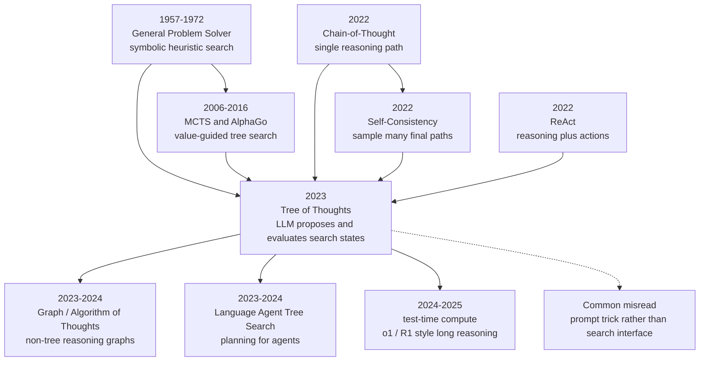

# Tree of Thoughts — Deliberate Search as a Reasoning Interface for LLMs

> **In May 2023, Shunyu Yao, Dian Yu, Jeffrey Zhao, and four co-authors from Princeton University and Google DeepMind posted [arXiv:2305.10601](https://arxiv.org/abs/2305.10601), turning language-model “thinking” from a single chain into a searchable tree of alternatives.** The headline number was not a larger model, but a changed interface: on Game of 24, GPT-4 with ordinary chain-of-thought solved only about 4% of the paper's setting, while Tree of Thoughts reached 74% by generating candidate thoughts, evaluating partial states, and keeping promising branches alive. The paper trained no new foundation model, yet it gave the 2023-2025 wave of agents, test-time compute, and o1/R1-style long reasoning a compact vocabulary: when a model cannot solve a problem in one pass, do not merely ask it to think one more step; let it hold several possible futures at once.

## TL;DR

Yao, Yu, Zhao, Shafran, Griffiths, Cao, and Narasimhan's 2023 NeurIPS paper Tree of Thoughts turns the single trajectory of [Chain-of-Thought prompting (2022)](../era4_foundation_models/2022_cot.md) into explicit search. Instead of sampling one answer $y \sim p_\theta(y\mid x)$, an LLM proposes candidate thoughts at a state $s_t=(x,z_{1:t})$, estimates a value $V(s_t)$ or votes among states, and lets BFS/DFS decide which branches survive, approximating $\arg\max_y \mathbb{E}[u(y,x)]$ under a test-time search budget. The failed baselines it replaces are simple but consequential: direct input-output prompting, one-shot CoT, and self-consistency all keep sampling after the first bad step has already narrowed the future. On Game of 24, GPT-4 CoT solved roughly 4% in the paper's setting, while the original ToT run reached 74%. Later agent planning systems, Graph of Thoughts, Language Agent Tree Search, and DeepSeek-R1-style 2025 test-time reasoning inherit the same lesson: reasoning quality is not only stored in model weights; it also depends on how much structured search the system is willing to spend at inference time.

---

## Historical Context

### The 2022 shift from answer output to visible intermediate reasoning

Before 2022, the dominant prompting interface still treated a language model like a black-box function: feed in $x$ and hope it emits the answer $y$. GPT-3 had demonstrated few-shot learning, but on arithmetic, multi-step symbolic tasks, and compositional commonsense questions, the model often made a wrong early move and then wrote a fluent path to an incorrect conclusion. Chain-of-Thought prompting changed that interface in January 2022. Wei, Wang, Schuurmans, and collaborators showed that when few-shot examples include intermediate reasoning sentences, large models such as PaLM, LaMDA, and GPT-3 improve sharply on GSM8K, MultiArith, CommonsenseQA, and related tasks. The important shift was not merely “write a longer prompt”; it exposed the model's intermediate computation as text that humans and systems could inspect and manipulate.

Yet CoT still had the shape of a single road. Once the model selected the first thought, it became locked into its own early choice: a wrong operation, a misread constraint, or a missing case would be carried forward by every later token. Self-consistency offered a direct patch in late 2022: sample many reasoning paths and vote over final answers. That patch works well for closed-form answers, but it postpones search until the very end. It compares complete trajectories after their cost has already been paid; it does not discover halfway through that one branch has no future. Tree of Thoughts targets exactly that gap: if LLMs can generate readable intermediate steps and roughly judge partial solutions, why not connect those abilities to classical search?

### Four strands before ToT

The first strand comes from cognitive science and early AI. Newell and Simon's General Problem Solver framed problem solving as search over states, operators, and goals; A*, beam search, minimax, and Monte Carlo Tree Search all live in that broader tradition of controlling expansion. The second strand comes from deep reinforcement learning, especially AlphaGo and AlphaZero: a neural network proposes moves and values states, while tree search turns local evaluations into global decisions. ToT operates on language tasks rather than Go boards, but the division of labor is similar: the model is not asked for a terminal answer in one shot; it acts as both generator and evaluator inside a search loop.

The third strand is the 2022 wave of LLM prompting. CoT made “textual thoughts” a usable intermediate layer; self-consistency showed that multiple reasoning paths reduce sampling noise; least-to-most prompting decomposed hard tasks into subproblems; Program-of-Thoughts and PAL handed parts of reasoning to code; ReAct alternated reasoning with environment actions. The fourth strand comes from the practical anxiety of the agent community. In WebShop, ALFWorld, HotpotQA, and related interactive tasks, models could already plan, call tools, and read feedback, but the field lacked a common way to say when to expand candidates, when to backtrack, and when to stop. ToT compresses those strands into a small abstraction: a thought is an edge or node in a search tree, and the LLM can both propose and evaluate it.

### Author team and timing

The authorship matters. Shunyu Yao, Jeffrey Zhao, Thomas L. Griffiths, and Karthik Narasimhan were at Princeton; Dian Yu, Izhak Shafran, and Yuan Cao were at Google DeepMind. The team spans NLP, cognitive science, reinforcement learning, and interactive agents. Yao and Narasimhan had already introduced ReAct in 2022, so ToT was not a detached “prompt trick”; it grew naturally from interactive decision problems. If ReAct lets a model think while acting, ToT lets it keep multiple possible thoughts before committing to an action.

The timing was just as important. GPT-4 appeared in March 2023 and convinced the community that a closed model had crossed a new reasoning threshold. ToT arrived on arXiv in May 2023, exactly between the ChatGPT wave and the agent wave. Many discussions at the time asked whether capability came only from larger models. ToT offered a different answer: without training new weights, an inference-time algorithm can substantially alter model behavior. That answer was less spectacular than a scaling law, but more accessible to builders, because the intervention point moved from datasets and GPU clusters to wrappers, prompts, search budgets, and task decomposition.

### Why this paper was needed in 2023

Before ToT, LLM reasoning papers often carried an implicit assumption: once the model writes an intermediate step, the system should keep trusting it. CoT asks the model to “show its work”; self-consistency asks it to show several versions; but few mechanisms say halfway through, “this road is no longer worth expanding.” The problem is clearest in Game of 24: if the first operation turns four numbers into a set that cannot reach 24, later fluent arithmetic cannot rescue it. In crosswords, if a candidate clue answer conflicts with existing letters, filling other cells only spreads the mistake. In creative writing, if the opening premise violates multiple global constraints, later polishing rarely restores coherence.

ToT's historical contribution is that it turns “test-time computation” from a vague wish into an enumerable interface. One can tune thought granularity, choose sample or propose generation, use value prompts or vote prompts, set beam width and depth, switch between DFS and BFS, and define early stopping. In other words, ToT moves prompt engineering closer to the algorithmic language of classical AI. That is why the paper kept being cited after the first agent hype cycle: it did not introduce a new Transformer architecture or a new RLHF recipe, but it provided early, concrete knobs for reasoning-time computation.

## Background and Motivation

### The bottleneck of single-path CoT

Single-path CoT does not fail because the model cannot verbalize reasoning; it fails because the system preserves no alternative futures. In many combinatorial problems, correctness depends on early discrete choices: which two numbers to combine first in Game of 24, which clue candidate to place in a crossword, or which narrative skeleton to use in a writing task. Token-level sampling naturally contains many possible futures, but standard prompting unfolds only one of them to completion. Even self-consistency samples many paths without sharing information halfway, pruning weak branches, or concentrating budget on promising states.

The motivation of the paper is therefore not “make explanations sound smarter.” It is to treat explanations as search objects. A thought can be one arithmetic transformation, one writing plan, or one crossword fill; a state can be the original problem plus the thoughts generated so far; an evaluator can be model self-critique, model voting, a rule checker, or an external program. The abstraction is broad enough to cover symbolic puzzles, text generation, and constraint satisfaction, yet narrow enough to be implemented as a few dozen lines of BFS or DFS.

### ToT's reframing of the problem

ToT rewrites LLM reasoning as three questions. First, how should candidate thoughts be generated: should the model independently sample complete fragments, or propose a set of legal next moves from the current state? Second, how should intermediate states be evaluated: should the model assign a value to each state, or vote among states presented together? Third, which search strategy should allocate budget: BFS keeping the top-$b$ states at a depth, or DFS with backtracking when constraints are strong? Together, these questions turn “how do we write the prompt?” into “how do we formulate the search problem?”

This reframing matters because it also explains why ToT is not a universal prompt. It is strongest when a task is decomposable, has meaningful intermediate states, and admits rough partial evaluation. For open-ended chat, factual lookup, or one-step classification, tree search may be expensive decoration. The deeper motivation is not to force every task into a tree, but to remind researchers that when the task already has tree structure, an LLM's textual thoughts can become the node language of a search algorithm.

---

## Method Deep Dive

### Overall framework

Tree of Thoughts can be summarized in one sentence: it upgrades the language model from an answer generator to a search operator. In standard prompting, the model samples a complete output $y$ from an input $x$; in CoT, the output is written as one intermediate reasoning chain $z_{1:T}$; in ToT, the system maintains multiple partial states, each consisting of the original problem and the thoughts generated so far, then repeatedly generates, evaluates, selects, and expands.

The paper formulates this as a more general problem-solving framework. Given a problem $x$, the final answer $y$ has utility $u(x,y)$, and standard prompting approximately samples:

$$
y \sim p_\theta(y \mid x)
$$

CoT decomposes $y$ into one implicit trajectory $z_{1:T}$, but still keeps only a single path. ToT searches over a state set $S_t$ at depth $t$:

$$
s_t=(x,z_{1:t}),\qquad z_{t+1}\sim G_\theta(s_t),\qquad \hat{v}_t=V_\theta(s_t)
$$

Here $G_\theta$ is the thought generator, $V_\theta$ is the state evaluator, and a search controller selects which subset of candidate states should be expanded next. The target is no longer “the first text that resembles an answer,” but an inference-budgeted approximation to:

$$
y^* \approx \arg\max_y \mathbb{E}[u(x,y) \mid \text{generated thoughts, evaluator, search budget}]
$$

| Paradigm | Intermediate representation | Branches | When evaluation happens | Typical failure mode |
|---|---|---:|---|---|
| Input-Output | none | 1 | final answer only | one bad step ruins all |
| Chain-of-Thought | one thought chain | 1 | usually no state evaluation | early error gets locked in |
| Self-Consistency | many complete CoTs | many terminal paths | final vote | spends budget on bad branches |
| Tree of Thoughts | searchable thought tree | many intermediate states | each layer or node | depends on evaluator quality |
| Tool / Agent Search | thought + action + observation | many interaction states | rules, environment, model mix | cost and state explosion |

The table shows that ToT is not “write longer reasoning.” It assigns reasoning to an explicit controller. The controller can be simple, as in the paper's BFS and DFS implementations, or later replaced by MCTS, A*, learned policies, or verifier-guided search.

### Key Design 1: thought granularity

The first design question is: what counts as a thought? The paper does not fix thoughts to tokens, sentences, or complete answers; the task determines the granularity. In Game of 24, a thought is one arithmetic operation plus the remaining numbers. In creative writing, a thought is a plan or candidate continuation. In mini crosswords, a thought is a candidate clue answer or a partial fill. This choice looks simple but controls both the width and depth of the search tree.

If thoughts are too small, the system approaches token search, with enormous branching and weak evaluation signals. If thoughts are too large, the method degenerates into self-consistency, comparing only complete answers. ToT's practical rule is to make a thought the kind of intermediate unit a human would also pause to inspect: short enough to generate several alternatives, semantically complete enough to evaluate, and compositional enough to expand further.

| Task | Thought granularity | State form | Legality signal | Why ToT fits |
|---|---|---|---|---|
| Game of 24 | one arithmetic transform | remaining numbers + expression | whether 24 remains reachable | early errors can be pruned |
| Creative Writing | next plan or candidate paragraph | chosen plan + constraints | coherence and constraint satisfaction | compares narrative routes |
| Mini Crosswords | candidate fill for a clue | grid letters + unsolved clues | letter conflict and clue match | naturally needs backtracking |
| Math Proof Sketch | lemma or derivation step | proved subgoals so far | whether it advances the goal | can connect to theorem provers |

A subtle point is that ToT never assumes the LLM's value judgment is perfectly reliable. It only needs the evaluator to be better than random often enough, and the controller can reduce single-judgment errors through multiple generations, voting, and rule filters. This resembles AlphaGo: the value network need not be perfect; it only has to guide search usefully.

### Key Design 2: generating candidate thoughts

The paper provides two generation modes. `sample` fits open-ended generation tasks: the model independently samples several candidate thoughts from the same state, as in creative writing. `propose` fits tasks with a clearer action space: the model lists possible next moves, as in Game of 24 arithmetic operations. The difference is whether candidates require strong deduplication and whether the prompt looks more like free continuation or action enumeration.

The generator abstraction can be written as:

$$
\mathcal{Z}_{t+1}(s_t)=\{z_{t+1}^{(1)},\ldots,z_{t+1}^{(k)}\},\qquad s_{t+1}^{(i)}=(s_t,z_{t+1}^{(i)})
$$

where $k$ is the number of candidate thoughts generated per state. The system searches over all $s_{t+1}^{(i)}$, rather than appending only the highest-probability next tokens. Temperature is therefore repurposed: it is no longer merely a way to create random outputs, but a way to explore more branches.

```python
def tree_of_thoughts(problem, max_depth, beam_size):
    frontier = [State(problem=problem, thoughts=[])]
    for depth in range(max_depth):
        candidates = []
        for state in frontier:
            thoughts = llm_generate_thoughts(state, mode="sample_or_propose")
            for thought in thoughts:
                child = state.extend(thought)
                child.value = llm_or_rule_evaluate(child)
                candidates.append(child)
        frontier = select_top_states(candidates, k=beam_size)
        if any(state.is_terminal_and_valid() for state in frontier):
            return best_terminal_state(frontier)
    return best_state(frontier)
```

The pseudocode intentionally restricts LLM calls to two locations: generate and evaluate. Everything else - tree maintenance, state deduplication, legality checks, width control - can be ordinary program logic. That is why the official ToT repository was easy to reproduce and adapt.

### Key Design 3: evaluating intermediate states

ToT uses two main evaluator forms. A `value` prompt asks the model to judge a single state's prospects, for example by answering sure / likely / impossible in Game of 24 and mapping labels to scores. A `vote` prompt asks the model to compare several candidate states, which is more natural for creative writing where absolute scores are unstable but relative preference is useful. Both treat the LLM as an approximate heuristic, not a theorem prover.

| Evaluation mode | Input | Output | Best suited tasks | Risk |
|---|---|---|---|---|
| Value | single state | scalar or label | Game of 24, program search | overconfidence, poor calibration |
| Vote | several states | rank or winner | writing, summarization, open generation | position bias, preference drift |
| Rule Check | state + rules | true/false | crosswords, arithmetic legality | only checks formal constraints |
| External Verifier | state + tool | evidence or score | code, math, retrieval | tool cost and interface complexity |

The insightful part is that evaluator imperfection is treated as part of the search system, not as a reason the system cannot work. In Game of 24, the model need not prove a partial state can reach 24; it only needs to roughly separate promising from impossible states. In writing, it need not produce an absolute literary score; it only needs to choose the more coherent plan among candidates. Keeping top-$b$ states instead of top-1 gives the evaluator room to be wrong.

### Key Design 4: search strategy and budget

The paper demonstrates two search families. BFS is used for Game of 24 and creative writing: at each depth, generate candidates, evaluate them, keep top-$b$, and move to the next layer. DFS is used for mini crosswords, where constraints are strong and dead ends are common, so backtracking is natural. Neither algorithm is new; the novelty is that natural-language thoughts can be plugged into these old algorithms.

The search budget can be approximated as:

$$
\text{LLM calls} \approx \sum_{t=0}^{T-1} |S_t|\cdot (C_{gen}+k\cdot C_{eval})
$$

where $|S_t|$ is the number of states retained at depth $t$, and $k$ is the number of candidate thoughts generated per state. This formula explains ToT's main cost: it trades training-time cost for inference-time cost. For short tasks like Game of 24, the exchange is attractive; for long conversations or large-scale serving, cost quickly becomes a bottleneck without caching, lightweight evaluators, or early stopping.

| Search strategy | Retained states | Expansion order | Strength | Cost |
|---|---:|---|---|---|
| BFS / Beam | top-$b$ per layer | synchronized by depth | easy to parallelize, fixed-step tasks | many LLM calls from width |
| DFS | current branch + stack | go deep then backtrack | strong-constraint puzzles | can be led by bad value estimates |
| MCTS | visit statistics + value | exploration/exploitation balance | long horizons | higher implementation and call cost |
| Verifier-guided Search | verifier-filtered states | dynamic | reduces hallucination | depends on external tool quality |

### Key Design 5: why it is a framework, not a single prompt

ToT is often misread as “write the prompt in a tree shape.” That is too narrow. The paper proposes a framework made of a task interface, generator, evaluator, and searcher. Prompts implement only two of those functions. State representation, candidate deduplication, legality checking, and budget allocation are equally important engineering choices.

This also explains why ToT quickly spilled into the agent literature in 2023. Agents already have states, actions, observations, and rewards; their actions and observations are often expressed in natural language. ToT showed that LLMs can play two key roles in heuristic search: proposing possible actions and evaluating local states. Later LATS, Graph of Thoughts, MCTS-for-LLM, and reflection-based agents extend the same interface: some turn trees into graphs, some replace evaluators with learned verifiers, some turn thoughts into tool calls, and some replace value estimates with environment returns.

---

## Failed Baselines

### Baseline 1: Input-Output prompting

Input-Output prompting is the simplest baseline: give GPT-4 the task and a few examples, then ask for the answer directly. Its failure reveals a basic fact: next-token decoding is good at writing terminal text that looks plausible, but poor at systematically preserving unexplored options in a combinatorial space. On Game of 24, IO reaches only 7.3% success. The issue is not that GPT-4 cannot do arithmetic; it has no mechanism to systematically explore the order in which four numbers should be combined. Once it chooses an early path, every other path disappears.

In mini crosswords, IO is weaker still. A 5x5 grid has 10 clues, and every word is constrained both horizontally and vertically. Producing the whole board in one shot asks the model to satisfy all lexical clues and crossing-letter constraints simultaneously. Letter-level accuracy can look nonzero because some local letters are easy to guess, but word-level and game-level metrics expose the real problem: without backtracking, the model cannot repair an earlier wrong fill.

### Baseline 2: Chain-of-Thought prompting

CoT should help reasoning, yet on Game of 24 it falls from IO's 7.3% to 4.0%. This is not a general indictment of CoT; the task amplifies the weakness of single-path reasoning. CoT examples ask the model to write three intermediate equations. If the first step combines two numbers in a way that leaves an unsolvable multiset, the path is already dead. The paper's error analysis shows that about 60% of CoT samples have failed after the first step. Later fluent text only hides that early lock-in.

CoT does help creative writing, because writing a plan before writing a passage improves global structure; GPT-4's average score rises from IO's 6.19 to 6.93. But it is still one plan. If the first plan is bland or conflicts with the emotional direction of the four required ending sentences, later generation can only patch locally. ToT's voting step does not ask the model to explain one plan; it asks the model to compare several plans and choose the one with the best global prospects.

### Baseline 3: Self-Consistency and best-of-k

Self-consistency extends single-path CoT into many complete paths and then votes over final answers. On Game of 24, CoT-SC(k=100) reaches 9.0%, better than CoT but far below ToT(b=5)'s 74%. Even oracle best-of-100 CoT, where the evaluation chooses a correct answer if any of the 100 samples contains one, reaches 49% and still loses to ToT. The issue is not just the amount of sampling; it is where the sampling budget is spent. Self-consistency spends budget on complete bad trajectories, while ToT spends budget on early branch selection and pruning.

For open-ended generation, self-consistency also lacks a natural voting object. Creative writing has no unique answer, so majority vote is meaningless. Crosswords have a unique board, but the important decisions happen at intermediate clue fills that need revision. ToT's step-wise value or vote fills this gap: it does not wait until the end to ask “which answer is most common?”; it repeatedly asks “which state is worth continuing?”

### Baseline 4: Refine, greedy search, and removing backtracking

The paper also compares iterative refine and ablations. In writing, refine is strong: IO + refine improves from 6.19 to 7.67, and ToT + refine reaches 7.91. This shows ToT is not the only form of deliberate inference; refine can also be seen as generating a new thought from an old thought. But refine usually edits one current answer locally, rather than exploring several early plans in parallel.

The mini-crossword ablations show the value of backtracking more directly. Full ToT reaches 60% word-level accuracy and solves 4/20 games. Removing pruning reduces letter and word metrics, although some branches pruned by a mistaken evaluator may contain correct solutions. Removing backtracking leaves word-level accuracy at only 20%. The result exposes the double edge of the evaluator: it makes search tractable, but it can also prune a correct branch when GPT-4 fails to recognize an obscure crossword word.

| Baseline | Failure mechanism | Exposed task in the paper | Key number | ToT repair |
|---|---|---|---|---|
| IO | commits to one answer | Game of 24 | 7.3% success | explicit intermediate states |
| CoT | early single-path lock-in | Game of 24 | 4.0% success | multi-branch retention and evaluation |
| CoT-SC | votes only at terminals | Game of 24 | 9.0% success | layer-wise pruning |
| Best-of-100 CoT | budget spent on full bad paths | Game of 24 | 49% oracle success | move budget to branch choice |
| No-backtrack DFS | cannot undo wrong clue fills | Mini Crosswords | 20% word-level | DFS backtracking |

## Key Experimental Data

### Game of 24: discrete search exposes first-step failures

Game of 24 is ToT's best-known result. The paper uses hard games from 4nums.com, testing 100 games indexed 901-1000 by human solving time. A success is a valid equation equaling 24 while using each input number exactly once. ToT decomposes the task into 3 arithmetic thoughts, proposes candidate operations at each step, evaluates candidates as sure / maybe / impossible, and uses BFS with breadth $b$.

| Method | Search / sampling setting | Success rate | Explanation |
|---|---|---:|---|
| IO prompt | 5-shot, average sampling | 7.3% | direct equation output |
| CoT prompt | 3 intermediate equations | 4.0% | first step often locks failure |
| CoT-SC | 100 CoT paths voted | 9.0% | terminal voting helps little |
| ToT | BFS, b=1 | 45% | even greedy retention helps sharply |
| ToT | BFS, b=5 | 74% | main paper result |
| IO + Refine | up to 10 rounds | 27% | uses correctness feedback |
| IO best-of-100 | oracle chooses correct sample | 33% | sampling alone is insufficient |
| CoT best-of-100 | oracle chooses correct sample | 49% | still below ToT b=5 |

The official repository notes that a released reproduced trajectory achieved 69% rather than the paper's 74%, because GPT decoding is stochastic. That difference is a useful reminder: ToT is an inference framework, not a deterministic algorithm; numbers depend on prompts, model version, temperature, and evaluator sampling.

### Creative Writing: planning improves global coherence

The creative writing task gives 4 random sentences and asks for a coherent 4-paragraph passage whose paragraphs end with those sentences. There is no unique answer, so the paper evaluates in two ways: GPT-4 zero-shot coherence scoring from 1 to 10, and blind pairwise comparison by a subset of the authors. ToT has depth 2: sample 5 plans and vote for the best plan; then sample 5 passages from that plan and vote for the final output.

| Method | GPT-4 coherence score | Human ToT/CoT preference | Key setting | Interpretation |
|---|---:|---|---|---|
| IO | 6.19 | n/a | direct passage | constraints mostly satisfied, weak structure |
| CoT | 6.93 | CoT wins 21/100 | write plan first | one plan helps |
| ToT | 7.56 | ToT wins 41/100 | 5 plans + vote | comparing plans is steadier |
| Tie | n/a | 38/100 | blind comparison close | open tasks have limited separability |
| IO + Refine | 7.67 | n/a | up to 5 refinements | local rewriting is strong |
| ToT + Refine | 7.91 | n/a | search then refine | deliberate methods can compose |

The point is not that ToT “writes fiction.” It is that ToT can operate without an executable verifier. The evaluator here is a relative preference model: the system asks which plan is more likely to satisfy the four ending-sentence constraints and maintain coherence.

### Mini Crosswords: backtracking is the point

Mini crosswords use a 5x5 grid, 5 horizontal clues, and 5 vertical clues. The paper scraped 156 games from GooBix, used 20 for testing, and 5 as prompt examples. Evaluation has three levels: letter-level accuracy across 25 letters, word-level accuracy across 10 words, and full games solved. ToT uses DFS: each state proposes candidate clue fills, evaluates whether remaining clues can still be filled, prunes impossible states, and backtracks.

| Method | Letter-level | Word-level | Games solved | Explanation |
|---|---:|---:|---:|---|
| IO | 38.7 | 14 | 0 | fill grid in one pass |
| CoT | 40.6 | 15.6 | 1 | sequential words without backtracking |
| ToT | 78 | 60 | 20 | full DFS + prune |
| ToT + best state | 82.4 | 67.5 | 35 | oracle selects best searched state |
| ToT - prune | 65.4 | 41.5 | 5 | less pruning, more drift |
| ToT - backtrack | 54.6 | 20 | 5 | greedy-like, cannot undo errors |

The Games solved column is expressed as a percentage: 20 means 4/20 games and 35 means 7/20. The key result is the ablation, not the absolute score. Removing backtracking nearly reduces the method to greedy filling; oracle best state shows that the evaluator and final-output heuristic still left performance on the table.

### Cost and reproducibility

ToT's cost is real. Appendix B.3 reports token and dollar estimates for Game of 24: ToT uses about 5.5k completion tokens and 1.4k prompt tokens per problem, costing around $0.74; CoT best-of-100 uses about 6.7k completion tokens and 2.2k prompt tokens, costing around $0.47 but reaching only 49%. In creative writing, ToT costs about $0.32 per problem, roughly 5x IO/CoT. The main Game of 24 and creative writing experiments together cost about $106, and the crossword DFS experiments are also within the $100 range.

| Setting | Prompt / completion tokens | Estimated cost | Result | Note |
|---|---|---:|---|---|
| IO best-of-100 | 1.0k / 1.8k | $0.13 | 33% | Game of 24 |
| CoT best-of-100 | 2.2k / 6.7k | $0.47 | 49% | Game of 24 |
| ToT | 1.4k / 5.5k | $0.74 | 74% | Game of 24 |
| Creative IO | 0.4k / 0.9k | $0.06 | 6.19 | GPT-4 score |
| Creative ToT | 2.9k / 4.0k | $0.32 | 7.56 | GPT-4 score |

This is the central tension ToT leaves for later work: it moves capability improvement into inference-time computation, but inference-time computation costs money, latency, and evaluator bias. Later test-time compute, verifier-guided search, reasoning models, and agent planners all revisit how that budget should be spent.

---

## Idea Lineage

### Before: search and language lived apart

ToT's ancestry is not prompt engineering; it is heuristic search. In the late 1950s, Newell, Shaw, and Simon's General Problem Solver described problem solving as search over partial solutions in a combinatorial space. In 1968, A* put heuristic functions into shortest-path search. Through the 1990s and 2000s, game AI matured minimax, alpha-beta pruning, and MCTS. In 2016, AlphaGo combined neural value/policy networks with MCTS and showed that “learned heuristics + tree search” could beat human experts.

The language-model story moved in the opposite direction for a long time. GPT-style models folded reasoning into token-level left-to-right decoding: every token is a local conditional-probability choice, and the whole output behaves like one irreversible stream. CoT exposed intermediate steps in that stream; self-consistency sampled several streams in parallel; but neither system institutionalized the idea that intermediate states can be evaluated, pruned, and revisited. ToT's historical position is exactly here: it reconnects the vocabulary of classical AI search to modern LLMs.



### The paper's contribution: thought as search node

ToT did not invent tree search or self-evaluation. Its contribution is the language interface between them. Traditional search needs a hand-written action space and heuristic; LLM prompting can generate natural-language reasoning but lacks systematic control. ToT says: make the thought itself the action, make partial text the state, and make LLM self-evaluation the heuristic. The interface is small enough for BFS/DFS, yet general enough to absorb agents, tool calls, program checks, and external feedback.

That interface explains why the paper was absorbed so quickly in 2023. Graph of Thoughts turns trees into graphs, allowing thoughts to merge or refer to each other. Algorithm of Thoughts writes the search procedure into the prompt so the model simulates algorithmic steps. Language Agent Tree Search adds actions and observations, turning ToT into an agent planner. MCTS-for-LLM work brings back visit counts, UCT, and rollouts. These systems do not all copy the ToT prompts; they share the same basic view that LLM reasoning can be organized by an external search controller.

### Misreadings: not a more elaborate CoT template

The most common misreading of ToT is to treat it as a prompt template: “ask the model for several ideas, then pick one.” That can work, but it discards the paper's four real degrees of freedom: thought decomposition, candidate generation, state evaluation, and search algorithm. Without state representation, intermediate pruning, backtracking, or width control, the so-called tree is only diversity sampling with a new label.

Another misreading is to treat ToT as a universal enhancer. The paper is more careful: it says ToT fits tasks that need exploration, strategic lookahead, and early decisions with large downstream effects. On tasks GPT-4 already handles well, such as GSM8K and StrategyQA in the appendix, zero-shot ToT improves only slightly. That boundary matters because it turns ToT from a magic prompt into a search framework whose value depends on task structure.

### Three lines that carried forward

The first line is test-time compute. ToT clearly showed that the same model, with the same weights, can perform much better when inference spends structured computation. In 2024-2025, o1, DeepSeek-R1, verifier-guided decoding, and best-of-N with reward models all extend this idea at different levels, even when thoughts are no longer visible to users.

The second line is language-agent planning. ReAct lets a model alternate reasoning and action in an environment; ToT lets a model compare several partial plans before acting. Combining the two yields many agent tree-search systems. The third line is interpretability and control. A ToT search tree is not the true neural computation, but it gives developers an auditable object: which branches were generated, why a branch was judged likely or impossible, and which state was pruned. For safety and reliability, that externalized trace is easier to inspect than one final answer.

| Lineage thread | Before ToT | ToT's turn | Later extension | Open problem |
|---|---|---|---|---|
| Prompted reasoning | single CoT | multi-branch thought state | Graph/Algorithm of Thoughts | avoiding formalism without substance |
| Classical search | hand-written heuristic | LLM as heuristic | MCTS / LATS | evaluator trustworthiness |
| Agent planning | reason/action alternation | search plans before acting | tool-use tree search | state-space explosion |
| Test-time compute | best-of-N sampling | structured budget allocation | o1/R1-style reasoning | cost and latency |

---

## Modern Perspective

### What held up

From a 2026 perspective, ToT's most durable claim is that reasoning ability does not live only in parameters; it also lives in the inference-time process. In 2023 this sounded like a prompt-engineering observation. By 2024-2025, test-time compute had become a central engineering dimension of reasoning systems. Verifier-guided best-of-N, agent planners, tool-use search, and o1 / DeepSeek-R1-style long-reasoning systems all practice the same idea: before producing an answer, the system should be allowed to explore, compare, and revise.

The second durable idea is modularity. ToT separates the base LM, thought decomposition, generator, evaluator, and search algorithm, so builders can replace any component. Modern systems rarely use the paper's BFS prompts verbatim, but they keep the decomposition: a cheap model may generate candidates, a stronger model or verifier may evaluate, rules may check legality, and caching or early stopping may control cost. The API outlived the exact prompts.

### What did not hold up

First, the paper's optimism about LLM self-evaluation needs tightening. The evaluator works reasonably on Game of 24 because states are simple; crosswords already expose mistaken pruning; in real code, medicine, law, or long-horizon agent tasks, self-evaluation often disconnects from truth. Many post-2024 systems replace self-evaluation with external verifiers, unit tests, symbolic checkers, retrieval evidence, or reward models. The evaluator concept survives, but “let the same LLM judge itself” is not always reliable.

Second, the paper's tasks are small. Game of 24 has only three steps, creative writing has two layers, and mini crosswords cap DFS at 100 steps. Real agent tasks introduce state aliasing, long-context contamination, tool failures, irreversible actions, and drifting goals. Third, ToT assumes thoughts are readable natural language. Later reasoning models may not expose the full search trace; useful reasoning may happen in hidden scratchpads, latent plans, or verifier loops.

### If rewritten today

If ToT were rewritten today, the method section would likely look more like a test-time search stack. The generator could be hierarchical: cheap models for broad exploration, stronger models for deep reasoning. The evaluator could combine rules, programs, retrieval, reward models, and LLM judges. Search could move beyond BFS/DFS into MCTS, A*, branch-and-bound, or portfolio search. State management would explicitly handle deduplication, caching, counterfactual rollback, and trace compression. The paper would also report latency, dollar cost, token budget, API version, and randomness more systematically.

It might also add training. The original ToT does not train a model, but 2024-2025 reasoning models show that models can be trained into better thought generators and verifier users. In other words, an external ToT search framework can generate training data: which branches were pruned, which intermediate states later turned out useful, and which value judgments misled the search can all become supervision or RL signals.

| Modern question | 2023 ToT answer | 2026 view | Possible upgrade |
|---|---|---|---|
| Where does reasoning ability live? | inference-time search can supplement weights | test-time compute is a core variable | explicit budget policy |
| Who evaluates states? | LLM self-value / voting | self-judgment is often unreliable | verifier + tool + reward model |
| How is cost controlled? | tune beam and vote count | latency is a product bottleneck | cache, early stop, small/large model routing |
| Should traces be visible? | thoughts are readable | readable is not faithful | auditable traces plus hidden reasoning separation |

## Limitations and Future Directions

### The evaluator is the bottleneck

ToT's effectiveness depends heavily on the evaluator. A poor evaluator turns search into a confident error amplifier: it does not merely choose wrong; it systematically prunes correct branches. The crossword ablation already shows this, and more complex tasks make it worse. The safest direction is heterogeneous evaluation: executable tasks use unit tests or program checks, factual tasks use retrieval evidence, open-text tasks use multiple judges and human-preference calibration, and safety-sensitive tasks add policy checkers.

Calibration is another evaluator problem. LLMs often rate states that “look like answers” as promising while undervaluing ugly intermediate states that can still reach the goal. Future systems need more than a value prompt; they need evaluators that estimate uncertainty, recognize unknowns, and trigger exploration when confidence is low. This is why MCTS, Bayesian search, and uncertainty-aware verifiers entered LLM reasoning.

### Cost and latency

ToT's cost is not incidental; it is part of the method. Every extra depth level, retained branch, or vote increases tokens, dollars, and latency. Game of 24 at $0.74 per problem was acceptable for a paper experiment, but cannot be copied directly into large-scale products. More importantly, search cost grows nonlinearly with horizon and branching factor; without early stopping and state caching, complex agent tasks explode quickly.

Future directions fall into three buckets. First, adaptive budgets: open the tree only when the model is uncertain or when the task structure demands it. Second, model routing: use cheap models for broad generation and expensive models for critical evaluation. Third, state compression: summarize long traces into evaluable states so the context window is not consumed by dead branches. ToT gives performance-cost knobs, but not an automatic tuner.

### Task coverage and realism

The three ToT tasks are cleverly chosen but still toy-like. Game of 24 and crosswords have clear checking rules; creative writing is open-ended but short and artificially constrained. Real-world tasks are messier: missing information, changing goals, tool errors, ambiguous user preferences, and actions that may be irreversible. The framework can transfer, but the simple prompt evaluators from the paper are unlikely to remain sufficient.

A more realistic benchmark should include long horizons, multiple tools, reversible and irreversible actions, partially observed state, external factual verification, and explicit cost constraints. In other words, ToT successors should not report only “accuracy improved”; they should report how much search each success required, whether failures came from the generator or evaluator, and whether pruning killed correct branches.

## Related Work and Insights

### Relation to CoT, self-consistency, and refine

ToT can be seen as a superclass of a family of prompting methods. IO is a depth-0 or width-1 tree. CoT is a width-1, depth-$T$ tree. Self-consistency compares many paths only at the final layer. Refine generates an improved state from an old state. ToT allows multiple thoughts at every layer and evaluates them. This view is useful because it unifies many prompt techniques as degenerate forms of search trees.

Unification does not mean replacement. CoT is cheap, simple, and good enough on many tasks. Self-consistency remains a strong baseline for closed-form answers. Refine is extremely useful for writing and code repair. The lesson from ToT is to first ask whether the task needs intermediate-state search, and only then pay the search cost.

### Relation to ReAct, RAP, and LATS

ReAct and ToT are two pieces of the same authorial lineage. ReAct focuses on alternating reasoning, action, and observation so the model can operate in an environment. ToT focuses on multi-branch deliberation before acting, so the model can compare plans internally. RAP, a concurrent work, treats reasoning as planning with an internal world model and uses MCTS more explicitly. LATS brings tree search into agent tasks and updates branches with environmental feedback.

Together, these works move LLMs from text completers toward plannable controllers. They differ mainly in where state comes from: ToT states are mostly textual thoughts; ReAct states include observations; RAP and LATS resemble model-based planning. In engineering systems, the lines often merge: an agent may first plan with ToT, execute with ReAct, and then use a verifier or reflection step to return to the tree after failure.

### Three practical lessons for today's systems

First, “let the model think more” is not one button. It can mean more samples, tree search, reflection, verification, tool calls, long scratchpads, or RL-trained reasoning, and different tasks need different forms. Second, evaluators are more dangerous hidden risks than generators. If a generator is wrong, the system may still have alternatives; if an evaluator is systematically biased, the search accelerates in the wrong direction. Third, explicit traces are both capability tools and governance tools. Developers can diagnose failure only when they can see which layer of the search tree failed.

| Direction | Representative work | Relation to ToT | Practical lesson |
|---|---|---|---|
| CoT / CoT-SC | Wei 2022, Wang 2022 | degenerate forms of ToT | do not open a tree when one path suffices |
| ReAct | Yao 2022 | alternates thought and action | search and execution can be layered |
| RAP / LATS | Hao 2023, agent search lines | planning-style tree search | environment feedback can be value |
| Self-Refine / Reflexion | Madaan 2023, Shinn 2023 | improved thoughts from old states | useful for open generation and code |
| Verifier-guided reasoning | unit tests, reward models | replaces LLM self-evaluation | reduces mistaken pruning and hallucination |

## Resources

### Paper, code, and prompts

The essential resources are the paper and the official implementation. The paper is [arXiv:2305.10601](https://arxiv.org/abs/2305.10601), and the code is [princeton-nlp/tree-of-thought-llm](https://github.com/princeton-nlp/tree-of-thought-llm). The repository contains the `src/tot` package, prompts for Game of 24 / creative writing / crosswords, experiment scripts, and trajectories. Its README also records the 69% reproduced Game of 24 run versus the original 74%, which is useful context about stochastic decoding.

| Resource | Link | Use | Note |
|---|---|---|---|
| Paper | https://arxiv.org/abs/2305.10601 | original method and experiments | NeurIPS 2023 |
| Code | https://github.com/princeton-nlp/tree-of-thought-llm | official implementation | MIT license, 5.9k stars |
| Prompts | repo `src/tot/prompts` | reproduce task prompts | task-specific |
| Logs | repo `logs/` | inspect search trajectories | includes stochasticity note |
| PyPI | `tree-of-thoughts-llm` | quick installation | good for teaching experiments |

### Reading path

A good reading path starts with the Introduction and Section 3, which define ToT's four questions: thought decomposition, generation, evaluation, and search. Then read Game of 24, because it most clearly shows why first-step errors need pruning. Next read Mini Crosswords, which shows evaluator imperfection and the necessity of backtracking. Finally read Appendix B.3 on cost, which gives a sober view of the engineering boundary.

For follow-up work, read along three lines. The CoT/self-consistency/refine line explains how prompting moved from one path to many paths. The ReAct/RAP/LATS line explains how agent planning connects to environments. The verifier/test-time-compute line explains how 2024-2025 reasoning systems internalized or scaled ToT's external-search idea.

### Reproduction notes

Three details are easy to miss when reproducing ToT. First, model version changes results; different GPT-4 API snapshots, temperature, and sample counts affect success rates. Second, prompts and state parsing are not experimental plumbing; they are the core task interface. In Game of 24, extracting remaining numbers matters; in crosswords, translating filled letters into constraints matters. Third, failure traces must be logged. Final accuracy alone hides mistaken evaluator pruning, repeated generations, and branch explosion.

For a new task, the minimum viable process is: define thought granularity, write a state serializer, design a generator prompt, design an evaluator or rule checker, choose the simplest working strategy among BFS/DFS/MCTS, manually inspect traces on 20-50 examples, and only then scale up. ToT's value is not the template; it is the discipline of making explicit what the model is actually searching over.


---

> 🌐 [中文版](/era5_genai_explosion/2023_tot/) · 📚 awesome-papers project · CC-BY-NC