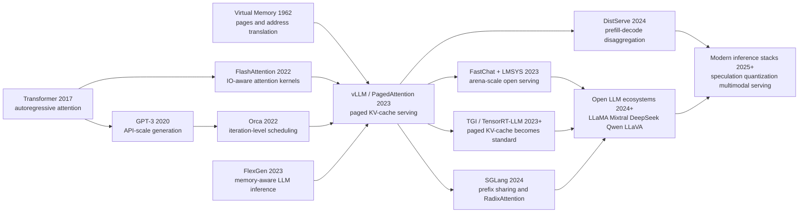

# vLLM / PagedAttention — Rescuing LLM Serving from KV-Cache Fragmentation

> **At SOSP 2023, [vLLM / PagedAttention](https://arxiv.org/abs/2309.06180) was not a bigger model, a new pretraining recipe, or another benchmark climb.** It was a systems paper that looked at LLM serving and said: the bottleneck is not only matrix multiplication; it is also the way KV cache is allocated, fragmented, reserved, copied, and shared. Woosuk Kwon, Zhuohan Li, Siyuan Zhuang, Ying Sheng, Lianmin Zheng, Cody Hao Yu, Joseph E. Gonzalez, Hao Zhang, and Ion Stoica brought old operating-systems vocabulary - pages, block tables, reference counts, copy-on-write, preemption - into Transformer decoding. The result was a serving engine that could increase throughput by multiples without changing model weights or model outputs. After vLLM, every serious open LLM serving stack had to answer a deceptively practical question: how exactly do you manage the KV cache?

## TL;DR

The 2023 SOSP paper by Woosuk Kwon, Zhuohan Li, Siyuan Zhuang, Ying Sheng, Lianmin Zheng, Cody Hao Yu, Joseph E. Gonzalez, Hao Zhang, and Ion Stoica turned the most mundane state in Transformer decoding - the KV cache - into paged memory. Instead of storing each request's key/value tensors in one contiguous chunk reserved for a maximum sequence length, PagedAttention splits the cache into fixed-size KV blocks, maps logical blocks to non-contiguous physical blocks through a block table, and lets attention read those blocks directly with $o_i=\sum_j V_j A_{ij}^{\top}$. The failed baseline it displaced was not a model family, but the serving default used by HuggingFace-style generation, FasterTransformer-style batching, and Orca-style contiguous allocation: for OPT-13B, one token's KV cache costs about 800 KB and a 2048-token request can reach 1.6 GB, while existing systems in the paper used only 20.4%-38.2% of KV-cache memory for actual token states. By allocating blocks on demand, bounding fragmentation to the last block, sharing prompt blocks, and using copy-on-write for branching decoders, vLLM reports 2-4x higher throughput over Orca/FasterTransformer in the SOSP experiments, while the public blog reports up to 24x over HF Transformers and 3.5x over TGI. Its influence runs through the serving stacks that made LLaMA, Mixtral, DeepSeek, Qwen, LLaVA, and later open models usable at scale. The hidden lesson is that in the foundation-model era, a decisive “algorithmic” advance may be a systems abstraction placed under an unchanged neural network.

---

## Historical Context

### Spring 2023: LLM Serving Turned from Demo into Bill

The timing of vLLM matters. At the end of 2022, ChatGPT pushed conversational LLMs into public view. In the first half of 2023, the open community quickly produced LLaMA, Alpaca, Vicuna, FastChat, and Chatbot Arena. Models were no longer just weights that researchers downloaded and tested locally; they became services with many simultaneous users. For a university lab or a small team, the question changed from “can we run one generation?” to “can we survive real traffic on a limited number of GPUs?”

The cost structure of this service looked nothing like ordinary web serving. For every prompt, the system runs a prefill phase and then decodes one token at a time. Each step reads model weights, reads the key/value state for previous tokens, and writes the new token's state. A Reuters estimate from early 2023, widely cited at the time, suggested that an LLM request could cost about 10 times as much as a traditional keyword query. The number does not fit every model or deployment, but it captured the industry anxiety correctly: an LLM API that cannot increase throughput cannot become sustainable infrastructure.

Before vLLM, batching was already understood as essential. Orca's iteration-level scheduling showed that requests in a batch do not need to wait for the same sequence length; after every decode iteration, finished requests can leave and new requests can join. FasterTransformer, DeepSpeed Inference, FlashAttention, and related work had pushed kernels and matrix execution forward. Yet open serving in 2023 still hit a more basic wall: if memory cannot fit enough active requests, even the cleverest batching policy has too few requests to batch.

### Why the KV Cache Became the Main Character

Transformer decoding must cache the key and value vectors for every previous token. This KV cache looks like intermediate state, but it quickly becomes the main memory actor. The paper gives a memorable number: for OPT-13B, one token's KV cache costs about 800 KB, computed as $2 \times 5120 \times 40 \times 2$ bytes. With a 2048-token maximum sequence length, one request can require up to about 1.6 GB of KV cache. On an A100-40GB serving a 13B model, weights take roughly 65% of memory and dynamic KV cache takes close to 30%. The weights are static, activations are short-lived, and the dynamic cache decides how many concurrent requests can fit.

The problem was not only that KV cache was large; it was treated like a normal contiguous tensor. To reserve for unknown output length, systems often allocated one contiguous chunk for the maximum sequence length. If the actual output was shorter, internal fragmentation appeared. If different requests reserved different sizes, external fragmentation appeared. Even slots that would eventually be used by future tokens were reserved for the entire lifetime of a request, preventing other requests from using them. The vLLM paper names these three waste modes clearly: reserved slots, internal fragmentation, and external fragmentation.

That observation gives the paper its systems flavor. It does not merely say that an attention kernel can be made faster. It says the state layout underneath attention is wrong. After profiling existing systems, the authors report that only 20.4%-38.2% of KV-cache memory in their experiments actually stores token states. In other words, memory was not simply insufficient; it was being consumed by contiguous allocation, maximum-length reservation, and inability to share.

### The Berkeley and LMSYS Systems Context

vLLM also did not appear in isolation. The authors came from UC Berkeley, Stanford, UC San Diego, and independent research, and several were involved in Alpa, AlpaServe, FlexGen, Vicuna, FastChat, and Chatbot Arena. That background explains why the paper understands both model-serving pressure and the value of systems abstraction. It does not start from model architecture and ask whether a model can be stronger; it starts from real service load and asks why the same GPU is not serving more people.

The early LMSYS experience gave vLLM a concrete proving ground. Vicuna and Chatbot Arena had to serve many users on a limited pool of academic GPUs, and the initial HuggingFace backend quickly became a bottleneck. The vLLM blog reports that the FastChat-vLLM integration supported up to 5 times more traffic while reducing the GPU count for related serving by 50%; an early internal micro-benchmark even observed up to 30 times higher throughput than the initial HF backend. The SOSP paper is more conservative, reporting 2-4x throughput improvement over FasterTransformer and Orca, but both accounts point to the same fact: LLM serving had reached the stage where dynamic state management mattered.

That is vLLM's historical position. It did not train a new model or introduce a new benchmark. It moved paging, address translation, reference counts, and copy-on-write from operating-systems textbooks into LLM serving. After 2023, open model adoption was no longer determined only by whether weights were released; it also depended on the inference engine. LLaMA, Vicuna, Mistral, Mixtral, DeepSeek, Qwen, and LLaVA all needed a serving substrate of this kind to become widely usable.

## Background and Motivation

### Core Problem: Memory Capacity Is Not Just Model Weight Size

vLLM's core question can be reduced to one sentence: **when model weights already occupy most of GPU memory, how can the dynamic KV cache stop wasting the remaining space?** LLM-serving throughput is usually not determined by the fastest single request. It is determined by how many requests the system can run concurrently under acceptable latency. More concurrent requests amortize weight reads and increase GPU utilization; more concurrent requests also create more KV cache. If KV cache is reserved contiguously for maximum sequence length, batch size quickly hits the memory limit.

This differs from ordinary DNN serving. Traditional vision models often have fixed tensor shapes, and a memory planner can arrange buffers ahead of time. LLM output length is unknown, prompt length varies widely, and every decode step grows the cache. It also differs from activation checkpointing in training. Training can optimize over a static forward/backward graph, while online serving must handle request arrivals, completions, preemption, recovery, parallel sampling, beam search, and shared prefixes. The KV cache is both part of model computation and a dynamic resource in the serving system.

Therefore vLLM's motivation is not to make the model smarter. It is to let the same model serve more requests on the same GPUs. That is why the paper repeatedly emphasizes that model accuracy is unaffected: PagedAttention changes the physical storage and access pattern of key/value tensors; it does not change the attention math, the weights, or the sampling distribution. It is a systems-level equivalence transformation.

### Design Motivation: Turn a Contiguous Tensor into a Paged Object

If the KV cache remains a contiguous tensor, the system is trapped by maximum-length reservation. vLLM changes the abstraction. Logically, a sequence's tokens are still continuous. Physically, the KV cache can be split into fixed-size blocks and stored anywhere. A block table translates logical positions into physical blocks, and the attention kernel reads key/value vectors through that table. The system no longer needs to reserve a full future chunk up front; it allocates a new block only when new tokens need one.

This motivation directly borrows from operating-system virtual memory. A process sees a contiguous address space, while the OS maps logical pages to physical pages. Multiple processes can share the same physical page and copy it only on write. vLLM treats requests as processes, tokens as bytes, and KV blocks as pages. The analogy is not only rhetorical. It creates concrete capabilities: on-demand allocation reduces reserved waste, fixed-size blocks eliminate external fragmentation, the last block bounds internal fragmentation, and reference counts plus copy-on-write support parallel sampling, beam search, and shared prefixes.

That is the central value of PagedAttention. It adds a layer of memory indirection to LLM serving so the scheduler, block manager, and CUDA kernels can cooperate instead of being constrained by contiguous tensor layout. Later serving systems would extend chunked prefill, prefix caching, speculative decoding, prefill/decode disaggregation, multi-LoRA, and MoE serving, but many of these extensions stand on the same premise: the KV cache is a manageable, shareable, schedulable resource, not an indivisible contiguous array.

---

## Method Deep Dive

### Overall Framework

vLLM has two layers. The lower layer is PagedAttention, which lets the attention kernel read historical key/value states from non-contiguous KV blocks. The upper layer is the vLLM serving engine, which turns this new layout into real throughput through a scheduler, a block manager, CUDA kernels, and distributed execution. The elegance of the paper is that both layers are necessary. A block manager without an attention kernel that can read block tables cannot compute over non-contiguous storage. A kernel without scheduling and reference counts cannot handle parallel sampling, beam search, preemption, and shared prefixes.

Autoregressive generation can be written as:

$$
P(x_1,\ldots,x_n)=\prod_{i=1}^{n}P(x_i\mid x_1,\ldots,x_{i-1}).
$$

For every new token, the model only computes the query/key/value for the new position, but attention still reads the key/value states for all previous positions. The KV cache therefore becomes a state array that grows with the sequence. Existing systems treated this array as a contiguous tensor. vLLM splits it into fixed-size blocks and uses a block table to maintain the mapping between logical sequence positions and physical GPU memory.

| Component | Role in vLLM | Why it is necessary |
|---|---|---|
| PagedAttention kernel | reads non-contiguous KV blocks through a block table | makes the paged layout executable for attention |
| KV block manager | allocates, frees, reference-counts, and copy-on-writes blocks | turns dynamic KV cache into a managed resource |
| Scheduler | selects which sequence groups run in each iteration | provides fair scheduling and preemption under block pressure |
| CUDA kernels | fused reshape/write, block-read attention, block copy | offsets indirection and small-copy overheads |
| Distributed workers | execute tensor-parallel shards with the same block table | gives large models one shared memory view across GPUs |

### Key Design 1: Block-wise PagedAttention

Standard attention for token $i$ can be written as:

$$
a_{ij}=\frac{\exp(q_i^\top k_j/\sqrt{d})}{\sum_{t=1}^{i}\exp(q_i^\top k_t/\sqrt{d})},\qquad
o_i=\sum_{j=1}^{i}a_{ij}v_j.
$$

PagedAttention does not change this mathematical definition. It changes how keys and values are stored and read. Let the block size be $B$. The $j$-th KV block contains the key/value vectors for a contiguous logical span of tokens: $K_j=(k_{(j-1)B+1},\ldots,k_{jB})$ and $V_j=(v_{(j-1)B+1},\ldots,v_{jB})$. Attention can then read block by block:

$$
A_{ij}=\mathrm{softmax}_{\le i}(q_i^\top K_j/\sqrt{d}),\qquad
o_i=\sum_{j=1}^{\lceil i/B\rceil}V_jA_{ij}^{\top}.
$$

The formula means that, logically, attention still attends to all previous tokens. Physically, the kernel reads one block at a time and does not require neighboring logical blocks to be neighbors in GPU memory. The block table provides the physical block id for every logical block, and the kernel gathers key/value vectors through those ids. vLLM therefore gets the most important freedom of OS paging: logical contiguity no longer implies physical contiguity.

### Key Design 2: Block Tables and On-demand Allocation

The block table is vLLM's page table. Each sequence group owns a sequence of logical blocks; each logical block records its physical block id, number of filled token slots, and sharing state. During prefill, vLLM allocates enough blocks for the prompt. During decode, every generated token writes its KV state into the last block. If that block is full, the block manager allocates a new physical block and records the mapping in the table.

This design bounds worst-case waste to the last partially filled block. If the block size is $B$ and one token's KV size is $s_{kv}$, the tail waste for one sequence satisfies:

$$
0\le w_{\text{tail}} < B\cdot s_{kv}.
$$

That is sharply different from reserving for the maximum length. An older system may reserve a full KV-cache chunk for a 2048-token maximum even if the output is only a few dozen tokens. vLLM allocates only for tokens that already exist plus one tail block. The ablation shows that tiny blocks reduce GPU read/write efficiency, while large blocks increase internal fragmentation. In practice, the default block size of 16 is a good compromise on ShareGPT- and Alpaca-like workloads.

### Key Design 3: Sharing, Reference Counts, and Copy-on-write

PagedAttention's value goes beyond fragmentation. It naturally supports sharing. In parallel sampling, one prompt produces multiple candidate outputs, and the prompt portion of the KV cache is identical. In beam search, candidates share prefixes and diverge later. In shared-prefix serving, a system prompt or few-shot examples can be reused by many requests. Contiguous tensor layout represents these relationships poorly and often copies large KV chunks. A block table can simply let multiple logical blocks point to the same physical block.

To make sharing safe, vLLM maintains a reference count for every physical block. When a shared block must be written by one sequence, the system checks the count. If it is greater than one, vLLM allocates a new block, copies the old content, redirects the current sequence to the new block, and then writes. If the count is one, it writes in place. This is operating-system copy-on-write, with KV blocks replacing memory pages.

The number of physical blocks after sharing can be summarized by an intuitive formula:

$$
N_{\text{physical}}\approx \sum_{r}\left\lceil\frac{L_r}{B}\right\rceil - N_{\text{shared blocks}}.
$$

The formula is not an exact scheduling model, but it explains why beam search and parallel sampling benefit more. The more branches and the longer the shared prefix, the more shared blocks can be subtracted. The paper reports 6.1%-9.8% KV-block savings for parallel sampling and 37.6%-55.2% for beam search on Alpaca; on ShareGPT, the corresponding savings rise to 16.2%-30.5% and 44.3%-66.3%.

```python
def append_token(sequence, token_kv, block_manager):
    block = sequence.logical_blocks[-1]
    physical = block.physical_block

    if block.is_full():
        physical = block_manager.allocate()
        sequence.logical_blocks.append(LogicalBlock(physical))

    elif physical.ref_count > 1:
        new_physical = block_manager.allocate()
        block_manager.copy_block(src=physical, dst=new_physical)
        physical.ref_count -= 1
        block.physical_block = new_physical
        physical = new_physical

    physical.write_next(token_kv)
    block.filled += 1
```

### Key Design 4: Scheduling, Preemption, and Distributed Execution

vLLM's scheduler uses FCFS and gang-schedules related sequences as one sequence group. This avoids a situation where some beam-search or parallel-sampling candidates continue while others are preempted independently, which would complicate shared-block semantics. When the system runs out of physical blocks, vLLM preempts later-arriving requests and chooses between swapping and recomputation for recovery. The paper exploits a special property of LLM serving: all blocks of a sequence are usually accessed together, so preemption can be all-or-nothing. Recovery can also concatenate the prompt and generated tokens into a new prompt and recompute the KV cache in one prefill-style pass instead of decoding token by token.

For distributed execution, vLLM supports Megatron-LM-style tensor parallelism. Each GPU worker stores only the KV-cache shard for the attention heads it owns, but all workers share the same logical-to-physical block mapping. At the start of each iteration, the scheduler broadcasts input tokens and the block table. Workers read their KV shards according to the same physical block ids and synchronize intermediate results with all-reduce. The key point is that memory management remains centralized in the scheduler and block manager, rather than forcing every worker to infer the cache layout independently.

| Design point | Problem solved | Cost | Paper's treatment |
|---|---|---|---|
| Non-contiguous KV blocks | fragmentation and reserved waste from contiguous chunks | attention needs extra indirection | PagedAttention kernel reads the block table directly |
| On-demand allocation | unknown output lengths make maximum reservation wasteful | the tail block still has small waste | default block size 16 balances the trade-off |
| Block sharing | repeated KV cache in parallel sampling and beam search | needs reference counts and COW | physical block reference counts plus fused block copy |
| FCFS + preemption | not enough physical blocks under overload | swap/recompute adds recovery overhead | all-or-nothing sequence-group preemption |
| Distributed block table | cache shards are distributed across GPUs | control messages must be broadcast | scheduler sends one block table to all workers |

### Key Design 5: Kernel Optimizations Make the Abstraction Real

Paging usually introduces indirection overhead, and small random-looking accesses are especially dangerous on GPUs. vLLM therefore implements three classes of kernel optimization. First, fused reshape and block write: each layer's new key/value tensors must be reshaped into a block-friendly layout and written to the target positions, so vLLM fuses these actions to reduce kernel launches. Second, fused block read and attention: the PagedAttention kernel reads KV blocks through the block table inside the attention computation and lets warp-level threads cooperate on block reads. Third, fused block copy: copy-on-write may trigger many small block copies, so vLLM batches them in one kernel instead of repeatedly invoking `cudaMemcpyAsync`.

The important trade-off is that PagedAttention's attention kernel is 20%-26% slower than the highly optimized FasterTransformer attention kernel in the paper's microbenchmark, because it reads block tables, handles branches, and supports variable sequence lengths. End-to-end serving throughput is still much higher because the system fits more concurrent requests and improves GPU utilization. vLLM's method is exactly this trade-off: allow one operator to be slightly slower if the system-level batch size, sharing, and memory utilization make total throughput much higher.

---

## Failed Baselines

vLLM's contribution is not that it invented batching or wrote one faster attention kernel. The failed route it exposed was the memory model that many serving systems implicitly accepted before 2023: treat the KV cache as an ordinary contiguous tensor, reserve for the maximum output length, and represent parallel sampling or beam search branches as separate states. The paper is persuasive because it does not rely on a single benchmark. It explains why these baselines were natural, why they failed, and why PagedAttention could replace them.

### Baseline 1: Contiguous KV Tensors with Maximum-length Reservation

The most direct failed baseline is to store every request's KV cache in one contiguous GPU-memory chunk and reserve space for the maximum sequence length. This is natural because deep learning frameworks prefer contiguous tensors and CUDA kernels are easier to write for them. If output lengths were known and all requests were similarly long, the design might even be simple and effective. LLM serving has the opposite properties: prompt lengths vary, output lengths are unknown, and requests arrive and finish continuously.

Contiguous reservation therefore creates three kinds of waste. Reserved slots may be used by future tokens but are unavailable to other requests now. Internal fragmentation is the gap between maximum and actual length. External fragmentation comes from allocator holes. Figure 2 in the vLLM paper gives the key number: in the evaluated existing systems, only 20.4%-38.2% of KV-cache memory actually stores token states. This baseline fails not because the implementation is careless, but because the abstraction is wrong.

### Baseline 2: Rely on Iteration-level Scheduling Alone

Orca is the most important systems baseline for vLLM. Its iteration-level scheduling solves a real problem in request-level batching: the batch can be updated after every iteration, with completed requests leaving and new requests joining. vLLM does not reject that idea. The problem is that Orca-style scheduling still depends on whether the underlying memory can fit the requests. If KV-cache memory is wasted through contiguous reservation and fragmentation, the scheduler may want to add new requests but have no blocks available.

The paper implements three Orca variants: Orca (Oracle), which unrealistically knows the true output length; Orca (Pow2), which over-reserves by at most 2x; and Orca (Max), which reserves up to the model's maximum sequence length. This setup is convincing because vLLM is not merely beating a poor implementation. In many settings it surpasses Orca even with oracle length information. The lesson is that memory management and scheduling are complementary: iteration-level scheduling improves scheduling granularity, while PagedAttention increases the number of requests that can be scheduled.

### Baseline 3: Optimize Attention Kernels or Low-latency Engines Only

FasterTransformer represents another natural route: optimize transformer inference kernels for low latency. This is valuable for single requests or small batches, but it does not automatically solve online serving throughput. LLM decode is often memory-bound; if the system cannot place enough requests into the batch, GPU compute remains underutilized.

vLLM openly reports that its PagedAttention kernel is 20%-26% slower than FasterTransformer's attention kernel in a microbenchmark. This is one of the paper's most honest and useful points: a faster operator does not necessarily produce a faster service. PagedAttention adds indirection, but it unlocks larger batches and sharing opportunities. A systems paper evaluates end-to-end throughput and latency curves, not only single-kernel speed.

### Baseline 4: Treat Complex Decoding as Independent Requests

Parallel sampling, beam search, and shared prefixes are common in LLM APIs. Code completion may request several candidate outputs from one prompt. Translation and search may use beams. Chat systems repeatedly include the same system prompt or examples. Contiguous tensor layout usually treats these branches as independent sequences, duplicating prompt KV cache and copying large state chunks when beams diverge.

PagedAttention's block table makes sharing a natural operation: multiple logical blocks can point to the same physical block. When a real write occurs, copy-on-write copies only the relevant final block rather than the entire history. The failure in this baseline is that it has no first-class representation for “the same prefix.” vLLM lowers prefix sharing into the block manager, leaving higher-level decoding algorithms with three simple operations: fork, append, and free.

| Failed route | Why it looked reasonable | Failure point | vLLM replacement |
|---|---|---|---|
| Contiguous KV tensor | frameworks and kernels prefer contiguous memory | maximum reservation and fragmentation waste memory | fixed KV blocks plus block table |
| Scheduling alone | Orca proved fine-grained scheduling useful | scheduler is limited by available KV memory | better memory utilization allows larger batches |
| Kernel latency only | FasterTransformer is fast per operator | service throughput remains low at small batch | trade slight kernel overhead for larger batches |
| Independent complex decoding | simple implementation and semantics | shared prefixes are repeatedly copied | reference counts plus copy-on-write |
| Compaction only | seems to solve fragmentation | moving huge KV cache is too expensive | non-contiguous physical layout avoids frequent compaction |

## Key Experimental Data

### Basic Sampling: Throughput Gap against Orca and FasterTransformer

The main experiments use OPT-13B, OPT-66B, OPT-175B, and LLaMA-13B on Google Cloud A2 instances with NVIDIA A100 GPUs. Workloads are synthesized from the input/output length distributions of ShareGPT and Alpaca, with request arrivals generated by a Poisson process. The key metric is normalized latency, the end-to-end latency of each request divided by its output token count. If a system can sustain higher request rates at similar normalized latency, it has higher throughput.

On ShareGPT basic sampling, vLLM sustains 1.7x-2.7x higher request rates than Orca (Oracle), 2.7x-8x higher request rates than Orca (Max), and up to 22x higher request rates than FasterTransformer. The explanation is direct: vLLM fits more requests in memory at the same time. In the OPT-13B setting, for example, vLLM processes 2.2x more concurrent requests than Orca (Oracle) and 4.3x more than Orca (Max).

| Scenario | vLLM result relative to baseline | Reading |
|---|---:|---|
| ShareGPT basic sampling vs Orca (Oracle) | 1.7x-2.7x higher request rate | vLLM fits more requests even when the baseline knows true output length |
| ShareGPT basic sampling vs Orca (Max) | 2.7x-8x higher request rate | maximum-length reservation is costly on long conversations |
| ShareGPT basic sampling vs FasterTransformer | up to 22x higher request rate | low-latency kernels lack both fine-grained scheduling and paged memory |
| OPT-13B concurrent requests vs Orca (Oracle) | 2.2x more batched requests | throughput comes from a larger effective batch |
| OPT-13B concurrent requests vs Orca (Max) | 4.3x more batched requests | reducing reservation and fragmentation directly expands the batch |

### Parallel Sampling, Beam Search, and Prefix Sharing

Complex decoding is where PagedAttention shows its advantage most clearly. In parallel sampling, multiple outputs from one prompt share the prompt KV cache. In beam search, candidate sequences share longer prefixes, and the sharing pattern changes as beams are updated. On OPT-13B with Alpaca, the paper reports that vLLM's improvement over Orca (Oracle) rises from 1.3x in basic sampling to 2.3x in beam search with width 6.

The memory savings are more intuitive. On Alpaca, block sharing saves 6.1%-9.8% memory for parallel sampling and 37.6%-55.2% for beam search. On ShareGPT, where prompts and outputs are longer, the savings are larger: 16.2%-30.5% for parallel sampling and 44.3%-66.3% for beam search. The shared-prefix experiment is also clear. On WMT16 English-to-German translation, vLLM reaches 1.67x the throughput of Orca (Oracle) when a one-shot prefix is shared and 3.58x when a five-shot prefix is shared.

| Decoding scenario | Dataset/task | Key number | Meaning |
|---|---|---:|---|
| Parallel sampling memory saving | Alpaca | 6.1%-9.8% | even short prompts avoid repeated KV storage |
| Beam search memory saving | Alpaca | 37.6%-55.2% | beams share many historical blocks |
| Parallel sampling memory saving | ShareGPT | 16.2%-30.5% | long prompts amplify sharing gains |
| Beam search memory saving | ShareGPT | 44.3%-66.3% | long conversations plus beams create the most sharing |
| Shared one-shot prefix | WMT16 En-De | 1.67x throughput | prefix blocks can be reused across requests |
| Shared five-shot prefix | WMT16 En-De | 3.58x throughput | longer few-shot prefixes make sharing more valuable |

### Memory Waste, Block Size, and Preemption Ablations

vLLM's most important ablation is not a model-quality score but memory waste and block size. Figure 2 shows that existing systems effectively use only 20.4%-38.2% of KV-cache memory for token states; vLLM's waste is close to the theoretical limit of the final block. The blog states the same point in a user-facing way: existing systems waste 60%-80% of memory, while PagedAttention keeps practical waste under 4%. The experimental contexts differ, but the conclusion is the same. Memory fragmentation is not a side issue; it is a throughput bottleneck.

The block-size ablation explains why the default is not “as small as possible.” Small blocks reduce tail fragmentation but make it harder for kernels to use GPU parallelism efficiently. Large blocks read and write more efficiently, but increase internal fragmentation and reduce sharing probability. The paper finds that block sizes from 16 to 128 work well on ShareGPT, while 16 and 32 are safer on Alpaca and larger blocks degrade because sequences are shorter. vLLM therefore chooses 16 as a systems compromise, not a mathematical constant.

Preemption recovery has a similar trade-off. Swapping moves KV blocks to CPU RAM and works better for larger blocks. Recomputation regenerates the KV cache and can be cheaper for small blocks because many tiny PCIe transfers are inefficient. The paper concludes that for medium block sizes from 16 to 64, the two methods have comparable end-to-end performance. This section reminds readers that PagedAttention creates flexibility, but concrete policy still depends on hardware bandwidth, model size, and workload.

### Beyond the Paper: FastChat, TGI, and the Open Ecosystem

For rigor, the SOSP paper mainly compares against FasterTransformer and Orca. The vLLM blog gives a comparison closer to everyday developers. On LLaMA-7B/A10G and LLaMA-13B/A100-40GB, vLLM reaches 14x-24x higher throughput than HuggingFace Transformers and 2.2x-2.5x higher throughput than HuggingFace TGI. When each request asks for three parallel completions, the relative gains are 8.5x-15x over HF and 3.3x-3.5x over TGI.

These numbers became influential in the open ecosystem because they were not merely “a paper beats a simulated baseline.” They meant that the inference library developers used could save a large number of GPUs. The Chatbot Arena case also made vLLM more than a benchmark. FastChat-vLLM served many Vicuna, Koala, and LLaMA requests in April-May 2023, averaging roughly 30K requests per day with a peak of 60K, and helped LMSYS continue operating with limited GPUs. vLLM's experimental value therefore has two layers: the paper proves the systems mechanism, and real deployment proves that it can survive community traffic.

| Source | Comparison target | Peak or range | Caveat for use |
|---|---|---:|---|
| SOSP paper | Orca / FasterTransformer | 2x-4x throughput | main paper claim at comparable latency |
| SOSP paper | FasterTransformer on ShareGPT | up to 22x request rate | affected by both scheduling and memory management |
| vLLM blog | HuggingFace Transformers | up to 24x throughput | developer-facing single-machine comparison |
| vLLM blog | HuggingFace TGI | up to 3.5x throughput | early TGI-version context |
| LMSYS deployment | initial HF backend | up to 30x internal micro-benchmark | internal early benchmark, not the paper's formal claim |
| LMSYS operations | FastChat-vLLM serving | 50% fewer GPUs for related traffic | real service case, workload-dependent |

---

## Idea Lineage

### Prehistory: OS Paging, Transformer Decoding, and Serving Systems

vLLM's prehistory comes from three worlds. The first is operating systems. Virtual memory and paging in the 1960s solved the problem that programs want a contiguous address space while physical memory need not be contiguous. Page tables, reference counts, copy-on-write, swapping, and restoration all create a more usable abstraction over limited memory. vLLM does not merely borrow the analogy; it rewrites those mechanisms as KV-cache management policies.

The second world is Transformer decoding. Transformer made attention central, and GPT-3 plus ChatGPT turned autoregressive generation into an online API workload. As models and traffic grew, the decode bottleneck gradually shifted from “can we compute attention?” to “can we keep enough requests' historical state in GPU memory?” This shift did not happen overnight. It became visible in 2023 through real traffic around LLaMA, Vicuna, and Chatbot Arena.

The third world is model-serving systems. Clipper, TensorFlow Serving, Clockwork, InferLine, AlpaServe, and related systems studied batching, placement, latency SLOs, and model parallelism. Orca clarified iteration-level scheduling for generative transformers. FlashAttention showed that the IO model of attention itself was worth rewriting. vLLM found an opening between these lines: not scheduling alone, not kernel optimization alone, but replacing the memory abstraction for dynamic token state.

### Present Life: KV Cache Became a First-class Resource

After vLLM, KV cache stopped being merely a temporary tensor in code. It became a resource that serving systems explicitly model, schedule, and share. The shift resembles a database treating the buffer pool as a core component, or an operating system treating the page table as a core interface. Many later LLM-serving questions can be restated as KV-cache questions: how should long-context cache be compressed, how should prefix cache be matched, should speculative draft tokens write cache, should prefill and decode run on different machines, and how should MoE or multimodal models schedule KV memory?

The diagram below uses English node labels so the Mermaid block is character-identical in the Chinese and English versions. It places vLLM between operating systems, Transformers, serving systems, and the open-model ecosystem.



### Later Misreadings: PagedAttention Is Not “Faster FlashAttention”

The most common misreading is to treat PagedAttention as another attention acceleration kernel and place it in the same small box as FlashAttention. The two do both change attention implementation and care about memory access, but they solve different problems. FlashAttention primarily optimizes the IO of attention computation itself, especially for training and long-sequence attention. PagedAttention primarily optimizes dynamic allocation, fragmentation, sharing, and scheduling of historical KV cache in online serving. The former makes one attention computation more efficient; the latter lets a service batch more, share more, and waste less.

The second misreading is that PagedAttention makes KV cache free. It does not. KV cache still grows with context length, number of layers, number of heads, hidden size, and concurrent requests. Long-context models can make KV cache even more dominant. vLLM changes layout and shareability, not the information-theoretic cost of storing state. 128K context, multimodal tokens, long-running agents, and large-batch decode still require compression, quantization, offload, and scheduling strategies.

The third misreading is that vLLM was a one-off 2023 optimization. In practice, vLLM quickly became an inference platform: continuous batching, chunked prefill, prefix caching, speculative decoding, OpenAI-compatible APIs, multiple hardware backends, MoE, and multimodal support entered the same ecosystem. PagedAttention is the starting point, but the deeper inheritance is an engineering view: an LLM inference engine should manage state like a database or an operating system.

### What It Left to Later Work

The first thing vLLM left behind is a reusable abstraction: a mapping from logical sequence blocks to physical KV blocks. Many later systems do similar work even when they use different names. TensorRT-LLM, TGI, SGLang, LMCache, DistServe, DeepSpeed-FastGen, prefix caches, and chunked-prefill systems all revolve around KV-cache allocation, sharing, movement, and lifetime.

The second thing is a standard for evaluating serving systems. The paper forced later work to report throughput, latency, request rate, batch size, memory utilization, workload length distributions, and decoding algorithms together, rather than saying only that a kernel is faster. It changed the style of later systems papers: an LLM-serving paper that does not discuss KV cache struggles to show that it addresses the real bottleneck.

The third thing is default infrastructure for the open ecosystem. After 2023, a model release was no longer only weights and a model card. Whether it could run in vLLM, TGI, TensorRT-LLM, or SGLang; whether it supported streaming, parallel sampling, LoRA, MoE, multimodal inputs, and long context; and whether it had a reliable serving path started to determine how quickly people adopted it. vLLM made serving usability part of model impact.

| Idea node | Before vLLM | vLLM's variation | Later result |
|---|---|---|---|
| Virtual memory | manages process address spaces | manages sequence KV blocks | block tables become a serving abstraction |
| Attention kernel | optimizes IO for one computation | supports non-contiguous KV reads | kernels and memory managers are co-designed |
| Batching | focuses on scheduling granularity | asks how many requests fit in memory | memory utilization enters the throughput equation |
| Decoding algorithms | branching states are often copied | prefix and beam sharing become first-class | parallel sampling and beam search become more practical |
| Open LLM deployment | open weights are the main signal | inference engine becomes ecosystem entry point | serving stacks amplify model impact |

---

## Modern Perspective

### Seen in 2023: vLLM Brought OS Thinking into Model Serving

Seen from 2023, the most striking part of vLLM was not a complicated formula. It was the placement of an old systems idea onto the hottest new workload. The LLM community's attention was largely on model weights, instruction tuning, RLHF, benchmarks, and open licenses. vLLM reminded everyone that when models are actually used, the serving system also determines whether capability reaches users. A 13B or 70B model can look strong in a paper table and still fail to serve tens of thousands of users on limited GPUs.

PagedAttention's success also shows that innovation in the foundation-model era is not always a new network architecture. Sometimes the real breakthrough is to re-abstract a neglected state variable. KV cache was not new; Transformer decoding had always needed it. vLLM elevated it from implementation detail to systems resource. Once that view became available, many later optimizations became easier to organize: prefix sharing, chunked prefill, continuous batching, speculative decoding, KV-cache quantization, and disaggregated serving.

### Seen from 2024-2026: It Became an Inference Stack, Not Only a Paper

From today's perspective, vLLM is no longer only an implementation of PagedAttention. It is one of the core projects in the open LLM inference ecosystem. It supports many Hugging Face models, OpenAI-compatible APIs, streaming, LoRA, MoE, multimodal models, multiple hardware backends, prefix caching, chunked prefill, speculative decoding, and many quantization formats. Its GitHub stars, forks, contributors, and downstream dependents show that it has become infrastructure rather than research code for reproducing one experiment.

That makes its influence different from ordinary model papers. Model papers are often replaced by later models. Systems papers, when they get the abstraction right, continue to run underneath many later models. LLaMA was followed by LLaMA 2/3/4, Mixtral was followed by more MoEs, and DeepSeek and Qwen kept pushing capability, but all of them need a serving layer that handles dynamic KV cache. vLLM's longevity comes from that: models change, serving abstractions remain.

### Assumptions that Did Not Hold Up

The first assumption that did not hold up is “paged KV cache solves the memory problem.” It solves waste and sharing; it does not remove the fundamental growth of KV cache. Long context and multimodal inputs make KV cache larger. In 128K, 1M-context, or long-running agent settings, paging can make memory use closer to optimal, but it cannot make state disappear.

The second weak assumption is “average throughput is enough to describe service quality.” Real services care about P50/P95/P99 latency, prefill/decode interference, queue stability, preemption recovery, cache hit rate, prompt-length distributions, and multi-tenant isolation. vLLM greatly improves throughput, but it also pushes scheduling questions to a finer level.

The third weak assumption is “one general backend can support every new model with no friction.” MoE, speculative decoding, multimodal inputs, structured output, tool calling, reasoning parsers, long context, and KV quantization all add constraints to the block manager and scheduler. vLLM's continued popularity comes from absorbing these constraints into the system; that also shows that PagedAttention itself was only the beginning.

| Original assumption | What happened later | Today's judgment |
|---|---|---|
| Paging makes KV cache stop being a problem | long context and multimodality keep increasing KV memory | paging improves utilization but does not replace compression, quantization, or offload |
| Average throughput is enough for service quality | P95/P99, queues, and prefill/decode interference matter | goodput and tail latency must be reported together |
| A single attention kernel determines performance | scheduler, block manager, network, and hardware backend all matter | an inference engine is a multi-layer system |
| Open weights naturally get used | models without a mature serving path struggle to enter products | model releases must consider the inference stack |

## Limitations and Future Directions

### Paging Does Not Remove the Basic Cost of KV Cache

PagedAttention's largest limitation is that it improves memory utilization but does not change the fact that KV cache grows linearly with context length. For a standard full-attention decoder, more tokens require more retained key/value states. More layers, more heads, and larger hidden sizes make each token's cache more expensive. vLLM can drive fragmentation down and share repeated prefixes, but it cannot store unbounded history for free.

Future directions must complement PagedAttention. KV-cache quantization can reduce bytes per token. Sliding-window attention, state-space or hybrid models, and retrieval memory can reduce the amount of history that must be retained. CPU/NVMe offload and disaggregated serving can extend the storage hierarchy. Prefix caches and semantic caches can improve reuse. vLLM is best understood as a foundational memory-management layer, not the endpoint of all long-context problems.

### Complex Systems Create New Scheduling and Observability Problems

Once KV cache is paged, shared, preempted, and recovered, the system needs new observability. Developers need to know not only GPU utilization, but physical-block occupancy, tail waste, reference-count distributions, prefix-cache hit rate, preemption counts, swap/recompute overhead, per-tenant block use, and per-model cache pressure. Otherwise, when throughput falls, it is hard to tell whether the model is too large, prompts are too long, block size is wrong, or the scheduler policy is failing.

Scheduling also becomes more complex. Prefill is a large matrix-compute phase, while decode is a continuous memory-bound small-step phase. Running both on the same GPU can cause interference. Later systems such as DistServe, chunked prefill, and prefill/decode disaggregation all answer this problem. vLLM opened the state-management door, but it also made serving systems more like databases and operating systems: scheduling, isolation, recovery, and monitoring must be first-class features.

### Evaluation Still Misses Real Service Workloads

vLLM's experiments are already richer than many systems papers, but real service workloads are still more complex. ShareGPT and Alpaca length distributions approximate chat and instruction requests, but they cannot fully cover RAG, agent tool use, long-document QA, multi-turn conversations, repository-scale code context, multimodal inputs, enterprise batch jobs, and mixed paid-API traffic. Across workloads, the best block size, preemption policy, cache-sharing benefit, and tail latency can all change.

Future evaluation should put model quality, serving throughput, and user experience in the same table: tokens/s, requests/s, time-to-first-token, inter-token latency, P95/P99, GPU memory, KV-block waste, cache hit rate, cost per 1M tokens, and results across context lengths and decoding methods. vLLM proved that KV-cache memory is a central variable; later benchmarks need to quantify it more transparently.

## Related Work and Insights

### Lessons for Researchers

vLLM's first lesson for researchers is that old abstractions can become breakthroughs under new workloads. Paging, copy-on-write, and reference counting were not new. What was new was their meeting with dynamic, expensive, shareable KV cache. Many foundation-model systems problems may have similar answers: the solution need not be a new theory; it may be a mature systems abstraction placed at the right layer.

The second lesson is that the boundary between models and systems is thinning. In the past, a model paper could focus on accuracy and a systems paper could focus on throughput. In the LLM era, the separation is harder. A long-context model without an affordable KV-cache strategy may never be experienced by users. An MoE model without expert parallelism and serving kernels may lose its active-parameter advantage. vLLM is an early sign of this fusion.

### Lessons for Engineering Systems

For engineers, vLLM's most important lesson is: do not look only at model parameters and single-operator latency; look at the lifecycle of dynamic state. KV cache is created, shared, grown, forked, preempted, recovered, and freed. Every step affects throughput and cost. Explicitly modeling this state can pay off more than continuing to tune one kernel.

The second lesson is that interface design amplifies research impact. vLLM is not only an algorithm in a paper. It provides a Python API, an OpenAI-compatible server, Hugging Face model support, and an easy installation path. Because the research abstraction became a tool developers could use directly, it entered FastChat, Arena, open-model leaderboards, and enterprise serving stacks. For a systems paper that wants to change an ecosystem, code, documentation, and interfaces are not accessories; they are part of the impact.

## Resources

| Type | Resource | Link | Note |
|---|---|---|---|
| Paper | Efficient Memory Management for Large Language Model Serving with PagedAttention | https://arxiv.org/abs/2309.06180 | SOSP 2023 paper and arXiv version |
| Code | vllm-project/vllm | https://github.com/vllm-project/vllm | open-source vLLM inference and serving engine |
| Blog | vLLM: Easy, Fast, and Cheap LLM Serving with PagedAttention | https://vllm.ai/blog/vllm | June 2023 launch post with HF/TGI and LMSYS cases |
| Predecessor | Orca | https://www.usenix.org/conference/osdi22/presentation/yu | key baseline for iteration-level scheduling |
| Predecessor | FlashAttention | https://arxiv.org/abs/2205.14135 | important prehistory for attention IO optimization |
| Predecessor | FlexGen | https://arxiv.org/abs/2303.06865 | LLM inference under limited GPU memory |
| Follow-up | SGLang | https://github.com/sgl-project/sglang | representative follow-up for prefix sharing / RadixAttention |
| Follow-up | TensorRT-LLM | https://github.com/NVIDIA/TensorRT-LLM | industrial inference-stack direction for paged KV cache |

If there is one conclusion to keep, it is this: vLLM's historical value is not that it made an attention kernel a little faster. It turned KV cache from a contiguous tensor into a paged, shareable, schedulable systems resource. The larger models become, the longer contexts become, and the more complex serving becomes, the more this abstraction looks like a foundation of the LLM inference stack.


---

> 🌐 [中文版](/era5_genai_explosion/2023_vllm/) · 📚 awesome-papers project · CC-BY-NC