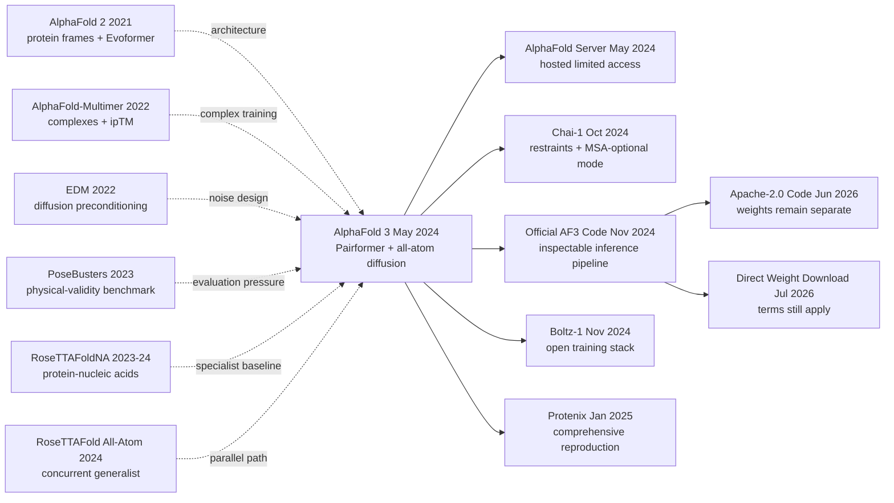

# AlphaFold 3 — Unifying Biomolecular Complex Prediction with All-Atom Diffusion

> On 8 May 2024, the [AlphaFold 3 paper in Nature](https://doi.org/10.1038/s41586-024-07487-w) placed proteins, DNA, RNA, ligands, ions, and modifications inside one all-atom diffusion system. Its blind PoseBusters V1 ligand-pose success rate reached 76.4%, compared with 52.3% for Vina using a holo receptor. The memorable lesson, however, is not that molecular structure was “solved.” The same paper reports 4.4% chirality violations even after chirality-aware ranking and warns that repeated samples are not a dynamical ensemble; on publication day it supplied pseudocode and a restricted server, not source code. Official inference code arrived in November 2024. Code became Apache 2.0 and weights directly downloadable in 2026, while the training pipeline and separate weight terms remained distinct. AF3 is both a representational break and a compact lesson in benchmark privileges, scientific access, and the limits of structural prediction.

## TL;DR

Published in *Nature* in 2024 by Josh Abramson, Jonas Adler, Jack Dunger, and 45 co-authors, AlphaFold 3 extends the single/pair representation of [AlphaFold 2](../era4_foundation_models/2021_alphafold2.md), tokenizes standard residues coarsely and ligands or modifications at heavy-atom resolution, and uses non-equivariant diffusion to generate a joint complex. It does not accept the first random output: by default it chooses among 5 seeds × 5 samples using $s=0.8\,\mathrm{ipTM}+0.2\,\mathrm{pTM}+0.5\,f_{\mathrm{disorder}}-100\,\mathbb{1}_{\mathrm{clash}}$. The resulting system reaches 76.4% pocket-aligned RMSD < 2 Å on blind PoseBusters V1, versus 52.3% for Vina and 37.9% for DiffDock, and raises protein–double-stranded-DNA interface LDDT from RoseTTAFold2NA's 28.3 to 64.8. Those bars are not single-pass, equal-input contests: docking baselines often receive a holo receptor or pocket, and the 62.9% antibody–antigen result ranks 1,000 seeds for both AF3 and AlphaFold-Multimer.

Its durable contribution is the system-level pattern “unified conditioning + all-atom candidate generation + explicit confidence-based selection,” which catalysed restrained or MSA-optional [Chai-1](https://doi.org/10.1101/2024.10.10.615955) and open reproductions such as [Boltz-1](https://doi.org/10.1101/2024.11.19.624167) and [Protenix](https://doi.org/10.1101/2025.01.08.631967). The counterintuitive lesson is that broader chemical coverage came from removing AF2's rigid frames and some hard stereochemical constraints. That freedom also leaves 4.4% chirality violations after chirality-aware ranking, hallucinated order in disordered regions, and occasional whole-chain clashes. Diffusion samples are not a solution ensemble, retrospective pose reconstruction is not binding-affinity prediction, and neither result by itself demonstrates a successful drug-discovery programme.

---

## Historical Context

### 2021 to 2024: what AlphaFold 2 did and did not solve

In July 2021, [AlphaFold 2](https://doi.org/10.1038/s41586-021-03819-2) pushed prediction from a single protein sequence to a static three-dimensional structure to accuracy competitive with experimental structures for many targets. Its object was nevertheless precise: amino-acid residues were the basic units; MSAs and templates built single and pair representations; and a protein-specific system of rigid frames, side-chain torsions, and Invariant Point Attention produced coordinates. That system transformed protein monomer modelling, but it did not simultaneously solve the molecular interactions found inside a cell.

Biological function usually lives in a complex. A protein may assemble with another protein, DNA, RNA, a small molecule, a metal ion, or a glycan; phosphorylation, methylation, and other modifications can change local geometry and interfaces. [AlphaFold-Multimer](https://doi.org/10.1101/2021.10.04.463034) extended AF2 to protein assemblies in 2022, but its inputs and outputs remained protein-residue centred. It was neither a small-molecule docking system nor a natural representation for nucleotides, ions, and arbitrary Chemical Components Dictionary entries. AF3 therefore did not begin with the modest goal of adding a few points to monomer LDDT. It moved the problem boundary from protein structure to biomolecular complex structure.

That distinction matters. AF2 predicts an approximation to a static conformation represented in the PDB; it does not return a folding pathway, dynamics, binding free energy, or efficacy. Even after AF3 adopts generative diffusion, the paper explicitly says that random seeds and diffusion samples do not form a solution-state conformational ensemble. Both generations are best understood as systems for generating structural hypotheses, not simulators that remove the need for biophysical experiments.

### An era of specialist tools for disconnected pieces

Before AF3, complex modelling was split among incompatible tool stacks. Protein-protein interfaces were handled by AlphaFold-Multimer, template docking, or classical sampling; protein-nucleic-acid complexes and RNA had [RoseTTAFoldNA](https://doi.org/10.1038/s41592-023-02086-5); small-molecule poses relied on Vina, Gold, [DiffDock](https://arxiv.org/abs/2210.01776), and related docking systems. Their input conditions also differed. Vina- and Gold-style protocols commonly received the experimental holo protein or the true pocket, whereas a genuinely blind predictor received only sequence and ligand SMILES. Before comparing bar heights, one must ask what each system was allowed to see.

This division imposed two costs. First, a complex containing protein, DNA, ligand, and ion had to be decomposed, its components predicted separately, and its pairwise docking order chosen by hand; errors propagated down the pipeline. Second, each tool encoded chemistry through a different handcrafted representation: residue frames for proteins, another torsional system for nucleic acids, and rotatable bonds plus a search box for ligands. The concurrent 2024 [RoseTTAFold All-Atom](https://doi.org/10.1126/science.adl2528) pursued general all-atom modelling as well. Removing artificial boundaries among molecular types was thus not an isolated AF3 intuition; it was a question the field reached collectively.

### Five predecessors that directly shaped AF3

1. **AlphaFold 2 (2021)** [ref1]: Evoformer showed that MSA and pair representations could jointly extract coevolution and geometry, while pLDDT and PAE made predictions usable with uncertainty. AF3 keeps the pair-first trunk philosophy but must remove frames and side-chain parameterizations tied to proteins.
2. **AlphaFold-Multimer (2022)** [ref2]: It introduced chain identifiers, paired and unpaired MSAs, cross-chain ipTM, and permutation handling for identical chains. AF3 inherits those engineering problems directly and uses AF-Multimer v2.3 predictions for disorder cross-distillation.
3. **EDM (2022)** [ref3]: [Karras, Aittala, Aila, and Laine](https://arxiv.org/abs/2206.00364) systematized diffusion preconditioning, noise distributions, and sampling schedules. AF3's Supplementary Methods explicitly say that its diffusion training largely follows this work; the mathematics is not an improvised borrowing from the popularity of image diffusion.
4. **RoseTTAFoldNA (2024)** [ref4]: It demonstrated neural prediction of protein-nucleic-acid complexes while exposing the combination and scale limits of a task-specific system. AF3 runs this baseline with the same MSAs and restricts comparison to targets under its supported limit of 1,000 total residues and nucleotides.
5. **PoseBusters (2024)** [ref6]: This benchmark checks not only ligand RMSD but chirality, bond geometry, clashes, and other physical validity criteria. It prevents AF3's ligand results from being summarized as merely “more accurate” and preserves the paper's admitted 4.4% chirality-error rate.

These five threads supplied a trunk, multimer engineering, diffusion mathematics, a nucleic-acid baseline, and a ligand validation standard. AF3's novelty is not that it coined any one of those terms; it is that it made them cooperate in a training and inference system spanning molecular classes.

### The team, data, and compute conditions

Josh Abramson, Jonas Adler, Jack Dunger, and 45 other authors were affiliated with Google DeepMind and Isomorphic Labs, with collaborators at Stanford and Princeton. The contribution statement shows more than a loose division between a research group and an application partner: personnel from both organizations worked across architecture, training, evaluation, and writing. The paper also discloses related patent applications and commercial interests for most authors. Drug-related examples are therefore part of the project's motivation, but its experiments establish retrospective structure prediction, not clinical progress or successful discovery of a medicine.

The unified scope came from more than architecture. Training drew on PDB structures released by 30 September 2021, protein and RNA sequence databases, the Chemical Components Dictionary, roughly 41 million AF2-distilled protein monomers, and AF3-distilled RNA and positive/negative transcription-factor examples. Supplementary Table 6 records initial training plus three fine-tuning stages: crops of 384, 640, 768, and 768 tokens; approximately 20 million, 1.5 million, 1.5 million, and 1.8 million samples; and about 10, 3, 5, and 2 days respectively on 256 A100 GPUs. The architecture could be documented in detail without making training from scratch practical for a typical academic laboratory in 2024.

To limit temporal leakage, the standard model used no structural training example released after 30 September 2021. The Recent PDB test set contains 8,856 complexes released from 1 May 2022 through 12 January 2023. PoseBusters used a separately trained 30 September 2019 cutoff model, with training structures, inference templates, and ligand reference positions all restricted by that earlier date. Such splits cannot remove every sequence or chemical analogue, but they are stricter than checking whether an exact test PDB identifier appeared in training.

### Code and weights did not open on the same day

When the paper appeared on 8 May 2024, Nature's Code availability statement read: “Pseudocode describing the algorithms is available in the Supplementary Information. Code is not provided.” The service launched that day was a non-commercial AlphaFold Server with fewer accepted ligands and covalent modifications than the full system. Researchers could inspect 31 Supplementary Algorithms, but they did not receive Google's local inference implementation or its training pipeline.

On 11 November 2024, Google DeepMind published the official GitHub repository and v3.0.0. Local inference code became inspectable, initially under CC BY-NC-SA 4.0; weights still required a form, access remained at Google DeepMind's sole discretion, and the README said responses were targeted within two to three business days. On 9 June 2026, v3.0.3 relicensed the **code** to Apache 2.0, with the official commit explicitly saying that the weight terms stayed unchanged. On 23 July 2026, the README replaced the request form with a direct `af3.bin.zst` download. That change removed application friction but did not turn the parameters into Apache-licensed assets: separate non-commercial and prohibited-use terms still govern the parameters and output.

Consequently, both “AF3 was not open” and “AF3 is fully open” are incomplete without a date and an object. A precise account distinguishes paper pseudocode, inference source, training code, model parameters, hosted service, and output terms.

---

## Background and Motivation

### From protein residue frames to arbitrary chemical graphs

AF2's output space attaches a local rigid frame to every amino acid, then recovers all-atom coordinates from backbone atoms and side-chain chi angles. That is a powerful protein prior: peptide geometry is difficult to tear apart accidentally, while IPA and FAPE handle rotations and translations. It does not generalize cleanly to a ligand. A drug molecule has no canonical protein backbone, a metal ion cannot provide three frame atoms, and a modified residue or glycan may cross a polymer-ligand bond.

AF3 chooses a more radical rewrite: every heavy atom has an independent global coordinate. Standard amino acids and nucleotides are each compressed into one token; ligands, ions, and modified residues use one token per heavy atom. RDKit reference conformers supply element, formal charge, atom name, local relative position, and bond features, but no rigid body or torsion system hard-codes the final coordinates. The same diffusion head can therefore handle protein, DNA, RNA, small molecules, ions, glycans, and other modifications. The cost is equally clear: more chemical validity must be learned from data, and neither chirality errors nor atomic clashes are excluded perfectly by construction.

### Three jobs a single model must perform

The first job is **information integration**. Proteins and RNA can have MSAs; DNA and small molecules often lack comparable cross-entity evolutionary signal; protein templates are strictly single-chain. The model must exploit an MSA where it exists without treating “no MSA” as “no structure.” AF3 uses a four-block MSA Module to write sequence-family information into the pair representation, then a 48-block Pairformer processes token-pair and single-token states without carrying the full MSA tensor through the core trunk.

The second job is **crossing scales**. A ligand stereocentre is a sub-angstrom problem, whereas the relative placement of two protein domains spans tens of angstroms. Denoising at low noise emphasizes local bond geometry; denoising at high noise emphasizes global assembly. An atom-token-atom hierarchy divides local atom attention from global token attention. The paper's most counterintuitive decision is that the core structure head is not rotation equivariant: geometry is learned through random rotation/translation augmentation and coordinate denoising.

The third job is **selection, not generation alone**. Standard evaluation does not accept the first random output. It runs five model seeds with five diffusion samples each and chooses among 25 candidates using pTM, ipTM, pLDDT, PAE/PDE, clash, and disorder terms. The antibody-antigen experiment ranks 1,000 seeds for both AF3 and AF-Multimer. AF3's measured capability is therefore the combination “generate candidates + estimate their errors + rank them,” not an isolated property of the diffusion head.

### Defining a fair test of unified prediction

A unified model does not imply a unified metric. Protein-protein interfaces use DockQ; protein-nucleic-acid interfaces use interface LDDT; individual chains use LDDT; and ligands and covalent modifications use whether pocket-aligned heavy-atom RMSD is below 2 Å. The paper clusters by sequence similarity or ligand identity before aggregation so repeated members of one family do not dominate an average. PoseBusters comparisons must disclose that several classical docking baselines receive the true holo receptor or pocket while blind AF3 does not. The CASP15 RNA comparison must also retain the exception that AF3 did not beat the human-assisted AIchemy_RNA2 entry.

Finally, structural correctness is not functional correctness. The AF3 paper neither trains nor reports binding affinity, conducts prospective hit discovery, nor shows that its structures replace assays, crystallography, cryo-EM, or molecular dynamics. Its defensible research question is narrower: **given molecular composition, sequences, reference chemistry, and optional MSAs/templates, can one network generate and rank static complex candidates close to experimentally resolved PDB structures?** The paper provides strong evidence for that question. Claims farther downstream in drug discovery still require a separate experimental chain.

---

## Method Deep Dive

### Overall framework: spend most compute on conditioning, then call a cheaper denoiser repeatedly

AF3 is not simply AF2 with its Structure Module exchanged for a standalone diffusion model. It first turns sequences, MSAs, templates, reference chemistry, and explicit bonds into token-level single and pair conditions. A less expensive all-atom denoiser then reuses those conditions at every sampling step. The Supplementary Methods make the asymmetry explicit: unlike many diffusion systems, most AF3 computation happens in the conditioning trunk rather than in each denoising call.

```text
Protein / DNA / RNA sequences + ligand CCD/SMILES + modifications + bonds
        |
        +--> genetic search (protein + RNA) and protein-only template search
        +--> RDKit/CCD reference conformers and atom metadata
        |
        v
Input embedder: AtomAttentionEncoder (3 blocks)
        | single_init [N_token, 384]
        + pair_init   [N_token, N_token, 128]
        v
Recycling trunk (Algorithm 1 default: 4 cycles)
        TemplateEmbedder (2 blocks)
        -> MSA Module (4 blocks)
        -> Pairformer (48 blocks)
        |
        +---------------------> confidence/distogram heads
        v
SampleDiffusion (200 noise levels)
        Atom encoder -> token transformer (24 blocks) -> atom decoder
        v
All-heavy-atom coordinates -> pLDDT / PAE / PDE / pTM / ipTM -> ranked samples
```

The trunk carries two state types: a single representation for each token and a pair representation for every token pair.

$$
s \in \mathbb{R}^{N_{\mathrm{token}}\times 384},\qquad
z \in \mathbb{R}^{N_{\mathrm{token}}\times N_{\mathrm{token}}\times 128}
$$

| Module | Paper configuration | Direct responsibility |
|---|---:|---|
| Input AtomAttentionEncoder | 3 blocks, 4 heads | Aggregate reference conformers and atom metadata into tokens |
| TemplateEmbedder | 2-block Pairformer per template | Encode up to four single-chain protein templates only |
| MSA Module | 4 blocks, up to 16,384 MSA rows | Write protein/RNA sequence-family information into the pair state |
| Pairformer | 48 blocks, single 384, pair 128 | Core token/pair conditional reasoning |
| Recycling | Algorithm 1 default: 4 cycles | Refine the next single/pair states with the previous cycle |
| Diffusion Transformer | 24 blocks, 16 heads, width 768 | Global denoising reasoning at token level |
| AtomAttentionDecoder | 3 blocks, 4 heads | Broadcast token updates back to every heavy atom |
| ConfidenceHead | 4-block Pairformer | Predict pLDDT, PAE, PDE, and resolved state |

Recycle cycles and diffusion iterations are easy to conflate. Recycling reruns the expensive conditioning trunk; the 200 diffusion noise levels repeatedly call the cheaper diffusion module. Supplementary Table 8 times a configuration with 10 trunk recycles, so the Algorithm 1 default of four, the ten-cycle timing configuration, and 200 denoising levels must not be described as one loop.

### Key design 1: mixed-granularity tokenization and sequence-local atom attention

**Function**: admit regular polymers and arbitrary chemical components to one network while preserving local atomic geometry. Compressing each standard residue into one token controls the quadratic pair-tensor cost. Splitting ligands and modified residues into heavy-atom tokens avoids forcing unfamiliar chemistry into a vocabulary of twenty amino acids.

| Entity | Token rule | Token centre | Additional conditioning |
|---|---|---|---|
| Standard amino acid | one token per residue | Cα | residue type, MSA, optional template |
| Standard DNA/RNA nucleotide | one token per nucleotide | C1′ | nucleotide type; RNA may have an MSA |
| Modified amino acid/nucleotide | one token per heavy atom | that atom | CCD/RDKit conformer, element, charge, bonds |
| Non-covalent/covalent ligand or glycan | one token per heavy atom | that atom | CCD code or SMILES, explicit bonds |
| Ion | one single-atom token | that atom | element and charge; PAE mask when no valid three-atom frame exists |

A reference conformer does not secretly supply the answer. During training, ref_pos receives a global random rotation and translation. It describes internal starting chemistry, not the ligand's true pose in the protein pocket. AtomAttentionEncoder embeds element, formal charge, atom name, and reference position into an atom single state; it adds relative-position and inverse-squared-distance features only when two atoms belong to the same reference conformer:

$$
p_{lm}=W_d(\vec r^{\,ref}_l-\vec r^{\,ref}_m)\,v_{lm}
+W_{d^{-2}}\!\left(\frac{1}{1+\|\vec r^{\,ref}_l-\vec r^{\,ref}_m\|^2}\right)v_{lm}
+W_v v_{lm}
$$

Here v_lm marks whether the atoms share a reference space. Atom attention is not a full N_atom by N_atom operation: each block of 32 query atoms attends to 128 keys in a sequence neighbourhood, after which atom activations are averaged into tokens. Decoding reverses that path by broadcasting token states and using the same local pattern to predict coordinate updates for each atom.

```python
def tokenize(entity):
    if entity.kind == "standard_amino_acid":
        return [Token(entity.atoms, center="CA")]
    if entity.kind in {"standard_dna", "standard_rna"}:
        return [Token(entity.atoms, center="C1'")]
    # Modified residues, ligands, glycans, and ions use one heavy atom per token.
    return [Token([atom], center=atom.name) for atom in entity.heavy_atoms]

def local_atom_attention(atom_states, pair_bias):
    for query_block in windows(atom_states, size=32):
        key_block = sequence_neighbors(query_block, size=128)
        query_block += attention(query_block, key_block, pair_bias)
    return atom_states
```

**Trade-off**: atomizing every entity and applying global pair attention would make memory quadratic in the number of atoms even for large proteins. Compressing everything into residue tokens would erase arbitrary ligand topology. AF3 occupies the middle with coarse polymer tokens, fine non-standard chemistry tokens, and local atom attention. The authors explicitly call the sequence-local restriction suboptimal but necessary for manageable memory and compute.

**Design rationale**: unification does not remove chemistry; it moves chemistry from output parameterization into input conditions and data. Explicit token_bonds describe polymer-ligand and ligand-ligand connections, the reference conformer supplies local geometry, and diffusion chooses final coordinates in the full complex. Adding a CCD component no longer requires a handwritten torsion tree, but the model also loses AF2 frames' hard guarantee of valid residue geometry.

### Key design 2: the MSA Module compresses into pair; Pairformer no longer carries the full MSA

**Function**: preserve AF2's most effective triangular geometric reasoning while reducing the time and memory of carrying a full MSA tensor through a 48-block trunk. AF3 still performs genetic search for proteins and RNA. Each recycle draws another MSA subset, uses four MSA blocks to write it into the pair representation, and then discards the MSA state.

The MSA Module retains outer product mean, triangle multiplication, triangle attention, and transition layers. Once Pairformer begins, the pair state updates itself through triangular operators:

$$
z_{ij}\leftarrow z_{ij}
+\operatorname{TriMul}_{out}(z)_{ij}
+\operatorname{TriMul}_{in}(z)_{ij}
+\operatorname{TriAttn}_{start}(z)_{ij}
+\operatorname{TriAttn}_{end}(z)_{ij}
+\operatorname{Transition}(z_{ij})
$$

The single state then performs 16-head attention with pair bias:

$$
A^{h}_{ij}=\operatorname{softmax}_{j}\!\left(
\frac{(W_q^h s_i)^\top(W_k^h s_j)}{\sqrt d}+W_b^h z_{ij}
\right),\qquad
s_i\leftarrow s_i+W_o\!\left(\bigoplus_h\sum_j A^h_{ij}W_v^h s_j\right)
$$

The information direction is decisive. Pair bias controls single attention, but the single state does not write back through an outer product. Pairformer has neither MSA column attention nor a core outer-product mean; the latter remains only in the preceding MSA Module. Saying “AF3 removes MSAs” is wrong, and describing Pairformer as a renamed Evoformer is wrong for the opposite reason.

```python
def pairformer(single, pair, blocks=48):
    for _ in range(blocks):
        pair += dropout_row(triangle_multiply_outgoing(pair), rate=0.25)
        pair += dropout_row(triangle_multiply_incoming(pair), rate=0.25)
        pair += dropout_row(triangle_attention_start(pair), rate=0.25)
        pair += dropout_col(triangle_attention_end(pair), rate=0.25)
        pair += swiglu_transition(pair)
        single += attention_with_pair_bias(single, pair, heads=16)
        single += swiglu_transition(single)
        # Deliberately no single -> pair outer-product update here.
    return single, pair
```

| Design surface | AF2 Evoformer | AF3 MSA Module + Pairformer |
|---|---|---|
| State carried through core trunk | MSA tensor + pair | single token state + pair |
| Deep MSA processing | spans 48 blocks | compressed into pair in 4 blocks first |
| Column attention | present | absent from Pairformer |
| Single/MSA to pair | repeated outer product mean | no write-back inside Pairformer |
| Pair to single | row attention with pair bias | single attention with pair bias |
| Transition | ReLU MLP | SwiGLU |
| Geometry operators | triangle multiplication + attention | largely retained for 48 blocks |

**Counterintuitive point**: AF3 supports more molecular classes by carrying fewer information channels in its core trunk. It bets that pair is a sufficient common interface: MSAs, templates, bonds, and relative positions enter pair first, and pair then constrains single and diffusion. This does not say evolutionary information is unimportant. It says retaining every MSA row until the end is not necessary to exploit it.

### Key design 3: non-equivariant all-atom diffusion coordinate generation

**Function**: use one coordinate generator for protein backbone, side chains, nucleic acids, ligands, ions, and modifications, without defining a frame, torsion system, and reconstruction rule for every molecular class. Training corrupts true heavy-atom coordinates with Gaussian noise and predicts denoised coordinates under trunk conditioning:

$$
\vec x_t=\vec x_0+t\vec\epsilon,\qquad \vec\epsilon\sim\mathcal N(\vec 0,I)
$$

The training noise and inference schedule follow the EDM design:

$$
t_{train}=\sigma_{data}\exp(-1.2+1.5\mathcal N(0,1)),\quad
t(u)=\sigma_{data}\left(s_{max}^{1/\rho}+u(s_{min}^{1/\rho}-s_{max}^{1/\rho})\right)^\rho
$$

Here sigma_data=16, s_max=160, s_min=4×10^-4, rho=7, and u traverses zero to one in increments of 1/200. Each step centres and randomly rotates/translates coordinates, applies Algorithm 18's churn noise, calls the denoiser, and updates with scale eta=1.5. The network does not guarantee coordinate transformation through SE(3)-equivariant layers; augmentation teaches it to disregard an arbitrary world frame.

DiffusionModule scales noisy coordinates to roughly unit variance, aggregates them with a three-block atom encoder, applies a 24-block, 16-head, width-768 global token transformer, and returns through a three-block atom decoder. Its output uses EDM-style skip/output preconditioning:

$$
\vec x_{out}=
\frac{\sigma_{data}^2}{\sigma_{data}^2+t^2}\vec x_{noisy}
+\frac{\sigma_{data}t}{\sqrt{\sigma_{data}^2+t^2}}\,r_{update}
$$

Training first uses weighted rigid alignment to map ground truth onto the current denoised result, then computes atom MSE:

$$
L_{MSE}=\frac{1}{3}\operatorname{mean}_l
w_l\left\|\vec x_l-\vec x^{\,GT\text{-}aligned}_l\right\|_2^2,
\qquad
w_l=1+5\mathbf 1_{DNA}+5\mathbf 1_{RNA}+10\mathbf 1_{ligand}
$$

The final diffusion loss adds bonded-ligand/glycan bond loss and smooth LDDT:

$$
L_{diff}=\frac{t^2+\sigma_{data}^2}{(t\sigma_{data})^2}
\left(L_{MSE}+\alpha_{bond}L_{bond}\right)+L_{smooth\text{-}LDDT}
$$

```python
def sample_diffusion(conditioning, noise_levels):
    coords = noise_levels[0] * torch.randn(conditioning.num_atoms, 3)
    for previous_t, current_t in adjacent_pairs(noise_levels):
        coords = random_center_rotate_translate(coords)
        noisy, effective_t = add_churn_noise(coords, previous_t)
        denoised = diffusion_module(noisy, effective_t, conditioning)
        derivative = (noisy - denoised) / effective_t
        coords = noisy + 1.5 * (current_t - effective_t) * derivative
    return coords
```

| Choice | AF2 Structure Module | AF3 Diffusion Module |
|---|---|---|
| Coordinate representation | residue frame + side-chain torsions | global coordinate for every heavy atom |
| Geometric inductive bias | IPA/FAPE with explicit frame invariance | weak: one coordinate projection plus augmentation |
| Output character | deterministic structure regression | stochastic generation of static candidates |
| Chemical constraints | residue parameterization + violation losses | multiscale denoising; cross-component bond loss in fine-tuning |
| Main complexity | protein-specific reconstruction | molecular generality, but possible chirality errors/clashes |
| Cost per call | Structure Module | quadratic token attention, below the trunk's cubic triangle operations |

**Design rationale**: high noise asks the model to assemble domains and chains; low noise asks it to repair local bond geometry. One objective therefore spans spatial scales. Most counterintuitively, AF3 rejects the then-dominant geometric-learning preference for equivariance. The authors' evidence came from AF2 ablations: removing much of the Structure Module's complexity had only a modest accuracy effect, while protein frames imposed a large special-casing cost on arbitrary molecular graphs.

That freedom is not free. Apart from the bonded-ligand/glycan loss, AF3 training uses no violation or clash loss. Its 4.4% PoseBusters chirality violations and occasional whole-chain overlaps expose the trade-off. Nor are diffusion samples trajectories: the paper observes that apo and holo cereblon are both generated in the closed state, so randomness does not cover the physical conformational distribution.

### Key design 4: train confidence with a mini-rollout, then rank with task-specific scores

**Function**: single-step diffusion training never sees a full generated structure, so AF3 cannot train error heads directly on a Structure Module output as AF2 did. It performs a stopped-gradient 20-step mini-rollout during training, uses those coordinates to assign identical chains and symmetric ligand atoms to ground truth, and builds confidence targets. ConfidenceHead reads trunk single/pair states and predicted coordinates, then adds a four-block Pairformer.

| Output | Granularity/discretization | Meaning and boundary |
|---|---|---|
| pLDDT | per atom, 50 bins | local distances to polymer representative atoms only; does not validate internal ligand chirality |
| PAE | token pair, 64 bins over 0–32 Å | expected error of token j after alignment on token i's frame |
| PDE | token pair, 64 bins over 0–32 Å | absolute error in predicted versus true pair distance |
| pTM | whole complex or one chain | TM-like fold confidence derived from the PAE distribution |
| ipTM | whole complex or chain pair | interface confidence derived from cross-chain PAE |
| resolved | per-atom binary class | probability that the atom is experimentally resolved |
| distogram | token pair, 64 bins | contact/geometric distribution also used in validation's global-PDE aggregate |

The default whole-complex ranking equation is:

$$
R_{global}=0.8\,ipTM+0.2\,pTM+0.5\,disorder-100\,\mathbf 1_{has\_clash}
$$

has_clash fires when any two polymer chains have more than 100 clashing atoms or clashes over 50% of the smaller chain's atoms, using a 1.1 Å distance threshold. Interfaces, individual chains, and modified residues need not use this global score: interfaces use a chain-pair ipTM aggregate, chains use chain pTM, and modifications use mean residue pLDDT. The official output documentation therefore says ranking_score is for ordering generated structures, not a physical energy, binding affinity, or calibrated probability of correctness.

```python
def global_ranking_score(ptm, iptm, fraction_disordered, has_clash):
    return (
        0.8 * iptm
        + 0.2 * ptm
        + 0.5 * fraction_disordered
        - 100.0 * float(has_clash)
    )

def choose_sample(samples, task):
    metric = {
        "whole_complex": "global_ranking_score",
        "single_chain": "chain_ptm",
        "interface": "chain_pair_iptm",
        "modified_residue": "mean_residue_plddt",
    }[task]
    return max(samples, key=lambda sample: sample.confidence[metric])
```

**Design rationale**: generation and selection must be co-designed. Standard experiments choose the top-ranked candidate among 25; the antibody-antigen experiment searches 1,000 seeds, with accuracy still improving. Confidence converts a larger sampling budget into better top-one accuracy, but it also makes sampling budget part of “model performance.” A best structure without seeds, samples, and ranking rule is not a comparable result.

### Losses, four-stage training, and the inference recipe

The total objective combines confidence, diffusion, and distogram terms; PAE receives weight only in the final fine-tune:

$$
L=10^{-4}(L_{pLDDT}+L_{PDE}+L_{resolved}+\alpha_{PAE}L_{PAE})
+4L_{diff}+3\times10^{-2}L_{distogram}
$$

| Stage | Crop tokens | Diffusion batch / trunk sample | Training samples | Time on 256 A100s | Main change |
|---|---:|---:|---:|---:|---|
| Initial | 384 | 48 | about 20M | about 10 days | random initialization; structure + distogram |
| Fine-tune 1 | 640 | 32 | about 1.5M | about 3 days | enable bond loss; adjust disorder distillation |
| Fine-tune 2 | 768 | 32 | about 1.5M | about 5 days | add positive/negative transcription-factor distillation |
| Fine-tune 3 | 768 | 32 | about 1.8M | about 2 days | disable structure/distogram, train PAE; max chains 50 |

| Recipe item | Paper setting | Interpretation |
|---|---|---|
| Trunk batch | 256 | independent complex inputs per optimizer step |
| Diffusion replicas | initial 256×48; fine-tune 256×32 | compute trunk once, then rotate/translate/noise copies for the cheaper head |
| Optimizer | Adam, beta1 0.9, beta2 0.95, epsilon 1e-8 | not the often-assumed default beta2 0.999 |
| Learning rate | 1.8e-3; 1,000-step warmup; ×0.95 every 50k steps | Supplementary Methods 5.4 |
| Gradient clipping | clip when global norm > 10 | stabilizes multitask training |
| EMA inference | decay 0.999 | sampling uses moving-average parameters |
| Standard sampling | 5 seeds × 5 samples = 25 | paper reports the top confidence-ranked sample by default |
| Paper timing | 10 recycles, 16×A100; 1,024 tokens 22 s, 5,120 tokens 347 s | GPU wall time only; excludes MSA, compilation, and post-processing |

The data recipe also explains the model boundary. Weighted PDB supplies experimental complexes; roughly 41 million AF2-predicted MGnify monomers expand protein coverage; AF-Multimer v2.3 disorder predictions teach AF3 not to compact low-confidence regions; and AF3 distils RNA plus positive and negative transcription-factor/DNA examples. There is both cross-distillation and self-distillation. “AF3 trains only on the PDB” is therefore inaccurate.

A hidden computational advantage is sharing one trunk condition among many diffusion replicas: initial training produces 12,288 denoising samples per optimizer step. The hidden reproducibility cost is that the November 2024 release supplied inference code and parameters, not the complete internal system that built these distillation sets and trained the model from scratch.

---

## Failed Baselines

### Specialist opponents that lost to a unified framework

The AF3 paper places many tasks in one figure, but its opponents did not all lose for the same reason. It faces at least four strong baseline classes, each exposing a different system boundary.

- **Classical docking such as Vina and Gold**: On PoseBusters these methods commonly receive an experimental holo protein or pocket residues and then search ligand poses. Vina reaches 52.3% pocket-aligned RMSD below 2 Å on V1; blind AF3, which does not know the pocket, reaches 76.4%. Classical docking loses because receptor structure and search space must already be supplied, and because errors propagate through “predict protein, then dock ligand.” It is not, however, a pure model comparison under identical inputs.
- **DiffDock and other learned docking systems**: [DiffDock](https://arxiv.org/abs/2210.01776) scores 37.9% on PoseBusters V1. Its diffusion places a ligand into a supplied receptor; it does not predict the whole protein-ligand complex. AF3 emits receptor conformation and ligand pose in one all-atom output. The advantage comes from joint problem formulation, not merely from a larger denoiser.
- **RoseTTAFoldNA**: On the same MSAs and targets under its limit of 1,000 total residues/nucleotides, protein-RNA iLDDT is 19.0 versus AF3's 39.4; protein-dsDNA is 28.3 versus 64.8. The specialist nucleic-acid system retains stronger task assumptions but does not share AF3's large protein-distillation corpus, common pair trunk, and all-atom training distribution.
- **AlphaFold-Multimer v2.3**: On low-homology recent-PDB data, protein-protein interface success rises from 67.5% to 76.6%, and antibody-antigen success from 29.6% to 62.9%. AF-Multimer's residue-frame output and protein-specific training are already strong for ordinary multimers, but they do not receive unified ligand, nucleic-acid, and modification supervision or use a generative coordinate head to explore candidates.
- **RoseTTAFold All-Atom**: This concurrent work proves that general all-atom modelling had more than one implementation path. Its PoseBusters V1 success is 42.0% versus AF3's 76.4%. It also includes experimentally validated design tasks that the AF3 paper does not. Calling RFAA a “failed AF3 reproduction” would violate both chronology and the papers' differing evaluation goals.

One inconvenient competitor is often hidden by a simple headline: pocket-conditioned Uni-Mol Docking V2 reaches 77.6% on PoseBusters V1, slightly above blind AF3's 76.4%. AF3 reaches 90.2% after a separate pocket-feature fine-tune, but that is another model. The defensible conclusion is not that AF3 beats every docking configuration unconditionally. It matches or exceeds most systems even when those systems receive extra structural information.

### Failures admitted by the paper itself

**All-atom diffusion does not learn chirality perfectly.** PoseBusters ranking already divides a candidate score by 100 when it finds a chirality error, yet 4.4% of final predictions still violate chirality. Figure 5b gives PDB 7CTM as a concrete failure: the input reference chemistry is beta-D-glucuronic acid, while the model generates the alpha form. pLDDT measures distances from an atom to polymers rather than internal ligand chirality, so “high interface confidence” and “fully valid chemistry” are different claims.

**A clash penalty filters only part of the geometric catastrophes.** Global ranking subtracts 100 for has_clash, but the authors still observe atomic overlaps, complete chain overlap in homomers, and DNA self-overlap in 7PEU. Nearly all remaining clashes occur in protein-nucleic-acid complexes with more than 100 nucleotides and more than 2,000 total residues. These are not rendering defects; they are a visible cost of free, non-equivariant coordinates trained without a general violation or clash loss.

**A generator can fill disorder with plausible-looking order.** AF2 often stretches low-confidence disorder into ribbons; AF3 diffusion more readily makes compact but false secondary structure. The team cross-distils AF-Multimer v2.3 predictions and gives solvent-accessible disorder a small positive ranking term. Figure 5d nevertheless uses a nuclear-pore complex with 1,854 unresolved residues as a limitation example. Low pLDDT warns the user but does not stop hallucinated coordinates from being written.

**Local atom attention is an acknowledged approximation.** Every 32 query atoms see only 128 nearby keys. This makes large systems feasible, but distant atoms cannot communicate directly at the atom layer and must rely on coarse token pairs. Long-range covalent relationships, unusual metal coordination, and enormous nucleic-acid assemblies can expose the bottleneck.

### Counterexamples that more diffusion samples do not fix

Antibody-antigen prediction most clearly exposes the sampling-budget boundary. Standard evaluation uses five seeds with five diffusion samples each; the antibody comparison ranks 1,000 seeds for both AF3 and AF-Multimer. AF3's correct and very-high-accuracy rates continue to rise from five to 1,000 seeds. The authors also report that reducing each seed from five diffusion samples to one barely changes the result. The system needs more trunk/model seeds, not merely repeated denoising under one condition. The compute cost cannot be removed from the headline 62.9%.

Conformational state exposes a deeper limitation. Cereblon has an open apo structure and a closed ligand-bound structure, but AF3 generates the closed state for both apo and holo inputs; ten overlaid samples still miss the open state. Diffusion randomness represents model alternatives and uncertainty, not a thermodynamic distribution in solution. The paper states directly that multiple seeds do not approximate the solution ensemble.

CASP15 RNA is the necessary counterexample in the benchmark table. On the common eight-target set, AF3 obtains RNA LDDT 47.3 versus RoseTTAFold2NA's 35.5, and the main text says it exceeds the AI-only AIchemy_RNA on their respective common subset. Human-assisted AIchemy_RNA2 reaches 54.5 and RNApolis reaches 50.5. AF3 is strong as an automatic system; it does not erase expert modelling on difficult, small-sample RNA targets.

### The real anti-baseline lesson

AF3's engineering lesson is not “general models inherently beat specialists.” It is that **a common representation lets sparse tasks borrow data and inductive bias from dense tasks**. Ligand, modification, and nucleic-acid structures are much scarcer than protein monomers. A shared pair trunk and all-atom head transfer geometry learned from roughly 41 million AF2-distilled proteins. At the same time, PDB reweighting, interface clustering, positive/negative DNA distillation, ligand atom upweighting, and task-specific ranking are finely specialized interventions. Unification comes from a shared backbone, not from pretending tasks are identical.

A second lesson is that **the generator, confidence head, and sampling budget form one system**. Diffusion alone cannot identify the trustworthy candidate among 25 samples. Reporting only the top-ranked sample without seeds and ranking penalties makes replication impossible. AF3 beats many baselines because it changes output space, training data, conditioning trunk, generation, and selection together. Attributing every gain to “using diffusion” repeats a common failure: replacing a causal system with its most visible module.

---

## Key Experimental Data

### Main results: preserve a separate metric for each task

Every value below comes from the paper's official Extended Data Table 1. Means use the paper's cluster weighting or target statistics; unlike metrics must not be interpreted as one common percentage scale.

| Task | Metric | AF3 | Main baseline | Evaluation condition |
|---|---|---:|---:|---|
| PoseBusters V1 | success at RMSD < 2 Å | **76.4%** (N=428) | Vina 52.3%; RFAA 42.0%; DiffDock 37.9% | AF3 2019 cutoff, blind; most docking gets holo/pocket |
| PoseBusters V2 | success at RMSD < 2 Å | **80.5%** (N=308) | Vina 59.7%; DiffDock 38.0% | version reducing crystal-contact bias |
| Protein-RNA | mean iLDDT | **39.4** (N=25) | RoseTTAFold2NA 19.0 | <1,000 residues/nucleotides, same MSA |
| Protein-dsDNA | mean iLDDT | **64.8** (N=38) | RoseTTAFold2NA 28.3 | <1,000 residues/nucleotides, same MSA |
| CASP15 RNA | mean RNA LDDT | 47.3 (N=8) | AIchemy_RNA2 + human 54.5; RF2NA 35.5 | AF3 does not beat best expert-assisted entry |
| Bonded ligands | success at RMSD < 2 Å | **78.5%** (N=66) | no matched baseline in table | not generally low-homology filtered |
| Protein-protein | success at DockQ > 0.23 | **76.6%** (N=1,064) | AF-Multimer 67.5% | low-homology recent PDB |
| Antibody-antigen | success at DockQ > 0.23 | **62.9%** (N=65 clusters) | AF-Multimer 29.6% | both rank 1,000 seeds |
| Protein monomer | mean LDDT | **86.9** (N=338) | AF-Multimer 85.5 | gain is only 1.4 LDDT |

The strongest headline is protein-dsDNA at 64.8 versus 28.3, alongside antibody success at 62.9% versus 29.6%. The result most in need of restraint is the monomer comparison: 86.9 versus 85.5 is real but modest. AF3's historical place comes primarily from complex coverage and unification, not another CASP14-scale jump over AF2 monomer performance.

### Data isolation, input privileges, and compute budget

| Audit question | Paper control | Interpretation that remains necessary |
|---|---|---|
| Are ordinary test structures later than cutoff? | training structures through 2021-09-30; test from 2022-05-01 to 2023-01-12 | similar sequences, ligands, and isolated chains can remain; clustering/homology filters address part of this |
| Does PoseBusters leak 2021+ structures? | separately trained 2019-09-30 cutoff model; templates and ref_pos cut too | same architecture as standard model, but different weights |
| Do docking baselines receive equal inputs? | paper groups sequence-only, pocket-known, and holo-known methods | absolute Vina/Gold gaps are not pure architecture effects |
| How is default top-one produced? | 5 seeds × 5 diffusion samples; choose one by task confidence | not single-forward accuracy |
| What is the antibody headline budget? | AF3 and AF-Multimer both rank 1,000 seeds | 62.9% is not the default five-seed cost |
| Do all molecular tasks share a metric? | DockQ, iLDDT, LDDT, and pocket RMSD stay separate | one cannot subtract 76.6 DockQ success from 64.8 iLDDT |
| What does the large-model timing include? | 16×A100, 10 recycles: 1,024 tokens 22 s; 5,120 tokens 347 s | excludes MSA, data pipeline, compilation, and post-processing |

The paper also provides two vivid sanity checks. PDB 7TQL contains 7,663 residues across 43 chains and reaches full-complex LDDT 87.7 and GDT 86.9. It proves that a large system can succeed, not the success rate for all large systems. In phosphorylation example 7Z1K, explicitly modelling the modification gives pocket-aligned Cα RMSD 2.104 Å versus 10.261 Å without it; 7US1 gives 0.424 Å versus 9.706 Å. These cases show that modification input can alter a prediction, but they do not replace group-level statistics.

### Key findings

- **Blind ligand pose is the clearest system-level advance**: AF3 reaches 76.4% on V1 versus Vina's 52.3% without receiving the true pocket. Pocket-specified Uni-Mol Docking V2 at 77.6% still disproves “AF3 crushes docking under every input condition.”
- **Nucleic-acid gains concentrate at interfaces**: protein-RNA and protein-dsDNA iLDDT roughly double, supporting transfer through the pair trunk. CASP15 RNA monomers still trail expert-assisted methods, so unified training does not top out every narrow task.
- **Antibody performance partly reflects inference scaling**: accuracy is still rising at 1,000 seeds, while additional diffusion samples per seed matter little. Exploring distinct trunk trajectories is more important than repeating local denoising.
- **All-atom freedom creates both coverage and errors**: one system handles ions, glycans, and modifications, while retaining 4.4% chirality violations and occasional chain overlap in large protein-nucleic-acid systems.
- **Confidence is useful but not chemical proof**: ipTM/PAE can select interfaces and pLDDT can mark low-confidence disorder. They do not guarantee stereochemistry, the right dynamical state, or binding affinity.
- **The evidence is retrospective geometry**: no prospective assay, hit rate, clinical outcome, or affinity benchmark appears here. “Useful for drug design” is a reasonable motivation; “discovered a drug” is not a conclusion of these experiments.

---

## Idea Lineage

### Relationship map



The graph deliberately separates intellectual predecessors, a concurrent route, service deployment, and reproduction responses. RoseTTAFold All-Atom was formally published roughly three weeks before the AF3 paper and is a parallel generalist rather than an AF3 descendant. Chai-1 appeared after the Nature paper but before the official AF3 source, so it could build from the paper and Supplementary Algorithms, not copy an implementation released only in November. Dashed edges mark explicit citation, baseline use, or evaluation pressure; they do not claim a traceable code contribution to AF3.

### Past lives: from protein frames to unified atomic coordinates

**2021 — AlphaFold 2.** [Jumper and 33 co-authors](https://doi.org/10.1038/s41586-021-03819-2) combined protein sequence, MSA, and templates in Evoformer, then produced protein coordinates with Invariant Point Attention, residue frames, and side-chain torsions. AF3 retains single/pair representations, triangle updates, recycling, pLDDT, and PAE while rejecting the boundary that outputs must be organized around a protein residue frame. AF2 is both the architectural parent and the baseline AF3 most deliberately overturns.

**2022 — AlphaFold-Multimer.** [Evans and colleagues](https://doi.org/10.1101/2021.10.04.463034) extended AF2 to multiple protein chains, introducing cross-chain MSA pairing, permutation handling for identical sequences, and ipTM. AF3 continues this line through chain/entity/sym identifiers, complex ground-truth assignment, and interface ranking. More unusually, AF-Multimer v2.3 is not merely the baseline AF3 defeats: its disorder predictions teach AF3 through cross-distillation, reducing diffusion hallucination.

**2022 — EDM.** [Karras, Aittala, Aila, and Laine](https://arxiv.org/abs/2206.00364) decomposed diffusion noise parameterization, preconditioning, and sampling schedules into comparable design choices. AF3's Supplementary Methods explicitly say diffusion training “largely follows” EDM and adopt log-normal training noise with a power-law inference schedule. The inheritance is mathematical and optimization machinery, not a direct transplantation of an image generator into proteins.

**2023–2024 — RoseTTAFoldNA and PoseBusters.** [RoseTTAFoldNA](https://doi.org/10.1038/s41592-023-02086-5) extended neural structure prediction to protein-DNA, protein-RNA, and nucleic-acid monomers, providing AF3 with a runnable specialist baseline. [PoseBusters](https://doi.org/10.1039/D3SC04185A) placed ligand RMSD and physical validity on the same evaluation surface: a pose can be spatially close yet have wrong chirality, implausible bonds, or clashes. AF3's 4.4% chirality failure shows that this benchmark is not merely an obsolete ruler chosen to flatter the new model.

**2024 — RoseTTAFold All-Atom.** [Krishna and colleagues](https://doi.org/10.1126/science.adl2528) likewise combine residue and atom representations across proteins, nucleic acids, small molecules, metals, and covalent modifications, with all-atom denoising for modelling and design. It was published on 19 April 2024; AF3 appeared on 8 May. Together they show a field-wide move from protein-only prediction toward general biomolecular modelling. Keeping this parallel line among the “past lives” prevents a winner's history from turning a contemporary competitor into a follower.

### Descendants: access, reproduction, and conditional control become central

**Direct architectural descendants.** [Chai-1](https://doi.org/10.1101/2024.10.10.615955), posted on 11 October 2024, continues multi-molecule prediction while adding optional experimental restraints and an MSA-free mode. Because it predates the official AF3 GitHub repository, it is best read as an independent development of the published paradigm. [Boltz-1](https://doi.org/10.1101/2024.11.19.624167), posted on 20 November, explicitly turns AF3-level biomolecular interaction modelling into an open training and inference stack and releases code, weights, data, and benchmarks. [Protenix](https://doi.org/10.1101/2025.01.08.631967), posted on 11 January 2025, presents itself as a comprehensive AlphaFold3 reproduction, reruns PoseBusters V2, low-homology PDB, and CASP15 RNA evaluations, and discusses memorization risk.

Performance claims in these follow-ups still require separate audits of cutoff, sampling budget, and inputs. They establish a narrower but important point: the AF3 Supplementary Algorithms, followed by inspectable inference code, were sufficient to catalyse multiple independent implementations. They do not automatically show that Google's internal training-data construction was reproduced bit-for-bit, nor does a similar score on one benchmark establish universal equivalence.

**Deployment and access descendants.** AlphaFold Server exposed a restricted subset of AF3 capabilities as a non-commercial service on the paper date. The official repository opened local inference on 11 November 2024; code changed to Apache 2.0 on 9 June 2026; and weights moved from application access to direct download on 23 July 2026. This branch changes who can inspect, run, and integrate the model, not the scientific result reported in Nature. Source-code license and weight/output terms remain distinct: the latter did not disappear when code became Apache-licensed.

**Cross-task diffusion.** The clearest propagation is not an AF3 block moving into another discipline; it is the reorganization of task boundaries within structural biology. Successors increasingly treat monomer folding, multimer assembly, nucleic-acid modelling, and ligand docking as modes of a common token/pair/all-atom system, then add restraints, single-sequence operation, steering, or more open data pipelines. By 2026, verified evidence for a distinct cross-disciplinary spillover remains too thin to name one responsibly. Leaving that slot empty is preferable to rewriting “potentially useful for drug discovery” as an accomplished clinical impact.

### Misreadings and oversimplifications

**Misreading one: AF3 merely “replaces AF2 IPA with diffusion.”** The redesign also includes mixed-granularity tokenization, sequence-local atom encoding/decoding, MSA compression into pair, removal of single-to-pair write-back, mini-rollout confidence training, task-specific ranking, and new RNA, DNA, and disorder distillation sets. Changing only the output head would leave arbitrary chemistry inputs, molecular symmetry, and candidate selection unresolved.

**Misreading two: diffusion means AF3 learned molecular dynamics.** The paper directly rejects this conclusion. Seeds and diffusion samples are model candidates, not a Boltzmann ensemble conditioned on temperature, solvent, and time. Systematically missing apo cereblon's open state is a concrete counterexample. AF3 predicts a biased view of static structural possibilities, not folding pathways, kinetics, or binding free energies.

**Misreading three: one unified model beats experts in every category.** Extended Data Table 1 has an explicit exception at CASP15 RNA: AF3 beats RoseTTAFold2NA and the corresponding automated comparison but trails human-assisted AIchemy_RNA2. Pocket-specified Uni-Mol Docking V2 also slightly exceeds blind AF3 on PoseBusters V1. Unification reduces tool fragmentation; it does not abolish input privileges or specialist advantages on narrow tasks.

**Misreading four: the May 2024 paper was “fully open source.”** Nature then stated that code was not provided; only pseudocode and a restricted server were available. Inference code arrived in November, while the complete training pipeline did not accompany the paper. Weights moved from application to direct download later and always retained separate terms. Reproducibility improved over time along a spectrum; it was never a single Boolean release event.

**Misreading five: high ligand-pose success equals drug discovery.** PoseBusters measures geometric reconstruction of known complexes, with success at pocket-aligned RMSD below 2 Å. It does not measure affinity, selectivity, ADME, toxicity, cellular activity, or clinical benefit. Structural candidates can accelerate hypothesis formation, but the paper reports no prospective hit rate and cannot stand in for the experimental chain.

---

## Modern Perspective

### Assumptions that did not survive

Two years later, the claims most in need of correction are not the qualifications the AF3 paper actually wrote down, but four extrapolations that its title and result figures make tempting. The paper already contains several counterexamples; open implementations and official documentation from 2024–2026 make the boundaries harder to ignore.

| Tempting inference in 2024 | Why it does not survive in 2026 | Primary evidence |
|---|---|---|
| A unified all-atom generator will learn valid chemistry automatically | PoseBusters already used chirality-aware ranking, yet **4.4%** of ligand predictions still violated chirality; a clash penalty likewise did not eliminate atom or whole-chain overlap | The [Nature paper's Model limitations](https://doi.org/10.1038/s41586-024-07487-w) and official [output documentation](https://github.com/google-deepmind/alphafold3/blob/main/docs/output.md) |
| Multiple diffusion samples are plausible molecular conformations | The paper explicitly states that seeds and diffusion samples **do not approximate a solution ensemble**; AF3 misses apo cereblon's open state with and without a ligand | [Nature](https://doi.org/10.1038/s41586-024-07487-w), Figure 5 and Model limitations |
| A structural cutoff before the test set establishes fully out-of-distribution generalization | The 30 September 2021 cutoff excludes later structures, but not automatically related sequences, isolated chains seen during training, or chemically similar entities; low-homology filters apply only to specified analyses and ligand/polymer clustering uses different criteria | [Supplementary Methods 5.8 and 6.1–6.4](https://static-content.springer.com/esm/art%3A10.1038%2Fs41586-024-07487-w/MediaObjects/41586_2024_7487_MOESM1_ESM.pdf) |
| Better retrospective poses already demonstrate faster drug discovery | PoseBusters success means pocket-aligned RMSD < 2 Å on known complexes; the study contains no affinity, selectivity, ADME, toxicity, prospective hit-rate, or clinical endpoint | The [Nature paper and Extended Data Table 1](https://doi.org/10.1038/s41586-024-07487-w); the official repository also limits the system to theoretical modelling and disclaims clinical validation |

The third inference is particularly vulnerable to hindsight bias. Once AF3 had catalysed Chai-1, Boltz-1, and Protenix, it became easy to remember the 2024 study as proof of complete generalization across chemical space. Its evidence is narrower and better specified: the Recent PDB set is temporally isolated, selected analyses add homology filtering and cluster weighting, and PoseBusters uses a separately trained 30 September 2019 cutoff model whose templates and ligand reference positions are cut off as well. These are serious leakage controls, not a mathematical erasure of every form of structural similarity or training overlap.

### Enduring core versus expendable detail

| Judgement | What remains essential in 2026 | What is replaceable or misleading |
|---|---|---|
| Representation | Mixed residue/atom tokenization puts proteins, nucleic acids, ligands, ions, and modifications in one single/pair space | “Unified” does not mean identical input information, loss weights, or metrics for every entity |
| Generation | Denoising all heavy-atom coordinates removes protein-only rigid frames | The 200-step schedule, fixed sample count, and exact ranking weights are implementation choices, not the definition of unification |
| Trunk | MSA information is compressed into pair before Pairformer performs cross-entity conditional reasoning | AF3 itself removed the old requirement to carry a full MSA through the trunk; [Chai-1](https://doi.org/10.1101/2024.10.10.615955) further demonstrates an MSA-optional path |
| System | Generation, confidence estimation, clash/disorder heuristics, and task-specific selection must be evaluated together | Calling a top-ranked result “single-pass accuracy” hides the default 25 candidates and the 1,000-seed antibody budget |
| Openness | Inspectable inference code makes input, output, and ranking semantics auditable | Open code does not substitute for a training pipeline, corpus manifest, or permissively licensed weights; those objects opened on different schedules and terms |

What survived two years of reproduction work is the combination of a **shared conditioning space, all-atom coordinate generation, and explicit confidence-based selection**. [Boltz-1](https://doi.org/10.1101/2024.11.19.624167) and [Protenix](https://doi.org/10.1101/2025.01.08.631967) built independent systems around the same abstraction, evidence that it transfers. Their papers do not retroactively establish bit-for-bit reproduction of Google's private data construction, training trajectory, or every benchmark value.

### Side effects the authors could not yet observe

1. **The degree of openness became a scientific variable.** The 8 May 2024 paper supplied 31 Supplementary Algorithms and a restricted server; official inference code arrived on 11 November 2024; code moved to Apache 2.0 on 9 June 2026; and weights became a direct download on 23 July 2026 while retaining separate non-commercial terms. Comparisons cannot collapse those four dates into one open/closed label.
2. **Reproduction shifted the bottleneck from architecture to data auditing.** Chai-1 appeared before the official source, Boltz-1 emphasized an open training stack, and Protenix described itself as a comprehensive reproduction. Once a common architecture could be rebuilt, the hard-to-audit differences moved to sample construction, overlap filters, MSA database versions, seed budgets, and ranking protocols.
3. **Confidence made the system usable and created a new route to overinterpretation.** The official score $s=0.8\,\mathrm{ipTM}+0.2\,\mathrm{pTM}+0.5\,f_{\mathrm{disorder}}-100\,\mathbb{1}_{\mathrm{clash}}$ is explicitly for ranking candidates. It is not a physical energy, binding affinity, or clinical confidence; treating it as one turns a useful engineering heuristic into a nonexistent biophysical scale.

### If the paper were rewritten today

- Put each headline's **cutoff, input privilege, candidate count, and ranking rule** in the main table, rather than leaving readers to discover in Methods that PoseBusters uses the 2019 model and the antibody result ranks 1,000 seeds.
- Report exact temporal splits, polymer homology, ligand identity/scaffold novelty, and interface novelty together, with a machine-readable train/test overlap audit. “Released after the PDB cutoff” is not enough to summarize generalization.
- Separate ligand RMSD, chirality, bond geometry, clashes, and state coverage, and report failures before and after ranking. High pLDDT or ipTM should not replace internal chemistry checks.
- Add apo/holo, alternative-state, and experimentally restrained evaluations. Diffusion samples must remain labelled as static candidates; any ensemble claim needs separate comparison with NMR, cryo-EM, molecular dynamics, or another physical/experimental distribution.
- Add a genuinely prospective wet-lab loop that separately measures pose, affinity, hit enrichment, and downstream assays. Until then, say that AF3 proposes structural hypotheses for drug discovery, not that it discovered a drug.
- Release training code, a versioned data manifest, and evaluation containers, or enumerate the components that cannot be released. Track source, weights, training data, server access, and output terms separately.

Even in that rewrite, the core would remain: condition a unified complex representation in token/pair space, generate all-atom coordinate candidates, and select them with confidence matched to the task. It persists not because “diffusion” stayed fashionable, but because AF3 closed representation, joint coordinate generation, and cross-entity error estimation inside one trainable system for arbitrary chemical graphs.

## Limitations and Future Directions

### Limitations acknowledged by the authors

| Limitation | Direct observation in the paper | Interpretive boundary |
|---|---|---|
| Stereochemistry | **4.4%** chirality violations remain after chirality-aware ranking | Accurate interfaces or high pLDDT do not guarantee valid internal ligand chemistry |
| Clashes | Atom and whole-chain overlap survives the penalty; residual cases concentrate in protein–nucleic-acid complexes with >100 nucleotides and >2,000 total residues | Ranking reduces frequency but cannot forbid overlap by representation |
| Hallucinated order | Diffusion can compact disordered regions into spurious structure; AF-Multimer distillation and the disorder term only mitigate it | Low confidence is a warning, not automatic removal of erroneous coordinates |
| Dynamics and states | Seeds and samples are not a solution ensemble; apo cereblon's open state is systematically missed | AF3 provides no thermodynamic weights, kinetic pathway, or binding free energy |
| Sampling cost | Antibody–antigen performance keeps improving at 1,000 seeds, while extra diffusion samples for the same seed add little | The 62.9% headline is not a default five-seed cost |

### Additional limitations visible in 2026

First, **data isolation is strong but uneven**. The Recent PDB time window, 40% polymer-identity filter, and cluster weighting are meaningful controls. Not every table entry uses the low-homology subset, however, and covalent ligand/glycan results lack a general low-homology filter. Clustering a ligand by CCD identity or jointly with a polymer cluster is not a chemical-scaffold split. A post-cutoff target is therefore a necessary condition for temporal novelty, not sufficient proof of novel-chemistry generalization.

Second, **inputs and selection budgets remain only partly comparable across tasks**. Blind AF3 does not receive the true pocket, a genuine advantage over many docking baselines; Vina/Gold, pocket-conditioned Uni-Mol, RoseTTAFold2NA run with the same MSA, and the 1,000-seed antibody experiment nevertheless occupy distinct protocols. A unified model can share representations, but a unified bar chart cannot erase those protocol differences.

Third, **reproducibility ends where the released assets end**. The current repository provides code required for inference; by 2026 that code is Apache 2.0 and the weights are directly downloadable. This did not publish the complete training pipeline or Google's internal data construction, and weights/output remain under separate terms. Server and local runs can even obtain different MSAs because of sharded genetic search and `domE`; the official [known-issues page](https://github.com/google-deepmind/alphafold3/blob/main/docs/known_issues.md) documents a concrete case.

Fourth, **drug discovery still lacks the middle of the causal chain**. A retrospective pose can motivate a binding hypothesis without showing that a molecule binds, is selective, enters cells, or is safe. AF3 may be highly valuable in that process, but this paper has no prospective wet-lab control, and later industrial narratives cannot be inserted as if they were original experimental results.

### Directions validated by follow-up work

- **Open reproduction and training audits:** [Boltz-1](https://doi.org/10.1101/2024.11.19.624167) released open training/inference assets, while [Protenix](https://doi.org/10.1101/2025.01.08.631967) reran AF3-style benchmark families and raised memorization/overlap risk. They validate that independent training stacks can pursue the approach, not universal equivalence to AF3.
- **External conditions and low-MSA operation:** [Chai-1](https://doi.org/10.1101/2024.10.10.615955) adds experimental restraints and MSA-optional operation. A unified all-atom model can accept richer conditions than sequence, templates, and reference chemistry without returning to disconnected task-specific pipelines.
- **Chemistry checks after generation:** The official inference repository exposes `compare_chirality`, a clash flag, and every per-sample output, allowing task-specific reranking rather than retaining only the winner. The next step is to move these checks from post-hoc filters into constrained generation or verifiable decoding.
- **Treat multiple states as a conditioning problem, not merely more samples:** The paper itself shows that extra diffusion samples do not recover cereblon's missing state or substitute for more model seeds on antibodies. Explicit state conditions, experimental restraints, MSA resampling, and physical sampling should be combined and tested against real ensembles.

## Related Work and Insights

| Comparison | What the other method solves | AF3's difference and trade-off | Engineering lesson |
|---|---|---|---|
| **vs AlphaFold 2** | [AF2](../era4_foundation_models/2021_alphafold2.md) predicts proteins accurately with frames and IPA/FAPE | AF3 trades some hard-coded stereochemistry for coverage of many molecule types through free all-atom coordinates | **Lesson:** removing a prior expands scope and creates demand for a new validator |
| **vs DiffDock** | [DiffDock](https://arxiv.org/abs/2210.01776) generates ligand poses for a supplied receptor | AF3 jointly predicts receptor and ligand in a blind setting, at higher compute and data cost | **Lesson:** compare input privileges before model scores |
| **vs RoseTTAFold All-Atom** | [RFAA](https://doi.org/10.1126/science.adl2528) is a concurrent generalist spanning modelling and design | AF3 is stronger on retrospective PoseBusters poses; RFAA separately reports experimentally validated design, so the objectives differ | **Lesson:** a parallel route must not be rewritten as a reproduction by the eventual winner's chronology |
| **vs Chai-1** | [Chai-1](https://doi.org/10.1101/2024.10.10.615955) adds restraints and MSA-optional inference | The original AF3 condition interface is narrower, while its official implementation maps directly to the Nature benchmark definition | **Lesson:** a unified backbone is valuable because conditions can be added, not because all conditions disappear |
| **vs Boltz-1 / Protenix** | [Boltz-1](https://doi.org/10.1101/2024.11.19.624167) and [Protenix](https://doi.org/10.1101/2025.01.08.631967) pursue open training and independent reproduction | AF3 remains the reference system; the successors improve auditability, while similar scores still depend on cutoffs, data, and sampling budgets | **Lesson:** reproducibility requires data lineage and protocols, not only nearby numbers |

## Resources

- 📄 **Paper:** [Nature 630, 493–500, DOI 10.1038/s41586-024-07487-w](https://doi.org/10.1038/s41586-024-07487-w)
- 📎 **Supplement:** [Supplementary Information with Algorithms 1–31 and training/evaluation details](https://static-content.springer.com/esm/art%3A10.1038%2Fs41586-024-07487-w/MediaObjects/41586_2024_7487_MOESM1_ESM.pdf)
- 💻 **Official inference code:** [google-deepmind/alphafold3](https://github.com/google-deepmind/alphafold3)
- 🧭 **Official operational documentation:** [outputs, confidence, and ranking](https://github.com/google-deepmind/alphafold3/blob/main/docs/output.md) · [known issues](https://github.com/google-deepmind/alphafold3/blob/main/docs/known_issues.md) · [weight terms](https://github.com/google-deepmind/alphafold3/blob/main/WEIGHTS_TERMS_OF_USE.md)
- 🌐 **Hosted service:** [AlphaFold Server](https://alphafoldserver.com/) for non-commercial use, with a narrower input surface than the local implementation
- 📚 **Essential predecessors:** [AlphaFold 2](https://doi.org/10.1038/s41586-021-03819-2) · [EDM](https://arxiv.org/abs/2206.00364) · [PoseBusters](https://doi.org/10.1039/D3SC04185A)
- 🔬 **Essential follow-ups:** [Chai-1](https://doi.org/10.1101/2024.10.10.615955) · [Boltz-1](https://doi.org/10.1101/2024.11.19.624167) · [Protenix](https://doi.org/10.1101/2025.01.08.631967)
- 📖 **On this site:** [AlphaFold 2 deep note](../era4_foundation_models/2021_alphafold2.md); no verified paper_notes short-note entry was found, so no dead placeholder link is included
- 🌐 **Cross-language version:** [中文版](/era5_genai_explosion/2024_alphafold3/)


---

> 🌐 [中文版](/era5_genai_explosion/2024_alphafold3/) · 📚 awesome-papers project · CC-BY-NC