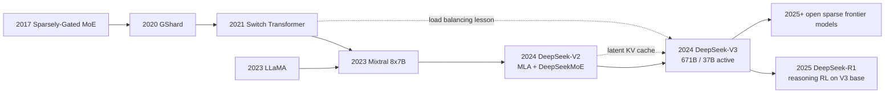

# DeepSeek-V2 / V3 - How MLA and MoE Pushed Open Models to the Frontier

> **In May 2024, DeepSeek-AI released [DeepSeek-V2 (arXiv:2405.04434)](https://arxiv.org/abs/2405.04434), a 236B-parameter MoE that activated only 21B parameters per token; in December it followed with [DeepSeek-V3 (arXiv:2412.19437)](https://arxiv.org/abs/2412.19437), scaling the same line to 671B total parameters and 37B active parameters.** The hook is not merely that an open model became stronger. DeepSeek tied three previously separate bottlenecks into one system answer: MLA compresses the KV cache into a latent bottleneck, DeepSeekMoE separates capacity from active compute, and FP8 plus communication overlap makes a 14.8T-token run fit into 2.788M H800 GPU hours. By the end of 2024, open models were no longer competing only on license; they were competing on the cost curve itself.

## TL;DR

DeepSeek-AI's 2024 V2/V3 line was not simply a story of making open models larger. It rewrote three cost bottlenecks at once. DeepSeek-V2 introduced Multi-head Latent Attention, compressing the KV cache of conventional MHA/GQA into a latent state that can be summarized as $c_t^{KV}=x_tW^{DKV},\;k_{t,h}=c_t^{KV}W_h^{UK},\;v_{t,h}=c_t^{KV}W_h^{UV}$, and paired it with DeepSeekMoE's fine-grained experts plus shared experts so a 236B-parameter model activated only 21B parameters per token. DeepSeek-V3 scaled that line to 671B total parameters, 37B active parameters, a 128K context window, and 14.8T pretraining tokens, then added auxiliary-loss-free load balancing, a multi-token prediction objective, and FP8 mixed-precision training. The full training run is reported at only 2.788M H800 GPU hours, with no irrecoverable loss spikes or rollbacks.

The failed baseline it displaced was the 2023 open-model default: either keep scaling dense decoders such as LLaMA and Llama 3, paying full active compute on every token, or stop at Mixtral-style open MoE proof points that did not yet solve KV-cache pressure, very large training stability, and cross-node expert communication together. DeepSeek-V3 later became the base for DeepSeek-R1, so its historical role is larger than any leaderboard table. It gave open reasoning, low-cost API serving, MoE deployment, and H800-constrained frontier-adjacent training a concrete system coordinate. The hidden lesson is that after 2024, an “open frontier model” is no longer defined by weight release alone; it is a joint cost curve across attention memory, sparse routing, numerical precision, communication topology, and post-training.

---

## Historical Context

### Spring 2024: the open-model bill no longer added up

When DeepSeek-V2 appeared, open LLMs had already gone through their first explosion. LLaMA gave researchers strong foundation weights at scale, Mixtral showed that sparse MoE could challenge 70B dense baselines in open-weight form, and vLLM turned KV-cache management into a first-order serving problem. Put together, those successes exposed a new contradiction: the community did not merely need weights that could run; it needed a route that controlled training cost, inference memory, long context, and serving throughput at the same time.

The cost structure of a dense decoder is honest and brutal. More parameters mean more active matrix multiplication on every token. Longer context means a larger KV cache. If the model is served as an API, weight replicas, KV cache, batching, latency, and memory fragmentation all become part of the bill. Llama 2 70B and later Llama 3 405B proved that dense scaling remained powerful, but they also made one point obvious: if every quality improvement requires full active compute, open models quickly become infrastructure that only a few organizations can afford to deploy.

MoE offered another line. Mixtral 8x7B had already separated total parameters from active parameters, but at a scale the community could still easily reason about: 47B total, 13B active, 8 experts, top-2 routing. DeepSeek's question was more industrial: if MoE is pushed to the 200B and 600B scale, can attention KV cache, expert routing, communication overlap, precision format, and training stability still hold together? That is the historical position of V2 and V3.

### DeepSeek's position: from 67B dense to V2/V3 MoE

At the beginning of 2024, DeepSeek-AI already had dense DeepSeek LLM 7B/67B models. That line was relatively conventional: high-quality data, decoder-only Transformer, open weights, and optimization for Chinese, English, and code. V2 was not just more parameters on that dense base. It was an explicit turn: 236B total parameters, 21B active parameters, 128K context, 8.1T tokens, and an abstract that placed economy in the title itself.

Two immediate motivations sit behind that turn. First, long-context and high-throughput inference had promoted KV cache from implementation detail to main cost item. GQA was already cheaper than MHA, but not enough for 128K-context serving at large batch sizes. Second, an MoE that saves FFN FLOPs but loses the gain to unstable routing, imbalanced experts, or cross-node communication is not a real frontier route. DeepSeek's answer was to co-design attention, MoE, and training systems: MLA handles memory, DeepSeekMoE handles capacity, and the training stack makes sparse experts actually run.

V3 then reads like a stress test. It does not merely enlarge V2's numbers. It pushes the system to 671B total parameters, 37B active parameters, 14.8T tokens, 128K context, and publicly emphasizes two engineering facts: the full training run required only 2.788M H800 GPU hours, and it experienced no irrecoverable loss spike or rollback. For open models at the end of 2024, that was more striking than any single benchmark because it put capability and affordable training in the same frame.

### The offset competition with Llama 3 and Mixtral

The comparison with Llama 3 is especially useful. Meta chose a dense Transformer to reduce architectural complexity while scaling to 15.6T tokens, 405B parameters, 128K context, and an open-weight release. DeepSeek chose MoE to keep active compute lower in the same token-rich era. This is not a simple question of one being correct and the other wrong. It is a difference in engineering philosophy: Llama 3 places most complexity in data, post-training, and infrastructure; DeepSeek-V3 moves more complexity into attention memory, expert routing, and numerical precision.

The relationship with Mixtral is also not mere inheritance. Mixtral taught the open community to ask about total versus active parameters. DeepSeek-V2/V3 asked the next question: when there are more experts, finer granularity, longer context, and a much larger training corpus, is MoE still a good trade? V2 answered with 42.5% training-cost saving, 93.3% KV-cache reduction, and 5.76x maximum generation throughput. V3 answered with 14.8T-token pretraining and large-scale FP8 validation.

That is the coordinate of DeepSeek-V2/V3 in the history of ideas. It was not the first MoE and not the first strong open model. It was the node that moved open MoE from model release to full-system engineering. Later discussions of Qwen-MoE, DBRX, DeepSeek-R1, SGLang, and vLLM support all share vocabulary that V2/V3 made concrete: MLA, active parameters, shared experts, auxiliary-loss-free balancing, MTP, FP8, and communication overlap.

## Background and Motivation

### Core question: lowering KV cache, active compute, and training communication together

The motivation of DeepSeek-V2/V3 can be compressed into one sentence: **keep model quality moving toward the frontier without making every token, every context window, and every training step pay the dense-frontier bill.** There are three bills inside that sentence. The first is attention memory: during long-context serving, KV cache grows with batch size and context length, and GQA only partially helps. The second is FFN compute: in a dense model, every layer and every token execute the full FFN, tying parameter capacity to active compute. The third is distributed training communication: once MoE crosses nodes, expert dispatch, combine, all-to-all traffic, and precision format determine real efficiency.

MLA addresses the first bill, DeepSeekMoE addresses the second, and V3's FP8 plus communication overlap addresses the third. The important point is that these are not independent tricks. Once MLA reduces KV cache, long-context and high-throughput serving become more realistic. Once MoE lowers active FFN compute, 671B total parameters become meaningful. Once FP8 and communication overlap keep sparse expert training from being communication-bound, the MoE gain survives at scale. V3 is therefore better read as system co-design than as a single architecture novelty.

### Why not just build a larger dense model

Building a larger dense model can of course improve quality, but it narrows the deployment surface of open models. During training, a dense 671B model would pay full parameter compute at every step. During inference, every token would pass through every FFN. During serving, KV cache would continue to grow with context and concurrency. A closed API company can amortize such costs across a large business; in the open ecosystem, the cost curve decides whether universities, small companies, private deployments, and local inference frameworks can actually use the model.

DeepSeek's route accepts a more realistic goal: an open model does not have to make every technical choice simple, but it must be servable on the cost curve. MoE sacrifices implementation simplicity to separate active compute from total capacity. MLA sacrifices the intuitiveness of standard attention to compress KV cache. FP8 sacrifices the conservative stability of BF16 to lower bandwidth and raise throughput. The motivation of V2/V3 is not architectural elegance. It is making a 671B-class open model more than a number on a model card.

---

## Method Deep Dive

The method behind DeepSeek-V2/V3 is not a single module, but a set of interlocking system choices. It is easy to let the 671B number dominate the reading of V3, yet the real technical line is more specific: the attention layer uses MLA to reduce long-context state cost; the FFN layer uses DeepSeekMoE to separate total capacity from active compute; the routing layer uses auxiliary-loss-free load balancing to avoid hurting the language objective; and the training layer uses MTP, FP8, and communication overlap to turn very large pretraining into executable engineering.

### Overall Framework

V2 can be read as the prototype validation of this line: 236B total parameters, 21B active parameters, 128K context, and 8.1T pretraining tokens. V3 pushes the same core ideas to frontier-adjacent scale: 671B total parameters, 37B active parameters, 128K context, and 14.8T tokens. What the two models share is not just size, but a compression mechanism for each major cost item.

| Layer | DeepSeek-V2 | DeepSeek-V3 | Cost item addressed |
|---|---:|---:|---|
| Total parameters | 236B | 671B | knowledge capacity and task coverage |
| Active parameters per token | 21B | 37B | FFN active compute |
| Context length | 128K | 128K | long-context serving capability |
| Pretraining tokens | 8.1T | 14.8T | token-rich scaling |

This table also explains DeepSeek's central tradeoff. It does not minimize every number. It keeps each cost class inside a servable region. A 671B-total model is still heavy, and deployment must still confront weight memory. But 37B active parameters make per-token FFN compute far below a dense 671B model. A 128K context window still requires serious KV-cache management. But MLA prevents that cache from growing linearly with the head structure of conventional MHA/GQA.

### Key Design 1: MLA turns KV cache into latent state

Multi-head Latent Attention has a direct function: **do not store full per-head key/value tensors in the KV cache; store a compressed latent state and up-project it back to head-specific key/value tensors during computation.** Conventional MHA/GQA caches $k_{t,h}$ and $v_{t,h}$. MLA caches a smaller $c_t^{KV}$ and treats the head-specific key/value vectors as functions of it.

$$
c_t^{KV}=x_tW^{DKV},\qquad k_{t,h}=c_t^{KV}W_h^{UK},\qquad v_{t,h}=c_t^{KV}W_h^{UV}.
$$

If the main cost of conventional cache is written as $O(S\cdot H_{kv}\cdot d_h)$, MLA storage is closer to $O(S\cdot d_c)$, where $S$ is sequence length, $H_{kv}$ is the number of KV heads, $d_h$ is the head dimension, and $d_c$ is the latent dimension. The 93.3% KV-cache reduction reported for DeepSeek-V2 follows directly from this design under long context.

$$
\text{KV cache}_{\text{MHA/GQA}}\propto S\cdot H_{kv}\cdot d_h,\qquad
\text{KV cache}_{\text{MLA}}\propto S\cdot d_c.
$$

The design motivation is not to rename attention. It is serving cost. In long-context models, the most painful dynamic state is not the model weights but the growing KV cache of each request. MLA turns KV cache from explicit per-head tensors into reconstructable latent memory. It is complementary to vLLM: vLLM manages the physical layout of the cache, while MLA reduces the state stored per token.

### Key Design 2: DeepSeekMoE separates capacity with fine-grained and shared experts

DeepSeekMoE addresses FFN active compute. A standard dense Transformer sends every token through the same FFN. MoE splits the FFN into experts and lets a router select a subset. DeepSeek's distinctive choices are fine-grained routed experts and shared experts. Fine-grained experts make routing more flexible; shared experts preserve a stable common path for all tokens so every token is not forced to rely only on sparse routing.

$$
y = \sum_{e\in \mathcal{S}} E_e(x) + \sum_{e\in \mathrm{TopK}(g(x))} \alpha_e E_e(x),\qquad
\alpha_e = \frac{g_e(x)}{\sum_{j\in \mathrm{TopK}} g_j(x)}.
$$

The intuition is simple: shared experts learn common capabilities, while routed experts provide conditional capacity. Compared with Mixtral's 8 experts and top-2 routing, DeepSeekMoE emphasizes finer expert specialization. The benefit is more combinations at similar active compute; the cost is more complicated routing, load balancing, and communication scheduling.

```python
def deepseek_moe_ffn(hidden, router, shared_experts, routed_experts, top_k):
    shared = sum(expert(hidden) for expert in shared_experts)
    scores = router(hidden)                       # token-to-expert scores
    chosen = topk(scores, k=top_k)                # routed experts only
    weights = normalize(scores[chosen])

    routed = 0
    for expert_id, weight in zip(chosen, weights):
        routed = routed + weight * routed_experts[expert_id](hidden)
    return shared + routed
```

The design motivation is to decouple capacity from per-token cost. V3's 671B total parameters provide a larger store of knowledge and task capacity, but each token activates only 37B parameters. The model behaves like a large expert library rather than a warehouse that must be fully opened at every step.

### Key Design 3: Auxiliary-loss-free load balancing

A common MoE training problem is load imbalance: the router may send too many tokens to a few experts, making those experts congested while others sit idle. The traditional remedy is to add an auxiliary load-balancing loss, but that loss competes with the language-modeling objective; the model can sacrifice natural token routing to satisfy the balancing regularizer.

DeepSeek-V3 uses auxiliary-loss-free load balancing. Intuitively, each expert maintains a dynamic bias. Routing selection uses $s_e(x)+b_e$ to influence which experts are chosen, while final expert output weights are still mainly determined by the original affinity score. Overloaded experts get their bias lowered; underused experts get it raised. Balance pressure acts near the routing boundary rather than being injected directly into the main loss.

| Routing scheme | Balance mechanism | Impact on main task | DeepSeek-V3 tradeoff |
|---|---|---|---|
| No balancing | router chooses freely | expert congestion likely | unsuitable for large MoE |
| Auxiliary loss | penalty inside training loss | may hurt language modeling | old baseline |
| Token dropping | drop or reroute over-capacity tokens | unstable training signal | risky at large scale |
| Dynamic bias | self-adjusting routing boundary | avoids directly polluting main loss | V3 main scheme |

The hidden motivation is stability. V3 reports no irrecoverable loss spike and no rollback, which should not be attributed to a single module. But auxiliary-loss-free routing reduces the chance that the balancing objective and language objective pull against each other during MoE training, making it an important part of the stable training story.

### Key Design 4: MTP, FP8, and communication overlap make large-model training a systems problem

V3 also introduces Multi-Token Prediction. Standard next-token prediction predicts only the immediate next token. MTP asks the model to predict multiple future tokens, increasing the density of training signal and providing modules that can be reused for speculative decoding. A simplified objective averages cross-entropy over the next $D$ offsets:

$$
\mathcal{L}_{\text{MTP}}=\frac{1}{D}\sum_{d=1}^{D}\left[-\log p_\theta(x_{t+d}\mid x_{\le t})\right].
$$

FP8 is V3's systems breakthrough. Large-model training often uses BF16/FP16 as a conservative stability choice, but cross-node MoE training is constrained by compute, memory bandwidth, and network communication at once. V3 places many matrix multiplications and communication-related tensors inside an FP8 mixed-precision framework, then uses algorithm, framework, and hardware co-design to nearly overlap computation and communication. That keeps the active-compute savings of MoE from being swallowed by all-to-all traffic.

| Design | Direct goal | Risk | Why it matters in V3 |
|---|---|---|---|
| MTP | add future-token supervision and support inference acceleration | more complex objective | improves base model and speculative decoding potential |
| FP8 training | reduce bandwidth and memory pressure | numerical stability risk | makes 671B MoE training cost controllable |
| Communication overlap | hide MoE all-to-all overhead | depends on framework and hardware scheduling | preserves sparse-compute benefits |
| H800 optimization | adapt to constrained hardware | stronger engineering specificity | gives the 2.788M GPU-hour number practical meaning |

Taken together, these designs make DeepSeek-V3's method clear: in the foundation-model era, architecture innovation cannot live only in a model diagram. Attention memory, routing objective, precision format, parallel training, and serving frameworks must be co-designed, or any single gain will disappear into another system bottleneck.

---

## Failed Baselines

The contribution of DeepSeek-V2/V3 is clearest against several routes that looked reasonable. In 2024, the field was not missing strong models or MoE papers. The hard part was putting long context, sparse experts, training stability, open weights, and servable cost into one system. V2/V3 do not prove that any baseline is useless. They show that each baseline, taken alone, is missing a piece.

### Baseline 1: Keep scaling dense decoders

The most natural baseline is to continue the Llama 3-style dense scaling path. Dense decoders have clear advantages: simple architecture, predictable training behavior, mature serving frameworks, and a consistent path for every token. The weakness is just as clear: total parameters equal active parameters, so larger models make every token more expensive. At 405B parameters and beyond, both training and serving cost quickly move into the range that only a small number of organizations can sustain.

DeepSeek's counterargument is not that dense models are weak. It is that the dense cost curve is a poor fit for the next stage of the open ecosystem. V3's 671B total / 37B active design shows that a model can have large capacity without making every token pay the compute bill of the full capacity. The baseline displaced here is the cost structure, not the basic validity of dense Transformers.

### Baseline 2: Use ordinary top-k MoE only

The second baseline is to replace FFNs with ordinary top-k MoE and assume that separating total and active parameters is enough. Mixtral had already shown that this path could work, but at V2/V3 scale the problems become sharper: is expert granularity fine enough, are common capabilities fragmented by sparse routing, are expert loads balanced, and does cross-node dispatch/combine swallow the gain?

DeepSeekMoE's shared experts and fine-grained routed experts are designed to repair that weakness. Shared experts provide a common capability path for all tokens; routed experts add conditional capacity. This is more complicated than a simple 8-expert top-2 design, but it is better suited to 236B/671B expert pools.

### Baseline 3: Rely on GQA for KV-cache compression

GQA is an important optimization in Llama 2, Llama 3, and many other dense models. It reduces KV cache and decoding cost by using fewer KV heads. But for 128K context, high-concurrency serving, and large MoE models, GQA still stores explicit key/value heads, so cache size keeps growing with sequence length and batch size. Once long context becomes a product requirement, KV cache is no longer a minor implementation detail.

That is the failed-baseline meaning of MLA. It does not merely use fewer KV heads. It changes what the cache stores, replacing explicit per-head state with latent state. The 93.3% KV-cache reduction and 5.76x maximum generation throughput reported for DeepSeek-V2 show that attention memory itself had to be redesigned rather than kept alive with the existing GQA recipe.

### Baseline 4: Push large MoE with auxiliary loss, BF16, and ordinary communication

Large MoE also has a conservative engineering baseline: keep the traditional auxiliary load-balancing loss, train with BF16/FP16, and let a general distributed framework handle communication. This route is safer to implement, but it can hand the MoE gains back to system overhead. Auxiliary loss can pollute the language objective, BF16 increases bandwidth pressure, and all-to-all traffic becomes exposed under cross-node expert parallelism.

V3 breaks this baseline apart. Auxiliary-loss-free balancing reduces objective conflict, FP8 lowers bandwidth and memory pressure, and computation-communication overlap hides as much expert-parallel traffic as possible. The paper's emphasis on no irrecoverable loss spike and no rollback is a direct response to the question: will a MoE this large explode halfway through training?

| Failed route | Why it was natural | Where it stalled | V2/V3 treatment |
|---|---|---|---|
| Larger dense decoder | simple, stable, easy to evaluate | active compute scales linearly with total parameters | 671B total / 37B active MoE |
| Ordinary top-k MoE | Mixtral had proved feasibility | expert granularity, shared capability, and balance were insufficient | fine-grained DeepSeekMoE + shared experts |
| GQA only | mature in Llama-family models | KV cache remains heavy at 128K context | MLA latent KV cache |
| Conventional MoE training system | conservative engineering path | auxiliary loss, BF16, and communication overhead eat gains | bias balancing + FP8 + overlap |

## Key Experimental Data

### DeepSeek-V2: first prove the economics

The experimental story of V2 is not just that a benchmark rose by a few points. It uses a set of cost numbers to prove that the new architecture is worth scaling. Compared with DeepSeek 67B, the V2 abstract reports 42.5% training-cost saving, 93.3% KV-cache reduction, and 5.76x maximum generation throughput. At the same time, the model is 236B total / 21B active and keeps a 128K context window. That combination matters more than any single accuracy number because it shows that the benefits of MoE and MLA do not cancel each other out.

| Metric | DeepSeek-V2 number | Reading |
|---|---:|---|
| Total parameters | 236B | capacity above DeepSeek 67B dense |
| Active parameters per token | 21B | inference compute far below total parameters |
| Pretraining tokens | 8.1T | token-rich training, not a small demo |
| KV cache reduction | 93.3% | MLA directly attacks long-context cost |
| Maximum generation throughput | 5.76x | architecture gain reaches serving |

These numbers make V2 the necessary predecessor to V3. Without the V2 economic validation, V3's 671B MoE could easily look like another large-model report. With V2, V3 reads as an extrapolation of a validated cost curve.

### DeepSeek-V3 Base: open MoE enters the strong-base-model band

The official V3 Base table compares it with DeepSeek-V2.5, Qwen2.5-72B, Llama-3.1-405B, and other models. The signal is that a model with 37B active parameters reaches or exceeds dense 405B and strong 72B models on many base benchmarks: MMLU 87.1, MMLU-Pro 64.4, DROP 89.0, HumanEval 65.2, MATH 61.6, and C-Eval 90.1.

| Benchmark | Qwen2.5-72B | Llama-3.1-405B | DeepSeek-V3 Base | Reading |
|---|---:|---:|---:|---|
| MMLU | 85.0 | 84.4 | 87.1 | 37B active enters the 400B dense band |
| MMLU-Pro | 58.3 | 52.8 | 64.4 | stronger on harder aggregate tasks |
| DROP | 80.6 | 86.0 | 89.0 | strong reading and numerical reasoning |
| HumanEval | 53.0 | 54.9 | 65.2 | clear code-generation lead |
| MATH | 54.4 | 49.0 | 61.6 | strong mathematical base ability |
| C-Eval | 89.2 | 72.5 | 90.1 | strong Chinese exam knowledge |

This should be read carefully. V3 Base does not beat every model on every task, and 37B active parameters do not make it equivalent to a 37B dense model. Its meaning is that when MoE, MLA, data, and training systems work together, open MoE can enter a capability range previously associated mainly with much larger dense models.

### DeepSeek-V3 Chat: direct comparison with closed frontier systems

The chat-model numbers are more product-facing. The official README compares DeepSeek-V3 with Claude 3.5 Sonnet, GPT-4o, OpenAI o1-1217, Llama-3.1-405B, and others. V3 is especially strong on DROP 91.6, LiveCodeBench pass@1 37.6, Codeforces percentile 51.6, MATH-500 90.2, Aider-Polyglot 49.6, and AlpacaEval 2.0 length-controlled win rate 85.5.

| Benchmark | GPT-4o-0513 | Claude 3.5 Sonnet | OpenAI o1-1217 | DeepSeek-V3 | Reading |
|---|---:|---:|---:|---:|---|
| MMLU | 88.3 | 88.6 | 87.2 | 88.5 | in the same band for general knowledge |
| DROP | 88.3 | 88.7 | 83.7 | 91.6 | strong table/reading reasoning |
| GPQA-Diamond | 65.0 | 51.1 | 49.9 | 59.1 | close to frontier, not universally above o1 |
| LiveCodeBench | 32.8 | 30.1 | 34.2 | 37.6 | strong contest-style coding |
| MATH-500 | 78.3 | 73.8 | 74.6 | 90.2 | large math post-training gains |
| AlpacaEval 2.0 LC | 80.4 | 85.2 | 52.0 | 85.5 | strong open-ended conversation |

The historical meaning of these results is that they move the question “can open models approach closed frontier systems?” from belief to engineering table. DeepSeek-V3 does not win every category, but it is strong enough to turn closed/open comparison into a joint decision about cost, deployment control, data boundaries, and task preference rather than a simple capability gap.

### Training cost and stability: the truly sharp V3 number

One of the most memorable V3 numbers is 2.788M H800 GPU hours. The official description reports about 2.664M H800 GPU hours for 14.8T-token pretraining and about 0.1M for subsequent training stages, totaling 2.788M. More importantly, the paper emphasizes that the entire process had no irrecoverable loss spike and no rollback. For a 671B MoE, that is a stability proof of sorts.

| Item | Number | Why it matters |
|---|---:|---|
| Pretraining tokens | 14.8T | belongs to the 10T+ token-rich era with Llama 3 |
| Pretraining cost | 2.664M H800 GPU hours | puts 671B MoE training cost into a discussable range |
| Full training cost | 2.788M H800 GPU hours | includes subsequent SFT/RL stages |
| Training stability | no rollback | key signal that large MoE + FP8 can train stably |

This number should not be misread as “any team can easily reproduce V3.” 2.788M H800 GPU hours is still huge, and the run depends on data, framework, hardware clusters, and a serious engineering team. But it changes the reference frame: frontier-adjacent capability no longer has to be explained only through invisible closed budgets. Open models are beginning to publish their own system ledger.

---

## Idea Lineage

### Before: MoE and attention memory were separate lines

The history behind DeepSeek-V2/V3 has two strands. The first is sparse MoE. Shazeer's 2017 sparsely-gated MoE brought the idea of activating only selected experts into large neural networks. GShard combined top-2 routing with automatic sharding in giant translation models. Switch Transformer simplified MoE scaling with top-1 routing and made load-balancing loss a central design issue in later MoE discussions. Only with Mixtral did the open community begin treating MoE as a daily downloadable model rather than mostly an internal Google-scale systems paper.

The second strand is attention memory. Early Transformer discussions focused on expressiveness and parallelism. Later, long-context serving pushed KV cache to the foreground. MHA stores every head's key/value tensors, GQA/MQA reduce the number of KV heads, and vLLM manages physical fragmentation and sharing. DeepSeek's MLA cuts in another direction: it changes not only how the cache is managed, but what the cache stores.

### Now: DeepSeek connects sparse capacity with latent cache

The key idea in V2 is to join those two strands. If you only use MoE, FFN compute may be cheaper, but KV cache remains expensive under 128K context. If you only use MLA, attention memory is cheaper, but total capacity is still limited by dense active compute. DeepSeek-V2 combines MLA and DeepSeekMoE, compressing long-context serving cost and large-capacity parameter cost at the same time.

V3 turns that combination into a training system. Auxiliary-loss-free load balancing rethinks the MoE regularizers inherited from Switch and GShard. FP8 training is a more aggressive choice about numerical format at large scale. MTP connects base-model training with future speculative decoding. V3 therefore reads less like a single architecture paper and more like a specification for a MoE frontier system.



| Idea node | Year | What V2/V3 inherit | What they rewrite |
|---|---:|---|---|
| Sparsely-Gated MoE | 2017 | conditional computation and learned routing | scale the idea into open LLM systems |
| GShard / Switch | 2020-2021 | top-k routing, expert parallelism, balance problem | try to avoid auxiliary-loss damage to the main task |
| LLaMA | 2023 | open weights, token-rich training, decoder ecosystem | stop treating dense decoders as the final form |
| Mixtral | 2023 | open proof of total/active parameter separation | push to 236B/671B and 128K context |
| vLLM / serving systems | 2023 | KV cache is a systems bottleneck | compress cache from the model-architecture side |

### Misreading: do not read V3 as “cheap GPT-4”

The first misreading is to reduce DeepSeek-V3 to “cheap GPT-4.” That misses its real value. V3's key contribution is not a universal claim to beat a particular closed model. It publicly demonstrates how an open MoE can be organized under constrained hardware, long context, FP8, communication overlap, and post-training. Its contribution is the cost curve and system transparency, not just chat experience.

The second misreading is to treat 37B active parameters as a 37B model. Lower active compute in MoE does not mean deployment only needs 37B weights. All experts still form 671B total parameters, and serving frameworks must handle weight memory, expert parallelism, batching, and routing load. Active parameters explain the compute bill; total parameters explain the memory bill. They cannot be used interchangeably.

The third misreading is to treat MLA as just another GQA variant. GQA reduces the number of KV heads, while MLA changes the representation stored in the KV cache. Both address inference memory, but they operate at different abstraction levels. It is more accurate to read MLA as a more aggressive learned representation for KV-cache compression.

### What it passed on

The first thing DeepSeek-V2/V3 passed on is a new metric language for open-model comparison. In 2023, people mainly asked about parameter count, data count, and license. After V3, any serious discussion of a large open model also asks about active parameters, KV-cache footprint, precision format, communication overlap, training GPU hours, and inference-framework support. A model is no longer only a weight file. It is an end-to-end cost curve.

The second thing is the base that made DeepSeek-R1 possible. R1 had the larger social impact, but R1's ability to push open reasoning close to o1 depended on V3-Base as a strong and economical 671B MoE backbone. V3 is the paper that gave reasoning RL a foundation; R1 is the paper that exploded on top of it. Reading them separately makes the continuity of DeepSeek's 2024-2025 line much clearer.

The third thing is proof that constrained hardware can force systems innovation. H800 is not an idealized unlimited-compute environment, and DeepSeek's route therefore emphasizes efficiency. MLA, MoE, FP8, and overlap all answer the same constraint: if you cannot brute-force with infinite GPUs, can architecture and systems jointly push the cost curve down? That question will keep shaping later open-model training.

---

## Modern Perspective

### Seen in 2024: V3 turned open MoE from a model trick into a training system

Seen from December 2024, DeepSeek-V3's most important meaning is that it turned “open MoE can be strong” into “open MoE can be trained, post-trained, served, aligned, and compared in the same table.” Mixtral had opened the community entrance to MoE, but V3 made that entrance lead toward frontier-adjacent scale. The combination of 671B total / 37B active parameters, 14.8T tokens, 128K context, FP8, MTP, and no rollback signals system maturity rather than only model size.

It also changed the open-model narrative. In 2023, open models were often treated as low-cost substitutes for closed systems. After V3, open models began to have a technical route of their own: not a dense black-box replica of GPT-4, but a different cost curve built from MoE, MLA, and training-system optimization. It turned “can open models enter the frontier conversation?” into a concrete engineering question.

### Seen from 2025-2026: R1 exposed the value of V3's foundation

From 2025 onward, DeepSeek-R1 received more public attention, but it also proved the value of V3's foundation. R1's pure-RL reasoning, GRPO, rule-based rewards, and distillation story could explode because it stood on a strong V3-Base. Without V3's 671B MoE, strong math/code base, and servable inference stack, R1 would have been a very different social event.

This makes V3 look more like an infrastructure paper. It does not create the same drama as R1's reasoning emergence or the same community shock as the LLaMA weight leak. It changes the underlying cost structure. Looking back at DeepSeek's 2024-2025 line, V3 is likely to be read as the training substrate for open frontier reasoning, while R1 is the post-training breakthrough on top of it.

### Assumptions that did not hold up

The first assumption that did not hold up is “open frontier models must keep scaling dense.” Llama 3 proves dense remains strong; DeepSeek-V3 proves MoE can enter the same discussion in open settings. Dense and MoE now look more like two possible engineering curves than a single victorious route.

The second broken assumption is “active parameters are the model size.” V3 forced the community to separate compute, memory, and serving. 37B active parameters explain per-token compute; 671B total parameters explain weight memory and deployment complexity. Low active compute does not automatically mean a low deployment barrier.

The third broken assumption is “FP8 is mainly cautious inference quantization.” V3 pushed FP8 training to extremely large scale and publicly emphasized stability. Today, low-precision training is not just memory saving. It is the result of co-design across model, framework, hardware, and communication.

| Old assumption | What happened later | Today's judgment |
|---|---|---|
| Open frontier models should keep dense scaling | V3/R1 proved MoE can be a frontier base | dense and MoE are two cost curves |
| Active parameters equal model size | serving still handles total parameters | report active and total together |
| KV cache only needs systems optimization | MLA compresses cache from architecture side | model structure and serving system must cooperate |
| BF16 is the only safe choice for huge training | V3 shows stable large-scale FP8 training | low precision became systems co-design |

### If this line were rewritten today

If V3 were rewritten today, the first addition would be deeper serving-side disclosure. The paper already gives training efficiency and model evaluations, but the community wants P50/P95 latency, KV-cache footprint, throughput, and cost curves under different batch sizes, context lengths, and expert-parallel layouts. For MoE, systems benchmarks beyond quality tables are just as important as model scores.

The second addition would be more systematic routing analysis. Which experts handle language, code, math, formatting, and long-context positions, and which apparent patterns are only token frequency or syntax? DeepSeekMoE's shared experts and fine-grained routed experts are historically important, but readers still need more interpretability experiments to avoid over-personifying experts.

The third addition would place V3 and R1 inside a single training narrative. Which base-model capabilities most help later reasoning RL? What special benefit do MLA and MoE provide for serving long CoT? The most valuable rewrite of V3 today would not be the architecture formula; it would be the story of how V3 became R1's foundation.

## Limitations and Future Directions

### Weight memory still follows total parameters

V3's largest engineering limitation is still weight memory. 37B active parameters make the per-token compute bill more attractive, but 671B total parameters still have to be stored, loaded, partitioned, and served. Single-machine deployment is effectively unrealistic, and multi-machine deployment requires expert parallelism, tensor parallelism, pipeline parallelism, KV-cache management, and high-bandwidth interconnects to work together.

This means DeepSeek-V3 is not “a 37B model ordinary developers can run locally.” It is a distributed model that offers 671B capacity at 37B active compute. That distinction must be stated clearly, or the MoE cost advantage is easily misunderstood.

### Routing and load remain long-term problems

Auxiliary-loss-free load balancing is clever, but MoE routing is not solved once and for all. Expert load changes with data distribution, language, prompt type, batch shape, and post-training. Serving systems also see different requests activate different expert paths, which can create latency variance. V3 proves that stable training at this scale is possible; it does not mean every deployment scenario is automatically stable.

Future work includes finer online routing monitoring, expert hotness prediction, expert caching, dynamic capacity, serving-aware routing, MoE-specific quantization, and stronger cross-node scheduling. A mature MoE system must optimize training loss, expert load, and online latency distribution together.

### Evaluation still misses real frontier usage

V3's evaluations are very strong, but foundation-model benchmarks remain limited. MMLU, MATH, HumanEval, LiveCodeBench, and AlpacaEval reveal a lot, yet they do not cover long-horizon agents, tool use, enterprise RAG, complex repository editing, multi-turn safety boundaries, factuality, and calibration. The additional difficulty is that MoE performance also depends on serving framework and hardware layout.

Future evaluation should put model quality, cost, and system behavior into the same table: tokens per dollar, P95 latency, effective long-context throughput, expert-load variance, FP8/BF16 quality gap, KV-cache footprint, and stability in RAG/agent settings. V3 opened the public cost ledger, but it did not open every ledger for every use case.

## Related Work and Insights

### Lessons for researchers

V3's first lesson for researchers is that foundation-model architecture has entered the era of system co-design. Proposing a better router, a better attention variant, or a lower-precision format alone is no longer enough. The idea must close the loop across training, inference, communication, data, and post-training. DeepSeek-V3 matters because it places MLA, MoE, routing, FP8, and MTP inside one engineering story.

The second lesson is that an open model's influence can come from its cost curve, not only its license. Open weights matter, but if training cost, inference cost, and serving stack remain opaque, the outside ecosystem still cannot learn much. V3 publishes H800 GPU hours and system design choices, giving researchers a way to discuss how limited hardware can approach the frontier.

### Lessons for engineering systems

For engineering systems, V3 teaches the danger of looking only at benchmarks. Real MoE deployment has to design expert parallelism, router batching, KV cache, FP8 kernels, all-to-all overlap, fallback strategy, and monitoring. A model can be strong in a table and still be uneconomical under your batch size, network topology, and latency SLO.

That is why SGLang, vLLM, LMDeploy, TensorRT-LLM, LightLLM, and related frameworks matter so much for DeepSeek-V3. The impact of V3 comes not only from the paper, but from the question it forced open inference systems to answer: how do you serve a 671B total / 37B active / FP8 / MLA model as a real API?

## Resources

| Type | Resource | Link | Note |
|---|---|---|---|
| Paper | DeepSeek-V3 Technical Report | https://arxiv.org/abs/2412.19437 | main V3 technical report |
| Predecessor | DeepSeek-V2 | https://arxiv.org/abs/2405.04434 | direct validation of MLA and DeepSeekMoE |
| Code/model | DeepSeek-V3 GitHub | https://github.com/deepseek-ai/DeepSeek-V3 | official weights, inference notes, and links |
| Related paper | DeepSeekMoE | https://arxiv.org/abs/2401.06066 | predecessor for fine-grained and shared experts |
| Follow-up | DeepSeek-R1 | https://arxiv.org/abs/2501.12948 | reasoning RL on V3-Base |
| System | vLLM DeepSeek-V3 support | https://github.com/vllm-project/vllm | open inference framework integration |
| System | SGLang DeepSeek support | https://github.com/sgl-project/sglang | MLA/FP8/parallel inference optimization entry |

If you remember only one conclusion: the historical value of DeepSeek-V2/V3 is not that “671B is a large number.” It expanded open-model competition from parameter count to KV cache, active compute, expert routing, low-precision training, and communication topology. From here on, open frontier models are not only a weight-release question. They are full system ledgers.


---

> 🌐 [中文版](/era5_genai_explosion/2024_deepseek_v3/) · 📚 awesome-papers project · CC-BY-NC