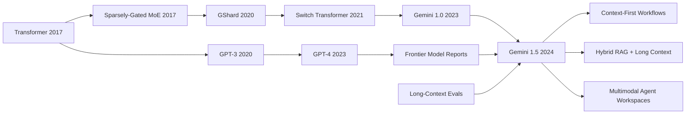

# Gemini 1.5 - Multimodal Understanding Across Million-Token Contexts

> **On February 15, 2024, Google put Gemini 1.5 Pro's one-million-token context window into private preview; on March 8, the Gemini Team turned the idea into [arXiv:2403.05530](https://arxiv.org/abs/2403.05530), a technical report about models that can work across entire corpora rather than snippets.** The hook was not merely a larger number on a product page. Gemini 1.5 could be prompted with 402 pages of Apollo 11 transcripts, a 44-minute silent film, more than 100,000 lines of code, or 11 hours of audio, and the report claimed near-perfect needle-in-a-haystack retrieval even in research tests reaching ten million tokens. The paper forced the field to separate two ideas that had often been conflated: a long context window is not just bigger short-term memory; used well, it changes the shape of model interaction, evaluation, retrieval, and software built around frontier models.

## TL;DR

The Gemini Team's 2024 Gemini 1.5 report shifted the post-GPT-4 frontier-model race from “higher single-turn benchmark scores” to “can the model operate over an entire working corpus at once?” Gemini 1.5 Pro uses a sparse Mixture-of-Experts line, where active computation per token is closer to $C_\text{active}=\sum_{e\in\mathrm{TopK}(r(x))} C_e$ than to activating every parameter, and pairs that efficiency story with million-token multimodal context over text, code, video, and audio. The failed baseline it displaced was not a single leaderboard runner-up, but the assumption that long documents had to be handled mainly through RAG chunks around GPT-4 Turbo's 128k or Claude 3.0's 200k windows. Gemini 1.5 Pro shipped with a 128k standard context, previewed 1M tokens, was stress-tested in research settings to 10M tokens, and reported above-99% near-perfect retrieval on long-context tasks; its Kalamang experiment showed a stranger capability, where a model can ingest a grammar book for a language with fewer than 200 speakers and perform many-shot in-context translation at roughly the level of a human learner given the same material. The counter-intuitive lesson is that a huge window does not abolish retrieval, summarization, or memory systems. It forces them to be redesigned. Gemini 1.5's historical role is that, alongside 2024 reports such as Sora, it made “bring the whole workspace into the reasoning loop” a first-class frontier-model capability rather than a prompt-engineering party trick.

---

## Historical Context

### The awkward state of long context before 2024

Before Gemini 1.5, long context was one of the easiest model capabilities to overestimate and underestimate at the same time. It was overestimated because release pages often treated the context window as a linear “bigger is better” number, as if 32k, 128k, and 200k were simply memory upgrades. It was underestimated because very few systems could reliably read long material, find evidence in the middle, compare across documents, and then use that evidence for reasoning. Users had already exposed the demand in products: they wanted models to read whole codebases, long meeting records, legal case files, bundles of research papers, video transcripts, and audio transcripts, rather than repeatedly pasting small summaries and hoping the model would not lose the thread.

Before 2023, most practical systems worked around the problem of putting everything directly into context. Retrieval-augmented generation chunked documents, embedded them, retrieved a small set of passages, and inserted those passages back into the prompt. Summary memory compressed conversations as they grew. Agent frameworks wrote intermediate state into external files or databases. These methods were useful, but they created information bottlenecks: chunking could split cross-paragraph clues, retrieval could miss a crucial piece of evidence, summaries decided too early what mattered, and external memory required extra indexing and consistency machinery. The appeal of long-context models was that some retrieval and compression might move back inside the model: place the whole dossier on the table first, then let the model discover the relationships.

Early long context also had an awkward failure mode. Many models could accept long inputs without reliably using long inputs. Needle-in-a-haystack tests became popular precisely because users found that models often attended to the beginning and end while becoming weaker in the middle. As context length grew, attention cost, positional extrapolation, training-length distribution, inference latency, and price all became visible constraints. Gemini 1.5 enters history at that point. It was not the first model to advertise a long window, but it was one of the first frontier-model reports to place million-token context, multimodal inputs, MoE efficiency, and a suite of long-context evaluations at the center of the argument.

### From Gemini 1.0 to Gemini 1.5

When Google released Gemini 1.0 in late 2023, the main narrative was native multimodality. Text, images, audio, video, and code were not supposed to be add-on tools around a language model; they were input worlds that the same model family should cover. Gemini 1.0 Ultra was positioned as Google's strongest model at the time, Gemini 1.0 Pro as a broader product model, and Gemini Nano as the on-device line. This made the competition with GPT-4 about more than language benchmarks. It was also about whether Google could unify Search, YouTube, Android, Workspace, Cloud, and DeepMind research under one model stack.

The launch context of Gemini 1.5 was striking. On February 15, 2024, not long after Gemini 1.0 Ultra entered Gemini Advanced and developer APIs, Google announced the next-generation Gemini 1.5 Pro. It was described as a mid-size multimodal model that matched or approached Gemini 1.0 Ultra quality across many dimensions while being more efficient to train and serve. The keyword was not simply bigger; it was more efficient. Google explicitly made Mixture-of-Experts part of the public story: instead of activating the whole network for every input token, a routing mechanism selects relevant expert pathways so computation is spent on the subnetworks that matter for that token.

The later arXiv report expanded the story into a model family. Early public attention focused on Gemini 1.5 Pro's million-token preview; later revisions also brought Gemini 1.5 Flash into the same report and emphasized the tradeoff between efficiency and quality. That matters because Gemini 1.5 was not just a single demonstration model. It was a product line. Pro demonstrated long context and strong quality; Flash showed that long-context capability also had to reach high-throughput, lower-cost use cases. A million-token window that only runs occasional demos does not reshape the developer ecosystem. It starts to matter when it becomes a priced, serviceable, composable API capability.

### Why “million-token context” is not an ordinary parameter upgrade

Increasing parameter count usually changes internal knowledge and capability ceilings. Increasing context length changes the interface between the model and the outside world. The jump from GPT-3 to GPT-4 made stronger reasoning, coding, and exam behavior visible. Gemini 1.5's million-token context made a different jump visible: users no longer had to compress the world into a few prompt paragraphs before asking the model to act. They could pass much more of the original material directly to the model. Google's examples were carefully chosen: 402 pages of Apollo 11 mission transcripts, a 44-minute Buster Keaton silent film, more than 100,000 lines of code, 11 hours of audio, and over 700,000 words. These are not ordinary chat prompts; they are workspaces.

This changes software layering. In the short-context era, external retrieval found material, the prompt carried a few pieces of evidence, and the model synthesized an answer. In the million-token era, boundaries loosen. Retrieval can recall larger document bundles; the model can perform second-stage localization inside the context; users can provide a codebase and issue history together; video and audio can enter as raw evidence. This does not make RAG disappear. It shifts RAG from “insert a few chunks each turn” toward “choose which complete materials should enter long context.”

That is why Gemini 1.5 belongs in awesome-papers. It is not because the report discloses a reproducible long-context recipe; it still withholds many architecture and training details. Its importance is that it promotes long context from a peripheral feature to a frontier-model metric. Later model reports had to answer a new set of questions: how large is the window, can the middle be used reliably, can modalities be mixed, does the model reason or merely retrieve, and how are cost, latency, safety, and privacy handled? After 2024, those questions became shared vocabulary for model products and research evaluation.

## Background and Motivation

### From retrieval augmentation to putting the material directly in context

Gemini 1.5's immediate motivation can be read as a stress test of the RAG-first paradigm. RAG is powerful, but it moves the decision of what matters earlier, into the retriever. For fact lookup and enterprise knowledge bases, that is often enough. For long code edits, legal evidence chains, movie-plot details, literature synthesis, and multi-step strategic analysis, the key clues may be scattered across many locations, and one may not know which passage matters until the whole corpus has been read. Long-context models try to delay more of that decision into the model's reasoning phase, allowing evidence to be weighted with global visibility.

That does not mean “put everything in the prompt” is always optimal. Million-token context brings latency, cost, and attention dilution; users also do not want the model to wander through irrelevant material. The motivation of Gemini 1.5 is better described as adding a new layer of choice. When a task truly requires global evidence, the model is no longer blocked by a small hard window. Developers can recombine fine-grained RAG, coarse retrieval, long-context reading, and external tools instead of forcing every task into 4k or 16k chunks.

### The three things Google needed to prove

First, Google needed to prove that long context was not a trick bought by sacrificing general quality. The release materials repeatedly emphasize that Gemini 1.5 Pro outperformed Gemini 1.0 Pro on most internal development benchmarks across text, code, image, audio, and video, while broadly matching Gemini 1.0 Ultra. That narrative is important. If a model has a huge window but regresses on short tasks, developers will treat it as a specialized file reader. Gemini 1.5 had to show that long context could live inside a mainline assistant model.

Second, Google needed to prove that million-token context could work across modalities, not merely over long text. Video, audio, code, and documents all enter the same problem interface after tokenization, extending Gemini 1.0's native-multimodal line. Long context is especially striking for multimodality because video and audio consume context budgets naturally. Being able to place an hour of video or 11 hours of audio into context means the model can search evidence in the original temporal material rather than only in human-written summaries.

Third, Google needed to show that long context could produce a new kind of in-context learning. The Kalamang experiment serves that purpose. The model is given a grammar manual and lexical material for a low-resource language, then asked to translate without parameter updates. This is not ordinary needle retrieval; it treats context as a temporary textbook. It suggests a broader direction: a future model might read project documentation, API specs, team conventions, and historical decisions inside one session, then work like a temporary team member. Gemini 1.5 did not completely realize that vision, but it put the vision onto an evaluable surface.

---

## Method Deep Dive

A method deep dive on Gemini 1.5 has to begin with boundaries. The report publicly discloses several high-level facts: Gemini 1.5 is a family of multimodal models; it uses a Mixture-of-Experts line to improve training and serving efficiency; it can process million-token contexts; it covers text, code, images, audio, and video; and it demonstrates capability through long-context retrieval, long-document QA, long-video QA, long-context ASR, Kalamang translation, and professional workflow studies. The report does not disclose enough to reproduce the full model: architecture size, parameter count, number of experts, routing losses, data mixture, positional details, inference optimizations, and the safety stack remain undisclosed. This section therefore does not reconstruct Google's internal recipe; it organizes the public facts into an interpretable system picture.

### Public facts and the undisclosed parts

Gemini 1.5 continues the frontier-model-report genre that became prominent after GPT-4. It tells readers what the system can do, how it is evaluated, and why it matters, but it does not provide a complete training manual. We can confirm MoE, long context, multimodality, efficiency, and safety evaluation. We cannot pretend to know the number of experts, routing strategy, the specific stages used to extend context, or the cache engineering. That boundary matters because long-context models are easy to mythologize. Once a report says one million or ten million tokens, readers may imagine unlimited memory. In practice, million-token context requires positional generalization, training curricula, attention engineering, KV-cache management, latency control, and evaluation protocols working together.

| Layer | Public fact | Reasonable interpretation | Should not be invented |
|---|---|---|---|
| Architecture | Gemini 1.5 uses MoE to improve training and serving efficiency | Sparse activation decouples total capacity from per-token compute | Expert count, Top-k routing, load-balancing loss |
| Context | 128k standard, 1M preview, 10M research tests | Positional representation, length curriculum, and inference engineering all matter | Specific RoPE/attention variants, cache compression |
| Multimodality | Text, code, video, audio, and images enter one model family | Modalities are tokenized or embedded into a shared context | Tokenizer/encoder details for each modality |
| Evaluation | NIAH, long-document QA, long-video QA, ASR, Kalamang | A ladder from retrieval to reasoning to temporary learning | Full internal prompts, sampling, and failure sets |
| Product | AI Studio / Vertex AI preview, Flash as efficient variant | Long context matters only if it can be served | Complete pricing, scheduling, privacy, and safety implementation |

### Overall framework: sparse MoE + native multimodality + long context

Compressing the public information into a system frame, Gemini 1.5 can be read as the meeting point of three lines. The first is sparse expert computation: the model contains multiple expert subnetworks, but each token activates only a small subset, creating a conditional tradeoff between total capacity and step-wise compute. The second is native multimodality: text, code, video, audio, and images are converted into tokens or embeddings that can act as evidence inside one context window. The third is long-context training and inference: the model must not only fit long input, but reliably localize, compare, and synthesize across it.

A conceptual objective can express this behavior. Given mixed-modal input $X=(x_1,\ldots,x_n)$, a routing function $r$ selects expert sets for tokens, and the model predicts outputs under long-context conditioning:

$$
p_\theta(y_t\mid y_{<t}, X)=\mathrm{LM}\left(y_{<t}, \sum_{e\in \mathrm{TopK}(r(x_i))} g_e(x_i), \mathrm{pos}(i)\right).
$$

This formula is not Google's internal implementation. It is a conceptual expression: long-context capability is not one parameter but the joint result of expert routing, modality encoding, positional representation, and language generation. Gemini 1.5's public contribution was to show that this combination could enter real product preview while retaining usable quality at million-token scale.

| Component | Function | Contribution to long context | Main risk |
|---|---|---|---|
| MoE routing | Select relevant experts for each token | Reduces effective compute and supports larger capacity | Routing imbalance, expert collapse |
| Multimodal encoding | Turn video, audio, and images into usable context | Lets raw evidence enter the same problem | Modal compression may lose details |
| Positional modeling | Keep tokens distinguishable at million-token length | Reduces middle-position forgetting | Extrapolation failure, positional bias |
| Long-context evaluation | Test retrieval and reasoning | Prevents “fits but does not use” behavior | Benchmark monoculture |
| Serving system | Control latency, cost, and safety | Moves capability from demo to API | Price and privacy pressure |

### Key design 1: MoE turns compute budget into a routing problem

Gemini 1.5's official story explicitly grounds it in Transformer and MoE research. The core idea of MoE is straightforward: a dense Transformer activates the same feed-forward network for every token, while an MoE prepares multiple expert networks and lets a router select a small number of experts for each token representation. Total parameter capacity can be large, while active compute per token covers only a few experts.

$$
h'_i = \sum_{e\in \mathrm{TopK}(r(h_i))} \alpha_{i,e}\,E_e(h_i), \qquad \sum_e \alpha_{i,e}=1.
$$

For Gemini 1.5, the meaning is efficiency. Long context multiplies token count by one or two orders of magnitude; if the model activates all parameters for every token, serving cost quickly becomes untenable. MoE does not make million-token context free, but it gives a scaling direction: place model capacity in a set of experts while keeping each token's active computation on a bounded path. Google's blog described Gemini 1.5 Pro as approaching Gemini 1.0 Ultra quality with less compute, which is exactly the claim that the MoE story is meant to support.

| Dense Transformer | MoE Transformer | Meaning for Gemini 1.5 | Cost |
|---|---|---|---|
| Every token activates the full FFN | Every token activates a few experts | Capacity and compute are partly decoupled | Router must learn allocation |
| Training load is relatively uniform | Expert load can become skewed | Requires load-balancing strategy | Engineering complexity rises |
| Inference path is simple | Inference path depends on routing | Can serve diverse inputs | Batching becomes harder |
| Easy to describe as one model | More like a set of experts | Fits multimodal and multitask use | Failures are harder to diagnose |

The counter-intuitive point is that MoE turns “make the model larger” into “learn how to choose.” If the router fails, experts may sit idle or become overloaded. If many irrelevant tokens in a long context activate the wrong experts, computation is still wasted. The Gemini 1.5 report does not disclose those internals, so a deep note should not treat MoE as magic. It is best read as a necessary engineering clue for making million-token context serviceable.

### Key design 2: million-token positional modeling and long-range retrieval

The first challenge of long context is not simply memory capacity; it is whether position remains meaningful. Across one million tokens, the model must distinguish evidence at the beginning, middle, and end; bind distant clues to the same question; and avoid overfitting to neighboring noise. Abstractly, a long-context model must keep evidence $x_i$ accessible to a query $q$ over length $N$:

$$
\mathrm{score}(q, x_i)=\mathrm{Attn}(Q(q), K(x_i), \mathrm{pos}(i)), \qquad i\in[1,N].
$$

When $N$ grows from 32k to one million, the positional function, attention approximation, training length distribution, and KV cache can all become bottlenecks. The Gemini 1.5 report does not disclose the exact positional encoding, but it uses NIAH, long-document QA, long-video QA, and long-audio tasks to show that the model can reliably use distant evidence in a designed set of settings. The arXiv abstract's claim of above-99% retrieval up to at least ten million tokens pushes long-context evaluation from “can the prompt fit?” to “can the model retrieve from extreme length?”

| Long-context issue | Why it is less visible in short windows | Million-window behavior | Evidence in Gemini 1.5 |
|---|---|---|---|
| Middle-position forgetting | 4k/8k inputs contain less evidence | Middle needles are easier to miss | NIAH covers different positions |
| Cross-segment binding | Few documents keep clues nearby | Clues may be scattered across hundreds of thousands of tokens | Long-document and code examples |
| Multimodal length expansion | Text tokens are relatively compact | Video and audio consume budget quickly | 1 hour of video, 11 hours of audio |
| Latency and cost | Short windows hide overhead | Longer input slows response | Preview materials emphasize optimization |

NIAH is not a complete reasoning test. A model can find a needle without understanding the haystack. But in 2024 it was a necessary gate: if a model cannot recover an explicit fact from the middle of the context, it is not ready to claim long-document synthesis. Gemini 1.5's key move was pushing that gate into million- and even ten-million-token territory while placing it beside multimodal tasks in the same report.

### Key design 3: multimodal context as unified reasoning evidence

Gemini 1.5 inherits Gemini 1.0's native-multimodal goal. Long context makes that goal more concrete: a model does not merely inspect one image or a short audio clip; it can treat long video, long audio, code repositories, and documents as evidence. Conceptually, different modalities can be mapped into a shared context sequence:

$$
X = [\phi_\text{text}(d), \phi_\text{code}(c), \phi_\text{video}(v), \phi_\text{audio}(a), \phi_\text{image}(m)].
$$

Each $\phi$ is a modality-specific encoding or tokenization process, and the unified model conditions on the resulting sequence. The report does not disclose the encoder details, but the examples show why they matter. Given a 44-minute silent film and a line drawing as a reference, the model has to localize a scene across a visual timeline. Given 11 hours of audio, it has to maintain ASR and question answering over long time spans. Given more than 100,000 lines of code, it has to understand relationships across files rather than only a single function.

| Modality | New task enabled by long context | Typical limitation of older methods | Historical signal from Gemini 1.5 |
|---|---|---|---|
| Documents | Multi-document comparison, long-report QA | Summarize first, answer later loses evidence | 402-page transcript example |
| Code | Cross-file modification, architecture explanation | Retrieve only local functions | 100k+ lines of code example |
| Video | Long-clip plot localization | Short clips or transcripts only | 44-minute movie example |
| Audio | Long meeting / podcast / recording QA | Segment ASR first, stitch later | 11-hour audio capability |
| Images | Joint reasoning with text and video | Single-image VQA in isolation | Mixed multimodal prompting |

This is the difference between Gemini 1.5 and an ordinary long-text model. A long context that only serves document reading is already important. But when video, audio, and code enter the same context, the model starts to look like a unified evidence processor. The language-model window is not merely longer; the multimodal workspace is larger.

### Key design 4: long-context in-context learning

The Kalamang experiment is the most intellectually interesting part of the Gemini 1.5 report. The model is given a grammar book and lexical material for Kalamang, then asked to translate into the low-resource language without parameter updates. It reaches a level comparable to a human learner given the same material. This is not simply “it can read a lot.” It is “it can turn long material into a temporary skill.”

This can be written as task learning under context conditioning:

$$
y = f_\theta(x_\text{query}\mid D_\text{manual}, D_\text{examples}, I_\text{task}),
$$

where $D_\text{manual}$ is the grammar manual, $D_\text{examples}$ are lexical examples, and $I_\text{task}$ is the translation instruction. The parameters do not change; the temporary knowledge in context changes. GPT-3's few-shot learning taught task format with a few examples. Gemini 1.5's many-shot or long-context learning can teach a temporary domain from an entire manual.

| Learning form | Context content | Parameter update | Typical example | Limitation |
|---|---|---|---|---|
| Zero-shot | Task instruction only | No | “Translate this sentence” | Depends on pretraining knowledge |
| Few-shot | A few examples | No | GPT-3 prompt examples | Cannot cover complex rules |
| Many-shot | Many examples | No | Long-context classification / translation | Limited by window and retrieval |
| Manual-in-context | Rulebook + examples | No | Kalamang grammar manual | Depth of understanding is unstable |
| Fine-tuning | Training data | Yes | Specialized translation model | Costly and slower to update |

The implication is large. If a model can learn a team's APIs, lab protocol, legal clauses, or obscure language rules inside a single context, the boundary between training a model and prompting a model becomes finer. Gemini 1.5 did not prove that long-context learning replaces fine-tuning, but it made an intermediate layer credible: change the context, not the parameters, and still acquire a complex temporary capability.

### Pseudocode: treating long context as a first-class product resource

The pseudocode below is not Google's implementation. It captures the product and evaluation workflow implied by the Gemini 1.5 report. The central change is that the system no longer assumes all inputs must be compressed into a few chunks. It chooses among long context, retrieval, compression, and tools according to the task.

```python
def answer_with_long_context(request, materials, model, retriever, policy):
    budget = policy.context_budget(request)

    if materials.token_count <= budget and policy.requires_global_evidence(request):
        context = materials.pack_preserving_structure()
    else:
        bundles = retriever.retrieve_coarse_bundles(request, materials)
        context = policy.pack_with_summaries_and_sources(bundles, budget)

    response = model.generate(
        prompt=request,
        context=context,
        modalities=materials.modalities,
        safety_policy=policy.safety_rules,
    )

    return response.with_citations_or_offsets(context)
```

| Design choice | Short-context system | Gemini 1.5-style system | Judgment still required |
|---|---|---|---|
| Material selection | Retrieve a few chunks | Can include complete document bundles | Which materials deserve the window |
| Evidence localization | Done by retriever | Retriever plus internal model localization | How to provide auditable citations |
| Multimodal handling | Often convert to textual summary first | Raw modality can enter context | Whether compression preserves evidence |
| Interaction style | Add material over many turns | Provide a large workspace in one turn | How users control attention |
| Cost control | Fewer tokens but unstable recall | More tokens but higher latency | When to switch back to RAG or tools |

The method lesson is simple: Gemini 1.5 did not merely enlarge the window; it made the context window a first-class resource of the model product. Long context, MoE, multimodality, and serving efficiency constrain one another. If any one part fails, a million tokens collapse into an expensive paste buffer. The real contribution was placing those parts in one public report, making it impossible for later frontier models to treat long context as an appendix.

---

## Failed Baselines

The failed baselines for Gemini 1.5 are not ablation-table rows where removing module A reduces score B. The report does not disclose enough detail for that kind of comparison. A better reading is that it made several pre-2024 system assumptions insufficient. Short windows plus RAG, short benchmarks alone, long context as simple retrieval, and multimodal understanding split into external tools were not entirely wrong. They simply could not explain the workflow demonstrated by Gemini 1.5.

### Baseline 1: the practical ceiling of 128k / 200k windows

GPT-4 Turbo's 128k context and Claude's 200k-class windows already felt large. For most chat, code snippets, paper question answering, and enterprise documents, hundreds of thousands of tokens made users feel that they no longer had to slice material so aggressively. Gemini 1.5 pushed the competitive ruler directly to a 1M preview and discussed 10M-token research tests. That leap is not merely “a few more papers.” It allows whole books, long video, long audio, and large code materials to become single input objects.

This baseline failed because it understood long context as a linear extension of short windows. Once the scale moves from 128k to 1M, task type changes: from reading one report to comparing a set of reports, from understanding one file to scanning a codebase, from reading a video summary to localizing events in a complete video. The old windows remained useful, but they no longer represented the frontier ceiling of long context.

### Baseline 2: RAG stitching cannot replace end-to-end context

RAG was the main baseline for long-document question answering. It chunks documents, retrieves relevant passages with embeddings or keywords, and asks a model to answer from those passages. This works well for fact lookup, but it depends on the retriever guessing relevance before the model reasons. When a question requires cross-chapter comparison, locating a detail on a video timeline, understanding far-apart code dependencies, or inducing rules from a grammar manual, relevance may not be something a local chunk can decide alone.

Gemini 1.5 did not prove that RAG is obsolete. It proved that RAG should not be the only entrance. Million-token context lets systems hand more original material to the model, allowing a second stage of localization and synthesis inside the prompt. The failed assumption is not retrieval itself, but “top-k chunks are enough.” The later practical route is more hybrid: use retrieval to choose the material range, then use long context to carry a fuller evidence packet.

### Baseline 3: model reports based only on short benchmarks

Short benchmarks remain important for model development: MMLU, GSM8K, HumanEval, MATH, and multimodal VQA provide fast capability outlines. But they cannot test whether a model can use evidence at token 500,000, find a brief scene in a 44-minute video, or read a grammar book and temporarily learn translation rules. Gemini 1.5 placed these long-context tasks at the center of the report, effectively declaring that older benchmark bundles were incomplete.

This failed baseline had deep consequences. After 2024, a model report that only gives short-task scores invites suspicion that it lacks long-horizon capability. A report that only gives NIAH invites suspicion that it only performs mechanical retrieval. Long-context evaluation therefore began to stratify: explicit retrieval, cross-segment reasoning, long-input robustness, multimodal temporal localization, many-shot learning, and real workflow efficiency. Gemini 1.5 did not perfect every layer, but it forced the evaluation agenda to expand.

### Baseline 4: the misconception that long context equals memory expansion

The most common misreading is to treat million-token context as “the model has more memory.” Context is not parameter memory; it is a temporary workspace. A larger input window lets the model cite current material, but it does not permanently learn the material, automatically ignore noise, automatically verify sources, or automatically form the right plan. The Kalamang experiment is especially easy to overread: the model can temporarily learn parts of a translation system from a grammar manual, but that does not mean it has become a linguist who fully masters the language.

This baseline failed because it underestimates context as a workspace and overestimates context as stable long-term memory. Useful systems combine long context with retrieval, citation, summarization, caching, user control, and external tools. Gemini 1.5's long context is a new capability layer, not a magic command that deletes every memory system.

| Failed baseline | How Gemini 1.5 broke it | Key evidence | Later impact |
|---|---|---|---|
| 128k/200k is enough | Product preview moved to 1M; research tests to 10M | 1M preview, 10M retrieval stress test | Model competition started advertising million-token windows |
| Top-k RAG chunks are enough | Fuller materials can enter context for internal localization | Document, video, code, and audio examples | Hybrid RAG + long context became the practical route |
| Short benchmarks are enough | Long-context tasks moved to the report center | NIAH, long document/video/ASR, Kalamang | Long-horizon evaluation became a separate category |
| Large window equals permanent memory | Context is only a temporary workspace | Kalamang without parameter updates | Citation, caching, and external memory remain necessary |

## Key Experimental Data

### Long-context retrieval: NIAH becomes a stress test

The most direct numbers in the Gemini 1.5 report concern long-context retrieval. Google's release materials say that Gemini 1.5 Pro found the embedded text 99% of the time in 1M-token NIAH tests; the arXiv abstract extends the near-perfect retrieval claim to at least 10M tokens and uses above-99% language. The number was memorable because it captured the most basic fear about long context: will the model completely forget material in the middle?

| Evaluation / setting | Public number in the report | How to read it | Caveat |
|---|---:|---|---|
| Standard context | 128k tokens | Default window for practical availability | Not every user receives 1M by default |
| Private preview | 1M tokens | The most visible early-2024 product capability | Early latency and cost were higher |
| Research test | up to 10M tokens | Shows positional and retrieval extrapolation | Not a routine public-service guarantee |
| NIAH recall | >99% / around 99% | Explicit facts can be recovered from long input | Not the same as perfect complex reasoning |
| Input example | 700k+ words | Long text can be supplied in bulk | Still requires structured prompting |

The limitation of NIAH must be stated at the same time. It measures retrieval of an explicit needle, not global understanding. A model may find where a sentence was hidden and still fail to judge causal contradictions between two reports, or cite the wrong context in an answer. Gemini 1.5's result is necessary, not sufficient. It shows that the model can preserve localization ability at extreme lengths; the next question is whether it can use the located evidence correctly.

### Multimodal long context: video, audio, and code inside one problem

The most distinctive experimental material in Gemini 1.5 is that long context is not only for text. Google's examples include one hour of video, 11 hours of audio, more than 30,000 lines of code, a 100,000-line code demonstration, 402 pages of Apollo 11 transcripts, and a 44-minute silent film. These are not unified benchmark scores, but they are important because they define what developers will try to do with long context.

| Material type | Public example | What the model must do | Why it is not an ordinary short prompt |
|---|---|---|---|
| Documents | 402 pages of Apollo 11 transcripts | Locate events and details across pages | Evidence is distributed across long material |
| Video | 44-minute Buster Keaton silent film | Locate a scene from a line-drawing reference | Requires visual timeline understanding |
| Code | 100,000+ lines of code | Explain, modify, and reason across files | Dependencies span many files |
| Audio | 11 hours of audio | Long-horizon ASR and question answering | Time span exceeds short clips |
| Text | 700,000+ words | Large-scale reading and synthesis | Summarization can discard evidence too early |

These examples also expose an evaluation problem. Demonstrations show that a task can be done; they do not establish average success rate, failure modes, cost, or safety boundaries. For real users, the important questions remain: can the model reliably produce correct patches over 100k lines of code, cite timestamps in 11 hours of audio, or distinguish similar scenes in a long video? Gemini 1.5's contribution was turning these questions from demos into benchmark directions that the field would keep asking.

### Quality retention: approaching or exceeding Gemini 1.0 Ultra

Google's release materials emphasize that Gemini 1.5 Pro outperformed Gemini 1.0 Pro on 87% of the comprehensive text, code, image, audio, and video benchmarks used for LLM development, and performed broadly similarly to Gemini 1.0 Ultra. This number is less theatrical than NIAH, but methodologically more important. It says long context was not positioned as a specialized model that sacrificed general ability; it was part of a mainline model capability.

| Comparison target | Public positioning of Gemini 1.5 Pro | Meaning | Caveat |
|---|---|---|---|
| Gemini 1.0 Pro | Beats 87% of development benchmarks | New Pro is a broad upgrade | Benchmark suite is not fully public |
| Gemini 1.0 Ultra | Broadly similar quality | Efficient mid-size model approaches prior flagship | Similar does not mean every metric wins |
| GPT-4 Turbo / Claude 3.0 | Longer context window | Competition shifts toward long context | Cross-model protocols differ |
| Gemini 1.5 Flash | Lighter efficiency variant | Family expands toward lower-cost use | Flash and Pro trade off quality and cost |

This result also explains why MoE sits in the public narrative. Long context consumes a large token budget. If short-task quality regresses or serving cost is too high, developers will not use it persistently. The industrial target of Gemini 1.5 is to preserve capability, extend context, and control cost at the same time. The report does not disclose every engineering detail, but it makes that triangle clear.

### Kalamang: learning low-resource translation from a grammar book

The Kalamang experiment is the part of the Gemini 1.5 report that best shows long context is not just retrieval. Kalamang is a language with fewer than 200 speakers. The model is given a grammar manual and related material, then asked to translate from English into Kalamang. The abstract says the model reaches a level similar to a person learning from the same material. This matters because the context is acting like a temporary training set.

| Experimental element | Setting | What it tests | Why it matters |
|---|---|---|---|
| Low-resource language | Kalamang, fewer than 200 speakers | Pretraining knowledge should be limited | Weakens the “the model memorized it” explanation |
| Input material | Grammar manual plus lexicon/examples | Can it extract rules from long material? | Not just finding one sentence |
| Learning mode | No parameter update | In-context learning | Distinct from fine-tuning |
| Output task | English-to-Kalamang translation | Rule application and generalization | Retrieval + reasoning + generation are involved |
| Comparison | Humans using the same material | Provides an intelligible reference point | Scoring protocol still matters |

This result should not be romanticized as “a model reads one book and masters a language.” Low-resource translation is hard, scoring is complex, and context learning may be sensitive to material format, prompt design, and test distribution. But it raises a powerful question: if a model can temporarily acquire domain rules inside one context, many future tasks may not need immediate fine-tuning. They may place specifications, examples, and constraints into long context and let the model learn while working. That question is the most durable research energy left by Gemini 1.5.

---

## Idea Lineage

Gemini 1.5 sits at the intersection of two intellectual lines. One line comes from Transformer, sparse experts, and Google's long history of conditional computation: models can grow, but computation per token cannot grow without limit. The other line comes from GPT-3, GPT-4, Claude, and RAG systems: models increasingly use context as temporary program, database, and working memory. The special role of Gemini 1.5 is that it joins these lines in one public story: use a more efficient model family to support a larger multimodal workspace.

### Prehistory: sparse experts and long context as two lines

The MoE line can be traced to 2017's Sparsely-Gated Mixture-of-Experts. It proposed an engineering dream that kept returning: total parameter capacity can be large, while each computation activates only part of it. Google's later GShard and Switch Transformer work carried that dream into larger-scale sequence modeling. Gemini 1.5 inherits this public line: do not solve everything with dense scaling; use routing and expert paths to buy efficiency.

The long-context line approached from another direction. Transformer self-attention allowed any token to attend to any other token in principle, but real models were long constrained by training length, attention cost, and product latency. GPT-3 demonstrated in-context learning, but with a short window. GPT-4 made multimodality and the capability report into an industry template, but the public version did not provide million-token context. Claude pushed 100k and 200k windows into products. The RAG ecosystem proved that users wanted models to use external material. Gemini 1.5 merged those demands into a more aggressive proposal: move the archive itself into context.

### Present life: million-token context changes model use

The historically important idea in Gemini 1.5 is not one number; it is the shift from context as prompt to context as workspace. In the short-context era, a prompt was more like a note handed to the model. In the million-token era, a prompt can become a dossier, a codebase, a full video, or a set of course materials. The model's role changes from “complete an answer from a small instruction” to “read, localize, induce, and act inside a temporary workspace.”

This changes application architecture. Older applications placed the model after a retriever: the retriever found material, then the model read it. After Gemini 1.5, the model can participate earlier in material selection and internal localization. Older agents had to write external memory frequently; long context lets part of the intermediate state stay inside the same session. Older multimodal models often processed short clips or single images; Gemini 1.5 places video and audio in long context, giving multimodal reasoning a longer timeline.

### Citation graph: from Transformer to context-first workflows



The most important nodes in this graph are not Gemini 1.5 itself, but the three branches after it. Context-first workflows mean developers start placing complete material into a model call rather than only snippets believed to contain the answer. Hybrid RAG + Long Context means retrieval does not disappear; it moves from precise chunk selection toward coarse material organization. Multimodal Agent Workspaces means the model reads not only text, but work scenes made of video, audio, code, and images.

### Misreading: a large window is not automatic reasoning

The most common misreading of Gemini 1.5 is to equate a large window with strong reasoning. Retrieval, compression, comparison, planning, and verification are different capabilities. Strong NIAH performance means the model can find explicit evidence in long input. Strong Kalamang performance means the model can extract some rules from material. Neither guarantees that the model automatically builds the right causal graph in a complex task. Long context may even make models more vulnerable to noise, conflicting materials, and malicious prompts.

Another misreading is that long context eliminates all external memory. The reality is closer to the opposite: the larger the window, the more material management matters. Users must decide which materials enter the window; systems must preserve source and time metadata; models must cite locations; sensitive data must be isolated; repeated calls must be cached. Million-token context is not a knowledge base. It is an expensive and powerful temporary workbench. Good applications coordinate that workbench with persistent storage, retrievers, and tool execution rather than dumping everything into it blindly.

### Impact: from RAG-first to hybrid context-first systems

After Gemini 1.5, long context became one of the hard metrics of model release. Claude, GPT, Gemini, Llama, Qwen, Mistral, and DeepSeek lines extended windows, improved positional extrapolation, or shipped long-context variants in different ways. At the same time, developers did not abandon RAG. Instead, RAG was reinterpreted as a pre-step for long-context packing: choose the project, date range, document set, or code module, then place fuller material into the model.

The impact also extends to evaluation. Older long-context tests liked hiding a single needle. Newer tests increasingly ask about multiple needles, multi-hop reasoning, contradictory evidence, chronology, long-video event localization, long-code modification, and real workflow time savings. The Gemini 1.5 report was not the endpoint of those evaluations, but it made “does the model really use long context?” a question every frontier model has to answer. Its place in idea history is exactly that: it turned the context window from an engineering parameter into a research object and product strategy.

---

## Modern Perspective

### Looking back from 2026: what remained

Looking back from 2026, the most durable legacy of Gemini 1.5 is not the number “1M tokens” by itself. It made long context a default competitive dimension of model products. Users now naturally ask: how much can this model read, can it process a full codebase, can it retain evidence in the middle, can it cross-reference video, audio, and documents? These questions existed before Gemini 1.5, but they had not yet been placed so centrally in mainstream frontier-model reports.

It also changed how developers thought about RAG. Early RAG looked like a crutch for short-window models. After Gemini 1.5, RAG looks more like the material-orchestration layer of a long-context system. A retriever does not merely find answer snippets; it decides which files, chapters, date ranges, video segments, or code modules deserve the expensive window. The model then performs localization and synthesis inside that window. This makes the debate “long context versus RAG” obsolete. The real question becomes how to organize persistent storage, retrieval, context, and tools into an auditable workflow.

Gemini 1.5 also made many-shot in-context learning interesting again. GPT-3-era few-shot learning was surprising, but RLHF and tool use later drew much of the attention. The Kalamang experiment reminded the field that when a window is large enough, a prompt is not just a few examples; it can be a textbook, specification, or task manual. Many present-day agent and coding workflows move in that direction: place repository conventions, API docs, design notes, test logs, and user preferences into a long workspace so the model can temporarily become an assistant that understands this project.

### Judgments that still hold

First, long context is a foundation-model capability, not just product packaging. If a model cannot reliably use evidence in the middle, the large window is meaningless. Once it can, task boundaries change. Gemini 1.5 expressed this clearly: the context window is the bandwidth between the user and the model.

Second, multimodal long context is more important than pure long text. Video, audio, and code naturally consume more budget than ordinary text, and they are harder to summarize in advance. A model that can process an hour of video and a long codebase opens new workflows in education, law, medicine, film, software engineering, and scientific research. Gemini 1.5 placed these directions in one report, showing that Google understood context as more than textual length.

Third, efficiency architecture is tied to context length. Million-token input creates enormous serving-cost and latency pressure. MoE, caching, batching, compression, and model-tiering are not secondary optimizations; they determine whether long context becomes common. The family narrative of Gemini 1.5 Pro and Flash anticipated the Pro / Flash / Mini / Lite tiering that later became standard in model products.

### Assumptions that no longer hold

First, high NIAH score is enough to prove long-context understanding. That assumption no longer holds. Today the field cares about multiple pieces of evidence, multi-hop reasoning, conflicting materials, chronology, citation precision, and final task success rate. Gemini 1.5's NIAH result remains important, but it is a gate, not the destination.

Second, a bigger window reduces the need for system design. This also no longer holds. The larger the window, the more complex material selection, privacy boundaries, citation, caching, and user control become. A 1M-token prompt may contain sensitive contracts, code secrets, unpublished papers, and personal data. Before such material enters a model, the system must know what can be shared, what must be redacted, and what should stay local.

Third, long context naturally replaces fine-tuning. Kalamang showed the potential of context learning, but many professional tasks still require parameter updates, retrieval indexes, tool execution, validators, and human review. Context learning is better understood as a flexible middle layer: stronger than few-shot prompting and faster than fine-tuning, but not stable enough to replace every form of training.

## Limitations and Future Directions

### Technical limitations

The biggest technical limitation of Gemini 1.5 is that the public report does not allow outside researchers to reproduce the key capabilities. MoE architecture, long-context curriculum, positional encoding, modality encoding, data filtering, and inference optimization are not fully disclosed. For awesome-papers, this is not a moral accusation; it is a reading fact. The report is more of a capability evidence packet than an open recipe.

A second limitation is that evaluation does not yet cover real long-horizon reasoning enough. NIAH, long-document QA, long-video QA, and Kalamang all matter, but real tasks often require the model to plan, edit, verify, and revisit evidence across long material. A model that finds a sentence does not necessarily complete a cross-file refactor. A model that localizes a movie scene does not necessarily understand character motivation. A model that translates after reading a grammar book does not necessarily handle open text reliably.

A third limitation is serving cost and interaction experience. Million-token input creates latency, price, upload, permission-management, and explainability problems. Google also warned during preview that the 1M window could be slower and would need optimization. Long-context capability becomes a daily tool only when paired with good UI, citations, incremental caching, progress feedback, and safety policy.

### Evaluation limitations

Many results in the Gemini 1.5 report come from Google-internal or specific protocols, making them hard for outside readers to reproduce fully. The 87% benchmark win rate does not publish the full benchmark list. Professional time-savings studies depend on task setup and participant differences. Kalamang comparisons require careful reading of the scoring protocol. This is common for frontier-model reports, but it reminds us that the more closed a system is, the more important it is to distinguish public demonstrations, internal evaluation, and independent third-party validation.

Long-context evaluation also faces contamination and task-design problems. If the needle format is too simple, models may learn the template. If the task is too subjective, models become hard to compare. More valuable future evaluations should require auditable citations, conflicting evidence handling, multimodal timestamp alignment, runnable patches in long codebases, and consistency across multi-turn use.

### If rewritten today

If the Gemini 1.5 report were rewritten in 2026, I would want three more categories of evidence. First, more transparent long-context failure cases: which positions, modalities, and conflicting-evidence settings break the model. Second, independent reproducible evaluation harnesses: the weights need not be public, but task construction, scoring scripts, and sanitized examples could be. Third, system-level metrics: latency, cost, cache hit rate, citation accuracy, privacy handling, and user correction flow for a 1M-token prompt.

I would also want the report to distinguish retrieval success from reasoning success more sharply. For example, place several conflicting pieces of evidence in the same long document bundle and ask the model to judge which evidence is newer; require codebase edits across multiple files and run tests; require timestamps and visual evidence in long video. That would keep the long-context discussion from stopping at “how big is the window?”

## Related Work and Insights

### Direct inheritance

Gemini 1.5 directly inherits Transformer, Sparsely-Gated MoE, GShard, Switch Transformer, GPT-3 in-context learning, the GPT-4 frontier-model report genre, Claude's long-context products, and Gemini 1.0's native-multimodal line. It is not a sudden invention of one module. It is Google combining years of work in multimodality, sparse computation, TPU infrastructure, and product ecosystem into a long-context model family.

It also inherits the user demand exposed by the RAG ecosystem. Enterprises, researchers, and developers do not merely want models to answer encyclopedic questions. They want models to read their material, follow their constraints, and understand their projects. Gemini 1.5 pushed that demand into the model layer in the most direct way: if users want to give a model an archive, make the model capable of opening the archive.

### Lessons for later papers

For later model papers, Gemini 1.5's lesson is that long context must be evaluated as a system capability, not mentioned only as a tokenizer setting or positional-encoding trick. A report should answer context length, retrieval reliability, reasoning quality, multimodal coverage, cost, and safety together. “Supports 1M tokens” is no longer enough; readers will ask: what about the middle, cross-document evidence, conflicting evidence, and citations?

For application research, Gemini 1.5's lesson is that the context window can be designed as user experience rather than a backend parameter. A good long-context product shows material scope, source references, model focus, upload status, and privacy boundaries. It lets users pin evidence, exclude material, and require answers to be grounded only in the supplied corpus. The stronger long context becomes, the less a product can treat the prompt as a black-box text field.

## Resources

### Papers and official materials

- arXiv: [Gemini 1.5: Unlocking multimodal understanding across millions of tokens of context](https://arxiv.org/abs/2403.05530)
- Google announcement: [Our next-generation model: Gemini 1.5](https://blog.google/technology/ai/google-gemini-next-generation-model-february-2024/)
- Gemini 1.0 report: [Gemini: A Family of Highly Capable Multimodal Models](https://arxiv.org/abs/2312.11805)
- MoE lineage: [Outrageously Large Neural Networks: The Sparsely-Gated Mixture-of-Experts Layer](https://arxiv.org/abs/1701.06538)
- Switch Transformer: [Scaling to Trillion Parameter Models with Simple and Efficient Sparsity](https://arxiv.org/abs/2101.03961)

### Suggested reading path

The best way to read Gemini 1.5 is to begin with Google's February 2024 announcement and understand why the product story emphasizes 1M preview, one hour of video, and 100k lines of code. Then read the arXiv abstract and technical report, separating Gemini 1.5 Pro, Flash, long-context evaluation, and the Kalamang experiment. After that, go back to MoE and Switch Transformer to understand the efficiency story. Finally, compare it with GPT-4, Claude, Llama 3 long-context variants, and RAG systems, and ask which tasks long context should own and which should still be handled by retrieval, tools, and persistent memory.


---

> 🌐 [中文版](/era5_genai_explosion/2024_gemini15/) · 📚 awesome-papers project · CC-BY-NC