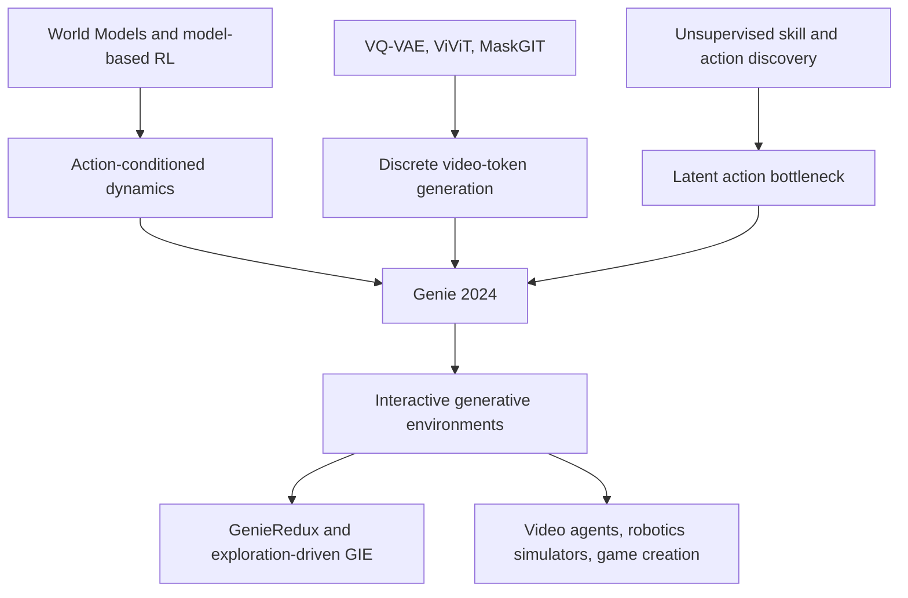

# Genie: Generative Interactive Environments

> **On February 23, 2024, Google DeepMind posted [Genie](https://arxiv.org/abs/2402.15391) to arXiv: not a model that merely generates a video clip, but one that turns a sketch, a photo, or a text-to-image sample into a 2D world a user can step through with buttons.** The surprising claim was not only scale, though the paper describes an 11B-class foundation world model. It was the action interface: Genie was trained without action labels, yet learned an eight-code latent controller from 30,000 filtered hours of Internet platformer videos. The paper did not prove that general world models had arrived. It made a sharper wager: if ordinary video already contains latent control signals, then future agents may be able to build training environments from the world’s passive visual data.

## TL;DR

The ICML 2024 Genie paper by Jake Bruce, Michael Dennis, Ashley Edwards, Jack Parker-Holder, Yuge Shi, and 20 coauthors combines video tokenization, latent action discovery, and autoregressive world modeling into a new kind of generative model. A spatiotemporal VQ-VAE maps video $x_{1:T}$ into discrete tokens $z_{1:T}$; a latent action model infers an eight-code action $a_t \in \{0,\dots,7\}$ from adjacent frames without ground-truth controls; and a MaskGIT-style dynamics model learns $p(z_{t+1}\mid z_{\le t}, a_t)$. At inference time the learned codebook becomes a controller: a user provides a starting image plus a latent action, and the model rolls the generated environment forward frame by frame. The failed baseline it displaced was not a single leaderboard runner-up. It was the older assumption that world models need real action labels, video generators are only uncontrollable clip machines, and messy Internet videos are too weak a source for interactive simulation. Genie’s 6.8M filtered 16-second clips, roughly 30,000 hours of public platformer gameplay, and 10.7B-parameter model made those assumptions much harder to keep.

Genie belongs next to same-year [Sora](2024_sora.md) because both papers pushed video generation toward world simulation, but Genie’s hook is different: it asks whether a generated visual world can be played, not merely watched. The counter-intuitive lesson is that control can emerge from a bottleneck rather than from labels. If a decoder can reconstruct the next frame only from history and a tiny latent code, that code is pressured to carry changes like left, right, jump, or no-op. Later work such as GenieRedux, GameNGen, Oasis, and Genie 2 all circle the same idea: visual generation becomes more important when it stops being a sample gallery and starts becoming an environment for exploration, imitation, and agent training.

---

## Historical Context

### From moving images to controllable worlds

When Genie appeared, video generation had already become one of the busiest frontiers for diffusion models, tokenizers, and Transformers. Systems such as Imagen Video, Phenaki, VideoPoet, and Lumiere could produce longer, sharper, and more semantically coherent clips. But the human role was still mostly that of a viewer: type a prompt, wait for a clip, and stop. Interaction was outside the generation process. The user could not press a button at each step and alter what happened next.

That is Genie’s historical position. It did not ask only whether video could become prettier. It asked whether video could become an operable environment. This looks like a small move, but it changes the problem from media generation to world modeling. A video model predicts pixels or visual tokens. An interactive world model must answer a stronger question: if an action is taken now, how should the next frame change?

| Direction | Training signal | Output form | Main gap before Genie |
|---|---|---|---|
| Text-to-video | caption + video | fixed video clip | no stepwise user intervention |
| Classical world model | observation + action | state rollout for agents | requires environment action labels |
| Neural game simulator | trajectories from one game | single-environment simulation | hard to generalize to new visual worlds |
| Genie | video only | generated environment with frame-level control | the control space must be learned |

### Action labels were the bottleneck in older world models

Ha and Schmidhuber’s World Models, the Dreamer line, MuZero, IRIS, TransDreamer, and related systems had already shown why learned environment models matter for agents. But these methods usually assume that action labels exist: an agent executes $a_t$, observes $o_{t+1}$, and the model learns $p(o_{t+1}\mid o_{\le t}, a_t)$. That assumption is natural in Atari, MuJoCo, or Procgen. It is almost never true for Internet video. YouTube contains vast quantities of game and robot footage, but not frame-level controller inputs, keyboard events, or robot commands.

Older world modeling therefore faced a practical bottleneck: interactive data is scarce, passive video is abundant. If models rely only on simulator trajectories, they remain trapped in a small set of environments. If they use Internet video without actions, they become video generators rather than controllable worlds. Genie’s ambition was to connect the two sides by extracting a discrete action interface from unlabeled video.

### DeepMind’s long thread: from Gato and RT-1 to open-ended agents

Genie also continues a longer DeepMind thread around generalist agents. Gato unified multimodal, multitask, multienvironment data as token sequences. RT-1 turned robot observations and actions into a large-scale behavior-cloning problem. Open-ended learning emphasized that agents need a stream of increasingly diverse environments. The expensive part is the environment itself: robot data is slow, game demonstrations are limited, and manually written simulators do not cover the long tail of possible worlds.

Genie hands environment production to a generative model. It does not start from a true game engine and then train an agent. It tries to learn dynamics that behave like platform games from public videos. This is why the paper calls Genie a foundation world model. Foundation does not mean it already covers all of physical reality. It means the scaling logic of foundation models is being applied to the production of interactive environments.

### The counter-intuitive core of Genie

The surprising part is not only 11B parameters. It is the eight actions. Intuitively, unlabeled video tells us that frame A became frame B, but not what the player did. Genie makes a latent action model compress this change through a VQ bottleneck into a few discrete codes, and then makes a dynamics model rely on those codes to predict future frames. The bottleneck is hard: if the code carries no action meaning, next-frame reconstruction gets worse; if the codebook is too large, humans and agents can no longer treat it as a controller.

Genie’s historical meaning can therefore be stated plainly: it turned the question “does video contain latent control signals?” from a philosophical guess into a trainable system. The samples, Robotics check, and CoinRun behavior-cloning experiment do not yet amount to a universal agent-training universe. They were enough to make later work take seriously the possibility that visual generators could move from passively watching the world to actively simulating it.

---

## Method Deep Dive

### Overall framework: a three-part generative interactive environment

Genie can be read as a three-part system: a video tokenizer turns frames into discrete tokens, a latent action model discovers discrete actions from adjacent frames, and a dynamics model predicts the next-frame tokens conditioned on past tokens and actions. Unlike a conventional text-to-video model, it does not generate a complete clip and then stop. It exposes every step as a control interface. At inference time, the user gives an initial image $x_1$, chooses a latent action code, obtains $x_2$, chooses another code, and rolls the generated world forward.

| Component | Input | Output | Training signal | Inference role |
|---|---|---|---|---|
| ST-transformer backbone | spacetime tokens | hidden states | self-attention modeling | reused by all three modules |
| Video tokenizer | $x_{1:T}$ | $z_{1:T}$ | VQ-VAE reconstruction | converts images/videos into discrete tokens |
| Latent action model | $x_{1:t}, x_{t+1}$ | $a_t$ | VQ bottleneck + next-frame reconstruction | keeps only the codebook; user replaces model actions |
| Dynamics model | $z_{\le t}, a_{<t}$ | $z_{t+1}$ | token-prediction cross entropy | rolls out the environment frame by frame |
| Decoder | $\hat z_t$ | $\hat x_t$ | tokenizer reconstruction | maps tokens back to pixels |

The important boundary is that Genie is not a fully reproducible public 11B recipe. The paper discloses architecture, data scale, key hyperparameters, and ablations, but not the training data or full implementation. This section therefore explains the system structure reported in the paper rather than reconstructing DeepMind’s internal engineering.

### Key design 1: ST-transformers split video into spatial and temporal attention

All three Genie modules reuse a spatiotemporal transformer. A standard Transformer over all $T\times H\times W$ tokens would scale quadratically with the full spacetime token count. Genie splits a block into two attention operations: a spatial layer attends over $1\times H\times W$ tokens within each frame, and a temporal layer attends over $T\times 1\times 1$ tokens at a fixed spatial location with a causal mask. The dominant cost therefore grows roughly linearly with the number of frames, which matters for long rollouts.

$$
\mathrm{STBlock}(h)=\mathrm{FFN}(\mathrm{TempAttn}(\mathrm{SpatialAttn}(h))).
$$

The paper also notes an engineering tradeoff: the ST block uses only one feed-forward network after both spatial and temporal attention, rather than inserting another FFN after spatial attention. That small-looking choice leaves parameters and compute for components that matter more at scale, especially the dynamics model.

### Key design 2: the video tokenizer uses ST-ViViT to preserve temporal information

The tokenizer maps video $x_{1:T}\in\mathbb{R}^{T\times H\times W\times C}$ into discrete tokens $z_{1:T}\in\mathbb{I}^{T\times D}$. This is both compression and the modeling interface: the dynamics model predicts tokens, not pixels. Genie’s tokenizer is a VQ-VAE with an ST-transformer, a 1024-code video-token vocabulary, patch size 4, and latent dimension 32.

$$
z_{1:T}=Q(E_\phi(x_{1:T})), \qquad \hat{x}_{1:T}=D_\psi(z_{1:T}).
$$

Why not use a spatial-only tokenizer? Because an interactive environment needs temporal continuity. A per-frame tokenizer pushes most motion information into the dynamics model. ST-ViViT lets each $z_t$ carry information from previous frames. The tokenizer ablation is unusually clear: ST-ViViT reaches FVD 81.4, better than spatial ViT at 114.5 and C-ViViT at 272.7, while using 0.9GB memory versus C-ViViT’s 1.6GB.

| Tokenizer | Parameters | Memory | FVD↓ | $\Delta_t$PSNR↑ |
|---|---:|---:|---:|---:|
| ViT | 230M | 0.3GB | 114.5 | 1.39 |
| C-ViViT | 225M | 1.6GB | 272.7 | 1.37 |
| ST-ViViT | 205M | 0.9GB | 81.4 | 1.66 |

### Key design 3: the latent action model turns a discrete bottleneck into buttons

The latent action model has a clever training objective. It receives history $x_{1:t}$ and the next frame $x_{t+1}$, lets an encoder produce a continuous latent action, and then quantizes that action through a small VQ codebook. A decoder sees only the history and that action, and must reconstruct $x_{t+1}$. If $a_t$ does not carry the cause of the visual change, reconstruction fails.

$$
\mathcal{L}_{LAM}=\|x_{t+1}-\hat{x}_{t+1}(x_{1:t}, a_t)\| + \mathcal{L}_{VQ}, \qquad a_t\in\{0,\ldots,7\}.
$$

The eight-code action space is not arbitrary. The paper notes that increasing the number of codes improves expressivity but reduces playability for humans and agents. A small codebook pressures the model to aggregate visual changes into a few usable buttons: left, right, jump, no-op, or in the Robotics model, stable meanings such as down, up, and left. At inference time, the latent action encoder and decoder are largely discarded; the VQ codebook remains, and the user or policy provides action codes directly.

### Key design 4: the dynamics model uses MaskGIT to predict future tokens frame by frame

The dynamics model is a decoder-only MaskGIT transformer. During training, it receives past video tokens and stop-gradient latent-action embeddings, then predicts the next-frame tokens. The paper stresses a small but important detail: actions are not simply concatenated to the corresponding frame; they are injected as additive embeddings, which improved controllability.

$$
\mathcal{L}_{dyn}= -\sum_{t=2}^{T}\log p_\theta(z_t\mid z_{<t}, a_{<t}).
$$

The final Genie dynamics model has 10.1B parameters, batch size 512, 125k training steps, and uses 256 TPUv5p chips. Combined with the tokenizer and action model, the system has about 10.7B parameters and is commonly described as 11B. It does not generate $T$ frames in one shot. It samples next-frame tokens, decodes them, and feeds the generated state back as the history for the next step.

### Key design 5: data filtering matters more than “more video”

The raw Platformers corpus comes from public Internet videos: keyword filtering for 2D platformers produces 55M 16-second clips at 10 FPS and 160 by 90 resolution, roughly 244k hours. But many clips include menus, streamer faces, bad recordings, or non-game content. The team manually labeled 10k videos, trained an 11M-parameter ResNet18 quality classifier, and kept 6.8M clips, about 30,000 hours.

| Data version | Scale | Model size | FVD↓ | Takeaway |
|---|---:|---:|---:|---|
| Raw data | 55M clips | 580M | 61.4 | large but noisy |
| Filtered data | 6.8M clips | 580M | 54.8 | smaller, cleaner, better generation |
| Final main model | 6.8M clips | 10.7B | qualitative focus | scale buys generalization and playability |

This belongs in the method section because it explains why Genie is not “just train on all Internet video.” A world model needs coverage, but it also needs visible, persistent, learnable interaction dynamics.

### Pseudocode: Genie training and interaction

The pseudocode below expresses only the structure reported in the paper. The tokenizer is trained first; the latent action model and dynamics model are then co-trained; and during interaction, the user replaces inferred actions.

```python
def train_genie(videos, tokenizer, latent_action_model, dynamics_model):
    tokenizer.train_vqvae(videos)

    for frames in videos:
        video_tokens = tokenizer.encode(frames)
        latent_actions = latent_action_model.infer_actions_from_pixels(frames)
        predicted_tokens = dynamics_model(video_tokens[:-1], latent_actions[:-1])
        loss = cross_entropy(predicted_tokens, video_tokens[1:])
        loss.backward()


def play_genie(prompt_image, action_codes, tokenizer, action_codebook, dynamics_model):
    tokens = [tokenizer.encode(prompt_image)]
    frames = [prompt_image]
    for code in action_codes:
        action = action_codebook[code]
        next_tokens = dynamics_model.sample_next(tokens, action, maskgit_steps=25)
        tokens.append(next_tokens)
        frames.append(tokenizer.decode(next_tokens))
    return frames
```

That flow is the methodological contribution: it places video dynamics and human-operable control behind the same discrete interface. The elegance is that no action labels are required. The fragility is the same: all control semantics must fit into a small codebook, and there is no guarantee that the learned actions will always align cleanly with human expectations across domains.

---

## Failed Baselines

### Why Genie’s baseline is not a single leaderboard runner-up

Genie’s failed baselines are not captured by one FVD number. The paper challenges a cluster of assumptions: that action labels are required for world models, that video generation can only produce noninteractive samples, that Internet video is too noisy for control learning, and that tokenized video is enough for action discovery. Genie’s experiments are imperfect, but they press on each assumption directly.

| Challenged route | Typical practice | Genie’s counterexample | Still unsolved |
|---|---|---|---|
| Action-labeled world models | collect $(o_t,a_t,o_{t+1})$ from simulators | learn an eight-code latent action space from action-free video | code semantics may not remain stable across domains |
| Noninteractive video generation | prompt produces a full clip | user provides action codes frame by frame | fidelity and long-horizon consistency remain limited |
| Raw Internet video scaling | increase data volume directly | filtered data gives better FVD | filtering can introduce bias |
| Token-input LAM | infer actions from video tokens | pixel-input LAM is more controllable | pixel input is more expensive |

### Failed route 1: world models must rely on real action labels

Classical world models work naturally in Atari, Procgen, and MuJoCo because the environment provides actions. Ordinary Internet video does not. Genie’s latent action model replaces that assumption: compress the change between frames into a discrete code, and force the dynamics model to use that code to predict the future. If the code has no action meaning, rollout becomes unstable; if it does, the code can become a controller.

The strongest experiment here is not a sample gallery, but the CoinRun behavior-cloning result. The paper uses a frozen LAM to label expert videos from an unseen RL environment with latent actions, then uses a small set of true action-labeled samples to map latent actions back to real actions. The main text reports that with 200 action-labeled expert samples, the LAM-based policy reaches the same score as the oracle behavioral cloning policy. That does not prove Genie can train arbitrary agents. It shows that the learned latent actions are not merely arbitrary visual clusters.

### Failed route 2: video generation can only be played once

Pre-Genie text-to-video systems place the user outside the generation loop. After the model returns a video, the user cannot press “jump” at frame 3 or turn around at frame 8. Genie restructures video generation as a loop: tokenize the current state, input an action code, sample the next-frame tokens with MaskGIT dynamics, decode them, and continue.

This replacement is not free. Autoregressive frame-by-frame rollout accumulates errors, long-horizon consistency is limited, and 2D platformers are much simpler than open 3D worlds. But the conceptual failed baseline is gone: a visual generator can be designed as an environment rather than a clip renderer.

### Failed route 3: more Internet video is automatically better

Genie’s data experiment is a useful warning. The raw Platformers pool contains 55M clips, roughly 244k hours. The filtered set keeps only 6.8M clips, about 30,000 hours. Yet at the same 580M model size, filtered data improves FVD from 61.4 to 54.8. For interactive dynamics, clear gameplay is more valuable than blind scale.

| Data strategy | Scale | FVD↓ | Failure mode or benefit |
|---|---:|---:|---|
| Raw pool | 55M clips | 61.4 | menus, streamer faces, and poor recordings dilute dynamics |
| Filtered corpus | 6.8M clips | 54.8 | clear gameplay improves learnability |
| Manual action labels | not applicable | not applicable | too expensive for Internet-scale coverage |

This is one reason Genie is more nuanced than a simple “scale everything” story. It acknowledges that video data must be curated. Otherwise the model learns UI noise, cuts, occlusions, and recording artifacts rather than persistent world dynamics.

### Failed route 4: inferring actions from tokens is enough

A natural alternative is to let the LAM consume video tokens directly. If the tokenizer has already compressed the video, why return to pixels? The paper tests this. The token-input model gets slightly lower FVD on Platformers, but worse controllability; on Robotics, it loses on both FVD and controllability. Compression helps dynamics, but can erase subtle motion cues needed for action discovery.

| LAM input | Dataset | Parameters | FVD↓ | $\Delta_t$PSNR↑ |
|---|---|---:|---:|---:|
| token-input | Platformers | 2.3B | 38.8 | 1.33 |
| pixel-input | Platformers | 2.5B | 40.1 | 1.91 |
| token-input | Robotics | 1B | 257.8 | 1.65 |
| pixel-input | Robotics | 1B | 136.4 | 2.07 |

This failure case matters because action discovery is not only compressed visual prediction. Control signals often live in fine motion, contact, direction, and timing. Discretizing too early can flatten precisely the cues the action model needs.

### What still fails: Genie is not a general physics engine

Genie leaves clear boundaries. The main model is concentrated on 2D platformers. Resolution is modest compared with modern video generators. Samples can drift, long rollouts can degrade, and the semantics of latent action codes must be discovered by the player. The Robotics model shows the method is not game-only, but it remains a qualitative check on action-free video rather than a deployable robot simulator.

The best reading is therefore not “DeepMind has built a universal world model.” It is “the action-label bottleneck can be partly bypassed by unsupervised latent actions.” That is already important. It does not solve physics, 3D structure, long-horizon memory, reward, task goals, or safe controllability all at once.

---

## Idea Lineage

### Before Genie: from predictable worlds to operable worlds

Genie did not appear from nowhere. It sits at the intersection of three lines of work. The first is model-based RL and world models, which ask whether an agent can predict the next state of its environment. The second is discrete visual tokens and generative video modeling, which ask whether high-dimensional video can be modeled through tokens. The third is unsupervised skill and action discovery, which asks whether control variables can be found without external action labels. Genie’s novelty is to place these lines inside one large generative system.



World Models, Dreamer, and PlaNet had already shown that learned dynamics can matter for RL, but they usually depend on environment actions and are trained inside simulators or explicit tasks. VQ-VAE, VideoGPT, MaskGIT, Phenaki, and VideoPoet showed that discrete tokens can carry image and video generation, but they usually treat video as an output artifact rather than a persistent interactive environment. Genie frees action-conditioned dynamics from external actions and frees video generation from one-shot clips.

### Genie’s present: a different world-model claim in the Sora era

In early 2024, public imagination around world models was shaped by high-fidelity video systems such as Sora. Sora’s strength is visual realism and open-world short videos. Genie’s strength is interaction and action-free training. Both were interpreted as “world models,” but the phrase means different things: Sora is closer to a generator from language to visual trajectories, while Genie is closer to an environment that maps image state plus action code to the next state.

| Direction | Representative question | Input/output | Control granularity | Genie’s position |
|---|---|---|---|---|
| Text-to-video | how to generate realistic clips | prompt → clip | clip-level | borrows visual generation, but has a different goal |
| Action-conditioned world model | how to predict environment transitions | state, action → next state | frame/step-level | core target |
| Unsupervised action discovery | how to find control variables in video | frames → latent actions | discrete code | key bridge |
| Robotics simulation | how to learn executable dynamics from observations | observation → future observation | task/contact-level | early demonstration, not mature |

Genie’s historical meaning is therefore not that it looks better than Sora. It is that it pulls the phrase “world model” back toward interaction. Understanding a world is not only rendering a plausible future; it is also changing that future when the user acts.

### A common misreading: 11B is not the most important number

Genie is easy to summarize as “DeepMind trained an 11B game world model.” That is true, but it hides the interface design. Without latent actions, the 11B dynamics model would mostly be a video model. Without the ST-ViViT tokenizer, latent actions would not connect cleanly to high-dimensional pixels. Without frame-by-frame rollout, the user would only watch samples. The 11B scale is an amplifier, not the definition.

Another misreading is to treat latent actions as real action labels. The paper does not claim that the eight codes always mean “left, right, jump, no-op.” It claims that within a data distribution, these codes are usable by the dynamics model and show interpretable control in qualitative and behavioral-cloning experiments. That distinction matters because any later system that exposes latent actions as a stable API must add calibration, alignment, and safety constraints.

### After Genie: toward explorable generative environments

After Genie, related work naturally moves in two directions. One direction builds stronger generative interactive environments by improving tokenizers, sampling, and exploration. The other connects learned environments to agent training, robot simulation, game editors, and embodied tasks. Similar lines already appear in the paper-note corpus, including Exploration-Driven Generative Interactive Environments, where the model must not only be playable but also useful for exploration and policy learning.

In the history of ideas, Genie is a wedge. It does not close the world-model problem, but it changes the question. The older question was “given action labels, predict the next state.” Genie rewrites it as “without action labels, invent a usable action space first, then predict the next state.” That is both careful and bold.

---

## Modern Perspective

### Seen today, Genie is more an interface paper than only a model paper

Looking back from 2026, the most durable part of Genie is not a specific FVD score or the 11B parameter count. It is the interface: turn action-free video into an interactive environment. That interface later connects to many problems: game prototyping, reuse of offline robot data, self-supervised pretraining for video agents, simulator expansion for embodied AI, and the question of whether models can create practice worlds for themselves.

The paper’s own tone is quite restrained. It does not claim complete physical understanding and does not claim to replace game engines. It demonstrates a possibility: if a model can discover a limited action space from video, a generative model does not have to remain something we only watch. It can become something we operate.

### Which assumptions no longer hold up

First, a small action space does not mean simple semantics. Eight codes are enough to make a platformer playable, but open worlds, 3D manipulation, robot contact, and multi-object interaction need hierarchical actions, continuous control, and task conditioning. Directly extending Genie’s eight-code design would quickly hit an expressivity bottleneck.

Second, video dynamics are not physical laws. Genie learns visual transitions within a data distribution, not explicit conservation, contact, mass, or causal mechanisms. It can generate plausible parallax, and it can drift during long rollouts. That does not weaken the contribution, but it warns us not to confuse visual plausibility with verified simulation.

Third, unsupervised action discovery is not automatically human controllability. Latent actions are interpretable in qualitative examples, but their meanings can be rearranged across prompts, domains, styles, and scales. To use such models for agent training or user tools, later systems need action naming, action grounding, uncertainty, and reset mechanisms.

| 2024 implicit optimism | More cautious 2026 view | Possible repair |
|---|---|---|
| a few latent codes are enough for interaction | complex environments need hierarchical and continuous actions | hybrid discrete-continuous action spaces |
| video prediction can approximate a simulator | visual plausibility is not physical reliability | physical constraints, 3D representations, testable rollouts |
| action-free video can replace interaction data | offline video lacks counterfactual coverage | active exploration plus environment interaction |
| larger models will stabilize long rollouts | errors still accumulate | memory, planning, correctors, and reset policies |

### If Genie were rewritten today

If Genie were rewritten today, I would keep the central idea of inventing a control interface from action-free video, but change three things. First, make latent actions hierarchical: low-level codes control local motion, while high-level options control intention or skills. Second, make the tokenizer explicitly separate object, camera, agent, and background factors, reducing the problem of folding everything into one token stream. Third, expose uncertainty to the agent: when the model is unsure, it should know that it is unsure rather than continuing an overconfident rollout.

Engineering-wise, a newer Genie would probably not train only on platformers. It would mix synthetic environments, gameplay recordings, robot videos, 3D scenes, and logs with real interactions. It would use stronger video diffusion/autoregressive hybrid generators. It would connect reward models, language instructions, and tool APIs to the same operable world. But none of those additions should erase Genie’s original edge: action labels are not the only entrance.

### What Genie teaches later researchers

Genie leaves better questions than answers. A generative environment cannot be evaluated only by FVD. It must be evaluated for controllability, repeatability, long-horizon task success, stability of latent-action semantics, and whether agents trained inside it transfer to real environments. The paper’s $\Delta_t$PSNR is an early attempt, but it is far from enough.

Another lesson is data governance. Genie uses roughly ten hours of human labeling to train a filter, selecting 6.8M clips from 55M. Large self-supervised systems are not the same as “no human labor.” Humans still define what counts as a learnable interaction segment, which noise should be excluded, and which domains deserve to be modeled.

### A closing sentence for the future

Genie’s meaning is not that it has already generated a complete world. It is that it hands the buttons of video generation back to the user. It moves from “the model sees a world” toward “the model lets you act inside a world.” That step is still rough, but the direction is clear: the core of the next world model is not longer video, but more reliable consequences of action.


---

> 🌐 [中文版](/era5_genai_explosion/2024_genie/) · 📚 awesome-papers project · CC-BY-NC