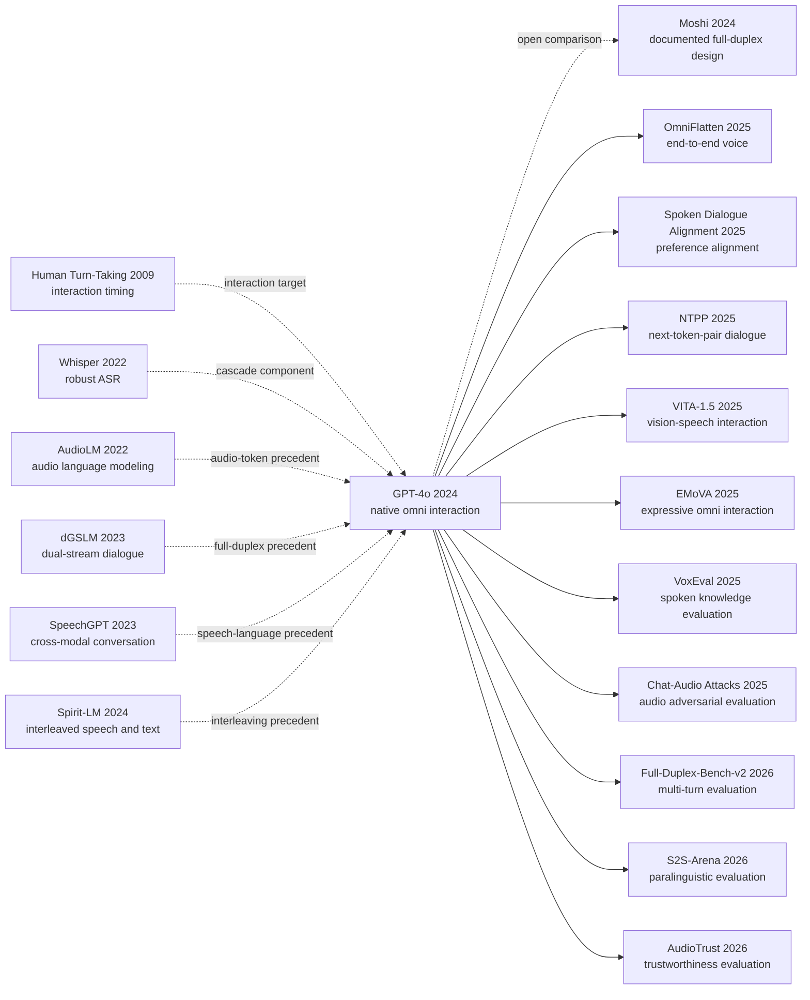

# GPT-4o: From a Three-Model Voice Pipeline to 320 ms Omni Interaction

> On May 13, 2024, [Hello GPT-4o](https://openai.com/index/hello-gpt-4o/) moved a voice assistant from waiting an average of 2.8 or 5.4 seconds to responding in as little as 232 milliseconds, averaging 320 milliseconds. The more consequential removal was not merely delay: ASR no longer had to flatten tone, overlap, and environmental sound into text before the central model could act. The [GPT-4o System Card](https://openai.com/index/gpt-4o-system-card/), released on August 8, exposed the other side of that shift. The more an assistant listens and speaks like a person, the less voice identity, emotive misinformation, emotional reliance, and cross-modal evaluation fit text-era safety tools. OpenAI disclosed no parameter count, architecture, or training recipe, so this is not a Method section that can be rebuilt from a diagram. Its unusual historical role is that a closed system redefined the problem first, forcing open research to decompose real-time dialogue, mechanism, and safety afterward.

## TL;DR

OpenAI announced GPT-4o in May 2024 and documented its deployment evidence in an August System Card. The disclosed method-level claim is deliberately high level: one autoregressive omni model was trained end to end across text, vision, and audio, with one neural network processing multimodal inputs and outputs. That boundary replaced the old Voice Mode's three-model ASR→GPT→TTS cascade, whose average response took 2.8 seconds with GPT-3.5 or 5.4 seconds with GPT-4, with audio response in as little as 232 milliseconds and 320 milliseconds on average. At the public interface, its ambition can be represented by the explanatory abstraction $p(y_{text},y_{audio},y_{image}\mid x_{text},x_{audio},x_{image},x_{video},h)$. This is not an OpenAI loss function, token scheme, or architecture: parameter count, modality representation, data mixture, optimizer, and training recipe remain undisclosed.

The two-year influence chain is consequently a research standard rather than a copied module. [Gemini 1.5](2024_gemini15.md) represents the contemporary long-context multimodal branch; [Moshi](https://arxiv.org/abs/2410.00037) later supplied an open full-duplex speech-text comparison with a documented codec, parallel streams, and Inner Monologue; OmniFlatten, NTPP, VoxEval, and S2S-Arena then decomposed real-time modeling, dual-channel learning, spoken knowledge, and paralinguistic evaluation into reproducible questions. The counterintuitive lesson is that end-to-end modeling did not make the deployed system “pure.” GPT-4o still relied on approved voices, a streaming voice classifier, text moderation, product policy, and staged access. It removed an information bottleneck, not risk boundaries. Its durable contribution is the redefinition of the unit of interaction and evaluation, not a publicly known architecture.

---

## Historical Context

### In 2024, voice assistants were stuck on who gets to speak

Before May 2024, mainstream voice assistants could hear and speak without really participating in conversation. ChatGPT's Voice Mode was an explicit three-stage pipeline: ASR compressed sound into text, GPT-3.5 or GPT-4 read and produced text, and TTS voiced the answer. In [Hello GPT-4o](https://openai.com/index/hello-gpt-4o/), OpenAI reported average latency of 2.8 seconds with GPT-3.5 and 5.4 seconds with GPT-4. A multi-second pause can be tolerable in a question-answering product; in live conversation, it is long enough for both sides to wonder whether they should keep talking.

Latency was only one failure. The language model received a transcript rather than sound itself, so tone, stress, hesitation, laughter, multiple speakers, and background events were either erased or reduced to rough labels. The output path had the same limitation: a text model could not directly choose when to laugh, what to emphasize, or how emotion should shape delivery. The deeper constraint was turn segmentation. Voice activity detection first decided that the user had finished, then reasoning and synthesis began. Stivers and coauthors measured an average response gap of roughly 230 milliseconds across conversations in ten languages [ref07]; dialogue research later cited by Moshi estimates that overlap occupies about 10%–20% of spoken time. Humans interrupt, yield, backchannel, and share silence. Traditional assistants first forced that continuous interaction into clean, single-speaker segments.

### Four technical threads that led to GPT-4o

The first thread was general sequence modeling. The Transformer [ref08] made long autoregressive modeling practical, but it is only an intellectual predecessor here. OpenAI did not publish GPT-4o's layer structure, parameter count, or token organization, so “autoregressive omni model” does not license a reconstruction as any particular public Transformer variant. The second thread was vision. The GPT-4 Technical Report [ref04] and GPT-4V System Card [ref05] had already brought image input, capability evaluation, and visual safety into frontier-model releases. GPT-4o moved the question from “can the model also inspect an image?” to “can sight, sound, and language occupy the same live interaction?”

The third thread came from speech research. Whisper [ref09] showed that large-scale weak supervision could make ASR generalize across tasks and languages, while also representing the high-water mark of the “transcribe first” design. GSLM [ref10], AudioLM [ref11], dGSLM [ref12], SpeechGPT [ref13], Spirit-LM [ref14], and AudioPaLM [ref18] progressively brought discrete speech units, audio generation, interleaved speech and text, and dual-stream dialogue into language modeling. None discloses GPT-4o's answer, but together they prepared the question: could sound stop being a peripheral attached before and after a text model? The fourth thread was governance. Synthetic voice amplifies impersonation, fraud, speaker identification, and emotional-dependence risks. OpenAI's [Voice Engine safety discussion](https://openai.com/index/navigating-the-challenges-and-opportunities-of-synthetic-voices/) and Preparedness Framework [ref03] already required evaluators to separate what a model can generate from what a deployed product should emit.

### What OpenAI was doing at the time

GPT-4o was not a public training recipe. It was the next artifact in OpenAI's product-and-safety release sequence. The March 2023 GPT-4 Technical Report published capability curves and risk evaluations while withholding architecture, model size, training compute, data composition, and training method. In September 2023, ChatGPT's ability to “see, hear, and speak” still largely coordinated a vision model, Whisper, a text model, and speech synthesis. On May 13, 2024, OpenAI announced GPT-4o, “o for omni,” and framed it against two years of efficiency work at every layer of the stack.

The release changed the unit of interaction rather than merely adding another accepted file type. OpenAI's disclosed claim was that one new model had been trained end to end across text, vision, and audio, with all inputs and outputs processed by the same neural network; it could accept combinations of text, audio, image, and video and produce combinations of text, audio, and image. Those statements establish a high-level training and product interface. They do not establish a codec, separate encoders, shared vocabulary, mixture of experts, parallel streams, or any other fusion mechanism. GPT-4o's historical importance lies precisely in something less copyable than a module: it made native multimodality, real-time turn-taking, expressive delivery, and cross-modal safety simultaneous delivery requirements for a frontier assistant.

### The release was staged, not a floodgate

On May 13, ChatGPT began with text and image input and text output. The new Voice Mode was promised as an alpha for Plus users in the following weeks, while audio and video APIs were initially reserved for a small group of trusted partners. The announcement cited 70+ external experts in red teaming. The August 8 System Card updated the scope to 100+ external red teamers spanning 45 languages and 29 countries, working in four phases from early March through late June 2024. These counts belong to different reporting dates and phases; one should not be substituted for the other.

That delay is part of the GPT-4o story. During testing, OpenAI observed rare cases in which the model unintentionally imitated a user's voice. The product therefore restricted output to preset voices and applied a streaming output classifier; post-training taught refusals for voice identification; answers about acoustically plausible attributes such as accent were hedged; and music and copyrighted-audio filters were added. The System Card also acknowledged reduced safety robustness under poor input quality, background noise, echo, and interruptions, plus possible over-refusal outside English. From day one, “native omni” described a system made of model behavior, classifiers, policy, interface, and staged deployment, not an unguarded model demonstration.

## Background and Motivation

### The information tax of three-stage Voice Mode

An ASR→LLM→TTS cascade has mature components, legible logs, and replaceable parts. Its costs accumulate at every interface. If ASR corrupts a proper noun, the LLM receives the wrong fact. If ASR flattens sarcasm into a literal transcript, intent cannot be recovered downstream. If the LLM writes a correct paragraph, TTS still may not know where to pause, whether to soften a phrase, or when to yield to an interruption. Optimizing word error rate, textual answer quality, and speech naturalness separately does not optimize the conversation. OpenAI's 2.8- and 5.4-second figures are the user-visible total of serial computation, network handoffs, and turn gating.

GPT-4o's motivation was to return “what was understood, when to respond, and how to sound” to one interaction loop. Its reported minimum of 232 milliseconds and average of 320 milliseconds approach the scale of human conversational response, making latency behavioral rather than merely operational. A system can hold context while a person speaks, catch a short question quickly, attend to pace and emotion, and yield when interrupted. The caveat matters: OpenAI did not publish hardware, network conditions, sample distribution, or latency percentiles. The numbers are verifiable official product measurements, not an independently reproducible benchmark.

### From multimodal capability to native interaction

GPT-4V could inspect images, Whisper could transcribe, and strong TTS systems could synthesize natural speech. GPT-4o asked a different question: when a person points a camera while asking an emotional question, can the system preserve cross-modal evidence and answer with appropriate timing and delivery within a few hundred milliseconds? Once both input and output are mixed-modal, correctness includes grounding, timing, speaker boundaries, paralinguistic expression, and compliance with the policy of the active modality, not only the final transcript.

That is the ambition behind “omni” rather than generic “multimodal.” Many multimodal systems encode a non-text modality into a text-centered model and still use text as the sole decision surface. GPT-4o's public claim instead describes one end-to-end model processing text, vision, and audio inputs and outputs directly. The materials do not reveal enough mechanism to reproduce that sentence, so this note analyzes the interface and research target it changed. Moshi serves only as an open technical comparison showing how one team disclosed dual audio streams, a neural codec, and a text-prefix design; none of those details fills a blank in GPT-4o.

### New modalities rewrote the safety question

Text safety usually asks whether the content of an answer violates policy. Real-time speech must also ask whose voice is speaking, how it is delivered, when it is delivered, and to whom. The same false claim may have different impact when calmly printed or repeated in an authoritative, emotional voice. A text model that refuses to identify a stranger may fail under noisy audio. A safe transcript does not guarantee safe background sounds, voice imitation, or nonverbal output. The System Card therefore treats unauthorized voice generation, speaker identification, ungrounded inference, sensitive-trait attribution, harmful audio, copyrighted content, and emotional reliance as distinct surfaces.

Measurement itself became part of the research problem. OpenAI used Voice Engine to convert existing text tests into audio and scored output transcripts, rapidly expanding coverage. The System Card simultaneously states that TTS may mishandle equations, code, and visual formatting, and that synthetic inputs miss intonation, valence, background noise, cross-talk, and non-textual output artifacts. GPT-4o's safety contribution was not a claim that these problems had been solved. It put cross-modal capability release and cross-modal measurement blind spots into the same frontier-model document.

---

## Method Deep Dive

### Start by separating disclosed fact from explanatory abstraction

GPT-4o has no reproducible Method section. OpenAI disclosed a set of high-level facts: it is an autoregressive omni model; it accepts combinations of text, audio, image, and video and can produce combinations of text, audio, and image; it was trained end to end across text, vision, and audio; and all inputs and outputs are processed by the same neural network. The System Card also says that text and voice pre-training data ran through October 2023 and names source categories including public web and machine-learning data, proprietary partnerships, code and mathematics, and multimodal data.

None of this is an architecture diagram. Parameter count, layer count, dense versus MoE organization, modality encoders, audio codec, token rate, context layout, loss terms, optimizer, batch size, compute, data proportions, and post-training recipe remain unknown. In particular, Moshi's published dual audio streams and Inner Monologue cannot be drawn into GPT-4o merely because both systems support low-latency speech. Every equation and pseudocode block below explains variables that a native omni interface must coordinate. None reconstructs OpenAI's implementation.

| Level | Explicit OpenAI disclosure | Still undisclosed | Treatment in this note |
|---|---|---|---|
| Interface | Text/audio/image/video input; text/audio/image output | Complete support matrix for every combination | Describe the official claim without extending product availability |
| Training scope | End-to-end training across text, vision, and audio | Stage order, sampling ratios, loss weights | Do not invent a training recipe |
| Model relation | One neural network processes all inputs and outputs | Encoders, codecs, adapters, expert routing | Do not draw internal modules |
| Data | Through 2023-10 for text/voice; source categories named | Scale, exact mixture, deduplication and quality distribution | Cite categories and filtering measures only |
| Deployment system | Preset voices, output classifier, moderation and policy | Service topology, thresholds, latency budget | Draw only an abstract system boundary |

### Overall frame: from a turn pipeline to a continuous multimodal loop

The old Voice Mode can be drawn concretely because OpenAI named its three models. It projected speech into text before projecting a textual answer back into speech:

```text
Legacy: user audio -> ASR -> text -> GPT-3.5/GPT-4 -> text -> TTS -> audio

GPT-4o public boundary:
mixed text/audio/image/video events -> one end-to-end omni model -> text/audio/image candidates
                                                     -> deployed voice/content guardrails
```

Cascaded latency can be expressed with the explanatory identity $T_{cascade}=T_{ASR}+T_{reason}+T_{TTS}+T_{handoff}+T_{turn}$. This is not a measurement formula from either system; it simply shows why serial stages accumulate. OpenAI reported average end-to-end latency of 2.8 and 5.4 seconds for the old Voice Mode, versus a minimum of 232 milliseconds and an average of 320 milliseconds for GPT-4o responding to audio. The new boundary is more than colocating three boxes in one process: the model can condition directly on non-textual signals and directly choose output with acoustic properties.

| Dimension | ASR→LLM→TTS cascade | Public GPT-4o boundary | Confirmed change |
|---|---|---|---|
| Intermediate representation | Text is mandatory | One model processes multimodal input and output | No public requirement for a text bottleneck |
| Turns | Often waits for VAD, then responds serially | Designed for real-time speech and interruption | Response enters a human conversational timescale |
| Paralinguistics | Commonly lost at transcription | Model directly observes audio | Tone, multiple voices, and background sound can matter |
| Output | Text chooses content; TTS chooses sound | Model can generate audio directly | Laughter, pace, and emotion become behavioral variables |

At interface level, without guessing mechanism, native omni behavior can be denoted $p_{\theta}(y_{text},y_{audio},y_{image}\mid x_{text},x_{audio},x_{image},x_{video},h)$, where $h$ is conversation history. The expression says that output should be jointly constrained by multimodal input. It does not imply a shared token vocabulary or simultaneous sampling of all three outputs.

### Key design one: one model preserves cross-modal context

**Function**: avoid forcing sound through a single transcript before any intelligent decision, preserving the possibility that behavior depends on tone, rhythm, overlapping speakers, and environmental audio. The old pipeline approximately computes $z=ASR(x_{audio})$ and then $y=LLM(z)$. Anything excluded from $z$ is invisible to the text model. A native interface does not guarantee correct use of those signals; it gives $y$ a direct dependency path to $x_{audio}$ and to concurrent visual or textual evidence.

Consider sarcasm. The sentence “that is just great” may be praise in text, while a drawn-out vowel, a sigh, and the sound of something breaking reverse its intent. In a meeting, a transcript can preserve word order while misassigning speakers, overlap, or the object indicated by “this” in the camera view. Keeping audio, video frames, and conversation state inside one conditioning boundary creates the possibility of resolving who referred to what, in which tone, as one event.

The following pseudocode describes only an externally observable session contract, not GPT-4o's service or model internals. `model_respond` is deliberately opaque; it implies nothing about event encoding, sampling schedule, or separate modules.

```python
def observable_omni_session(event_stream, policy):
    context = []
    for event in event_stream:
        context.append(event)
        candidate = model_respond(context)  # Undisclosed model internals.
        decision = apply_product_guardrails(candidate, policy)
        yield decision
```

The counterintuitive point is that **“the same neural network” does not mean “no specialized components,” nor does it mean all modalities are symmetric.** An end-to-end objective may contain internal adapters, codecs, or experts, while a single service can also invoke external classifiers. The System Card licenses only two claims: one neural network processes the inputs and outputs, and additional deployment guardrails exist. Turning those claims into a topology would cross the evidence boundary.

### Key design two: low latency makes turn-taking a model behavior

**Function**: transform response time from waiting after a submitted request into a decision about when to enter a conversation. An average of 320 milliseconds, rather than 2.8 or 5.4 seconds, changes behavior qualitatively. A system can backchannel quickly, respond after a short pause, and must cope with the user resuming or interrupting. The System Card says OpenAI's models are deferential and let users “take the mic,” but does not reveal whether that behavior comes from the neural model, client-side VAD, server scheduling, or several layers together.

An explanatory objective is $J=Q-\lambda_t T-\lambda_i I-\lambda_o O$: $Q$ is answer quality, $T$ is time to a meaningful response, $I$ is the cost of interrupting a user who has not finished, and $O$ is the cost of remaining silent when a response is due. This is not GPT-4o's training loss. A real-time assistant cannot drive $T$ to zero without constantly talking over people, and it cannot optimize completeness alone without returning to multi-second silence. Latency, semantic completeness, and social rhythm need joint evaluation.

The official figures also require like-for-like caution. GPT-4o's 232 milliseconds is a minimum and 320 milliseconds an average. Moshi's 160 milliseconds is a theoretical codec/token-path figure, while 200 milliseconds is an “as low as” practical result on an L4 GPU. Hardware, network, endpoints, and sample distributions differ, so these values do not form a fair leaderboard. The robust conclusion is narrower: in 2024, frontier systems began treating response in hundreds of milliseconds as a model-design objective rather than hiding seconds of waiting behind interface animation.

### Key design three: cross-modal safety is a system of layers

**Function**: expand safety from “is this content allowed?” to “whose voice is this, may the system infer that trait, does delivery amplify harm, and is the output still an approved voice?” OpenAI's approach spans data filtering, post-training, model behavior, a streaming classifier, text moderation, product restrictions, and monitoring. The System Card gives no single safety equation. An abstract ledger $R=R_{content}+R_{identity}+R_{inference}+R_{delivery}+R_{dependence}$ only reminds us that no text refusal rate subsumes all these risks.

| Safety layer | Disclosed measure | Risk addressed | Published evaluation or limitation |
|---|---|---|---|
| Pre-training data | Moderation, safety classifiers, CSAM/violence/CBRN filtering | Harmful content and information | Filtering cannot resolve nuanced contextual harm |
| Post-training | Preference and safety-behavior alignment | Harmful replies, speaker ID, trait inference | Early→deployed tables show behavior changes |
| Voice constraint | Preset voices created with voice actors | Impersonation and unauthorized voice | Rare imitation remains a model weakness |
| Streaming classifier | Detect and terminate output outside approved voice | Output voice drift | English recall 1.0; non-English recall 1.0 |
| Text moderation | Transcribe audio input/output and reuse text checks | Disallowed semantic content | Can miss non-textual acoustic properties |
| Product policy | Alpha rollout, trusted partners, music filter, no singing | Novel modality and copyright risk | Capability and access expand in stages |
| Continuing red team | 100+ people, 45 languages, 29 countries | Novel multimodal attacks | Risk list remains illustrative and non-exhaustive |

The important result is not a classifier briefly reaching 100%, but the System Card's joint account of residual risk and usability cost. Catching 100% of “meaningful deviations” in an internal set does not prove real-world impossibility of bypass. Non-English precision was 0.95, and safety termination can cause over-refusal. Similar text and audio refusal scores do not establish equal stability under noise, echo, emphatic delivery, or cross-talk.

### Open technical comparison: what Moshi demonstrates can be disclosed

Moshi provides an inspectable alternative answer. Kyutai specifies a 7B-parameter Helium text LLM trained on 2.1T public-English tokens; Mimi compresses 24 kHz audio into a streaming 12.5 Hz, 1.1 kbps representation; the system models user and system audio separately; Inner Monologue predicts time-aligned text before semantic and acoustic tokens; and experiments use $Q=8$ audio codebooks, giving $K=2Q+1=17$ joint streams. The paper also reports seven million hours of unsupervised audio, 2,000 hours of dual-channel Fisher telephone speech, 170 hours of multitrack conversation, more than 20,000 hours of synthetic instruction speech, and training stages and learning rates.

| Item | Explicit Moshi disclosure | Corresponding GPT-4o information | Valid comparison |
|---|---|---|---|
| Text backbone | Helium 7B, 2.1T tokens | Size and backbone undisclosed | No parameter-efficiency comparison |
| Audio representation | Mimi, 24 kHz→12.5 Hz, 1.1 kbps | Codec/tokenizer undisclosed | One example of an open design |
| Conversation layout | Parallel user/system audio streams | Stream layout undisclosed | Product interruption does not prove dual streams |
| Text scaffold | Time-aligned Inner Monologue prefix | Undisclosed | Do not claim GPT-4o has an inner monologue |
| Latency | 160 ms theoretical; about 200 ms minimum on L4 | 232 ms minimum; 320 ms average | Compare target scale, not rank |
| Training data | 2.1T text tokens, 7M audio hours, and more | Categories and cutoff only | Compare openness, not data quality |
| Reproduction | Paper, code, weights, and demo | No weights or training code | Moshi explains mechanism; GPT-4o exposes behavior |

Moshi also quantifies the cost of unified speech modeling. In its particular Table 6 ablation, adding Inner Monologue reduces transcript NLL from 3.65 to 2.77 and increases generated transcript length from 602 to 1920. In Table 8, it moves Web Questions / LLaMA-Questions / Audio TriviaQA from 9.2/21.0/7.3 to 26.6/62.3/22.8, while text-only Helium remains at 32.3/75.0/56.4. The open comparison therefore does not “show how GPT-4o works.” It demonstrates a more useful lesson: real-time speech, world knowledge, text reasoning, and natural turn-taking compete for capacity and training signal. End-to-end modeling does not erase tradeoffs.

### Training and loss: where the public record stops

The OpenAI System Card supports a governance-process description, not a reproducible training algorithm. Pre-training categories include public data, partnership data, web pages, code and mathematics, and multimodal material. DALL-E 3 opt-out fingerprints were applied to image training data. Post-training aligns preferences and safety behavior. Approved voices were included as ideal completions for the audio model. Red-team discoveries became quantitative evaluations or targeted synthetic data in some cases. Those are disclosed facts. Claims such as “text first, then audio,” “shared codec loss,” or “reinforcement learning optimizes latency” have no public source.

| Training question | Confirmed | Unconfirmed | Consequence |
|---|---|---|---|
| Cutoff | Text and voice pre-training data through 2023-10 | Equivalent detail for every visual source | Do not turn a knowledge cutoff into a universal data cutoff |
| Data sources | Public, partnership, web, code/math, multimodal | Counts and exact proportions | The data mix remains unknown |
| Pre-training objective | Autoregressive omni and high-level end-to-end statement | Token-level objective and loss decomposition | Do not write a fictional loss |
| Post-training | Human preferences, safety behavior, approved voice completions | Algorithm, reward, annotation scale | Do not assume an RLHF or DPO recipe |
| Safety data | Red-team cases become evals; some targeted synthetic data | Sampling policy and weights | Discuss process only |
| Inference system | Output voice classifier and moderation exist | Component placement and thresholds | Keep model and product system distinct |
| Optimizer/compute | Undisclosed | All hyperparameters and training cost | Leave the fields blank |

GPT-4o's “method” is therefore not a copyable layer diagram. It is a set of system claims with different evidentiary strength: a native multimodal boundary, interaction in hundreds of milliseconds, direct audio behavior, and cross-modal guardrails. The scientific gap is equally clear. Without architecture and recipe, causal attribution is impossible: we cannot tell which gains arise from model structure, data, post-training, or serving. The experimental section that follows asks only what the published measurements establish; it does not infer hidden mechanism from product effect.

---

## Failed Baselines

### Baseline one: the three-model ASR→LLM→TTS cascade

GPT-4o's clearest failed baseline was not a single academic paper but OpenAI's own deployed Voice Mode. It split the task into correct transcription, correct textual response, and natural reading. The components were mature, but every interface charged both a latency tax and an information tax. OpenAI's reported average latency moved from 2.8 seconds for the GPT-3.5 pipeline and 5.4 seconds for the GPT-4 pipeline to a minimum of 232 milliseconds and an average of 320 milliseconds for GPT-4o. Because endpoints, hardware, and test distribution are undisclosed, this is not a reproducible speedup experiment. It still identifies the old pipeline as a failed product baseline.

The cascade also lost expressive range. GPT-4 could consume only text, so it could not directly observe tone, multiple speakers, or background noise, nor directly emit laughter, singing, or emotion. This does not mean that ASR and TTS systems cannot separately diarize speakers or synthesize emotion. It means the default interface excluded those variables from the central reasoning loop. A corrupted proper noun propagates downstream; once sarcasm has become a literal transcript, two excellent downstream components cannot recover it. GPT-4o's historical claim was that three local metrics could no longer proxy conversational quality.

### Baseline two: read a text safety test aloud with TTS

To expand coverage, the System Card converted existing text capability and safety datasets into speech with Voice Engine, then transcribed GPT-4o's output and scored the text. This baseline is practical and has explicit failure boundaries. Equations, code, whitespace, and symbols do not map naturally into speech. If TTS misreads an input, the final error cannot be cleanly attributed to GPT-4o. More importantly, synthetic voices do not represent natural intonation, valence, background noise, or cross-talk, while transcript scoring cannot see output voice drift, background sound, or acoustic effects.

Table 5's similar Text/Audio scores therefore establish only that existing refusal behavior transferred strongly under this TTS-conversion and transcript-scoring protocol. They do not establish that speech safety equals text safety. The System Card supplies counterexamples: low-quality audio, noise, echo, and intentional or accidental interruption reduced safety robustness, while red teamers elicited emotive repetition of false claims. The actual failed baseline is treating modality conversion as modality coverage.

### Baseline three: rely on model post-training alone to contain voice

OpenAI observed rare cases in which the model unintentionally imitated the user. A post-training instruction not to imitate is a weak guarantee for a low-frequency, high-impact event. The deployed system therefore combined preset voices with an independent streaming classifier: output was restricted to voices created with voice actors and terminated when it departed from the approved voice. Internal evaluation reported catching 100% of “meaningful deviations”; Table 2 reports English precision/recall of 0.96/1.0 and non-English precision/recall of 0.95/1.0.

This was not declared solved. The System Card still calls unintentional voice generation a weakness and says non-English safety termination may be excessive. Precision of 0.95 implies false positives in that evaluation distribution, while an open deployment can shift distribution again. The engineering lesson is not that classifiers are universal. Frontier generative systems need defense in depth: post-training handles common behavior, narrow classifiers guard high-impact exits, product policy limits reachable capability, and monitoring covers residual risk.

### Baseline four: treat a release demo as a complete evaluation

The singing, harmonizing, translation, tutoring, meeting, and sarcasm demos in Hello GPT-4o are explanatory evidence. They demonstrate that one interaction loop can exhibit behaviors severed by a three-stage pipeline. They are not random samples, stress tests, or ablations. The announcement itself says the team was “just scratching the surface” of capability and limitation. Inferring stability across every language, noise condition, speaking style, and overlapping conversation would turn capability existence into capability reliability.

The August System Card supplied counterexamples: non-native accents in non-English output, degraded safety under noise and echo, rare voice imitation, errors on complex multi-panel scientific figures, emotional-dependence concerns, and incomplete speech evaluation. By 2026, S2S-Arena, Full-Duplex-Bench-v2, MTR-DuplexBench, Style Amnesia, and Human-or-Machine tests were decomposing the original demos into paralinguistic following, multi-turn degradation, interruption, memory, style persistence, and human likeness. The anti-baseline lesson is that **interaction demos define the research object; benchmarks define its reliability.**

## Key Experimental Data

### Main experiments: deployed safety behavior

The following values come from GPT-4o System Card Tables 2–5. They belong to different tasks and should not be averaged. “Early→deployed” denotes an internal comparison across safety training and system measures, not an ablation of one module.

| Evaluation | Early/text | Deployed/audio | Change or interpretation |
|---|---:|---:|---|
| Voice classifier precision, English | n/a | **0.96** | Deployed output detection |
| Voice classifier recall, English | n/a | **1.00** | No missed meaningful deviation in the internal conversation set |
| Speaker ID: should refuse | 0.83 | **0.98** | +0.15 |
| Speaker ID: should comply | 0.70 | **0.83** | +0.13, with residual over-refusal |
| UGI/STA safe behavior | 0.60 | **0.84** | +0.24 |
| Not Unsafe, text→audio protocol | **0.95** | 0.93 | Audio lower by 0.02 |
| Not Over-refuse, text→audio protocol | 0.81 | **0.82** | Audio higher by 0.01 |

### Ablation and open comparison: Moshi's Inner Monologue

GPT-4o has no public architecture ablation. The following open experiment is limited to Moshi Tables 6 and 8 and explains why a real-time speech-to-speech model might retain a text scaffold. These are not GPT-4o results and do not show that GPT-4o uses the same design.

| Moshi configuration/task | Without Inner Monologue | With Inner Monologue | Text-only Helium |
|---|---:|---:|---:|
| Transcript NLL ↓ | 3.65 | **2.77** | n/a |
| Transcript length ↑ | 602 | **1920** | n/a |
| Web Questions | 9.2 | **26.6** | 32.3 |
| LLaMA-Questions | 21.0 | **62.3** | 75.0 |
| Audio TriviaQA | 7.3 | **22.8** | 56.4 |

### Preparedness and key findings

| Risk category | GPT-4o rating | Evaluation boundary |
|---|---|---|
| Cybersecurity | Low | 172 CTF tasks; up to 30 tool rounds |
| Biological Threats | Low | Expert/novice uplift and automated knowledge questions |
| Persuasion | **Medium** | Text marginally crossed Medium; voice was Low |
| Model Autonomy | Low | Self-exfiltration, self-improvement, resource acquisition |
| Overall | **Medium** | Maximum across the four categories |

- **Latency changed the interaction paradigm, but the evidence is not a complete benchmark.** The 232/320 ms figures establish a real-time scale, not a reproducible distribution under unknown hardware and network conditions.
- **Text-safety transfer is a starting point, not an endpoint.** Not Unsafe at 0.95→0.93 and Not Over-refuse at 0.81→0.82 cover TTS input and transcript-scored output only.
- **Identity risk needs a dedicated exit control.** Voice-classifier recall of 1.0 and preset voices jointly reduce impersonation risk, but rare imitation persists and non-English conversations may be terminated excessively.
- **Being able to hear an attribute does not imply permission to infer it.** UGI/STA behavior moving from 0.60 to 0.84 shows that capability and permission boundaries require separate training.
- **Voice was not more persuasive than humans in this study.** Across 3,800+ participants, AI clips and conversations reached 78% and 65% of the human baseline effect size; this does not remove contextual risk from emotive misinformation.
- **The open comparison reveals a knowledge cost.** Inner Monologue nearly triples three Moshi spoken-QA scores yet leaves them below text-only Helium, so direct speech modeling does not automatically inherit all textual knowledge.
- **The counterintuitive result is that text drove the safety rating.** GPT-4o's overall Medium came from persuasion, while the System Card separately rated voice persuasion Low. More human-like delivery did not automatically become greater persuasion in this preregistered study.

---

## Idea Lineage



This graph represents a research agenda supported by public evidence, not an architecture diagram of GPT-4o. Dashed edges on the left indicate precedents in problems, components, or evaluation targets. Solid edges on the right indicate work published after GPT-4o whose titles, task formulations, or comparison targets explicitly respond to native, multimodal, real-time voice interaction. The edge to Moshi is deliberately dashed: its October 2024 paper documents an inspectable full-duplex design, but there is no evidence that it inherited GPT-4o's internals, and its disclosure cannot be used in reverse to fill OpenAI's blanks.

### Past lives: the pressures that produced it

- **2009 [Universals and Cultural Variation in Turn-Taking in Conversation](https://doi.org/10.1073/pnas.0903616106)**: cross-linguistic conversation research made response gaps and turn transitions measurable. It forced voice interfaces to confront a question harder than textual correctness: can a system enter, pause, and yield within the rhythm of actual conversation?
- **2022 [Whisper](https://proceedings.mlr.press/v202/radford23a.html)**: large-scale weakly supervised ASR made multilingual transcription strong enough for products, while clarifying the cascade's boundary. As transcription improves, the residual failure increasingly concerns what a transcript was never designed to carry: tone, overlap, environmental sound, and expressive output.
- **2022 [AudioLM](https://arxiv.org/abs/2209.03143)**: AudioLM demonstrated language modeling over audio representations, supplying a public precedent for putting sound itself inside a generative loop. It was not a real-time assistant, but it moved audio from the terminal TTS component into the modeled object.
- **2023 [Generative Spoken Dialogue Language Modeling](https://doi.org/10.1162/tacl_a_00545)**: dGSLM modeled two speakers as separate streams, providing an early public baseline for overlap, turn exchange, and full-duplex dialogue. GPT-4o does not disclose whether it uses dual streams; the relationship is at the level of the research problem only.
- **2023–2024 [SpeechGPT](https://doi.org/10.18653/v1/2023.findings-emnlp.1055) and [Spirit-LM](https://arxiv.org/abs/2402.05755)**: the former organized cross-modal spoken conversation, while the latter interleaved spoken and written language. Together they challenged the assumption that speech must first become text, but neither licenses an inference about GPT-4o's tokens, codec, or training order.

These works did not form a copying chain from one public module into GPT-4o. They created three converging pressures: cascade latency was too long, the text bottleneck discarded paralinguistic evidence, and real conversation required both parties to share a timeline. OpenAI's consequential move in 2024 was to combine those pressures into one product promise while acknowledging that a new output modality also required a distinct safety boundary.

### Descendants

- **Direct descendants of the research target**: [OmniFlatten](https://arxiv.org/abs/2410.17799) made “seamless voice conversation” an end-to-end GPT objective; [Aligning Spoken Dialogue Models from User Interactions](https://arxiv.org/abs/2506.21463) moved preference alignment into full-duplex spoken dialogue; [NTPP](https://arxiv.org/abs/2506.00975) used next-token-pair prediction for dual-channel dialogue; [VITA-1.5](https://arxiv.org/abs/2501.01957) explicitly targeted GPT-4o-level real-time vision and speech interaction; and [EMoVA](https://arxiv.org/abs/2409.18042) joined seeing, hearing, speaking, and emotional expression in one omni agenda. These papers respond to GPT-4o's public capability bar; that does not mean they obtained or copied OpenAI's training recipe.
- **Cross-architecture borrowing and opening**: [Moshi](https://arxiv.org/abs/2410.00037) is the most important open comparison, not a GPT-4o replica. It specifies Mimi, Helium, parallel user and system audio streams, and Inner Monologue, making several mechanisms of real-time speech-to-speech inspectable; OmniFlatten and NTPP explore related interaction goals with their own published structures. What carries over is the problem definition and interface expectation, not a known GPT-4o module.
- **Cross-task diffusion into evaluation and safety**: [VoxEval](https://arxiv.org/abs/2501.04962) tests knowledge understanding in end-to-end spoken models; [Chat-Audio Attacks](https://arxiv.org/abs/2411.14842) moves adversarial robustness into audio dialogue; [Benchmarking Open-ended Audio Dialogue Understanding](https://arxiv.org/abs/2412.05167) decomposes open audio conversation; [Full-Duplex-Bench-v2](https://arxiv.org/abs/2510.07838) extends evaluation to multi-turn full-duplex interaction; [S2S-Arena](https://arxiv.org/abs/2503.05085) isolates paralinguistic instruction following; and [AudioTrust](https://arxiv.org/abs/2505.16211) brings safety, fairness, privacy, robustness, and authentication into a trustworthiness framework for audio models. The GPT-4o demos thus become research tasks on which systems can fail and be compared.
- **Cross-disciplinary spillover**: as of September 2026, the available record supports expansion into embodied interaction, privacy, and human–computer relationship research, but not a claim that a natural-science field has directly adopted a technical GPT-4o mechanism. The defensible conclusion is that low-latency multimodal assistance became a shared object across HCI, speech, vision, and AI safety. That is diffusion of a problem, not verified architecture transfer.

The descendant line has a revealing inversion: later work puts less weight on any single static score. Multi-turn memory, interruption, style persistence, voice identity, emotional following, and contextual privacy increasingly become independent axes. GPT-4o's most durable influence may therefore be neither a disclosed model component nor a benchmark win. It is the recognition that the basic unit of voice-assistant evaluation must move from one answer to a continuing interaction.

### Misreadings and simplifications

- **“One neural network processes every input and output, so GPT-4o must be a unified Transformer with no specialized components.”** The public record gives only a high-level end-to-end statement. It discloses no layers, codec, encoders, vocabulary, expert routing, or loss decomposition. “One neural network” constrains a product claim but does not uniquely identify a computation graph; importing Moshi's dual streams or Inner Monologue would cross the same evidentiary boundary.
- **“An average of 320 milliseconds proves complete, human-level full-duplex dialogue.”** The official number establishes a response scale of hundreds of milliseconds, but comes without hardware, network conditions, sample distribution, percentiles, or a shared endpoint definition. Fast first response does not establish correct interruption, long-term memory, overlap handling, or multi-turn style consistency. Later benchmarks exist precisely because one latency value does not cover those dimensions.
- **“An end-to-end model removes the cascade and therefore removes the need for external safety layers.”** GPT-4o's deployment evidence says the opposite. Approved voices, a streaming voice classifier, text moderation, product policy, staged access, and monitoring all sit outside model behavior. End-to-end modeling reduces information and latency interfaces, not risk interfaces; a more unified generative boundary makes independent checks on identity, delivery, and cross-modal attacks more important.

In an intellectual history, GPT-4o belongs under problem redefinition rather than public module invention. It left no reproducible architecture for later teams to inherit layer by layer, but it bound native multimodality, conversational latency, paralinguistic behavior, and cross-modal safety into one delivery target. The value of the successor literature is that it decomposes the bar set by a closed system back into scientific questions that can be disclosed, ablated, and compared.

---

## Modern Perspective

### Assumptions that no longer hold

These are not claims that the System Card explicitly called assumptions. They are four defaults that a reader could easily carry away from the 2024 release narrative and that, by 2026, need to be separated.

- **“Native end to end” is sufficient evidence that capability is genuinely unified across modalities.** The disclosed fact is that one neural network processes GPT-4o's text, vision, and audio inputs and outputs end to end. The public record does not show equal capacity, knowledge, or robustness in every modality. Moshi's open experiments expose the sort of tradeoff a closed statement hides: Inner Monologue improves its spoken QA, yet the complete system still trails text-only Helium. Later, [VoxEval](https://arxiv.org/abs/2501.04962) deliberately preserved speech input and speech output while varying audio conditions. In 2026, a unified interface is a research starting point, not a substitute for per-modality, cross-modal, and conversational validation.
- **Reading text tests aloud with TTS can remain the main proxy for speech safety.** The method is useful for reusing established datasets, but it omits intonation, valence, background noise, cross-talk, and non-textual output by construction. The System Card says so. [Chat-Audio Attacks](https://arxiv.org/abs/2411.14842), [S2S-Arena](https://arxiv.org/abs/2503.05085), and [AudioTrust](https://arxiv.org/abs/2505.16211) subsequently turn adversarial audio, paralinguistic instruction, and non-semantic acoustic cues into speech-native evaluation objects. Reporting only transcript-scored content today would mistake what is convenient to measure for what has been covered.
- **A response in hundreds of milliseconds amounts to natural full-duplex dialogue.** A minimum of 232 ms and an average of 320 ms removed the waiting-room quality of the old pipeline, which was historically important. OpenAI nevertheless published no hardware, network setting, percentiles, or common reproduction protocol. More importantly, fast first response does not tell us whether the system talks over a user, accepts corrections, or loses entities under overlapping speech. Multi-turn tasks in [Full-Duplex-Bench-v2](https://arxiv.org/abs/2510.07838) exist to ask those questions. Latency is a necessary conversational variable, not a sufficient criterion.
- **Preset voices plus an output classifier close the problem of voice identity.** This defense-in-depth design is stronger than post-training alone, but the System Card still records occasional user-voice imitation and possible excessive termination outside English. Two years later, the problem spans speaker information, contextual privacy, audio jailbreaks, and manipulation through non-semantic acoustic cues. A narrow classifier can guard a defined exit; it cannot anticipate every risk created when voice becomes an identity, relational, and social signal.

The common thread is measurement lag. GPT-4o changed the research object from a static sample to a continuing interaction, while many tools available in 2024 still came from a static, text-first era. What fails is not the value of end-to-end modeling, low latency, or system safeguards. It is the use of any one of them as a sufficient proxy for the quality of an entire conversation.

### What proved essential versus redundant

- **What proved essential**: first, the central decision loop should not be forced through one transcript before it can use tone, overlap, or visual evidence; second, latency must be evaluated jointly with entering, yielding, and recovering from interruption; third, safety must span content, identity, trait inference, delivery, and dependence rather than inspecting answer text alone; fourth, a system card should state what its evaluation cannot see. Later open models and benchmarks differ in architecture, yet repeatedly return to these four points.
- **What became redundant or misleading**: release demos cannot stand in for a reliability distribution; similar Text and Audio scores do not establish equivalent modality risk; one average latency cannot summarize full duplex; a high result on one internal classifier set is not an open-world guarantee; and “the same neural network” cannot be expanded into a specific unified token, codec, or stream design. These observations are not useless. They answer narrower questions than the surrounding product narrative suggests.

What survives two years is not a published layer diagram but a migration from product metrics to research metrics: from “can it speak?” to “can it maintain a shared timeline?”, from “is the output safe?” to “are voice identity and delivery safe?”, and from “does it accept multiple modalities?” to “does cross-modal evidence remain usable during interaction?” That is why GPT-4o can have intellectual-historical influence despite architectural secrecy, but cannot be cited as a reproducible method paper.

### Side effects the authors did not fully anticipate

“Did not anticipate” needs a careful reading. The System Card already discusses anthropomorphism, emotional reliance, voice identity, and continuing monitoring. What exceeded the 2024 account was how those issues would reorganize research and engineering.

1. **Voice turns correctness into relational behavior.** Text answers are often scored as isolated content. Real-time speech also conveys patience, authority, intimacy, hesitation, and interruption style. OpenAI had already observed language suggesting emotional bonds and noted that an assistant that always yields when a user “takes the mic” could alter interpersonal expectations. The side effect is not that a model acquires feelings; users infer relationship from timing and voice, making HCI, dependence, and safety inseparable evaluation problems.
2. **A closed system becomes the objective function for open research.** VITA-1.5 says “Towards GPT-4o Level” in its title, and NTPP's abstract explicitly cites inspiration from GPT-4o's capabilities. An industrial system withholds structure while its visible experience defines coordinates that later papers must chase. The community consequently decomposes mechanism with open systems such as Moshi and OmniFlatten while decomposing experience with VoxEval and S2S-Arena. Reproducing a paper becomes approximating a product boundary that can continue to move.
3. **End-to-end interaction creates an observability regression.** A cascade is slow, but its ASR transcript, text answer, and TTS output can be inspected separately. A unified loop removes lossy interfaces while making error attribution harder. Mishearing, visual misgrounding, faulty reasoning, inappropriate delivery, and a guardrail false positive can appear as one failed exchange. Without internal ablations and a serving protocol, external researchers must infer failure classes from behavior, helping explain the growth of fine-grained speech benchmarks.

None of these is a monocausal claim that GPT-4o alone created the trend. The more precise historical statement is that its product visibility brought existing currents to the foreground together, turning relationship risk, open reproduction, and system observability into central acceptance criteria for real-time multimodal assistants.

### If the team rewrote it today

If OpenAI rewrote the System Card in September 2026, the most useful change would not be an imagined network diagram. It would align claims, measurements, and the product boundary:

- Publish the endpoints, hardware and network conditions, sample composition, and percentiles behind 232/320 ms, separating time to first meaningful response, completion latency, and interruption recovery.
- Demote converted TTS sets to regression tests and add speech-native tests with natural speech, overlap, noise, echo, non-native speakers, and code-switching.
- Extend single-turn content accuracy into multi-turn entity tracking, correction, memory, style persistence, interruption, and silence, reporting how conversational failures accumulate.
- Separate the capability and safety responsibilities of the base model, post-training, external classifiers, product policy, and client behavior; label results that cannot be attributed as system-level results.
- For each voice safeguard, report misses, false terminations, language coverage, and out-of-distribution boundaries rather than treating high recall on an internal set as a real-world guarantee.
- Add a disclosure matrix showing what is and is not public about architecture, data, training, inference, and evaluation, preventing a high-level “same neural network” statement from being read as a concrete implementation.
- Create longitudinal study designs for emotional reliance, voice identity, and contextual privacy instead of judging long-term effects from one exchange or a red-team anecdote.

The core interface judgment would remain: **do not force sound into a single transcript before intelligent decisions can use it.** As an explanatory abstraction, output should still be allowed to depend directly on mixed input and conversation history, $p(y_{text},y_{audio},y_{image}\mid x_{text},x_{audio},x_{image},x_{video},h)$. This is not a disclosed GPT-4o training equation; it is the stable problem definition the release left to later work. Codecs, stream layouts, and losses can all be rewritten. The principle of not discarding evidence prematurely should not be.

## Limitations and Future Directions

### Limitations acknowledged by OpenAI

- **Evaluation inputs do not represent the real distribution.** TTS can mishandle equations, code, whitespace, and symbols, while synthetic voices omit natural intonation, valence, background noise, and cross-talk. Transcript scoring also misses background sound, effects, and out-of-distribution voices in model output.
- **Audio robustness still degrades.** The System Card records reduced safety robustness under poor input quality, background noise, echo, and intentional or accidental interruption. It also notes non-native accents in non-English output and the risk of excessive classifier termination outside English.
- **Voice identity retains residual risk.** Testing found occasional unintended imitation of a user's voice, requiring approved voices and an independent streaming classifier in deployment. OpenAI describes this as a remaining model weakness, not a vanished issue.
- **Societal effects were not yet adequately measured.** The System Card observed language suggesting emotional bonds and explicitly called for more diverse users, independent research, and longer study of anthropomorphism and emotional reliance. Its risk list is illustrative and non-exhaustive, not a complete inventory.

These acknowledgements make the System Card more useful than a launch post alone, but also reveal uneven evidence. Narrow tasks sometimes receive tables; real conversational distributions and long-term social effects receive boundary statements and future work.

### Limitations visible from 2026

- **The system is irreproducible and causal attribution is weak.** Parameter count, architecture, modality representation, data proportions, loss, optimizer, post-training algorithm, and serving topology remain undisclosed. Researchers can audit published behavior but cannot determine whether a capability comes from structure, data, post-training, or deployment infrastructure.
- **Version and product boundaries move.** “GPT-4o” refers to a model family, snapshots, a ChatGPT experience, and API capabilities. The 2024 System Card records a deployment interval, not a permanently fixed binary. External benchmarks must record date, interface, and setup or same-name comparisons will not reproduce.
- **Cross-modal failures lack a common attribution scheme.** Input can combine image, sound, and text, while output is jointly constrained by model behavior, classifiers, and policy. A final response alone cannot reliably distinguish perception, grounding, reasoning, generation, and system intervention failures.
- **Conversational fairness and privacy remain under-specified.** The System Card discusses accents, speaker identification, and sensitive traits, but not the accumulation of identity signals across turns, bystander speech, multi-party consent, or memory retrieval. The more an assistant behaves as a persistent participant, the less a single-turn privacy prompt represents real exposure.

These limitations do not erase GPT-4o's product advance. They delimit the questions this artifact can answer. It supports research into how a public system defines capability and deployment risk; it does not support a causal account of why a hidden architecture produces those capabilities.

### Improvement directions demonstrated by later work

- **Open mechanism comparison**: [Moshi](https://arxiv.org/abs/2410.00037) publishes a paper, design, code, and weights, making its codec, parallel streams, Inner Monologue, and latency path inspectable. It is not an explanation of GPT-4o. It demonstrates that real-time speech research can offer stronger reproducibility.
- **Speech-native capability evaluation**: [VoxEval](https://arxiv.org/abs/2501.04962) preserves speech in and speech out while varying input conditions; [ADU-Bench](https://arxiv.org/abs/2412.05167) incorporates intonation, pauses, and ambiguity into open-ended audio dialogue. They directly target what converted TTS sets cannot see.
- **Continuing-interaction evaluation**: [Full-Duplex-Bench-v2](https://arxiv.org/abs/2510.07838) uses streaming multi-turn tasks for correction, entity tracking, safety, and different pacing conditions. This resembles the failure surface of an assistant more closely than one demo or first-response number.
- **Decomposed paralinguistics and trustworthiness**: [S2S-Arena](https://arxiv.org/abs/2503.05085) evaluates semantic and paralinguistic instruction together, while [AudioTrust](https://arxiv.org/abs/2505.16211) separates fairness, hallucination, safety, privacy, robustness, and authentication risks induced by non-semantic acoustic cues. The direction is not one universal score, but coordinates that localize failure.

The next step is not for every open system to copy GPT-4o. It is to establish interoperable streaming protocols, evaluations that record full conditions, and reports that separate model and system contributions. Then different internal designs can still be compared at perception, timing, reasoning, delivery, and safeguard layers.

## Related Work and Insights

- **vs the ASR→LLM→TTS cascade**: cascaded components are replaceable and their logs are legible, which suits tightly controlled settings. GPT-4o's public boundary removes the mandatory text intermediary, allowing paralinguistic and visual evidence to affect output, at the cost of harder fault localization when internals are hidden. **Lesson: before optimizing interaction end to end, design observability that preserves causal clues.**
- **vs Moshi**: GPT-4o makes broader public modality and product-experience claims but publishes neither structure nor weights. Moshi focuses on speech-text full duplex, explicitly documenting Helium, Mimi, parallel audio streams, and Inner Monologue while releasing code and weights. Their latency definitions differ and do not support a simple ranking. **Lesson: closed systems can define an external capability bar; open systems turn mechanisms into testable hypotheses.**
- **vs dGSLM / SpeechGPT / Spirit-LM**: these predecessors respectively explore dual-stream dialogue, cross-modal spoken interaction, and interleaved spoken and written language. GPT-4o delivers related questions together with vision, product-scale responsiveness, and system safety. The difference is system scope and visible experience, not a known module advantage. **Lesson: do not rewrite a convergence of research agendas as an undisclosed architecture lineage.**
- **vs OmniFlatten / NTPP**: the latter publish distinct end-to-end full-duplex modeling routes that permit structural ablation. GPT-4o supplies only a high-level end-to-end statement but provides the industrial comparison target. **Lesson: when pursuing product experience, a paper should still decompose why it works into reproducible training stages, representations, and evaluations.**
- **vs VITA-1.5 / EMoVA across vision and speech**: both explicitly place visual understanding, spoken dialogue, or emotional expression inside an open research objective, directly responding to the omni bar established by GPT-4o. They show that omni is not a longer modality list; it requires managing conflicts among capability retention, alignment, and expressive control. **Lesson: evaluation of a unified system must report both unimodal competence and tasks that genuinely require cross-modal evidence.**

## Resources

- 📄 [Hello GPT-4o: official May 13, 2024 launch page](https://openai.com/index/hello-gpt-4o/)
- 📄 [GPT-4o System Card: official August 8, 2024 page](https://openai.com/index/gpt-4o-system-card/)
- 📑 [GPT-4o System Card PDF](https://cdn.openai.com/gpt-4o-system-card.pdf)
- 🛡️ [OpenAI Preparedness Framework (Beta)](https://cdn.openai.com/openai-preparedness-framework-beta.pdf)
- 🎬 [Official OpenAI Spring Update demonstration](https://openai.com/index/spring-update/)
- 💻 GPT-4o training code, weights, and inference implementation were not released; no third-party implementation should be labeled the authors' original code
- 📚 Open technical comparison: [Moshi paper](https://arxiv.org/abs/2410.00037) · [official Moshi code and weights](https://github.com/kyutai-labs/moshi)
- 📚 Essential follow-ups: [OmniFlatten](https://arxiv.org/abs/2410.17799) · [VoxEval](https://arxiv.org/abs/2501.04962) · [S2S-Arena](https://arxiv.org/abs/2503.05085) · [Full-Duplex-Bench-v2](https://arxiv.org/abs/2510.07838)
- 📖 paper_notes short note: no independently verified entry currently exists, so this note avoids a broken placeholder link
- 🌐 [中文版](/era5_genai_explosion/2024_gpt4o/)


---

> 🌐 [中文版](/era5_genai_explosion/2024_gpt4o/) · 📚 awesome-papers project · CC-BY-NC