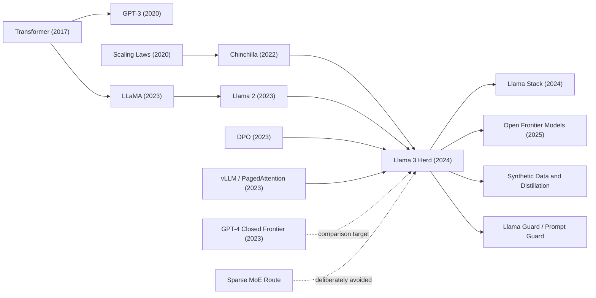

# Llama 3 Herd - An Engineering Blueprint for Open Frontier Models

> In July 2024, Meta paired a 92-page technical report with downloadable frontier-scale model weights: [arXiv:2407.21783](https://arxiv.org/abs/2407.21783). The surprising part of Llama 3 was not merely the 405B-parameter number. It was the choice to describe a frontier system as an engineering stack: 15.6T tokens, a 128K context window, up to 16K H100 GPUs, SFT/RS/DPO post-training, Llama Guard 3, FP8 inference, and unreleased vision and speech adapters. The paper made an uncomfortable question concrete: does frontier capability have to live behind a closed API, or can open-weight models become serious infrastructure?\n

## TL;DR

Meta AI's Llama Team released *The Llama 3 Herd of Models* in 2024 not as a single-model victory lap, but as an engineering blueprint for open-weight frontier AI. The language backbone remains a dense decoder-only Transformer trained with the familiar next-token objective $\mathcal{L}=-\sum_t \log p_\theta(x_t\mid x_{<t})$, yet the system around it changes the historical meaning of an open release: a 405B-parameter flagship model trained on 15.6T text tokens with roughly $3.8\times10^{25}$ FLOPs, extended from 8K to 128K context, aligned through SFT, rejection sampling, and DPO, shipped with Llama Guard 3 and inference optimizations such as FP8. The failed baseline it displaced was not one model so much as an assumption: that open-weight models could be useful, cheap, and influential, but not credibly close to closed frontier APIs. In the paper's Table 2, Llama 3 405B reaches 87.3 on MMLU 5-shot, above GPT-4(0125)'s 85.1, though still below GPT-4o's 89.1 and Claude 3.5 Sonnet's 89.9.

Historically, it extends the open-weight shock of [Llama 1 (2023)](2023_llama.md) and the chat/safety recipe of Llama 2, then feeds directly into the later Qwen, DeepSeek, Mistral, Llama Stack, synthetic-data, distillation, and open-safety-tool ecosystems. The hidden lesson is that Llama 3's openness is powerful but deliberately bounded. Meta released weights, evaluations, safety classifiers, ecosystem tools, and many training details; it did not release the full data pipeline or a reproduction script for 405B pretraining. That makes the paper a milestone in open model history and a reminder that downloadable weights are not the same thing as full scientific reproducibility.

---

## Historical Context

### From the Llama Leak to the Open-Weight Race

The history of Llama 3 begins with LLaMA in February 2023. Meta originally positioned LLaMA as a research-access model family, ranging from 7B to 65B parameters, with a simple goal: use higher-quality data and longer training to make smaller models stronger under realistic inference budgets. The event that changed the field was not any single benchmark in the paper, but the external circulation of the weights. Researchers, individual developers, and small companies suddenly had access to a foundation model strong enough to adapt on their own hardware or rented GPUs. LoRA, QLoRA, Alpaca, Vicuna, llama.cpp, GGUF, vLLM, and related tools grew through that opening. The open-model ecosystem shifted from “download the paper's code” to “download weights, fine-tune, quantize, deploy, and serve.”

Llama 2 in July 2023 institutionalized that path. It released pretrained and chat models, added a more systematic safety evaluation, and offered a commercial-use license, making it practical to treat open-weight models as product infrastructure. At the same time, closed APIs still held the capability frontier. GPT-4 had already redefined reasoning, coding, tool use, and multimodal expectations in 2023, while Claude and Gemini were catching up quickly. The open community could iterate rapidly at 7B, 13B, 34B, and 70B scales, but few people believed open weights would soon approach the best closed frontier systems.

### The Closed-Frontier Pressure of 2024

By the first half of 2024, frontier-model competition was accelerating. GPT-4o pushed multimodal interaction and low-latency experience toward mainstream users. Claude 3.5 Sonnet delivered unusually strong practical performance in coding, reasoning, and writing. Google Gemini continued to emphasize long context and multimodality. For developers, the strongest capabilities were still mostly accessed through APIs; for enterprises and research organizations, cost, data boundaries, deployment control, and auditability became increasingly important. The appeal of open models was not simply that they were cheap. It was control: local or private-cloud deployment, fine-tuning, distillation, custom safety policy, and less need to send sensitive data to an external service.

In that context, Llama 3.1 405B had a clear meaning. It was not the first open-weight large model, nor the first model above 100B parameters. Its importance was that Meta tried to push open weights into frontier-adjacent capability. The paper claims that 405B approaches GPT-4, GPT-4o, and Claude 3.5 Sonnet on many tasks, and Meta released both pretrained and post-trained versions. This moved the open-model target line from “near GPT-3.5 or a mid-tier closed model” to “directly compared with flagship closed systems in the same table.”

| Time | Event | Pressure on Llama 3 |
|---|---|---|
| 2023-02 | LLaMA release ignites open-weight ecosystem | Proved open weights could create massive external innovation |
| 2023-03 | GPT-4 release | Redefined the closed frontier capability ceiling |
| 2023-07 | Llama 2 release | Made open weights commercially usable |
| 2024-05 | GPT-4o release | Made multimodal and low-latency experience a new standard |
| 2024-07 | Llama 3.1 / 405B release | Put open weights in direct competition with frontier closed models |

### Meta's Counterintuitive Choice: Dense Rather Than MoE

Another part of the 2024 context was the attraction of sparse mixture-of-experts models. MoE lets a model have a large total parameter count while activating only a subset of experts per token, reducing inference compute. Mixtral had already shown that MoE could be competitive in open models, and later DeepSeek systems would push that route further. By intuition, if Meta wanted to train a 405B-scale model, MoE seemed like the obvious path.

Llama 3 chose a dense Transformer instead. The paper's argument is not that dense models are always superior, but that complexity must be managed. Meta had to handle 15.6T tokens, up to 16K H100 GPUs, 128K context, post-training, safety, tool use, multilinguality, inference quantization, and an open release. MoE would have introduced routing, load balancing, expert parallelism, inference-service complexity, and extra training-stability risks. Llama 3's engineering philosophy was to keep the core language model as simple as possible, then manage complexity in data, post-training, infrastructure, and system components.

That choice makes Llama 3 read like an engineering manifesto. Frontier capability does not have to come from the flashiest architecture. It can come from better data, predictable scaling, stable training, and repeated post-training. The paper's repeated emphasis on “data, scale, and managing complexity” is a deliberate shift away from single architecture novelty and toward the full production system.

### What the Paper Was Really Trying to Prove

The first thing *The Llama 3 Herd of Models* tried to prove was that open-weight models could enter the frontier-model conversation. Table 2 compares Llama 3 8B, 70B, and 405B with Gemma, Mistral, Mixtral, GPT-3.5, Nemotron, GPT-4, GPT-4o, and Claude 3.5 Sonnet. That table is technical and political at the same time: it tells developers that open models are no longer only low-cost substitutes for closed models, but systems that can compete directly on several tasks.

The second thing it tried to prove was that a frontier model should be understood as a system, not as bare weights. The Llama 3 paper covers pretraining data, model architecture, scaling laws, 4D parallelism, training interruptions, post-training data, DPO, tool use, safety, Llama Guard 3, FP8 inference, and multimodal adapters. It discloses more engineering detail than many closed technical reports, but it does not reach full reproducibility. That middle position is itself a marker of the 2024 AI industry: open weights became much stronger, while full training recipes remained in the hands of a few very large labs.

## Background and Motivation

### Three Levers: Data, Scale, and Complexity

Llama 3's motivation can be reduced to three levers. Data is the first. Llama 2 used roughly 1.8T tokens; Llama 3 405B used 15.6T text tokens, with a data mix spanning general knowledge, math/reasoning, code, and multilingual material. The paper emphasizes not only quantity, but cleaning, deduplication, PII and adult-content filtering, model-based quality classifiers, code/math extraction, multilingual quality ranking, and dynamic data-mix adjustments during training.

Scale is the second lever. The 405B choice came from scaling-law extrapolation rather than simply making the model larger. The paper trains multiple smaller models at smaller FLOP budgets, fits compute-optimal token-count relations, and further predicts downstream task performance. The final 405B model is described as close to compute-optimal under Meta's budget, while the 8B and 70B models are deliberately trained longer than compute-optimal because their practical constraint is inference cost.

Complexity management is the third lever. Llama 3 does not hand every problem to a more complex architecture. It layers the system: a dense backbone for stable scaling, data pipelines for knowledge and quality, 4D parallelism for feasible training, SFT/RS/DPO for usability, Llama Guard and Prompt Guard for system safety, and FP8 plus pipeline inference for deployment cost. That motivation is more industrial than “we propose a new architecture,” but it better matches how frontier models were actually built in 2024.

### Why It Is Called a Herd

The word “herd” in the title matters. This is not one Llama 3 model, but a group of models: 8B, 70B, and 405B; pretrained and instruct; the April Llama 3 release and the July Llama 3.1 release; short-context and 128K long-context variants; base language models and safety classifiers; plus image, video, and speech experiments that were not broadly released. The name signals that Meta wanted to describe a model family, not a single SOTA point.

The model-family framing resolves a practical tension. The 405B model is powerful but costly to serve; 8B and 70B are deployable but need quality transfer from the flagship and the post-training loop. Llama 3 treats 405B as a flagship product, a data generator, a distillation source, an alignment reference, and an ecosystem anchor. Later open-model ecosystems followed the same logic: large models explore the capability frontier, smaller models spread into applications, and safety plus tool components make the models usable in real systems.

### Open Release as Part of the Method

Llama 3 also has a non-purely-technical motivation: to show that open release can accelerate innovation. Meta's blog and paper repeatedly argue that open weights let developers customize, fine-tune, distill, deploy privately, and build governance around their own safety components. This inverts the commercial logic of closed APIs. Closed models offer strong capability and unified service; open models offer control and modifiability.

That openness is bounded. The Llama 3 GitHub repository provides download entry points, inference examples, model cards, and use policies; it does not provide the full pretraining code and data. The paper discloses many training and evaluation details, but it does not let an external team reproduce 405B step by step. Its motivation is closer to “open-weight frontier system” than to “fully open scientific experiment.” That boundary is essential to judging its historical position accurately.

---

## Method Deep Dive

### Overall Framework: Pretraining, Long Context, Post-Training, Release

Llama 3 did not win through a single flashy new module. Its core method is to place a stable dense decoder-only Transformer inside a full industrial pipeline: next-token pretraining on roughly 15.6T text tokens, continued long-context pretraining from 8K to 128K context, several rounds of SFT, rejection sampling, and DPO post-training, and finally release as a system with Llama Guard 3, Prompt Guard, Code Shield, FP8 inference, and Llama Stack.

The pretraining objective is ordinary. Given a token sequence $x_1,\dots,x_T$, the model maximizes autoregressive likelihood, or equivalently minimizes cross-entropy loss.

$$
\mathcal{L}_{\text{pretrain}}(\theta)=-\sum_{t=1}^{T}\log p_\theta(x_t\mid x_{<t}).
$$

The methodological substance lies in how that ordinary objective is scaled to 405B parameters, 15.6T tokens, and 128K context. That requires data quality, scaling laws, training infrastructure, post-training strategy, and safety systems to work together. Reading Llama 3 as “a large Transformer” misses half of the paper; reading it as an engineering recipe from training to release is much closer to the authors' intent.

| Stage | Input | Output | Key design |
|---|---|---|---|
| Data construction | Web, code, math, multilingual text | 15.6T-scale token corpus | Cleaning, deduplication, quality classifiers, data mix |
| Initial pretraining | 8K-context token stream | 405B pretrained LM | Dense Transformer, GQA, RoPE theta 500000 |
| Long-context pretraining | Gradually lengthened sequences | 128K-context LM | Context parallelism, needle test, 800B tokens |
| Post-training | Human/synthetic SFT and preference data | Instruct model | SFT, RS, DPO, model averaging, six iterations |
| System release | Weights, safety classifiers, inference stack | Deployable model family | Llama Guard 3, Prompt Guard, FP8, Llama Stack |

### Key Design 1: Use a Dense Transformer to Manage Complexity

Llama 3 keeps a standard dense Transformer and makes only a few important changes. The 405B model has 126 layers, hidden dimension 16384, FFN dimension 53248, 128 attention heads, 8 key/value heads, SwiGLU activations, a 128K vocabulary, and RoPE positional embeddings. It uses grouped query attention so multiple query heads share fewer key/value heads, reducing KV-cache size and decoding cost.

If $H_q$ is the number of query heads, $H_{kv}$ is the number of key/value heads, $S$ is sequence length, and $d$ is head dimension, then decoding KV cache scales roughly with $S\cdot H_{kv}\cdot d$ rather than $S\cdot H_q\cdot d$. Llama 3 405B uses $H_q=128$ and $H_{kv}=8$, which is especially important for long-context inference.

| Model | Layers | Hidden dim | Attention heads | KV heads | Training role |
|---|---|---|---|---|---|
| Llama 3 8B | 32 | 4096 | 32 | 8 | Local and low-cost serving |
| Llama 3 70B | 80 | 8192 | 64 | 8 | Balance between capability and deployability |
| Llama 3 405B | 126 | 16384 | 128 | 8 | Open-weight flagship model |

This is not an architecture-novelty paper. Meta's judgment is that once training scale, data, and deployment systems are already extremely complex, the backbone should be as stable as possible. MoE might improve the training/inference FLOPs tradeoff, but it also adds routing, load balancing, and service complexity. Llama 3 spends most of its innovation budget on data, training infrastructure, post-training, and system release.

### Key Design 2: Data Mix and Scaling Laws

Llama 3's data method has two layers. The first is cleaning and filtering: HTML parsing, URL/document/line deduplication, PII and safety filtering, adult-domain filtering, repeated n-gram filtering, fastText and DistilRoBERTa quality classifiers, code/math-specific extraction, multilingual language identification, and multilingual quality ranking. The second is the data mix: the paper's final mix is roughly 50% general knowledge, 25% math/reasoning, 17% code, and 8% multilingual tokens, with additional adjustments during training such as increasing non-English data, upsampling math data, adding more recent web data, and downsampling lower-quality subsets.

Model-size selection comes from scaling laws. The paper trains models from 40M to 16B parameters at several FLOP budgets and fits the compute-optimal token count as a function of budget $C$:

$$
N^*(C)=A C^{\alpha}, \qquad (\alpha, A)=(0.53, 0.29).
$$

Extrapolating to $3.8\times10^{25}$ FLOPs predicts something close to a 402B-parameter model trained on 16.55T tokens; the final run chooses 405B and 15.6T tokens. These numbers should not be treated as mysticism. They are the budgeted tradeoff between parameter count and token count. The more interesting point is that the 8B and 70B models are trained longer than compute-optimal because real deployments are constrained more by inference cost than by training cost.

### Key Design 3: 4D Parallelism and Long Context

The challenge of training a 405B dense model is not only the number of parameters, but the fragility of synchronous training. Llama 3 uses 4D parallelism: tensor parallelism splits matrices, pipeline parallelism splits layers, context parallelism splits the sequence dimension for long contexts, and FSDP/data parallelism shards optimizer states and gradients. The paper orders the parallelism dimensions as [TP, CP, PP, DP], placing the most communication-heavy dimensions where lower-latency networking is available.

| Parallel dimension | Sharded object | Problem addressed | Role in Llama 3 |
|---|---|---|---|
| TP | Internal weight matrices | Single-layer matrices are too large | Makes per-layer compute feasible |
| CP | Sequence dimension | 128K context memory pressure | Enables long-context training |
| PP | Layer stages | 126 layers must span devices | Fits the model across GPU groups |
| DP/FSDP | Optimizer, gradients, data | Large synchronous training | Scales to 8K/16K GPUs |

The model is not trained at 128K from the start. Llama 3 first performs initial pretraining at 8K context, then gradually increases context length in six stages until 128K, using roughly 800B tokens for this long-context stage. Adaptation is measured not only by loss, but also by whether short-context benchmark performance fully recovers and whether needle-in-a-haystack retrieval is perfect at the target length. This reflects an important engineering principle: long-context training is not just changing a RoPE parameter; it requires continuous validation across compute, short-context capability, and retrieval behavior.

### Key Design 4: SFT, Rejection Sampling, and DPO

Llama 3 post-training uses six iterative rounds. Each round roughly includes reward modeling, supervised fine-tuning, rejection sampling, DPO, and model averaging. SFT data comes from human-annotation prompts, reward-selected model responses, synthetic data, and small amounts of human-curated data. Preference data asks annotators to compare responses in multi-turn dialogs and sometimes edit the preferred response, creating rankings such as edited > chosen > rejected.

The core DPO objective can be written as:

$$
\mathcal{L}_{\text{DPO}}=-\mathbb{E}_{(x,y_w,y_l)}\log \sigma\left(\beta\left[\log\frac{\pi_\theta(y_w\mid x)}{\pi_{\text{ref}}(y_w\mid x)}-\log\frac{\pi_\theta(y_l\mid x)}{\pi_{\text{ref}}(y_l\mid x)}\right]\right).
$$

The paper adds two important modifications. First, it masks formatting tokens so header and termination tokens do not cause tail repetition or abrupt stopping during DPO. Second, it adds NLL regularization to preserve the probability of chosen responses. The team also explored PPO, but found DPO cheaper and better at large scale, especially on instruction-following benchmarks such as IFEval.

### Key Design 5: Safety and Multimodal Adapters

Llama 3 safety is split into model-level and system-level work. Model-level safety uses pretraining filtering, safety SFT, safety DPO, adversarial and borderline prompts, red teaming, and internal benchmarks to manage violation rate and false refusal rate. System-level safety releases Llama Guard 3, Prompt Guard, and Code Shield. Llama Guard 3 is an 8B Llama 3 model fine-tuned as a safety classifier for English, multilingual text, and tool-use contexts; Prompt Guard targets direct jailbreaks and indirect prompt injections; Code Shield uses static analysis to detect unsafe code.

The multimodal part is more experimental. The paper uses a compositional approach: instead of jointly pretraining a fully multimodal backbone end to end, it attaches an image encoder, cross-attention adapter, video temporal aggregator, and speech adapter to the language model. The image adapter is trained on roughly 6B image-text pairs, and for 405B the cross-attention layers add about 100B parameters. The video adapter processes up to 64 frames, but these multimodal models were not broadly released. This design shows that Llama 3's mainline is a language-model system; multimodality is added while preserving text-only performance.

### Python Pseudocode: A Llama 3-Style Training Pipeline

The pseudocode below is not Meta's internal implementation. It is a structural abstraction from the public paper, showing why Llama 3 is not a single pretraining run but a loop of data, training, alignment, and release steps:

```python
def build_llama3_herd(raw_corpus, model_sizes, safety_policy, tool_specs):
    clean_tokens = curate_pretraining_data(
        raw_corpus,
        filters=["pii", "adult_domains", "dedup", "quality", "code_math", "multilingual"],
    )
    data_mix = choose_mix(clean_tokens, target={"general": 0.50, "reasoning": 0.25, "code": 0.17, "multilingual": 0.08})

    pretrained = {}
    for size in model_sizes:
        model = DenseDecoderTransformer(size=size, gqa_kv_heads=8, vocab_size=128000, rope_theta=500000)
        model = pretrain_next_token(model, data_mix, context_length=8192)
        model = continue_pretrain_long_context(model, stages=[16000, 32000, 64000, 128000])
        pretrained[size] = anneal_and_average(model)

    herd = {}
    for size, base_model in pretrained.items():
        policy = base_model
        for round_id in range(6):
            prompts = collect_human_and_synthetic_prompts(policy, tool_specs)
            candidates = sample_many(policy, prompts, k_range=(10, 30))
            chosen = reward_model_select(candidates)
            policy = supervised_finetune(policy, chosen)
            preferences = collect_or_generate_preferences(policy, safety_policy)
            policy = direct_preference_optimize(policy, preferences, mask_format_tokens=True, nll_weight=0.2)
        herd[size] = average_compatible_checkpoints(policy)

    guards = train_system_guards(herd["8B"], safety_policy, tool_specs)
    return package_for_release(herd, guards, inference_optimizations=["fp8", "pipeline_parallel"])
```

The point of this flow is not any particular function name, but the loop: better data improves the model, stronger models generate better SFT and synthetic data, post-training shapes the model for users, tools, and safety policies, and the flagship model feeds smaller models and ecosystem components. Llama 3's methodological contribution is to show that loop in an open-weight frontier setting.

---

## Failed Baselines

### Failed Route 1: Open Only Small Models

Before Llama 3, the most successful open-weight route was often “small models are good enough.” Models at 7B, 13B, 34B, and 70B had enormous advantages in cost, fine-tuning, and local deployment, but they struggled to challenge GPT-4-class systems directly. This baseline was valuable, but it implicitly lowered the capability ceiling: open models were treated as cheaper substitutes, not as part of the capability frontier.

Llama 3 405B directly challenged that positioning. It placed open weights into comparison tables with closed frontier systems and made 8B and 70B part of a model family fed by 405B-scale training, synthetic data, repeated post-training, and ecosystem components. In other words, the failed baseline was “open models can only win by being small and fast.” Llama 3's counterexample was that the open route also needs an expensive flagship anchor.

### Failed Route 2: MoE and Sparse Routing Are Not Free

Another strong baseline in 2024 was sparse MoE. It looked ideal for open models: large total parameter count, fewer activated parameters per token, and potentially lower inference cost. Mixtral had already shown a strong signal, and later DeepSeek systems would push MoE much further. Llama 3 did not take that route because of engineering risk. For a system that must be openly released, long-context capable, tool-using, safety-aware, and extensible through multimodal adapters, MoE increases training stability, parallelism, and serving complexity.

This does not mean MoE is a failed technology. It means the baseline “MoE is always better under all constraints” does not hold. Llama 3's dense choice acts like a control variable: first show that data, scale, and post-training can push open weights close to the frontier, then let the ecosystem compare dense and MoE routes over time. Later model competition showed that both routes can work; the real tradeoff is among training stability, inference cost, and open-ecosystem complexity.

### Failed Route 3: PPO-Style Complex Reinforcement Learning

After InstructGPT, many people naturally equated RLHF with PPO. PPO can optimize preference objectives, but at very large scale it is expensive, unstable, and operationally complex. The Llama 3 team explored PPO but reported that DPO required less compute and performed better for large models, especially on instruction-following benchmarks. The failed baseline here is “more complex reinforcement learning is necessarily closer to human preference.”

Llama 3 takes a more conservative route: SFT, rejection sampling, DPO, formatting-token masking, NLL regularization, model averaging, and six iterative rounds. It does not try to solve all alignment problems with a single universal RL algorithm. It tunes data quality, preference distribution, synthetic data, human edits, and safety boundaries together. The lesson is that the bottleneck of an alignment system is often not the algorithm name, but the data distribution and training stability.

### Failed Route 4: Treat Safety as a Post-Release Patch

Once open-weight models are released, the provider cannot fully control the weights in the same way an API provider controls a hosted service. Therefore the baseline “release the model first, then patch safety in product policy” is especially risky for open models. Llama 3 puts safety into both training and the system layer: pretraining filters, safety SFT, safety DPO, adversarial and borderline benchmarks, red teaming, Llama Guard 3, Prompt Guard, Code Shield, and explicit VR/FRR tradeoff evaluation.

This route does not solve safety perfectly. The paper acknowledges that testing can never exhaust all risks, and multilingual settings, long contexts, tool use, and skilled adversaries leave residual problems. But it at least makes safety part of the model family rather than a disclaimer in a README. For open models, safety tools and governance interfaces are themselves release artifacts.

| Failed baseline | Why it was attractive | Llama 3 counterexample | Remaining issue |
|---|---|---|---|
| Only small open models | Low cost, fast fine-tuning, easy deployment | 405B showed the open route also needs a flagship | Flagship training remains highly concentrated |
| Go directly to MoE | Fewer active parameters, seemingly cheaper inference | Dense was more stable and easier to manage | MoE may still win in later systems |
| PPO-centered RLHF | InstructGPT made the route influential | DPO was cheaper and more stable | Preference data remains expensive |
| Patch safety after release | Convenient for product iteration | Safety must be in training and system components | Open weights remain hard to control fully |

## Key Experimental Data

### Model Scale and Training Infrastructure

The Llama 3 405B scale numbers are concrete: 405B trainable parameters, 15.6T text tokens, roughly $3.8\times10^{25}$ training FLOPs, an initial 8K context window, and then about 800B tokens of long-context continued pretraining to reach 128K. The training infrastructure used up to 16K H100 GPUs; the paper also describes a 24K-GPU RoCE cluster, 400Gbps interconnects, 240PB of Tectonic storage, 2TB/s sustained throughput, 7TB/s peak throughput, and [TP, CP, PP, DP] 4D parallelism.

The reliability numbers are just as important. In a 54-day snapshot, the paper reports 466 job interruptions, 419 of them unexpected, with roughly 78% of unexpected interruptions attributed to confirmed or suspected hardware issues. GPU issues were the largest category. Despite that, the system achieved over 90% effective training time. These numbers make the Llama 3 experiment not only a benchmark result, but an experiment in ultra-large synchronous training operations.

### Capability Profile on Benchmarks

The most cited table is Table 2. Llama 3 405B reaches 87.3 on MMLU 5-shot, above GPT-4(0125)'s 85.1 but below GPT-4o's 89.1 and Claude 3.5 Sonnet's 89.9. On MGSM multilingual math it reaches 91.6, tying Claude 3.5 Sonnet and beating GPT-4o's 90.5. On multilingual MMLU it reaches 83.2, below GPT-4o's 85.5. The paper also reports that the 8B and 70B models are very strong within their size classes, so Llama 3 is not only a 405B story.

| Dimension | Llama 3 key result | Comparison target | Reading |
|---|---|---|---|
| Training scale | 405B / 15.6T tokens / $3.8\times10^{25}$ FLOPs | Llama 2 roughly 1.8T tokens | Open weights entered frontier-scale training |
| Architecture | 126 layers / hidden 16384 / 128 heads / 8 KV heads | Llama 2 dense family | Conservative architecture, aggressive scale and data |
| MMLU 5-shot | 87.3 | GPT-4 85.1 / GPT-4o 89.1 | Near closed flagships, not universally ahead |
| MGSM | 91.6 | GPT-4o 90.5 / Claude 3.5 91.6 | Frontier-level multilingual math |
| Long context | 128K context and 100% needle retrieval | 8K initial pretraining | Long context required staged adaptation |
| Human eval | Roughly on par with GPT-4(0125) | GPT-4o / Claude 3.5 mixed | User experience depends on tone, verbosity, task type |
| Safety tools | Llama Guard 3 reduces violations by about 65% on average | Base 405B | Safety gains increase false refusals |
| Inference | FP8 improves prefill throughput by up to about 50% | BF16 pipeline inference | Deployment cost is a central concern |

### Safety, Long Context, and Inference Efficiency

For safety, Llama Guard 3 is the clearest system-level result. The paper reports that it reduces violations by about 65% on average across benchmarks, while increasing false refusal rate. In English settings, full Llama Guard reduces violation rate by 86% relative to the base model while increasing false refusal rate by 102%. This is not a simple “more safety is always better” story; it is a Pareto tradeoff between VR and FRR. Making that tradeoff explicit is more useful than reporting a single safety score.

For long context, the key point is not only “128K.” After staged training, Llama 3 achieves 100% needle-in-a-haystack retrieval and near-perfect Multi-needle performance. For inference, 405B in BF16 does not fit on a single 8-H100 machine and requires 16 GPUs across two machines. FP8 quantization targets most FFN matrix multiplications while leaving self-attention unquantized, with row-wise scaling, skipped first/last layers, and a dynamic scaling cap to avoid corrupted responses. The paper compares quality using reward-score distributions over 100000 FP8 and BF16 responses, which is more sensitive than only checking standard benchmarks.

### Boundaries of the Multimodal Experiments

The Llama 3 paper also reports image, video, and speech experiments, but these were not broadly released as the main product. The image model combines a ViT-H/14 encoder, cross-attention adapters, and the language model; for 405B, the image-adapter cross-attention layers add roughly 100B parameters and are trained on about 6B image-text pairs. The video model adds a temporal aggregator and video cross-attention on top of the image adapter and processes up to 64 frames. On results, Llama 3-V 405B reaches 64.5 on MMMU validation with CoT, above GPT-4V's 56.4 but below GPT-4o's 69.1 and Claude 3.5 Sonnet's 68.3. The video 8B/70B systems are competitive on PerceptionTest, TVQA, NExT-QA, and ActivityNet-QA.

The boundary matters. The multimodal models were still under development and not broadly released as the Llama 3 mainline. Their importance is to show a compositional strategy: attach adapters while preserving the text LM, rather than retraining a fully multimodal foundation model end to end. That strategy influenced many later “language model plus modality adapter” engineering practices, but it should not be misread as Llama 3 having fully released a GPT-4o-style multimodal system.

---

## Idea Lineage

### Mermaid Reference Graph



### Before: Open Models, Scaling Laws, and Alignment

Llama 3 has three main ancestors. The first is the Transformer-to-GPT-3 scaling line: a unified token interface, next-token prediction, decoder-only architecture, and few-shot capability became the grammar of modern LLMs. The second is the scaling-law and Chinchilla line: model size, token count, and training FLOPs stopped being only empirical choices and became quantities one could extrapolate from smaller runs. Llama 3 explicitly uses IsoFLOPs curves and downstream-task forecasting to frame the 405B/15.6T choice as an engineering decision under a compute budget.

The third ancestor is open weights and alignment. LLaMA showed that open-weight models could rapidly create an ecosystem; Llama 2 pushed chat fine-tuning, safety evaluation, and a commercial-use license into a more practical position. DPO, rejection sampling, reward models, system prompts, and tool-use annotation expanded post-training from “make the model chat” to “shape capability, style, safety, and tool protocols together.” Llama 3 did not invent those ingredients. Its contribution was to combine them at frontier scale and document the combination in unusual detail.

| Predecessor | Legacy for Llama 3 | Llama 3 rewrite |
|---|---|---|
| Transformer / GPT-3 | Dense decoder-only scaling | Trained to 405B in an open-weight setting |
| Scaling laws / Chinchilla | Compute-token tradeoff | Used downstream forecasts to choose scale |
| LLaMA / Llama 2 | Open weights, chat, and safety path | Expanded from research model to model family and system stack |
| DPO / InstructGPT | Preference alignment | Favored simpler DPO over heavier RL as the mainline |
| vLLM / PagedAttention | High-throughput sampling and serving | Entered rejection sampling and ecosystem deployment workflows |

### After: From Model to Ecosystem

Llama 3's afterlife is not one checkpoint but a herd. The 8B, 70B, and 405B models serve different deployment budgets; pretrained, instruct, long-context, tool-use, and safety components serve different use cases; GitHub, Hugging Face, cloud partners, vLLM, and Llama Stack serve different ecosystem entry points. The paper makes the point directly: a modern foundation model is not only a pretrained weight file. It also includes post-training data, evaluation protocols, safety classifiers, inference optimizations, tool interfaces, and developer workflows.

This is the sharpest conceptual difference from the GPT-4 Technical Report. GPT-4 presented capability and risk disclosures inside the boundary of a closed API. Llama 3 tried to show that open weights could carry near-frontier capability together with responsible-release components. It certainly did not disclose everything, but it moved many formerly internal engineering facts into the paper: data mix, 4D parallelism, failure statistics, FP8 quantization, post-training data proportions, and the VR/FRR tradeoff of Llama Guard 3. That disclosure changed what later open-model reports were expected to describe.

### Misreading: Llama 3 Is Not “Open-Source GPT-4”

The most common misreading is to call Llama 3 “open-source GPT-4.” That phrase both overstates and understates the paper. It overstates the release because Llama 3 does not publish the full training data, pretraining code, training logs, or a reproducible 405B recipe, and the license is not an OSI open-source license. From a scientific reproducibility standpoint, this remains a bounded industrial release. It understates the paper because Llama 3 was not simply imitating GPT-4 benchmark scores; it combined open weights, system safety, ecosystem tools, and model-family strategy into a different industrial path.

Another misreading is to treat 405B as the only protagonist. In fact, the paper repeatedly emphasizes that smaller models are trained longer than compute-optimal because many applications are constrained by inference budget rather than training budget. The 8B and 70B models matter because they carry the benefits of 405B-scale data, synthetic generation, and post-training experience into deployable scales. Llama 3's influence was not only “there is a large open model.” It was “an open model family can evolve through a flagship model, synthetic data, and repeated post-training loops.”

---

## Modern Perspective

### Looking Back from 2026: What Changed

Looking back from 2026, Llama 3 changed the psychological boundary of open models. Llama 1 showed that open weights could create an ecosystem explosion. Llama 2 showed that open weights could be commercially usable. Llama 3 showed that open weights could approach frontier capability and become an enterprise infrastructure option. It made “open-weight frontier model” a serious category rather than a marketing phrase.

The second change was the style of model reports. Llama 3 placed infrastructure, data mix, training interruptions, post-training composition, safety-tool tradeoffs, and inference quantization in the same paper. Later open-model reports could no longer get away with reporting only MMLU and HumanEval. Readers came to expect data, long context, tool use, safety, inference cost, and ecosystem interfaces. Llama 3 expanded “model capability” into “model-system capability.”

The third change was the status of synthetic data and distillation. 405B is not only a model for end users to call directly. It can generate training data, act as a judge, improve 8B/70B post-training, and let developers distill private smaller models. Meta's release materials emphasize that 405B would enable synthetic data generation and model distillation workflows, and that became a standard move in later open-model competition.

### What Still Holds Up Today

The strongest surviving judgment in Llama 3 is that complex systems can matter more than novel structures. Dense Transformer, GQA, RoPE, and SwiGLU are not surprising inventions, but combined with 15.6T tokens, strong data pipelines, 4D parallelism, stable post-training, and system safety, they pushed open models into a highly competitive position. For many teams, this is more instructive than chasing the latest architecture: infrastructure and data often decide the ceiling more than local structure.

The second judgment that still holds is that model families matter more than single models. The 8B, 70B, and 405B division lets capability exploration, deployment cost, ecosystem adaptation, and distillation coexist. By 2026, this had become normal for open models: flagships generate capability and data, smaller models serve on-device, private, and low-cost uses, and safety/tool/inference components make the models usable in real applications.

| Judgment | 2024 evidence | 2026 status | Why it still matters |
|---|---|---|---|
| Dense backbone remains competitive | 405B approached closed flagships | Dense and MoE routes coexist | Stability and serviceability remain valuable |
| Data mix is a core method | 50/25/17/8 mix and dynamic adjustments | Open models report data more seriously | Training data shapes the capability profile |
| Post-training produces capability | Six rounds of SFT/RS/DPO | Synthetic and preference loops became standard | User experience mainly comes from post-training |
| Safety is a system component | Llama Guard 3 / Prompt Guard | Guard models and policy layers became standard | Open weights need configurable governance |
| Small models rely on flagship feedback | 405B improves smaller-model post-training | Distillation and synthetic data are widespread | Deployment economics depend on model families |

### Assumptions That No Longer Hold

The weakest assumption is that once open weights approach the closed frontier, the capability gap will naturally disappear. Llama 3 did shrink the gap, but closed labs kept moving quickly in multimodality, agentic workflows, long-context serving, tool reliability, and product experience. Open weights provide control; they do not automatically provide the best data, the best post-training, the best serving platform, or the most complete safety accountability chain.

The second assumption that no longer holds is that open weights equal full open source. By 2026 the distinction is clearer: weights, model cards, evaluation details, inference code, licenses, data pipelines, pretraining code, training logs, and safety protocols are different layers. Llama 3 is extremely important for open weights and engineering disclosure, but it is not a fully reproducible scientific experiment. Evaluating open models now requires stating which kind of openness one means.

## Limitations and Future Directions

### Technical Limitations

The first major technical limitation is cost. Even with open weights, the 405B model is not something ordinary teams can easily train or serve. BF16 inference requires 16 GPUs across two machines, and FP8 reduces cost but still requires a high-end H100 ecosystem and a complex serving stack. Open weights lower the access barrier, but they do not remove the hardware barrier of frontier scale.

The second limitation is evaluation saturation and contamination. The paper performs contamination analysis, but it also acknowledges that benchmarks such as MBPP, HumanEval, MMLU, and MMLU-Pro are hard to estimate cleanly with 8-gram overlap. Many current benchmarks are close to saturated, and model reports increasingly rely on human evaluations and internal benchmarks, which are harder for outsiders to reproduce. Llama 3's benchmark results are strong, but they cannot replace long-term real-task evaluation.

### Openness and Governance Limitations

Llama 3's openness boundary needs repeated emphasis. It releases weights and many details, but not the full data, training code, or training logs. Its license permits broad use, but it is not OSI open source. For researchers, this means the model can be analyzed, fine-tuned, and deployed, but not fully reproduced as an experiment. For enterprises, it means greater control and also more responsibility for compliance, safety, and deployment.

On governance, Llama Guard 3, Prompt Guard, and Code Shield are important advances, but they cannot guarantee safe downstream deployment. Different applications have different risk thresholds, and the false-refusal versus violation tradeoff has no universal solution. Future governance for open models needs finer-grained policy configuration, third-party safety audits, deployment logging, shared red-team benchmarks, and more transparent model supply chains.

### If Rewritten Today

If the Llama 3 paper were rewritten today, four additions would be especially valuable. First, more auditable information about data-source distributions, filtering effects, and copyright/privacy governance. Second, a more systematic downstream deployment-cost study: throughput, latency, and quality curves across quantization, batch size, context length, and hardware. Third, public human-evaluation prompt taxonomies and more externally reproducible evaluations to reduce the opacity of internal benchmarks. Fourth, a more quantitative account of how 405B improves 8B/70B through synthetic data, distillation, and rejection sampling.

Looking forward, Llama 3's real legacy is not the number 405B but the systematization of open models. The next questions are whether open-weight models can keep approaching closed systems in multimodality, tool reliability, long-context memory, verifiable reasoning, and safety governance; whether more organizations can use flagship capability at an affordable cost; and whether “downloadable weights” can move toward “auditable, reproducible, governable systems.”

## Related Work and Insights

### Direct Inheritance

Llama 3 directly inherits from Transformer, GPT-3, scaling laws, Chinchilla, LLaMA, Llama 2, DPO, vLLM, and Flamingo-style adapters. Transformer provides the backbone. GPT-3 provides the frontier-scaling narrative. Chinchilla provides the compute/data tradeoff. LLaMA and Llama 2 provide the open-weight and safety path. DPO provides stable preference optimization. vLLM/PagedAttention informs high-throughput sampling and serving. Flamingo informs the cross-modal adapter idea.

Its successors fall into three groups. The first is open model families: Qwen, DeepSeek, Mistral, Gemma, Llama 3.2/3.3, and others continued to push open capability. The second is system stacks: Llama Stack, guard models, tool APIs, RAG, function calling, and agent frameworks. The third is data loops: synthetic SFT, model-as-judge, distillation, self-correction, execution feedback, and long-context synthetic tasks.

### Lessons for Later Papers

Llama 3's biggest lesson for later papers is not to report only model size and leaderboard results. A valuable open-model paper needs to answer where the data comes from, how it is deduplicated and filtered, why the model scale was chosen, how long context is trained, how post-training data is composed, how safety is evaluated, how inference cost is controlled, and how open components can be used downstream. Llama 3 is not perfect, but it puts all of these questions into one narrative.

The second lesson is that open-model competition is not a single SOTA point, but ecosystem speed. Weights, documentation, model cards, inference implementations, quantization, cloud platforms, fine-tuning recipes, safety guards, and community tools jointly determine impact. Later models can win developers through ecosystem, cost, and controllability even when they do not lead every benchmark. Llama 3 made this clear: the final unit of frontier AI is not a checkpoint, but a system that others can build upon.

## Resources

### Papers and Official Materials

| Resource | Link | Use |
|---|---|---|
| Llama 3 paper | https://arxiv.org/abs/2407.21783 | Original paper and version history |
| Meta publication page | https://ai.meta.com/research/publications/the-llama-3-herd-of-models/ | Official paper page |
| Llama 3.1 blog | https://ai.meta.com/blog/meta-llama-3-1/ | Release context and ecosystem framing |
| Llama 3 GitHub | https://github.com/meta-llama/llama3 | Weight access entry point, examples, model card |
| Llama models repo | https://github.com/meta-llama/llama-models | Later models and tooling entry point |
| Llama website | https://www.llama.com/ | Downloads, documentation, ecosystem resources |

### Recommended Reading Path

To understand the technical route, read LLaMA and Llama 2 first, then Chinchilla, DPO, and vLLM, and finally Llama 3. That sequence shows how a dense backbone, token budget, post-training, and serving stack converge. To understand open-model history, read materials from the post-LLaMA ecosystem, then Mistral/Mixtral, Qwen, DeepSeek, Gemma, and Llama 3. That sequence shows how open weights moved from research tools to industrial infrastructure.

The question worth tracking next is the next layer of openness: not just downloadable weights, but auditable data governance, reproducible evaluation, configurable safety layers, affordable inference, verifiable agent behavior, and training transparency across organizations. Llama 3 pushed the door open a long way, but many engineering, governance, and scientific questions remain unsolved.


---

> 🌐 [中文版](/era5_genai_explosion/2024_llama3/) · 📚 awesome-papers project · CC-BY-NC