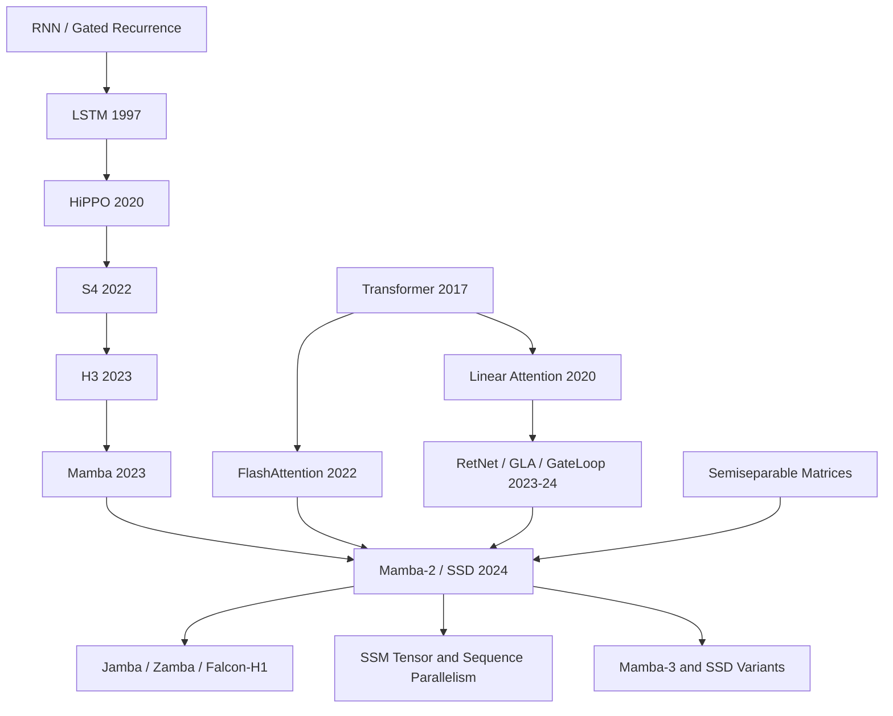

# Mamba-2 - When Transformers and SSMs Meet in the Same Algebra

> **On May 31, 2024, Tri Dao and Albert Gu posted [arXiv:2405.21060](https://arxiv.org/abs/2405.21060), later appearing at ICML 2024.** The drama of Mamba-2 is not that it announces another linear-time sequence model; it is that it moves two rival-looking camps onto the same algebraic table. SSM recurrences, attention-style matrix products, semiseparable matrices, and GPU-friendly block algorithms turn out to be different views of one object. The paper does not say that Transformers are obsolete. Its sharper claim is that once the systems playbook of attention can be transferred to state space models, long-context modeling no longer has to treat an ever-growing KV cache as the only serious default.

## TL;DR

Tri Dao and Albert Gu's ICML 2024 Mamba-2 paper turns the selective-SSM line after Mamba from “a fast recurrent layer” into a shared language called structured state space duality. In the paper's central view, an SSM can be written as a structured matrix with entries such as $M_{ji}=L_{ji}(C_j^\top B_i)$, where $L$ is semiseparable; certain forms of structured masked attention have the same linear recurrent form. The failed baseline it displaces is not one model but three assumptions: Mamba-1's fused scan becomes less attractive as state size grows, linear attention had a recurrence proof but not a full SSM systems recipe, and pure Transformer++ still pays quadratic attention cost and a sequence-length KV cache. Mamba-2's SSD algorithm computes diagonal chunks with attention-like matrix multiplications and off-diagonal chunks through low-rank state transfer, making the core layer 2-8x faster than Mamba's selective scan and, in the paper's report, about 6x faster than FlashAttention-2 at 16K sequence length. The 2.7B model trained on 300B Pile tokens reports 6.09 validation perplexity and a 60.2 zero-shot average. The counter-intuitive lesson is that Mamba-2 does not kill attention; it shows that attention and SSMs share enough algebra that the right question becomes where to place retrieval, compression, and hardware-efficient state. The later hybrid Mamba-attention line grows directly from that opening.

---

## Historical Context

### By 2024, the Transformer victory had become a cost problem

By the spring of 2024, the question around Transformers was no longer whether they worked. They worked too well, and too expensively. GPT-4, Claude, Gemini, and LLaMA 3 had made one point hard to dispute: with enough data, compute, engineering, and post-training, standard attention remained the most reliable default component for language models. At the same time, long-context demand was exploding. Companies wanted whole books, code repositories, long conversation histories, and video transcripts inside a single model call; researchers were testing retrieval, needle-in-a-haystack, and multi-hop reasoning at 100K or 1M tokens. Attention's $O(T^2)$ training cost and $O(T)$ KV cache were no longer just theoretical complaints. They were deployment cost, batch-size, and latency constraints.

That is the setting in which the Mamba line suddenly mattered. Mamba (2023) had shown that selective state space models were not merely an alternative for long-range benchmarks; they could approach or beat same-scale Transformers on language modeling. By making $\Delta, B, C$ depend on the input, Mamba gave an RNN-style state something like attention's ability to write and read by content. Yet Mamba-1 left behind an uncomfortable systems limitation. Its selective scan was fast, but it was not as naturally dominated by large matrix multiplications as FlashAttention. As the state size $N$ grew, the scan slowed roughly linearly. Mamba-1 opened the door for SSMs; it had not yet imported the full systems dividend accumulated by Transformers.

### Linear attention and SSMs finally met

The title “Transformers are SSMs” sounds provocative, but the paper is closer to a reconciliation than a polemic. Linear attention had already suggested, in the 2020 “Transformers are RNNs” line of work, that causal attention can be written as a recurrence once softmax is removed or approximated by kernel features. The SSM tradition, from HiPPO and S4 through H3 and Mamba, had asked a different question: can a finite state compress the whole past online while retaining enough power for language modeling? For several years these lines advanced in different dialects. The attention side talked about matrix products, KV caches, and FlashAttention; the SSM side talked about continuous-time systems, convolution kernels, scans, and state expansion.

Dao and Gu's central observation is that once an SSM is written as sequence-axis matrix multiplication, the matrix is not arbitrary: it is semiseparable. Once certain forms of structured masked attention are written as matrix multiplication, they land in a related structured family. Recurrence and attention-like matrix products become two computational orders for the same kind of object. Historically, this matters because it unifies many previously isolated experiences: RetNet's decay, GLA's gates, GateLoop's surrogate attention, and Mamba's selective scan can all be read as different constraints inside the same structured-matrix space.

### The author pairing is almost the answer

Tri Dao and Albert Gu are the natural pair for this paper. Gu's path from HiPPO to S4, H3, and Mamba had been about making state space models into general-purpose neural sequence layers. Dao's path from FlashAttention to FlashAttention-2 had been about making theoretically simple attention actually fast on modern GPUs. Mamba-2 needs both capacities at once: a theory of SSMs and structured matrices, and a systems instinct for which computation will actually saturate tensor cores on A100 and H100 GPUs.

That is why Mamba-2 is not just “Mamba-1 with a larger state.” The paper first reinterprets the layer as a state space dual layer, then decomposes the sequence matrix into blocks. Within a block it uses attention-style matrix multiplication; across blocks it uses low-rank state passing. This algorithmic choice is almost the intersection of the authors' research histories: Gu supplies the state-space and semiseparable-matrix language, while Dao turns it into a FlashAttention-like hardware-friendly computation.

### Industry wanted an alternative that was not a toy

The 2024 industrial trajectory did not really abandon Transformers. Jamba, Zamba, Griffin, RecurrentGemma, Falcon-H1, and related systems were more often hybrids: Mamba or SSM layers to reduce long-sequence cost, a smaller number of attention layers to retain exact retrieval and strong in-context learning. Mamba-2's value sits precisely there. It does not ask everyone to believe that pure SSMs will rule the world. It gives hybrid designs a clearer primitive: fixed state, larger state expansion, a head vocabulary closer to attention, and computation that can use matrix multiplication units.

So Mamba-2's historical position is not “the Transformer killer.” It is the paper that makes the boundary between Transformers and SSMs movable. Before it, the debate often sounded binary: accept standard attention's quality and cost, or accept a linear model's efficiency and quality risk. After Mamba-2, the sharper question is: which layers need the full softmax-attention history, which layers only need learned compressed state, and which systems optimizations can be shared by both families? That is the question long-context models in 2024 and 2025 actually needed to answer.

## Background and Motivation

### Mamba-1's win left a systems debt

Mamba-1 had shown that selectivity is essential, but its scan kernel remained a specialized path. At small state size, such as $N=16$, that path was fast enough. Once the model needs state sizes of 64, 128, or 256 in order to store more key-value associations for tasks such as MQAR, the linear slowdown of the scan becomes visible. Mamba-2 begins from a concrete systems question rather than from a desire to invent yet another layer: can an SSM keep linear sequence scaling while rewriting most of its work as batched matrix multiplication, the operation modern accelerators are built to execute?

This is the engineering motive behind the title “Transformers are SSMs.” If the Transformer's advantage is not only expressivity but also a decade of efficient matrix multiplication, tensor parallelism, sequence parallelism, and kernel work, then SSMs cannot become first-class foundation-model layers by winning only in asymptotic complexity. They must inherit those systems capabilities.

### The three questions Mamba-2 tries to answer

The first question is theoretical language: can SSMs, linear attention, and structured masked attention be placed in one formula family? The paper's answer is structured state space duality. The matrix form of an SSM is semiseparable; the quadratic form of attention-like computation can also be expressed as matrix multiplication with a structured mask; SSD is the intersection where these views meet.

The second question is algorithmic shape: is there a computation that is neither a pure recurrent scan, which underuses matrix multiplication, nor pure attention, which pays $O(T^2)$ sequence cost? The paper's answer is the SSD algorithm: diagonal blocks are computed with a quadratic attention-like form, while off-diagonal blocks are handled through low-rank factors and a chunk-level recurrence.

The third question is model value: once this layer is put inside a language model, does it actually beat Mamba-1 and Transformer++? The reported answer is yes. Mamba-2 Pareto-dominates Mamba and Transformer++ on Chinchilla-style scaling curves, and the 2.7B model trained on 300B Pile tokens reaches 6.09 validation perplexity and a 60.2 zero-shot average, outperforming same-dataset same-tokenizer Pythia-2.8B and remaining competitive even against Pythia-6.9B.

### The real bet of the paper

Mamba-2 does not bet that softmax attention is obsolete. The related-work section is explicit that SSD does not generalize standard softmax attention; it covers attention variants expressible through finite feature maps and structured masks. The real bet is narrower and more useful: many sequence-modeling layers may not need to store every past token exactly. If a model can compress history into a controllable state expansion $N$, and if that compression is content-aware and hardware-friendly, then many layers can escape the economics of the KV cache.

That bet was later partly validated by the hybrid line. Pure SSMs remain weaker on verbatim copying, extreme retrieval, and some forms of in-context learning, but mixing a few attention layers with many Mamba or Mamba-2 layers can offer a practical quality-cost tradeoff. Mamba-2 is therefore best read as a new foundation stone. It does not replace all attention; it makes “where should attention be placed?” a systems and architecture question that can be optimized.

---

## Method Deep Dive

### Overall framework: write the SSM as a matrix, then choose the right computation order

Mamba-2 is not a single trick. It is a chain from representation to algorithm to block design. First, write the selective SSM as a sequence-axis matrix transformation $Y=MX$. Second, show that this matrix $M$ has semiseparable structure, with entries that can be summarized as $M_{ji}=L_{ji}(C_j^\top B_i)$, where $L$ is formed by cumulative products of input-dependent decay factors. Third, choose a multiplication algorithm for this structured matrix that is more GPU-friendly than a pure scan and cheaper than pure attention. Fourth, place the resulting SSD layer inside a Mamba-2 block designed for tensor parallelism.

This chain matters because it explains why Mamba-2 is not just an engineering acceleration of Mamba-1. Mamba-1 views the selective SSM primarily as a recurrence. Standard attention views the layer as matrix multiplication. Mamba-2 says that both are algorithms for the same structured matrix. Model design therefore changes from “RNN or attention?” to “which part of this structured matrix should be computed by matmul, and which part should be computed by state passing?”

| View | Formula/object | Computation | Use in Mamba-2 |
|---|---|---|---|
| Recurrent SSM | $h_t=A_t h_{t-1}+B_t x_t$ | linear scan | state passing across chunks |
| Dual attention form | $(L\circ QK^\top)V$ | quadratic matrix multiplication | computation inside each chunk |
| Matrix mixer | $Y=MX$ | structured matrix multiplication | unifies the two views |
| SSD algorithm | semiseparable block decomposition | matmul + short scan | linear scaling plus hardware efficiency |

### Key Design 1: Structured State Space Duality

SSD first restricts the selective SSM to a more hardware-friendly subclass. Compared with Mamba-1, Mamba-2 makes two small but important restrictions in the SSD layer. First, $A_t$ is simplified from a general diagonal matrix to scalar times identity, so the decay at each time step can be treated as a scalar. Second, the head dimension $P$ is increased from the Mamba-1-like $P=1$ regime to 64 or 128, aligning it with modern Transformer conventions. This slightly reduces freedom in $A_t$, but it gives a cleaner attention-like quadratic form and a better path to matrix multiplication.

The dual form of SSD can be written as $(L\circ QK^\top)V$. It differs from softmax attention in two ways: there is no softmax, and the score matrix is multiplied by an input-dependent 1-semiseparable mask $L$. The entries of $L$ come from cumulative products of $a_i$, controlling how much information is preserved between positions $i$ and $j$. Mamba-2 therefore does not copy standard attention's “keep every past token in the KV cache” strategy. It replaces that strategy with a learned relative-position and forgetting mask that compresses history.

This is the precise meaning of “Transformers are SSMs” in the title. It does not mean that full softmax Transformers are equivalent to SSMs. It means that a large family of no-softmax, structured-masked attention mechanisms and a class of selective SSMs meet in the same algebraic object. The paper itself emphasizes this limitation: SSD does not generalize standard softmax attention; it generalizes attention-like mechanisms that can be expressed with finite feature maps and structured matrices.

### Key Design 2: The SSD algorithm combines intra-chunk attention with inter-chunk state passing

If we use only the recurrent form, the sequence complexity is linear but much of the work is not large matrix multiplication. If we materialize $M$ and multiply by it directly, the GPU is happy but the complexity becomes quadratic. The SSD algorithm cuts the $T\times T$ semiseparable matrix into chunks of length $Q$. Diagonal blocks describe interactions inside one chunk, where the chunk is small enough for an attention-like quadratic computation. Off-diagonal blocks are low-rank because of the semiseparable structure; they can be decomposed into right factors, center decays, and left factors, with a shorter chunk-level recurrence carrying state between blocks.

The simplified code in the paper reads almost like a tutorial in structured matrix multiplication. This version keeps the core order:

```python
def ssd_layer(X, A, B, C, block_len=64):
    # X: value-like input, A: decay gates, B/C: key/query-like SSM factors
    X, A, B, C = chunk(X, A, B, C, length=block_len)
    A_cumsum = cumsum(A, dim="within_chunk")

    # 1. Diagonal blocks: compute interactions inside each chunk.
    L = exp(segment_sum(A))
    Y_diag = einsum("C, B, L, X -> Y", C, B, L, X)

    # 2. Right factors: summarize each chunk into a recurrent state.
    states = einsum("B, decay, X -> h_chunk", B, A_cumsum, X)

    # 3. Center factors: pass states between chunks with a short scan.
    states = chunk_scan(states, A_cumsum[:, :, -1])

    # 4. Left factors: convert incoming chunk states back to outputs.
    Y_off = einsum("C, states, decay -> Y", C, states, A_cumsum)
    return unchunk(Y_diag + Y_off)
```

When $N=P=Q$, the training FLOPs are $O(TN^2)$, inference state memory is $O(N^2)$, and the dominant work consists of batched matrix multiplications on roughly $(N,N)$ matrices. Standard attention, by contrast, has $O(T^2N)$ training FLOPs. A naive linear SSM also has $O(TN^2)$ work, but it does not expose the same amount of work to matrix multiplication units. This is the algorithmic contribution of Mamba-2: it keeps the linear model's compressed-history nature while changing the computation shape to look much more like a modern Transformer kernel.

### Key Design 3: The Mamba-2 block generates parameters in parallel

The Mamba-1 block is SSM-centric: first project the input into an SSM input $X$, then derive $A,B,C$ from $X$. Mamba-2 is SSD-centric: the SSD layer is a map $A,X,B,C\mapsto Y$, so these branches can be produced in parallel at the beginning of the block. This may look like a small architectural change, but it matters for tensor parallelism. It makes Mamba-2 closer to the standard Transformer pattern in which $Q,K,V$ are generated together, and it reduces synchronization points per block into a form that is friendlier to Megatron-style sharding.

Mamba-2 also adds an extra normalization before the final output projection, echoing the NormFormer idea of placing normalization near the end of attention and MLP blocks. The reason is practical: multiplicative gates, state expansion, and input-dependent decays can create instability in larger models; the extra norm keeps the scale before the output projection under control. Finally, Mamba-2 uses a multi-input SSM / multi-value attention head pattern: $X$ has multiple heads, while $B,C$ are shared across input channels. This preserves the original Mamba inductive bias and empirically works better than directly copying the multi-head attention pattern.

| Design axis | Mamba-1 | Mamba-2 | Motivation |
|---|---|---|---|
| Parameter generation | derive $A,B,C$ sequentially from SSM input | generate $A,X,B,C$ in parallel | friendlier tensor parallelism |
| Core algorithm | selective scan | SSD block decomposition | route dominant work through matmul |
| State size | often $N=16$ | often $N=64/128$, can go larger | better associative-memory capacity |
| Normalization | fewer extra norms | extra norm before output projection | stabilize large-model training |

### Key Design 4: Borrow attention's vocabulary, not softmax itself

One of the most useful parts of Mamba-2 is that it lets SSMs speak the vocabulary of attention. Head dimension $P$ resembles the value-head dimension, state size $N$ resembles the key/query dimension, and ideas such as multi-query and grouped-query attention can be translated into multi-contract, multi-expand, and multi-input SSM patterns. The benefit is not merely pedagogical. It gives existing Transformer engineering ideas a place to attach. Sequence parallelism can be interpreted as splitting the sequence into chunks across devices, letting each device compute local state, then passing the recurrent state forward. Variable sequence length can be handled without padding because the state-passing mechanism naturally knows segment boundaries.

The paper does not, however, import everything from attention. The authors ablate kernel feature maps, denominator normalization, Based/ReBased-style quadratic feature expansions, and other ideas from the linear-attention literature. The default remains a Swish/SiLU-like feature map and a Mamba-style head pattern. This negative result matters. Mamba-2 succeeds not because “SSMs have finally become attention,” but because SSMs absorb attention's systems language while keeping their own core idea: compressed state plus selective recurrence.

---

## Failed Baselines

### Baseline 1: Mamba-1's selective scan does not scale forever

Mamba-1 is Mamba-2's direct predecessor and its most important baseline. Its problem is not poor quality; it is that the core scan algorithm becomes less attractive as the state size grows. Language modeling and multi-query associative recall both suggest that larger state size can store more information. But Mamba-1's optimized selective scan slows down noticeably as $N$ increases. The right side of the paper's efficiency figure emphasizes this at sequence length 4K: the Mamba optimized scan slows roughly linearly with state expansion, while SSD can use much larger state expansion with only modest slowdown.

This put Mamba-1 in an awkward 2024 position. It proved that selective SSMs were a serious direction, but it did not provide a natural systems answer for “large state, large model, many GPUs.” Mamba-2's SSD algorithm is aimed exactly at that failure mode: shorten the long scan into a chunk-level scan, move more work into matrix multiplication, and make $N=64$ or larger settings practical.

### Baseline 2: Linear attention had recurrence, but not SSM-level state structure

Linear attention had long known that causal attention can be written as a recurrence, but many methods remained centered on approximating the softmax kernel. Performer, Linear Transformer, Based, ReBased, and related approaches often ask: how should we approximate $\exp(QK^\top)$, or which feature map $\psi$ should we use? That question is important, but it does not automatically yield a systematic model with SSM-style state expansion, chunk recurrence, and a multi-input head pattern.

Mamba-2 does not simply reject these baselines. It absorbs and tests them. The paper tries kernel feature maps, denominator normalization, and Based/ReBased-style quadratic features inside SSD, but does not adopt them as defaults. The failure can be summarized this way: attention-centric linearization methods retain too much of the goal “approximate softmax attention,” while Mamba-2 needs a different goal, “compress history into a finite state that is large, fast, and stable enough.”

### Baseline 3: Pure Transformer++ is reliable, but its long-sequence economics do not change

Transformer++ is the paper's strongest modern Transformer recipe baseline, including RoPE, SwiGLU, RMSNorm, no bias, and higher-learning-rate choices in the LLaMA/PaLM style. Its strength is maturity: stable training, strong in-context learning, a complete ecosystem, and excellent kernels. Mamba-2 does not pretend this baseline is weak. It treats Transformer++ as the scaling-curve opponent that must be confronted directly.

The issue is that Transformer++ has the same basic economics. Attention training still has an $O(T^2)$ sequence term, and inference still needs a KV cache that grows with context length. FlashAttention-2 can reduce constants dramatically, but it cannot turn state size from $T$ into a controllable $N$. Mamba-2's speed experiments make the contrast concrete: SSD crosses FlashAttention-2 around sequence length 2K and is reported about 6x faster at 16K. This does not make Transformer++ useless. It means that for long-context throughput and state memory, it loses on the definition of the problem.

### Baseline 4: Pure SSM still is not full attention

Mamba-2 also exposes its own boundary honestly. The related-work section states that SSD does not generalize standard softmax attention. Compared with full attention, SSD compresses history into a controllable state expansion $N$, while attention's KV cache stores history at length $T$. For tasks that require verbatim copying, exact retrieval, or complex in-context lookup, this compression can become a risk. The MQAR experiments show that Mamba-2 is much stronger than Mamba-1 and even better than vanilla attention in some settings, but the paper also says that much remains to be understood.

This explains why many production architectures after 2024 moved toward hybrids. Jamba showed that a small number of attention layers combined with many Mamba layers can be very strong for language modeling; Falcon-H1, Zamba, and related systems follow a similar instinct. Mamba-2's failure case is not “it failed to replace attention completely.” It is that it finally lets us discuss precisely which abilities require attention and which can be handled by compressed state.

## Key Experimental Data

### Speed and state size: SSD's central win

The paper's most memorable systems numbers are in the SSD layer benchmark. A dedicated SSD implementation is 2-8x faster than Mamba's optimized selective scan; it crosses FlashAttention-2 around 2K sequence length and is reported about 6x faster at 16K. More importantly, it supports recurrent state sizes 8x larger than Mamba's or higher, with minimal slowdown. This directly matches the method section's core claim: SSD is not only attractive in a complexity table; it actually moves work into the shape GPUs like.

| Comparison | Mamba-1 selective scan | FlashAttention-2 | Mamba-2 SSD |
|---|---:|---:|---:|
| Sequence complexity | $O(TN^2)$ | $O(T^2N)$ | $O(TN^2)$ |
| Inference state | $O(N^2)$ | $O(TN)$ KV cache | $O(N^2)$ |
| Dominant work | scan / elementwise | matrix multiplication | matrix multiplication + short scan |
| Reported speed | baseline | stronger before 2K | 2-8x scan, about 6x FA-2 at 16K |

### Language modeling: not just faster, but scalable

Under the Pile 300B-token setup, Mamba-2 outperforms Mamba at each model size and often matches Pythia at twice the parameter count. The most cited row is the 2.7B model: Pile validation PPL 6.09, LAMBADA PPL 4.10, LAMBADA accuracy 69.7, HellaSwag 66.6, PIQA 76.4, Arc-C 36.4, WinoGrande 64.0, OpenBookQA 38.8, and a zero-shot average of 60.2. The paper also notes that Mamba-2-2.7B outperforms Mamba-2.8B and Pythia-2.8B, and even beats same-data Pythia-6.9B.

| Model | Pile PPL | HellaSwag | PIQA | WinoGrande | Average |
|---|---:|---:|---:|---:|---:|
| Pythia-2.8B | 6.73 | 59.3 | 74.0 | 59.7 | 55.7 |
| Mamba-2.8B | 6.22 | 66.1 | 75.2 | 63.5 | 59.9 |
| Mamba-2-2.7B | 6.09 | 66.6 | 76.4 | 64.0 | 60.2 |
| Pythia-6.9B | 6.51 | 63.9 | 76.3 | 61.1 | 58.7 |

### Associative memory: state size is not decorative

MQAR is Mamba-2's test of whether a finite state can remember multiple key-value associations. It is harder than the selective copying and induction-head tasks reported in the original Mamba paper, because the model must store many pairs and retrieve the right value when queried later. The paper reports that Mamba-1 struggles in the harder setup, while Mamba-2 performs much better even when state size is controlled. Increasing the state size from $N=16$ to $N=64$ and $N=256$ improves performance consistently. State expansion is therefore not a decorative hyperparameter; it is the core capacity by which compressed-state models handle lookup-like tasks.

This result also strengthens the algorithmic case for Mamba-2. If larger state size did not help, SSD's ability to handle large $N$ would matter less. If larger $N$ helped but was too slow, Mamba-1's scan would become the bottleneck. MQAR connects the two facts: the model really does need more state, and SSD really does make more state trainable.

---

## Idea Lineage

### Before: from online compression to structured matrices

Mamba-2 does not have a single ancestor. One line is RNN and gated recurrence: LSTM, GRU, SRU, and RWKV all try to carry long-range information in finite state, although they usually lack the large state expansion of the SSM family. A second line is structured SSMs: HiPPO gives a mathematical framework for online compression of long signals, S4 turns it into a trainable long-sequence layer, and H3 plus Mamba gradually add gates and selectivity until language modeling becomes viable. A third line is attention systems engineering: the Transformer proves the ceiling of matrix-multiplication token mixing, while FlashAttention proves that algorithmic equivalence is not enough; I/O and kernel shape determine whether a method can become an industrial default.

Mamba-2 is distinctive because it does not simply choose one of these lines. It connects SSM state compression, the recurrence duality of linear attention, FlashAttention-style hardware awareness, and the numerical-linear-algebra language of semiseparable matrices. It is therefore a mediating paper. It gives later work not only a model, but also a translation dictionary: attention models, RNNs, SSMs, and structured matrix mixers can now be interpreted through one another.



### Now: Mamba-2 makes hybrid architectures more principled

After Mamba-2, hybrid Mamba-attention architectures became less like empirical stacking. Before, a hybrid could easily mean “put in a few attention layers, add a few recurrent layers, tune until it works.” SSD provides a more principled language. Full-history attention and finite compressed SSM state are two state representations for the same sequence-matrix problem. Multi-query attention and grouped-query attention can be translated into multi-input and grouped-input SSM patterns. Sequence parallelism can be read as chunked state passing. Hybrid models can therefore discuss layer roles more clearly: which layers provide exact retrieval, which layers compress long-range context, and which layers perform local or medium-range mixing.

Follow-up systems such as Jamba, Zamba, and Falcon-H1 do not all reproduce the entire Mamba-2 recipe, but they inherit the paper's problem framing: pure attention is expensive, pure recurrence carries quality risk, and the useful design space is the system-level combination of the two. Mamba-2's influence is therefore not only “did a later model use the SSD layer?” It is also “did the later model describe and evaluate the SSM-attention tradeoff more clearly?”

### Misreadings: the title does not declare the Transformer dead

The most common misreading is to treat the title as “the Transformer is obsolete.” The paper is more precise. It proposes structured state space duality: some SSMs and some structured masked attention mechanisms share an algebraic form. Standard softmax attention is not generalized by SSD. The normalization, sparse selection behavior, attention sinks, copying ability, and full KV cache of softmax attention retain their own value. Mamba-2 does not deny those abilities; it shows that part of the territory can be approximated or replaced by finite state plus a structured mask.

A second misreading is to treat Mamba-2 as a pure theory paper. Its theoretical objective is deeply engineered: once an SSM is understood as a semiseparable matrix, one can design a block-decomposition algorithm whose dominant work is matrix multiplication. The equivalence is not decorative; it changes the kernel shape. A third misreading is to treat state size as a routine hyperparameter. MQAR and the speed benchmarks together show that state size determines the memory capacity of compressed-state models, while SSD determines whether that capacity is affordable on modern GPUs.

---

## Modern Perspective

### Assumption that no longer holds: linear time is enough to win

Looking back from 2026, the durable lesson of Mamba-2 is not “linear-time models will automatically replace attention.” The last few years have repeatedly shown that $O(T)$ complexity alone is not enough. Many linear-attention, long-convolution, sparse-attention, and recurrent variants looked elegant in complexity tables but failed on language-model quality, in-context learning, copying, or systems implementation. Mamba-2's real breakthrough is the simultaneous alignment of three properties: content-dependent selectivity, a sufficiently large controllable state, and matrix-multiplication-friendly computation.

The assumption that no longer holds is “lower sequence complexity is enough to become the long-context default.” Long-context models need a combination of retrieval, compression, parallelism, and deployability. Mamba-2 is strong on compression and parallelism, but it does not solve every exact-retrieval problem. That is why the later hybrid line is more realistic: attention handles layers that require source-level access, SSMs handle large amounts of compressible history, and the two families share a systems vocabulary.

### If rewritten today: hybrid and retrieval would move into the main experiments earlier

If Mamba-2 were rewritten today, the SSD theory would probably not be the part that needs the most expansion. The experimental matrix would. The paper already includes MQAR and language modeling, but long-context evaluation in 2024-2026 has moved toward realistic retrieval, multi-hop QA, code-repository reasoning, long-document consistency, and tool-use traces. A modern version would likely place pure Mamba-2, different attention insertion ratios, sliding or local attention, and retrieval-augmented memory in one scaling study, directly answering “how many attention layers are enough?”

A second expansion would be inference economics. Mamba-2 already discusses tensor parallelism, sequence parallelism, and variable sequence length, but today's reader would ask for serving metrics: prefill throughput, decode latency, batching behavior, state-cache layout, quantization error in recurrent state, and compatibility with speculative decoding or paged-KV systems. In other words, a 2026 Mamba-2 paper would probably look even more like an architecture + systems + serving paper, not only an architecture + algorithm paper.

### What still holds: algebraic unification can create engineering routes

The most time-resistant part of Mamba-2 is that algebraic unification is not decorative; it opens implementation space. FlashAttention's lesson was that rearranging equivalent computation can turn attention from an HBM-bandwidth problem into an SRAM-friendly kernel. Mamba-2's lesson is similar: reinterpreting an SSM as a semiseparable matrix can turn a scan-heavy layer into a matmul-heavy layer. This pattern will keep reappearing in efficient models: find the shared structure first, then choose the computation order that best matches hardware.

For researchers, the practical takeaway is direct. Do not ask only “what is this layer's asymptotic complexity?” Also ask “what is its dominant operation, can tensor cores eat it, can it be partitioned across devices, and can it keep state compact at serving time?” Mamba-2 puts these questions into model design from the beginning instead of leaving them for kernel engineers to rescue later.

## Limitations and Future Directions

### Limitations: SSD still has expressive and evaluation boundaries

First, SSD does not cover standard softmax attention. Softmax normalization, nonlinear competition, and the ability to retain the full history cannot be replaced by finite state for free. Second, Mamba-2's main experiments reach 2.7B parameters and 300B tokens, enough to establish the trend but still far from today's tens-of-billions, trillion-token, heavily post-trained systems. Third, MQAR is harder than selective copying, but it is still synthetic; real long-context tasks entangle retrieval, reasoning, noise robustness, and instruction following.

Fourth, compressed state remains hard to interpret. Transformer attention maps are often overinterpreted, but at least they offer a visual entry point. How SSM state encodes information, when it forgets, and whether it forms mechanisms analogous to induction heads still need better probing and mechanistic interpretability tools. The paper asks whether attention-sink-like phenomena exist in Mamba models; that question remains worth pursuing.

### Future direction: not pure SSM, but programmable state layers

The more likely future is not “replace every layer with Mamba-2.” It is that state layers become programmable architectural resources. Some layers keep short-term precise information; some compress long-range semantics; some call external retrieval; some retain full attention for copying and alignment. Mamba-2's contribution is to make SSM layers fast enough, large enough, and Transformer-like enough as systems components to participate in that orchestration.

Another direction is pushing SSD into non-causal and multimodal settings. Vision, audio, video, and genomic sequences all contain long sequences or high-resolution structure, but they differ in how much full-history caching they need. The language of semiseparable matrices and structured masked attention may help design state layers for bidirectional, 2D/3D, streaming, or event-based data. Mamba-2 is not the final answer; it is a structural key.

## Related Work and Insights

### Relation to Mamba, RetNet, GLA, GateLoop, and Jamba

Mamba-1 provides selective SSMs and a hardware-aware scan, making it Mamba-2's direct parent. RetNet, GLA, GateLoop, and related concurrent work approach similar territory from attention or gated-linear-recurrence directions: decay factors, chunkwise algorithms, and dual recurrent/parallel forms. Mamba-2's difference is that it organizes these phenomena as structured state space duality and chooses the Mamba-style multi-input SSM head pattern instead of simply following attention-centric MHA or MQA intuitions.

Jamba and later hybrid models are the practical annotation on Mamba-2. They do not necessarily prove that pure Mamba-2 is best, but they do show that the SSM-attention combination deserves systematic design. Mamba-2 gives that combination a stronger algorithmic primitive, and it lets later systems discuss state size, attention frequency, sequence parallelism, and serving cache more concretely.

### Systems lesson

Mamba-2 is also a systems-research template. It reminds us that the fate of an architecture is often decided by kernel shape. Mamba-1 had good asymptotic complexity and strong quality, but it was scan-heavy. Mamba-2 re-blocks the same mathematical object so that matrix multiplication becomes the main actor. This idea applies broadly: efficient attention, MoE routing, video generation, long-audio models, and scientific sequence models can all benefit from “find the structured matrix first, then design the hardware-friendly multiplication.”

More specifically, Mamba-2 offers a pattern for writing impactful architecture papers: prove that two apparently different model families share structure; use that structure to design a new algorithm; then validate the system benefit and model quality on the same scaling plot. Such a paper does not merely answer “can the model run?” It answers “why can this model become infrastructure now?”

## Resources

### Paper and code

- Paper: Tri Dao and Albert Gu, [Transformers are SSMs: Generalized Models and Efficient Algorithms Through Structured State Space Duality](https://arxiv.org/abs/2405.21060), ICML 2024.
- PMLR page: https://proceedings.mlr.press/v235/dao24a.html
- Official code: https://github.com/state-spaces/mamba
- Direct predecessor: Mamba - Linear-Time Sequence Modeling with Selective State Spaces
- Related reading: FlashAttention / FlashAttention-2, S4, H3, RetNet, GLA, GateLoop, and Jamba.


---

> 🌐 [中文版](/era5_genai_explosion/2024_mamba2/) · 📚 awesome-papers project · CC-BY-NC