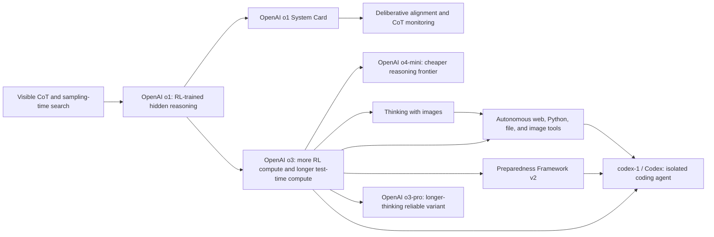

# OpenAI o1 -> o3/o4-mini - From Test-Time Compute to Agentic Reasoning

> **On September 12, 2024, OpenAI published [Learning to Reason with LLMs](https://openai.com/index/learning-to-reason-with-llms/), turning “think before answering” from a prompt trick into the identity of a model family; on December 5, it followed with the [OpenAI o1 System Card](https://openai.com/index/openai-o1-system-card/), putting capability, risk, and deployment boundaries in the same public document.** The shock of o1 was not a reproducible algorithm. It was almost the opposite: OpenAI withheld the training recipe, yet showed that reinforcement learning, training-time compute, and test-time compute could jointly scale reasoning. AIME, Codeforces, GPQA, MMMU, jailbreak robustness, and Preparedness evaluations all pointed to the same shift. A reasoning model was not merely “GPT-4o but chattier”; it was a new product and safety paradigm in which the model works through a hidden chain of thought before handing the user a visible answer.

## TL;DR

From 2024's o1 to 2025's o3, o4-mini, o3-pro, and codex-1, OpenAI publicly defined a full reasoning-model family. o1 first tied hidden CoT, training-time compute, and test-time compute into a new paradigm, which can be abstracted as $p(y,a_{1:T}\mid x,v,f)=\sum_z p_\theta(y,a_{1:T}\mid x,v,f,z)p_\theta(z\mid x,v,f)$ to capture a hidden reasoning trace plus action policy; o3 then scaled large-scale reinforcement learning and test-time thinking by another order of magnitude, o4-mini pushed similar behavior onto a better cost-efficiency frontier, o3-pro turned “think longer for reliability” into an explicit SKU, and codex-1 specialized o3 into a software-engineering agent that reads and edits files, runs tests, and cites evidence inside an isolated container, before the split fast/deep line converged again inside [GPT-5](2025_gpt5.md)'s routed system. On the capability side, o1 reached 74.4% pass@1 on AIME 2024, while OpenAI also reported **Python-enabled** AIME 2025 scores of 99.5% pass@1 for o4-mini and 98.4% for o3, which must not be mixed directly with no-tool scores; on the safety side, o1 made deliberative alignment and CoT monitoring part of the public system-card story, and o3/o4-mini became the first release under Preparedness Framework v2, bringing reasoning monitors, system mitigations, and container boundaries to the foreground. What this line really changes is not only whether a model can think, but whether it can search, compute, inspect, edit, and test for itself while still staying inside a bounded runtime.

---

## Historical Context

### From CoT prompting to reasoning models

The historical starting point for o1 was not a suddenly intelligent model in 2024, but the LLM community's rediscovery of chain-of-thought after 2022. Chain-of-Thought Prompting showed that mathematical and symbolic tasks improve when a model explicitly writes intermediate steps. Self-Consistency, Tree-of-Thoughts, program-aided reasoning, tool use, and verifier reranking then pushed in the same direction: do not answer immediately; search, decompose, and check before committing.

Most of those methods treated reasoning as an inference-time technique. Users wrote “Let's think step by step,” researchers sampled multiple reasoning paths, and voting or a verifier selected the final answer. The model itself had not been publicly turned into a product whose identity was systematic internal computation on difficult problems. In the GPT-4o era, the default interaction was still fast answering, with longer explanations elicited by prompts when needed. o1 changed that framing: OpenAI made “think before answering” a training objective and product form. The model deliberates in hidden chain-of-thought, while the user sees a polished answer or summary.

| Stage | Representative event | Reasoning interface | Limitation |
|---|---|---|---|
| 2022 | Chain-of-Thought Prompting | user explicitly asks for step-by-step reasoning | prompt-dependent and unstable |
| 2022-2023 | Self-Consistency / verifier reranking | multi-sample generation and voting | compute is external to the trained objective |
| 2023 | GPT-4 Technical Report | strong capability but closed recipe | reasoning mechanism and training details opaque |
| 2024 | OpenAI o1 | RL-trained hidden CoT plus test-time compute | public materials remain non-reproducible |

### September 2024: making “thinking longer” a capability curve

When OpenAI released o1-preview and Learning to Reason with LLMs on September 12, 2024, the most important public signal was not a single leaderboard result but two scaling curves: o1 performance improved with more reinforcement-learning training compute and also with more test-time thinking compute. Before that, the default scaling story for LLMs was pretraining compute, parameters, and data. o1 brought another axis to the foreground: the same problem can receive more internal reasoning budget, and the model can try strategies, notice mistakes, and revise before answering.

That is why the release did not feel like an ordinary model upgrade. OpenAI was not merely saying “the new model is stronger.” It was saying, in effect, “we trained a model to use chain-of-thought productively.” AIME 2024, Codeforces, GPQA Diamond, and MMMU all point to the same family of capabilities: tasks that cannot be solved by shallow completion alone, and instead require multi-step search, constraint tracking, algebraic transformation, code debugging, or scientific synthesis. o1's jump over GPT-4o on these tasks made reasoning budget itself visible as a scalable resource.

### December 2024: the System Card put capability and risk at the same table

The December 5 OpenAI o1 System Card added the other half of the story: reasoning capability changes not only math, code, and science performance, but also the structure of safety evaluation. The system card states at the outset that the o1 family is trained with large-scale reinforcement learning to use chain-of-thought. This provides new opportunities for safety and robustness, while also increasing risks. The report evaluates disallowed content, jailbreaks, hallucination, bias, instruction hierarchy, CoT deception monitoring, external red teaming, Preparedness Framework categories, CBRN, persuasion, model autonomy, and multilingual performance.

The historical value of the System Card is that it binds a capability release to a governance artifact. o1 was not just a model that beat GPT-4o on benchmarks, nor merely a slower premium option in ChatGPT. It forced developers, red teams, regulators, and researchers to face a new question: if a model can plan, verify, and revise in a hidden reasoning trace, must safety also enter that reasoning process? OpenAI's answer was deliberative alignment, instruction hierarchy, CoT summaries, and CoT monitoring, while also acknowledging that faithful chain-of-thought remains an open question.

## Background and Motivation

### Motivation: spend compute before the answer

The motivation behind o1 can be compressed into one sentence: make the model spend useful computation before it speaks, instead of forcing all capability into a single fast forward pass. Ordinary chat models often behave like fast reflex systems: read the prompt, generate an answer, and perhaps explain visibly. A reasoning model is closer to a student doing scratch work: try a route internally, backtrack on contradictions, rewrite the plan if necessary, then produce the final answer. OpenAI tied this ability to reinforcement learning, meaning the objective is not only “produce answers people prefer,” but also “use a reasoning process that improves final correctness.”

This differs subtly but importantly from traditional RLHF. RLHF usually optimizes preference, helpfulness, and safety of visible answers. The public o1 story emphasizes that models learn to refine their thinking process, try different strategies, and recognize their mistakes. The object of optimization moves from the visible answer into the cognition before the answer. The public materials do not specify how the reward is constructed, but the motivation is already clear: if hard tasks require search, training should reward models that search well.

### Disclosure boundary: this is not a reproducible paper

To understand o1, one must separate historical influence from reproducibility. o1 is a direction-changing technical report and system card, not an open algorithm paper. OpenAI does not publish model size, full data composition, RL algorithm, reward design, sampling policy, optimizer, number of training stages, CoT format, or system prompts. The public figures show scaling trends, and the tables show benchmark and safety-evaluation results, but an external group cannot train an o1 from the text.

That does not reduce its historical importance. It instead shows a reality of frontier AI in 2024: some of the most important research objects increasingly appear as closed system cards, product releases, and mixed qualitative-quantitative evaluations. o1 therefore has to be read on two tracks. On one track, it publicly demonstrated a strong signal for test-time compute and reinforcement learning for reasoning. On the other, any detailed recipe must be labeled as interpretation or conjecture, not as something OpenAI disclosed.

---

## Method Deep Dive

By 2025, it is no longer enough to describe this lineage as “o1 equals hidden CoT plus test-time compute.” The official materials now describe a broader system. o3 extends the same line with continued RL scaling, o4-mini moves the line onto a cheaper efficiency frontier, o3/o4-mini make reasoning natively tool-using and multimodal, and the Codex addendum shows how the same line becomes an isolated software-engineering agent. The method section therefore has to explain not only why the model thinks before it answers, but how it allocates budget, tools, visual evidence, and safety constraints while thinking.

### The boundary between public fact and structured explanation

The boundary still comes first. OpenAI has disclosed product behavior, benchmark results, system cards, and container boundaries, but not a full training recipe. The table separates what is public from what remains interpretation:

| Layer | Public fact | Structured explanation | Should not be invented |
|---|---|---|---|
| RL scaling | o1 and o3 both improve with more training and test-time compute | reasoning budget acts as a separate scaling axis | exact reward, optimizer, and sampling details |
| Hidden reasoning | the model thinks in hidden CoT before replying | latent variable $z$ carries search, checking, and revision | raw CoT text and full faithfulness |
| Tool policy | o3/o4-mini are trained to decide when to use tools | action selection is jointly optimized with language reasoning | router implementation and tool-training data |
| Visual reasoning | images can enter the chain of thought directly | visual state becomes part of the reasoning state | exact visual encoding and internal interfaces |
| Agent runtime | codex-1 reads and edits files and runs tests inside its own container | a reasoner starts to execute workflows | the full orchestration stack and internal policies |

### Overall framework: hidden reasoning traces, action policies, and multimodal state work together

In an o1-only description, a reasoner can be summarized as “input $x$ enters a hidden trace $z$, then produces answer $y$.” With o3/o4-mini and Codex, two more classes of variables become necessary: multimodal state such as images $v$ and files $f$, and tool actions $a_{1:T}$. A helpful but non-official abstraction is:

$$
p(y,a_{1:T}\mid x,v,f)=\sum_z p_\theta(y,a_{1:T}\mid x,v,f,z)\,p_\theta(z\mid x,v,f).
$$

The point is not the formula itself but the interface shift it captures. In the o1 era, the main question was whether the model should be allowed more thinking time. In the o3/o4-mini era, the question becomes whether the model should search the web, run Python, inspect files, and manipulate images during thinking, then fold those results back into its hidden trace. In codex-1, the question extends further: whether the model should directly modify files and execute verification commands inside a restricted environment. The runtime has therefore grown from pure text generation into a small task-execution loop.

| Component | Input | Output | Role in public materials |
|---|---|---|---|
| Reasoning policy | text problem, images, file context | hidden CoT | decomposes the task, explores routes, corrects errors |
| Tool policy | hidden CoT and available tools | action sequence | decides when to search, code, or inspect files |
| Multimodal state | diagrams, charts, sketches, photos | visual intermediate state | lets images participate directly in reasoning |
| Answer head | reasoning result and tool returns | user-visible answer | organizes the final response |
| Safety monitor | request, trace, and action context | refusal, escalation, or interception | inserts deliberative alignment and system mitigations into runtime |

### Key design 1: RL scaling turns reasoning budget into a real scaling axis

o1 publicly introduced the joint role of training-time and test-time compute. o3 pushes that observation further. OpenAI states that during o3 development it continued to see a “more compute, more performance” trend in large-scale reinforcement learning, and that both training compute and inference-time reasoning were increased by an order of magnitude. Just as important, OpenAI claims that o3 delivers better performance in ChatGPT at the same latency and cost as o1, and continues to improve if allowed to think longer.

That means reasoning budget is no longer merely an unfortunate latency side effect. It is a first-class systems resource that must be allocated. A conceptual objective can still be written as:

$$
\max_\theta\;\mathbb{E}[R(x,z,a,y)]
\quad\text{subject to}\quad
\mathrm{compute}(z,a)\le B(x),
$$

where $B(x)$ is not an official OpenAI variable but is useful for understanding the product. Some capability comes from parameters; some comes from how much internal search and external action budget is granted to this particular task. The historical point of o4-mini lives here as well. It is not simply a weaker reasoner. It pushes similar reasoning behavior toward lower cost and higher throughput.

| Version | Public scaling signal | Product implication | Cost tradeoff |
|---|---|---|---|
| o1 | more training and test-time compute both help | slower thinking becomes a capability source | latency and cost rise |
| o3 | RL scaling continues one order of magnitude further | stronger at the same cost, stronger still with more time | runtime routing becomes harder |
| o4-mini | smaller model aims for high-efficiency reasoning | reasoners enter high-volume settings | absolute peak performance may differ |

### Key design 2: the model learns when to use web, Python, file, and image tools

The structural novelty of o3/o4-mini is not merely that they support tools. OpenAI explicitly says they are trained to decide when to use tools. That means tool use is no longer just a user-triggered plugin around the model. It becomes part of the reasoning policy itself. In OpenAI's own example, the model can answer an electricity-demand question by searching public data, writing Python to build a forecast, generating a chart, and then explaining the result; if the evidence is insufficient, it can search again and adjust course.

This is the critical shift. Traditional tool calling often resembles a deterministic workflow: retrieve, execute, return. The official o3/o4-mini story is closer to a policy-controlled loop: reasoning identifies an information gap, an action gathers evidence, and the new evidence alters subsequent reasoning. That is why this note needs to explicitly include web, Python, file, and image tools. The official materials already treat them as parts of one reasoner rather than four disconnected features.

| Tool family | Official description | Role inside reasoning |
|---|---|---|
| Web search | searches for fresh information and can retry | expands beyond parametric knowledge |
| Python | writes code, models, computes, and plots | performs verifiable intermediate computation |
| File analysis | analyzes uploaded files and data | injects local working context into reasoning |
| Image reasoning / generation | reasons over visual input and can generate images | supports cross-modal problem solving |

### Key design 3: thinking with images turns visual input into reasoning state

OpenAI names one of the milestone abilities of o3/o4-mini directly: “thinking with images.” The weight of that phrase is that images are not merely seen. They are inserted into the chain of thought. A user can upload a whiteboard photo, textbook figure, or hand-drawn sketch, and the model can not only describe it but also rotate, zoom, and transform it while continuing to reason. For visual math, chart interpretation, and complex diagram understanding, this is much closer to problem solving than to single-shot captioning or OCR.

From a systems perspective, that means visual perception has been wired into the same state space that hosts hidden reasoning. o1 established that internal thinking is worth scaling. o3/o4-mini then show that internal thinking can directly consume visual evidence and drive tool operations. Only at that point does the reasoning model fully become a cross-modal, cross-tool task solver.

### Key design 4: from o3 to codex-1, the runtime specializes into an agent

If o3/o4-mini teach the reasoner to orchestrate tools, codex-1 shows how a reasoner becomes an agent. The official addendum states that codex-1 is “a version of OpenAI o3 optimized for software engineering,” trained with reinforcement learning on real-world coding tasks to generate code closer to human style and PR preferences, follow instructions precisely, and iteratively run tests until passing. Each agent runs in its own cloud container, loses internet access after setup, can read and edit files, and may execute tests, linters, and type checkers. It is also trained to provide verifiable evidence through citations to terminal logs and files.

This completes the historical line opened by o1. o1 defines the model that thinks before answering. o3/o4-mini define the model that thinks while using tools. codex-1 defines the model that thinks, acts, verifies, and cites evidence inside a bounded execution environment. That is also why Preparedness Framework v2, system-level mitigations, and CoT monitoring matter so much: an agent runtime is much closer to real-world action than a single-turn text answer.

| Version | Core capability | Tool boundary | Public safety boundary |
|---|---|---|---|
| o1 | hidden reasoning and test-time compute | mainly reasoning itself is foregrounded | o1 System Card and CoT monitoring |
| o3 / o4-mini | multimodal reasoning plus autonomous tool use | full tools including web, Python, files, and images | Preparedness Framework v2 plus system mitigations |
| codex-1 | software-engineering agent | reads and writes files and runs verification inside isolated containers | internet disabled after setup, verifiable file and terminal citations |

### Conceptual pseudocode: not OpenAI's internal implementation

The pseudocode below expresses only the system shape implied by the public materials. It is not a training or deployment recipe:

```python
def answer_with_reasoning_family(request, images, files, tools, policy, safety_monitor):
    hidden_trace = policy.think(request, images=images, files=files)
    tool_plan = policy.plan_tools(hidden_trace, tools)

    evidence = []
    for action in tool_plan:
        result = tools.run(action)
        evidence.append(result)
        hidden_trace = policy.revise(hidden_trace, result)
        if safety_monitor.should_block(request, hidden_trace, action, result):
            return policy.safe_response(request, hidden_trace)

    return policy.final_answer(request, hidden_trace, evidence)
```

What this pseudocode is really trying to capture is a shift in category. The o-series is no longer just “a slower chat model.” It is a unified runtime that ties hidden reasoning, visual state, tool actions, and safety gating together. Many implementation details remain opaque, but the public facts are already enough to show that the line from o1 to o3/o4-mini and then to codex-1 steadily pushes reasoning models toward agents.

---

## Failed Baselines

### Baseline 1: models that answer quickly but do not proactively use tools

The superiority of o1 over the GPT-4o-style fast-answer model becomes even clearer once the story reaches o3 and o4-mini. The weakness of the older baseline is not only that its reasoning trace is too short. It also treats the world as a one-shot answering problem: produce a plausible conclusion first, then add explanation in visible text. On AIME, Codeforces, or GPQA, that pattern fails by converging too early. On real tasks that require fresh information, chart interpretation, or local computation, it also fails by never proactively gathering evidence.

The official o3/o4-mini description effectively closes the case against that baseline. The model does not merely think for longer. It searches the web, writes Python, analyzes files, and manipulates images while thinking. The failed assumption is therefore larger than “the chain of thought is too short.” It is the entire interaction model that separates reasoning from evidence acquisition.

### Baseline 2: prompt-only CoT and fixed tool pipelines

The second failed baseline is “tools are available, but the strategy still lives outside the model.” Prompt-only CoT, verifier stacks, and manually orchestrated tool workflows can all help with difficult tasks, but they usually keep the decisive control in the wrapper: when to search, how many times to retry, whether to code, whether to re-open an image. That can inflate isolated benchmark scores, but it rarely yields a stable, general product behavior.

OpenAI emphasizes the opposite point for o3/o4-mini. These models are trained not only to use tools, but to determine when to use them. That distinction matters. Once the reasoner itself decides “search now, compute now, inspect this file now, rotate this image now,” the tools stop being static plugins and become part of the hidden reasoning trace.

### Baseline 3: treating safety or coding copilots as a post-output layer

By 2025, a third failed baseline becomes obvious. Whether we are talking about safety systems or coding assistants, a setup that treats the model as “generate first, filter later” increasingly breaks down. For o3/o4-mini, the system card already says that full tool functionality increases contact with the real world, so looking only at the final answer is insufficient. One must also observe how the model gathers evidence, interprets policy, and is constrained by system-level mitigations. For Codex, the same point appears in software-engineering form. If a coding assistant can only emit code snippets but cannot run tests, patch files, and verify its own work inside an isolated environment, it is still far from a genuine agent.

The Codex addendum offers a concrete replacement: every agent runs in its own cloud container, loses internet access after setup, can read and edit files, may execute tests, linters, and type checkers, and is trained to provide evidence through file and terminal citations. The failed baseline is therefore not only weaker code quality. It is the absence of an execution boundary, a verification loop, and an evidence trail.

### What did not fail: CoT did not fail, the “text is the whole behavior” assumption did

Strictly speaking, the line from o1 to o3/o4-mini and then to Codex does not prove that chain-of-thought prompting, standard chat models, or external tool scaffolds are useless. What it does invalidate is a deeper assumption: that the visible answer is the full behavior of the system. The official system cards and addenda repeatedly imply that capability and risk increasingly depend on hidden reasoning, action selection, visual manipulation, container boundaries, and system mitigations rather than on the final paragraph alone.

| Baseline | Failure point | o-series replacement | Still unresolved |
|---|---|---|---|
| fast-answer model | converges too early and does not proactively gather evidence | hidden reasoning plus test-time compute plus tool use | cost, latency, transparency |
| prompt-only CoT / fixed pipelines | reasoning and action strategy remain outside the model | the model learns when to call tools | training recipe still undisclosed |
| post-output safety stack | cannot see evidence gathering, planning, or overreach in-process | deliberative alignment plus monitors plus system mitigations | CoT faithfulness remains open |
| code-only copilot | lacks a verification loop and runtime boundary | codex-1 edits files and runs tests inside isolated containers | multi-step agent errors still need containment |

## Experimental Key Data

### Capability, tool use, and cost-efficiency

These numbers have to be read in separate buckets because they do not measure the same runtime. The signature o1 numbers mainly represent “no external tool, rely on internal reasoning.” Some newer o3/o4-mini highs represent “allow Python and fold external computation into the reasoning loop.” The key question is therefore not simply which number is larger, but under what operating conditions the number was achieved.

| Metric | Official result | Condition | Correct reading |
|---|---|---|---|
| o1 AIME 2024 pass@1 | 74.4% | no external tools, reasoning-model setting | o1 makes test-time compute a public signal |
| o1 AIME 2024 cons@64 | 83.3% | multi-sample consensus | a trained reasoner still benefits from more reasoning budget |
| o3 AIME 2025 pass@1 | 98.4% | **Python tool allowed** | tool-conditioned result and not directly comparable to no-tool scores |
| o3 AIME 2025 consensus@8 | 100% | **Python tool allowed** | shows that external computation is inside the search loop |
| o4-mini AIME 2025 pass@1 | 99.5% | **Python tool allowed** | highlights the tool efficiency of a cheaper reasoner |
| o4-mini AIME 2025 consensus@8 | 100% | **Python tool allowed** | reinforces throughput and efficiency, not only peak intelligence |
| o3 versus o1 frontier | officially stronger at the same latency and cost | ChatGPT product setting | RL scaling shifts the cost-efficiency boundary |
| o4-mini versus o3-mini frontier | officially smarter and cheaper in most real uses | deployment-oriented claim | the o-series now has explicit SKU stratification |

One warning has to be stated plainly: OpenAI itself says that the AIME 2025 scores of 99.5% pass@1 for o4-mini and 98.4% pass@1 for o3 should not be compared directly with models that cannot use tools. Those numbers describe the ceiling of a “reasoner plus Python” runtime, not a same-protocol replacement for bare-model scores.

### Safety, Preparedness Framework v2, and CoT monitors

The crucial safety change is not simply that more numbers improve. The governance frame itself changes. The o1 system card still discusses Cybersecurity, CBRN, Persuasion, and Model Autonomy in the earlier Preparedness setting. The o3/o4-mini system card explicitly says it is the first released system card under Preparedness Framework v2, with bio and chemistry, cybersecurity, and AI self-improvement as the tracked categories. At the same time, because the models have full tool functionality, OpenAI emphasizes system-level mitigations rather than only refusal templates.

| Evaluation surface | Official statement | What it means |
|---|---|---|
| o1 Preparedness | Cybersecurity Low, CBRN Medium, Persuasion Medium, Model Autonomy Low | reasoning first pushes some risks into a higher evaluation band |
| o3/o4-mini Preparedness v2 | first PF v2 release and all three tracked categories remain below High | tools are stronger, but OpenAI claims mitigated deployment stays below the high-risk threshold |
| safety training data | o3/o4-mini rebuilt refusal data and added system mitigations | model safety is no longer only about textual refusal |
| CoT / reasoning monitor | in bio-risk human red teaming, the monitor flagged about 99% of conversations | process monitoring begins to look like a deployable component |
| Codex container boundary | internet is disabled after setup and execution is isolated | agent risk control increasingly depends on runtime boundaries |

### What numbers reveal

Taken together, these numbers show three things. First, o1 publicly defines the reasoner, while o3/o4-mini publicly define the tool-native reasoner, so benchmark reading has to move from “who scores higher” to “what runtime solved the task.” Second, cost-efficiency curves have become part of the official release story. o3 is marketed as stronger than o1 at the same latency and cost, while o4-mini is marketed as a cheaper, higher-throughput reasoner. That means SKU design itself has entered the research narrative. Third, safety evaluation is shifting from “is the output disallowed” to “is the process controlled.” Preparedness Framework v2, CoT monitors, and the Codex container boundary are all answers to the same question: once a reasoning model starts to search, compute, inspect, edit, and test on its own, how does the system know it is still operating inside an acceptable track?

---

## Idea Lineage

### Prehistory: prompting made reasoning visible

Before o1, the field had already learned that intermediate reasoning helps. But most of that reasoning was visible reasoning rather than reasoning trained to exist by default. Prompts, sampling, voting, and verifiers proved that search-like solution behavior mattered, yet they did not define a new model family. By 2024, the deeper question was no longer whether extra reasoning was useful, but whether reasoning should become part of the model's own training objective and product identity.

That is what gives o1 its place in the history of ideas. It is not the invention of chain-of-thought. It is the watershed where chain-of-thought moves from an external trick to an internal capability.

### Present form: o1 defines the reasoner, o3/o4-mini define the full-tool reasoner

If o1 publicly names the reasoner, then o3 and o4-mini complete the noun. In 2024, the central terms were hidden CoT, test-time compute, and deliberative alignment. By 2025, the official vocabulary expands to RL scaling, autonomous tool use, thinking with images, cost-efficiency frontiers, and Preparedness Framework v2. In other words, a reasoning model is no longer just a text model that thinks longer. It is a system that can search the web, write Python, inspect files, manipulate images, and operate under a more explicit safety framework while doing so.

That matters historically because it turns o1's single shock into a product lineage. Users are no longer choosing only one “slower but more accurate” option. They are seeing a family with a stronger o3, a cheaper o4-mini, and a more reliability-oriented o3-pro. The reasoner stops being an abstract capability and becomes a line of products segmented by cost, reliability, and workload.

### Successors: o3-pro and codex-1 push long thinking toward reliable execution

The June 10, 2025 o3-pro update and the May 16 Codex addendum can be read as two branches of the same successor line. o3-pro means “stretch the thinking budget to buy reliability.” Codex means “drop the thinking loop into a bounded execution environment to buy verification.” The former extends the o1-pro idea and shows that the family now treats “think longer” as an explicit SKU. The latter shows that frontier reasoners are no longer satisfied with offering advice. They are beginning to read files, edit files, run tests, and submit evidence as agents.

This also clarifies the meaning of o1 itself. What it really opens is not a single technical report but a sequence of questions: what happens if we give the model more compute, more tools, more visual evidence, and more execution authority? o3-pro and codex-1 simply continue pushing those questions forward.

### Common misreadings

| Misreading | Why it is tempting | Better reading |
|---|---|---|
| o3/o4-mini are just higher-score versions of o1 | the leaderboards are indeed higher | they add tool policy, visual reasoning, and efficiency-tiering |
| 99.5% and 98.4% mean the bare model is near perfect | the numbers are dramatic | those are **Python-enabled** tool-conditioned scores |
| Codex is just a repackaged coding model | users still see code output | the official emphasis is isolated containers, no internet after setup, test loops, and evidence trails |
| Preparedness v2 is only a renaming exercise | the new label can look procedural | it reflects a changed governance boundary for agentic tool use |

### Citation graph


```mermaid
graph LR
    A[Visible CoT and sampling-time search] --> B[OpenAI o1: RL-trained hidden reasoning]
    B --> C[OpenAI o1 System Card]
    B --> D[OpenAI o3: more RL compute and longer test-time compute]
    D --> E[OpenAI o4-mini: cheaper reasoning frontier]
    D --> F[Thinking with images]
    D --> G[Autonomous web, Python, file, and image tools]
    C --> H[Deliberative alignment and CoT monitoring]
    D --> I[Preparedness Framework v2]
    D --> J[OpenAI o3-pro: longer-thinking reliable variant]
    D --> K[codex-1 / Codex: isolated coding agent]
    G --> K
    F --> G
    I --> K
```

The most important edge in this graph is not the capability edge from o1 to o3. It is the execution edge from o3 to Codex. That edge shows that the history of reasoning models has already moved beyond “can the model think?” to “should a thinking model be allowed to search, inspect, edit, and test, and under what boundary conditions?”

---

## Modern Perspective

### Looking back from 2026: o1's real legacy is a family, not a single score

By 2026, the most important legacy of o1 is no longer merely that it coined the public category of the reasoning model. It is that the category successfully grew into a family. o1 defines the shared language of test-time compute and hidden reasoning. o3 shows that the line still responds to RL scaling. o4-mini shows that the line can move onto a better cost-efficiency frontier. o3-pro shows that “think longer for a more reliable answer” is itself a distinct product value. codex-1 shows that this kind of reasoner can enter an isolated execution environment and truly read and edit files and run tests.

That evolution changes industry expectations. People no longer ask only whether the model knows more. They now ask whether it can search on its own, compute on its own, verify on its own, and stay inside the container boundary while doing so. The reasoning model has started to turn from an answering system into a task system.

### Which assumptions no longer hold

| Old assumption | Why it breaks | New reality |
|---|---|---|
| larger pretraining is the only axis that matters | the line from o1 to o3 repeatedly emphasizes RL scaling and test-time compute | reasoning budget is now an independent capability axis |
| tool use is just an add-on feature | o3/o4-mini explicitly say the model learns when to use tools | tool policy has become part of model identity |
| visual input is perception, not reasoning | thinking with images places images inside CoT | multimodal state directly participates in problem solving |
| a coding assistant only needs to emit patches | Codex makes test loops, evidence logs, and container boundaries central | software-engineering agents are a different target than code completion |

### How reasoning models become an agent runtime

If one looks only at 2024, o1 resembles a model that thinks seriously before speaking. By mid-2025, the o-series looks much more like an agent runtime. That runtime has four layers. First, an internal budget that decides how long to think. Second, a tool budget that decides how many searches, computations, and file inspections to perform. Third, an environment budget that decides whether the model may actually enter a container, edit code, and execute commands. Fourth, a governance budget that decides how monitors, Preparedness, and system mitigations constrain the runtime.

This is why the Codex addendum matters so much in intellectual history. It is not just a marketing sticker saying that o3 can code. It drops the reasoning model into a bounded execution environment and demands verifiable evidence. At that point, reasoning stops being only a cognitive capability and becomes a workflow capability.

## Limitations and Future Directions

### Limitation 1: the official record exposes system behavior, not a training recipe

Even after adding o3, o4-mini, and Codex, the largest limitation of this line is still non-reproducibility. The official materials expose behavior curves, product abilities, system cards, and safety thresholds rather than a full recipe. Researchers can see what the line does without seeing exactly how it was built. That makes it ideal for intellectual history and still awkward as an open paper that outsiders can reproduce end to end.

### Limitation 2: tool-conditioned benchmarks cannot be compared carelessly

The easiest 2025 mistake is to place the high o3/o4-mini scores directly next to o1 or other no-tool models and read them as if they used the same protocol. OpenAI explicitly warns against that move. Once Python is inside the loop, the benchmark measures a joint system of model plus external computation environment, not the bare model alone. That is not a minor footnote. It is a methodological boundary.

| Limitation | Why it matters | Likely direction |
|---|---|---|
| recipe still undisclosed | outsiders cannot independently verify capability sources | more detailed system cards and better public replication proxies |
| tool-conditioned score protocols differ | easy to create false horizontal comparisons | treat runtime conditions as benchmark metadata |
| monitors depend on process faithfulness | monitoring validity may be unstable | continue CoT-faithfulness and anti-scheming evaluation |
| runtime boundaries matter more and more | risk increasingly depends on containers, permissions, and logs | treat runtime governance as a first-class research object |

### Outlook: reasoning budget, tool budget, and sandbox budget will merge

After o1, the field learned to treat reasoning budget as a resource. o3/o4-mini then pulled tool budget into the same scheduler. Codex adds sandbox budget as well. Future systems will not ask only “which model should answer this?” They will ask, at the same time, “how much thinking time, how much tool authority, how much execution authority, and how much monitoring should this task receive?” This is a very clear direction. Reasoning models are shifting from parametric intelligence toward budgeted, bounded systems intelligence.

## Related Work and Insights

### Lessons for researchers and developers

For researchers, the most important lesson of this official evolution line is that benchmark results need to be reported together with runtime conditions, especially whether browsing, Python, file, or image tools are enabled. For developers, it is a reminder not to treat a reasoner as merely a slower ordinary chat model, but as a workflow component that allocates evidence, computation, and verification. For safety teams, the lesson is that refusal rates are no longer enough; process control, permission boundaries, and evidence trails are increasingly central.

## Resources

### Official materials and further reading

| Resource | Link | Why read it |
|---|---|---|
| Learning to Reason with LLMs | https://openai.com/index/learning-to-reason-with-llms/ | see how o1 makes test-time compute and RL reasoning public concepts |
| OpenAI o1 System Card | https://openai.com/index/openai-o1-system-card/ | see how o1 ties reasoning to safety governance |
| Introducing OpenAI o3 and o4-mini | https://openai.com/index/introducing-o3-and-o4-mini/ | see RL scaling, thinking with images, tool use, and efficiency frontiers |
| OpenAI o3 and o4-mini System Card | https://openai.com/index/o3-o4-mini-system-card/ | see PF v2, full tool functionality, and system mitigations |
| Deployment Safety: o3 | https://deploymentsafety.openai.com/o3 | read the deployment-safety framing around the system card |
| Addendum to OpenAI o3 and o4-mini system card: Codex | https://openai.com/index/o3-o4-mini-codex-system-card-addendum/ | see how codex-1 reads and edits files, runs tests, and cites evidence inside isolation |

Putting o1 into a classics list now calls for a slightly more precise sentence. It is not just the first public reasoning-model report. It is the public starting point of the family that later expands into o3, o4-mini, o3-pro, and Codex. Its importance lies not only in capability but also in forcing the industry to rewrite its language about budgets, tools, containers, and governance.


---

> 🌐 [中文版](/era5_genai_explosion/2024_o1/) · 📚 awesome-papers project · CC-BY-NC