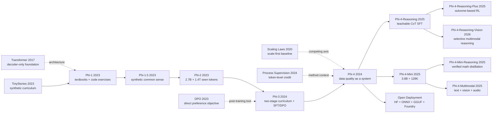

# Phi-4: Turning Data Quality into a Small-Model Reasoning System

> **On December 12, 2024, Microsoft Research released the [Phi-4 Technical Report](https://arxiv.org/abs/2412.08905), framing a 14B dense decoder-only Transformer with only minimal changes from Phi-3 as an argument about how data can be compiled into reasoning ability.** The hook is not that Phi-4 suddenly discovered a new backbone. It is that one small-model system absorbs 9.8T training tokens, 50 broad synthetic dataset types, a 4K-to-16K midtraining stage, and two rounds of preference optimization including Pivotal Token Search; in the report's own table, that package lifts Phi-4 to 56.1 on GPQA and 80.4 on MATH, above the same table's GPT-4o scores of 50.6 and 74.6 on those two benchmarks. The real question the paper forces is therefore not simply whether a 14B model can look bigger than it is, but whether careful seed selection, generation, validation, and mixture design can teach a fixed architecture skills that parameter count alone would have hidden.

## TL;DR

The 2024 [Phi-4 Technical Report](https://arxiv.org/abs/2412.08905) from 27 Microsoft Research authors turns a nearly unchanged 14B decoder-only Transformer into a data-quality-first training system. The core objective is still ordinary next-token prediction, $\mathcal{L}_{\text{NTP}}(\theta)=-\sum_t \log p_\theta(x_t\mid x_{<t})$, but the supervision is recompiled into 50 broad synthetic dataset types, aggressively filtered web and code data, a 4K-to-16K midtraining stage, and SFT followed by two rounds of DPO, including Pivotal Token Search for token-level credit assignment. In the report's main comparison table, that system reaches **56.1** on GPQA, **80.4** on MATH, and **82.6** on HumanEval; the same-size Phi-3 14B scores **31.2 / 44.6 / 67.8**, and GPT-4o's table entries on GPQA and MATH are **50.6 / 74.6**, so Phi-4 surpasses its teacher on precisely the STEM-style tasks its data pipeline targets most directly.

The counter-intuitive lesson is that Phi-4 does not mainly beat a “too-small-parameter” baseline. It beats the weaker assumption that pouring more raw web text into a 14B model is enough. The report's own ablations show the boundary clearly: a synthetic-only route improves HumanEval by **12.1** and MATH by **4.9** relative to Phi-3, yet loses **14.8** on TriviaQA, which means curriculum-shaped data can concentrate a 14B model's capacity on mathematics, code, and STEM reasoning without magically restoring long-tail factual coverage. Phi-4's historical importance is therefore not that small models suddenly replaced large ones, but that seed selection, generation, validation, mixture design, and preference-pair construction became first-class training variables alongside parameter count.

---

## Historical Context

### Where the Small-Model Route Was Stuck in 2024

The language-model race of December 2024 still appeared to be governed by scale. Llama 3.1 had pushed dense open-weight models to 405B parameters; Qwen 2.5 covered both 14B and 72B tiers; GPT-4o, Claude 3.5 Sonnet, and Gemini 1.5 kept moving the capability, context, and product-experience frontier for closed APIs. On that single axis, a 14B model looked like a secondary configuration: easier to deploy, but necessarily discounted in capability because it could not store the same volume of factual knowledge as a 70B or 400B model and would usually receive a smaller training budget.

Microsoft's Phi program had questioned this one-dimensional framing from the beginning without denying scaling laws. Phi-1 asked whether examples organized like textbooks, rather than raw repository and forum dumps, could teach more transferable skill per parameter. Phi-1.5 widened the question from Python to common-sense reasoning. Phi-2 scaled both the model and the number of repeated training tokens. Phi-3 combined synthetic data, aggressively filtered web text, a two-stage curriculum, and SFT/DPO into a deployable family. Phi-4 sharpened the question again: **if the architecture barely changes and the parameter count remains at Phi-3-medium's 14B, how far can better generation, mixture design, curriculum, and post-training move reasoning capability?**

That is a stricter question than “can a small model beat a large model?” Phi-4 exceeds GPT-4o in the report's GPQA and MATH table, yet falls well behind larger systems on SimpleQA, IFEval, DROP, and several long-context tasks. Its contribution is not a declaration that scale no longer matters. It demonstrates that the quality and shape of supervision remain an underexploited axis at a fixed parameter budget. The report states the boundary itself: factual capacity remains limited, strict instruction following is weak, and the model can even answer the comparison between 9.9 and 9.11 incorrectly.

### From “Textbooks” to a Training System: Phi-1, 1.5, 2, and 3

Phi-1 provided the cleanest prototype of this program in June 2023. The model had 1.3B parameters. Its pretraining corpus combined roughly 6B tokens of code selected for educational value with less than 1B tokens of GPT-3.5-generated textbooks, followed by fine-tuning on fewer than 180M CodeExercises tokens. After less than four days on eight A100s, Phi-1 reached 50.6% pass@1 on HumanEval and 55.5% on MBPP. More importantly, the paper did not rely on a leaderboard alone: a 350M model trained on unfiltered code saturated at 12.19% HumanEval after roughly 200B seen tokens; filtering produced 17.68% after 36K steps, and adding synthetic textbooks raised it to 20.12%. That ablation turned “quality” from a slogan into an observable variable.

Phi-1.5 retained the 1.3B architecture in September 2023 and extended approximately 20B tokens of synthetic textbooks into common sense, science, daily activities, and theory of mind. Its usable dataset was about 30B tokens, while the run consumed 150B tokens, 80% sampled from the new synthetic data and 20% from Phi-1 data. Phi-2 grew to 2.7B that December, used a roughly 250B-token dataset, and consumed 1.4T tokens over multiple passes. Microsoft simultaneously acknowledged that public benchmarks could have leaked into training corpora and should not be treated as a final verdict.

Phi-3 completed the transition from research prototype to deployment model in April 2024. The 3.8B Phi-3-mini consumed 3.3T tokens; after 4-bit quantization it occupied about 1.8GB and generated more than 12 tokens per second offline on an iPhone 14 with an A16 Bionic chip. The 7B and 14B variants consumed 4.8T tokens. Its curriculum was explicitly staged: phase one used heavily filtered web data for knowledge and language, while phase two mixed even more selective web text with synthetic data for reasoning and specialized skills; SFT and DPO followed. Phi-4 inherited this complete system, not merely the word “Textbooks.”

| Model | Parameters | Reported data / seen tokens | Main curriculum change | Context / alignment state |
|---|---:|---:|---|---|
| Phi-1 | 1.3B | <7B unique; slightly over 50B seen in pretraining | filtered code + synthetic textbooks + exercise fine-tuning | 2K; code-task fine-tuning |
| Phi-1.5 | 1.3B | 30B dataset; 150B seen | synthetic textbooks expanded to common sense and world knowledge | 2K; no instruction tuning / RLHF |
| Phi-2 | 2.7B | 250B dataset; 1.4T seen | synthetic NLP/code + web filtered for educational value | 2K; base model, no RLHF |
| Phi-3-medium | 14B | 4.8T seen | two-stage web-to-reasoning mixture curriculum | 4K; SFT + DPO |
| Phi-4 | 14B | 9.8T (approximately 10T in the report) | 50 synthetic pipelines + mixture search + 16K midtraining | 16K; SFT + two DPO rounds |

### What the Team Was Building at the Time

The Phi-4 report lists 27 Microsoft Research authors, beginning with Marah Abdin, Jyoti Aneja, Harkirat Behl, Sébastien Bubeck, Ronen Eldan, and Suriya Gunasekar. Core members had pursued the same question continuously from TinyStories and Phi-1: does next-token prediction lack model capacity, or does it lack teaching material organized for linear learning? That continuity explains why the Phi-4 report devotes so much space to data. Its 14B dense decoder remains close to Phi-3-medium; what expands is seed selection, generation workflows, execution checks, mixture experiments, long-context midtraining, and preference-pair construction.

The team's own narrative also became more qualified over time. Phi-1 treated synthetic textbooks as a way to recover teaching signal from noisy code. Phi-1.5 extended the domain with almost entirely synthetic text. Phi-2 brought back more filtered web material. Phi-3 separated knowledge and reasoning phases. Phi-4 finally used a synthetic-only ablation to show that reasoning and coding improved while TriviaQA dropped 14.8 points relative to Phi-3-medium and hallucinations increased. The Phi line was not becoming steadily more convinced that organic data was useless. It was assigning organic data a more precise role: factual coverage, reliable seeds, and long-tail knowledge, while synthetic workflows reorganized those materials into learnable curricula.

Post-training likewise became a research object rather than a standard recipe. Phi-3 already used SFT and DPO. Phi-4 added Pivotal Token Search (PTS) to its first DPO round, locating individual tokens that sharply change the probability of eventual success, then used GPT-4o to judge full responses in a second round. The data-quality program therefore extends from pretraining into preference data: it asks not only which documents deserve training weight, but which branch in a reasoning trajectory deserves the gradient.

### Compute, Open Models, and the Deployment Setting

Phi-4 is “small” relative to frontier models, not in the same sense as a phone-scale model. The official model card records 1,920 H100-80G GPUs, 21 training days, and 9.8T tokens. Multiplying the stated hardware by elapsed time gives roughly 967,680 H100-GPU hours, but neither the card nor the report presents that arithmetic as an audited total-compute figure, and neither discloses full energy use or cost. A 14B BF16 checkpoint alone requires roughly 28GB for weights before KV cache and runtime overhead. It is much easier to deploy privately than a 70B or 405B model, but it is not an unmodified phone model.

Its deployment significance comes from a different combination: 16K context, an MIT license, Hugging Face weights, the standard `transformers` interface, and Microsoft PhiCookBook paths for Microsoft Foundry, GitHub Models, ONNX Runtime, llama.cpp, MLX, and local .NET applications. Compared with API-only systems, this permits quantization, fine-tuning, offline execution, and deployment behind strict data boundaries. Unlike Phi-3-mini's phone demonstration, the original Phi-4 is better understood as a workstation, multi-GPU single-host, or low-latency cloud model.

This cost framing also explains why the report separates QwQ-32B-Preview from the same inference class. It reports QwQ at an average 124.5 points on the fresh AMC-10/12 tests, but using four times as many generated tokens and more than twice the parameters of Phi-4, for an order-of-magnitude higher inference cost. The comparison does not claim that long chain-of-thought is ineffective. It puts latency and token budget back into the definition of reasoning performance: how often a model succeeds and how much inference compute it spends per problem should be reported together.

## Background and Motivation

### Data Quality Is Not a Scalar

“High-quality data” can easily become an unfalsifiable explanation. Phi-4 is useful because it decomposes quality into operations: find seeds in web pages, books, papers, forums, code, and Q&A; transform them into exercises, discussions, question-answer pairs, code instructions, or fill-in-the-middle tasks; validate them with multi-agent generation, self-critique and revision, majority voting, execution tests, and scientific constraints; then search the final allocation through short-horizon 1T-token experiments at 7B scale. Quality here is not a classifier score. It is a joint constraint over **coverage, difficulty, correctness, learnability of the reasoning chain, and similarity between training outputs and inference-time formats**.

The design targets a teaching mismatch in next-token prediction. Human authors revise backward, state conclusions early, and omit mental steps. Training, however, asks the model to predict strictly from left to right. The report calls synthetic trajectories a form of “spoonfeeding”: each step follows naturally from its prefix, making the correct reasoning path learnable at token level. This is not merely asking GPT-4o to restate an answer. It is compiling knowledge into a curriculum with usable gradients.

### Why Synthetic Data Cannot Stand Alone

Phi-4 was not motivated by eliminating the web. It addresses two forms of web inefficiency. The first is pedagogical: valuable logic is buried under advertisements, boilerplate, cross-file dependencies, and nonlinear exposition. The second is distributional: a fact expressed in a forum may look unlike an assistant answer, so “seeing” it during pretraining does not guarantee retrieval during a chat. Web rewrites preserve factual seeds while changing task form; freer synthetic datasets target reasoning skills, difficulty gradients, and multiple solution paths.

Organic data still performs roles synthetic data cannot replace. The report explicitly says organic Q&A questions were substantially more effective than synthetic questions. Its synthetic-only 13B ablation improved MATH, HumanEval, and MBPP, but lost 14.8 points on TriviaQA and hallucinated more. The final mixture therefore keeps 15% filtered web, 15% web rewrites, 20% code, and 10% acquired sources. The central mechanism is not a choice between “synthetic” and “real,” but a loop: organic material supplies world coverage and trustworthy seeds; synthetic workflows turn it into a curriculum; evaluations determine the next seed and mixture revision.

### Beyond Distillation, or Better-Structured Distillation?

The Phi-4 abstract makes its most ambitious claim when it says that exceeding teacher GPT-4o on GPQA and MATH is evidence that the method “goes beyond distillation.” That sentence should be read narrowly. A student exceeding its teacher on selected benchmarks shows that multi-source seeds, validation, rewriting, repetition, curriculum, and post-training can reorganize and amplify useful teacher signal. It does not show independence from teacher models or general superiority over GPT-4o. GPT-4o participates in synthetic generation, SFT response selection, judge-guided DPO, and some generative evaluations.

The report's deeper question is therefore: **can a strong model be used as a data compiler rather than only as an end product, giving a smaller model more capability per parameter on explicit skills?** Phi-4 answers yes, under clear conditions. Curriculum-shaped synthetic data and token-level preference data work especially well for mathematics, STEM QA, and code. Factual tails, strict formatting, multi-turn interaction, non-English use, and long-context reasoning still expose the limits of 14B capacity and of the training distribution. That bounded conclusion is much closer to the evidence than the headline “14B beats 405B.”

---

## Method Deep Dive

The easiest way to misdescribe Phi-4 is to reduce it to “generate more math problems with GPT-4o.” The report presents a data and training system instead. Organic material supplies knowledge-bearing seeds. Generators compile those seeds into linearly learnable textbooks, exercises, and reasoning trajectories. Validators reject errors and unproductive difficulty. Mixture experiments decide how often each source is repeated. Midtraining moves the 4K model to 16K. SFT, PTS-DPO, full-response DPO, and refusal data then shape assistant behavior. The architecture changes little; the production and scheduling of supervision are the method.

### Overall Pipeline: Hold the Architecture Nearly Fixed and Rewrite the Training Data

Phi-4 is a 14B dense decoder-only Transformer. The main report says it closely follows Phi-3-medium: pretraining begins at a 4,096-token context, uses tiktoken with a padded vocabulary of 100,352, and applies full attention over 4K rather than Phi-3-medium's 2K sliding window; midtraining extends the window to 16,384. The official repository's `config.json` further specifies 40 layers, hidden size 5,120, intermediate size 17,920, 40 query heads, 10 KV heads, and RoPE theta 250,000. Phi-4 therefore does not explain its principal gains with MoE, a novel attention mechanism, or a deeper network.

| Component | Official value | Methodological meaning |
|---|---:|---|
| Parameters | 14B | Same class as Phi-3-medium, helping isolate data/curriculum gains |
| Backbone | dense decoder-only Transformer | No MoE routing variable |
| Layers / hidden | 40 / 5,120 | Official released configuration |
| MLP intermediate | 17,920 | SiLU gated MLP configuration |
| query / KV heads | 40 / 10 | GQA, with four query heads per KV group |
| vocabulary | 100,352 | padded tiktoken vocabulary |
| context | 4K pretraining → 16K midtraining | Long context is acquired in a separate stage |
| attention | full attention | No Phi-3-medium-style 2K sliding window at 4K |
| RoPE theta | 250,000 | Positional setting for 16K midtraining |

The complete route can be read as a “data compilation chain.” Notice that organic sources enter twice: one branch is aggressively filtered and trained on directly; the other provides seeds that are rewritten and validated into examples better matched to next-token prediction.

```text
organic sources (web / books / papers / code / Q&A)
        |                         |
        | quality filtering       | seed curation
        v                         v
filtered organic data      synthetic generation (50 broad types)
        |                  rewrite / exercise / dialogue / reversal
        |                         |
        |                         v
        |                  critique / revise / vote / execute
        |                         |
        +-----------+-------------+
                    v
        mixture search at short horizon (1T, mostly 7B proxies)
                    v
        4K pretraining (~9.8T tokens)
                    v
        16K midtraining (250B tokens; 30% new long data)
                    v
        SFT (~8B tokens) -> PTS-DPO -> judge-guided DPO
```

Every stage still rests on ordinary autoregressive training. For a sequence $x_{1:T}$, the base pretraining objective predicts each token from its prefix:

$$
\mathcal{L}_{\text{NTP}}(\theta)=-\sum_{t=1}^{T}\log p_\theta(x_t\mid x_{<t}).
$$

Phi-4's wager is not to replace this objective, but to change the structure of $x_{1:T}$: prerequisites, deductions, and answers should appear in a predictable order so that each gradient resembles a small teaching step instead of asking the model to reconstruct reasoning omitted from a web fragment.

### Key Design 1: Compile Organic Seeds into Textbooks, Exercises, and Verifiable Trajectories

The report says the team created 50 broad types of synthetic datasets totaling about 400B unweighted tokens. That 400B describes the aggregate generation pool, not the number of unique synthetic tokens seen once in the final run. Table 5 separately reports approximately 290B unique synthetic tokens and 13.8 epochs for the final mixture. Conflating the figures obscures the deliberate repetition strategy.

Generation begins with seed curation. Web pages, books, scientific papers, and code snippets are scored for complexity, reasoning depth, and educational value. For web and code, one stage identifies pages with teaching potential; a second segments those pages and scores passages for factual and reasoning content. Q&A seeds use a practical difficulty filter: generate $K$ independent answers to the same question; discard unanimous questions as too easy and fully inconsistent questions as too difficult or ambiguous. In compact notation, the retained middle satisfies $1<\max_y c(y)<K$, where $c(y)$ counts an answer. This notation formalizes the report's rule; it is not a new loss proposed by the paper.

| Stage | Input | Operation | Retained result |
|---|---|---|---|
| Seed curation | web, books, papers, code, Q&A | score educational value, complexity, reasoning depth | information-dense material |
| Difficulty filtering | independent answers to one question | remove unanimous and fully inconsistent cases | learnable, nontrivial questions |
| Rewrite and augment | passage / snippet | turn into exercise, discussion, structured reasoning | text closer to model outputs |
| Self-revision | initial generation | critique against rubrics and rewrite | harder, more accurate version |
| Instruction reversal | existing code / output | infer task instruction and place it first | instruction-output pair |
| Validation | code, math, scientific samples | execution, grounding, consistency checks | verifiable trajectory |
| Agent trajectories | AgentKit interaction | rewrite planning, reflection, and correction | long-horizon reasoning data |

“Synthetic textbook” is therefore not one fixed prose style. Phi-4's appendix shows at least four operations: extracting deduction chains from scientific text and turning them into Q&A; iteratively revising distractors and external-knowledge requirements; deleting a meaningful middle from code and reconstructing it with context plus rejection sampling; and rewriting long AgentKit trajectories into planning, reflection, and action. For code instruction reversal, a pair is retained only when the original and regenerated code have high fidelity.

The following pseudocode restates the disclosed control flow. It does not pretend to reveal Microsoft's undisclosed prompts, thresholds, or teacher configuration:

```python
def build_training_examples(organic_items, generators, validators):
    examples = []
    for item in organic_items:
        seed = score_and_filter(item)              # educational and reasoning value
        if seed is None:
            continue

        candidates = []
        for generator in generators:
            draft = generator.transform(seed)      # exercise, dialogue, QA, reversal
            revised = generator.critique_and_revise(draft)
            candidates.append(revised)

        for candidate in candidates:
            if all(check(candidate) for check in validators):
                examples.append(candidate)         # retain only validated generations
    return deduplicate(examples)
```

The counterintuitive point is that the teacher's answer capability is not the only asset. **The order into which source material is compiled** also matters. The report's example is a human mathematical solution that states the result before reconstructing the derivation. A human can reread and edit; a next-token learner must guess the result before seeing the hidden steps. Synthetic trajectories turn nonlinear authorship into a linear curriculum. They improve learnability, not merely surface fluency.

### Key Design 2: Build a Curriculum with Mixture Weights and Repetition, Not Only Unique Tokens

Phi-4's final pretraining mixture is not a synthetic-only corpus. The report allocates 15% to filtered web, 15% to web rewrites, 40% to synthetic data, 20% to code, and 10% to acquired sources. A footnote explicitly calls web rewrites a synthetic subcategory, while code contains an undisclosed blend of raw and synthetic code. It is accurate to say the synthetic path supplies the majority, but inaccurate to invent a precise “total synthetic percentage” that the report does not provide.

| Data cluster | Training fraction | Unique tokens | Epochs | Primary role |
|---|---:|---:|---:|---|
| Web | 15% | 1.3T | 1.2 | long-tail knowledge and natural-language coverage |
| Web rewrites | 15% | 290B | 5.2 | preserve factual seeds in learnable expression |
| Synthetic | 40% | 290B | 13.8 | textbooks, exercises, reasoning, interactions |
| Code data | 20% | 820B | 2.4 | raw + synthetic code and executable skill |
| Acquired sources | 10% | 580B | 1.7 | academic material, licensed books, and related sources |

The allocation was not chosen by intuition alone. The team compared mixtures at a shorter 1T-token horizon and used high rank correlation between 7B and 14B models on sufficiently distinct mixtures to run most searches on 7B proxies before transfer to 14B. If data cluster $k$ is $D_k$ with sampling weight $w_k$, this is a budget-constrained mixed-risk problem rather than maximization of any one source:

$$
\min_{w_1,\ldots,w_K}\;\sum_j \alpha_j\,\mathcal{E}_j(\theta(w))
\quad\text{s.t.}\quad w_k\ge 0,\;\sum_k w_k=1,\;N_k=w_kN.
$$

Here $\mathcal{E}_j$ can be read as error on capability evaluation $j$, and $N_k$ is the training-token allocation for cluster $k$. The paper does not define its algorithm with this equation; it is a compact rendering of Table 4's multi-objective search. The actual results expose conflicting objectives. The synthetic-heavy S row averages 0.8 points above the final mixture, but loses 6.1 on HumanEval and 3.0 on TriviaQA. Adding more web in S+W gains 6.9 on TriviaQA but loses 4.3 on HumanEval.

| 1T-token mixture ablation | MMLU | MATH | HumanEval | TriviaQA | Average (vs final) |
|---|---:|---:|---:|---:|---:|
| Uniform | -3.3 | -5.4 | -1.2 | +3.3 | -2.2 |
| S | +3.3 | +4.0 | -6.1 | -3.0 | +0.8 |
| S + WR | +0.6 | +1.2 | -1.2 | -3.7 | +0.4 |
| S + W | -0.6 | -0.7 | -4.3 | +6.9 | 0.0 |

The team did not select the synthetic-heavy row with the highest average. It retained knowledge-dense web and targeted acquisitions to balance the capability profile. A second ablation is even clearer: the synthetic-only 13B model gained 12.1 on HumanEval and 4.9 on MATH relative to Phi-3-medium, yet lost 14.8 on TriviaQA and hallucinated more. **More high-quality synthetic tokens are not a free replacement for scaling. They increase the density of selected supervision while narrowing bandwidth to the world's factual distribution.**

### Key Design 3: Move a 4K Model to 16K Instead of Paying Long-Sequence Cost from Scratch

Most pretraining uses 4K full attention. A later 250B-token midtraining stage expands context to 16K, lowers peak learning rate to one tenth of pretraining, and raises the RoPE base frequency to 250K. The team compared inherently long documents with artificially concatenated short examples and found the former better for long-context tasks. It then separated academic, book, and code samples longer than 8K, upweighted 16K+ subsets, and generated new synthetic data longer than 4K.

| Midtraining component | Setting | Rationale |
|---|---:|---|
| Total tokens | 250B | migrate in a short stage instead of repeating ~10T pretraining |
| New long-context data | 30% | supply real cross-section dependencies and new synthetic long tasks |
| pretraining recall tokens | 70% | protect short-context and previously learned capability |
| context | 4K → 16K | expand the released model's window |
| peak LR | 0.1× pretraining | reduce disruption to existing weights |
| RoPE theta | 250,000 | adjust positional frequencies for longer distances |

The noteworthy result is not merely “16K,” but the absence of monotonic improvement. On Phi-4's HELMET rows, moving from 8K to 16K raises ICL from 68.0 to 77.0, QA from 26.7 to 36.0, and summarization from 38.3 to 40.5. RAG falls from 58.1 to 57.1, however, while reranking drops from 65.3 to 54.4. The report does not claim that a 16K window equals robust long-document reasoning. Midtraining makes the window usable and helps selected dependencies; it does not automatically solve retrieval, ranking, or factual integration.

### Key Design 4: SFT, Pivotal Token Search, and Two DPO Rounds

The pretrained model first receives approximately 8B SFT tokens at learning rate $10^{-6}$. The data spans mathematics, code, reasoning, conversation, model identity, safety, and 40 languages, all in ChatML. SFT prompts come from public and synthetic sources; multiple responses are generated and the best is selected by LLM-based evaluation. Two DPO rounds follow: the first targets pivotal tokens, while the second compares complete answers.

| Stage | Data scale | Supervision / preference source | Main objective |
|---|---:|---|---|
| SFT | ~8B tokens | multiple generations + LLM selection | ChatML, math, code, reasoning, chat, safety |
| PTS-DPO | 250,297 pairs (sum of Table 7) | ground-truth oracle + rollout success | concentrate gradients on branch-point tokens |
| Judge-guided DPO | ~850K; listed Table 8 rows sum to 841,842 | GPT-4o compares GPT-4o/GPT-4t/Phi-4 answers | accuracy, style, detail, general preference |
| Safety / hallucination mix | 1%-5% of each DPO stage | refusal, helpful/harmless, and RAI data | reduce fabrication and harmful output |

Standard DPO increases the log-ratio margin of preferred response $y_w$ over rejected response $y_l$ relative to a reference policy:

$$
\mathcal{L}_{\mathrm{DPO}}=-\mathbb{E}\log\sigma\!\left(\beta\left[\log\frac{\pi_\theta(y_w\mid x)}{\pi_{\mathrm{ref}}(y_w\mid x)}-\log\frac{\pi_\theta(y_l\mid x)}{\pi_{\mathrm{ref}}(y_l\mid x)}\right]\right).
$$

Full-response DPO has a credit-assignment problem. A correct final answer can contain a brittle token that receives positive reinforcement with the whole sequence; an incorrect final answer can contain a long correct prefix that receives negative reinforcement. PTS estimates continuation success $p_i=p(\mathrm{success}\mid Q,t_{\le i})$ for prefixes of a completion $T=(t_1,\dots,t_n)$, identifies positions satisfying $|p_i-p_{i-1}|\ge p_{\mathrm{gap}}$, then holds the prefix fixed and contrasts single tokens that raise or lower success.

$$
\Delta_i=p(\mathrm{success}\mid Q,t_{\le i})-p(\mathrm{success}\mid Q,t_{<i}),
\qquad |\Delta_i|\ge p_{\mathrm{gap}}.
$$

The report's algorithm recursively subdivides a sequence, splitting near the midpoint of cumulative token log-probability. Every success estimate requires continuations sampled from the prefix and judged by an oracle. PTS is not guaranteed to find every pivotal token, although it does under near-monotone success probability. For sample efficiency, target questions are restricted to base success probability in $[0.2,0.8]$.

```python
def pivotal_token_pairs(question, full_tokens, oracle, gap=0.2):
    cache = {}

    def success_rate(prefix):
        key = tuple(prefix)
        if key not in cache:
            continuations = sample_completions(question, prefix)
            cache[key] = mean(oracle(question, item) for item in continuations)
        return cache[key]

    for prefix, token in recursively_subdivide(full_tokens, success_rate, gap):
        before = success_rate(prefix)
        after = success_rate(prefix + [token])
        if abs(after - before) >= gap:
            accepted, rejected = find_single_token_alternatives(
                question, prefix, oracle
            )
            yield question + prefix, accepted, rejected
```

Table 7 contains 132,859 generic multiple-choice Q&A pairs, 76,552 math pairs, 16,080 Python pairs, 21,806 C++/Go/Java/JavaScript/Rust pairs, and 3,000 unknown + safety pairs. The second round generates answers from GPT-4o, GPT-4t, and Phi-4 and has GPT-4o score accuracy, style, and detail. The stages are complementary: Table 9 says PTS helps most on GPQA and MATH, while judge-guided DPO is especially effective on ArenaHard, which itself uses a GPT-4 judge.

Hallucination mitigation is also preference design, not an added fact module. Starting from TriviaQA seeds, the team estimates base Phi-4's success rate; easy questions receive correct answers, hard questions receive refusals, and GPT-4o also creates plausible but impossible bogus questions. DPO pairs are `correct > refusal` or `refusal > wrong`, and these pairs use only the first five response tokens. This deliberately lowers SimpleQA F1 because the model guesses less and therefore gets fewer lucky answers. The report argues that “3% correct, 3% wrong, 94% refusal” can be preferable to “6% correct, 94% wrong.” It is a rare explicit sacrifice of leaderboard score for behavior.

### Training Objectives, Recipe, and Reproduction Boundary

| Stage / item | Official disclosure | Reproduction boundary |
|---|---|---|
| Pretraining tokens | 9.8T in model card; ~10T in report | precise and rounded statements of the same run |
| Peak LR / schedule | 0.0003; linear warm-up and decay | full step-by-step schedule undisclosed |
| Weight decay | 0.1 | disclosed |
| Global batch | 5,760 | disclosed |
| Hardware / time | 1,920 H100-80G / 21 days | utilization, energy, and full cost undisclosed |
| Midtraining | 250B; LR 0.1×; 30/70 mixture | per-source long-data inventory undisclosed |
| SFT | ~8B; LR $10^{-6}$; 40 languages | prompts and all selectors undisclosed |
| DPO | one PTS round + one judge-guided round | PTS pseudocode public; production oracle/rollout setup incomplete |

Phi-4 is therefore a report with substantial mechanism disclosure but insufficient corpus disclosure for reproduction. An external team can reproduce the released architecture, ChatML interface, base DPO objective, and PTS concept, and can verify the mixture and benchmark tables. It cannot reconstruct the 50 generator types, seed corpus, licensed books, private data, teacher prompts, filtering thresholds, or all internal judge rubrics. Microsoft's 2025 data summary confirms public, commercially licensed, synthetic, and other source classes, but does not list books or sites. The rigorous conclusion is that the report explains **why this training system can work**; it does not provide a recipe for rebuilding Phi-4 token by token.

---

## Failed Baselines

The Phi-4 report rarely tells a story in which every new component wins. It preserves several useful failed routes: retaining the old recipe at the same 14B scale is insufficient; synthetic-only training loses factual knowledge; a synthetic-heavy mixture with a higher scalar average need not be a better general model; full-response preferences dilute credit assignment; and extending context does not improve every long-document task. Together, these negative results delimit what “data quality” means.

### Baseline 1: Keep the Same 14B Architecture and Continue the Phi-3 Recipe

The cleanest baseline is not a 405B Llama but Phi-3-medium. It is also a 14B model, and Phi-4 “closely follows” its architecture. If parameter count alone fixed capability, retaining the class and merely training longer should not radically reshape performance. Table 1 says otherwise: relative to Phi-3-medium, GPQA moves from 31.2 to 56.1, MATH from 44.6 to 80.4, HumanEval from 67.8 to 82.6, and MMLU-Pro from 51.3 to 70.4. What this baseline loses is not the Transformer structure; it is the supervision distribution.

“Same architecture” must not be misread as “only data changed,” however. Phi-4 consumes the model card's 9.8T tokens rather than Phi-3-medium's 4.8T, while the tokenizer, full 4K attention, 16K midtraining, and post-training recipe also change. The defensible conclusion is that architectural novelty is not the main explanation: data, more tokens, curriculum, and post-training jointly explain the result. The report does not provide a full 14B run that orthogonally isolates all four.

This is a measured counterexample to a scaling-only narrative. Large gains at fixed parameter count show that counting parameters omits the training signal. Nearly doubling the token budget also shows that Phi-4 did not evade compute. It moved part of scale from parameters into generation, filtering, repeated epochs, and evaluator compute.

### Baseline 2: If Synthetic Data Helps Reasoning, Remove the Web Entirely

The report actually trains a 13B synthetic-only ablation, repeating every source more than 20 times. Relative to Phi-3-medium's web/synthetic mixture, it gains 12.1 on HumanEval, 4.9 on MATH, and 4.0 on MMLU-Pro. At first glance, this appears to prove that textbooks can replace the internet. The same row loses 14.8 on TriviaQA, however, and the report explicitly says synthetic-only models underperform on knowledge-heavy benchmarks and hallucinate more.

Adding an equal share of web rewrites increases the MATH gain to 8.1 and HumanEval to 13.3 while narrowing the TriviaQA deficit to -7.7, but it still does not restore factual knowledge. The failure exposes an asymmetry: a generator can turn discovered knowledge into learnable tasks, but it does not guarantee coverage of long-tail facts absent from its seeds. Fluent teacher generations do not automatically create a reliable new factual distribution.

| 13B ablation without raw web (vs Phi-3-medium) | MMLU | MMLU-Pro | HumanEval | MATH | TriviaQA |
|---|---:|---:|---:|---:|---:|
| Synthetic only | +0.8 | +4.0 | +12.1 | +4.9 | **-14.8** |
| Synthetic + Web Rewrites | +0.3 | +4.1 | +13.3 | +8.1 | **-7.7** |

The final model consequently retains 15% filtered web, 10% acquired sources, and a 20% code allocation blending raw and synthetic code. The lesson is not “synthetic data is toxic.” It is that **teachability and factual coverage are separate objectives**. A pure textbook may make derivations easier to learn; it cannot replace a library.

### Baseline 3: Use a Uniform Mixture or Select the Curriculum by One Average

Another natural baseline allocates synthetic, web-rewrite, and filtered-web tokens uniformly. Table 4's Uniform row is 2.2 points below the final mixture on average, with MATH -5.4, GSM8K -5.8, and MMLU-Pro -3.6. A token from each cluster does not have equal marginal value. Equal allocation is neither automatically fair nor optimal.

The subtler failure is choosing the winner by a scalar average. The synthetic-heavy S row averages +0.8 and S+WR averages +0.4 relative to the final mixture, yet the team rejects both because S loses 6.1 on HumanEval and 3.0 on TriviaQA, while S+WR loses 3.7 on TriviaQA. Conversely, S+W gains 6.9 on TriviaQA but loses 4.3 on HumanEval, producing an average of exactly 0.0. A scalar average hides the shape of a model that can reason without knowing facts, or knows facts while code deteriorates.

| Mixture route (vs final mixture) | MMLU | MATH | HumanEval | TriviaQA | Average | Why it was rejected |
|---|---:|---:|---:|---:|---:|---|
| Uniform | -3.3 | -5.4 | -1.2 | +3.3 | -2.2 | most reasoning/code metrics regress |
| S | +3.3 | +4.0 | -6.1 | -3.0 | +0.8 | higher average, imbalanced code and knowledge |
| S + WR | +0.6 | +1.2 | -1.2 | -3.7 | +0.4 | factual gap remains large |
| S + W | -0.6 | -0.7 | -4.3 | +6.9 | 0.0 | facts rise while reasoning and code fall |

The final mixture is an intentional Pareto compromise, not the champion of one Table 4 column. The decision also clarifies that the paper's “data quality” is not a single document score followed by indiscriminate retention. It is allocation of tokens and epochs against a desired capability portfolio.

### Baseline 4: Use Only Full-Response DPO, or Optimize One Leaderboard

The post-training baseline skips PTS and applies only the second, judge-guided full-response DPO stage after SFT. Table 9's `DPO stage 2 only` reaches 69.8 on ArenaHard, above PTS-only's 66.5. If the product objective were solely open-ended answers preferred by a GPT-4 judge, that route would look sufficient. GPQA is only 52.4 and MATH 77.6, however, below PTS-only's 53.6 and 80.5. Combining the stages raises GPQA to 56.1 and ArenaHard to 75.4. Full-response preferences improve global style and presentation; token-level pairs assign credit to reasoning branches.

Even the final two-stage route does not improve everything. SFT starts at 82.8 on DROP, PTS raises it to 86.1, and the final model falls to 75.5. IFEval declines from 66.2 after SFT to 63.0. SimpleQA's decline from 3.7 to 3.0 is intentional: the team teaches refusal under uncertainty, removing many wrong guesses and some lucky correct guesses. Benchmark objectives conflict, and improving user behavior can reduce a score.

Long context supplies the same kind of counterexample. When Phi-4 moves from 8K to 16K in HELMET, ICL rises from 68.0 to 77.0, while RAG falls from 58.1 to 57.1 and reranking from 65.3 to 54.4. Window length is a capacity ceiling, not proof that the model can use every token well.

| Training choice | Benefit obtained | Loss exposed at the same time |
|---|---|---|
| PTS-DPO only | GPQA 53.6; MATH 80.5 | ArenaHard 66.5, below stage-2-only 69.8 |
| Judge-DPO only | ArenaHard 69.8 | GPQA 52.4; MATH 77.6 |
| PTS + Judge-DPO | GPQA 56.1; ArenaHard 75.4 | DROP 75.5; IFEval 63.0 |
| 16K evaluation | ICL 77.0; QA 36.0 | RAG 57.1; reranking 54.4 |

The real anti-baseline lesson is that **high-quality training does not maximize one benchmark; it chooses which regressions are acceptable**. Phi-4 retains web data for factual coverage, sacrifices SimpleQA F1 to reduce fabrication, and combines two forms of DPO to balance reasoning with presentation. Those decisions explain the finished model more accurately than “a small model beats large models.”

## Key Experimental Data

### Main Results: Strength Concentrates in STEM Reasoning and Code, Not Universal Leadership

Table 1 uses OpenAI `simple-evals` with fixed prompts, extraction, and temperature 0.5 for its first benchmark group. MMLU-Pro, HumanEval+, ArenaHard, LiveBench, IFEval, and internal PhiBench use a separate internal framework. The following table preserves six public metrics that expose Phi-4's capability profile. It exceeds GPT-4o on GPQA and MATH and exceeds Qwen 2.5 72B and Llama 3.3 70B on HumanEval, while trailing badly on SimpleQA, IFEval, and DROP.

| Benchmark | Phi-4 14B | Phi-3 14B | Qwen 2.5 14B Inst. | GPT-4o-mini | Llama 3.3 70B Inst. | GPT-4o |
|---|---:|---:|---:|---:|---:|---:|
| GPQA | **56.1** | 31.2 | 42.9 | 40.9 | 49.1 | 50.6 |
| MATH | **80.4** | 44.6 | 75.6 | 73.0 | 66.3 | 74.6 |
| HumanEval | 82.6 | 67.8 | 72.1 | 86.2 | 78.9 | **90.6** |
| MMLU-Pro | 70.4 | 51.3 | 63.2 | 63.4 | 64.4 | **73.0** |
| SimpleQA | 3.0 | 7.6 | 5.4 | 9.9 | 20.9 | **39.4** |
| IFEval | 63.0 | 57.9 | 78.7 | 80.0 | **89.3** | 84.8 |
| DROP | 75.5 | 68.3 | 85.5 | 79.3 | **90.2** | 80.9 |

The table supports specialization. GPQA uses deliberately original graduate-level STEM questions, MATH uses competition mathematics, and HumanEval uses isolated Python functions. All three align closely with domains in which Phi-4's synthetic pipelines and PTS can use verifiers. SimpleQA depends on rare facts, IFEval on exact formatting constraints, and DROP on discrete textual reasoning. They expose parts of the curriculum that received less effective coverage.

“Beating the teacher” must also be read column by column. GPT-4o scores 50.6 on GPQA and 74.6 on MATH, below Phi-4's 56.1/80.4. It scores 90.6 on HumanEval, 39.4 on SimpleQA, and 84.8 on IFEval. A student exceeding a teacher on the most densely recompiled skills is not a generally stronger system.

### Post-Training Ablation: Complementarity and Side Effects of PTS and Judge-Guided DPO

| Benchmark | SFT | PTS-DPO | Judge-DPO only | Final PTS + Judge |
|---|---:|---:|---:|---:|
| MMLU | 82.8 | 84.8 | 84.2 | **84.8** |
| GPQA | 47.3 | 53.6 | 52.4 | **56.1** |
| MATH | 77.1 | **80.5** | 77.6 | 80.4 |
| HumanEval | 79.5 | 81.6 | 81.5 | **82.6** |
| MMLU-Pro | 61.9 | 70.0 | 67.2 | **70.4** |
| ArenaHard | 56.7 | 66.5 | 69.8 | **75.4** |
| DROP | 82.8 | **86.1** | 71.8 | 75.5 |
| IFEval | **66.2** | 63.0 | 63.0 | 63.0 |
| PhiBench (internal) | 48.2 | 54.5 | 53.0 | **56.2** |

The shape of Table 9 matters more than its final column. PTS reaches 80.5 on MATH and the final model reaches 80.4, so the second round adds essentially nothing there. ArenaHard moves from 56.7 after SFT to 66.5 after PTS and then 75.4 after judge-guided DPO. Because ArenaHard itself uses a GPT-4 judge and the second training round also uses GPT-4o evaluation, some of the gain may reflect judge-preference alignment rather than objective correctness alone.

DROP's fall from 86.1 to 75.5 is a warning that two locally useful stages can interfere with capabilities when composed. The report does not provide a final recipe eliminating all such regressions. It also does not release internal PhiBench, so outside readers cannot independently reproduce every mixture and hyperparameter decision.

### Decontamination, Fresh Tests, and Evaluation Boundaries

Phi-4 treats contamination more seriously than early Phi reports without claiming to eliminate it. Appendix B applies hybrid 13-gram / 7-gram checks against ARC-Easy, MBPP, PhiBench, CommonsenseQA, WinoGrande, MedQA, MATH, AGIEval, GPQA, MMLU-Pro, GSM8K, HumanEval, ArenaHard, MMLU, and other test sets. A non-allowlisted 13-gram hit can mark direct contamination; a 7-gram overlap ratio distinguishes partial and full contamination. The report immediately concedes that paraphrases can evade these rules.

| Evidence | Report procedure | What it can exclude | What it still cannot exclude |
|---|---|---|---|
| n-gram decontamination | exact 13-gram features + 7-gram overlap ratio | obvious verbatim or local overlap | paraphrases, isomorphic tasks, teacher memory |
| GPQA | deliberately original questions emphasized as absent from the web | common web copies of test questions | teacher bias, narrow evaluation scope |
| PhiBench | team-written prompts used for mixture/hyperparameter selection | direct overlap with public training sets | external reproduction, development-set overfit |
| Nov. 2024 AMC | 78 unique questions released after Nov. 6, after data collection and hyperparameter selection | Phi-4 directly seeing the test items | task-template transfer, GPT-4o extraction, overlap among four forms |
| `simple-evals` | fixed prompt/extraction, temperature 0.5 | some bias from model-specific private prompts | format sensitivity, sampling variance, one metric |

AMC is the strongest evidence against direct contamination. Appendix C says the four 25-question forms contain 78 unique questions because AMC-10/12 A/B forms overlap; the questions became available on or after November 6, 2024, after training-data collection and final post-training hyperparameter selection. Figure 1 averages scores on the four 150-point forms with repeated temperature-0.5 evaluation. Models often failed to box A/B/C/D/E as requested, so GPT-4o extracted final options. The experiment strongly argues against Phi-4 memorizing those tests. It does not make all evaluation error vanish.

### Key Findings

- **The same-size 14B generation changes substantially.** GPQA rises 31.2→56.1 and MATH 44.6→80.4, supporting data, curriculum, and post-training as major variables; the increase from 4.8T to 9.8T tokens also raises compute.
- **Reasoning specialization is not general superiority.** Phi-4 beats GPT-4o on GPQA/MATH, yet scores 3.0 versus 39.4 on SimpleQA and 63.0 versus 84.8 on IFEval.
- **Synthetic-only is not the destination.** HumanEval +12.1 and TriviaQA -14.8 in the same ablation show that learnable reasoning and factual coverage require separate allocation.
- **PTS improves credit assignment.** GPQA moves from 47.3 after SFT to 53.6 after PTS and 56.1 after both rounds. PTS fits math, code, and QA with ground-truth oracles; it does not generalize to all open tasks for free.
- **A longer window is not stronger long-document ability.** At 16K, Phi-4 gains 9.0 on ICL but loses 10.9 on reranking. “Supports 16K” describes an interface limit.
- **Better behavior can score worse.** Refusal training moves SimpleQA F1 from 3.7 to 3.0 because the team explicitly chooses less fabrication over more guessing.
- **Decontamination reduces risk but does not prove zero leakage.** Hybrid 13/7-gram rules miss rephrasing; fresh AMC provides stronger, still imperfect evidence against direct memorization.

---

## Idea Lineage

### Mermaid Lineage Graph



The graph deliberately omits a single `GPT-4o → Phi-4` distillation arrow. GPT-4o participates in synthetic generation, response selection, and judge-guided DPO, but Phi-4 data also depends on organic seeds, code execution, majority voting, AgentKit trajectories, multiple teachers, and internal processes. Reducing the system to one teacher-student edge would discard the report's central contribution. The graph also does not draw o1, QwQ, or DeepSeek-R1 as Phi-4 descendants: o1 and QwQ were contemporary inference-time reasoning routes in 2024, and DeepSeek-R1 was a later parallel development without primary evidence of direct inheritance from Phi-4.

### Past Lives: From Synthetic Stories to Token-Level Curricula

**Transformer, 2017.** The Phi family inherits the shared foundation of decoder-only Transformers and next-token prediction. Phi-4's counterintuitive feature is precisely how conventional its backbone remains: 40 dense decoder layers, GQA, RoPE, and an autoregressive loss. It moves the research variable from architecture to the sequences shown to that loss.

**Scaling Laws, 2020, and Chinchilla, 2022.** This mainstream line turned the relation among parameters, tokens, and compute into extrapolatable curves. Phi does not refute those curves; it points out that they treat the data distribution as comparatively fixed. Once strong models can filter the web, generate textbooks, execute code, and rewrite deductions, the distribution becomes an optimization variable. Phi-4 still scales training to 9.8T tokens, demonstrating that quality supplements scale rather than granting immunity from compute.

**TinyStories, 2023.** Ronen Eldan and Yuanzhi Li used controlled vocabulary and synthetic short stories to ask how small a coherent language model could be. TinyStories' inheritance was not one benchmark but a curricular view: generators can control coverage, difficulty, and structure, exposing capabilities previously hidden by noise. That line flows directly into Phi-1.

**Phi-1 and Phi-1.5, 2023.** Phi-1 filtered a 35B-token raw code pool into roughly 6B educational tokens, then added less than 1B synthetic textbook tokens and fewer than 180M exercise tokens. Phi-1.5 seeded generation with 20K topics and produced approximately 20B textbook-like tokens, expanding from Python to common sense. Together they established the “textbook + exercise” pattern while exposing problems of generation diversity, factual error, and benchmark contamination.

**Phi-2, 2023, and Phi-3, 2024.** Phi-2 grew to 2.7B and 1.4T seen tokens while bringing filtered web data back into the mix. Phi-3 then explicitly separated a knowledge-heavy first phase from a reasoning-heavy second phase, followed by SFT/DPO. Phi-4's 50 generator types, mixture search, midtraining, and PTS did not appear suddenly. They are the result of engineering “data” across successive generations.

**DPO, 2023, and process supervision, 2024.** DPO offered a preference objective without an explicit reward-model/PPO loop. Math-Shepherd, automated process supervision, and critical-token work moved supervision from final answers into intermediate steps. Phi-4 joins the lines: PTS estimates prefix success through rollouts and an oracle, but emits single-token DPO pairs. The report explicitly frames PTS as automated process supervision that produces preference data suitable for DPO.

| Predecessor line | Inheritance given to Phi-4 | Phi-4's transformation |
|---|---|---|
| Transformer | standard autoregressive decoder | holds backbone nearly fixed and moves novelty into data |
| Scaling Laws / Chinchilla | parameter-token-compute coordinates | adds data distribution and repeated epochs as variables |
| TinyStories | controllable synthetic curriculum | expands stories into 50 reasoning/code/agent data types |
| Phi-1 / 1.5 / 2 | textbooks, exercises, filtered web | turns a narrow prototype into a 9.8T-token mixed system |
| Phi-3 | two-stage training + SFT/DPO | adds mixture search, 16K midtraining, and two DPO rounds |
| DPO / process supervision | preference objective + step credit | uses PTS to generate token-level preference pairs |

### Descendants: One 14B Checkpoint Branches into Reasoning, Mini, Multimodal, and Deployment Lines

**Direct reasoning branch.** [Phi-4-reasoning (2025)](https://arxiv.org/abs/2504.21318) is the clearest direct descendant. Its official model card explicitly says “finetuned from Phi-4,” using prompts selected for teachable difficulty and chain-of-thought demonstrations generated by o3-mini, with a 32K context. Phi-4-reasoning-plus adds a short phase of outcome-based RL to the same base. Its card says accuracy rises while average output grows by roughly 50%, continuing the original report's insistence that reasoning quality must be interpreted alongside latency.

**Compact-model branch.** [Phi-4-mini-instruct (2025)](https://huggingface.co/microsoft/Phi-4-mini-instruct) is not a quantized copy of the original 14B checkpoint. It is a new 3.8B dense decoder with a 200K vocabulary, 128K context, 5T training tokens, and stronger function calling and multilingual support. It inherits the Phi-4 data philosophy and family identity. It should not be described as directly distilled from the 14B weights unless an official source establishes that relation.

**Reasoning-distillation branch.** [Phi-4-mini-reasoning (2025)](https://huggingface.co/microsoft/Phi-4-mini-reasoning) uses the Phi-4-mini architecture and verified mathematical trajectories generated by a stronger reasoning model. Official material identifies that teacher as DeepSeek-R1. This branch corrects the idea that Phi data pipelines depend on one Microsoft or closed teacher. The durable inheritance is a seed, verification, and curriculum pipeline that can connect to different teachers.

**Multimodal branch.** [Phi-4-multimodal-instruct (2025)](https://arxiv.org/abs/2503.01743) is a 5.6B, 128K model using Phi-4-mini-instruct as its language backbone with vision and speech encoders/adapters. It handles text, images, and audio, but those are not capabilities of the original 2024 Phi-4. [Phi-4-Reasoning-Vision-15B (2026)](https://huggingface.co/microsoft/Phi-4-reasoning-vision-15B) later makes an explicit link from the Phi-4-Reasoning backbone to SigLIP-2 and learns `<think>` and `<nothink>` modes, spending reasoning tokens when useful and answering directly on perception tasks.

**Deployment branch.** After the original BF16 Hugging Face weights, Microsoft's official collection added ONNX, GGUF, reasoning, and multimodal formats. PhiCookBook covers Foundry, GitHub Models, ONNX Runtime, llama.cpp, MLX, mobile, and local .NET routes. Phi-4's industrial impact is not only a benchmark table. It made a strong 14B reasoning checkpoint usable in private deployment, quantization, and application-specific safety evaluation.

**Cross-architecture borrowing and cross-task diffusion.** What can be verified is diffusion of the data-quality system from text reasoning into function calling, mathematical distillation, speech/vision, and GUI grounding. The 2026 Reasoning-Vision blog still organizes its method around seed filtering, error repair, synthetic augmentation, and mixture ablations. There is no primary evidence that a named external architecture directly adopted PTS, and no credible cross-disciplinary scientific inheritance chain yet. “No verified case” is preferable to attributing the entire synthetic-data wave to Phi-4.

### Misreadings and Simplifications

1. **“Phi-4 proves small models universally beat large models.”** It does not. It crosses size classes on GPQA, MATH, and selected code metrics while retaining large deficits on SimpleQA, IFEval, DROP, long context, and multilingual use. Fourteen billion describes parameter capacity; it does not erase 9.8T training tokens, 1,920 H100s, or teacher/evaluator compute.

2. **“Synthetic data means asking GPT-4o to write answers.”** The report's synthetic route includes seed curation, web rewrites, question-difficulty voting, self-revision, instruction reversal, execution validation, fill-in-the-middle, and agent trajectories. Unfiltered teacher output is not automatically high-quality data, and errors in organic seeds can amplify through derived documents.

3. **“Phi-4 is a long-chain-of-thought reasoning model.”** The original Phi-4 sees abundant CoT and PTS reinforces important branches, but it has neither the 2025 Phi-4-reasoning model's fixed `<think>` protocol nor its outcome-based RL. The report criticizes long-CoT systems for spending more AMC tokens and admits that the original model can already be too verbose on easy questions.

4. **“After decontamination, MATH and GPQA measure pure generalization.”** Hybrid 13/7-gram filtering cannot see paraphrases or isomorphic tasks; LLM judges may prefer style; PhiBench is not externally reproducible. Fresh AMC materially strengthens the case against direct memorization, but still uses GPT-4o answer extraction and does not cover general capability.

5. **“Open Phi-4 means Phi-4 is fully reproducible.”** MIT-licensed weights and `config.json` enable deployment and fine-tuning, and the report discloses meaningful ablations. The 50 generation pipelines, full seed corpus, licensed books, filtering thresholds, and internal judges are not all released. This is an open-weight industrial report with substantial mechanism disclosure, not a token-for-token reproducible experiment.

6. **“Every later Phi-4 name denotes another ability of the same model.”** Phi-4-mini, multimodal, reasoning, reasoning-plus, and reasoning-vision have different parameter counts, backbones, contexts, data, and release dates. A family lineage documents transfer of methods; it cannot retroactively assign 2025-2026 vision, speech, or RL abilities to the 2024 checkpoint.

---

## Modern Perspective

### Looking Back from 2026: Phi-4 Changed the Unit of Model Engineering, Not the Parameter Race

Two years later, Phi-4's durable contribution is not leadership in one Table 1 column. It forces a different answer to “what is optimized when training a model?” Conventional scaling narratives account in parameters, tokens, and FLOPs. Phi-4 adds seed quality, generation workflows, validators, repeated epochs, capability mixtures, and preference pairs to the method. Data is no longer a static pile of documents prepared before training. It is a program that filters, rewrites, executes, judges, and feeds results back.

Microsoft's own descendants preserve this view. Phi-4-reasoning in 2025 did not begin by replacing the backbone. It started from Phi-4, selected prompts at a “teachable” difficulty, used o3-mini to produce reasoning demonstrations, and applied SFT; reasoning-plus then added outcome-based RL. Phi-4-mini and multimodal moved the data-quality program into 3.8B, 128K, multilingual, vision, and speech settings. Microsoft's 2026 Reasoning-Vision material still centers error repair, seed reuse, synthetic augmentation, and mixture ablations. Phi-4 consequently looks more like a blueprint for a data compiler than a one-time 14B benchmark anomaly.

It also made deployment discussions more honest. Fourteen billion parameters, MIT-licensed weights, `transformers`, ONNX/GGUF, and PhiCookBook genuinely brought a strong reasoning model into private environments, workstations, and single-host multi-GPU systems. Training on 1,920 H100s for 21 days simultaneously shows that the training side was not small. “Small language model” primarily denotes an inference and deployment tier. It does not automatically describe training capital, teacher calls, data engineering, or environmental cost.

### Assumptions That Did Not Hold Up

1. **“Data quality can generally substitute for parameter scale.”** Phi-4's own results reject the unconditional claim. Dense math/code curricula let GPQA, MATH, and HumanEval cross size classes, while factual SimpleQA remains 3.0, IFEval 63.0, and long-context performance uneven. The synthetic-only ablation's -14.8 on TriviaQA is more direct: small parameter capacity still constrains long-tail knowledge. A curriculum can reallocate capacity; it cannot create unlimited capacity.

2. **“Synthetic data is a cheap, independent source.”** It can reduce some human-labeling cost, but depends on strong organic seeds, capable teachers, repeated sampling, self-revision, code execution, oracles, and LLM judges. The Phi-4 model card reports H100s and elapsed time for main training, not the combined computation of 50 generation types, teacher inference, and rejected samples. Training a 14B model may be cheaper than training a frontier model; producing its curriculum is not free.

3. **“n-gram decontamination proves benchmark generalization.”** The report explicitly says rephrasing evades the rules. By 2026, model-generated data, task rewriting, and repeated data loops make verbatim overlap useful only for the simplest leakage. Fresh AMC is stronger because time blocks direct access to test items. It still covers only competition mathematics and still uses GPT-4o answer extraction.

4. **“One fixed leaderboard represents assistant quality.”** Phi-4 intentionally lowers SimpleQA F1 from 3.7 to 3.0 to reduce hallucination, showing that accuracy, refusal, and user risk are not one scalar. ArenaHard depends on judge preference; IFEval depends on formatting; HELMET's 16K tasks move in opposite directions. Model choice must combine correctness, calibration, latency, token use, and failure cost for the application.

| Simplified 2024 assumption | Counterexample inside the report | 2026 judgment |
|---|---|---|
| quality can generally replace scale | synthetic-only TriviaQA -14.8 | quality reallocates capacity; it does not erase capacity |
| synthetic is intrinsically better | organic questions work better; seed errors amplify | generator, seed, and verifier require joint evaluation |
| score after decontamination equals generalization | rephrasing evades 13/7-gram checks | combine fresh, private, and semantic audits |
| context limit equals long-context skill | 16K reranking 65.3→54.4 | report effective context by task |
| higher aggregate score equals better behavior | SimpleQA F1 falls because refusal improves | supplement accuracy with risk and calibration |

### What Time Preserved and What Became Redundant

The durable design is the seed→generation→validation→mixture loop. Later models replace teachers, modalities, and parameter counts while preserving that loop. Multi-objective mixture ablation is equally durable: Table 4 rejects rows with higher averages but distorted capability profiles, reminding teams to define the desired portfolio before allocating tokens. PTS contributes a lasting credit-assignment intuition: decisive information in a long trajectory often concentrates at a few branch points, while full-response labels introduce noise. Fresh evaluation is the final durable element. In an era of saturated public benchmarks and rewritten training data, temporal isolation is often more persuasive than a more elaborate overlap classifier.

Details that have become redundant or misleading include presenting 16K as a long-context differentiator, treating “14B” alone as proof of efficiency, turning two GPT-4o losses into a general superiority claim, and treating PhiBench as external evidence. A 16K interface quickly became ordinary; the real question is effective retrieval and cross-section reasoning. Parameter count must be reported with memory, latency, output tokens, and teacher compute. Internal benchmarks can guide development but cannot replace independent reproduction.

| Design / narrative | Status today | Preserve or rewrite |
|---|---|---|
| data-generation loop | extended into reasoning, mini, and multimodal models | preserve; add cost and provenance ledgers |
| mixture search | still central to capability shape | preserve; jointly optimize with post-training |
| PTS token credit | strong intuition, expensive oracle | preserve for verifiable tasks; avoid universal claims |
| 16K context | usable interface, uneven task performance | rewrite as effective-context reporting |
| “14B beats GPT-4o” | true only on selected benchmarks | replace with capability/cost Pareto analysis |
| internal PhiBench | high-signal development set, not reproducible | release prompts/logs or label as internal evidence |

### Side Effects the Authors Could Not Yet See

1. **Teacher, generator, and judge can form a homogenizing loop.** GPT-4o participates in generation, SFT selection, DPO labeling, and parts of evaluation. Its preferred solution styles and presentation can be written into the student at several layers. A student exceeding the teacher on selected tasks does not imply genuinely diverse supervision. It may instead become unusually good at tasks the teacher can generate, verify, and score, while neglecting social, creative, or open research problems that resist automatic grading.

2. **Data engineering becomes a new invisible moat.** Open weights reduce inference access barriers without exposing the seed inventory, licensed-book list, all prompts, thresholds, or rejection rates. Outside teams can run Phi-4 but struggle to attribute a capability to material or audit copyright, bias, and privacy risk. Scale competition did not disappear; part of it moved from parameter count into proprietary data-pipeline scale.

3. **Reasoning specialization encourages verbosity and overthinking.** The original report already admits long answers to easy questions. The 2025 reasoning-plus card explicitly exchanges roughly 50% more output tokens for higher accuracy. Later Reasoning-Vision therefore introduces `<think>`/`<nothink>` modes, learning when not to reason. Phi-4's success also created a new task: selectively spending inference compute.

### If the Report Were Rewritten Today

- **Publish a data ledger.** For each source cluster, report source class, rights basis, date range, PII handling, unique tokens, epochs, generation teacher, acceptance rate, and approximate generation cost. Item-level private documents need not be exposed for an auditable aggregate to exist.
- **Combine main-training and data-production compute.** Alongside 1,920 H100 × 21 days, report teacher sampling, self-revision, rollouts, oracles, judges, and rejected generation tokens. Only then can data-centric and parameter-centric routes be compared economically.
- **Add semantic contamination audits.** Go beyond 13/7-grams with embeddings, structural isomorphism, answer templates, teacher memory, and temporal splits; publish removal rates, threshold sensitivity, and per-benchmark outcomes.
- **Release an independent reproduction bundle.** Pin the exact `simple-evals` commit, prompts, extraction, raw generations, GPT-4o judge prompt, and AMC grading logs. Split PhiBench into a public held-out set and a truly secret rolling test.
- **Jointly optimize pretraining and post-training mixtures.** The report observes that the synthetic-heavy/final-mixture gap narrows after post-training. A modern rewrite should optimize final assistant metrics directly instead of tuning a base model and repairing it serially.
- **Plot cost Pareto curves.** For each benchmark, report accuracy, average output tokens, P50/P95 latency, memory, quantization loss, and refusal rate. Do not use 14B parameters as the only efficiency proxy.
- **Introduce selective reasoning.** Preserve a short-answer mode and trigger long trajectories only for high-difficulty or verifier-backed tasks. Later Phi-4-Reasoning-Vision demonstrates the practical value of this direction.

The core would remain unchanged: organic material supplies facts and seeds; generators compile knowledge into learnable sequences; verifiers block errors; the mixture determines capability shape. Standard next-token loss $\mathcal{L}_{\mathrm{NTP}}$ may not need replacement. Changing its training distribution can still matter more than giving the backbone a new name.

## Limitations and Future Directions

### Limitations Acknowledged by the Authors

**Factual hallucination and capacity.** The report gives a concrete failure: when prompted with a plausible person's name, the model may invent a full biography. The authors connect this to 14B factual-storage capacity and suggest search augmentation while conceding that retrieval cannot eliminate hallucination. SimpleQA 3.0 is a quantitative shadow of the same problem.

**Strict instruction following.** Exact table, bullet, and style constraints are weak points. IFEval 63.0 trails Qwen 2.5 14B Instruct's 78.7 by a wide margin. The report partly attributes this to synthetic data emphasizing Q&A and reasoning rather than instruction-following scenarios.

**Reasoning is not robust.** The model can answer the 9.9-versus-9.11 comparison incorrectly, showing that high MATH/GPQA scores do not guarantee stable elementary numerical concepts. Abundant CoT data also creates long answers to easy questions. Although usable as a chatbot, the model was tuned mainly for single-turn queries, and conversational drift is underexplored.

**Language, code, and safety scope.** The model card says training is primarily English, with lower quality outside English. Code data is concentrated in Python and common packages, so other languages and APIs require manual verification. Safety post-training, a two-week AIRT exercise, and RAI benchmarks reduce selected risks without eliminating bias, harmful content, jailbreaks, or incorrect advice. The model is not ready to make high-risk decisions alone.

### Additional Limitations from an Independent Reading

**Insufficient corpus disclosure.** Table 5 provides cluster fractions but not a complete dataset inventory. The 2025 data summary confirms commercially licensed and other third-party sources while offering limited source-by-source rights and deduplication detail. Readers cannot reconstruct the distribution or determine whether semantic neighbors of a benchmark entered through the generation chain.

**Circular teacher and evaluator dependence.** GPT-4o serves as generator, selector, judge, and answer extractor. The system is productive, but training goals, evaluation standards, and teacher preferences can reinforce one another. Exceeding GPT-4o on GPQA/MATH is meaningful; it does not establish independence from the teacher ecosystem.

**PTS applicability and expense.** PTS requires an oracle that can determine success and many continuations sampled from prefixes. It fits math, code, and ground-truth QA; it transfers poorly to creative work, complex conversation, or open research. Recursive search also cannot guarantee every pivotal token when success probability is non-monotone.

**Limited long-context evidence.** Midtraining enables 16K, but HELMET includes clear regressions and only five runs per category; QA and summarization use GPT-4o scoring. The report provides no calibration by token position, cross-section distance, or distractor density, and no effective-memory curve for multi-turn chat.

**Opaque training economics.** Official sources state 1,920 H100s and 21 days but omit main-run utilization, data-generation compute, storage/network costs, energy, and total expense. Lower 14B inference cost is a credible deployment advantage. It does not imply cheap or easily reproducible training.

### Improvement Directions

1. **Joint retrieval and calibration training.** Attach RAG/search for factual tails and train the model to decide when to retrieve, refuse, or answer directly. Evaluate selective accuracy, coverage-risk curves, and citation correctness rather than SimpleQA F1 alone.
2. **Instruction and multi-turn specialization.** Use executable validators for JSON, tables, length, and tool calls; add state-consistency tests across turns to address the single-turn-heavy distribution.
3. **Refine verifiable reasoning.** Combine PTS with outcome/process rewards, formal verifiers, and code tests; study search under non-monotone prefix success while suppressing long CoT that adds no value.
4. **Dynamic mixtures with forgetting monitors.** Feed base, SFT, and DPO evaluations back into source weights and continuously track regressions such as DROP/IFEval instead of discovering them only at the final checkpoint.
5. **External data and safety audits.** Release machine-readable data cards, decontamination logs, and multilingual red-team slices; involve independent evaluators, especially for non-English use, bias, copyright, and high-risk domains.

## Related Work and Insights

### Comparison with Adjacent Routes

- **vs Scaling Laws / Chinchilla:** Those works study parameter-token allocation under fixed or coarse data distributions; Phi-4 makes the data itself a compiled object. **Lesson:** inspect a scaling curve's data assumption before choosing between more parameters and denser supervision.
- **vs Llama 3:** Llama 3 uses an 8B/70B/405B family, 15.6T tokens, and open weights to pursue broad frontier capability. Phi-4 holds at 14B and 9.8T tokens while concentrating capability in reasoning and code. **Lesson:** parameter scale and data specialization are composable but not interchangeable axes.
- **vs Qwen 2.5 14B Instruct:** The report says Phi-4 wins nine of twelve benchmarks but loses SimpleQA, DROP, and IFEval. This same-size comparison is more informative than a “versus 405B” headline. **Lesson:** choose models by task vector, not aggregate marketing language.
- **vs o1 / QwQ:** These systems spend longer inference-time reasoning to improve accuracy; original Phi-4 emphasizes a lower token/latency class. **Lesson:** test-time compute is another form of model scale, so reasoning comparisons require output-token accounting.
- **vs DPO / process supervision:** DPO provides full-response preference optimization; process supervision targets intermediate steps. PTS uses rollouts and an oracle to find critical tokens, then emits DPO pairs. **Lesson:** solve credit assignment in long trajectories before collecting more preference volume.
- **vs DeepSeek-R1:** R1 became a parallel RL-and-long-reasoning route in 2025 and later served as the teacher for Phi-4-mini-reasoning. There is no evidence it directly inherits Phi-4. **Lesson:** a data pipeline is valuable when it can absorb better teachers and verifiers, not when it preserves a closed genealogy.
- **vs Phi-4-reasoning:** The direct descendant applies reasoning SFT to original Phi-4, and its plus variant adds outcome RL. This makes Phi-4 a strong base rather than the final inference-time reasoning design. **Lesson:** evaluate pretraining curriculum and downstream specialization separately.

### Lessons for Research and Engineering

For researchers, the most reusable practice is the treatment of negative results. Phi-4 does not hide synthetic-only knowledge loss, Uniform mixture inefficiency, post-training regressions on DROP/IFEval, or task divergence at 16K. A credible data paper should show both what a source strengthens and which capabilities its allocation displaces.

For engineering teams, Phi-4 says a data pipeline must be tested like software. Generated text needs unit tests, executors, majority votes, schema checks, deduplication, and lineage. Mixtures need versions, weights, and regression dashboards. Judges need bias audits. Every post-training release must rerun factuality, format, multi-turn, safety, and latency suites. Data-centric AI does not mean writing less code; it means making data production a software system.

For deployers, the critical step is application acceptance testing rather than repeating “14B.” Phi-4's weights and cost tier are attractive for local STEM assistance, code drafting, and private-document QA. Factual, high-risk, strict-format, multilingual, and long-session use requires retrieval, structured validation, content safety, and a human escalation path. An MIT license grants usage rights; it does not assume responsibility for application reliability.

## Resources

### Core Primary Materials

| Type | Resource | Link | Use in this note |
|---|---|---|---|
| Main report | Phi-4 Technical Report | https://arxiv.org/abs/2412.08905 | methods, tables, decontamination, limitations |
| MSR page | MSR-TR-2024-57 | https://www.microsoft.com/en-us/research/publication/phi-4-technical-report/ | authors, report number, official PDF/transcripts |
| Model card | microsoft/phi-4 | https://huggingface.co/microsoft/phi-4 | 9.8T, 1,920 H100s, 21 days, uses and limits |
| Configuration | config.json | https://huggingface.co/microsoft/phi-4/blob/main/config.json | 40 layers, heads, hidden size, RoPE, 16K |
| Data summary | Data Summary for phi-4 | https://huggingface.co/microsoft/phi-4/blob/main/data_summary_card.md | source classes, licensing, cutoff, disclosure limits |
| Deployment repository | Microsoft PhiCookBook | https://github.com/microsoft/PhiCookBook | Foundry, HF, ONNX, GGUF, MLX, application routes |

### Essential Lineage Reading

| Year | Material | Link | Why read it |
|---:|---|---|---|
| 2023 | Textbooks Are All You Need (Phi-1) | https://arxiv.org/abs/2306.11644 | textbook/exercise, filtering, strong decontamination prototype |
| 2023 | Textbooks Are All You Need II (Phi-1.5) | https://arxiv.org/abs/2309.05463 | synthetic curriculum extended to common sense and world knowledge |
| 2023 | Phi-2 official report/blog | https://www.microsoft.com/en-us/research/blog/phi-2-the-surprising-power-of-small-language-models/ | 2.7B, 1.4T seen tokens, return of filtered web data |
| 2024 | Phi-3 Technical Report | https://arxiv.org/abs/2404.14219 | two-stage curriculum, SFT/DPO, on-device deployment |
| 2023 | Direct Preference Optimization | https://arxiv.org/abs/2305.18290 | base objective for Phi-4's two preference stages |
| 2025 | Phi-4-reasoning Technical Report | https://arxiv.org/abs/2504.21318 | Phi-4 to teachable-CoT SFT and outcome RL |
| 2025 | Phi-4-mini / multimodal report | https://arxiv.org/abs/2503.01743 | new 3.8B/5.6B branches, not the original model |

### Practical Use and Verification

Begin with the official `transformers` example, then choose ONNX, GGUF, llama.cpp, or cloud Foundry according to hardware. For every target task, keep a local test set created after June 2024 and never used for prompt tuning. Record correctness, refusal, format compliance, average output tokens, P95 latency, and quantization deltas. Attach retrieval with checkable citations for factual QA; execute generated code; retain an independent solver or symbolic verifier for mathematics; and never let the model make a high-risk final decision alone.

The conclusion worth carrying forward is not “14B can replace every large model.” It is a harder engineering principle: **what a model learns depends on how the world is compiled into training signals, and the compiler itself must be tested, audited, and costed.**


---

> 🌐 [中文版](/era5_genai_explosion/2024_phi4/) · 📚 awesome-papers project · CC-BY-NC