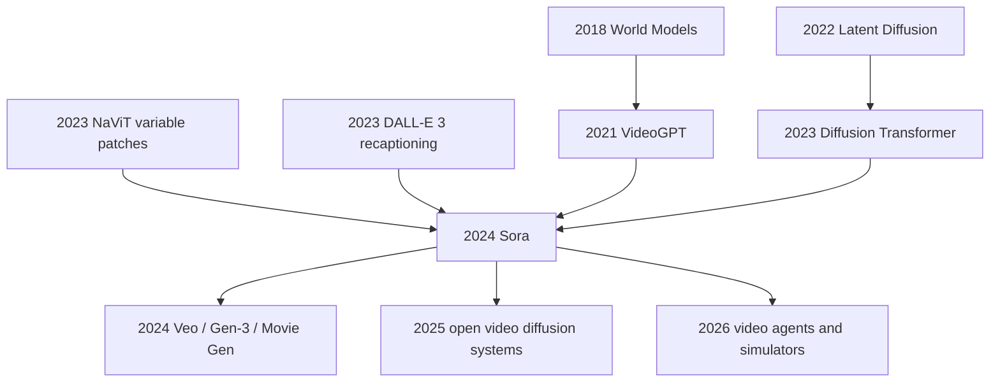

# Sora Technical Report - Video Generation Models as World Simulators

> **On February 15, 2024, OpenAI published [Video generation models as world simulators](https://openai.com/index/video-generation-models-as-world-simulators/): no arXiv paper, no code, no training-data recipe, no parameter count, but a set of one-minute high-definition videos that moved text-to-video from impressive demo to world-model debate.** The unsettling part of the Sora report is not that it gives researchers a reproducible recipe; it does not. It is that the public facts are strong enough to reveal a new abstraction: videos, images, time, camera motion, occlusion, and language control are all folded into spacetime latent patches consumed by a diffusion Transformer. Reading the report well means holding two facts together: Sora shows that diffusion Transformers can scale to diverse video data, and it also shows how closed frontier-model reports increasingly function as capability evidence packets rather than traditional papers.

## TL;DR

OpenAI's 2024 Sora technical report by Tim Brooks, Bill Peebles, Connor Holmes, and 10 coauthors pushes the latent-diffusion line after [DDPM](../era4_foundation_models/2020_ddpm.md) and [Stable Diffusion](../era4_foundation_models/2022_stable_diffusion.md) into the video regime. The public method is: compress raw video into a lower-dimensional spatiotemporal latent representation, decompose that representation into spacetime patches that behave like Transformer tokens, train a diffusion Transformer to predict clean patches through a denoising objective such as $\epsilon_\theta(z_t,t,c)$, and use DALL-E 3-style recaptioning so short user prompts become detailed conditioning captions. The failed baseline it displaced was not a single public leaderboard runner-up; it was the common pre-Sora text-to-video regime of fixed 4-second clips, fixed 256-by-256 resolution, square crops, short action snippets, fragile object permanence, and weak captions that made text control feel stochastic. The counter-intuitive part is that Sora's most influential “experiments” are almost entirely qualitative: minute-long high-fidelity video, native 1920-by-1080 and 1080-by-1920 aspect ratios, images up to 2048-by-2048, forward and backward video extension, zero-shot video-to-video editing, and Minecraft-like digital-world simulation. Because the report explicitly withholds full model and implementation details, this note separates public facts from structured explanation. Sora's historical role is to recast video generation from a beautiful clip generator into a scaling hypothesis for visual world simulators, and to ignite the race that later includes Veo, Gen-3, Movie Gen, and open video diffusion systems.

---

## Historical Context

### The video-generation bottleneck before Sora

Before Sora, video generation occupied an awkward position. Image generation had reached commercial quality through diffusion, latent diffusion, and text-image alignment, while video generation still often felt like animated image synthesis. Earlier RNN, GAN, autoregressive-transformer, and diffusion video models could show short clips, but the constraints were hard: short duration, low resolution, fixed aspect ratio, weak camera motion, fragile identity after occlusion or exit from the frame, and text prompts that felt more like style hints than controllable scripts. The OpenAI report names this background directly: much prior work focused on narrow categories, shorter videos, or fixed-size videos, whereas Sora is presented as a generalist model of visual data.

The bottleneck did not come from a single missing module. Video adds time to images, so compute grows with frame count, resolution, and token count. Video also requires objects to stay coherent through occlusion, rotation, camera cuts, and action-driven interaction. An image model can fool the eye with one frame of texture; a video model must avoid spatial, identity, and causal collapse across many seconds. Sora's historical shock came from pushing several of these constraints outward at once: the report says the largest model can generate a minute of high-fidelity video and shows native landscape and portrait aspect ratios, video extension, image animation, video-to-video editing, and digital-world simulation.

| Stage | Typical route | What it could do | Main bottleneck |
|---|---|---|---|
| 2015-2018 | RNN / GAN video generation | Generate short actions and simple dynamics | Low resolution and unstable training |
| 2021 | VideoGPT / VQ tokens | Discretize video and generate autoregressively | High cost for long video and local error accumulation |
| 2022 | Imagen Video / cascaded diffusion | High-quality short video samples | Complex multistage pipeline and standardized sizes |
| 2023 | latent video diffusion | Better efficiency in latent space | Long-range coherence and text control still weak |
| 2024 | Sora | Minute-long video with variable duration, size, and aspect ratio | Details undisclosed; physical simulation still unreliable |

### Three technical lines converged before 2024

The first line was latent diffusion. Stable Diffusion showed that compressing pixels into a smaller latent space before running diffusion could make high-resolution visual generation tractable. The Sora report states that OpenAI trains a video compression network that compresses videos temporally and spatially into a lower-dimensional latent representation; generation happens in that compressed latent space, and a decoder maps generated latents back to pixels. This is not simply Stable Diffusion with a time axis added, but the historical logic is clear: to scale video diffusion, one must remove much of the pixel-level burden.

The second line was Transformer patchification. ViT, NaViT, MAE, and DiT gradually established patch tokens as a general interface for visual scaling. Sora extends that interface to spacetime latent patches: it does not cut only two-dimensional images, but cuts spatiotemporal blocks from compressed video latents. Videos and images can then be treated as patch sequences; an image is just a one-frame video. This abstraction turns video duration, resolution, and aspect ratio from fixed input formats into variable token grids.

The third line was language control. DALL-E 3-style recaptioning showed that high-quality captions are not decoration for text-to-image generation, but core data engineering for controllability. Sora explicitly reuses this idea: OpenAI trains a highly descriptive captioner to produce captions for videos in the training set, and uses GPT to expand short user prompts into detailed captions before sending them to the video model. In other words, Sora's “language understanding” is not only a property of the user prompt; it is produced jointly by caption-data quality, prompt expansion, and the video generator.

### The OpenAI release context: from GPT-4 to Sora

The release date matters. The 2023 GPT-4 Technical Report had already established a closed frontier-report genre: disclose capabilities, evaluations, risks, and a few method contours, but not a recipe sufficient for reproduction. Sora continues that genre, and in some ways makes it sharper. The report explicitly says it focuses on two things: a unified representation for large-scale training over visual data of many types, and qualitative evaluation of Sora's capabilities and limitations. Model and implementation details are not included.

That means Sora is not a conventional machine-learning paper that can be reproduced from the text. It is closer to a research statement: OpenAI argues that scaling video generation models is a promising path toward general-purpose simulators of the physical and digital world. The phrase world simulators in the title is not merely marketing language; it places video generation inside a longer history of world models, embodied intelligence, game simulation, robotics, and visual prediction. The Sora samples made many observers feel, for the first time, that a video model might be learning an implicit world state rather than merely producing cinematic assets.

### Why it was named a world simulator

The phrase “world simulator” is easy to misread. Sora does not disclose an explicit 3D engine, does not prove that it learned Newtonian physics, and does not provide an interactive environment API. The report's claim is more careful: when video models are scaled on diverse visual data, they exhibit several emergent simulation capabilities, including 3D consistency, long-range coherence, object permanence, simple state changes from interactions, and zero-shot simulation of digital worlds such as Minecraft.

The significance is that these behaviors are not imposed through explicit inductive biases for 3D, objects, scene graphs, or physics engines. They emerge from a scaled video-generation objective. This thesis echoes the GPT-3/GPT-4 language-scaling story: if next-token prediction can learn world knowledge and early forms of reasoning, can next-spacetime-patch denoising learn dynamics of the visual world? Sora does not provide the final answer, but it made this question central to video-generation research after 2024.

## Background and Motivation

### From generating clips to learning the visual world

Sora's motivation was not “make another prettier text-to-video demo.” The deeper question was whether visual data could be unified into tokens the way text was, and then produce general capabilities inside large-scale models. Part of the success of LLMs comes from the token interface: code, math, natural language, and task formats can all become one sequence. The Sora report borrows this analogy directly: LLMs have text tokens, and Sora has visual patches. The difference is that Sora's tokens are not merely spatial patches, but spacetime patches in a compressed latent space.

This motivation explains why the report repeatedly emphasizes variable durations, resolutions, and aspect ratios. If the goal were only to generate fixed-format videos, resize/crop/trim preprocessing would be convenient enough. If the goal is a generalist visual data model, fixed formats throw away real-world composition, camera language, portrait-versus-landscape distributions, and temporal structure. Training on native sizes is meant to let the model learn the original shape of visual data rather than the world after a preprocessing pipeline has cut it down.

### What the report really tries to prove

The first thing the report tries to prove is representational unity: videos and images can enter one diffusion Transformer through compressed latents plus spacetime patches. The second is that scaling works: with fixed seeds and inputs, sample quality improves visibly as training compute increases. The third is that language control can be improved: recaptioning and prompt expansion improve text fidelity and overall quality. The fourth is that emergent simulation deserves serious attention: the model exhibits 3D consistency, object permanence, simple state changes, and digital-world simulation.

These claims rest on public samples and qualitative observations rather than complete benchmark tables. To a traditional academic reader, that can feel like weak evidence; for industrial frontier modeling, it was strong enough to change the direction of the field. Like GPT-4, the Sora report places capability visibility before method reproducibility. That priority itself is part of the AI research landscape in 2024.

### The disclosure boundary is itself historical evidence

The most important caution when reading Sora is that the report explicitly withholds model and implementation details. Parameter count, data sources, data filtering, training compute, optimizer, captioner architecture, decoder quality, sampling steps, safety filtering, and evaluation protocol are not fully disclosed. Any interpretation that writes Sora as if it were an open recipe misleads the reader.

But limited disclosure does not mean no methodological contribution. The public text is enough to establish several key designs: video compression network, spacetime latent patches, diffusion Transformer, native-size training, recaptioning, image/video prompting, qualitative capability analysis, and explicit limitations. Sora's historical position is exactly there: it is both a strong signal for video-generation scaling and a typical artifact of the closed technical-report era. Readers must learn to analyze both what it demonstrates and what it prevents us from verifying.

---

## Method Deep Dive

A method deep dive for Sora must begin by drawing a boundary. The OpenAI report does not disclose parameter count, layer count, training-data composition, training compute, optimizer, sampling steps, safety-filter details, or code. This section is therefore not a reconstruction of OpenAI's internal training recipe. It separates facts explicitly disclosed by the report, a structured explanation that follows from those facts, and details we should not pretend to know. The public facts are clear: Sora generates videos and images in a compressed latent space, decomposes visual data into spacetime latent patches, uses a diffusion Transformer for denoising prediction, supports variable duration, resolution, and aspect ratio during training, and improves language conditioning through recaptioning.

### The boundary between public fact and structured explanation

The report's most important sentence is that model and implementation details are not included. It lets us describe Sora's high-level architecture, but not invent a recipe. The table below separates what can be stated, what can be explained structurally, and what should remain unknown:

| Layer | Public fact | Structured explanation | Should not be invented |
|---|---|---|---|
| Representation | Videos are compressed into low-dimensional latents and cut into spacetime patches | Patch sequences let videos and images share a Transformer interface | Patch size, latent channels, compression ratio |
| Generation objective | Sora is a text-conditional diffusion model | The model learns to predict clean patches from noisy patches | Noise schedule, parameterization, loss weights |
| Architecture | Sora is a diffusion Transformer | A DiT-like backbone is suited to visual-token scaling | Layer count, width, attention variants |
| Data | Videos and images are trained at native sizes | Variable token grids preserve composition and temporal structure | Data sources, filtering strategy, licensing scope |
| Language | DALL-E 3-style recaptioning is used for video captions | Caption quality improves prompt fidelity | Captioner architecture and human-review process |

### Overall framework: a latent spacetime-patch diffusion Transformer

Sora can be abstracted as a four-step system. First, a video compression network maps raw video $x$ into a spatiotemporal latent $z$, and a paired decoder maps generated $\hat z$ back to pixels. Second, a patchifier decomposes $z$ into a sequence of spacetime blocks $p_1,\dots,p_N$, which enter a Transformer like text tokens. Third, diffusion corrupts the patch latents, and the model predicts clean patches or noise under text condition $c$. Fourth, sampling starts from a random patch grid arranged for the target duration, resolution, and aspect ratio, then gradually denoises and decodes it into video.

$$
z = E(x), \qquad \{p_i\}_{i=1}^{N}=\mathrm{Patchify}(z), \qquad \hat{x}=D(\hat{z}).
$$

| Stage | Input | Output | Role in the report |
|---|---|---|---|
| Compression | raw video / image | spatiotemporal latent | Reduce dimensionality so video generation can scale |
| Patchification | compressed latent | spacetime patch tokens | Unify video and image representation |
| Denoising training | noisy patches + text | clean patch / noise prediction | Learn the conditional generation distribution |
| Native-size training | variable duration/resolution/aspect ratio | flexible token grids | Preserve framing and support landscape or portrait output |
| Decoding | generated latents | pixel video / image | Convert latent samples into viewable content |

The core of this framework is not one isolated trick, but the conversion of all visual data into scalable token sequences. If tokens are the unified interface for text, spacetime patches are Sora's unified interface for visual data.

### Key design 1: compress video into a generative latent space

Video pixel space is enormous. If a video has $T$ frames, resolution $H\times W$, and 3 color channels, the raw tensor grows with $T H W$. Running diffusion directly over pixels would make Transformer token count and denoising cost explode. Sora therefore first trains a video compression network that compresses both time and space:

$$
E: \mathbb{R}^{T\times H\times W\times 3}\rightarrow \mathbb{R}^{T'\times H'\times W'\times C}, \qquad T'H'W' \ll THW.
$$

The public fact is that a compression network and paired decoder exist. The structured explanation is that this plays a role analogous to the VAE in latent diffusion, but now must preserve temporal consistency as well. If the compressor is too aggressive, it loses details; if it is too weak, the downstream Transformer remains too expensive. The Sora report gives no compression ratio or reconstruction metric, so we cannot evaluate the concrete design. We can only say that latent-space generation is a precondition for scalable video generation.

### Key design 2: spacetime patches turn size into a condition

Traditional video-generation pipelines often crop every video to the same size and duration, such as 4 seconds, 256-by-256 resolution, and square crops. That makes training convenient, but damages real composition and temporal structure. The Sora report emphasizes native-aspect-ratio training and shows one model sampling 1920-by-1080 landscape videos, 1080-by-1920 portrait videos, and other sizes. The key is that once compressed latents are decomposed into spacetime patches, different videos are simply patch grids of different shapes.

$$
N = \left\lceil\frac{T'}{\tau}\right\rceil
    \left\lceil\frac{H'}{h}\right\rceil
    \left\lceil\frac{W'}{w}\right\rceil,
$$

where $\tau,h,w$ are spacetime patch sizes and $N$ is the token count. At inference time, a portrait video is initialized as a portrait-shaped noise patch grid; a single image is just a one-frame temporal extent. This design moves “output format” from post-processing into the generation process itself.

| Training strategy | Data handling | Advantage | Cost |
|---|---|---|---|
| Fixed square crop | resize/crop to one size | Simple batching and compatibility with old pipelines | Cropped subjects and distorted composition |
| Fixed short clips | trim to one duration | Controlled temporal token count | Weak long-range dependency learning |
| Native-aspect-ratio training | preserve landscape, portrait, and in-between ratios | More natural framing and direct device adaptation | More complex batching and attention |
| Sora-style patch grid | represent different shapes as patch sequences | One model controls duration and size | Requires strong engineering and data scheduling |

### Key design 3: a diffusion Transformer performs denoising prediction

Sora is a diffusion model and a diffusion Transformer. Diffusion training can be abstracted as: corrupt clean latent patches $z_0$ into $z_t$, and train the model to predict noise or clean latents at timestep $t$ under caption condition $c$:

$$
\mathcal{L}(\theta)=\mathbb{E}_{z_0,t,\epsilon,c}\left[\left\|\epsilon-\epsilon_\theta(z_t,t,c)\right\|_2^2\right],
\qquad z_t=\alpha_t z_0+\sigma_t\epsilon.
$$

Why a Transformer? Once a patch sequence exists, video generation becomes long-token-sequence modeling. Local convolutions can handle texture, but long-range object consistency, camera motion, and cross-frame dependency require the model to exchange information across distant patches. This is where DiT connects historically to Sora: after visual data is tokenized, the scaling behavior of Transformers can transfer from language and images to video.

The report shows an important qualitative phenomenon: with fixed seeds and inputs, sample quality visibly improves as training compute increases. This is not a formal scaling-law curve, but it supports an engineering judgment: video diffusion Transformers, at least in the public demonstration range, did not immediately hit a scaling wall. Sora's methodological contribution is to make credible the idea that video can improve through tokenization, Transformers, diffusion, and scale in the same broad way that language and images did.

### Key design 4: recaptioning turns language into a control interface

The controllability of video generation depends heavily on captions. If training videos have only coarse labels, a model has little chance of learning conditions such as “a person in a red sweater turns left and then picks up a glass.” Sora reuses the DALL-E 3 recaptioning technique: train a highly descriptive captioner, use it to caption videos in the training set, and use GPT to expand short user prompts into more detailed captions before sending them to the video model.

This step is easy to underrate because it does not look like architecture. For text-to-video, however, the caption is the language side of the supervision signal. If captions do not describe camera motion, subjects, actions, background, style, and temporal change, even a strong visual generator cannot reliably follow user intent. The Sora report says descriptive captions improve text fidelity and overall video quality. That means semantic density in data is itself part of the method.

### Pseudocode: conceptual training and sampling flow

The pseudocode below is not OpenAI's internal implementation. It is a conceptual flow organized from the public report. It omits distributed training, data filtering, safety systems, concrete noise schedules, and decoder details, and expresses only the structure that the Sora report confirms:

```python
def train_sora_like_model(videos, images, captioner, encoder, decoder, dit, noise_schedule):
    for visual_item in mix(videos, images):
        caption = captioner.describe(visual_item)
        latent = encoder.compress_spacetime(visual_item)
        patches = patchify_spacetime(latent)

        step = noise_schedule.sample_step()
        noise = sample_gaussian_like(patches)
        noisy_patches = noise_schedule.add_noise(patches, noise, step)

        predicted_noise = dit(noisy_patches, step=step, text=caption)
        loss = mse(predicted_noise, noise)
        loss.backward()


def sample_sora_like_model(prompt, output_shape, gpt_rewriter, dit, decoder, noise_schedule):
    detailed_caption = gpt_rewriter.expand(prompt)
    noisy_grid = initialize_spacetime_noise(output_shape)
    denoised_patches = iterative_denoise(noisy_grid, detailed_caption, dit, noise_schedule)
    latent = unpatchify_spacetime(denoised_patches, output_shape)
    return decoder.to_pixels(latent)
```

| Capability | Origin layer | Public evidence | Caution |
|---|---|---|---|
| Minute-long video | patch latents + scalable DiT | report abstract and samples | Stable success rate not disclosed |
| Landscape/portrait generation | native-aspect-ratio patch grid | 1920-by-1080 and 1080-by-1920 examples | Batching details not disclosed |
| Image generation | one-frame video view | images up to 2048-by-2048 | Not a separate image-model specification |
| Video extension/connection | conditional denoising over video context | forward/backward extension demos | Failure rate unknown |
| World-simulation signs | long-range visual dynamics | 3D consistency, object permanence, Minecraft | Not an explicit physics engine |

The most important thing in reading Sora's method is not to mistake a conceptual diagram for a reproduction recipe. The public facts are enough to explain why it mattered: video generation was reframed as conditional diffusion inside a unified visual-token space. The engineering details that make it work remain inside OpenAI's black box.

---

## Failed Baselines

### Why Sora has no traditional failed-baseline table

The Sora report does not include a conventional ablation table, nor public-benchmark numbers for FVD, CLIP score, human-preference win rate, or success-rate curves. Its failed baselines must be read differently: not “model A beats model B by this many points,” but “which common design assumptions in pre-2024 video generation are bypassed by Sora's public samples and technical description?” That also means we should not invent numbers. Sora's failed baseline is a set of method routes and product experiences rather than a complete reproduced experiment table.

### Failed route 1: fixed-size short-video training

The first challenged route is standardizing all videos into short clips and fixed square sizes. This makes batching easy and preserves compatibility with image-generation pipelines, but it loses two things: composition is cropped away, sometimes leaving only part of the subject, and the model never truly sees the visual distribution created by landscape videos, portrait videos, long shots, and different device formats. The Sora report explicitly compares native-aspect-ratio training with a square-crop version, noting that the square-crop model sometimes places the subject partly out of view, while Sora has better framing.

### Failed route 2: treating video as post-processed image frames

The second failed route is understanding video generation as “make nice frames, then glue them together with interpolation or temporal smoothing.” This can produce local visual quality, but struggles with long-range object permanence. Is a character still the same character after leaving and reentering the frame? Do foreground and background stay 3D-consistent during camera motion? If a person eats food or leaves strokes on a canvas, does the state persist? Sora's public samples do not always succeed, but they move these questions into the generative objective rather than leaving them for post-processing.

### Failed route 3: weak captions produce weak control

The third failed route is treating captions as incidental metadata. Early video datasets often contain only short tags or coarse descriptions. That lets a model learn roughly what a video is, but not how actions unfold over time. Sora's recaptioning directly targets this weakness: a highly descriptive captioner produces richer text for training videos, and GPT expands short user prompts into detailed conditioning text. The failed baseline is therefore not merely a smaller model; it is supervision whose language side is too thin.

### Failed route 4: misreading simulation capability as a physics engine

The fourth failed route comes from overinterpreting Sora: seeing 3D consistency and object permanence in samples, then treating the model as if it had already learned a true physical world engine. The report itself rejects that reading. Sora does not accurately model many basic interactions, such as glass shattering. Actions such as eating food do not always produce correct object-state changes. Long samples can still develop incoherence or spontaneous object appearances. Sora's strength is learning generative dynamic priors from visual data, not replacing explicit physical simulation.

| Failed baseline | Challenged assumption | Sora's response | Remaining issue |
|---|---|---|---|
| Fixed 4s / 256x256 | Standardized sizes are enough for video models | Native duration, resolution, and aspect-ratio training | Token and batching cost undisclosed |
| square crop | Cropping to square does not hurt content | Native aspect ratio improves framing | Data scheduling details unknown |
| frame generation + post-processing | Temporal coherence can be patched later | Direct modeling over spacetime patches | Long samples can still drift |
| weak captions | Coarse labels are enough for text-to-video | Recaptioning improves text fidelity | Captioner bias and review unknown |

## Key Experimental Data

### Key evidence in the public report

Sora's key experimental data is mostly public qualitative evidence plus a small set of quantitative specifications, not a traditional benchmark table. The hardest numbers in the report include: the largest model can generate a minute of high-fidelity video; it can sample 1920-by-1080 landscape videos and 1080-by-1920 portrait videos; it can generate images up to 2048-by-2048; and when training compute increases from base compute to 4x and 32x, sample quality visibly improves for fixed seeds and inputs. These numbers do not equal a full evaluation, but they show that the system is aimed at scalable generalist video generation rather than short demos.

| Evidence type | Public content in the report | Supported conclusion | What it cannot prove |
|---|---|---|---|
| Duration | one minute of high-fidelity video | Long-form generation advanced sharply | Stable success rate |
| Size | 1920-by-1080 and 1080-by-1920 | Native landscape and portrait sampling are feasible | Uniform stability at all resolutions |
| Images | up to 2048-by-2048 | An image can be treated as a one-frame video | Superiority over dedicated image models |
| Scaling | base / 4x / 32x compute improves samples | DiT video scaling is effective | A complete scaling law |
| Language | recaptioning improves text fidelity | Caption data engineering is central | Perfect prompt following |
| Simulation | 3D consistency, object permanence, Minecraft | Signs of implicit dynamics modeling | A real physics engine |

### How to read qualitative evaluation

The virtue of qualitative evaluation is that it directly displays phenomena humans care about: whether the camera feels natural, whether characters stay consistent, whether prompts are followed, whether long shots collapse, and whether the world has perceivable dynamic regularities. Video generation especially needs this kind of display because many failures are hard to cover with one number. Sora's samples of waves, street scenes, animals, people, game worlds, and video-editing tasks made the jump in distributional diversity and cinematic control visible.

The risk of qualitative evaluation must also be explicit. Samples can be selected; failure rate, number of retries, prompt tuning, and human-selection criteria are not disclosed. The report's phrase “often, though not always” matters: Sora is often able to model short- and long-range dependencies, but not always. The right experimental conclusion is therefore “the capability ceiling and research direction are demonstrated,” not “average reliability has been fully proven.”

### Undisclosed numbers are part of the experimental conclusion

The most important experimental gap in Sora is the lack of a public, reproducible quantitative protocol. There is no public video-test-set result, no unified human-preference evaluation, no failure-rate distribution, no success rate by prompt type, no strict comparison with Runway, Pika, Imagen Video, or other systems, and no detail on safety or copyright filtering. These gaps matter because they decide whether the research community can turn Sora's claims into comparable scientific conclusions.

| Undisclosed item | Why it matters | Effect on the reader | Reasonable reading |
|---|---|---|---|
| Data sources | Copyright and distribution shape capability boundaries | Data governance cannot be audited | Treat data as a black-box variable |
| Success rate | Samples may or may not reflect the average | Product reliability cannot be estimated | Read samples as capability ceilings |
| Compute | Scaling cost affects reproducibility and economics | Reproduction threshold is unknown | Discuss direction without guessing cost |
| Safety filtering | Video misuse risk is high | Protection strength cannot be evaluated | Consult separate safety material |
| Controlled comparisons | Needed to identify which design matters | Module contributions cannot be isolated | Do not read the report as an ablation paper |

This experimental form makes Sora both powerful and incomplete. It is powerful because the public samples were strong enough to redirect research. It is incomplete because outside researchers cannot reproduce the average performance. A deep note should preserve that tension rather than rewrite marketing material into a conventional results table.

---

## Idea Lineage

Sora's idea lineage is not a single story of “video generation got bigger.” It connects three older lines: world models wanted agents to predict environments in latent space; visual generation wanted to compress pixels into scalable latents; Transformer scaling wanted to turn different modalities into token sequences. Sora's novelty was to place those ideas inside video generation, the modality where visual mistakes are hardest to hide, and to use the title “world simulators” to put aesthetic generation, physical prediction, and digital-environment simulation into one narrative.

### Before: from world models to visual tokens

World Models in 2018 made latent environmental simulation a bridge between reinforcement learning and generative modeling. VideoGPT in 2021 showed that video could be compressed into discrete tokens and then generated autoregressively by a Transformer. Latent diffusion in 2022 showed that visual generation did not have to bear the full cost of pixel space. DiT in 2023 showed that diffusion models could use Transformers as scalable backbones. These works did not directly produce Sora, but they supplied four concepts Sora needed: latent space, video tokens, diffusion generation, and Transformer scaling.

### After: Sora rewrites video generation as a simulation hypothesis

The Sora report rewrote the question from “how can we generate clearer video?” to “can scaled video generation produce world-simulation capability?” That reframing matters because video generation stops being only a creative tool and becomes a candidate route to visual world modeling. The report's 3D consistency, long-range coherence, object permanence, interacting with the world, and Minecraft simulation examples all suggest the same thing: to generate convincing video, a model must maintain some internal state about scenes, objects, actions, and time.



### Misreading: Sora is not a complete physical world engine

The most common misreading is treating Sora's samples as evidence that physical law has been solved. The report's own wording is more cautious than much public discussion: Sora exhibits numerous limitations as a simulator. It can simulate some aspects of people, animals, and environments, but glass shattering, object-state changes caused by eating, long-sample incoherence, and spontaneous object appearances remain failure modes. Sora is therefore better understood as a strong generative model of visual dynamic priors, not as a verifiable physics simulator.

Another misreading is treating Sora as only a product demo and ignoring the method abstraction. Even without a full recipe, the choice of spacetime patches changed the language of later research. After 2024, many video models competed around long-range coherence, native aspect ratio, video editing, image-to-video generation, video extension, and physical consistency. Sora placed these goals in one coordinate system.

### Influence: closed shock and open catch-up happened together

After Sora, video generation quickly became a frontier-company race. Google Veo, Runway Gen-3, Meta Movie Gen, and related systems all responded around long video, camera control, editing, and high-fidelity samples. At the same time, open and semi-open communities began catching up: more efficient video diffusion, controllable motion modules, open data pipelines, LoRA fine-tuning, camera control, and video-to-video editing all became active directions. Sora itself is not open, but it clarified what everyone was trying to catch.

| Idea thread | Before Sora | Sora's turn | Later inheritors |
|---|---|---|---|
| world models | latent prediction for agents and environments | video generation framed as a simulation path | video agents, robotics simulators |
| latent diffusion | lower-cost image generation | video generated in compressed latent space | open video diffusion systems |
| Transformer scaling | tokenized text and images | spacetime patches become video tokens | DiT video models |
| recaptioning | DALL-E 3 text-image control | video captions become central to control | prompt rewriting for video |
| closed reports | GPT-4-style capability evidence packet | video models enter the black-box release genre | Veo, Movie Gen, frontier demos |

Sora's intellectual significance is therefore double-sided. It made it plausible to treat video generation models as candidate world simulators, and it reminded the research community that the most important capability demonstrations may come from closed systems that cannot be reproduced. The first side pushes methods forward; the second pushes open alternatives and evaluation norms.

---

## Modern Perspective

### Looking back from 2026: what changed

Looking back from 2026, Sora changed three things. First, it moved the target of video generation from “short-clip quality” to “long-range visual coherence.” Before Sora, much of the discussion focused on whether an individual clip looked clear. After Sora, researchers and product teams cared more about whether a character keeps identity for a minute, whether camera motion feels like real cinematography, whether objects remain present after occlusion, and whether actions change world state.

Second, it placed video models inside the discussion of world models and agents. The Minecraft sample, 3D consistency, and object permanence made people imagine whether a model that predicts video dynamics could help robotics, game agents, planning systems, or simulated environments. That vision is not fully realized, but the research question changed. Video generation is no longer only content production; it may be a route to learning actionable world representations.

Third, it reinforced the industry rhythm of closed frontier demos. Sora did not publish a recipe, but it was enough to reorder the priorities of competitors and open communities. After 2024, systems such as Veo, Gen-3, Movie Gen, Wan, and HunyuanVideo all had to speak to long video, control, editing, and simulation capability. Like GPT-4, Sora reset the target line through a public capability demonstration that could not be reproduced.

### Judgments that still hold

The strongest judgment in the Sora report is that video and images should share a unified visual-token interface. Spacetime latent patches make an image a one-frame video, make different aspect ratios different patch grids, and make the generated format part of the model condition. This abstraction remains valid because later video models still have to solve variable size, long-range coherence, and conditional control.

The second judgment that still holds is that caption data engineering determines control quality. Whatever architecture later models use, text-to-video must solve the problem of whether training text describes temporal change richly enough. Better prompt rewriting, finer motion captions, stronger vision-language labeling, and safer filtering are all extensions of Sora's recaptioning idea.

| Judgment | 2024 evidence | 2026 status | Why it still matters |
|---|---|---|---|
| video needs latent generation | Sora trains and samples in compressed latent space | mainstream video diffusion still relies on compressed representations | pixel-space cost is too high |
| patch tokens are a unified interface | spacetime patches cover both images and videos | variable-size video models still use token grids | supports duration and aspect-ratio control |
| native aspect ratio matters | square crop harms composition | product video needs landscape, portrait, and square formats | post-hoc cropping is insufficient |
| recaptioning is method | descriptive captions improve text fidelity | prompt rewriting becomes standard | text supervision determines controllability |
| scaling remains worth pursuing | 4x/32x compute samples improve | frontier video labs keep scaling models | public scaling law is still missing |

### Assumptions that no longer hold

The weakest assumption is that simply scaling video generation will naturally yield a reliable world simulator. Sora showed emergent simulation capabilities, but also showed limitations: incorrect physics, wrong state changes, long-range incoherence, and spontaneous object appearances. By 2026, a more reasonable view is that video generation can learn strong visual priors, but becoming a world model for robotics or scientific simulation also requires interaction, action conditioning, state estimation, constraint verification, and controllable environmental feedback.

The second assumption that no longer holds is that beautiful samples are enough to prove average ability. Video-model failure depends heavily on prompt, sampling, selection, and retries. Sora's samples prove a capability ceiling, but not a substitute for systematic evaluation. Later video-generation research increasingly needs public failure taxonomies, human-preference protocols, prompt distributions, duration-stratified metrics, physical-consistency tests, and copyright/safety audits.

## Limitations and Future Directions

### Technical limitations

Sora's first technical limitation is physics and causality. The report itself acknowledges that the model does not accurately simulate many basic interactions, such as glass shattering. Actions such as eating food do not always produce correct object-state changes. That means the model has learned visual statistics and dynamic priors, not a verifiable causal world model. For content generation, these may be occasional artifacts; for robotics, simulation, and planning, they become central problems.

The second limitation is long-range reliability. Sora can generate one-minute video, but “can generate” is not the same as “generates reliably.” The longer a video becomes, the easier it is for identity, geometry, object count, background layout, and action goals to drift. Video models need more than local denoising quality; they need memory, state binding, and constraint propagation. Future methods may combine explicit 3D representations, scene graphs, tracking, world-state memory, or test-time correction.

### Disclosure limitations

Sora's largest scientific limitation is irreproducibility. The report does not provide parameter count, data, training compute, evaluation protocol, or failure rate. Outside researchers can observe samples and product behavior, but cannot independently verify internal mechanisms. This makes Sora more of a signpost than an inheritable recipe. It is powerful for industry and leaves many questions unanswered for the scientific community.

Limited disclosure also affects safety discussion. Video generation touches likeness rights, copyright, misleading media, political propaganda, child safety, and deepfakes. Without detailed data governance, filtering strategy, red-team protocol, and deployment constraints, the outside world cannot evaluate whether risk mitigations are sufficient. Future frontier video-model reports need more systematic safety evaluation and governance interfaces than Sora provided.

### If rewritten today

If the Sora technical report were rewritten in 2026, it should add at least four kinds of content. First, standardized evaluation: success rates by duration, resolution, prompt type, action complexity, character consistency, and physical interaction. Second, a public failure taxonomy: which scenes fail most often, and whether the error is object disappearance, identity drift, motion discontinuity, or causal-state error. Third, layered system disclosure: separate the base video model, captioner, prompt rewriter, safety filter, decoder, and product selection mechanism. Fourth, third-party evaluation so that claims about a closed system can at least be tested through external protocols.

The future question after Sora is not simply “can we generate higher-resolution video?” It is “can video models become verifiable, interactive, controllable world models?” That requires moving from pure text-to-video toward action-conditioned video prediction, interactive simulation, tool-verified editing, robotics-data grounding, and causal-consistency evaluation. Sora opened the door, but the path behind it is not just a straight line of scaling.

## Related Work and Insights

### Direct inheritance

Sora directly inherits ideas from latent diffusion, Diffusion Transformer, VideoGPT, Imagen Video, DALL-E 3 recaptioning, and NaViT-style variable-size visual tokens. Latent diffusion gives the efficiency base, DiT gives the scalable backbone, VideoGPT gives the prehistory of video tokenization, Imagen Video gives a reference point for high-quality video diffusion, DALL-E 3 gives caption data engineering, and NaViT gives precedent for patchifying different aspect ratios.

Its successors split into three lines. The first is closed frontier systems: Veo, Gen-3, Movie Gen, Kling, and related models keep pushing long video, cinematic control, and editing. The second is open video modeling: lower-cost, more transparent, more fine-tunable video diffusion. The third is world models and agents: connecting video generation to actions, environmental feedback, robotics data, and game simulation to move from “can generate video” toward “can predict action consequences.”

### Lessons for later papers

Sora's biggest lesson for later papers is not to treat video generation as a temporal extension of image generation. The hard problems are spatiotemporal representation, long-range binding, language supervision, native format, interactive state, and safety evaluation. A good post-Sora paper needs to explain how the model remembers objects, handles occlusion, controls camera motion, follows complex actions, evaluates physical consistency, and avoids hiding failure through sample selection.

The second lesson is that closed demos create open task lists. Sora did not publish a recipe, but it clarified the target: one minute, native aspect ratios, image-to-video, video extension, video editing, signs of world simulation, and text fidelity. Open communities can catch up item by item, and use more transparent evaluation to supply the average-performance evidence that closed reports omit.

## Resources

### Papers and official materials

| Resource | Link | Use |
|---|---|---|
| Sora technical report | https://openai.com/index/video-generation-models-as-world-simulators/ | original report and sample explanation |
| Sora overview | https://openai.com/sora/ | product overview and public video capabilities |
| DALL-E 3 report | https://cdn.openai.com/papers/dall-e-3.pdf | recaptioning predecessor |
| Diffusion Transformer | https://arxiv.org/abs/2212.09748 | DiT backbone predecessor |
| Latent Diffusion Models | https://arxiv.org/abs/2112.10752 | latent-space diffusion foundation |

### Suggested reading path

To understand Sora's technical roots, read latent diffusion and DiT first, then VideoGPT, Imagen Video, Align your Latents, and finally the Sora report. That path shows how compressed latent spaces, video tokenization, and diffusion Transformers converged. To understand Sora's intellectual significance, read World Models, then the GPT-4 Technical Report, then later material on Veo, Movie Gen, and open video models. That path shows how “world simulator” is both a technical hypothesis and a way for closed frontier models to reset the research agenda.

The most valuable follow-up question is not guessing OpenAI's internal parameter count. It is making Sora's gaps concrete: public video evaluation, failure taxonomy, long-range coherence metrics, action-conditioned video prediction, auditable data governance, video safety red-teaming, and model interfaces that connect visual generation to real-world feedback.


---

> 🌐 [中文版](/era5_genai_explosion/2024_sora/) · 📚 awesome-papers project · CC-BY-NC