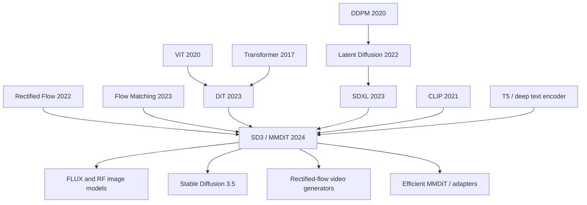

# Stable Diffusion 3 / Rectified Flow — Moving Text-to-Image from U-Net Diffusion to Scalable MMDiT

> **On March 5, 2024, Patrick Esser, Sumith Kulal, Andreas Blattmann, Robin Rombach, and 13 co-authors at Stability AI uploaded [arXiv 2403.03206](https://arxiv.org/abs/2403.03206), the technical paper behind Stable Diffusion 3.** The paper did not merely bolt another module onto the Stable Diffusion U-Net. It replaced two foundations at once: the training path moved from curved diffusion schedules to straight rectified-flow velocity fields, and the backbone moved from text-to-image cross-attention toward MMDiT, where text and image tokens can exchange information bidirectionally while keeping modality-specific weights. The eye-catching number is not a single FID score; it is the 8B model pushing GenEval overall from DALL-E 3's 0.67 to 0.74 and making typography, counting, and spatial relations central tests for open visual generation.

## TL;DR

Stable Diffusion 3, published at ICML 2024 by Esser and colleagues, keeps the useful part of [Stable Diffusion / LDM (2022)](../era4_foundation_models/2022_stable_diffusion.md) — VAE latents plus frozen text encoders — but replaces the two mechanisms that had become bottlenecks. The objective becomes rectified-flow velocity prediction on a straight path, $z_t=(1-t)x_0+t\epsilon,\ v_\theta(z_t,t,c)\approx \epsilon-x_0$, trained with logit-normal timestep sampling so the model spends more learning signal on perceptually ambiguous middle noise scales. The backbone becomes MMDiT: text tokens and image patch tokens participate in one attention operation, while each modality keeps its own projections and MLP weights. The displaced baselines are concrete: uniform rectified flow is worse than logit-normal RF; LDM-linear and EDM lose the few-step sampling tradeoff; vanilla DiT, CrossDiT, and UViT underperform MMDiT on CC12M; original-only captions trail the 50/50 original + CogVLM caption mix by 43.27 to 49.78 on GenEval. The headline result is the depth-38 8B model with DPO reaching 0.74 GenEval overall, above DALL-E 3's 0.67. The hidden lesson is that the post-SDXL leap was not “make the U-Net larger”; it was to turn text-to-image generation into a scalable token-transport system, closer in spirit to [DiT (2023)](https://arxiv.org/abs/2212.09748) and [Flow Matching (2023)](https://openreview.net/forum?id=PqvMRDCJT9t) than to another hand-tuned diffusion schedule.

---

## Historical Context

### By late 2023, text-to-image had shifted from “can it generate?” to “does it understand?”

Stable Diffusion v1 mattered because it pulled text-to-image generation out of closed labs and onto consumer GPUs; SDXL mattered because it pushed open image quality into a commercially usable range. But by the end of 2023 the next wall was obvious: image quality was no longer the only battle. **Text comprehension, spatial relations, counting, typography, and obedience to long prompts** became the failure modes users could name immediately. A model could produce a beautiful picture while placing the red square on the wrong side of the blue circle, turning two objects into three, or misspelling the text on a sign. These were not aesthetic flaws; they were conditioning failures.

Closed systems raised the bar. DALL-E 3 used stronger captioning and prompt rewriting to improve prompt following; Midjourney v6 and Ideogram made typography a product-level feature; SDXL remained one of the strongest open baselines, but the U-Net + cross-attention template increasingly looked like an older architectural regime. Text tokens were external conditions queried by image features; the text stream itself was not repeatedly updated during generation, so fine-grained constraints in long prompts were easy to compress away.

### The diffusion objective was also stuck on sampling steps

The second pressure came from sampling efficiency. DDPM and LDM objectives were built around noise prediction, discrete beta schedules, and probability-flow ODEs whose trajectories are often curved. Curvature is not fatal, but it makes few-step sampling harder: remove integration steps and numerical error quickly damages both visual quality and prompt alignment. EDM, DPM-Solver, DDIM, and consistency distillation all attacked the problem, but many solutions were sampler-side tricks or distillation procedures built on top of an already trained model.

Rectified Flow and Flow Matching offered a different route: **learn a straight velocity field from data to noise during training**. If the path is straight enough, few-step sampling is not a post-hoc compression target; it is built into the modeling assumption. The gap was scale. In 2022-2023, most convincing demonstrations were small or class-conditional, still far from high-resolution, multi-text-encoder, web-scale industrial text-to-image training. SD3 is the paper that pushes this theoretical route into large-scale text-to-image.

### The authors had already changed Stable Diffusion’s foundations once

Patrick Esser, Robin Rombach, Andreas Blattmann, Dominik Lorenz, and their co-authors sit in the CompVis / Stability AI lineage: VQGAN showed that “compress first, generate later” could work; LDM moved diffusion into latent space; SDXL refined latent U-Net diffusion into an industrial baseline. SD3 continues that style. It does not present a single magic module; it composes a set of choices that interlock and replace the old system’s weak points layer by layer.

That is why the paper reads like a system upgrade report. It compares 61 diffusion / flow formulations and settles on logit-normal rectified flow; compares DiT, CrossDiT, UViT, and MM-DiT and finds that a two-stream multimodal transformer is better suited for text-to-image; then handles practical scaling details: a 16-channel autoencoder, synthetic captions, precomputed three-encoder text representations, QK normalization during high-resolution finetuning, resolution-dependent timestep shifting, and DPO preference alignment. SD3’s contribution is not “one formula wins”; it is that these pieces survive together at 8B scale with a smooth scaling trend.

## Background and Motivation

### Three bottlenecks in the old template

The first bottleneck was **U-Net scalability**. U-Nets are excellent at local texture and multiscale detail, but they were not designed for token-level text reasoning. When textual constraints get longer and object relations become more intricate, cross-attention lets image features query a frozen text table, but it does not let the text representation evolve together with the image state.

The second bottleneck was **few-step sampling under diffusion schedules**. LDM-linear and epsilon-prediction were mature at 30-50 steps, but the target was moving toward 5-10 steps. Curved paths and poorly matched loss weighting become visible in that regime. SD3’s central hypothesis is that a straight path plus more learning signal at middle timesteps is a better foundation for fast generation.

The third bottleneck was **caption quality**. Web captions often name the subject and omit background, composition, spatial relations, or written text. DALL-E 3 had already shown that synthetic long captions help. SD3 brings that idea into the open model setting by generating captions with CogVLM and mixing them 50/50 with original captions so the model does not collapse to only the concepts known by the captioner.

### What SD3 was really trying to answer

SD3 was not asking “can we make a bigger Stable Diffusion?” It asked four deeper questions. First, can Rectified Flow systematically beat classical diffusion formulations in high-resolution text-to-image? Second, is a Transformer backbone really the next-generation replacement for U-Net in this domain? Third, can validation loss become a predictable scaling signal the way it did for language models? Fourth, when the model reaches 8B parameters and $5\times10^{22}$ training FLOPs, do prompt following, typography, and human preference improve together?

The paper answers yes, but not with a blank check. Rectified Flow needs logit-normal or related timestep sampling; uniform RF does not simply win. MMDiT needs modality-specific weights; naïvely concatenating text and image tokens is not enough. T5-XXL improves complex prompts and written text, but it adds 4.7B parameters and meaningful VRAM cost. DPO improves preference alignment, but it is not a substitute for base-model scaling. SD3 is therefore a transition point: it defines the next Stable Diffusion era as **flow + transformer + deep text encoding + preference tuning**, not as another U-Net version bump.

---

## Method Deep Dive

### Overall framework: still latent-space generation, no longer old U-Net diffusion

SD3 does not discard the most valuable part of LDM: images are still encoded by a pretrained autoencoder into latents, the generative model operates in latent space, and a decoder maps the result back to RGB. What changes is the dynamics and the backbone inside that latent space. A training image $X$ becomes $x=E(X)$, noise is $\epsilon\sim\mathcal{N}(0,I)$, Rectified Flow constructs the intermediate state $z_t=(1-t)x+t\epsilon$, and the model learns a velocity $v_\theta(z_t,t,c)$. The conditioning $c$ comes from three frozen text encoders: CLIP-L/14, OpenCLIP bigG/14, and T5-v1.1-XXL.

The important point is not that SD3 throws away all old components. It keeps the proven compression space and replaces the two pieces that were hardest to scale: the diffusion dynamics become a continuous-time flow objective, and the U-Net becomes a tokenized multimodal transformer.

| Component | SDXL / LDM style | SD3 choice | Purpose |
|---|---|---|---|
| Image space | 4-channel latent, f=8 | 16-channel latent, f=8 | raise the autoencoder ceiling |
| Objective | epsilon-prediction + LDM-linear schedule | rectified flow + logit-normal timestep sampling | make few-step sampling more robust |
| Backbone | U-Net + cross-attention | MMDiT with modality-specific weights | bidirectional text-image interaction |
| Text conditioning | mostly CLIP / OpenCLIP | CLIP-L + CLIP-G + T5-XXL | long prompts and written text |
| Alignment | base model / product-side tuning | DPO with LoRA in the appendix | preference and spelling refinement |

### Key Design 1: Rectified Flow plus logit-normal timestep sampling

Rectified Flow connects data $x_0$ and noise $\epsilon$ by a straight line: $z_t=(1-t)x_0+t\epsilon$. The simplest velocity target is $\epsilon-x_0$, the direction from the current point toward the noise endpoint. Compared with DDPM’s Markovian noising chain, this formulation looks like an ODE transport problem: if the learned velocity field is straight enough, a few Euler steps can walk from noise back to data.

But SD3 finds that uniform timestep sampling is not the best training distribution. Near $t=0$ and $t=1$, the velocity target is comparatively easy; the middle region is harder and more perceptually important. The paper therefore uses logit-normal sampling to put more training probability on intermediate timesteps: $\pi_{ln}(t;m,s)=\frac{1}{s\sqrt{2\pi}}\frac{1}{t(1-t)}\exp(-\frac{(\operatorname{logit}(t)-m)^2}{2s^2})$. The robust default is `rf/lognorm(0.00, 1.00)`, which ranks ahead of uniform RF, EDM, and LDM-linear in the paper’s global comparison.

```python
def sd3_training_step(autoencoder, text_encoders, mmdit, image, caption):
    x0 = autoencoder.encode(image)                    # latent image, e.g. 16 channels at f=8
    context = [encoder(caption) for encoder in text_encoders]
    epsilon = torch.randn_like(x0)
    t = torch.sigmoid(torch.randn(x0.shape[0], device=x0.device))  # logit-normal m=0, s=1
    view = (slice(None),) + (None,) * (x0.ndim - 1)
    zt = (1.0 - t[view]) * x0 + t[view] * epsilon
    target_velocity = epsilon - x0
    predicted_velocity = mmdit(zt, t, context)
    return (predicted_velocity - target_velocity).pow(2).mean()
```

### Key Design 2: MMDiT lets text and image meet inside the same attention operation

Traditional LDM / SDXL cross-attention is one-way: image features provide the queries, while text tokens provide keys and values. SD3’s MMDiT turns this into a two-stream design. Text tokens and image patch tokens each keep their own projections, normalization, and MLP weights, but their $Q,K,V$ tensors are concatenated for a shared attention operation. Text can see the evolving image state, and image tokens can see the evolving text state; both streams update at every block.

This is a practical compromise. Fully shared weights ignore that text tokens and latent patches have different distributions; fully separate streams prevent cross-modal exchange. MMDiT handles distribution mismatch with modality-specific weights and handles information flow with joint attention. The paper compares DiT, CrossDiT, UViT, and MM-DiT, and MM-DiT wins on validation loss, CLIP score, and FID. Three sets of weights give only a small gain over two while increasing parameter count and VRAM, so the main model uses two sets.

### Key Design 3: 16-channel autoencoder, three text encoders, and a 50/50 caption mix

LDM’s latent compression makes text-to-image training practical, but autoencoder reconstruction quality upper-bounds final image quality. SD3 raises the f=8 latent width from the older 4-channel setting to 16 channels. Table 3 shows that the 16-channel autoencoder improves FID, perceptual similarity, SSIM, and PSNR over 4/8-channel alternatives. The cost is that the latent is harder to predict, so the generative backbone must be larger.

The text side also gets heavier. CLIP-L/14 and OpenCLIP bigG/14 pooled outputs form $c_{vec}\in\mathbb{R}^{2048}$; their sequence outputs form a $77\times2048$ representation, which is zero-padded and concatenated with the $77\times4096$ T5-v1.1-XXL representation to produce $154\times4096$ context. T5’s 4.7B parameters are expensive, but they matter for long prompts, detailed descriptions, and written text. During training each text encoder is dropped independently with probability about 46%, so inference can use only the CLIP encoders when memory is tight.

Captions are upgraded too. The paper uses CogVLM to generate synthetic descriptions for large-scale image-text data, then trains on a 50/50 mix of original and synthetic captions. GenEval overall improves from 43.27 with original captions to 49.78 with the mix; color attribution rises from 11.75 to 24.75 and position from 6.50 to 18.00. More specific language supervision directly improves compositional understanding.

### Key Design 4: QK norm, position grids, and timestep shift for high-resolution training

When the model moves from 256² pretraining to 1024² mixed-aspect-ratio finetuning, SD3 hits a familiar large-transformer instability: attention logits grow, entropy collapses, and bf16 mixed precision can diverge. Borrowing from large ViT training, the paper applies RMSNorm to Q and K in both the text and image streams of MMDiT. This prevents attention logits from exploding and preserves mixed-precision throughput.

High resolution also changes what a timestep means. The same $t$ does not imply the same uncertainty for a larger image, because more pixels provide more observations. SD3 introduces a resolution-dependent timestep shift: $t_m=\frac{(m/n)t_n}{1+(m/n-1)t_n}$, using roughly $\alpha=3.0$ at 1024² for training and sampling. It is a small-looking trick, but it connects the flow objective to multi-resolution finetuning; otherwise the high-resolution stage spends many updates at the wrong noise scale.

### Key Design 5: Scaling study and DPO close the loop

SD3 trains MMDiT models at multiple depths, up to depth=38, about 8B parameters, and $5\times10^{22}$ training FLOPs. Validation loss drops smoothly with model size and training steps, and it correlates strongly with GenEval, T2I-CompBench, and human preference. This is a central claim: visual generation begins to look more like language modeling, where loss is a predictable signal for capability.

Finally, the paper connects DPO to image generation. It does not finetune all weights; it adds rank-128 LoRA matrices to linear layers and trains only a few thousand iterations on preference data for the 2B and 8B base models. DPO improves aesthetics, prompt following, and spelling, pushing the depth=38 model’s GenEval overall from 0.68 to 0.71 / 0.74. SD3 therefore separates base capability from preference shaping: scaling creates the capacity, DPO adjusts the boundary.

---

## Failed Baselines

### Baseline 1: Uniform Rectified Flow is not an automatic win

A straight flow sounds more natural than a diffusion schedule, but SD3’s experiments make one point very clear: **switching the target to Rectified Flow without changing the timestep distribution does not automatically produce the best model**. Uniform RF has an average rank of 5.67 in Table 1, far behind `rf/lognorm(0.00, 1.00)` at 1.54. The reason is simple: if every $t$ is weighted equally, the model spends too much capacity on the easy regions near the data or noise endpoints, while the perceptually difficult middle region remains undertrained.

This is the easiest part of the paper to misread. SD3 does not say “RF always beats diffusion.” It says “RF plus the right SNR / timestep weighting unlocks the straight-path advantage.” If one only looks at $z_t=(1-t)x_0+t\epsilon$, the training distribution that makes it work disappears from view.

### Baseline 2: LDM-linear and EDM are less robust in the few-step regime

LDM-linear was the default inertia of the older Stable Diffusion stack, and EDM was one of the strongest unified diffusion formulations of 2022-2023. SD3’s comparison across 61 formulations shows that only reweighted RF variants consistently beat the older objectives. In Table 2, `eps/linear` reaches CLIP 0.222 and FID 90.34 on CC12M, while `rf/lognorm(0.00,1.00)` reaches CLIP 0.224 and FID 89.91. The raw gap is modest, but together with few-step sampling and global rank it becomes important.

The failure is not that LDM-linear or EDM were wrong. They optimize for “train a model that a good sampler can gradually solve.” SD3 wants “train a model that is naturally suited to few-step ODE integration.” Once the objective preference changes, the old baseline no longer has a stable advantage.

### Baseline 3: Vanilla DiT / CrossDiT / UViT do not solve cross-modal updating

DiT showed that Transformers can serve as diffusion backbones, but the original DiT targets class-conditional ImageNet, not long-prompt text-to-image. Vanilla DiT with simple concatenation of text and image tokens blurs modality distributions; CrossDiT returns to cross-attention and improves text injection but remains one-way; UViT keeps U-Net-like inductive bias and learns quickly at first, but its final performance trails MM-DiT.

SD3’s Figure 4 conclusion is that MMDiT beats these variants on validation loss, CLIP score, and FID. The failure mode can be summarized in one line: **text-to-image is not image generation plus a text lookup table; it is an ongoing negotiation between two token systems**. MMDiT’s modality-specific weights plus joint attention match that problem.

### Baseline 4: Raw web captions are not enough for prompt understanding

The model trained only on original captions scores 43.27 overall on GenEval; adding a 50% CogVLM synthetic caption mix raises it to 49.78. The biggest improvements appear in color attribution, position, counting, and two-object categories, precisely the cases that require detailed language. Web captions often say “a chair in a room,” not “a red chair left of a blue table with text on the wall.” If the supervision lacks relation words, the model has little chance to learn relations.

This failed baseline also reminds us that the ceiling of text-to-image is not determined by architecture alone. It is also determined by the density of language in the captions. DALL-E 3 had already turned better captions into a closed-system advantage; SD3 converts the lesson into an open training recipe.

## Key Experimental Data

### Formulation comparison: which of 61 variants is stable

The paper trains 61 formulations on ImageNet-caption and CC12M, then ranks EMA / non-EMA checkpoints under multiple sampler steps and guidance scales using non-dominated sorting. The central result is that `rf/lognorm(0.00,1.00)` has the best global rank and remains strong in both 5-step and 50-step subsets.

| Comparison | Old baseline | SD3 result | Reading |
|---|---:|---:|---|
| Global rank | `eps/linear` 2.88 | `rf/lognorm(0,1)` 1.54 | reweighted RF is most stable |
| 5-step rank | `eps/linear` 4.25 | `rf/lognorm(0,1)` 1.25 | few-step advantage is clear |
| CC12M CLIP | `eps/linear` 0.222 | `rf/lognorm(0,1)` 0.224 | prompt alignment is slightly better |
| CC12M FID | `eps/linear` 90.34 | `rf/lognorm(0,1)` 89.91 | quality is not sacrificed |
| Uniform RF rank | `rf` 5.67 | lognorm RF 1.54 | RF needs the sampling distribution |

### Representation and captions: data before scale still matters

The autoencoder and caption experiments show that base representations propagate directly into the generator. A 16-channel latent reconstructs better; it is harder to predict, but better suited to large models. The 50/50 caption mix raises GenEval overall from 43.27 to 49.78 and strongly improves position and attribute binding.

| Experiment | Baseline | Change | Number |
|---|---:|---:|---|
| Autoencoder FID | 4-channel: 2.41 | 16-channel | 1.06 |
| Autoencoder PSNR | 4-channel: 25.12 | 16-channel | 28.62 |
| Caption overall | original only: 43.27 | 50/50 mix | 49.78 |
| Color attribution | original only: 11.75 | 50/50 mix | 24.75 |
| Position | original only: 6.50 | 50/50 mix | 18.00 |

### Large-model results: GenEval, human preference, and few-step sampling

The largest depth=38 model reaches 0.68 GenEval overall, and DPO raises it to 0.71 / 0.74, above DALL-E 3’s 0.67. Table 6 also shows that larger models need fewer steps: depth=38 loses only 0.14% relative CLIP score at 10/50 steps, while depth=15 loses 0.86%. This matches the Rectified Flow motivation: larger models fit the straight path better, shorten the path length, and reduce few-step integration error.

The most important result is Figure 8’s scaling story. Validation loss decreases smoothly with model size and training steps, and it correlates with GenEval, T2I-CompBench, and human preference. Text-to-image generation has long lacked a signal as predictable as language-model perplexity. SD3 offers strong evidence that, at least for MMDiT + RF, loss can become a steering wheel for scaling.

---

## Idea Lineage

### Prehistory: from pixel diffusion to latent transport

SD3 sits at the intersection of three lines. The first runs from DDPM to LDM: diffusion proved quality, latent diffusion proved efficiency. The second runs from ViT to DiT: vision can be tokenized, and diffusion backbones do not have to remain U-Nets. The third runs through Rectified Flow and Flow Matching: generative modeling can be written as a velocity field from noise to data, not only as reversal of a discrete noising chain.

If one looks only at the Stable Diffusion brand, SD3 follows SDXL. If one looks at method history, it is a confluence of LDM, DiT, and Flow Matching. Its distinctive position is that it puts these three lines inside one open-grade text-to-image system and runs enough ablations to show that the result is not merely brute-force scale.



### Afterlife: it rewrote the open text-to-image recipe

After SD3, the new open text-to-image default was no longer “U-Net + cross-attention + epsilon prediction.” FLUX, AuraFlow, SD3.5, several video generators, and efficient MMDiT variants all treat rectified flow, diffusion transformers, and multiple text encoders as natural starting points. Even systems that do not reuse SD3 code inherit its problem definition: few-step sampling, scalable backbones, typography, prompt following, and preference alignment must be optimized together.

The subtler influence is evaluation. SD3 discusses GenEval, T2I-CompBench, PartiPrompts human preference, and validation loss on the same scaling curve. That forces later models to explain capabilities beyond attractiveness: can they count, respect spatial relations, generate specified text, and remain stable under few-step sampling?

### Misreadings: SD3 is not “replace diffusion with flow and stop”

The common misreading is to reduce SD3 to “RF beats DDPM.” The paper’s own experiments reject that. Uniform RF is not the best variant; logit-normal and related timestep reweighting are what make RF robust. A second misreading is “larger DiT is enough.” SD3 shows that the MMDiT cross-modal structure matters, not arbitrary transformer concatenation. A third misreading is “add T5 and typography is solved.” T5 helps complex prompts and written text, but caption quality, DPO, model scale, and MMDiT all contribute.

### Why this line keeps growing

The historical value of SD3 is that it turns text-to-image generation into a more engineerable scaling problem. Many U-Net-era tricks felt local: a sampler, a guidance scale, a checkpoint merge. MMDiT + RF returns the problem to a more unified language: how token sequences interact, whether the velocity field is straight, whether validation loss predicts capability, and how preference optimization should attach. That language transfers naturally to video, 3D, editing, controllable generation, and unified multimodal models.

---

## Modern Perspective

### What still holds up

SD3’s most durable claim is that text-to-image backbones will increasingly look like scalable transformers rather than more elaborate convolutional U-Nets. Many strong 2024-2025 models use some mixture of DiT, MMDiT, and rectified flow, so this was not an isolated architectural bet. A second durable claim is that caption engineering is part of the training strategy, not a data-cleaning footnote. Synthetic captions, prompt rewriting, and VLM-based filtering are now central investments for visual generation.

The third claim is that few-step sampling must be addressed in the training objective. Distillation and samplers remain useful, but if the base model’s path is curved, post-processing has limited room. Rectified Flow moves “is the path straight?” into training, which is why the idea transfers naturally to video and editing.

### Assumptions that no longer fully hold

**“Open SD3 will automatically repeat the SD v1 community explosion.”** This did not fully happen. Early community response to SD3 Medium was shaped by model quality, licensing, and migration cost. A correct paper-level paradigm does not guarantee smooth product-level diffusion. Stable Diffusion v1 succeeded through low-friction weights, clear licensing, lightweight inference, and a fast plugin ecosystem; an 8B-class architecture is naturally heavier.

**“A deeper text encoder is always worth it.”** T5-XXL helps complex prompts and typography, but its 4.7B parameters are a real local-inference cost. The paper itself finds that using only the two CLIP encoders barely affects aesthetic quality and only modestly hurts prompt adherence; T5’s value is concentrated in complex detail and longer written text.

**“A high GenEval score means the model is universally better.”** GenEval captures objects, counting, position, and attributes, but it does not cover style, realism, cultural preference, or safety boundaries. SD3’s GenEval improvement is important, but it still needs human preference, real user feedback, and downstream editing tasks for a full picture.

### If the paper were rewritten today

A 2026 rewrite would first discuss inference economics more explicitly. An 8B RF transformer can produce strong quality with few sampling steps, but VRAM, T5 precomputation, and attention cost are still heavy. Second, it would compare against FLUX, SD3.5, AuraFlow, and related successors to separate SD3-specific findings from broader industry consensus. Third, it would disclose more about training data: source composition, filtering thresholds, captioner errors, and preference-data provenance matter for both reproducibility and social impact.

## Limitations and Future Directions

### Known limits

SD3 is strong as a systems paper, but it has limits. First, training-data details remain incomplete, especially how large-scale sources, filtering rules, and synthetic caption errors shape model bias. Second, MMDiT is more scalable than U-Net but also more memory-hungry, raising the barrier for community finetuning and low-end deployment. Third, DPO improves preference alignment, but preference data can encode aesthetic and cultural bias. Fourth, text-to-image evaluation remains fragile; GenEval and T2I-CompBench are partial views.

### Future directions

The next directions are fairly clear. The first is efficiency: sparse attention, linear attention, latent token pruning, and teacher-student distillation will all target MMDiT. The second is control: ControlNet, IP-Adapter, and T2I-Adapter need to be rebuilt around bidirectional token streams. The third is video: RF + transformer extends naturally to spatiotemporal tokens, but temporal consistency and compute magnify every problem. The fourth is unified multimodality: once image generation becomes token transport, understanding, editing, and generation are easier to place inside one model.

## Related Work and Insights

### Research lessons

The lesson of SD3 is not “chase the newest backbone.” It is how to run a credible paradigm shift: compare the old and new objectives under shared budgets, ablate the architecture, then check whether scaling curves keep improving. It also reminds us that generative-model progress often comes from moving the objective, data representation, network structure, and alignment method together rather than swapping one module.

| Lesson | How SD3 shows it | Transfer target |
|---|---|---|
| The objective should match the sampler | RF serves few-step ODE sampling | video, 3D, speech generation |
| Modality differences should not be erased by forced sharing | MMDiT uses separate weights and joint attention | VLMs, editing, controllable generation |
| Description quality creates capability | CogVLM caption mix | robotics, medical, multiview data |
| Loss should connect to downstream metrics | validation loss predicts GenEval / preference | large-model scaling studies |
| Alignment should be layered over base capability | base scaling + DPO LoRA | personalization, style, safety tuning |

### Influence on current model design

When designing a text-to-image or video model today, SD3 is one of the default references. Even if one does not use Stability AI’s specific model, it is hard to avoid its checklist: are we modeling in latent space, using a flow or straighter path, giving text enough representational depth, allowing bidirectional text-image token interaction, stabilizing high-resolution training, and checking whether validation loss predicts real metrics? Those questions now form a basic review checklist for modern visual generation systems.

## Resources

### Paper and code

- Paper: [Scaling Rectified Flow Transformers for High-Resolution Image Synthesis](https://arxiv.org/abs/2403.03206)
- Project/code family: [Stability-AI/generative-models](https://github.com/Stability-AI/generative-models)
- Predecessor note: [Stable Diffusion / LDM](../era4_foundation_models/2022_stable_diffusion.md)
- Key predecessors: [DDPM](../era4_foundation_models/2020_ddpm.md), [ViT](../era4_foundation_models/2020_vit.md), [CLIP](../era4_foundation_models/2021_clip.md)
- Core concepts to revisit: Rectified Flow, Flow Matching, DiT, classifier-free guidance, DPO, synthetic captioning, QK-normalization

### Suggested reading path

Read LDM first to understand why latent space is the economics of image generation; read DiT next to understand why Transformers can replace U-Nets; then read Flow Matching / Rectified Flow to see why velocity fields and straight paths matter for few-step sampling. SD3 then becomes easier to read as a system paper joining three technical lines, rather than as an isolated model release.


---

> 🌐 [中文版](/era5_genai_explosion/2024_stable_diffusion3/) · 📚 awesome-papers project · CC-BY-NC