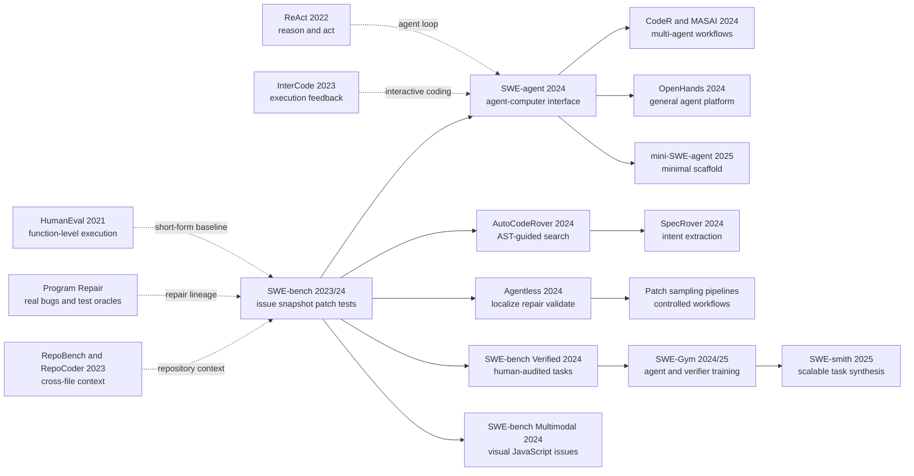

# SWE-bench + SWE-agent — When Coding Left the Function Sandbox

> **In October 2023, [SWE-bench (arXiv:2310.06770)](https://arxiv.org/abs/2310.06770) pushed code models out of 164 self-contained function puzzles and into twelve real Python repositories: hand the system a GitHub issue and a historical commit, then demand a patch that survives the project's tests.** The strongest realistic launch baseline, Claude 2 with BM25 retrieval, resolved only 1.96%. In April 2024, the companion SWE-agent wrapped GPT-4 Turbo in a model-oriented interface for searching, viewing, editing, and executing code and reached 12.47%. The sharper twist came in August 2024, when the ruler itself was tested: 93 developers reviewed 1,699 original tasks, filtering 68.3% for underspecification, unfair hidden tests, or other problems and releasing a 500-task Verified set. The lasting change was not one model score. It was a new definition of “can code,” plus an uncomfortable admission that the model, agent scaffold, execution environment, and benchmark can all be sources of error.

## TL;DR

The ICLR 2024 Oral paper by Carlos E. Jimenez, John Yang, Alexander Wettig, and four coauthors changed the unit of code evaluation from a HumanEval-style function completed from a docstring into an executable repository-state transition. A system receives issue intent $P_i$ and a `repository@base_commit` snapshot $C_i$, then emits a patch $\hat{\delta}_i$. An instance has $r_i=1$ only if the prediction applies and every hidden `FAIL_TO_PASS` and `PASS_TO_PASS` test succeeds, yielding $\mathrm{pass@1}=100N^{-1}\sum_i r_i$. The failed baseline it exposed was BM25 retrieval of whole files followed by one-shot patch generation: Claude 2 resolved only 1.96% of the original 2,294 tasks across twelve Python repositories, and even diagnostic oracle retrieval that revealed reference-edited files reached only 4.80%. The companion SWE-agent then separated the base model from its agent-computer interface. Search summaries, a 100-line viewer, edits with lint rollback, execution feedback, and managed history let GPT-4 Turbo resolve 286/2,294 = 12.47%; on Lite, the same model moved from 11.00% with Shell-only to 18.00% with the complete ACI.

This lineage carries the action-observation loop of [ReAct (2022)](/en/era4_foundation_models/2022_react/) and grounds the tool-use turn represented by [Toolformer (2023)](/en/era5_genai_explosion/2023_toolformer/) in real codebases. It later branches into controlled localization-repair-validation systems such as AutoCodeRover and Agentless, the general OpenHands runtime, SWE-Gym and SWE-smith training data, the 500-task SWE-bench Verified revision, and visual JavaScript tasks in SWE-bench Multimodal. The counterintuitive lesson is that a low score is not purely model weakness and a high score is not purely model capability. Verified's audit of 1,699 original samples filtered 68.3% for underspecification, unfair hidden tests, or other issues. A 2026 SWE-bench result therefore needs a model version, scaffold, dataset revision, harness, budget, and sampling policy; passing the selected executable behavior is evidence, not permission to merge the patch into production.

---

## Historical Context

### In 2023, code models were strong on functions and weak on maintenance

By the autumn of 2023, code language models had an impressive public profile. Codex and [HumanEval](https://arxiv.org/abs/2107.03374) compressed a natural-language specification, a function signature, and hidden unit tests into 164 short Python problems. APPS, MBPP, DS-1000, and HumanEvalPack extended the format toward programming contests, basic Python, data-science libraries, and multilingual repair. Looking back from the SWE-agent paper, the authors noted that the leading HumanEval method had reached 94.4%. If those numbers defined coding, the obvious next move was simply a larger model.

Software maintenance does not begin with an empty function. A developer receives a ticket, an evolving repository, a historical dependency stack, and a body of old behavior that must survive the fix. Much of the hard work precedes patch writing: reproduce the symptom, interpret the stack trace, find the relevant modules, follow calls to a root cause, learn project conventions, and decide whether one or several locations must change. A patch is not the end either. The developer must install the project, run its native tests, interpret failures, and decide whether a new error belongs to the implementation, the environment, or the test itself.

[ClassEval](https://arxiv.org/abs/2308.01861) had already shown that moving from one method to one class exposed weak reasoning over method dependencies. [RepoBench](https://arxiv.org/abs/2306.03091) and [RepoCoder](https://arxiv.org/abs/2303.12570) brought cross-file context into completion. [InterCode](https://arxiv.org/abs/2306.14898) organized code actions and execution feedback as an interactive environment. Together they forced a sharper question: **does generating local code amount to maintaining a real software system?** SWE-bench, released in October 2023, made the answer look emphatically negative.

### Four predecessor threads that forced SWE-bench into existence

The first thread was **execution-based code evaluation**. [HumanEval](https://arxiv.org/abs/2107.03374) stopped using BLEU to ask whether code resembled a reference and ran tests instead. [EvalPlus](https://arxiv.org/abs/2305.01210) later expanded HumanEval tests by roughly 80 times and showed that weak suites accepted incorrect programs and could even change model rankings. SWE-bench retained the principle of letting programs speak through execution, but upgraded the execution object from one function to a complete repository version.

The second thread was **automated program repair**. Defects4J, GenProg, AlphaRepair, and NL2Fix had connected real defects, fault localization, patch search, and test suites. [Towards Generating Functionally Correct Code Edits from Natural Language Issue Descriptions](https://arxiv.org/abs/2304.03816) directly formulated repair from an issue report. This literature showed that bug reports and tests could jointly specify a repair, but common settings still supplied the faulty location, constrained the language, or used a carefully bounded program.

The third thread was the **failure of long context and retrieval**. [Lost in the Middle](https://arxiv.org/abs/2307.03172) showed that accepting a long prompt did not imply reliable use of evidence placed inside it. The average SWE-bench codebase contains 3,010 non-test files and about 438,000 non-test lines, while the reference patch changes only 1.7 files, 3 functions, and 32.8 lines on average. The central problem is not placing all 438,000 lines in a prompt. It is finding the few dozen lines that matter.

The fourth thread was the **interactive LM agent**. [ReAct](https://arxiv.org/abs/2210.03629) interleaved reasoning, actions, and observations. [WebShop](https://arxiv.org/abs/2207.01206) and [WebArena](https://arxiv.org/abs/2307.13854) tested long-horizon decisions in executable websites. InterCode carried the same idea into Bash, SQL, and Python. SWE-bench supplied a more realistic destination than a synthetic shell puzzle: users wrote the tickets, maintainers merged the patches, and projects owned the tests.

### The Princeton team turned GitHub history into executable data

Carlos E. Jimenez, John Yang, Alexander Wettig, Shunyu Yao, Kexin Pei, Ofir Press, and Karthik Narasimhan formed a collaboration across Princeton Language and Intelligence, Princeton University, and the University of Chicago. The group had already explored how language models act in environments through WebShop, ReAct, and InterCode. SWE-bench connected that agent lineage with program repair, fault localization, and regression testing from software engineering.

They did not hire annotators to invent 2,294 exercises. They treated open-source collaboration history as the data source. Starting from roughly 90,000 pull requests in 12 popular Python repositories, the pipeline retained merged PRs that closed an issue, changed tests, installed and executed successfully, and contained at least one test that changed from failing to passing after the solution was applied. Every instance records issue text, repository, `base_commit`, test and implementation patches separated from the PR, plus `FAIL_TO_PASS` and `PASS_TO_PASS` test identities. Official mirrors preserve original commit history so upstream deletion or rewriting cannot erase a snapshot.

This construction created a new compromise between scale and human validity. GitHub naturally supplies problems, discussions, code, patches, and tests, and the collection procedure can keep running. A PR is not a benchmark specification, however. Issues can be ambiguous, and tests may encode details that maintainers settled only in later discussion. Original SWE-bench treated some of this noise as realism. SWE-bench Verified later demonstrated that realistic data is not automatically fair and that automated filtering still needs professional review.

### Compute, context, and the engineering environment became evaluation variables

At launch, only a small set of models could consume inputs of this scale. The original paper evaluated ChatGPT-3.5 16K, GPT-4 32K, Claude 2, and SWE-Llama variants based on CodeLlama-Python. Repositories exceeded every context window, so the baseline used the issue as a BM25 query, retrieved whole files, and tested budgets such as 13K, 27K, and 50K tokens. Counterintuitively, retrieving more files did not reliably help. At 27K, BM25 covered every reference-edited file in roughly 40% of instances but retrieved none of them in almost half; Claude 2 often did better with the shorter tested context.

For an open baseline, the team collected 19,000 issue-PR training pairs from 37 repositories disjoint from the test repositories. Removing sequences above 30,000 tokens left about 10,000 effective examples, and LoRA adapted CodeLlama-Python. SWE-Llama 7B trained for 20 hours on four A100s; the 13B model trained for 47 hours on eight A100s. Long-context specialization was already a systems project. Yet SWE-Llama 13B reached only 0.70% with real BM25 input because training supplied oracle files touched by the reference patch while inference supplied noisy retrieved files.

The environment also became part of the capability boundary. Historical package versions depend on different Python releases, compilers, and system libraries; test commands and output formats vary by repository. The original implementation manually built environments by project version, and the official project moved to a fully containerized Docker harness only in June 2024. From the beginning, SWE-bench was therefore evaluating more than a model. Retrieval, patch formatting, dependency reconstruction, test selection, and log parsing all had to work together.

## Background and Motivation

### From generating an answer to delivering a verifiable change

SWE-bench's central motivation was to turn a code model from an answer generator into the author of a software change. The input no longer points at a target function. It supplies an issue-derived problem statement $P_i$ and a historical repository snapshot $C_i$, and the system must emit a patch $\hat{\delta}_i$. In the corresponding environment, the evaluator applies a hidden test patch $T_i$ and the prediction. An instance counts as resolved only when every `FAIL_TO_PASS` test establishing the new behavior and every `PASS_TO_PASS` test protecting old behavior passes.

That definition binds several previously separate capabilities to one executable endpoint. Wrong file localization prevents a useful patch. A wrong root-cause hypothesis creates a no-op or regression. A malformed diff makes a sound idea unappliable. A broken environment assigns zero credit to every implementation. At the same time, a prediction need not copy the human pull request. A behaviorally different implementation may succeed under the same checks. This is closer to software engineering than string similarity, while still covering only behavior visible to the finite suite.

The original scores were meant to expose this capability gap. The strongest realistic baseline, Claude 2 with BM25, resolved 1.96%. Even the diagnostic oracle condition, which revealed files changed by the human patch, reached only 4.80%. Failure was not merely failure to find a file; specification understanding, cross-file reasoning, and patch construction all remained weak. SWE-bench was therefore not a longer HumanEval. It changed the unit of evaluation from a function answer to a repository-state transition.

### Why the benchmark naturally produced the ACI question

The original baselines were non-interactive: BM25 retrieved files once, the model generated one patch, and tests ran only during scoring. Human debugging does not work that way. A developer reproduces, searches, reads a small region, forms a hypothesis, edits, executes, and revises after new evidence. The SWE-bench appendix likewise found that many applied but unresolved patches were no-ops or regressions and explicitly suggested execution feedback so a model could continue editing instead of submitting once.

SWE-agent accepted that motivation but did not reduce the answer to “give the model a shell.” Its authors treated the LM agent as a new kind of end user and proposed the **agent-computer interface (ACI)**: both the action set available to the model and the policy for presenting environment state, errors, and history. Raw Bash is flexible for humans but exposes models to option-heavy commands, unbounded output, and silent editing. A graphical IDE is intuitive to a person but encodes hierarchy and interaction state in visual signals that a text model cannot consume reliably.

SWE-agent therefore held model weights fixed and reshaped action and observation spaces. Should search return one match at a time or a compact summary? Should a file window contain 30 lines, 100 lines, or the entire file? Should an edit immediately reveal its effect? Should a syntax error be rejected before it lands? How much stale observation history should remain? With GPT-4 Turbo on SWE-bench Lite, the Shell-only baseline resolved 11.00%, while the complete ACI reached 18.00%, a 64% relative increase with the same base model. That ablation is cleaner evidence than a cross-model leaderboard: on repository tasks, the interface is not packaging. It determines how much latent capability reaches the final patch.

---

## Method Deep Dive

### Overall framework: four layers and two loops

SWE-bench and SWE-agent are often compressed into the phrase “make AI fix GitHub issues,” but their results become interpretable only after separating four layers. The **benchmark/dataset** defines what constitutes a task. The **evaluation harness** reconstructs the historical environment and executes the score. The **base LM** supplies language, coding, and reasoning capability. The **agent scaffold / ACI** determines how the model sees the repository, acts on it, and receives feedback. The first two layers define the ruler; the latter two form the measured system. Changing the model does not change the benchmark, and upgrading the Docker harness does not make the agent smarter.

The full design contains two loops. The offline **data-construction loop** works backward from human-merged pull requests to recover a problem, snapshot, tests, and reference fix, then executes before and after states to verify that the instance is usable. The online **solution loop** gives a system the issue and snapshot. A model or agent emits a patch, and the harness uses hidden tests to determine whether it repairs the target behavior without breaking checked existing behavior.

```text
DATA CONSTRUCTION (offline)
GitHub issue <---- linked merged PR at base_commit
      |                         |
      |                         +--> split diff --> test_patch + gold_patch
      |                                              |
      +--> problem_statement                         v
                                   run tests before / after gold_patch
                                                |
                                      keep executable F2P tasks

SYSTEM EVALUATION (per task)
problem_statement + repository@base_commit
                    |
                    v
       [base LM + retrieval or agent ACI] ---> predicted_patch
                                                   |
                                                   v
Docker / versioned harness: checkout -> install -> apply test_patch
                            -> apply prediction -> run tests -> grade
```

| Layer | Fixed content | Variable content | Conclusion that must not be conflated |
|---|---|---|---|
| Benchmark / dataset | issue, repository, `base_commit`, test identities | versions such as Full, Lite, and Verified | changing the dataset changes task distribution and denominator |
| Evaluation harness | checkout, install, patch, run, and parse | Conda/Docker, images, test commands | harness failure is not semantic model failure |
| Base LM | weights and inference API | Claude 2, GPT-4 Turbo, Claude 3 Opus, and others | a cross-model gain alone does not establish ACI value |
| Agent scaffold / ACI | actions, observations, history, budget, submission policy | RAG, Shell-only, SWE-agent, and others | the same model can expose different capability through different interfaces |

### Key design 1: freeze pull-request history into task state

An instance is not “issue text plus the latest source.” It can be represented as a six-tuple:

$$
x_i=(P_i, R_i, b_i, T_i, F_i, Q_i), \qquad C_i=\operatorname{checkout}(R_i,b_i).
$$

$P_i$ is the problem statement aggregated from related issue titles, bodies, and comments before a time boundary. $R_i$ is the repository, and $b_i$ is the resolving PR's base commit. $T_i$ is the test patch separated from test-file changes in the PR. $F_i$ is the `FAIL_TO_PASS` set and $Q_i$ is the `PASS_TO_PASS` set. $C_i$ is the historical codebase actually used in evaluation. The human solution $\delta_i$ constructs and validates the instance but is not model input.

The decisive field is `base_commit`. Downloading today's Django or SymPy may produce a repository where the issue is already fixed, dependency APIs have changed, and the original test no longer exists. SWE-bench mirrors each source repository while preserving commit hashes, branches, tags, and history. `repo + base_commit` reconstructs the state before the original PR. **The task asks whether a system can perform that historical change, not whether it can guess an old bug from today's code.**

| Field | Source | Visible during solving | Purpose |
|---|---|---:|---|
| `problem_statement` | issue title, body, early comments | yes | describes the observed problem or request |
| `repo`, `base_commit` | original PR metadata | yes | uniquely locates historical repository state |
| `test_patch` | test-related diff in the PR | no | adds maintainer tests inside the scoring environment |
| `patch` / gold patch | non-test diff in the PR | no | validates construction and supports analysis |
| `FAIL_TO_PASS` | before/after solution log difference | no | checks whether target behavior is repaired |
| `PASS_TO_PASS` | tests passing before and after solution | no | checks whether existing behavior regresses |

### Key design 2: separate specification and answer from the PR diff

A merged pull request commonly changes implementation and tests together. Giving the complete diff as the answer would let tests reveal implementation clues; dropping new tests would remove the behavioral oracle targeted at the issue. SWE-bench classifies diff blocks whose paths contain terms such as `test`, `tests`, or `testing` into $T_i$ and puts the remainder into $\delta_i$. It then executes two states on the same $C_i$: the pre-solution state with only $T_i$, and the post-solution state with $\delta_i$ added.

A candidate enters the dataset only if at least one test changes from failing to passing and installation, patch application, and test execution succeed. The paper also removes tests that first invoke a new entity introduced by the reference patch but not named by the issue; an arbitrary class or function name would make the task nearly impossible to infer. The pseudocode below compresses construction. The real pipeline additionally handles repository-specific installers, test commands, and log parsers.

```python
def build_instance(issue, pull_request, repo_mirror, environment):
    snapshot = repo_mirror.checkout(pull_request.base_commit)
    test_patch, gold_patch = split_pr_diff(pull_request.diff)

    snapshot.install(environment)
    snapshot.apply(test_patch)
    before = run_repository_tests(snapshot, test_patch)

    snapshot.apply(gold_patch)
    after = run_repository_tests(snapshot, test_patch)

    fail_to_pass = tests_with_transition(before, after, "fail", "pass")
    pass_to_pass = tests_with_transition(before, after, "pass", "pass")
    if not fail_to_pass:
        return None

    return Task(issue.text, pull_request.base_commit, test_patch,
                gold_patch, fail_to_pass, pass_to_pass)
```

The design's power and risk have the same source: **a human PR is a natural specification-implementation pair, but the two are not independent.** Tests emerge from the same discussion and implementation process. They can require an exact warning string decided only in PR discussion or cover one path selected by maintainers. The `test_patch` is a stronger oracle than textual similarity to generated code, but it remains an incomplete specification. Verified's human audit is a second quality-control layer over this dependency.

### Key design 3: execution-based correctness and pass@1

For a predicted patch $\hat{\delta}_i$, the evaluator reconstructs $C_i$, prepares the versioned environment, applies $T_i$, and then applies the prediction. A diff that cannot apply, a test process that cannot complete, or any missing required test makes the instance fail. Let $s(t,C)$ indicate whether test $t$ passes on code state $C$. The instance score is:

$$
r_i=\mathbb{1}[\operatorname{apply}(\hat{\delta}_i,C_i\oplus T_i)]
\prod_{t\in F_i\cup Q_i}\mathbb{1}[s(t,C_i\oplus T_i\oplus\hat{\delta}_i)=\text{pass}].
$$

The one-submission metric over the test set is:

$$
\operatorname{pass@1}=\frac{100}{N}\sum_{i=1}^{N}r_i\ \%.
$$

This pass@1 is not the fraction of individual unit tests passed. An instance with 99 passing tests and one failed `FAIL_TO_PASS` test still has $r_i=0$. Nor is it pass@100, where any of one hundred attempts can succeed. Original baselines greedily generated one patch per task. SWE-agent ran one budget-constrained trajectory and submitted the final repository diff. Any comparison must name the split, model, scaffold, sample count, and harness version.

| Outcome | `FAIL_TO_PASS` | `PASS_TO_PASS` | Meaning |
|---|---:|---:|---|
| Resolved | all pass | all pass | target behavior and checked old behavior both hold |
| Breaking resolved | all pass | at least one fails | issue is repaired but a regression is introduced |
| Partially resolved | some pass | all pass | repair is incomplete but old behavior is preserved |
| No-op | none pass | all pass | patch applies without changing target behavior |
| Regression | none pass | at least one fails | patch neither fixes the issue nor preserves old behavior |

Execution lets a prediction differ completely from the gold patch, which is its advantage over exact match. It also couples environment, tests, and implementation into one binary outcome. A sober 2026 interpretation says that the behavior defined by the tests is “resolved”; it does not expand that event into “production-ready code” or “the agent understood the whole repository.”

### Key design 4: use BM25 and oracle retrieval to isolate localization

The original paper needed a baseline that was simple, reproducible, and did not prescribe the architecture of future systems. It represented each source file, prefixed by its path, as a document; used the issue as a query; ranked files with BM25; and inserted them until the model's context budget was reached. BM25's intuition is that a rare symbol, class name, or error term shared by an issue and a file carries more localization evidence than a generic word appearing everywhere. The paper did not present the retriever as a new algorithm. It used retrieval as a diagnostic ruler.

The authors also created oracle retrieval, which directly supplies files changed by the human reference patch. This condition uses answer-location information and is not deployable. It asks how much difficulty remains after file localization is solved. With a 27K-token budget, BM25 retrieved all oracle files in roughly 40% of instances yet retrieved none in almost half. Claude 2 rose from 1.96% under realistic BM25 to 4.80% with oracle files. Localization matters, but 95.2% remained unresolved even under the oracle, so specification and patch reasoning were harder still.

| Context policy | Uses answer information | What it diagnoses | Main weakness |
|---|---:|---|---|
| BM25 full files | no | realistic sparse retrieval plus one-shot generation | lexical match is weak and whole files are noisy |
| Oracle files | yes | model ceiling after file localization | undeployable and may omit dependency context |
| Oracle collapsed | yes | generation from a tiny relevant window | nearly reveals edit locations |
| Interactive search | no | whether the model can localize from new evidence | sensitive to cost, error propagation, and interface design |

The more subtle finding was that more context was not always better. Collapsing oracle files to $\pm15$ lines around reference edits raised Claude 2 from 4.8% to 5.9% and GPT-4 from 1.3% to 3.4% in the corresponding analysis. This does not mean a system should only see answer-adjacent lines. It shows that contemporary models could not reliably find evidence inside large amounts of irrelevant code. SWE-agent's search actions and 100-line viewer let the model build a small context incrementally without revealing the answer.

### Key design 5: design observations as well as actions in the ACI

SWE-agent composes a fixed LM with an ACI. At each turn, the model emits a thought and one command. The environment executes the command and returns an observation. The next input combines system instructions, task, action history, and processed observations. The ACI is not merely the signatures of functions such as `open` and `edit`; it also defines how many search results appear, what code is shown after an edit, which details an error contains, and when old output is collapsed.

The authors distilled four principles. Actions should be simple to understand. One action should be compact enough to accomplish meaningful work without unnecessary turns. Feedback should be informative without flooding context. Guardrails should interrupt common cascading failures and speed recovery. The final tool set remains built on a Linux shell, so ordinary commands are available when necessary, but frequent workflows receive a more stable abstraction.

| ACI component | Concrete design | Model failure it targets |
|---|---|---|
| Search | `find_file`, `search_file`, `search_dir`; at most 50 results | `grep` floods, exhaustive paging, wrong paths |
| File viewer | 100-line default with path, total lines, line numbers, and omission counts | `cat` fills context and scrolling state is lost |
| Editor | replace a line range in the open file and immediately show the changed region | brittle multiline `sed` and silent edits |
| Lint guardrail | selected flake8 errors trigger rollback with before/after context | indentation and syntax errors cascade across turns |
| Context manager | retain the last five observations and collapse older output | stale code and repeated errors consume context |
| Submit | serialize working-tree changes as the final patch | output-format drift and omission of applied edits |

The pseudocode shows why the interface is a control system rather than a list of tools. Performance emerges jointly from `render_observation`, `history_processor`, guardrails, and action semantics.

```python
def solve_issue(base_lm, aci, issue, repository, dollar_budget=4.0):
    history = aci.initialize(issue, repository)

    while aci.cost(history) < dollar_budget:
        prompt = aci.history_processor(history, keep_recent=5)
        thought, command = base_lm.next_action(prompt)
        result = aci.execute(command)

        if result.introduces_lint_error:
            aci.revert(command)
            observation = aci.render_guardrail_error(result)
        else:
            observation = aci.render_observation(result)

        history.append((thought, command, observation))
        if command.name == "submit":
            break

    return repository.diff()
```

### Key design 6: expose errors without solving the task for the model

SWE-agent's linter selects errors such as `F821,F822,F831,E111,E112,E113,E999,E902`: undefined names, duplicate arguments, indentation, syntax, and unreadable files. It does not determine whether business logic is correct and does not secretly insert the gold patch. The guardrail prevents one bracket or indentation error from corrupting every later observation and gives the model a route back to an executable state. In the Lite ablation, the editor with linting reached 18.0%, removing linting reduced it to 15.0%, and removing the dedicated edit action reduced it to 10.3%.

Search follows the same philosophy. `search_dir` does not emit thousands of lines for an underspecified query; above 50 matches, it asks the model to narrow the term. The 100-line viewer is neither the shortest nor the most complete option. A 30-line window reached 14.3%, a full file 12.7%, and 100 lines 18.0%. Human-inspired iterative search encouraged the model to press `next` through every result and reached only 12.0%; summarized search reached 18.0%, while even no specialized search reached 15.7%.

**The counterintuitive point is that an interface friendly to humans need not be friendly to an LM, and richer actions or observations need not be stronger.** The ACI tries to place the right evidence in a finite context while removing the need for line-number arithmetic, remembered scroll positions, and guesses about whether a silent command worked. It raises the probability that the same base model completes the loop; it does not inject new coding knowledge into the weights.

### Training, inference, and evaluation: which number belongs to which layer

The two papers use different settings. The SWE-bench paper trained SWE-Llama, but its central baselines used one retrieval step and one generation. The SWE-agent paper did not update base-model weights and primarily compared GPT-4 Turbo and Claude 3 Opus under RAG, Shell-only, and the complete ACI. Both report `% Resolved / pass@1`, but inference procedure, cost, and visible feedback differ.

| Item | Original SWE-bench baseline | SWE-Llama | Main SWE-agent setting |
|---|---|---|---|
| Measured object | closed LM + BM25 + one patch | fine-tuned CodeLlama-Python + retrieval | fixed LM + multi-turn ACI scaffold |
| Training | closed LM not trained in the paper | 19K raw pairs, about 10K after >30K-token filtering | no GPT-4 Turbo or Claude 3 Opus weight update |
| Context acquisition | BM25 whole files or oracle files | oracle during training, BM25/oracle at test | active search/open with observations entering history |
| Code modification | generate one `.patch` | generate one `.patch` | edit repository over turns, then serialize diff |
| Execution feedback | none before scoring | none before scoring | shell, Python, and pytest available; hidden tests remain unseen |
| Budget/decoding | one greedy patch per task | one greedy patch per task | up to $4 per task; existing edits auto-submit at cutoff |
| Scoring | original Full 2,294, plus Lite 300 | same harness and split | Full for main results, Lite for ablations |

This table is the minimum checklist for reading any later SWE-bench score. A number can rise through a stronger model, better scaffold, more sampling, generated tests, patch reranking, cleaner data, or a more reliable environment. Only when other layers are controlled can a difference be attributed to one design.

---

## Failed Baselines

### Opponent one: BM25 finds files and the model writes one patch

The first system SWE-bench defeated was not a mature agent. It was the most natural use of a 2023 code model: treat the issue as a query, use BM25 to retrieve several files, place them beside a diff example, and ask the model for one patch. The baseline was simple, fair, and reproducible, and it exposed the era's limitations cleanly. Claude 2 resolved only 1.96% of the original 2,294 tasks. ChatGPT-3.5 reached 0.17%. Even SWE-Llama 7B and 13B, specialized on issue-PR data, each reached only 0.70% under their best BM25 setting.

BM25 first failed at lexical localization. An issue might say that saving a related object raises an exception while the real fix belongs in an internal method never named in the report. A stack trace can point at a caller instead of a root cause, and the same symbol can appear throughout the repository. At a 27K-token budget, BM25 covered all reference-edited files in roughly 40% of instances but retrieved none in almost half. Models still failed in the former group, showing that “right file” did not imply “right specification.”

One-shot generation amplified every mistake. The model could not observe that its patch failed to apply, imported the wrong path, handled only the issue example instead of the general case, or changed an API without updating callers. SWE-bench's finer outcome analysis found that many applicable but unresolved patches were no-ops or regressions, not near misses. Static RAG often failed to receive the single most useful new fact: the current hypothesis was wrong.

### Opponent two: oracle files and longer context still could not rescue one-shot generation

To separate failure to find code from failure to repair it, the authors introduced oracle retrieval: provide the files changed by the human reference patch. This diagnostic condition uses answer-location information and is not a realistic system. Claude 2 rose from 1.96% with BM25 to 4.80%; SWE-Llama 13B reached 3.97%. Localization was a major bottleneck, but Claude 2 still failed on 95.2% of tasks after an oracle selected the files.

More counterintuitively, complete oracle files could be worse than a tiny window. Collapsing them to 15 lines around each reference edit raised Claude 2 from 4.8% to 5.9% and GPT-4 from 1.3% to 3.4% in the corresponding experiment. A real agent should not receive answer-adjacent code. The result instead demonstrates that accepting long context and localizing evidence within long context are different capabilities. More noise made the model more likely to follow a salient but irrelevant issue term.

Output format produced another honest failure. The authors asked Claude 2 to regenerate entire files and obtained only 2.2% under oracle retrieval, below 4.8% for patches. Even on the shorter half of instances by input length, whole-file generation reached 3.9% versus 7.8% for patch generation. Unified diffs may be relatively rare in pretraining, but rewriting a file requires copying large amounts of unchanged code; truncation, omitted lines, and irrelevant rewrites all become failure modes. The superficially simpler format was not the easier one.

### An author-acknowledged failure: SWE-Llama learned the oracle contract

SWE-Llama is an especially useful failure. The team collected 19,000 training pairs from 37 projects disjoint from the test repositories and used LoRA to specialize long-context CodeLlama-Python, removing direct overlap between training and evaluation repositories. Training inputs, however, supplied files changed by the reference patch, while realistic test inputs came from BM25. The model learned a hidden contract: most files in context were meant to be edited. Under BM25, many files were merely candidate evidence, and the contract broke.

SWE-Llama 13B resolved 3.97% with oracle files and only 0.70% with BM25. This was not only insufficient model capacity. It was **retrieval distribution shift**: answer-based localization had already happened during training, while inference required the model to decide which files mattered. The lesson extends to coding-agent training. Trajectory data teaches not only how to edit but also who has already found the code, which tests are visible, and when the run should end. Scores do not transfer automatically when deployment changes those conventions.

The original paper also records patch-quality problems. Models tended to write shorter, more primitive Python, ignored existing repository utilities, and failed to match structural changes made by human PRs. A prediction might pass finite tests by luck while violating project style or maintainer intent. It might edit the correct function but handle only the example named in the issue. This is the classic gap in automated program repair between a plausible patch and a correct patch.

### The ACI also fails: human interfaces, more context, and more turns

SWE-agent did not show that more interaction is always better. Its ablations show how an interface can damage the same model. The clearest example is iterative search, modeled after editors that expose one result at a time through `next` and `prev`. A person skips irrelevant matches quickly; GPT-4 Turbo often inspected every match until it exhausted tokens or dollars. Iterative search reached 12.0%, below no specialized search at 15.7% and well below summarized search at 18.0%.

File windows had a U-shaped cost. Thirty lines were too narrow to expose a full function and neighboring definitions, reaching 14.3%. A full file flooded the model with irrelevant content and stale state, reaching 12.7%. One hundred lines reached 18.0%. History behaved similarly: full observation history reached 15.0%, while retaining the latest five observations and collapsing earlier output reached 18.0%. These results reject two intuitions at once: “a long context window means include everything” and “an interface that resembles VS Code must be natural for the model.”

Editing remained difficult. Across all 2,294 tasks, 1,185 GPT-4 Turbo trajectories contained at least one edit rejected by the linter, or 51.7%. Even among the 286 resolved trajectories, 113 contained one, or 31.5%. Before any failure, an edit attempt had a 90.5% probability of eventually becoming successful; after one failed edit, the recovery probability fell to 57.2%. A guardrail limits damage. It cannot make the model abandon a bad hypothesis.

### The 2024 counterexample: the ruler can underestimate and overestimate

SWE-bench Verified is the original benchmark's most important counterexample to itself. OpenAI and the SWE-bench authors recruited 93 professional developers with Python experience to inspect 1,699 randomly sampled original tasks. Three developers labeled every task independently, and the ensemble used the highest severity. They flagged 38.3% for underspecified problem statements, 61.1% for hidden tests that might unfairly reject valid solutions, and filtered 68.3% overall for specification, test, or other problems. These percentages overlap and must not be added.

The official report gives a sharp example. An issue says that a `copy` parameter has no effect. The hidden test requires a `DeprecationWarning` and demands an exact warning string settled only in later PR discussion. The agent sees neither the test nor that discussion. It can make the parameter functional and still fail. Here a low score need not show inability to repair software; the evaluator requested intent unavailable in the input.

The opposite problem also exists. A finite `FAIL_TO_PASS` suite can be overfit by a special case that breaks untested inputs. Public issues, pull requests, and final source may have entered model training. Docker fixes part of environment drift but not network dependencies, architecture differences, image caches, or flaky tests. Verified selected 500 high-confidence tasks and paired them with the containerized harness released in June 2024. This did not make the original work irrelevant. It showed that a benchmark, like software, requires versions, tests, and repairs.

### The real anti-baseline lesson: model, scaffold, and ruler jointly determine the score

The historical jump from 1.96% to 12.47% is tempting to narrate as a clean victory: SWE-agent improved the result by more than six times, so interactive agents beat one-shot RAG. It is not a pure ACI comparison because the base model also changed from Claude 2 to GPT-4 Turbo. The cleaner evidence comes from Lite. With the same GPT-4 Turbo, Shell-only reached 11.00% and complete SWE-agent reached 18.00%, a 64% relative increase. Later, Agentless showed that a fixed localization-repair-validation pipeline could also be competitive; free-form agency was not the only answer.

The engineering lesson is that **a SWE-bench score belongs to a complete system configuration, not a bare model name.** Base model, retriever, action space, observation format, budget, sampling, patch selector, visible tests, dataset revision, and harness can all change the result. Calling every gain “better coding ability” misses SWE-agent's central finding and misreads Verified's correction to the benchmark.

## Key Experimental Data

### Original SWE-bench and SWE-agent main results

The table contains fixed historical results from the papers, not current leaderboard values. `Full` is the original 2,294-task test set and `Lite` is the 300-task convenience subset. A dash means the paper did not report that setting. The original Claude 2 abstract says 1.96%, while a revised table displays 1.97%; this note retains the launch headline of 1.96%.

| System configuration | Full % Resolved | Lite % Resolved | Interpretation |
|---|---:|---:|---|
| ChatGPT-3.5 + BM25 RAG | 0.17% | 0.33% | one retrieval, one patch |
| SWE-Llama 13B + BM25 | 0.70% | 1.00% | distribution shift after oracle-context fine-tuning |
| Claude 2 + BM25 RAG | **1.96%** | 3.00% | best realistic baseline in the original paper |
| GPT-4 Turbo + RAG | 1.31% | 2.67% | non-interactive baseline rerun in SWE-agent |
| Claude 3 Opus + RAG | 3.79% | 4.33% | stronger model still limited by one-shot generation |
| GPT-4 Turbo + Shell-only | — | 11.00% | interactive computer without specialized ACI |
| GPT-4 Turbo + SWE-agent | **12.47% (286/2,294)** | **18.00% (54/300)** | main ACI result |
| Claude 3 Opus + SWE-agent | 10.46% | 13.00% | ACI portability to another base model |

The full-set SWE-agent result is not merely a rounded 12.5% claim. It is 286/2,294 = 12.47%; Lite is 54/300 = 18.00%. SWE-agent caps each task at $4 of API inference and auto-submits existing edits at the cutoff. Cost also needs a denominator: Table 1's `$ Avg. Cost` is averaged over successfully resolved tasks, while other systems sometimes report average cost over every attempted task.

### ACI ablations: same GPT-4 Turbo, different interface

These experiments use the 300-task SWE-bench Lite split, with the full configuration at 18.0%. Each intervention changes one class of interface design, making the comparisons closer to causal evidence than cross-model scores.

| ACI change | % Resolved | Relative to full | Interpretation |
|---|---:|---:|---|
| Complete ACI | **18.0%** | 0.0 pp | summarized search, 100-line viewer, linted edit, latest five observations |
| Shell-only | 11.0% | -7.0 pp | same model and environment without specialized interface |
| Shell-only without demonstration | 7.33% | -10.67 pp | example mainly teaches action format and workflow |
| Edit without linting | 15.0% | -3.0 pp | malformed edits cascade more often |
| No dedicated edit | 10.3% | -7.7 pp | `sed` and whole-file rewrites are brittle and under-observed |
| Iterative search | 12.0% | -6.0 pp | model exhaustively pages through results |
| No dedicated search | 15.7% | -2.3 pp | a raw shell can beat a poor abstraction |
| 30-line viewer | 14.3% | -3.7 pp | insufficient local context |
| Full-file viewer | 12.7% | -5.3 pp | information overload and stale state |
| Full history | 15.0% | -3.0 pp | obsolete observations occupy context |
| Complete ACI without demonstration | 16.3% | -1.7 pp | the interface contributes more than the example |

The table is not a recipe saying that more tools are better. Summary search beats result-by-result search, 100 lines beat a full file, collapsed history beats complete history, and even no search beats a badly designed iterative search. The ACI controls information and error propagation.

### Failed trajectories: successes converge early and failures loop locally

SWE-agent's behavioral analysis is more diagnostic than its aggregate score. Successful trajectories commonly reproduce or localize first and then enter an `edit -> python/pytest -> edit` loop. Once errors accumulate, however, the model rarely uses additional turns to replace its overall strategy.

| Diagnostic | Value | Scope |
|---|---:|---|
| At least one failed edit | 1,185/2,294 (51.7%) | all GPT-4 Turbo full-set trajectories |
| At least one failed edit among solved tasks | 113/286 (31.5%) | resolved GPT-4 Turbo trajectories |
| Edit recovery after one failure | 57.2% | versus 90.5% eventual success before a failure |
| Incorrect/overly specific implementation | 52.0% | automated labels for 248 unresolved Lite trajectories |
| Failed edit recovery | 23.4% | same labels; 87% agreement on a 15-case human check |
| Resolved trajectory | median $1.21 and 12 steps | GPT-4 Turbo runs that did not exhaust budget |
| Unresolved trajectory | mean $2.52 and 21 steps | GPT-4 Turbo runs that did not exhaust budget |

“Successes finish early and failures finish late” suggests that a larger token or dollar limit is not enough. An agent still editing the wrong location at turn 20 needs better diagnosis, state compression, or a strategy reset, not only a longer trajectory.

### Verified revision: measurement error is not a side issue

Verified's numbers describe a benchmark audit, not a new leaderboard campaign. Its 500 tasks are a subset of the original test set. The team reviewed 1,699 random samples with three independent professional annotations per task and used the most severe label. It deliberately retained as many 1-4-hour and >4-hour tasks as possible before sampling the remainder, so it did not simply delete difficult work.

| Audit/version fact | Value | Meaning |
|---|---:|---|
| Participating developers | 93 | Python-experienced and screened through onboarding |
| Random samples annotated | 1,699 | three independent labels per task |
| Underspecification flag | 38.3% | problem statement does not sufficiently define success |
| Potentially unfair tests | 61.1% | hidden tests may reject valid alternatives |
| Overall filtered | 68.3% | overlaps prior rows and must not be added to them |
| Verified size | 500 | high-confidence subset of the original test set |
| Easy subset | 196 | professional estimate below 15 minutes |
| Hard subset | 45 | professional estimate above one hour |
| GPT-4o + best scaffold in the 2024 report | 33.2% | one-seed historical experiment, not a current rank |

In the official report's historical experiment, the same GPT-4o with the best tested scaffold reached 33.2% on Verified and 16% on original Full. The report explicitly says it used one seed and closest-documented or default hyperparameters, so the result is not a permanent comparable current value. Its real evidence is that a more trustworthy task set and a better scaffold can materially change measured capability.

### Key findings

- **Repository difficulty is not a linear increase in code length.** The 2,294 tasks come from 12 repositories and the average reference fix changes only 32.8 lines, yet Claude 2 + BM25 reaches 1.96% because localization, dependencies, and specification dominate.
- **Localization is necessary and insufficient.** Claude 2 reaches 4.80% with oracle files, still far from useful; after finding files, a system must reason over cross-function behavior and project conventions.
- **Interface differences under one model can exceed many model upgrades.** GPT-4 Turbo moves from 11.00% in Shell-only to 18.00% with the full ACI, while a bad iterative search design falls to 12.0%.
- **Interaction lets a model revise hypotheses and also accumulate errors.** Failed edits appear in 51.7% of trajectories, and recovery after one failure is only 57.2%; guardrails and strategy resets both matter.
- **Passing tests is executable evidence, not a complete quality proof.** F2P/P2P catches regressions but cannot cover all inputs, maintenance, security, or hidden intent; Verified directly quantifies specification and test risk.
- **The most counterintuitive result is that benchmark quality is part of capability measurement.** The audit filters 68.3% of reviewed samples for specification, test, or other issues. A low score can underestimate an agent, while a high score can reflect contamination, special cases, or critical decisions performed by the scaffold.

---

## Idea Lineage

### From function synthesis to repository-state transitions

SWE-bench's historical coordinate is not a new model architecture. It is a migration in what counts as a coding problem. HumanEval replaced textual similarity with tests for a function. Automated program repair connected real bugs, patches, and test oracles. RepoBench and RepoCoder brought cross-file context into coding tasks. ReAct and InterCode showed that models could revise behavior through actions and execution feedback. SWE-bench fused these threads into a new unit: **intent expressed by an issue acts on a fixed repository snapshot, a patch changes that state, and project tests judge the result.**

That move changed the object of research. Earlier models could independently receive a prompt and emit an answer. On SWE-bench, the measured object naturally expands into a model, a context policy, tools or workflow, an execution environment, and a patch submitter. SWE-agent then named part of that expansion. An agent-computer interface is not merely a tool API; it is the protocol of actions, observations, errors, and history between a model and a computer. A capability surface outside model weights became available for systematic ablation.

### Citation graph

The diagram deliberately represents benchmark, agent, fixed pipeline, benchmark revision, and training environment as different nodes. Both language versions use the character-identical English Mermaid block so inheriting the task definition cannot be confused with inheriting the ACI.



### Past lives: five ideas converged in 2023

- **2021 HumanEval: executable function correctness.** [HumanEval](https://arxiv.org/abs/2107.03374) replaced string similarity with hidden tests and made `pass@k` a shared language for code models. SWE-bench inherited execution while refusing to pre-limit the target to one function.
- **2014-2023 automated program repair: bugs, localization, patches, and test oracles.** [Defects4J](https://doi.org/10.1145/2610384.2628055), [Automatic Software Repair](https://arxiv.org/abs/1807.00515), and [NL2Fix](https://arxiv.org/abs/2304.03816) supplied the real-defect and repair lineage. SWE-bench used issue-PR history to produce large, cross-repository tasks instead of comparing repair systems only on manually selected bugs.
- **2023 RepoBench / RepoCoder: cross-file context.** [RepoBench](https://arxiv.org/abs/2306.03091) evaluated cross-file completion, and [RepoCoder](https://arxiv.org/abs/2303.12570) iterated retrieval and generation. They foregrounded the fact that a repository is not a bag of files, although their outputs remained primarily local completions rather than complete issue-driven state changes.
- **2022 ReAct: interleaved reasoning and action.** [ReAct](https://arxiv.org/abs/2210.03629) placed model actions between environment observations and became the direct cognitive template for SWE-agent's thought-command-observation loop.
- **2023 InterCode: execution feedback as observation.** [InterCode](https://arxiv.org/abs/2306.14898) put Bash, SQL, and Python into Dockerized interactive environments. SWE-agent's Shell-only baseline inherits this line and uses the ACI to show that having a shell and using a computer effectively are separated by interface design.

### Descendants: two solver lineages and two benchmark lineages

**Direct agent descendants.** [SWE-agent](https://arxiv.org/abs/2405.15793) is the closest companion work: it lets a model search, view, edit, and execute while treating ACI choices as experimental variables. [RepairAgent](https://arxiv.org/abs/2403.17134) brings autonomous actions into program repair. [CodeR](https://arxiv.org/abs/2406.01304) coordinates multiple agents through predefined task graphs. [MASAI](https://arxiv.org/abs/2406.11638) assigns specialized strategies to subproblems. [OpenHands](https://arxiv.org/abs/2407.16741) expands shell, Python, browser, sandbox, event stream, and evaluation into a general agent platform. The official SWE-agent project later shifted development emphasis toward [mini-SWE-agent](https://github.com/SWE-agent/mini-swe-agent), showing that the ACI idea does not require an ever-thicker framework; a minimal readable scaffold can carry it.

**Structured-pipeline descendants.** [AutoCodeRover](https://arxiv.org/abs/2404.05427) turns repository navigation into controlled APIs through AST-level class and method search plus optional spectrum-based fault localization. [Alibaba LingmaAgent](https://arxiv.org/abs/2406.01422) uses a knowledge graph and tree search for comprehensive repository exploration. [SpecRover](https://arxiv.org/abs/2408.02232) emphasizes intent extraction from issue and code. [Agentless](https://arxiv.org/abs/2407.01489) goes further and specifies a fixed localization-repair-validation pipeline. These works do not simply reject the ACI. They answer the design question it leaves open: which decisions should belong to the model and which should be stabilized as workflow.

**Benchmark revision and extension.** [SWE-bench Verified](https://openai.com/index/introducing-swe-bench-verified/) uses professional review to repair problem-statement, hidden-test, and environment reliability. [SWE-bench Multimodal](https://arxiv.org/abs/2410.03859) extends the same issue-snapshot-patch-tests formulation to visual evidence and JavaScript repositories, exposing overfitting in many Python-AST scaffolds. The former improves ruler reliability; the latter expands ruler coverage. Neither is a new model.

**Training and verification descendants.** [SWE-Gym](https://arxiv.org/abs/2412.21139) supplies 2,438 real Python tasks with executable environments for training agents and trajectory verifiers. [SWE-smith](https://arxiv.org/abs/2504.21798) turns scalable task and training-data synthesis into a toolkit. Research moved from writing a better prompt for a public test set toward obtaining trainable, verifiable repository trajectories isolated from evaluation. That transition also raises contamination risk: once public benchmark solutions and successful trajectories feed training, the old test set becomes less able to separate capability from recall.

| Inheritance direction | Representative work | What it inherits from SWE-bench / SWE-agent | New tension |
|---|---|---|---|
| Free-form interactive agent | SWE-agent, OpenHands, mini-SWE-agent | action-observation loop and executable repository | long trajectories, cascading errors, cost |
| Structured solver | AutoCodeRover, Agentless, SpecRover | issue-to-patch task definition | workflow may overfit language or repository |
| Benchmark revision | Verified | issue-snapshot-tests unit | trade-off among scale, difficulty, and human cost |
| Benchmark extension | Multimodal | real PRs and execution scoring | visual evidence, JavaScript, environment complexity |
| Training ecosystem | SWE-Gym, SWE-smith | repository tasks and trajectories | data leakage and verifier bias |

**Cross-architecture borrowing.** The ACI quickly moved beyond specialized repair systems into general digital-agent platforms. OpenHands's event stream, sandbox, and AgentSkills all assume that actions and observations must be co-designed. CodeAct instead makes executable Python a unified action space. What transfers is the interaction abstraction, not a verbatim copy of SWE-agent's command set.

**Cross-task seepage.** The same formulation has reached machine-learning repository tasks through ML-Bench, bioinformatics code through BioCoder, visual front-end repair through SWE-bench Multimodal, and neighboring operating-system tasks through OSWorld. As of 2026, however, evidence is insufficient to claim that SWE-bench's specific issue-PR construction has become an independent cross-disciplinary method. Its main spillover remains within agent evaluation and software engineering.

### Misreadings and oversimplifications

**Misreading one: “SWE-bench is an agent.”** It is a dataset, task formulation, and harness. SWE-agent, Agentless, and AutoCodeRover are different solving systems. Claude, GPT, and CodeLlama are base models. Calling all four SWE-bench destroys score attribution.

**Misreading two: “Resolved means the patch is correct and ready to merge.”** Resolved means that the prediction applied in a specified environment and passed the listed F2P/P2P tests. Untested inputs, maintainability, performance, security, and project style may remain wrong. Verified improves the fairness of the oracle; it does not turn finite tests into a formal proof.

**Misreading three: “SWE-agent proved that free-form agents always beat pipelines.”** It showed that a carefully designed ACI substantially beat Shell-only with the same model. Agentless, AutoCodeRover, and later systems showed that hierarchical localization, patch sampling, and fixed validation can also be strong. The conclusion is that models need suitable interaction and workflow, not that more autonomy is always better.

**Misreading four: “Verified merely removed hard tasks, which is why scores rose.”** Verified targets tasks that are underdetermined, unfairly tested, or environmentally unreliable and deliberately retains longer tasks. It does change the difficulty distribution, but the official stratified analysis also reports gains within difficulty buckets. A more accurate statement is that the original set counted part of its measurement error as model failure.

**Misreading five: “A 2026 leaderboard number is model capability.”** The same model changes score with scaffold, budget, sampling, and patch selection, and public data creates contamination risk. Stable historical facts are configurations and results in the original papers and fixed reports, not a continuously changing current rank. New claims should name the model version, dataset revision, harness, trajectory budget, test-generation policy, and number of submissions.

---

## Modern Perspective

### Assumptions that no longer hold

**Assumption one: continuously scraping newer public GitHub issues naturally avoids training contamination.** The original paper argued that as model cutoffs move forward, later pull requests can supply solutions absent from training. The direction remains useful, but dates alone are insufficient in 2026. Public issues, PRs, mirrors, evaluation logs, and successful agent trajectories can enter pretraining, fine-tuning, or retrieval corpora. A model may remember fixed code without remembering the issue. The original lack of a stable solve-rate trend by year shows only that year was not an obvious shortcut; it does not prove absence of contamination. Credible evaluation needs private, delayed-release, or live tasks and must audit access to git history, networks, and upstream repositories.

**Assumption two: hidden tests extracted from a human PR fairly express issue intent.** The audit by 93 developers for Verified directly rejects the strong version. It flagged 38.3% for underspecified problem statements and 61.1% for tests that might unfairly reject valid alternatives. Tests remain the most valuable automatic oracle, but they must be checked for exact strings, arbitrary names, or PR-discussion decisions unavailable in the input. They must also resist special cases that satisfy a finite suite. F2P/P2P is necessary evidence, not a complete specification.

**Assumption three: a solver effective on Python repositories naturally generalizes.** [SWE-bench Multimodal](https://arxiv.org/abs/2410.03859) moved the task to visual JavaScript software and found that several localization systems built around Python `ast` and object models required substantial rewrites or could not be faithfully ported. SWE-agent's generic shell and text actions adapted more easily, but browsers and screenshots increased cost and long-horizon control difficulty. The lesson is not that free-form agents always win. A scaffold has its own training distribution and inductive bias.

**Assumption four: one `% Resolved` number represents a model's software-engineering ability.** The same base model changes result under Shell-only, summarized search, a fixed pipeline, patch sampling, generated tests, budget, and submission count. Dataset version and harness change the denominator and failure causes. A sensible 2026 unit is “model version + scaffold commit + dataset revision + container digest + sampling/budget + score breakdown,” not a model name alone.

### What survived and what became historical detail

**Four designs survived.** First, issue, historical snapshot, patch, and executable tests form the minimum task loop; this is closer to maintenance than generating a function from a docstring. Second, `FAIL_TO_PASS` and `PASS_TO_PASS` separate repair of target behavior from preservation of old behavior and force systems to confront regressions. Third, behavioral scoring does not require verbatim reproduction of the gold patch, leaving room for alternative implementations. Fourth, SWE-agent's ACI perspective puts actions and observations on the same design surface and makes clear that a scaffold is not a neutral pipe.

**Several details were superseded or demoted.** Hand-built Conda environments by release version gave way to a containerized harness. BM25 over whole files remains a useful floor, not an endpoint for repository understanding. Full 2,294 and Lite 300 are no longer the only credible test sets: Verified adds human review and Multimodal expands language and visual scope. One greedy patch is likewise one inference-budget point, not an intrinsic system capability.

| 2023/24 design | 2026 judgment | How to retain it |
|---|---|---|
| Issue + snapshot + patch + tests | core remains valid | extend to more languages, modalities, and private tasks |
| Binary resolved from F2P + P2P | necessary but insufficient | decompose apply, partial repair, quality, and security |
| BM25 full-file baseline | historically useful, diagnostically limited | compare with structural retrieval, active search, and no retrieval |
| Static public test set | contamination risk grows with use | private/live/rolling tests plus disclosed access policy |
| Hand-built version environments | not stable enough | container digests, offline dependencies, repeated execution |
| Manually tuned ACI | proves interface value but can overfit the test | independent dev repositories, transfer, preregistered ablations |

### Side effects the authors did not foresee

1. **The benchmark became a product requirements document for coding agents.** Systems were built around SWE-bench-specific repository maps, search APIs, patch formats, test generation, and runtimes rather than merely submitting one experiment. Evaluation shaped a tools market and also encouraged optimization for fixed repositories and tests.
2. **Scaffolds entered model-risk evaluation.** The Verified report emphasizes that external scaffolds produce large differences for the same model, so autonomy risk cannot be measured only on a bare model at the end of training. Search, shell, browser, and code execution can keep changing the capability boundary after model release.
3. **Successful trajectories became training data.** SWE-Gym, SWE-smith, and public agent logs moved the field from prompt engineering toward agent training. They also create a loop in which public tests, gold patches, successful trajectories, and verifiers contaminate one another. The more successful a benchmark becomes, the more aggressively it needs evaluation isolation.

Together these side effects show that SWE-bench did more than move a score upward from 2%. It made a software-engineering agent into an optimizable system and moved benchmark governance, runtime safety, data licensing, and measurement validity to the center of the research problem.

### If the work were rewritten today

If SWE-bench and SWE-agent were designed from scratch in 2026, I would make the following changes:

- Release separate development, public regression, delayed-disclosure test, and rolling live sets from the beginning; define prohibited access paths and record network, git-history, and upstream-remote permissions.
- Bind every task to an immutable container digest, offline dependency bundle, architecture statement, and repeated gold-patch runs; do not admit a flaky test after one successful execution.
- Add lightweight professional review after automatic extraction, separately labeling specification adequacy, F2P fairness, alternative-solution space, difficulty, and environment confidence instead of compressing all noise into a binary instance.
- Report a complete system manifest: base-model build, scaffold commit, prompt, tools, budget, temperature, sample count, patch selector, generated-test policy, harness commit, and container image.
- Decompose score into patch application, file/function localization, F2P, P2P, partial repair, and repeat-run stability; manually review maintainability and security for a stratified sample of passing patches.
- Include Python text tasks, another language, visual issues, and a multi-file long tail by default so tooling cannot learn only one AST and twelve repositories.
- Preregister the ACI design space, tune tools on independent development repositories, and freeze them before test; report Shell-only and fixed-pipeline controls to separate model, interface, and orchestration effects.

One core would remain unchanged:

$$
\text{issue intent}+\text{repository snapshot}
\xrightarrow{\text{system}}\text{patch}
\xrightarrow{\text{execution}}\text{checked behavior}.
$$

This state transition is closer to software engineering than generating text that resembles code. That is SWE-bench's durable value. What 2026 needs to rewrite is measurement hygiene and coverage, not the core unit.

## Limitations and Future Directions

### Author-acknowledged limitations

The SWE-bench paper acknowledges three boundaries. All repositories are Python, limiting language and project coverage. The experiments deliberately establish straightforward baselines rather than treating retrieval, agents, or program analysis as a ceiling. Finally, execution tests alone cannot guarantee reliable generations; model patches can be less comprehensive, efficient, or readable than human solutions.

SWE-agent states its own limits. The final toolkit is small and does not systematically integrate static analysis, dynamic analysis, spectrum-based fault localization, or fuzzing. ACI design relies on manual inspection of failed trajectories and a small grid search, making it sensitive to the development set and base model. Experiments focus on programmatic work, and cross-domain ACI principles remain unproven. Executing generated code also creates security risk. The project uses ephemeral Docker containers, while noting that namespace isolation is not hardware virtualization.

### Limitations visible from 2026

**Year-based analysis cannot rule out contamination in public static data.** Issues, PRs, final code, and benchmark exports may all be in model data, and an agent may retrieve answers from `.git`, package caches, or an upstream remote. Evaluation requires access auditing, not only a training-cutoff declaration.

**The test patch and reference implementation share an origin.** Both come from one PR and naturally share assumptions developed by maintainers. Tests may exclude reasonable alternatives or admit overfit patches. Verified reduces the rate, but 500 tasks remain a finite sample and professional labels contain judgment.

**Environment success is part of capability measurement and a confound.** Historical compilers, dependency registries, CPU architecture, network behavior, and flaky tests change outcomes. Docker improves repeatability without making hosts and image points perfectly equivalent. Caches can even cause an old prediction result to be reused for a new run.

**The task remains narrower than the software lifecycle.** Most instances are bounded historical changes, many estimated below one hour for an experienced developer. Real work includes requirement negotiation, architecture, review, threat modeling, deployment, monitoring, and maintenance over months. SWE-bench measures an important slice, not a “software-engineer replacement rate.”

**A binary aggregate flattens failure mechanisms.** Zero can mean malformed patch, wrong file, partial repair, regression, installation failure, or a broken test parser. These failures have different research implications. Optimizing only the aggregate encourages sampling and benchmark-specific tricks that need not improve production reliability.

### Improvement directions already validated by later work

- **Human review of task validity:** Verified makes specification, test fairness, and difficulty part of construction, showing that benchmark curation requires professional engineering judgment.
- **Containers and execution records:** The official Docker harness improves version reproducibility. Later evaluation should still pin image digests, preserve logs, and repeat gold runs.
- **Cross-language and multimodal coverage:** SWE-bench Multimodal uses JavaScript, screenshots, and browsers to expose Python-specific scaffolds; multilingual and live variants continue the same direction.
- **Generate training environments instead of memorizing a test set:** SWE-Gym and SWE-smith construct executable tasks from more repositories to separate agent learning from formal evaluation.
- **Richer specification and verification:** SpecRover, Agentless reproduction tests, and AutoCodeRover program analysis show that issue text, code structure, and execution evidence should jointly constrain a patch.
- **Human-in-the-loop and graded autonomy:** Ambiguous issues, cross-module refactors, and high-risk code should let an agent request clarification and present candidates plus evidence for maintainer review instead of making automatic submission the only endpoint.

## Related Work and Insights

### Five comparisons

- **vs HumanEval:** HumanEval supplies a function boundary and short specification. SWE-bench requires the system to discover the boundary in a repository before delivering a patch. **Lesson: the evaluation unit determines what a model optimizes; function pass@1 does not extrapolate to maintenance.**
- **vs Defects4J / traditional APR:** Defects4J offers controlled real defects and a strong testing ecosystem, while many APR methods assume fault location. SWE-bench uses issue-PR mining for scale and adds natural-language localization. **Lesson: scale and specification quality require separate governance.**
- **vs InterCode:** InterCode standardizes interactive coding environments. SWE-agent moves the interaction into large real repositories and shows that the ACI above a shell changes success. **Lesson: an executable environment is the beginning; observation format is also an algorithm.**
- **vs AutoCodeRover / Agentless:** SWE-agent lets the model choose search, edit, and test actions freely. The other systems encode more localization, repair, and validation as hierarchical workflow. **Lesson: engineer stable subtasks and reserve uncertain judgments for the model; autonomy is not a monotonic gain.**
- **vs OpenHands:** SWE-agent is a focused research system for issue repair and ACI ablation. OpenHands turns event streams, sandboxes, browsers, skills, and multiple agents into a platform. **Lesson: specialized interfaces support cleaner experiments, while general platforms transfer further but add state and security surface.**

## Resources

| Type | Resource | Link | Why read it |
|---|---|---|---|
| Main paper | SWE-bench | https://arxiv.org/abs/2310.06770 | 2,294-task construction, baselines, and limitations |
| Venue record | ICLR 2024 OpenReview | https://openreview.net/forum?id=VTF8yNQM66 | formal publication record |
| Official code | SWE-bench repository | https://github.com/SWE-bench/SWE-bench | data, Docker harness, and documentation |
| Official docs | SWE-bench docs | https://www.swebench.com/SWE-bench/ | versions, setup, and evaluation workflow |
| Companion paper | SWE-agent | https://arxiv.org/abs/2405.15793 | ACI principles, full results, and ablations |
| Companion code | SWE-agent repository | https://github.com/SWE-agent/SWE-agent | configurations, trajectories, tools, and reproduction |
| Dataset revision | SWE-bench Verified report | https://openai.com/index/introducing-swe-bench-verified/ | 500-task review method and measurement risks |
| Benchmark extension | SWE-bench Multimodal | https://arxiv.org/abs/2410.03859 | JavaScript, visual issues, and transfer |
| Comparison system | AutoCodeRover | https://arxiv.org/abs/2404.05427 | AST search and program-analysis route |
| Comparison system | Agentless | https://arxiv.org/abs/2407.01489 | fixed three-stage pipeline and dataset audit |
| Training successor | SWE-Gym | https://arxiv.org/abs/2412.21139 | executable agent training and verifiers |
| Interview | SWE-agent / SWE-bench team interview | https://www.youtube.com/watch?v=fcr8WzeEXyk | team retrospective on design choices |
| Chinese edition | 中文版 | /era5_genai_explosion/2024_swe_bench/ | Chinese mirror of this note |

When reading these resources, prefer fixed paper tables and dated official reports over back-projecting the website's current leaderboard into the original history. SWE-bench's most durable contribution is not an expiring percentage. It is the method for turning a real software change into an executable research object.


---

> 🌐 [中文版](/era5_genai_explosion/2024_swe_bench/) · 📚 awesome-papers project · CC-BY-NC