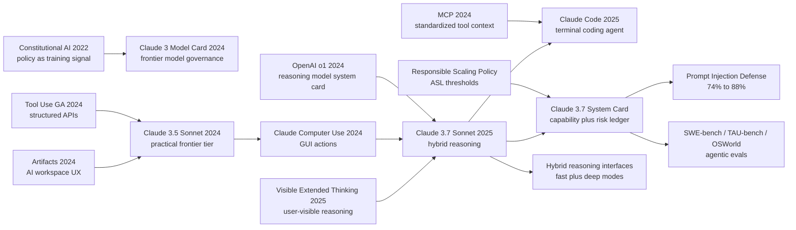

# Claude 3.5/3.7 Sonnet - Turning Frontier Models into Controllable Engineering Collaborators

> **On February 24, 2025, Anthropic released the [Claude 3.7 Sonnet System Card](https://www.anthropic.com/claude-3-7-sonnet-system-card) and opened Claude Code as a research preview.** This is not a paper from which one can reproduce a model: it gives no parameter count, no training corpus, no optimizer, and no reinforcement-learning recipe. Its real contribution is a different public artifact for frontier AI. The same Sonnet can answer quickly or spend visible extended thinking; API users can treat thinking budget as a controllable knob; and the system card puts SWE-bench, TAU-bench, computer use, prompt injection, ASL-2, false-refusal calibration, and visible reasoning risk into one deployment ledger. The hook is not merely that another model climbed another leaderboard. It is that a frontier model was presented as a controllable, auditable engineering collaborator that could enter a real codebase.

## TL;DR

Anthropic's 2024-2025 Claude 3.5/3.7 Sonnet system-card sequence changed what a frontier-model “paper” can look like: less a reproducible algorithm report than a deployment artifact combining capability, interface, tools, evaluations, and safety thresholds. The public abstraction can be written as $p(y\mid x,B)=\sum_z p_\theta(y\mid x,z,B)p_\theta(z\mid x,B)$, where $B$ is a user/API-controlled thinking budget and $z$ is the intermediate reasoning trace that Claude 3.7 can show in extended thinking. That formula is an interpretation, not Anthropic's disclosed training recipe. The failed baseline it displaced was not a single model, but the 2024 default of fast chat models plus prompt-elicited chain-of-thought plus external agent scaffolds. The June 2024 Claude 3.5 Sonnet release made the Sonnet tier a practical frontier model with a 200K context window, $3/$15 per million tokens pricing, and 64% on Anthropic's internal agentic coding evaluation versus Claude 3 Opus at 38%. The October 2024 update pushed SWE-bench Verified from 33.4% to 49.0% and introduced public-beta computer use. Claude 3.7 Sonnet then made the same model both a normal LLM and a reasoning model: Anthropic reports 63.7% on its n=489 SWE-bench Verified subset without high-compute scaffolding, 70.3% with parallel/high-compute ranking, prompt-injection prevention rising from 74% to 88%, 45% fewer unnecessary refusals, and an ASL-2 system-card assessment. Compared with [OpenAI o1](https://openai.com/index/openai-o1-system-card/), Sonnet's public idea is visible, controllable, unified reasoning; compared with [DeepSeek-R1](2025_deepseek_r1.md), it is less an open training recipe and more a governed product interface for a model that can work inside enterprise codebases.

---

## Historical Context

### June 2024: Sonnet moved from “mid-tier model” to practical frontier tier

The first historical meaning of Claude 3.5 Sonnet is that it changed what “Sonnet” meant inside Anthropic's model family. When Claude 3 launched in March 2024, Opus was the strongest model, Sonnet was the balanced tier, and Haiku was the speed tier. By June 21, Claude 3.5 Sonnet delivered near-frontier capability at Sonnet speed and price: a 200K context window, $3 per million input tokens, $15 per million output tokens, and roughly twice the speed of Claude 3 Opus. For enterprises and developers, this was not a minor benchmark bump. It moved frontier capability into a budget that could be used every day.

The most revealing number was not MMLU or GPQA, but Anthropic's internal agentic coding evaluation. Given a natural-language request to fix a bug or add functionality in an open-source codebase, Claude 3.5 Sonnet solved 64% of tasks, compared with Claude 3 Opus at 38%. That made Sonnet feel less like a chat model and more like a model that could work with code, tools, and long context. The simultaneous introduction of Artifacts pointed in the same direction at the product layer: Claude's ideal interface was not only a question-answer box, but an editable workspace.

### October 2024: computer use pushed tool use into environment action

The upgraded Claude 3.5 Sonnet release on October 22 looked like a directional turn. Earlier tool use usually meant function calling, retrieval, plugins, or a code interpreter: the model chooses a structured tool, receives a result, and writes an answer. Computer use moved the boundary outward. The model sees the screen, moves the mouse, clicks buttons, and types text, beginning to use software interfaces originally designed for humans. Anthropic explicitly framed this as a public beta, with awkward failures around scrolling, dragging, zooming, and other actions, but it exposed the interface for general digital labor.

The same release supplied several anchors: SWE-bench Verified improved from 33.4% to 49.0%; TAU-bench retail moved from 62.6% to 69.2%, and airline from 36.0% to 46.0%; OSWorld reached 14.9% in the screenshot-only category and 22.0% when given more steps. These are not classical NLP benchmarks. They measure whether a model can do things in an environment. Sonnet's comparison set therefore shifted from chat models alone to agents that edit files, run commands, operate web pages, and maintain task state over time.

### February 2025: Claude 3.7 made reasoning a controllable mode of the same model

OpenAI o1 made “thinking longer” visible as a capability curve in September 2024, but its product form was a separate reasoning model with hidden raw chain-of-thought. Claude 3.7 Sonnet's public story inverted that shape. Anthropic called it the first hybrid reasoning model: the same model can answer normally or enter extended thinking; users can see the thought process; API users can set a thinking-token budget up to the 128K output limit. That interface matters more historically than any single leaderboard result because it turns test-time compute from a hidden deployment detail into a product knob.

This also explains why Claude 3.7 and Claude Code were announced together. Claude Code is not an isolated command-line demo. It is a natural shell around Sonnet as an engineering collaborator: search and read code, edit files, run tests, use the command line, and keep the human in the loop. Sonnet's historical position is therefore not “the model that solved the most math contest problems.” It is the model that packaged reasoning, tools, codebases, and safety boundaries into a work loop.

### Anthropic's bet was system-card governance, not a single disclosed algorithm

The Claude Sonnet series is not a reproducible training paper. Anthropic does not disclose parameter count, training data, optimizer, reinforcement-learning algorithm, reward design, or the complete post-training pipeline. What it does disclose is another kind of frontier research artifact: the system card. A system card is not meant to let an outside lab reproduce the model. Its job is to state which capability evaluations, risk evaluations, external red teams, safety thresholds, and mitigations justify deployment.

That fits Anthropic's long-running line of work. Constitutional AI places policy and values inside training. The Responsible Scaling Policy ties capability thresholds to required safeguards. The Claude 3, 3.5, and 3.7 model cards turn “why we think this can be deployed” into a public document. By Claude 3.7, the object of the system card is no longer just text generation. It includes visible thinking, computer use, prompt injection, CBRN uplift, ASL-2 versus ASL-3 readiness, and enterprise code workflows.

| Date | Public artifact | Core change | Historical meaning |
|---|---|---|---|
| 2024-03 | Claude 3 Model Card | 200K context, multimodality, ASL-2 | Baseline for Anthropic system cards |
| 2024-06 | Claude 3.5 Sonnet | Sonnet price plus frontier-level capability | Practical frontier tier takes shape |
| 2024-10 | New Claude 3.5 + computer use | SWE-bench 49.0%, GUI action | From tool calling to environment acting |
| 2025-02 | Claude 3.7 Sonnet System Card | Hybrid reasoning, visible thinking | Test-time compute becomes productized |
| 2025-02 | Claude Code preview | Codebase-native workflow | Model enters the engineering loop |

## Background and Motivation

### The pain point: frontier models were no longer just answering; they were taking responsibility inside workflows

In 2023, the central question was whether models could answer more intelligently. By late 2024, the question had become whether models could act reliably. Real users do not only ask MMLU-style questions. They ask models to read repositories, change code, browse websites, fill forms, run tests, explain logs, and call internal systems. Once a model enters those workflows, an error is no longer just a wrong answer. It may corrupt a file, leak data, click a malicious page, execute the wrong command, or obey the wrong instruction when system, developer, and user messages conflict.

The Sonnet sequence is motivated by this shift: pull model capability out of isolated completion and into an auditable action loop. The 200K context window addresses “the model cannot see enough material.” Artifacts address “the output cannot be edited persistently.” Computer use addresses “not every tool has been wrapped as an API.” Claude Code addresses “the model must understand project state.” The system card addresses “can this kind of model be deployed at all?”

### The core tension: visible thinking is useful, but visible thinking is risky

Claude 3.7's extended thinking surfaces a long-standing tension. Showing the thought process can increase trust, help users check the answer, and give alignment researchers another observation channel. It can also expose immature, incorrect, half-formed, or dangerous intermediate content. Anthropic publicly acknowledges that faithfulness remains an open problem: the displayed thoughts do not necessarily fully explain the model's internal computation, so current chain-of-thought monitoring cannot be treated as a strong safety proof.

The motivation is therefore not “showing all chain-of-thought makes the model safe.” It is a compromise mechanism. Users can see enough extended thinking to use and debug the model. Rare high-risk thought content involving areas such as child safety, cyber attacks, or dangerous weapons can be encrypted. The system card records both the benefit and the risk of visible reasoning. This is more transparent than hiding all reasoning and more realistic than exposing everything unconditionally.

### The goal: unify fast answers, deep thinking, tools, and safety thresholds in one Sonnet

Claude 3.7's goal can be compressed into one sentence: do not force users to choose between a “fast model” and a separate “reasoning model”; let the same model allocate more or less thinking budget. Customer support, summarization, and formatting can run in ordinary mode. Math, physics, complex code changes, and long-horizon agent tasks can use extended thinking. API users can explicitly trade latency and cost for quality through token budgets.

This is also the difference from DeepSeek-R1 and OpenAI o1. R1's historical value is making part of the reasoning-RL recipe open. o1's value is proving test-time compute as a new scaling axis. Claude 3.7's value is at the interface layer: it hands that axis to developers and places safety, visibility, tool authority, and risk thresholds into the same public system card.

---

## Method Deep Dive

The “method” of Claude 3.5/3.7 Sonnet cannot be written like the method of ResNet or R1. Anthropic does not disclose model size, data mixture, RL algorithm, reward design, optimizer, post-training stages, or deployment routing. This section therefore does two things only: first, it organizes the system design that the system card and release notes explicitly disclose; second, it gives formulas and pseudocode as interpretive abstractions for why Sonnet became a representative artifact of 2025 agentic coding and hybrid reasoning. Every formula, diagram, and code sketch below should be read as explanation, not as Anthropic's internal implementation.

### Public boundary: this is not a reproducible training paper

The easiest mistake is to treat Claude 3.7 as a reasoning-RL paper. The public material does not provide enough information to reproduce the model. It belongs to the genre that followed the o1 System Card and the GPT-4 Technical Report: companies disclose capabilities, risks, evaluations, and mitigations while keeping core training details private. The useful boundary is:

| Layer | Public fact | Interpretive abstraction | Must not be invented |
|---|---|---|---|
| Model form | The same Claude 3.7 can answer normally or use extended thinking | Generate an intermediate trace $z$ under budget $B$ | Parameters, architecture, training data |
| Reasoning interface | Users can see thinking; API users can set a token budget | Test-time compute becomes a product knob | Raw hidden state or proof of full CoT faithfulness |
| Tool capability | Computer use, Claude Code, bash/file editing | Model acts in an environment loop | Internal tool router and system prompt |
| Safety governance | ASL-2, red teaming, prompt-injection mitigations | Capability thresholds plus mitigations decide deployment | Full risk scoring and internal red-team data |

### Overall framework: one model, two time scales

Claude 3.7's core product abstraction is to place “fast answer” and “deep thinking” inside the same model rather than asking users to switch to a separate reasoning model. We can write this as conditional generation: given input $x$ and budget $B$, the model first generates or internally uses a reasoning trace $z$, then produces the final answer $y$:

$$
p(y\mid x,B)=\sum_z p_\theta(y\mid x,z,B)\,p_\theta(z\mid x,B).
$$

When $B$ is small, $z$ may collapse into a short implicit scratchpad and the model behaves like an ordinary chat LLM. When $B$ grows, Claude 3.7 can spend more tokens decomposing the problem, trying routes, verifying, and revising, with extended thinking visible to the user. This framework explains why one model can serve low-latency support and complex code repair.

| Component | Input | Output | Public role |
|---|---|---|---|
| Ordinary answer mode | User request and context | Low-latency answer | Chat, summarization, formatting |
| Extended thinking | Hard task and budget $B$ | Visible thinking plus answer | Math, physics, complex code, long-horizon tasks |
| Tool/action loop | Repository, terminal, GUI, tool results | File edits, command results, web state | Claude Code / computer use |
| System-card layer | Capability and risk evaluations | ASL judgment, mitigations, deployment boundary | Public governance evidence |

### Key design 1: unified hybrid reasoning, not “another slow model”

The most direct product difference between Claude 3.7 and o1 is that Anthropic did not frame reasoning as a separate branded model. It exposed a reasoning switch inside Sonnet. That has an engineering advantage: prompts, tool schemas, context management, enterprise permissions, safety policies, and billing interfaces can remain continuous. Developers do not have to maintain one system for a normal model and another for a reasoning model.

At an abstract level, the objective is not just answer likelihood, but expected usefulness under a budget constraint:

$$
\max_\theta\;\mathbb{E}_{x,B,z,y\sim\pi_\theta}\left[R_{task}(x,y)+\lambda R_{policy}(x,z,y)-c(B)\right].
$$

Here $R_{task}$ represents task quality, $R_{policy}$ represents safety and instruction hierarchy, and $c(B)$ represents the cost of thinking tokens. This is not Anthropic's official reward formula. It simply captures the product essence of hybrid reasoning: capability, policy, and cost are traded off inside one response.

| Route | User experience | Engineering cost | Sonnet's choice |
|---|---|---|---|
| Fast model + slow reasoning model | Clear capability boundary | Prompts, permissions, and routing split | Not Anthropic's main public story |
| Single model + thinking budget | Continuous interface, controllable budget | Requires finer safety governance | Claude 3.7's public positioning |
| External scaffold adds reasoning | Fast to iterate | Failure attribution becomes messy | Claude Code keeps scaffolding only where useful |

### Key design 2: thinking budget makes test-time compute an API parameter

Claude 3.7's API lets users set a thinking-token budget up to the 128K output limit. This turns “let the model think longer” from a vendor-internal strategy into a developer-controlled parameter. It is similar in spirit to temperature or max_tokens, but it controls a different dimension: not randomness, and not merely answer length, but how much reasoning budget the model can spend before answering.

Anthropic's extended-thinking article also discusses serial and parallel test-time compute. Serial scaling means a single reasoning trajectory becomes longer. Parallel scaling means sampling multiple independent thought processes and choosing among them with majority vote, another model, or a learned scoring function. In public material, Claude 3.7 reaches 84.8% on GPQA using 256 independent samples, a 64K thinking budget, and a learned scoring model, with a 96.5% physics subscore. This is not the default deployed mode, but it shows that Sonnet's system card treats reasoning budget as an object of study.

| Compute form | Method | Benefit | Risk |
|---|---|---|---|
| Serial thinking | One longer trace | Predictable latency and better inspection | May pursue a wrong route longer |
| Parallel sampling | Many traces in parallel | Voting/scoring can raise accuracy | Expensive; scoring model can err |
| High-compute ranking | Filter bad patches, then rank | Large SWE-bench gains | Scaffold contribution is hard to separate |

### Key design 3: from tool use to computer use to Claude Code

Another key design in Claude 3.5/3.7 is placing the model inside executable environments. Traditional function calling asks developers to wrap the world as tools. Computer use lets the model face human-designed GUIs. Claude Code narrows that environment to repositories, terminals, editors, and tests. This spectrum matters: general computer use is broad but risky; Claude Code is narrower but turns the filesystem, test feedback, and version control into a high-value loop.

A Claude Code-like workflow can be abstracted as:

```python
def sonnet_engineering_loop(task, repo, budget, tools, policy):
    state = inspect(repo, task)
    while not done(state) and budget.remaining() > 0:
        thought = model.think(task, state, budget=budget.next_slice())
        action = model.choose_action(thought, tools, policy)
        result = execute(action, sandbox=policy.sandbox)
        state = update_state(state, action, result)
        if policy.requires_human_confirmation(action, result):
            request_approval(action, result)
    return summarize_changes(state)
```

This pseudocode is not Claude Code's implementation, but it explains why the system card must care about prompt injection and authority boundaries. Once a model can read web pages, see screens, run commands, and edit files, the environment itself can inject malicious text into the model context. Tool permissions and instruction hierarchy become part of the capability.

### Key design 4: the system-card safety loop turns deployment into an evidence chain

Much of the methodological contribution of the Claude 3.7 System Card is how it organizes safety evaluation. It does not merely claim that the model is safer. It separates risk surfaces: CBRN, cyber, autonomy, prompt injection, visible thinking, false refusal, external red teaming, and ASL level. The public material gives several auditable anchors: Claude 3.7 remains ASL-2; CBRN tasks show model-assisted uplift, but all end-to-end attempts still contain critical failures; unnecessary refusals drop by 45% compared with the predecessor; prompt-injection prevention improves from 74% to 88%, with a 0.5% false-positive rate.

| Risk surface | Public Claude 3.7 handling | Design motivation | Residual issue |
|---|---|---|---|
| ASL threshold | Remains ASL-2 while preparing ASL-3 measures | Tie capability thresholds to deployment safeguards | Future models may cross thresholds |
| Visible thinking | Rare high-risk thought spans can be encrypted | Preserve usefulness while reducing misuse leakage | Faithfulness remains unsolved |
| Prompt injection | Training + system prompt + classifier | Computer use must resist malicious environmental instructions | 88% is not complete defense |
| False refusal | 45% fewer unnecessary refusals than predecessor | Safety should not mean blanket over-refusal | Boundary calibration remains ongoing |

### Training / deployment strategy: disclose responsibility boundaries more than recipe

If “method” means training algorithm, the Sonnet system card looks incomplete. If “method” means how a frontier model enters society, it is unusually complete. It discloses pricing, context window, tool interfaces, evaluation protocols, safety level, external expert participation, capability boundaries, and mitigations, while withholding the core recipe. This asymmetric disclosure is a reality of frontier AI in 2025: influential research objects increasingly appear as mixtures of system cards, release notes, API docs, and product benchmarks.

For researchers, Claude 3.7's method lesson is that reasoning is not only a training paradigm; it is an interaction paradigm. For product teams, the lesson is that an agentic model is not just a smarter model. It is a composition of budget, tools, permissions, observability, evaluation, and safety response. For governance, the lesson is that if a model can act, the system card must evaluate how it acts, not only how it answers.

---

## Failed Baselines

### What lost was not one model, but three default routes

The failed baseline for Claude 3.5/3.7 Sonnet cannot be reduced to GPT-4o, o1, or R1 benchmark comparisons. What it really displaced were three default routes for frontier applications in 2024. The first was the fast-answer chat model: great latency and user experience, but brittle on complex codebases, long tool chains, and environmental state. The second was the external agent scaffold: retrieval, patch localization, best-of-N, test filtering, and rerankers wrapped around the model. That works in the short term, but it is complex and hard to debug. The third was over-refusal safety: refuse broad borderline regions, which lowers some violation rates but prevents benign users from completing real tasks.

Sonnet's system card puts these baselines into one frame. The model itself must read long context, write code, use tools, and think. Scaffolding can help, but it cannot replace model capability. Safety should reduce misuse without turning benign tasks into refusals. If the agent can act, it must resist prompt injection. In other words, Sonnet did not only beat a leaderboard opponent. It challenged the old habit of optimizing model, tools, safety, and product experience separately.

| Baseline | Why it looked reasonable | Failure mode | Sonnet replacement |
|---|---|---|---|
| Fast chat LLM | Low latency, low cost, easy deployment | Complex tasks lack controllable thinking budget | Extended thinking + budget |
| Heavy external scaffold | Engineering can compensate for weak model behavior | Complex system; model contribution hard to attribute | Stronger base model + minimal scaffold |
| Prompt-only CoT | Cheap to add | Unstable, hard to govern, poor fit for tool authority | Unified hybrid reasoning interface |
| Blanket refusal safety | Simple way to reduce violations | Poor UX; benign requests over-refused | 45% fewer unnecessary refusals |

### Boundaries the authors expose themselves

Anthropic's public material also exposes several boundaries. Computer use in 2024 was still a public beta: dragging, scrolling, zooming, and other easy human actions could fail; OSWorld 14.9%/22.0% shows it was far from a reliable digital worker. Claude 3.7's visible thinking is not a free lunch either. The thought process may contain errors, half-formed reasoning, and high-risk content; faithfulness remains unresolved.

The CBRN conclusion in the system card is likewise not “no risk.” Anthropic reports uplift among model-assisted participants compared with non-assisted participants, meaning the model can help people move closer to dangerous goals. The end-to-end attempts still contained critical failures, preventing success. That wording matters. ASL-2 does not mean “nothing to see here.” It means current mitigations are judged sufficient for deployment while future ASL-3 measures need to be prepared.

### The real anti-baseline lesson

Looking back from 2025, Sonnet's anti-baseline lesson is that the bottleneck for agentic AI is not only whether the model can reason. It is whether the model's reasoning can be connected to action, authority, and auditability. o1 proved that longer thinking matters. R1 proved that open RL can approach the reasoning frontier. Sonnet's system card proved a different practical point: enterprises buy a workflow, and that workflow contains model quality, context, tools, safety logs, permissions, false-refusal rate, prompt-injection defenses, and recovery from errors.

This is why Claude Code was announced together with Claude 3.7. A pure chat model, however strong, does not naturally enter an engineering workflow. An executable agent, however capable, cannot be trusted if its authority boundary is unclear. Sonnet's route writes model capability into system responsibility. That is the core shift of the system-card era.

## Key Experimental Data

### Main public numbers

The public numbers for the Sonnet sequence fall into three families: ordinary capability, agentic coding/tool use, and safety/governance. The second family matters most for understanding Sonnet's reputation among developers. The June 2024 internal coding-eval result made Claude 3.5 Sonnet feel like a code collaborator. The October 2024 SWE-bench 49.0% put that experience onto a public benchmark. Claude 3.7 then raised the SWE-bench subset result to 63.7%, with a high-compute version at 70.3%.

| Metric | Claude 3.5 / 3.7 number | Comparison or context | Reading |
|---|---|---|---|
| Internal agentic coding | 3.5 Sonnet 64% | Claude 3 Opus 38% | Sonnet becomes the coding-work model |
| SWE-bench Verified | upgraded 3.5 Sonnet 49.0% | previous version 33.4% | Agentic coding jump |
| SWE-bench Verified subset | 3.7 Sonnet 63.7% | n=489 solvable subset | Strong under minimal scaffold |
| SWE-bench high compute | 3.7 Sonnet 70.3% | parallel attempts + ranking | Test-time compute still improves results |
| TAU-bench retail / airline | 69.2% / 46.0% | up from 62.6% / 36.0% | Multi-turn tool interaction improves |
| OSWorld computer use | 14.9% / 22.0% | screenshot-only / more steps | Early capability, clear direction |

### Safety and reliability numbers

The safety numbers in the Claude 3.7 System Card matter just as much because they bind capability growth to deployment judgment. The headline is not “zero risk.” It is that risks are quantified enough to be debated: ASL-2 remains appropriate, CBRN shows uplift but end-to-end failure, prompt-injection defenses improve but do not solve the problem, and unnecessary refusals drop rather than simply increasing refusal rates.

| Topic | Public result | Why it matters | Residual risk |
|---|---|---|---|
| AI Safety Level | Claude 3.7 remains ASL-2 | Current model does not trigger ASL-3 deployment threshold | Next generation may cross thresholds |
| CBRN uplift | Uplift observed, but end-to-end critical failures | Dangerous capability is not minimized away | Model progress can shrink margin |
| Prompt injection | 74% to 88%, 0.5% false positive | Core safety surface for computer use | Still not complete defense |
| False refusals | 45% fewer unnecessary refusals | Safety and usefulness improve together | Boundary cases remain hard |

### How to read these numbers

These numbers should not be read like a single static leaderboard. The 63.7% and 70.3% SWE-bench figures involve subset definition, scaffolding, and ranking. TAU-bench depends on a prompt addendum and planning tool. OSWorld performance changes materially with step budget. Anthropic's appendix explains these scaffolds, and that transparency is a strength rather than a weakness, because agentic evaluation is inherently a mixture of model, tools, and runtime policy.

The better reading is that Claude Sonnet moves “model capability” from static benchmarks into dynamic workflow benchmarks. It does not prove that every number is directly comparable with every competitor. It proves a system-design direction: long context, controllable thinking budget, tool action, and safety mitigations change what the model can do in real tasks.

---

## Idea Lineage



### Predecessors: Constitutional AI, long context, and tool use converged

The intellectual prehistory of Claude Sonnet is not a single algorithmic line. It is the convergence of three Anthropic threads. The first is Constitutional AI: put safety principles into model behavior rather than relying only on post-deployment filters. The second is the Claude 3 model card: make context window, vision, refusals, bias, CBRN/cyber/autonomy risk, and ASL level part of the release artifact. The third is tool use and Artifacts: the model is not merely answering; it is collaborating in an editable workspace with callable tools.

Computer use in 2024 is the hinge. It moves tool use from “call APIs prepared by developers” to “operate human software interfaces.” That step makes prompt injection, authority separation, and action auditability central rather than peripheral. Without computer use, the Claude 3.7 System Card could have been another capability report. With computer use, it had to become an agent-safety document.

### Descendants: a third form of reasoning model alongside o1 and R1

By 2024-2025, reasoning models had at least three public forms. OpenAI o1 is the closed, hidden-CoT, inference-time-scaling form. DeepSeek-R1 is the open-weight, RL-recipe narrative centered on rule reward and GRPO. Claude 3.7 Sonnet is the unified-model, visible-extended-thinking, API-budget, system-card-safety form. All three put extra reasoning compute at the center, but their external interfaces are quite different.

Claude's special position is that it binds reasoning to action more tightly. o1 is closer to a deep problem solver. R1 is closer to an open reasoning recipe. Claude 3.7 is closer to a controllable agent backbone that can enter workflows. That does not mean Claude is strongest on every benchmark. It defines another way to evaluate frontier models: whether they can act stably across tools, codebases, screens, permissions, and safety rules.

### Misreadings / oversimplifications

- **“Claude 3.7 = o1 reproduction”**: inaccurate. o1's public form is a separate reasoning model with hidden raw thought. Claude 3.7's public form is the same Sonnet switching between ordinary mode and extended thinking, with user/API-controlled budget.
- **“Visible thinking equals true internal cause”**: Anthropic explicitly warns that faithfulness remains unsolved. Visible reasoning is a useful observation channel, not a safety proof.
- **“Computer use is just tool calling with a new name”**: no. Tool calling exposes developer-defined tool boundaries; computer use exposes human GUIs and web content, making prompt injection and authority governance central.
- **“A system card has little technical value because it lacks training details”**: that is a bias from the older paper genre. Once frontier models enter deployment, capability, risk, and mitigation evidence become part of the technical contribution.

---

## Modern Perspective

### Assumptions that no longer hold

**Assumption 1: a reasoning model must be a separate product.** After o1, many people assumed that “normal model” and “reasoning model” would remain separated. Claude 3.7 gives the opposite route: one model can switch time scales according to the task. Looking back from 2026, this fits enterprise use better because permissions, context, tool schemas, logs, and cost controls dislike frequent model-identity switches.

**Assumption 2: visible chain-of-thought must be either fully public or fully hidden.** Claude 3.7 chooses a middle path: show extended thinking to users, encrypt rare high-risk spans, acknowledge that faithfulness remains unsolved, and still use visible reasoning for checkability. That compromise turns chain-of-thought visibility from a philosophical fight into an engineering control.

**Assumption 3: agent benchmarks only measure the model.** SWE-bench, TAU-bench, and OSWorld all show that real agent evaluation measures a system: model capability, tool interface, step count, prompt addenda, test filtering, ranking, and permission policy are all inside the result. One value of the Sonnet system card is that it writes these scaffolds down so readers know where the score came from.

**Assumption 4: safety capability is reflected only in refusal rate.** Claude 3.7's 45% fewer unnecessary refusals shows that stronger safety does not have to mean more refusals. For enterprise models, over-refusal is itself a failure mode because it blocks benign workflows in support, medical administration, code security review, compliance analysis, and many other settings.

### What time validated as essential vs redundant

| Item | Later proved essential | Later seemed redundant or insufficient | Reason |
|---|---|---|---|
| Thinking budget | ✅ | — | Developers need explicit control over latency, cost, and quality |
| Visible thinking | ✅ | Not a full explanation | Useful, but faithfulness is unsolved |
| Computer use | ✅ | General GUI action remains brittle | Direction is right; deployment needs narrowed authority |
| Heavy benchmark scaffold | Partly essential | Direct comparisons can mislead | Agent scores include runtime policy |
| ASL system-card disclosure | ✅ | ASL label alone is insufficient | Concrete risk surfaces and mitigation numbers matter |

### If rewritten today

If the Claude 3.7 System Card were rewritten today, I would want three additional classes of information. First, finer budget-performance curves: marginal gains, latency, and cost for different thinking budgets on SWE-bench, TAU-bench, GPQA, AIME, and OSWorld. Second, a more standardized description of agent scaffolds: tool list, step limit, whether parallel attempts are allowed, whether tests are visible, ranking rules, and human-confirmation points. Third, a more detailed safety confusion matrix: prompt injection, privilege escalation, data exfiltration, malicious web pages, command execution, false positives, and false negatives should each be defined separately.

That is not a demand for Anthropic to reveal training secrets. It is a request for system cards to become a more comparable paper genre. Frontier models may not expose their recipes, but they can expose evaluation contracts: what conditions were used, which tools were available, how risk was defined, how failure was counted, and which mitigations changed the outcome.

## Limitations and Future Directions

### Limitations

First, the Claude Sonnet system card is not reproducible. It cannot tell an outside researcher how to train Claude 3.7, nor can it cleanly separate what comes from pretraining, post-training, tool scaffolding, prompt addenda, or inference-time ranking. Second, agent-benchmark comparisons require care because different labs use different scaffolds. Third, visible thinking remains scientifically awkward: it helps users and researchers inspect the model, but it does not prove why the model made a decision.

Fourth, the safety boundary around computer use is still incomplete. 88% prompt-injection prevention is much better than 74%, but it is not a formal guarantee; a 0.5% false-positive rate can also become noisy in large enterprise workflows. Fifth, ASL-2 is a deployment judgment at a point in time, not a permanent license. Model capability, tool authority, attack methods, and user workflows all change, so the system card must be updated continuously.

### Future directions

The next direction to watch is standardization of agent safety evaluation. SWE-bench and OSWorld cover part of task capability, but safety needs equally public benchmarks: will the model obey malicious instructions hidden in a web page? Will it treat hidden prompts as user commands? Will it leak secrets from a repository? Will it ask for human confirmation when uncertain? These questions are closer to real deployment risk than a pure AIME score.

Another direction is a faithful reasoning interface. Claude 3.7 makes reasoning visible, but Anthropic itself acknowledges that current thought traces may not be faithful. Future systems may find a middle interface between “show raw chain-of-thought” and “show only a summary”: the model can provide auditable reasons when needed without exposing every internal draft by default; the system can monitor anomalous reasoning patterns without treating CoT as the only evidence.

## Related Work and Insights

### Relationship to o1 / R1 / Gemini

Claude 3.7 shares with o1 the claim that test-time compute is a capability axis, but the product choices differ. o1 emphasizes hidden reasoning and final answers; Claude 3.7 emphasizes visible extended thinking and a controllable budget inside the same model. It shares with DeepSeek-R1 the historical moment in which reasoning models changed the 2025 competition, but R1's public contribution is closer to training recipe and open weights, while Claude's is closer to interface and system governance. Gemini 1.5/2.x emphasizes long context, multimodality, and Google ecosystem integration, forming a parallel route to enterprise agents.

The real insight is that there is not one successful form of reasoning model. Open-source routes, closed system-card routes, unified hybrid routes, and long-context routes can all move the field. Researchers should ask not only “who has the higher benchmark,” but also “who turned a new capability axis into a usable interface.”

### Lessons for researchers and product teams

For researchers, Sonnet's lesson is to treat agent evaluation as a system problem. Do not report only static prompt scores; report tools, step counts, context, budget, reranking, and failure recovery. For product teams, the lesson is to treat thinking budget as part of UX and cost design. Deep thinking on every request is expensive and slow; fast answers on every request are brittle; real products need dynamic allocation.

For safety teams, the lesson is to treat prompt injection as a foundational threat of the agent era, not a fringe jailbreak. Once a model can read external content and take actions, that external content can try to rewrite the instruction hierarchy. The system needs authority separation, tool confirmation, environment isolation, logging, and anomaly detection.

## Resources

### Official materials

- [Claude 3.5 Sonnet release](https://www.anthropic.com/news/claude-3-5-sonnet): June 2024 release with 200K context, pricing, Artifacts, 64% coding eval, and ASL-2.
- [Introducing computer use, a new Claude 3.5 Sonnet, and Claude 3.5 Haiku](https://www.anthropic.com/news/3-5-models-and-computer-use): October 2024 upgraded Sonnet with SWE-bench 49.0%, TAU-bench, OSWorld, and computer-use beta.
- [Claude 3.7 Sonnet and Claude Code](https://www.anthropic.com/news/claude-3-7-sonnet): February 2025 release with hybrid reasoning, thinking budget, Claude Code, and SWE-bench/TAU-bench appendix.
- [Claude's extended thinking](https://www.anthropic.com/research/visible-extended-thinking): explains visible extended thinking, serial/parallel test-time compute, GPQA 84.8%, and prompt-injection defenses.
- [Claude 3.7 Sonnet System Card](https://www.anthropic.com/claude-3-7-sonnet-system-card): system-card PDF with ASL-2, safety evaluations, and deployment judgment.

### Further reading

- [OpenAI o1 System Card](https://openai.com/index/openai-o1-system-card/): contrast with another system-card style for hidden reasoning and test-time compute.
- [DeepSeek-R1](2025_deepseek_r1.md): contrast open reasoning-RL recipe with closed productized system-card disclosure.
- [Llama 3](2024_llama3.md): contrast how open-weight frontier models disclose training and evaluation through reports.
- [Model Context Protocol](https://www.anthropic.com/news/model-context-protocol): context for Claude's tool ecosystem and standardized agent context.
- [SWE-bench Verified](https://www.swebench.com/#verified): benchmark context for Sonnet's coding-task evaluation and comparison limits.


---

> 🌐 [中文版](/era5_genai_explosion/2025_claude_sonnet/) · 📚 awesome-papers project · CC-BY-NC