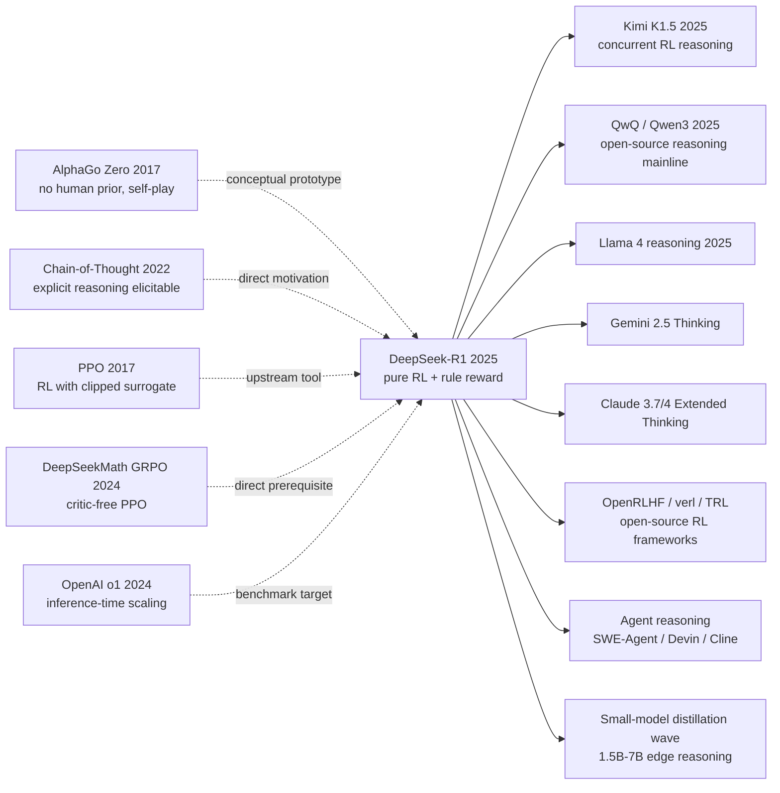

# DeepSeek-R1 — How Pure Reinforcement Learning Taught an Open LLM to Reason

> **January 20, 2025. DeepSeek-AI uploads [arXiv 2501.12948](https://arxiv.org/abs/2501.12948) and open-sources the full R1 weights under MIT license.**
> A paper with no fancy architecture, no human demonstrations, and not even a full SFT step
> uses an RL recipe OpenAI had treated as crown-jewel secret to push a 671B open MoE to 79.8 pass@1 on AIME 2024 — matching OpenAI o1.
> Within 28 days it gathered 91k GitHub stars, ignited a global open-source reasoning wave, and wiped $600B off NVDA's market cap in a single day.
> It proved something more important than any technical detail: **reasoning capability can "emerge" — provided you dare to reward correctness directly with RL.**

## TL;DR

DeepSeek-R1 trains a base model with **pure RL (GRPO + rule-based reward)**, skipping expensive human reasoning demonstrations and letting the LLM "emerge" reflection / self-verification / long CoT behaviors. A single round of cold-start SFT plus a second RL stage repairs language mixing and readability, pushing 671B MoE to o1 level. The R1 traces are then distilled into 7B/32B models so small models can also reason.

---

## Historical Context

### What was the LLM community stuck on in 2024?

To grasp R1's disruptive power you have to return to the "reasoning black-box" moment of late 2024.

Since GPT-3 + CoT prompting (2022), the field had assumed that **adding "Let's think step by step" was the trick**, and the consensus was: "reasoning is elicited by prompting and distilled by SFT." In September 2024, OpenAI released o1 and showcased an "the longer it thinks, the better it gets" inference-time scaling curve — but **OpenAI disclosed nothing**, just a 5-page system card. The community fell into massive reverse engineering:

> **Was o1 a process reward model + tree search? MCTS + value net? Some kind of RL? Nobody knew.**

The Q4 2024 reproduction attempts (Macro-o1, QwQ, g1, OpenR, rStar-Math) almost all assumed o1 = **PRM (process reward model) + search**. That is a brutally expensive path: label process rewards, train value nets, run MCTS.

### The 3 immediate predecessors that pushed R1 out

- **Wei et al., 2022 (Chain-of-Thought Prompting)** [arXiv/2201.11903](https://arxiv.org/abs/2201.11903): First proof that LLMs have "explicit reasoning" capability — but at the time it was framed as a prompt-triggered behavior, not an intrinsic property.
- **Schulman et al., 2017 (PPO)** [arXiv/1707.06347](https://arxiv.org/abs/1707.06347) + **Ouyang et al., 2022 (InstructGPT)** [arXiv/2203.02155](https://arxiv.org/abs/2203.02155): Cemented the engineering form of RLHF, but reward came from a learned human preference model, not task ground truth.
- **Shao et al., 2024 (DeepSeekMath / GRPO)** [arXiv/2402.03300](https://arxiv.org/abs/2402.03300): DeepSeek's own previous work introduced **Group Relative Policy Optimization** — drop the critic, use a group baseline for advantage estimation. This is the direct prerequisite that made R1 trainable.

### What was the author team doing?

DeepSeek-AI is the AI lab under hedge fund High-Flyer, having released V2/V3 (open MoE line) in 2024. **R1 was not an isolated demo paper — it was DeepSeek pushing V3 to its reasoning frontier**: V3-Base as backbone, GRPO as algorithm, math/code problems as reward ground truth, all open-sourced.

### State of the industry, compute, and data

- **GPUs**: H800 (China-restricted H100); R1 trained on a ~2,000-card cluster — far smaller than GPT-4-class pretraining
- **Data**: math, code, and logic problems — all with verifiable answers; no human-annotated thought traces required
- **Frameworks**: in-house HAI-LLM framework + DeepSeek-V3 inference stack
- **Industry climate**: o1 closed-source, o3 about to launch; US-China compute controls escalating; the open-source community desperate for a "reasoning-capable" base model

---

## Method Deep Dive

### Overall framework

R1's training pipeline is **two parallel branches** that finally distill down to small models:

```
                 ┌─────────────────────────────────┐
                 │  DeepSeek-V3-Base (671B MoE)    │
                 └────────────┬────────────────────┘
                              │
                ┌─────────────┴─────────────┐
                ↓                           ↓
       ┌──────────────────┐        ┌──────────────────┐
       │  R1-Zero branch  │        │  R1 branch        │
       │ (pure RL, no SFT)│        │ (cold-start SFT  │
       │                  │        │  + multi-stage RL)│
       │  GRPO            │        │                  │
       │  rule reward     │        │  Stage 1: SFT    │
       │  ↓               │        │   (few k CoT)    │
       │  emerges reflect │        │  Stage 2: RL     │
       │  AIME 71.0 pass@1│        │   (reasoning RL) │
       │  but lang mixing │        │  Stage 3: SFT    │
       │                  │        │   (600k general) │
       │                  │        │  Stage 4: RL     │
       │                  │        │   (helpful+safe) │
       │                  │        │  AIME 79.8 pass@1│
       └──────────────────┘        └────────┬─────────┘
                                            │
                                            ↓
                              ┌─────────────────────────────┐
                              │  Distill to Qwen/Llama       │
                              │  7B / 14B / 32B / 70B        │
                              │  (pure SFT, no RL)           │
                              │  32B AIME 72.6 pass@1        │
                              │  beats o1-mini               │
                              └─────────────────────────────┘
```

The differences across variants:

| Model | Starting point | Training | Key trait | AIME 2024 pass@1 |
|-------|----------------|----------|-----------|------------------|
| R1-Zero | V3-Base | Pure GRPO RL | Reflection emerges, mixed language | 71.0 |
| R1 | V3-Base | SFT + RL × 2 + SFT | Readable, aligned, reasoning | **79.8** |
| R1-Distill-Qwen-32B | Qwen2.5-32B | SFT only (R1 trace) | Small-model reasoning | 72.6 |
| R1-Distill-Qwen-7B | Qwen2.5-Math-7B | SFT only (R1 trace) | Edge deployment | 55.5 |
| OpenAI o1 (reference) | Closed | Closed | — | 79.2 |

A counter-intuitive point: **R1-Distill-32B (72.6) significantly beats running RL directly on a 32B base (47.0)**. Distillation + post-distill SFT is the optimal path for the open-source community to "use a big model to teach small ones."

### Key designs

#### Design 1: GRPO (Group Relative Policy Optimization) — PPO without a critic

**Function**: Run RL on an actor with hundreds of billions of parameters **without training a separately-sized value network**, eliminating both the memory and stability bottlenecks in one stroke.

**Forward formula**:

For each prompt $q$, sample a group of $G$ outputs $\{o_1, \dots, o_G\}$ from the current policy $\pi_{\theta_{\text{old}}}$ and obtain rewards $r_i$. GRPO uses **within-group normalization** for advantage:

$$
A_i = \frac{r_i - \text{mean}(\{r_1, \dots, r_G\})}{\text{std}(\{r_1, \dots, r_G\})}
$$

Then update the policy with a PPO-style clipped surrogate:

$$
\mathcal{L}_{\text{GRPO}} = \mathbb{E}_q \left[ \frac{1}{G} \sum_{i=1}^{G} \min\left( \rho_i A_i,\; \text{clip}(\rho_i, 1-\epsilon, 1+\epsilon) A_i \right) - \beta \, \mathbb{D}_{\text{KL}}(\pi_\theta \| \pi_{\text{ref}}) \right]
$$

with $\rho_i = \pi_\theta(o_i|q) / \pi_{\theta_{\text{old}}}(o_i|q)$ being the importance ratio. **Key difference: advantage $A_i$ comes from the within-group z-score, not from a learned value function.**

**Forward pseudocode** (simplified):

```python
def grpo_step(model, prompts, reward_fn, group_size=64, clip_eps=0.2, kl_coef=0.04):
    losses = []
    for q in prompts:
        # Sample a group of outputs
        outputs = [model.sample(q) for _ in range(group_size)]
        rewards = [reward_fn(q, o) for o in outputs]   # rule-based: 0 or 1
        # Within-group normalization
        r = torch.tensor(rewards)
        adv = (r - r.mean()) / (r.std() + 1e-8)
        # PPO clipped loss
        for o, a in zip(outputs, adv):
            ratio = model.log_prob(o, q).exp() / model_old.log_prob(o, q).exp()
            surr = torch.min(ratio * a,
                             torch.clamp(ratio, 1-clip_eps, 1+clip_eps) * a)
            kl = compute_kl(model, model_ref, o, q)
            losses.append(-surr + kl_coef * kl)
    return torch.stack(losses).mean()
```

**3 advantage estimators compared**:

| Method | Needs value network? | Memory overhead | Stability | R1 outcome |
|--------|----------------------|-----------------|-----------|------------|
| PPO + GAE | Yes (same size as actor) | 2× actor | High in theory, hard to train critic | — |
| RLHF + reward model | Yes (reward model) | 1.5× | Easy to reward-hack | — |
| **GRPO (this paper)** | **No** | **1× actor** | **Within-group norm naturally stable** | ✅ |
| REINFORCE | No | 1× | Extremely high variance | × |

**Design rationale — why is GRPO so much better than PPO for LLMs?**

PPO's critic must be at the same scale as the actor (otherwise it cannot accurately estimate the value of long CoTs); a 671B actor with a 671B critic is essentially un-trainable. GRPO replaces the critic with **within-prompt relative advantage** — because RL fundamentally only needs "relative goodness," not absolute values.

Even better: rule-based reward is discrete 0/1, so **within-group variance is naturally bounded**, and z-score normalization keeps the advantage in a reasonable range without complex reward shaping. This is the "perfect marriage" of GRPO and rule-based reward.

#### Design 2: Rule-Based Reward — rejecting PRM and reward models

**Function**: Skip the entire "train a reward model" step and judge rollout quality with deterministic rules.

**Core idea**: Each training sample comes with verifiable ground truth, and the reward function is a deterministic rule:

```python
def reward(prompt, completion, gt_answer, problem_type):
    # 1) Format reward: reasoning must be wrapped in <think>...</think>
    fmt = 1.0 if has_think_tag(completion) else 0.0
    # 2) Accuracy reward: correctness
    if problem_type == "math":
        acc = 1.0 if extract_boxed(completion) == gt_answer else 0.0
    elif problem_type == "code":
        acc = 1.0 if run_unit_tests(completion, gt_tests) else 0.0
    elif problem_type == "logic":
        acc = 1.0 if final_answer(completion) == gt_answer else 0.0
    return fmt * 0.1 + acc * 1.0
```

Note: **no process reward**, no "intermediate-step scoring." This is the biggest difference from the OpenAI/PRM line.

**Why no PRM? §2.2.4 of the paper gives three reasons**:

| PRM problem | R1's rebuttal |
|-------------|---------------|
| Annotation expensive (every step needs scoring) | Rule-based costs nothing |
| Reward hacking (model learns "looks-correct" steps) | 0/1 terminal-only judgment, un-hackable |
| The PRM model itself needs constant retraining | Rules are maintenance-free forever |

**Ablation over 4 reward configurations (paper Figure 3 + Table)**:

| Reward configuration | AIME pass@1 | Reflection emerges? | Response length |
|----------------------|------------|---------------------|-----------------|
| Format only | 15% | ❌ | Short, no thinking |
| Accuracy only | 65% | ✅ (medium) | Medium |
| **Format + accuracy** | **71%** | **✅ (strong)** | **Long + high quality** |
| + PRM supervision | 67% | ✅ | Easy to hack intermediate |

**Design rationale — why is "right vs wrong" enough?**

The 2024 dogma was "the reward signal must be dense or RL won't converge." But DeepSeek discovered: **with enough samples per group (group_size = 64), rule reward provides sufficient contrast within the group**. The model naturally learns "which token patterns more often produce correct answers," and behaviors like verification, backtracking, and long CoT emerge.

A deeper insight: **if you can verify a domain with rules (math, code, formal logic), you can use RL to push any base model close to its ceiling**. This is R1's methodological takeaway, far more important than any specific technique.

#### Design 3: Cold-Start SFT — repairing language from R1-Zero to R1

**Function**: Solve R1-Zero's readability disaster (mixed Chinese/English, chaotic answer blocks) **without breaking** the reasoning capability already acquired.

**Core idea — extremely small but extremely high-quality long-CoT demonstrations**:

```
Step 1: Run a few thousand prompts through R1-Zero, hand-pick ~5,000 clean long-CoT outputs
Step 2: Light human editing (unify language, standardize <think></think><answer></answer>)
Step 3: Cold-start SFT on V3-Base (only 1-2 epochs)
Step 4: Run reasoning-focused RL (same recipe as R1-Zero)
Step 5: Collect 600k general SFT samples (writing, QA, safety) for a second SFT
Step 6: Run helpful + harmless RL to complete alignment
```

**Why is "a few thousand" enough?**

| SFT data scale | AIME pass@1 | Readability | Diversity |
|----------------|------------|-------------|-----------|
| 0 (i.e. R1-Zero) | 71.0 | Poor | High |
| Few k cold-start | 70.5 | Excellent | Medium |
| 50k SFT only | 50.0 | Excellent | High |
| Few k cold-start + RL | **79.8** | **Excellent** | **High** |

**Counter-intuitive finding**: **More SFT data → worse reasoning**. The reason is that large SFT "locks in" the model's exploration distribution and the subsequent RL loses room to discover new strategies. A small cold-start only "teaches the model to speak human language," it does not make reasoning decisions for it.

**Design rationale — let SFT serve RL, not replace it**:

The traditional pipeline (Pretrain → SFT → RLHF) treats SFT as the main capability source and RL as "alignment finetuning." R1 fully inverts this: **RL is the capability source, SFT is just the "translation layer."** This paradigm flip is arguably the most important conceptual shift in LLM training in the past 5 years.

#### Design 4 (implicit but key): Distillation vs direct RL — "push the big model, distill the small ones"

**Function**: Give 7B/32B "models that ordinary players can run" R1-level reasoning capability.

**Core idea**: Use R1 (671B) to generate ~800k long-CoT training samples, then run pure SFT on the Qwen2.5/Llama3 series (**no further RL**).

**Why does direct RL on 32B underperform distillation?**

| 32B training method | AIME pass@1 | Training cost |
|---------------------|------------|---------------|
| 32B base + GRPO RL | 47.0 | High (~2,000 GPU hours) |
| 32B + Distill from R1 (SFT only) | **72.6** | Low (one-shot SFT) |

**The explanation in §4.1**: a 32B model has weaker exploration (insufficient capacity) than 671B, so it cannot easily "emerge" long-CoT patterns under self-RL; but R1 has already "compressed" those patterns into the training data and 32B can simply imitate.

**Design rationale**: This finding frees the open-source community from "must run RL yourself." Any team that can obtain R1 traces can produce a reasoning small model at extremely low cost — this is R1's true value as an "open-source public good."

### Loss / training strategy

| Item | Configuration | Note |
|------|---------------|------|
| Loss (RL) | GRPO clipped surrogate + KL | $\epsilon=0.2, \beta=0.04$ |
| Loss (SFT) | Cross-entropy on long CoT tokens | Standard next-token |
| Optimizer | AdamW | $\beta_1=0.9, \beta_2=0.95$ |
| Weight decay | 0.1 | |
| LR | 3e-6 (RL) / 5e-6 (SFT) | Tiny LR to prevent catastrophic forgetting |
| Group size | 64 (RL rollout) | **Key** — provides within-group contrast |
| KL coef $\beta$ | 0.04 | Prevents policy from drifting too far from ref |
| Rollout temperature | 0.6-1.0 | Encourages exploration |
| Reward | format(0.1) + accuracy(1.0) | Two rules only |
| RL steps | ~10k for R1-Zero | Stop at convergence |
| Hardware | ~2,000 H800 GPUs | Same cluster as V3 |

**Note 1**: The method itself introduces only two changes — GRPO and rule reward. **No new model components, no PRM, no search**. This "subtractive" aesthetic is why R1 became a base recipe.

**Note 2**: The training recipe looks unbelievably plain, yet R1 remains widely reproducible in 2026 precisely because it is **insensitive to implementation details** — swap the base model (Qwen / Llama), swap the RL framework (vLLM-based / OpenRLHF), swap group size (16-128) and the core recipe still works.

---

## Failed Baselines

### Opponents that lost to R1 at the time

- **Macro-o1 / QwQ-32B-Preview (Q4 2024)**: Pure o1-trace distillation + SFT, AIME 50.0; without RL repair, generalization is weak and OOD problems collapse it.
- **rStar-Math (Microsoft, 2024)**: MCTS + PRM line, 7B model AIME 53.3; but requires 4 models cooperating (policy/PRM/reward/value), engineering nightmare.
- **OpenR / OpenReasoner**: Open-source attempts to replicate the OpenAI o1 PRM line, AIME ~40; proves the PRM line cannot catch up under open-source compute.
- **g1 / Open-o1**: Pure prompting + multi-sample, no training, AIME ~35; low ceiling.

### Failed experiments the authors admit

§4.2 explicitly reports 3 failed directions:

- **Direct PRM supervision**: Trying to inject process reward into GRPO led to reward hacking — the model learned to emit "looks-thinking" token patterns to fool the PRM, dragging AIME down to 67%.
- **MCTS at training time**: Tree search at the token level is impossible — the search space (~30k vocab × thousands of steps) is too large.
- **Direct RL on 32B base**: GRPO on 32B base without distillation gives only AIME 47.0, far below distillation + SFT's 72.6.

### The "language mixing" counterexample

R1-Zero late in training developed **severe Chinese/English code-mixing**: the model frequently switched languages in its thought chain, even inserting emojis and pseudo-code. This is not a bug but RL's natural behavior in the absence of language-consistency constraints — the model discovered that "mixed languages compress concepts more efficiently." But it is a UX disaster and required cold-start SFT to repair.

### The real "anti-baseline" lesson

**Microsoft rStar-Math came out 3 months before R1**, and its idea looks more "scientific" (PRM + MCTS exactly mirrors AlphaGo). Yet rStar-Math is barely cited and almost never deployed today. The reason is not bad ideas but **4-model coordination + complex search engines that are nearly impossible to maintain in production**. **R1's victory is the victory of "engineering minimalism"**: introduce no component if you can avoid it. This is the most important "failed baseline" lesson in hindsight, even though the paper does not write it down — a complex idea, even if first, will lose to a simple one.

---

## Key Experimental Data

### Main experiments (reasoning benchmarks)

| Benchmark | Claude 3.5 Sonnet | GPT-4o | OpenAI o1-1217 | DeepSeek-V3 | DeepSeek-R1 |
|-----------|-------------------|--------|----------------|-------------|-------------|
| AIME 2024 (pass@1) | 16.0 | 9.3 | 79.2 | 39.2 | **79.8** |
| MATH-500 (pass@1) | 78.3 | 74.6 | 96.4 | 90.2 | **97.3** |
| Codeforces (rating) | 717 | 759 | 2061 | 1134 | **2029** |
| GPQA Diamond (pass@1) | 65.0 | 49.9 | 75.7 | 59.1 | **71.5** |
| LiveCodeBench (pass@1) | 38.9 | 36.2 | 63.4 | 36.2 | **65.9** |
| MMLU (pass@1) | 88.3 | 87.2 | 91.8 | 88.5 | **90.8** |

R1 **fully matches or beats o1** on AIME / MATH-500 / Codeforces — the first time an open-source model stands on the reasoning SOTA stage.

### Distilled small models (sanity-check tier)

| Distilled model | Base model | AIME 2024 | MATH-500 | Note |
|------------------|-----------|-----------|----------|------|
| R1-Distill-Qwen-1.5B | Qwen2.5-Math-1.5B | 28.9 | 83.9 | Edge deployment |
| R1-Distill-Qwen-7B | Qwen2.5-Math-7B | **55.5** | 92.8 | Beats GPT-4o |
| R1-Distill-Qwen-14B | Qwen2.5-14B | 69.7 | 93.9 | Approaches o1-mini |
| R1-Distill-Qwen-32B | Qwen2.5-32B | **72.6** | 94.3 | Beats o1-mini |
| R1-Distill-Llama-70B | Llama-3.3-70B | 70.0 | 94.5 | Open-source 70B SOTA |

### Key findings

- **Reasoning can emerge**: R1-Zero hits 71.0 AIME with no SFT, proving rule reward + RL alone can elicit reflection
- **More SFT ≠ stronger reasoning**: SFT-only gives 50%, cold-start + RL gives 79.8%; small SFT is optimal
- **Distill > direct RL (small models)**: 32B distill 72.6 vs direct RL 47.0
- **Rule reward is not hacked**: vs the PRM configuration (67%), pure rule (71%) is more robust
- **Generalization is striking**: the same R1 weights approach o1-level performance on math / code / GPQA / software engineering (SWE-Bench Verified 49.2)

---

## Idea Lineage



### Predecessors (who pushed it out)

- **2017 AlphaGo Zero** [Silver et al.]: Proved "no human prior + pure self-play RL" can reach superhuman in Go. R1 is the "language version of AlphaGo Zero" — replace self-play with rollouts, replace win/lose with right/wrong.
- **2022 Chain-of-Thought Prompting**: First proof that LLMs internally "have" reasoning capability, but only triggerable by prompts. R1 turns it into RL-trainable behavior.
- **2022 InstructGPT (RLHF)**: Brought PPO + reward model into LLM training, but reward came from human preferences — R1 replaces preference models with task ground truth.
- **2024 GRPO (DeepSeekMath)**: Critic-free PPO variant, the direct prerequisite for R1's algorithm.
- **2024 OpenAI o1 system card**: Demonstrated "the longer you think, the better it gets" inference-time scaling — R1's benchmark target, but **method completely undisclosed**.

### Descendants (who inherited it)

- **Direct derivatives**: Kimi K1.5 (2025), QwQ-32B / Qwen3 (2025), Llama 4 reasoning (2025), Gemini 2.5 Thinking (2025), Claude 3.7 Extended Thinking (2025)
- **Cross-architecture borrowing**: Mistral / Phi / Yi series began integrating GRPO into their post-training pipelines
- **Cross-task spillover**: Agent frameworks (SWE-Agent / Devin / Cline) use R1-style distillation to teach base models multi-step execution; robotics VLA models adopt the same recipe with task-completion reward
- **Cross-discipline overflow**: Mathematical theorem proving (DeepSeek-Prover-V2 with R1 recipe approaches 100% on miniF2F), formal verification, and circuit design automation all started borrowing rule-based RL

### Misreadings / oversimplifications

- **"R1 = o1 reproduction"**: Popular shorthand, but R1 is not necessarily of the same shape as o1. OpenAI has never disclosed; o1 may use process reward + search — the two are **outcome-similar but path-different**.
- **"Reasoning capability comes from GRPO"**: Many follow-ups treat GRPO as a silver bullet, but R1's true core is **rule-based reward + base model scale + sufficient rollouts**. GRPO is just an engineering trick to save memory.
- **"Small models can also reason via pure RL"**: The R1 paper explicitly says **direct RL on small models does not work**; you must distill first. But the community misread this and wasted enormous GPU on direct RL of 7B models.

---

## Modern Perspective (looking back at 2025 from 2026)

### Assumptions that no longer hold

- **"Reasoning requires PRM + search"**: The 2024 community consensus, overturned by a single R1 paper. We know now that **whenever a task has a verifiable reward, pure RL is enough.**
- **"More SFT data is always better"**: R1 shows that on reasoning tasks, more SFT actually constrains RL exploration. Modern post-training pipelines (Llama 4 / Qwen3) widely adopt "small SFT + multi-round RL."
- **"Open-source can never catch up to closed-source frontier"**: R1 was the first time since 2023 that open-source matched closed-source frontier capability. **By 2026, open-source SOTA has surpassed closed on multiple benchmarks** (Qwen3-Max beats o3-mini on AIME 2025).

### What time validated as essential vs redundant

- **Essential**: Rule-based reward, within-group normalized advantage, the "less is more" cold-start SFT principle, distillation as the de facto standard for "small model reasoning"
- **Redundant / misleading**: The specific KL coef 0.04 (every base needs retuning), group size 64 (16-128 all work), two-stage RL (single-stage works in many reproductions)

### Side effects the authors did not anticipate

1. **Became the invisible backbone of the Agent era**: The H2 2025 Agent wave (Devin / Cline / SWE-Agent) almost universally uses R1-Distill models as the reasoning core. **Without the "reasoning prior" R1 provides, multi-step tool use is unreliable**.
2. **Rebuilt the RL infra ecosystem**: The explosion of open-source RL frameworks (OpenRLHF, verl, TRL, Tinker, RLHF-MiniMax) all happened post-R1; GRPO implementation became a standard module
3. **Rewrote the compute investment thesis**: R1 trained an o1-class model with ~2,000 H800s, forcing the market to reassess "training compute vs inference compute" allocation — directly impacting NVDA and sovereign-AI strategies

### If R1 were rewritten today

If the DeepSeek team rewrote R1 in 2026, they might:
- Skip cold-start SFT and start RL directly from an instruction-following base
- Use larger group size (256-1024) + async rollout for sampling efficiency
- Add a "reasoning conciseness" penalty to avoid R1's 8000-token long CoTs
- Switch distillation to on-policy (student samples, teacher scores) instead of offline SFT
- Extend rule-based reward to more domains (biology / chemistry / physics simulation)
- Default to 1.5B-7B distilled versions as the headline release, since deployment efficiency is the 2026 bottleneck

But **the core recipe — "rule reward + GRPO + base model" — definitely will not change**. That is the reason it crosses eras: the recipe does not depend on a specific architecture, on specific reward shaping, or on search — only on **the most primitive property: "right vs wrong is judgeable."**

---

## Limitations and Outlook

### Limitations the authors admit
- General-purpose ability degrades: after pure RL the model regresses on creative writing and multi-turn dialogue, requiring a second round of SFT + RLHF to repair
- Language mixing: severe in R1-Zero, only mitigated in R1; multilingual scenarios remain weaker than V3
- Software engineering insufficient: vs pure reasoning, long-context + tool-use tasks (SWE-Bench) only match — not exceed — o1
- Prompt-engineering sensitive: few-shot prompting performs worse than zero-shot, the opposite of traditional LLM behavior

### Limitations we can see in hindsight
- Rule-based reward is restricted to verifiable domains; open-ended QA (writing, consulting, art) cannot directly apply
- 671B base is a necessary condition; mid/small companies cannot train it themselves
- The reasoning "style" of distilled small models is locked in and hard to re-finetune for style
- RL training trajectories are extremely long (thousands of tokens), causing memory pressure and slow iteration

### Improvement directions (partly validated by 2026)
- Open-ended reward via LLM-as-judge (realized: Llama 4 / Qwen3)
- Multimodal reasoning RL (realized: Qwen2.5-VL-R1, GPT-4o reasoning, Gemini 2.5)
- Tool-integrated RL (realized: o3 with browser/code tools)
- Long-context reasoning RL (realized: Gemini 2.5 1M-token thinking)
- Online continual RL (research stage: Tinker, OpenRLHF-online)

---

## Related Work and Insights

- **vs OpenAI o1**: Outcomes look similar, but o1 (presumably) needs PRM + search, while R1 uses only rules. **Lesson: prefer hard-coded over learned**.
- **vs Microsoft rStar-Math**: rStar uses 4 cooperating models + MCTS — engineering nightmare, hard to copy. **Lesson: simple + general > complex + specialized**.
- **vs Kimi K1.5**: Concurrent work with highly similar idea (also RL + rule reward), but R1 open-sources weights + provides a detailed paper — its impact is orders of magnitude larger. **Lesson: open-source is the biggest distribution moat of this era**.
- **vs traditional RLHF**: Traditional RLHF learns human preferences with a reward model; R1 uses task ground truth — the latter wins in verifiable domains.
- **vs InstructGPT pipeline**: InstructGPT is Pretrain → SFT → RLHF (SFT is the main capability, RL is finetuning); R1 is Pretrain → RL → SFT → RL (RL is the main capability, SFT is just translation). **Paradigm flip**.

---

## Resources

- 📄 [arXiv 2501.12948](https://arxiv.org/abs/2501.12948)
- 💻 [DeepSeek-R1 GitHub (MIT licensed)](https://github.com/deepseek-ai/DeepSeek-R1)
- 🔗 [HuggingFace weights](https://huggingface.co/deepseek-ai/DeepSeek-R1)
- 📚 Prerequisites: [GRPO / DeepSeekMath (2024)](https://arxiv.org/abs/2402.03300), [OpenAI o1 system card (2024)](https://openai.com/index/learning-to-reason-with-llms/), [InstructGPT (2022)](https://arxiv.org/abs/2203.02155)
- 📚 Concurrent comparison: [Kimi K1.5 (2025)](https://github.com/MoonshotAI/Kimi-k1.5), [rStar-Math (2024)](https://arxiv.org/abs/2501.04519)
- 🛠️ Reproduction frameworks: [OpenRLHF](https://github.com/OpenRLHF/OpenRLHF), [verl (Bytedance)](https://github.com/volcengine/verl), [TRL](https://github.com/huggingface/trl)
