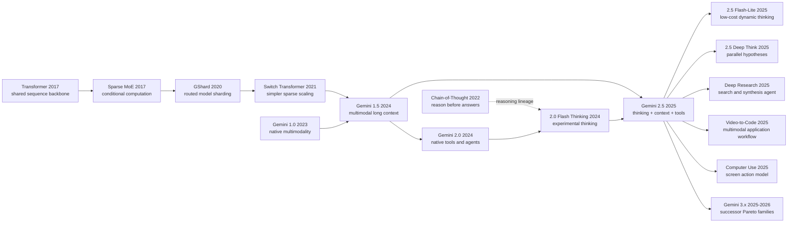

# Gemini 2.5 - When Thinking, Multimodality, Long Context, and Tools Become One Model Family

> **On March 25, 2025, Google used [Gemini 2.5 Pro Experimental](https://blog.google/technology/google-deepmind/gemini-model-thinking-updates-march-2025/) to bind the phrase “thinking model” to a single product surface that already included a one-million-token multimodal context, coding, native tools, and an agent narrative; by June 17, that surface had expanded into the Pro, Flash, and Flash-Lite family.** What makes the moment worth reading is not that one more model increased a window, a benchmark score, or a launch slogan. It is that a frontier model began to look like a programmable workbench: long documents, repositories, video, search results, function returns, and intermediate plans could all remain inside the same reasoning loop, while “how long to think” itself became a budgeted control. Gemini 2.5 therefore feels less like a sequel to Gemini 1.5 than like the second half of the same historical turn: 1.5 asked how much the model could see, and 2.5 forced the field to ask how a model should think, act, and price risk once it sees that much.

## TL;DR

The Gemini Team's 2025 technical report delivers much more than “another stronger model.” Its real contribution is a product-and-systems route that compresses long context, thinking, multimodality, coding, and tool use into one model family interface. At an explanatory level, the line still looks like sparse MoE conditional computation, where active work per token is closer to $C_\text{active}=\sum_{e\in\mathrm{TopK}(r(x))} C_e$ than to activating the whole network, and where extra inference-time reasoning is exposed through a controllable thinking budget. At a behavioral level, Gemini 2.5 turns the multimodal million-token workbench of [Gemini 1.5](2024_gemini15.md) into an agent substrate that can think, call Search/code/functions, and operate over video and repositories inside a 1M context. The failed baseline it displaces is therefore not one rival checkpoint but the 2024 assumption that long context, reasoning models, tool callers, and video models can remain separate products: relative to 1.5 Pro, 2.5 Pro moves LiveCodeBench from 29.7% to 74.2%, SWE-bench Verified single attempt from 22.3% to 59.6%, LOFT hard retrieval at 1M from 47.1% to 69.8%, and VideoMME from 73.2 to 84.3. At the same time, Pokemon, MRCR-V2, and prompt-injection results show just as clearly that a 1M context does not automatically produce long-horizon planning, a solved visual agent, or safe tool autonomy. The hidden lesson is therefore sharp: **Gemini 2.5's historical role is not to reinvent long context, but to make “how much a model sees, how long it thinks, when it calls tools, and how outcomes are verified” part of one programmable family interface.**

---

## Historical Context

### 2024: Gemini 1.5 opened the input bandwidth without yet making slow thinking a model interface

The Gemini 2.5 story does not begin abruptly in March 2025. Its immediate foundation is [Gemini 1.5](https://arxiv.org/abs/2403.05530), the 2024 family that put native multimodality and million-token context into the same model line. Whole books, complete code repositories, long video, and long audio became ordinary model inputs rather than material that always had to be pre-cut into retrieved snippets. Gemini 1.5 v5 disclosed that Pro was a sparse Mixture-of-Experts Transformer and Flash a dense Transformer distilled online from a larger teacher. Pro's research experiments pushed text retrieval to ten million tokens, while product deployments settled around one- to two-million-token windows. The existing [Gemini 1.5 deep note](/en/era5_genai_explosion/2024_gemini15/) covers Kalamang, long video, and needle-in-a-haystack in detail. The one inheritance that matters here is simpler: 1.5 changed how much of a working set a model could see at once.

Seeing more, however, is not the same as deliberately allocating more computation before answering. Table 1 of the Gemini 2.5 report retrospectively marks the selected 1.5 Flash and Pro API models as non-thinking models with 8K text-output limits; those selected 1.5 endpoints also lack the native tool-use interface that defines the 2.x story. The 1.5 report certainly included chain-of-thought prompting, a math-specialized model, function-calling evaluations, and in-context planning experiments. Those capabilities were still distributed across prompting protocols, special checkpoints, and evaluation settings. In other words, 1.5 enlarged the workbench without yet packaging “plan, call a tool, inspect the result, and continue reasoning” as one inference loop.

That distinction explains why 2.5 did not merely advertise a still larger window. Gemini 1.5 had already shown that a model could retrieve from a million tokens. The next problem was whether it could reason, verify, code, and act on the same enormous workbench. Gemini 2.5 treats long context as agent state rather than an isolated feat: the context may contain user material, tool returns, action history, a codebase, and intermediate goals maintained by the model and its scaffold.

### December 2024: Gemini 2.0 pushed native tool use into the “agentic era”

On December 11, 2024, Google released [Gemini 2.0 Flash Experimental](https://blog.google/technology/google-deepmind/google-gemini-ai-update-december-2024/) and shifted the language from 1.5's “understand more information” toward making information useful. Flash retained low latency and multimodal input while adding native calls to Google Search, code execution, and third-party functions. Native image output, steerable TTS, and the Multimodal Live API appeared first as experimental or early-access capabilities. The consequential change was not function-call syntax itself. Training and products were beginning to cover an observe-environment, choose-tool, consume-result, act-again loop.

The prototypes announced around the same release made the abstract direction concrete. Project Astra connected a real-time multimodal assistant to Search, Lens, and Maps. Project Mariner acted over browser pixels and DOM elements through clicks, typing, and scrolling, with confirmation before sensitive actions. Jules accepted a GitHub issue, produced a plan, and executed under developer supervision. Google explicitly called Gemini 2.0 the beginning of an agentic era. That did not mean the prototypes were reliable: the announcement said Mariner was slow, not always accurate, and restricted to the active tab. Those constraints make 2.0 a genuine predecessor rather than a promotional interlude. Model capability had to be co-designed with permission boundaries, confirmation, prompt-injection defenses, and tool interfaces.

Gemini 2.0 also left a second crucial branch. The report names Gemini 2.0 Flash Thinking Experimental, launched in December 2024, as the starting point for the 2.5 thinking recipe. Conventional 2.0 Flash optimized for fast direct answers; the Thinking variant allowed extra inference computation before responding. By February 5, 2025, 2.0 Flash was generally available, the one-million-token Flash-Lite was in preview, and 2.0 Pro Experimental was testing complex prompting and coding with two million tokens. The shape of the later Pareto family was already visible: requests with different latency, cost, and capability needs should not all run through the most expensive model.

### March to June 2025: reasoning-model competition became controllable computation

By early 2025, frontier-model competition was no longer satisfied by “more parameters and more pretraining.” OpenAI o1, DeepSeek-R1, and Claude 3.7 Sonnet had placed test-time compute, reinforcement-learned reasoning, and hybrid fast/deep interfaces at center stage. Google faced a harder question: Gemini already had multimodality and long context, but could thinking be integrated with those capabilities rather than attached as a math-only specialist? [Gemini 2.5 Pro Experimental 03-25](https://blog.google/technology/google-deepmind/gemini-model-thinking-updates-march-2025/), released on March 25, was the answer. Google defined it as a thinking model, opened it with a one-million-token context, and emphasized single-attempt results without majority voting.

The next two months show why “Gemini 2.5” cannot be treated as one static checkpoint. The May 6 Preview 05-06 shipped its I/O edition early, focusing on function-calling triggers, code transformation, and front-end application generation. On May 20, a Flash update emphasized fewer tokens across reasoning, multimodality, code, and long context, while Google announced thought summaries, a Pro thinking budget, and SDK-level MCP support. On June 17, Pro 06-05 and Flash 05-20 became the stable GA endpoints, while Flash-Lite entered preview. Flash-Lite left thinking off by default; Pro and Flash used dynamic thinking; all three exposed budget control over quality, latency, and price.

Only on July 7 did the 72-page technical report v1 arrive on arXiv. It was revised on July 11, July 17, July 22, October 16, and December 19; the current source of record is v6. This ordering matters. The paper did not propose an algorithm and wait for a product implementation. It consolidated six months of rapidly changing models, APIs, evaluations, infrastructure, and safety work into a post-deployment technical report. Readers face a collection of checkpoints, previews, GA endpoints, and specialist variants rather than a clean paper timeline. Every number therefore needs a model identifier, date, and evaluation protocol.

### A report built by more than 3,000 contributors while deliberately withholding much of the recipe

The arXiv author line says “Gemini Team, Google,” the report lists contributors in randomized order, and its acknowledgments say that Gemini development involved more than 3,000 people across research, engineering, and operations. That attribution is itself evidence about the project. Gemini 2.5 is not a new layer summarized by a small laboratory in a few equations; it is an industrial system composed of models, data, TPUs, Pathways, serving, products, red teams, and governance. The report discloses multiple 8,960-chip TPUv5p pods, synchronous data parallelism across data centers, elastic fault tolerance, and silent-data-corruption detection while withholding parameter count, expert count, and total training compute.

It therefore demands a different reading style from a reproducible algorithm paper. We can verify high-level facts such as “sparse MoE Transformer,” “Flash-size and smaller models use distillation,” “the 2.5 data cutoff is January 2025,” and “RL uses verifiable and model-based generative rewards.” We cannot infer a Top-k router, positional encoding, optimizer, or training-token count from those sentences. Google's benchmark coverage is broad, but most results remain provider-reported. Table 4 explicitly warns that companies use different SWE-bench scaffolds and infrastructure, making direct comparison invalid. The report's most useful research object is not a hidden recipe; it is the evidence standard the provider chooses for capability, cost, failure, and safety in a frontier-model system.

## Background and Motivation

### The pain point: five strong capabilities interfere when combined

By March 2025, thinking, multimodality, long context, coding, and tool use each had compelling demonstrations. Combining them in one request created new coupling. Long video and full repositories consume the input budget; thinking adds output tokens, latency, and cost; tool calls return untrusted external content into context; an agent loop turns a small hallucination into erroneous state that can persist for dozens of actions; a more capable model may also become more capable at cyber tasks or prompt injection. An AIME, VideoMME, needle-retrieval, or function-call score in isolation cannot establish whether the combined system is useful.

The Gemini 2.5 research question is therefore not merely “how do we build another reasoning model?” It is whether one model can allocate inference computation over long multimodal material, call tools, read their returns, and then produce executable code or the next action. The video-to-learning-app workflow is the compact example: the model interprets a long video, writes an application specification, then consumes the specification to generate an interactive interface. If any constituent capability fails, the workflow breaks. When the composition works, the artifact is no longer merely an answer; it can be a report, codebase change, web application, search plan, or environment action.

### The goal: make capability-cost a model-family Pareto frontier, not one champion point

A flagship optimized only for maximum quality cannot serve Google's range of workloads. Gemini 2.5 Pro targets the hardest reasoning, repository understanding, and multimodal coding. Gemini 2.5 Flash uses a controllable thinking budget for most complex requests. Gemini 2.0 Flash targets everyday low-latency tasks that do not need deep deliberation, while 2.0 Flash-Lite pushes toward the cheapest high-throughput tier. The later 2.5 Flash-Lite makes the design intent even clearer: the low-cost model also receives one-million-token context, native tools, and optional thinking, but ships with thinking disabled by default.

“Pareto frontier” is more precise here than “best model.” If one configuration is no worse in quality while being both cheaper and faster, it dominates another; a useful family offers non-dominated options at different budgets. Figure 1 plots this frontier with LMArena and token price, while Figure 2 adds output speed. This framing turns test-time compute from an experimental setting into a product resource. A developer chooses not only a model, but also context length, thinking budget, tool count, attempt count, and verification intensity for each task.

### The report must establish observable system outcomes, not expose hidden thought

The report offers three classes of evidence for the family strategy. Core capability tables quantify gains from 1.5 Pro to 2.5 Pro on LiveCodeBench, Aider Polyglot, GPQA, AIME, LOFT, MMMU, and VideoMME. System case studies show Deep Research joining search with multi-step synthesis and Gemini Plays Pokémon exposing planning, looping, and context poisoning over hundreds of agent hours. Safety evidence scopes automated red teaming, indirect prompt injection, memorization extraction, CBRN, cybersecurity, ML R&D, and deceptive alignment by checkpoint and protocol.

Those artifacts show what a system did in a specified setting; they do not reveal how every internal inference step formed. What Google announced in May 2025 was an organized thought-summary interface. The report says thinking consumes additional internal computation and accepts a token budget, but it does not promise complete raw chain-of-thought to users. This note therefore discusses only verifiable interfaces: inputs, budgets, tool calls, outputs, evaluations, and failure trajectories. Translated from the marketing phrase “the model thinks” into engineering language, Gemini 2.5 is a model that can spend controllable extra inference compute to improve task outcomes while exposing cost, latency, and risk to measurement.

---

## Method Deep Dive

Gemini 2.5 is not a paper from which a reader can reproduce a model by copying a hyperparameter table. It discloses model classes, training infrastructure, data modalities, post-training stages, evaluation APIs, and several safety methods, but not parameter scale, layer count, expert count, total tokens, or optimizer. The purpose of this section is therefore not to reverse-engineer Google's implementation. It is to recover a system logic from verifiable evidence: why sparse MoE, stable large-scale training, distillation, dynamic thinking, multimodal long context, and native tools must work together for Gemini 2.x to form a capability-cost frontier.

### Disclosure boundary: the system interface is visible, the hidden network is not

Section 2.1 explicitly calls Gemini 2.5 a sparse mixture-of-experts Transformer with native support for text, vision, and audio inputs. Section 2.2 says pretraining covers public web documents, code, images, audio, and video, with a June 2024 cutoff for 2.0 and January 2025 for 2.5. Section 2.4 names SFT, reward modeling, and RL, including verifiable rewards, model-based generative rewards, and multi-step tool environments. The public detail stops there. The table below is the most important guardrail for reading the report.

| Layer | Officially disclosed | Not officially disclosed | Interpretation permitted here |
|---|---|---|---|
| Backbone | Sparse MoE Transformer | Layer count, width, total and active parameters | Conditional compute explains separating capacity from per-token cost |
| Routing | Each token activates a parameter subset | Expert count, Top-k, router, balancing loss | Use only a conceptual formula, not an implementation claim |
| Long context | Pro/Flash support 1M; report compares 128K and 1M | Attention, positional encoding, KV-cache design | Discuss usability through LOFT/MRCR results |
| Multimodality | Text, image, video, and audio input | Encoders, tokenizers, and fusion points | Discuss compression through tokens per frame and protocols |
| Data | Modalities, filtering/dedup improvements, cutoff dates | Scale, source inventory, licensing, mixture weights | Do not turn knowledge cutoff into dataset size |
| Training | TPUv5p, Pathways, multi-pod synchrony, elasticity, SDC detection | Batch, steps, optimizer, learning rate, total FLOPs | Analyze why systems stability belongs to method |
| Post-training | SFT, RM, RL, verifiable/generative rewards, tool environments | Exact algorithms, reward weights, data quantities | Treat thinking and agent behavior as measured interfaces |
| Thinking | Extra inference compute, dynamic duration, token budget | Raw hidden thought and faithful visibility | Discuss thought summaries only, never infer hidden CoT |

This boundary is not merely cautious wording; it is part of the technical conclusion. Gemini 2.5's public value lies in capability and systems evidence, not in a reproducible recipe. Filling “sparse MoE” with an invented expert count and Top-2 router, or treating a thought summary as raw cognition, would disguise unknowns as contributions.

### Overall framework: how five capabilities converge into an actionable model

The public Gemini 2.5 system can be compressed into the following data flow. `THINKING` is budget-constrained additional internal computation, not a complete reasoning transcript exposed to the user. `THOUGHT SUMMARY` is an optional organized summary. `TOOLS` do not mean the model executes arbitrary actions by itself; APIs, agent scaffolds, and permission systems still perform execution.

```text
TEXT / IMAGE / VIDEO / AUDIO / PDF
                  |
          MULTIMODAL CONTEXT (1M)
                  |
          SPARSE MoE TRANSFORMER
                  |
       DYNAMIC THINKING WITH BUDGET
                  |
      +-----------+------------+
      |                        |
 TEXT / CODE OUTPUT      TOOL-CALL REQUEST
                               |
             SEARCH / CODE / FUNCTIONS / URLS
                               |
                    VERIFIED TOOL RESULT
                               |
                       NEXT MODEL TURN
```

As an explanatory objective, model selection, thinking budget, and tool policy can be viewed as a cost-constrained optimization. Here $Q$ is task quality, $C$ token and tool cost, $L$ latency, and $R$ safety and failure risk. This is not a Google-disclosed loss:

$$
\pi^*=\arg\max_{m,B,\tau}\;Q(x;m,B,\tau)-\lambda_C C(m,B,\tau)-\lambda_L L(m,B,\tau)-\lambda_R R(m,B,\tau).
$$

The variable $m$ selects Pro, Flash, or Flash-Lite; $B$ is the thinking budget; and $\tau$ is the available tool set and call policy. This abstraction captures the core of 2.x: the useful question is not only “which model has the highest score?” but “which combination is appropriate for this task, budget, and permission boundary?”

| Capability layer | Problem it solves | Coupling with other layers | Public evidence |
|---|---|---|---|
| Sparse MoE | Increase capacity while bounding active compute per token | Long context multiplies every unit of per-token cost | Section 2.1 |
| Native multimodality | Make images, video, audio, and code direct evidence | Media tokenization determines duration that fits | Sections 2.1/2.6 |
| Dynamic thinking | Spend more inference compute on hard problems | Adds latency, output budget, and call cost | Section 2.5 |
| Long context | Retain whole corpora, repositories, and action history | Long trajectories can induce loops and replay of old actions | Tables 3/6, Section 4.1 |
| Native tools | Acquire fresh information and execute code/functions | External content introduces injection and permission risk | Sections 2.6/5.5 |
| Agent scaffold | Preserve state, decompose work, verify action | Final scores cannot be attributed to a bare model | Appendix 8.2 |

### Key design 1: sparse MoE turns a larger model into conditional computation

A dense Transformer sends every token through the same feed-forward parameters. A sparse MoE first routes a representation to a small expert subset, then mixes those expert outputs. The expression below is a generic MoE abstraction, not Gemini's internal equation:

$$
h'_i=\sum_{e\in\operatorname{TopK}(r(h_i))}\alpha_{i,e}E_e(h_i),\qquad \sum_e\alpha_{i,e}=1.
$$

This partly separates total capacity from active computation per token. The property matters especially at one-million-token context: if input length grows by an order of magnitude, even a small increase in per-token work is amplified across the request. MoE does not make long context free, but it supplies a scaling direction. The report says architecture changes improve training stability, signal propagation, and optimization dynamics, producing substantially better capability directly after pretraining. It gives no expert count or routing ablation, however, so only the existence of conditional computation is established; its isolated contribution to benchmark gains is not.

| Dimension | Dense route | Sparse MoE route | Verifiable meaning in Gemini 2.5 |
|---|---|---|---|
| Activation | Every token uses the full FFN | Each token routes to an expert subset | The report explicitly states subset activation |
| Capacity/compute | More capacity usually raises per-token work | Total capacity and active work can partly separate | Supports joint capability and serving-cost optimization |
| Risk | Global training instability | Adds routing imbalance and expert-utilization issues | Report discloses only aggregate stability progress |
| Reproducibility | Still needs full hyperparameters | Also needs router and expert configuration | Neither is supplied sufficiently in the report |

The motivation is not that MoE is intrinsically smarter. It is to give a model spanning modalities, languages, code, and tool behavior enough capacity without charging full-parameter compute to every long request. Gemini 1.5 Pro already followed a sparse-MoE route. The new 2.5 value is joining that efficiency line to thinking and agent tools, not inventing experts again.

### Key design 2: TPUv5p, Pathways, and fault tolerance make training stability part of method

Gemini 2.5 is the first Gemini family trained on TPUv5p. The report describes synchronous data parallelism across multiple 8,960-chip pods in multiple data centers. Hardware failures occur several times per hour at this scale. If each local failure stalls the full run while healthy machines are rescheduled, downtime and rollback consume even a sound training recipe. Section 2.3 therefore includes two apparently infrastructural designs as model method: slice-granularity elasticity and split-phase silent-data-corruption detection.

Elastic control keeps training with fewer TPU slices after a local fault. Reconfiguration loses tens of seconds rather than the ten or more minutes required by the previous rescheduling path, and training continues around 97% throughput while the slice recovers. SDC detection deterministically replays a suspicious step immediately and compares per-device intermediate checksums, reducing localization that once took hours to a few minutes. Across the run, about 0.25% of steps were replayed for suspected SDC, 6% of those replays were genuine hardware corruption, 93.4% of time went to TPU computation, and roughly 4.5% of computed steps were still replays or rollbacks for debugging interventions.

| Failure source | Previous cost | 2.5 infrastructure response | Reported outcome |
|---|---|---|---|
| Local TPU fault | Wait at least 10 minutes for healthy rescheduling | Continue with fewer slices | Tens of seconds lost; about 97% throughput during recovery |
| Silent Data Corruption | Discover hours later and roll back many steps | Deterministic step replay + device checksums | Localize and exclude devices within minutes |
| Model debugging intervention | Inevitable at run scale | Pathways controller holds global state | About 4.5% of steps replayed or rolled back |
| Multi-datacenter coordination | Complex control plane | One Python program coordinates accelerators | 93.4% of time performing TPU computation |

The counter-intuitive point is that **frontier-model method no longer lives only in the neural graph.** Once failures are routine, recovery time changes the number of experiments that can be afforded, training continuity, and effective compute. The report does not isolate benchmark gains from these two infrastructure changes, but its auditable run statistics are more informative than merely stating that many TPUs were used.

### Key design 3: distillation and model tiering form a capability-cost Pareto frontier

Gemini 2.5 Pro should not serve every classification, extraction, or summary request. The report says Flash-size and smaller 2.5 models continue the 1.5 distillation route and approximate the teacher's next-token distribution with a k-sparse vocabulary distribution. Storing a complete teacher distribution for every token is expensive; retaining k important entries keeps storage and throughput overhead proportional to $k$ while conveying richer relative probabilities than a hard label. The report does not reveal $k$, so any numerical value would be invented.

The family objective is not for a small model to copy every Pro capability. It is to provide a non-dominated choice in each cost range. With quality $Q$, cost $C$, and latency $L$, a model lies on the Pareto frontier when no alternative has at least its quality, no greater cost, and no greater latency, with one strict improvement:

$$
m\in\mathcal{P}\iff\nexists m': Q(m')\ge Q(m),\ C(m')\le C(m),\ L(m')\le L(m).
$$

| Report model | Input length | Output length | Thinking | Tool use | Family role |
|---|---:|---:|---|---|---|
| Gemini 1.5 Flash | 1M | 8K | No | No | Efficient long-context predecessor |
| Gemini 1.5 Pro | 2M | 8K | No | No | High-capability long-context predecessor |
| Gemini 2.0 Flash-Lite | 1M | 8K | No | No | Lowest-cost 2.0 tier in the report |
| Gemini 2.0 Flash | 1M | 8K | Yes* | Yes | Everyday low latency plus native tools |
| Gemini 2.5 Flash | 1M | 64K | Dynamic | Yes | Controllable quality/cost/latency compromise |
| Gemini 2.5 Pro | 1M | 64K | Dynamic | Yes | Highest reasoning, coding, multimodal tier |

The asterisk denotes a capability limited to Experimental or Preview at publication. At GA on June 17, 2025, Flash pricing was unified at $0.30 per million input tokens and $2.50 per million output tokens, eliminating separate thinking and non-thinking prices; Flash-Lite occupied the lower-price tier. Prices change, but the method does not: inference budget must be allocated among model choice, internal thinking tokens, and external repeated attempts.

### Key design 4: thinking budget turns test-time compute into an API parameter

Earlier Gemini models generated an answer immediately, leaving inference compute largely constrained by output length and a direct generation path. The report says 2.5 thinking models use RL to learn additional inference-time computation before answering, with a thinking phase capable of tens of thousands of forward passes. Gemini 2.5 integrates the mechanism from the experimental 2.0 Flash Thinking branch into the multimodal and long-context mainline. The model may choose duration dynamically, or the caller can impose an internal-token budget.

Two mistakes are easy here. First, budget is not a linear “reasoning depth” knob. Figure 4 shows aggregate improvement with budget on AIME, LiveCodeBench, and GPQA; it does not prove every problem improves monotonically. Second, internal-computation tokens are not the same as visible answer tokens. A thought summary is an organized process summary, not complete raw chain-of-thought, and it cannot reveal the training algorithm.

| Mode | Budget behavior | Suitable tasks | Main cost/risk |
|---|---|---|---|
| Non-thinking | Answer directly or disable extra thought | Classification, extraction, simple transformation | Accuracy may be insufficient on hard tasks |
| Dynamic thinking | Model chooses duration | General requests with unknown difficulty | Cost and latency are less predictable |
| Fixed budget | Caller caps internal tokens | Code/reasoning with a defined SLA | Too low truncates search; too high wastes compute |
| Multiple attempts | Sample and select several traces | High-value verifiable tasks | Not bare-model pass@1; multiplies cost |
| Deep Think | Generate and critique hypotheses in parallel | Extremely hard math, code, multimodal problems | Separate experimental/specialist variant, not GA Pro |

The motivation is to replace the binary choice between a fast model and a reasoning model with continuous control. Flash-Lite launched with thinking off by default because the low-cost edge values throughput. Pro and Flash use dynamic thinking because the mainline delegates difficulty estimation to the model. A fixed budget returns the upper bound to the developer. Together, these controls make reasoning deployable.

### Key design 5: multimodal long context compresses each frame as well as enlarging the window

Gemini 1.5 established million-token multimodal context. The 2.5 question was how to fit more useful video into the same window and reason over it. The report's critical engineering number is a reduction from 258 to 66 visual tokens per frame while retaining competitive quality. If other overhead were fixed, accommodated duration would scale roughly inversely with per-frame tokens:

$$
T_{\text{video}}\propto\frac{W}{v},\qquad \frac{258}{66}\approx3.91.
$$

The report conservatively describes a shift from about one hour to about three hours within a 1M context because audio, instructions, frame rate, and reserved tokens also consume budget. This is not a universal API limit. A May 2025 developer post separately described about six hours under low media resolution and a 2M preview context. The September 2026 Vertex AI page gives current 2.5 Pro file limits of about 45 minutes with audio or one hour without audio. These are different conditions and must be shown together rather than selecting one as “the Gemini 2.5 video duration.”

| Scope | Video duration | Context/representation condition | Correct reading |
|---|---:|---|---|
| arXiv v6 modeling capability | About 3 hours | 1M, 66 visual tokens/frame | Report capability, not every endpoint SLA |
| 2025-05 Gemini API preview | About 6 hours | 2M, low media resolution | Specific preview setting |
| 2026-09 Vertex AI with audio | About 45 minutes | Current file/API limit | Product upload specification |
| 2026-09 Vertex AI without audio | About 1 hour | Current file/API limit | Product upload specification |
| Appendix 8.5 demo | 46 minutes | Find a one-second event, three trials | Auditable localization case |

Compression matters for more than longer video. Gemini 2.5 connects video understanding to code generation: it can extract concepts and interaction requirements from a lecture, write an application specification, then implement a learning tool. It can also turn a Project Astra video into a p5.js animation that preserves temporal order. The model abstracts across modalities and turns that abstraction into code inside the same context. At the same time, the 46-minute demo prevents a claim of perfection: 2.5 Pro identified the blue shirt in all three trials, hit 27:29 exactly once, and landed within three seconds twice. That is much better than 1.5 Pro's one of three colors and zero of three timestamps, but not 100% precise localization.

### Key design 6: code, native tools, and scaffolding form the agent; the model does not act alone

Gemini 2.5 treats code capability across pretraining, post-training, and evaluation. The report says pretraining increases the volume and diversity of repository and web code, while post-training adds reasoning and curated engineering tasks for IDE functions, multi-step whole-repository operations, end-to-end web/mobile development, and multimodal interaction. LiveCodeBench rises from 29.7% for 1.5 Pro to 74.2% for 2.5 Pro, and Aider Polyglot from 16.9% to 82.2%. Real agentic coding still requires a scaffold for repository navigation, edits, tests, and candidate selection.

The pseudocode below expresses only the public control surface; it is not Google's implementation. Two boundaries are essential: tool returns are untrusted data, and actions pass through policy and verification rather than executing merely because the model “thought” about them.

```python
def run_agent(request, materials, model, tools, policy, verifier):
    state = policy.initialize(request, materials)

    while not state.done and state.steps < policy.max_steps:
        response = model.generate(
            context=state.context,
            thinking_budget=policy.budget_for(state),
            tool_schemas=tools.schemas(),
        )

        if response.tool_call:
            policy.authorize(response.tool_call)
            observation = tools.execute(response.tool_call)
            state.add_untrusted_observation(observation)
        else:
            state.propose_answer(response.text)

        state = verifier.check_and_update(state)

    return policy.finalize(state)
```

The loop can be abstracted as $s_{t+1}=F(s_t,a_t,o_t)$: state $s_t$ contains material, plan, and history; action $a_t$ is an answer or tool request; observation $o_t$ is the execution result. Gemini Plays Pokémon demonstrates the combination while defeating the simple “model completed the game alone” narrative. Run 2's fixed scaffold translated RAM into text, wrote summaries every 100 turns, recompressed them every 1,000 turns, invoked Guidance Gemini every 25 turns, and provided two separately prompted Gemini instances named `pathfinder` and `boulder_puzzle_strategist`. The 406.5-hour completion belongs jointly to the model and this memory, tool, and verification structure.

| Component | Public responsibility | Failure if absent | What cannot be attributed |
|---|---|---|---|
| Base model | Understand state, generate plans and code | Weak local reasoning and language capability | Cannot own the entire agent score |
| Long context | Retain trajectory, maps, summaries, goals | Cannot preserve state across hours | 1M support is not 1M effective planning |
| Tool schema | Bound Search, code, or function action | Output stops at natural-language advice | Tool success is not parametric knowledge |
| Memory scaffold | Summarize, compress, manage goals | History grows without control | A summary may freeze errors into state |
| Specialist agents | Solve path and boulder subproblems | Main agent wastes steps on local search | Not verified autonomous tool creation |
| Policy/verifier | Permission, tests, termination, confirmation | Erroneous action can affect environment | Benchmark scaffold must accompany score |

### Training and safety loop: once capability rises, evaluation must enter the training cycle

The public training process has four layers. Pretraining learns general representations from multimodal web, code, and media. SFT uses paired instructions and responses plus adversarial prompts to shape useful behavior. Reward modeling compresses human preference into a Data Reward Model while a prompted Critic scores against rubrics. RL combines human and critic feedback, verifiable rewards, and model-based generative rewards in multi-step tool environments. The report calls this combination RL*F rather than only conventional RLHF.

| Stage | Official public detail | Relationship to 2.5 capability | Still unknown |
|---|---|---|---|
| Pre-training | Web, code, image, audio, video; new filtering and dedup | Multimodal, code, and world-knowledge base | Token count, mixture weights, source inventory |
| SFT | Human/model adversarial prompts, paired instructions/responses | Instructions, tool format, safety, less over-refusal | Data scale and sampling recipe |
| Reward modeling | Human comparisons train DRM; prompted Critic uses rubrics | Scalable quality and safety feedback | Model structure and objective weights |
| RL | More compute, verifiable/generative rewards, longer stable runs | Thinking, multi-step action, tool use | Algorithm, environment mix, update rules |
| Assurance | Held-out tests outside development team + RSC review | Informs release decisions | Full prompts and per-example results |
| Product controls | Filters, permissions, confirmation, logs, platform limits | Prevents agents from directly amplifying errors | Complete implementation by product |

Capability and safety cannot be separated for agents. Tools make a model useful while allowing indirect prompt injections in pages, mail, and documents to trigger unauthorized functions. Gemini 2.5 adds security adversarial training and evaluates exfiltration with Actor Critic, Beam Search, and TAP. The result is not “solved”: Table 9 reports 61.4%, 63.8%, and 30.8% attack success for 2.5 Pro, and Pro is less resilient than Flash. That is the final method lesson. Gemini 2.5 is not a universal agent; it is a route for treating model capability, inference budget, tool permission, system scaffolding, and continuous safety evaluation as one engineering object.

---

## Failed Baselines

Gemini 2.5 does not provide the conventional architecture-paper ablation where removing module A drops accuracy by B points. The report withholds too much model detail to attribute gains to one layer, routing method, or training phase. Its rare failure evidence comes from two places instead. Table 3 compares 1.5, 2.0, and 2.5 under one Gemini API methodology, while Gemini Plays Pokémon runs an agent for hundreds of hours and records how long context, vision, memory, and planning fail inside a real loop. The baselines below are therefore system assumptions, not historical models selected for dismissal.

### Baseline 1: treat a 1M context as one million tokens of effective reasoning

Gemini 1.5 had already shown high single-needle recall at extreme length, and 2.5 made one-million-token input a shared Pro, Flash, and Flash-Lite interface. The tempting baseline says that if all information fits, an agent can retain its full history forever and dispense with summarization or retrieval. The v6 report's own numbers reject it. On LOFT hard retrieval at 1M, 2.5 Pro scores 69.8%; on MRCR-V2 8-needle, which requires discriminating similar requests, it scores only 16.4%. Gemini 2.5 Flash is higher at 21.0%. Supported window length and effectively used window length are different measurements.

Gemini Plays Pokémon provides a more realistic agent counterexample. Context around 100K tokens was instrumental for maps, tools, and strategy. When history grew substantially beyond 100K, however, the model tended to repeat old actions rather than synthesize new plans. The scaffold therefore wrote a summary every 100 turns and recompressed summaries every 1,000 turns. **Long context did not fail; the assumption that a more complete raw trajectory must improve planning failed.** History holds evidence, errors, obsolete goals, and action inertia. A larger window guarantees that they remain present, not that the model weights them correctly.

The failure clarifies the division between 1.5 and 2.5. Gemini 1.5 created the large workbench, while 2.5 added thinking and tools. An agent still needs an external memory policy to decide what to preserve, compress, and retrieve again. One million tokens are not a persistent-state manager.

### Baseline 2: a larger thinking budget monotonically improves quality

Figure 4 shows aggregate performance increasing with thinking budget on AIME 2025, LiveCodeBench, and GPQA Diamond. It is easy to simplify this into $B\uparrow\Rightarrow Q\uparrow$: maxing the budget cannot hurt. The report does not support that stronger claim. Benchmark curves are aggregates, not a per-example monotonic guarantee. Thinking consumes tokens, latency, and money, and it can elaborate an incorrect premise. Deep Think is also a separate experimental or specialist mode; its parallel-hypothesis results cannot substitute for ordinary GA Pro results.

Table 3 contains a useful counterexample. At 1M on MRCR-V2, 2.5 Flash scores 21.0%, above Pro at 16.4%. This does not prove Flash generally reasons better, but it disproves a universal ordering in which the stronger model and heavier thinking win every long-context task. Task structure, budget policy, context length, and sampling protocol can move the optimum.

Flash-Lite shipped in preview in June 2025 with thinking disabled by default, which captures the right engineering principle. High-throughput classification and extraction should not pay a reasoning tax first. A high-value code change may justify a fixed budget, execution tests, or multiple traces. Thinking is an allocatable resource, not a ritual.

### Baseline 3: assign the entire agent result to the bare model name

The memorable Gemini Plays Pokémon numbers are 813 hours for the first completion and 406.5 hours for a second run with a fixed scaffold. It is inaccurate to describe this as “Gemini 2.5 Pro independently watched and completed Pokémon Blue.” The model consumed game state translated from RAM into text, with a screenshot only partially overlaid. The report says the model struggled to use raw Game Boy pixels, and one ablation that removed vision produced roughly similar behavior. That is a strong counterexample to the assumption that native multimodality naturally carries a visual agent.

The fixed scaffold also maintained primary, secondary, tertiary, and contingency goals; periodically compressed summaries; invoked Guidance Gemini every 25 turns to critique the main agent; and offered two separately prompted instances, `pathfinder` and `boulder_puzzle_strategist`. Pathfinder often worked over 100K+ tokens and found 50-action paths, with extreme cases up to 150. Those are substantial capabilities, but they belong to the complete system. The report even says Gemini wrote most prompts for the two tools, yet phrases autonomous tool creation as a plausible future direction, not a validated result.

The engineering lesson is that an agent score needs more than a model ID. It needs tools, state representation, summary cadence, maximum steps, retries, verifiers, and termination conditions. Otherwise scaffold changes can masquerade as model progress. Run 1 modified the harness during development; Run 2 fixed it. The halved completion time is not a pure checkpoint A/B test.

### Baseline 4: compare one leaderboard number directly across dates, checkpoints, and scaffolds

The Gemini 2.5 release history leaves several values that are all correct and still not interchangeable. The March launch reported 18.8% on Humanity's Last Exam without tools and 63.8% on SWE-bench Verified with a custom agent for 03-25 Experimental. The v6 Table 3 values for final API models are 21.6% HLE, 59.6% SWE-bench single attempt, and 67.2% multiple attempts. A May post reported VideoMME 84.8%; v6 Table 6 gives 84.3% under an audio-plus-visual protocol; a separate low-media-resolution setting compares 84.7% with 85.2%. Checkpoint, dataset snapshot, media processing, or scaffold can explain the differences. They are not mutual refutations.

Section 3.1 sets the boundaries explicitly. Gemini results are pass@1 and single attempt unless marked otherwise. Aider averages three trials. SWE-bench multiple attempts samples several agent traces and reranks them with Gemini's own judgment. Non-Gemini Table 4 values are provider-reported under different scaffolds and infrastructure, so they are not directly comparable. The 2.0 HLE result also uses an earlier dataset. Flattening all percentages into one footnote-free leaderboard manufactures false precision.

The useful baseline is not the largest number; it is a generational comparison within one table, protocol, and checkpoint definition. In v6 Table 3, Aider Polyglot rises from 16.9% for 1.5 Pro to 82.2% for 2.5 Pro, and LiveCodeBench from 29.7% to 74.2%. Those comparisons support the 2.5 coding gain more cleanly than cherry-picking cross-provider self-reports.

### Baseline 5: native tool calling means the agent is safe

Gemini 2.0 made Search, code execution, and function calls native, and 2.5 inserted thinking into the tool loop. This can improve verification and action while expanding the attack surface. Malicious instructions can hide in mail, pages, or documents retrieved by the agent and induce an unauthorized email function to exfiltrate secrets from context. Table 9 simulates this setting and measures attack success across 500 held-out conversations containing synthetic passport numbers.

Gemini 2.5 adds security adversarial training against indirect prompt injection. Pro still records 61.4% Actor Critic, 63.8% Beam Search, and 30.8% TAP attack success; Flash records 40.8%, 4.2%, and 53.6%. Neither model dominates: Pro is more robust to TAP and worse on the first two attacks. The report explicitly says Pro remains less resilient than Flash overall, showing how capability gains constrain mitigation headroom.

Safety evaluation also cannot end with “dangerous threshold not reached.” Gemini 2.5 Pro crossed no Critical Capability Level in CBRN, Cyber, ML R&D, or Deceptive Alignment, but Cyber Uplift 1 crossed the lower early-warning alert threshold, prompting accelerated mitigations and more frequent testing. The correct conclusion is “this checkpoint did not reach a CCL under this protocol, while already producing a warning signal,” not “the model has been proved safe.”

## Key Experimental Data

### Read the protocol first: the same percentage may mean one, three, or many attempts

Table 2 fixes the API IDs for generational comparison: `gemini-1.5-flash-002`, `gemini-1.5-pro-002`, `gemini-2.0-flash-lite-001`, `gemini-2.0-flash-001`, `gemini-2.5-flash`, and `gemini-2.5-pro`. Gemini results use AI Studio APIs and default sampling, with pass@1 and single attempt unless specified. Small benchmarks may average trials to reduce variance; Aider Polyglot explicitly averages three. SWE-bench reports both one agent trace and sampling-plus-reranking over multiple traces.

Long-context results also have two scopes. A 128K row averages contexts up to 128K, while a 1M row is a pointwise value at exactly one million tokens; the rows are not matched examples from which one can compute a simple drop. Video tasks mix string-match accuracy, LLM-based accuracy, R1@0.5, and CIDEr, so magnitudes cannot be compared across metrics. Every table below preserves the report's definition.

### Coding, reasoning, and factuality: the main 2.5 Pro generational jump

| Benchmark | Gemini 1.5 Pro | Gemini 2.0 Flash | Gemini 2.5 Flash | Gemini 2.5 Pro | Protocol/meaning |
|---|---:|---:|---:|---:|---|
| LiveCodeBench | 29.7% | 29.1% | 59.3% | **74.2%** | 2025-01-01 through 2025-05-01 range |
| Aider Polyglot | 16.9% | 21.3% | 56.7% | **82.2%** | Six-language code editing, three-trial average |
| SWE-bench Verified, single | 22.3% | 21.4% | 48.9% | **59.6%** | One agent trace |
| SWE-bench Verified, multiple | 34.2% | 34.2% | 60.3% | **67.2%** | Multiple traces + model reranking |
| GPQA Diamond | 58.1% | 65.2% | 82.8% | **86.4%** | Single-attempt setting |
| Humanity's Last Exam, no tools | 4.6% | 5.1%* | 11.0% | **21.6%** | 2.0 uses an earlier HLE dataset |
| AIME 2025 | 17.5% | 29.7% | 72.0% | **88.0%** | 30 questions, sourced from MathArena |
| SimpleQA | 24.9% | 29.9% | 26.9% | **54.0%** | Parametric knowledge F1, no Search |
| FACTS Grounding | 80.0% | 84.6% | 85.3% | **87.8%** | Factual faithfulness to supplied documents |
| MMMU | 67.7% | 69.3% | 79.7% | **82.0%** | Multidiscipline image understanding/reasoning |

The strongest signal is not AIME alone. Gains appear simultaneously in code generation, code editing, repository agents, scientific reasoning, factuality without tools, document grounding, and visual reasoning. Gemini 2.5 Flash also moves past old Flash models and exceeds the year-old 1.5 Pro on many rows, supporting the claim that the frontier moved toward the lower-cost tier. Negative evidence remains important: on SimpleQA, 2.5 Flash at 26.9% trails 2.0 Flash at 29.9%, so a family upgrade is not monotonic in every cell.

### Long context and video: fitting, retrieving, and disambiguating are three different problems

| Benchmark / setting | Gemini 1.5 Pro | Gemini 2.0 Flash | Gemini 2.5 Flash | Gemini 2.5 Pro | Reading |
|---|---:|---:|---:|---:|---|
| LOFT hard retrieval, 128K | 75.9% | 58.0% | 82.1% | **87.0%** | Multi-hop/multi-needle retrieval, average to 128K |
| LOFT hard retrieval, 1M | 47.1% | 7.6% | 58.9% | **69.8%** | Exactly 1M |
| MRCR-V2 8-needle, 128K | 26.2% | 19.0% | 54.3% | **58.0%** | Disambiguate and reproduce similar requests |
| MRCR-V2 8-needle, 1M | 12.1% | 5.3% | **21.0%** | 16.4% | Flash exceeds Pro at this point |
| 1H-VideoQA, visual-only | 72.2 | 67.5 | 67.5 | **81.0** | Hour-long video QA |
| VideoMME, audio + visual | 73.2 | 72.8 | 75.5 | **84.3** | Long subset, zero-shot |
| VideoMME, audio + visual + subtitles | 79.8 | 78.8 | 81.5 | **86.9** | Full test set, zero-shot |
| FLEURS, 53-language WER | 7.14 | 9.04 | 9.95 | **6.66** | Lower is better |
| CoVoST2, 21-language BLEU | 37.53 | 36.35 | 36.15 | **38.48** | Higher is better |

On LOFT at 1M, 2.5 Pro rises from 1.5 Pro's 47.1% to 69.8%, showing that 2.5 did more than inherit a window. MRCR at 1M is still only 16.4%, showing that hard disambiguation is far from solved. On video, reducing visual tokens per frame from 258 to 66 moves the report's one-million-token setting from about one hour toward about three, while 1H-VideoQA rises from 72.2 to 81.0. Tighter representation and stronger reasoning improve together, but that does not mean every current API accepts three-hour uploads.

### Agent and safety data: system progress amplifies failure over longer time horizons

| Evaluation/case | Result | Condition | Conclusion not justified |
|---|---|---|---|
| Deep Research on HLE | 7.95% -> 26.9% -> 32.4% | 2024-12 to 2025-06; final value uses higher compute | Not bare 2.5 Pro's 21.6% HLE |
| Pokémon Run 1 | Completed in 813 hours | Development run with harness changes | Not a pure comparison with Run 2 |
| Pokémon Run 2 | Completed in 406.5 hours | Fixed scaffold, autonomous execution | Cannot omit RAM-to-text, summaries, subtools |
| Cyber autonomous offense | 74/76 easy, 11/13 medium, 1/13 hard | At least one success over 5-30 attempts | Not pass@1 |
| Cyber key skills | 7/8 easy, 14/28 medium, 6/12 hard | 30-50 attempts per task for 2.5 Pro | Still solves only half of hard tasks |
| RE-Bench best runs | 50%-125% of best human reference | 32-hour total budget, multiple runs | Mean does not pass ML R&D alert threshold |
| Situational awareness | 8 of 11 tasks have zero success across 50 trials | 03-25 checkpoint + scaffold | Not proof of zero deception risk |
| Prompt injection, Pro | 61.4% / 63.8% / 30.8% ASR | Actor Critic / Beam / TAP, 500 scenarios | Native tools are not proved safe |
| Divergence, 2.5 family | About 59%; about 0.2% of divergences match training text | 3,750 repeated-token prompts | Real privacy risk is not exactly 0.2% |
| FSF CCL | None reached in four domains | Through 06-17; Cyber Uplift crossed warning | Does not prove severe risk is absent |

This table turns “agentic” from an adjective into a measurement problem. An agent can complete a game over 406.5 hours and spend many hours pursuing a nonexistent TEA item. It can exceed expert references on two RE-Bench cases and fail most situational-awareness tasks. Tools can lift Deep Research on HLE while giving indirect prompt injection an action that exfiltrates data. Capability and risk share the same amplifier: longer trajectories, more tools, and more attempts.

### Six key findings

- **Thinking produces a generational capability curve, not a universal proof.** From 1.5 Pro to 2.5 Pro, AIME rises from 17.5% to 88.0% and GPQA from 58.1% to 86.4%, but each task remains governed by budget and protocol.
- **Coding gains appear at generation, editing, and agent layers.** LiveCodeBench 74.2%, Aider 82.2%, and SWE-bench single 59.6% complement one another better than a lone custom-scaffold result.
- **One million tokens remain a steep difficulty boundary.** LOFT at 1M is 69.8%; MRCR-V2 at 1M is 16.4%. Finding evidence and reproducing the right one among similar histories are far apart.
- **Flash is not merely a shrunken Pro.** Gemini 2.5 Flash reaches 21.0% on MRCR 1M, above Pro, with lower cost and latency; a Pareto family permits task-dependent reversals.
- **Multimodality plus code creates a new workflow.** VideoMME and 1H-VideoQA support video-to-code, while the three timestamp trials in Appendix 8.5 preserve an honest error bar.
- **The most counter-intuitive failure comes from retaining too much history.** Agent trajectories beyond roughly 100K induce old-action loops. Long context makes erroneous state persistent, increasing the value of summaries, external verification, and reversible action.

---

## Idea Lineage

Gemini 2.5 is better understood as the convergence of several technical lines than as a point invention. Transformer and Google's sparse-expert research supply the backbone and conditional computation. Gemini 1.0 and 1.5 supply native multimodality and long context. Chain-of-thought and the reasoning-model wave supply the test-time-compute question. Gemini 2.0 connects Search, code execution, function calls, and real-time interaction. Gemini 2.5's historical role is to put those capabilities inside one family, one budget interface, and one agent narrative, not to claim that any one of them began in 2025.

### Citation map: from conditional computation to thinking + context + tools



Solid edges denote inheritance supported by the report or official product material. The sole dotted edge is a broader reasoning lineage: chain-of-thought made pre-answer computation a research object, but it does not establish that Gemini 2.0 or 2.5 uses the same algorithm, much less expose hidden reasoning to an observer. The right-hand side also mixes two descendant types. Flash-Lite, Deep Think, and Computer Use are model tiers or specialist variants. Deep Research and Video-to-Code are workflows formed by connecting a model to scaffolding. Keeping them separate prevents a product system from being mistaken for network architecture.

### Ancestors: nine lines that forced Gemini 2.5 into existence

1. **Transformer (2017):** Self-attention provides a shared sequential backbone for text, code, and tokenized media. The Gemini 2.5 report explicitly cites it while withholding the specific attention and positional variants, so inheritance should stop at the backbone level.

2. **Sparsely-Gated Mixture-of-Experts (2017):** Noam Shazeer, Azalia Mirhoseini, Krzysztof Maziarz, and collaborators pushed conditional computation into very large networks, activating only a subset of experts for each sample. GShard (2020), Switch Transformer (2021), GLaM (2021/2022), and routed-model scaling laws turned routing, sharding, and efficiency into a continuous Google research line. Gemini 2.5's sparse-MoE identity comes from this line; it is not a module invented for 2.5.

3. **Pathways (2021/2022):** Single-controller orchestration makes large training jobs globally observable programs. Gemini 2.5 uses Pathways across multiple TPUv5p pods and places elastic downscaling plus checksum-based SDC replay in the same control plane. This systems line explains why fault tolerance belongs in the model report's method section.

4. **Chain-of-Thought Prompting (2022):** It showed that intermediate reasoning text can improve difficult tasks and started the continuing debate over whether reasoning should be visible. Gemini 2.5 inherits the test-time-reasoning agenda, not a known training recipe. The report establishes only RL-trained extra inference computation, budget control, and thought summaries.

5. **Gemini 1.0 (2023):** It defined text, image, video, audio, and code as a native multimodal-family problem rather than peripherals around a language model. Gemini 2.5's video-to-code, native audio, and multimodal thinking build on that unified-input route.

6. **Gemini 1.5 (2024):** The direct predecessor enlarged the workbench through sparse-MoE Pro, dense distilled Flash, and million-token context. It already demonstrated long documents, repositories, long video, audio, and in-context learning. Gemini 2.5 cannot claim “inventing 1M context” again. Its problem is reasoning, coding, and tool use inside that window.

7. **Gemini 2.0 Flash (2024):** The December release made Google Search, code execution, and user functions native tools and used Astra, Mariner, and Jules to make the “agentic era” concrete. It expanded model output from answers to permissioned action requests, turning indirect prompt injection from a text risk into an action risk.

8. **Gemini 2.0 Flash Thinking Experimental (2024):** Section 2.5 of v6 explicitly names it as the experimental origin of the 2.5 thinking recipe. The 2.5 change is making thinking cross-domain and mainline rather than leaving it in one Flash experiment.

9. **Contemporary reasoning models (2024-2025):** o1, DeepSeek-R1, and Claude 3.7 made test-time compute, verifiable reward, and fast/deep interfaces product dimensions. They are not architectural ancestors claimed by the Gemini report, but they set the interface baseline users brought to 2025: can thinking be controlled, how much process is exposed, how is it priced, and how does it combine with tools?

### Descendants: ten branches from one family template

1. **Gemini 2.5 Flash-Lite (model descendant):** It pushes one-million-token context, multimodal input, native Search/code/URL/functions, and dynamic thinking to the low-cost tier, with thinking disabled by default at launch. It shows that the Pareto strategy is not a line between Pro and Flash; high-throughput workloads need another edge point.

2. **Gemini 2.5 Deep Think (reasoning variant):** The official card index records an August 2025 update, while v6 describes an enhanced mode that generates and critiques several hypotheses in parallel. It inherits thinking, but its results cannot be substituted for ordinary `gemini-2.5-pro` GA numbers.

3. **Gemini 2.5 Computer Use (action variant):** It receives a separate model card in October 2025. The variant turns Mariner's browser-action direction into a specialist interface, showing that native tools still require separate training and governance for screen perception, clicking, and navigation.

4. **Gemini Deep Research (system descendant):** It combines 2.5 Pro with search, task prioritization, dead-end detection, source synthesis, and higher compute. HLE rises from 7.95% in December 2024 to 26.9% and 32.4% with higher compute in June 2025, demonstrating a model-scaffold product rather than a bare model becoming a researcher by itself.

5. **Jules (coding agent):** It continues the 2.0 route by joining an issue, plan, repository edits, and tests in a supervised development flow. The report's single/multiple SWE-bench settings are a warning for Jules-like systems: agent traces and candidate selection belong in the method.

6. **Project Mariner and Computer Use (browser agents):** A model reads pixels and page structure, then emits constrained actions. The inheritance is multimodal evidence plus tool action; the new problem is confirmation, permission, prompt injection, and reversibility.

7. **MCP support in the SDK (tool ecosystem):** The 2025 I/O update added MCP-definition support to the Gemini API and SDK, making external tools easier to connect through one interface. This is interface inheritance and does not alter the publicly disclosed Gemini 2.5 network architecture.

8. **Video-to-Code (cross-modal workflow):** A long video is compressed and interpreted, the model writes an interactive-application specification, and then it generates the web code. The workflow turns 1.5's “read video” into 2.5's “video content can drive a software artifact.”

9. **Gemini 3.x (model-family descendants):** By September 2026, the official catalog had moved the main frontier to 3.x while preserving Pro, Flash, and Flash-Lite capability-cost segmentation and multimodal-agent positioning. Gemini 2.0 APIs shut down in June 2026. Model names disappear; the Pareto product structure persists.

10. **Managed Deep Research endpoints (agent-product descendants):** The 2026 official API catalog lists Deep Research as a dedicated agent preview. Long-horizon search and synthesis are becoming a service with an explicit execution environment rather than only a demo or app feature.

These descendants are not ten academic papers that cite Gemini 2.5. The report is recent, and much inheritance occurs inside Google products and APIs. The accurate historical claim is that 2.5 fixed a composition template; descendants branch into low-cost reasoning, parallel reasoning, screen action, research agents, coding agents, tool protocols, and next-generation model families.

### Misreadings and simplifications: why five popular claims fail

- **“Gemini 2.5's contribution is a one-million-token context.”** Gemini 1.5 Pro already had a two-million-token product framing and longer research experiments. Gemini 2.5 preserves a 1M GA interface; the increment is long-context quality plus dynamic thinking, 64K output, coding, tools, and agent composition. Current Vertex video limits can also be far below the report's modeling limit.
- **“Thinking means users see the model's real thoughts.”** Google promises extra internal computation, budgets, and thought summaries. A summary is an organized artifact, not a verified complete hidden chain-of-thought, and the report does not disclose enough RL detail to reproduce thinking.
- **“Gemini Plays Pokémon proves native visual agents are solved.”** The report supplies the opposite ablation: raw pixels were difficult to use, RAM-to-text carried most state, and removing vision once changed little. Completion demonstrates model + textualized state + memory + specialist tools.
- **“Pro necessarily dominates Flash.”** A Pareto frontier permits reversals. On MRCR-V2 at 1M, Flash scores 21.0% and Pro 16.4%; Flash-Lite occupies another throughput-cost point. Selection depends on task and SLA, not model-name ordering.
- **“Not reaching a CCL means agent risk is low.”** Cyber Uplift crossed an early-warning threshold, indirect prompt injection retains high attack success, and external safety testing covered an early Pro checkpoint but not Flash. A CCL is a particular severe-harm threshold, not certification against factual error, permission failure, privacy leakage, or ordinary product harm.

---

## Modern Perspective

### Assumptions that no longer hold by September 2026

**Assumption one: Gemini 2.5 matters only because it repackages Gemini 1.5's long context.** That no longer describes the real historical move. [Gemini 1.5](2024_gemini15.md) already made a multimodal million-token workbench real. The harder problem was making that workbench carry reasoning, code, tool returns, and action history inside the same loop. The evidence in 2.5 is therefore not “the window is larger,” but that the same 1M interface and 64K output budget improve coding, scientific reasoning, video understanding, and agent scaffolds together: LiveCodeBench rises from 29.7% on 1.5 Pro to 74.2% on 2.5 Pro, SWE-bench Verified single attempt from 22.3% to 59.6%, LOFT hard retrieval at 1M from 47.1% to 69.8%, and VideoMME from 73.2 to 84.3. **What changed is not merely input bandwidth but how the model allocates computation and action inside a long workspace.**

**Assumption two: thinking means the user gets the hidden chain-of-thought directly.** The official record does not support that reading. Google's May 2025 materials expose thought summaries, and the source policy in r0 is explicit that these are organized summaries of raw thoughts rather than a complete, auditable hidden reasoning trace. The report establishes something narrower and more concrete: the 2.5 family is trained with RL to spend extra inference-time compute before answering, and developers can bound that process with a thinking budget. Thinking is therefore better understood as a budgeted systems resource than as a private log that has simply been made visible.

**Assumption three: once the model is stronger and the context is longer, agents stop needing external memory and orchestration.** The Pokemon case argues the opposite. The report states that after roughly 100K tokens of history, the agent became more likely to repeat old actions than synthesize new plans. Run 2 cut the elapsed time from 813 hours to 406.5 hours not by the base model alone, but by combining RAM-to-text state, periodic summaries, Guidance Gemini, and two specialist tool instances. In other words, a 1M context window is better read as “bring the worksite into the model” than “delete the state-management problem.”

**Assumption four: once Pro exists, Flash and Flash-Lite are just marketing tiers.** The family numbers show otherwise. At exactly 1M tokens on MRCR-V2 8-needle, Flash scores 21.0%, above Pro's 16.4%. Flash-Lite pushes native Search grounding, code execution, URL context, and function calling to a cheaper tier with thinking disabled by default. What the family actually preserves is a capability-cost Pareto philosophy: the same interface surface supports different operating points for capability, latency, cost, and budget rather than forcing every request onto the flagship path.

### What the era preserved and what productization replaced

| Layer | What remains durable by 2026 | What is quickly replaced or narrowed |
|---|---|---|
| Context | Putting long documents, repositories, video, and tool returns into one workbench | 1M is no longer the sole headline; 2M previews and platform limits must be written separately |
| Thinking | Using extra inference-time compute to improve difficult tasks | thought summaries are not raw hidden CoT and cannot be treated as a training recipe |
| Tools | Search, code execution, functions, and URL context as first-class interfaces | “can call tools” does not mean the tool loop is already safe or reliable |
| Family design | Pro / Flash / Flash-Lite as a Pareto segmentation | one-way rankings such as “Pro always dominates Flash” fail on concrete tasks |
| Multimodality | Video, audio, images, and text entering the same reasoning loop | video duration must distinguish report capability, preview setting, and current Vertex SLA |
| Agent systems | scaffolds, verifiers, budgets, and permission control matter as much as the model | attributing Deep Research, Jules, or Mariner entirely to the naked model misreads where capability comes from |

The durable inheritance is a composition template: **long context preserves raw material, thinking spends extra computation on the hard steps, tools pull world state back into context, and the agent scaffold constrains action and verifies outcomes.** Many specific operating points have already changed. The March 2025 launch line that “2M is coming soon” becomes a stable 1,048,576-input and 65,536-output interface in the 2026 API pages; the contemporary Vertex page, meanwhile, gives an approximately 45-minute file limit for video with audio. What users actually need to inherit is not one promotional number but the discipline to **separate capability claims from product-surface claims at all times**.

### Side effects the authors had not fully solved yet

1. **Benchmarks increasingly became system scores rather than pure model scores.** Gemini 2.5 Pro moves from 59.6% on single-attempt SWE-bench Verified to 67.2% with multiple sampled traces and reranking, and that gap alone shows how attempts, selection, and scaffolding alter the final number. The report warns that provider-reported SWE-bench values are not directly comparable, but that warning is easy to erase in secondary retellings.
2. **Long context amplifies bad state as well as useful state.** The TEA hallucination in Pokemon was not a lack of knowledge in the usual sense; a pretraining prior about later game remakes kept leaking into long-term plans for Red and Blue. The longer the history, the easier it becomes for bad summaries, bad goals, and bad actions to harden into self-reinforcing memory.
3. **Native tools upgrade the failure mode from “say something wrong” to “do something wrong.”** Indirect prompt injection still reaches 61.4% attack success for Actor Critic and 63.8% for Beam Search on 2.5 Pro, which means that once webpages, email, and documents enter the agent loop, the risk is no longer only textual hallucination but potentially unauthorized action.
4. **As the product family succeeds, research transparency can retreat to the interface layer.** Gemini 2.5 is unusually good at exposing behavior, evaluations, and systems fault tolerance, yet it does not expose parameter count, expert count, total training tokens, optimizer, or reward mixing. That is enough for engineering selection and still leaves a large causal black box for researchers.

### If the Gemini 2.5 technical report were rewritten today

- **Split model results from system results more sharply in the main tables.** Deep Research, SWE-bench multiple attempts, Pokemon, and video-to-code are all important, but they should be visually separated more aggressively from bare-model pass@1 results.
- **Add a finer cost ledger for thinking budgets.** Readers now know that quality can improve with larger budgets; what they increasingly need is the latency profile, the failure modes, and the degree to which tool usage is amplified at each budget rather than only one performance curve.
- **Put the 1M interface, the 2M previews, the roughly three-hour report capability, and the current Vertex limits into one explicit reconciliation table.** That would prevent secondary summaries from turning different products and dates into one mythic “Gemini 2.5 supports X hours of video” claim.
- **Give multimodal agents a more explicit failure chapter.** Pokemon is already valuable, but the weak direct dependence on vision, the greater importance of RAM-to-text, and the contamination of long plans by old knowledge deserve equal prominence with the success story.
- **Release a small-scale reproducible composition recipe.** Even without exposing the full training ledger, a smaller sparse-MoE plus thinking plus tools control experiment would make “why this combination works” less dependent on product behavior alone.

## Limitations and Future Directions

### Limitations the report itself acknowledges

One of Gemini 2.5's strongest qualities is that it does not write agent success as if the problem were solved. The report repeatedly states that provider-reported benchmarks across scaffolds are not directly comparable, that thinking only establishes extra inference-time computation rather than fully visible raw reasoning, and that every safety conclusion is checkpoint-scoped. External safety testing at report time covered an early 05-06 Pro Preview rather than every final model. For 2.5 Pro, none of the four Critical Capability Level areas crossed the threshold, but Cyber Uplift Level 1 did cross an early-warning boundary that triggered more frequent testing and faster mitigation.

The Pokemon case is even more revealing as a limitation statement than as a success story. The model was not consistently strong on raw Game Boy pixels, and one ablation with vision removed performed roughly similarly. That means the case should not be summarized as “a mature native visual agent.” It is better read as evidence that **textualized state, summaries, specialist tools, and a strong base model together** can sustain a task for hundreds of hours. For a deep note, that is much more informative than simply praising the game completion.

### Additional limitations visible from 2026

**First, reproducibility remains the largest gap.** The report discloses TPUv5p, Pathways, multi-pod synchronous training, elastic downscaling, and silent-data-corruption detection, but not parameter count, expert count, optimizer, total training tokens, or reward mixtures. We can explain what the system achieved much more easily than we can explain which ingredient mattered most.

**Second, agent capability depends heavily on interface design.** Deep Research, Jules, and Mariner show that Gemini 2.5 is an excellent workflow substrate, but they also show that model capability increasingly depends on permission control, state compression, external search, and verifiers. If a reader remembers only the model name and forgets the budget, tool schema, retry policy, and stopping condition, they will overestimate the autonomy of the base model.

**Third, multimodal long context still fractures across platforms.** The research report, Gemini API, Vertex AI, and individual model-card surfaces do not always agree on duration, resolution, output modality, or lifecycle date. Developers encounter the intersection of those products rather than the most flattering upper bound in the paper.

**Fourth, the safety evidence is still somewhat laboratory-shaped.** Indirect prompt injection already shows high attack success in held-out synthetic scenarios, but real enterprise deployments add OAuth permissions, internal document formats, organization-level auditing, and human confirmation flows. Model-level resilience is a necessary condition, not a full product defense.

### Improvement directions worth validating next

- **Treat context management as a first-class research object.** Gemini 2.5 proves that fitting the material does not imply planning well over it; the next question is when to summarize, when to revisit raw evidence, and when to discard old action history.
- **Couple thinking budgets to verifiers.** Today the budget mainly controls internal computation. A stronger agent should decide whether to think longer or retry based on task value, failure cost, and external verification outcome.
- **Expose finer audits of multimodal state representations.** Pokemon shows that textualized RAM state was much more consequential than raw pixels. If future systems are to depend on visual action directly, they should make it clear which state was observed and which state was dropped.
- **Publish tool-safety evaluation together with the product permission model.** A raw model-layer attack-success number is not enough; users need to know which actions require confirmation in the product, which can run automatically, and which are blocked by policy.
- **Keep the family strategy rather than chase a single champion point.** The most durable product insight of 2.5 is not one leaderboard margin for Pro, but that one generation covers research, coding, multimodality, and low-cost high-throughput operating points at once.

## Related Work and Insights

- **vs [Gemini 1.5](2024_gemini15.md):** 1.5's central contribution was making the native multimodal million-token workbench real; 2.5's central contribution was attaching dynamic thinking, 64K output, and native tools to that workbench. **Lesson: do not rewrite 2.5 as if it invented long context again.**
- **vs [ReAct](../era4_foundation_models/2022_react.md):** ReAct showed that a loop of reasoning text, action text, and observation text can work; 2.5 turns Search, code execution, functions, and URL context into native interfaces. **Lesson: once a prompt paradigm becomes a product surface, permission boundaries become part of the method.**
- **vs [Flamingo](../era4_foundation_models/2022_flamingo.md):** Flamingo brought long video and image context into multimodal LLMs, but mostly at the level of perception and question answering; 2.5 goes further by connecting video understanding to code and agent workflows. **Lesson: the multimodal frontier is no longer just about seeing, but about what the system does after seeing.**
- **vs contemporary reasoning models such as OpenAI o1, DeepSeek-R1, and Claude 3.7:** peer systems made test-time compute a public product axis; 2.5's distinct move is to push thinking explicitly into multimodality, long context, and tool loops rather than leave it as math or pure-text reasoning. **Lesson: reasoning-model competition increasingly turns on system composition, not only on single-problem scores.**

## Resources

- 📄 [Gemini 2.5 technical report, arXiv v6](https://arxiv.org/abs/2507.06261) · [HTML version](https://arxiv.org/html/2507.06261v6)
- 🧠 [Gemini 2.5 launch post, 2025-03-25](https://blog.google/technology/google-deepmind/gemini-model-thinking-updates-march-2025/) · [GA family update, 2025-06-17](https://developers.googleblog.com/en/gemini-2-5-thinking-model-updates/)
- 🎥 [Gemini 2.5 video understanding update](https://developers.googleblog.com/en/gemini-2-5-video-understanding/) · [I/O 2025 Gemini update](https://blog.google/technology/google-deepmind/google-gemini-updates-io-2025/)
- 🛠️ [Gemini 2.5 Pro API page](https://ai.google.dev/gemini-api/docs/models/gemini-2.5-pro?hl=en) · [Gemini 2.5 Flash API page](https://ai.google.dev/gemini-api/docs/models/gemini-2.5-flash?hl=en) · [Gemini 2.5 Flash-Lite API page](https://ai.google.dev/gemini-api/docs/models/gemini-2.5-flash-lite?hl=en)
- 🤖 [Gemini 2.0 launch post](https://blog.google/technology/google-deepmind/google-gemini-ai-update-december-2024/) · [Gemini Deep Research](https://gemini.google/overview/deep-research) · [Jules](https://jules.google.com/) · [Project Mariner](https://deepmind.google/models/project-mariner)
- ⚠️ [Gemini API deprecations](https://ai.google.dev/gemini-api/docs/deprecations?hl=en) · [Vertex AI Gemini 2.5 Pro page](https://docs.cloud.google.com/gemini-enterprise-agent-platform/models/gemini/2-5-pro)
- 🌐 [中文版](/era5_genai_explosion/2025_gemini25/)

> This section uses only the official sources already verified in r0_context.json plus existing notes in this project. It does not fill in undisclosed parameters, training-token counts, or hidden reasoning details.


---

> 🌐 [中文版](/era5_genai_explosion/2025_gemini25/) · 📚 awesome-papers project · CC-BY-NC