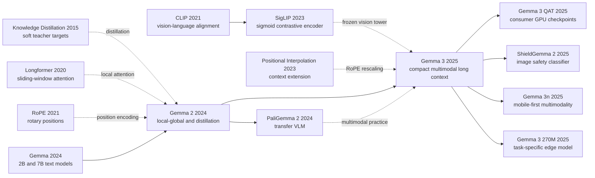

# Gemma 3 - Packing Multimodal Long Context into a Single-Accelerator Open-Weight Family

> **In March 2025, Google DeepMind used the [Gemma 3 Technical Report](https://arxiv.org/abs/2503.19786) to present a rare kind of open-weight answer: instead of asking for the biggest downloadable model, it asked whether image understanding, 128K context, multilinguality, and quantized deployment could all be squeezed into hardware budgets ordinary teams could actually touch.**
> What makes the report worth reading is not a brand-new magical equation. It is the way a sequence of unusually disciplined engineering choices settles four budgets at once. The upper three sizes share a frozen SigLIP vision tower and compress each image into a controlled 256 soft tokens; the language backbone uses a 5:1 local/global attention pattern so long-context KV cache does not consume the deployment story before the model even speaks; every scale is trained under teacher-distribution distillation so each training token carries more information; and QAT then drives weight memory into consumer-GPU territory. Gemma 3's historical importance is therefore not that it topped a single leaderboard, but that it moved “open model” one step closer to “deployable, inspectable, and composable system.”
> The report is valuable for another reason: it leaves its limits visible. Google says the model can run on a single GPU or TPU, but Table 3 reminds you that the 27B int4 weight figure of 14.1 GB does not include a 32K KV cache; Google says the family supports 128K, but Table 15 shows clearly weaker effective retrieval at 128K than at 32K; the repository open-sources code, while checkpoint access still sits behind the Gemma Terms. Precisely because those boundaries are not hidden, Gemma 3 reads like an engineering paper that deserves a deep note rather than a product launch dressed up as one.

## TL;DR

Released by the Gemma Team in 2025, Gemma 3 is not another attempt to build the biggest downloadable model. It is a decoder-only family rewritten around deployment economics: the upper three sizes attach a frozen SigLIP encoder and compress each crop into 256 soft tokens; the language backbone uses a 5:1 local/global attention pattern with 1,024-token local windows to control KV-cache growth; and every scale learns from a distillation target that samples 256 teacher logits per token. The practical law underneath the design is not glamorous but durable: overall deployment burden is closer to $\text{cost} \approx \text{weights} + \text{KV cache} + \text{vision tokens} + \text{runtime overhead}$ than to parameter count alone, and nearly every major Gemma 3 choice reduces at least one term in that expression while preserving a multimodal, long-context interface.

That is why Gemma 3 matters historically even next to larger open-weight peers. At release, Gemma 3 27B-IT's 1338 Arena Elo placed it in the first tier of open models, but the deeper contribution was turning “locally runnable multimodal open weights” into a concrete family contract. The same report tells you that 27B int4 weights need only 14.1 GB while 32K KV cache raises the footprint to 32.8 GB; that 4B-IT reaches 75.6 on MATH and beats Gemma 2 27B-IT's 55.6 there; and that RULER at 128K is clearly weaker than at 32K. In other words, Gemma 3 does not replay the [LLaMA](/en/era5_genai_explosion/2023_llama/) story of proving that public-facing weights can rival closed giants. Building on [Gemma 2](https://arxiv.org/abs/2408.00118), it proves a different point: if an open-weight family is willing to account honestly for memory, KV cache, visual budget, and governance constraints, then single-accelerator deployment, multimodality, and long context can coexist in one engineering balance rather than remain three separate promises.

---

## Historical Context

### In 2024, open models were caught between obtainable and runnable

By early 2024, downloadable weights had already proved their value for independent research, fine-tuning, and local products. A download button, however, did not solve deployment. Whether a model could genuinely leave a hosted API depended on at least three budgets: the memory occupied by static weights, the KV cache that grew with every token of a long conversation, and the extra encoder required for images. Flagship releases still tended to bind capability to scale. Llama 3.1 raised the open-weight ceiling with a 405B dense model, Qwen2.5 covered general tasks with a 72B dense model, and DeepSeek-V3 changed per-token compute with 671B total parameters but 37B active MoE parameters. They showed that downloadable models could be powerful; they did not make a strong model on one consumer accelerator the default.

Long context and multimodality each added another bill. Global self-attention has quadratic sequence compute, while inference must retain a key and value for prior tokens at every relevant layer. Moving from 8K to 128K is more than changing a configuration constant. Images cannot simply be inserted into a language model either: a system generally needs a vision encoder, an adapter, and many visual tokens. By late 2024, Gemini 1.5 had demonstrated million-token and natively multimodal behavior, but a closed API could hide the systems cost. An open-weight model offering similar interfaces had to expose memory, quantization, runtime, and licensing constraints to its users.

Gemma 3 occupies that gap. It did not claim that 27B parameters beat every frontier system. It reframed the question: could one family offer pre-trained and instruction-tuned weights at 1B, 4B, 12B, and 27B; add image understanding above 1B; give its main sizes 128K context; and supply quantized variants that made single-accelerator deployment credible? Such goals are less theatrical than multiplying parameter count by ten. They determine whether open weights remain an appendix to a report or become infrastructure that ordinary labs and developers can actually run.

### From Gemma to Gemma 2: the direct line formed within one year

The first [Gemma report](https://arxiv.org/abs/2403.08295), submitted in March 2024, released 2B and 7B text models trained with an 8,192-token context. It drew on Gemini research and infrastructure, supplied pre-trained and instruction-tuned checkpoints, and published inference, tuning, and responsibility tools. Its data was still primarily English, it did not process images, and state-of-the-art multilinguality was not a training objective. Gemma's important move was not a new Transformer block. It was Google's decision to put part of the Gemini research line into downloadable weights while explicitly treating a weight release as irreversible.

Four months later, the [Gemma 2 report](https://arxiv.org/abs/2408.00118) expanded the family to 2B, 9B, and 27B. It began reshaping the backbone around deployment efficiency: GQA reduced the number of key/value heads, global layers alternated 1:1 with 4,096-token sliding-window layers, and attention and output logits used soft-capping. More consequentially, the 2B and 9B models learned for long horizons from a large teacher distribution rather than only one-hot next-token labels. In Gemma 2's 500B-token ablation, the three-benchmark average for a 2B model rose from 60.3 when trained from scratch to 67.7 with distillation. The 27B model was still trained from scratch, so distillation remained primarily a small-model technique rather than a family-wide principle.

Gemma 3 inherited that line in March 2025 but did more than increment a version number. It changed 1:1 local/global attention to 5:1 and reduced the local window from 4,096 to 1,024; expanded 8K into 128K for 4B, 12B, and 27B; filled the original family's visual gap with a shared SigLIP encoder; put multilingual data, a Gemini 2.0 tokenizer, and mixed image-text training on the main path; and distilled every model size. Gemma 3 turned several local Gemma 2 optimizations into one system recipe constrained by finite hardware.

### Five predecessor lines converge in Gemma 3

The first line is sliding-window attention from [Longformer (2020)](https://arxiv.org/abs/2004.05150): not every layer needs every token to see the complete past. Gemma 2 already alternated local and global layers; Gemma 3 makes global attention only one layer in six to trade KV-cache memory for long context. The second line is [GQA (2023)](https://arxiv.org/abs/2305.13245), in which multiple query heads share fewer key/value heads to reduce cache and bandwidth while preserving expressive queries. Together they answer how a long sequence runs, not merely how a large context number appears on a model card.

The third line is knowledge distillation from Hinton, Vinyals, and Dean's [2015 work](https://arxiv.org/abs/1503.02531). A hard label says only which next token won; a teacher distribution also says how plausible the alternatives were. Gemma 3 samples 256 logits per token according to teacher probabilities, renormalizes the truncated target, and trains the student with cross-entropy. This uses richer supervision to compensate for parameter capacity rather than relying on ever longer raw-corpus training alone. The fourth line joins [SigLIP (2023)](https://arxiv.org/abs/2303.15343) and [PaliGemma 2 (2024)](https://arxiv.org/abs/2412.03555): a mature vision encoder can be frozen and reused while a language model consumes a fixed number of soft tokens. Gemma 3 condenses an 896-by-896 image to 256 visual tokens, avoiding a direct flood of all ViT patches into the language backbone.

The fifth line combines [positional interpolation (2023)](https://arxiv.org/abs/2306.15595) with RoPE extension. Google did not train with 128K sequences from the first step. It trained at 32K, then extended the 4B, 12B, and 27B models to 128K near the end of pre-training. The global-layer RoPE base frequency rises from 10K to 1M while local layers remain at 10K. This confines expensive long-sequence training to a late phase, while leaving a fact that later evaluation must confront: supporting 128K is not the same as retrieving equally well at 128K and 32K.

### The team assembled proven Gemini and Gemma parts rather than starting a VLM from zero

The paper is authored collectively by the Gemma Team, with core contributors spanning language modeling, vision, post-training, systems, safety, and product work. The report says the family was co-designed with Gemini and directly adopts the Gemini 2.0 tokenizer. Training continues to use JAX, Pathways, GSPMD, MegaScale XLA, and ZeRO-3-style optimizer-state sharding. The organizational advantage is not one secret equation. It is the ability to select internally proven frontier-model components and recombine them for an external deployment boundary.

Vision makes that transfer especially visible. Gemma 3 did not jointly train a new visual tower from scratch. It shares an approximately 400M SigLIP encoder, counted as 417M in Table 1, across the 4B, 12B, and 27B variants and freezes it while training the language model. Image embeddings are precomputed, so the report says they add no online cost to language-model training. For non-square images and small text, the team did not simply keep raising encoder resolution. Pan & Scan conditionally divides an input into non-overlapping windows, resizes each to 896 by 896, and lets the language model integrate the views.

This lineage also explains why “open” needs precise language. The official [JAX repository](https://github.com/google-deepmind/gemma) is Apache-2.0 open-source code, but checkpoints are governed by the [Gemma Terms](https://ai.google.dev/gemma/terms); use, modification, and redistribution carry notice and use-restriction obligations. Gemma 3 is therefore an **open-weight model**, not a completely open-source training system under the OSI software definition. The original training code, teacher identity, full corpus inventory, and independent reproduction budget are not public. Stating that boundary clearly does more historical work than translating every use of “open” into one undifferentiated label.

## Background and Motivation

### Motivation 1: cover real hardware with a family, not one leaderboard point

Gemma 3's four launch sizes are not proportional copies of one product. The 1B variant is a text-only, 32K-context model; only 4B, 12B, and 27B carry the shared vision encoder and support 128K. Table 1 also exposes the cost structure of small models: 1B contains 302M embedding and 698M non-embedding parameters, while 4B contains 417M vision, 675M embedding, and 3,209M non-embedding parameters. The large tokenizer, reported as 262K entries in the prose but 256K in Table 1, makes rare and non-English tokens easier to represent but consumes a large fraction of a small model's parameters.

These are not cosmetic SKUs. Classification, extraction, and routing may call for 1B or the later 270M addition; document VQA, chart reading, and interleaved image-text dialogue require 4B or above; harder reasoning can move to 12B or 27B. What a model family supplies is a portable interface: shared dialogue conventions, related tokenizer behavior, PT and IT weights, official QAT checkpoints, and several runtimes. Model size becomes an engineering control rather than an identity for capability.

### Motivation 2: make the KV cache an architectural problem, not a deployment afterthought

A 128K context window is easy to present as a product specification. Gemma 3 is more interesting for how it pays for it. If every layer uses global attention, every historical key and value remains available across all those layers. With fixed parameters, KV-cache memory grows approximately linearly with context until it can dominate the model itself. The report's 2B ablation at a 32K prefill finds roughly 60% memory overhead for global-only attention, versus less than 15% for a 1:3 local/global configuration with a 1,024-token window. The final family goes further at 5:1: local layers retain a short neighborhood, and only sparse global layers carry long-range dependencies.

The trade is counterintuitive: a long-context model does not need every layer to see far. Local layers compose nearby tokens, global layers periodically broadcast distant information, and a small number of global layers keeps the sequence connected. Validation perplexity changes little as the local ratio rises; the report says even 7:1 has minimal impact. Gemma 3 did not invent local attention, but it turned it into a family recipe justified by cache curves. Its quantization table also reports weights both with and without a 32K KV cache, rather than presenting checkpoint size as the whole deployment cost.

### Motivation 3: use capability transfer and responsible release to address two compact-model deficits

The first deficit of a compact model is capacity. Gemma 3 does not answer only by feeding it more web pages. Every size learns for a long horizon from the probability distribution of a large teacher; post-training again distills from a large IT teacher and adds rewards from human preferences, code execution, and ground-truth mathematics. The paper's most counterintuitive distillation ablation finds that a smaller teacher is better at short horizons, but a larger teacher wins after longer training. A strong teacher may initially be harder to fit, yet a long run lets the student absorb its dark knowledge. That gives a mechanism for Gemma 3 4B-IT approaching Gemma 2 27B-IT rather than attributing compression to an unspecified magic dataset.

The second deficit is loss of control after release. Once weights are distributed, Google cannot continuously wrap them in an API filter or recall every fine-tuned copy. Gemma 3 therefore puts pre-training filters, benchmark decontamination, memorization and privacy audits, SFT and RLHF, red teaming, assurance evaluation, model cards, use terms, and ShieldGemma 2 into the same release story. It does not prove that all risks are solved: safety prompts are primarily English, CBRN tests are internal and closed, and the full training corpus is undisclosed. It does establish an engineering principle worth carrying forward: “runs on one accelerator” is not merely a memory metric. Capabilities, license obligations, risk documentation, and downstream safeguards must travel with the weights.

---

## Method Deep Dive

### Overall framework: reorganize a family around memory budgets instead of shrinking one 27B model

Gemma 3 keeps a decoder-only Transformer language backbone: tokens enter a large vocabulary embedding, pass through Transformer blocks with GQA, and reach an autoregressive next-token head. It retains Gemma 2's pre-norm and post-norm RMSNorm but replaces attention-logit soft-capping with QK-norm. QK-norm can be understood schematically as normalizing query and key separately before their dot product. The report does not publish every implementation constant, so an epsilon or scale copied from a third-party implementation should not be presented as a paper fact.

The new system has three parallel paths. The text path repeats five local layers followed by one global layer. The visual path turns each 896-by-896 crop into 256 soft tokens through a frozen SigLIP encoder and interleaves them with text. The training path makes every size fit a truncated teacher distribution, then adds several reward sources at the IT stage. Finally, QAT starts from a completed checkpoint and uses full-precision probabilities as targets while adapting weights to low precision.

```text
text tokens ------------------------------+
                                           |
image -> Pan & Scan -> frozen SigLIP -> 256 soft tokens / crop
                                           |
                                           v
                                  interleaved token stream
                                           |
                             [L L L L L G] x N blocks
                             local=1,024; global=full
                                           |
                               autoregressive text output
                                           |
                  PT weights -> IT weights -> QAT variants
```

The four launch tiers are not completely isomorphic. The 1B model has no vision encoder and accepts text only; the other three share a 417M visual encoder. The table below transcribes the component counts in Technical Report Table 1. “4B/12B/27B” are product-size names, not claims that mechanically summing all three columns yields those exact round totals.

| Model | Vision encoder | Embedding | Non-embedding | Context | Input modalities |
|---|---:|---:|---:|---:|---|
| Gemma 3 1B | 0 | 302M | 698M | 32K | Text |
| Gemma 3 4B | 417M | 675M | 3,209M | 128K | Text, image |
| Gemma 3 12B | 417M | 1,012M | 10,759M | 128K | Text, image |
| Gemma 3 27B | 417M | 1,416M | 25,600M | 128K | Text, image |

The primary report contains a discrepancy that secondary summaries often erase: Table 1 says the vocabulary has 256K entries, while Section 2.2 says the Gemini 2.0 SentencePiece tokenizer has 262K. Both statements occur in the same report version. Without an ungated released configuration to arbitrate, the responsible account records the conflict rather than selecting the neater number. What is unambiguous is that the tokenizer splits digits, preserves whitespace, and provides byte-level encodings for unknown characters to improve balance outside English.

### Key design 1: put five local layers before each global layer so 128K passes the memory test

**Function.** This design is not primarily about constructing a 128K training example. It keeps historical keys and values from consuming all inference memory. Let $L_g$ and $L_l$ be the number of global and local layers, $n$ the sequence length, $w$ the local window, and $h_{kv}d_h$ the product of KV-head count and head dimension. Cache elements scale approximately as:

$$
M_{KV}\propto 2h_{kv}d_h\left(L_g n+L_l\min(n,w)\right).
$$

A global-only model pays $n$ at every layer. A Gemma 3 local layer pays at most $w=1024$, while only one layer in six retains the full history. GQA further reduces cache and bandwidth along $h_{kv}$ by letting multiple query heads share fewer key/value heads. Their product is the memory basis for moving from Gemma 2's 8K to 128K.

```python
def gemma3_attention_schedule(num_layers: int):
    for layer_index in range(num_layers):
        # The first five layers in each six-layer cycle are local.
        is_global = (layer_index + 1) % 6 == 0
        yield {
            "kind": "global" if is_global else "local",
            "window": None if is_global else 1024,
            "rope_theta": 1_000_000 if is_global else 10_000,
        }
```

**Long-context training.** The 4B, 12B, and 27B models do not consume 128K sequences from the first step. The report first pre-trains at 32K, then extends them to 128K near the end using a positional-interpolation-like procedure with an empirical scale factor of eight. Global-layer RoPE base frequency rises from Gemma 2's 10K to 1M, while local layers remain at 10K. That confines the most expensive long-sequence phase to the end, but it cannot erase extrapolation loss. Table 15 has RULER for 27B-IT falling from 91.1 at 32K to 66.0 at 128K, a direct reminder that accepting and reliably using a context length are different claims.

| Attention scheme | Global-layer share | Local window | 32K cache characteristic | Main cost |
|---|---:|---:|---|---|
| Global only | 100% | N/A | About 60% memory overhead in the 2B ablation | Largest cache |
| Gemma 2 | 1/2 | 4,096 | Smaller than global-only | Only 8K training context |
| Gemma 3 final recipe | 1/6 | 1,024 | Strongly reduces long-sequence cache | Sparser global propagation |
| 1:3 ablation | 1/4 | 1,024 | Less than 15% overhead | Not the final model recipe |

**Design motivation.** Figures 3 and 4 do not establish that 5:1 is universally optimal. They show that validation perplexity is surprisingly insensitive to raising the local/global ratio and shrinking the window; even 7:1 has minimal impact in the reported text-only experiment. The team trades that quality slack for measurable cache savings. This is Gemma 3's engineering stance in miniature: global attention is a scarce resource used periodically, while local attention is the default. The family did not invent sparse attention, but it tied sparsity to a testable deployment-memory recipe.

### Key design 2: freeze SigLIP, fix 256 visual tokens, and recover resolution with Pan & Scan

**Function.** The 4B, 12B, and 27B models share an approximately 400M SigLIP Vision Transformer, counted precisely as 417M in Table 1. It receives 896-by-896 square images and remains frozen during Gemma 3 language-model training. Google precomputes image embeddings, so the report says the visual tower adds no online backward-pass cost to language-model training. A single crop can be represented schematically as:

$$
V(I)=\operatorname{Pool}_{4\times4}\left(\operatorname{SigLIP}(\operatorname{Resize}_{896}(I))\right)\in\mathbb{R}^{256\times d_v}.
$$

The 896-resolution encoder output goes through 4-by-4 average pooling, so every crop supplies only 256 image tokens regardless of its original patch count. The central trade is to decouple visual spatial resolution from language-sequence cost: a specialized encoder can inspect fine pixels without forcing the LLM to retain one token per patch.

```python
def encode_image_for_gemma3(image, pan_and_scan=True):
    crops = adaptive_non_overlapping_crops(image) if pan_and_scan else [image]
    soft_tokens = []
    for crop in crops:
        square = resize(crop, (896, 896))
        vision_features = frozen_siglip(square)
        soft_tokens.append(average_pool_4x4(vision_features))  # 256 tokens
    return concatenate(soft_tokens)
```

A fixed square resize harms long receipts, documents, and non-square photographs by erasing small text or distorting geometry. Pan & Scan is an inference-time windowing algorithm. When needed, it divides an image into non-overlapping regions, resizes each to 896 by 896, and lets the language model integrate the views. It can be disabled for faster inference and given a maximum crop count to bound token cost. It is not a second training stage and does not change visual-encoder weights.

| Encoder input resolution | DocVQA | InfoVQA | TextVQA |
|---:|---:|---:|---:|
| 256 | 31.9 | 23.1 | 44.1 |
| 448 | 45.4 | 31.6 | 53.5 |
| 896 | 59.8 | 33.7 | 58.0 |

| PT checkpoint | Pan & Scan | DocVQA | InfoVQA | TextVQA |
|---|---|---:|---:|---:|
| 4B | Off | 72.8 | 44.1 | 58.9 |
| 4B | On | 81.0 | 57.0 | 60.8 |
| 27B | Off | 85.6 | 59.4 | 68.6 |
| 27B | On | 90.4 | 76.4 | 70.2 |

**Design motivation.** Table 7 shows that encoder resolution is not decorative on OCR-heavy tasks: DocVQA rises from 31.9 at 256 input to 59.8 at 896. Table 8 then shows that preserving local native scale matters beyond one fixed high resolution. Pan & Scan moves 4B InfoVQA from 44.1 to 57.0 and 27B from 59.4 to 76.4. The counterintuitive result is that stronger vision need not mean more single-image tokens for the LLM. A specialized encoder can first see clearly, pooling can control language-side cost, and only difficult aspect ratios need extra crops.

### Key design 3: distill every size while sending only a small slice of the teacher distribution per token

**Function.** Gemma 2 pre-trained only 2B and 9B with distillation while training 27B from scratch. Gemma 3 distills 1B, 4B, 12B, and 27B. At position $t$, a teacher supplies the full-vocabulary distribution $p_T(v\mid x_{<t})$. The system samples a 256-logit support $S_t$ according to teacher probability, sets probability outside that set to zero, and renormalizes within it:

$$
q_T(v\mid x_{<t})=
\begin{cases}
\dfrac{p_T(v\mid x_{<t})}{\sum_{u\in S_t}p_T(u\mid x_{<t})}, & v\in S_t,\\
0, & v\notin S_t,
\end{cases}
\qquad
\mathcal{L}_{KD}=-\sum_v q_T(v)\log p_S(v).
$$

This is cheaper than storing teacher logits for a roughly 262K vocabulary and richer than a one-hot label: the student sees not only the observed token but alternatives the teacher considers plausible. The report does not disclose teacher identity, temperature, exact sampling mechanics, or stage-specific loss weights. The code below represents only the public computation graph; it is not a fabricated official recipe.

```python
def sampled_teacher_cross_entropy(student_logits, teacher_logits):
    teacher_probs = softmax(teacher_logits, dim=-1)
    support = sample_support(teacher_probs, count=256)
    target = gather(teacher_probs, support)
    target = target / target.sum(dim=-1, keepdim=True)
    student_log_probs = log_softmax(student_logits, dim=-1)
    return -(target * gather(student_log_probs, support)).sum(dim=-1).mean()
```

| Supervision | Per-token target | Information transferred | Main boundary |
|---|---|---|---|
| Standard next-token | One one-hot label | Identity of observed token | No similarity among alternatives |
| Full-distribution KD | Entire vocabulary distribution | Richest teacher ranking | Expensive storage and transfer |
| Gemma 3 sampled-logit KD | 256 logits sampled by probability | High-probability alternatives and dark knowledge | Teacher and sampling details undisclosed |

**Why long training changes teacher choice.** Figure 8 directly challenges the rule that a small student should use a similarly sized teacher. A smaller teacher gives lower perplexity over a short training horizon, but the trend reverses as the token horizon grows. The paper's explanation is that regularization from a worse teacher can hide the information advantage of a stronger teacher in short experiments; sustained training lets the student absorb the harder distribution. The figure does not license an invented crossover token count, but it does support a clear lesson: selecting a teacher with short proxy runs systematically favors smaller teachers.

### Key design 4: multilingual pre-training and multi-reward post-training share one capability-transfer logic

**Pre-training data.** The 1B, 4B, 12B, and 27B models receive 2T, 4T, 12T, and 14T tokens respectively; the increase includes the image-text mixture. The report discloses only four broad categories: web documents, code, mathematics, and images. The model card gives an August 2024 knowledge cutoff and says the dataset contains more than 140 languages. The team adds monolingual and parallel data and addresses language imbalance with a strategy inspired by UniMax. It does not publish a domain inventory, per-language proportions, item-level licensing provenance, or image-text source list. Claims about one specific secret corpus would therefore be inference, not reporting.

**Post-training.** A PT checkpoint is first distilled from a large instruction-tuned teacher, then undergoes RL based on improved versions of BOND, WARM, and WARP. Reward sources include weight-averaged reward models trained on human feedback, code-execution feedback, ground-truth mathematics, and an objective to reduce harmful behavior. The following equation shows only the multi-objective structure; the paper does not disclose a literal linear combination or coefficients:

$$
J(\theta)=\mathbb{E}_{y\sim\pi_\theta(\cdot\mid x)}
\left[R_{human}(x,y)+R_{exec}(x,y)+R_{math}(x,y)-R_{harm}(x,y)\right].
$$

```python
def post_training_step(prompt, policy, reward_models):
    response = policy.generate(prompt)
    signals = {
        "human_preference": reward_models.weight_averaged(response),
        "code_execution": execute_if_code(response),
        "math_ground_truth": check_if_math(response),
        "safety": safety_policy_score(response),
    }
    return update_with_bond_warm_warp_family(policy, prompt, response, signals)
```

| Stage / signal | Disclosed source | Primary goal | Undisclosed detail |
|---|---|---|---|
| IT teacher distillation | Large IT teacher | Transfer chat and instruction ability | Teacher identity, temperature, mixture |
| Human feedback / WARM | Weight-averaged reward models | Helpfulness and preference | Data scale and label distribution |
| Code execution feedback | Program execution result | Coding correctness | Sandbox and task mixture |
| Math ground truth | Verifiable answer | Mathematics and reasoning | Curriculum and sampling share |

**Design motivation.** Multilinguality, mathematics, code, and safety are not four unrelated fine-tunes. They use one capability-transfer idea: dense soft supervision from a stronger model first, then verifiable or preference rewards to steer behavior. Filtering also removes personal information, unsafe or toxic outputs, mistaken self-identification, and duplicates, while adding data that encourages attribution, hedging, and refusal. Gemma 3 4B-IT consequently approaches Gemma 2 27B-IT on several measures, but the complete recipe cannot be independently reconstructed from the report.

### Key design 5: make QAT an official release artifact instead of a community patch

**Function.** Post-training quantization usually maps finished BF16 weights to fewer bits without giving the model a chance to adapt to rounding error. Gemma 3 QAT checkpoints receive roughly 5,000 additional steps, simulate low-precision weights in the forward pass, and use probabilities from the unquantized checkpoint as targets; data is matched to the PT or IT distribution. A common symmetric quantizer can be illustrated as:

$$
\hat{w}=s\cdot\operatorname{clip}\left(\operatorname{round}(w/s),q_{min},q_{max}\right),
$$

but the report does not say that every released format uses this identical scale rule. It explicitly targets per-channel int4, per-block int4 with block size 32, and switched FP8. Google's QAT launch post additionally reports a 54% reduction in perplexity drop relative to direct Q4_0 quantization under a llama.cpp perplexity evaluation. That specific result should not be inflated into “99% quality on every benchmark.”

```python
def qat_step(batch, full_precision_teacher, quantized_student):
    with no_grad():
        target_probs = softmax(full_precision_teacher(batch), dim=-1)
    simulated_low_precision_logits = quantized_student.fake_quant_forward(batch)
    loss = cross_entropy_with_soft_targets(
        simulated_low_precision_logits, target_probs
    )
    loss.backward()
```

| Model memory (32K condition) | BF16 | Int4 channel | Int4 block=32 | SFP8 |
|---|---:|---:|---:|---:|
| 1B weights | 2.0 GB | 0.5 GB | 0.7 GB | 1.0 GB |
| 1B + KV | 2.9 GB | 1.4 GB | 1.6 GB | 1.9 GB |
| 4B weights | 8.0 GB | 2.6 GB | 2.9 GB | 4.4 GB |
| 4B + KV | 12.7 GB | 7.3 GB | 7.6 GB | 9.1 GB |
| 12B weights | 24.0 GB | 6.6 GB | 7.1 GB | 12.4 GB |
| 12B + KV | 38.9 GB | 21.5 GB | 22.0 GB | 27.3 GB |
| 27B weights | 54.0 GB | 14.1 GB | 15.3 GB | 27.4 GB |
| 27B + KV | 72.7 GB | 32.8 GB | 34.0 GB | 46.1 GB |

**Design motivation and boundary.** The official statement that 27B can run on an RTX 3090 comes from the int4 weights occupying 14.1 GB, not from the complete 32K state in Table 3. In that same table, 27B int4 channel weights plus the 32K KV cache occupy 32.8 GB, above a 24 GB card. Single-card deployment therefore requires a shorter context, an appropriate runtime, controlled visual crops, or offload. Gemma 3's historical contribution is not abolishing hardware limits. It expresses them in checkpoints, formats, and cache conditions so the community does not first have to rediscover a compression route.

### Training objective and execution ledger: what is public and what remains irreproducible

The report gives token budgets and chip partitions for all four sizes. Vision embeddings are precomputed, optimizer state is sharded in a ZeRO-3-like fashion, and Pathways performs replica reduction across pods; JAX's single-controller model, GSPMD, and MegaScale XLA manage large-scale execution. The table preserves the original infrastructure numbers.

| Model | Token budget | TPU / chips | Data shards | Sequence shards | Replicas |
|---|---:|---|---:|---:|---:|
| 1B | 2T | TPUv5e / 512 | 16 | 16 | 2 |
| 4B | 4T | TPUv5e / 2,048 | 16 | 16 | 8 |
| 12B | 12T | TPUv4 / 6,144 | 16 | 16 | 24 |
| 27B | 14T | TPUv5p / 6,144 | 24 | 8 | 32 |

| Reproduction element | Report status | Reliably reportable content |
|---|---|---|
| Architectural spine | Disclosed | Decoder-only, GQA, 5:1, 1,024 window, QK-norm |
| Visual interface | Disclosed | Frozen SigLIP, 896 by 896, 256 tokens, P&S |
| Token budget | Disclosed | 2T / 4T / 12T / 14T |
| Data composition | Partly disclosed | Four categories, 140+ languages, mono+parallel; no source ratios |
| Distillation | Partly disclosed | 256 sampled logits; no teacher identity or temperature |
| Optimization hyperparameters | Insufficiently disclosed | No complete optimizer, LR, batch, or schedule table |
| Post-training | Partly disclosed | IT KD, BOND/WARM/WARP, three reward classes; no full recipe |
| QAT | Partly disclosed | Roughly 5,000 steps, teacher probabilities, three representations |

The final pre-training target is not a pure next-token loss but distillation cross-entropy. The final IT target is likewise not one public scalar formula; it combines teacher transfer, preference signals, and verifiable rewards. Because Gemma 3 is open-weight rather than an open training project, a reader can reproduce inference, fine-tuning, and quantized formats but cannot reconstruct the original 14T-token 27B run from the report. Keeping that reproduction boundary in the method section matters more than completing an attractive hyperparameter table with guesses.

---

## Failed Baselines

### Opponent 1: global attention in every layer loses long context to the KV cache first

The most direct failed baseline is not another vendor's model. It is the dense Transformer's default implementation in which every layer lets every token see the complete past. That path is simple and expressive at short context, but its KV cache grows with layers times sequence length. Gemma 3 Figure 5 compares configurations using a 2B text-only proxy and a 32K prefill. Global-only attention incurs roughly 60% memory overhead, while a 1:3 local/global model with a 1,024-token sliding window brings it below 15%. The 1:3 point is an ablation; the released family uses a more aggressive 5:1 ratio. The two facts must not be collapsed into the unsupported sentence “5:1 measured below 15%.”

Why does global-only lose? Not because its perplexity must be worse, but because it spends substantial memory for a quality gain too small to measure clearly here. Figure 3 moves local:global through 1:1, 3:1, 5:1, and 7:1 with little validation-perplexity change; Figure 4 likewise finds that the local window can shrink substantially without a material perplexity penalty. The baseline assumes full visibility is valuable in every layer. The ablations suggest that neighborhood attention suffices most of the time and distant information can reconverge periodically.

This failure also explains why reporting only checkpoint weight size misleads deployment. Technical Report Table 3 lists 27B per-channel int4 weights at 14.1 GB, apparently comfortable on a 24 GB card; with a 32K KV cache the total is 32.8 GB. If global-only attention further expands that cache, quantization savings are quickly consumed by context. Gemma 3's local/global recipe and QAT are not separate selling points. They attack the same bottleneck.

### Opponent 2: forcing every image into one square makes small text and long documents disappear

A fixed 896-by-896 input is a useful but incomplete baseline. It lets 4B, 12B, and 27B share one frozen SigLIP encoder and consistently compress each image to 256 tokens. Yet direct resizing of receipts, web screenshots, charts, and wide photographs can make text unreadable or average away small objects. Section 2.1 states the failure plainly: fixed resolution produces artifacts on non-square and high-resolution images.

The Pan & Scan ablation quantifies the cost. On pre-trained checkpoints under a four-shot validation setup, 4B moves from 72.8 to 81.0 on DocVQA, 44.1 to 57.0 on InfoVQA, and 58.9 to 60.8 on TextVQA. The 27B values move from 85.6/59.4/68.6 to 90.4/76.4/70.2. The largest gain is not generic visual knowledge but +17.0 on 27B InfoVQA, precisely a task that needs local text scale to survive.

| Model | One 896x896 resize | Pan & Scan | DocVQA gain | InfoVQA gain | TextVQA gain |
|---|---|---|---:|---:|---:|
| Gemma 3 4B PT | 72.8 / 44.1 / 58.9 | 81.0 / 57.0 / 60.8 | +8.2 | +12.9 | +1.9 |
| Gemma 3 27B PT | 85.6 / 59.4 / 68.6 | 90.4 / 76.4 / 70.2 | +4.8 | +17.0 | +1.6 |
| Mechanism | Whole-image resize | Conditional non-overlapping crops | Preserves layout | Preserves small text | Smaller extra gain |
| Deployment cost | Fixed 256 tokens | 256 tokens per crop | Slower | Longer context | Crop count can be capped |

Pan & Scan is not a free victory. Every additional crop adds 256 visual tokens and an encoder forward pass, so the paper permits disabling it and bounding the number of windows. The lesson is not that more crops always win. Fixed cost and information fidelity should depend on input type: one view may suffice for a natural photograph, while a dense document can justify extra tokens.

### Opponent 3: learn only from one-hot labels, or select a weaker teacher with a short proxy run

Gemma 3 does not publish a complete same-size, pure-next-token control table, so there is no defensible Gemma 3 from-scratch score to invent. Direct predecessor evidence comes from Gemma 2: a 2B student trained from scratch for 500B tokens averages 60.3 across three benchmarks, versus 67.7 when distilled from a 7B teacher. That is a Gemma 2 experiment, not Gemma 3, but it explains why the next generation expands distillation from 2B/9B to all four tiers. The one-hot baseline loses supervision bandwidth: it identifies one observed token, while a teacher distribution describes the relative plausibility of alternatives.

A subtler failure comes from choosing a teacher with a short training proxy. Conventional wisdom says a small student learns best from a similarly sized teacher. Gemma 3 Figure 8 reproduces that result at short horizons, but the curves reverse as training tokens increase and the larger teacher ultimately wins. The plot does not expose a reliable numeric crossover point, so none should be supplied. It supports an experimental-design conclusion instead: short runs amplify the regularization benefit of a weaker teacher while hiding the information advantage that emerges over long training.

This evidence also qualifies the statement that 4B approaches the previous 27B. In Table 6, Gemma 3 4B-IT reaches 75.6 MATH versus Gemma 2 27B-IT at 55.6, and 70.1 FACTS Grounding versus 62.4. But MMLU-Pro is 43.6 versus 56.9, LiveCodeBench 12.6 versus 20.4, and Global MMLU-Lite 54.5 versus 68.6. “Competitive across benchmarks” describes an overall capability profile, not a claim that the smaller model wins every row. Distillation transfers capability without abolishing capacity limits or task variation.

### The authors' counterexample: 128K is an interface limit, not a constant effective length

The central counterexample appears in Table 15. Every main size accepts 128K, yet RULER and MRCR scores are generally lower at 128K than at 32K. RULER for 27B-IT falls from 91.1 to 66.0, 12B-IT from 80.3 to 57.1, and 4B-IT from 61.4 to 46.8. MRCR falls more gently: 27B-IT moves from 63.2 to 59.3 and 4B-IT from 49.8 to 44.6. Section 5.3 also says the models generalize to 128K but degrade rapidly when extended further. A 128K context is first an input protocol and training range, not a promise of equal memory quality at every position.

| Counterexample / boundary | Paper evidence | Unsupported conclusion | Follow-up question |
|---|---|---|---|
| Lower 128K utilization | RULER/MRCR score below 32K | 128K quality equals 32K | Better long-range training and retrieval tests |
| 1B capability gap | Text-only, 32K, no vision encoder | Every family member is multimodal and 128K | Smaller multimodal edge architectures |
| Probe contamination | Section 5.1 says risk remains after decontamination | Benchmark score equals real generalization | Dynamic, private, auditable evaluation |
| Incomplete safety coverage | Model-card safety prompts are English-only | All 140+ languages received equal safety validation | Multilingual, multimodal red teaming |
| Undisclosed data and teacher | Only categories, token budgets, and algorithm outline | An external team can retrain the same model from the report | Training transparency and data governance |

Image input also does not imply arbitrary visual reasoning: 1B has no vision at all, and 4B/12B/27B still generate text rather than images. The model card warns about factual accuracy, common sense, figurative language, and complex open-ended tasks. Training knowledge ends in August 2024; long context does not turn the model into a live knowledge base. Responsible-release evaluation and terms mitigate some risk but cannot replace application-specific safety tests.

## Key Experimental Data

### Main experiments: strong generational gains, but task scaling is not monotonic

The most controlled comparison is Technical Report Table 6, which evaluates Gemma 2, Gemma 3, and Gemini under the same internal setup. It is more defensible than a collage of vendor blog leaderboards. The six rows below span knowledge, code, mathematics, multilinguality, grounding, and vision. Gemma 3 27B-IT exceeds Gemma 2 27B-IT on MMLU-Pro, LiveCodeBench, MATH, and Global MMLU-Lite. The 4B profile is uneven: mathematics and grounding jump, while general knowledge and code remain below the previous 27B.

| Benchmark (Table 6) | Gemma 2 27B-IT | Gemma 3 4B-IT | Gemma 3 12B-IT | Gemma 3 27B-IT |
|---|---:|---:|---:|---:|
| MMLU-Pro | 56.9 | 43.6 | 60.6 | **67.5** |
| LiveCodeBench | 20.4 | 12.6 | 24.6 | **29.7** |
| MATH | 55.6 | 75.6 | 83.8 | **89.0** |
| FACTS Grounding | 62.4 | 70.1 | **75.8** | 74.9 |
| Global MMLU-Lite | 68.6 | 54.5 | 69.5 | **75.1** |
| MMMU (val) | N/A | 48.8 | 59.6 | **64.9** |

Visual scaling is not monotonic either. Table 16 uses Pan & Scan unless noted otherwise. The 12B model's 87.1 DocVQA slightly exceeds 27B at 86.6; TextVQA is 67.7 versus 65.1, and VQAv2 71.6 versus 71.0. The 27B model leads on InfoVQA, ChartQA, MathVista, and MMMU. Because all three share an encoder, enlarging the language backbone is only one determinant; data, decoding, and task format can reorder the models.

| IT vision benchmark (Table 16) | Gemma 3 4B | Gemma 3 12B | Gemma 3 27B | Maximum |
|---|---:|---:|---:|---:|
| DocVQA | 75.8 | **87.1** | 86.6 | 87.1 |
| InfoVQA | 50.0 | 64.9 | **70.6** | 70.6 |
| TextVQA | 57.8 | **67.7** | 65.1 | 67.7 |
| VQAv2 (val) | 62.4 | **71.6** | 71.0 | 71.6 |
| MathVista (testmini) | 50.0 | 62.9 | **67.6** | 67.6 |

### Human preference and long context: two snapshots that require dates and lengths

Chatbot Arena Table 5 supplies the release's most memorable number. Gemma-3-27B-IT has Elo 1338 and is shown at rank 9, ahead of Gemini-1.5-Pro-002 at 1302, Llama 3.1 405B at 1269, and Gemma 2 27B at 1220. The table explicitly labels Gemma 3 as a **preliminary result received on March 8, 2025**. Arena rankings change with the voting pool, and this comparison does not score visual ability. It is a launch-time human-preference snapshot, not a permanent claim that the model is “ninth in the world.”

| Model (Table 5 snapshot) | Elo | 95% CI | Table rank | Parameter type |
|---|---:|---|---:|---|
| Gemma-3-27B-IT | **1338** | +8/-9 | 9 | 27B dense |
| DeepSeek-V3 | 1318 | +8/-6 | 13 | 671B / 37B active MoE |
| Gemini-1.5-Pro-002 | 1302 | +3/-3 | 18 | Undisclosed |
| Llama-3.1-405B-Instruct | 1269 | +4/-3 | 28 | 405B dense |
| Gemma-2-27B-it | 1220 | +3/-2 | 59 | 27B dense |

Long-context results must likewise include benchmark and length. Table 15 reports both PT and IT values, so selecting only the strongest 128K score would misrepresent the evidence. On RULER, 27B-PT at 32K is even below 12B-PT, 85.9 versus 90.6, while 27B-IT reaches 91.1. Every IT size falls at 128K. These non-monotonic results explain more than a context-window badge.

| Benchmark | Context | PT 4B / 12B / 27B | IT 4B / 12B / 27B |
|---|---:|---|---|
| RULER | 32K | 67.1 / 90.6 / 85.9 | 61.4 / 80.3 / **91.1** |
| RULER | 128K | 51.7 / 80.7 / 72.9 | 46.8 / 57.1 / **66.0** |
| MRCR | 32K | 44.7 / 59.8 / 63.2 | 49.8 / 53.7 / **63.2** |
| MRCR | 128K | 40.6 / 56.9 / 60.0 | 44.6 / 49.8 / **59.3** |

### Deployment data and six readings: one GPU is not an unconditional promise

QAT's value is visible directly in memory, provided weights-only and +KV remain separate. The table uses per-channel int4 and a 32K context. Google's QAT launch post says 14.1 GB 27B weights fit a 24 GB RTX 3090 and explicitly warns that runtime also needs a KV cache. Table 3's 32.8 GB supplies the condition missing from the headline: on a 3090, a user must shorten context, limit crops, offload, or select a smaller model.

| Model | BF16 weights | Int4 weights | Int4 + 32K KV | Single-card interpretation |
|---|---:|---:|---:|---|
| 1B | 2.0 GB | 0.5 GB | 1.4 GB | Lightest edge text tier |
| 4B | 8.0 GB | 2.6 GB | 7.3 GB | An 8 GB tier must budget runtime overhead |
| 12B | 24.0 GB | 6.6 GB | 21.5 GB | Little margin on a 24 GB tier |
| 27B | 54.0 GB | 14.1 GB | 32.8 GB | Weights fit 24 GB; full 32K state does not |

- **Mathematics supplies the clearest compression result.** Gemma 3 4B-IT reaches 75.6 MATH, 20.0 points above Gemma 2 27B-IT at 55.6. This is directionally consistent with verifiable math rewards and long-horizon distillation, but the report cannot isolate either component's causal contribution.
- **Larger is not better on every row.** The 12B model exceeds 27B on FACTS Grounding, DocVQA, TextVQA, and VQAv2, showing how a shared encoder, post-training, and benchmark variance break monotonic scaling.
- **128K is a lossy capability.** RULER for 27B-IT declines from 91.1 to 66.0; a context limit should not be published without an effective-utilization curve.
- **Visual resolution is expensive in an unexpected place.** Raising input to 896 moves DocVQA for a short-schedule 2B proxy from 31.9 to 59.8; P&S then buys as much as +17.0 InfoVQA with extra crops.
- **Quantization does not erase cache.** The 27B int4 weights occupy 14.1 GB, but the 32K +KV condition is 32.8 GB. Context planning remains part of deployment design.
- **External comparison must obey protocols.** The authors deliberately avoid a static external-model collage in Table 6 because prompts and scoring differ. Arena offers only a shared-pool preference snapshot and does not test vision.

The real anti-baseline lesson is that a compact model is not a large model with parameters removed and miracles expected. Gemma 3 simultaneously raises supervision per training token, lowers cache cost per historical token, bounds language tokens per image, and turns quantization into an official checkpoint. Its historical case rests on all four ledgers working together, not on beating a 70B model in one row.

---

## Idea Lineage

### One diagram: old techniques recombined under a single-accelerator constraint



The graph deliberately avoids presenting Gemma 3 as an isolated conceptual breakthrough. Nearly every component has a clear prehistory: local attention comes from long-document models, RoPE and positional interpolation address position extension, SigLIP continues CLIP's visual-language alignment program, and distillation was mature by 2015. The historically interesting move is their first joint optimization on the main Gemma line around one constraint: a downloadable, tunable, quantizable dense family should see images and read 128K without letting its KV cache and visual tokens eliminate single-accelerator deployment.

Solid edges indicate explicit family or product succession; dotted edges indicate technical borrowing stated in the report. The diagram does not convert every one of OpenAlex's 63 citing records into a descendant. A work may cite Gemma 3 because it benchmarks the model or lists it in a survey without inheriting 5:1 attention or sampled-logit distillation. For a technical report barely more than a year old, a few defensible edges are more useful than dressing every downstream application as intellectual offspring.

### Past lives: Gemma 3 pulls six mature lines into one deployment objective

- **2015 - Knowledge Distillation.** Hinton, Vinyals, and Dean turn a teacher's soft distribution into student supervision. [Gemma 2](https://arxiv.org/abs/2408.00118) shows that long-horizon distillation can push 2B/9B beyond a pure next-token baseline; Gemma 3 extends the approach through 27B and reduces per-token teacher support to 256 logits. The shift is not the first use of distillation but its promotion from a compression remedy to a family-wide pre-training objective.
- **2020 - Longformer.** [Longformer](https://arxiv.org/abs/2004.05150) shows that local windows plus sparse global connectivity can process long documents. Gemma 2 adopts 1:1 local/global attention, and Gemma 3 moves to 5:1 with a 1,024-token window. It inherits the structural assumption that most token interaction is local and changes the aggressiveness for deployment.
- **2021/2023 - RoPE and Positional Interpolation.** [RoPE](https://arxiv.org/abs/2104.09864) gives decoders rotary positions, while [positional interpolation](https://arxiv.org/abs/2306.15595) shows how to extend a trained context. Gemma 3 trains first at 32K, rescales by eight to reach 128K, and raises only the global-layer base frequency to 1M.
- **2021/2023 - CLIP to SigLIP.** [CLIP](../2021_clip/) establishes large-scale visual-language alignment, and [SigLIP](https://arxiv.org/abs/2303.15343) replaces its batchwise softmax objective with sigmoid loss. Gemma 3 reuses a frozen 400M-class SigLIP rather than retraining a visual world model and pools each crop to 256 soft tokens.
- **2024 - Gemma.** The [first Gemma](https://arxiv.org/abs/2403.08295) supplies a 2B/7B, 8K, text-only open-weight starting point. It also establishes a governance pattern around pre-release safety evaluation, model cards, and the Responsible Generative AI Toolkit. Gemma 3 inherits both a model lineage and a release institution.
- **2024 - Gemma 2 and PaliGemma 2.** Gemma 2 contributes 2B/9B/27B models, GQA, local/global attention, and sustained distillation. [PaliGemma 2](https://arxiv.org/abs/2412.03555) accumulates experience in transferable vision-language models. Gemma 3 joins a previously separate language mainline and visual-transfer line in one general family.

No one of these six paths implies Gemma 3 by itself. Only their placement in a shared cost function yields the report's center: distillation reduces student parameters required for a level of capability, local/global attention lowers cache per historical token, pooling bounds language tokens per crop, and QAT lowers bits per weight. Its historical case comes from four forms of compression serving “runs on standard hardware” together.

### Descendants: few direct heirs, but the deployment philosophy branches quickly

**Direct product descendants.** [Gemma 3 QAT](https://developers.googleblog.com/en/gemma-3-quantized-aware-trained-state-of-the-art-ai-to-consumer-gpus/) in April 2025 turns Section 2.3's approximately 5,000-step adaptation into Q4_0, int4, and other checkpoints ready for Ollama, llama.cpp, and MLX. It converts “27B weights occupy 14.1 GB” from a table into an RTX 3090 deployment path. The contemporary [ShieldGemma 2](https://ai.google.dev/gemma/docs/shieldgemma/model_card_2) instruction-tunes Gemma 3 4B-IT into an image-safety classifier that returns Yes/No probabilities for dangerous, sexually explicit, and violent content. It is one concrete inheritance of responsible release from documentation into a downstream guard model.

**Branching toward smaller edge models.** The full [Gemma 3n](https://developers.googleblog.com/en/introducing-gemma-3n-developer-guide/) release in June 2025 does not copy the Gemma 3 backbone. It pushes the deployment problem further: 5B/8B total parameters run at E2B/E4B effective sizes, Per-Layer Embeddings keep some embedding storage on CPU, MatFormer supplies nested submodels, KV Cache Sharing reports 2x prefill improvement over Gemma 3 4B, and MobileNet-V5 vision plus USM audio add mobile modalities. It inherits a target rather than one layer of code: design capability around a device budget first. August's [Gemma 3 270M](https://developers.googleblog.com/en/introducing-gemma-3-270m/) pushes toward specialists. Its 270M total consists of 170M embedding and 100M Transformer parameters, and it is meant to be fine-tuned on-device for classification, extraction, or routing rather than have one generic 27B answer every request.

**Cross-task adoption.** Verified citing records quickly place Gemma 3 in the experimental pool for locally runnable VLMs, but adoption is not automatically intellectual inheritance. A 2025 agriculture review by [Zhu and colleagues](https://doi.org/10.3389/fpls.2025.1579355) marks Gemma to Gemma 3 as LLM-to-MLLM. A [resource-efficient multimodal fine-tuning study for autonomous excavators](https://doi.org/10.3389/frai.2025.1681277) puts efficiency in its title. [Multi-step radiology retrieval and reasoning](https://doi.org/10.1038/s41746-025-02250-5), [self-hosted pathology-report coding](https://doi.org/10.1101/2025.07.23.25332040), and a [local open-weight VLM evaluation on Japan's pharmacist examination](https://doi.org/10.21203/rs.3.rs-8962575/v1) show why medical settings care about in-domain data and local inference. Citation metadata alone cannot prove that these works inherit a particular Gemma algorithm; it does show that compact, multimodal, self-hostable models became objects of study.

**Cross-disciplinary spillover.** There is not yet evidence that 5:1 local/global attention itself has become a new standard in agriculture or medicine. The more defensible spillover is the deployment proposition: when images, long records, and private data need processing inside an institution, a 4B/12B/27B open-weight VLM supplies a baseline outside closed APIs. A 2026 study on [phase transitions in large-model compression](https://doi.org/10.1038/s44387-026-00072-8) and work on [behavioral traits transmitted through hidden signals](https://doi.org/10.1038/s41586-026-10319-8) also treat downloadable model families as compression or distillation subjects. Gemma 3's longest impact may be less a leaderboard rank than becoming material that others can decompose, quantize, and audit.

### Misreadings: maximizing “compact,” “open,” or “long context” hides the contribution

1. **Misreading one: Gemma 3 is an open-source model.** The official repository calls it open-weights. Checkpoints are governed by the Gemma Terms and Prohibited Use Policy, and redistribution must carry terms and use restrictions. Apache-2.0 applies to the JAX implementation; it does not make training data, the original training pipeline, or checkpoint terms open-source. The agriculture review's Table 2 label “open source” is a secondary classification that cannot override the controlling terms.

2. **Misreading two: a 128K context means lossless 128K memory.** Table 15 clearly gives lower RULER/MRCR scores at 128K than 32K, and Section 5.3 says extension beyond 128K degrades rapidly. Local attention reduces cache but does not guarantee that details separated by one hundred thousand tokens interact with equal fidelity. One global layer in six preserves connectivity, not infinite bandwidth.

3. **Misreading three: because 27B runs on a 24 GB RTX 3090, its full 128K state also fits.** The 14.1 GB figure is for per-channel int4 weights. The same Table 3 puts the 32K +KV condition at 32.8 GB. Google's QAT post explicitly says cache needs additional memory. The single-card result depends on quantization, shorter context, an appropriate runtime, or offload; it is not unconditional across inputs.

4. **Misreading four: 4B completely replaces the previous 27B.** The 4B-IT model leaps above Gemma 2 27B-IT on MATH and FACTS Grounding but remains below it on MMLU-Pro, LiveCodeBench, and Global MMLU-Lite. Distillation compresses teacher capability unevenly by task. The useful meaning of “competitive” is that a single-card multimodal model enters a capability region previously occupied by a much larger model, not that parameter scaling stops mattering.

5. **Misreading five: Gemma 3's originality is one new attention equation.** Local attention, GQA, RoPE, distillation, SigLIP, and QAT all have predecessors. The report contributes a systems composition in which vision, long context, multilinguality, distillation, quantization, and responsible release obey the same local-deployment goal. Judging it only by whether it invented a module from zero misses how engineering papers change access to capabilities.

Intellectual history asks not only who wrote an equation first, but who turned equations into sustainable institutions and hardware boundaries. Gemma 3 bets that advanced capabilities need not exist only as the largest model or a hosted API. It does not deliver open training, and it does not solve long-context quality or multilingual safety. It does hand the community an auditable set of trade-offs, which is why a compact open-weight family can be historically meaningful in 2025.

---

## Modern Perspective

### Assumptions That No Longer Hold

The first Gemma 3 assumption that does not survive contact with 2026 is the idea that advertising a 128K context window is close to solving long-context reasoning. In the March 2025 release moment, that assumption was understandable: closed APIs had already trained the market to read bigger windows as a proxy for generality, and open-weight models that still stopped at 8K or 32K looked infrastructurally incomplete. But Gemma 3's own Table 15 already disproves the shortcut from supported length to effective retention. On RULER, 27B-IT drops from 91.1 at 32K to 66.0 at 128K, 12B-IT from 80.3 to 57.1, and 4B-IT from 61.4 to 46.8; MRCR also declines across the board. Section 5.3 says the models generalize to 128K but degrade rapidly beyond it. In hindsight, Gemma 3 solved the engineering threshold for making long context runnable inside an open family. It did not solve the deeper problem of preserving retrieval quality, planning quality, and evidence use uniformly across that entire window. Later long-context practice increasingly shifted toward retrieval, reranking, chunking, and external memory rather than assuming a larger native window would do all the work.

The second assumption that no longer holds is that “runs on a single accelerator” can be read as an unconditional hardware fact. Google's product page and QAT post were right to market Gemma 3 as the strongest Google model that could run on a single GPU or TPU, but the statement depends on quantization, runtime, context length, and input shape. Table 3 makes the constraint explicit: Gemma 3 27B uses roughly 54.0 GB in BF16 and about 14.1 GB for per-channel int4 weights, which makes a 24 GB RTX 3090 sound plausible; once a 32K KV cache is included, however, the footprint becomes 32.8 GB. So what was really demonstrated at release is that the quantized weights fit on a single consumer card, not that full 27B multimodal inference at long context fits comfortably under all single-card conditions. Later official directions such as Gemma 3n break the same proposition down more honestly into effective parameter count, KV-cache sharing, and device-specific memory placement. That is a sign that the single-accelerator claim quickly matured from a slogan into a systems budget.

The third assumption that does not survive is the idea that one broad “open model” label is enough to explain Gemma 3's release posture. Secondary commentary in 2025 often called Gemma 3 open source, but the controlling materials are more precise. The code repository is Apache-2.0; the checkpoints require acceptance of the Gemma Terms; the model card and usage policy define explicit responsibility boundaries. By 2026 that distinction matters more, not less, because the community has become much clearer about four different layers: open-source code, open-weight checkpoints, open data, and open training recipes. Gemma 3's contribution was to expose part of the Gemini research line as downloadable weights. It did not open the full training system. If everything is flattened into one “open-source model” phrase, the real engineering and governance compromise disappears from view.

The fourth assumption that no longer holds is that once vision, multilinguality, long context, distillation, and quantization are combined inside one family, small models will approach larger ones smoothly and monotonically. Gemma 3 does show striking compression wins: 4B-IT scores 75.6 on MATH, above Gemma 2 27B-IT's 55.6. But Table 6 also shows that 4B-IT remains below Gemma 2 27B-IT on MMLU-Pro, LiveCodeBench, and Global MMLU-Lite. The multimodal tables are similarly non-monotonic: 12B beats 27B on DocVQA, TextVQA, and VQAv2, while 27B leads on InfoVQA, ChartQA, MathVista, and MMMU. In hindsight these are not annoying irregularities; they are the real lesson. Once a family is optimized for hardware-constrained general usefulness rather than just maximum scale, different tasks bottleneck on different combinations of teacher quality, visual-token compression, reward shaping, context length, and inference budget. Performance stops being a clean function of parameter count alone.

### What the Era Proved Essential vs. Redundant

What the era clearly proved essential is Gemma 3's decision to move the cost model into the architecture itself. The 5:1 local/global pattern, 1,024-token local windows, GQA, QAT, and broad official runtime support all answer the same question: how much extra memory and bandwidth do we pay for each new historical token, each extra visual crop, and each additional deployment surface? Later official descendants, from ShieldGemma 2 to Gemma 3n and the 270M family member, keep extending this “budget first, capability second” logic. That continuity suggests Gemma 3 was not a one-off set of tricks; it was the point where a product-level research program became visible.

The second design that still looks essential is “distill at every scale.” In Gemma 2, distillation still looked like a booster for smaller models. In Gemma 3 it becomes a family-wide pre-training rule: sample 256 teacher logits per token, renormalize the truncated target, and optimize the student against that richer distribution. The broader field has since become more comfortable with the same conclusion: for medium and small models, the information density of each training token often matters more than simply extending raw-corpus training in the usual next-token-from-scratch way. Gemma 3 did not invent distillation, but it helped normalize distillation as a default institutional practice for open-weight model families rather than an after-the-fact compression hack.

The third design that still looks right is the refusal to dump the full visual cost directly into the language backbone. A shared frozen SigLIP encoder, 896-by-896 crops pooled into 256 soft tokens, and Pan & Scan only when high resolution or non-square structure demands it remain sensible trade-offs today. The deeper lesson is that multimodality is not solved by bolting on an encoder. It requires planning how much image fidelity should be converted into language tokens, and under what input conditions that extra spend is justified. Most later local VLMs end up rediscovering some version of the same budgeting discipline.

What now looks partly redundant is the release-time dependence on Arena ranking as a historical headline. Table 5's 1338 Elo and table rank of 9 mattered in March 2025, but they were always a preliminary human-preference slice dated 2025-03-08 and explicitly not a vision evaluation. When people still care about Gemma 3 today, they rarely start from that leaderboard. They start from its deployment philosophy, its open-weight boundary, and the way it reorganized the compact-model design space.

Another thing that now looks weaker than it sounded at launch is the loose equation between “supports 140+ languages” and “is mature across languages.” The model card already warned that its safety prompts were primarily English, and the data disclosure only went as far as broad categories plus over 140 languages. What later practice demanded was not existence of language coverage but audited evidence on low-resource languages, cross-script inputs, multilingual safety, and region-specific tasks. Gemma 3 marks an important step away from English-only open models, but not the endpoint of multilingual capability and multilingual governance aligning.

### Side Effects the Authors Probably Did Not Intend

1. **The “single accelerator” message quickly became the main reason cross-disciplinary teams adopted Gemma 3, not a side note.** The radiology, pathology, self-hosted medical coding, Japanese pharmacist-exam, and autonomous-excavator items in r0_context are not really about 5:1 attention as a theory object. They inherit the proposition that a capable multimodal open-weight baseline can be brought inside private data environments. The engineering compromise changed who could realistically experiment with a frontier-style VLM.

2. **Gemma 3 helped modularize Google's own responsible-release stack.** ShieldGemma 2 derives directly from Gemma 3 4B-IT, which means safety stopped being only a page of release warnings and started becoming a companion model. The report framed irreversibility as a justification for filtering, red-teaming, and memorization audits before release. The side effect is that later family members increasingly treat “capability model + guard model + terms + toolkit” as one ecosystem rather than separate artifacts.

3. **It accelerated the appearance of smaller and more specialized official descendants faster than larger generic ones.** Within months Google introduced Gemma 3n and Gemma 3 270M. The former pushes multimodal capability further toward phones; the latter explicitly targets task-specific fine-tuning for classification, extraction, and routing. In other words, Gemma 3 did not mainly trigger “now build a 70B general model.” It demonstrated that a product line could keep branching by device class and task density.

### If We Rewrote It Today

- The team would probably split “128K context” into two headline metrics: acceptable input length and effective retrieval or reasoning retention as length grows. Gemma 3 already contained the necessary RULER and MRCR evidence, but not in the most prominent interpretive position.
- The single-card claim would likely be presented as a scenario table rather than a broad slogan, for example separating “weights fit,” “short-context chat fits,” and “long-context multimodal usage fits with offload or smaller variants.”
- The multimodal section would probably evolve Pan & Scan into a more explicit adaptive visual-budget controller that decides crop count, resolution, and token allocation based on document structure, fine print, charts, or natural photos rather than treating it mainly as an optional inference trick.
- The release materials would likely distinguish code openness, checkpoint openness, data transparency, and governance obligations earlier and more sharply, because the 2025-2026 community vocabulary around open-weight versus open-source is now much less forgiving.
- The post-training discussion would probably publish more task-specific distillation curves instead of relying mostly on aggregate benchmark tables and a few ablations to justify why every scale should be distilled.
- **What would not change** is the central design law: capability targets must be written into the hardware cost function. Whether the best pattern is 5:1, 4:1, or something else, Gemma 3's most durable idea is not a magical attention block; it is the insistence that open models only become deployable when weights, KV cache, visual tokens, and governance overhead are all budgeted together.

## Limitations and Future Directions

### Limitations Acknowledged by the Authors

The clearest author-acknowledged limitation is that long-context ability does not remain stable merely because the window is extended. Section 5.3 explicitly says the models generalize to 128K but degrade rapidly beyond it, and Table 15 shows consistent drops when moving from 32K to 128K. That admission matters because Gemma 3's long-context story is easy to overread if the table is omitted. The paper solved compatibility with longer inputs; it did not prove equally strong use of information throughout the entire range.

The second acknowledged limitation is visual input fidelity. A fixed 896-by-896 resolution introduces artifacts for non-square images and high-resolution documents, which is precisely why Pan & Scan is needed. Multimodal competence therefore depends not only on the language backbone but also on inference-time cropping strategy.

The third acknowledged limitation concerns responsible evaluation itself. The report and model card devote serious space to safety, privacy, memorization, CBRN, and child-safety assessments, yet they also frame them as release-time assurance snapshots rather than exhaustive guarantees for every downstream environment. The model card's note that safety prompts were primarily English makes the multilingual gap especially visible.

### Additional Limitations Visible in Hindsight

From a 2026 perspective, Gemma 3's biggest external limitation is that its transparency layer still falls short of independent end-to-end reproduction. The official materials disclose broad data categories, per-size token budgets, a knowledge cutoff, the systems stack, and many ablations. They do not disclose a corpus inventory, source-level licensing provenance, deduplication thresholds, or the identity of the teacher models. That makes Gemma 3 a deployable, fine-tunable, inspectable object, but not yet a fully reproducible and auditable open training system.

The second limitation is the asymmetry inside the family itself. The 1B variant is text-only and limited to 32K, while only 4B, 12B, and 27B carry vision and 128K context. That SKU structure is sensible, but it means the family name can hide meaningful internal differences. Many secondary summaries incorrectly say that all Gemma 3 models are multimodal or that the entire family supports 128K. For engineering use, the real contract lives at the per-variant level, not the family label.

The third limitation is that the benchmark package still does not fully expose the joint cost surface developers care about most. Gemma 3 reports many useful tables, but it does not systematically publish latency, throughput, and quality trade-offs under combined conditions such as long context plus multiple document crops plus quantized runtime. Users get weight footprints, leaderboard snapshots, and benchmark scores, but still have to infer a large part of the actual deployment envelope themselves.

### Directions Later Work Already Validated

The first direction already validated by later official work is to internalize device constraints even more aggressively. Gemma 3n uses effective sizes, Per-Layer Embeddings, KV-cache sharing, and mobile vision/audio encoders to push the “runnable” proposition toward phones. Gemma 3 270M validates a second branch: explicitly serve task-specific fine-tuning rather than asking a single medium model to cover every narrow workload.

The second validated direction is to turn responsible release from documentation into composable tooling. ShieldGemma 2 shows that a Gemma 3-derived model can become a dedicated safety classifier, which is much closer to a deployable system pattern than a warning paragraph in a model card. Stronger future open-weight releases will likely need to ship a base model, guard models, policy terms, and audit scripts together.

The third direction is to make long-context training and evaluation more task-shaped. Gemma 3 already revealed degradation through RULER and MRCR. The natural next step is not just a bigger context number, but training and evaluating on retrieval, document QA, multi-image reasoning, and agent memory tasks so that “128K” becomes an interpretable capability curve rather than a flat label.

## Related Work and Takeaways

- **vs [Gemma (2024)](https://arxiv.org/abs/2403.08295)**: the first Gemma answered whether Google would expose part of the Gemini research line as downloadable weights at all, while Gemma 3 asked whether those weights could become genuinely useful across more realistic hardware and modality constraints. The earlier paper starts open release; Gemma 3 systematizes open deployment. **Takeaway:** a meaningful generational advance inside one family may come from settling unpaid engineering costs rather than only adding parameters.
- **vs [Gemma 2 (2024)](https://arxiv.org/abs/2408.00118)**: Gemma 2 introduced local/global attention, GQA, and distillation, but still centered on a 1:1 pattern, 4,096-token windows, and a text-focused family. Gemma 3 pushes to 5:1, shrinks windows to 1,024, distills every scale, and integrates a shared SigLIP path plus 128K context. **Takeaway:** deployable upgrades are not just about adding capabilities; they need a cost-compression story for each capability.
- **vs [PaliGemma 2 (2024)](https://arxiv.org/abs/2412.03555)**: PaliGemma 2 is closer to a visual-language transfer line, while Gemma 3 tries to absorb image understanding into a more general open-weight family. The former emphasizes multimodal task completeness; the latter emphasizes common interface, context, quantization, and local deployment viability. **Takeaway:** if a multimodal line wants to become infrastructure, its visual front end must be shareable, freezable, crop-aware, and budgetable.
- **vs [Llama 3.1 405B](https://ai.meta.com/blog/meta-llama-3-1/)**: Llama 3.1 acts more like an open-weight ceiling demonstration, whereas Gemma 3 centers the question of whether ordinary teams can self-host a capable multimodal model. These are not mutually exclusive roles; they operate at different layers of the ecosystem. **Takeaway:** an open ecosystem needs both ceiling models and carefully budgeted mid-scale models, and the latter often determine actual adoption.
- **vs [CLIP (2021)](/era4_foundation_models/2021_clip/)**: CLIP established the value of large-scale image-text alignment, but it is not itself a general generative multimodal assistant. Gemma 3 instead attaches a frozen vision encoder to a decoder-only language backbone and focuses on sending visual information into the language system under a controlled token budget. **Takeaway:** moving from representation learning to deployable multimodal assistants is largely a problem of interface compression and budget management.

## Resources

- Paper: [Gemma 3 Technical Report](https://arxiv.org/abs/2503.19786)
- Official HTML paper: [arXiv HTML for Gemma 3](https://arxiv.org/html/2503.19786)
- Official model card: [Gemma 3 model card](https://ai.google.dev/gemma/docs/core/model_card_3)
- Official launch post: [Introducing Gemma 3: The Developer Guide](https://developers.googleblog.com/en/introducing-gemma3/)
- Official product page: [Gemma 3 product page](https://deepmind.google/models/gemma/gemma-3/)
- Official QAT note: [Gemma 3 QAT Models](https://developers.googleblog.com/en/gemma-3-quantized-aware-trained-state-of-the-art-ai-to-consumer-gpus/)
- Official code: [google-deepmind/gemma](https://github.com/google-deepmind/gemma)
- Weight terms: [Gemma Terms of Use](https://ai.google.dev/gemma/terms)
- Official descendant 1: [ShieldGemma 2 model card](https://ai.google.dev/gemma/docs/shieldgemma/model_card_2)
- Official descendant 2: [Introducing Gemma 3n](https://developers.googleblog.com/en/introducing-gemma-3n-developer-guide/)
- Official descendant 3: [Introducing Gemma 3 270M](https://developers.googleblog.com/en/introducing-gemma-3-270m/)
- Comparative reading: [Gemma 2 report](https://arxiv.org/abs/2408.00118)
- Lineage reference: [LLaMA deep note](/en/era5_genai_explosion/2023_llama/)
- Cross-language version: the assembly footer and frontmatter will add the paired Chinese link.


---

> 🌐 [中文版](/era5_genai_explosion/2025_gemma3/) · 📚 awesome-papers project · CC-BY-NC