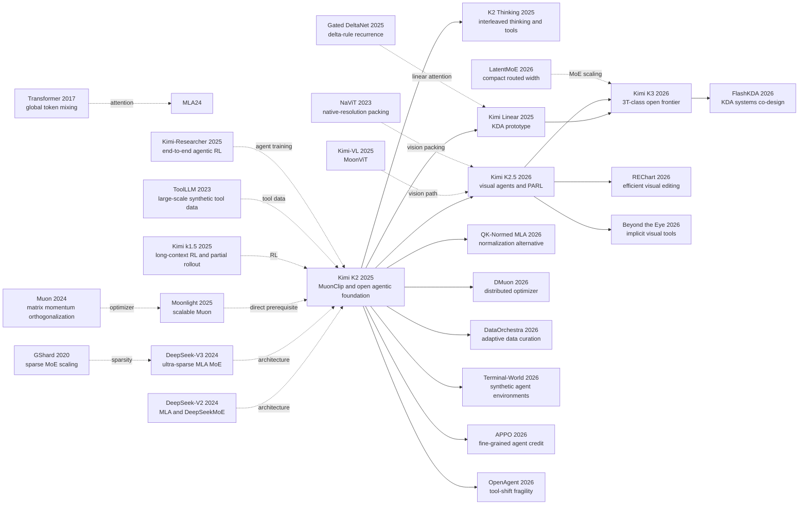

# The Kimi K2 Family: From Open Agentic Intelligence to a 3T-Class Frontier Model

> **On July 28, 2025, when Moonshot submitted [Kimi K2](https://arxiv.org/abs/2507.20534) to arXiv, the official launch page stated plainly that K2 did not support vision.** That single sentence is the cleanest way to read the entire family. K2 first narrows the problem to one hard question: how do you stably pretrain an open-weight 1T-class model that can actually use tools in real environments? Seven months later K2.5 adds vision and learned parallel sub-agents without replacing the K2 language backbone. Five months after that, K3 abandons the old all-MLA foundation altogether and moves to a new 2.78T / 104.2B, 1M-context architecture. The story is therefore not that Moonshot secretly had a complete frontier stack in 2025. The story is that it redefined the bottleneck three times in one year: first optimizer and attention stability, then multimodal and orchestration training, then long-state architecture and systems recovery. **What makes the K2 family historically interesting is not one leaderboard row, but how explicitly the reports show which frontier capabilities were inherited, which were replaced, and which were still undisclosed.**

## TL;DR

The Kimi Team's 2025-2026 arXiv report family, centered on K2, delivers much more than “another 1T MoE.” K2 first solves the foundation problem: use per-head QK-Clip to keep attention heads with large $S_{\max}^h=\max(QK^\top/\sqrt d)$ under control, fixing the failure mode where vanilla Muon on a 53B / 9B-activated MoE could drive maximum logits above 1000, and thereby stabilizing a 1.04T / 32.6B MLA MoE across 15.5T pre-training tokens. On top of that base, Moonshot combines 3,000+ real MCP tools, 20,000+ synthetic tools, executable sandboxes, and joint RL to push an open-weight model to 65.8 on SWE-bench Verified and 66.1 on Tau2-Bench. In historical terms, K2 inherits the sparse-MLA MoE operating point of [DeepSeek-V3](2024_deepseek_v3.md) while extending the environment-feedback logic that became unavoidable after [DeepSeek-R1](2025_deepseek_r1.md).

The family becomes historically important because the next two generations refuse to hide what K2 still lacked. K2.5 keeps the K2 1T / 32B MLA language backbone but raises BrowseComp from 60.6 to 78.4 and WideSearch item-F1 from 72.7 to 79.0, showing that visual agents and learned parallel orchestration are new post-K2 capabilities rather than latent K2 features. K3 then replaces the entire foundation with a 2.78T / 104.2B architecture built from 69 KDA layers and 24 Gated MLA layers, while still stating openly that it remains behind Claude Fable 5 and GPT-5.6 Sol overall. The hidden lesson is the real one: **the K2 family's strongest design choice is not a single module, but the discipline to keep K2, K2.5, and K3 on an accurate timeline instead of backfilling native vision, KDA, or undisclosed training details into the 2025 model.**

---

## Historical Context

### What was the open-model community stuck on in 2025?

By early 2025, the hard part of open-weight language models was no longer simply making the parameter count larger. DeepSeek-R1 had made reinforcement learning with verifiable rewards visible in January, while Moonshot's [Kimi k1.5](https://arxiv.org/abs/2501.12599) showed that long context, multimodal problems, and a relatively simple policy objective could support reasoning at scale. The unresolved step was action in an environment rather than longer deliberation over a self-contained math problem. Natural corpora contain few successful tool trajectories; live APIs fail, cost money, and create privacy problems; software tasks need sandboxes with executable tests. A model that answers questions and an agent that plans, calls tools, reads feedback, and repairs its actions were still separated by three bottlenecks: data, rewards, and systems.

Pre-training had reached a second wall. AdamW came with a mature large-scale recipe, but it did not necessarily extract the most learning signal from each token. Muon appeared more token-efficient at small and medium scales, yet scaling it made exploding attention logits more frequent. In a trillion-parameter MoE run, a loss spike is not a cosmetic blemish on a plot; it can force an expensive rollback. Enlarging the expert pool also adds capacity at similar activated compute, but turns routing, all-to-all traffic, and load balance into first-order systems problems. This is K2's historical position. It did not begin by inventing a new visible "thinking" interface. It built a strong, stable, open-weight foundation on which agentic post-training could explore.

The third bottleneck was context. Repositories, web research, and repeated tool feedback are naturally longer than chat. K2's 128K window already forced a trade between attention-head count and long-sequence FLOPs; K2 Thinking and K2.5 later reached 256K. But extrapolating RoPE farther does not make a task lasting hours and hundreds of tool calls reliable. In 2026 the question became not merely "how many tokens fit?" but "how can the model, its cache, and the external environment remain alive together?" K3's one-million-token window, hybrid linear attention, and resumable sandboxes answer that systems question. They are not hidden capabilities that K2 already possessed in 2025.

### Four predecessor threads that forced K2 into existence

The first thread is the MLA plus sparse-MoE line established by [DeepSeek-V2](https://arxiv.org/abs/2405.04434) and [DeepSeek-V3](https://arxiv.org/abs/2412.19437). MLA compresses each token's key-value representation into a latent vector and cuts long-context cache cost; DeepSeek-V3 supplied a practical 671B-total, 37B-active reference point. K2 is explicit about this inheritance. It keeps MLA and the shared/routed-expert organization, but raises the routed-expert count from 256 to 384 and cuts attention heads from 128 to 64, choosing a different point between sparse capacity and inference cost.

The second thread is Moonshot's own [Moonlight / scalable-Muon study](https://arxiv.org/abs/2502.16982). That work moved Muon from small experiments to a 16B-total, 3B-active MoE and reported a compute-efficiency advantage over AdamW. K2's exploding logits showed why "more efficient optimizer" did not mean "ready for a 1T run." QK-Clip in MuonClip was therefore not branding garnish; it was the missing fuse between a medium-scale result and a complete pre-training run.

The third thread is automatic tool-data construction. [ToolLLM](https://arxiv.org/abs/2307.16789) generated tool paths from 16,464 real APIs in 2023, while [Self-Instruct](https://arxiv.org/abs/2212.10560), [AgentInstruct](https://arxiv.org/abs/2407.03502), and [AutoIF](https://arxiv.org/abs/2406.13542) progressively moved model-teaches-model pipelines toward complex instructions and execution-based checking. K2 connected these ideas into a production pipeline: real MCP specifications, synthetic tools, generated agents and tasks, stateful simulation, rubric filtering, and real code sandboxes where simulation fidelity mattered.

The fourth thread is Moonshot's continuous RL program. [Kimi k1.5](https://arxiv.org/abs/2501.12599) provided long-chain policy optimization and partial rollouts without a value network or MCTS. [Kimi-Researcher](https://moonshotai.github.io/Kimi-Researcher/), released on June 20, 2025, then placed strict on-policy, end-to-end RL inside search, browsing, and coding environments. K2 widened the target beyond verifiable problems: tasks with objective checks entered a Gym, while writing and open-ended QA used self-critique rubric rewards. That extension also planted a risk. If the critic rewards singular confidence, the policy can lose warranted qualification, a failure mode that K2's own rubric appendix acknowledges.

### What was Moonshot building at the time?

K2 was not an isolated release. During the first half of 2025, Moonshot was advancing Kimi-VL, Kimi k1.5, and Kimi-Researcher in parallel: one line studied visual encoding, one scaled RL, and one put a model into real search and tool loops. The K2 report submitted on July 28 joined two of those threads in an open foundation: token efficiency and stability in pre-training, tool data and general RL in post-training. The official launch page explicitly said that vision was not yet supported and listed thinking and visual understanding as future additions. That sentence is a guardrail for the family history. K2's central contribution is a text-agent foundation; later K2.5 and K3 vision cannot be projected backward into it.

Over the following months, K2 Thinking added long reasoning, interleaved thinking and tool calls, a 256K context, and native INT4 post-training to the same 1T/32B MLA backbone. It demonstrated 200-300 consecutive tool invocations without rewriting the pre-training architecture. [Kimi Linear](https://arxiv.org/abs/2510.26692), submitted on October 30, 2025, was the first public Kimi record of Kimi Delta Attention, a linear-attention module extending Gated DeltaNet with fine-grained forgetting. This is another necessary guardrail: KDA was an architecture experiment on the path to K3, not a component of K2 or K2.5.

### From K2 to K3: three changes in the question within one year

K2's July 2025 question was: **How do you stably pre-train an open 1T sparse foundation and make it use tools reliably without extended thinking?** Its answer was a 1.04T/32.6B MLA MoE, 15.5T tokens, MuonClip, and a data/RL pipeline backed by more than 3,000 real MCP tools and more than 20,000 synthetic tools. It reached 65.8 on SWE-bench Verified and 66.1 on Tau2-Bench in non-thinking settings, but its report also admitted over-generation under ambiguous tool definitions and regressions when tools were enabled unnecessarily.

K2.5 changed the question in February 2026: **Can text and vision be optimized together from pre-training through RL, and can a sequential agent become a learned parallel orchestrator?** It did not replace K2's language backbone. It continued a near-final K2 checkpoint over approximately 15T mixed visual-text tokens and attached MoonViT-3D. Two results were counter-intuitive: an early, low-ratio stream of visual tokens beat a late vision-heavy injection under fixed token budgets, and text-only SFT activated visual tool behavior better than hand-designed visual trajectories after joint pre-training. PARL froze subagents, trained only the orchestrator, and made the decision to parallelize a policy rather than a hard-coded workflow.

K3 changed the question again in July 2026: **If an open model must scale pre-training, test-time compute, and task duration together, is the old 1T full-MLA foundation still enough?** Moonshot's answer was no. K3 moved to 2.78T/104.2B and 93 layers, with 69 KDA layers, 24 Gated MLA layers, AttnRes, Stable LatentMoE, a from-scratch MoonViT-V2, and a one-million-token context. Post-training crossed three domains with three effort levels to produce nine expert policies, then merged them through multi-teacher on-policy distillation. This was an architecture-and-systems transition, not simply "more training for K2."

## Background and Motivation

### Three scarce resources: useful tokens, trustworthy feedback, and durable state

The family can be read as a response to three scarce resources. K2 first addresses **useful tokens**. If human text grows more slowly than compute, use Muon to improve optimization per token, verified rephrasing to create diverse presentations of the same knowledge, and QK-Clip to prevent efficiency from becoming instability. The objective was not the lowest total parameter count. It was more expert capacity at similar activated compute: 384 routed experts with only eight selected let 32.6B active parameters draw from a 1.04T parameter store on each step.

K2 and K2.5 next address **trustworthy feedback**. An agent sample is not a prompt-answer pair but a trajectory of observation, action, state transition, and new observation. Simulation scales but can teach simulator exploits; real execution is authentic but costly and hard to reproduce. K2 uses simulation for coverage, code sandboxes for ground truth, and joins verifiable rewards with self-critique rubrics. K2.5 adds task-specific visual rewards such as IoU, point matching, edit distance, and count error. For parallel agents it separates final success, subagent instantiation, and subtask completion, then anneals away the auxiliary terms.

K3 finally addresses **durable state**. A million-token interface is not enough when one RL rollout crosses training iterations and the files, processes, and application state inside its sandbox must survive. Partial rollouts, an external cache pool, adaptive concurrency, and pausable microVMs restore model state and world state together. Architecturally, KDA carries most long-sequence mixing in a fixed recurrent state, periodic Gated MLA preserves unrestricted global interaction, and AttnRes lets depth-wise modules retrieve older representations selectively. The three mechanisms serve one aim: keep a long task from terminating when any one of tokens, feedback, or state runs out.

### Why these three generations should be read as one family

Reading only K2 makes it look like another 1T MoE. Reading only K2.5 hides the approximately 15T joint pre-training on which zero-vision SFT depends. Reading only K3 invites the opposite error: projecting KDA, AttnRes, and native vision backward into 2025. Reading the three together makes inheritance and replacement visible. K2's Muon/QK stabilization, data rephrasing, and environment-based RL survive. K2.5's joint visual training, vision-in-the-loop tool use, and learned parallel orchestration are absorbed. K3 replaces the all-MLA backbone, raises activated compute, and rebuilds the infrastructure for long-lived state.

The family view also disciplines the word "open." Releasing 1T and then 2.8T weights transfers real capability: outside teams can inspect, quantize, fine-tune, and self-host a frontier-family model. It does not publish a complete data manifest, every filter, reward model, RL environment, or training cluster. Reproduction is not equivalent to downloading weights. K2 and K2.5 use Modified MIT licenses, while K3's custom license adds attribution and qualifying Model-as-a-Service terms. This note therefore uses the more exact family-wide term **open-weight**: it recognizes the scientific importance relative to a closed API without pretending that the entire data-to-training process is reproducible.

---

## Method Deep Dive

### Overall framework: not one upgrade, but three changing bottlenecks

The continuity of the Kimi K2 family does not come from three generations sharing one immutable module set. Each generation pushes the bottleneck for agency farther down the stack. K2 first solves the foundation problem: carry 1.04T parameters in a sparse MLA MoE, stabilize 15.5T-token pre-training with MuonClip, then turn the text model into a non-thinking actor through synthetic tool trajectories and joint RL. K2.5 retains that language backbone, attaches MoonViT-3D through approximately 15T mixed visual-text continual pre-training, and extends sequential single-agent execution into a learned Agent Swarm. K3 stops treating the K2 backbone as fixed ground. It redesigns information flow across tokens, depth, and experts while scaling model size, native vision, and context to one million tokens.

The following diagram is identical in both language versions. The **keep** and **replace** labels are the crucial attribution boundary:

```text
K2 (2025)
  15.5T text tokens -> 1.04T / 32.6B MoE -> MLA + MuonClip
       -> agentic SFT (real MCP + synthetic tools + sandboxes)
       -> joint RL (verifiable rewards + self-critique rubrics)
                         |
                         | keep K2 language backbone
                         v
K2.5 (2026-02)
  near-end K2 checkpoint + MoonViT-3D -> ~15T mixed vision-text continuation
       -> zero-vision SFT -> joint text-vision RL
       -> PARL orchestrator + frozen subagents -> Agent Swarm
                         |
                         | inherit recipes, replace foundation architecture
                         v
K3 (2026-07)
  from-scratch native multimodal pre-training -> 2.78T / 104.2B MoE
       -> 69 KDA + 24 Gated MLA + AttnRes + Stable LatentMoE
       -> 8K -> 64K -> 256K -> 1M context curriculum
       -> 3 domains x 3 effort levels -> 9 RL teachers -> MOPD unified model
```

| Generation | Total / active params | Token mixing | Vision path | Released context | Agentic training |
|---|---:|---|---|---:|---|
| K2 | 1.04T / 32.6B | 61 MLA layers | None | 128K | Synthetic tool SFT + joint RL |
| K2 Thinking | 1.04T / 32B | Inherited MLA | None | 256K | Interleaved thinking and tools |
| K2.5 | ~1T / 32B + 0.4B ViT | Inherited MLA | SigLIP-initialized MoonViT-3D | 256K | Joint multimodal RL + PARL |
| K3 | 2.78T / 104.2B | 69 KDA + 24 Gated MLA | From-scratch MoonViT-V2 | 1,048,576 | Multi-effort RL + MOPD |

**The easiest mistake is to treat the family name as a single architecture name.** The "2.5" release is primarily a multimodal continual-training and post-training extension; its language model is still K2's MLA backbone. KDA, AttnRes, and Stable LatentMoE enter a released family model only with K3. Conversely, K3 changes the backbone but retains ideas that began with K2, including Muon/QK stabilization, data rephrasing, and environment-based RL, while absorbing K2.5's vision-in-the-loop tasks and parallel-agent behavior.

### Design 1: K2's ultra-sparse MLA MoE and MuonClip

**Function.** K2 needs the capacity of 1.04T parameters while computing with roughly 32.6B active parameters per token, and it needs the more token-efficient Muon optimizer to survive at that scale without attention-logit explosions. The model has 61 layers, width 7168, 384 routed experts, and one shared expert; each token selects eight routed experts, for sparsity 48. Attention uses MLA, compressing the full key-value representation of each token into a latent state. The choice of 64 attention heads is not arbitrary downsizing. K2 reports that moving from 64 to 128 heads at 128K sequence length raises inference FLOPs by 83%, while controlled validation-loss gains remain only about 0.5%-1.2%.

**Core idea.** Muon applies Newton-Schulz orthogonalization to matrix momentum. Its update has higher effective rank than an AdamW update, but that also makes growth in the spectral norms of query and key matrices more likely. Attention logits multiply the two projections, compounding that growth. For head $h$, K2 observes the maximum logit in the current batch and computes a per-head scale after the Muon update:

$$
S_{\max}^{h}=\frac{1}{\sqrt d}\max_{X\in B}\max_{i,j}Q_i^h(K_j^h)^\top,
\qquad
\gamma_h=\min\left(1,\frac{\tau}{S_{\max}^{h}}\right),
\qquad \tau=100.
$$

It then multiplies the query and key projections by $\gamma_h^\alpha$ and $\gamma_h^{1-\alpha}$, respectively, with $\alpha=0.5$ by default. This does not change the current forward or backward pass; it constrains the weights used on the next step. Under MLA, K2 scales only the unshared $q_C$, $k_C$, and $q_R$ components and leaves the cross-head shared $k_R$ untouched, so one unstable head does not perturb all heads.

```python
def qk_clip_after_muon_step(q_weight, k_weight, max_logits,
                            threshold=100.0, balance=0.5):
    """Simplified per-head QK-Clip; applied after the optimizer update."""
    gamma = torch.minimum(
        torch.ones_like(max_logits),
        threshold / max_logits.clamp_min(1e-12),
    )
    q_weight.mul_(gamma.pow(balance).view(-1, 1, 1))
    k_weight.mul_(gamma.pow(1.0 - balance).view(-1, 1, 1))
```

| Stabilizer | Controls | Compatible with latent KV caching? | K2 finding |
|---|---|---|---|
| Logit soft-cap | Softmax input after QK product | Yes | Product can still grow before cap |
| Standard QK-Norm | Materialized Q and K | Not directly in K2's MLA path | Rejected for this implementation |
| Global QK-Clip | All heads from one maximum | Yes | Over-regularizes unaffected heads |
| Per-head QK-Clip | Q/K projection weights per head | Yes | Minimal intervention used in K2 |

**Rationale and boundary.** QK-Clip does not permanently pin logits to 100. Appendix D reports that 12.7% of heads trigger it at least once during the first 70,000 steps; after that point every head has fallen below the threshold and clipping becomes inactive. A small-scale ablation with the more aggressive $\tau=30$ finds no measurable downstream degradation. It behaves as an early-training guardrail, not a permanent regularizer. Yet the 2026 QK-Normed MLA follow-up gives an exact QK-normalization path without caching full keys and beats clipping in its small-model experiments. MuonClip was a scalable answer available to K2, not the final word on attention stability.

### Design 2: K2's agentic data factory and joint reinforcement learning

**Function.** Pre-training can teach a model to read a tool description, but natural corpora rarely contain trajectories demonstrating when to call it, how to recover from failure, and when to stop. K2 turns tool learning into a scalable factory. It fetches more than 3,000 real MCP tools from GitHub and evolves more than 20,000 synthetic tools across a domain hierarchy. It then generates agents with different system prompts, tool-matched tasks, and explicit rubrics. User simulators create multi-turn requests; a stateful tool simulator returns successes, partial failures, and edge cases; an LLM judge retains only rubric-satisfying trajectories. For code and software engineering, real Kubernetes sandboxes and unit tests provide authenticity that simulation cannot.

The report does not disclose the final number of retained SFT trajectories, so "20,000 tools" must not become "20,000 training examples." The point is combinatorial coverage. A tool appears under different agents, tasks, user styles, and environment states, pushing the model to learn interface semantics instead of one fixed workflow. Declarations are primarily expressed in TypeScript to save context, with some JSON retained for framework compatibility. A decoding enforcer guarantees syntax after a tool-call start token; it does not prove that the model selected the right tool.

**From verifiable to open-ended tasks.** K2's RL Gym spans mathematics, STEM, logic, complex instruction following, grounded faithfulness, competitive programming, GitHub issues, and safety. Tasks with executable checks use rules, tests, or final environment state. Open-ended writing and QA use a K2 critic that compares candidates under core, prescriptive, and human-authored rubrics. Verifiable on-policy rollouts also update the critic, keeping its judgment closer to the changing actor rather than freezing it on an old distribution.

For prompt $x$, K2 samples $K$ outputs $y_i$ and inherits K1.5's relative-reward objective. The following preserves the report's essential structure: reward is centered by the group mean and a log-ratio to the old policy defines a stable neighborhood.

$$
\mathcal L_{\mathrm{RL}}(\theta)=
\mathbb E_{x\sim\mathcal D}\left[
\frac{1}{K}\sum_{i=1}^{K}
\left(r(x,y_i)-\bar r(x)-
\tau\log\frac{\pi_\theta(y_i\mid x)}{\pi_{\mathrm{old}}(y_i\mid x)}\right)^2
\right],
\quad
\bar r(x)=\frac1K\sum_i r(x,y_i).
$$

```python
def k2_agentic_training_round(tool_repo, actor, critic, environments):
    agents = synthesize_agents(tool_repo)
    tasks = generate_tasks_with_rubrics(agents)
    demonstrations = []
    for task in tasks:
        env = environments.pick(task)
        trajectory = rollout(actor, task, env)
        if critic.meets_rubric(trajectory, task.rubric):
            demonstrations.append(trajectory)
    actor.supervised_finetune(demonstrations)
    actor.reinforcement_learn(
        verifiable_envs=environments.verifiable,
        open_ended_reward=critic.pairwise_rubric_reward,
    )
```

| Signal | Example domains | Evaluator | Main failure controlled |
|---|---|---|---|
| Deterministic outcome | Math, logic, format constraints | Rules / interpreters | Ambiguous learned reward |
| Executable outcome | Code, SWE, tool environments | Tests / final state | Plausible but non-working output |
| Faithfulness reward | Grounded long-form answers | Sentence-level judge | Unsupported claims |
| Self-critique rubric | Writing, open QA, assistance | K2 critic comparisons | No single ground-truth answer |
| Budget penalty | All RL domains | Task-dependent token cap | Correct but wasteful over-generation |

**Rationale and boundary.** Verifiable rewards alone trap training in math and code; a learned critic alone invites reward hacking. K2 tries to ground soft feedback in hard feedback, uses an auxiliary PTX loss to retain hand-selected high-quality data, and decays temperature from exploration toward reliable generation. The critic still carries value bias. The report's rubric appendix admits that rules against self-qualification and for clear singular answers can punish appropriate uncertainty. K2's agency should therefore be read as systematic training over its tool and rubric distributions, not reliable autonomy in every novel environment.

### Design 3: K2.5 joint visual training, zero-vision SFT, and visual RL

**Function.** K2.5 does not attach vision as a final adapter. It continues a near-final K2 checkpoint through large-scale joint training. The language backbone remains K2's 61-layer MLA MoE; the new path consists of MoonViT-3D, an MLP projector, and the existing language model. MoonViT-3D starts from SigLIP-SO-400M and uses NaViT packing for original aspect ratios and variable resolutions. Video does not get a separate encoder: up to four consecutive frames form a spatiotemporal volume, image and video parameters are shared, and temporal pooling before the projector compresses visual tokens by $4\times$.

**Training order.** Table 3 must be read together with which component is trainable. The ViT stage consumes about 1T tokens, first aligning the visual tower to Moonlight-16B-A3B and then briefly training only the projector. Joint pre-training starts from a near-end K2 checkpoint and processes about 15T mixed tokens while updating the ViT and 1T language model. Long-context mid-training uses another 500B and 200B tokens at 32K and 262,144 sequence lengths. The prose summarizes the continuation as "approximately 15T mixed visual and text tokens." Because stages update different components and the headline is rounded, it would be false precision to add them and claim exactly 16.7T new language-backbone tokens.

Under a fixed total visual-plus-text token budget, K2.5's ablation rejects the common intuition that vision should arrive late at a high ratio:

| Injection | Vision:text ratio | Vision knowledge | Vision reasoning | OCR | Text knowledge | Text reasoning | Code |
|---|---:|---:|---:|---:|---:|---:|---:|
| Early | 10:90 | 25.8 | 43.8 | 65.7 | 45.5 | 58.5 | 24.8 |
| Mid | 20:80 | 25.0 | 40.7 | 64.1 | 43.9 | 58.6 | 24.0 |
| Late | 50:50 | 24.2 | 39.0 | 61.5 | 43.1 | 57.8 | 24.0 |

**Zero-vision SFT.** The name is easy to misread. It does not mean the model has never seen an image. It means that after extensive joint pre-training, this SFT stage uses only high-quality text trajectories. IPython operations in text teach the model to turn perceptual questions into programmatic actions; cross-modal representations learned during pre-training transfer these actions to localization, counting, OCR, and chart tasks. In the authors' preliminary experiments, hand-designed visual CoT and simple crop/rotate/flip trajectories constrained generalization, and text-vision SFT did worse than text-only SFT. Outcome-based visual RL then forces the model to use visual evidence on tasks that cannot be solved without it.

```python
def k25_post_training(joint_pretrained_model, text_trajectories, visual_envs):
    # "Zero-vision" applies only to SFT, not to pre-training or RL.
    model = sft(joint_pretrained_model, text_trajectories)
    visual_rollouts = rollout_with_images_and_python(model, visual_envs)
    rewards = {
        "grounding": soft_iou_or_point_f1(visual_rollouts),
        "segmentation": mask_iou(visual_rollouts),
        "ocr": normalized_edit_distance(visual_rollouts),
        "counting": absolute_count_error(visual_rollouts),
    }
    return joint_text_vision_rl(model, rewards)
```

After visual RL, the paper reports MMLU-Pro moving from 84.7 to 86.4, GPQA-Diamond from 84.3 to 86.4, and LongBench v2 from 56.7 to 58.9. These measurements support a local conclusion that visual optimization did not inevitably erode text performance in this setup; they do not prove positive transfer for arbitrary visual data or mixing weights. K2.5's deeper change is removing modality boundaries from RL organization. Experts are grouped by capability, such as knowledge, reasoning, coding, and agency, and receive both text-only and multimodal prompts; the GRM also evaluates across modalities.

### Design 4: PARL trains only the orchestrator to avoid multi-agent credit chaos

**Function.** A single agent serializes every search, download, reading pass, and synthesis step. As task breadth grows, wall-clock latency and global context grow almost linearly. K2.5 gives the main agent `create_subagent` and `assign_task`, letting it dynamically instantiate executors with different system prompts and run decomposable subproblems concurrently. The important change is not merely having multiple agents. **The parallelization policy itself is learned by RL.** Training prompts do not explicitly demand parallelism; they are selected so that wide search, deep search, hundred-document reading, and bulk downloading are hard to finish sequentially under fixed step budgets.

Updating every agent end to end looks more complete, but sparse terminal rewards make credit ambiguous. A correct final answer does not imply every subtrajectory was correct, and a failure does not make every worker wrong. PARL freezes subagents from fixed intermediate checkpoints, treats their outputs as environment observations, and updates only the orchestrator. Its reward has three terms:

$$
r_{\mathrm{PARL}}(x,y)=
\lambda_1 r_{\mathrm{parallel}}+
\lambda_2 r_{\mathrm{finish}}+
r_{\mathrm{perf}}(x,y),
\qquad \lambda_1,\lambda_2\rightarrow 0.
$$

$r_{\mathrm{parallel}}$ prevents serial collapse, where the orchestrator always works alone. $r_{\mathrm{finish}}$ prevents meaningless fan-out that farms a parallelism metric without completing useful subtasks. Both coefficients anneal to zero, leaving final task quality as the ultimate objective. The latency-oriented measure is not total tool calls but main-agent work plus the longest branch at each stage:

$$
\mathrm{CriticalSteps}=\sum_{t=1}^{T}
\left(S_{\mathrm{main}}(t)+\max_i S_{\mathrm{sub},i}(t)\right).
$$

```python
def parl_episode(orchestrator, frozen_subagents, task):
    plan = orchestrator.decompose(task)
    observations = parallel_map(
        lambda item: frozen_subagents[item.role].run(item.prompt),
        plan.subtasks,
    )
    answer = orchestrator.aggregate(task, observations)
    reward = task.score(answer)
    reward += parallel_bonus(plan) + completion_bonus(observations)
    update(orchestrator, reward)   # Subagent parameters stay frozen.
```

| Strategy | Trainable component | Credit assignment | Context behavior | Main risk |
|---|---|---|---|---|
| Single agent | One policy | Direct but long-horizon | One growing history | Serial latency |
| Static workflow | Usually none | Hand-designed | Fixed partitions | Brittle roles |
| End-to-end multi-agent RL | All agents | Ambiguous terminal credit | Many coupled histories | Instability |
| K2.5 PARL | Orchestrator only | Outcome assigned to coordination policy | Isolated subagent contexts | Frozen worker ceiling |

**Results and cost.** In Table 6, Agent Swarm raises BrowseComp from 60.6 to 78.4, WideSearch item-F1 from 72.7 to 79.0, and the internal Swarm Bench from 41.6 to 58.3. On WideSearch, time to reach different target F1 levels falls by $3\times$-$4.5\times$. The official blog demonstrates up to 100 subagents and 1,500 calls, but those are research-preview capacity claims rather than the table's protocol. Parallelism is not free: total tokens and tool cost may rise, the slowest branch still sets the critical path, and frozen executors cannot be repaired through the orchestrator's gradient.

### Design 5: K3 uses KDA plus Gated MLA for sequence flow and AttnRes for depth

**Function.** Even MLA's compressed KV cache grows with sequence length, making one-million-token training, prefill, and repeated restoration expensive. K3 arranges its 93 attention layers as 69 KDA and 24 Gated MLA layers, generally repeating three KDA layers followed by one global MLA layer and guaranteeing global attention at the end. KDA carries most token mixing in a fixed-size recurrent state; periodic MLA restores unrestricted content interaction. Every MLA layer uses NoPE. Position and recency come from KDA's recurrent decay, so extension to one million tokens does not require retuning a RoPE base or applying YaRN again.

KDA inherits Kimi Linear's delta-rule memory. For one head, state $S_t$ first forgets old channels, then erases the old association in the key direction and writes the new value:

$$
S_t=(I-\beta_t k_tk_t^\top)\operatorname{Diag}(\alpha_t)S_{t-1}
+\beta_t k_tv_t^\top,
\qquad \tilde o_t=S_t^\top q_t.
$$

K3's contribution relative to Kimi Linear is not inventing the delta rule but making it suitable for a much larger model. The original negative-Softplus decay can make reciprocal scaling overflow inside a chunk. K3 uses a scaled sigmoid bounded below by $g_{\min}=-5$:

$$
g_t^h=g_{\min}\operatorname{Sigmoid}(e^{A_h}z_t^h),
\qquad
\alpha_t^h=\exp(g_t^h)\in(e^{-5},1).
$$

The accumulated log-decay of a 16-token tile then lies in $(-80,0)$, keeping the reciprocal inside BF16 range and allowing every tile to use dense Tensor Core matrix multiplication. K3 also replaces Kimi Linear's low-rank output gate with a full-rank, input-dependent gate. Gated MLA uses the same style of gate to select channels from global-attention output.

**The depth axis.** A standard residual stream compresses every preceding layer into one running sum, behaving like a recurrent bottleneck over depth. AttnRes gives each layer a learned pseudo-query, computes softmax weights over the embedding and previous layer or block outputs, and forms its input selectively:

$$
a_{i\rightarrow l}=
\frac{\exp(w_l^\top\operatorname{RMSNorm}(v_i))}
{\sum_{j=0}^{l-1}\exp(w_l^\top\operatorname{RMSNorm}(v_j))},
\qquad
h_l=\sum_{i=0}^{l-1}a_{i\rightarrow l}v_i.
$$

The full form retains every layer representation. K3 uses Block AttnRes, dividing 93 layers into eight 12-layer blocks plus a partial block. It accumulates within a block and attends only to block summaries across blocks, reducing storage and communication from $O(Ld)$ to $O(Nd)$. The division of labor is clean: KDA answers how a token reads a long sequence; AttnRes answers how a layer reads network history. Both are called attention, but they operate on different axes.

### Design 6: K3's Stable LatentMoE, native vision, and Per-Head Muon

**Function.** K3 expands to 896 routed experts, selects 16 per token, and raises activated parameters to 104.2B. Sending a full 7168-wide token to every selected expert would make communication and weight bandwidth grow rapidly with routing multiplicity. LatentMoE first reduces the routed branch to width 3584. Two shared experts retain a full-width path for common transformations, specialized experts work in the half-width latent space, and an up-projection returns the mixture to the backbone:

$$
u=\sum_{i\in\mathcal T_k(x)}p_iE_i^{\mathrm{routed}}(W_\downarrow x),
\qquad
y=\sum_{j=1}^{2}E_j^{\mathrm{shared}}(x)+
W_\uparrow\operatorname{RMSNorm}(u).
$$

Extreme sparsity amplifies two failure modes. Several consecutive matrix products produce exploding activations inside the latent branch, while fixed-step bias updates oscillate or leave dying experts when the pool approaches one thousand. Stable LatentMoE inserts RMSNorm and replaces SwiGLU with SiTU-GLU, which smoothly caps both the gate and up branches:

$$
\operatorname{SiTU\!\!\!-GLU}(x)=
\left[\beta_1\tanh\left(\frac{W_gx}{\beta_1}\right)
\odot\sigma(W_gx)\right]
\odot
\left[\beta_2\tanh\left(\frac{W_ux}{\beta_2}\right)\right],
\quad \beta_1=4,\ \beta_2=25.
$$

Each output coordinate is therefore bounded by 100. Quantile Balancing replaces a hand-tuned, incremental router-bias update with a quantile estimated from whole-batch margin histograms, choosing the bias that meets each expert's target load; the final bias is frozen at inference. MoonEP works at the physical execution layer, dynamically placing redundant experts so every EP rank receives the same token load. QB controls semantic routing and MoonEP balances hardware execution. They are not one algorithm.

**What native vision means.** K3 no longer initializes its visual tower from SigLIP. It trains the 27-layer, 401M-parameter MoonViT-V2 from scratch under the same next-token objective as text. It retains K2.5's shared image/video parameters and factorized spatial-temporal processing, but uses RMSNorm, bias-free projections, and a $2\times2$ pixel shuffle. The shuffle quarters the visual-token count, keeping inputs up to $3584\times3584$ affordable inside the one-million-token context. In the reported ablation, the from-scratch tower matches the SigLIP-initialized baseline on vision evaluations while showing lower gradient norms and fewer spikes. "Native" means co-optimization from the start, not that raw pixels bypass a separate ViT.

Muon evolves as well. For Q/K/V projections, K3 no longer orthogonalizes all heads as one matrix. It partitions momentum by head and applies Newton-Schulz to each block, preventing high-scale heads from dominating a shared update and normalizing smaller heads adequately. It still uses K2's weight-clipping mechanism, but **Per-Head Muon is a K3 change** and must not be written backward into K2's recipe.

### Training recipes and inheritance: what survives and what is replaced

| Component | K2 | K2.5 | K3 | Family interpretation |
|---|---|---|---|---|
| Base initialization | From scratch | Near-end K2 checkpoint | From scratch | K2.5 is continuation; K3 is a new foundation |
| Pre-training volume | 15.5T disclosed | ~15T mixed continuation; staged accounting | Total not disclosed | Never transfer token totals across generations |
| Optimizer | MuonClip | Inherited MuonClip recipe | Per-Head Muon + K2 clipping | Stability idea persists; implementation changes |
| Attention | Full MLA + YaRN | Full MLA + YaRN | 3:1 KDA / Gated MLA + NoPE | KDA begins only with K3 release architecture |
| Vision | None | SigLIP-initialized MoonViT-3D | From-scratch MoonViT-V2 | Native multimodality deepens across generations |
| Agent structure | Single policy and environments | Orchestrator + frozen subagents | General/coding/knowledge-work agents | Parallel orchestration appears in K2.5 |
| RL consolidation | Joint multi-domain RL | Joint multimodal RL + PARL | 9 teachers merged by MOPD | Specialize, then reunify |
| Deployment precision | Block FP8 checkpoint | Native INT4 path | MXFP4 experts / MXFP8 activations | Quantization moves into post-training |

K2's central optimization idea is relative reward inside a policy neighborhood. K2.5 extends it with token-level off-policy clipping, visual rewards, and PARL. K3 lets partial rollouts persist across iterations and uses multi-teacher on-policy distillation to combine nine policies. K3 also applies MXFP4/MXFP8 quantization-aware training from SFT onward, matching rollout and training precision to reduce train-inference mismatch. A pre-trained MTP layer is fine-tuned into an EAGLE-3-style draft model for long-generation throughput.

The stable method across the family is therefore not one module but an engineering rule: **identify the first quantity that destabilizes when scaling, then give it a measurable controller that can anneal, freeze, or deactivate.** K2 controls logits, tool-trajectory quality, and generation budgets. K2.5 controls modality conflict, serial collapse, and spurious parallelism. K3 controls recurrent decay, the depth bottleneck, latent-expert activations, router load, and cross-iteration state. Larger models are the outcome; controlling the newly exposed failure surface is the common method.

---

## Failed Baselines

### K2 first defeated four scaling shortcuts, not one rival model

The most informative "failed baselines" in the K2 report do not all appear on a leaderboard. The first shortcut was **scaling vanilla Muon directly**. On a 53B-total, 9B-active MoE, the team observed maximum attention logits quickly exceeding 1,000, accompanied by loss spikes and occasional divergence; AdamW showed the problem less often. Muon's token advantage in Moonlight did not imply that it could cross another two orders of magnitude unchanged. MuonClip matters because this scaling attempt failed, not because a safety layer was casually added after K2 already trained successfully.

The second shortcut was **soft-capping the input to softmax**. It limits the final value seen by softmax while allowing $QK^\top$ to keep growing inside the projections, so the underlying condition can accumulate. Standard QK-Norm appeared to require materialized keys, whereas K2's MLA decode path cached only a latent state; the authors treated it as incompatible with their implementation and instead rescaled projection weights per head after updates. The 2026 QK-Normed MLA follow-up showed that this incompatibility was not a mathematical necessity. That result correctly narrows K2's argument to a feasible choice in its system, not an eternal rejection of normalization.

The third shortcut was **buying a small loss reduction with more attention heads**. K2 compared 64 and 128 heads. The larger setting reduced validation loss by only about 0.5%-1.2% across training budgets but raised inference FLOPs by 83% at 128K. It may still look attractive on short static benchmarks; an agent repeatedly prefilling tool history pays the cost every turn. K2 deliberately chose the apparently narrower 64-head design, accepting a slightly worse training loss for a better long-context deployment point.

The fourth shortcut was **using only real environments or only simulated ones**. Real tools are costly, private, unstable, and difficult to construct at scale. Simulation is cheap but can return unrealistic feedback. K2 uses simulation for breadth, real code sandboxes for critical ground truth, and rubric-based rejection sampling across both. It does not eliminate the sim-to-real gap; it refuses a false choice between two imperfect sources.

### Experiments the reports explicitly abandoned or limitations they admitted

K2's infrastructure section is unusually direct. The team did not adopt DeepSeek-V3's DualPipe. For a model above one trillion parameters, it would double parameter and gradient memory, force more parallelism, and then incur pipeline bubbles or higher expert-parallel overhead. K2 retained interleaved 1F1B and separated weight-gradient computation to overlap pipeline communication. This is not evidence that DualPipe is generally inferior. It lost under K2's memory boundary.

K2 also did not use FP8 arithmetic throughout training. The report stores only insensitive activations in FP8-E4M3 and says preliminary work found a risk of quality degradation, so computation remains at higher precision. Selective recomputation and CPU offload handle the rest. The public block-FP8 checkpoint therefore does not imply an all-FP8 pre-training run, and release precision cannot be used to infer training FLOPs.

Post-training failures appear in model behavior. K2 can generate excessive tokens on hard problems or ambiguous tool descriptions, ending in truncation or incomplete calls. Enabling tools unnecessarily can reduce performance, and one-shot prompts for complete software projects underperform an agentic coding framework. Appendix F also notes that self-critique rubrics may reward assertive singular answers and suppress appropriate epistemic humility. These are author-reported boundaries, not hindsight criticism.

### K2.5 counterexamples: more visual data and more agents are not always better

K2.5 directly contradicts the idea that visual tokens should arrive as a large, late dose. With a fixed total visual-plus-text budget, early 10:90 fusion beats late 50:50 fusion on visual knowledge, visual reasoning, OCR, text knowledge, and code. Appendix curves also show a dip-and-recover in text capability after middle or late injection, evidence that a sudden modality shift first disrupts the language representation. Vision is not the failure; treating it as a large end-of-training patch is.

SFT produces the more counter-intuitive result. After approximately 15T mixed-token joint pre-training, the team finds that hand-built visual CoT and crop/rotate/flip trajectories do worse on visual-agentic tasks than text-only SFT. Low-quality visual demonstrations pin the policy to a narrow operation set; text trajectories transfer through the already aligned cross-modal representation. The causal order matters: without joint pre-training, "zero-vision SFT" would not create vision from nothing.

More agents are not automatically better either. PARL needs $r_{parallel}$ to prevent an orchestrator from collapsing back to serial execution and $r_{finish}$ to prevent spurious fan-out that creates many unfinished tasks. Both terms must then anneal to zero so the policy does not merely learn to spawn. The team deliberately avoids end-to-end updates of every worker because a final reward cannot identify which subagent deserves credit. Frozen workers stabilize learning while fixing execution quality at the checkpoint ceiling.

### K3's failed baselines: successful components stop scaling at 3T and 1M

K3 turns successful pieces of the prior generations back into baselines. K2.5's SigLIP-initialized visual tower shows persistently higher gradient norms with frequent spikes under joint training. The from-scratch MoonViT-V2 is more stable and matches the reported visual evaluations. This does not make contrastive pre-training useless; coupling a 3T language foundation to a native next-token objective changes the preferred initialization.

Kimi Linear's original KDA decay was not ready to scale unchanged. Negative Softplus leaves log-decay unbounded below, so reciprocal cumulative-decay scaling inside a chunk can overflow and requires a special position-pair path on diagonal tiles. K3 replaces it with a scaled sigmoid bounded at $-5$, keeping a 16-token tile inside BF16 range. SwiGLU presents a parallel problem: both multiplied branches are unbounded, producing activation outliers along the multi-matrix LatentMoE path at 2.8T. SiTU-GLU applies smooth tanh caps and bounds each output coordinate by 100.

Nearly one thousand routed experts also exceed the comfortable regime of the old auxiliary-loss-free bias update. A fixed sign step must be tuned between slow adaptation and oscillating loads, and some experts can remain under-trained. Quantile Balancing estimates the margin quantile that directly meets target load. The report also says that a more fine-grained top-$k$ distillation objective produced no clear gain in convergence speed or final quality for K3's MOPD, so the team retained the simpler per-token teacher/student log-ratio reward.

K3 does not hide model failures behind an SOTA narrative. HLE-Full is 43.5/56.0 without/with tools, below Claude Fable 5 at 53.3/63.0 and GPT-5.6 Sol at 44.5/58.0; CritPt at 23.4 also trails both. The official blog lists sensitivity to preserved thinking history, excessive proactiveness on ambiguous intent, and a remaining experience gap to the strongest proprietary systems. Scale, context, and released weights do not automatically solve behavioral reliability.

### The real anti-baseline lesson: make a failure surface observable

The family's most consistent engineering style is not "always choose the simplest module." It is **refusing a scaling failure that cannot be localized**. K2 turns "training suddenly exploded" into a per-head maximum logit and "does the tool work?" into rubrics and executable final state. K2.5 turns "is multi-agent faster?" into CriticalSteps and "does vision hurt text?" into a joint ablation. K3 turns "one thousand experts are imbalanced" into margin quantiles and "a long rollout is stuck" into model and sandbox state that can be paused and restored.

The counterexamples are equally consistent. A headline quantity never explains the system alone. More experts require latent routing and MoonEP; more context requires KDA, caching, and state restoration; more agents require orchestration rewards and isolated contexts; more visual data requires the right injection schedule. The family lesson is not "scale always wins." It is **scale matters only when destabilizing variables are measurable, controllable, and auditable**.

## Key Experimental Data

### Main results across three generations, each under its own protocol

The table puts family numbers in one place, but the final column is a condition, not a footnote. K2's main comparison is non-thinking and usually capped at 8K output. K2.5 enables thinking on most reasoning evaluations and allows up to 96K completion on some. K3 defaults to maximum effort and uses different agent harnesses across tasks. A blank means the report does not provide a matched result; it must not be filled by interpolation.

| Benchmark / property | K2 | K2.5 | K3 | Protocol boundary |
|---|---:|---:|---:|---|
| Total / active parameters | 1.04T / 32.6B | ~1T / 32B + 0.4B ViT | 2.78T / 104.2B | Architecture tables |
| Released context | 128K | 256K | 1,048,576 | Model cards / reports |
| SWE-bench Verified | 65.8 | 76.8 | — | K2/K2.5 use their own minimal agent frameworks |
| SWE-bench Multilingual | 47.3 | 73.0 | — | Same benchmark family; post-training differs |
| GPQA-Diamond | 75.1 | 87.6 | 93.5 | K2 non-thinking; later models use thinking/max effort |
| HLE-Full, no tools | 4.7 text-only | 30.1 multimodal full | 43.5 multimodal full | Different subsets and reasoning budgets |
| HLE-Full, with tools | — | 50.2 | 56.0 | Tool sets and context policies differ |
| BrowseComp | — | 60.6 / 74.9 ctx / 78.4 swarm | 91.2 | K3 uses compaction at 300K for headline |
| LongBench v2 | 49.1 | 61.0 | — | K2 direct; K2.5 standardized around 128K input |
| Representative vision | None | MMMU-Pro 78.5 | MMMU-Pro 81.6 / 83.4 Python | K2 has no vision; K3 reports tool/no-tool pair |

These numbers support a widening capability envelope across generations, but they cannot isolate architecture. K2.5 and K3 simultaneously change pre-training, SFT, RL, tools, context management, and reasoning budgets. Attributing the entire GPQA sequence 75.1 to 87.6 to 93.5 to MoonViT or KDA would exceed the evidence.

### Wins and losses against strong baselines

| Snapshot | Kimi result | Stronger / close baseline | What the result actually says |
|---|---:|---:|---|
| K2 SWE-bench Verified, single attempt | 65.8 | Claude Sonnet 4: 72.7 | Strong open-weight agentic coding, not closed-frontier parity |
| K2 ACEBench | 76.5 | GPT-4.1: 80.1 | Competitive tool use; proprietary model still leads |
| K2 LongBench v2 | 49.1 | GPT-4.1: 54.3; Gemini 2.5 Flash: 55.5 | Long window does not guarantee best long reasoning |
| K2.5 HLE-Full with tools | 50.2 | Gemini 3 Pro: 45.8; GPT-5.2: 45.5 | Leads this reported tool protocol |
| K2.5 SWE-bench Verified | 76.8 | Claude Opus 4.5: 80.9; GPT-5.2: 80.0 | Near frontier, still behind two baselines |
| K2.5 OSWorld-Verified | 63.3 | Claude Opus 4.5: 66.3 | Strong GUI action under one-shot testing |
| K3 ProgramBench | 77.8 | GPT-5.6 Sol: 77.6; Fable 5: 76.8 | Best row by a narrow margin |
| K3 Terminal-Bench 2.1 | 88.3 | GPT-5.6 Sol: 88.8; Fable 5: 88.0 | Effectively frontier cluster, harness-dependent |
| K3 HLE-Full with tools | 56.0 | Fable 5: 63.0; GPT-5.6 Sol: 58.0 | Research-level reasoning gap remains |
| K3 GDPval-AA v2 Elo | 1686 | Fable 5: 1747; GPT-5.6 Sol: 1736 | Third in the dated knowledge-work snapshot |

K2's open-weight significance comes from moving downloadable agentic coding to the frontier, not from beating every proprietary row. K3 uses the same restrained summary: it generally leads the evaluated field except for the two strongest proprietary systems, but trails those two overall. Keeping the losing rows says more about the 2026 frontier than a list of SOTA labels.

### Key ablations and failure signals

| Experiment | Baseline | Intervention | Measured outcome | Interpretation limit |
|---|---|---|---|---|
| K2 data utility | Raw text, 10 epochs: 23.76 SimpleQA | 10 rephrasings, 1 epoch: 28.94 | +5.18 points | Small controlled corpus, not full-run attribution |
| K2 QK stability | Vanilla Muon max logit >1000 | MuonClip, tau=100 | No observed K2 loss spike | Stability evidence, not isolated quality gain |
| K2 head count | 64 heads | 128 heads | +83% FLOPs at 128K for ~0.5%-1.2% lower val loss | Long-context trade-off |
| K2.5 fusion | Late 50:50 | Early 10:90 | 43.8 vs 39.0 vision reasoning; 65.7 vs 61.5 OCR | Fixed mixed-token budget |
| K2.5 visual RL | Before vision RL | After vision RL | +1.7 MMLU-Pro; +2.1 GPQA; +2.2 LongBench v2 | Three text benchmarks only |
| K2.5 swarm | Single K2.5 | Agent Swarm | BrowseComp +17.8; WideSearch +6.3 | More total compute may be used |
| K3 vision init | SigLIP-initialized MoonViT-3D | From-scratch MoonViT-V2 | Lower/fewer gradient spikes; matched vision evals | Report gives curves, not one universal scalar |
| K3 architecture bundle | K2 scaling curve | K3 architecture/data/recipe bundle | ~2.5x scaling efficiency | No factorial attribution per component |

### Five conclusions from the measurements

- **Stability is K2's hardest pre-training result.** "15.5T tokens with no observed loss spike" says more about whether MuonClip completed its job than a one-point downstream gain, although it still lacks a full same-scale AdamW control run.
- **K2's agentic advantage is concentrated in executable tasks.** SWE-bench, Tau2, and ACEBench are strong; LongBench v2 and HLE expose gaps in long reasoning and research-level knowledge. A 128K capacity is not 128K effective reasoning.
- **K2.5's central ablations are cross-modal positive transfer and early low-ratio vision.** They support joint optimization in this recipe, not the claim that arbitrary visual data cannot hurt text.
- **Agent Swarm improves scores and wall-clock time without proving lower total compute.** The $3\times$-$4.5\times$ figure is time to target F1; parallel workers may consume more aggregate tokens.
- **K3's strength is a complete system frontier, not first place on every benchmark.** The $2.5\times$ figure belongs to an architecture-data-training scaling-law bundle. The report does not disclose total pre-training tokens, training FLOPs, or cost, and it explicitly retains gaps in research reasoning, behavioral discipline, and user experience.

---

## Idea Lineage

### Family and citation network



The solid edges do not all mean the same kind of inheritance. K2 to K2.5 and K2.5/Kimi Linear to K3 are explicit family relationships in Moonshot's reports. K2 to QK-Normed MLA, DMuon, or OpenAgent means that the later paper cites, extends, or tests a problem exposed by K2; it does not imply use of K2 weights. Dashed edges denote upstream ideas and engineering prerequisites. The distinction avoids a common historical fabrication: calling every later paper that mentions Muon or agents a "direct descendant" of K2.

### Past lives: who put the problem in front of K2?

- **2017 Transformer:** Global softmax attention established the main token-mixing path. K2 remains entirely inside that lineage, compressing its cache through MLA rather than replacing attention. [Paper](https://arxiv.org/abs/1706.03762)
- **2020 GShard and sparse MoE:** Conditional computation showed how total capacity could reach hundreds of billions without proportional per-token compute. K2's 384-select-8 routing extends that line to the 1T class. [Paper](https://arxiv.org/abs/2006.16668)
- **2023 ToolLLM:** It turned 16,464 real APIs into automatically generated tool-learning paths, demonstrating a scalable "specification to task to call path" pipeline. K2 adds stateful simulation, rubrics, and real sandboxes. [Paper](https://arxiv.org/abs/2307.16789)
- **2024 DeepSeek-V2 / V3:** V2 introduced MLA; V3 combined MLA, shared experts, and ultra-sparse MoE into K2's closest architecture baseline. K2's change is a new expert/head trade-off and MuonClip, not an invention of MoE from scratch. [V2](https://arxiv.org/abs/2405.04434) · [V3](https://arxiv.org/abs/2412.19437)
- **2024 Muon and 2025 Moonlight:** Muon introduced matrix-momentum orthogonalization; Moonlight added weight decay and update-RMS scaling and reached a 16B MoE. K2's QK-Clip is the stabilizer forced by scaling that optimizer farther. [Muon](https://kellerjordan.github.io/posts/muon/) · [Moonlight](https://arxiv.org/abs/2502.16982)
- **2025 Kimi k1.5 / Kimi-Researcher:** The former provides long-context policy optimization, value-network-free relative reward, and partial rollout. The latter places strict on-policy RL inside search, browsing, and coding environments. K2's general RL and agentic rollout directly continue this internal line. [k1.5](https://arxiv.org/abs/2501.12599) · [Researcher](https://moonshotai.github.io/Kimi-Researcher/)
- **2025 Kimi-VL and Kimi Linear:** MoonViT in Kimi-VL directly precedes K2.5's visual path. Kimi Linear, disclosed in October, introduces KDA and becomes K3's token-mixing prototype. [Kimi-VL](https://arxiv.org/abs/2504.07491) · [Kimi Linear](https://arxiv.org/abs/2510.26692)

These predecessors do not arrive in parallel. K2 itself mainly joins a DeepSeek-style MLA MoE, Moonshot's Muon/RL program, and automatic tool data. The visual branch is explicitly absent at K2 launch, while the linear-attention branch appears later still. Describing Kimi-VL or Kimi Linear as K2 components converts neighboring research into a fictional original architecture.

### Descendants: official family, technical extensions, and critical successors

**Official family.** [K2 Thinking](https://huggingface.co/moonshotai/Kimi-K2-Thinking) retains K2's 1T/32B MLA backbone and adds interleaved thinking/tools, 256K, and native INT4 through post-training. [K2.5](https://arxiv.org/abs/2602.02276) retains the same language foundation and becomes a visual parallel agent through mixed continual pre-training, zero-vision SFT, joint RL, and PARL. [Kimi Linear](https://arxiv.org/abs/2510.26692) validates KDA in a 48B/3B prototype. [K3](https://arxiv.org/abs/2607.24653) combines KDA, AttnRes, Stable LatentMoE, native vision, and one-million-token state infrastructure in a new 2.78T foundation. These four nodes form the most defensible inheritance chain.

**Optimizer and stability extensions.** [QK-Normed MLA](https://arxiv.org/abs/2606.16310) responds directly to K2's QK-Norm/MLA conflict with an exact decomposition that preserves latent caching. [DMuon](https://arxiv.org/abs/2606.27153) addresses communication and Newton-Schulz cost in distributed matrix optimization. [Spectral Allocation](https://arxiv.org/abs/2608.25990) asks why Muon beats Adam and allocates step sizes by spectral direction. [Muon with Finite Newton-Schulz](https://arxiv.org/abs/2608.26288) gives a theoretical account of smoothing from finite iterations. [CMuon](https://arxiv.org/abs/2608.02502) carries function-aware matrix partitioning into diffusion Transformers. They inherit a problem formulation, not K2's complete model recipe.

**Agent data and RL extensions.** [Terminal-World](https://arxiv.org/abs/2605.20876) and [LiteCoder-Terminal](https://arxiv.org/abs/2605.29559) push K2's synthetic-tool and sandbox idea into executable terminal environments. [APPO](https://arxiv.org/abs/2606.12384) and [AgentOPSD](https://arxiv.org/abs/2608.05987) seek finer credit than a terminal trajectory reward. [EfficientRollout](https://arxiv.org/abs/2606.18967) and [DARTS](https://arxiv.org/abs/2605.30859) attack the rollout tail already visible in K2. [DataOrchestra](https://arxiv.org/abs/2607.24717) turns fixed domain-level rephrasing into per-example data-processing policies. These seven works inherit distinct pieces of environment synthesis, relative policy optimization, rollout systems, and token utility rather than a vague "agentic AI" label.

**Critical and cross-task successors.** [Can Agents Generalize to the Open World?](https://arxiv.org/abs/2607.01084) finds that both SFT- and RL-trained agents lose performance under query, tool, observation, and domain shifts, pressure-testing K2's unfamiliar-tool narrative. [REChart](https://arxiv.org/abs/2608.17414) finds an inverted-U relationship between reasoning length and visual chart editing and uses an efficiency reward to cut reasoning tokens by 79%. [Beyond the Eye](https://arxiv.org/abs/2607.11106) tries to replace frequent external visual-tool calls with implicit visual states. They extend K2.5's vision-in-the-loop direction while showing that more tools can add latency, overthinking, and error propagation.

**Cross-disciplinary spillover.** As of September 2026, the clearest verifiable spillover is the optimizer rather than K2 weights themselves. CMuon transfers matrix orthogonalization to image diffusion training, and the YOLO26 report adapts the Muon idea as MuSGD for real-time vision. Evidence is weaker for labeling every multi-agent bioinformatics, robotics, or finance system a K2 descendant; at most, they share the era's environment-feedback and tool-orchestration methodology.

### Misreadings and oversimplifications

1. **"K2 used KDA from the beginning."** False. K2 and K2.5 use MLA throughout the language backbone. KDA was first disclosed by Kimi Linear in October 2025 and enters a released family architecture as 69 KDA plus 24 Gated MLA layers in K3. QK-Clip in MuonClip is an optimizer-side post-update operation, not an attention mechanism.
2. **"K2.5 is a 1T model with a small visual adapter."** Incomplete. It inherits K2's language backbone, but undergoes approximately 15T mixed visual-text continual pre-training with the visual tower, projector, and LLM jointly updated, followed by visual RL. It is neither a from-scratch foundation nor a small adapter tune.
3. **"K2 saw 15.5T and K2.5 saw 15T, so K3 has seen exactly 30.5T tokens."** False. K2.5 continues from K2, but stages train different components and their token counts cannot be collapsed into one exact total without qualification. K3 is a from-scratch architecture, and its v2 report does not disclose aggregate pre-training tokens.
4. **"Open weights means fully open source and reproducible."** Releasing weights, configuration, and inference code is a major transfer, but complete training data, filters, reward models, environments, and clusters are not published. K2/K2.5 Modified MIT and the custom K3 License also carry large-scale commercial conditions. Open-weight is the precise term.
5. **"Rising family scores prove every new module works."** Every generation changes data, context, reasoning budgets, tools, harnesses, and evaluation dates. Only matched ablations support local causality. K3's approximately $2.5\times$ gain is explicitly an architecture-data-recipe bundle, not a KDA-only multiplier.

All five misreadings share one source: compressing a research family into a brand label. A more accurate intellectual history is that K2 made a trillion-parameter open-weight foundation trainable around environmental action; K2.5 brought vision and parallel orchestration into the same RL system; K3 showed that million-token tasks require model architecture, training infrastructure, and persistent environment state to be redesigned together.

---

## Modern Perspective

### Assumptions that no longer hold by September 2026

**Assumption one: a longer context window is reliable long-term work.** K2 moves from 128K to K2.5's 256K and K3's one million, yet every generation still repairs state outside the nominal window. K2 uses partial rollout so the slowest trajectory does not block a batch. K2.5 isolates subtasks in separate contexts and uses discard-all in some evaluations. K3 needs an external cache pool, resumable microVMs, and context compaction triggered at 300K. A window is a capacity limit, not a memory policy. K3 scores 90.4 on BrowseComp with the full 1M window and no context management, while the 91.2 headline uses compaction. Both are strong, but together they show that longer context does not remove management.

**Assumption two: once a model learns tool calling, enabling tools always helps.** K2 explicitly reports regressions when tools are enabled unnecessarily and overlong or incomplete calls under ambiguous definitions. Visual tools lift K2.5's ZeroBench from 9 to 11 and K3's ZeroBench-main pass@5 from 23.0 to 41.0, but 2026 successors such as REChart find an inverted-U curve between reasoning length and visual editing quality. Tools expand the action space and the space of mistakes, latency, and reward hacking. The correct question is not whether a model can call a tool but whether the marginal call can be verified.

**Assumption three: one strong judge can scale open-ended RL indefinitely.** K2's self-critique rubric is an important bridge from math and code into writing and open QA. Its own appendix concedes that the critic may reward confident, singular, minimally qualified answers. K2.5 uses multiple GRM rubrics to reduce overfitting to one preference. K3's Agentic GRM requires the judge to read an artifact, generate a rubric, score candidates, and record a scorepad, while length limits prevent verbosity from winning by default. A judge scales feedback; it does not become unbiased truth automatically.

**Assumption four: open weights turn frontier capability directly into broadly usable capability.** Downloading K2, K2.5, and K3 genuinely enables external quantization, fine-tuning, inspection, and self-hosting. Storage, communication, and inference for 1T and 2.8T models remain formidable. K3's own blog recommends supernodes with at least 64 accelerators, illustrating the distance between availability and full execution in an ordinary laboratory. Complete data, reward models, environments, and training infrastructure are not released, and the licenses carry large-scale commercial conditions. Open weights reduce capability monopoly without erasing capital and systems barriers.

### What time preserved and what the family replaced

| Layer | Still essential in 2026 | Replaced or narrowed by the family itself |
|---|---|---|
| Optimization | Matrix-aware Muon updates plus explicit stability telemetry | K2 whole-matrix Muon evolves into Per-Head Muon; clipping is no longer the only MLA option |
| Data | Verified rephrasing and executable agent trajectories | Fixed domain-level recipes move toward adaptive per-example curation |
| Attention | Compressed global attention remains useful | Full MLA + YaRN is replaced by hybrid KDA / NoPE MLA at 1M |
| Vision | Joint text-vision optimization and vision-in-the-loop verification | K2.5 SigLIP initialization is dropped for from-scratch MoonViT-V2 |
| Agents | Environment feedback, isolated state, and verifiable outcomes | Purely sequential execution yields to learned orchestration where tasks are wide |
| RL | Relative/on-policy learning and partial rollouts | One undifferentiated effort level yields to low/high/max experts and MOPD |

The durable inheritance is a control principle, not every hyperparameter. K2's $\tau=100$, 64 heads, and 15.5T tokens define one model's operating point. K3 retains the idea of instrumenting instability and controlling it at the source, but uses Per-Head Muon, lower-bounded decay, SiTU-GLU, and Quantile Balancing. K2.5's early low-ratio vision result should not harden into a universal 10:90 recipe either. The transferable lesson is to ablate injection timing under a fixed budget and measure conflict in both text and vision.

The most durable agent design is **final-state verification**. K2's code tests, K2.5's visual IoU and edit-distance rewards, and K3's hidden verifiers ask whether the environment actually changed rather than whether the model claims completion. Specific public harnesses, tool schemas, and prompts age much faster. K3 even randomizes Kimi Code, Claude Code, Codex, OpenClaw, and Hermes-style modules during RL, an explicit admission that high performance under one harness can be format overfitting.

### Side effects the authors did not fully anticipate

1. **The unit of open-model competition becomes weights plus systems.** K2 already needs vLLM, SGLang, or TensorRT-LLM to serve a 1T MoE. K3 makes KDA kernels, expert parallelism, prefix caching, quantization, and fleet scheduling part of whether the capability can run. Once weights are released, optimized inference, durable state storage, and reliable agent harnesses become the scarce assets.
2. **A benchmark score increasingly measures model times reasoning budget times tools times harness.** K2's 65.8 SWE-bench result is single-attempt and non-thinking. K2.5's best SWE settings are also non-thinking despite its reasoning mode. K3 defaults to maximum effort and selects among three coding harness families. A model name and one score no longer identify the experiment, and leaderboards can mistake systems optimization for weight capability.
3. **Parallel agents scale governance as well as compute.** K2.5's isolated subcontexts reduce contamination of the orchestrator's history, and K3's unified environment can dynamically load skills, memories, and subagents. More concurrent actions also enlarge authorization, privacy, error-propagation, and cost surfaces. K3's official blog concedes that the model can make unexpected decisions on a user's behalf under ambiguous intent. Proactiveness is not a one-way gain.
4. **Legal precision becomes part of the meaning of open.** K2/K2.5 Modified MIT primarily adds a display obligation for very large commercial products. The K3 License adds a separate-agreement requirement for qualifying Model-as-a-Service businesses. The community can research and deploy the weights, but the three licenses are not standard MIT and should not be assumed equivalent to an OSI definition merely because the repositories are public.

### If the three reports were rewritten today

- **Give K2 a matched-scale control.** MuonClip's strongest result is 15.5T tokens without a spike, but the report lacks complete 1T-scale, equal-budget AdamW, vanilla Muon, and QK-Clip quality/stability runs. A rewrite should publish loss, maximum logits, recovery counts, and downstream curves together.
- **Give K2.5 one coherent token ledger.** The prose says approximately 15T while Table 3 lists 1T, 15T, 500B, and 200B for stages that update different components. A rewrite should separate unique tokens, repeated exposure, visual tokens, tokens entering the LLM, and training FLOPs.
- **Report total cost for PARL.** In addition to a $3\times$-$4.5\times$ wall-clock improvement, publish aggregate generated tokens, peak concurrency, tool calls, failed subtasks, and energy. The current evidence proves faster time to target, not lower total compute.
- **Fill K3's pre-training transparency gap.** Version 2 omits total tokens, training FLOPs, GPU count, duration, and data proportions. For the first open 3T-class model, those values determine whether outside researchers can interpret the claimed $2.5\times$ scaling efficiency.
- **Promote behavioral evaluation to the main table.** Thinking-history sensitivity, excessive proactiveness, and the Agent Behavior Bench gap should sit beside GPQA and BrowseComp, with tests for privilege escalation, prompt injection, tool failure, and mid-session model switching.
- **Release a reproducible small-scale recipe.** Repeating the full 2.8T run is unrealistic, but scaled KDA/AttnRes/Stable LatentMoE recipes, ablation checkpoints, routing histograms, and sample RL environments would let causal claims survive outside one aggregate scaling curve.

One core would remain unchanged: **let the model act in a stateful environment and define success through externally checkable outcomes rather than self-report.** Architectures, optimizers, and parallelism will keep changing. Verifiable feedback remains the hardest anchor between fluent text and reliable execution.

## Limitations and Future Directions

### Limitations the authors acknowledge

K2 gives the most concrete list. Hard reasoning or unclear tool definitions can cause excessive generation, truncation, and incomplete calls. Tools can hurt when unnecessary. One-shot full-project construction lags use inside an agent framework, and the self-critique rubric can reward overconfidence. K2.5 lacks a dedicated limitations section, but its evaluation protocol exposes engineering boundaries: trajectories exceeding 256K sometimes count as failures, BrowseComp requires specific context management, Terminal-Bench 2.0 runs non-thinking because the thinking state is incompatible with that harness, and Agent Swarm depends on frozen workers and substantial concurrency.

K3 acknowledges that it still trails Claude Fable 5 and GPT-5.6 Sol overall, particularly on HLE, CritPt, and parts of knowledge work and computer use. The official blog adds that preserved thinking history must be passed back in full or quality can become unstable; switching from another model mid-session is risky; and the model may act too proactively under ambiguous intent. Its internal Agent Behavior Bench score of 65.0 versus GPT-5.6 Sol's 76.4 also shows that final outcome and process discipline are separate capabilities.

### Additional limitations visible in 2026

**Reproducibility remains the largest gap.** K2 publishes architecture, 15.5T tokens, and substantial systems detail, but not a complete data recipe, final SFT/RL sample counts, or matched-scale controls. K2.5's stage accounting is easy to misread. K3 does not publish an aggregate pre-training token count at all. The weights support inference research but cannot identify which data and training segment caused a capability.

**Evaluation is increasingly coupled to first-party systems.** K2/K2.5 use internal agent frameworks, verifiers, and access-restricted tests. K3's main tables mix Kimi Code, Claude Code, Codex, internal suites, and time-sensitive leaderboards. The reports often provide careful footnotes, but public summaries drop them. For an agent model, weight and scaffold contributions need a multi-harness cross-matrix; otherwise "model score" is no longer a stable object.

**Sparse is not easy to deploy.** K2 activates only 32.6B parameters per token and K3 104.2B, but all expert weights must still be stored or scheduled over a fast fabric. MXFP4 cuts K3 memory substantially, yet the official deployment recommendation remains a 64-plus-accelerator supernode. Open weights give researchers control without giving most individual developers local economics.

**Open-world reliability remains under-tested.** Work such as OpenAgent already finds degradation under query, tool, observation, and domain shifts for both SFT- and RL-trained agents. K2's more than 20,000 synthetic tools increase coverage but cannot enumerate API drift, permission changes, or adversarial tool output. Longer autonomous trajectories make least privilege, reversible state, and independent auditing more important.

### Improvement directions partly validated by follow-up work

- **Move from clipping toward cache-compatible QK normalization.** QK-Normed MLA shows that exact normalization and latent KV caching can coexist. The next large-scale comparison should test both rather than preserve the old incompatibility premise.
- **Let vision participate in the unified objective from the beginning.** K3's from-scratch MoonViT-V2 is more stable and matches the initialized baseline, supporting further native multimodal scaling without an external contrastive tower.
- **Optimize parallel agents jointly for total cost.** PARL learns to shorten the critical path. A successor should put aggregate tokens, energy, authorization boundaries, and slow-worker risk directly into reward rather than reporting only time to target.
- **Train under multiple harnesses and environment perturbations.** K3's composable white-box environment moves in this direction. Public tool-shift counterexamples justify systematic randomization of schemas, failures, latency, permissions, and observation noise.
- **Make process quality a first-class metric.** K3 is strong on outcome benchmarks and weaker on Agent Behavior Bench. Future verifiers should jointly assess final state, step discipline, evidence, cost, and reversibility.
- **Adopt layered openness.** Copyright, privacy, and competition may preclude full training-data release, but data statistics, contamination audits, scaled recipes, environment interfaces, ablation weights, and training telemetry would greatly improve interpretability.

## Related Work and Insights

- **vs [DeepSeek-V3](2024_deepseek_v3.md):** Both use MLA and ultra-sparse MoE. K2 expands 256 routed experts to 384, halves the head count, and moves to MuonClip; DeepSeek-V3 emphasizes low-precision training and its full infrastructure stack. **Lesson: when inheriting an architecture, disclose which systems operating point was reselected.**
- **vs [DeepSeek-R1](2025_deepseek_r1.md):** R1 centers verifiable reasoning RL; K2 extends RL into tools, software engineering, and open-ended rubrics, initially foregrounding a non-thinking Instruct model. K2 Thinking later joins the long-reasoning line. **Lesson: reasoning RL and agentic RL share rollout machinery but require different environments and success definitions.**
- **vs [Kimi k1.5](https://arxiv.org/abs/2501.12599):** k1.5 supplies the policy objective, long-context RL, and partial rollout. K2 adds a new 1T pre-trained foundation, a tool-data factory, and a critic for open tasks. **Lesson: an algorithmic advance becomes a general model recipe only when connected to data and systems.**
- **vs [Kimi-VL](https://arxiv.org/abs/2504.07491):** Kimi-VL establishes the MoonViT path; K2.5 couples it to K2 through approximately 15T joint continuation and visual RL; K3 trains the visual tower from scratch. **Lesson: a vision adapter, joint continual pre-training, and native from-scratch training are three distinct claims.**
- **vs [Qwen3](2025_qwen3.md):** Qwen3 also brings thinking/non-thinking modes and MoE to the open ecosystem. The K2 family distinguishes itself through Muon, environment-based tool training, and later parallel agents and KDA systems. **Lesson: a mode switch is a product interface; the real distinction remains evidence from pre-training and post-training.**
- **vs Anthropic's multi-agent research system:** Anthropic's published engineering system uses a hand-designed lead-agent/subagent workflow. K2.5 PARL learns when an orchestrator should create and schedule frozen workers. **Lesson: static workflows are controllable; learned orchestration adapts, but requires explicit credit and cost constraints.**
- **vs [Kimi Linear](https://arxiv.org/abs/2510.26692):** Kimi Linear demonstrates hybrid KDA attention in a 48B/3B model. K3 adds lower-bounded decay, a full-rank gate, AttnRes, Stable LatentMoE, and a 3T systems stack. **Lesson: prototype up-to efficiency numbers cannot be copied to production scale without new kernels, parallelism, and caching.**
- **vs [DeepSeek-V4](2026_deepseek_v4.md):** Both frame one-million-token open frontiers as architecture-systems co-design. K3 chooses KDA/Gated MLA plus AttnRes and LatentMoE; competing lines can choose different sparse attention and load-balancing mechanisms. **Lesson: million-token context has no single-module solution; quality, prefill, decode, restoration, and agent state must be evaluated together.**

## Resources

- 📄 [Kimi K2 technical report, arXiv:2507.20534](https://arxiv.org/abs/2507.20534) · [official repository](https://github.com/MoonshotAI/Kimi-K2) · [model card](https://huggingface.co/moonshotai/Kimi-K2-Instruct)
- 📄 [Kimi K2.5 technical report, arXiv:2602.02276](https://arxiv.org/abs/2602.02276) · [official repository](https://github.com/MoonshotAI/Kimi-K2.5) · [model card](https://huggingface.co/moonshotai/Kimi-K2.5)
- 📄 [Kimi K3 technical report, arXiv:2607.24653](https://arxiv.org/abs/2607.24653) · [official repository](https://github.com/MoonshotAI/Kimi-K3) · [model card](https://huggingface.co/moonshotai/Kimi-K3)
- 🔬 [Kimi Linear / KDA report](https://arxiv.org/abs/2510.26692) · [FlashKDA implementation](https://github.com/MoonshotAI/FlashKDA)
- 🤖 [Kimi k1.5](https://arxiv.org/abs/2501.12599) · [Kimi-Researcher end-to-end agentic RL](https://moonshotai.github.io/Kimi-Researcher/) · [K2 Thinking model card](https://huggingface.co/moonshotai/Kimi-K2-Thinking)
- 👁️ [Kimi-VL technical report](https://arxiv.org/abs/2504.07491) · [NaViT](https://arxiv.org/abs/2307.06304) · [SigLIP](https://arxiv.org/abs/2303.15343)
- ⚙️ [Muon](https://kellerjordan.github.io/posts/muon/) · [Muon is Scalable for LLM Training](https://arxiv.org/abs/2502.16982) · [QK-Normed MLA](https://arxiv.org/abs/2606.16310)
- 📜 [K2 license](https://raw.githubusercontent.com/MoonshotAI/Kimi-K2/main/LICENSE) · [K2.5 license](https://raw.githubusercontent.com/MoonshotAI/Kimi-K2.5/master/LICENSE) · [K3 license](https://raw.githubusercontent.com/MoonshotAI/Kimi-K3/main/LICENSE)
- 🌐 [中文版](/era5_genai_explosion/2025_kimi_k2/)

> The resource list is restricted to the three primary reports, official Moonshot records, and predecessors or successors discussed in the note. As of report v2, K3 does not disclose aggregate pre-training tokens, training FLOPs, GPU count, or total cost; no third-party estimate fills that gap.


---

> 🌐 [中文版](/era5_genai_explosion/2025_kimi_k2/) · 📚 awesome-papers project · CC-BY-NC