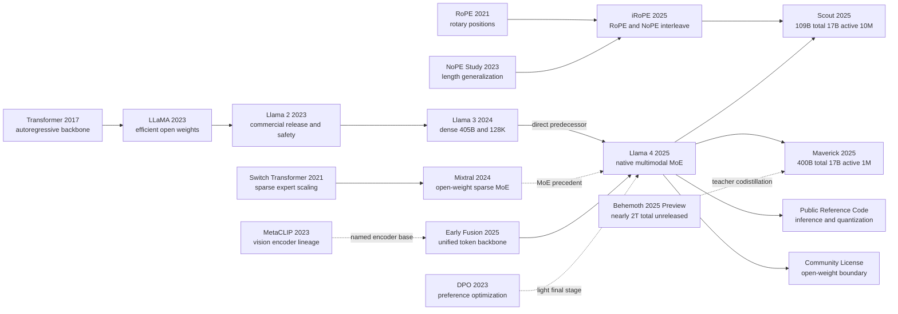

# Llama 4 - Open-Weight Experiments in Native Multimodality, Sparse Experts, and Ten-Million-Token Context

> **On April 5, 2025, Meta introduced [Llama 4](https://ai.meta.com/blog/llama-4-multimodal-intelligence/) not with a formal technical paper but with a launch announcement, a model card, a reference implementation, and two downloadable checkpoint families: Scout as the 109B-total / 17B-active / 10M-context branch, Maverick as the 400B-total / 17B-active general-capability branch, and Behemoth only as an unreleased teacher in the background.**
> The most revealing thing about this release is not merely that it made a large multimodal MoE feel real to the outside world. It is that it exposed a new boundary for open-weight models in 2025: you can inspect the public forward path, quantization hooks, image tiling, license, and acceptable-use terms, yet still lack a paper-level account of training and evaluation that would let another lab reproduce the result end to end. Llama 4 therefore reads like a watershed artifact: **the system package became more public than ever, while the scientific recipe behind it remained only partially visible.**

## TL;DR

Llama 4 is not a conventional paper but a bundle of official artifacts that has to be read in pieces. On April 5, 2025, Meta released a launch announcement, a model card, a reference implementation, and Scout / Maverick checkpoints, publicly framing them as natively multimodal autoregressive MoE systems. At a pedagogical level, the basic next-token objective can be written as $\mathcal{L}_{AR}(\theta)=-\sum_t\log p_\theta(x_t\mid x_{<t})$, while the public MoE forward path can be summarized by the top-1 routing step $j^*=\arg\max_j(hW_r)_j$. Scout takes the 109B-total / 17B-active / 10M-context route; Maverick takes the 400B-total / 17B-active / 1M-context route. Together they push the open-weight line established by [LLaMA (2023)](2023_llama.md) from dense text models into the era of multimodality, sparse experts, and ultra-long context.

What makes the release historically important is the tension between what became inspectable and what remained hidden. Meta exposed downloadable checkpoints, model cards, and more public forward-path detail than in earlier generations, yet there is still no formal Llama 4 technical paper, no complete architecture table, no full training recipe, no disclosed data mixture, no published loss weights for distillation or online RL, and no common benchmark harness that would let outside groups rerun the headline cross-vendor comparisons. The lasting lesson is therefore not simply that Meta shipped another large model. It is that **open weights are already enough for the community to study the system's public shape, but still not enough to read Llama 4 as a reproducible technical report in the way one can read [LLaMA (2023)](2023_llama.md) or Llama 3.**

---

## Historical Context

### Where open-weight models stood in 2025

When Meta released Llama 4 Scout and Maverick on April 5, 2025, the Llama family no longer needed to prove that downloadable weights were useful. LLaMA had seeded a large developer ecosystem in 2023, Llama 2 had made commercial use and safety documentation part of the release process, and Llama 3 had pushed open weights into direct comparison with proprietary frontier systems through an 8B/70B/405B family, 15.6T text tokens, and a 128K context window. The primary [Llama 3 technical report](https://arxiv.org/abs/2407.21783) even documented its dense Transformer architecture, data mixture, parallel training, post-training, and inference engineering. Llama 4 faced a harder set of questions: could an open-weight family treat images as a native input, use sparse activation to carry much more total capacity, and move from 128K to million- or ten-million-token contexts while still shipping downloadable models?

The release changed three axes at once. First, Scout and Maverick were defined as natively multimodal models in which text and vision tokens enter one backbone through early fusion. Second, the flagship Llama architecture moved from Llama 3's dense route to a mixture of experts. Third, Scout advertised a maximum context of 10M tokens. Each move was conspicuous, but each also raised the burden of evidence: multimodal mixture design, router training, and quality at ten million tokens require more documentation than an ordinary model card can provide.

### From Llama 3's compositional multimodality to early fusion

The Llama 3 report already included image, video, and speech experiments, but they followed a compositional route. A trained text language model remained the center of the system, while a vision encoder, cross-attention adapter, video aggregator, or speech adapter was attached around it. The report explicitly said that these multimodal systems were still under development and were not being broadly released. This approach protected a mature text model and made modality-specific components easier to add, but cross-modal interaction arrived relatively late. Vision behaved like an extension attached to the language model rather than a representation learned jointly from the beginning of pretraining.

Llama 4's official narrative directly revised that choice. Meta says the models jointly encountered text, image, and video data during pretraining, with visual representations and text embeddings processed in a unified backbone. “Native” does not mean that raw pixels are fed directly into a language Transformer. The announcement says that the vision encoder is based on MetaCLIP and was separately trained in conjunction with a frozen Llama model to adapt it to the language model; the developer documentation also exposes 336-by-336 image tiles, a global thumbnail tile, and image-specific tokens. What moved earlier was the fusion point. Vision was no longer an unreleased adapter experiment at the end of the Llama 3 report; it became an input capability of the released Scout and Maverick checkpoints.

### From a 405B dense model to 17B active sparse capacity

Llama 3 405B had made a deliberately conservative engineering choice: use a dense decoder-only Transformer and place most complexity in data, training infrastructure, post-training, and safety systems. Llama 4 adopted MoE on the main Llama line for the first time. The official model card carefully separates “total parameters” from “activated parameters”: Scout has 109B total, 17B activated, and 16 experts; Maverick has 400B total, 17B activated, and 128 experts. Total parameters describe stored capacity, while activated parameters describe the portion participating in a token's forward pass. They answer different questions.

Meta is most specific about Maverick. Dense and MoE layers alternate; in an MoE layer, each token enters a shared expert and exactly one of 128 routed experts. The official reference implementation matches that prose, exposing `top_k=1`, a learned router matrix, top-k selection, sigmoid routing scores, and the sum of shared and routed paths. It still does not publish the complete training losses, data distribution, or stabilization recipe needed to produce the router. Llama 4 therefore establishes that this sparse forward path was released and can be inspected. It does not establish that an outside team can retrain an equivalent model from the announcement alone.

### From 128K to the 10M-context race

Llama 3 extended its context from an initial 8K to 128K through staged continued pretraining and documented retrieval evaluation. Llama 4 Scout jumped directly to a 10M maximum-context headline, but the official material preserves a crucial qualification: Scout was pretrained and post-trained at 256K, while 10M is a length-generalization result rather than the length of every training sequence. Meta calls the relevant design iRoPE. Attention layers without positional embeddings are interleaved among layers that use RoPE, and attention temperature is adjusted at inference time.

The current developer documentation adds an even more important footnote: the maximum context lengths were evaluated across 512 GPUs using 5D parallelism. The launch post also says that an INT4 Scout can fit on one H100, and those claims are sometimes collapsed into “one H100 runs a 10M-token context.” Meta's text does not say that. Housing quantized weights on one device and evaluating the maximum context across 512 devices are different experiments. Llama 4's context advance is therefore both a structural result and a lesson in reading model releases: a context window is a joint claim about maximum length, quality curves, memory, throughput, and hardware topology, not a scalar in isolation.

## Background and Motivation

### Make vision part of pretraining itself

Llama 4's first motivation was to stop treating text and vision as two systems joined after the fact. Late adapters can work well for document understanding, chart question answering, multi-image comparison, and visual grounding, but the language backbone does not begin by learning both modalities in one sequence. Early fusion aims to project visual representations into the language hidden space and process them alongside text tokens in the autoregressive backbone, allowing multimodal relationships to shape pretraining itself.

The official reference implementation expresses that goal plainly. Text tokens first receive embeddings. An image passes through a vision encoder, its representation is linearly projected to the backbone dimension, and projected visual states replace positions selected by an image mask. The complete sequence then passes through the same Transformer blocks. This is enough to explain the unified backbone, but it does not reveal how text-image data was sampled, how multimodal objectives were weighted, how video frames entered batches, or how much early fusion contributed relative to Llama 3's adapters. The motivation is public; a causal ablation is not.

### Decouple total capacity from per-token compute

The second motivation was serving economics. Under dense scaling, total parameters, per-token arithmetic, and weight storage grow together. MoE tries to separate the first two: a model can retain many expert parameters while each token activates only the shared expert and a small routed subset. Maverick can therefore be both 400B total and 17B active. Meta positioned it as a general assistant with lower active compute than Llama 3.3 70B while retaining a much larger parameter store.

This separation does not “turn 400B into 17B.” Every expert weight still has to live in memory or move through a distributed system, and routing adds communication, load imbalance, and serving orchestration. The official deployment language reflects the distinction precisely: INT4 Scout can fit on one H100-80GB, while Maverick's FP8 weights fit on one H100 DGX host. Llama 4 seeks to reduce active compute and serving latency per token; it does not erase the memory reality of 109B or 400B weights.

### Push long context from training length toward length generalization

The third motivation was not merely to train on longer sequences but to generalize beyond the 256K training length. Meta's proposed uses include multi-document summarization, analysis of large codebases, and personalization over long histories of user activity. If every larger window required equally long training examples and conventional full attention, data construction and compute would grow prohibitively. iRoPE and inference-time temperature scaling were introduced to extend positional behavior beyond the training regime.

What this route does not settle is as important as what it targets. The announcement shows retrieval needle-in-a-haystack behavior and cumulative negative log-likelihood over long code, but it does not guarantee stable reasoning for arbitrary tasks at 10M tokens. Nor does it publish complete curves for latency, KV-cache demand, needle position, multimodal long sequences, or real repositories. The motivation is to decouple the advertised window from the training length. The resulting research question is where that generalization remains reliable across tasks, positions, and hardware budgets.

### Make open weights an ecosystem entry point, not a full reproduction

The fourth motivation continued Llama's open-weight strategy. Scout and Maverick base, instruct, and selected quantized checkpoints are available through Meta and the official Hugging Face organization. The official repository provides inference, prompt-format, image-preprocessing, MoE, and quantization code. Developers can inspect the forward pass, adapt and distill the models, and deploy them; the model card also reports token counts, H100 GPU hours, energy estimates, supported languages, safety strategy, and benchmark tables.

This is not fully open science. The Llama 4 Community License is a custom commercial license with agreement, attribution, `Built with Llama`, and model-naming obligations, plus a separate-license threshold for products that exceeded 700 million monthly active users in the month before release. The Acceptable Use Policy adds use restrictions and a restriction on the multimodal license grant to EU-domiciled individuals and EU-based companies. More fundamentally, the public package lacks a complete data manifest, pretraining code, training logs, optimizer recipe, RL environment, and rerunnable evaluation suite. Llama 4's historical position is therefore tense but clear: Meta gave the outside world two enormous multimodal MoE weight sets without giving it the full scientific process that produced them.

### A technical release without a Llama 4 technical paper

As of September 14, 2026, the official Meta release page, model repository, developer documentation, official Hugging Face organization, and research surfaces checked for this note did not expose a peer-reviewed Llama 4 paper or an arXiv technical report. The core citable documents remain the April 5, 2025 announcement and model card. They establish model status and Meta's stated results, but they do not contain the complete methods, architecture tables, ablations, and appendices found in the Llama 3 report.

This is not a bibliographic footnote; it is the condition under which Llama 4 must be understood. Scout and Maverick are released models. Behemoth appears in the announcement as a 288B-active, nearly-2T-total, 16-expert teacher that was still training and explicitly not being released at launch. At the evidence cutoff, Meta's official Hugging Face organization had no Behemoth checkpoint and the official repository had no dedicated Behemoth model card. That supports only “no public release was verified,” not speculation that Meta internally stopped, continued, or renamed the project. Any account of Llama 4 must keep three kinds of sentence separate: what Meta disclosed, what Meta claimed, and what the public evidence still cannot answer.

---

## Method Deep Dive

### Overall framework: draw the evidence boundary before the model

Llama 4 has no technical paper, so a method deep dive cannot begin from an unpublished architecture table. The most defensible reading separates the system into three layers. The model card establishes the released specifications of Scout and Maverick. The official reference implementation establishes how public inference fuses images, selects experts, and handles position. The launch announcement describes high-level strategies used by the training team. Only the first two reduce to inspectable fields or code; the third still omits objectives, hyperparameters, and data required for reproduction.

| Model | Public status (as of 2026-09-14) | Total parameters | Active parameters / experts | Maximum context |
|---|---|---:|---|---:|
| Scout | Released base / instruct weights | 109B | 17B / 16 | 10M |
| Maverick | Released base / instruct / FP8 weights | 400B | 17B / 128 | 1M |
| Behemoth | Previewed teacher only; no public checkpoint verified | nearly 2T | 288B / 16 | undisclosed |

The following diagram contains only modules explicitly present in Meta's official material. It intentionally omits layer count, hidden size, attention heads, expert capacity, and training parallelism topology because the primary sources checked for this note do not disclose those values completely.

```text
text tokens ----> token embeddings --------------------+
                                                       |
images -> tiled vision encoder -> projected embeddings +-> unified autoregressive backbone
                                                           |  interleaved dense / MoE FFN
                                                           |  shared expert + top-1 routed expert
                                                           |  RoPE / NoPE attention interleave
                                                           +-> multilingual text and code

Behemoth teacher (previewed, unreleased) --codistillation--> Maverick student
light SFT -> online RL with adaptive hard-prompt filtering -> light DPO
```

Any autoregressive model can be described by next-token negative log-likelihood. **The equation below is a pedagogical abstraction, not Meta's published complete Llama 4 loss.** Actual pretraining must also determine how text, image, video, distillation, routing, and other objectives are combined, and those weights are not public.

$$
\mathcal{L}_{\text{AR}}(\theta)=-\sum_{t=1}^{T}\log p_\theta(x_t\mid x_{<t}).
$$

| Evidence layer | What it establishes | What it cannot imply |
|---|---|---|
| Model card | Parameter counts, modalities, context, tokens, official evaluations | Complete training recipe and independent reproduction |
| Reference code | Image projection, MoE forward pass, iRoPE inference path | That pretraining code equals public inference code |
| Launch announcement | High-level MetaP, FP8, codistillation, and SFT→RL→DPO descriptions | Missing equations, weights, hyperparameters, and ablations |
| Official weights | Checkpoints that can be inspected, tuned, quantized, and deployed | Data, training logs, and cross-vendor evaluation conditions |

### Key design 1: early fusion for native multimodality

Llama 4 is “native” first because the fusion point moved. Llama 3's compositional experiments attached a vision encoder and cross-attention adapters to an already trained text model. Llama 4 jointly uses text, image, and video data during pretraining and sends visual representations into a unified autoregressive backbone. The official documentation still retains a separate visual frontend: an image is dynamically divided into 336-by-336 local tiles, followed by a global tile resized to 336 by 336. The vision encoder is based on MetaCLIP and was separately trained with a frozen Llama model to adapt it to the language model.

The public inference code supplies a minimal verifiable fusion mechanism. Let text embeddings be $H_{text}$, projected visual states be $P(V)$, and the image-position mask be $M$. Its behavior can be written as:

$$
H_0=(1-M)\odot H_{text}+M\odot P(V),\qquad H_L=\operatorname{Backbone}(H_0).
$$

This does not mean pixels and words have no boundary. It means they share a hidden-state sequence after entering the backbone. The pseudocode below restates the public path in `model.py`; its names and comments are editorial, not Meta training code. It is character-for-character identical in both language editions for auditability.

```python
def fuse_public_inference_path(token_ids, image_states, image_mask, model):
    hidden = model.token_embeddings(token_ids)
    if image_states is not None:
        projected = model.vision_projection(image_states)
        hidden = hidden * (~image_mask) + projected * image_mask
    for block in model.transformer_blocks:
        hidden = block(hidden)
    return model.output_head(model.final_norm(hidden))
```

| Route | Fusion point | Benefit | Cost visible in public evidence |
|---|---|---|---|
| Llama 3 compositional adapter | Cross-attention outside the text model | Protects a mature text backbone; replaceable modules | Multimodal models were not broadly released |
| Llama 4 early fusion | Visual states enter the shared token sequence | Repeated cross-modal interaction in the backbone | Modality mixture and ablations are undisclosed |
| Pixels directly into text backbone | No separate vision encoder | Conceptually most unified | Llama 4 does not claim this route |

The design motivation comes from product inputs rather than one visual benchmark. Documents, charts, photographs, and multi-image conversations require the model to repeatedly align local visual evidence with context before emitting text. Early fusion supplies that interaction point. Without a public ablation, however, Scout and Maverick's visual gains cannot all be attributed to early fusion: the scale of visual data, MetaCLIP encoder, post-training curriculum, and model capacity may all contribute.

### Key design 2: a shared expert plus one routed expert

The point of MoE is not that “the model has only 17B parameters,” but that one token activates a path corresponding to roughly 17B parameters. Maverick holds 400B total parameters and 128 routed experts. The announcement says dense and MoE layers alternate, and every token in an MoE layer always passes through a shared expert plus one routed expert. Scout has a smaller 109B pool and 16 experts, while its model card likewise reports 17B activated.

The official implementation permits a more precise description of the forward pass. For hidden state $h$, router matrix $W_r$ produces scores, one routed expert is selected, and the routed path is added to the shared path. Because the public code scales the routed expert's input by a sigmoid score, the following expression stays close to that inference implementation:

$$
j^*=\arg\max_j (hW_r)_j,\qquad y=E_{shared}(h)+E_{j^*}\!\left(\sigma((hW_r)_{j^*})h\right).
$$

```python
def public_top1_moe(hidden, router_weight, shared_expert, routed_experts):
    scores = hidden @ router_weight
    expert_id = scores.argmax(dim=-1)
    gate = scores.gather(-1, expert_id[..., None]).sigmoid()
    shared_output = shared_expert(hidden)
    routed_output = dispatch_top1(gate * hidden, expert_id, routed_experts)
    return shared_output + routed_output
```

| Design | Total capacity | Per-token path | Main benefit | Main cost |
|---|---:|---|---|---|
| Llama 3 405B dense | 405B | Same dense FFN | Regular path and mature training | Active compute grows with total capacity |
| Scout MoE | 109B | shared + 1/16 routed | 17B active and easier deployment | All weights must still be stored |
| Maverick MoE | 400B | shared + 1/128 routed | 17B active with more capacity | More complex routing, communication, and host memory |
| All experts active | 109B/400B | shared + all routed | No routing decision | This is not Llama 4's public design |

The shared expert gives every token a common path, while routed experts provide conditional capacity. The counterintuitive point is that **active parameters reduce arithmetic, not the weight file**. This is why Meta's deployment claims differ: INT4 Scout can fit on one H100-80GB, whereas FP8 Maverick fits on an H100 DGX host. “17B active” cannot be used to claim that 400B weights consume the memory of a 17B model.

Critical training details remain absent. The reference code exposes a `capacity_factor`, expert dispatch, and a router, but the official material does not give the actual training configuration, load-balancing loss, expert-collapse monitoring, dropped-token policy, or expert-use distribution by modality. Under early fusion, whether image and text tokens specialize into different experts is an experimental question, not a fact implied by `top_k=1`.

### Key design 3: iRoPE and context beyond training length

Scout's 10M context sits above a 256K pretraining and post-training length, making length generalization the central problem. Meta calls the design iRoPE: most attention layers use RoPE, NoPE layers without positional encoding appear at an interval, and queries are amplified at inference only in the NoPE layers. Public `ModelArgs` gives defaults of `floor_scale=8192` and `attn_scale=0.1`. At position $p$, the public code's scaling is:

$$
a(p)=1+\alpha\log\!\left(\left\lfloor\frac{p+1}{f}\right\rfloor+1\right),\qquad q'_p=a(p)q_p,\quad f=8192,\ \alpha=0.1.
$$

```python
def public_irope_attention(query, position, uses_rope, tune_temperature):
    if uses_rope:
        return apply_rotary_embedding(query, position)
    if tune_temperature:
        scale = 1.0 + 0.1 * log(floor((position + 1.0) / 8192.0) + 1.0)
        query = query * scale
    return query
```

| Claim | What official material establishes | Qualification that must remain | Undisclosed part |
|---|---|---|---|
| Scout training length | Pretraining and post-training at 256K | Not 10M training sequences | Detailed length curriculum |
| Scout maximum window | 10M | Obtained through length generalization | Quality guarantee for arbitrary tasks |
| iRoPE | Interleaved RoPE/NoPE + inference temperature tuning | Inspectable reference path | Complete ablation and optimal interval |
| Evaluation hardware | 512 GPUs with 5D parallelism | Not one H100 serving 10M | Latency, KV-cache, and throughput curves |

The score matrix of conventional full attention grows as $O(n^2)$ with sequence length; changing positional encoding does not automatically remove that cost. The public reference code also contains configurable chunked local attention, but the available material does not expose enough information to combine it with 5D parallelism into a complete reproduction of the 10M evaluation. Needle retrieval and cumulative NLL over long code establish retrieval or likelihood behavior in Meta's tested settings. They do not establish stable reasoning, multimodal association, and distant causality for every ten-million-token workload.

### Key design 4: Behemoth codistillation and a shift in post-training

Maverick receives another form of capacity not by calling Behemoth online but through codistillation during pretraining. Meta describes the unreleased teacher as nearly 2T total parameters, 288B active parameters, and 16 experts. Maverick learns from hard targets and teacher soft targets while their weights change dynamically. For new student data, the team runs the teacher to generate targets; on shared training data, codistillation amortizes expensive teacher forward passes inside training.

The next expression is only a generic way to explain “dynamic weighting of hard and soft targets.” **Meta did not publish the actual distillation equation or $\lambda(t)$ schedule, so this is not the Llama 4 loss.**

$$
\mathcal{L}_{distill}=\lambda(t)\operatorname{CE}(y,p_\theta)+(1-\lambda(t))\tau^2\operatorname{KL}(q_\phi^{(\tau)}\Vert p_\theta^{(\tau)}).
$$

Post-training moves the center of capability improvement away from heavy SFT and DPO and toward online RL. The disclosed order is lightweight SFT → online RL → lightweight DPO. Meta says too many easy examples and overly strong SFT/DPO constrain exploration, so Llama judges first mark difficulty and more than 50% of easy data is removed before light SFT. During online RL, policy training alternates with prompt filtering to retain medium-to-hard items. A final light DPO stage handles response-quality corner cases.

```python
def disclosed_post_training_shape(candidate_prompts, policy, judge):
    hard_prompts = [p for p in candidate_prompts if judge.difficulty(p) != "easy"]
    policy = lightweight_sft(policy, hard_prompts)
    while not training_budget_exhausted():
        medium_hard = adaptive_filter(policy, candidate_prompts)
        policy = online_rl(policy, medium_hard)
    return lightweight_dpo(policy, corner_case_preferences())
```

| Stage | Role disclosed in announcement | Disclosed data operation | Crucial undisclosed item |
|---|---|---|---|
| Codistillation | Behemoth teaches Maverick | Dynamic hard/soft target weighting | Loss, temperature, and weighting schedule |
| Light SFT | Establish initial behavior | Remove more than 50% easy data | Sample count, steps, and learning rate |
| Online RL | Improve reasoning, code, math, and multimodality | Continually retain medium-to-hard prompts | Reward, environment, algorithm, and compute |
| Light DPO | Repair response-quality corners | Corner-case preferences | Beta, data composition, and isolated gain |

Behemoth belongs in the method diagram as a teacher, not as a released third product. It was still training at launch and had no open weights; at the evidence cutoff, no checkpoint appeared in the checked official Meta model organization. Maverick is one downloadable artifact shaped by it, but outside researchers cannot inspect the teacher, reproduce target generation, or quantify the teacher's net contribution to the student.

### Training, evaluation, and release recipe: the unknowns matter too

The model card says Scout consumed approximately 40T multimodal pretraining tokens and Maverick approximately 22T. Data came from publicly available and licensed material plus information from Meta products and services, including publicly shared Instagram and Facebook content and interactions with Meta AI; the knowledge cutoff is August 2024. The announcement says the overall mixture exceeded 30T tokens across text, image, and video and that pretraining covered 200 languages. The two per-model token counts must not be added into a unique “62T corpus,” because they measure each training run's token consumption and may share or revisit data.

| Dimension | Scout | Maverick | Evidence boundary |
|---|---|---|---|
| Pretraining tokens | approximately 40T | approximately 22T | Multimodal totals; full mixture undisclosed |
| Supported languages | 12 | 12 | 200 pretraining languages do not equal product support |
| Image input | Current docs tested up to 5 | Current docs tested up to 5 | Launch also says up to 48 in pretraining and good results up to 8 post-training |
| Training GPU hours | 5.0M H100-80GB | 2.38M H100-80GB | Model-card totals without training topology |
| Released precision | BF16; on-the-fly INT4 | BF16 and FP8 | Official benchmarks all run on BF16 |
| Safety | Model tuning + system protections such as Llama Guard | Same | Developers still need use-case evaluation |
| Full reproduction | unavailable | unavailable | Missing data, training code, logs, and full eval harness |

Meta also describes MetaP as transferring per-layer learning rates and initialization scales across batch size, width, depth, and training tokens, and reports 390 TFLOPs/GPU while training Behemoth in FP8 on 32K GPUs. The former is not disclosed as an implementable algorithm; the latter is an infrastructure metric for an unreleased teacher. Neither can be rewritten as a complete Scout or Maverick hyperparameter table.

Safety training and release are likewise system components. The model card describes human-generated and synthetic safety data, tuning on borderline and adversarial prompts, and an effort to reduce false refusals and moralizing tone. Deployment guidance continues to recommend Llama Guard, Prompt Guard, and Code Shield. Downloadable weights let developers customize boundaries while shifting more application testing, license compliance, and protection responsibility to deployers. Llama 4's method contribution is therefore not a reproducible recipe but an industrial system that exposes key forward paths, some training strategies, and complete weights while retaining decisive details of how those weights were produced.

---

## Failed Baselines

### What can “failure” mean without paper ablations?

Llama 4's official material has no Experiments section and no public ablation that holds model size and data fixed while changing one component. This section therefore cannot claim that “early fusion beats adapters by N points” or “iRoPE beats RoPE by N points.” Verifiable negative evidence comes in only two forms: a public Llama 3 route that Llama 4 explicitly replaced, or a training failure that Meta directly reported in the launch announcement. The former explains why a new generation chose another route but does not make the old technique universally unsuccessful. The latter remains a developer-reported result without a complete table or independent reproduction.

That restriction filters out a common narrative substitution in large-model releases. If a system changes data, capacity, architecture, vision encoder, post-training, and evaluation protocol at once, a higher new-model score is not causal evidence for any one module. Llama 4's failed cases must be written as “this route could not meet the new objective” or “Meta reports that it had a negative effect in its training,” never as an invented numeric experiment.

### Failed route 1: leave multimodality to a terminal adapter

Llama 3's compositional multimodality was not a bad baseline. It added image, video, and speech capabilities around a mature text model using a vision encoder and cross-attention adapters, reducing the risk of retraining the backbone. The relevant failure was at the product boundary: the multimodal systems in the Llama 3 report remained under development and were not broadly released, while shared learning between vision and text occurred mainly in attached modules rather than throughout the backbone from the start of pretraining.

Llama 4's counter-baseline is early fusion. Text, image, and video enter the pretraining mixture, visual states are projected into a unified token sequence, and Scout and Maverick ship directly as multimodal checkpoints. The change answers whether multimodality is part of the product, not merely whether one vision score rises. Meta did not publish a same-size, same-data, same-post-training adapter-versus-early-fusion ablation, so the individual contributions of the vision encoder, data scale, unified backbone, and curriculum remain unknown. What lost was Llama 3's release shape, not adapters as a general technique.

### Failed route 2: increase total capacity and activate it all per token

The second replaced route is dense scaling. Llama 3 405B used a dense backbone for training stability and architectural simplicity, but every token traversed the same feed-forward network, so active arithmetic grew with total parameters. For downloadable weights, successful training is only the first step. External deployers still pay memory, bandwidth, parallelism, and per-token costs. Extending dense models beyond 405B would not answer how more users could actually serve them.

Llama 4 separates total capacity from active compute through a shared expert plus one routed expert. Maverick has 400B total parameters but reports 17B active; Scout has 109B total and likewise reports 17B active. This route is not free. Every weight still needs storage, and routing plus expert parallelism adds communication complexity. Meta says Maverick's FP8 weights fit on an H100 DGX host, not one H100 GPU. Llama 4 establishes that a sparse forward path was released, but it does not publish complete dense-versus-MoE cost curves under equal training FLOPs, data, and serving hardware.

### Failed route 3: heavy SFT and DPO over abundant easy data

This is the clearest negative training result in the official announcement. Meta says the challenge in Maverick post-training was preserving multimodal, reasoning, and conversational abilities at once. The team found that SFT and DPO could “over-constrain” the model, restrict exploration during subsequent online RL, and produce suboptimal accuracy in reasoning, coding, and mathematics. Llama judges therefore labeled difficulty, more than 50% of easy data was removed, lightweight SFT used the harder remainder, continuous online RL retained medium-to-hard prompts, and lightweight DPO handled response-quality corners at the end.

Meta reports an even more aggressive lesson for Behemoth. It says that 95% of SFT data was pruned for the nearly-2T-total-parameter teacher, followed by lightweight SFT and large-scale RL using pass@k hard-prompt selection, zero-advantage filtering, mixed-capability batches, and varied system instructions. The baseline that failed was not SFT or DPO in general, but the assumption that more data and stronger supervision must improve post-training. The announcement supplies no before-and-after scores, training budgets, reward definition, or variance. The direction can be recorded; its effect size cannot be reconstructed.

### Failed route 4: treat maximum context as one capability number

Scout's 10M headline encourages a false baseline: if a model accepts ten million tokens, it can reason stably over any ten-million-token task. The official evidence is narrower. Scout completed pretraining and post-training at 256K, then used iRoPE and inference-time attention-temperature scaling for length generalization. The announcement mentions text needle retrieval and cumulative NLL over long code. Current developer documentation says maximum-context evaluation used 512 GPUs and 5D parallelism.

Thus, “ordinary RoPE with `max_seq_len` changed to 10M” is not a baseline defeated in a paper table; it is a naive assumption that Llama 4's design avoids. Maximum accepted length, distant retrieval, global reasoning, multimodal correspondence, throughput, time to first token, and KV-cache demand are separate metrics. Meta does not publish their complete joint curves. Ten million tokens should be read as an officially evaluated maximum-window claim, not a single-GPU deployment promise or a task-independent quality guarantee.

### The real anti-baseline lesson: a launch page is not a controlled experiment

Llama 4's most useful negative lesson comes from the evidence structure itself. The announcement places MoE, early fusion, iRoPE, MetaP, FP8, codistillation, and online RL in one success story, then the model card supplies strong results. Read together, they can create the impression that every component received a controlled validation. The public package contains no such causal decomposition.

| Replaced or questioned route | Llama 4 choice | Official evidence | Still unanswered |
|---|---|---|---|
| Llama 3 compositional adapters | Early-fusion native multimodality | Released multimodal weights and public forward pass | Component ablation under equal conditions |
| 405B dense full activation | shared + top-1 routed expert | 17B active / 109B or 400B total | Equal-budget quality, communication, and latency curves |
| Heavy SFT/DPO + easy data | light SFT → online RL → light DPO | Meta reports removing >50% easy data | Reward, budget, and before/after scores |
| Training length equals maximum window | Extrapolate from 256K to 10M | iRoPE, retrieval/NLL, and 512-GPU footnote | Cross-task quality and deployment cost |

The engineering principle is concise: **separate a downloadable forward pass from reproducible training, and separate “measured by the vendor” from “independently established.”** Scout and Maverick are genuinely available objects of outside research. Without a complete training and evaluation package, their launch narrative should not be retrofitted with a causal experimental chain.

## Key Experimental Data

### Evaluation contract: reproduce only the official BF16 model card

Every number below comes from Meta's official Llama 4 model card. The card explicitly says that although quantized checkpoints are available, all reported evaluations and testing used BF16 models. The values therefore do not directly establish that INT4 Scout or FP8 Maverick is identical in quality to BF16. The pretrained table compares Llama 3.1 70B/405B, while the instruction-tuned table compares Llama 3.3 70B and Llama 3.1 405B. Shots and metrics also differ, so identically named benchmarks across the two tables cannot be merged.

The announcement additionally says Maverick exceeds GPT-4o and Gemini 2.0 Flash across a range of public benchmarks, is comparable to DeepSeek-V3 in reasoning and coding, and gives an “experimental chat version” a 1417 LMArena ELO. It says Behemoth exceeds GPT-4.5, Claude 3.7 Sonnet, and Gemini 2.0 Pro on several STEM benchmarks. This note excludes those sentences from the tables: the official package lacks a complete common harness, the experimental arena version is not established as identical to the downloadable Maverick checkpoint, and Behemoth has no public weights to reproduce.

### Pretrained model results

| Benchmark (shots / metric) | Llama 3.1 70B | Llama 3.1 405B | Llama 4 Scout | Llama 4 Maverick |
|---|---:|---:|---:|---:|
| MMLU (5 / macro avg acc char) | 79.3 | 85.2 | 79.6 | **85.5** |
| MMLU-Pro (5 / macro avg EM) | 53.8 | 61.6 | 58.2 | **62.9** |
| MATH (4 / EM maj1@1) | 41.6 | 53.5 | 50.3 | **61.2** |
| MBPP (3 / pass@1) | 66.4 | 74.4 | 67.8 | **77.6** |
| TyDiQA (1 / average F1) | 29.9 | **34.3** | 31.5 | 31.7 |
| ChartQA (0 / relaxed accuracy) | no multimodal support | no multimodal support | 83.4 | **85.3** |
| DocVQA (0 / ANLS) | no multimodal support | no multimodal support | 89.4 | **91.6** |

The capability profile is more complicated than one generation dominating another. Maverick is slightly to substantially above Llama 3.1 405B on MMLU, MMLU-Pro, MATH, and MBPP, most notably moving MATH from 53.5 to 61.2. Scout moves only from 79.3 to 79.6 on MMLU and 66.4 to 67.8 on MBPP relative to Llama 3.1 70B, but raises MMLU-Pro from 53.8 to 58.2. Both Llama 4 models remain below Llama 3.1 405B's 34.3 on TyDiQA. Meta's own table therefore preserves non-monotonic results even as the new family expands the capability surface.

### Instruction-tuned model results

| Benchmark (shots / metric) | Llama 3.3 70B | Llama 3.1 405B | Llama 4 Scout | Llama 4 Maverick |
|---|---:|---:|---:|---:|
| MMMU (0 / accuracy) | no multimodal support | no multimodal support | 69.4 | **73.4** |
| MMMU-Pro (0 / accuracy) | no multimodal support | no multimodal support | 52.2 | **59.6** |
| MathVista (0 / accuracy) | no multimodal support | no multimodal support | 70.7 | **73.7** |
| ChartQA (0 / relaxed accuracy) | no multimodal support | no multimodal support | 88.8 | **90.0** |
| DocVQA test (0 / ANLS) | no multimodal support | no multimodal support | **94.4** | **94.4** |
| LiveCodeBench 2024-10-01→2025-02-01 (0 / pass@1) | 33.3 | 27.7 | 32.8 | **43.4** |
| MMLU-Pro (0 / macro avg accuracy) | 68.9 | 73.4 | 74.3 | **80.5** |
| GPQA Diamond (0 / accuracy) | 50.5 | 49.0 | 57.2 | **69.8** |
| MGSM (0 / average EM) | 91.1 | 91.6 | 90.6 | **92.3** |

This table best expresses Maverick's general-workhorse role. Its LiveCodeBench score is 43.4, at least 10.1 points above the three listed Llama baselines; MMLU-Pro is 80.5 and GPQA Diamond is 69.8. Scout is again non-monotonic. GPQA Diamond at 57.2 exceeds both predecessors, and MMLU-Pro at 74.3 narrowly exceeds the 405B model's 73.4, but LiveCodeBench at 32.8 trails Llama 3.3 70B's 33.3 and MGSM at 90.6 trails 91.1/91.6. Scout and Maverick both score 94.4 on DocVQA, so greater total capacity yields no visible gain in that row.

### Long context, resources, and quantization boundaries

| Item | Scout | Maverick | Interpretation |
|---|---|---|---|
| Maximum context | 10M | 1M | Official maximum; context evaluation used 512 GPUs |
| Disclosed training length | 256K pretraining and post-training | Not similarly detailed in announcement | Scout's 10M relies on length generalization |
| MTOB half-book chrF (eng→kgv / kgv→eng) | 42.2 / 36.6 | **54.0 / 46.4** | Predecessor columns state 128K but provide no comparable score |
| MTOB full-book chrF (eng→kgv / kgv→eng) | 39.7 / 36.3 | **50.8 / 46.7** | A larger maximum window does not guarantee a higher task score |
| Pretraining GPU hours | 5.0M H100-80GB | 2.38M H100-80GB | Model-card total is 7.38M hours |
| Location-based emissions estimate | 1,354 tCO2e | 645 tCO2e | Meta reports 1,999 total and zero market-based emissions |
| Official quantized release | BF16; on-the-fly INT4 can fit one H100 | BF16 + FP8; FP8 can fit one DGX host | Benchmark numbers all come from BF16 |

The GPU-hour figures are counterintuitive: the smaller-total-parameter Scout reports 5.0M, while Maverick reports 2.38M. The official material does not disclose enough topology and stage detail to explain the difference, so cost cannot be inferred from parameter count alone. The emissions table also requires its accounting boundary. The 1,999 tCO2e value is location-based; Meta reports a market-based value of zero because it matches electricity use with clean and renewable energy. The figures answer different accounting questions.

### Key findings and conclusions that were not established

- **Native multimodality is genuinely part of the release.** Predecessor Llama 3 columns say “no multimodal support” on visual benchmarks, whereas Scout and Maverick report MMMU, MathVista, ChartQA, and DocVQA results. That establishes a changed capability interface, not the isolated contribution of early fusion.
- **Maverick's 400B total capacity corresponds to stronger results in several official rows.** MATH 61.2, LiveCodeBench 43.4, MMLU-Pro 80.5, and GPQA Diamond 69.8 exceed the listed predecessors, but Meta ran the tests and did not release a complete outside reproduction package.
- **Scout is not merely a smaller Maverick.** Its distinctive goals are a 10M maximum context and one-H100 INT4 deployment. Conventional benchmarks include improvements, ties, and regressions, consistent with branch specialization rather than universal upgrading.
- **Active parameters are not a memory metric.** Seventeen billion active describes the per-token path; 109B/400B total describes stored capacity. Meta's distinct “single GPU” and “single host” language verifies that distinction.
- **These tables do not directly validate quantized quality.** Every tabulated result uses BF16 and cannot be transferred unchanged to INT4 Scout or FP8 Maverick.
- **Behemoth's benchmark story remains an unreproducible preview.** It was still training and unreleased at launch, and no official checkpoint was verified by the cutoff. It belongs under teacher status and open questions, not as a released experimental row.

---

## Idea Lineage

### An evidence graph, not a fabricated citation graph

Llama 4 has no formal technical paper and therefore no paper bibliography or citation network that can be traced item by item. The graph below instead shows technical lineage verifiable from official material. The left side contains primary papers and the Llama 3 predecessor report; the center contains four technical lines combined in the Llama 4 release; the right side contains artifacts Meta actually released or previewed on April 5, 2025. Solid edges denote direct public inheritance or release relationships. Dashed edges denote a component source named by Meta, a comparison route, or an unreleased teacher relationship.



The graph intentionally draws no edge from Llama 4 to a later paper. That is not a claim that it had no ecosystem impact. It reflects the source policy: as of the evidence cutoff, this note uses official primary material and original technical papers rather than third-party inventories to manufacture an academic citation record for a release without a formal paper. For such an industrial release, weights, reference code, model cards, and a license are the first form of its “present life.”

### Past lives: five lines converge in 2025

**The first line is the LLaMA family.** [LLaMA (2023)](https://arxiv.org/abs/2302.13971) established the route of smaller-than-frontier models trained on more tokens and made available for research. [Llama 2 (2023)](https://arxiv.org/abs/2307.09288) added chat post-training, safety evaluation, and a broader commercial license. [Llama 3 (2024)](https://arxiv.org/abs/2407.21783) extended the family to a 405B dense model, 15.6T text tokens, and 128K context. Llama 4 inherits the herd and open-weight ecosystem while changing the dense route, text-first design, and adapter-based multimodality together.

**The second line is sparse experts.** [Switch Transformer (2021)](https://arxiv.org/abs/2101.03961) showed how top-1 expert routing could expand capacity, while [Mixtral (2024)](https://arxiv.org/abs/2401.04088) brought sparse MoE into a strong open-weight model. They are technical precedents for Llama 4's shared and routed experts, not substitutes for undisclosed Llama 4 implementation details. In particular, the public Llama 4 path uses a shared expert, top-1 selection, and a sigmoid gate; auxiliary losses or parallel schemes from other MoEs cannot be copied over merely because all are expert models.

**The third line is visual representation.** [MetaCLIP (2023)](https://arxiv.org/abs/2309.16671) is the vision-encoder base named by the announcement. Llama 4 does not eliminate a vision encoder; it projects its output into a unified hidden sequence. This explains where early fusion receives its visual input and corrects the mistaken idea that native multimodality means having no modality frontend.

**The fourth line is position and length generalization.** [RoPE (2021)](https://arxiv.org/abs/2104.09864) supplies rotary position encoding for most layers. A [2023 study of NoPE length generalization](https://arxiv.org/abs/2305.19466) is the other half directly linked by Meta in its iRoPE explanation. Scout interleaves RoPE and NoPE layers, then applies query-temperature tuning to NoPE layers at inference. The combination points toward the 10M window, but no public ablation isolates the gain from either half.

**The fifth line is preference optimization and teacher-student training.** [DPO (2023)](https://arxiv.org/abs/2305.18290) remains as a light final stage while capability improvement shifts toward online RL. Behemoth enters as an unreleased teacher that codistills Maverick during pretraining. Meta says hard and soft targets receive dynamic weights but does not publish the loss. The conceptual relation is verifiable; algorithmic detail remains outside the boundary.

| Predecessor node | What Llama 4 inherits | What Llama 4 changes | Evidence limit |
|---|---|---|---|
| LLaMA / Llama 2 | Open-weight family and commercial ecosystem | Native multimodal input | License remains custom |
| Llama 3 | Herd, post-training, safety, and long context | dense→MoE, adapter→early fusion, 128K→10M | Llama 3's architecture table cannot be copied to Llama 4 |
| Switch / Mixtral | Active-compute logic of sparse experts | Public shared + top-1 routed path | Full router training undisclosed |
| MetaCLIP | Vision-encoder starting point | Projection into unified backbone | Visual data and ablations undisclosed |
| RoPE / NoPE study | Position encoding and length generalization | iRoPE + inference temperature | Full 10M cross-task curves undisclosed |
| DPO / distillation | Preference and teacher-student learning | Light DPO and Behemoth→Maverick codistillation | Reward and distillation loss undisclosed |

### Present life: inherited first as models, code, interfaces, and license

Llama 4's most direct descendants are two released weight families. Scout combines 109B total capacity, 17B active parameters, 16 experts, and a 10M maximum context into an extreme-input branch. Maverick combines 400B total capacity, 17B active parameters, 128 experts, and a 1M context into a general-capability branch. Each has base and instruct variants, and Maverick also has an official FP8 variant. This family structure inherits Llama 3's idea that different budgets deserve different models, but roles are no longer ordered by parameter count alone.

The second descendant is a public forward pass. Llama 4 code in `meta-llama/llama-models` lets outside readers inspect image-mask replacement, vision projection, a shared expert, top-1 routing, RoPE/NoPE interleaving, temperature tuning, a chunked-attention interface, and quantization paths. It is not a pretraining framework, but it exposes a structural layer unavailable in API-only proprietary systems. Integrations in Transformers, vLLM, clouds, and accelerators inherit these stable interfaces first.

The third descendant is a prompt and safety contract. Developer documentation specifies how text, image, assistant, and tool outputs enter the token stream, while the model card recommends deploying system protections such as Llama Guard, Prompt Guard, and Code Shield around the model. The fourth is a legal boundary. The Community License permits broad use, modification, and derivation while retaining control through `Built with Llama`, naming, 700M-MAU, and acceptable-use terms. A modern model's descendants are not only citing papers; they can be ecosystem conventions shaped by deployment interfaces and licenses.

Behemoth is the absent present life. It reaches Maverick through a dashed edge because official evidence establishes a teacher relation, not a public-product relation. It was still training and explicitly unreleased at launch; no official checkpoint was verified by the cutoff. Maverick gives outsiders indirect access to effects of teacher distillation without access to the teacher itself. That asymmetry is likely to remain a central coordinate in any discussion of Llama 4 reproducibility.

### Misreadings: four excessive simplifications

**Misreading one: “A 17B model beat a 400B model.”** Seventeen billion is the activated count for Scout and Maverick, not their total stored weights. Maverick still holds roughly 400B parameters. Sparse routing reduces per-token arithmetic; it does not turn the checkpoint into an ordinary 17B dense model.

**Misreading two: “Native multimodality means no vision encoder.”** The announcement explicitly bases the vision encoder on MetaCLIP, and the developer documentation describes image tiling. Native refers to early-fused visual states in a unified backbone and multimodal pretraining, not the elimination of a visual frontend.

**Misreading three: “Scout runs 10M tokens on one H100.”** Meta says INT4 weights can fit one H100 and separately says maximum context was evaluated on 512 GPUs with 5D parallelism. Those capabilities cannot be combined into a single-GPU ten-million-token promise.

**Misreading four: “Meta released Llama 4 Behemoth.”** Meta only previewed nearly 2T total parameters, 288B active parameters, and 16 experts, while saying the model was still training. Scout and Maverick are the official downloadable releases. No Behemoth checkpoint was verified by the cutoff, which supports “no verifiable public release” but no verdict about its internal fate.

### What this graph refuses to claim

There is no “Llama 4 paper” node because no official technical paper was verified. There is no solid edge from Behemoth to a public checkpoint because no such release was verified. The graph does not connect 10M to “one H100” because Meta's hardware footnotes do not support that claim. Nor does it draw MetaP as a complete algorithmic ancestor, because the announcement describes its goal without sufficient equations or implementation.

The graph likewise omits ten conveniently tidy follow-up papers. Llama 4 will certainly diffuse through the ecosystem, but this task centers official primary evidence and excludes third-party summaries of public claims. Under that policy, omitting an unverified edge is more accurate than presenting ecosystem attention as academic citation. For now, Llama 4's intellectual history is a release-driven open-weight systems graph. A future formal report or explicit successor could turn it into a conventional paper citation graph.

---

## Modern Perspective (looking back at 2025 from 2026)

### Assumptions that no longer hold

- **"Open weights" does not automatically mean "open science."** Llama 4 put Scout and Maverick weights, model cards, reference code, and developer documentation in public view, but that still does not amount to a reproducible paper. `r0_context` already lists the missing pieces: no complete architecture table, no optimizer or batch details, no data mixture or loss weights, and no common harness that would let outside researchers rerun the cross-vendor comparisons. Looking back from 2026, the main correction is not that Llama 4 was "closed," but that it blurred **open weights** with **reproducible science**.
- **One maximum-context number does not summarize long-context capability.** Scout's 10M headline is the easiest number to over-read. The official evidence is narrower: Scout was pretrained and post-trained at 256K, length-generalized with iRoPE plus inference-time query-temperature scaling, and its maximum-context evaluation used 512 GPUs with 5D parallelism. That establishes that Meta validated an extreme window. It does not establish single-GPU deployment, cross-task quality, latency, or retrieval stability at that window.
- **17B active does not mean 17B-class deployment cost.** Llama 4 is unusually explicit about the gap between active and total parameters, and that gap is also unusually easy to ignore. Scout is 109B total / 17B active; Maverick is 400B total / 17B active. What shrinks is per-token arithmetic, not checkpoint storage. That is exactly why Meta can say that Scout's on-the-fly INT4 fits on one H100 while Maverick's FP8 fits on an H100 DGX host.
- **"Native multimodality" does not mean eliminating a visual frontend.** Neither the announcement nor the developer docs say that. Llama 4 still keeps a MetaCLIP-based vision encoder, image tiling, and a projection layer. "Native" means visual tokens enter the shared backbone and remain part of pretraining and post-training, not that pixels are poured raw into the language model without a frontend.

### What time validated as essential vs what remained misleading

- **What truly matters is an inspectable forward path and a clear state boundary.** Public weights, model cards, the `meta-llama/llama-models` reference implementation, and the developer documentation for prompt format, image tiling, context footnotes, and deployment conditions together define the enduring research value of Llama 4. You can inspect the public early-fusion path, the shared-expert-plus-top-1-routed-expert computation, and the released status of Scout and Maverick.
- **The second essential point is to split release from preview.** Scout and Maverick are released artifacts; Behemoth is a previewed teacher. That sounds semantic, but it determines which objects can actually be reproduced, quantized, tuned, and deployed. If the narrative does not keep that line visible, readers will silently borrow the benchmark aura of an unreleased teacher and attribute it to released student models.
- **What remains misleading is treating the launch page as a controlled experiment.** The announcement tells one success story involving MoE, early fusion, iRoPE, MetaP, codistillation, and online RL, then appends strong benchmarks. That combination easily creates the illusion that each module was independently validated. The official package contains no such ablation. From a 2026 viewpoint, Llama 4 is a high-value systems release document, not a technical report strong enough to support component-level causal claims.
- **Another misleading shortcut is to treat arena scores or cross-vendor headlines as the hardest evidence.** `r0_context` is explicit here: the 1417 LMArena result belongs to an experimental Maverick chat version, and the GPT-4o, Gemini 2.0, Claude 3.7, and GPT-4.5 comparisons in the announcement do not ship with a complete common harness. The hardest public evidence remains the BF16 tables in the model card, because at least those can be audited row by row.

### Side effects the authors may not have anticipated

1. **The center of gravity of "openness" shifted from a paper to a release bundle.** Because there is no formal technical paper, discussion of Llama 4 has to treat the model card, Hugging Face pages, developer documentation, license, and acceptable-use policy as part of the factual source base. For a modern foundation model, the research object is no longer a single paper but an entire release package.
2. **License and use policy became part of the method boundary.** The Community License, naming requirements, 700M-MAU clause, and multimodal-use restrictions are not appendix-level legal boilerplate anymore. They define who can inherit the route and under what conditions. For open-weight models, law and interface now matter as much as architecture.
3. **An unreleased teacher became one of the narrative centers.** Behemoth has no public checkpoint, yet occupies a large fraction of the discussion through its codistillation relation to Maverick. This gives Llama 4 a structurally invisible center: outsiders can study the student models, but cannot directly inspect whether the teacher determined performance in the way the announcement implies.
4. **Operational documentation exposed the real deployment constraints better than the launch headline did.** By 2026, the most informative details are not simply "10M" or "400B," but statements such as "image understanding currently documented for up to five images," "maximum context evaluated on 512 GPUs," and "BF16 is the official evaluation regime." Those footnotes are closer to engineering reality than the original headline numbers.

### If Llama 4 were rewritten for release today

If Meta were to rewrite Llama 4 as a work meant to survive academic scrutiny, the missing pieces are not bigger slogans but a deliberate split between systems release and technical report:

- First, publish a complete architecture table: layer counts, hidden sizes, attention heads, expert capacity, router settings, tokenizer details, and the dense/MoE alternation pattern, so readers do not have to infer the public forward pass from reference code alone.
- Second, publish an auditable training and post-training recipe: multimodal data mixture, distillation objective, online RL, light SFT, and light DPO with stage budgets and loss weights, instead of a high-level narrative only.
- Third, reorganize the long-context story by putting 256K training length, 1M/10M maximum windows, needle retrieval, long-code NLL, latency, memory, and parallelism requirements into one table, so "how much input fits" is not conflated with "how useful the model remains at that length."
- Fourth, distinguish **released checkpoint**, **evaluated checkpoint**, and **previewed model** in every benchmark table. If the arena model, cross-vendor benchmark model, and downloadable checkpoint are not literally the same artifact, that should be marked explicitly.
- Fifth, publish quantized results as first-class evidence. If one-H100 INT4 Scout and one-host FP8 Maverick are official deployment claims, then quality, throughput, and distortion bounds after quantization should accompany them instead of leaving BF16 tables to carry all evidentiary weight.

The most stable lesson Llama 4 leaves behind is not "Meta built another larger model." It is the more restrained statement that **once open-weight models enter multimodality, MoE, ultra-long context, and custom licensing, the scarce resource is no longer the headline but a precise statement of what is public and what still cannot be independently checked.**

---

## Limitations and Future Directions

### Limitations already acknowledged by the official materials

- **Safety evaluation cannot cover every deployment scenario.** The model card explicitly tells developers to add application-specific evaluations and safeguards. Official safety claims therefore start as a base layer, not as a final guarantee.
- **Supported languages are not the same thing as training coverage.** The announcement says pretraining covered 200 languages, with more than 100 above 1B tokens, yet the current developer documentation exposes a narrower release-level supported language set. Training reach should not be read as product-stable support.
- **Multimodal and long-context abilities come with operating conditions.** The launch announcement mentions more images during pretraining and good post-training results up to eight images; the current developer docs are more conservative in operational guidance. Scout's 10M context likewise depends on a specific parallel evaluation setup. Meta's own documents already signal that these capabilities have boundaries.

### Structural limitations: what still cannot be derived from the public package

- There is no formal Llama 4 technical paper and no equivalent reproducibility package, so the complete architecture, optimizer, batch schedule, data mixture, routing training, and loss weights remain black-box.
- There is no complete data manifest or source weighting. Official materials describe broad categories such as public data, licensed data, and Meta product/service data, but outsiders cannot precisely audit multimodal provenance, deduplication, or privacy boundaries.
- There is no independently rerunnable cross-vendor evaluation framework. The GPT-4o, Gemini 2.0, Claude 3.7, and GPT-4.5 headline comparisons in the announcement are still insufficient for line-by-line external reproduction.
- Behemoth remains a highly influential but uninspectable teacher. As long as it stays part of Maverick's capability narrative without a public artifact, that hole remains central.

### Reasonable next steps

- Publish a formal technical report with at least an architecture table, training table, post-training table, and key ablations.
- Provide unified BF16 / INT4 / FP8 quality-throughput comparisons for Scout and Maverick, so deployment claims do not drift away from evaluation evidence.
- Report long context through layered metrics: maximum window, retrieval success, task quality, latency, memory, and parallelism requirements should be separated.
- If Behemoth will not be released, demote it in reader-facing benchmark narratives to an internal-teacher note; if it will be released, give it an independent model card and status page.

---

## Related Work and Insights

- **vs [LLaMA (2023)](2023_llama.md)**: both belong to Meta's open-weight line, but the 2023 release had a formal arXiv paper whose core claim was "smaller parameters + more tokens." Llama 4 shifts the core claim to "native multimodality + MoE + ultra-long context" while lacking an equivalently complete technical report. **Lesson: what hurts an open ecosystem is not custom architecture, but lower evidence density.**
- **vs Llama 2 (2023) and Llama 3 (2024)**: Llama 2 documented commercially usable open weights and safety evaluation in paper form; Llama 3 still had a formal report and clearly explained dense 405B, 128K context, and the herd strategy. Llama 4 inherits the herd narrative and systems safety toolchain, but extends the line into released multimodal MoE. **Lesson: the product line matured while paper-style disclosure retreated.**
- **vs [Switch Transformer (2021)](https://arxiv.org/abs/2101.03961) / Mixtral (2024)**: those works supplied paper precedents for sparse experts, whereas Llama 4 brought a shared-expert plus top-1-routed-expert path into an official open-weight release. **Lesson: Llama 4's novelty is better read as systems combination and productization than as a single new MoE algorithm.**
- **vs MetaCLIP (2023) and the RoPE / NoPE line**: the announcement explicitly names MetaCLIP, RoPE, and NoPE length-generalization work, making Llama 4 look more like an engineering synthesis of known routes than a one-paper invention. **Lesson: this kind of model wants to be written up as a systems paper, not as a marketing note.**
- **vs the traditional notion of "openness"**: older debates about open models usually stopped at whether weights could be downloaded. Llama 4 forces the reader to include the model card, developer docs, license, and use policy in the evidence chain. **Lesson: the next standard for evaluating open models should jointly inspect artifacts, documentation, legal boundaries, and reproducibility.**

---

## Resources

- 📄 [Meta launch announcement](https://ai.meta.com/blog/llama-4-multimodal-intelligence/)
- 📄 [Llama 4 Model Card](https://github.com/meta-llama/llama-models/blob/main/models/llama4/MODEL_CARD.md)
- 💻 [Official reference implementation and distribution repo](https://github.com/meta-llama/llama-models/tree/main/models/llama4)
- 🔗 [Official Scout Hugging Face page](https://huggingface.co/meta-llama/Llama-4-Scout-17B-16E-Instruct)
- 🔗 [Official Maverick Hugging Face page](https://huggingface.co/meta-llama/Llama-4-Maverick-17B-128E-Instruct)
- 📚 Official developer docs: [Llama 4 Model Cards and Prompt Formats](https://developer.meta.com/ai/docs/model-cards-and-prompt-formats/llama4/)
- 📚 Main lineage papers: [LLaMA (2023)](https://arxiv.org/abs/2302.13971), [Llama 2 (2023)](https://arxiv.org/abs/2307.09288), [Llama 3 (2024)](https://arxiv.org/abs/2407.21783)
- 📚 Component lineage: [Switch Transformer (2021)](https://arxiv.org/abs/2101.03961), [Mixtral (2024)](https://arxiv.org/abs/2401.04088), [MetaCLIP (2023)](https://arxiv.org/abs/2309.16671), [RoPE (2021)](https://arxiv.org/abs/2104.09864), [NoPE length generalization (2023)](https://arxiv.org/abs/2305.19466), [DPO (2023)](https://arxiv.org/abs/2305.18290)


---

> 🌐 [中文版](/era5_genai_explosion/2025_llama4/) · 📚 awesome-papers project · CC-BY-NC