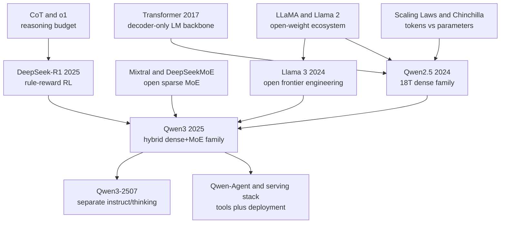

# Qwen2.5 / Qwen3 - How Alibaba Turned Open LLMs into a Full-Stack Model Family

> On April 29, 2025, Alibaba's Qwen Team released Qwen3; the May [Qwen3 Technical Report](https://arxiv.org/abs/2505.09388) framed it as more than a single flagship model. Qwen3 takes the September 2024 Qwen2.5 line, trained on up to 18T tokens, and turns it into a 36T-token open-weight family with dense and MoE models, 119 languages and dialects, hybrid thinking/non-thinking behavior, tool-use support, and deployment paths through vLLM, SGLang, llama.cpp, Ollama, and Qwen-Agent. Its historical hook is not simply that Alibaba shipped another strong Chinese LLM. It is that Qwen3 made open-model competition feel like a full-stack question: who can make reasoning, coding, multilinguality, long context, and agent engineering downloadable, deployable, and trainable by everyone else?

## TL;DR

The Qwen Team's 2025 arXiv technical report, *Qwen3 Technical Report*, is less a one-model SOTA paper than a blueprint for turning the Qwen2.5-to-Qwen3 line into reusable open-model infrastructure. The backbone remains a decoder-only Transformer trained with the familiar autoregressive objective $\mathcal{L}_{\text{LM}}=-\sum_t\log p_\theta(x_t\mid x_{<t})$, but the system around it changes the meaning of an open release: Qwen2.5 establishes an 18T-token dense family with long-context, multilingual, coding, math, structured-output, and tool-use abilities; Qwen3 scales pretraining to roughly 36T tokens, adds dense and MoE models, supports 119 languages and dialects, and post-trains through long-CoT cold start, rule-based reasoning RL, thinking-mode fusion, and general RL so that the same model can switch between `enable_thinking=True` and `enable_thinking=False` behavior. The failed baseline it replaces is not one specific checkpoint, but the habit of treating open models as isolated leaderboard entries: Qwen3-30B-A3B activates only 3B parameters while competing with much larger reasoning models, Qwen3-4B is described by the official release as rivaling Qwen2.5-72B-Instruct, and Qwen3-235B-A22B packages sparse MoE, reasoning budget control, multilinguality, and deployment support into one release. Historically, it extends the open-weight engineering program of [Llama 3 (2024)](2024_llama3.md) while answering the reasoning-RL shock of [DeepSeek-R1 (2025)](2025_deepseek_r1.md). The hidden lesson is that the moat for open models is moving from “are the weights downloadable?” to “does the ecosystem include the data flywheel, serving stack, tool interface, and controllable thinking behavior needed to build on them?”

---

## Historical Context

### From Qwen to Qwen2.5: Chinese Models Stop Being English Models with a Local Patch

The story of Qwen3 begins with an earlier shift: after 2023, open LLMs were no longer just English-first models with local-language adaptation bolted on afterward. The LLaMA leak and Llama 2's commercial license made the open-weight path real, but teams that cared about Chinese, code, math, long context, and tool use quickly learned that an English-first base model was not a universal substrate. Chinese web text, cross-lingual alignment, coding problems, math problems, structured output, and function-calling templates are hard to repair purely in post-training. If those capabilities are supposed to be stable, they have to enter pretraining and model-family design.

The Qwen line grew into exactly that gap. Qwen1.5 and Qwen2 gradually expanded Chinese-English, multilingual, long-context, coding, math, and vision-language branches. By the September 2024 Qwen2.5 release, the team was no longer shipping one flagship checkpoint; it released dense LLMs at 0.5B, 1.5B, 3B, 7B, 14B, 32B, and 72B, plus Qwen2.5-Coder, Qwen2.5-Math, and Qwen2-VL. That cadence signals the real objective: Qwen is a model product line, not just a leaderboard entry.

Several Qwen2.5 numbers matter: up to 18T tokens, 128K input context, up to 8K generated tokens, 29+ languages, and official headline claims such as MMLU 85+, HumanEval 85+, and MATH 80+. More importantly, Qwen2.5 wrote structured output, JSON reliability, table understanding, system-prompt robustness, and tool-calling templates into the release. It reads less like a paper proving one new module and more like a statement to developers: this model is meant to be served, tuned, quantized, attached to agents, and used repeatedly, not merely evaluated offline.

### The 2024 Open-Model Pressure: Llama 3, DeepSeek, and Closed APIs

The year 2024 stress-tested open models. Meta's Llama 3 pushed open weights up to a 405B dense flagship and disclosed engineering details around 15.6T tokens, 128K context, post-training, safety components, and FP8 inference. Mistral and Mixtral made MoE an attractive open serving option. DeepSeek-V2 and V3 used MLA plus MoE to show that Chinese labs could innovate at the system level in training and inference efficiency. On the closed side, GPT-4o, Claude 3.5 Sonnet, and Gemini 1.5 kept moving the capability frontier, long-context expectations, and multimodal experience forward.

Qwen2.5 occupied a subtle position in that race. It did not carry Llama 3's political shock of open weights directly challenging GPT-4, nor DeepSeek-V3's dramatic training-cost story. Its advantage was breadth. A developer could stay inside one family and choose a 3B local model, a balanced 32B model, a strong 72B model, a coder model, a math model, a VL model, tool calling, and Chinese-English capability. It looked less like a single flagship and more like a component library for a model operating system.

That strategy also created pressure. If open models win by shipping many sizes, many tasks, and many languages, what happens to reasoning? After OpenAI o1 appeared in September 2024, every open model had to answer the same question: can a model spend more tokens on harder problems and get better? DeepSeek-R1 then moved the question into the open community in January 2025 with rule-based reward and GRPO: reasoning was not merely prompt magic; it could be trained through RL on verifiable tasks. Qwen3 was released inside that window.

### The Key Qwen3 Question: Can the User Control the Reasoning Budget?

Qwen3's official slogan is “Think Deeper, Act Faster.” It sounds like marketing, but it points to a real technical tension. If one model always thinks at length, simple requests waste latency and cost. If it always answers quickly, math, code, planning, and tool use become less reliable. DeepSeek-R1 brought “long CoT plus RL” to the center, but it also exposed the serving cost: models tend to produce long reasoning traces, serving systems must handle reasoning_content, UIs must decide whether to reveal or hide it, and agent frameworks must avoid cutting off the reasoning state.

Qwen3's answer is hybrid thinking modes. Thinking mode gives the model room for long chain-of-thought on hard reasoning problems; non-thinking mode gives fast responses for ordinary chat and low-cost tasks. Users can switch behavior through `enable_thinking=True/False` and soft prompt controls such as `/think` and `/no_think`. This is not just a UI choice. It turns “reasoning budget” from a hidden model behavior into an application-level interface. For developers, the same checkpoint can serve customer support, coding, math, agentic tool use, and local chat instead of requiring separate models for every scenario.

The counterintuitive move is that Qwen3 did not package itself as a pure reasoning model. It put reasoning and non-reasoning inside the same release. Later Qwen3-2507 split the line into Instruct-only and Thinking-only variants, suggesting that the hybrid design still had product tradeoffs. But the original April 2025 Qwen3 release already asked a new question of the open ecosystem: should a model expose “how long to think” to users and to the serving stack?

### The Immediate Predecessors: Five Technical Lines

| Technical line | Representative nodes | What Qwen3 inherits |
|---|---|---|
| Open weights | LLaMA, Llama 2, Llama 3 | Weight release, model cards, ecosystem collaboration, commercial usability |
| Data scaling | Chinchilla, PaLM, Qwen2.5 | A shift from parameter races to tokens, quality, synthetic data, and data mixtures |
| Sparse MoE | Switch Transformer, GLaM, Mixtral, DeepSeekMoE | More capacity through total parameters while controlling inference through active parameters |
| Reasoning training | CoT, o1, DeepSeek-R1 | Long CoT, rule-based reward, and reasoning-budget scaling |
| Tools and agents | Toolformer, ReAct, Qwen-Agent | Function calling, MCP, tool parsing, and serving frameworks as part of the model ecosystem |

Those five lines meet in Qwen3. Dense models provide deployability and size coverage; MoE models provide flagship capacity; 36T-token pretraining absorbs data produced by Qwen2.5-VL, Qwen2.5-Coder, and Qwen2.5-Math; post-training absorbs the reasoning-RL consensus that followed DeepSeek-R1. Qwen3's historical importance is not one equation. It is the act of packaging these lines into a model family that developers can download, fine-tune, deploy, and attach to tools.

## Background and Motivation

### Motivation 1: Make the Model Family Infrastructure, Not a Single Leaderboard Point

The central motivation of Qwen2.5 and Qwen3 is to turn LLMs from “one largest model” into infrastructure with many sizes, many specialties, and many deployment paths. This is different from a conventional paper narrative. A conventional paper foregrounds a new architecture or a benchmark win. Qwen3 behaves more like release engineering: it answers the continuous questions developers ask when choosing a model. How much memory do I have? Does it need to run locally? Do I need long context? Chinese? Code? Math? Tool use? Thinking mode?

The model-family strategy makes the flagship more than a trophy. Qwen3-235B-A22B sets the capability ceiling, Qwen3-30B-A3B offers a cheaper MoE path, and the 32B/14B/8B/4B/1.7B/0.6B dense models span servers down to local devices. Qwen2.5-Coder and Qwen2.5-Math also act as expert data flywheels: they are usable models, but also tools for generating code, math, textbook, and question-answer data. The Qwen3 blog explicitly says Qwen2.5-Math and Qwen2.5-Coder were used to generate synthetic data, which means older models are not simply replaced; they become part of the data-production chain for the next model.

### Motivation 2: Put Long Context, Multilinguality, Code, and Math on the Same Mainline

A second motivation is capability integration. Many open models release first and later add coder, math, long-context, VL, or agent variants, leaving users with incompatible checkpoints. Qwen2.5 started to systematize those branches: the base LLM supports 128K context, Coder and Math models cover expert domains, the VL branch handles images and documents, and Qwen-Agent handles tool use. Qwen3 then expands multilingual support to 119 languages and dialects and writes PDF-like document extraction, math/code synthetic data, and STEM-heavy data adjustment into the pretraining story.

This matters especially for Chinese-language users. Chinese models used to be judged as “good at Chinese but weak at English” or “strong at localization but far from the frontier.” Qwen3 is not trying merely to win Chinese benchmarks. It tries to show that an open model family maintained by a Chinese team can hold a single engineering standard across English, Chinese, multilinguality, code, math, long context, tool use, and local deployment. Chinese is no longer a patch; it is part of the core foundation-model data and post-training loop alongside English and other languages.

### Motivation 3: Redefine Open Reasoning Models with Switchable Thinking

Qwen3's third motivation is to respond to the reasoning-model wave of early 2025. DeepSeek-R1 proved that rule-based RL could teach an open model to reason at length, but applications need finer control. When does a request deserve 32K tokens of thinking? When is a 200-token answer enough? If every request triggers long thinking, throughput, cost, and user experience suffer. If thinking is off by default, difficult tasks regress.

Hybrid thinking mode makes that question explicit. Qwen3 does not merely “know how to reason”; it tries to make reasoning routable. Users, system prompts, chat templates, serving parsers, and agent frameworks can all participate in controlling it. This also explains why the official documentation spends so much space on Transformers, SGLang, vLLM, llama.cpp, Ollama, and Qwen-Agent usage. Once reasoning becomes a service interface, a model paper cannot discuss only losses and benchmarks. It has to discuss tokenizer special tokens, reasoning parsers, context length, max_new_tokens, tool-calling templates, and deployment frameworks.

---

## Method Deep Dive

### Overall Framework: Qwen2.5 Builds the Floor, Qwen3 Changes the Phase

The method behind Qwen2.5 and Qwen3 is not an isolated new layer; it is a model-family pipeline. At the bottom, the training objective remains simple: given a token sequence $x_1,\dots,x_T$, train a decoder-only Transformer to predict the next token.

$$
\mathcal{L}_{\text{LM}}(\theta)=-\sum_{t=1}^{T}\log p_\theta(x_t\mid x_{<t}).
$$

The real change is at the system level. Qwen2.5 establishes a dense family, coder models, math models, vision-language branches, long-context support, and tool-calling templates. Qwen3 then folds those assets into the next pretraining and post-training cycle: Qwen2.5-VL extracts text from PDF-like documents, Qwen2.5 improves the extraction quality, Qwen2.5-Math and Qwen2.5-Coder generate synthetic math, code, textbook, and question-answer data, and the new family is trained through 36T-token pretraining, MoE capacity expansion, long-CoT SFT, rule-based reasoning RL, thinking-mode fusion, and general RL until it can both answer quickly and think deeply.

| Module | Representative model | Role | Contribution to Qwen3 |
|---|---|---|---|
| Qwen2.5 dense | 0.5B-72B | General language, long context, multilinguality | Provides the 18T-token pretraining floor |
| Qwen2.5-Coder | 1.5B/7B/32B | Code generation, debugging, programming tasks | Generates code data and strengthens agent engineering |
| Qwen2.5-Math | 1.5B/7B/72B | Math reasoning, CoT/PoT/TIR | Generates synthetic math data and verifiable tasks |
| Qwen2-VL / Qwen2.5-VL | Vision-language | Documents, images, OCR-like extraction | Turns PDF-like documents into pretraining text |
| Qwen3 dense small | 0.6B/1.7B/4B | Local, edge, low-cost serving | Brings open models into low-memory scenarios |
| Qwen3 dense large | 8B/14B/32B | Mainline general models | Balances capability and deployment cost |
| Qwen3 small MoE | 30B-A3B | 30B total parameters, 3B active | Trades small active size for higher capacity |
| Qwen3 flagship MoE | 235B-A22B | 235B total parameters, 22B active | Sets the open-weight capability ceiling |

The methodology behind this table is: **do not think of “the model” as one checkpoint; think of it as a production network**. Older models produce new data, expert models feed general models, small models widen deployment, large models provide distillation and evaluation ceilings, and agent frameworks connect capabilities to real workflows. Qwen3's technical contribution lies more in how this network is coupled than in the spectacle of any single module.

### Key Design 1: Cover the Space with Dense Models, Then Fill Capability Gaps with Specialists

The Qwen2.5 dense family is the foundation under Qwen3. Why dense first? Dense Transformers are the most stable to train and serve, and they have the mature ecosystem: quantization, LoRA, vLLM, llama.cpp, Ollama, MLX, and mobile export are all easier. For open models, stable deployability matters more than a flashier paper architecture. A continuous scale from 0.5B to 72B lets users choose by budget instead of choosing between “too weak to matter” and “too large to run.”

Specialist models handle the capability gaps of general dense models. Code and math are not merely domain-vocabulary problems; they need executable feedback, formal answers, long reasoning chains, and data generation. Qwen2.5-Coder uses large-scale code-related data, while Qwen2.5-Math supports CoT, PoT, and TIR. By Qwen3, these specialists are not only downloadable models; they are also used to manufacture higher-quality pretraining data. That creates a data flywheel:

1. The general model learns broad language and knowledge coverage;
2. Specialist models receive high-density training on code and math;
3. Specialists generate or clean high-quality synthetic data;
4. The next general model absorbs that data.

The hidden benefit is control. Compared with relying entirely on web crawling, code problems, math problems, textbooks, question-answer pairs, and document extraction are easier to filter for quality and easier to connect to rule-based reward. Qwen3's reasoning RL needs verifiable tasks, and Qwen2.5-Math / Coder provide both the data and task shape.

### Key Design 2: Three-Stage 36T-Token Pretraining, Not Just More Tokens

The Qwen3 release blog describes pretraining in three stages. Stage 1 trains on more than 30T tokens with 4K context to build language, knowledge, and general ability. Stage 2 adds another 5T tokens with a higher proportion of knowledge-intensive data such as STEM, code, and reasoning. Stage 3 uses high-quality long-context data to extend context length to 32K. Later public model cards and serving paths expose 128K and, in updated versions, even longer context windows.

| Stage | Data / context | Goal | Why it is not just more data |
|---|---|---|---|
| S1 | 30T+ tokens, 4K context | Language, knowledge, base ability | Learn the distribution first without long-context noise overwhelming the base |
| S2 | Additional 5T tokens | STEM, code, reasoning boost | Move high-value data later where marginal returns are higher |
| S3 | High-quality long-context data, 32K context | Long documents and long dependencies | Learn position extension and long-range retrieval on cleaner data |

A subtle point is that Qwen3's 36T tokens are not simply “twice as much web.” According to the official description, PDF-like documents are extracted by Qwen2.5-VL and improved by Qwen2.5, while math and code data are synthesized by Qwen2.5-Math and Qwen2.5-Coder. In other words, Qwen3's data pipeline is already model-mediated: the previous generation does not only consume data; it produces data.

From the training-objective view, pretraining is still next-token prediction. From the data-system view, Qwen3 has entered a loop of “models generate data, data trains models.” The risk of that loop is self-contamination and frozen errors; the upside is amplification of scarce high-quality data. The Qwen3 paper and blogs do not fully disclose the exact data mixture and filters, so external teams cannot reproduce it end to end. But the method direction is clear: use the model family itself to manufacture the dense training signal needed by the next generation.

### Key Design 3: Hybrid Thinking Modes Turn Reasoning Budget into an Interface

Qwen3's most recognizable design is hybrid thinking mode. It does not merely ask the model to “output chain of thought.” It separates behavior into two modes: thinking mode for math, code, logic, STEM, and complex agent tasks; non-thinking mode for ordinary chat, quick question answering, and low-latency requests. Users can control the mode through the chat template or prompt.

$$
\text{answer}=f_\theta(x, m),\quad m\in\{\text{think},\text{no-think}\},\quad C_{\text{infer}}\approx |x|+|\text{reasoning}|+|\text{answer}|.
$$

The formula is intentionally simple: inference cost comes roughly from input, hidden or explicit reasoning, and final answer. Qwen3's goal is not to maximize $|\text{reasoning}|$ for every request, but to let the application choose $m$ for the task. That turns the model from fixed behavior into routable behavior.

| Mode | Typical input | Output shape | Engineering meaning |
|---|---|---|---|
| Thinking | Math proofs, code debugging, complex planning | Long reasoning plus final answer | Requires longer `max_new_tokens` and a reasoning parser |
| Non-thinking | Chat, summarization, simple QA | Direct answer | Lower latency, higher throughput, lower token cost |
| Soft switch | `/think`, `/no_think`, `enable_thinking` | Switching inside one dialogue | Puts reasoning budget under application control |

A simplified application-level router could look like this:

```python
def route_qwen3(prompt, task_type, latency_budget_ms):
    hard_tasks = {"math", "code", "logic", "agent_planning", "stem"}
    enable_thinking = task_type in hard_tasks and latency_budget_ms >= 1500
    messages = [{"role": "user", "content": prompt}]
    return tokenizer.apply_chat_template(
        messages,
        tokenize=False,
        add_generation_prompt=True,
        enable_thinking=enable_thinking,
    )
```

Real systems are more complex: they also consider user tier, context length, tool-call state, whether reasoning content may be shown, and how the serving framework parses `reasoning_content`. But the pseudocode captures Qwen3's core idea: thinking is not only something that happens inside the model; it can become part of application scheduling.

### Key Design 4: MoE Redefines the Cost of a Flagship Model through Active Parameters

Qwen3 releases dense and MoE models together because they solve different problems. Dense models are better for stable serving, fine-tuning, and edge ecosystems. MoE models increase total capacity while activating only a subset of experts per token. Qwen3-235B-A22B says this directly in its name: 235B total parameters and roughly 22B active parameters. Qwen3-30B-A3B has 30B total parameters and roughly 3B active parameters.

$$
\text{FLOPs}_{\text{MoE/token}}\approx \text{FLOPs}_{\text{shared}}+k\cdot\text{FLOPs}_{\text{expert}},\quad k\ll N_{\text{experts}}.
$$

The MoE point is not “more parameters are always better.” It is the separation of capacity from activation cost. Total parameters provide more expert capacity; active parameters determine most per-token inference cost. Qwen3-30B-A3B is historically interesting because it is not the largest model, yet its 3B active parameters let it challenge much larger dense reasoning models. Open-model competition is no longer only about total parameters; it is also about active parameters, throughput, routing stability, and serving support.

| Path | Advantage | Cost | Role in Qwen3 |
|---|---|---|---|
| Dense small | Easy deployment, quantization, edge-friendly | Limited ceiling | 0.6B/1.7B/4B |
| Dense mid/large | Stable, ecosystem-compatible, easy to tune | Inference cost scales linearly with parameters | 8B/14B/32B |
| Small MoE | Few active parameters with larger capacity | Routing and serving are harder | 30B-A3B |
| Flagship MoE | High capability ceiling below same-size dense cost | Training, inference, and parallelism are complex | 235B-A22B |

This also explains why the Qwen3 documentation emphasizes SGLang, vLLM, KTransformers, llama.cpp, Ollama, and related frameworks. Without serving support, an MoE model is just capacity in a paper. Once inference frameworks support expert routing, reasoning parsers, long context, and quantization, it becomes a model developers can actually use.

### Key Design 5: Post-Training Is Mode Fusion, Not Merely Chat Tuning

Qwen3 post-training has four steps: long-CoT cold start, reasoning RL, thinking-mode fusion, and general RL. The first gives the model basic long-reasoning format and capability. The second uses rule-based rewards on verifiable tasks such as math, code, logic, and STEM. The third folds non-thinking capability into the thinking model so it can switch between long reasoning and quick response. The fourth applies general RL across 20+ task types to improve format following, instruction following, agent abilities, and unwanted-behavior correction.

A simplified reward view looks like this:

$$
r(y\mid x)=\lambda_a r_{\text{answer}}+\lambda_f r_{\text{format}}+\lambda_t r_{\text{tool}}+\lambda_s r_{\text{safety}}.
$$

Different stages adjust the reward components and data distribution. Reasoning RL emphasizes answer correctness and format; general RL adds instruction following, tool use, safety, and preference alignment. Qwen3 and DeepSeek-R1 share the belief that verifiable tasks are valuable for reasoning training. The difference is that Qwen3 wants to fuse this reasoning ability with ordinary chat, tool use, multilingual behavior, and a deployable model family.

The hard part is the fusion. If the model is trained only for thinking, it overthinks simple tasks. If it is trained only for non-thinking, hard tasks weaken. If the mixture is wrong, the model can forget the current mode inside a conversation or leak reasoning content into tool-call arguments. Qwen3 writes mode control into the tokenizer, chat template, and serving-parser interface, which shows that it treats post-training as joint design of model behavior and system interface, not as an afterthought after the final SFT run.

---

## Failed Baselines

### Baseline 1: Build Only One Larger Dense Model

If Qwen3 is reduced to “train a larger Qwen2.5,” the obvious baseline is to keep scaling the dense path: push beyond 72B toward 100B or 200B, and prove the open-weight ceiling the way Llama 3 used a 405B dense flagship. That route is simple, stable, and ecosystem-compatible, but it is not the best answer for Qwen3. The reason is practical: dense-model inference cost roughly scales with parameter count, making large models increasingly hard for ordinary developers to deploy. The Qwen line's advantage is precisely that many people can actually use it.

Qwen3 does not abandon dense models; it keeps dense models in the deployable 0.6B-to-32B range and uses MoE for flagship capacity. This avoids two extremes: a giant model that only a few can serve, and small models whose capability ceiling is locked. Qwen3-30B-A3B and Qwen3-235B-A22B matter because they separate total capacity from per-token activation cost, making open models not only stronger but also easier for serving frameworks to absorb.

| Failed route | Why it seems reasonable | Actual problem | Qwen3 alternative |
|---|---|---|---|
| Single dense flagship | Simple architecture, easy comparison with Llama 3 405B | High inference cost and narrow ecosystem coverage | Many dense sizes plus MoE flagship |
| Small models only | Local-friendly and broadly downloadable | Low capability ceiling and weak distillation source | 0.6B-32B dense plus 235B-A22B |
| MoE only | Cheap active parameters and large capacity | Routing, quantization, tuning, and serving are harder | Dense and MoE released together |
| Instruct-only release | Directly usable by end users | Researchers and enterprises cannot continue training easily | Base and post-trained models released together |

The failure is not that these routes are useless. The failure is that each optimizes only one dimension. Qwen3's route ties several dimensions together: capability, cost, ecosystem, tunability, and serviceability all become part of the release design.

### Baseline 2: Build Only a Single-Mode Reasoning Model

After DeepSeek-R1, the easiest follow-up would have been a pure thinking model: hard tasks always go through long CoT, answers default to thinking, and the model scores well on math and coding benchmarks. That route is attractive in the short term because benchmarks reward hard questions and long reasoning can quickly create separation. But it is unfriendly to real applications. Customer support, summarization, rewriting, chat, classification, format conversion, and retrieval QA do not need long reasoning. If every request generates many reasoning tokens, throughput, latency, and cost all suffer.

Qwen3's hybrid mode is a rejection of that baseline. It accepts that reasoning matters, but it refuses to turn every request into a reasoning problem. Thinking mode handles complex tasks; non-thinking mode preserves daily interaction speed; soft switches let applications move between the two inside one dialogue. The later Qwen3-2507 split into Instruct-only and Thinking-only variants also shows that a single hybrid checkpoint has engineering friction. But the original Qwen3's conceptual value remains: it makes “whether to think” a controllable variable, not a fixed model personality.

### Baseline 3: English First, Then Patch Chinese and Multilinguality

Another failed baseline is to train English-first and repair Chinese or multilingual behavior in post-training. This was common in early open models because high-quality English data was abundant, English benchmarks were dense, and international visibility mostly came from English evaluations. But that is not enough for a family like Qwen. Chinese, Japanese, Korean, Arabic, Southeast Asian languages, code comments mixed across languages, cross-lingual retrieval, and local office documents are not capabilities that a final SFT pass can fully repair.

Qwen3 puts multilinguality on the main pretraining path, with the official release listing 119 languages and dialects; Qwen2.5 already supported 29+ languages. That choice means the model does not merely “translate Chinese.” It tries to preserve tool use, structured output, long-context behavior, and reasoning consistency in Chinese and multilingual settings. It also prevents Qwen from being just a “Chinese Llama”; it becomes a model family whose multilingual data and Chinese scenarios are core assets.

### Baseline 4: Release Weights without System Interfaces

The final failed baseline is to drop weights on Hugging Face and stop there. In 2023, that might have been enough to shock the field. By 2025, it is nowhere near enough. Users need models they can deploy: Transformers must run them, vLLM must serve them, SGLang must provide high throughput, llama.cpp / Ollama / LM Studio must run them locally, Qwen-Agent must connect tools, reasoning parsers must handle `<think>` or `reasoning_content`, and quantization formats must reach different hardware.

Qwen3 writes these details into its README and documentation, which shows that it understands where open models often fail after the paper: weights exist, but the serving framework does not support them; capability exists, but tool-calling templates are inconsistent; long context exists, but the default `num_ctx` is too small; thinking exists, but an API drops reasoning_content. Qwen3's system-interface design is not an appendix. It is a key experimental condition for whether the model is adopted at scale.

## Key Experimental Data

### Model-Family Numbers

Qwen3's experimental data first appears in release geometry rather than one leaderboard number. It builds a capability ladder from many dense sizes plus two MoE models, and it inherits Qwen2.5's long-context, multilingual, coder, and math lines.

| Component | Parameters / data | Official signal | Interpretation |
|---|---|---|---|
| Qwen2.5 LLM | 0.5B-72B, up to 18T tokens | 128K context, 29+ languages | Dense foundation and multi-size coverage |
| Qwen2.5-Coder | 1.5B/7B/32B | 5.5T code-related tokens | Code specialist and synthetic-data source |
| Qwen2.5-Math | 1.5B/7B/72B | CoT/PoT/TIR, Chinese-English math | Source of verifiable reasoning tasks |
| Qwen3 dense | 0.6B/1.7B/4B/8B/14B/32B | Continuous small-to-mainline coverage | Local, server, and fine-tuning gradient |
| Qwen3 MoE | 30B-A3B, 235B-A22B | 3B / 22B active parameters | Separates capacity from inference cost |
| Qwen3 data | approximately 36T tokens | 119 languages and dialects | Roughly doubles data scale and expands multilingual range |

The key is continuity. The official release describes Qwen3-4B as rivaling Qwen2.5-72B-Instruct, Qwen3 dense base models as matching larger Qwen2.5 base models, and Qwen3-MoE base models as reaching similar performance to Qwen2.5 dense bases with roughly 10% of the active parameters. Those claims still need benchmark-by-benchmark reading, but they show what Qwen3 is trying to prove: knowledge density and active-parameter efficiency, not just total parameter count.

### Benchmark Signals

The official blog's benchmark figures are not all exposed as text tables, but several headlines clearly show the experimental direction: Qwen3-235B-A22B is compared with DeepSeek-R1, o1, o3-mini, Grok-3, Gemini-2.5-Pro, and other top-tier models; Qwen3-30B-A3B competes with reasoning models such as QwQ-32B while using far fewer active parameters; Qwen3-4B is compared with Qwen2.5-72B-Instruct; Qwen2.5-72B-Instruct was already compared strongly against open models such as Llama-3.1-70B and Mistral-Large-V2 in 2024.

| Experimental signal | Comparison target | What the paper / blog wants to prove | Careful reading |
|---|---|---|---|
| Qwen3-235B-A22B | DeepSeek-R1, o1, o3-mini, Grok-3, Gemini-2.5-Pro | Open MoE flagship can enter the frontier conversation | Official charts should be checked against independent evals |
| Qwen3-30B-A3B | QwQ-32B and related reasoning models | Strong reasoning is possible with 3B active parameters | Low active parameters do not mean total service cost equals a 3B dense model |
| Qwen3-4B | Qwen2.5-72B-Instruct | Generational knowledge density improved sharply | Small models will still have long-tail weaknesses |
| Qwen2.5-72B | Llama-3.1-70B, Mistral-Large-V2 | Dense open models entered first-tier competition | Evaluation choices and prompt settings matter |
| Qwen-Plus | GPT-4o, Claude 3.5 Sonnet, Llama-3.1-405B | API flagship approaches closed and open frontiers | API models are not the same as open weights |

A more important experimental observation is smooth control over reasoning budget. Qwen3's release shows performance improving with thinking budget and emphasizes task-specific quality/cost control. This type of experiment is closer to the real product question than a single leaderboard score: when users increase `max_new_tokens` from hundreds to tens of thousands, does the model become reliably stronger? When applications switch to non-thinking mode, does instruction following remain good? Qwen3 puts these questions at release level, which is more deployment-oriented than reporting only final accuracy.

### Practical Deployment Signals

Another key source of evidence is ecosystem support. An open model has limited impact if it runs only in the official demo. It truly enters the open ecosystem when developers can run it through Transformers, vLLM, SGLang, llama.cpp, Ollama, LM Studio, MLX, TensorRT-LLM, OpenVINO, MindIE, and related paths.

| Deployment path | Qwen3 support point | Why it matters | Risk |
|---|---|---|---|
| Transformers | `enable_thinking`, chat template | Research and fine-tuning entry point | Version requirements and memory pressure |
| vLLM / SGLang | Reasoning parser, OpenAI-compatible API | High-throughput serving | Bad reasoning_content handling can hurt agent tasks |
| llama.cpp / Ollama | GGUF and local command-line use | Personal devices and edge deployment | Small default context can cause misuse |
| Qwen-Agent | Function calling, MCP, built-in tools | Connects the model to real tool chains | Tool schema and permissions need governance |
| Quantization stack | GPTQ, AWQ, GGUF, MLX | Lowers deployment barrier | Quantization may hurt reasoning or multilingual long tails |

These are not glamorous paper figures, but they are Qwen3's real experiment: can an open model be accepted by different hardware, frameworks, regions, and application layers? Qwen3's strength is that it ties model capability to deployment instructions. Its limitation is that this engineering usability is hard to summarize with one benchmark number and depends heavily on continuing community maintenance.

---

## Idea Lineage

### Before: Qwen3 Did Not Suddenly Grow Out of Reasoning Models

Placing Qwen3 only after DeepSeek-R1 misses half of its intellectual history. It certainly inherits the reasoning-RL atmosphere of early 2025, but its older roots are open weights, Chinchilla-style token thinking, the LLaMA ecosystem, serviceable MoE, and Chinese/multilingual base models. Qwen2.5 had already built the 18T-token dense family, 128K context, coder, math, VL, and tool-use branches. Qwen3's novelty is not only that it is stronger; it reorganizes those branches into a model family ready for the reasoning-agent era.

| Prior idea | Representative paper / system | What reaches Qwen3 | Qwen3 mutation |
|---|---|---|---|
| Decoder-only LM | Transformer, GPT series | Autoregressive training and unified text interface | Dense and MoE reuse the same interface |
| Compute/data scaling | Scaling Laws, Chinchilla | Token scale and data quality drive knowledge density | 18T to 36T, plus model-generated data |
| Open weights | LLaMA, Llama 2, Llama 3 | Weight releases enable external innovation | Release model family, docs, tools, and serving guides |
| Sparse MoE | Switch, GLaM, Mixtral, DeepSeekMoE | Separate capacity from active parameters | 30B-A3B / 235B-A22B enter the mainline |
| Reasoning traces | CoT, o1, DeepSeek-R1 | Long thinking, verifiable tasks, RL | Switchable thinking/non-thinking behavior |
| Agent/tool use | Toolformer, ReAct, Qwen-Agent | Models call external environments | MCP, function calling, and serving parsers become integrated |

This lineage shows that Qwen3 is not “Alibaba's version of DeepSeek-R1,” nor “the Chinese version of Llama 3.” It is closer to an intersection of two routes: the open-weight engineering route after LLaMA, and the reasoning-budget engineering route after o1/R1. Qwen3 merges them into a deployable model family.

### After: Open Models Become Platforms Rather Than Checkpoints

After Qwen3, the most direct impact is not one isolated benchmark. It is the platformization of open models. Developers no longer ask only “is this model strong?” They ask: is there a 4B model for local use? A 30B-A3B model for a multi-GPU box? A 235B-A22B flagship? A base model for continued training? An instruct model for immediate use? A thinking parser? A tool-calling template? Chinese and multilingual long-tail support? Quantization and local deployment?

That makes Qwen3 intellectually closer to Llama 3 and vLLM than to DeepSeek-R1 alone. Llama 3 proved that open weights could be described as frontier engineering. vLLM proved that serving systems define model usability. DeepSeek-R1 proved that reasoning RL could become open. Qwen3 tries to place all three inside one model-family release.



### Misreadings: What Qwen3 Is Easy to Mistake For

Qwen3 has four common misreadings. First, treating it as “a Chinese model chasing benchmarks.” That misses the model-family, tooling, serving, data-flywheel, and multilingual strategy. Second, treating it as “another thinking model after DeepSeek-R1.” In fact, the key point is the coexistence of thinking and non-thinking behavior. Third, treating MoE active parameters as the entire cost. Qwen3-30B-A3B has a small active size, but serving still has to handle routing, expert weights, KV cache, parallelism, and communication. Fourth, treating open weights as complete open science. Qwen3 publishes weights, reports, and extensive documentation, but full pretraining data, filters, training code, and post-training details are not fully public.

| Misreading | Why it happens | More accurate reading |
|---|---|---|
| “Qwen3 is just a benchmark-chasing model” | Official benchmark figures are prominent | It is a model-family and ecosystem release |
| “Qwen3 is simply an R1-style reasoning model” | Thinking mode attracts attention | Its core is thinking/non-thinking routing |
| “3B active means 3B dense cost” | MoE names foreground active parameters | Total weights, routing, and serving complexity still matter |
| “Open weights mean full reproducibility” | GitHub and Hugging Face presence is extensive | Data and training recipes still have boundaries |

These misreadings also show why Qwen3's position is complex. It is not a pure research paper, nor an ordinary product announcement. It sits between paper, model repository, documentation, ecosystem engineering, and brand narrative. For awesome-papers, that is exactly why it is worth recording: classic AI papers are increasingly becoming system releases.

### One Diagram: From Open Weights to Controllable Thinking

Qwen3's lineage can be compressed into one sentence: **open models move from “I can download the weights” to “I can control how the model thinks, uses tools, and gets deployed.”** LLaMA opened the weights; Llama 3 turned open weights into frontier engineering; DeepSeek-R1 brought reasoning RL into the open community; Qwen3 gathers those capabilities into a model family where users can choose size, dense or MoE, thinking or non-thinking, and deployment framework.

This is what makes it different from many single-point models. A single-point model usually matters because of one capability jump. Qwen3 matters because of the combination: data scale, expert-generated data, MoE, reasoning RL, hybrid mode, tool use, deployment ecosystem, and multilingual coverage appear together. None of those pieces is entirely first on its own, but together they change what people expect from an open model release.

---

## Modern Perspective

### What Still Holds Up

Looking back from 2026, Qwen3's most durable judgment is that open-model competition has moved from “who released the strongest weights?” to “who maintains the most complete model system?” Qwen3's dense sizes, MoE flagships, base and instruct models, thinking/non-thinking behavior, Qwen-Agent, and support across Transformers/vLLM/SGLang/llama.cpp/Ollama form its moat together. Individual leaderboard scores expire and weights are replaced by newer versions, but ecosystem interfaces and data flywheels persist.

The second durable judgment is that active parameters have become a core number in open-model discussion. Developers used to ask “how many B parameters is it?” Qwen3-30B-A3B and Qwen3-235B-A22B change the question to: what are the total parameters, active parameters, KV cache, expert routing cost, throughput, and memory separately? That is closer to deployment reality than a single parameter count. MoE will not replace every dense model, but it gives frontier capability and inference cost a new control knob.

The third judgment is that reasoning budget has to become productized. DeepSeek-R1 proved long thinking works; Qwen3 turned “whether to think” into an interface. Later systems split this into two trends: some models stay hybrid and let applications switch per request; others separate Instruct-only and Thinking-only variants so serving-side routing is simpler. Either way, reasoning budget is no longer a hidden model habit. It is part of system design.

| Judgment | Evidence in 2025 | Looking back in 2026 | Still to watch |
|---|---|---|---|
| Model systems matter more than single weights | Qwen3 ships models, docs, serving, and agents together | Ecosystem keeps expanding and the Qwen org grows | Whether community maintenance remains stable |
| Active parameters become central | 30B-A3B / 235B-A22B names foreground the metric | MoE serving becomes a common deployment path | Routing and quantization effects on quality |
| Reasoning budget becomes productized | `/think`, `/no_think`, `enable_thinking` | Thinking/instruct branches become clearer | Whether users know when to enable thinking |
| Multilinguality is a foundation ability | 119 languages and dialects | Non-English open-model ecosystems strengthen | Long-tail language quality and safety evaluation |
| Older models become data producers | Qwen2.5-VL/Coder/Math feed Qwen3 | Synthetic data flywheels become normal | Self-contamination and error amplification |

### What Has Already Been Revised

Several Qwen3 assumptions have already been revised by reality. The clearest is that “one hybrid checkpoint can elegantly cover both thinking and non-thinking.” The original Qwen3 design was elegant, but Qwen3-2507 later split Instruct and Thinking variants, showing that unified behavior creates product, serving, and user-expectation friction. Hybrid mode is flexible for advanced developers, but ordinary users and API platforms may find it uncertain: when will the same model think too long, and when will it not think enough?

The second revised assumption is that open weights solve trust. Qwen3's weights, reports, blogs, and documentation are extensive, but it is still not a fully reproducible scientific experiment. Data sources, filtering rules, synthetic-data ratios, RL details, evaluation prompts, and safety training are not all public. Open weights reduce the usage barrier, but they do not automatically solve auditability. For enterprises and researchers, weight access is only the first step.

The third revised assumption is that longer context is always better. Qwen3 and later variants keep extending context, but real applications depend on retrieval, positional robustness, attention implementation, KV-cache management, and prompt organization. A larger context window does not mean the model truly understands everything inside it. Qwen documentation warning users to set `num_ctx` and `num_predict` correctly shows that long context has become a deployment-engineering issue, not just a model-card number.

### Qwen3's Position in 2026

Qwen3's position can be summarized this way: it was not the most dramatic paper of 2025; DeepSeek-R1 was the event that changed the public narrative. It was also not the first open-weight platform; LLaMA and Llama 3 had already moved that route far forward. But Qwen3 is one of the key nodes that folded these trends into a usable model family. Its value is less a single shock and more a sustained piece of road-building.

For the Chinese AI ecosystem, Qwen3 is also symbolic. It shows that a Chinese team can maintain global open-model infrastructure rather than only build Chinese adaptations or domestic leaderboard entries. For global developers, Qwen3 provides another mainline beside Llama, Mistral, and DeepSeek: one that emphasizes Chinese and multilingual coverage, tools and agents, multi-size model families, and coexistence of dense and MoE models.

## Limitations and Future Directions

### Limitation 1: Reproducibility Boundaries Remain Clear

Qwen3 is highly open, but it is not a complete open-source training recipe. External teams can download weights, run inference, fine-tune, and read the technical report, but they cannot reconstruct the 36T-token data, filters, synthetic-data pipeline, RL training, and evaluation environment step by step. This is a common limitation of contemporary frontier/open-weight models: there is still a long distance between open weights and scientific reproducibility.

| Limitation | Manifestation | Why it matters | Possible direction |
|---|---|---|---|
| Non-reproducible data | Sources and filters for 36T tokens are not fully public | Bias, contamination, and copyright are hard to audit | More detailed data cards and contamination reports |
| Limited RL detail | Reward, sampling, and stability details are incomplete | Thinking ability is hard to reproduce | Open small-scale RL recipes and ablations |
| Evaluation transparency | Many official charts, limited prompt details | Easy to misread leaderboard claims | Standardized eval harnesses and prompts |
| High system complexity | MoE, long context, reasoning parsers, and tool use interact | Deployment mistakes may look like model failures | Stronger defaults and diagnostic tooling |

### Limitation 2: Hybrid Thinking Has a High User-Mental-Model Cost

Hybrid thinking is one of Qwen3's most creative designs, and it also creates cognitive cost. Developers must understand when to enable thinking, users must understand why the same model is sometimes slow and sometimes fast, serving frameworks must handle reasoning_content correctly, and safety policy must decide whether reasoning content can be shown. This complexity explains the later return of Instruct-only and Thinking-only variants: separating models sacrifices some elegance, but makes routing and expectations clearer.

That does not mean hybrid failed. A more accurate reading is that Qwen3 exposed the problem early. Future models may not have only “one capability level”; they may have several operating modes. Databases have query planners, operating systems have power modes, and browsers have privacy modes; LLMs may also need explicit mode management. Qwen3 is an early large-scale experiment in that direction.

### Future Direction: From Model Families to Agent Families

Qwen3's official future-work discussion mentions moving from training models to training agents. That is likely the core of the next phase. Model families are the substrate; real applications require models to act in environments: call tools, write code, read web pages, manipulate files, plan long tasks, verify results, remember user preferences, and process multimodal inputs. Qwen3 already includes Qwen-Agent, MCP, tool calling, and reasoning parsers in its ecosystem. The natural next step is to connect model capability more tightly with environmental feedback.

Promising directions include more public small-scale RL reproductions, more reliable tool-use reward, stronger multilingual safety evaluation, unified vision/audio/text models, lower-cost MoE serving, and schedulers that allocate thinking budget automatically by task. Qwen3 has shown that “model family” is an effective organizing unit. The next question is whether “agent family” can also be organized openly.

## Related Work and Insights

### Lessons for Researchers

Qwen3's lesson for researchers is not to focus only on architecture novelty. Many papers that change the ecosystem innovate in system organization: how data cycles, how older models produce new data, how expert models feed general models, how thinking is exposed to the serving layer, and how MoE is designed together with deployment frameworks. A research paper that reports only final accuracy misses these mechanisms.

| Related direction | Representative work | Relationship to Qwen3 |
|---|---|---|
| Open-weight engineering | LLaMA, Llama 3 | Qwen3 inherits the model-family and open-ecosystem path |
| Reasoning RL | DeepSeek-R1, o1 system card | Qwen3 accepts rule-reward RL and reasoning-budget framing |
| MoE scaling | Switch, Mixtral, DeepSeek-V3 | Qwen3 uses MoE for flagship capacity |
| Tool use | Toolformer, ReAct, Qwen-Agent | Qwen3 places tool interfaces in usage documentation |
| Synthetic data | Self-Instruct, code/math distillation | Qwen2.5 specialists feed Qwen3 data |
| Long context | Gemini 1.5, Llama 3.1, YaRN-style serving | Qwen3 ties long context to deployment parameters |

For academic writing, Qwen3 is also a reminder that a classic paper does not have to be classic only because it proposes an algorithm. Model reports, system documentation, and release engineering can become historical nodes because they change the community's default practice.

### Lessons for Engineering Teams

The engineering lesson from Qwen3 is more direct: do not treat model selection as a benchmark-only decision. Real decisions involve license, context length, throughput, quantization, tool use, fine-tuning frameworks, reasoning parsers, language coverage, default prompts, and whether users understand mode switching. Qwen3's documentation is long because these details decide whether a model can actually ship.

Another lesson is to preserve a multi-size path. Many teams are attracted to the largest model, but real products usually need a gradient such as 4B/8B/14B/32B/30B-A3B: local preview, low-traffic service, private-cloud strong model, and flagship reasoning model all have different roles. Qwen3's model-family mindset is closer to enterprise deployment reality than a single flagship.

## Resources

- Qwen3 Technical Report: <https://arxiv.org/abs/2505.09388>
- Qwen2.5 Technical Report: <https://arxiv.org/abs/2412.15115>
- Qwen3 official blog: <https://qwenlm.github.io/blog/qwen3/>
- Qwen2.5 official blog: <https://qwenlm.github.io/blog/qwen2.5/>
- Qwen3 GitHub repository: <https://github.com/QwenLM/Qwen3>
- Qwen documentation: <https://qwen.readthedocs.io/>
- Qwen Hugging Face organization: <https://huggingface.co/Qwen>
- Qwen-Agent: <https://github.com/QwenLM/Qwen-Agent>


---

> 🌐 [中文版](/era5_genai_explosion/2025_qwen3/) · 📚 awesome-papers project · CC-BY-NC