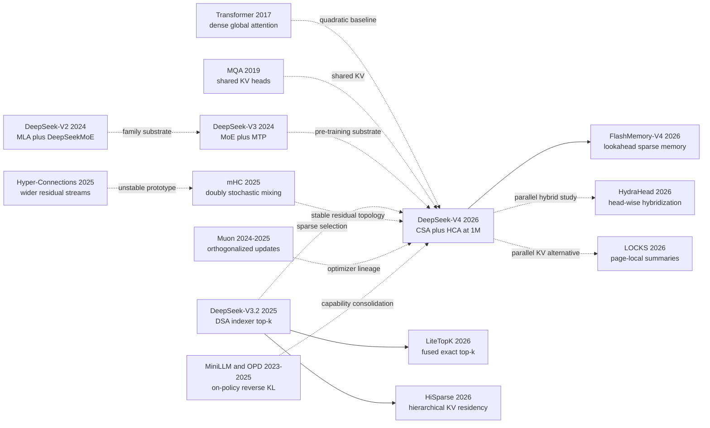

# DeepSeek-V4: Making Million-Token Context an Architectural Problem

> On April 26, 2026, the [DeepSeek-V4 technical report](https://arxiv.org/abs/2606.19348) treated “one million tokens” as more than a context-limit setting. It split the bill: Pro carries 1.6T total parameters but activates 49B per token, while Flash is 284B/13B; CSA compresses every four positions before top-k selection, HCA keeps one coarse global entry per 128 positions, and mHC plus Muon make the more intricate network trainable. The report estimates that Pro at one million tokens uses 27% of V3.2's single-token FLOPs and 10% of its KV cache. The hook is inseparable from the risk: accepting one million tokens is not the same as remembering them without loss. MRCR already declines beyond 128K, while component ablations, independent latency replication, and total training cost remain unavailable. This is a preview report observed for only a few months, not an established historical turning point; its compelling move is to recast long context from a product quota into a memory-hierarchy problem.

## TL;DR

DeepSeek-AI's 2026 arXiv technical report turns the V2/V3 idea of feature-axis KV compression and V3.2's DSA top-k over per-position latents into a sequence-level memory hierarchy. CSA compresses candidates at m=4 before retrieval; HCA preserves a cheap dense global path at m'=128; a 128-token sliding window protects local detail; and mHC plus Muon support Flash at 284B total/13B active parameters and Pro at 1.6T/49B. Writing the effective state as $N_{\mathrm{visible}}\ll n$ captures the real move: the achievement is not setting n to 1,048,576, but reporting that Pro at that length uses 27% of V3.2's equivalent-FP8 single-token FLOPs and 10% of its KV cache, with Flash at 10% and 7%. Flash and Pro are pre-trained on 32T and 33T tokens, respectively, before more than ten specialists are consolidated through full-vocabulary on-policy reverse-KL distillation.

The displaced baseline is not a dense Transformer that merely scored worse. It is the V3.2 path whose agent trajectories already overflowed 128K, and whose DSA reduced reads without first reducing candidate state. In the report's common internal base-model harness, LongBench-V2 rises from V3.2's 40.2 to Flash's 44.7 and Pro's 51.5, yet BigCodeBench regresses from 63.9 to 56.8/59.2; MRCR also declines beyond 128K. V4 joins [DeepSeek-R1's test-time scaling](/en/era5_genai_explosion/2025_deepseek_r1/) with [FlashAttention's IO-aware discipline](/en/era4_foundation_models/2022_flashattention/), but its lasting influence remains unknown. The counterintuitive lesson is that inference should sparsify long-lived state while post-training may need the teacher's full vocabulary distribution: “sparse” only helps when applied to the right resource axis.

---

## Historical Context

### 2024-2026: Context windows grew, but the attention bill did not disappear

DeepSeek-V2 established the family's architectural direction in May 2024: 236B total parameters, 21B activated per token, 8.1T pre-training tokens, Multi-head Latent Attention (MLA) to compress KV representations, and DeepSeekMoE to sparsify the feed-forward computation. It supported 128K context; the report's own comparison claimed a 93.3% smaller KV cache and up to 5.76 times higher maximum generation throughput. That result invited an easy misconception: once KV had been compressed into a latent vector, long context was merely a systems problem. MLA primarily compressed the representation at each position, however. The number of cached positions still grew with sequence length.

DeepSeek-V3 retained MLA and DeepSeekMoE in December 2024, scaling to 671B total parameters, 37B activated parameters, and 14.8T pre-training tokens while adding auxiliary-loss-free load balancing and Multi-Token Prediction (MTP). Its report disclosed 2.788M H800 GPU hours for the complete training run and emphasized that there had been no irrecoverable loss spike. [DeepSeek-R1 (2025)](/en/era5_genai_explosion/2025_deepseek_r1/) then moved test-time scaling to center stage: longer trajectories, self-checking, and tool use exchanged more inference work for stronger reasoning. The bottleneck consequently shifted. MoE could make parameter activation sparse, but long reasoning traces and multi-turn agents kept enlarging the context; standard attention still cost roughly $O(n^2d)$, and autoregressive decoding still read historical KV state at every step.

DeepSeek-V3.2 introduced DeepSeek Sparse Attention (DSA) in December 2025. A lightweight indexer scored historical KV entries, while the core attention read only the top-k positions. Starting from a V3 checkpoint already extended to 128K, its authors trained the indexer for 2.1B tokens and then jointly trained model and indexer for about 943.7B tokens. DSA reduced how much history a decode step read, but it did not first reduce how many historical positions had to be represented. The V3.2 report also documented the boundary directly: more than 20% of its search-agent cases exceeded 128K, and redundant self-verification could push trajectories beyond the window. By 2026, the question was no longer whether a configuration could advertise a larger limit. Training, prefill, token-by-token decoding, KV residency, and state recovery all had to remain affordable at once.

### Five predecessor lines that forced V4 into existence

The first line begins with the 2017 [Transformer](https://arxiv.org/abs/1706.03762). Global attention allowed any two positions to interact directly, but doubling length quadrupled the attention matrix; at $n=10^6$, having every query inspect every key was no longer a reasonable default. The second line comprises MQA and GQA. Noam Shazeer's [MQA (2019)](https://arxiv.org/abs/1911.02150) shared one KV set across query heads, while [GQA (2023)](https://arxiv.org/abs/2305.13245) interpolated between MHA and MQA. Both reduced KV width per token, not the number of tokens.

The third line is DeepSeek's own MLA/DeepSeekMoE progression from [V2](https://arxiv.org/abs/2405.04434) to [V3](https://arxiv.org/abs/2412.19437). MLA projected each position's keys and values into a lower-dimensional latent representation; MoE separated total parameter capacity from per-token computation. The fourth is [V3.2's DSA](https://arxiv.org/abs/2512.02556), which showed that a learned indexer could select a small set of useful positions from a long sequence, although those candidates remained per-token latent entries. V4's CSA composes the operations: compress along the sequence axis first, then run DSA over the compressed entries. HCA goes further by accepting a larger compression ratio in exchange for a cheap dense global path.

The fifth line lies outside attention. [Hyper-Connections](https://openreview.net/forum?id=9FqARW7dwB), published at ICLR 2025, widened the residual stream into multiple channels but weakened the stabilizing identity-mapping property. DeepSeek's [mHC](https://arxiv.org/abs/2512.24880) constrained residual mixing with doubly stochastic matrices. In parallel, Keller Jordan's [Muon](https://kellerjordan.github.io/posts/muon/) approximately orthogonalized two-dimensional parameter updates with Newton-Schulz iterations, and the Moonlight work supplied a large-model scaling recipe. V4 placed mHC and Muon in the same trillion-parameter run. Its ambition was therefore broader than cache reduction: a wider residual topology and more aggressive optimization also had to train together.

### What the DeepSeek team was doing at the time

V4 was not a new family built from a blank slate. It retained V3's DeepSeekMoE, auxiliary-loss-free balancing, and MTP. The MoE affinity changed from Sigmoid to Sqrt(Softplus), the first three MoE layers used token-ID Hash routing, and unspecified details defaulted to V3. Attention changed more radically: MLA was no longer the principal attention block, while V3.2's indexer idea moved inside CSA and alternated with HCA. The residual path adopted mHC, released separately at the end of 2025, and the optimizer followed the public 2024-2025 Muon line.

The continuity extended into post-training. R1 and V3.2 had already accumulated experience with GRPO, reasoning modes, and synthetic agent tasks. V4 still used SFT and GRPO to cultivate separate mathematics, coding, agent, and instruction-following specialists, but it no longer relied on one mixed-RL stage to blend them. A unified student instead matched the full-vocabulary distributions of more than ten teachers on trajectories sampled from the student itself. The report called this multi-teacher on-policy distillation (OPD). The object named “V4” thus spans three co-designed layers: a pre-training architecture, a systems stack for million-token execution, and a post-training pipeline that consolidates domain policies into one set of weights.

The report also needs the right temporal label. arXiv v1 is dated April 26, 2026, and explicitly calls the models preview versions; the Hugging Face Pro and Flash repositories were created on April 22 and the public collection continued to change afterward. At this note's September 14, 2026 evidence cutoff, the observation window was only a few months. It is accurate to say that V4 released a checkable million-token architecture and weights. It is too early to assign durable historical status.

### From H800 clusters to heterogeneous KV: architecture and systems became one design

At a million tokens, the line between model structure and implementation becomes thin. V4's CSA and HCA layers produce caches of different sizes. A 128-token sliding window retains recent uncompressed positions, and tail states that have not yet filled a compression block need separate storage. Conventional PagedAttention assumes broadly uniform KV-block shapes across layers. V4 therefore defines a heterogeneous layout around blocks covering $\operatorname{lcm}(m,m')$ original tokens and treats both sliding-window state and incomplete tails as a state cache. Shared prefixes can also reside on disk: compressed entries are stored directly, while the latest SWA state is recomputed from those entries instead of writing every layer's roughly eight-times-larger SWA cache to SSD.

Training likewise required more than replacing an attention class. Muon needs a complete gradient matrix for orthogonalization and therefore conflicts with ordinary ZeRO partitioning; the report introduces hybrid ZeRO buckets. mHC increases activation memory and pipeline traffic; recomputation and fused kernels limit its overhead to 6.7% of the overlapped 1F1B stage. CSA's top-k choices also force context parallelism to know exactly which compressed blocks each query accesses. The paper additionally releases an MoE mega-kernel, TileLang kernels, batch-invariant deterministic kernels, and the DSec sandbox used for agent post-training. The historical point is not a particular accelerator brand. At million-token scale, the attention equation, cache layout, parallel schedule, low-precision format, and failure recovery become parts of the same algorithm.

## Background and Motivation

### The three bills behind one million tokens

The first bill is computation. Dense-attention prefill grows approximately with $n^2$ per layer, and every newly decoded token must interact with historical state. The second is memory and bandwidth. Even when MLA narrows per-position KV, a million-position cache remains costly if every layer retains one state per position. The third is trainability: the model must see meaningful million-token examples, the indexer must retain distant evidence, and MoE routing, residual flow, and low-precision arithmetic must remain stable in exceptionally long batches.

V4's target is therefore not a single “maximum context” number. It seeks to preserve local detail, remote retrieval, and model capacity while reducing the state available to each step. CSA first uses $m=4$ to cut the position count by four and then selects top-k entries; HCA creates a cheaper, coarser global path with $m'=128$; a 128-token sliding window restores detail hidden inside the current compression block. Pro and Flash both declare 1,048,576 maximum positions, but they use different top-k values, layer counts, hidden sizes, and expert counts. They are two capability-cost operating points, not one model stretched across every budget.

### Why V3.2 was insufficient, and why V4 is not the final answer

V3.2 changed core attention from “read all history” to “read the history selected by an indexer,” but it still maintained per-position KV candidates and stopped at 128K. V4's decisive extension is sequence-axis compression: it shrinks the candidate set before sparse selection, while interleaved HCA layers retain only one global entry per 128 tokens. The report consequently estimates that, at one million tokens, Pro uses 27% of V3.2's single-token equivalent-FP8 FLOPs and 10% of its KV cache; Flash uses 10% and 7%. These are author-supplied architectural estimates rather than independently replicated latency measurements. They quantify theoretical work and storage removed by the design, not a guaranteed speedup on every server.

Compression can discard information, top-k can miss evidence, and mixed layers create new training and cache-management complexity. The report shows MRCR degradation beyond 128K. Its conclusion also admits that risk reduction left the architecture with many preliminarily validated components, and that the mechanisms behind Anticipatory Routing and SwiGLU Clamping remain poorly understood. V4's research motivation therefore ends with an open question: can a million tokens become a stable, low-latency, verifiable workspace rather than an occasional upper limit? The report offers a concrete and inspectable answer, but in 2026 it cannot yet offer the final one.

---

## Method Deep Dive

### Overall architecture: not a larger V3, but a new answer to what to store, read, and update

DeepSeek-V4 remains a decoder-only Transformer combined with sparse MoE, but the important path through one forward pass differs from V2 and V3. V2/V3's MLA primarily compressed each token's KV state along the feature axis. V3.2 added a learned indexer over those per-token entries and let core attention read only the top-k. V4 compresses multiple positions into one entry along the sequence axis before deciding which entries to read. That order matters: the candidate memory first falls from n positions to n/4 or n/128 compressed blocks, and only then does sparse selection occur.

```text
tokens
  -> embedding
  -> [SWA-only or HCA warm-up layers]
  -> repeated Transformer blocks
       -> mHC input mixing
       -> CSA (compress by 4, then top-k) OR HCA (compress by 128, dense)
       -> 128-token local sliding-window branch
       -> grouped output projection
       -> mHC residual mixing
       -> DeepSeekMoE (1 shared + top-6 routed experts)
  -> MTP depth 1 during pre-training
  -> language-model head
  -> specialist SFT/GRPO
  -> multi-teacher full-vocabulary OPD
```

Ignoring projection constants, dense attention is governed by the complete position set during prefill and cumulative decoding. V4 splits each layer's visible memory into a compressed global component and a fixed local window:

$$
N_{\text{CSA}}(n) \approx \min(k,n/m)+n_{\text{win}},\qquad
N_{\text{HCA}}(n) \approx n/m'+n_{\text{win}}.
$$

At n=1,048,576, m=4, m'=128, and n_win=128. Pro's CSA selects 1,024 entries from as many as 262,144 compressed candidates, while Flash selects 512; HCA's global path contains about 8,192 compressed entries. These are not two implementations of the same function. CSA preserves finer remote selection, whereas HCA trades granularity for a cheap, stable, dense global path.

| Configuration | DeepSeek-V4-Flash | DeepSeek-V4-Pro |
|---|---:|---:|
| Reported total / activated per token | 284B / 13B | 1.6T / 49B |
| Transformer layers / hidden size | 43 / 4096 | 61 / 7168 |
| routed experts / shared expert | 256 / 1 | 384 / 1 |
| routed top-k per token | 6 | 6 |
| CSA compression / attention top-k | 4 / 512 | 4 / 1024 |
| HCA compression / local window | 128 / 128 | 128 / 128 |
| query heads / head dimension | 64 / 512 | 128 / 512 |
| mHC expansion / Sinkhorn iterations | 4 / 20 | 4 / 20 |
| pre-training tokens | 32T | 33T |
| maximum positions | 1,048,576 | 1,048,576 |

The table follows the report's 284B/1.6T convention. The Hugging Face collection API automatically counts about 290.9B parameters for post-trained Flash and about 1.599T for Pro. Official material does not explain Flash's roughly 7B discrepancy, so it should not be casually attributed to MTP, quantization metadata, or tied weights.

### Key design 1: CSA compresses the sequence before sparse retrieval

**Function.** Compressed Sparse Attention (CSA) addresses the fact that the candidate set itself remains too large. Given input H, the model produces two KV streams C^a and C^b and per-dimension weights Z^a and Z^b. Compressed entry i summarizes the current m-token block through branch a and the preceding block through branch b. Adjacent blocks therefore share an information path, while the output count remains n/m:

$$
\begin{aligned}
[S^a_i;S^b_i] &= \operatorname{Softmax}_{\rm row}([Z^a_i+B^a;Z^b_{i-1}+B^b]),\\
C_i^{\rm Comp} &= \sum_{j\in i}S^a_j\odot C^a_j+\sum_{j\in i-1}S^b_j\odot C^b_j.
\end{aligned}
$$

After compression, the lightning indexer reuses a low-rank query latent and forms a weighted sum of multi-head ReLU similarities. It ranks memory but does not itself produce the language-model output:

$$
I_{t,s}=\sum_{h=1}^{n_h^I}w^I_{t,h}\operatorname{ReLU}\!\left(q^I_{t,h}\cdot K^{\rm IComp}_s\right),\qquad
\mathcal C_t=\operatorname{TopK}_k(I_{t,:}).
$$

Each selected compressed entry serves as both key and value, shared across all query heads in MQA fashion. V4 also groups and reduces query-head outputs before projecting back to hidden size, avoiding one enormous projection from 128 heads of dimension 512 directly into a 7168-dimensional residual state.

```python
def csa(hidden, compression=4, top_k=1024, window=128):
    compressed_kv = weighted_overlap_compress(hidden, block=compression)
    index_keys = weighted_overlap_compress(index_projection(hidden), block=compression)
    scores = lightning_indexer(hidden, index_keys)
    selected = gather_topk(compressed_kv, scores, k=top_k)  # magic: select after compression
    local_kv = sliding_window_kv(hidden, size=window)
    return shared_kv_mqa(hidden, concat(selected, local_kv))
```

| Scheme | Sequence compressed first | Core attention reads | Principal risk |
|---|---:|---:|---|
| Dense MHA | No | all n positions, independent KV per head | prohibitive FLOPs and KV |
| MLA | No | all n low-dimensional latents | narrower cache still grows with n |
| V3.2 DSA | No | top-k per-position latents | candidate KV remains per-position |
| V4 CSA | Yes, m=4 | top-k compressed entries + 128 local | compression loss and indexer misses |

**Design motivation.** Top-k alone reduces core-attention reads but can leave candidate KV and index keys filling HBM. Block compression alone can average away the single decisive token in a segment. CSA composes them: learned weighted compression tries to preserve salient block features, the indexer retrieves across blocks, and the sliding window restores nearby detail hidden by the current block's causal boundary. One counterintuitive detail is that every CSA entry sees 2m inputs but length still falls by 1/m. The overlap is not weaker compression; it is an information buffer across block boundaries.

### Key design 2: HCA trades heavier compression for a dense global path

**Function.** Heavily Compressed Attention (HCA) does not run top-k. It combines every m'=128 positions into one KV entry with per-dimension softmax weights, then applies shared-KV MQA over every compressed entry:

$$
S_i=\operatorname{Softmax}_{\rm row}(Z_i+B),\qquad
C_i^{\rm Comp}=\sum_{j=m'i}^{m'(i+1)-1}S_j\odot C_j,
\qquad |C^{\rm Comp}|=n/m'.
$$

```python
def hca(hidden, compression=128, window=128):
    compressed_kv = weighted_block_compress(hidden, block=compression)
    local_kv = sliding_window_kv(hidden, size=window)
    global_and_local = concat(compressed_kv, local_kv)  # magic: dense over a tiny global memory
    return grouped_output_projection(shared_kv_mqa(hidden, global_and_local))
```

| Property | CSA | HCA |
|---|---:|---:|
| compression ratio | 4 | 128 |
| remote read pattern | learned top-k | dense over all compressed entries |
| remote-entry scale for Pro at 1M | 1024 selected | 8192 compressed |
| advantage | fine retrieval with fixed reads | global coverage without a top-k hit |
| cost | indexer and gather complexity | each summary carries 128 tokens, hence coarser information |

**Why a hybrid is more sensible than either extreme.** If every layer used CSA, global communication would depend on discrete indexer choices and repeated misses could compound. If every layer used HCA, 128:1 compression would struggle with exact citations, code symbols, and multi-needle detail. V4 interleaves the two: HCA behaves like a low-bandwidth global bus, while CSA is fine-grained on-demand memory. Flash begins with two pure sliding-window layers before alternating; Pro begins with two HCA layers before alternating. Both attention types also add per-head RMSNorm, apply RoPE only to the last 64 dimensions, counter-rotate outputs, and include a learnable attention sink. Together these details address exploding logits, local blind spots, and positional contamination introduced by compression.

### Key design 3: mHC constrains multi-stream residual mixing to a stable manifold

**Function.** A conventional residual connection carries one state stream. Hyper-Connections (HC) expands it to n_hc streams and dynamically produces an input map A_l, residual map B_l, and output map C_l for every layer:

$$
X_{l+1}=B_lX_l+C_l\mathcal F_l(A_lX_l),\qquad
X_l\in\mathbb R^{n_{\rm hc}\times d}.
$$

An unconstrained B_l can amplify or cancel signals, creating numerical instability when deeply stacked. mHC projects B_l onto the Birkhoff polytope, the nonnegative set whose rows and columns each sum to one:

$$
B_l\in\mathcal M=\{M\ge0\mid M\mathbf1=\mathbf1,\ \mathbf1^TM=\mathbf1^T\},
\qquad \|B_l\|_2\le1.
$$

V4 exponentiates the raw matrix and then alternates row and column normalization for 20 iterations. A_l uses a sigmoid and C_l uses twice a sigmoid, preventing unbounded amplification and arbitrary signed cancellation. Closure means that products of B_l matrices remain in the same set, supplying a composable stability boundary for deep signal propagation.

```python
def mhc(residual_streams, layer_fn, raw_a, raw_b, raw_c, iterations=20):
    a = sigmoid(raw_a)
    c = 2.0 * sigmoid(raw_c)
    b = exp(raw_b)
    for _ in range(iterations):
        b = b / b.sum(dim=-1, keepdim=True)
        b = b / b.sum(dim=-2, keepdim=True)  # magic: project toward doubly stochastic
    layer_input = a @ residual_streams
    return b @ residual_streams + c @ layer_fn(layer_input)
```

| Residual scheme | residual width | dynamic mixing | stability constraint | role in V4 |
|---|---:|---:|---:|---|
| Standard residual | 1 | No | identity shortcut | V3 baseline |
| HC | n_hc | Yes | none | expressive but unstable |
| mHC | 4 | Yes | doubly stochastic B_l, bounded A_l/C_l | every V4 Transformer block |

**Motivation and cost.** mHC adds residual-topology capacity rather than multiplying the attention or FFN hidden size by four; the actual sublayer input A_l X_l remains d-dimensional. It therefore offers multiple state paths at modest arithmetic cost. The burden moves to activations, memory access, and pipeline communication. V4 uses fused kernels, recomputation, and a modified DualPipe 1F1B schedule to hold the reported stage wall-time overhead to 6.7%. That number does not make mHC free; it measures the remaining cost after systems co-design.

### Key design 4: Muon orthogonalizes matrix updates without evicting AdamW everywhere

**Function.** Muon accumulates momentum and then approximately orthogonalizes the update of a two-dimensional weight. If M=UΣV^T, the target direction is close to UV^T, preventing a few large singular directions from dominating all neuron updates. V4 uses the Newton-Schulz polynomial:

$$
M_j=aM_{j-1}+b(M_{j-1}M_{j-1}^T)M_{j-1}
+c(M_{j-1}M_{j-1}^T)^2M_{j-1}.
$$

The first eight iterations use (3.4445,-4.7750,2.0315) to approach the semi-orthogonal set quickly; the final two switch to (2,-1.5,0.5) to stabilize singular values at one. With Nesterov momentum, weight decay, and RMS rescaling, the update is:

$$
O_t=\operatorname{HybridNS}(\mu M_t+G_t)\sqrt{\max(r,c)}\,\gamma,
\qquad W_t=(1-\eta\lambda)W_{t-1}-\eta O_t.
$$

```python
def v4_muon_step(weight, grad, momentum, lr, mu=0.95, wd=0.1, gamma=0.18):
    momentum = mu * momentum + grad
    update = mu * momentum + grad
    update = newton_schulz(update, steps=8, coeffs=(3.4445, -4.7750, 2.0315))
    update = newton_schulz(update, steps=2, coeffs=(2.0, -1.5, 0.5))  # magic: exact stabilization
    update *= max(weight.shape) ** 0.5 * gamma
    weight = weight * (1.0 - lr * wd) - lr * update
    return weight, momentum
```

| Parameter type | Optimizer | Reason |
|---|---|---|
| Most 2D hidden weights in attention/FFN | Muon | exploit matrix geometry and orthogonalized updates |
| Embedding and prediction head | AdamW | original Muon evidence does not support input/output layers |
| RMSNorm weights | AdamW | vector parameters do not admit 2D orthogonalization |
| mHC static biases and gating factors | AdamW | scalar/small parameters do not fit Muon |

**Design motivation.** V4 neither copies the original five-step Muon nor Kimi's QK-Clip. It extends the schedule to ten iterations with two coefficient regimes. Because its attention already applies RMSNorm directly to queries and KV entries, the report says QK-Clip is unnecessary. The training system must also resolve Muon's conflict with ZeRO: orthogonalization needs a complete logical matrix, while ZeRO wants to shard gradients. V4 forms hybrid buckets where possible and redundantly computes updates across extra data-parallel groups when parallelism exceeds the bucket limit, trading some computation for bounded bucket memory.

### Training curriculum and stability: one million is not a RoPE factor edit

Both models begin with 4K sequences and extend them through 16K, 64K, and 1M. Flash keeps dense attention for its first 1T tokens and introduces sparsity only at the 64K phase, with a short lightning-indexer warm-up before joint sparse training. Pro has a longer dense phase, but the report does not disclose its token count. Both use YaRN-style RoPE scaling; the official configs specify 65,536 original positions and a factor of 16. Positional extrapolation is only one component and cannot replace long-sequence data or the attention curriculum.

| Training item | Flash | Pro |
|---|---:|---:|
| pre-training tokens | 32T | 33T |
| max token batch | 75.5M | 94.4M |
| LR warmup | 2000 steps | 2000 steps |
| peak -> end LR | 2.7e-4 -> 2.7e-5 | 2.0e-4 -> 2.0e-5 |
| AdamW beta1 / beta2 / epsilon | 0.9 / 0.95 / 1e-20 | 0.9 / 0.95 / 1e-20 |
| Muon momentum / weight decay / RMS | 0.95 / 0.1 / 0.18 | 0.95 / 0.1 / 0.18 |
| length curriculum | 4K -> 16K -> 64K -> 1M | 4K -> 16K -> 64K -> 1M |
| disclosed dense stage | first 1T tokens | longer than Flash; exact length undisclosed |

Trillion-parameter MoE training still produced loss spikes. The team associated them with MoE outliers and observed that routing intensified the cycle. Anticipatory Routing computes features at step t with current parameters but obtains routing decisions from historical parameters theta_(t-delta). A detector triggers a short rollback and enables the mode only after a spike. Precomputed routing adds about 20% wall time while enabled; the report says intermittent activation keeps total overhead negligible. The second guard is SwiGLU clamping: the linear branch is clipped to [-10,10] and the gate branch has an upper bound of 10. The paper explicitly says their mechanisms remain insufficiently understood. They are successful engineering interventions, not a completed theory of stability.

### Key design 5: cultivate specialists, then consolidate them with full-vocabulary OPD

**Function.** Post-training first applies high-quality SFT separately to mathematics, coding, agent, and instruction-following domains, followed by GRPO with the relevant prompts, verifiers, or generative reward model. Different specialists use distinct length penalties and context budgets, producing Non-think, Think High, and Think Max effort regimes. A unified student then matches more than ten teachers on trajectories sampled by that same student:

$$
\mathcal L_{\rm OPD}(\theta)=\sum_{i=1}^{N}w_iD_{\rm KL}
\!\left(\pi_\theta(\cdot\mid x,y_{<t})\,\|\,\pi_{E_i}(\cdot\mid x,y_{<t})\right),
\qquad N>10.
$$

```python
def multi_teacher_opd(student, teachers, prompts, teacher_weights):
    trajectories = student.sample(prompts)  # on-policy states come from the student
    student_logits = student.logits(trajectories)
    loss = 0.0
    for teacher, weight in zip(teachers, teacher_weights):
        teacher_logits = teacher.full_vocab_logits(trajectories)
        loss += weight * reverse_kl(student_logits, teacher_logits)  # magic: dense token supervision
    return loss
```

| Consolidation method | Training states come from | Supervision density | Main problem |
|---|---|---|---|
| Weight merging | separate teacher weights | none | parameter spaces misalign and skills interfere |
| Mixed RL | student rollout | sequence-level reward | sparse reward and conflicting domains |
| sampled-token OPD proxy | student rollout | one sample per token | high gradient variance; reported unstable in V4 |
| full-vocabulary OPD | student rollout | full distribution per token | expensive teacher logits and scheduling |

V4 chooses the most expensive but densest final row. It does not materialize and store every teacher's full logits. It caches each teacher's final hidden states, loads prediction heads one at a time during training, and reconstructs the vocabulary distribution on demand. Samples are ordered by teacher index so that at most one teacher head resides on device within a mini-batch. **The counterintuitive choice is that V4 saves inference state with sparse attention but deliberately preserves the full vocabulary during OPD. It rejects the sparser token-level KL proxy because sparsity at this stage raises training variance.**

Finally, post-trained checkpoints apply MXFP4 QAT to MoE expert weights and the CSA indexer QK path, while most remaining parameters use mixed FP8. Index scores fall from FP32 to BF16; the report claims a twofold top-k selector speedup with 99.7% KV-entry recall. Existing hardware gives FP4-by-FP8 and FP8-by-FP8 the same peak FLOPs, so the report's possible one-third future improvement is a hardware projection, not a current measurement. The method's logic is now complete: sequence compression reduces long-lived state, MoE reduces activated parameters per token, mHC and Muon support large-scale training, and OPD reunifies capabilities learned by separate specialists.

---

## Failed Baselines

### The architectural baselines V4 beat, and what they actually lost on

**Dense MHA/GQA8.** Full attention did not lose because its quality was poor. It lost because it treated “every historical position deserves exact storage and a read” as an architectural axiom. The V4 report uses BF16 GQA8 with head dimension 128 as a storage baseline and estimates V4's one-million-token KV cache at about 2% of that reference. The ratio combines sequence compression, MQA-style shared KV, and FP8/BF16 mixed storage. It cannot be credited to one module, and it is not a throughput measurement. Dense attention's failure is the resource curve, not benchmark accuracy.

**V2/V3 MLA.** MLA already compressed each position into a narrow KV latent and was much more efficient than ordinary GQA, but it still retained one candidate state for every position. V3's 671B-total/37B-active model could therefore operate at 128K without eliminating linear cache growth in sequence length. V4 does not invalidate MLA. It recognizes that feature-axis compression and sequence-axis compression pay different bills.

**V3.2 DSA.** DSA let a query read only the top-k per-position latents chosen by an indexer, decoupling core-attention FLOPs from full length for the first time in the family. Every candidate latent and the index path nevertheless continued to exist. At one million tokens, V4 estimates Pro at 27% of V3.2's single-token FLOPs and 10% of its KV cache, with Flash at 10% and 7%. This is the report's strongest evidence for CSA/HCA resource efficiency, but it does not isolate the individual contribution of compression, top-k, layer ratio, low precision, or grouped projection.

**One sparse or compressed mechanism used everywhere.** Pure top-k can miss distant evidence; uniform 128:1 compression can erase exact symbols. V4 does not claim one universal attention operator. It alternates CSA and HCA and adds a 128-token local window, allowing different approximation errors to compensate for one another. The winning object is a portfolio of error modes, not one operator that dominates every baseline.

### Failures and repairs the authors explicitly acknowledge

The first failure occurred during pre-training. Trillion-parameter MoE runs developed loss spikes. Simple rollback restored the run only temporarily and did not prevent recurrence. The team connected the spikes to MoE outliers and a routing feedback loop, eventually adding triggered Anticipatory Routing and SwiGLU Clamping. The former adds about 20% wall time while active; the latter clips the linear branch to [-10,10] and caps the gate at 10. The paper reports empirical success and admits in its conclusion that the underlying mechanisms remain unclear. This was not a theoretically predicted intervention. Production training hit a wall, and monitoring plus constraints rescued the run.

The second failure arose while merging capabilities. The paper says V3.2-style mixed RL was entirely replaced by OPD in V4. A common sampled-token KL proxy can reuse RL infrastructure, but it produced high-variance gradients and training instability. V4 instead pays for full-vocabulary teacher forwards, hidden-state caching, and prediction-head scheduling to compute exact reverse KL. The inferior baseline here is not a weaker model in a score table. It is a cheaper consolidation algorithm that was insufficiently stable.

The third failure is architectural complexity itself. The conclusion states that the pursuit of extreme long-context efficiency under controlled risk retained many “preliminarily validated” components and tricks, leaving an inelegant architecture. The paper provides no unified component-ablation table for CSA-only, HCA-only, mHC removal, AdamW in place of Muon, local-window removal, or different CSA:HCA ratios. Readers can inspect the reported complete system, but this paper does not quantify which pieces are necessary. That missing evidence matters more than a synthetic module losing 0.2 points because it limits transferable conclusions.

The fourth failure appears in post-training and product behavior. After filtering roughly 200 internal coding tasks down to 30, V4-Pro-Max obtained a 67% pass rate, below Opus 4.5 at 70% and Opus 4.6 Thinking at 80%. A survey of 85 internal developers also mentioned trivial errors, misreading vague prompts, and occasional over-thinking. On high-constraint or multi-turn Chinese writing, V4-Pro scored 45.9% against Opus 4.5's 52.0%. DeepSeek constructed and judged these evaluations, so they are not independent product rankings, but the report at least preserves concrete losing cases.

### Counterexamples at one million tokens and maximum reasoning effort

“Supports 1M” does not mean quality is constant throughout the window. The report's MRCR curve is relatively stable through 128K and begins to fall afterward. At one million tokens, V4-Pro-Max scores 83.5, above Gemini-3.1-Pro's 76.3 in the same evaluation but below Claude Opus 4.6's 92.9. On the more realistic CorpusQA 1M, V4-Pro-Max reaches 62.0, again between Opus at 71.7 and Gemini at 53.8. GPT-5.4 was excluded because its API failed to answer a large fraction of one-million-token requests. Ultra-long evaluation therefore tests not just a model, but API limits and serving reliability.

More reasoning budget is not monotonically better on every task. Flash falls from 86.4 in High mode to 86.2 in Max on MMLU-Pro. Pro falls from 74.2 to 73.6 on MCPAtlas Public. These gaps are small and may be within sampling variation, but they falsify the simple claim that Max must always win. Its benefits cluster on the hardest mathematics, coding, and long-horizon agent tasks. On a knowledge multiple-choice test or tool-routing benchmark, extra trajectory can simply consume more tokens.

Model size also fails to govern every row. In the base table, V3.2 scores 63.9 on BigCodeBench versus Flash's 56.8 and Pro's 59.2. V3.2 obtains 87.6 on BBH versus Pro's 87.5. Flash leads MGSM and CMath. The report treats gaps no larger than 0.3 as ties, so even the authors' own convention does not support “Pro wins every benchmark.” Greater capacity clearly helps Pro on SimpleQA and FACTS Parametric, but architecture and data changes still introduce local regressions.

### The real anti-baseline lesson

V4's useful engineering lesson is not that sparse attention defeated dense attention. It is to **decompose the resource objective and assign different errors to different approximations**. MLA compresses features, CSA compresses and retrieves along the sequence, HCA supplies coarse global coverage, SWA preserves nearby detail, heterogeneous and on-disk caches make deployment feasible, and mHC plus Muon keep training workable. No single component explains one million tokens.

That system-level victory also raises the burden of proof. Without component ablations, identical-hardware latency, end-to-end cost, and external reproduction, 27% FLOPs or 10% KV establishes a lighter architecture on paper but not the same multiple of speedup for every workload. The engineering principle should read: “sparsify state size, read volume, and active capacity separately, then publish their failure boundaries,” not “larger model, longer window, higher score.”

## Key Experimental Data

### Efficiency and base models: the cleanest predecessor comparison

Figure 1 takes V3.2 as 100% and compares single-token equivalent-FP8 FLOPs with accumulated KV cache at one million tokens. Its labels and the prose percentages differ slightly through rounding: Pro is marked about 3.7 times lower in FLOPs and 9.5 times smaller in KV, while Flash is 9.8 and 13.7 times. The table below uses the prose's integer percentages rather than inventing absolute endpoint T-FLOP or GB values absent from the figure.

| Model | 1M single-token FLOPs (V3.2=100) | 1M KV cache (V3.2=100) | Interpretation |
|---|---:|---:|---|
| DeepSeek-V3.2 | 100% | 100% | DSA with per-position latent candidates |
| **DeepSeek-V4-Pro** | **27%** | **10%** | m=4 CSA + m'=128 HCA, 49B active |
| **DeepSeek-V4-Flash** | **10%** | **7%** | smaller model and top-k=512, 13B active |

Base models are evaluated in one internal framework and are therefore closer to an apples-to-apples comparison than instruct models accessed through different APIs. The table preserves both wins and regressions:

| Model | Total / active parameters | MMLU-Pro EM | LongBench-V2 EM | BigCodeBench Pass@1 |
|---|---:|---:|---:|---:|
| DeepSeek-V3.2-Base | 671B / 37B | 65.5 | 40.2 | **63.9** |
| DeepSeek-V4-Flash-Base | 284B / 13B | 68.3 | 44.7 | 56.8 |
| **DeepSeek-V4-Pro-Base** | **1.6T / 49B** | **73.5** | **51.5** | 59.2 |

Flash raises LongBench-V2 from 40.2 to 44.7 with roughly one-third as many active parameters, the clearest support for a more effective parameter and long-context design. Its BigCodeBench regression shows that 32T tokens and a new architecture did not automatically preserve every coding distribution.

### Post-trained models versus frontier APIs: read the losses beside the highlights

The next table is transcribed from the report's combined comparison. Reasoning effort, available APIs, harnesses, and sampling conditions are not fully equivalent across providers. A dash means the report obtained no result, not a zero.

| Benchmark | Opus-4.6 Max | GPT-5.4 xHigh | Gemini-3.1-Pro High | K2.6 Thinking | GLM-5.1 Thinking | DS-V4-Pro Max |
|---|---:|---:|---:|---:|---:|---:|
| MMLU-Pro EM | 89.1 | 87.5 | **91.0** | 87.1 | 86.0 | 87.5 |
| LiveCodeBench Pass@1 | 88.8 | - | 91.7 | 89.6 | - | **93.5** |
| MRCR 1M MMR | **92.9** | - | 76.3 | - | - | 83.5 |
| CorpusQA 1M ACC | **71.7** | - | 53.8 | - | - | 62.0 |
| Terminal Bench 2.0 Acc | 65.4 | **75.1** | 68.5 | 66.7 | 63.5 | 67.9 |
| SWE Verified Resolved | **80.8** | - | 80.6 | 80.2 | - | 80.6 |
| Toolathlon Pass@1 | 47.2 | **54.6** | 48.8 | 50.0 | 40.7 | 51.8 |

Knowledge and reasoning evaluations use temperature 1.0. Non-think, High, and Max use 8K, 128K, and 384K evaluation windows. Coding agents run in an internal bash/file-edit harness for at most 500 steps and 512K context; search agents use an internal web-search/Python harness with the same limits. The paper says some K2.6 and GLM-5.1 cells are blank because their APIs were busy. The scores are genuine transcriptions of self-reported results, but the ranking remains sensitive to execution environment.

### Reasoning-effort sweeps, key findings, and the absent ablation

The paper does not release an architectural component ablation. Its closest controlled comparison is an effort-mode sweep on the same checkpoints:

| Benchmark | Flash High | Flash Max | Pro High | Pro Max |
|---|---:|---:|---:|---:|
| MMLU-Pro EM | **86.4** | 86.2 | 87.1 | **87.5** |
| GPQA Diamond Pass@1 | 87.4 | **88.1** | 89.1 | **90.1** |
| MRCR 1M MMR | 76.9 | **78.7** | 83.3 | **83.5** |
| Terminal Bench 2.0 Acc | 56.6 | **56.9** | 63.3 | **67.9** |
| MCPAtlas Public Pass@1 | 67.4 | **69.0** | **74.2** | 73.6 |

- **Long-context efficiency changes by a clear order of magnitude.** Pro's 27% FLOPs/10% KV and Flash's 10%/7% relative to V3.2 are the report's most direct architectural result, although still estimates.
- **A longer window does not preserve flat quality.** MRCR declines after 128K; one million remains useful but not lossless.
- **Flash is not only a budget Pro.** It beats Pro on some multilingual and mathematics rows but trails sharply on knowledge-intensive tasks, preserving a role for active capacity.
- **Test-time scaling helps the hard tail most.** Terminal Bench, GPQA, and MRCR rise from High to Max; MMLU-Pro and MCPAtlas contain small non-monotonic regressions.
- **Pro does not sweep proprietary models.** It is strong on LiveCodeBench, Codeforces, and Apex Shortlist, while knowledge, 1M retrieval, Terminal, and tool tasks each have a clear winner elsewhere.
- **The largest experimental gap is component ablation.** Without equal-budget CSA-only/HCA-only, mHC/standard-residual, and Muon/AdamW controls, the aggregate gain cannot be causally allocated.

The defensible experimental conclusion is therefore narrower than the report's promotional language: DeepSeek reports a V4 family that improves long-context and most capabilities in its common internal base-model harness while sharply reducing estimated architectural cost at one million tokens. Stronger claims about a new open-model state of the art depend on cross-API tests, in-house harnesses, and unavailable samples, and still require external reproduction.

---

## Idea Lineage

### Citation and early-response map



Only one solid outgoing edge denotes a verified direct extension: FlashMemory-DeepSeek-V4 explicitly names the V4 architecture in its title and abstract. LiteTopK and HiSparse begin from the DSA primitive and belong to the systems line shared by V3.2 and V4. HydraHead and LOCKS are same-year alternative answers to hybrid attention or KV selection. Their dotted edges must not be read as unsupported claims that V4 caused them.

### Past lives: the problems that jointly forced V4 into existence

- **2017 · Attention Is All You Need:** The Transformer made global token-to-token interaction a common interface and left quadratic sequence growth as the baseline. V4 keeps attention but rejects the implementation in which every layer, head, and step reads the complete past.
- **2019-2023 · MQA and GQA:** Shared or grouped KV showed that query-head count need not equal KV-head count. V4's CSA/HCA lets every query head share compressed entries and adds grouped output projection to control the wide output matrix.
- **2024 · DeepSeek-V2 / DeepSeekMoE:** V2 used MLA to compress the feature axis and DeepSeekMoE to sparsify FFNs. V4 retains MoE but moves attention's principal compression axis to the sequence. This distinction is why V4 is not merely MLA with a larger position limit.
- **2024 · DeepSeek-V3:** V3 supplied the 671B/37B MoE substrate, auxiliary-loss-free balancing, and MTP. V4 preserves those capacity choices while changing affinity scoring, initial Hash routing, attention, residual connectivity, and the optimizer.
- **2025 · DeepSeek-V3.2:** DSA's lightning indexer learned to choose top-k per-position KV entries. V4's CSA reuses the retrieval idea after compressing the objects being retrieved into four-token entries; HCA creates a global path from 128-token summaries without top-k.
- **2025 · Hyper-Connections and mHC:** HC showed that residual width is a scaling axis independent of hidden size. mHC then used the Birkhoff polytope to constrain dynamic residual mixing to a non-expansive map. V4 places that independent work on its main residual path.
- **2024-2025 · Muon and scalable Muon:** Muon used Newton-Schulz iterations to shape matrix updates; the Moonlight work added weight decay and RMS rescaling for large models. V4 contributes an 8+2 hybrid iteration schedule and hybrid-ZeRO implementation.
- **2023-2025 · MiniLLM and On-Policy Distillation:** Reverse KL lets a student approach a teacher in states the student itself visits. V4 expands the single-teacher idea into full-vocabulary consolidation of more than ten specialists, replacing mixed RL.

These strands originally belonged to four communities: efficient attention, MoE, residual topology, and optimizer/post-training research. V4's historical coordinate is not the endpoint of one strand. It is an open model that binds all four to the systems objective of routinely serving one million tokens. Whether that bundle should remain intact is a question for later ablations and replications.

### Descendants: only early responses as of September 2026

- **Direct derivative:** [FlashMemory-DeepSeek-V4](https://arxiv.org/abs/2606.09079) explicitly trains a lookahead sparse-memory indexer on the V4 architecture. It reports reducing physical GPU KV footprint to 13.5% of a full-context baseline and, at one million tokens, from 3.73 GB to 0.37 GB. It demonstrates that V4's compressed and indexed memory can support further serving work; the numbers remain that follow-up paper's own measurements.
- **Systems work on the same primitive:** [LiteTopK](https://arxiv.org/abs/2607.11976) fuses exact top-k to address global-memory traffic and synchronization in DSA-style indexer selection. [HiSparse](https://arxiv.org/abs/2608.07009) observes that compute sparsity does not bound HBM residency, keeping complete KV in host memory and only a fixed cache on GPU. Both inherit the DSA primitive more directly than the complete CSA/HCA architecture.
- **Parallel cross-architecture exploration:** [Rethinking the Role of Efficient Attention in Hybrid Architectures](https://arxiv.org/abs/2606.15378) finds that efficient layers change how quickly long-range retrieval emerges and documents “Large-Window Laziness.” [HydraHead](https://arxiv.org/abs/2606.20097) moves hybridization from the layer axis to the head axis. They show that V4's layer-wise alternation is one point in a larger design space.
- **Independent KV-selection alternative:** [LOCKS](https://arxiv.org/abs/2607.24555) does not train V4-style compression. It forms a local low-rank key summary per page and selects pages before reading KV. It shares CSA's broad principle, “compute a cheap summary before deciding which KV to read,” but uses an interpretable page-local spectral basis.
- **Cross-task diffusion:** V4's own report applies one-million-token context to coding agents, search, white-collar workflows, and long-document QA. At the evidence cutoff, however, there is not enough long-running independent work to establish CSA/HCA as a general cross-task standard.
- **Cross-disciplinary spillover:** No mature, verified example. A few months of systems papers cannot establish diffusion into scientific computing, databases, or bioinformatics. Leaving this category empty is more reliable than completing it with a plausible-sounding story.

This section deliberately keeps six source-checked groups instead of forcing the template to contain ten follow-ups. Early citation counts, downloads, and repository popularity change quickly and cannot distinguish adoption from baseline comparison or incidental citation. The evidence establishes an active cluster around compressed memory, indexer/top-k, and hybrid granularity. It does not establish that V4 will become the dominant trunk.

### Misreadings and lossy simplifications

1. **“V4 extends 128K to 1M without information loss.”** No. The model is natively trained through one million and its config declares 1,048,576 positions, but MRCR begins to decline beyond 128K. A supported limit describes an operating range, not information conservation.
2. **“A 1.6T model executes 1.6T parameters for every token.”** No. Pro reports 49B activated parameters per token and Flash 13B. MoE reduces FFN computation, while attention and KV use a separate compression and sparsity mechanism. Total parameters, active parameters, and attention state are three different capacities.
3. **“CSA is V3.2 DSA under a new name.”** No. DSA selects top-k per-position latents. CSA first compresses length by four, then selects over compressed index keys, and adds overlapping blocks, shared-KV MQA, grouped output projection, and a local window. HCA is not DSA at all because it performs no top-k selection.
4. **“Muon or mHC caused the benchmark gains.”** The evidence is insufficient. This report has no equal-budget AdamW/Muon or standard-residual/mHC full-model ablation. Both have plausible mechanisms and independent predecessor experiments, but V4's aggregate scores cannot be causally assigned to either.
5. **“The word SOTA in a report means independent confirmation.”** No. Base-model comparisons in one internal framework are relatively clean, while frontier tables mix APIs, reasoning efforts, harnesses, and missing cells. Internal writing, search, and coding-agent sets are even less reproducible. “DeepSeek reports” or “the report estimates” remains the correct language.

Honest intellectual history preserves dotted arrows rather than turning every edge into a victory. In September 2026, the record contains inspectable designs and rapidly appearing engineering responses. There has not yet been enough time to know whether V4 will settle into shared infrastructure like the Transformer, MQA, or MoE.

---

## Modern Perspective

### Assumptions that no longer hold

1. **“Maximum positions equal usable memory capacity.”** Both official configs declare 1,048,576 positions and pre-training progresses through 4K, 16K, 64K, and 1M, yet the report's own MRCR curve declines after 128K. The limit says that the model and serving stack can accept a sequence of that length. It does not say every early fact is equally recoverable or that compressed entries can reconstruct the original text without loss.
2. **“A tenfold reduction in FLOPs and KV produces a tenfold reduction in end-to-end latency.”** The report estimates equivalent-FP8 single-token FLOPs and accumulated KV size. Real serving also pays for the indexer, top-k, gathering, heterogeneous blocks, host or SSD I/O, MoE communication, mHC, and kernel launches. LiteTopK and HiSparse appeared in 2026 precisely around these gaps: one optimizes indexer/top-k memory traffic, while the other shows that complete KV can still exhaust HBM after attention computation becomes sparse.
3. **“More reasoning tokens monotonically improve capability.”** Max usually beats High on GPQA, Terminal Bench, and MRCR, but Flash falls from 86.4 to 86.2 on MMLU-Pro and Pro falls from 74.2 to 73.6 on MCPAtlas. Extra trajectory is allocatable test-time compute rather than free accuracy. On tasks that do not need deep search, it can simply enlarge state and the surface for error propagation.
4. **“One benchmark table defines a stable model ranking.”** The base table at least aligns DeepSeek models inside one internal framework. The frontier table combines different APIs, reasoning efforts, context limits, and harnesses, with blank cells caused by busy APIs or failed one-million-token requests. Internal writing, search, white-collar, and coding tests are constructed by the model provider. Scores support local statements, not a permanent total order detached from conditions.

These counterexamples do not erase V4's principal contribution. They locate it more accurately: V4 rewrites the resource curve for million-token context without eliminating retrieval error, serving bottlenecks, or evaluation uncertainty.

### What evidence already supports, and what still needs ablation

From September 2026, one can distinguish stronger evidence from unresolved design choices, but not declare that history has already discarded particular details.

| Design layer | Better-supported principle | Detail not shown to be indispensable |
|---|---|---|
| Long context | reduce candidate state before limiting per-step reads | fixed m=4, m'=128, window=128 combination |
| Hybrid attention | fine retrieval and coarse global paths carry different errors | current CSA/HCA layer ratio is necessary |
| Training | 4K -> 16K -> 64K -> 1M curriculum and indexer warm-up | Pro dense-stage length and first-3 Hash routing |
| Stability | monitor, constrain, and recover from router/outlier feedback | exact Anticipatory Routing trigger and clamp thresholds |
| Optimizer/residual | treat matrix-update geometry and residual topology as scaling axes | mHC expansion=4 and Muon 8+2 schedule are optimal |
| Post-training | dense teacher supervision on student states reduces proxy variance | weights, domains, and Think-mode formats for over ten teachers |

The likely durable idea is not one hyperparameter tuple but layered budgeting. MoE sparsifies total capacity, compression sparsifies long-lived state, top-k sparsifies reads, a small window protects local detail, and capability consolidation deliberately retains full-vocabulary supervision. V4 chooses different degrees of sparsity at different stages instead of treating “sparser is always better” as a universal rule.

### Side effects the authors could not yet validate

1. **The model becomes harder to separate from its serving stack.** CSA/HCA produces heterogeneous caches; compression ratios, layer patterns, local state, and sparse kernels jointly determine block layout. Open weights do not automatically realize the theoretical efficiency if an inference framework lacks the corresponding kernels, state cache, and prefix restore. Architectural novelty therefore raises the deployment-reproduction threshold.
2. **A million-token window encourages retaining every piece of history.** V4's tool-call path preserves complete reasoning history across user turns. That helps long-horizon agents while extending the lifetime of stale assumptions, prompt injection, private data, and incorrect plans. The report discusses context management and sandbox provenance but does not systematically evaluate the security boundary of persistent reasoning state.
3. **Cheaper single steps may induce more total test-time compute.** The paper explicitly connects efficiency to longer reasoning, long-horizon tasks, and online learning. If lower unit cost causes each request to generate more tokens and invoke more tools, total compute and latency need not fall. This is not a measured V4 outcome; it is a testable systems hypothesis created by the stated design goal.

All three side effects live outside a conventional model score. A long-run judgment of V4 needs quality-by-position curves, total tokens per request, end-to-end latency, HBM/host/SSD traffic, failure recovery, and security incidents alongside maximum context and single-step FLOPs.

### If the report were rewritten in September 2026

- Add equal-budget ablations for CSA-only, HCA-only, layer ratios, local-window removal, MLA+DSA, standard residual versus mHC, and AdamW versus Muon, reporting training stability as well as final scores.
- Publish V3.2/Pro/Flash curves from 4K to 1M on identical GPUs, batches, prompts, precision, and serving stacks: prefill latency, decode latency, throughput, HBM, host traffic, SSD hit/miss, and energy.
- Decompose MRCR and CorpusQA by evidence position, needle count, compression-block boundary, indexer recall, and generation error, separating “not selected,” “lost during compression,” and “retrieved but reasoned incorrectly.”
- Disclose domain proportions, long-document length distributions, deduplication and contamination audits, Pro's dense-stage length, total training FLOPs, and hardware hours. “Diverse and high-quality” should become an inspectable data statement.
- Reconcile the report's 284B Flash count with the Hugging Face API's roughly 290.9B inventory and publish parameter accounting for embeddings, attention, experts, mHC, and MTP.
- Evaluate privacy, prompt injection, stale-state recovery, and cross-user isolation for persistent reasoning history, and give DSec's trajectory log a threat model rather than only a recovery story.
- Release externally reproducible benchmark harnesses, prompts, sample IDs, judge configurations, and failure records, with internal product tests visually separated from public benchmarks.

Even with those additions, the central principle would remain: make effective visible state satisfy $N_{\mathrm{visible}}\ll n$ while preserving one exact local path and one global path that top-k cannot fully sever. The report needs stronger evidence and a simpler design, not a different decomposition of the problem.

## Limitations and Future Directions

### Limitations acknowledged by the authors

The conclusion puts architectural complexity at the center. To pursue efficiency while controlling large-run risk, V4 retains many preliminarily validated techniques, and a successor is expected to reduce them to more essential designs. The authors also say that the principles behind Anticipatory Routing and SwiGLU Clamping are insufficiently understood. Stability still depends on spike detection, short rollback, and empirical thresholds. Rescuing this run does not establish that the same policy will be stable across other data, scales, and hardware.

The second category is latency and modality. Low-latency architectures and systems remain a future direction, which means reduced FLOPs and KV do not close the interaction-latency problem. V4 is still a text model; multimodality is described as ongoing work, not a current contribution. The third category is architectural exploration. Sparse embeddings and other sparsity dimensions are listed as future work without current experimental evidence.

### Additional limitations visible in the evidence

- **No causal ablation.** The complete model changes attention, residual connectivity, optimizer, data, sequence curriculum, low precision, and post-training together. Base-score gains cannot be assigned to one component.
- **Limited training transparency.** The report gives 32T/33T tokens, batches, learning rates, and length curriculum but not total FLOPs, GPU hours, energy, data shares, or a contamination audit. Pro's dense-phase length is also absent.
- **Inconsistent parameter conventions.** The report and model card say Flash has 284B parameters; the Hugging Face collection API counts about 290.9B for the post-trained repository. Both are official sources and no reconciliation is provided.
- **One million tokens still has a quality gradient.** MRCR declines after 128K. CorpusQA/MRCR include few frontier competitors, and GPT-5.4 is absent because requests failed. Tail positions, block boundaries, and multi-turn error accumulation require finer testing.
- **Evaluation is not independent.** Many conclusions come from in-house harnesses, samples, and provider-run comparisons. Public tables contain scores but not every prompt, output, judge, or confidence interval.
- **Compression is irreversible.** Learned weighted averaging and top-k can erase a rare decisive token. The local window protects only the most recent 128 positions and cannot recover a precise string lost during remote compression.
- **The time horizon is short.** Less than five months separate the April report and September evidence cutoff. Papers around the same primitives do not establish broad deployment, independent reproduction, or durable influence.

### Improvement directions with early evidence

[FlashMemory-DeepSeek-V4](https://arxiv.org/abs/2606.09079) decouples its indexer from the backbone and predicts future KV demand, suggesting that GPU-resident memory can be reduced further on top of V4. [LiteTopK](https://arxiv.org/abs/2607.11976) fuses exact top-k with index-score computation to address sparse-attention memory traffic. [HiSparse](https://arxiv.org/abs/2608.07009) uses a host-memory hierarchy to bound GPU residency. All three address the gap between theoretical and physical sparsity.

[Rethinking Efficient Attention](https://arxiv.org/abs/2606.15378) and [HydraHead](https://arxiv.org/abs/2606.20097) ask where hybridization should occur through optimization dynamics and head-level routing. [LOCKS](https://arxiv.org/abs/2607.24555) supplies a page-local spectral summary that does not require learned V4 compression. None has established superiority over V4, but they sharpen the next questions: whether compression should be dynamic, which layers or heads need a global path, how to hide indexer cost, whether full KV must be resident, and at which level an error should be detected.

## Related Work and Insights

### Point-by-point comparison with adjacent approaches

- **vs DeepSeek-V2/V3 MLA:** MLA compresses feature width at each position; V4 compresses the number of positions and limits reads. The former is closer to low-rank representation, the latter to a learned memory hierarchy. **Lesson: state whether an optimization reduces item size or item count.**
- **vs DeepSeek-V3.2 DSA:** DSA selects top-k per-position latents; CSA selects over four-to-one compressed entries; HCA densely reads 128-to-one entries. V4 stores less state but introduces irreversible summaries. **Lesson: selection sparsity and storage sparsity are independent controls.**
- **vs MQA/GQA:** MQA/GQA shares KV along the head axis. V4 also shares along the sequence axis and uses grouped output projection to control query width. **Lesson: attention cost can be decomposed independently along head, feature, and sequence axes.**
- **vs FlashMemory/HiSparse:** V4 changes the model's internal memory representation. FlashMemory predicts chunks to retain on GPU; HiSparse preserves outputs while changing host/GPU placement. **Lesson: once an algorithm reduces logical reads, a system still has to solve physical residency and movement.**
- **vs HydraHead/Rethinking Efficient Attention:** V4 uses layer-wise CSA/HCA hybridization. HydraHead uses head-wise full/linear attention, while the mechanism study shows that efficient layers alter retrieval-head formation. **Lesson: a hybrid ratio is an optimization-path choice, not only an inference knob.**
- **vs LOCKS:** CSA learns summaries and an index; LOCKS constructs a local spectral summary per page. One is end-to-end and co-trained, the other easier to deploy and interpret independently. **Lesson: “summarize, then select” can be a learned representation or a systems plugin, and evidence should compare them separately.**
- **vs MiniLLM/On-Policy Distillation:** Early OPD usually studies one student and teacher. V4 combines more than ten specialists using full-vocabulary KL and teacher scheduling. **Lesson: sparse reward in post-training and sparse attention at inference are not the same value system; when supervision is scarce, preserving a dense distribution can be preferable.**

Together these comparisons suggest a transferable design habit: identify the axis on which cost or error occurs before selecting compression, selection, placement, optimization, or distillation. V4 is complex because it moves nearly every axis at once. Follow-up work must establish which axes truly need coupling and which can become simpler modules.

## Resources

### Primary report, weights, code, and verification material

- 📄 [arXiv abstract](https://arxiv.org/abs/2606.19348) · [PDF](https://arxiv.org/pdf/2606.19348) · [TeX source](https://arxiv.org/src/2606.19348)
- 🤗 [DeepSeek-V4 official collection](https://huggingface.co/collections/deepseek-ai/deepseek-v4) · [V4-Pro](https://huggingface.co/deepseek-ai/DeepSeek-V4-Pro) · [V4-Flash](https://huggingface.co/deepseek-ai/DeepSeek-V4-Flash)
- 💻 [V4-Pro inference implementation](https://huggingface.co/deepseek-ai/DeepSeek-V4-Pro/tree/main/inference) · [encoding documentation](https://huggingface.co/deepseek-ai/DeepSeek-V4-Pro/tree/main/encoding)
- 🧬 Predecessor reports: [DeepSeek-V2](https://arxiv.org/abs/2405.04434) · [DeepSeek-V3](https://arxiv.org/abs/2412.19437) · [DeepSeek-V3.2](https://arxiv.org/abs/2512.02556) · [DeepSeek-R1](https://arxiv.org/abs/2501.12948)
- 🧱 Components: [mHC](https://arxiv.org/abs/2512.24880) · [Hyper-Connections](https://openreview.net/forum?id=9FqARW7dwB) · [Muon](https://kellerjordan.github.io/posts/muon/) · [Muon is Scalable](https://arxiv.org/abs/2502.16982)
- 🔄 Post-training: [MiniLLM](https://arxiv.org/abs/2306.08543) · [On-Policy Distillation](https://thinkingmachines.ai/blog/on-policy-distillation)
- 📚 Background survey: [A Survey on Efficient Inference for Large Language Models](https://arxiv.org/abs/2404.14294); it predates V4 and is used only for inference-efficiency taxonomy.
- 🔬 Early responses: [FlashMemory-V4](https://arxiv.org/abs/2606.09079) · [LiteTopK](https://arxiv.org/abs/2607.11976) · [HiSparse](https://arxiv.org/abs/2608.07009) · [HydraHead](https://arxiv.org/abs/2606.20097) · [LOCKS](https://arxiv.org/abs/2607.24555)
- 🌐 [中文版](/era5_genai_explosion/2026_deepseek_v4/)

The list omits unverified videos and a nonexistent short note, and it does not treat third-party provider price or throughput snapshots as intrinsic model properties. The verification order should be TeX/PDF, official configs and model cards, then follow-up papers. Aggregated leaderboards are leads rather than primary evidence.


---

> 🌐 [中文版](/era5_genai_explosion/2026_deepseek_v4/) · 📚 awesome-papers project · CC-BY-NC