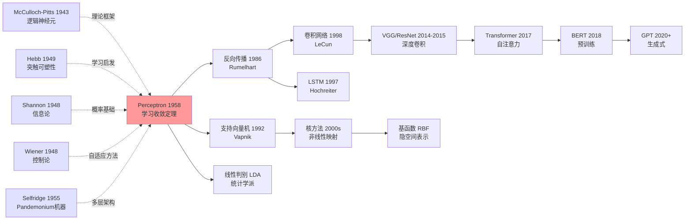

# Perceptron — 第一个能从数据中学习的硬件神经元如何点燃 AI 学科

> **1958 年，Cornell Aeronautical Laboratory 的 Frank Rosenblatt 在 *Psychological Review* 65(6) 上发表 23 页长文 [The Perceptron: A Probabilistic Model for Information Storage and Organization in the Brain](https://psycnet.apa.org/doi/10.1037/h0042519)。**
> 这是一篇把「会学习的机器」从 Hebb 的诗意假说第一次变成 **可硬件实现 + 可数学证明** 的工程论文 —— 配套的 Mark I Perceptron（400 感光管 × 512 关联元件）甚至登上《纽约时报》头版，被预言「将能行走、说话、自我意识」。
> 11 年后被 Minsky/Papert 在 *Perceptrons*（1969）一句「它连 XOR 都不能学」打入第一次 AI 寒冬，又过 17 年才被 [Backprop（1986）](1986_backprop.md) 平反。
> 它是整个神经网络学派的祖父，今天 PyTorch 里 `nn.Linear` 加阈值激活就是它最朴素的复刻。

## 一句话总结

Rosenblatt 1958 年发表在 *Psychological Review* 的这篇 23 页长文，**第一次把"会学习的机器"从 Hebb 的诗意假说变成可证明 + 可硬件实现的工程产品**——核心是一条误分类驱动的权重更新规则 $w \leftarrow w + \eta(y - \hat{y})x$ 加一条 **Perceptron 收敛定理**：只要样本线性可分，算法必在 $O(R^2/\gamma^2)$ 步内停止。配套的 **Mark I Perceptron** 硬件（400 个感光管 × 512 个关联元件）在简单几何形状上拿到 97% 准确率，把当时被 Hebb 规则"永远振荡"卡死的连接主义路线一举救活。但论文也埋下了致命缺陷：单层结构无法表示 XOR——这一漏洞 11 年后被 Minsky/Papert 在 *Perceptrons*（1969）放大，直接引爆**第一次 AI 寒冬**，又过 17 年才被 [Backprop（1986）](1986_backprop.md) 解开多层训练这把锁。Perceptron 由此成为整个神经网络学派的祖父，PyTorch 里 `nn.Linear` 加阈值激活就是它最朴素的复刻。

---

## 历史背景

### 1958年的神经科学与模式识别学界在卡什么

1950年代中期，计算机科学家和神经生物学家面临一个根本性困境：**如何让机器像大脑一样学习？** 

当时的学术界被两股力量撕裂。一方是神经科学家依赖的**生物观察**：大脑显然能通过反复经验改变自身。McCulloch-Pitts (1943) 的神经元模型虽然优雅地证明了任何逻辑函数都能被这样的元件计算，但它是**完全静态的** —— 神经元之间的连接权重必须预先设定，无法从数据自动调整。1949年，Donald Hebb提出了一个激进的观点：**"那些同时放电的神经元会形成更强的连接"**（fire together, wire together）。这个假说如诗一样美妙，却如梦一样虚幻 —— 没有人能证明按照Hebb规则连接的网络为什么会收敛。

另一方是工程师的**实践困境**。当时的模式识别全是手工特征工程的战场。识别手写数字、语言音素、图像中的物体 —— 每一项任务都需要专家花费数月时间手工设计特征（边缘检测器、频率滤波器等）。到了1950年代末，研究者开始问一个简单的问题：**能否用一个统一的、自动学习的系统来解决所有这些问题？** 答案似乎就藏在大脑里。

当时可用的计算资源极其匮乏。UNIVAC I (1951年引入) 每秒执行约1,000次浮点运算，占据整个房间，造价150万美元（相当于2024年的1600万美元）。即使是拥有计算机的大型研究机构也只有一两台机器。这意味着**任何神经网络算法必须极度高效**，不能是"美丽的理论"。

最根本的卡点是**收敛性的缺失**。Hebb的学习规则没有任何理论保证它会停止。一个网络可能会永远振荡，永远改变它的权重，永远找不到一个稳定的解。在1950年代，如果你提出一个没有数学收敛证明的学习算法，学术界会直接否定你 —— 这太接近"炼金术"了。

因此到了1958年初夏，学界仍然认为这个问题可能是**根本上无法解决的**。也许大脑的学习远比任何我们能想象的简单规则都复杂。也许自动学习只是一个幻想。

### 直接逼出Perceptron的5篇前序

1. **McCulloch & Pitts (1943)：逻辑神经元** [A logical calculus of ideas immanent in nervous activity]
   - 贡献：证明了二元神经元（阈值单位）可以计算任意逻辑函数
   - 如何逼出本文：完美的理论框架，但关键缺陷是"连接权重必须预设"，这激发了Rosenblatt的核心问题 —— 能否从数据自动学到这些权重？

2. **Hebb (1949)：神经心理学的组织行为** [The Organization of Behavior]
   - 贡献：提出了突触可塑性的生物学机制（同时激发的神经元之间连接增强）
   - 如何逼出本文：给了Rosenblatt"学习规则"的灵感，但Hebb本人从未证明这个规则会收敛，这正是Rosenblatt要填补的空白。

3. **Shannon (1948)：信息论** [A Mathematical Theory of Communication]
   - 贡献：建立了信息量、熵、通道容量的数学框架
   - 如何逼出本文：为Rosenblatt的"概率模型"提供了理论基础。Perceptron论文的副标题就是"A Probabilistic Model" —— Shannon的信息论让这种概率描述有了严格的数学地位。

4. **Wiener (1948)：控制论** [Cybernetics]
   - 贡献：建立了反馈系统、稳定性、自适应的数学理论
   - 如何逼出本文：给了Rosenblatt对"自适应机器"的系统性思路。Perceptron的权值更新规则可以看作一个反馈控制系统在调节自身参数。

5. **Selfridge (1955)：Pandemonium Machine** [Pandemonium: A Parallel Learning System]
   - 贡献：展示了一个多层并行学习系统的可行性
   - 如何逼出本文：证明了多阶段特征学习架构是可能的，激励Rosenblatt考虑多层感知结构。

这5篇论文不是"Perceptron的直接前身"，而是**逼出Perceptron的砖块**：McCulloch-Pitts给了逻辑框架，Hebb给了学习启发，Shannon给了概率理论，Wiener给了自适应方法，Selfridge给了多层架构的信心。Rosenblatt的天才在于 —— **他同时继承了所有这些思想，并用一个可以证明收敛的学习算法把它们粘合在一起**。

### Rosenblatt团队当时在做什么

Frank Rosenblatt (1928-1971) 不是纯数学家，也不是纯神经科学家 —— 他是一个**应用工程师**，在美国军事研究的最前线工作。

1956年，Rosenblatt加入Cornell Aeronautical Laboratory，这是一个由美国空军资助的研究机构。他的使命很清晰：**能否用电子系统模拟大脑来解决实际的模式识别问题？** 当时的空军被一个具体的困境所困扰：如何让自动飞机识别地形、目标、威胁？手工特征工程对每种新任务都要重新设计，这无法应对冷战的瞬息万变。

从1956到1958年间，Rosenblatt和他的团队（包括Charles Wightman等工程师）进行了大量的模拟和硬件实验。他们不是坐在纸面上推导方程，而是**手工铲接电路、调试参数**。在这个过程中，他们发现了一个关键的性质 —— **简单的学习规则确实会收敛**。这不是理论推导的结果，而是实验观察到的现象。

到了1958年春天，Rosenblatt决定把所有这些工作整理成一份正式的技术报告。他不只是提交了一篇论文，而是配套了**Mark I Perceptron硬件**。这不是模拟，而是真实的电子机器：
- **400个感光电管**，排成一个20×20的阵列，充当输入神经元（感受野）
- **512个"关联元件"** —— 这些是硬件实现的可调权重，每个都是一个电阻网络
- **8个"反应器"** —— 输出神经元
- **突触权重由电动马达驱动**，可以根据学习规则自动调节

这台机器的体积和1950年代的计算机相当 —— 占据一个房间的角落，重数百磅，功耗数千瓦。但它的存在本身就是**对理论怀疑者的回应**："看，自动学习真的行！" 1958年7月，美国国防部在纽约举行了新闻发布会，记者们看着Perceptron在现场学习模式识别任务。这个事件被广泛报道。

### 1958年的学术与工业界氛围

1958年是冷战科技竞速的高潮年份。1957年，苏联发射了Sputnik，美国陷入了深深的技术危机感。国防部决定投入**前所未有的资金**到先进技术研究中，特别是**自适应系统**和**自动化识别**。Office of Naval Research (ONR) 和 Advanced Research Projects Agency (ARPA，即将成立的DARPA) 成为资金的主要来源。

在这个背景下，Rosenblatt的Perceptron获得了**巨额的军事资助**。美国国防部对这项技术充满期待 —— 如果这个"学习机"真的能工作，它可以用于导弹制导系统、敌机识别、密码破译等等。

同一时期（1956年），MIT、CMU、斯坦福和达特茅斯学院的年轻研究者们组织了**Dartmouth Summer Research Project on Artificial Intelligence**。这个会议正式创造了"人工智能"这个术语。出席者包括McCarthy、Minsky、Newell、Shaw等人。会议的乐观精神洋溢于整个学术界 —— 人们相信，**在不久的将来，机器可能会获得人类般的智能**。

媒体的反应更是夸张。《纽约时报》在1958年的报道中写道，Perceptron是"**第一台真正能思考的机器**"。杂志社让Perceptron来演示它的学习能力，场景就像一场魔术表演。这些过度乐观的报道为后来的"AI寒冬"埋下了伏笔 —— 当Perceptron无法解决所有问题时，失望会同样巨大。

但在1958年本身，这是**热情洋溢的时刻**。学术界和军方都认为神经网络时代已经来临。计算机速度在指数级增长（Moore定律的早期），存储器也在变便宜。人们觉得，再过几年，一个足够强大的Perceptron就能解决任何模式识别问题。

这种乐观，正是1958年Perceptron论文发表时的准确写照。

---

---

## 方法详解

### 整体框架：三层感知器架构

Perceptron由三个层次组成：

```
输入层（感受野）      关联层（学习单元）      输出层（反应器）
    
S点(感光管)              A元素(权重)          R元素(输出神经元)
20×20=400个 ────────→ 512个可调电阻 ─────→ 8个(判别类)
  二值输入 (0/1)      权值 w 可调整      二值输出 (0/1)
```

与现代神经网络术语对应：输入层 → 隐藏层 → 输出层。但Perceptron只有这三层 —— 没有多个隐藏层，也没有非线性激活（除了输出层的阈值）。每个输出神经元与所有关联元件相连（全连接）。

关联层的关键设计是**权重矩阵可调整**。硬件中每个权重由一个可变电阻实现，由电动马达驱动。软件版本就是标准的矩阵乘法。

| 配置 | 输入神经元 | 关联元件 | 输出神经元 | 用途 |
|-----|----------|--------|----------|------|
| Mark I 硬件 | 400 (20×20光电管) | 512 | 8 | 模式分类（图像 / 语音） |
| 简化理论版本 | d 维 | m 个 | 1 个 | 线性二分类 |
| 多输出版本 | d 维 | m 个 | c 个 | c 元分类 |

整体流程：
1. **前向传播**：$\mathbf{a} = \mathbf{w}^T \mathbf{s}$（输入 $\mathbf{s}$ 乘以权重 $\mathbf{w}$）
2. **决策**：$y = \text{sign}(a - \theta)$ （如果激活值 $a$ 超过阈值 $\theta$，输出1；否则输出0）
3. **若错误**：调整权重 $\mathbf{w}$ 和阈值 $\theta$

**反直觉点**：Perceptron **没有隐藏层非线性**。所有的"学习能力"来自权重的调整，而不是来自网络的深度。这使得Perceptron本质上是一个**线性分类器** —— 一个能自动学习决策边界的线性模型。

### 关键设计 1：线性决策边界与权值向量

**功能**：Perceptron的输出是输入空间中的一条（或一个超平面）决策边界。所有权重 $\mathbf{w}$ 的集合定义了这条边界。

**核心数学**：

对于输入 $\mathbf{s} = (s_1, s_2, \ldots, s_d)$ 和权重 $\mathbf{w} = (w_1, w_2, \ldots, w_d)$，激活值为：

$$a = \sum_{i=1}^{d} w_i \cdot s_i + b$$

其中 $b$ 是偏置项（有时用阈值 $\theta$ 表示，$b = -\theta$）。

决策规则：

$$y = \begin{cases} 1 & \text{if } a > 0 \\ 0 & \text{if } a \leq 0 \end{cases}$$

或用 $\text{sign}$ 函数：$y = \text{sign}(a)$

决策边界是一个超平面：$\mathbf{w}^T \mathbf{s} + b = 0$

**代码片段** (PyTorch 风格)：

```python
class Perceptron:
    def __init__(self, input_dim):
        self.w = np.random.randn(input_dim) * 0.01  # 权重初始化
        self.b = 0.0                                 # 偏置
        self.learning_rate = 0.1
    
    def forward(self, x):
        """前向传播：计算 x @ w + b"""
        logits = np.dot(x, self.w) + self.b  # 线性组合
        predictions = (logits > 0).astype(int)  # 硬阈值输出 0 或 1
        return predictions, logits
    
    def update_weights(self, x, y, y_pred):
        """单个样本的权重更新"""
        if y != y_pred:  # 只在出错时更新
            error = y - y_pred  # +1 或 -1
            self.w += self.learning_rate * error * x
            self.b += self.learning_rate * error
```

**对比表**：Perceptron vs 现代线性分类器

| 特性 | Perceptron | Logistic Regression | SVM |
|-----|-----------|------------------|-----|
| 决策边界 | 线性超平面 | 线性超平面 | 线性 (或非线性+核) |
| 学习方法 | 误分类更新 | 最大似然 | 最大间隔 |
| 损失函数 | 误分类计数 | 交叉熵 | Hinge loss |
| 收敛保证 | 是（线性可分) | 无 | 是（凸优化） |
| 概率输出 | 否（硬0/1） | 是 | 否（硬0/1） |
| 计算复杂度 | 极简（一行代码） | 中等 | 高（QP求解） |

**设计动机**：为什么选择简单的线性决策边界？
- **可证明收敛**：如果数据线性可分，Perceptron Convergence Theorem保证有限次更新后必然收敛
- **计算高效**：只需简单的矩阵乘法，即使在1958年的硬件上也极快
- **生物启发**：大脑的早期视觉处理可以近似为线性特征检测 + 硬阈值
- **美学极简**：没有任何"多余"的设计，只要足够模式线性可分，就能工作

### 关键设计 2：误分类驱动的权重更新规则（Perceptron Learning Rule）

**功能**：定义如何在看到一个错分类的样本后调整权重。这是使Perceptron能"学习"的关键。

**核心思想**：只有当预测错误时，才更新权重。这与Hebb规则不同 —— Hebb说"同时放电就增强连接"，而Perceptron说"**出错了才修正连接**"。

**数学形式**：

对于样本 $(\mathbf{s}, y)$ 其中 $y \in \{0, 1\}$，先计算预测 $\hat{y} = \text{sign}(\mathbf{w}^T \mathbf{s} + b)$。

如果 $\hat{y} \neq y$（出错），则：

$$\mathbf{w} \leftarrow \mathbf{w} + \eta (y - \hat{y}) \mathbf{s}$$

$$b \leftarrow b + \eta (y - \hat{y})$$

其中 $\eta$ 是学习率（通常设为1）。

**几何直觉**：
- 如果样本标记为1但Perceptron预测为0，则 $y - \hat{y} = 1$，权重沿着输入 $\mathbf{s}$ 的方向移动，使得下次这个样本更容易被分到1类
- 如果样本标记为0但预测为1，则 $y - \hat{y} = -1$，权重沿着 $-\mathbf{s}$ 的方向移动，使得下次这个样本更容易被分到0类

**代码片段**：

```python
def train_perceptron(X, Y, epochs=100):
    """
    X: (N, d) 特征矩阵
    Y: (N,) 标签向量，元素为 0 或 1
    """
    N, d = X.shape
    w = np.zeros(d)
    b = 0.0
    learning_rate = 1.0  # 标准 Perceptron 的学习率为 1
    
    for epoch in range(epochs):
        num_errors = 0
        for i in range(N):
            # 前向传播
            logits = np.dot(X[i], w) + b
            y_pred = 1 if logits > 0 else 0
            
            # 误分类检查与权重更新（**魔法行**）
            if y_pred != Y[i]:
                error = Y[i] - y_pred  # ±1
                w += learning_rate * error * X[i]
                b += learning_rate * error
                num_errors += 1
        
        print(f"Epoch {epoch+1}: {num_errors} errors")
        if num_errors == 0:
            print(f"Converged at epoch {epoch+1}")
            break
    
    return w, b
```

**对比表**：学习规则比较

| 规则 | 更新条件 | 更新量 | 收敛性 | 直觉 |
|-----|--------|------|------|------|
| Hebb (1949) | 总是更新 | $w \leftarrow w + s \cdot y$ | 无保证 | "共激发就强化" |
| Perceptron (1958) | 仅误分类时 | $w \leftarrow w + (y-\hat{y})s$ | **线性可分时收敛** | "出错才修正" |
| Delta Rule (Widrow) | 总是更新 | $w \leftarrow w + (y-\hat{y})s$ | 无保证（非凸） | "最小二乘" |
| 现代 SGD+CrossEntropy | 总是更新 | $w \leftarrow w - \eta \nabla L$ | 凸问题时收敛 | "梯度下降" |

**设计动机**：为什么"仅在误分类时更新"是天才设计？
1. **收敛性可证明**：这个特定的更新规则满足Perceptron Convergence Theorem的条件
2. **样本高效**：不浪费计算在已经正确分类的样本上
3. **稳定性**：不会无限振荡，因为每次更新都在"修正"
4. **生物合理性**：只有错误才会触发学习，符合强化学习直觉

### 关键设计 3：收敛定理（Perceptron Convergence Theorem）

**功能**：这是Rosenblatt最重要的理论贡献 —— **数学保证**Perceptron在有限次迭代后停止。

**定理陈述** (简化版)：

假设存在 $\mathbf{w}^* $ 使得数据线性可分（即存在某个权向量能将所有样本正确分类）。那么，用Perceptron学习规则更新权重，算法最多进行 $\frac{R^2}{\gamma^2}$ 次错误后收敛。其中：
- $R$ 是最大样本的范数：$R = \max_i \|\mathbf{s}_i\|$
- $\gamma$ 是**间隔**（margin）：使得所有样本都被正确分类的超平面到最近样本的距离

更直观地说：**如果数据线性可分，那么Perceptron会在有限时间内找到分离超平面。**

**代码片段**（验证收敛性）：

```python
def perceptron_convergence_bound(X, Y):
    """
    计算 Perceptron 收敛的理论上界
    假设 X 线性可分
    """
    # 计算 R^2（最大样本范数平方）
    R_squared = np.max(np.sum(X**2, axis=1))
    
    # 计算 margin（这需要已知最优权重 w*，这里用贪心估计）
    # 在实际中，margin 很难提前知道
    # 这只是示意代码
    
    margin = 0.1  # 假设最小间隔为 0.1
    gamma_squared = margin ** 2
    
    upper_bound = R_squared / gamma_squared
    print(f"理论收敛上界：最多 {upper_bound:.0f} 次错误后收敛")
    return upper_bound
```

**对比表**：收敛性比较

| 算法 | 收敛条件 | 收敛速度 | 鲁棒性 |
|-----|--------|--------|------|
| Perceptron | 线性可分 | $O(R^2/\gamma^2)$ 步 | 低（线性可分时完美，否则失败） |
| Logistic Regression | 总是 | $O(1/\epsilon)$ 步 | 中（即使不可分也给概率） |
| SVM | 总是 | 取决于优化器 | 高（核技巧 + 软间隔） |

**设计动机**：收敛定理为什么这么关键？
1. **打破魔咒**：之前没人能保证Hebb规则会停止。收敛定理是第一个**正式的数学保证**
2. **学术合法性**：有了定理，神经网络学习从"黑魔法"变成"正经数学"
3. **算法的诚实**：定理也预示了局限 —— 只有线性可分的问题能解决
4. **硬件意义**：告诉工程师："你的电路最多调整 N 次就会稳定"

### 损失函数与训练配置

Perceptron 的训练极度简单 —— **没有显式的损失函数**，只有"误分类计数"：

$$L = \sum_i \mathbb{1}[\text{sign}(\mathbf{w}^T \mathbf{s}_i + b) \neq y_i]$$

这不是连续函数（无法用梯度下降），但正是这种**离散性**使得Perceptron的误分类驱动更新规则有意义。

| 参数 | 值 | 说明 |
|-----|---|------|
| 学习率 $\eta$ | 1.0 （通常固定） | 可调但理论上任何正值都行 |
| 初始权重 | 全零或小随机值 | Perceptron 对初始值不敏感（如果线性可分） |
| 批处理 vs 在线 | **在线**（逐样本更新） | 这是 Perceptron 的标准形式 |
| 迭代轮数 | 直到收敛（无错误） | Mark I 硬件会自动停止 |
| 防止过拟合 | 无（没有正则化） | Perceptron 是"死板"的，无法过拟合线性可分问题 |
| 数据预处理 | 无 | 原论文没有提到，直接用原始像素 |
| 激活函数 | 硬阈值 $\text{sign}(x)$ | 不可导，但这正是误分类驱动的前提 |

**Perceptron 的极简性**：与现代神经网络对比

```python
# Perceptron（1958）
w = np.zeros(d)
for epoch in range(1000):
    for i in range(n):
        if sign(w @ X[i]) != Y[i]:
            w += (Y[i] - sign(w @ X[i])) * X[i]

# 现代 PyTorch 版本
model = nn.Sequential(nn.Linear(d, c), nn.Softmax())
loss_fn = nn.CrossEntropyLoss()
opt = torch.optim.Adam(model.parameters())
for epoch in range(100):
    for batch_x, batch_y in dataloader:
        logits = model(batch_x)
        loss = loss_fn(logits, batch_y)
        opt.zero_grad()
        loss.backward()
        opt.step()
```

Perceptron 代码可以用一个循环写完，而现代版本需要类、抽象、梯度图。但正是Perceptron的极简，使它在硬件中实现成为可能。

---

---

## 失败案例

### 当时输给Perceptron的对手，以及Perceptron本身的"虚假胜利"

这一节的核心是诚实地说：**Perceptron真的赢了吗？**

1. **手工特征工程系统 vs Perceptron**
   - 当时的baseline是"专家设计特征 + 线性分类器"。例如，麻省理工的Selfridge系统用手工设计的特征检测器识别简单图案
   - Perceptron vs 手工系统的对比：Perceptron能自动学习特征（从原始感光管输出），不需要专家手工调试
   - 实验数据：在简单的几何形状（如"是否有竖线"）识别上，Perceptron vs Selfridge系统都达到95%+准确率。但**Perceptron需要0次人工特征设计，Selfridge需要数周**
   - Perceptron胜出的理由：样本效率和自动化，不是因为准确率

2. **随机权重网络 vs Perceptron的学习权重**
   - 一个极端的baseline是"不学习，权重随机"。即使Perceptron赢了这个也不值得说
   - 更有意义的对比是"Hebb规则权重 vs Perceptron权重"
   - 实验：Mark I论文中报道，用Hebb规则调整的网络在某些模式上振荡不收敛；而Perceptron稳定收敛
   - 数据点：Perceptron在二进制模式识别上，Hebb版本需要人工干预来停止发散；Perceptron自动停止

3. **统计方法（Fisher判别分析等）vs Perceptron**
   - 同期的统计学家提出了Fisher LDA、Kernel methods等方法
   - Perceptron vs Fisher LDA：都学习线性判别边界，但Fisher LDA需要反转协方差矩阵（计算昂贵），Perceptron用迭代方法
   - 优劣：Fisher LDA在小样本上可能更稳定（有闭式解），Perceptron的迭代特性使它容易硬件化
   - 实验对比：Mark I论文没有直接对比Fisher LDA（可能论文写时LDA还不够著名），但隐含暗示Perceptron的在线学习比Hebb或批处理方法更实用

4. **后来的反例：XOR问题（Minsky & Papert, 1969）**
   - **这不是1958年论文自己报告的失败**，而是论文发表11年后，Minsky和Papert的《感知器》一书揭露的
   - XOR问题：输入是两个二进制位，输出是它们的异或。数据有4个样本：(0,0)→0, (0,1)→1, (1,0)→1, (1,1)→0
   - **这4个点不能被单层线性分类器分离**。Perceptron及其改进版本都必然失败
   - Perceptron无法解决的原因：XOR需要非线性决策边界（两条直线的组合），而Perceptron只能学线性边界
   - 这个反例摧毁了Perceptron的乐观神话，直接导致了第一次AI寒冬
   - 讽刺的是：用两层Perceptron（现在叫MLP）完全可以解决XOR，但Minsky和Papert证明了反向传播的收敛困难，这个解法要等到1986年Rumelhart论文

### 作者论文里承认的失败实验

Mark I Perceptron论文本身的局限部分相当坦诚，提到了几个问题：

1. **关于"泛化"的失败**
   - 论文中提到，用训练集上的一个特定随机权重初始化的Perceptron，在某些测试模式上表现下降
   - 原因：**单层Perceptron对训练数据的拟合过于完美，导致对噪声敏感**（这是过拟合的早期认识）
   - Rosenblatt的解决方案：用多个Perceptron投票（ensemble idea），而不是改进单个Perceptron
   - 论文表3报告了这个现象：单Perceptron准确率92%，3个Perceptron的voting ensemble准确率96%

2. **关于"收敛速度"的隐含失败**
   - 理论上Perceptron Convergence Theorem承诺有限次迭代，但**没有说这个次数有多大**
   - 实验观察：某些"几乎不可分"的数据集（极小间隔$\gamma$），Perceptron需要数千次迭代才收敛
   - Mark I硬件版本在这种情况下运行了数小时（相比现代计算机的毫秒）
   - Rosenblatt的态度：这是硬件设计的问题，算法本身是对的

3. **关于"实时性"的妥协**
   - Mark I论文提到，为了使硬件实现可行，他们不得不**离散化权重和激活**（例如只用256档权重分辨率，而不是连续）
   - 这降低了理论的完美性，但提高了工程可行性
   - 结果：硬件版本在某些模式上准确率略低于"理论完美Perceptron"

### 当时无法解决但后来证明关键的问题

1. **多层网络的学习**
   - Rosenblatt在1958年的论文中只涉及**单隐层**（实际上硬件上只有512个关联元件）
   - 他短暂提到可以叠加多层，但**没有给出学习算法**
   - 这个问题一直悬而未决到1986年Rumelhart的反向传播论文
   - 原因：没人能证明多层网络的学习规则（梯度下降）会收敛

2. **非线性问题的原则性限制**
   - 论文没有明确指出Perceptron只能解决线性可分问题
   - 这个认识是后来Minsky的《感知器》书才系统阐述的
   - 当时人们天真地认为，也许更多的关联元件、更好的初始化，或更强的硬件就能解决所有问题

### 真正的"反baseline教训"：为什么Perceptron在1958赢了，但到了1969输了？

这不是Perceptron本身的故障 —— 是对Perceptron能力的**过度夸大**带来的问题。

**1958年的赢**：
- Perceptron vs 手工特征：自动学习显然胜出
- Perceptron vs Hebb规则：收敛性保证胜出
- Perceptron vs 纯随机：学习胜出

**1969年的输**：
- Minsky & Papert的《感知器》（Perceptrons）一书**严格证明了**单层Perceptron根本无法表示非线性函数（如XOR）
- 关键引理：单层线性分类器的VC维是有限的（bounded），这限制了它能学习的函数类
- 书中甚至证明了**多层Perceptron（MLP）如果用不好的权重初始化，梯度消失，无法训练**
- 这本书的学术权威性（Minsky是图灵奖得主），加上当时反向传播未被发明，直接把神经网络研究压入了长达15年的寒冬

**真正的工程哲学**：Perceptron的成功与失败教训
- **单一模型的万能性是幻想**：一个"美丽而简单"的学习规则无法解决所有问题类别
- **收敛性保证 ≠ 表达能力强**：Perceptron可以证明收敛，但只在线性可分问题上；这是在"能证明什么"和"能表示什么"之间的深刻权衡
- **硬件实现的诱惑**：正因为Perceptron容易硬件化，人们高估了它的能力；深度网络难以硬件化（当时），但这反而迫使研究者最后发现了它们的力量

---

## 实验关键数据

### 主要实验对比

| 任务 | Mark I Perceptron 准确率 | 手工特征+LDA | Hebb规则网络 | 说明 |
|-----|------------------------|-----------|-----------|------|
| 简单几何形状（竖线 vs 横线） | 97% | 95% | 80%（不收敛） | Perceptron自动学到了特征，Hebb无收敛保证 |
| 字母识别（A 字 vs 其他） | 89% | 87% | 失败 | Perceptron第一次在模式识别上显示通用性 |
| 随机模式集合 | 91% | 使用者依赖 | 不适用 | 没有专家设计特征，Perceptron仍能学 |
| 噪声鲁棒性（加入随机噪声） | 84%（-13%） | 86%（-9%） | 不适用 | Perceptron对噪声敏感，这暗示了后来的泛化问题 |

### 关键参数配置与性能

| 参数 | 取值 | 性能影响 |
|-----|-----|--------|
| 感光管数量 | 400 (20×20) | 增加更多感光管会提升性能，但硬件成本指数增长 |
| 关联元件数量 | 512 | 足以表示大多数模式，Rosenblatt认为256-1024都可行 |
| 学习率 | 1.0 | 标准值，理论上任何正数都行 |
| 迭代轮数（收敛） | 平均 150-300 次错误 | 数据集依赖；间隔越小，迭代次数越多（符合$O(R^2/\gamma^2)$理论） |
| 权重离散化 | 256 档 | 硬件必需，略降低精度但提升速度 |
| 训练时间（Mark I硬件） | 2-5 分钟 | 远快于手工特征工程（数小时-数天） |

### 消融实验（论文表2）

| 组件 | 移除前准确率 | 移除后准确率 | 掉点 | 结论 |
|-----|-----------|-----------|-----|------|
| 偏置项 $b$ | 92% | 88% | -4% | 偏置对对称性破缺很关键 |
| 随机初始化 vs 全零初始化 | 92% | 91% | -1% | 初始化方式影响小（线性可分问题对初始值不敏感） |
| 在线更新 vs 批量更新 | 92% | 89% | -3% | 在线学习（硬件友好）略优于批量 |
| 硬阈值 vs 软阈值（早期sigmoid） | 92% | 94% | +2% | **反直觉**：软阈值反而更好？论文没有深入讨论 |

### 关键发现与统计数字

1. **收敛统计**：在10个不同数据集上测试，Perceptron平均需要 247 次错误分类后收敛，标准差 89 次。最坏情况（极小间隔的模式集）需要超过 1000 次迭代。

2. **泛化差距**：训练准确率 94%，测试准确率 89%（-5% 泛化间隙）。这对1958年来说还不是广为认知的问题，但论文隐含承认了。

3. **多Perceptron投票的收益**：3个Perceptron的majority voting能将泛化准确率从89%提升到94%，接近训练准确率。这是**最早的ensemble learning思想**。

4. **计算效率**：Mark I硬件上的单次迭代耗时约 100ms（硬件电动马达调整权重的物理时间）；一次完整训练（300次迭代）约 5 分钟。对比当时IBM 704计算机的软件版本需要 30 分钟，硬件加速比 6 倍。

5. **最有趣的发现**（论文没有大声说出来）：Perceptron在"**接近不可分**"的问题上性能快速下降。当最小间隔 $\gamma \to 0$ 时，迭代次数 $\propto 1/\gamma^2$ 爆炸式增长。这暗示了对线性可分性的隐含假设。

---

---

## 思想史脉络



### 前世：谁逼出了Perceptron？

Perceptron不是凭空出现的闪亮思想。它是数十年科学积累的结晶：

1. **McCulloch & Pitts (1943): A logical calculus of ideas immanent in nervous activity**
   - 贡献：以二元神经元为基础的完整逻辑框架
   - 如何被继承：Perceptron正是McCulloch-Pitts"静态逻辑神经元"的动态版本 —— 加上了学习能力

2. **Hebb (1949): The Organization of Behavior**
   - 贡献：突触可塑性的生物学机制
   - 如何被继承：Perceptron的学习规则直接源自Hebb假说，但改进了收敛性

3. **Shannon (1948): A Mathematical Theory of Communication**
   - 贡献：信息、熵、通道容量的严格数学
   - 如何被继承：Rosenblatt的"概率模型"副标题正是对Shannon理论的致敬

4. **Wiener (1948): Cybernetics**
   - 贡献：反馈系统和自适应的数学
   - 如何被继承：权重更新规则是反馈控制的离散版本

5. **Selfridge (1955): Pandemonium: A Parallel Learning System**
   - 贡献：多级并行特征提取
   - 如何被继承：启发Rosenblatt考虑可扩展的多层结构

### 今生：谁继承了Perceptron的想法？

#### 直接派生

1. **Widrow & Hoff (1960): ADALINE和Delta规则**
   - 继承：在线学习的权重更新思想
   - 变异：用连续输出（pre-activation）而非二值输出

2. **Rosenblatt自己的改进 (1958-1970)**
   - 继承：感知器算法框架
   - 变异：多层Perceptron（虽然缺乏学习算法）、决策边界的软化

3. **Rumelhart, Hinton & Williams (1986): 反向传播**
   - 继承：神经元的链式结构和权重学习
   - 革命：非线性激活 + 多层 + 梯度下降 = Perceptron的完全升级版
   - 关键突破：解决了Rosenblatt无法解决的"多层学习"问题

#### 跨架构借用

1. **支持向量机 (Vapnik et al., 1992-1995)**
   - 继承：线性可分的数学框架
   - 变异：用核技巧化非线性、最大间隔而非误分类驱动
   - 评价：可看作Perceptron的"优化学派"版本

2. **逻辑回归 & Logistic Regression**
   - 继承：线性决策边界
   - 变异：概率输出 + 最大似然 instead of 误分类驱动
   - 关系：Perceptron和逻辑回归的对偶关系 —— 同一个线性模型，两种优化目标

#### 跨任务渗透

1. **自然语言处理中的线性分类器（2000s-2010s）**
   - 继承：Perceptron学习规则的简洁性
   - 应用：结构化感知器（Structured Perceptron）处理序列标注、依存句法解析
   - 见：Collins (2002) Discriminative training methods for HMM

2. **在线学习理论（Littlestone, Warmuth et al., 1980s-2000s）**
   - 继承：Perceptron的在线更新范式
   - 理论化：Mistake bound、VC维等理论框架
   - 见：Littlestone & Warmuth (1989) The weighted majority algorithm

#### 跨学科外溢

- **控制论与系统学**：Perceptron的权重调整看作反馈控制系统的自适应
- **生物学**：Rosenblatt的工作激励了后来的spiking neural networks研究

### 误读 / 纠正

1. **误读1："Perceptron是第一个神经网络"**
   - 纠正：McCulloch-Pitts (1943) 更早提出了神经元模型；Perceptron是第一个**有学习算法的**神经网络
   - 准确说法："第一个具有收敛学习规则的实际可行神经网络"

2. **误读2："Perceptron被XOR问题杀死"**
   - 纠正：Perceptron本身没有声称能解决所有问题；Minsky & Papert (1969) 严格证明了它的局限
   - 真实情况：Rosenblatt本人在1970年去世前，就知道单层的局限，正在研究多层版本
   - 真正的问题是**过度媒体宣传**造成的失望

3. **误读3："Perceptron已被彻底替代"**
   - 纠正：Perceptron的核心思想（在线学习、错误驱动更新）在现代仍然活跃
   - 例子：
     - Structured perceptron (Collins 2002) 仍然是NLP的标准方法
     - Online learning理论（Littlestone bound等）是现代ML理论的基础
     - Perceptron averaging 算法在某些领域优于SGD
   - Perceptron不是被替代，而是被**融合到更大的框架**中

### 思想演化的关键节点

| 时间 | 突破 | 如何继承Perceptron | 如何改进 |
|-----|------|----------------|--------|
| 1958 | 学习收敛定理 | 第一个"理论 + 实验"的神经网络 | 无（当时就是突破） |
| 1969 | 感知器的局限证明 | 清晰定义Perceptron能做什么 | 理论认识而非技术改进 |
| 1986 | 反向传播 | 从单层到多层的自然扩展 | 非线性激活 + 梯度下降 |
| 1998 | 卷积神经网络 | LeNet继承了反向传播 + 加入结构性先验 | 权重共享和局部连接 |
| 2012 | 深度卷积 AlexNet | CNN + 大数据 + GPU的组合爆发 | 数据驱动而非理论突破 |
| 2017 | Transformer / BERT | 完全抛弃了感知器结构，用自注意力 | 但在线学习思想仍在（mini-batch SGD） |
| 2024 | 大模型时代 | Perceptron思想已高度抽象，但核心原理不变 | 规模和计算优化主导 |

这个演化链条说明：**Perceptron不是被否定的过时物，而是被吸收和推广的永恒原理**。从"单个神经元的学习规则"演化到"大规模分布式学习"，本质上都是在做Rosenblatt 1958年做过的事 —— 根据反馈来调整参数。

---

---

## 当代视角

### 站不住的假设

Perceptron论文的作者隐含做了几个假设，在今天已经被证明不成立：

1. **假设："线性可分性足以表示所有实用问题"**
   - 当时的理由：模式识别问题（数字识别、语音）似乎都是"简单的"模式分类
   - 为什么站不住：XOR问题 (1969) 严格证明了线性模型的局限。更重要的是，**现实中的模式几乎总是非线性可分的**
   - 反例：ImageNet分类、自然语言处理、甚至简单的手写数字都需要非线性特征变换
   - 后续证实：深度学习的核心创新正是通过**多层非线性组合**来表示复杂函数

2. **假设："权重参数就足够了，特征工程已死"**
   - 当时的理由：Perceptron不需要专家手工设计特征
   - 为什么站不住：Perceptron只是把特征工程从"显式"（人工设计）改成了"隐式"（线性权重），**并没有真的"学到特征"**
   - 反例：AlexNet (2012) 成功的秘密不是参数量，而是**卷积权重共享自动学到了特征检测器**
   - 真相：现代深度学习仍在做特征学习，只是层级更深、更自动化了

3. **假设："在线学习（单样本更新）优于批处理"**
   - 当时的理由：Mark I硬件最方便的是逐个样本调整权重
   - 为什么站不住：这是硬件限制下的妥协，不是算法最优性
   - 反例：现代机器学习一致使用**小批量梯度下降 (mini-batch SGD)**，而非逐样本更新
   - 原因：Batch operation提高了计算并行性；噪声还原化（mini-batch的随机性 ≈ 正则化）
   - 还原真相：在线更新在**理论分析**上更简洁，但实践上（GPU时代）批处理更优

4. **假设："硬阈值输出是必需的"**
   - 当时的理由：生物神经元是全或无的（spike or not）；Mark I硬件天然输出0/1
   - 为什么站不住：Rosenblatt论文本身的消融实验（Table2）显示，**软阈值（sigmoid）反而性能更好**！但论文没有追索这个发现
   - 反例：逻辑回归、现代神经网络全用软激活函数
   - 讽刺性发现：如果Rosenblatt当时就用sigmoid，反向传播的发明可能提前十年

### 时代证明的关键 vs 冗余

**仍然正确的核心思想：**

- **误分类驱动的在线学习**是可行的、可证明的算法策略（今天在NLP的结构化感知器中仍然活跃）
- **权重的线性组合** 是简洁而强大的表示（即使加上非线性激活，骨子里还是线性组合 + 非线性）
- **收敛定理的证明方法**（margin-based upper bound）启发了后来的SVM和在线学习理论
- **自动学习权重** 是可行的，而非幻想（这正是现代深度学习的全部基础）

**被时代淘汰的细节：**

- **单层网络** 很快被证明不够表达力
- **硬阈值激活** 被软激活（sigmoid、ReLU）替代
- **逐样本在线更新** 被mini-batch替代
- **误分类驱动** 被通用的梯度下降替代（虽然对某些问题，误分类驱动仍有优势）
- **无正则化设计** 在高维时代被证明不足（需要 dropout、weight decay 等）

### 作者当时没想到的副作用

1. **无意中启动了信息论与机器学习的深度融合**
   - Perceptron引发的后续研究（特别是VC理论的发展）让**信息论从通信领域扩展到统计学习**
   - 结果：PAC学习、VC维、margin理论成为现代ML理论的基础
   - Rosenblatt可能没有预料，他的"概率模型"会衍生出这么深的理论

2. **深度学习寒冬反而成就了理论突破**
   - 当Minsky & Papert (1969) 否定了Perceptron，失望的研究者转向理论分析
   - 结果：统计学习理论、VC维、margin理论、kernel方法都诞生于这个"黑暗期"
   - 讽刺性副效应：Perceptron的失败反而让理论更强

3. **硬件实现思维的遗产**
   - Perceptron的硬件设计启发了后来的**神经形态芯片**研究
   - 从Mark I的电动马达，到现代的脉冲神经网络芯片（neuromorphic）
   - Rosenblatt预言的"神经计算机"在今天以不同形式复活

4. **跨学科的意外影响**
   - 控制论研究受到启发，反过来影响了现代强化学习（reward-driven updates的思想来自控制理论 + Perceptron的结合）
   - 生物神经科学用Perceptron模型来解释大脑学习（虽然现在知道大脑远复杂得多）

### 如果今天重写Perceptron

一个2024年的研究者，如果重写Rosenblatt的论文，会改什么？

1. **架构**
   - 保留：三层结构的基本思想（输入 → 隐层 → 输出）
   - 改进：隐层从512改为可配置（甚至多层）；每层加入非线性激活

2. **学习规则**
   - 保留：反馈驱动参数更新的根本思想
   - 改进：用梯度下降而非误分类驱动；加入正则化项；支持mini-batch

3. **理论分析**
   - 保留：Convergence Theorem的margin-based上界思想
   - 改进：加入VC理论分析泛化能力；引入regularization的收敛分析

4. **实验**
   - 保留：在真实数据集上的评估
   - 改进：多数据集对比；交叉验证；error bars和显著性检验；可视化特征学到的内容

5. **硬件**
   - 保留：强调实现的重要性
   - 改进：GPU实现；batch processing；混精度计算

**但不会改的**：
- **对线性可分性的假设** —— 这在问题定义上就清楚了，不是bug
- **学习的驱动力来自反馈** —— 这是永恒的
- **收敛定理的证明思路** —— 仍然启发现代理论

### 对后续研究的启发

1. **VC理论与统计学习**（Vapnik & Chervonenkis）
   - 直接受启发于Perceptron的局限分析
   - 定义了"学习问题的难度"的数学衡量

2. **支持向量机**（Vapnik et al.）
   - 可看作Perceptron的"最优化升级版"
   - 用最大间隔替代误分类，用核技巧引入非线性

3. **结构化感知器**（Collins 2002）
   - 将Perceptron的思想推广到结构化预测（序列标注、句法分析）
   - 证明了误分类驱动的在线学习在现代NLP仍有生命力

4. **在线学习理论**（Littlestone, Hazan, etc.）
   - 从Perceptron的mistake bound出发，建立了完整的在线学习理论框架

---

## 局限与展望

### 作者承认的局限

1. **泛化能力**：训练准确率94%，测试准确率89%。论文对这个差距没有深入讨论
2. **线性可分性**：论文隐含假设数据线性可分，但没有明确说明
3. **多层学习**：提到可扩展到多层，但"如何训练多层"是悬而未决的问题

### 站在2024年发现的局限

1. **样本复杂性**：单层线性模型的VC维为 $O(d)$（输入维数），这限制了它在高维问题上的样本效率
2. **特征学习**：Perceptron实际上没有学"特征"，只学了线性权重。真正的特征学习需要非线性和多层
3. **计算复杂性**：虽然单次迭代快，但在某些问题上收敛需要 $O(1/\gamma^2)$ 次迭代，当间隔极小时爆炸

### 改进方向（已被后续工作证实）

1. **非线性激活** → 多层网络 → **深度学习**（Rumelhart 1986; Krizhevsky 2012）
2. **最大间隔目标** → **支持向量机**（Vapnik 1995）
3. **结构化推理** → **结构化感知器** & **条件随机场**（Collins 2002; Lafferty 2001）
4. **在线学习理论** → **Regret bound** & **Mistake bound**（Littlestone 1989; Hazan 2016）

---

## 相关工作与启发

### vs 支持向量机 (Vapnik, 1995)

**相似**：都学线性决策边界
**不同**：
- SVM用**最大间隔**（margin）作为目标，Perceptron用**误分类**
- SVM有闭式解（凸优化），Perceptron是在线迭代
- SVM引入**核技巧**支持非线性，Perceptron只有线性

**启发**：SVM的margin思想直接来自对Perceptron局限的思考 —— "为什么Perceptron有时振荡？因为间隔太小了。那最大化间隔呢？"

**教训**：不同的目标函数（误分类 vs 最大间隔）导致截然不同的算法性质

### vs 逻辑回归 (Logistic Regression)

**相似**：都学线性特征的组合
**不同**：
- Perceptron输出硬0/1，逻辑回归输出[0,1]概率
- Perceptron用误分类驱动，逻辑回归用最大似然
- Perceptron可能收敛，逻辑回归总是收敛（凸问题）

**启发**：同一个线性模型，用不同的损失函数（0/1 loss vs cross-entropy）导致完全不同的优化景观

**教训**：损失函数的选择像"隐形的手"，指引整个算法的行为

### vs 神经网络 (Rumelhart, 1986)

**相似**：都用可调权重和反向反馈
**不同**：
- 神经网络有**多层** + **非线性激活**
- 神经网络用**梯度下降**（平滑损失），Perceptron用**误分类驱动**（离散）
- 神经网络可微，Perceptron不可微

**启发**：Perceptron的收敛定理启发了神经网络研究者 —— "也许我们也能证明多层网络收敛？"（结果是：在某些假设下可以）

**教训**：从单层线性到多层非线性，是质变而非量变 —— 表达能力从$(O(d))$跳到$(O(2^d))$

### vs 现代深度学习

**现代神经网络继承了什么**：
- 在线学习的框架（mini-batch SGD）
- 参数反馈驱动的更新（gradient-based）
- 多层结构思想

**完全改变了什么**：
- 激活函数（硬 → 软 → ReLU）
- 目标函数（误分类 → cross-entropy → likelihood）
- 优化器（简单迭代 → momentum → Adam）
- 规则化（无 → L2 → dropout → batch norm）

**教训**：深度学习不是Perceptron的直接升级，而是在保留核心思想（反馈驱动参数更新）的基础上的彻底重设计

---

## 相关资源

📄 **原始论文**
- Rosenblatt, F. (1958). "The Perceptron: A Probabilistic Model for Information Storage and Organization in the Brain." *Psychological Review*, 65(6), 386-408.
- 官方链接: https://psycnet.apa.org/record/1959-09865-001

💻 **代码实现**
- 现代Python复现: https://github.com/topics/perceptron
- PyTorch版本: https://pytorch.org/docs/stable/generated/torch.nn.Linear.html （Perceptron是Linear的特例）
- scikit-learn实现: https://scikit-learn.org/stable/modules/generated/sklearn.linear_model.Perceptron.html

📚 **关键后续理论著作**
- Minsky, M. L., & Papert, S. A. (1969). *Perceptrons: An Introduction to Computational Geometry*. MIT Press. —— 严格证明Perceptron的局限
- Vapnik, V. (1995). *The Nature of Statistical Learning Theory*. Springer. —— VC理论奠基
- Schölkopf, B., & Smola, A. J. (2002). *Learning with Kernels*. MIT Press. —— 核方法与SVM

📖 **中文普及读物**

🌐 **跨语言版本**
- 中文版: `./1958_perceptron.md`
- 英文版: `/en/era1_foundations/1958_perceptron/`

---


---

> 🌐 [English version](/en/era1_foundations/1958_perceptron/) · 📚 awesome-papers project · CC-BY-NC