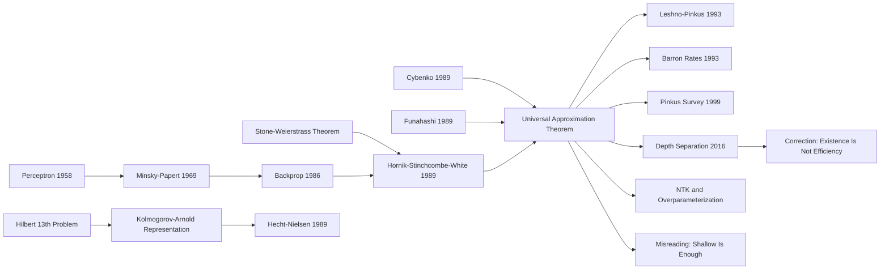

# Universal Approximation — 用一条存在性定理给神经网络颁发表达力通行证

> **1989 年，Kurt Hornik、Maxwell Stinchcombe、Halbert White 三位作者在 *Neural Networks* 发表 [Multilayer feedforward networks are universal approximators](https://doi.org/10.1016/0893-6080(89)90020-8)。** 这篇 8 页论文没有提出新结构、没有跑 benchmark、没有训练技巧，却给刚从反向传播热潮里醒来的多层感知机补上了一张数学护照：只要隐藏单元足够多，普通前馈网络就能逼近紧集上的任意连续函数，甚至能在更弱意义下处理可测函数。它真正重要的地方不在于证明「神经网络万能」，而在于把问题切开：表达力不再是最先被怀疑的嫌疑人，剩下的难题是宽度需要多少、数据够不够、优化找不找得到、泛化会不会塌。后来所有关于深度、宽度、ReLU、过参数化、NTK 的争论，某种意义上都从这条分界线继续往前走。

## 一句话总结

Hornik、Stinchcombe、White 三位作者 1989 年发表在 *Neural Networks* 的这篇论文，把多层前馈网络写成有限个 ridge functions 的线性组合 $\sum_{i=1}^{N}\alpha_i\sigma(w_i^\top x+b_i)$，并证明在紧集 $K\subset\mathbb{R}^d$ 上，对任意连续函数 $f\in C(K)$ 和任意 $\varepsilon>0$，都存在足够宽的一隐层网络使 $\sup_{x\in K}|f(x)-\hat f(x)|<\varepsilon$。它回应的是 Perceptron（1958） 与 Minsky-Papert 对单层模型的限制留下的空洞：多层网络的失败不能再简单归咎于「表达力不够」。但这条定理也故意不承诺训练可行性、样本复杂度、隐藏单元数量上界或泛化能力；它只是把 expressivity 从 trainability 中剥离出来。随后 Cybenko/Funahashi 的并行证明、Leshno 的「非多项式激活」刻画、Barron/Pinkus 的逼近率，以及 2016 年之后的深度-宽度分离定理，都在修正一个常见误读：一隐层「存在」并不等于浅层网络「高效」，更不等于深度没有意义。

---

## 历史背景

### 从感知机争议到多层网络复活

1989 年的神经网络不是一个平稳增长的领域，而是一个刚从信誉低谷里爬出来、又被统计学习和控制理论盯着看的领域。1958 年 Rosenblatt 的感知机给了研究者一个非常诱人的图景：把输入向量乘以权重、过一个阈值，就能学习某些模式；如果把很多这样的单元接起来，也许机器就能形成更高级的表征。问题在于，早期最清楚的理论结果反而是负面的。Minsky 和 Papert 1969 年在 *Perceptrons* 中系统分析单层感知机，指出 XOR、parity、connectedness 这类任务无法被线性阈值单元表达。这个结论本来只针对单层模型，却在学术传播里常常被放大成「神经网络不行」。

多层网络当然可以绕过线性边界，但 1970 年代到 1980 年代初的尴尬在于：大家既缺少可用训练算法，也缺少足够干净的表达力定理。1986 年 Rumelhart、Hinton、Williams 的反向传播论文把训练问题重新点燃，证明多层网络的权重可以通过链式法则系统更新。反向传播解决的是「怎么调参数」的工程入口，却没有回答另一个基础问题：即使我们能调参数，这个函数族到底够不够大？如果一个多层网络拟合失败，是因为训练算法差，还是因为这个结构从表达力上就缺了某些函数？

Hornik、Stinchcombe、White 的论文正好卡在这条缝上。它不像 Backprop（1986） 那样给出算法，也不像 Perceptron（1958） 那样给出认知模型想象；它做的是一件更安静的事：把多层前馈网络放回逼近论，问这个由 $\sigma(w^\top x+b)$ 组成的函数族是否在足够大的函数空间里稠密。答案是肯定的，而且比许多同时期版本更宽：只要激活函数是非恒定、有界、单调连续的 squashing function，一隐层网络就已经具有普适逼近能力。

### 1989 年三条证明同时抵达

这篇论文最容易被误写成「Hornik 发明了 universal approximation theorem」。更准确的说法是：1989 年前后，几条数学路线几乎同时抵达同一个结论。George Cybenko 在 *Mathematics of Control, Signals and Systems* 发表的版本用 Hahn-Banach 定理和 discriminatory functions 证明 sigmoid 叠加的稠密性；Ken-Ichi Funahashi 在同一卷 *Neural Networks* 里用积分表示证明连续映射可以由三层网络近似；Hornik、Stinchcombe、White 则选择 Stone-Weierstrass 的路线，把问题写成函数代数的稠密性。

这三条路线的差别很重要。Cybenko 的证明优雅、短、容易被控制理论和信号系统读者接受，因此后来常被作为 UAT 的标准引用；Funahashi 的版本更接近日本神经网络学界当时对连续映射实现的兴趣；Hornik、Stinchcombe、White 的版本则更像统计学家写给建模者的一封信：不要把多层网络的应用失败归咎于函数族太小，至少在表示层面，它已经足够大。论文结尾那句常被引用的判断正是这个语气：网络应用失败若发生，原因要在学习、样本、隐藏单元数量或输入输出关系的随机性里找，而不是先怀疑多层前馈网络本身不能表示。

这也是为什么 1989 年的「三证明并发」不是学术巧合，而是时代压力的自然结果。反向传播让 MLP 再次可训练，统计学和控制理论需要知道这个新旧模型究竟有多大；逼近论已经有 Stone-Weierstrass、Kolmogorov-Arnold、样条和径向基函数的工具；计算机科学还背着 Minsky-Papert 留下的单层阴影。几条线在 1989 年会合，说明这个问题已经被推到门口了。

### 这篇论文为什么来自统计学/计量经济学圈

Hornik、Stinchcombe、White 的作者组合也很有意思。Halbert White 是 UC San Diego 的计量经济学家，今天很多经济学和统计学学生是通过 White heteroskedasticity-consistent standard errors 认识他的；Maxwell Stinchcombe 同样来自 UCSD 经济学和数学统计语境；Kurt Hornik 后来则长期活跃在统计计算领域，也是 R 生态的重要贡献者。这不是一个典型的 1980s 神经网络实验室团队。

这种背景影响了论文写法。它没有把网络描述成类脑系统，也没有把重点放在学习曲线或 demo 上，而是把问题变成估计理论里更熟悉的表述：给定一个未知映射 $f$，我们是否可以用一族参数化函数在某种范数下任意逼近它？一旦答案是 yes，统计建模的问题就从「模型族是否足够丰富」转向「估计量是否一致、样本量是否够、优化是否可靠、正则化如何控制复杂度」。这正是计量经济学家会在意的边界。

因此，这篇论文的历史价值不只是替神经网络说了一句好话。它把神经网络从早期神经启发叙事拉回到函数逼近和非参数估计的主轴上，让 MLP 可以和样条、径向基函数、Fourier 展开、核方法站在同一张理论桌上比较。这种重新定位解释了它为什么能被后来的统计学习、非参数回归、深度学习理论反复引用：它提供的是地基，不是当年某个 benchmark 的胜利。

## 研究背景与动机

### 它要回答的不是“能不能训练”

读这篇论文最需要先放下一个现代直觉：我们今天听到「神经网络」时，默认想到 SGD、GPU、大数据、batch norm、Adam 和自动微分；1989 年这篇论文关心的不是这些。它问的是一个更前置的问题：在训练算法登场之前，候选函数空间是否足够大？

用现代语言说，论文把神经网络研究拆成两层。第一层是 approximation / expressivity：是否存在某组权重让网络近似目标函数？第二层是 optimization / statistics：给定有限数据和某个训练算法，我们能否找到那组权重，并且学到的函数能否泛化？Hornik、Stinchcombe、White 只证明第一层，而且他们在论文里多次提醒读者不要把这个结论扩展到第二层。正因如此，这篇论文反而比后来的许多引用更谨慎。

这个区分在当时非常关键。反向传播复兴后，MLP 常被拿来处理分类、时间序列预测、经济建模和控制问题。失败案例随处可见：训练陷入局部极小值，隐藏单元不够，数据噪声太大，输入变量没选好，样本量小到无法支撑高维非参数估计。若没有 UAT，反对者可以直接说「这个模型族不够表达」。UAT 把这个最粗糙的反驳拿掉了。它没有让训练更容易，却让讨论更精确。

### 与 Kolmogorov、Cybenko、Funahashi 的差别

Universal approximation 常被放进一条更长的表示定理谱系里，最远可以追到 Hilbert 第十三问题。Kolmogorov 1957 年证明任意多元连续函数可以写成一元连续函数和加法的叠加，Arnold 随后补全相关结构。这个结果在形式上很像「多层网络可以表示复杂函数」，Robert Hecht-Nielsen 1989 年也曾把 Kolmogorov 定理重新包装成神经网络存在性论证。

但 Kolmogorov-Arnold 不是现代神经网络意义上的 UAT。它允许的中间一元函数依赖于目标函数本身，构造粗糙而不可训练，也不对应固定激活函数加线性权重的 MLP。Hornik、Stinchcombe、White 关心的是更受限也更实际的模型族：固定一个 squashing activation，只允许学习外层系数、输入权重和偏置。这个模型族仍然稠密，才是神经网络理论真正想要的结论。

与 Cybenko 和 Funahashi 相比，Hornik、Stinchcombe、White 的优势是表述更贴近统计建模：它不仅说连续函数可以逼近，还强调 Borel 可测函数在合适测度意义下也可以逼近；它也更明确地讨论了「arbitrary squashing functions」的普适性。后来的 Leshno、Lin、Pinkus、Schocken 1993 年把条件推进到更锋利的形式：非多项式激活基本上就是普适逼近的分界线。换言之，1989 年的 HSW 定理是通向更一般激活理论的一座桥。

### 论文真正切开的边界

这篇论文给神经网络理论留下的最大遗产，是一个边界：表达力与可训练性不是同一件事。若一个网络够宽，它可以逼近很多函数；但这个说法没有告诉你需要多少宽度、训练是否会找到对应参数、有限样本下是否过拟合、深度是否能以更少参数实现同一函数。所有这些问题都被推到了下一层。

这个边界在后来几十年不断被重新发现。2006 年之后的深度学习复兴关心的是 layer-wise pretraining、初始化和优化；2010 年前后的 ReLU 工作关心非饱和激活对梯度和稀疏性的影响；2016 年之后的 Telgarsky、Eldan-Shamir、Cohen-Sharir-Shashua 等工作关心深度相对宽度的指数效率；2018 年之后的 NTK 与过参数化理论关心宽网络为什么可以被梯度法训练。它们并不是推翻 UAT，而是在补 UAT 没有回答的问题。

所以，Hornik、Stinchcombe、White 1989 最好的读法不是「神经网络什么都能做」，而是「从今天开始，不能再把表达力和训练能力混为一谈」。这句话听起来朴素，却是深度学习理论里最耐用的分工原则之一。

---

## 方法详解

### 整体框架

Hornik、Stinchcombe、White 的方法并不是构造一个新的网络，而是把已有的多层前馈网络抽象成一个函数族，然后证明这个函数族在目标空间里稠密。若输入在 $\mathbb{R}^d$，一隐层网络可以写成：

$$
\mathcal{N}_{\sigma} = \left\{x \mapsto \sum_{i=1}^{N}\alpha_i\sigma(w_i^\top x+b_i): N\in\mathbb{N},\ \alpha_i\in\mathbb{R},\ w_i\in\mathbb{R}^d,\ b_i\in\mathbb{R}\right\}.
$$

论文要证明的是：对紧集 $K\subset\mathbb{R}^d$ 上的连续函数空间 $C(K)$，只要 $\sigma$ 是合适的 squashing function，$\mathcal{N}_{\sigma}$ 在一致范数下稠密：

$$
\forall f\in C(K),\ \forall \varepsilon>0,\ \exists \hat f\in\mathcal{N}_{\sigma}\quad\text{s.t.}\quad \sup_{x\in K}|f(x)-\hat f(x)|<\varepsilon.
$$

这个表达式看起来简单，却把神经网络从「类脑单元堆叠」改写成了「ridge function 的线性张成」。每个隐藏单元 $\sigma(w_i^\top x+b_i)$ 是沿某个方向 $w_i$ 投影后再做非线性变换的脊函数；输出层只是这些脊函数的线性组合。UAT 的问题于是变成：这些脊函数够不够多样，能否用有限线性组合覆盖任意连续目标函数？

证明路线可以拆成四步：

| 步骤 | 数学对象 | 直觉 | 关键作用 |
|------|----------|------|----------|
| 1 | $\sigma(w^\top x+b)$ | 隐藏单元是一族可平移、可旋转的非线性脊函数 | 产生足够多的局部/半空间响应 |
| 2 | 有限线性组合 | 输出层把多个响应相加 | 形成可调函数族 |
| 3 | Stone-Weierstrass / 稠密性 | 若函数族能分离点且含常数，就能逼近连续函数 | 把网络表达力化成逼近论问题 |
| 4 | $C(K)$ 与 $L^p$ 推广 | 从连续函数扩展到可测函数的弱意义逼近 | 连接统计建模中的未知映射 |

这也是为什么论文没有实验表。它的「结果」不是某个数据集上的误差，而是函数空间层面的覆盖性结论。

### 关键设计

#### 设计 1：把网络写成 ridge function 的线性包

**功能**：把多层前馈网络从图结构翻译成可分析的函数族。一个隐藏单元不再只是神经元，而是一个参数化基函数：

$$
z_i(x)=w_i^\top x+b_i,\qquad h_i(x)=\sigma(z_i(x)),\qquad \hat f(x)=\sum_i\alpha_i h_i(x).
$$

这种写法的好处是，它让神经网络和样条、Fourier 级数、径向基函数拥有同一种理论接口：都是「用很多简单函数线性组合逼近复杂函数」。差别在于，MLP 的基函数方向 $w_i$ 和位置 $b_i$ 也是可学习的，而不是固定网格上的基。

一个小型数值示意如下。它不是证明，而是把定理的对象具体化：用多个 sigmoid ridge functions 拟合一个一维连续函数。

```python
import numpy as np

def sigmoid(value):
    return 1.0 / (1.0 + np.exp(-value))

def random_sigmoid_features(x, width, rng):
    weights = rng.normal(scale=6.0, size=(width, 1))
    biases = rng.uniform(-3.0, 3.0, size=(width,))
    return sigmoid(x[:, None] @ weights.T + biases)

rng = np.random.default_rng(1989)
x = np.linspace(-1.0, 1.0, 400)
target = np.sin(3 * np.pi * x) + 0.3 * x**2
features = random_sigmoid_features(x.reshape(-1, 1), width=256, rng=rng)
coefficients, *_ = np.linalg.lstsq(features, target, rcond=None)
approximation = features @ coefficients

max_error = np.max(np.abs(target - approximation))
print(f"sup-norm error on grid: {max_error:.4f}")
```

代码里 `features` 的每一列就是一个 $\sigma(w_i x+b_i)$。UAT 说的不是随机特征一定足够好，而是当宽度、权重和偏置可以自由选择时，这类线性组合不会因为函数族太窄而被卡死。

#### 设计 2：用紧集上的一致逼近说清目标

**功能**：把「任意函数」这个容易误导的说法收紧成数学上可验证的 statement。论文核心是在紧集 $K$ 上讨论连续函数，并使用一致范数：

$$
\|f-\hat f\|_{\infty,K}=\sup_{x\in K}|f(x)-\hat f(x)|.
$$

这个选择很克制。紧集避免无界域上的病态行为；连续函数避免任意跳跃和不可控可测怪物；一致范数要求整个区域都逼近，而不是只在平均意义上逼近。这样的结论已经足够强，因为实际建模中输入往往被限制在有限范围内，目标函数若存在稳定规律，通常也以连续或分段连续形式出现。

同时，HSW 还讨论了更弱意义下的可测函数逼近。统计建模里的真实关系不一定连续，甚至可能只有在某个数据分布 $\mu$ 下才有意义。此时 $L^p(\mu)$ 范数更自然：

$$
\|f-\hat f\|_{p,\mu}=\left(\int |f(x)-\hat f(x)|^p\,d\mu(x)\right)^{1/p}.
$$

这就是论文比一句「连续函数稠密」更宽的地方：它主动把逼近论和统计估计联系起来。

#### 设计 3：激活假设从特定 sigmoid 扩大到 squashing functions

**功能**：证明普适性不是某个特殊 sigmoid 的幸运性质。HSW 采用的条件是非恒定、有界、单调连续的 squashing function，典型形式满足：

$$
\lim_{t\to -\infty}\sigma(t)=0,\qquad \lim_{t\to +\infty}\sigma(t)=1,
$$

并且 $\sigma$ 不是常数。这个条件覆盖 logistic sigmoid、tanh 的平移缩放版本，以及当时神经网络论文里常见的饱和激活。它的意义在于：表达力来自「线性投影 + 非线性弯折 + 有限叠加」这个机制，而不是来自某个激活函数的精确代数形式。

后来的 Leshno 等作者把这个条件推进到更现代的分界：在相当一般的设置下，激活函数不是多项式，网络就具有普适逼近能力；若激活是多项式，有限宽网络的线性组合仍落在有限次数多项式结构里，无法稠密覆盖连续函数空间。这个结论让 ReLU 的地位变得清楚：ReLU 不是 bounded sigmoid，但它是非多项式分段线性函数，因此也拥有普适逼近能力。

| 激活 | 是否符合 HSW 原始 squashing 条件 | 后来非多项式条件 | 直觉 |
|------|--------------------------------|------------------|------|
| logistic sigmoid | 是 | 是 | 1980s MLP 的标准激活 |
| tanh | 平移缩放后是 | 是 | 与 sigmoid 等价地提供饱和非线性 |
| ReLU | 否，因无界 | 是 | 现代深度网络核心激活，仍普适 |
| 多项式激活 | 通常否 | 否 | 线性组合仍受多项式空间限制 |

#### 设计 4：把表达力和训练算法解耦

**功能**：把「存在一个好网络」和「训练能找到它」拆开。UAT 的逻辑是存在性：

$$
\exists\theta^*\ \text{s.t.}\ \|f-f_{\theta^*}\|<\varepsilon,
\qquad \text{but not necessarily}\qquad
\theta^*=\operatorname*{argmin}_{\theta}\mathcal{L}_{\text{train}}(\theta)\ \text{found by backprop}.
$$

这条拆分是论文最重要也最容易被忽略的设计。它把理论责任分成几类：

| 问题 | UAT 是否回答 | 后续领域 |
|------|-------------|----------|
| 函数族是否足够大 | 是，存在性意义下 | approximation theory |
| 需要多少隐藏单元 | 基本不回答 | rates, Barron spaces, width bounds |
| 训练算法能否找到权重 | 不回答 | optimization, overparameterization, NTK |
| 学到的函数是否泛化 | 不回答 | statistical learning theory |

所以，UAT 不是「神经网络已经解决学习问题」的证明，而是「表达力不是第一瓶颈」的证明。这个边界后来反复成为深度学习理论的起点。

---

## 失败案例

### 失败 1：单层感知机的线性边界

Hornik、Stinchcombe、White 论文背后的第一个失败 baseline，是单层感知机。单层模型的形式可以写成：

$$
\hat y=\sigma(w^\top x+b),
$$

它只能形成一个线性阈值边界。对线性可分问题，这个结构足够漂亮；对 XOR、parity、connectedness 这类任务，它从表达力上就不可能完成。Minsky-Papert 的批评之所以杀伤力大，正是因为它指出了一种「不是训练不够，而是模型族根本不含目标函数」的失败。

UAT 对这个 baseline 的回应不是说单层感知机被冤枉了，而是说：单层的负面结论不能自动外推到多层。多层网络用多个 $\sigma(w_i^\top x+b_i)$ 叠加，可以形成非线性分割、局部 bump、阶梯近似和复杂曲面。单层失败说明线性阈值模型太弱；UAT 说明加一层隐藏单元后，表达力天花板完全改变。

### 失败 2：Kolmogorov 表示的“存在但不可学”

第二个失败 baseline 更微妙：Kolmogorov-Arnold 表示定理。它告诉我们，多元连续函数可以通过一元函数和加法表示，这在数学上非常震撼，也让不少早期神经网络论证试图借它证明「网络万能」。但这条路线有一个致命问题：中间的一元函数不是固定激活，而是依赖目标函数的奇特构造。它证明了连续函数存在某种叠加表示，却没有给出可训练 MLP 所需的参数化族。

因此，Kolmogorov 路线是「存在性」的老祖宗，却不是现代神经网络 UAT 的直接答案。它失败的地方在于不可操作：你无法拿一个固定 sigmoid，把权重和偏置交给学习算法，然后说这就是 Kolmogorov 构造。Hornik、Stinchcombe、White 的进步在于把存在性拉回可训练模型的语法：固定激活函数，学习线性权重、输入权重和偏置。

### 失败 3：把逼近定理读成训练保证

第三个失败 baseline 是一种解释方式：既然网络能逼近任意函数，那么反向传播应该能找到好解。这是 UAT 最常见、也最危险的误读。存在 $\theta^*$ 不等于 SGD 或 backprop 会找到 $\theta^*$；即使训练误差很低，也不等于测试分布上会泛化。

1989 年的 MLP 实践尤其容易暴露这个差异。sigmoid 饱和会让梯度变小，随机初始化可能让隐藏单元进入相似状态，小数据会让非参数模型高方差，局部极小值和鞍点会让训练不稳定。UAT 对这些问题没有提供算法答案。它只是把「模型族不够大」从嫌疑名单最前面移开，并把焦点转向优化与统计。

### 失败 4：把一隐层万能读成深度无用

第四个失败 baseline 是后来几十年最顽固的口号：「既然一隐层足够，为什么还需要深度？」这个说法把「可表示」和「高效表示」混成一件事。UAT 允许隐藏单元数量无限增长，却没有告诉你这个数量如何随维度、误差阈值、函数光滑性变化。对高维函数，浅层网络可能需要指数级宽度；深层网络可以通过层级组合复用中间特征。

2016 年之后的深度-宽度分离结果系统修正了这个误读。Telgarsky 构造出深度网络容易表示、浅一层网络需要指数宽度的函数；Eldan-Shamir 证明三层相对两层存在指数级优势；Cohen、Sharir、Shashua 用张量分析解释深度的组合表达力。它们不是反驳 UAT，而是在回答 UAT 没有问的问题：表示可以存在，但效率可以天差地别。

## 实验关键数据

### 这篇论文为什么几乎没有实验

这篇论文没有今天意义上的实验部分，这一点本身就是关键信息。它不是用数据集说服读者，而是用定理说服读者。在 1989 年的语境里，这并不奇怪：论文要解决的不是「这个算法在某个任务上好不好」，而是「多层前馈网络是否从表达力上足够大」。

如果强行把它改写成实验论文，核心 baseline 也不会是某个模型的 test error，而是几种解释的淘汰：单层模型表达力不足；Kolmogorov-style 表示不够可训练；RBF/spline/Fourier 是可替代逼近族但不是 MLP；训练失败不能直接证明表达力失败。这篇论文的「关键数据」因此主要是定理条件、同时期证明和后续定量理论。

### 关键定理与后续定量结果

| 项目 | 数字或结论 | 含义 |
|------|------------|------|
| 论文长度 | Neural Networks 2(5):359-366，约 8 页 | 以短定理论文形式完成基础定位 |
| 作者 | Kurt Hornik、Maxwell Stinchcombe、Halbert White 三位作者 | 统计学/计量经济学背景强于神经网络实验背景 |
| 核心网络 | 一隐层有限和 $\sum_i\alpha_i\sigma(w_i^\top x+b_i)$ | 普通 MLP 已是稠密函数族 |
| 激活条件 | 非恒定、有界、单调连续 squashing function | 不依赖某个特殊 sigmoid |
| 同年并行证明 | Cybenko 1989、Funahashi 1989、HSW 1989 | 说明问题在 1989 年同时成熟 |
| 后续锐化 | Leshno 等 1993：非多项式激活刻画 | 把激活条件推进到现代 ReLU 语境 |
| 逼近率 | Barron 1993 给出特定函数类的 $O(1/N)$ 型速率 | 从存在性走向数量级问题 |
| 现代修正 | Telgarsky / Eldan-Shamir 2016 深度-宽度分离 | 一隐层存在不等于浅层高效 |

这些数字背后的 lesson 是：UAT 是必要的地基，却不是完整房子。没有它，神经网络表达力始终被 1969 年单层批评的阴影拖住；只有它，仍然无法解释 2012 年之后深度网络为什么真的好训练、为什么深度高效、为什么过参数化还能泛化。它把理论议程推进了一层，而不是终结了议程。

---

## 思想史脉络

### 前世：从 Hilbert 13 到感知机寒冬

Universal Approximation 的前世不是从神经网络开始，而是从一个更古老的问题开始：多元函数到底能不能由更简单的低维函数组合出来？Hilbert 第十三问题、Kolmogorov-Arnold 表示定理、Stone-Weierstrass 定理、样条逼近和 Fourier 展开，都在以不同方式回答「复杂函数如何由简单组件拼成」。神经网络只是把这个问题换了一套组件：线性投影、偏置、固定非线性、有限求和。

感知机争议则提供了反方向压力。Minsky-Papert 证明单层模型有硬限制，让整个领域对「神经网络表达力」这件事变得敏感。反向传播 1986 年复活多层网络后，理论上立刻需要回答：多层网络是不是只是在训练上更复杂，还是在表示上真的跨过了单层限制？HSW、Cybenko、Funahashi 的 1989 年证明正是在这个位置接上了逼近论。



### 今生：从密度定理到深度效率

HSW 之后，神经网络逼近理论分成几条支流。第一条是激活函数条件：Leshno 等 1993 年证明非多项式激活是普适逼近的关键分界，这让后来的 ReLU 可以自然纳入 UAT 版图。第二条是逼近率：Barron 1993 年问「需要多少隐藏单元」而不只是「是否存在」，并给出特定函数类上的数量级结果。第三条是结构效率：深度网络能否用更少参数表示浅层网络要用指数宽度才能表示的函数。

| 线路 | 代表工作 | 它补上了 UAT 的哪块空白 |
|------|----------|---------------------------|
| 激活刻画 | Leshno / Lin / Pinkus / Schocken 1993 | 从 squashing functions 推到非多项式激活 |
| 逼近率 | Barron 1993, Mhaskar-Micchelli 1992 | 从「存在」走向「需要多少单元」 |
| 深度效率 | Telgarsky 2016, Eldan-Shamir 2016 | 证明一隐层存在不代表浅层高效 |
| 现代综述 | Pinkus 1999, DeVore-Hanin-Petrova 2021 | 把 UAT 放进更完整的 approximation theory |

这条今生线索说明：UAT 是入口，不是终点。它让神经网络理论可以从「有没有表达力」升级到「表达力如何随宽度、深度、激活、光滑性、维度变化」。这也是为什么 2020 年代的 approximation survey 仍会从 Cybenko/HSW/Funahashi 开始，但很快转向 ReLU 网络、深度分离、Besov/Sobolev 类、构造性逼近和误差率。

### 误读：万能不是免费午餐

这篇论文最有生命力的后果之一，恰恰是它最常被误读。常见误读有三种。第一种是「神经网络可以拟合任何东西，所以理论上没问题」。这忽略了定理的紧集、连续性/测度范数、无限宽度和存在性限定。第二种是「一隐层已经够了，所以深度只是工程偏好」。这忽略了效率和可训练性。第三种是「UAT 解释了深度学习成功」。这把表达力地基误当成了完整解释。

更准确的思想史位置是：HSW 把一扇门打开了，但门后还有楼梯。通过这扇门，我们知道 MLP 的函数族足够大；沿着楼梯往上，才会遇到 Barron 空间、深度-宽度分离、过参数化优化、double descent、implicit bias、泛化理论。UAT 的美在于它非常清楚地说了「这里可以」，也非常沉默地留下了「怎么做到、做到多高效、做到后会不会泛化」。这种沉默不是缺陷，而是它作为基础定理的边界感。

---

## 当代视角

### 哪些假设今天仍然成立

从 2026 年回看，Hornik、Stinchcombe、White 这篇论文最稳固的部分仍然成立：足够宽的前馈网络确实是极其丰富的函数族，固定非线性加线性组合足以覆盖广泛的连续函数和测度意义下的目标映射。今天我们使用 ReLU、GELU、SiLU、attention block、归一化层和残差连接，模型形态比 1989 年复杂得多，但最底层的表达力直觉仍在：线性变换制造方向，非线性制造弯折，组合与叠加制造复杂函数。

另一个仍然成立的判断是：模型失败时，不应第一时间怀疑「神经网络表达力不够」。对大多数现代模型，真正先出现的瓶颈往往是数据覆盖、优化稳定性、归纳偏置、算力预算、评估分布或安全约束。UAT 在这里像一条地基级排除法：它不能告诉你模型为什么成功，但能阻止你把失败粗暴归因于函数族先天太小。

| 1989 判断 | 2026 年状态 | 现代解释 |
|-----------|-------------|----------|
| 一隐层网络有普适逼近能力 | 仍成立 | ReLU 等非多项式激活也满足更广义版本 |
| 表达力与训练是两件事 | 更加成立 | 现代优化理论、NTK、过参数化都在研究后半句 |
| 应用失败不必然是函数族太弱 | 仍成立 | 数据、优化、泛化和部署约束经常更关键 |
| 定理不给隐藏单元数量 | 仍是核心缺口 | 逼近率与深度效率成为独立研究方向 |

### 哪些假设站不住了

最站不住的不是定理本身，而是围绕它形成的早期乐观解释。第一，1989 年的语境容易让人以为「一隐层足够」在实践上也接近足够。今天我们知道这只在存在性层面成立。深度提供组合复用，能把某些函数的表示成本从指数级降到多项式级；残差网络、Transformer 和扩散模型的成功都不是靠把一层做得无限宽。

第二，sigmoid/squashing 激活不再是现代默认。ReLU 的普及来自梯度传播、稀疏激活和实现简洁，而不是来自 1989 原始条件；GELU、SiLU 等平滑激活又进一步说明，现代激活选择经常由优化、硬件和模型规模共同决定。HSW 的 squashing 假设是时代产物，后来的非多项式刻画才更接近今天的理论语言。

第三，单纯的函数逼近视角不足以解释现代深度学习。大模型不是只在逼近某个固定函数；它们在数据分布、预训练目标、上下文条件、检索工具和人类反馈中形成可迁移表征。UAT 可以解释「存在某个函数可被网络表达」，却解释不了「为什么下一个 token 预测会学到可迁移世界知识」或「为什么 RLHF 改变行为风格」。

### 如果今天重写这篇论文

如果这篇论文今天重写，它大概不会只停在 $C(K)$ 的稠密性。第一部分仍会给出经典 UAT，但会把激活条件改写为非多项式/非仿射的现代版本，并把 ReLU、leaky ReLU、GELU 等放进统一表述。第二部分会立刻给出效率问题：宽度如何随 $\varepsilon$、维度 $d$、目标函数光滑性和组合结构变化。第三部分会明确区分 approximation、optimization、estimation、generalization 四层，并把每层对应的定理和反例列清楚。

更现代的版本还会把深度作为主角，而不是附录。它会问：如果目标函数本身是组合结构 $f(x)=g_3(g_2(g_1(x)))$，深层网络为什么自然匹配？如果目标函数属于 Sobolev、Besov、Barron 或 compositional class，参数量如何缩放？如果网络宽到进入 NTK regime，表达力和训练动力学之间的关系是什么？这些问题都不是 1989 年论文的缺陷，而是它成功后自然长出来的下一代问题。

## 局限与展望

### 定理没有给出的四件事

UAT 最大的局限也正是它最常被滥用的地方。它没有给出隐藏单元数量上界，因此不知道达到 $\varepsilon$ 精度需要多宽；它没有给出构造算法，因此不知道如何找到那组权重；它没有给出有限样本泛化界，因此不知道训练出来的网络在测试分布上表现如何；它也没有说明深度是否更经济，因此无法指导架构选择。

这些局限不是小修小补能消除的。它们对应四个后来独立壮大的研究方向：逼近率、优化理论、统计学习理论、表达效率。UAT 是这些方向的共同起点，而不是它们的替代品。

### 未来问题：从存在性走向可计算性

今天最有价值的问题已经不是「神经网络是否普适」，而是「哪类网络以可训练、可泛化、可部署的方式逼近哪类函数」。这会把纯存在性定理推进到更细的对象：结构化函数类、有限精度计算、稀疏/低秩约束、硬件友好网络、分布外鲁棒性、可解释性和安全对齐。

从这个角度看，UAT 的未来不是重复证明更多模型「也普适」，而是把普适性变得可计算。一个现代逼近定理若只说「存在」，说服力已经不够；它还需要告诉我们参数量、深度、训练动态、样本量和误差之间的关系。Hornik、Stinchcombe、White 打开的门，今天要继续往工程可达性和统计可靠性那里推。

## 相关工作与启发

### 对后续论文的启发

这篇论文直接启发了 1990 年 HSW 关于未知映射及其导数的逼近工作，也成为 Hornik 1991 年更一般逼近能力论文的基础。Cybenko/Funahashi/HSW 三线合流之后，Barron 1993 年把问题推进到速率，Leshno 等 1993 年把激活条件推进到非多项式刻画，Pinkus 1999 年把整个 MLP approximation theory 系统化。再往后，深度分离、ReLU 逼近率、NTK 和过参数化理论都在围绕同一个核心边界展开：表达力、效率、训练和泛化必须分开讨论。

它也间接影响了深度学习的公共叙事。很多教材会在介绍 MLP 时先放 UAT，说明神经网络不是「随便堆参数」而是有逼近论根基。这个教学顺序有用，但也需要配上反面提醒：UAT 只是入门门槛，不是成功保证。

### 对今天研究者的实用提醒

对今天做模型的人，这篇论文最实用的提醒有三条。第一，看到「模型表达力不够」的说法时，要问它是在说存在性、效率、还是训练可达性；这三个层次不能混用。第二，看到「理论上可逼近任意函数」的说法时，要追问宽度、样本量和优化路径，否则它只是空泛承诺。第三，做新架构时，不必把「证明普适」当成最强卖点；更有价值的是证明它对某类结构化任务更高效、更稳定、更易训练。

这也是 UAT 的温和但坚硬的启发：表达力是底线，不是胜利条件。

## 相关资源

### 论文与背景读物

- Hornik, Stinchcombe, White 1989: [Multilayer feedforward networks are universal approximators](https://doi.org/10.1016/0893-6080(89)90020-8)
- Cybenko 1989: *Approximation by superpositions of a sigmoidal function*
- Funahashi 1989: *On the approximate realization of continuous mappings by neural networks*
- Leshno, Lin, Pinkus, Schocken 1993: *Multilayer feedforward networks with a nonpolynomial activation function can approximate any function*
- Barron 1993: *Universal approximation bounds for superpositions of a sigmoidal function*
- Pinkus 1999: *Approximation theory of the MLP model in neural networks*
- DeVore, Hanin, Petrova 2021: *Neural network approximation*


---

> 🌐 [English version](/en/era1_foundations/1989_universal_approximation/) · 📚 awesome-papers project · CC-BY-NC