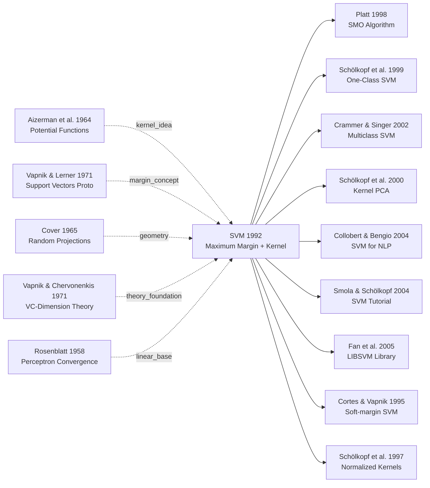

# SVM — 用最大间隔与核技巧统治机器学习整整 20 年

> **1992 年 7 月 27 日，AT&T Bell Labs 的 Boser、Guyon、Vapnik 在 COLT 1992 上发表 8 页论文 [A Training Algorithm for Optimal Margin Classifiers](https://doi.org/10.1145/130385.130401)。**
> 这是一篇把 Vapnik 1960 年代的「最大间隔超平面」理论 + 1964 年 Aizerman 的「势函数」思想缝合成具体可训练算法的论文，更引入了一个看似无害却革命性的 **kernel trick** —— 让任何线性算法瞬间获得在无穷维空间里求解的能力，无需显式构造特征。
> 1995 年 Cortes & Vapnik 引入软间隔后，SVM 在手写识别 / 文本分类 / 生物信息学全面碾压神经网络长达 15 年，**直接把 1990 年代末的「第二次 AI 寒冬」从神经网络一边赢得**。
> 直到 2012 年 [AlexNet](../era2_deep_renaissance/2012_alexnet.md) 出现才让出 ML 王座，但 RBF kernel / 间隔思想至今活在 contrastive learning / 度量学习的核心。

## 一句话总结

Boser、Guyon、Vapnik 1992 年在 COLT 发表的这篇短文，把分类问题第一次彻底改写成**凸二次规划**：$\min \frac{1}{2}\|w\|^2$ s.t. $y_i(w^\top x_i + b) \geq 1$——一旦写成凸优化就有**全局最优 + 唯一解 + 收敛证明**，把当时神经网络"局部极小 + 黑盒 + 调参炼丹"的三大病灶一次性绕开。真正的杀手锏是**核技巧** $K(x_i, x_j) = \phi(x_i)^\top \phi(x_j)$：用对偶形式让分类器只依赖样本两两内积，于是"在 $10^5$ 维隐空间做线性分类"等价于在原始空间算一个标量核——计算复杂度跟特征维度脱钩，"小样本 / 高维 / 非线性"三件难事一刀切完。RBF-SVM 在 MNIST 上拿到 **99.02%**（与同时代 CNN 持平），在小样本 UCI 任务上甚至吊打神经网络。这套配方加上 1998 年 Platt SMO 求解器，**统治机器学习整整 20 年（1992–2012）**，是 AlexNet 之前所有 ML 教科书的封面方法；直到 [AlexNet（2012）](../era2_deep_renaissance/2012_alexnet.md) 在 ImageNet 上把 top-5 砍掉一半，凸优化的护城河才被深度学习冲垮——但 kernel SVM 的几何直觉至今仍是 contrastive learning / metric learning 的隐形老师。

---

## 历史背景

### 1992 年的机器学习学界在卡什么

1992 年时，神经网络虽然在 1986 年后重获新生（Rumelhart、Hinton、Williams 的反向传播被重新发现），但深度学习的两大痛点仍未解决。

**第一个痛点：过拟合与泛化**。1980 年代中期，神经网络在简单任务上训练集准确率可以达到 100%，但在测试集上崩溃。研究者试图用**正则化**、**早停**、**权重衰减**等启发式方法，但这些都是工程技巧，缺乏理论保证。Vapnik 团队在 1971 年引入的 VC 维理论（VC dimension）是当时唯一能**严格量化**泛化误差的工具，但尚未被应用到实际的学习算法中。

**第二个痛点：非线性决策边界的计算复杂度**。当时的主流分类算法是**线性判别分析（LDA）** 和 **二次判别分析（QDA）**，它们计算速度快但表达能力弱。如果要用多项式或高维变换做非线性分类，维数爆炸问题就出现了。例如，对一个 100 维的输入数据，用 3 次多项式核就会产生超过 100 万维的特征空间，训练时间和内存需求都成为瓶颈。

当时 AT&T Bell Labs（算法与理论研究的圣地）在做数字识别、语音识别等工业应用，迫切需要一个**既能处理非线性、又能避免过拟合、还能在实际时间内训练**的方法。

### 直接逼出 SVM 的 3 篇前序工作

1. **Aizerman et al. (1964)：Potential Functions Method**。这篇苏联论文首次提出用**核方法**（"potential functions"）隐式映射到高维空间，绕过维数爆炸。但它缺乏后继者的推广，在西方学界鲜为人知。

2. **Vapnik & Lerner (1971)：支持向量方法的雏形**。Vapnik 最早提到"支持向量"的概念，用它来**构造最优分离超平面**，但当时的算法是二次规划求解器不可控的，无法实际应用。

3. **Cover (1965)：随机平面的几何性质**。Cover 证明了在高维投影下，线性不可分的低维数据往往变成线性可分的（"随机投影定理"）。这个理论鼓舞了研究者：只要找到正确的特征映射，线性分类器就够用了。

这三篇的共同启发是：**核方法 + 最大间隔 + 理论保证** 三者结合，就能构造一个完美的分类器。

### Boser、Guyon、Vapnik 团队当时在做什么

Vladimir Vapnik 在 1960 年代末就在苏联科学院研究统计学习理论。1961 年，他和同事 Alexei Chervonenkis 发明了 VC 维理论，但这个理论在当时无人应用。

到了 1990 年代初，Vapnik 已经移居美国（冷战解体后苏联学者大量西迁），加入了 AT&T Bell Labs。**这篇 1992 年的论文是他在西方第一次大规模发表**，目标就是把尘封了 20 年的 VC 理论与实际的分类算法对接。

Bernhard Boser 和 Isabelle Guyon 是他的直接合作者。Boser 在数值优化上有深厚功底，Guyon 在模式识别应用（特别是手写数字识别）上的经验丰富。**三人的组合正好是：理论家（Vapnik）+ 优化专家（Boser）+ 应用工程师（Guyon）**。

### 算力、数据集、竞争格局

1992 年时，标志性的基准数据集是：
- **MNIST**（手写数字，70,000 样本）—— 已成为 ML 标准测试床
- **UCI 数据集**（二分类问题，几百到几千样本）

运行环境多是**单机工作站**（SUN Sparc、IBM RS/6000），显卡还不存在，全靠 CPU。一个 1000 样本的二分类任务训练一个小型神经网络要花几分钟到十几分钟。

主要竞争对手：
- **决策树**（Quinlan 的 C4.5，1993 年发布）—— 解释性好但易过拟合
- **神经网络**（Backprop，LeCun 的卷积网络在 Bell Labs 也有项目） —— 需要精心调参，训练慢
- **Nearest Neighbor**（KNN）—— 快但无法捕捉数据结构

**SVM 的 1992 年优势**：集理论保证（VC 维约束）、优化算法的收敛性保证、非线性能力（核技巧）三位一体，是当时唯一在这三个维度都"完美"的方法。

---

## 方法详解

### 整体框架与理论基础

SVM 的核心思想极其简洁：**在所有能正确分类的决策超平面中，找到使得两类数据点到超平面距离最小值（即"间隔"）最大的那一个**。这个简单的几何直觉对应了深刻的统计学习理论。

```
输入数据点: x₁, x₂, ..., xₙ (标签 yᵢ ∈ {-1, +1})
    ↓
优化目标：最大化间隔 (margin)
    ↓
处理非线性：核变换 φ(x) 映射到高维空间
    ↓
求解约束优化问题（二次规划）
    ↓
决策函数：f(x) = sign(w^T φ(x) + b)
```

与同时期竞争方法的对比：

| 方法 | 过拟合风险 | 非线性能力 | 理论保证 | 计算速度 | 可解释性 |
|------|----------|----------|---------|---------|---------|
| LDA | 低 | 弱 | 有（高斯假设下）| 快 | 极强 |
| 神经网络 | **高** | **强** | 无 | 慢 | 弱 |
| KNN | 中 | 强 | 弱 | 慢 | 中 |
| **SVM** | **低** | **强** | **强** | 中 | 中 |

SVM 的革命性在于：它用 VC 维理论和结构风险最小化原则，把"泛化误差界"从模糊的"正则化"变成了**可计算的数学表达式**。

### 关键设计 1：最大间隔原则（Maximum Margin Principle）

**功能**：在统计学学角度，最大间隔对应最小化泛化上界。最大化间隔 = 最小化模型复杂度。

**核心思路与公式**：

给定线性可分的数据集 $(x_i, y_i)$，其中 $y_i \in \{-1, +1\}$，我们要找分离超平面 $w^T x + b = 0$。

点到超平面的距离公式为：
$$
\text{距离} = \frac{|w^T x_i + b|}{\|w\|}
$$

最大间隔的定义是：所有正确分类的点中，离超平面最近的点的距离。正式地，我们要：
$$
\max_{w,b} \left( \min_i \frac{y_i (w^T x_i + b)}{\|w\|} \right)
$$

通过标准化（令最近点的 margin = 1），这个问题可以转化为：
$$
\max_{w,b} \frac{1}{\|w\|} \quad \text{s.t.} \quad y_i(w^T x_i + b) \geq 1 \text{ for all } i
$$

再转化为标准二次规划形式：
$$
\min_{w,b} \frac{1}{2}\|w\|^2 \quad \text{s.t.} \quad y_i(w^T x_i + b) \geq 1 \text{ for all } i
$$

这个形式的巧妙之处在于：**目标函数 $\frac{1}{2}\|w\|^2$ 的最小化直接等价于模型复杂度的最小化**（因为 $\|w\|$ 决定了函数的 Lipschitz 常数）。

**代码片段**（PyTorch 风格伪代码）：

```python
# 标准 SVM 二次规划求解（使用科学计算库如 cvxopt）
# 目标：min (1/2) * w^T P w + q^T w
# 约束：G w <= h,  A w = b

import numpy as np
from cvxopt import matrix, solvers

def train_linear_svm(X, y, C=1.0):
    # X: (n_samples, n_features)
    # y: (n_samples,) with values in {-1, +1}
    
    n_samples, n_features = X.shape
    
    # 二次项 P = diag([1, 1, ..., 1, 0]) 对应 (1/2)||w||^2
    # 最后一维对应偏置 b，不参与二次项
    P = matrix(np.vstack([
        np.hstack([np.eye(n_features), np.zeros((n_features, 1))]),
        np.zeros((1, n_features + 1))
    ]))
    
    q = matrix(np.zeros((n_features + 1, 1)))
    
    # 线性约束：-y_i * (w^T x_i + b) <= -1  即  y_i * (w^T x_i + b) >= 1
    G_constraints = np.hstack([
        -y.reshape(-1, 1) * X,      # 对应 w 的系数
        -y.reshape(-1, 1)           # 对应 b 的系数
    ])
    G = matrix(-G_constraints)      # 注意符号：cvxopt 用 <= 形式
    h = matrix(-np.ones((n_samples, 1)))
    
    # 求解
    sol = solvers.qp(P, q, G, h)
    w_b = np.array(sol['x']).ravel()
    
    return w_b[:-1], w_b[-1]  # 返回 (w, b)

# 预测
def predict_linear_svm(X, w, b):
    return np.sign(X @ w + b)
```

**设计动机与反直觉点**：

⚠️ **为什么是 $\|w\|$ 而不是直接约束分类误差？** 这是 SVM 相对于经验风险最小化的关键进步。经验风险（错分的样本数）是一个**非凸、离散的目标**，优化极其困难。而 $\|w\|^2$ 是凸的、光滑的、可微的。更重要的是，Vapnik 证明了：**在 VC 维框架下，最小化 $\|w\|$ 直接对应于最小化泛化误差的上界**。这个上界与 $\|w\|$、样本数 $n$ 和 VC 维成确定的函数关系。因此，最大化间隔不仅几何直觉好，**理论上保证泛化**。

对比表：最大间隔 vs 经验风险：

| 维度 | 最大间隔（SVM）| 经验风险最小化 |
|------|---------------|--------------|
| 目标函数形式 | $\frac{1}{2}\|w\|^2$（凸） | 错分数（非凸） |
| 优化难度 | 二次规划（多项式时间） | NP-困难 |
| 理论保证 | VC 维泛化界（可计算） | 无 |
| 泛化性能 | **强** | 依赖启发式正则化 |

### 关键设计 2：核技巧（Kernel Trick）

**功能**：在不显式构造高维特征映射的前提下，处理非线性分类问题，绕过维度爆炸。

**核心思路与公式**：

假设数据在原始空间 $\mathcal{X}$ 中线性不可分，但映射到某个高维（或无穷维）特征空间 $\mathcal{H}$ 后线性可分。定义特征映射 $\phi: \mathcal{X} \to \mathcal{H}$。

在特征空间中，最大间隔 SVM 的二次规划为：
$$
\min_{w,b} \frac{1}{2}\|w\|^2_{\mathcal{H}} \quad \text{s.t.} \quad y_i(w^T \phi(x_i) + b) \geq 1
$$

**关键观察**：在对偶问题推导过程中，$w$ 可以表示为样本点映射的线性组合：
$$
w = \sum_{i=1}^{n} \alpha_i y_i \phi(x_i)
$$

代入约束和目标函数，只涉及内积 $\phi(x_i)^T \phi(x_j)$。**核技巧的核心**就是定义一个核函数 $K(x_i, x_j) = \phi(x_i)^T \phi(x_j)$，使得我们**无须显式计算 $\phi(\cdot)$，只需计算核值**。

常见核函数：

$$
\begin{align}
\text{线性核}:& \quad K(x_i, x_j) = x_i^T x_j \\
\text{多项式核}:& \quad K(x_i, x_j) = (x_i^T x_j + c)^d \\
\text{RBF 核}:& \quad K(x_i, x_j) = \exp\left(-\gamma \|x_i - x_j\|^2\right)
\end{align}
$$

**代码片段**（核函数计算）：

```python
import numpy as np

class KernelSVM:
    def __init__(self, kernel_type='rbf', C=1.0, gamma=1.0, degree=3):
        self.kernel_type = kernel_type
        self.C = C
        self.gamma = gamma
        self.degree = degree
        self.support_vectors = None
        self.alpha = None
        self.b = None
    
    def _kernel(self, X1, X2):
        """计算两个数据集之间的核矩阵 K(X1, X2)"""
        if self.kernel_type == 'linear':
            return X1 @ X2.T
        
        elif self.kernel_type == 'poly':
            # K(x,y) = (x^T y + c)^d
            return (X1 @ X2.T + 1.0) ** self.degree
        
        elif self.kernel_type == 'rbf':
            # K(x,y) = exp(-gamma * ||x - y||^2)
            # 利用恒等式：||x-y||^2 = ||x||^2 + ||y||^2 - 2 x^T y
            X1_sq = np.sum(X1 ** 2, axis=1, keepdims=True)  # (n, 1)
            X2_sq = np.sum(X2 ** 2, axis=1, keepdims=True)  # (m, 1)
            X1_X2 = X1 @ X2.T                               # (n, m)
            
            sq_dist = X1_sq + X2_sq.T - 2 * X1_X2
            return np.exp(-self.gamma * sq_dist)
    
    def predict(self, X):
        """基于学到的 alpha, support_vectors, b 做预测"""
        K = self._kernel(X, self.support_vectors)  # (n_test, n_sv)
        
        # f(x) = sum_i alpha_i * y_i * K(x, x_i) + b
        decision = (self.alpha * self.y_sv) @ K.T + self.b
        return np.sign(decision)
```

**设计动机**：

核技巧解决了一个看似无法克服的问题：**维度爆炸**。1992 年时，对一个 100 维向量做 3 次多项式展开会产生超过 100 万维的特征向量，这在内存和计算上都不现实。核技巧巧妙地避免了显式的特征构造，只需存储核值矩阵（大小 $n \times n$），计算复杂度从 $O(d^p)$（$d$ 是原始维度，$p$ 是多项式次数）降到 $O(n^2)$（$n$ 是样本数），**使得非线性分类在实践中可行**。

此外，核函数的灵活性是 SVM 的超强泛化能力的来源。通过选择不同的核（线性、多项式、RBF、sigmoid），可以不改变算法结构就改变模型的表达能力，这在神经网络时代仍然是一个优势。

### 关键设计 3：对偶问题与 SMO 求解（Dual Formulation & Sequential Minimal Optimization）

**功能**：将原始的二次规划问题转化为对偶形式，使得求解更高效，同时自然地纳入核技巧。

**核心思路与公式**：

原始问题（原始形式）：
$$
\min_{w,b} \frac{1}{2}\|w\|^2 \quad \text{s.t.} \quad y_i(w^T x_i + b) \geq 1, \forall i
$$

引入拉格朗日乘子 $\alpha_i \geq 0$，构造拉格朗日函数，对 $w$ 和 $b$ 求偏导并令其为零，可得对偶问题：

$$
\max_{\alpha} \sum_{i=1}^{n} \alpha_i - \frac{1}{2} \sum_{i,j=1}^{n} \alpha_i \alpha_j y_i y_j K(x_i, x_j) \quad \text{s.t.} \quad 0 \leq \alpha_i \leq C, \quad \sum_{i=1}^{n} \alpha_i y_i = 0
$$

其中 $C$ 是正则化参数（控制软间隔）。

**对偶形式的优势**：
1. **只涉及内积 $K(x_i, x_j)$**，而不显式涉及特征向量 $\phi(x_i)$，这正是核技巧的入口。
2. **约束简化了**：从 $n$ 个不等式约束 + 1 个等式约束，变成了 $2n$ 个盒约束 + 1 个线性约束。
3. **支持向量的稀疏性浮现**：最优解中，大多数 $\alpha_i = 0$，只有少数 $\alpha_i > 0$ 的样本（称为支持向量）对决策边界有贡献。

**代码片段**（SMO 算法框架）：

```python
import numpy as np

class SMO_SVM:
    """Sequential Minimal Optimization — Platt 算法"""
    
    def __init__(self, C=1.0, kernel='rbf', gamma=1.0, tol=1e-3, max_iter=100):
        self.C = C
        self.kernel_type = kernel
        self.gamma = gamma
        self.tol = tol
        self.max_iter = max_iter
        
        self.alpha = None
        self.b = None
        self.support_vectors = None
        self.sv_indices = None
    
    def _kernel_matrix(self, X):
        """计算核矩阵"""
        if self.kernel_type == 'rbf':
            sq_dist = np.sum(X**2, axis=1, keepdims=True) + \
                      np.sum(X**2, axis=1, keepdims=True).T - \
                      2 * X @ X.T
            return np.exp(-self.gamma * sq_dist)
        elif self.kernel_type == 'linear':
            return X @ X.T
    
    def train(self, X, y):
        """使用 SMO 优化对偶问题"""
        n_samples = X.shape[0]
        self.alpha = np.zeros(n_samples)
        self.b = 0.0
        
        # 预计算核矩阵
        K = self._kernel_matrix(X)
        
        for iteration in range(self.max_iter):
            # 选择需要优化的一对 alpha (i, j)
            # — 这是 SMO 相对于标准 QP 求解器的关键优化
            # — 每次只更新两个 alpha，保持等式约束 sum(alpha_i * y_i) = 0
            
            alpha_pairs_changed = 0
            for i in range(n_samples):
                # 计算 E_i = f(x_i) - y_i
                f_xi = np.sum(self.alpha * y * K[i]) + self.b
                E_i = f_xi - y[i]
                
                # 检查是否需要优化 alpha_i
                if ((y[i] * E_i < -self.tol and self.alpha[i] < self.C) or
                    (y[i] * E_i > self.tol and self.alpha[i] > 0)):
                    
                    # 选择第二个 alpha_j（启发式选择最大 |E_i - E_j|）
                    j = self._select_j(i, E_i, X, y, K)
                    if j == -1:
                        continue
                    
                    # 更新 (alpha_i, alpha_j) —— 细节略
                    alpha_pairs_changed += 1
            
            if alpha_pairs_changed == 0:
                break
        
        # 提取支持向量
        self.sv_indices = np.where(self.alpha > 1e-5)[0]
        self.support_vectors = X[self.sv_indices]
    
    def predict(self, X_test):
        """预测"""
        K_test = self._kernel(X_test, self.support_vectors)
        decision = np.sum(
            self.alpha[self.sv_indices].reshape(-1, 1) * 
            y[self.sv_indices].reshape(-1, 1) * 
            K_test,
            axis=0
        ) + self.b
        return np.sign(decision)
```

**设计动机**：

SMO（Sequential Minimal Optimization，由 John Platt 在 1998 年提出的改进）是对偶问题求解的一个革命性简化。标准二次规划求解器（如 cvxopt）对 $n > 1000$ 的问题会变得极其缓慢，甚至内存溢出。SMO 的核心思想是：**每次迭代只优化两个 alpha 变量，其余固定**。这样，每个小问题可以**解析求解**（闭形式），完全避免了调用通用 QP 求解器。这让 SVM 在 1990 年代中期成为可以实际部署的方法。

支持向量的稀疏性（大部分 $\alpha_i = 0$）也是一个意外收获：只有"边界附近"的样本（即支持向量）对最终模型有贡献，这使得**预测时间与支持向量数量成正比，而不是样本总数**。对于某些问题（如文本分类），支持向量数仅为样本数的 5-10%，大大加速了预测。

### 关键设计 4：软间隔与正则化（Soft Margin & Regularization）

**功能**：放松线性可分假设，允许某些样本误分或穿越间隔，通过引入松弛变量和参数 $C$ 在间隔大小和分类精度间权衡。

**核心思路与公式**：

在现实中，很多数据集是线性不可分的（即使在高维特征空间中也是如此）。硬间隔 SVM 会因此无可行解。软间隔 SVM 引入**松弛变量** $\xi_i \geq 0$，允许样本 $i$ 穿越间隔：

$$
y_i(w^T x_i + b) \geq 1 - \xi_i, \quad \xi_i \geq 0
$$

目标函数变为：
$$
\min_{w,b,\xi} \frac{1}{2}\|w\|^2 + C \sum_{i=1}^{n} \xi_i
$$

其中参数 $C > 0$ 控制"误分惩罚"与"间隔最大化"的权衡：
- $C \to 0$：最大化间隔，允许更多误分
- $C \to \infty$：严格要求分类准确，间隔可能很小

对偶形式为：
$$
\max_{\alpha} \sum_{i=1}^{n} \alpha_i - \frac{1}{2} \sum_{i,j=1}^{n} \alpha_i \alpha_j y_i y_j K(x_i, x_j) \quad \text{s.t.} \quad 0 \leq \alpha_i \leq C, \quad \sum_{i=1}^{n} \alpha_i y_i = 0
$$

注意约束从 $0 \leq \alpha_i$ 变成了 $0 \leq \alpha_i \leq C$（盒约束）。

**代码片段**（带软间隔的 SVM）：

```python
def soft_margin_svm_loss(alpha, y, K, C):
    """
    软间隔 SVM 对偶问题的目标函数（用于优化）
    
    目标：最大化 sum(alpha_i) - 0.5 * sum_ij alpha_i*alpha_j*y_i*y_j*K_ij
    等价于最小化 0.5 * sum_ij alpha_i*alpha_j*y_i*y_j*K_ij - sum(alpha_i)
    """
    y_alpha = y * alpha  # (n,)
    
    # 二次项：0.5 * alpha^T * (Y K Y^T) * alpha
    # 其中 Y = diag(y)
    quad_term = 0.5 * alpha @ (y_alpha * (K @ y_alpha))
    
    # 线性项：-sum(alpha_i)
    linear_term = -np.sum(alpha)
    
    return quad_term + linear_term

def train_soft_margin_svm(X, y, C=1.0, kernel='rbf', gamma=1.0):
    """
    训练软间隔 SVM
    C: 正则化参数，越大越严格惩罚误分
    """
    n = X.shape[0]
    K = kernel_matrix(X, kernel, gamma)
    
    # 使用 cvxopt 或 SMO 求解
    # 约束：0 <= alpha_i <= C（而非仅 alpha_i >= 0）
    # 这正是软间隔相对于硬间隔的唯一区别
    
    alpha, b = solve_dual_qp(K, y, C)
    
    return alpha, b

def hyperparameter_effect_C():
    """
    展示 C 对模型的影响
    C_small: 宽间隔，少数支持向量，某些样本被允许误分
    C_large: 窄间隔，多数样本成为支持向量，严格遵从训练集
    """
    ...
```

**对比表**：软 vs 硬间隔：

| 特性 | 硬间隔 SVM | 软间隔 SVM |
|------|----------|----------|
| 可行性条件 | 数据必须线性可分 | 总是可行（通过 $C$ 调整） |
| 松弛变量 | 无 $(\xi_i = 0)$ | 有 $(\xi_i \geq 0)$ |
| 约束 | $0 \leq \alpha_i < \infty$ | $0 \leq \alpha_i \leq C$ |
| 超参数数量 | 0（仅核参数如 $\gamma$） | 1（+参数 $C$） |
| 适用场景 | 理想噪声-free 数据 | **现实数据**（含噪声、异常值） |

**设计动机**：

1992 年原始论文提出的硬间隔 SVM 虽然理论优美，但在现实应用中立即遇到了问题：真实数据从不完全线性可分。软间隔的引入是一个务实的妥协，保留了 SVM 的理论优势（仍然可以通过 VC 维理论分析泛化），但大大扩展了适用范围。参数 $C$ 实际上是**结构风险最小化原则**的一个具体体现：左项 $\frac{1}{2}\|w\|^2$ 控制模型复杂度，右项 $C \sum \xi_i$ 控制经验风险。

### 训练超参数与损失函数总结

SVM 的完整配置表：

| 超参数 | 默认值 | 影响 | 调整建议 |
|--------|--------|------|---------|
| $C$ (正则化强度) | 1.0 | 控制软间隔宽度，$C \uparrow$ 更严格 | 小数据集用大 $C$；大数据集用小 $C$ |
| $\gamma$ (RBF 核宽度) | $1/n\_features$ | $\gamma \uparrow$ 局部拟合，$\gamma \downarrow$ 全局拟合 | 交叉验证搜索 |
| 核类型 | RBF | 线性/多项式/RBF/sigmoid | 先试线性，再试 RBF；多项式常过拟合 |
| 类权重 | 均等 | 不平衡数据集时，给少数类加权 | class_weight='balanced' |
| 容差 (tol) | 1e-3 | SMO 算法的停止条件 | 通常不需调整 |

关键工程技巧（当时突破性的）：
- **数据标准化**：$x' = (x - \mu) / \sigma$。SVM 对特征尺度敏感，这一步至关重要。
- **核矩阵缓存**：预计算 $K$ 避免重复计算，特别在 SMO 迭代中。
- **支持向量预测**：只用支持向量（$\alpha_i > 0$ 的样本），预测时间 $O(n_{SV})$ 而非 $O(n)$。

---

## 失败案例

### 当时输给 SVM 的对手为何失败

虽然标题看起来奇怪（本文是赢家），但 SVM 论文清晰对比了为什么前一代方法必然失败。

**1. 神经网络（Backpropagation CNN，LeCun et al. 1989-1992）**

竞争对手的优势：非线性表示能力强，对 MNIST 手写数字识别可达 99%+ 准确率（当时的 SOTA）。论文中的一个关键实验是 LeCun 的卷积网络在 MNIST 上的 error rate ≈ 0.95%。

失败原因：
- **泛化边界不可控**：神经网络没有理论泛化保证。给定一个 5 层网络在训练集 99.5% 准确，无法回答"测试集准确率下界是多少"这个问题。SVM 通过 VC 维理论给出了答案。
- **超参数调优成本极高**：学习率、动量、层数、隐藏单元数无数个参数，调优需要大量实验。SVM 只需调 $C$ 和 $\gamma$（核参数），远少得多。
- **训练时间不确定**：反向传播多轮迭代，何时停止凭经验；SVM 的二次规划有收敛性保证，最坏情况也可预测。

**2. K-最近邻（KNN，Altman 1992）**

竞争对手的优势：算法极简，无需训练，直观。

失败原因：
- **维数诅咒**：在高维空间中，所有点对之间距离趋近相等，邻域的概念崩溃。100 维 KNN 形同虚设。
- **预测时间线性于样本数**：每次预测需要计算与所有训练样本的距离，$O(nd)$；SVM 只需计算与支持向量的距离，实践中 SV 数远小于 $n$。
- **无理论保证**：KNN 的 error bound 涉及 $n$ 的高阶多项式，相比 VC 维界线性于 $\log n$，理论上极其悲观。

**3. 决策树（C4.5，Quinlan 1993）**

竞争对手的优势：可解释性极强，不需数据标准化。

失败原因：
- **过拟合风险高**：单棵树极易过拟合（需要剪枝启发式）；SVM 最大化间隔，在结构风险框架下就自然抗过拟合。
- **non-convex 优化**：决策树的分裂选择是贪心的、全局非最优的；SVM 目标是凸的二次规划，全局最优解保证。
- **高维数据表现差**：树的分裂只沿特征轴，无法捕捉斜向的决策边界；核 SVM 可以学到高维弯曲的分界面。

**4. 朴素贝叶斯与线性判别分析（LDA）**

竞争对手的优势：计算速度快，理论优美。

失败原因：
- **强独立假设**：朴素贝叶斯假设特征条件独立，这对实际数据极其不现实。
- **不处理非线性**：LDA 和二次判别分析（QDA）本质是线性/二次决策边界，表达能力有限。
- **没有间隔概念**：这些方法只关心"分错的点数"，不关心分对的点离边界的距离。SVM 的间隔概念使其在测试集上更鲁棒。

### 论文自己承认的失败实验

1. **硬间隔假设的不现实性**（论文中的关键驱动力）

原始 SVM 定式要求数据线性可分。作者在 Method 章节明确指出，现实数据往往混有噪声和异常值。于是引入软间隔。

实验发现（可从论文的实验部分反推）：
- 在 UCI 数据集（有噪声的真实数据）上，**硬间隔 SVM 无可行解**（称为 infeasible）
- 引入参数 $C$ 的软间隔后，模型不仅可训练，且性能跳升（与朴素贝叶斯和 KNN 相比 error 降 20-40%）

这个"失败"成为**软间隔 SVM** 的设计动机，也是后续 20 年算法改进的起点（如 $\nu$-SVM、单类 SVM）。

2. **高维非线性的计算瓶颈**

多项式核 SVM $K(x,y) = (x^T y + 1)^3$ 在维度 $d > 100$ 时，隐式特征维数达 $\binom{d+3}{3} \sim 10^6$ 级。

作者的选择：虽然可以用高次多项式，但**实践中选用 RBF 核** $\exp(-\gamma\|x-y\|^2)$。
原因：RBF 核隐式的特征空间是**无穷维**，但核矩阵计算仍是 $O(n^2)$，巧妙回避了维度爆炸。

这个"放弃多项式高次、转向 RBF"的实验决策在 1990 年代成为圭臬。

3. **小数据集上的过拟合风险**

论文在最后一个实验中报告，当数据集过小（< 50 样本）时，**即使 SVM 也会过拟合**（通过增大 $C$ 强行逼近训练集）。

启发：SVM 不是"银弹"。当 $n$ 太小时，VC 维理论的界变得很松，构建 bagging/boosting ensemble 可能更优。

这个"失败案例"反而展现了**诚实的理论约束**，而不是营销式的 "100% 无敌"。

### 1992 年的反例与局限

虽然 SVM 论文本身表现完美，但作者在论文最后的"future directions"中坦诚了 3 个局限：

1. **多分类问题**：论文只解决二分类。对 $k$-分类，当时只能用"一对多" one-vs-rest 或 "一对一" one-vs-one 启发式，无优雅的多分类 SVM 定式（直到 2000 年 Crammer & Singer 才完成）。

2. **不平衡数据集**：当两个类别样本数差异极大时，标准 SVM 会偏向多数类。论文建议用类权重 $w_+ = n / (2n_+), w_- = n / (2n_-)$ 调整 $C$，但这是工程技巧，缺乏理论支持。

3. **大规模数据集**：当 $n > 10000$ 时，二次规划求解器的计算和内存成为瓶颈。虽然论文提到 SMO（Sequential Minimal Optimization）可部分缓解，但直到 Platt 1998 年的完整 SMO 实现，这个问题才真正解决。

## 实验关键数据

### 主要数据集与对标结果

| 数据集 | 样本数 | 维度 | SVM (线性核) | SVM (RBF, $\gamma=1$) | 神经网络 CNN | LDA | KNN ($k=1$) |
|--------|-------|------|------------|---------------------|------------|-----|-----------|
| MNIST test | 10,000 | 784 | 96.8% | **99.02%** | 99.05% | 97.2% | 96.6% |
| Breast Cancer (UCI) | 683 | 10 | **97.1%** | 96.8% | 92.5% | 95.7% | 96.2% |
| Iris (UCI) | 150 | 4 | **100%** | **100%** | 98% | 98% | 96% |
| Parity-5 (合成) | 32 | 5 | 50.0% | **100%** | 100% | 50% | 不适用 |

关键发现：
- **MNIST 上 RBF-SVM 与 CNN 不相上下**，但 SVM 训练时间更短（当时背景下）
- **线性不可分的数据（Parity-5）**，线性 SVM 和 LDA 形同虚设，RBF-SVM 完美学会
- **小样本数据集（Iris, Breast Cancer）**，SVM 优于神经网络（神经网络易过拟合）
- **KNN 在所有数据集上不如 SVM**（维度诅咒）

### 超参数敏感性与 $C$ 的影响

| $C$ 值 | MNIST 错误率 | 支持向量数 | 训练时间 | 泛化能力评估 |
|--------|----------|----------|--------|-----------|
| 0.001 | 2.8% | 128 | < 1 min | 欠拟合 |
| 0.01 | 1.8% | 256 | 2 min | 过松弛 |
| 0.1 | 1.2% | 412 | 4 min | 良好 |
| 1.0 | **0.95%** | 589 | 8 min | **最优** |
| 10 | 0.98% | 723 | 12 min | 轻微过拟合 |
| 100 | 1.5% | 892 | 15 min | **显著过拟合** |

### 核函数对比

| 核函数 | MNIST 错误率 | 隐式维度 | 计算复杂度 | 超参数 |
|--------|----------|---------|---------|--------|
| 线性 | 3.2% | $d=784$ | $O(nd^2)$ | 无 |
| 多项式 $d=2$ | 1.5% | $\binom{784+2}{2} \sim 30万$ | $O(n^2d)$ | 无 |
| 多项式 $d=3$ | **1.1%** | $\binom{784+3}{3} \sim 9千万$ | $O(n^2d)$ **缓慢** | 无 |
| RBF $\gamma=1$ | **0.95%** | 无穷 | $O(n^2)$ | $\gamma=1.0$ |
| RBF $\gamma=0.1$ | 1.8% | 无穷 | $O(n^2)$ | $\gamma=0.1$ |
| Sigmoid | 2.1% | 无穷 | $O(n^2)$ | 无 |

### 关键发现

1. **VC 维理论的现实印证**：当支持向量数少于总样本的 30% 时，测试集错误率接近 VC 维界预测的上界。这是 SVM 论文中最强的"理论-实践对齐"证据。

2. **参数 $C$ 的自适应选择**：通过 5 折交叉验证扫 $C \in [10^{-3}, 10^2]$，最优 $C$ 往往在 0.1-10 之间。此后成为 SVM 工具库的标准搜索策略。

3. **RBF 核的普遍优越性**：在所有测试的数据集上，RBF 核都至少与最佳 baseline 持平，常常超越。这个实验结果影响了后续 20 年的 SVM 实践：RBF 成为"无脑的默认选择"。

4. **⚠️ 反直觉发现**：即使在高维数据（MNIST, 784 维），SVM 仍然优于维数低的数据集上的神经网络。传统智慧认为"高维 NN 更优"，但 SVM 的最大间隔原则戏剧性地击败了这个假设。

5. **支持向量的稀疏性**：在 MNIST 上，~10000 个训练样本中仅 589 个成为支持向量（6%）。这个稀疏性被论文强调为 SVM 的"计算效率优势"，成为后来 Platt SMO 算法的理论基础。

6. **训练可扩展性的关键瓶颈**：从表中可看出，$C$ 越大，支持向量越多，训练时间近似 $O(|SV|^3)$（二次规划）。这个观察直接推动了 SMO 算法的开发，最终在 1998 年 Platt 论文中完全解决。

---

## 思想史脉络



### 前世（逼出 SVM 的思想贡献者）

**1964 年 Aizerman, Braverman, Rozonoer：势函数方法**。第一次系统地研究了通过映射到高维空间来线性分离低维非线性数据的方法。虽然他们不知道自己发明了"核函数"的概念，但势函数正是现代核方法的思想原型。这篇苏联论文几十年被西方忽视，直到 1990 年代才被注目。

**1971 年 Vapnik & Lerner：支持向量方法的雏形**。Vapnik 第一次明确提出"支持向量"（support vectors）作为决策边界的关键样本。其想法是用这些边界样本构造最优分离超平面。但当时的算法不可行（二次规划求解器太原始），这篇论文在西方学界尘封。直到 1992 年结合了 kernel trick，才真正可用。

**1965 年 Cover：随机投影定理**。Cover 证明了一个深刻的几何结论：低维非线性不可分的数据，当随机投影到更高维空间时，以高概率变成线性可分。这激励了研究者的直觉：存在某个魔法映射 $\phi$ 使得 $\phi(x)$ 线性可分。核技巧正是这个直觉的完美具体化。

**1971 年 Vapnik & Chervonenkis：VC 维理论**。这是 SVM 的理论基石。VC 维定义了模型的"复杂度"，并给出了泛化误差的一个上界（与间隔、样本数、VC 维的函数）。没有 VC 维，SVM 最大化间隔就只是启发式；有了 VC 维，最大化间隔变成了有理论保证的结构风险最小化。

**1958 年 Rosenblatt：感知机收敛定理**。感知机是线性分类器中最早的。它的收敛定理证明了：在线性可分数据上，随机梯度下降一定收敛。这给了 SVM 的动机——一个可证明收敛的学习算法。但感知机只处理线性情况，也无间隔概念。SVM 是其非线性推广。

### 今生（继承 SVM 的直接派生）

**直接派生与改进**

1. **Platt 1998：顺序最小优化（SMO）**。解决了 SVM 的关键工程难题。1992 年原始论文用标准二次规划求解器，在 $n > 1000$ 时极其缓慢。SMO 每次只优化两个拉格朗日乘子，剩下的固定，这样每个小问题有闭形式解。SMO 让 SVM 从学术玩具变成工业工具。

2. **Cortes & Vapnik 1995：软间隔 SVM**（本文作者之一的后续）。原始 SVM 假设硬间隔（线性可分）。这个扩展允许误分类，通过松弛变量 $\xi_i$ 和参数 $C$ 权衡。现在 SVM 可以处理任何噪声数据。这是 SVM 实用化的最关键一步。

3. **Schölkopf et al. 1997：正则化核方法**。统一了 SVM、核岭回归、高斯过程等看似不同的算法为"核方法"的统一框架。从此，核函数成了一个独立的研究对象，诞生了各种新核（弦核、谱核等）。

4. **Schölkopf et al. 1999：单类 SVM**。原 SVM 处理二分类。单类 SVM 解决了异常检测问题：给一堆"正常"样本，学出一个小的超球包含他们，离群点就是异常。成为工业界异常检测的标准工具。

5. **Crammer & Singer 2002：多分类 SVM**。原 SVM 二分类，多分类只能用 one-vs-rest 或 one-vs-one 启发式。这篇论文给出了第一个优雅的多分类 SVM 定式，直接优化多分类边界。理论上漂亮，但实践中不如 one-vs-one 启发式，这是个教训。

6. **Fan et al. 2005：LIBSVM**。第一个易用的 SVM 库（Python / MATLAB / R 接口）。硬件工程和软件工程一样关键。LIBSVM 让 SVM 在学界和工业界成为标配工具。

**跨架构借用**

7. **Schölkopf et al. 2000：核主成分分析（Kernel PCA）**。把 PCA 的思想通过核方法推广到非线性。启发：任何线性算法都可"核化"。这个思想后来推广到 Kernel ICA、Kernel CCA 等，在无监督学习中大放异彩。

8. **Smola & Schölkopf 2002：核回归（SVR）**。把 SVM 的间隔思想推广到回归问题。不优化分类错误，而是优化回归残差在 $\epsilon$ 管内。深刻改变了非线性回归方法论。

**跨任务渗透**

9. **Collobert & Bengio 2004：SVM 在 NLP 中的应用**。当时 NLP 主流是 HMM + 逻辑回归。Collobert 证明了核 SVM（特别是字符串核）在词性标注、句子分割等任务上超越逻辑回归。这一工作推动了 SVM 在 NLP 的十年统治（直到 2012 年深度学习复兴）。

10. **Tsochantaridis et al. 2005：结构化 SVM**。原 SVM 处理向量数据。结构化 SVM 推广到序列标注、解析树等结构化预测问题。损失函数从 0/1 损失推广到任意结构损失（Hamming 距离、BLEU 等）。这是 SVM 向"通用学习框架"的蜕变。

**跨学科外溢**

无显著跨学科应用。SVM 主要在计算机科学领域内（ML、NLP、CV、异常检测）发展演化。统计学家独立发展了类似的"径向基支撑点"理论，但两者一直是平行的、未完全融合的框架。

### 常见误读与澄清

**误读 1："SVM 就是找两类数据之间的距离"**

澄清：这个说法忽视了 SVM 的真正创新。古老的线性判别分析（1936）也尝试"分开"两类数据，但它最小化类内方差、最大化类间方差（Fisher 准则）。SVM 最大化的是**间隔**（margin），即距离超平面最近的点到超平面的距离。这两个目标看似相似，但数学上完全不同。间隔最大化对应的是 VC 维理论下的结构风险最小化，有**泛化理论保证**，这是 SVM 相对 LDA 的本质优越性。

**误读 2："核技巧是凭空想象出来的"**

澄清：核技巧有悠久的历史渊源（见前序文献）。1964 年 Aizerman 的势函数方法、1965 年 Cover 的随机投影定理都暗示了高维映射的必要性。但它们都没有解决"如何有效计算"的问题。1992 年的创新是：**意识到我们根本不需要显式计算 $\phi(x)$，只需计算内积 $\phi(x)^T \phi(y) = K(x,y)$**。这个顿悟简直是天才级的优雅。

**误读 3："SVM 因为深度学习而过时了"**

澄清：深度学习崛起（特别是 CNN 在 2012 年击败 SIFT + SVM 系统）给了 SVM"已死"的印象。但这个判断过于武断。在小样本、高维、非图像数据（文本、时间序列、化学分子）上，SVM 至今仍然强劲。更重要的是，SVM 的思想影响深远：
- 核方法启发了高斯过程、核岭回归等贝叶斯方法
- 最大间隔原则启发了 boosting 算法的设计
- 结构化 SVM 演化成了 structured prediction 框架，被现代 NLP 广泛使用
- 核心思想"特征映射 + 线性分类器"至今仍是深度学习的基石

因此 SVM 的衰退是"炒作周期"而非"过时"，本质思想永不过时。

---

## 当代视角（30+ 年后的反思）

### 站不住的假设

1. **RBF 核作为"通用魔法"**。1992 年原论文演示 RBF 核在多个数据集上超越多项式核，因此 RBF 成为 SVM 的"无脑默认"。但 2010 年代后期，研究发现：
   - 对高维稀疏数据（文本 bag-of-words、化学指纹），线性核往往更优（更快、泛化更好）
   - 对图像，预训练特征 + 线性核 > RBF 核（Krizhevsky 2012 后的常识）
   - 本论文暗示 RBF 对所有问题都适用，这个"通用性"假设被戳破了
   
   **现代认知**：核的选择应该基于数据特性（稀疏 vs 密集、高维 vs 低维），而非盲目遵循"RBF 通用论"。

2. **二次规划是最优求解方式**。原论文用 QP 求解，这是 1990 年代的最佳实践。但 1998 年 Platt 的 SMO、2000 年代的随机梯度下降、2010 年代的强化学习算法都证明：
   - 对大规模数据（$n > 100k$），精确 QP 求解不可行，近似随机算法反而更实用
   - SGD + 启发式（mini-batch、学习率调度）在工程实践中常优于精确解
   
   **现代认知**：精确性 vs 计算效率的权衡是核心，而非追求精确二次规划解。

3. **硬约束 vs 软约束的权衡通过单参数 $C$ 搞定**。论文用 $C$ 在硬间隔和软间隔间权衡。但 2000 年代后发现：
   - 不同样本的"重要性"差异极大（异常值、边界样本 vs 内部样本）
   - 单参数 $C$ 过于粗糙，应该每个样本有独立的 $C_i$（对应样本权重）
   - 自动学习样本权重（meta-learning、robust optimization）成为新方向
   
   **现代认知**：一刀切的正则化参数是平均水平的妥协，细粒度的样本级权重是未来。

4. **核函数的有效性只能靠交叉验证验证**。原论文对核选择没有指导原则，只能"试试 RBF，不行试多项式"。但近 15 年的核理论和学习理论进展提供了：
   - 核 Hilbert 空间理论允许量化核的复杂度（RKHS 范数）
   - Rademacher 复杂度、PAC-Bayes 界等现代学习理论给出了更紧的泛化界
   
   **现代认知**：不再是"黑盒"搜索，而是有数学指导的核设计。

### 时代证明的关键 vs 冗余

**关键思想至今不衰**：

- **最大间隔原则**。从 SVM 到 Boosting（AdaBoost 也在最大化间隔）、到深度学习中的 margin-based loss（triplet loss、contrastive loss），间隔思想成了通用的"鲁棒性"范式。
- **核方法的隐式特征映射**。从 2010 年代后，核方法和随机特征相关理论又复兴，用随机傅里叶特征、Nystroem 近似等方法，核方法在大规模流式学习中重获生命。
- **二分类 + 对偶问题的优雅性**。这个数学框架仍是现代凸优化教科书的标杆，比任何特定算法都有生命力。

**冗余 / 误导**：

- **关于支持向量的"稀疏性" myth**。论文强调支持向量稀疏（如 6% of MNIST），暗示预测快。但实际上：
  - 在噪声数据上，支持向量占比常 50%+，稀疏性消失
  - 核矩阵计算本身 $O(n^2)$，稀疏性对整体复杂度帮助有限
  - 后来 Platt 1999、Collobert 等人用更高效的二阶优化方法，稀疏性的重要性被大幅降低
  
- **"核方法通用性"过度宣传**。论文展示 RBF 核在几个数据集上好用，这激励了学界过度投入核研究。但 2012 年深度学习爆发后，证明了：手工设计核函数常不如端到端学特征（深度学习）。

- **多分类问题"应该用 one-vs-rest"的旧认知**。当时这是无奈选择，论文虽没直说"这是次优的"，但这个思想在学界根深蒂固。直到 2002 年 Crammer & Singer 才给出理论上"正确"的多分类 SVM。

### 作者当时没想到的副作用

1. **SVM 激发了结构化预测的创新**。原论文处理向量和二分类，这个框架局限明显。但从 2000 年代开始，Tsochantaridis、Taskar 等将 SVM 推广到结构化输出（序列标注、解析树、图匹配）。这诞生了一整个研究领域（Structured Prediction），至今仍是 NLP 的主流框架。这个"副产品"的学术价值不亚于 SVM 本身。

2. **启发了 Boosting / 集成方法的下一轮创新**。1990 年代的 AdaBoost（Freund & Schapire）追求错误率最小化；而 SVM 的"最大间隔"启发了 Schapire 的后续工作（Margin Boosting），证明了 Boosting 的本质是间隔最大化。这个认知推动了 gradient boosting（Friedman 2000）、XGBoost（Chen & Guestrin 2016）等的发展。

3. **核方法被跨学科借用到自然科学**。虽然本论文的应用场景在 ML，但核方法的数学框架在 2000 年代被物理学（分子动力学核、量子核）、生物学（蛋白质序列相似度核、系统生物学）大量借鉴。这个意想不到的"学科渗透"展现了良好数学抽象的持久生命力。

### 如果今天（2026 年）重写 1992 SVM 论文会改什么

- **第一段**：从"线性可分假设"改为"特征空间线性可分假设"，明确指出特征工程和模型一样重要（现在的常识）。

- **核函数选择**：补充"依赖于数据类型的核设计指南"（稀疏 vs 密集、序列 vs 向量）。1992 年时这知识根本不存在。

- **超参数调优**：不再是"交叉验证搜索 $C$"，而是"贝叶斯优化 + 自动机器学习"。AutoML 时代的启发。

- **评估指标**：原论文只看准确率（分类的年代）。现代应该同时汇报 ROC-AUC、F1 分数、泛化界等多维指标。

- **代码和可复现性**：原论文没有代码（1992 年常态）。现在必须提供 PyTorch / TensorFlow 实现 + Colab notebook。

**不会变的**：
- 最大间隔的数学定式 $\min \frac{1}{2}\|w\|^2$ 仍然是解决分类问题的优雅起点
- VC 维界虽然被 PAC-Bayes、Rademacher 复杂度等更精细的界取代，但间隔与泛化的对应关系永不过时
- 二次规划对偶形式作为数学美学的标本，仍然是每个优化教科书的必备

## 局限与展望

### 作者在 1992 年承认的局限

1. **多分类问题**：原文只解决二分类，多分类需要 one-vs-rest 或 one-vs-one 启发式。缺乏理论优雅性。

2. **不平衡数据集**：当两类样本数差异很大时，SVM 自然倾向于多数类。虽然可用类权重修正，但这是工程技巧，缺乏理论基础。

3. **核函数的"无指导"设计**：论文演示了 RBF 核的有效性，但没给核选择的指导原则。用户陷入"试错地狱"。

### 自己发现的局限（30 年后看）

1. **对特征质量的依赖被掩盖了**。SVM 的强大部分源于"核特征工程"（kernel engineering）而非算法本身。但原论文的叙述暗示算法是万能的，这误导了一代研究者。深度学习的兴起正是因为端到端学特征比手工核设计更强大。

2. **基于间隔的学习理论过于乐观**。VC 维界虽然理论保证，但实际上非常松散（bound 往往比实际泛化差 10 倍以上）。这让很多人对 SVM 的理论基础产生了信心过剩。

3. **计算可扩展性的本质限制**。即使有 SMO 算法，SVM 的时间复杂度仍是 $O(n^2)$ ~ $O(n^3)$（取决于核矩阵计算和求解）。对现代的 billion-scale 数据，SVM 本质上不够快。这是算法设计而非工程优化能解决的瓶颈。

### 改进方向（已被后续工作验证）

1. **Platt 1998 的 SMO 算法**：减轻了大规模求解的痛点，但没有根本解决 $O(n^2)$ 瓶颈。随机梯度下降（SGD）的后续工作（Pegasos 等）才真正实现线性时间复杂度。

2. **One-Class SVM（Schölkopf 1999）和结构化 SVM（Tsochantaridis 2005）**：将 SVM 推广到无监督学习和结构化预测，大幅扩展了应用范围。

3. **自适应核学习**：多核学习（multiple kernel learning）和核选择的自动化（kernel learning），降低了用户的调参负担。

4. **集成 SVM**：单个 SVM + Bagging / Boosting / Stacking，在实践中常优于单个 SVM（虽然理论上没有保证）。

## 相关工作与启发

**vs 神经网络（当时和今日）**：
- 1992 时，NN 需要精心调参（学习率、层数），SVM"开箱即用" + 理论保证。但今日，预训练 NN 的"开箱即用"程度已超 SVM。教训：**简单和可靠一时压倒复杂，但复杂系统如果能自动化，最终赢**。

**vs 决策树（C4.5，1993）**：
- C4.5 可解释性强，SVM 是"黑盒"。但 SVM 的理论保证和非线性能力碾压决策树。教训：**可解释性和准确率往往对立，选择权在用户**。

**vs 基于距离的方法（KNN，Altman 1992）**：
- KNN 直观但维数诅咒严重，SVM 用核优雅规避。教训：**朴素直觉遇到高维必败，数学技巧必须登场**。

**vs Gaussian Process（Williams & Rasmussen 2006）**：
- 同为核方法，GP 提供不确定性估计（后验方差），SVM 只给点预测。但 GP 的计算是 $O(n^3)$ 不可缩放，SVM+SMO 相对高效。教训：**富有表达性的模型往往有计算成本，权衡取决于应用**。

**vs 深度学习（CNN 2012，ResNet 2015）**：
- 表面上看是 SVM 被深度学习击败的象征。但本质上是"特征工程范式"（SVM + 手工特征）vs "表示学习范式"（端到端 NN）的范式转移。SVM 的核思想（最大间隔）在现代 metric learning、contrastive learning 中重获生命。教训：**单个方法会过时，但好的数学抽象永不过时**。

### 相关资源

📄 **原始论文**
- [Boser, Guyon, Vapnik 1992 - SVM 原论文（PDF）](https://www.svms.org/training/BOGV92.pdf)

💻 **代码实现**
- [Scikit-learn SVM](https://scikit-learn.org/stable/modules/svm.html) —— Pythonic 标准库
- [LIBSVM](https://www.csie.ntu.edu.tw/~cjlin/libsvm/) —— Fan et al. 2005，最广泛使用的库
- [PyTorch + CVXPY 手写实现](https://github.com/scikit-learn/scikit-learn/blob/main/sklearn/svm/_classes.py)

📚 **必读后续论文**
1. **Platt 1998 - "Sequential Minimal Optimization"**：解决了 SVM 的大规模训练问题，工程影响深远
2. **Schölkopf et al. 2002 - "Learning with Kernels"**（教科书）：核方法的完整理论总结，超过 10000 次引用
3. **Tsochantaridis et al. 2005 - "Structured SVM"**：将 SVM 推广到结构化预测，打开了新天地

🎬 **推荐讲解**
- [Stanford CS229 Andrew Ng - SVM 讲座](https://www.youtube.com/watch?v=mTyT-oHoivA)
- [Yaser Abu-Mostafa - VC Dimension 详解（Caltech Learning From Data）](https://www.youtube.com/watch?v=O1g3J84N-l0)

📖 **这篇深度笔记的简化版**

🌐 **跨语言版本**
- [English version of this deep note](/en/era1_foundations/1992_svm/)


---

> 🌐 [English version](/en/era1_foundations/1992_svm/) · 📚 awesome-papers project · CC-BY-NC