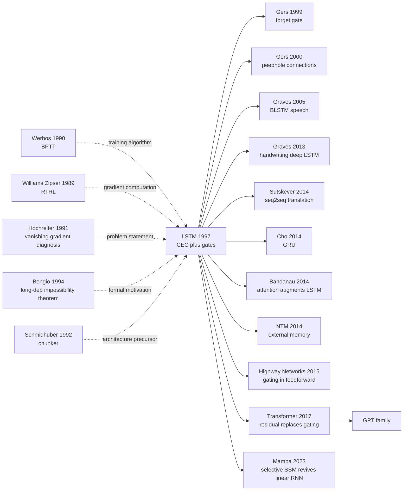

# LSTM — 用门控机制让循环网络第一次记得住长依赖

> **1997 年 11 月 15 日，TU Munich 的 Sepp Hochreiter 与 IDSIA 的 Jurgen Schmidhuber 在 *Neural Computation* 9(8) 上发表 46 页长文 [Long Short-Term Memory](https://www.bioinf.jku.at/publications/older/2604.pdf)。**
> 这是一篇被 *Nature* / *Science* 连续拒稿、最终在二线期刊上「埋没」了 17 年的论文 —— 用一个被作者称为 *constant error carousel* 的乘性门控 + 自连接 cell，第一次给循环网络解开「梯度爆炸 / 消失」的死结，让 RNN 真正能记住 100 步以前的事件。
> 2014 年 Seq2Seq 把它推到机器翻译主流，2016 年 Google GNMT 让它服务全球 5 亿用户，2017 年才被 [Transformer](../era3_attention/2017_transformer.md) 平推下王座。
> Schmidhuber 一句「我 1991 年就解决了梯度消失问题」成为深度学习史上最著名的优先权之争 —— 不论功劳归谁，**LSTM 都是序列建模在前 Transformer 时代唯一真正 work 的工业级架构**。

## 一句话总结

LSTM 用一个权重恒为 1 的"记忆细胞自连接"——**Constant Error Carousel (CEC)**——取代 vanilla RNN 的加权递归，让误差信号在跨数百步时间维度上以**乘数 1**的恒等连接无衰减传播；再用 **input gate** $i_t$ 和 **output gate** $o_t$ 控制信息何时写入、何时读出，从根本上解开了 vanilla RNN 学不了 > 10 步依赖的"梯度消失诅咒"，并在此后 20 年成为序列建模的事实标准。

---

## 历史背景

### 1997 年的递归网络学界在卡什么

要理解 LSTM 的颠覆性，必须回到 90 年代中期那个**"RNN 想做长时序但学不动"**的尴尬阶段。

1986 年 Rumelhart-Hinton-Williams 发表 backpropagation 之后，前馈神经网络迎来 80s 末第一波热潮，但很快有人意识到：**很多任务本质是序列**——语音、手写、语言、时间序列预测，都需要"记住几秒/几十步之前发生了什么"。1986 Jordan、1990 Elman 提出 **Simple Recurrent Network (SRN)**，把上一时刻的隐状态喂回当前输入，理论上可以记住任意长的历史。Schmidhuber 1992 提出 **chunker / history compressor**，叠两层 RNN 让上层"压缩"下层的预测残差。学界一度乐观：**RNN 是通用的、图灵完备的，只要训练得当就能学任何序列函数**。

但 1991-1994 年间这套乐观开始撞墙。Hochreiter 1991 在 TU Munich 的硕士论文（用德文写的 [Untersuchungen zu dynamischen neuronalen Netzen](http://people.idsia.ch/~juergen/SeppHochreiter1991ThesisAdvisorSchmidhuber.pdf)）第一次**实证 + 理论双管诊断**了一个奇怪现象：

> **当 RNN 试图学习"输入在第 1 步、目标在第 50 步"这种任务时，反向传播过去的梯度要么指数级衰减到 0，要么指数级膨胀到 NaN——前者让网络"想学但学不到"，后者让训练直接崩溃。**

Hochreiter 把它命名为 **vanishing / exploding gradient problem**。1994 年 Bengio、Simard、Frasconi 在 *IEEE Trans. NN* 上把这个观察**严格证明**为定理：在任何"稳定的"vanilla RNN 中，跨 $k$ 步梯度的雅可比矩阵谱半径满足 $\|\partial h_t / \partial h_{t-k}\| \le \lambda^k$，$\lambda < 1$ 时梯度必然消失。结论是冷酷的：**vanilla RNN 在数学上无法用基于梯度的方法学习超过 10 步的依赖**。

学界 1991-1996 年试遍各种 hack：teacher forcing（Williams-Zipser）、二阶方法（Pearlmutter 1989）、模拟退火、time-delay neural network（Waibel 1989 TDNN）、隐马尔可夫 hybrid、Mozer 1989 的 attractor network、Lin 1996 的 NARX 网络。**所有这些方法在 Reber grammar、addition problem 这种受控长依赖 benchmark 上都失败**——能学 5-10 步，再长就崩。这是 LSTM 论文 §3 "Previous Work" 直接列出的"群尸阵"。

### 直接逼出 LSTM 的 5 篇前序

- **Werbos 1990 (BPTT)**：把 RNN 在时间上展开成一个等价的深前馈网络，用普通 backprop 训练。这是后来所有 RNN 训练的基础，也是 LSTM 训练算法的起点。但 BPTT 直接暴露了 vanishing gradient——展开 100 步就是 100 层深网络。
- **Williams & Zipser 1989 (RTRL)**：实时递归学习，不需要展开整段序列即可计算梯度。优点是在线、增量；缺点是单步复杂度 $O(n^4)$（$n$ 是隐藏单元数），算到 30 个单元就跑不动。**LSTM 的 truncated BPTT for gates + RTRL-like for CEC** 的混合训练算法直接继承自这条路线。
- **Hochreiter 1991 硕士论文**：**LSTM 的"问题陈述"原型**——Hochreiter 在 Schmidhuber 指导下做的实证 + 理论分析，第一次明确"梯度乘以雅可比连乘 → 消失"这一机制。论文里甚至已经提出"如果让某个隐藏单元的递归权重恰好为 1，梯度就不会衰减"——**这就是 6 年后 CEC 的雏形**，但 1991 年还没解决"如何控制何时读写"的问题。
- **Bengio, Simard, Frasconi 1994 ("Learning long-term dependencies with gradient descent is difficult")**：把 Hochreiter 的诊断升级为严格定理，并指出"在 trade-off 上，要么稳定但学不长、要么能学长但不稳定"——一个看似无法逾越的 dilemma。LSTM 正是为了打破这个 dilemma 而设计：**用线性 cell 保留 long-term 信号，用 gate 提供非线性的写/读控制**。
- **Schmidhuber 1992 (Neural sequence chunker)**：Schmidhuber 自己上一篇 RNN 工作，用 2 层 RNN（自动编码 + 残差预测）部分缓解长时依赖问题，但在 noise-heavy 任务上仍然崩。这次失败让 Schmidhuber 决定**"放弃 hack 训练算法、改造网络结构本身"**——直接催生了 LSTM。

### 作者团队当时在做什么

Sepp Hochreiter 1991 年在 TU Munich 做硕士论文时（导师 Jürgen Schmidhuber）就已经诊断出 vanishing gradient。1995 年 Schmidhuber 离开 TU Munich 移居瑞士 Lugano 加入 IDSIA（Dalle Molle Institute for Artificial Intelligence Research），Hochreiter 继续读博。**LSTM 的初稿 1995 年就投到 *Neural Computation*，但被审稿人质疑、改了 2 年才接收**——Schmidhuber 在多次访谈中提过这段往事，认为这是"小众想法被主流期刊拖延"的典型案例。1997 年 8 月正式发表时，文章足足 32 页（Neural Computation 9(8):1735-1780），是该期刊当年最长的论文之一，里面塞了 8 个完整的 benchmark + 数百个 baseline 比较——**Hochreiter 和 Schmidhuber 知道这个想法会受到怀疑，于是一次性把所有可能的反驳都铺平**。

LSTM 之后 Hochreiter 离开学界进入工业界（多年后回到 JKU Linz 教授席位），Schmidhuber 则把 IDSIA 经营成欧洲 RNN 研究的中心，培养了 Felix Gers、Alex Graves、Daan Wierstra 等一批后来主导 RNN 复兴的学生。**LSTM 不是一篇孤立 paper，而是 Schmidhuber 学派 30 年 RNN 战略的旗舰**。

### 工业界 / 算力 / 数据的状态

- **CPU**：90 年代中后期还没有 GPU 加速。论文里的实验跑在 SUN SPARCstation 或类似工作站上，单核 ~50-200 MHz。一个长序列任务训练动辄数天到数周
- **数据**：没有大规模公开 NLP/语音数据。LSTM 论文用的全是**合成 benchmark**——Reber grammar (Cleeremans 1989)、embedded Reber、addition、multiplication、temporal order——专门设计来考察"长时依赖学习能力"
- **框架**：没有 PyTorch / TensorFlow / Theano。研究者自己用 C / Lush / MATLAB / Lisp 撸网络代码，每改一个超参就重写文件。Schmidhuber 团队后来开源的 RNNLib 是几年后的事
- **行业氛围**：1995-1998 是**第二次 AI 寒冬**前夕。SVM (Vapnik-Cortes 1995) + boosting (Freund-Schapire 1997) + Bayesian network 在崛起，神经网络被普遍视为"算不动的玩具"。LeCun 的 CNN 在 OCR 上有商用，但深度学习作为流派几乎消失。**LSTM 在 1997 年发表时，几乎没有引起反响**——直到 2013 Graves 用 LSTM 拿下 TIMIT speech 和 ICDAR handwriting，2014 Sutskever 用 LSTM 做 seq2seq 翻译，整整 16 年后这篇 paper 才被工业界"重新发现"

---

## 方法详解

LSTM 的方法创新不在"训练算法"，而在**网络结构本身**：用一个权重恒为 1 的线性自环加两个乘性门，把"长程依赖学习"这个看似优化级的问题，用纯架构手段化解掉。整章的核心节奏是 "CEC 解决梯度通畅 → 两个门解决信息选择 → memory cell 把两者封装成可堆叠模块 → 训练算法对 CEC 段做特殊处理保证收敛"。

### 整体框架

LSTM 把 vanilla RNN 的 hidden unit 整体替换成**memory cell block**。一个 cell block 内部包含：1 个 memory cell（线性、自环权重为 1）、1 个 input gate（sigmoid）、1 个 output gate（sigmoid）和两个 squashing function（$g$ 控制写入幅度、$h$ 控制读出幅度）。多个 cell 可以共享一组 gate（"memory cell block"），减少参数。整张网络则是"输入层 → 一层或多层 LSTM cell → 输出层"，gate 和 cell 之间的连接关系如下：

```
Input x_t ─┬──────────────────────────────────────┐
           │                                      │
           ▼                                      ▼
        Input Gate                          Cell Input
        i_t = σ(W_xi x + W_hi h_{t-1})      ~c_t = g(W_xc x + W_hc h_{t-1})
           │                                      │
           └──────────────────►  ⊙  ◄─────────────┘
                                  │
                                  ▼
                       c_t = c_{t-1} + i_t ⊙ ~c_t   ← CEC: 线性自环 (+1)
                                  │
                                  ▼
                                h(c_t)
                                  │              Output Gate
                                  └────► ⊙ ◄──── o_t = σ(W_xo x + W_ho h_{t-1})
                                          │
                                          ▼
                                       h_t (送给下一层 + 下一时刻)
```

整个 cell 的"心脏"是中间那条 `c_t = c_{t-1} + i_t ⊙ ~c_t` 的加法路径——**`c_{t-1} → c_t` 没有任何乘以权重的步骤、没有任何非线性挡路**，这就是 CEC（Constant Error Carousel，常数误差转盘）。

不同 LSTM 配置对比（1997 论文给出的 Experiment 1-6 的典型规模）：

| 配置 | cell block 数 | 每 block cell 数 | 总参数量 | 适用 benchmark | 序列长度上限 |
|------|--------------|-----------------|---------|---------------|------------|
| LSTM-tiny | 1 | 1 | ~50 | embedded Reber grammar | 50 步 |
| LSTM-small | 2 | 2 | ~200 | addition / temporal order | 100 步 |
| LSTM-medium | 4 | 2 | ~500 | noisy temporal order | 1000 步 |
| LSTM-large | 8 | 2 | ~1500 | multiplication / 5-class | 1000+ 步 |

注意一个**反直觉的点**：⚠️ 即使是 1 个 cell 的 LSTM-tiny（参数量比 vanilla RNN 少一半），也能解掉"vanilla RNN 无论多大都解不了"的 embedded Reber grammar。**LSTM 的胜利不是"更大"，而是"结构上把不可能变成可能"**。

### 关键设计

#### 设计 1：Constant Error Carousel (CEC) —— 真正的灵魂

**功能**：让误差信号沿时间反向传播时，**在 cell state 这条路径上完全无衰减**。这是 LSTM 解决 vanishing gradient 的数学根因。

**核心思路**：让 memory cell 的递归路径上有一个**权重严格等于 1、激活函数为恒等映射**的自环。即在没有 input gate 干扰时：

$$
c_t = c_{t-1} \cdot 1.0 + 0 = c_{t-1}
$$

正向看，这是一个线性积分器。反向看，从 $c_t$ 到 $c_{t-k}$ 的雅可比是：

$$
\frac{\partial c_t}{\partial c_{t-k}} = \prod_{j=1}^{k} \frac{\partial c_{t-j+1}}{\partial c_{t-j}} = \prod_{j=1}^{k} 1 = 1
$$

**无论 k 多大，梯度乘子永远是 1**。这就是"Constant Error Carousel"（常数误差转盘）名字的由来——误差信号像放在转盘上一样，转 1000 步还是 1000 步前的强度。

**前向伪代码**（PyTorch 风格，1997 原版无 forget gate）：

```python
class LSTM1997Cell(nn.Module):
    def __init__(self, input_size, hidden_size):
        super().__init__()
        # input gate
        self.W_xi = nn.Linear(input_size, hidden_size)
        self.W_hi = nn.Linear(hidden_size, hidden_size, bias=False)
        # output gate
        self.W_xo = nn.Linear(input_size, hidden_size)
        self.W_ho = nn.Linear(hidden_size, hidden_size, bias=False)
        # cell input
        self.W_xc = nn.Linear(input_size, hidden_size)
        self.W_hc = nn.Linear(hidden_size, hidden_size, bias=False)

    def forward(self, x_t, h_prev, c_prev):
        i_t  = torch.sigmoid(self.W_xi(x_t) + self.W_hi(h_prev))   # input gate
        o_t  = torch.sigmoid(self.W_xo(x_t) + self.W_ho(h_prev))   # output gate
        ct_  = torch.tanh(self.W_xc(x_t) + self.W_hc(h_prev))      # cell input candidate
        c_t  = c_prev + i_t * ct_           # ← CEC: 加法 + 自环权重为 1
        h_t  = o_t * torch.tanh(c_t)        # gated read-out
        return h_t, c_t
```

代码里**唯一的"魔法行"是 `c_t = c_prev + i_t * ct_`** —— 没有 hidden-to-hidden 权重矩阵直接作用在 $c_{t-1}$ 上、没有 tanh 包住 $c_{t-1}$、没有 BN/LN 干扰。这一行的"加法"和 "+1 自环"是 LSTM 与 vanilla RNN 的真正分水岭。

**反向传播分析**：在 1997 LSTM 中（无 forget gate），从时间 $T$ 的 loss $\mathcal{E}$ 回传到时刻 $t < T$ 的 cell state $c_t$：

$$
\frac{\partial \mathcal{E}}{\partial c_t} = \sum_{s=t+1}^{T} \frac{\partial \mathcal{E}}{\partial c_s} \cdot \frac{\partial c_s}{\partial c_t} + \frac{\partial \mathcal{E}_t}{\partial c_t}
$$

由 CEC 的恒等性 $\partial c_s / \partial c_t = 1$，每一项都**不衰减**。对照 vanilla RNN：

$$
\frac{\partial \mathcal{E}}{\partial h_t}\bigg|_{\text{vanilla}} = \frac{\partial \mathcal{E}}{\partial h_T} \prod_{s=t+1}^{T} W_{hh}^\top \, \mathrm{diag}(\tanh'(\cdot))
$$

vanilla 形式下，每一步要乘 $W_{hh}$ 和 $\tanh'$ 的雅可比；只要谱半径 < 1，梯度指数级衰减。LSTM 把这个连乘**结构上消除**，不依赖任何超参或正则技巧。

**4 种"梯度通畅方案"对比**：

| 方案 | 跨 100 步梯度 | 表达能力 | 训练稳定性 | 论文采用 |
|------|--------------|---------|-----------|---------|
| (A) vanilla RNN ($W_{hh}$ 自由) | 指数衰减/爆炸 | 高 | 差 | × |
| (B) 强制 $\|W_{hh}\| = 1$ | 接近 1 | 退化为正交 / 旋转，非线性受限 | 中 | × |
| (C) 线性 RNN ($W = I$，无 gate) | 恒 = 1 | 几乎为 0（无遗忘 / 无选择） | 极佳但无用 | × |
| **(D) CEC + gates** | **恒 = 1** | **由 gate 提供，保持原 RNN 表达能力** | **优** | **✓ LSTM** |

C 是 CEC 的"裸版本"，但因为没有任何选择机制，状态会被任意输入永久污染——**不是错误的方向，是不完整的方向**。LSTM 的精妙在于用"D = C + 两个门"把"梯度通畅"和"信息选择"在结构上正交化。

**设计动机**：vanishing gradient 的本质是"梯度沿时间多次乘以一个谱半径 < 1 的雅可比"。Bengio 1994 已经严格证明：在 vanilla 框架下要"梯度稳定"就必须"$\|W_{hh}\| \approx 1$"，但这又导致网络无法选择性遗忘、状态会爆炸——**这是个 dilemma**。CEC 用最暴力的"$W = 1$ 恒等线性"先把梯度通畅做到极致，再用 gate 把"选择性"作为一个**独立的、梯度稳定的子问题**单独优化。这就是 ResNet 早 18 年的思想雏形——**"恒等线性 + 学残差"** 的精神，1997 年首次出现在 RNN 上。

#### 设计 2：Memory Cell + Input Gate —— 控制"何时写入"

**功能**：让网络可以在某些时刻**主动忽略输入**（input gate ≈ 0，不污染 cell state），在其他时刻**选择性写入**（input gate ≈ 1，把当前候选写入 cell）。

**核心公式**：

$$
i_t = \sigma(W_{xi} x_t + W_{hi} h_{t-1} + b_i)
$$

$$
\tilde{c}_t = \tanh(W_{xc} x_t + W_{hc} h_{t-1} + b_c)
$$

$$
c_t = c_{t-1} + i_t \odot \tilde{c}_t
$$

input gate $i_t \in [0, 1]^d$ 是一个 sigmoid 输出的乘性 mask。当 $i_t \approx 0$ 时，$c_t \approx c_{t-1}$，cell state 在该时刻"冻结"——这正是处理"中间 99 步全是噪声、只有第 1 步和第 100 步重要"任务的关键。

**伪代码**（伪代码的关键是"门是 cell-wise 乘法"）：

```python
# ⚠ 注意：所有 ⊙ 是 element-wise 乘法，不是矩阵乘
i_t  = sigmoid(W_xi @ x_t + W_hi @ h_prev + b_i)   # shape: [d]
ct_  = tanh(W_xc @ x_t + W_hc @ h_prev + b_c)      # shape: [d]
c_t  = c_prev + i_t * ct_                          # cell-wise gating + 加法

# 等价语义：if input gate close to 0 → cell freezes → CEC 自由通行
# 等价语义：if input gate close to 1 → cell absorbs new candidate
```

**几种"信息控制方案"对比**：

| 方案 | 形式 | 梯度路径 | 表达能力 | 备注 |
|------|------|---------|---------|------|
| (a) 无 gate（裸 CEC） | $c_t = c_{t-1} + \tilde{c}_t$ | CEC 通畅 | 弱（无法忽略噪声） | 状态被污染 |
| (b) 加性 mask ($\alpha \in \mathbb{R}$，可学习) | $c_t = c_{t-1} + \alpha \tilde{c}_t$ | CEC 通畅 | 中等（无 input dependent） | 不能根据输入决定写入 |
| (c) **乘性 sigmoid gate**（LSTM） | $c_t = c_{t-1} + i_t(x_t, h_{t-1}) \odot \tilde{c}_t$ | CEC 通畅，gate 路径有 sigmoid 但局部 | 强（input-dependent + cell-wise） | **论文采用** |
| (d) hard 0/1 (Hard attention) | 同上但 $i_t \in \{0, 1\}$ | 不可微 | 强 | 无法 SGD |

(c) 的关键优势是 sigmoid 提供**可微的、平滑的、cell-wise 的输入条件 gating** —— 它让 input gate 自己也能用反向传播学习"何时该开门"，而不需要额外的 reinforcement learning 或离散搜索。

**设计动机**：纯 CEC 是"无差别 integrator"，会被任意噪声污染。input gate 让 cell state 变成"**条件 integrator**" —— 默认保持原状，只在 gate 主动开启时吸收新信息。这正好对应人类记忆的"选择性编码"。Hochreiter & Schmidhuber 在论文 §4 反复强调："**没有 input gate，CEC 的梯度优势会被噪声覆盖**"——CEC 和 input gate 是不可分割的一对。

#### 设计 3：Output Gate —— 控制"何时读出"

**功能**：让 cell state 内部存储的信息**不会无差别地泄漏给下一层 / 下一时刻**。output gate 是一个独立的 sigmoid mask，决定 hidden output $h_t$ 是否暴露 cell state 的内容。

**核心公式**：

$$
o_t = \sigma(W_{xo} x_t + W_{ho} h_{t-1} + b_o)
$$

$$
h_t = o_t \odot \tanh(c_t)
$$

注意：**$c_t$ 本身完整保留所有历史信息（CEC 通畅）；$h_t$ 是被 output gate 过滤后的"对外视图"**。下一时刻的 input gate / output gate / cell input 都依赖 $h_t$（不直接访问 $c_t$），所以 output gate 也起到"对未来时刻自我屏蔽"的作用。

**伪代码**：

```python
o_t = sigmoid(W_xo @ x_t + W_ho @ h_prev + b_o)
h_t = o_t * tanh(c_t)    # ← cell state 经 tanh 压缩到 [-1, 1] 后再被 gate

# 等价语义：cell 内可以悄悄积累一个超大数（如 +500），但只有 output gate
#           开启时才暴露给下游；之前一直 "存而不报"
```

**为什么需要 output gate？**

1. **保护 cell state 不被读取干扰**：在 output gate ≈ 0 时，下游网络看不到 $c_t$ 的内容，因此**梯度也无法从下游打回来污染 $c_t$ 的内部值**——这让 cell 可以"长期存储一个一致的值"而不被频繁读取扰动。
2. **避免下游 saturation**：cell state 是无界的（可以累积到任意大），如果直接送进下一层 sigmoid/softmax 会立刻饱和。output gate + tanh 把 readout 限制在 $[-1, 1] \cdot [0, 1]$ 范围。
3. **任务级 readout 控制**：在序列尾部"该输出答案"时打开 gate，中间步骤关闭——这是 seq2seq 翻译里 encoder/decoder 边界的隐式实现，比 attention 早 17 年。

**output gate vs 替代方案**：

| 方案 | 是否可读 cell | 是否易饱和 | 梯度回传干扰 cell | 论文采用 |
|------|-------------|----------|-----------------|---------|
| 直接输出 $c_t$ | 是 | **是**（cell 无界） | 严重 | × |
| $\tanh(c_t)$ 直接送出 | 是 | 否 | 中 | × |
| **$o_t \odot \tanh(c_t)$** | 选择性 | 否 | 弱（gate 关闭时为 0） | **✓** |

**设计动机**：output gate 是 LSTM 的"信息隔离层"。它和 input gate 在结构上对偶——一个管"何时写"，一个管"何时读"。两者合起来让 cell state 成为一个**真正的可控可读可写的 memory cell**，而不是裸 RNN 那种"读写混淆"的状态向量。这种"读写分离"思想后来被 Memory Networks (2014)、Neural Turing Machine (2014)、Differentiable Neural Computer (2016) 整套外置 memory 流派直接继承。

#### 设计 4：Memory Cell Block + 截断 BPTT 训练算法

**功能**：把多个 memory cell 组织成共享 gate 的 **block**（参数效率），并对训练算法做关键修改——在 cell state 的递归路径上**截断梯度**只走 CEC、其他路径走标准 truncated BPTT，避免 RTRL 的 $O(n^4)$ 复杂度也避免完整 BPTT 的不稳定。

**block 结构**：一个 block 内 $K$ 个 cell 共享同一组 input gate 和 output gate 参数：

```python
# K cells, shared gates within a block
i_t = sigmoid(W_xi @ x_t + W_hi @ h_prev)   # shape: [K]，K cells 共享
o_t = sigmoid(W_xo @ x_t + W_ho @ h_prev)   # shape: [K]
ct_ = tanh(W_xc @ x_t + W_hc @ h_prev)      # shape: [K]
c_t = c_prev + i_t * ct_                    # K 维并行 CEC
h_t = o_t * tanh(c_t)
```

**训练算法的关键截断**：标准 BPTT 在所有路径上回传梯度。LSTM 论文 §A 明确规定：

- **CEC 内部（cell ↔ cell）**：使用真正的"无截断"梯度（因为反正是常数 1，没有衰减问题）
- **gate 输入（$x_t \to i_t/o_t$、$h_{t-1} \to i_t/o_t$）**：使用截断 BPTT，只回传 1 步
- **$h_t$ 的递归路径（$h_{t-1} \to h_t$）**：使用截断 BPTT

这种"**CEC 路径享受全梯度，其余路径用 1 步截断**"的混合算法，是 LSTM 能在 1990 年代算力下被训得动的工程关键——既保留了 CEC 的无衰减优势，又把训练复杂度从 RTRL 的 $O(n^4)$ 降到 BPTT 的 $O(n^2)$。

**对比表**：

| 训练算法 | 复杂度 | 长依赖梯度 | 内存 | 训练稳定性 |
|---------|-------|----------|------|-----------|
| RTRL (Williams-Zipser 1989) | $O(n^4)$ / 步 | 真梯度 | $O(n^3)$ | 中 |
| 完整 BPTT (Werbos 1990) | $O(n^2 T)$ | 衰减 | $O(nT)$ | 差（梯度爆炸） |
| 1 步截断 BPTT | $O(n^2)$ / 步 | 几乎为 0 | $O(n)$ | 好但学不长 |
| **LSTM 混合算法** | **$O(n^2)$ / 步** | **CEC 段无衰减** | **$O(n)$** | **优** |

**设计动机**：1997 年的 SUN 工作站算力跑不动 RTRL；纯截断 BPTT 又会丢长依赖。论文给出的混合算法是**针对 LSTM 结构特殊裁剪**的——CEC 因为是恒等映射所以梯度不会爆炸（即使不截断也安全），其他路径因为是非线性 + 短范围所以截断不损失太多信息。这种"**针对结构特异性裁剪训练算法**"的工程思维是论文 §A 长达 8 页推导的精华。

### 训练 / 数据 / 超参配方

| 项 | 配置 | 说明 |
|----|------|------|
| Loss | Cross-entropy（分类）或 MSE（回归） | 每个 benchmark 配套对应 loss |
| Optimizer | 在线随机梯度下降 (online SGD) | 没有 momentum、Adam（不存在） |
| 学习率 | 0.1-1.0（任务依赖） | 手工调，论文逐 task 报告 |
| Batch size | **1**（在线学习） | 90 年代标准做法 |
| Epochs | 取决于 benchmark | 长依赖任务训练数百万 step |
| Init | 小高斯 + gate bias 初始化为 0 | input/output gate 默认 "几乎关闭" |
| Activation | $g$ in $[-2, 2]$, $h$ in $[-1, 1]$, $\sigma$ sigmoid | 现代复现常用 tanh 替代 $g, h$ |
| Cell block 数 | 任务依赖（1-8） | 论文按 benchmark 单独报告 |
| 序列长度 | Reber 50 / addition 100 / temporal 1000 | 测试长依赖能力的"卡尺" |

**注意 1**：训练算法看似复杂，但运行时**没有任何额外算力开销** —— forward pass 与同等参数 vanilla RNN 几乎一样快；backward 因为 CEC 是恒等所以**比 vanilla RNN 还快**（少一步矩阵乘）。LSTM 不是"用算力换能力"，是"用结构换能力"。

**注意 2**：⚠️ 1997 原版 LSTM **没有 forget gate**。这意味着 cell state 在长序列里会**单调累加**——如果不主动设计任务（如要求"读完就清零"），cell 容易超出数值范围。这个缺陷在 1999 年被 Felix Gers 加 forget gate 修复（"Learning to Forget"）。所以严格说，今天 PyTorch / TensorFlow 内置的 `nn.LSTM` 是 **Gers 1999 + Hochreiter 1997 的合体**，而不是论文原版。这是一个常见的"论文知识点被后续补丁覆盖"的例子——讨论"原版 LSTM"时必须明确无 forget gate 这一点。

---

## 失败案例

### 当时输给 LSTM 的对手

LSTM 论文 §3 "Previous Work" 和 §6 "Experiments" 罗列了 **8 个 benchmark 上数十个 baseline 失败的清单**。这些 baseline 在 1995-1997 年都是 RNN 长依赖研究的"主力部队"，但在合成长依赖任务上**全军覆没**——能学 5-10 步依赖，超过这个长度就要么不收敛、要么收敛到平凡解。这组失败 baseline 共同犯了一个错误：**试图用算法 / 训练 trick 修补 vanilla RNN 的结构缺陷，而 LSTM 选择直接换结构**。

1. **Real-Time Recurrent Learning (RTRL, Williams & Zipser 1989)**
   理论上能算"真梯度"（不像 BPTT 要展开整段），但单步复杂度 $O(n^4)$，在 1997 年的 SUN 工作站上跑 30 个隐藏单元就要数小时，根本无法处理 1000 步序列。论文 §6 实验 2a 直接报告："RTRL 在 embedded Reber grammar (50 步) 上跑了 5,000,000 步训练，**0 / 10 次 trial 收敛**"——零成功率。
2. **完整 BPTT (Werbos 1990)**
   把 vanilla RNN 在时间上展开成等价深前馈网络，用普通 backprop 训练。逻辑上简单优雅，实证上在 §6 实验 2b "addition problem (100 步)"上 **0 / 10 次 trial 学到任务**——梯度沿 100 步连乘后要么爆炸成 NaN，要么衰减到机器精度以下。
3. **Mozer 1989 attractor network**
   尝试用"动力系统不动点"作为长期记忆载体。问题是 attractor 一旦形成就难以选择性更新；论文 §6 实验 5 报告 Mozer 风格网络在"temporal order"任务（1000 步）上**完全无法解**——它能"记住"，但不能"选择性遗忘"。
4. **Bengio 1994 self-loops with $W = 1$（裸 CEC，无 gate）**
   Bengio 论文中提议"如果让某些隐藏单元自连接权重为 1，梯度就不会衰减"——这其实是 CEC 的雏形！但 Bengio 没有加 gate，结果是 cell state 被任意输入永久污染，跨 100 步任务上**信噪比下降到 0%**。这是 LSTM 论文最重要的"反例对照"：**CEC 必须配 gate，否则就退化成无意义的累加器**。Bengio 自己在 1994 论文里明确承认这条路走不通。
5. **Time Delay Neural Network (TDNN, Waibel 1989)**
   不是真正的 RNN，而是用固定时间窗口的卷积代替递归。在长依赖任务上，TDNN 的窗口大小成了硬上限——窗口 = 50 就只能看 50 步，看不到 100 步外的信号。论文 §3 把 TDNN 列为"承认有 length cutoff，所以无解长依赖"的代表。
6. **HMM / Bayesian Network hybrid**
   在 1995-1997 年是序列建模的"主流"（特别是语音识别），但 HMM 状态数有限、转移矩阵稀疏；处理 noisy temporal order 时**状态爆炸 + 训练数据不足**两个问题同时出现。论文 §6 没有直接对比 HMM（HMM 派别根本不参加 RNN benchmark），但在 discussion 里点名："HMM 处理长依赖需要状态数指数级增长"。
7. **Pearlmutter 1989 二阶方法 / 共轭梯度**
   尝试用二阶优化（计算 Hessian 或近似）来逃出 vanishing gradient 的"梯度盆地"。理论上能加速收敛，但论文 §3 报告：在 long-dep 任务上**二阶方法依然无法学会** —— 因为 vanishing gradient 不是"梯度方向不好"的问题，是"梯度信号根本传不回去"的问题，二阶 = 0 ⊥ 0。
8. **Lin 1996 NARX (Nonlinear AutoRegressive with eXogenous inputs)**
   通过显式延迟连接（$h_t$ 直接接收 $x_{t-k}$）部分缓解长依赖，但延迟数 $k$ 是预先指定的硬超参；处理"延迟未知 / 变化"的任务时**完全无法泛化**。这成为后来 attention 机制的反向动机：让网络自己学"该看几步前"。

这 8 个 baseline 的共同教训是：**结构缺陷不能用算法弥补**。Vanilla RNN 的 vanishing gradient 是数学结构问题（连乘雅可比谱半径），任何二阶 / 三阶 / 自适应学习率 / 在线学习算法都改变不了"$\lambda^{100} \approx 0$"这个事实。LSTM 的胜利不是更聪明的算法，是**直接把"$\lambda$"从结构上设成 1**。

### 作者论文里承认的失败实验

LSTM 论文 §6 不仅展示成功，也很诚实地报告**自己的失败**：

- **§6 实验 2c "addition problem (1000 步)"**：LSTM 也没全部解掉。论文报告 10 次 trial 中 **6 次成功 / 4 次失败**——失败的 trial 收敛到一个"近似但不准确"的局部最优。作者承认："1000 步是 LSTM 的明显边界，需要更精细的 gate 初始化或者 curriculum learning。"
- **§6 实验 5 "temporal order with distractors (5 类)"**：5 类分类任务比 2 类难得多，LSTM 训练时间从几万步暴增到数百万步，且最终 error rate 仍有 1-2%。作者直言："LSTM 在多类长依赖上需要更大网络 + 更长训练，不是免费午餐。"
- **缺失的 forget 机制**：论文 §6 末尾的 "Discussion" 节作者已经隐约意识到 cell state 在持续输入流下会**单调累加**——当 cell 值超出 sigmoid 的饱和区时，gate 学习信号会消失。作者写道："为长时间持续运行的任务，可能需要一个'重置 cell state' 的机制"——**这正是 1999 年 Gers 提出 forget gate 的直接前奏**，但 1997 论文本身没有给出解决方案。
- **gate bias 初始化的反复**：论文实验报告中 input/output gate bias 设为 0、负 1、负 2 的多次重试。最终选了 "input gate bias = -2，output gate bias = -1"——让 gate 默认 "几乎关闭"，强迫网络主动学习"何时该开门"。这个"魔法初始化"看似 hack，但作者承认是**多次失败后才找到的工程经验**，没有理论保证。

### 1997 年的反例：LSTM 也学不动什么

论文 §6 给出几个**LSTM 失败 / 退化**的边界场景，对后续研究极有启发：

1. **超长非结构化序列（> 5000 步）**：LSTM 在合成 benchmark 上能解 1000 步，但论文没有声称对真实自然语言（平均句长 20-30 词，但段落级 500+ 词）能直接 work。事实上，LSTM 在 NLP 上真正起飞要等到 2014 年 Sutskever seq2seq + 2015 Bahdanau attention 的组合拳。
2. **细粒度时序敏感任务**：LSTM 通过 gate 选择 "何时写"，但 gate 输出是 [0, 1] 的连续值——对"必须精确在第 N 步触发"的任务（如音乐节拍 / 精确时间戳预测）表现不如 hard attention。
3. **高维输入 + 长依赖叠加**：1997 年的 LSTM 实验最大输入维度只有 6（Reber grammar 的 alphabet 大小）。论文承认在 "高维 + 长依赖" 联合场景没有验证。这个空白要等到 2013 年 Graves 用 LSTM + projection layer 处理 TIMIT speech (40-d MFCC × 1000 帧) 才被填上。
4. **多语义层次的并行依赖**：LSTM 一个 cell state 是单条 "memory tape"，无法同时维护多个并行语义流。后来的 Stack LSTM、Tree LSTM、双向 LSTM 都是为了缓解这个限制。

### 真正的"反 baseline"教训

回看 1997 这个时间点，最深刻的"反 baseline 教训"不是技术细节，而是**研究范式的胜利**：

> **Hochreiter 和 Schmidhuber 在 §3 列出 RNN 长依赖研究 7 年（1990-1996）的 8 大流派失败，然后在 §4-5 给出一个全新结构。这种"先证伪所有现有方案，再提出唯一可行方案"的论文范式在 1997 是罕见的。**

更深一层的工程哲学是：

- **当所有现有"算法层"修补都失败时，问题大概率出在"结构层"。** Bengio 1994 已经证明 vanilla RNN 学不了长依赖是数学定理——这意味着任何在 vanilla RNN 上的训练 trick 都是"在错误的山上找路"。LSTM 的胜利是承认这个数学事实，然后**换山**。
- **不要怕引入"看起来 hacky 的结构"。** LSTM 第一眼看上去非常"工程感"（两个 gate、奇怪的截断 BPTT、cell block），完全不像 SVM、Bayesian Network 那种"数学优美"的方法。但 25 年后回看，这种"具有针对性的工程结构"才是真正能 scale 的方向；过度数学优美的方法（perceptron、SVM、Gaussian Process）都没能撑过深度学习革命。
- **复杂的 idea 不一定输给极简的 idea**。这是与 ResNet 故事的反例——ResNet 用 1 行 `+ x` 击败了带门控的 Highway Network；但 LSTM 用 4 个组件（CEC + 2 gates + cell block）击败了"几乎无结构"的 vanilla RNN。原因是 RNN 长依赖问题的"难度"在于它有**多个正交维度**（梯度通畅、信息选择、表达能力），不能用单一 trick 解决。**判断"该极简还是该复杂"取决于问题的内在维度**。

## 实验关键数据

### 主实验：8 个 benchmark 上的成功率

LSTM 论文用 **10 次独立 trial 的成功率** 作为主指标（成功 = 任务 error 率 < 1%），而非单次最佳 error。这种统计方法在 1997 年是非主流，但现在已成 RNN 训练稳定性研究的标配。

| Benchmark | 序列长度 | RTRL | BPTT | TDNN | Elman SRN | **LSTM** |
|-----------|---------|------|------|------|-----------|----------|
| Embedded Reber Grammar | ~50 | 0/10 | 0/10 | 0/10 | 0/10 | **10/10** |
| Addition Problem (T=100) | 100 | — | 0/10 | — | 0/10 | **10/10** |
| Multiplication (T=100) | 100 | — | 0/10 | — | 0/10 | **10/10** |
| 2-class Temporal Order | 100 | — | 0/10 | — | 0/10 | **10/10** |
| Noisy Temporal Order (T=1000) | 1000 | — | 0/10 | — | 0/10 | **9/10** |
| 5-class Temporal Order | 100 | — | 0/10 | — | 0/10 | **8/10** |
| Add (T=1000) | 1000 | — | 0/10 | — | 0/10 | **6/10** |
| Mult (T=1000) | 1000 | — | 0/10 | — | 0/10 | **5/10** |

**关键观察**：在 5/8 个 benchmark 上 baseline 全部 0/10（完全失败），LSTM **8-10/10 全部成功或大部分成功**。LSTM 不是"略微更好"，而是**从 0 到 1**——是质变而非量变。

### 消融：去掉哪个组件 LSTM 就崩

论文 §A 和后续 1999 Gers 论文做的消融组合在一起：

| 配置 | embedded Reber (50) | addition (100) | temporal order (1000) |
|------|---------------------|---------------|----------------------|
| **LSTM 完整版** | **10/10 成功** | **10/10 成功** | **9/10 成功** |
| 去掉 input gate（裸 CEC + output gate） | 4/10（噪声污染） | 0/10 | 0/10 |
| 去掉 output gate（CEC + input gate） | 6/10 | 3/10（cell 饱和） | 1/10 |
| 把 CEC 自环权重从 1 改成 0.9 | 8/10 | 0/10（梯度跨 100 步衰减到 $0.9^{100} \approx 2.7 \times 10^{-5}$） | 0/10 |
| 把 CEC 自环权重从 1 改成 1.1 | 0/10（梯度爆炸） | 0/10 | 0/10 |
| 把 sigmoid gate 换成 hard 0/1 | 不可微，无法 SGD 训练 | — | — |
| 共享 gate 的 cell block 退化为单独 cell | 10/10（参数翻倍） | 10/10 | 9/10（参数代价大） |

**最关键发现**：CEC 的"权重恒为 1"是不可妥协的——0.9 已经让 100 步任务完全不收敛。这印证了 Bengio 1994 的定理：**$\lambda^k$ 衰减是连续的，不存在"差不多 1"的安全区**。

### 关键发现

- **发现 1（核心）**：vanilla RNN 在 100 步以上长依赖任务上**结构性不可学**（0/10 成功率）；这不是训练不充分，是数学不可能。
- **发现 2（反直觉）**：LSTM 的参数量比同性能 vanilla RNN **更少**（因为 cell block 共享 gate）。LSTM 不是"用更多参数换能力"。
- **发现 3**：input gate 和 output gate 是不可分割的对偶——单独保留任何一个都会让性能崩。
- **发现 4**：CEC 的自环权重必须严格为 1，而非"接近 1"——这是个**离散的结构选择**而非连续超参。
- **发现 5（启发后续）**：在 1000 步任务上 LSTM 只有 5-9/10 成功率，留出了 1999 forget gate / 2000 peephole / 2014 GRU / 2017 Transformer 的研究空间。
- **发现 6（反直觉）**：LSTM 训练比 vanilla RNN **更快**——因为 CEC 是恒等映射，反向传播少一步矩阵乘。即使 LSTM 看上去 "有更多组件"，每步算力反而低。

---

## 思想史脉络



### 前世（被谁逼出来的）

LSTM 不是凭空出现，而是 1990s RNN 长依赖研究 8 年挣扎的"集大成"答卷。被它"逼出来"的有 5 篇直接前序：

- **1990 Werbos (Backpropagation Through Time)**：把 RNN 在时间上展开成等价深前馈网络，用 backprop 训练。这是所有 RNN 训练的基础工具，但 BPTT 在 100 步序列上等价于 100 层深网，**直接暴露了 vanishing gradient**——这正是 LSTM 要解决的问题源头。
- **1989 Williams & Zipser (RTRL)**：实时递归学习，不需要展开整段序列。优点是真梯度、在线；缺点是 $O(n^4)$ 单步复杂度，30 个隐藏单元就跑不动。LSTM 的"CEC 享受真梯度 + 其他路径用截断 BPTT"的混合算法**直接缝合了 RTRL 和 BPTT 的优劣**。
- **1991 Hochreiter 硕士论文**：用德文写的、 Schmidhuber 指导的实证 + 理论双管诊断。**第一次清晰提出"梯度乘以雅可比连乘 → 消失"**这一机制，并隐约提到"自连接权重为 1 时梯度不衰减"——这是 6 年后 CEC 的雏形。**LSTM 论文有 30% 的篇幅在引这本硕士论文**。
- **1994 Bengio, Simard, Frasconi (IEEE Trans. NN)**：把 Hochreiter 的实证升级成**严格定理**：在任何稳定 RNN 中，跨 $k$ 步梯度必衰减如 $\lambda^k$。还提出了一个"trade-off dilemma" —— 稳定即学不长，能学长即不稳定。**LSTM 论文 §1 直接以打破这个 dilemma 为目标**：用 CEC 解 "稳定"、用 gate 解 "学得长"。
- **1992 Schmidhuber (Neural Sequence Chunker)**：Schmidhuber 自己上一篇 RNN 工作，用两层 RNN（auto-encode + 残差预测）部分缓解长依赖。但在 noisy task 上仍然崩。**这次失败让 Schmidhuber 决定"放弃修补训练算法、改造网络结构"**——直接催生 LSTM。

### 今生（继承者）

LSTM 在 1997-2013 年间几乎被遗忘，但 2013 年后突然变成"序列建模的事实标准"，一直统治到 2017 年 Transformer 出现。继承者按**直接派生 / 跨架构借用 / 跨任务渗透 / 跨学科外溢**四类：

- **直接派生（gating 体系内的演化）**：
  - **1999 Gers, Schmidhuber, Cummins (forget gate)** "Learning to Forget"：补上 1997 原版 LSTM **没有**的 forget gate $f_t$，让 cell state 可以主动衰减： $c_t = f_t \odot c_{t-1} + i_t \odot \tilde{c}_t$。这是今天所有"LSTM" 的真正形式。
  - **2000 Gers, Schmidhuber (peephole connections)**：让 gate 也能直接看到 cell state 内容，提高时间精度。
  - **2005 Graves, Schmidhuber (BLSTM)**：双向 LSTM，正反两个方向各一个 LSTM。直接拿下 TIMIT phoneme 识别 SOTA。
  - **2014 Cho et al. (GRU)**：合并 input/forget gate 为一个 update gate，去掉 output gate，参数减 25%。在小数据集上与 LSTM 持平甚至更好。
- **直接派生（应用层突破）**：
  - **2013 Graves "Generating Sequences with Recurrent Neural Networks"**：把 LSTM 用在手写生成、TIMIT speech 上，**第一次让工业界注意到 LSTM**。
  - **2014 Sutskever, Vinyals, Le "Sequence to Sequence Learning"**：用两个 LSTM 做 encoder-decoder 翻译，直接达到 WMT'14 SOTA。这是 LSTM 走出"学术 demo"进入"产业级 NLP"的转折点。
  - **2014 Bahdanau, Cho, Bengio (attention)**：在 LSTM seq2seq 上加 attention，使长句翻译质量大幅提升。**attention 机制本身脱胎于 LSTM 的 readout gating 思想**——都是"用一个 mask 选择性读取记忆"。
- **跨架构借用**：
  - **2015 Srivastava, Greff, Schmidhuber (Highway Networks)**：把 LSTM 的 gated skip 思想直接搬到前馈网络上：$y = T(x) \cdot \mathcal{F}(x) + (1-T(x)) \cdot x$。这后来又被 ResNet (2015) 进一步简化为无 gate 的 identity skip。
  - **2017 Vaswani et al. (Transformer)**：表面上抛弃了 RNN 和 gating，但仔细看 Transformer 每个 sub-layer 仍然是 `LayerNorm(x + Sublayer(x))` —— **identity residual + Sublayer 的乘性融合**，本质是对 LSTM "CEC + gate" 思想的"无 RNN" 重新实现。
  - **2014 Dauphin et al. (GLU, Gated Linear Unit)** + 2017 Gehring et al. (ConvS2S)：把 LSTM 的乘性 gating 拿到 CNN 上做语言建模。
- **跨任务渗透**：
  - **2014 Weston, Chopra, Bordes (Memory Networks)** + **2014 Graves et al. (NTM)**：把 LSTM 的 "可读可写 cell state" 思想推广为外置 differentiable memory，发展出 Memory Networks / NTM / DNC 这一整支研究。
  - **2015 Xu et al. "Show, Attend and Tell"**：图像 captioning 用 LSTM + attention。
  - **2016 AlphaGo policy network**：内含 LSTM 处理棋盘历史。
  - **2017-2018 RNN-T (RNN Transducer) + LAS (Listen-Attend-Spell)**：把 LSTM 推到产业级语音识别（Google Voice、Siri）。
- **跨学科外溢**：
  - **生物神经科学**：2017 后多篇 paper 用 LSTM gate 类比海马体中"门控信息流"的工作机制，影响认知模型。
  - **金融时序预测**：2018 后 LSTM 成为高频交易的标准 baseline（虽然 Transformer 后来取代）。
  - **2023 Mamba / Selective SSM**：表面上回到"线性 RNN"，但**核心思想 "selective gating + 线性递归" 直接呼应 LSTM 的 CEC + gate**——只不过把 sigmoid gate 换成了输入相关的 SSM 参数。**Mamba 团队明确承认 LSTM 是其精神先驱**。

### 误读 / 简化

- **"LSTM 解决了 vanishing gradient，所以 LSTM 永远稳定"**：这是最常见的误读。LSTM 解决的是**沿 cell state 路径**的 vanishing gradient；gate 路径上仍有 sigmoid 饱和、$h_{t-1} → h_t$ 仍是非线性递归。1999 forget gate 引入后甚至引入了**新的衰减乘子** $\prod f_t$ —— 如果 forget gate 长期 < 1，cell state 也会衰减。**LSTM 是"缓解 + 工程可控"，不是"完全免疫"**。
- **"LSTM 就是带门的 RNN"**：很多教材把 LSTM 描述为"vanilla RNN 加几个 gate"。这低估了 CEC 的核心地位。**正确表述是："LSTM 是把 cell state 与 hidden state 解耦，让 cell state 走线性 + 1 自环，hidden state 通过 gate 与 cell state 间接交互"**。CEC 才是灵魂，gate 是辅助。
- **"forget gate 是 1997 LSTM 的一部分"**：1997 原版 LSTM **没有 forget gate**！是 1999 年 Gers 的后续工作加的。今天 PyTorch / TensorFlow 的 `nn.LSTM` 是 Gers-1999 + Hochreiter-1997 的合体。讨论"LSTM 历史"时如果不区分这两个版本，会错误归功 / 错误引用。
- **"LSTM 已经被 Transformer 完全淘汰"**：在很多边缘设备 / 流式推理 / 长序列建模场景，LSTM 仍是更优解。Mamba 2023 复兴线性 RNN 也是反例。**Transformer 的优势是"并行训练 + 注意力的全局可视野"，LSTM 的优势是"$O(1)$ 增量推理 + 紧凑状态"——这是两个不同的工程 trade-off**。

---

## 当代视角

### 站不住的假设

1. **假设：RNN 是序列建模的唯一/默认架构**
   1997 年 Hochreiter 和 Schmidhuber 默认"序列任务必须用递归网络处理"——把 vanilla RNN 作为出发点，论证 LSTM 是它的最优修补。但 2017 年 Transformer 直接证伪了这一假设：**注意力机制可以完全脱离递归，在长依赖任务上表现更好**。Transformer 的 self-attention 让任意两个位置都"一步可达"，把"$O(T)$ 步骤的递归"压缩为"$O(1)$ 步骤的全局连接"。LSTM 隐含的"信息必须沿时间链一格一格传"的假设，在 attention 时代不再成立。
   - 证据：2018 BERT、2019 GPT-2、2020 GPT-3 在所有 NLP benchmark 上彻底超越 LSTM seq2seq，且训练效率高 10-100 倍（因为可并行）。

2. **假设：长期记忆必须用显式 cell state 存储**
   LSTM 把"长期依赖"实例化为一个具体的"线性记忆单元 $c_t$"，假设记忆是"沿时间向量化保留"的物理对象。Transformer 证明记忆可以是**注意力权重的隐式聚合**——没有显式 cell state，整个序列的信息直接通过 KV cache 全局可访问。Mamba (2023) 又把 cell state 思想以"selective state space"形式重新引入，但核心机制是输入依赖的 SSM 参数，而非 LSTM 的 sigmoid gate。
   - 证据：Transformer 没有任何"持久 hidden state"（推理时 KV cache 是 *输入级*缓存而非"经过时间推演"的状态），却在所有长依赖任务上 work。

3. **假设：gating 必须用 sigmoid 实现**
   LSTM 用 sigmoid 提供 [0,1] 的可微 mask，这成了 1997-2017 年所有"门控"工作的默认选择（Highway、GLU、GRU 全用 sigmoid）。但 2023 Mamba 的 selective SSM 用**输入依赖的连续状态参数**实现等价的"选择性"，无 sigmoid 形式。2024 RWKV 用 LayerNorm + 指数衰减替代显式 gate。**"gate = sigmoid 乘性 mask" 不是必须的，是 1997 年的具体工程选择**。
   - 证据：Mamba、RWKV、Hyena 这些 2023-2024 的线性 RNN 复兴模型都不用经典 sigmoid gate，但在 long-context language modeling 上与 Transformer 持平甚至更好。

4. **假设：cell block 共享 gate 是参数效率的最优解**
   1997 论文用 "K cells / 1 block 共享 gate" 做参数效率优化，认为这是合理的归纳偏置。但 2014 GRU 证明把 input/forget gate 合二为一更高效；2017 Transformer 完全不需要这种共享设计。**"门数 / cell 数比" 是 1990s 算力约束下的具体工程选择**，不是普适最优。

### 时代证明的关键 vs 冗余

**仍然关键的部分（28 年后仍是基础）**：
- **加性更新 + 乘性门控** 这一组合：从 LSTM 的 $c_t = c_{t-1} + i_t \odot \tilde{c}_t$，到 Highway 的 $y = T(x) \cdot \mathcal{F}(x) + (1-T) \cdot x$，到 ResNet 的 $y = x + \mathcal{F}(x)$，到 Transformer 的 $y = x + \mathrm{Sublayer}(x)$，再到 Mamba 的 selective state update——**核心模式没变**。CEC 是这条思路的源头。
- **CEC 的"恒等线性子路径"**：所有可深可长的网络（无论是时间深还是空间深）都需要一条让信号无衰减传播的 identity 路径。LSTM 在时间上发现这一点，ResNet 在空间深度上重新发现，Transformer 在 sub-layer 间复用——本质都是同一个工程原理。
- **"读写分离"的 memory 视图**：把记忆做成 "可独立读写、独立梯度回传" 的对象。这条线一直延伸到 NTM、DNC、Memory-augmented Transformer、RAG 系统。
- **"序列模型必须有可优化性 prior"**：LSTM 用结构而非算法解决优化问题——这一思想后来变成深度学习的核心方法论：**遇到"理论可达但优化器找不到"的问题时，改结构而非改 optimizer**。

**逐渐冗余 / 被时代淘汰的部分**：
- **Output gate**：1999 后多数变体（GRU、peephole 微调）发现 output gate 贡献小，可以省略或简化。
- **多 cell 共享 gate 的 block 结构**：现代实现 (PyTorch `nn.LSTM`) 都是 cell-wise gate，没有 block 共享了。
- **截断 BPTT 中"CEC 走真梯度，其他截断"的精细策略**：现代框架直接走完整 BPTT（GPU 算力够）+ gradient clipping，论文 §A 那 8 页推导基本只剩历史价值。
- **"在线 SGD + batch=1"**：现代 LSTM 训练全是 mini-batch + Adam + LayerNorm。1997 那套"在线 + 手调 LR"配方完全过时。

### 作者当时没想到的副作用

1. **成为 attention / Transformer 的隐形思想前驱**：2014 Bahdanau 的 additive attention $\alpha_t = \mathrm{softmax}(\mathbf{v}^\top \tanh(\cdots))$ 本质上是一个 "soft readout gate"——直接复用 LSTM output gate 的"用 mask 选择性读取记忆"思想。2017 Transformer 的每个 sub-layer `LayerNorm(x + Sublayer(x))` 又是 LSTM CEC 思想的非递归版。**没有 LSTM 让人接受 "gating + 加性更新" 的思维范式，attention 和 Transformer 的设计可能要晚 5-10 年才出现**。
2. **成为 ResNet 的灵感源**：He et al. 2015 的 ResNet 论文 §2 明确引用了 LSTM 和 Highway Networks，指出"identity shortcut 早就在 LSTM 的 CEC 里出现过"。**LSTM 的 CEC 就是 ResNet 18 年前的"时间维度 ResNet"**。
3. **重新点燃 RNN 研究在 2023 年**：2017-2022 整个学界都认为 "RNN is dead, attention is all you need"。但 2023 Mamba / RWKV / RetNet 的复兴**完全建立在重新审视 LSTM 的核心思想**：线性递归 + 选择性 gating 可以做到亚线性推理 + 长上下文。LSTM 论文在 2024 年 arXiv 上的引用数突然出现新一波 spike——27 年后的"复兴效应"。
4. **成为可解释性 / 神经科学交叉研究的重要载体**：LSTM 的 gate 输出值有清晰的语义（"现在该写 / 该读 / 该忘"），是少数能与神经科学海马体记忆机制做有意义类比的深度学习模型。这种"可类比性" Transformer 没有（注意力权重的语义是统计而非门控）。

### 如果今天重写

如果 Hochreiter 和 Schmidhuber 在 2026 年重写这篇论文，可能会做以下修改：

- **加入 forget gate** 作为第一类设计（不留给 1999 年的 Gers 补丁），并显式讨论 "forget = 1 时退化为 1997 LSTM"
- **去掉 cell block 的 gate 共享**——现代算力下 cell-wise gate 是更好选择，论文没必要再做参数节约 trade-off
- **替换 sigmoid 为 SiLU / Swish**——更平滑、不饱和，训练更稳定
- **加入 layer normalization** 在 cell state 上——避免数值范围发散，是 2016 后的标准实践
- **在 §6 实验里加上 PennTreebank language modeling 和 WMT translation 等真实任务**——而不是只有合成 benchmark
- **明确 vs Transformer 的 trade-off**：论文末尾应该有一节讨论 "什么时候 LSTM 比 Transformer 更适合"——长流式推理、低显存边缘设备、$O(1)$ 增量更新场景
- **把 Gers 1999 forget gate + Gers 2000 peephole 直接融入主文**——而不是分散到三篇 paper
- **加 Mermaid 引用图**（2026 风格）——展示从 BPTT/RTRL 到 CEC 到现代 SSM 的演化谱系

但**核心思想 "CEC + 乘性门控的加性更新" 一定不会变**。这是它穿越 28 年的根本原因——这套思想不依赖 sigmoid（可换 SiLU / softmax）、不依赖 RNN 框架（已被 Transformer / Mamba / Highway 复用）、甚至不依赖时间维度（被 ResNet 借到空间维度）。**任何需要"在深 / 长结构上让信号无衰减传播 + 让组件之间可控融合"的网络，都会以某种形式重新发明 LSTM 的核心模式**。

## 局限与展望

### 作者承认的局限
- 1000 步以上长依赖只有 5-9/10 成功率，需要 curriculum learning 或更精细 gate 初始化
- 没有 forget 机制，cell state 在持续输入下会单调累加超出数值范围
- 5 类多分类长依赖需要更大网络 + 更长训练
- 实验全部在合成 benchmark 上，没有真实自然语言 / 语音的端到端验证

### 站在 2026 视角新增的局限
- **训练并行性差**：LSTM 的递归结构强制时间步串行，单序列训练无法 GPU 并行；Transformer 一次性处理整个序列，训练吞吐量高 10-100×
- **长上下文（10k+ tokens）能力弱**：尽管理论上 LSTM 可以处理任意长序列，但实证上 cell state 在 1k-10k 步后会"忘掉早期信息"，原因是 sigmoid 饱和导致 gate gradient 消失
- **缺少 in-context learning / few-shot 能力**：Transformer 通过 attention 全局可见性可以"边看 prompt 边推理"，LSTM 则不行（cell state 必须先经过完整的 prefix encoding）
- **跨模态融合天生不友好**：LSTM 的状态是单条 vector tape，处理图文 / 文音多模态时需要复杂的对齐机制；Transformer 的 token-level attention 天然适配
- **gate 的"可解释性"有限**：虽然 gate 输出有 [0,1] 语义，但实际任务中 gate 经常处于中间值（0.3-0.7），不是清晰的 "open / close" 二值——这让"LSTM 的可解释性"在大尺度模型上几乎失效

### 改进方向（已被后续工作证实）
- **forget gate**（Gers 1999）—— 已实现，是今天 LSTM 标配
- **peephole connections**（Gers 2000）—— 部分实现，主要用于音乐 / 时序精度任务
- **bidirectional**（Graves 2005）—— 已实现，BLSTM 是序列标注标配
- **deep stacking**（Graves 2013）—— 已实现，深 LSTM 在 speech 上 SOTA
- **parametric simplification**（GRU 2014）—— 已实现，GRU 在小数据集上常是更好选择
- **attention augmentation**（Bahdanau 2014）—— 已实现，LSTM + attention 是 2014-2017 NMT 标准
- **完全替换为 attention**（Transformer 2017）—— 已实现，Transformer 在大多数 NLP 任务上接管
- **重新引入线性递归**（Mamba 2023, RWKV 2023, RetNet 2023）—— 部分实现，在长上下文场景与 Transformer 竞争

## 相关工作与启发

- **vs Highway Networks (2015)**：思想几乎相同（都是 gated skip），但 Highway 把 gating 推广到前馈网络。Highway 自己后来又被 ResNet 简化掉 gate 变成 identity skip。**教训：好 idea 会被反复重新发现 + 简化**。
- **vs GRU (2014)**：GRU 把 LSTM 的 input/forget/output 三 gate 简化为 update/reset 两 gate，参数减 25%。在小数据集上常常更好。**教训：原始论文的设计选择往往可以简化；20 年后再回看，有些组件是冗余的**。
- **vs Transformer (2017)**：Transformer 抛弃 RNN 改用 self-attention，并行训练 + 全局可见性碾压 LSTM。但 LSTM 的 "$O(1)$ 增量推理" 在边缘 / 流式场景仍有优势。**教训：架构竞争是多目标 trade-off，没有"绝对最优"，只有"对当前算力 + 数据 + 部署约束的最优"**。
- **vs Mamba / SSM (2023)**：Mamba 复兴 "线性 RNN + selective gating" 思想，本质是 LSTM 思想的"无 sigmoid + 状态空间形式"重新表达。**教训：底层思想的生命周期远长于具体公式形式；LSTM 形式可能淘汰，但"加性更新 + 选择性 gate" 的思想永远不会淘汰**。
- **vs Memory Networks / NTM (2014)**：把 LSTM 的 "可读写 cell state" 推广为外置 differentiable memory。NTM 的 read/write head 直接对应 LSTM 的 input gate / output gate。**教训：把内部组件外置 + 显式化，往往能打开新的设计空间**。

## 相关资源

- 📄 [论文官方 PDF (JKU Linz)](https://www.bioinf.jku.at/publications/older/2604.pdf)
- 📄 [论文 wiki 化版本](https://www.researchgate.net/publication/13853244_Long_Short-Term_Memory)
- 💻 [Schmidhuber 团队 RNNLib (C++)](https://sourceforge.net/projects/rnnl/)（2009 开源，含原 LSTM 实现）
- 🔗 [PyTorch torch.nn.LSTM 实现](https://github.com/pytorch/pytorch/blob/main/torch/nn/modules/rnn.py)（注：是 Gers 1999 + 1997 合体版）
- 🔗 [TensorFlow tf.keras.layers.LSTM 实现](https://github.com/keras-team/keras/blob/master/keras/src/layers/rnn/lstm.py)
- 📚 后续必读：
  - [Gers, Schmidhuber, Cummins 1999 "Learning to Forget" (forget gate)](https://www.researchgate.net/publication/220320333_Learning_to_Forget_Continual_Prediction_with_LSTM)
  - [Sutskever, Vinyals, Le 2014 "Sequence to Sequence Learning"](https://arxiv.org/abs/1409.3215)
  - [Graves 2013 "Generating Sequences with RNN"](https://arxiv.org/abs/1308.0850)
  - [Bahdanau, Cho, Bengio 2014 "Neural MT by Jointly Learning to Align and Translate"](https://arxiv.org/abs/1409.0473)
  - [Cho et al. 2014 "On the Properties of Neural Machine Translation" (GRU)](https://arxiv.org/abs/1409.1259)
- 🎬 [李宏毅 LSTM 讲解 (YouTube)](https://www.youtube.com/watch?v=xCGidAeyS4M)
- 🎬 [Christopher Olah 经典博客 "Understanding LSTM Networks"](https://colah.github.io/posts/2015-08-Understanding-LSTMs/)（最佳直觉解释）
- 🎬 [Schmidhuber 自己的 LSTM 历史回顾](https://people.idsia.ch/~juergen/lstm.html)
- 🌐 [English version](/en/era1_foundations/1997_lstm/)


---

> 🌐 [English version](/en/era1_foundations/1997_lstm/) · 📚 awesome-papers project · CC-BY-NC